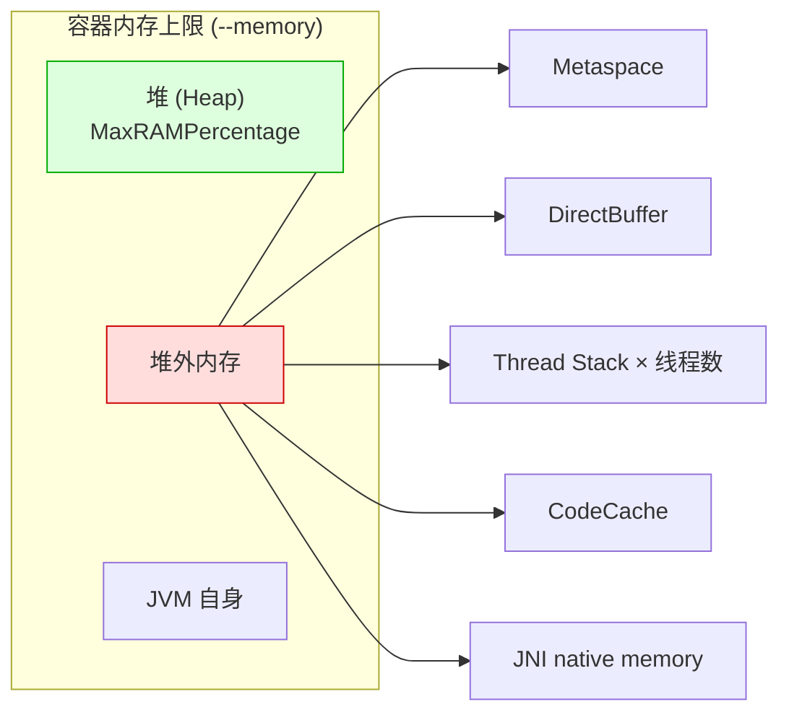
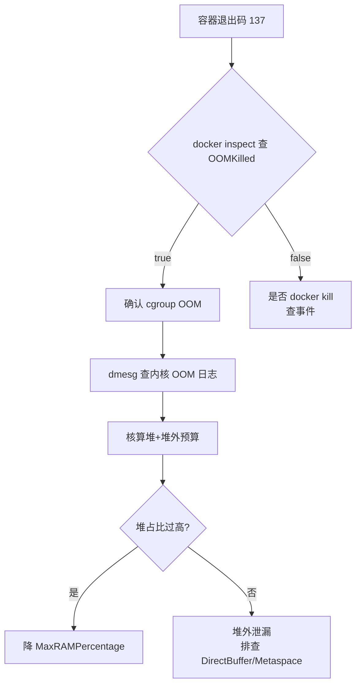
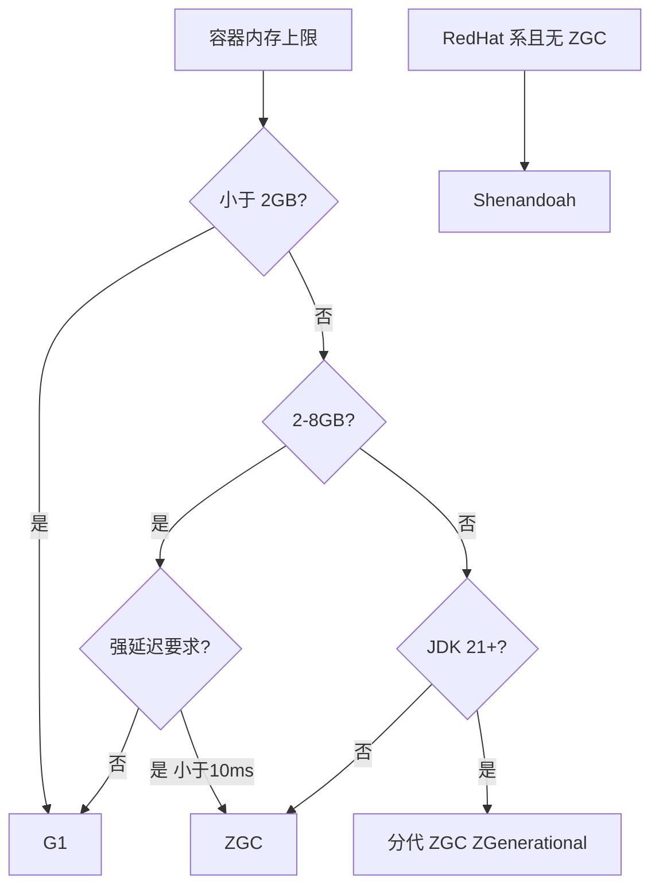
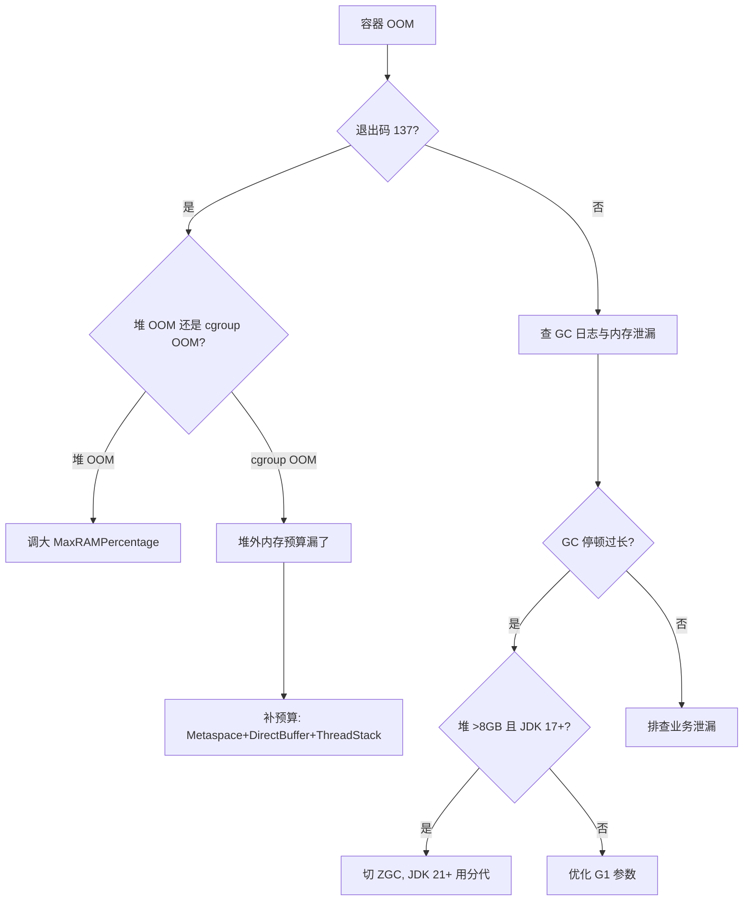

# Java 容器调优

> **一句话定位**：JVM 诞生于独占物理机时代，容器感知与堆外内存预算是 Java 后端面试的高级区分题。
> **面试热度**：⭐⭐⭐⭐⭐
> **返回**：[Docker 知识图谱](../README.md)

---

## 一、概念定义

### 1.1 JVM 容器化的核心矛盾

JVM 诞生于"独占物理机"时代，其内存模型（堆、Metaspace、线程栈、CodeCache 等）默认按**宿主机物理资源**估算——早期 JVM 启动时读取 `/proc/meminfo` 与 `/proc/cpuinfo`，把宿主总内存与总 CPU 数当作可用资源。但在容器化部署后，容器的资源被 cgroup 限制（`memory.limit_in_bytes`、`cpu.cfs_quota_us`），老版本 JVM 感知不到 cgroup 边界，仍按宿主物理资源估算，导致两类严重问题：

- **堆超限 → OOM Killed**：宿主 64GB，容器限 2GB，老版本 JVM 按宿主 1/4 默认堆算出 16GB 堆，远超容器上限，JVM 还没等堆用满就被内核 OOM Killer 杀（退出码 137）。
- **CPU 浪费或线程数不匹配**：宿主 32 核，容器限 2 核，老版本 JVM `Runtime.availableProcessors()` 返回 32，Tomcat/ForkJoinPool/CompletableFuture 按 32 并行度配线程，导致上下文切换开销与 cgroup 限流后的抖动。

这是 Java 容器化最根本的矛盾：**JVM 的资源感知模型与容器的资源限制模型不匹配**。解决这个矛盾的两条主线是「JVM 容器感知」（让 JVM 读 cgroup）与「堆外内存预算」（让运维者意识到堆 ≠ 容器内存）。

### 1.2 演进时间线

JVM 对容器感知的演进是一部"补课史"，理解时间线能解释为何生产环境必须锁 JDK 版本：

| 时间点 | JDK 版本 | 关键变更 | 备注 |
|--------|---------|---------|------|
| 2017 | JDK 8u131 | 引入 `-XX:+UseCGroupLimits`（默认关） | 首次支持读 cgroup v1 memory limit，需手动开 |
| 2018 | JDK 8u191 | `UseContainerSupport` 默认开启 | **里程碑**：回移 JDK 10 的容器支持，8u191+ 默认感知 |
| 2018 | JDK 10 | 正式支持容器感知 | `UseContainerSupport` 首次引入 |
| 2018 | JDK 11 | 支持 cgroup v2 | LTS，容器化首选最低版本 |
| 2021 | JDK 16 | ZGC 转正（Production） | 之前为实验特性 |
| 2023 | JDK 21 | 分代 ZGC（JEP 439） | LTS，分代回收降低吞吐损失 |

**生产底线**：8u191 之前不支持容器感知（需手动配 `-XX:+UseCGroupLimits` 且仅支持 v1），8u191～8u372 感知部分场景但 cgroup v2 支持不完整，**生产推荐 JDK 17 LTS 或 JDK 21 LTS**（完整 cgroup v2 + ZGC + 分代 ZGC）。

### 1.3 两类问题

容器内 JVM 的调优问题可归结为两类，对应不同的诊断路径：

| 类别 | 现象 | 根因 | 诊断路径 |
|------|------|------|---------|
| **内存类** | 进程被杀（退出码 137），JVM 自身无 OOM 异常 | 堆 + 堆外总和超容器 cgroup 限制，触发内核 OOM Killer | `docker inspect` → `dmesg` → 堆/堆外预算核算 |
| **CPU 类** | 线程数异常、并行度抖动、cgroup 限流后延迟尖刺 | `availableProcessors()` 老版本读宿主 CPU，线程池按宿主核数配 | `Runtime.availableProcessors()` 实测 → 按容器限制重新配池 |

内存类问题最常见也最致命（直接杀进程），CPU 类问题更隐蔽（性能劣化但不崩溃）。

### 1.4 本章与 Task 4 的边界

[容器运行时与生命周期](../03-container/container-runtime.md)（Task 4）讲的是「容器机制与现象」——PID 1 与信号、重启策略、cgroup v1/v2 的机制、OOM Killer 的内核行为；本章讲的是「JVM 感知原理与调优方法论」——JVM 如何读 cgroup、堆外预算公式、GC 选型在容器内的变化。

一句话区分：**Task 4 回答"容器为什么会 OOM Killed"，本章回答"JVM 在容器里怎么配才不会被杀"**。两者互补，Task 4 是机制底座，本章是应用层方法论。

---

## 二、原理与流程

### 2.1 JVM 容器内存感知全链路（深度重点）

#### 2.1.1 UseContainerSupport 源码路径

JDK 8u191+ 与 JDK 10+ 的容器感知由 `UseContainerSupport` 总开关控制（默认开启）。在 HotSpot 源码中，相关逻辑位于 `src/hotspot/os/linux/` 下：

- **入口**：`os::Linux::container` —— JVM 启动时构造 `CgroupSubsystem` 单例，探测 cgroup v2 与 v1。
- **探测顺序**：优先 cgroup v2（`/sys/fs/cgroup/` 统一层级），再回退 cgroup v1（`/sys/fs/cgroup/memory/memory.limit_in_bytes`、`/sys/fs/cgroup/cpu/cpu.cfs_quota_us`）。
- **生效路径**：`os::active_processor_count()`、`Globals::limit_by_cgroup()` 在初始化堆与并行度时调用 container 探测结果。

> **关联 `java-core/jvm` 模块**：该模块目前聚焦类加载（`com.yintp.jvm.classload.ClassLoadTest`）与类初始化（`com.yintp.jvm.classinit.ClassInitTest1~9`），未覆盖 GC 与 container 源码实例——本章在文档层引用 HotSpot 上游源码路径（`os::Linux::container`），作为面试时引用源码出处的口径，不依赖仓库内 Java 文件。

#### 2.1.2 关键参数矩阵表

容器感知的可用参数矩阵（面试高频）：

| 参数 | 作用 | 默认值 | 注意事项 |
|------|------|--------|---------|
| `-XX:+UseContainerSupport` | 总开关 | true（8u191+） | 一般无需关 |
| `-XX:MaxRAMPercentage=75.0` | 堆占总内存百分比 | 25%（老）/ 自定义 | 替代 -Xms/-Xmx 固定值 |
| `-XX:InitialRAMPercentage` | 初始堆占比 | 同上 | 建议等于 Max |
| `-XX:MinRAMPercentage` | 小容器（<250MB）特殊处理 | 50 | 小内存容器注意 |
| `-Xmx` | 固定堆上限 | - | 与 MaxRAMPercentage 二选一 |

**关键认知**：

1. `MaxRAMPercentage` 与 `-Xmx` 二选一——容器内**优先用 `MaxRAMPercentage`**，因为它随容器 `--memory` 自动伸缩，一次构建多环境复用。
2. `MinRAMPercentage` 是为小容器（<250MB）设计的兜底——小容器若按 `MaxRAMPercentage=75%` 算，堆太小不足以加载 Spring 上下文，故小容器走 `MinRAMPercentage=50%`（更大占比）。
3. `InitialRAMPercentage` 建议等于 `MaxRAMPercentage`——避免堆从初始值扩展到最大值时的多次 Full GC 与停顿。

#### 2.1.3 堆外内存陷阱

**核心陷阱**：堆外内存（DirectBuffer / Metaspace / Thread Stack / JNI）不计入堆，堆设 100% 仍会 OOM Killed。



红色块（堆外）是常被忽视的预算项——堆设 75%，剩余 25% 要装下 Metaspace + DirectBuffer + Thread Stack × 线程数 + CodeCache + JVM 自身，往往不够，触发 OOM Killed。

#### 2.1.4 内存预算公式

堆内 + 堆外 + JVM 自身的内存预算公式：

```
容器内存 > 堆 + Metaspace + DirectBuffer + ThreadStack × 线程数 + CodeCache + JVM 自身
```

各项典型量级（Spring Boot 应用，容器 1GB）：

| 项 | 典型值（1GB 容器） | 备注 |
|----|---------------------|------|
| 堆 | 600MB（MaxRAMPercentage=60%） | 留 40% 给堆外 |
| Metaspace | 80～150MB | Spring 上下文类多，建议 `-XX:MetaspaceSize=128m -XX:MaxMetaspaceSize=256m` |
| DirectBuffer | 30～100MB | Netty/ WebClient / NIO 应用偏大 |
| Thread Stack × 线程数 | 1MB × 200 = 200MB | Tomcat 默认 200 线程，`-Xss` 默认 1MB |
| CodeCache | 150～240MB | JIT 编译产物，`-XX:ReservedCodeCacheSize=256m` |
| JVM 自身 | 50～100MB | GC 数据结构、Arena 等 |

**结论**：堆不能设 100%——留 25%～40% 给堆外是经验值。`MaxRAMPercentage=75` 是常用起点，小容器（<2GB）建议 `MaxRAMPercentage=60` 留更多堆外预算。

### 2.2 JVM 容器 CPU 感知

#### 2.2.1 availableProcessors 与 cgroup 的关系

`Runtime.availableProcessors()` 返回 JVM 感知的 CPU 数，影响几乎所有并行度：

| 并行度来源 | 依赖 | 容器内陷阱 |
|------------|------|-----------|
| Tomcat `maxThreads` | 默认 200，但 `acceptorCount`/`selectorCount` 按 CPU | 老版本按宿主 CPU 配 acceptor，浪费 |
| ForkJoinPool | `Runtime.availableProcessors()` | parallelStream 并行度异常 |
| CompletableFuture | 默认 ForkJoinPool | 同上 |
| Spring Task Scheduler | 默认 CPU 数 | 调度线程数异常 |
| G1 并行线程数 | JVM 按 CPU 数配 GC 线程 | 容器内 GC 线程过多，与业务争抢 |

#### 2.2.2 cgroup CPU 限制与 JDK 感知版本

| cgroup 版本 | 限制文件 | 计算公式 | JDK 感知版本 |
|-------------|---------|---------|-------------|
| v1 | `cpu.cfs_quota_us` + `cpu.cfs_period_us` | `quota / period` = 可用核数 | JDK 10+ 正确，8u191+ 部分感知 |
| v2 | `cpu.max` | 同上（格式 `quota period`） | JDK 11+（部分）、JDK 14+ 完整 |

**陷阱**：8u191 之前 `availableProcessors()` 读 `/proc/cpuinfo`（宿主），容器内返回宿主 CPU 数。8u191+ 读 cgroup v1，但 cgroup v2 支持需 JDK 14+。**生产底线**：CPU 敏感应用用 JDK 17+。

#### 2.2.3 显式覆盖可用 CPU

不依赖 JVM 自动感知时，可显式覆盖：

```bash
# JVM 参数覆盖（JDK 10+）
java -XX:ActiveProcessorCount=2 -jar app.jar

# 容器限制（cgroup v1 语义，Docker 内部转译）
docker run --cpus=2 myapp:1.0
```

`-XX:ActiveProcessorCount=N` 是最可靠的覆盖方式——它绕过 cgroup 探测，直接告诉 JVM "你有 N 个 CPU"，Tomcat/ForkJoinPool/GC 线程数都按 N 配。**生产推荐**：显式设 `ActiveProcessorCount`，避免依赖 cgroup 探测的版本差异。

### 2.3 OOM Killed 与 GC 诊断

#### 2.3.1 容器内 OOM 的两种类型

容器内"OOM"是一个易混淆词，需明确区分：

| 类型 | 触发者 | 触发位置 | 现象 | 退出码 |
|------|--------|---------|------|--------|
| **JVM 堆 OOM** | JVM 自身 | 堆内 | 抛 `OutOfMemoryError`，JVM 正常退出（除非 hook） | 1（或自定义） |
| **容器 cgroup OOM** | Linux 内核 | 容器内存超 cgroup 限制 | 内核 OOM Killer 直接 `SIGKILL` 进程，JVM 无机会反应 | 137 |

**137 = 128 + SIGKILL(9)**——内核 OOM Killer 或 `docker kill` 都会发出 SIGKILL，进程无法捕获或处理，JVM 的 ShutdownHook 也不会执行。这是诊断容器 OOM 的第一信号。

#### 2.3.2 排查链路

容器内 OOM Killed 的标准排查链路：



**命令清单**：

```bash
# 1. 确认是否 OOM Killed
docker inspect <container> --format '{{.State.OOMKilled}} {{.State.ExitCode}}'

# 2. 查内核 OOM 日志（宿主执行）
dmesg -T | grep -i "out of memory\|killed process"

# 3. 查容器事件（是否 docker kill）
docker events --filter container=<container> --since 30m

# 4. JVM 堆 dump（若 HeapDumpOnOutOfMemoryError 已配）
ls -lh /tmp/heapdump.hprof
```

#### 2.3.3 GC 日志配置

容器内 GC 日志必须配轮转，避免打满磁盘：

```bash
# JDK 9+ 统一日志（Xlog）
-Xlog:gc*=info:file=/tmp/gc.log:time,level,tags:filecount=5,filesize=10m

# 关键项：filecount=5（保留 5 个轮转文件）、filesize=10m（单文件 10MB）
# 落 /tmp 便于配合 tmpfs 与 docker logs 收集
```

JDK 8 与 JDK 9+ 的 GC 日志参数不同：

| JDK | 参数 | 备注 |
|-----|------|------|
| 8 | `-XX:+PrintGCDetails -Xloggc:/tmp/gc.log -XX:+UseGCLogFileRotation -XX:NumberOfGCLogFiles=5 -XX:GCLogFileSize=10M` | 老式 |
| 9+ | `-Xlog:gc*=info:file=/tmp/gc.log:time,level,tags:filecount=5,filesize=10m` | 统一日志 |

### 2.4 启动优化与分层镜像

#### 2.4.1 Spring Boot Layertools

**原理**：Spring Boot fat jar 实际是「外层启动器 + 内嵌 zip of jars」，传统 Dockerfile 把整个 jar 作为一层 COPY 进镜像，改一行业务代码就要重传所有依赖。Layertools 把 fat jar 解包为四层，按变更频率分层：

| 层 | 内容 | 变更频率 |
|----|------|---------|
| `dependencies/` | 第三方依赖 jar | 极低（升级版本才变） |
| `spring-boot-loader/` | Spring Boot 启动器 | 极低（Spring Boot 升级才变） |
| `snapshot-dependencies/` | SNAPSHOT 依赖 | 中（开发期常变） |
| `application/` | 业务 classes 与资源 | 高（每次改代码） |

**价值**：依赖层不变 → Docker 缓存命中 → 只重传 application 层（几 MB），构建从分钟级降到秒级，推送也从 GB 级降到 MB 级。

**与多阶段构建配合**：

```dockerfile
# 第一阶段：解包 fat jar 为四层
FROM eclipse-temurin:17-jdk-jammy AS builder
WORKDIR /app
COPY target/*.jar app.jar
RUN java -Djarmode=layertools -jar app.jar extract

# 第二阶段：按层 COPY（依赖层在前，业务层在后，最大化缓存命中）
FROM eclipse-temurin:17-jre-jammy
WORKDIR /app
COPY --from=builder dependencies/ ./
COPY --from=builder spring-boot-loader/ ./
COPY --from=builder snapshot-dependencies/ ./
COPY --from=builder application/ ./
ENTRYPOINT ["java", "org.springframework.boot.loader.launch.JarLauncher"]
```

**与 CDS 配合**：CDS（Class Data Sharing）把类加载解析结果归档为共享存档，启动时直接映射，跳过解析。Layertools 分层让 CDS 归档可单独构建（依赖层归档一次，业务层频繁重打不影响）。

#### 2.4.2 Jib（Google 出品）

**原理**：Jib 是 Maven/Gradle 插件，**无需 Dockerfile、无需 Docker daemon**，直接构造分层镜像并推送到 Registry。它把 Java 应用自动分为：依赖层、资源层、应用层、静态层。

**优势**：

- **无 Docker-in-Docker**：CI 环境无需挂 `docker.sock` 或开 DinD，安全性与便利性双赢。
- **自动分层**：插件内部按依赖/资源/应用分层，无需手写 Dockerfile。
- **可重复构建**：相同输入产相同镜像（内容寻址），便于审计。

**与 Layertools 对比**：

| 维度 | Layertools | Jib |
|------|-----------|-----|
| 出品 | Spring Boot 官方 | Google |
| 依赖 | 需 Dockerfile + docker build | 无需 Dockerfile/daemon |
| 分层 | 四层（dependencies/loader/snapshot/app） | 五层（deps/resources/classes/static/extra） |
| 集成 | Spring Boot 内置 | Maven/Gradle 插件 |
| 灵活性 | 高（Dockerfile 可定制） | 中（插件配置为主） |
| CI 友好 | 需 docker build | 最佳（无 daemon） |
| 适用 | Spring Boot 应用 | 任意 Java 应用 |

**选型**：Spring Boot 应用且需精细控制 Dockerfile → Layertools；多框架混合或 CI 禁 Docker → Jib。

#### 2.4.3 启动加速全景表

容器启动优化的各方案对比：

| 方案 | 原理 | 启动加速 | 镜像构建影响 | 兼容性陷阱 |
|------|------|---------|-------------|-----------|
| **分层镜像** | 依赖层不变，缓存命中 | 间接（推送快） | 构建秒级 | 无 |
| **Layertools** | fat jar 解包四层 | 间接（推送快） | 构建秒级 | 仅 Spring Boot |
| **Jib** | 插件自动分层 | 间接（推送快） | 构建秒级 | 兼容性广 |
| **CDS/AppCDS** | 类加载归档共享 | 10%～30% | 需训练步骤 | 类地址需稳定 |
| **GraalVM Native Image** | AOT 编译为原生二进制 | 10～100 倍 | 构建分钟级，镜像小 | 反射/动态代理需配置 |
| **CRaC（Coordinated Restore at Checkpoint）** | JVM 快照恢复 | 10～100 倍 | 需 CRaC 兼容 JDK | 检查点需持久化卷 |

**关键认知**：

- **分层镜像/Layertools/Jib** 解决的是「镜像构建与分发速度」，不直接加速 JVM 启动，但通过减少镜像拉取时间间接缩短容器冷启动。
- **CDS/AppCDS** 解决「类加载阶段」耗时，对 Spring Boot 重上下文应用有效。
- **GraalVM Native Image** 是「彻底换运行时」——把 JIT/AOT 推到构建期，启动毫秒级但牺牲峰值吞吐与动态性（反射、动态代理、运行时字节码生成需配置）。
- **CRaC** 是「JVM 快照」——运行期打检查点，恢复时跳过初始化，适合 Serverless 冷启动。需 CRaC 兼容 JDK（如 Azul Zulu CRaC）。

> **关联**：[镜像构建与分发](../02-image/dockerfile-and-image.md) §2.4 多阶段构建——Layertools 是多阶段构建在 Spring Boot 场景的精细化演进，把"builder 编译 + runtime 复制产物"细化为"四层按变更频率分层"。

### 2.5 GC 选型在容器化场景的变化（深度重点）

#### 2.5.1 JDK 默认 GC 演进

| JDK | 默认 GC | 备注 |
|-----|--------|------|
| 7/8 | ParallelGC | 吞吐优先，停顿大 |
| 9～末 | G1 | 平衡吞吐与停顿，JDK 9 默认 |
| 15+ | ZGC 转正（JDK 11 实验，16 转正） | 亚毫秒级停顿 |
| 21 | 分代 ZGC（JEP 439） | 分代回收，吞吐损失大幅降低 |

**容器化的特殊性**：容器内存上限固定且小（常见 1～4GB），GC 选型需考虑「停顿 vs 吞吐 vs 堆外预算」三维权衡。

#### 2.5.2 容器内 GC 选型对比表

| GC | 引入版本 | 停顿目标 | 容器内存上限 | 适用场景 | 容器化陷阱 |
|----|---------|---------|-------------|---------|-----------|
| **Serial** | JDK 1 | 数百 ms | <100MB | 单核、小嵌入式 | 容器内单核场景仍可用 |
| **Parallel** | JDK 1 | 数百 ms | 任意 | 批处理、吞吐优先 | 容器内停顿尖刺，不推荐交互场景 |
| **G1** | JDK 7（9 默认） | 100～200ms | 2GB+ | 通用 Web 应用 | 小堆（<2GB）开销相对高 |
| **ZGC** | JDK 11（16 转正） | <10ms（21 分代后 <1ms） | 8GB+ | 大堆、低延迟、内存敏感 | 小堆无收益、堆外预算多 |
| **Shenandoah** | JDK 12（RedHat） | <10ms | 8GB+ | 同 ZGC，RedHat 系 | 非 OpenJDK 主线，发行版差异 |

#### 2.5.3 ZGC 在容器内的深度要点

**1. 核心机制**

- **染色指针（Colored Pointer）**：ZGC 在 64 位指针的高 4 位编码对象状态（Marked0/Marked1/Remapped/Finalizable），GC 通过指针颜色判断对象是否需重定位。代价：指针可用地址空间减少，需 multi-mapping 映射多份视图。
- **读屏障（Load Barrier）**：每次对象引用读取时，JVM 插入屏障检查指针颜色，若颜色异常则修正（重定位）。代价：5%～10% 吞吐损失（JDK 21 分代后降低）。
- **整理阶段并发**：标记、转移、重定位全程并发，不 Stop-The-World（仅几个初始/结束的同步点 <1ms），故停顿亚毫秒级。

**2. 容器化的三个陷阱**

| 陷阱 | 量化 | 缓解 |
|------|------|------|
| **堆外内存预算（multi-mapping）** | 约堆的 1/64（染色指针需多视图映射） | 容器内存上限 = 堆 × 1.015 + 堆外其他项，留 2%～5% 余量 |
| **CPU 开销（读屏障）** | 5%～10% 吞吐损失（JDK 21 前） | 分代 ZGC（JDK 21+）降低至 2%～3% |
| **小堆无收益** | <2GB 时 G1 与 ZGC 停顿差异不显著，但 ZGC 堆外开销占比更高 | 堆 <2GB 用 G1，>8GB 用 ZGC |

**3. 容器内启用与参数**

```bash
# JDK 17：启用 ZGC + 染色指针
-XX:+UseZGC -XX:+ZGenerational  # JDK 21+ 分代模式

# 关键参数
-XX:ZUncommitDelay=300         # 未提交内存回收延迟（秒），生产设 300
-XX:SoftMaxHeapSize=4g         # 软上限，ZGC 优先不超此值，压力下可到 MaxRAMPercentage
-XX:ConcGCThreads=2            # 并发 GC 线程数，容器内建议 ≤ 容器核数
-XX:ParallelGCThreads=2       # STW 阶段线程数，同上
```

**4. 选型决策树**



**5. 关联 java-core/jvm**

> **关联 `java-core/jvm` 模块**：染色指针与读屏障源码位于 HotSpot `src/hotspot/gc/z/`，分代 ZGC 由 [JEP 439](https://openjdk.org/jeps/439) 引入（JDK 21）。该模块目前聚焦类加载，未覆盖 GC 源码实例——本章在文档层引用上游 JEP 与 HotSpot 源码路径作为面试口径，运维侧关注 GC 日志监控（`-Xlog:gc*=info`）与堆外预算核算。

#### 2.5.4 与其他调优手段的衔接

ZGC 与 Layertools/CDS/GraalVM 解决的问题正交，互补不冲突：

| 优化阶段 | 方案 | 解决问题 |
|---------|------|---------|
| 构建期 | Layertools/Jib/分层镜像 | 镜像构建与分发速度 |
| 启动期 | CDS/AppCDS/GraalVM/CRaC | JVM 与类加载启动耗时 |
| 运行期 | ZGC/G1 选型 | GC 停顿与吞吐 |

**一句话**：构建期优化镜像、启动期优化冷启动、运行期优化 GC——三者覆盖容器全生命周期，可叠加。

---

## 三、高频追问与面试题

### Q1：容器内 JVM 堆怎么配？

**参考答案**：用 `MaxRAMPercentage` 而非固定 `-Xmx`。

```bash
java -XX:MaxRAMPercentage=75.0 -XX:InitialRAMPercentage=75.0 -jar app.jar
```

**原因**：`MaxRAMPercentage` 随容器 `--memory` 自动伸缩，一次构建多环境复用（开发 512MB、生产 4GB 用同一镜像）。`-Xmx` 固定值需每个环境单独构建镜像，违背"一次构建到处运行"。

**初始等于最大**：`InitialRAMPercentage=75` 等于 `MaxRAMPercentage=75`，避免堆扩展时的多次 Full GC。

**小容器注意**：容器 <250MB 时走 `MinRAMPercentage=50`（更大占比），因为小容器堆太小不足以加载 Spring 上下文。

### Q2：为什么配了 -Xmx 容器还是 OOM Killed？

**参考答案**：堆外内存预算漏了。

容器内存上限由 cgroup 限制，包含堆 + Metaspace + DirectBuffer + Thread Stack × 线程数 + CodeCache + JVM 自身。即使 `-Xmx=1g` 设了堆上限，若容器 `--memory=1g` 也设为 1GB，剩余的 Metaspace + DirectBuffer + 线程栈等堆外内存无处安放，触发内核 OOM Killer。

**预算公式**：

```
容器内存 > 堆 + Metaspace + DirectBuffer + ThreadStack × 线程数 + CodeCache + JVM 自身
```

**修复**：降 `MaxRAMPercentage` 到 60%～70%，留 30%～40% 给堆外；或显式限制堆外项（`-XX:MaxMetaspaceSize=256m`、`-Djdk.nio.maxCachedBufferSize=262144` 限制 DirectBuffer）。

### Q3：availableProcessors() 在容器里返回的是几？

**参考答案**：取决于 JDK 版本与 cgroup 版本。

| JDK 版本 | cgroup v1 | cgroup v2 |
|---------|-----------|-----------|
| 8u191 前 | 读宿主 CPU（不感知） | 不支持 |
| 8u191+ | 感知（部分场景不准） | 不支持 |
| 11+ | 感知 | 部分感知 |
| 14+ | 感知 | 完整感知 |
| 17+ | 完整感知 | 完整感知 |

**陷阱**：8u191 前读 `/proc/cpuinfo`（宿主），容器内返回宿主 CPU 数，Tomcat 按宿主核数配 acceptor 线程，浪费。

**最佳实践**：显式 `-XX:ActiveProcessorCount=N` 覆盖，绕过 cgroup 探测的版本差异。

### Q4：Tomcat 线程数在容器里怎么配？

**参考答案**：按容器 cgroup 限制，别按宿主 CPU。

Spring Boot 内嵌 Tomcat 默认 `server.tomcat.threads.max=200`，但 `acceptorCount`/`selectorCount` 按 `availableProcessors()` 配。老版本 JVM 读宿主 CPU，导致容器内 acceptor 线程数远超实际 CPU 配额，上下文切换开销大。

**配置**：

```yaml
server:
  tomcat:
    threads:
      max: 200          # 业务线程数，按 QPS 配，不按 CPU
      min-spare: 10     # 最小空闲
    accept-count: 100   # 接收队列
    max-connections: 8192
```

**JVM 侧**：`-XX:ActiveProcessorCount=N` 显式覆盖，让 acceptor/selector 按容器 CPU 配。

### Q5：容器退出码 137 是什么？

**参考答案**：OOM Killed 或 docker kill。

退出码 137 = 128 + 9（SIGKILL 信号编号）。容器进程被 `SIGKILL`，无法捕获或处理。两个来源：

1. **内核 OOM Killer**：容器内存超 cgroup 限制，内核直接杀进程。
2. **docker kill**：人为或编排系统（K8s）发出 kill 信号。

**区分**：

```bash
docker inspect <container> --format '{{.State.OOMKilled}}'
# true = 内核 OOM；false = docker kill
```

**后果**：JVM 的 ShutdownHook 不会执行——`SIGKILL` 无法捕获，应用没机会做优雅关闭。这是为什么容器内 Java 应用要配 `server.shutdown=graceful` 并依赖 SIGTERM（信号 15）优雅关闭，而非等 SIGKILL。

### Q6：Spring Boot 启动慢，镜像构建慢，怎么优化？

**参考答案**：分层 + Layertools + CDS 三件套。

**镜像构建慢**：用 Layertools 把 fat jar 解包为四层，依赖层不变 → Docker 缓存命中 → 只重传 application 层（几 MB），构建从分钟级到秒级。

**JVM 启动慢**：CDS（Class Data Sharing）把类加载解析归档，启动时直接映射，跳过解析。Spring Boot 重上下文应用可省 10%～30% 启动时间。

**完整方案**：

```dockerfile
# 1. Layertools 分层（构建快）
FROM eclipse-temurin:17-jdk-jammy AS builder
COPY target/*.jar app.jar
RUN java -Djarmode=layertools -jar app.jar extract

# 2. CDS 归档（启动快）
RUN java -XX:ArchiveClassesAtExit=app.jar -jar app.jar || true

# 3. runtime 阶段按层 COPY + CDS 启用
FROM eclipse-temurin:17-jre-jammy
COPY --from=builder dependencies/ ./
COPY --from=builder application/ ./
ENTRYPOINT ["java", "-XX:SharedArchiveFile=app.jsa", "org.springframework.boot.loader.launch.JarLauncher"]
```

### Q7：Jib 和 Dockerfile 构建有什么区别？

**参考答案**：无 daemon、自动分层、CI 友好。

| 维度 | Dockerfile | Jib |
|------|-----------|-----|
| daemon 依赖 | 需 docker daemon | 无需 |
| Dockerfile | 必需 | 不需要 |
| 分层 | 手写 COPY 指令 | 自动分层 |
| CI 集成 | 需 DinD 或挂 docker.sock | 直接 mvn compile jib:build |
| 灵活性 | 高 | 中 |
| 安全 | 低（docker.sock 风险） | 高 |

**Jib 典型配置**（pom.xml）：

```xml
<plugin>
  <groupId>com.google.cloud.tools</groupId>
  <artifactId>jib-maven-plugin</artifactId>
  <version>3.4.0</version>
  <configuration>
    <from><image>eclipse-temurin:17-jre-jammy</image></from>
    <to><image>registry.example.com/myapp:${project.version}</image></to>
    <container>
      <jvmFlags>
        <jvmFlag>-XX:MaxRAMPercentage=75.0</jvmFlag>
      </jvmFlags>
      <mainClass>com.yintp.Application</mainClass>
    </container>
  </configuration>
</plugin>
```

### Q8：GraalVM Native Image 能替代 JVM 容器吗？

**参考答案**：不能完全替代，AOT 优势与兼容性陷阱并存。

**优势**：

- 启动毫秒级（10～100 倍提升）
- 镜像小（10～50MB vs 200MB+）
- 内存占用低（无 JIT 开销）

**陷阱**：

- **反射**：需 `reflect-config.json` 显式声明，否则运行时 NPE。
- **动态代理**：CGLIB/ByteBuddy 运行时生成字节码失效，需替代为 JDK 动态代理或编译期生成。
- **运行时字节码生成**：Spring CGLIB、MyBatis、Mockito 等需额外配置或不可用。
- **峰值吞吐**：无 JIT，长期运行吞吐低于 JIT JVM。

**权衡**：Serverless 冷启动敏感 → Native Image；长期运行 Web 服务 → JVM + ZGC。Spring Boot 3.x 已支持 GraalVM Native（AOT 编译期替代反射），但生态兼容性仍在完善。

### Q9：cgroup v2 和 v1 对 JVM 的影响？

**参考答案**：8u131 之前都不支持，8u191+ 支持 v1，JDK 14+ 完整支持 v2。

| cgroup 版本 | 文件结构 | JDK 感知 |
|-------------|---------|---------|
| v1 | 多层级（memory/cpu/blkio 各一） | 8u191+ 感知，JDK 10+ 正确 |
| v2 | 统一层级（/sys/fs/cgroup/） | JDK 14+ 完整感知，JDK 11 部分感知 |

**生产影响**：现代 Linux（Ubuntu 21.10+、RHEL 9+）默认 cgroup v2。若用 JDK 8u191～8u372，JVM 可能感知不到 v2 限制，按宿主资源算 → OOM Killed。

**修复**：升级到 JDK 17+ 或显式 `-XX:ActiveProcessorCount=N` + `-XX:MaxRAMPercentage` 覆盖。

### Q10：ZGC 在容器内怎么选？

**参考答案**：小堆用 G1，大堆用 ZGC，JDK 21+ 用分代 ZGC。

决策三问：

1. **堆多大？** <2GB 用 G1（ZGC 堆外开销占比过高）；>8GB 用 ZGC（停顿优势显现）。
2. **延迟要求？** 强延迟（<10ms）用 ZGC；一般延迟（100～200ms）G1 足够。
3. **JDK 版本？** JDK 21+ 用分代 ZGC（`ZGenerational`，吞吐损失从 5%～10% 降到 2%～3%）；JDK 17 用非分代 ZGC；RedHat 系无 ZGC 用 Shenandoah。

**关键参数**：

```bash
-XX:+UseZGC -XX:+ZGenerational  # JDK 21+ 分代
-XX:ZUncommitDelay=300          # 未提交回收延迟
-XX:ConcGCThreads=2             # 并发 GC 线程 ≤ 容器核数
```

### Q11：ZGC 的染色指针为什么需要额外内存？

**参考答案**：multi-mapping 堆外元数据。

ZGC 在 64 位指针的高 4 位编码对象状态（Marked0/Marked1/Remapped/Finalizable），GC 通过颜色判断对象是否需重定位。不同颜色对应不同视图，需 multi-mapping 把同一物理内存映射到多个虚拟地址视图，每个视图对应一种颜色状态。

**代价**：multi-mapping 的页表项、虚拟地址空间预留约堆的 1/64。容器内需在堆预算外多留 2%～5% 给 ZGC 元数据。

**预算公式**（ZGC 容器）：

```
容器内存 > 堆 × 1.015 + Metaspace + DirectBuffer + ThreadStack × 线程数 + CodeCache + JVM 自身
```

### Q12：容器内 GC 日志怎么配？

**参考答案**：配轮转，落 /tmp，配 tmpfs 收集。

```bash
# JDK 9+ 统一日志
-Xlog:gc*=info:file=/tmp/gc.log:time,level,tags:filecount=5,filesize=10m

# 关键项
# gc*=info —— 所有 gc 标签 info 级别
# file=/tmp/gc.log —— 落 tmpfs
# filecount=5 —— 轮转 5 个文件
# filesize=10m —— 单文件 10MB
```

**JDK 8 老式**：

```bash
-XX:+PrintGCDetails -Xloggc:/tmp/gc.log \
-XX:+UseGCLogFileRotation -XX:NumberOfGCLogFiles=5 -XX:GCLogFileSize=10M
```

**配合**：`--tmpfs /tmp:rw,size=64m` 挂载 tmpfs，GC 日志落内存，避免磁盘 IO 与只读根文件系统冲突。

---

## 四、实战关联（Java 后端视角）

### 4.1 生产 Dockerfile 标准模板

Spring Boot + Layertools + 非 root + 健康检查的完整生产 Dockerfile：

```dockerfile
FROM eclipse-temurin:17-jre-jammy
WORKDIR /app
COPY --from=builder layers/dependencies/ ./
COPY --from=builder layers/spring-boot-loader/ ./
COPY --from=builder layers/snapshot-dependencies/ ./
COPY --from=builder layers/application/ ./
USER 1000:1000
ENTRYPOINT ["java", \
  "-XX:MaxRAMPercentage=75.0", \
  "-XX:+HeapDumpOnOutOfMemoryError", \
  "-XX:HeapDumpPath=/tmp/heapdump.hprof", \
  "-Xlog:gc*=info:file=/tmp/gc.log:time,level,tags:filecount=5,filesize=10m", \
  "org.springframework.boot.loader.launch.JarLauncher"]
```

**关键点注释**：

- **`MaxRAMPercentage=75.0`**：替代固定 `-Xmx`，随容器 `--memory` 自动伸缩，留 25% 给堆外。
- **`HeapDumpOnOutOfMemoryError` + `HeapDumpPath=/tmp/heapdump.hprof`**：堆 OOM 时自动 dump，落 `/tmp` 便于配合 tmpfs 与 `docker cp` 取出。
- **`-Xlog:gc*...filecount=5,filesize=10m`**：GC 日志轮转，避免打满磁盘，落 `/tmp`。
- **`USER 1000:1000`**：非 root 运行，即使容器内进程被攻破也不是 root（关联 [Docker 安全模型](../07-security/docker-security.md) §2.4 userns-remap）。
- **`JarLauncher`**（`org.springframework.boot.loader.launch.JarLauncher`）：Spring Boot 3.x 的启动器路径，Spring Boot 2.x 是 `org.springframework.boot.loader.JarLauncher`（包路径多了 `.launch`）。

### 4.2 关联 java-core/jvm

> **关联 `java-core/jvm` 模块**：

- **堆外内存预算与 JVM 内存模型**：JVM 内存分堆（Heap）与堆外（Metaspace/DirectBuffer/Thread Stack/CodeCache/JNI），容器内存上限需覆盖堆 + 堆外 + JVM 自身。该模块聚焦类加载（`com.yintp.jvm.classload.ClassLoadTest`、`com.yintp.jvm.classinit.ClassInitTest1~9`），本章在上游 HotSpot 内存模型层引用源码路径（`os::Linux::container`、`src/hotspot/gc/z/`）作为面试口径。
- **GC 选型在容器化场景的变化**：JDK 8 ParallelGC → JDK 9+ G1 → JDK 16+ ZGC 转正 → JDK 21+ 分代 ZGC（JEP 439）。容器内选型决策见 §2.5.2 对比表。
- **`-XX:+UseContainerSupport` 源码路径与探测逻辑**：JVM 启动时构造 `CgroupSubsystem` 单例，探测 cgroup v2 → v1，影响 `os::active_processor_count()` 与堆初始化。8u191+ 默认开启，生产无需关。

### 4.3 关联 framework/spring-framework

> **关联 `framework/spring-framework` 模块**：

- **Spring Boot 3.x 的 JarLauncher 与 2.x 的 JarLauncher 路径变化**：Spring Boot 3.x（`org.springframework.boot.loader.launch.JarLauncher`）相比 2.x（`org.springframework.boot.loader.JarLauncher`）多了 `.launch` 子包。Dockerfile 的 `ENTRYPOINT` 需对应版本调整，否则容器启动报 `ClassNotFoundException`。
- **Spring Boot 优雅关闭 `server.shutdown=graceful`**（衔接 Task 4 PID 1）：容器收到 SIGTERM 后，Spring Boot 进入优雅关闭——拒绝新请求、等待在途请求完成、释放资源、ShutdownHook 执行。需配合 `spring.lifecycle.timeout-per-shutdown-phase=30s` 与容器 `--stop-timeout=30`（或 K8s `terminationGracePeriodSeconds`）对齐超时。这是"PID 1 + 信号"在 Spring Boot 层的落地。

### 4.4 关联 framework/valid

> **关联 `framework/valid` 模块**：健康检查端点 `/actuator/health` 作为 K8s/Compose probe（衔接 [Task 7 healthcheck](../06-compose/docker-compose.md)）。

- Spring Boot Actuator 暴露 `/actuator/health`，K8s 的 livenessProbe/readinessProbe 与 Docker Compose 的 `healthcheck` 都指向此端点。
- 该模块的 Hibernate Validator 自定义校验器（`com.yintp.valid.hibernate.StringArrayValidator`）演示请求参数校验，与容器健康检查正交——前者防非法输入（入口防护），后者探测存活（运行期守护）。
- **容器化下的健康检查配置**：

```yaml
# compose.yml
services:
  app:
    healthcheck:
      test: ["CMD", "curl", "-f", "http://localhost:8080/actuator/health"]
      interval: 30s
      timeout: 5s
      retries: 3
      start_period: 40s  # JVM 预热期，避免误判
```

`start_period=40s` 是 Spring Boot 冷启动预留期，避免 JVM 预热期被误判为不健康。

### 4.5 调优决策树

容器内 JVM 调优的完整决策树（从 OOM 排查到 GC 选型）：



**决策路径解读**：

1. **退出码 137 → 区分堆 OOM 与 cgroup OOM**：`docker inspect` 看 `OOMKilled`。堆 OOM（JVM 抛 OutOfMemoryError）调大 `MaxRAMPercentage`；cgroup OOM（内核杀）补堆外预算。
2. **非 137 → 查 GC 日志**：JVM 正常退出但性能劣化，查 GC 停顿与频率。
3. **停顿过长 → GC 选型**：堆 >8GB 且 JDK 17+ 切 ZGC（JDK 21+ 用分代）；否则优化 G1 参数（`-XX:MaxGCPauseMillis=200`、`-XX:G1HeapRegionSize=16m`）。
4. **非 GC 问题 → 业务泄漏**：排查 DirectBuffer 泄露（`-Djdk.nio.maxCachedBufferSize`）、ThreadLocal 泄漏、Metaspace 泄漏（动态类生成）。

---

## 五、面试案例

### 5.1 "Java 应用容器化后 OOM Killed，怎么排查？"

**考察点**：退出码 137、堆 vs 堆外预算、内存预算公式。

**3 分钟标准答法**：

**第一句定调**：退出码 137 = 128 + SIGKILL，内核 OOM Killer 或 docker kill，先区分堆 OOM 与 cgroup OOM。

**排查链路**：

1. **`docker inspect` 看 `OOMKilled`**：true = 内核杀（cgroup 超限），false = docker kill（人为或编排）。
2. **`dmesg` 查内核 OOM 日志**：确认是否 cgroup OOM，看被杀进程的内存占用。
3. **核算堆 + 堆外预算**：容器内存 > 堆 + Metaspace + DirectBuffer + ThreadStack × 线程数 + CodeCache + JVM 自身。常见漏项是 DirectBuffer（Netty/WebClient）和 Thread Stack（Tomcat 200 线程 × 1MB = 200MB）。

**修复**：

- 堆占比过高（如 `MaxRAMPercentage=90`）→ 降到 70，留 30% 给堆外。
- 堆外泄漏 → 显式限制（`-XX:MaxMetaspaceSize=256m`、`-Djdk.nio.maxCachedBufferSize=262144`）。
- 加 `HeapDumpOnOutOfMemoryError` 落 `/tmp`，下次复现可取 dump 分析。

**口诀**：137 → OOMKilled → 堆外预算漏了 → 降 MaxRAMPercentage 留堆外。

### 5.2 "容器内 JVM 怎么配堆？"

**考察点**：MaxRAMPercentage vs -Xmx、预算公式、小容器注意。

**参考答法**：

**第一句**：用 `MaxRAMPercentage` 而非固定 `-Xmx`，留 25%～40% 给堆外。

**原因**：

- `MaxRAMPercentage` 随容器 `--memory` 自动伸缩，一次构建多环境复用。
- `-Xmx` 固定值需每环境单独构建，违背"一次构建到处运行"。

**预算公式**：

```
容器内存 > 堆 + Metaspace + DirectBuffer + ThreadStack × 线程数 + CodeCache + JVM 自身
```

**经验值**：

- 通用：`MaxRAMPercentage=75`，留 25% 给堆外。
- 小容器（<2GB）：`MaxRAMPercentage=60`，留 40% 给堆外（堆外占比相对高）。
- ZGC：`MaxRAMPercentage=70`，额外留 5% 给染色指针 multi-mapping。

**小容器注意**：<250MB 走 `MinRAMPercentage=50`（更大占比，否则堆太小不足以加载 Spring 上下文）。

**口诀**：MaxRAMPercentage 不用 -Xmx，留 25%～40% 给堆外，小容器更保守。

### 5.3 "Spring Boot 镜像构建太慢，每次改代码都重打依赖层，怎么优化？"

**考察点**：Layertools、分层镜像、多阶段构建。

**参考答法**：

**第一句**：用 Layertools 把 fat jar 解包为四层，依赖层不变 → Docker 缓存命中。

**原理**：Spring Boot fat jar 实际是「外层启动器 + 内嵌 zip of jars」，传统 Dockerfile 把整个 jar 作为一层 COPY，改一行业务代码就要重传所有依赖（几百 MB）。Layertools 把 fat jar 解包为四层，按变更频率分层：dependencies（极低频）/spring-boot-loader（极低频）/snapshot-dependencies（中频）/application（高频）。

**Dockerfile**：

```dockerfile
# builder 阶段解包
FROM eclipse-temurin:17-jdk-jammy AS builder
COPY target/*.jar app.jar
RUN java -Djarmode=layertools -jar app.jar extract

# runtime 阶段按层 COPY（依赖在前，业务在后，最大化缓存命中）
FROM eclipse-temurin:17-jre-jammy
COPY --from=builder dependencies/ ./
COPY --from=builder spring-boot-loader/ ./
COPY --from=builder snapshot-dependencies/ ./
COPY --from=builder application/ ./
ENTRYPOINT ["java", "org.springframework.boot.loader.launch.JarLauncher"]
```

**效果**：构建从分钟级到秒级，推送从 GB 级到 MB 级。

**进阶**：配合 CDS 归档（`-XX:ArchiveClassesAtExit`）优化启动，配合 Jib 替代 Dockerfile（CI 无 daemon 场景）。

**口诀**：Layertools 解包四层，依赖在前业务在后，缓存命中构建秒级。

### 5.4 "Tomcat 在容器里线程数暴涨，为什么？"

**考察点**：availableProcessors、cgroup 感知、线程池配置。

**参考答法**：

**第一句**：老版本 JVM 的 `availableProcessors()` 读宿主 CPU，Tomcat 的 acceptor/selector 按宿主核数配，容器内线程数远超 CPU 配额。

**原理**：Spring Boot 内嵌 Tomcat 的 `acceptorCount`/`selectorCount` 按 `Runtime.availableProcessors()` 配。JDK 8u191 前读 `/proc/cpuinfo`（宿主），宿主 32 核容器限 2 核时，Tomcat 配 32 个 acceptor 线程，但 cgroup 只给 2 核配额，导致上下文切换开销与限流后延迟尖刺。

**JDK 版本差异**：

| JDK | cgroup v1 | cgroup v2 |
|-----|-----------|-----------|
| 8u191 前 | 读宿主（不感知） | 不支持 |
| 8u191+ | 感知（部分不准） | 不支持 |
| 17+ | 完整感知 | 完整感知 |

**修复**：

1. **JVM 侧**：`-XX:ActiveProcessorCount=N` 显式覆盖，绕过 cgroup 探测的版本差异。
2. **Tomcat 侧**：`server.tomcat.threads.max=200`（按 QPS 配，不按 CPU），`min-spare=10`，`accept-count=100`。
3. **升级 JDK**：JDK 17+ 完整感知 cgroup v1/v2。

**口诀**：老 JVM 读宿主 CPU → acceptor 暴涨 → ActiveProcessorCount 显式覆盖 + 升 JDK 17。

### 5.5 "ZGC 在容器内怎么选？"

**考察点**：ZGC 机制、染色指针堆外预算、分代 ZGC、决策树。

**参考答法**：

**第一句**：小堆用 G1，大堆用 ZGC，JDK 21+ 用分代 ZGC。

**决策三问**：

1. **堆多大？** <2GB 用 G1（ZGC 堆外开销占比过高，染色指针 multi-mapping 约堆的 1/64）；>8GB 用 ZGC（停顿优势显现）。
2. **延迟要求？** 强延迟（<10ms）用 ZGC；一般延迟（100～200ms）G1 足够。
3. **JDK 版本？** JDK 21+ 用分代 ZGC（`ZGenerational`，吞吐损失从 5%～10% 降到 2%～3%）；JDK 17 用非分代 ZGC；RedHat 系无 ZGC 用 Shenandoah。

**ZGC 容器化的三个陷阱**：

| 陷阱 | 量化 | 缓解 |
|------|------|------|
| 堆外内存预算（multi-mapping） | 约堆的 1/64 | `MaxRAMPercentage=70`，留 5% 给 ZGC 元数据 |
| CPU 开销（读屏障） | 5%～10% 吞吐损失 | 分代 ZGC（JDK 21+）降至 2%～3% |
| 小堆无收益 | <2GB 不如 G1 | 堆 <2GB 用 G1 |

**容器内启用**：

```bash
-XX:+UseZGC -XX:+ZGenerational  # JDK 21+ 分代
-XX:ZUncommitDelay=300          # 未提交回收延迟
-XX:ConcGCThreads=2             # 并发 GC 线程 ≤ 容器核数
-XX:MaxRAMPercentage=70.0      # 留 30% 给堆外（含 ZGC 元数据）
```

**染色指针为什么需要额外内存**：ZGC 在 64 位指针高 4 位编码对象状态，不同颜色对应不同视图，需 multi-mapping 把同一物理内存映射到多个虚拟地址视图，页表项与虚拟地址预留约堆的 1/64。

**口诀**：小堆 G1，大堆 ZGC，JDK 21+ 分代；染色指针堆外 1/64，留 30% 给堆外。

### 5.6 "容器内 Java 应用怎么优雅关闭？"

**考察点**：PID 1、SIGTERM vs SIGKILL、Spring Boot 优雅关闭。

**参考答法**：

**第一句**：容器内 PID 1 是 JVM，收到 SIGTERM 后 Spring Boot 优雅关闭，超时未完成才 SIGKILL。

**链路**：

1. `docker stop` / K8s 删除 Pod → 发 SIGTERM 给 PID 1（JVM）。
2. JVM 收到 SIGTERM → 触发 ShutdownHook → Spring Boot `ContextClosedEvent`。
3. Spring Boot 优雅关闭（`server.shutdown=graceful`）：拒绝新请求 → 等待在途请求 → 释放资源 → 销毁 Bean。
4. 超时（`spring.lifecycle.timeout-per-shutdown-phase=30s` + `--stop-timeout=30`）→ docker 发 SIGKILL → 退出码 137。

**陷阱**：

- **PID 1 不是 JVM**：若 Dockerfile `ENTRYPOINT ["sh", "-c", "java -jar app.jar"]`，sh 是 PID 1，sh 不转发信号给 JVM，JVM 收不到 SIGTERM。**修复**：用 `ENTRYPOINT ["java", "-jar", "app.jar"]`（exec 形式，JVM 直接是 PID 1）或用 [tini](https://github.com/krallin/tini) 作为 init。
- **超时不一致**：`--stop-timeout=10` 但 Spring Boot `timeout-per-shutdown-phase=30s` → Spring 还在等就收到 SIGKILL。**修复**：`--stop-timeout` ≥ `timeout-per-shutdown-phase`。

**关联**：[容器运行时与生命周期](../03-container/container-runtime.md) §2 PID 1 与信号——PID 1 的信号转发是容器优雅关闭的机制底座，本章讲 Spring Boot 层的落地。

**口诀**：JVM 当 PID 1，SIGTERM 触发 ShutdownHook，超时对齐才不被 SIGKILL。

---

## 六、参考与延伸

- **官方文档**：OpenJDK Container Support（JEP 343）、JEP 439（分代 ZGC）、Spring Boot Layertools、Jib、GraalVM Native Image、CRaC
- **延伸阅读**：
  - [容器本质与底层原理](../01-foundation/container-principle.md) §2.2 Cgroups——cgroup v1/v2 是 JVM 容器感知的底层数据源
  - [镜像构建与分发](../02-image/dockerfile-and-image.md) §2.4 多阶段构建——Layertools 是多阶段构建在 Spring Boot 场景的精细化演进
  - [容器运行时与生命周期](../03-container/container-runtime.md) §2 PID 1 与信号——PID 1 的信号转发是容器优雅关闭的机制底座
  - [容器运行时与生命周期](../03-container/container-runtime.md) §3 资源限制——cgroup 限制是 JVM 容器感知的对象
  - [Docker Compose 多容器编排](../06-compose/docker-compose.md) §2.1.4 healthcheck——`/actuator/health` 作为健康检查端点的落地
  - [Docker 安全模型](../07-security/docker-security.md) §2.4 userns-remap——非 root 运行与 user namespace 重映射
  - [Docker 安全模型](../07-security/docker-security.md) §4.3 Java agent attach 陷阱——容器内 Java agent 的 caps 需求
- **ops/network 模块交叉引用**：
  - [云原生网络](../../network/05-system-design/cloud-native.md)——容器网络与 Service Mesh 下 JVM 线程数的关联
- **仓库内关联**：
  - `java-core/jvm`——类加载（`com.yintp.jvm.classload.ClassLoadTest`、`com.yintp.jvm.classinit.ClassInitTest1~9`），对照理解 JVM 内存模型与 GC 选型在容器内的变化
  - `framework/spring-framework`——Spring Boot 容器化、`JarLauncher` 路径（3.x vs 2.x）、`server.shutdown=graceful` 优雅关闭
  - `framework/valid`——Hibernate Validator 自定义校验器（`com.yintp.valid.hibernate`），`/actuator/health` 作为容器健康检查端点

> **返回**：[Docker 知识图谱](../README.md)
