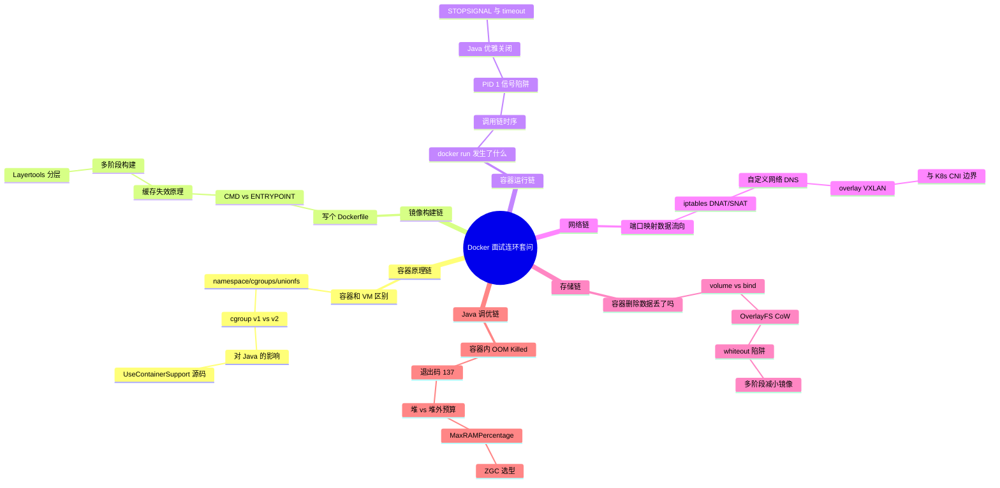

# 跨主题高频面试 Q&A

> **一句话定位**：面试前冲刺用，40 题速答串联各主题，附连环套问思维导图。
> **面试热度**：⭐⭐⭐⭐⭐
> **返回**：[Docker 知识图谱](../README.md)

---

## 使用说明

- 全部 40 题按主题分类，每题 3-5 句要点速答，末尾 **关联** 链接指向对应主题文档的详细推导。
- 连环追问题在题号后标注 🔗，配合文末「连环套问思维导图」把握面试官的追问路径。
- 建议先盖住答案自答，再对照要点查漏，最后跳转关联文档补全原理。

---

## 一、容器基础篇（6 题）

### Q1: 容器和虚拟机的区别？🔗

**答**：核心差异在隔离层级。VM 通过 Hypervisor 虚拟化硬件，每个 VM 有完整 Guest OS，隔离强但开销大（GB 级、秒级启动）。容器共享宿主内核，通过 namespace 隔离视图、cgroups 限制资源、unionfs 提供分层文件系统，是"受控的进程"，开销小（MB 级、毫秒级启动）但隔离边界是内核级，安全弱于 VM。

**关联**：→ [容器本质与底层原理](./01-foundation/container-principle.md)

### Q2: Docker 容器的本质是什么？

**答**：容器本质是「受控的进程」——一个受 namespace 隔离视图、cgroups 限制资源、unionfs 提供分层文件系统的普通 Linux 进程。它不是轻量级虚拟机，没有独立内核，与宿主共享内核，只是被内核"看不见别人、用不了超额资源"。理解这一点就能解释为什么容器启动是毫秒级（只是 fork 进程）、为什么隔离弱于 VM（共享内核意味着逃逸即宿主沦陷）。

**关联**：→ [容器本质与底层原理](./01-foundation/container-principle.md)

### Q3: Docker 进程死了，容器会死吗？

**答**：不会立即死，这就是 dockerd 与容器进程之间插入 containerd-shim 的设计目的。shim 作为容器进程的父进程（即 PID 1 的父进程），负责 收集退出状态 + 上报给 containerd。即使 dockerd 宕机或重启，shim 仍存活，容器进程继续运行；docked 恢复后通过 shim 重新接管。只有 shim 进程退出，容器才真正结束。这套设计实现了"容器生命周期与 dockerd 解耦"。

**关联**：→ [容器本质与底层原理](./01-foundation/container-principle.md)

### Q4: cgroup v1 和 v2 有什么区别？对 Java 有什么影响？🔗

**答**：v1 是多层级（memory/cpu/blkio 各一棵树），v2 是统一层级（`/sys/fs/cgroup/` 单根树，更简洁、支持嵌套）。对 Java 的影响在 JVM 容器感知：JDK 8u191+ 只支持 v1，JDK 11 部分感知 v2，JDK 14+ 才完整支持 v2。现代 Linux（Ubuntu 21.10+、RHEL 9+）默认 cgroup v2，若用老版本 JDK（8u191~8u372）会感知不到 v2 限制，按宿主资源算堆与 CPU，导致 OOM Killed 或线程数暴涨。生产底线：JDK 17+。

**关联**：→ [容器本质与底层原理](./01-foundation/container-principle.md) / [Java 容器调优](./08-performance/java-container-tuning.md)

### Q5: OverlayFS 的写时复制原理是什么？

**答**：OverlayFS 把文件系统分四层：lowerdir（镜像只读层，可多层叠加）、upperdir（容器可写层）、workdir（overlayfs 内部工作目录）、merged（容器内看到的合并视图）。读文件时从 upper→lower 逐层查找（upper 优先）；写文件时若文件在 lower，先复制到 upper 再修改（CoW），lower 不变；新建文件直接写 upper。这套机制让容器"看起来"在原镜像上修改，实际只增不动原层，秒级创建与销毁容器。

**关联**：→ [容器本质与底层原理](./01-foundation/container-principle.md)

### Q6: runc、containerd、dockerd 之间的调用关系？🔗

**答**：dockerd 是上层 CLI/REST 入口，负责镜像管理、卷、网络等高层抽象；containerd 是核心守护进程，负责容器生命周期管理（创建/启动/停止）、镜像拉取、快照；runc 是 OCI 运行时参考实现，负责真正"跑容器"——设置 namespace/cgroups 并 exec 容器进程。调用链：`dockerd → containerd → containerd-shim → runc → 容器进程`。shim 夹在 containerd 与 runc 之间，runc 创建完进程即退出，shim 接管为父进程，实现 dockerd/containerd 重启不影响容器。

**关联**：→ [容器本质与底层原理](./01-foundation/container-principle.md)

---

## 二、镜像与构建篇（8 题）

### Q7: CMD 和 ENTRYPOINT 的区别？🔗

**答**：ENTRYPOINT 是"固定启动程序"，CMD 是"默认参数"，二者可组合。`docker run <image> <args>` 的 `<args>` 会作为 CMD 的内容追加到 ENTRYPOINT 后。纯 ENTRYPOINT 形式：启动程序固定，不可被 `docker run` 参数覆盖（除非 `--entrypoint`）。纯 CMD 形式：`docker run` 后的参数会**整体替换** CMD。最佳实践：ENTRYPOINT 定程序 + CMD 定默认参数，既固定程序又允许运行时覆盖参数。注意 exec 形式（JSON 数组）与 shell 形式（字符串）的区别——shell 形式会被 `/bin/sh -c` 包装，PID 1 是 sh 而非你的程序。

**关联**：→ [镜像构建与分发](./02-image/dockerfile-and-image.md)

### Q8: COPY 和 ADD 该用哪个？

**答**：优先 COPY。COPY 只做文件复制，语义明确、可预测。ADD 有额外魔法：自动解压 tar.gz 等压缩包、支持远程 URL 拉取。这些"智能"行为反而是坑——同名的 tar 会被意外解压，远程 URL 在构建期拉取不可复现且无校验。需要解压时显式用 `RUN tar -xzf`，需要远程文件时先 `curl` 再 COPY。一句话：COPY 显式安全，ADD 魔法易踩坑。

**关联**：→ [镜像构建与分发](./02-image/dockerfile-and-image.md)

### Q9: 为什么 Dockerfile 构建很慢？缓存怎么失效了？🔗

**答**：Docker 构建缓存基于"指令 + 输入文件指纹"逐层匹配，某层缓存失效则该层及所有后续层全部重算。常见失效原因：①`COPY . .` 把整个项目目录复制，任一文件变（包括 `.git`、`target/`）整层失效；②指令顺序不合理，把高频变的内容放前面。优化正解：先 `COPY pom.xml` → `RUN mvn dependency:resolve`（依赖层缓存命中）→ 再 `COPY src` → `RUN mvn package`，并配 `.dockerignore` 排除无关文件。BuildKit 还支持 `--mount=type=cache` 复用 Maven/Gradle 本地仓库。

**关联**：→ [镜像构建与分发](./02-image/dockerfile-and-image.md)

### Q10: 多阶段构建解决了什么问题？

**答**：解决"构建工具与运行环境混在一起导致镜像膨胀"问题。传统做法在最终镜像里装 Maven、JDK、源码、构建产物，镜像 GB 级且含敏感构建信息。多阶段构建用多个 `FROM`，第一阶段用 JDK 跑编译，第二阶段只 `COPY --from=builder` 拿构建产物到精简 JRE 镜像。最终镜像只含 JRE + jar，几百 MB 降到一百多 MB，且无源码无构建工具，更安全更小。

**关联**：→ [镜像构建与分发](./02-image/dockerfile-and-image.md)

### Q11: 镜像为什么这么大？怎么减小？🔗

**答**：膨胀原因：基础镜像选了完整 OS（如 ubuntu 800MB+）、每条 Dockerfile 指令产生一层（含中间文件残留）、没用多阶段构建（构建工具混入运行镜像）。减小方案：①选 slim/alpine/distroless 基础镜像；②多阶段构建只 COPY 产物；③合并 `RUN` 指令（`&&` 链 + 清理缓存 `rm -rf /var/lib/apt/lists/*`）；④用 `.dockerignore` 减小构建上下文；⑤Spring Boot 用 Layertools 分层让依赖层缓存命中。目标：Java 应用运行镜像 < 200MB。

**关联**：→ [镜像构建与分发](./02-image/dockerfile-and-image.md)

### Q12: 删除文件能让镜像变小吗？

**答**：不能，甚至可能变大，这就是 whiteout 陷阱。镜像每层是只读的，`RUN rm /tmp/bigfile` 不会删 lower 层的文件，而是在 upper 层写一个 whiteout 字符设备（标记"此文件在此层被隐藏"）。结果：lower 层的大文件仍在镜像内（占用空间），upper 层又多了几字节 whiteout。正解：①把删除与产生放在同一 `RUN` 指令（`&&` 链），让中间文件在该层内产生又删除，不写入层；②用多阶段构建，builder 层有中间文件，runtime 层只 COPY 最终产物。

**关联**：→ [Docker 存储模型](./05-storage/docker-storage.md)

### Q13: BuildKit 带来了什么改进？

**答**：BuildKit 是新一代构建器（Docker 23.0+ 默认），主要改进：①并行构建无依赖的阶段（多阶段之间无依赖可并行）；②`--mount=type=cache` 跨构建复用 Maven/Gradle 本地仓库，无需每层重下依赖；③`--mount=type=secret` 安全注入密钥（不写入镜像层、不出现在构建历史）；④更智能的缓存失效（仅当 COPY 的文件指纹变才失效，而非时间戳）；⑤前端可插拔（`# syntax=docker/dockerfile:1.4` 支持新指令）。开启：`DOCKER_BUILDKIT=1` 或 daemon 配置。

**关联**：→ [镜像构建与分发](./02-image/dockerfile-and-image.md)

### Q14: 同一镜像怎么支持多架构？

**答**：靠 manifest list（又称 fat manifest）。构建时为每个架构（amd64/arm64）分别构建镜像并推送，各自有独立 manifest；再创建一个 manifest list 把这些镜像按 `os/arch` 聚合，tag 指向这个 list。客户端 `docker pull` 时，Docker 查 manifest list，根据本机 `os/arch` 选对应镜像拉取。构建多架构最简方案：`docker buildx build --platform=linux/amd64,linux/arm64 --push`（基于 QEMU 模拟或远程 native builder）。这样 `myapp:1.0` 一个 tag 在 x86 服务器和 ARM Mac 都能跑。

**关联**：→ [镜像构建与分发](./02-image/dockerfile-and-image.md)

---

## 三、容器运行篇（6 题）

### Q15: `docker run` 之后发生了什么？🔗

**答**：调用链：`dockerd` 接收命令 → 校验镜像本地有无，无则拉取 → 调 `containerd` 创建容器 → `containerd` 启动 `containerd-shim` → shim 调 `runc create`（设置 namespace/cgroups/rootfs）→ `runc start` 启动容器进程 → runc 退出，shim 接管为容器进程的父进程。容器进程成为容器内 PID 1。期间 dockerd 还会创建网络命名空间、连接 docker0 网桥、设置端口映射 iptables 规则、挂载 volume 等。理解这条链路是排查"容器起不来"问题的基础。

**关联**：→ [容器运行时与生命周期](./03-container/container-runtime.md)

### Q16: `docker stop` 和 `docker kill` 的区别？

**答**：stop 发 SIGTERM 给容器 PID 1，等优雅关闭（默认 10 秒超时，`--stop-timeout` 可配），超时才发 SIGKILL 强杀；kill 直接发 SIGKILL（默认），无优雅关闭机会。stop 给应用留时间做清理（ShutdownHook、刷盘、拒新请求），kill 是"立刻死"。生产用 stop 配合应用层优雅关闭；只在容器卡死（如 PID 1 不响应信号）才用 kill。注意 `docker kill -s SIGTERM` 可指定信号，等价于 stop 但不等超时。

**关联**：→ [容器运行时与生命周期](./03-container/container-runtime.md)

### Q17: 为什么 Java 应用 `docker stop` 后要等 10 秒才死？🔗

**答**：两个原因叠加。第一，PID 1 信号陷阱：若 Dockerfile 写 `ENTRYPOINT ["sh", "-c", "java -jar app.jar"]`，sh 是 PID 1，sh 默认不转发 SIGTERM 给 java，java 收不到信号干等 10 秒超时被 SIGKILL。第二，即使 JVM 是 PID 1 收到 SIGTERM，Spring Boot 优雅关闭（`server.shutdown=graceful`）需要时间等在途请求完成。修复：①ENTRYPOINT 用 exec 形式让 JVM 当 PID 1（`ENTRYPOINT ["java","-jar","app.jar"]`）或用 `--init` 注入 tini；②`--stop-timeout` ≥ Spring Boot `timeout-per-shutdown-phase`，对齐超时。

**关联**：→ [容器运行时与生命周期](./03-container/container-runtime.md) / [Java 容器调优](./08-performance/java-container-tuning.md)

### Q18: 容器退出码 137 是什么意思？🔗

**答**：137 = 128 + 9（SIGKILL 信号编号 9）。容器进程被 SIGKILL，无法捕获或处理。两个来源：①内核 OOM Killer——容器内存超 cgroup 限制，内核直接杀；②`docker kill` 或 K8s 终止 Pod 超时后强杀。区分方法：`docker inspect <container> --format '{{.State.OOMKilled}}'`，true 是内核 OOM，false 是 docker kill。后果：JVM 的 ShutdownHook 不会执行（SIGKILL 不可捕获），应用没机会做优雅关闭。这是诊断容器 OOM 的第一信号。

**关联**：→ [容器运行时与生命周期](./03-container/container-runtime.md) / [Java 容器调优](./08-performance/java-container-tuning.md)

### Q19: always 和 unless-stopped 区别？

**答**：都是 Docker 重启策略。`always`：容器退出总是重启，**包括 daemon 重启时也会重启那些之前手动 stop 的容器**。`unless-stopped`：容器退出总是重启，**但 daemon 重启时不会重启那些之前被手动 `docker stop` 停掉的容器**——尊重运维的显式停止意图。生产推荐 `unless-stopped`（或用 K8s 管理而非裸 Docker），避免重启 Docker 后被手动停的服务又自动起来。还有一个 `on-failure`：仅非零退出码才重启，可配最大重试次数。

**关联**：→ [容器运行时与生命周期](./03-container/container-runtime.md)

### Q20: 容器日志把磁盘写满怎么办？🔗

**答**：根因是默认 `json-file` 日志驱动无大小限制，容器 stdout/stderr 全量落盘 `/var/lib/docker/containers/<id>/<id>-json.log`。解决方案：①全局配日志轮转——`/etc/docker/daemon.json` 设 `{"log-driver":"json-file","log-opts":{"max-size":"10m","max-file":"3"}}`，每个容器最多 30MB 日志；②容器级覆盖——`docker run --log-opt max-size=10m --log-opt max-file=3`；③改用 `journald` 或 `syslog` 驱动集中收集；④应用侧 GC 日志配轮转（`-Xlog:gc*=info:file=/tmp/gc.log:filecount=5,filesize=10m`）落 tmpfs。注意已存在容器不会自动应用新配置，需重建。

**关联**：→ [容器运行时与生命周期](./03-container/container-runtime.md)

---

## 四、网络篇（5 题）

### Q21: Docker 的网络模型是什么？🔗

**答**：Docker 网络模型叫 CNM（Container Network Model），三要素：Sandbox（namespace，隔离网络栈）、Endpoint（veth pair，连接 Sandbox 与 Network）、Network（网桥或 overlay，实现容器互联）。五大内置驱动：bridge（默认，docker0 网桥 + NAT）、host（共享宿主网络栈）、none（仅 lo）、overlay（跨主机 VXLAN）、macvlan（容器直接拿宿主网段 IP）。CNM 与 K8s 的 CNI 是两套不同规范，Docker 用 CNM，K8s 用 CNI，插件不通用。

**关联**：→ [Docker 网络模型](./04-network/docker-network.md)

### Q22: `docker run -p 8080:80` 后数据流向是什么？🔗

**答**：外部请求到宿主 `:8080` → 宿主 iptables 的 DOCKER 链 DNAT 规则把目标地址改为容器 IP:80 → 包从 docker0 网桥进入容器的 veth pair → 容器内进程监听 :80 收到请求。响应路径反过来：容器回包源 IP 是容器 IP:80 → 经 docker0 → SNAT 规则把源 IP 改为宿主 IP:8080 → 回到客户端。这套 DNAT+SNAT 由 docker daemon 启动容器时自动写入 iptables 规则。理解这条链路是排查"端口映射不通"的基础——查 `iptables -t nat -L DOCKER`、查 docker0 是否存在、查容器是否监听 :80。

**关联**：→ [Docker 网络模型](./04-network/docker-network.md)

### Q23: 容器间互相访问怎么做？默认 bridge 行不行？🔗

**答**：默认 bridge（docker0）下容器间**只能用 IP 通信，不能用容器名**，因为没有内嵌 DNS。要让容器名可达，需创建自定义 bridge 网络：`docker network create mynet`，`docker run --network mynet` 的容器互相可用容器名解析（Docker 内嵌 DNS server 127.0.0.11 解析）。自定义 bridge 还有隔离性优势（不同自定义网络默认不互通）。生产推荐所有业务容器挂自定义网络而非默认 bridge。跨主机用 overlay 网络。

**关联**：→ [Docker 网络模型](./04-network/docker-network.md)

### Q24: overlay 网络怎么实现跨主机通信？

**答**：overlay 网络用 VXLAN 封装实现跨主机容器二层互通。原理：容器 A（主机1）发包给容器 B（主机2），包源是容器 A IP、目标是容器 B IP；主机1 的 VXLAN 设备把整个二层帧封装进 UDP（端口 4789），外层源/目标是宿主 IP，发到主机2；主机2 解封装还原原始帧，投递给容器 B。这样容器看到的是扁平的 overlay 网段，实际走宿主网络传输。依赖：需键值存储（Consul/etcd/Zookeeper）或 Swarm 模式做容器 IP 发现。代价：封装有约 5%~10% 性能开销，且 MTU 需减 50 字节。K8s 跨主机通信用 CNI 插件（如 Calico BGP/Flannel VXLAN），非 Docker overlay。

**关联**：→ [Docker 网络模型](./04-network/docker-network.md)

### Q25: 自定义网络为什么支持容器名 DNS？

**答**：Docker daemon 内嵌一个 DNS server（监听 127.0.0.11:53），自定义 bridge 网络的容器 `/etc/resolv.conf` 指向它。容器启动注册"容器名 → 容器 IP"到该 DNS，其他同网络容器解析容器名时查到对应 IP。默认 bridge（docker0）不走这套——历史原因 docker0 是预创建网络，未接入内嵌 DNS，容器只能靠 `/etc/hosts`（Docker 写入相邻容器）或 IP 通信，不可靠。自定义网络还支持 service alias（网络别名）、容器名变更自动更新 DNS。

**关联**：→ [Docker 网络模型](./04-network/docker-network.md)

---

## 五、存储篇（4 题）

### Q26: 容器删除后数据还在吗？🔗

**答**：默认不在。容器可写层（upperdir）随容器删除一起销毁——这是容器"用完即弃"的设计前提。数据持久化靠三种挂载：①volume——Docker 管理的命名卷，存在 `/var/lib/docker/volumes/`，容器删除后 volume 仍在，需 `docker volume rm` 才删；②bind mount——挂载宿主目录，数据本就在宿主，容器删不删都与宿主文件无关；③tmpfs——内存临时存储，容器停即消失。生产用 volume 保证数据生命周期独立于容器。

**关联**：→ [Docker 存储模型](./05-storage/docker-storage.md)

### Q27: volume 和 bind mount 该用哪个？

**答**：生产优先 volume。volume 由 Docker 管理，生命周期与容器解耦（容器删 volume 留），易备份迁移（`docker volume` 命令）、易共享（多容器挂同一 volume）、不受宿主目录结构束缚。bind mount 依赖宿主特定路径，不同机器路径可能不同，CI/CD 不友好，但开发期方便（挂源码热重载）。选型：数据库数据、配置、日志用 volume；本地开发挂代码用 bind mount；临时缓存用 tmpfs。注意 bind mount 挂载点若宿主目录为空，会"覆盖"容器内已有目录导致内容"消失"。

**关联**：→ [Docker 存储模型](./05-storage/docker-storage.md)

### Q28: bind mount 挂载点变空目录是什么原因？🔗

**答**：bind mount 把宿主目录挂到容器内某路径时，会"覆盖"容器内该路径的原有内容——若宿主目录是空的，容器内该路径就显示为空，原有文件"看不见"了（实际还在镜像层，被挂载遮盖）。这常发生在挂配置目录到已有默认配置的镜像（如挂空目录到 nginx 的 `/etc/nginx/conf.d`，导致 default.conf "消失"）。区别于 volume：volume 首次挂载到非空容器路径时，Docker 会把容器内内容复制到 volume 再挂载；bind mount 不复制，直接遮盖。正解：挂载前先把宿主目录填好，或用 named volume 利用其初始化复制特性。

**关联**：→ [Docker 存储模型](./05-storage/docker-storage.md)

### Q29: 镜像里删了文件为什么镜像还变大？

**答**：这就是 whiteout 陷阱，与 Q12 同源。镜像分层只读，`RUN rm /bigfile` 在新层写 whiteout 标记"隐藏 lower 层的该文件"，但 lower 层的大文件物理仍在镜像内——总大小 = 原大文件 + whiteout 几字节，不减反增。正解：①把产生与删除放同一 `RUN`（`RUN wget big.tar && tar -xf big.tar && rm big.tar`），中间文件在该层内不残留；②多阶段构建，builder 层有中间文件，runtime 层 `COPY --from=builder` 只取最终产物，中间文件不入最终镜像。

**关联**：→ [Docker 存储模型](./05-storage/docker-storage.md) / [镜像构建与分发](./02-image/dockerfile-and-image.md)

---

## 六、Compose 编排篇（3 题）

### Q30: depends_on 能保证 MySQL 就绪吗？🔗

**答**：不能。`depends_on` 只保证依赖容器**先创建并启动**，不保证依赖服务**已就绪可接受连接**。MySQL 容器启动后还要几秒初始化（建表、授权），此时 app 容器已启动去连 MySQL 会失败。正解：①用 `depends_on` 的 `condition: service_healthy` 形式，依赖 MySQL 的 `healthcheck` 通过才启动 app；②app 代码内重试连数据库（Spring Boot 的 `spring.datasource.hikari.initialization-fail-timeout` 配重试）；③用 wait-for-it 等脚本阻塞等端口通。

**关联**：→ [Docker Compose 多容器编排](./06-compose/docker-compose.md)

### Q31: Compose 能用于生产吗？什么场景该换 K8s？

**答**：单机轻量生产可用 Compose（如小项目、内部工具、CI 环境），但跨以下边界必换 K8s：①多机——Compose 单机（Swarm 模式可多机但社区冷淡），K8s 天生多机；②自愈——容器挂了 Compose 不会自动重启到别的机器，K8s 调度器自动重新调度；③滚动更新与回滚——K8s 原生支持，Compose 需手动；④服务发现与负载均衡——K8s Service + Ingress 原生，Compose 需配 Nginx；⑤配置/密钥管理——K8s ConfigMap/Secret 原生。判断线：超过 1 台机器或需要高可用，上 K8s。

**关联**：→ [Docker Compose 多容器编排](./06-compose/docker-compose.md)

### Q32: `docker compose` 和 `docker-compose` 区别？

**答**：`docker-compose`（V1）是独立的 Python 写的可执行文件，需单独安装，已停止维护（EOL）。`docker compose`（V2）是 Go 写的 Docker CLI 插件，随 Docker 23.0+ 默认附带，命令是 `docker compose`（无连字符）。V2 优势：与 Docker CLI 一体化、性能更好、Compose Specification 规范统一、`docker compose ls` 等新命令。迁移：把脚本里的 `docker-compose` 改成 `docker compose`，注意 V2 对 YAML 严格模式更严（如 `version` 字段已废弃）。生产必迁 V2，V1 不再更新。

**关联**：→ [Docker Compose 多容器编排](./06-compose/docker-compose.md)

---

## 七、安全篇（4 题）

### Q33: Docker 容器安全吗？怎么加固？🔗

**答**：容器隔离边界是内核级（共享宿主内核），逃逸即宿主沦陷，安全弱于 VM。加固六层（纵深防御）：①最小权限基础镜像（slim/distroless）；②非 root 运行（`USER 1000:1000`）；③丢弃所有 Linux capabilities 再按需加（`--cap-drop=ALL`）；④启用 seccomp 限制 syscall（默认 profile 已禁危险调用）；⑤启用 AppArmor/SELinux 强制访问控制；⑥只读根文件系统 + tmpfs 挂 /tmp。生产必做：镜像漏洞扫描（Trivy）、签名校验（Notary）、启用 userns-remap 让容器内 root 映射为宿主非特权用户。

**关联**：→ [Docker 安全模型](./07-security/docker-security.md)

### Q34: `--privileged` 危险在哪？

**答**：`--privileged` 等于"放开一切隔离"：赋予所有 Linux capabilities（包括 `CAP_SYS_ADMIN` 等危险项）、关闭 seccomp、不限制设备访问、不限制内核模块加载、容器内 root 看到宿主所有设备。一旦容器被攻破，攻击者可挂载宿主磁盘、读 `/etc/shadow`、加载内核模块、逃逸到宿主拿 root。生产绝禁，仅在调试内核/特殊场景临时用。替代方案：按需加单个 capability（如 `--cap-add=NET_ADMIN` 配网络工具），而非全开。Docker in Docker 也无需 privileged，挂 `docker.sock` 即可（但仍有风险）。

**关联**：→ [Docker 安全模型](./07-security/docker-security.md)

### Q35: 容器内 root 是真 root 吗？🔗

**答**：默认情况下，容器内 root（uid=0）在容器内是真 root，对容器内文件有全权；但它对宿主的权限取决于是否启用 userns-remap。**未启用 userns-remap**：容器内 root uid=0 直接映射宿主 uid=0，一旦容器逃逸（如挂了宿主根目录），对宿主就是真 root，极度危险。**启用 userns-remap**：容器内 uid=0 映射为宿主 uid=100000+ 的非特权用户，逃逸后在宿主只是普通用户，大幅降低风险。生产推荐启用 userns-remap + 应用以非 root 运行（`USER 1000`），双重防护。

**关联**：→ [Docker 安全模型](./07-security/docker-security.md)

### Q36: 数据库密码怎么传给容器？

**答**：按场景选方案。①环境变量——最简单但 `docker inspect` 可见明文，仅适合开发；②Docker secret（Swarm 模式）——加密存于 Raft 日志，挂载为 `/run/secrets/<name>` 文件，生产 Swarm 用；③外部密钥管理（Vault/AWS Secrets Manager/阿里云 KMS）——应用启动时拉取，不入镜像不入 compose.yml，最安全；④`.env` 文件 + `.gitignore`——开发用，不入仓。生产矩阵：单机用 `.env` + 文件权限 600；Swarm 用 secret；K8s 用 ExternalSecret + CSI。核心原则：密钥不入镜像层（不进 `docker history`）、不写明文在 compose.yml 入仓。

**关联**：→ [Docker 安全模型](./07-security/docker-security.md)

---

## 八、Java 容器调优篇（4 题）

### Q37: 容器内 JVM 堆怎么配？🔗

**答**：用 `-XX:MaxRAMPercentage=75.0` 而非固定 `-Xmx`。原因：MaxRAMPercentage 随容器 `--memory` 自动伸缩，一次构建多环境复用（开发 512MB、生产 4GB 同一镜像）；-Xmx 固定值需每环境单独构建，违背"一次构建到处运行"。配法：`-XX:MaxRAMPercentage=75.0 -XX:InitialRAMPercentage=75.0`（初始等于最大，避免堆扩展多次 Full GC）。经验值：通用 75% 留 25% 给堆外；小容器（<2GB）用 60% 留 40%（堆外占比相对高）；ZGC 用 70% 留 30%（含染色指针 multi-mapping）。小容器 <250MB 走 `MinRAMPercentage=50` 兜底。

**关联**：→ [Java 容器调优](./08-performance/java-container-tuning.md)

### Q38: 为什么配了 -Xmx 容器还是 OOM Killed？🔗

**答**：堆外内存预算漏了。容器内存上限由 cgroup 限制，包含 堆 + Metaspace + DirectBuffer + Thread Stack × 线程数 + CodeCache + JVM 自身。即使 `-Xmx=1g` 设了堆上限，若容器 `--memory=1g` 也 1GB，剩余堆外项无处安放，触发内核 OOM Killer（退出码 137）。预算公式：`容器内存 > 堆 + Metaspace + DirectBuffer + ThreadStack × 线程数 + CodeCache + JVM 自身`。常见漏项：DirectBuffer（Netty/WebClient，30~100MB）、Thread Stack（Tomcat 200 线程 × 1MB = 200MB）。修复：降 MaxRAMPercentage 到 60%~70%，或显式限堆外（`-XX:MaxMetaspaceSize=256m`）。

**关联**：→ [Java 容器调优](./08-performance/java-container-tuning.md)

### Q39: Spring Boot 镜像构建太慢怎么优化？🔗

**答**：三件套：Layertools + Jib + CDS。①Layertools——把 fat jar 解包为四层（dependencies/spring-boot-loader/snapshot-dependencies/application），依赖层不变 → Docker 缓存命中 → 只重传 application 层（几 MB），构建从分钟到秒级，推送从 GB 到 MB。②Jib——Google 出品 Maven 插件，无需 Dockerfile、无需 Docker daemon，CI 友好，自动分层，适合禁 Docker 的 CI 环境。③CDS（Class Data Sharing）——把类加载解析归档为共享存档，启动时直接映射跳过解析，Spring Boot 重上下文应用省 10%~30% 启动时间。三者正交可叠加：Layertools/Jib 优化构建与分发，CDS 优化冷启动。

**关联**：→ [Java 容器调优](./08-performance/java-container-tuning.md) / [镜像构建与分发](./02-image/dockerfile-and-image.md)

### Q40: ZGC 在容器内怎么选？什么场景用？

**答**：决策三问：堆多大？延迟要求？JDK 版本？①堆 <2GB 用 G1（ZGC 堆外开销占比过高，染色指针 multi-mapping 约堆的 1/64）；>8GB 用 ZGC（停顿优势显现）。②强延迟（<10ms）用 ZGC，一般延迟（100~200ms）G1 足够。③JDK 21+ 用分代 ZGC（`-XX:+UseZGC -XX:+ZGenerational`，吞吐损失从 5%~10% 降到 2%~3%）；JDK 17 用非分代 ZGC；RedHat 系无 ZGC 用 Shenandoah。容器内 ZGC 陷阱：堆外预算多留 2%~5%（染色指针 multi-mapping），`MaxRAMPercentage=70` 而非 75。一句话：小堆 G1，大堆 ZGC，JDK 21+ 分代。

**关联**：→ [Java 容器调优](./08-performance/java-container-tuning.md)

---

## 九、连环套问思维导图

下图标注了哪些题目构成面试官的「连环追问链」——答完一题后大概率被顺着追问下一环。带 🔗 标记的题即处于某条追问链中。每条链都是「入口题 → 原理 → 陷阱 → Java 关联」的递进，面试官常按此路径追问。

---

## 十、自测清单

阅读完本文后，尝试不查文档回答以下「一锤定音」要点，答不上则跳转关联文档补课：

- [ ] 容器和 VM 的隔离边界差在哪？为什么容器逃逸即宿主沦陷？
- [ ] cgroup v1 和 v2 对 Java 的分界 JDK 版本是哪些？生产底线是哪个？
- [ ] `docker run` 后 dockerd/containerd/shim/runc 各自做了什么？
- [ ] 容器退出码 137 = 哪两个数相加？OOMKilled 怎么查？
- [ ] CMD 和 ENTRYPOINT 的 exec 形式与 shell 形式，PID 1 分别是谁？
- [ ] 删文件为什么镜像变大？whiteout 在哪一层？
- [ ] 自定义 bridge 为什么能解析容器名？默认 bridge 为什么不能？
- [ ] volume 与 bind mount，哪个首次挂载会复制容器内容？
- [ ] depends_on 的 `condition: service_healthy` 解决了什么问题？
- [ ] MaxRAMPercentage 为什么优于 -Xmx？小容器为什么用 60% 而非 75%？

> **返回**：[Docker 知识图谱](../README.md)
