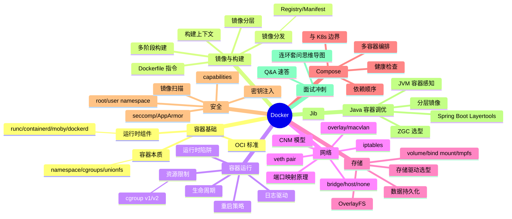

# docker — Docker 面试知识体系

## 一、模块简介

本模块按 Docker 架构层次组织 **9 份**主题文档，覆盖从容器底层原理、镜像构建、网络存储到 Java 容器化调优的完整面试知识图谱。

- **定位**：面向 Java 后端面试的 Docker 知识体系
- **适用对象**：Java 后端面试（初中级到高级），兼顾云原生与服务端架构方向
- **组织方式**：8 个主题目录 + 1 个 Q&A 文件，每份主题文档遵循「概念定义 → 原理与流程 → 高频追问 → 实战关联 → 系统设计案例」五段式结构
- **导航约定**：每份文档顶部含 `> 返回 [Docker 知识图谱](../README.md)` 链接，本文档为统一入口

---

## 二、知识图谱



---

## 三、导航表

| 分层 | 文档 | 核心考点 |
|------|------|---------|
| 容器基础 | [容器本质与底层原理](./01-foundation/container-principle.md) | namespace/cgroups/unionfs/OCI/runc·containerd·moby 分工 |
| 镜像与构建 | [镜像构建与分发](./02-image/dockerfile-and-image.md) | Dockerfile 指令/构建上下文/镜像分层/多阶段构建/Registry |
| 容器运行 | [容器运行时与生命周期](./03-container/container-runtime.md) | 生命周期/状态机/PID 1/日志/健康检查 |
| 网络 | [Docker 网络模型](./04-network/docker-network.md) | bridge/host/overlay/veth/iptables/CNM/DNS 发现 |
| 存储 | [Docker 存储模型](./05-storage/docker-storage.md) | OverlayFS/volume/bind/tmpfs/whiteout/驱动选型 |
| Compose | [Docker Compose 多容器编排](./06-compose/docker-compose.md) | YAML 结构/depends_on 陷阱/V2 升级/Kompose 边界 |
| 安全 | [Docker 安全模型](./07-security/docker-security.md) | capabilities/seccomp/userns-remap/rootless/镜像扫描 |
| Java 调优 | [Java 容器调优](./08-performance/java-container-tuning.md) | JVM 感知/堆外预算/Layertools/Jib/ZGC 选型 |
| 面试冲刺 | [Q&A 速答](./09-interview-qa.md) | 40 题速答 + 连环套问思维导图 |

> 共 **10 份**文档：入口 README（本文档）+ 上表 9 份主题/Q&A 文档。

---

## 四、推荐学习路径

### 路线一：系统学习（适合有 1-2 周准备期）

按 Docker 架构层次从基础向上深入，先建立全貌再下沉到细节：

```
01 容器基础 → 02 镜像构建 → 03 容器运行 → 04 网络 → 05 存储 → 06 Compose → 07 安全 → 08 Java 调优 → 09 Q&A
```

**特点**：先见森林后见树木，符合 Docker 架构层次，适合建立完整体系。

### 路线二：面试冲刺（高频优先，适合 3-5 天突击）

按面试热度排序，先啃必考点，再补体系：

1. 03 容器运行 → 02 镜像构建 → 01 容器基础
2. 04 网络 → 08 Java 调优
3. 05 存储 → 07 安全 → 06 Compose
4. 09 Q&A（40 题，含连环套问思维导图）

**特点**：投入产出比最高，覆盖 80% 高频考点。

> 两套路线殊途同归，最终都应回到 [Q&A 速答](./09-interview-qa.md) 做闭环检验。

---

## 五、与 java-core / framework 模块的关联

本模块虽为运维文档，但与仓库内 Java 模块存在直接关联，便于在面试中结合源码与实战作答：

| 本模块知识点 | 关联 Java 模块 | 关联要点 |
|-------------|---------------|---------|
| 容器本质 / namespace / cgroups | `java-core/jvm` | JVM 容器内存感知源码路径 |
| 容器本质 / PID 1 与信号 | `framework/spring-framework` | PID 1 与 SIGTERM 优雅关闭 |
| 镜像构建 / Spring Boot 分层 | `framework/spring-framework` | Spring Boot 可执行 jar 结构与分层 |
| 镜像构建 / 配置注入 | `framework/jackson` | 镜像内配置注入优先级 |
| 容器运行 / 优雅关闭 | `framework/spring-framework` | ContextClosedEvent 与 shutdown hook |
| 容器运行 / JVM ShutdownHook | `java-core/jvm` | JVM ShutdownHook 执行时机 |
| Docker 网络 / server.address | `framework/spring-framework` | server.address 与容器网络绑定 |
| Docker 网络 / 健康检查端点 | `framework/valid` | API 网关端口暴露与健康检查端点 |
| Docker 存储 / @Value | `framework/spring-framework` | @Value 与配置优先级在容器化下的行为 |
| Docker 存储 / 日志聚合 | `framework/valid` | 健康检查端点 + 日志聚合 |
| Compose / 多 profile | `framework/spring-framework` | 多 profile 配置与 Compose environment |
| Compose / actuator | `framework/valid` | /actuator/health 作为 healthcheck |
| Docker 安全 / 密钥注入 | `framework/spring-framework` | 密钥注入与 Spring 配置 |
| Docker 安全 / Java agent | `java-core/agent` | Java agent 在容器内的 attach 陷阱 |
| Java 调优 / 堆外预算 | `java-core/jvm` | 堆外内存预算、ZGC 选型、UseContainerSupport 源码 |
| Java 调优 / JarLauncher | `framework/spring-framework` | Spring Boot 3.x JarLauncher、优雅关闭 |
| Java 调优 / probe | `framework/valid` | /actuator/health 作为 probe |

**延伸阅读**：

- `java-core/jvm` —— 对照理解 JVM 容器内存感知与 GC 选型
- `framework/spring-framework` —— Spring Boot 容器化、优雅关闭、配置注入
- `framework/valid` —— API 参数校验与健康检查端点

> 建议在阅读容器运行与 Java 调优文档时，对照 `java-core`/`framework` 模块的源码实例，加深「面试八股 → 工程实战」的双向映射。
