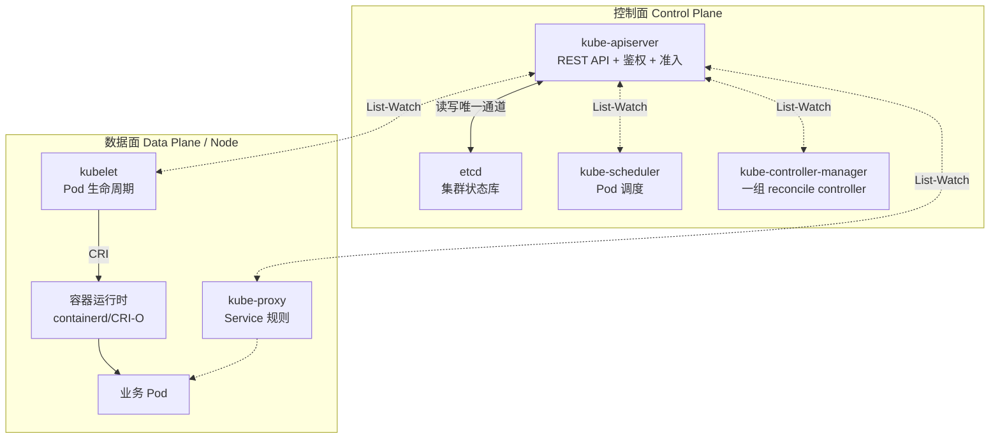
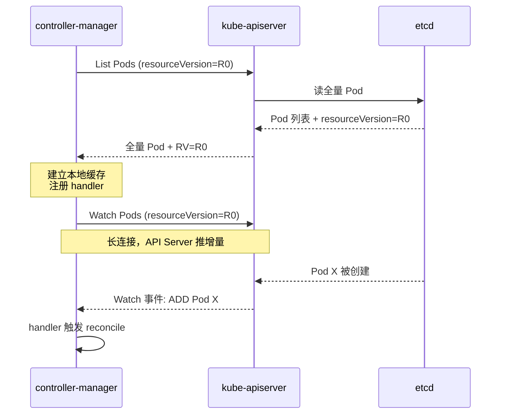
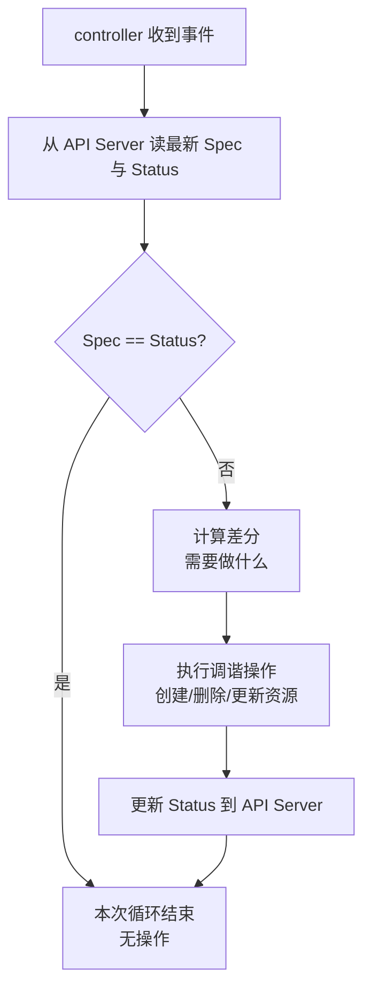
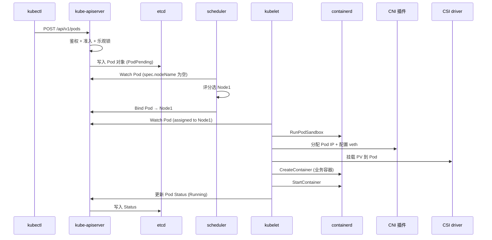

# 架构总览与核心组件

> **一句话定位**：K8s 架构是面试"讲讲你对 K8s 的理解"的入口题，控制面/数据面与六大组件职责是必考点。
> **面试热度**：⭐⭐⭐⭐⭐
> **返回**：[K8s 知识图谱](../README.md)

---

## 一、概念定义

### 1.1 K8s 是什么

**一句话**：Kubernetes 是一个**声明式、面向终态的容器编排系统**，核心思想是"期望状态 vs 实际状态"的 reconcile（调谐）循环。

用户提交一份"期望状态"清单（Pod 要几个、副本数多少、用什么镜像、暴露什么端口），K8s 的工作就是**持续把集群拉回这个期望状态**——某个 Pod 挂了，自动拉一个新的；节点宕机了，把上面的 Pod 迁移到其他节点；副本数被改了，按新值扩缩。整个过程不需要人去执行"启动/停止/迁移"等命令式动作，系统自己收敛。

> **核心心智模型**：用户描述"终态"（Spec），系统对比"现状"（Status），差分触发操作把现状拉回终态。这套循环叫 **reconcile loop**，是 K8s 所有控制器的统一范式。

### 1.2 控制面 vs 数据面

K8s 集群分为两层：

| 维度 | 控制面（Control Plane） | 数据面（Data Plane） |
|------|------------------------|---------------------|
| 职责 | 决策层——持有集群状态、调度 Pod、响应事件 | 执行层——运行业务 Pod、维护网络、上报状态 |
| 组件 | API Server / etcd / kube-scheduler / kube-controller-manager | kubelet / kube-proxy / 容器运行时 |
| 是否跑业务 Pod | 否（只跑控制组件） | 是（Pod 落在各 Node 上） |
| 故障影响 | 集群"大脑"宕机——新变更无法生效，但已调度 Pod 仍运行 | 单 Node 宕机——该节点 Pod 失联，其他节点不受影响 |
| 高可用要求 | 多副本 + etcd 选主（leader election） | 多 Node 水平扩展，单点故障可容忍 |
| 部署形态 | 控制面组件可独立部署或托管（如 GKE/EKS 托管控制面） | kubelet 以静态 Pod 或 systemd 服务形式常驻每个 Node |

**关键认知**：控制面是"决策者"，数据面是"执行者"。控制面挂了不会立刻杀业务 Pod——已运行的 Pod 由本机 kubelet 继续维持；但**新变更无法生效**（无法创建新 Pod、无法响应扩缩容、controller 失去事件源）。

### 1.3 与 Docker 的关系

K8s 与 Docker 不在一个层级——**K8s 是编排层，Docker 是容器实现**。K8s 不直接操作容器，而是通过 **CRI（Container Runtime Interface）** 接口调用容器运行时：

| 维度 | K8s | Docker |
|------|-----|--------|
| 定位 | 容器编排系统（集群级） | 容器引擎（单机级） |
| 关注粒度 | Pod（一组容器）/ Service / Deployment | 单个容器 |
| 与容器运行时关系 | 通过 CRI 接口接入 containerd/CRI-O | 自带 dockerd + containerd + runc 调用链 |
| 底层容器原理 | 不重复实现，依赖运行时与内核 namespace/cgroups | 直接封装 namespace/cgroups/unionfs |

> **演进史**：K8s 早期通过 **dockershim** 把 Docker 适配到 CRI 接口，K8s 1.24 起**移除 dockershim**，集群直接通过 CRI 调用 containerd 或 CRI-O。容器底层（namespace/cgroups/unionfs、runc/containerd 调用链）详见 [容器本质与底层原理](../../docker/01-foundation/container-principle.md)、运行时调用链详见 [容器运行时与生命周期](../../docker/03-container/container-runtime.md)。本文不重复展开。

### 1.4 声明式 API vs 命令式 API

| 维度 | 命令式（Imperative） | 声明式（Declarative） |
|------|---------------------|---------------------|
| 用户描述什么 | "动作"——执行什么命令 | "终态"——期望达到什么状态 |
| 典型代表 | `docker run` / `docker stop` | `kubectl apply -f deployment.yaml` |
| 可重入性 | 不可重入（重复执行有副作用） | 可重入（apply 同一份 yaml 多次幂等） |
| 自愈能力 | 无（容器死了人去重启） | 有（controller 自动拉回期望副本数） |
| 状态对比 | 不对比，只执行 | 持续 diff（Spec vs Status），差分触发操作 |
| 审计与版本 | 难（靠 shell history） | 易（yaml 入 Git，CI/CD 流水线） |

**关键差异**：`docker run nginx` 是"启动一个 nginx 容器"的命令；`kubectl apply deployment.yaml`（声明 replicas=3）是"我要 3 个 nginx 副本"的期望。前者执行完就结束，后者由 Deployment controller 持续监控——若有人手动删了一个 Pod，controller 发现副本数从 3 掉到 2，自动再拉一个回来。

---

## 二、原理与流程

### 2.1 六大核心组件全表

| 组件 | 所属层 | 职责 | 监听对象 | 是否高可用 | 典型故障现象 |
|------|--------|------|---------|-----------|-------------|
| kube-apiserver | 控制面 | 唯一与 etcd 通信的入口，提供 REST API、鉴权、准入控制、乐观锁 | 所有 K8s 资源 | 多副本（无状态，可水平扩展） | API 不可达 → kubectl 卡住、controller 失去事件源 |
| etcd | 控制面 | 分布式 KV 存储，集群唯一状态库（Pod/Service/Secret/ConfigMap 等全在此） | — | 多节点 Raft 选主（奇数节点） | 写失败 → 新变更无法持久化；脑裂 → 数据不一致 |
| kube-scheduler | 控制面 | 监听未调度的 Pod，按资源/亲和性/污点策略选 Node 并 Bind | Pod（未调度） | 多副本 + leader election（只有 leader 调度） | 调度停止 → 新 Pod 永远 Pending |
| kube-controller-manager | 控制面 | 运行一组 controller（Deployment/ReplicaSet/Node/Endpoint 等），每个 controller 跑 reconcile 循环 | 各自关心的资源 | 多副本 + leader election（leader 处理事件） | controller 停 → 不自愈、不滚动更新、Endpoint 不更新 |
| kubelet | 数据面 | 节点代理，管理本机 Pod 生命周期：调 CRI 创建容器、调 CNI 配网络、调 CSI 挂卷、上报 Status | Pod（分配到本节点的） | 每 Node 一个（单点） | kubelet 挂 → 该节点 Pod 失去监管、无法新建、Status 停止上报 |
| kube-proxy | 数据面 | 节点网络代理，为 Service 写 iptables/ipvs 规则，实现 ClusterIP/NodePort 流量转发 | Service / Endpoints | 每 Node 一个（单点） | 规则不更新 → Service 流量转发异常、新 Pod 不被路由到 |

> **核心心智**：控制面四组件中，**API Server 是枢纽**——所有组件都通过它协作；**etcd 是唯一状态库**——只有 API Server 能写。scheduler 与 controller-manager 都用 leader election，但语义不同（详见 §三 Q4）。

### 2.2 架构图



**架构要点**：

1. **API Server 是唯一与 etcd 通信的组件**——所有读写都经过它。
2. **控制面与数据面通过 List-Watch 双向协作**——API Server 推送事件，kubelet/controller 等通过 Watch 增量响应。
3. **数据面组件（kubelet/kube-proxy）以 DaemonSet 或 systemd 常驻每个 Node**，与控制面解耦——控制面挂了，本节点 Pod 仍由 kubelet 维持。

### 2.3 API Server 是唯一访问 etcd 的组件

所有组件（scheduler / controller-manager / kubelet / kube-proxy）都不直连 etcd，而是通过 API Server 的 REST API 读写。这个设计有四个理由：

| 理由 | 说明 |
|------|------|
| 鉴权收敛点 | API Server 统一做 RBAC 鉴权、TLS 客户端证书校验，避免每个组件各自实现一遍 |
| 准入控制收敛点 | 准入 webhook（ValidatingAdmissionWebhook / MutatingAdmissionWebhook）在 API Server 拦截变更，保证策略一致性 |
| 乐观锁版本控制 | etcd 的 `resourceVersion` 机制通过 API Server 透传给 client，防止并发写冲突 |
| 审计日志收敛点 | 所有变更在 API Server 记 audit log，方便追溯"谁在何时改了什么" |

> **核心**：API Server 是集群的"网关 + 总线"。让组件直连 etcd 看似省一跳，实际会把鉴权、准入、审计、乐观锁全部散落到各组件，无法统一治理。

### 2.4 List-Watch 机制

K8s 组件间协作的核心机制是 **List-Watch**：

- **初始 List**：组件启动时调 API Server 的 List 接口，**全量拉取**关心的资源（如 kubelet List 本节点的 Pod 列表），建立本地缓存（client-go 的 informer cache）。
- **后续 Watch**：基于 List 返回的 `resourceVersion`，调 Watch 接口**只订阅增量事件**（ADD/UPDATE/DELETE），不再重复拉全量。
- **事件分发**：组件的 informer 收到事件后触发注册的 handler（如 controller 的 reconcile、kubelet 的 syncPod）。



> **为什么不只用 List**：① 每次 List 全量对 API Server 与 etcd 压力大；② Watch 增量事件，长连接持续推送，省带宽与 CPU；③ `resourceVersion` 保证事件顺序与一致性——Watch 断线重连时从上次 RV 继续，不会丢事件。详见 §三 Q3。

### 2.5 reconcile 循环

每个 controller 都跑一个 reconcile 循环，持续对比"期望状态（Spec）"与"实际状态（Status）"，差分触发调谐操作：



以 **Deployment controller** 为例：

- 期望状态：`deployment.spec.replicas=3`（要 3 个副本）
- 实际状态：当前 ReplicaSet 只有 2 个 Pod
- 差分：少 1 个
- 调谐操作：调 API Server 扩容 ReplicaSet 到 3

> **幂等性保证**：每次循环从 API Server 读**最新状态**做决策，不依赖本地缓存决策；操作只做差分，重复执行不会产生副作用。这正是声明式 API 可重入的根因。

### 2.6 CRI / CNI / CSI 三大接口

K8s 通过三大标准接口把容器运行时、网络、存储与核心解耦：

| 接口 | 全称 | 调用方 ↔ 实现方 | 职责 | 典型实现 |
|------|------|----------------|------|---------|
| CRI | Container Runtime Interface | kubelet ↔ 容器运行时 | Pod sandbox 与容器生命周期、镜像管理 | containerd（CRI plugin）、CRI-O |
| CNI | Container Network Interface | kubelet ↔ 网络插件 | Pod IP 分配、网络连通、NetworkPolicy | Flannel、Calico、Cilium |
| CSI | Container Storage Interface | kubelet ↔ 存储插件 | PV 挂载/卸载、快照、扩容 | 各云厂商 disk driver、Rook、Longhorn |

- **CRI**：kubelet 通过 `RuntimeService`（容器生命周期）+ `ImageService`（镜像管理）两个 gRPC 接口调运行时。详见 [容器运行时与生命周期](../../docker/03-container/container-runtime.md)。
- **CNI**：kubelet 在创建 Pod sandbox 后调 CNI 插件，由插件分配 Pod IP、配置 veth pair 与路由。详见 [Service 与 Ingress](../03-network/service-and-ingress.md)。
- **CSI**：kubelet 在 Pod 启动前调 CSI driver 的 `NodeStageVolume` / `NodePublishVolume` 挂载 PV。详见 [Volume 与 PV/PVC](../04-storage/volume-and-pv-pvc.md)。

> **设计哲学**：三大接口让 K8s 与具体实现解耦——换运行时只换 CRI shim，换网络方案只换 CNI 插件，换存储只换 CSI driver，K8s 核心代码不动。

### 2.7 Pod 创建全流程时序图

从 `kubectl apply` 到 Pod Running 的端到端流程：



**关键步骤解读**：

1. **kubectl → API Server**：kubectl 把 yaml 翻译为 REST POST 请求，API Server 鉴权、跑准入 webhook，然后写 etcd——此时 Pod 是 `Pending` 且 `spec.nodeName` 为空（未调度）。
2. **scheduler Watch**：scheduler 通过 Watch 收到新 Pod 事件，跑调度算法（资源/亲和性/污点）选一个 Node，调 API Server 的 Bind 接口把 `spec.nodeName` 写为选中的 Node。
3. **kubelet Watch**：kubelet 只 Watch 分配到本节点的 Pod，收到后开始创建——先调 CRI 创建 Pod sandbox（pause 容器，持有 Pod 的 network namespace），再调 CNI 配网络、CSI 挂卷，最后调 CRI 创建并启动业务容器。
4. **Status 上报**：容器启动后，kubelet 调 API Server 更新 Pod Status 为 Running，API Server 写入 etcd。

> **核心心智**：整个流程中，**没有任何组件直接调 etcd**，**没有任何组件直接调其他组件**——全部通过 API Server 的 List-Watch 协作。这就是"API Server 是唯一总线"的体现。

---

## 三、高频追问与面试题

### Q1：API Server 为什么是唯一访问 etcd 的组件？

**参考答案**：四个理由——鉴权/校验/乐观锁/审计日志都在 API Server 收敛：

1. **鉴权收敛**：API Server 统一做 RBAC + TLS 客户端证书校验，避免 scheduler/controller/kubelet 各自实现一遍。
2. **准入控制收敛**：Mutating/Validating Admission Webhook 在 API Server 拦截变更，保证策略一致（如必须打 label、Pod 数不超上限）。
3. **乐观锁版本控制**：etcd 的 `resourceVersion` 透传给 client，并发写冲突时 API Server 返回 409，client 重新 List 再写，避免 ABA 问题。
4. **审计日志收敛**：所有变更在 API Server 记 audit log，可追溯"谁在何时改了什么资源"。

若让组件直连 etcd，鉴权、准入、审计全部散落，无法统一治理。

**关联**：§2.3 API Server 是唯一访问 etcd 的组件。

### Q2：etcd 挂了集群会怎样？

**参考答案**：

- **API Server 无法持久化新变更**——写 etcd 失败，kubectl apply 报错，但读仍可走 API Server 缓存（部分资源）。
- **已调度的 Pod 仍运行**——kubelet 本地维持 Pod，与 etcd 无强依赖；但 Pod Status 无法上报（API Server 写不进去）。
- **controller 与 scheduler 失去事件源**——它们 Watch 的是 API Server，API Server 无法写 etcd 也就推不出新事件。
- **etcd 是唯一状态库**，恢复后需校验一致性；生产环境必须定期备份（`etcdctl snapshot save`），并部署奇数节点 + Raft 多副本防止单点故障。

**关联**：§2.1 六大核心组件全表、§1.2 控制面 vs 数据面。

### Q3：List-Watch 为什么不只用 List？

**参考答案**：三个理由——压力/顺序/一致性：

1. **省 API Server 与 etcd 压力**：每次 List 全量对大集群（数万 Pod）是沉重负担；Watch 增量事件，长连接持续推送，省带宽与 CPU。
2. **resourceVersion 保证事件顺序**：每个资源对象带单调递增的 RV，Watch 按顺序推送，client 不会乱序。
3. **断线重连不丢事件**：Watch 断线后，client 用上次的 RV 重新 Watch，API Server 从该 RV 之后继续推送，不丢不重。

若只用 List 轮询，既费资源又会漏中间状态变化（两次轮询间的事件丢失）。

**关联**：§2.4 List-Watch 机制。

### Q4：scheduler 和 controller-manager 都是"选主"，有什么区别？

**参考答案**：两者都用 leader election（基于 etcd 的 lease），但语义不同：

| 维度 | kube-scheduler | kube-controller-manager |
|------|----------------|------------------------|
| 选主后行为 | 只有 leader 调度，其他副本待命 | leader 处理事件，但内部多个 controller 协作 |
| 多副本目的 | HA 切换——leader 挂，standby 接管 | 同上 |
| 工作粒度 | 单一职责——Pod 调度 | 一组 controller（Deployment/ReplicaSet/Node/Endpoint...） |
| 是否并行调度 | 否——避免两个 scheduler 给同一 Pod Bind 不同 Node | 否——避免两个 Deployment controller 重复扩容 |

**核心**：选主的目的是**避免多个副本同时干活产生冲突**（scheduler 同时 Bind、controller 同时扩容）。leader 挂了 lease 过期，standby 抢锁成为新 leader。

**关联**：§2.1 六大核心组件全表。

### Q5：kubelet 与 API Server 断连，Pod 会死吗？

**参考答案**：**不会立刻死**，但失去与控制面的协作：

- **Pod 本身继续运行**——kubelet 已与容器运行时建立本地监管（通过 CRI），Pod 进程不依赖与 API Server 的连接存活。
- **Status 停止上报**——kubelet 无法把 Pod 状态写回 API Server，控制面看到的 Pod Status 停留在断连前的最后值。
- **新 Pod 无法调度到该节点**——kubelet 不再 Watch 到新分配的 Pod，不会创建新容器。
- **重连后同步**——kubelet 用 List-Watch 的 RV 重新连接，补上断连期间的事件，重新同步状态。

**故障窗口**：Pod 不死，但集群对该节点的"感知"滞后。若节点长时间失联（`node-status-update-frequency` 超时），controller-manager 的 Node controller 会标记 Node 为 `NotReady`，并按 `pod-eviction-timeout` 驱逐 Pod（默认 5 分钟）。

**关联**：§2.1 六大核心组件全表、§1.2 控制面 vs 数据面。

### Q6：声明式 API 与命令式 API 的本质区别？

**参考答案**：核心差异在"描述对象"——声明式描述"终态"，命令式描述"动作"：

| 维度 | 声明式 | 命令式 |
|------|--------|--------|
| 描述对象 | 终态（要什么状态） | 动作（执行什么命令） |
| 执行者 | 系统（controller reconcile） | 人（运维敲命令） |
| 可重入 | 是（apply 同一份 yaml 多次幂等） | 否（重复执行有副作用） |
| 自愈 | 有（Pod 死了 controller 自动拉回） | 无（死了人去重启） |
| diff 能力 | 有（Spec vs Status 持续对比） | 无 |
| 审计 | 易（yaml 入 Git） | 难（靠 shell history） |

**本质**：声明式把"做什么"交给系统，人只描述"要什么"。系统持续对比现状与期望，差分触发操作。这正是 reconcile 循环的哲学基础。

**关联**：§1.4 声明式 API vs 命令式 API、§2.5 reconcile 循环。

### Q7：reconcile 循环如何保证幂等？

**参考答案**：三个机制——读最新状态/做差分/操作幂等：

1. **每次循环从 API Server 读最新 Spec 与 Status**——不依赖本地缓存决策，避免基于过期状态做错误操作。
2. **操作只做差分**——Spec=3，Status=2，只补 1 个；Spec=3，Status=3，什么都不做。重复循环不会产生副作用。
3. **底层操作天然幂等**——调 API Server 创建 Pod，若已存在则返回 409，controller 视为已达成期望；更新 Status 用 RV 乐观锁，冲突重试。

**核心**：幂等的根因是"期望状态驱动 + 差分操作"——目标是收敛到 Spec，操作量由 Spec 与 Status 的差决定，而非由事件触发次数决定。

**关联**：§2.5 reconcile 循环。

### Q8：K8s 与 Docker 的关系？

**参考答案**：不在一个层级——**K8s 是编排层，Docker 是容器实现**：

- K8s 通过 **CRI 接口**调用容器运行时（containerd/CRI-O），不直接操作容器。
- **演进史**：K8s 早期用 **dockershim** 把 Docker 适配到 CRI；K8s 1.24 起移除 dockershim，集群直连 containerd 或 CRI-O。containerd 自带 CRI plugin，无需额外 shim。
- **底层容器原理**（namespace/cgroups/unionfs、runc/containerd 调用链）与 K8s 无关，是 Linux 内核机制，Docker 与 K8s 共用。详见 [容器本质与底层原理](../../docker/01-foundation/container-principle.md)。

**一句话**：Docker 解决"单机怎么跑容器"，K8s 解决"集群怎么编排数百个容器"。

**关联**：§1.3 与 Docker 的关系、[容器运行时与生命周期](../../docker/03-container/container-runtime.md)。

---

## 四、实战关联（Java 后端视角）

### 4.1 Java 应用上 K8s 的全链路

一个 Spring Boot 应用作为 Deployment 提交到 K8s，端到端流程：

1. **CI/CD 构建镜像**：`mvn package` 生成 fat jar → `docker build` 产生 OCI 镜像 → push 到镜像仓库。
2. **kubectl apply**：提交 Deployment yaml（`replicas=3`、`image=myapp:v1`、`containerPort=8080`）。
3. **API Server 写入 Pod Spec** → scheduler 调度到 3 个 Node → kubelet Watch 收到 → 调 CRI 拉镜像启动 JVM。
4. **kubelet 配置探针**：根据 yaml 的 `livenessProbe` / `readinessProbe` 配置，定期 HTTP 调用 `/actuator/health`。
5. **Service 暴露**：Deployment 关联 Service，kube-proxy 在各 Node 写 iptables 规则，流量通过 ClusterIP 转发到 Pod。

> **关键认知**：Java 应用在 K8s 上不是"被 K8s 调用"，而是 K8s 通过 CRI 把 JVM 当普通进程启动，通过探针接口判断健康，通过 Service 规则路由流量。Java 代码本身对 K8s 无感知（除了部分 Operator SDK 场景）。

### 4.2 关联 java-core/jvm：JVM 容器感知起点

kubelet 通过 CRI 调 containerd 创建容器时，会设置 **cgroups**（CPU/内存限制）。JVM 启动后通过读 cgroup 文件感知限制：

- **内存感知**：JDK 8u191+ / 11+ 读 `/sys/fs/cgroup/memory/.../memory.limit_in_bytes`（v1）或 `memory.max`（v2），推算堆大小。
- **CPU 感知**：读 `cpu.cfs_quota_us` / `cpu.cfs_period_us` 推算可用核数，影响 GC 线程数与 `ForkJoinPool` 并行度。
- **陷阱**：JDK 老版本不支持 cgroup v2 → 读不到 limit → 退化为宿主机内存 → OOM Killer 杀 JVM 而非抛 OutOfMemoryError。

> **关联 `java-core/jvm` 模块**：该模块目前聚焦类加载与类初始化实例（`com.yintp.jvm.classload.ClassLoadTest`、`com.yintp.jvm.classinit.ClassInitTest1~9`），未覆盖容器感知源码实例——本节在文档层引用 HotSpot 上游源码路径（`os::Linux::container`），作为面试时引用源码出处的口径，不依赖仓库内 Java 文件。底层 cgroup 机制详见 [容器本质与底层原理](../../docker/01-foundation/container-principle.md) §2.2 Cgroups。

### 4.3 关联 framework/spring-framework：actuator 与探针

Spring Boot 应用通过 **actuator** 暴露健康端点，kubelet 调用探针判断 Pod 状态：

| 探针 | 端点 | 失败行为 |
|------|------|---------|
| livenessProbe | `/actuator/health/liveness` | kubelet 重启 Pod（杀容器重建） |
| readinessProbe | `/actuator/health/readiness` | 从 Service Endpoints 移除，不再路由流量（不杀 Pod） |
| startupProbe | `/actuator/health`（自定义） | 启动期失败不计入 liveness，启动成功后让位 |

**配置示例**：

```yaml
# K8s Deployment 片段
livenessProbe:
  httpGet:
    path: /actuator/health/liveness
    port: 8080
  initialDelaySeconds: 60      # JVM 启动慢，给足时间
  periodSeconds: 10
  failureThreshold: 3
readinessProbe:
  httpGet:
    path: /actuator/health/readiness
    port: 8080
  periodSeconds: 5
  failureThreshold: 2
```

```yaml
# Spring Boot application.yml
management:
  endpoint:
    health:
      probes:
        enabled: true           # 暴露 liveness/readiness 子端点
  health:
    livenessstate:
      enabled: true             # 启用 liveness state（基于 ApplicationState）
    readinessstate:
      enabled: true
```

> **关联 `framework/spring-framework` 模块**：该模块有 `ContextClosedEvent` 与 `@PreDestroy` 的执行顺序实例，对照理解 Spring 容器内 shutdown hook 链路——Pod 被 kubelet 杀时，SIGTERM 到 JVM，Spring 发 `ContextClosedEvent`，graceful shutdown 等 in-flight 请求完成。**关联 `framework/valid` 模块**：actuator/health 端点可作为自定义校验的接口示例。

### 4.4 Java 后端必懂的 K8s 心智模型

| Java 视角 | K8s 对应概念 | 关键认知 |
|----------|-------------|---------|
| Spring Bean 容器（IoC） | K8s 集群（Pod 编排） | 两者都是"声明式 + 容器管理资源生命周期"，但 Spring 管 Bean，K8s 管 Pod |
| `@Autowired` 注入 | Service DNS 解析 | Pod 通过 Service 名做 DNS 解析拿到 ClusterIP，kube-proxy 转发到具体 Pod |
| `@PreDestroy` | `preStop` hook + SIGTERM | kubelet 删 Pod 前先调 `preStop`，再发 SIGTERM，JVM 触发 ShutdownHook |
| `application.yml` | ConfigMap + Secret | 配置外置，ConfigMap 挂载为文件或环境变量 |
| HealthIndicator | livenessProbe/readinessProbe | actuator/health 直接作为探针端点 |

---

## 五、面试案例

### 5.1 "讲讲你对 K8s 架构的理解"——3 分钟标准答法

**面试官**：讲讲你对 K8s 架构的理解。

**3 分钟标准答法**（约 600-700 字口述）：

> K8s 是一个**声明式、面向终态的容器编排系统**，核心思想是"期望状态 vs 实际状态"的 reconcile 循环。用户提交 yaml 描述终态，系统持续把集群拉回这个状态。
>
> 架构上分**控制面**和**数据面**两层。控制面是决策层，含四大组件：**API Server** 是唯一与 etcd 通信的入口，所有组件通过它的 REST API 协作；**etcd** 是集群唯一状态库，存 Pod/Service/Secret 等所有资源；**kube-scheduler** 监听未调度的 Pod，按资源与策略选 Node Bind；**kube-controller-manager** 跑一组 controller，每个持续 reconcile 把现状拉回期望。数据面是执行层，含两大组件：**kubelet** 是节点代理，调 CRI 创建容器、调 CNI 配网络、调 CSI 挂卷；**kube-proxy** 为 Service 写 iptables/ipvs 规则。
>
> 组件协作的核心机制是 **List-Watch**——初始 List 全量建缓存，后续 Watch 增量事件，靠 `resourceVersion` 保证顺序与一致性。所有 controller 跑 reconcile 循环：读最新 Spec 与 Status，差分触发操作，幂等可重入。
>
> K8s 与 Docker 不在一个层级——K8s 是编排层，通过 **CRI 接口**调用 containerd/CRI-O，不直接操作容器；底层 namespace/cgroups 由运行时与内核处理。1.24 移除 dockershim 后直连 containerd。
>
> 设计哲学是**声明式 + 总线收敛 + 接口解耦**：API Server 收敛鉴权/准入/乐观锁/审计，CRI/CNI/CSI 三大接口让运行时/网络/存储可替换，核心代码不动。

**结构要点**：定位（声明式编排）→ 两层架构（控制面/数据面）→ 六大组件 → List-Watch → reconcile → 与 Docker 的关系（CRI）。

### 5.2 "API Server 挂了集群会怎样？"——故障影响排查链

**面试官**：如果 K8s 的 API Server 挂了，集群会怎样？

**排查链**：

| 追问 | 标准答法 |
|------|---------|
| Q：API Server 挂了，已运行的 Pod 会死吗？ | 不会。kubelet 本地维持 Pod（与容器运行时直接通信），Pod 进程不依赖 API Server 存活 |
| Q：那能新建 Pod 吗？ | 不能。kubectl apply 卡住（连不上 API Server）；scheduler 与 controller 失去事件源，无法响应新变更 |
| Q：Service 流量还通吗？ | 通。kube-proxy 已写的 iptables/ipvs 规则在本机，不依赖 API Server 转发；但新 Pod 加入/移除时规则不更新 |
| Q：controller 还工作吗？ | 不工作。controller Watch 的是 API Server，API Server 挂 = 事件源断，reconcile 停滞 |
| Q：怎么恢复？ | 恢复 API Server（多副本可切换）；恢复后校验 etcd 一致性（`etcdctl endpoint health`）；kubelet/controller 用 List-Watch 的 RV 重连补事件 |
| Q：etcd 也挂了呢？ | 更严重——API Server 无法持久化，新变更全部失败。必须从备份恢复 etcd，恢复后校验数据完整性 |

**底层机制关键词**：control plane unavailable / event source lost / List-Watch reconnect / leader election / etcd backup。

**延伸**：API Server 多副本部署 + 负载均衡（如 kube-apiserver 前挂 HAProxy/keepalived），单实例挂不影响；etcd 奇数节点 Raft 多副本防止单点。生产环境 API Server 挂的典型根因是 etcd 慢或满（连接数打满、磁盘 IO 瓶颈），而非 API Server 自身崩溃。

---

## 六、参考与延伸

- **官方文档**：Kubernetes Components（kubernetes.io/docs/concepts/overview/components/）、kube-apiserver reference、etcd operating guide（etcd.io/docs/v3.5/op-guide/）
- **源码包索引**（机制级，不逐行解析）：
  - `k8s.io/apiserver`——API Server 鉴权/准入/乐观锁入口
  - `k8s.io/client-go/informers`——List-Watch 与本地缓存
  - `k8s.io/client-go/tools/cache`——informer + workqueue + reconcile 骨架
  - `k8s.io/kubernetes/pkg/controller/deployment`——Deployment controller reconcile 示例
  - `k8s.io/kubernetes/pkg/scheduler`——调度算法框架
  - `k8s.io/kubelet`——kubelet 与 CRI/CNI/CSI 调用入口
- **延伸阅读（跨文档）**：
  - [Pod 与控制器](../02-workload/pod-and-controllers.md)——Pod 生命周期、Init Container、kubelet syncPod 协作
  - [Service 与 Ingress](../03-network/service-and-ingress.md)——kube-proxy iptables/ipvs、Service 数据路径
  - [Volume 与 PV/PVC](../04-storage/volume-and-pv-pvc.md)——CSI 挂载流程、PV 状态机
  - [CRD 与 Operator](../08-extensions/crd-and-operator.md)——Informer/Controller 机制、自定义 reconcile
- **仓库内关联**：
  - [容器本质与底层原理](../../docker/01-foundation/container-principle.md)——namespace/cgroups/unionfs、runc/containerd 调用链（K8s 不重复实现，通过 CRI 接入）
  - [容器运行时与生命周期](../../docker/03-container/container-runtime.md)——CRI 与容器运行时、容器状态机
  - `java-core/jvm`——JVM 容器感知起点（kubelet 通过 CRI 设置 cgroups，JVM 读 cgroup 文件感知 CPU/内存限制）
  - `framework/spring-framework`——Spring Boot 容器化、actuator/health 作为探针接口、`ContextClosedEvent` 与 Pod 优雅关闭
  - `framework/valid`——actuator/health 端点作为自定义校验接口示例

> **返回**：[K8s 知识图谱](../README.md)
