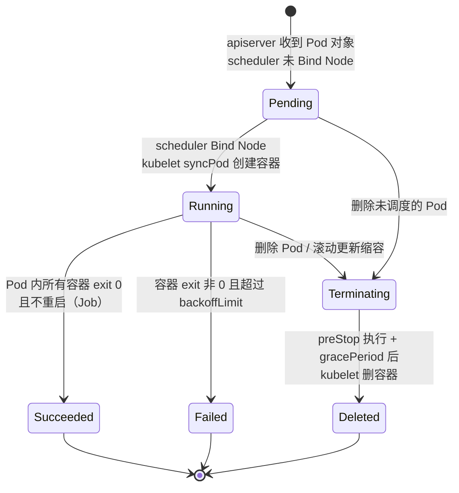
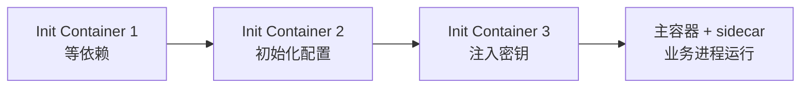
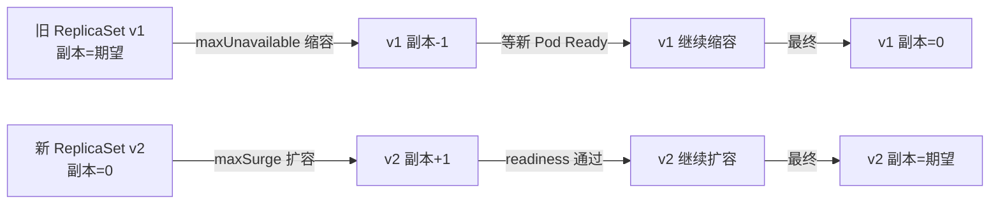
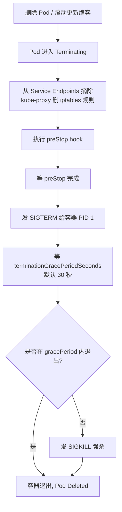

# Pod 与控制器

> **一句话定位**：Pod 是 K8s 最小调度单元，Pod 生命周期与 Deployment/StatefulSet 选型是面试必考点。
> **面试热度**：⭐⭐⭐⭐⭐
> **返回**：[K8s 知识图谱](../README.md)

---

## 一、概念定义

### 1.1 Pod 的本质

**一句话**：Pod 是一组**共享网络与存储**的容器，是 K8s 最小的调度与调度单元——不是"一个容器"。

容器底层（namespace/cgroups/unionfs、runc/containerd 调用链）详见 [容器本质与底层原理](../../docker/01-foundation/container-principle.md)、容器生命周期与状态机详见 [容器运行时与生命周期](../../docker/03-container/container-runtime.md)。本文不重复展开，只在 Pod 层讲共享与协作机制。

Pod 内所有容器共享两类资源：

- **网络命名空间**：同一 Pod 内所有容器共享同一个 IP 与端口空间（`lo` 互通、`eth0` 共用）。容器间通信用 `localhost:<port>` 即可。
- **存储卷（Volume）**：Pod 定义的 `volumes` 被所有容器共享挂载，容器重启不丢，但 Pod 重建后随 Volume 的回收策略决定是否保留。

但容器之间**不共享**：

- **PID 命名空间**：默认隔离（可通过 `shareProcessNamespace: true` 打开）。每个容器有自己的 PID 1。
- **文件系统**：除了共享挂载的 Volume，各自有独立的 rootfs（镜像层 + 可写层）。

> **核心心智模型**：Pod = 一个"逻辑主机"——容器间像同一台机器上的进程，共享 localhost 与挂载点，但各自是独立进程树与文件系统。

### 1.2 为什么是 Pod 而非容器

K8s 不直接调度容器，而是调度 Pod，是为了支持**主容器 + sidecar** 的协作模式：

| 模式 | 主容器职责 | sidecar 职责 | 为什么需要同一 Pod |
|------|-----------|-------------|---------------------|
| 日志采集 | 业务进程输出 stdout | Filebeat 挂载日志目录采集 | 共享 Volume 挂载点，Filebeat 直接读日志文件 |
| 服务网格 | 业务进程处理业务 | Istio envoy 代理出入流量 | 共享网络栈，envoy 拦截 localhost 出站流量 |
| 密钥注入 | 业务进程读密钥 | Vault agent 拉取密钥写共享 Volume | 共享 Volume，业务进程从文件读密钥 |
| 监控代理 | 业务进程暴露 metrics | Prometheus agent 采集 | 共享网络，agent 直接访问 localhost:metrics |

**关键认知**：把 sidecar 与主容器放在同一 Pod，sidecar 能通过 localhost 访问主容器、共享 Volume 文件——这是单容器模型做不到的。

> **与 Docker 的关系**：Docker 没有原生的"容器组"概念，docker-compose 用 network 把多个容器连起来，但它们各自有独立 IP、不能共享 localhost。Pod 把"容器组"做成一等公民，调度原子单元。

### 1.3 Pod vs 容器对比表

| 维度 | 容器（Docker） | Pod（K8s） |
|------|---------------|-----------|
| 调度单元 | 容器自身（docker run 落在一台机） | Pod 整体被 scheduler 调度到某 Node |
| 网络隔离边界 | 单容器独立网络命名空间 | Pod 内容器共享同一 IP/端口空间 |
| 生命周期管理 | docker stop / restart 单容器 | Pod 内容器一起创建、一起销毁（部分重启见 §2.4） |
| 资源配额 | 单容器 cgroup 限制 | Pod 级 cgroup + 容器级 cgroup 双层 |
| 自愈 | docker restart policy（基于进程退出） | 控制器（Deployment 等）拉回期望副本数 |
| 多容器协作 | 需 docker-compose 或自定义网络 | 原生 Pod 内 sidecar 模式 |

### 1.4 五种控制器选型表

Pod 自身不保证副本数与自愈，需要**控制器**维持期望状态。K8s 内置五种工作负载控制器：

| 控制器 | 典型场景 | 副本/部署特征 | 关键字段 |
|--------|---------|--------------|---------|
| **Deployment** | 无状态服务（Web/API） | 滚动更新、可扩缩容、无稳定标识 | `replicas`、`strategy.rollingUpdate` |
| **StatefulSet** | 有状态服务（数据库/MQ） | 稳定网络标识、顺序部署、独立 PVC | `serviceName`、`volumeClaimTemplates`、`podManagementPolicy` |
| **DaemonSet** | 节点级 agent（日志/网络/监控） | 每个 Node 一个，新 Node 自动调度 | `nodeSelector`、`tolerations` |
| **Job** | 一次性批处理（数据迁移/计算） | 完成 exit 0 后退出，失败重试 | `completions`、`parallelism`、`backoffLimit` |
| **CronJob** | 定时任务（备份/报表） | Cron 表达式触发 Job | `schedule`、`concurrencyPolicy` |

> **核心选型**：无状态用 Deployment，有状态用 StatefulSet，节点级常驻用 DaemonSet，批处理用 Job，定时用 CronJob。面试问"你怎么选"就按这张表答。

### 1.5 Pod 与控制器的层级关系

```
┌──────────────────────────────────────────────────┐
│  Deployment / StatefulSet / DaemonSet / Job      │  ← 控制器（用户提交）
│  ┌────────────────────────────────────────────┐  │
│  │  ReplicaSet（Deployment 内部生成）          │  │  ← 副本管理
│  │  ┌──────────────────────────────────────┐ │  │
│  │  │  Pod（调度单元，含 1+ 容器）          │ │  │  ← 落到 Node
│  │  │  ┌──────────┐ ┌──────────┐           │ │  │
│  │  │  │ 主容器    │ │ sidecar  │           │ │  │
│  │  │  └──────────┘ └──────────┘           │ │  │
│  │  └──────────────────────────────────────┘ │  │
│  └────────────────────────────────────────────┘  │
└──────────────────────────────────────────────────┘
```

- **用户提交控制器**（如 Deployment yaml），不直接提交 Pod。
- 控制器的 controller（在 kube-controller-manager 内）持续 reconcile，按 `replicas` 期望值创建/删除 Pod。
- scheduler 把 Pod 调度到 Node，kubelet 通过 CRI 创建容器。
- **Pod 模板**（`template`）嵌在控制器 spec 里，控制器按模板生成 Pod。

> **关联**：控制器 reconcile 机制详见 [架构总览与核心组件](../01-foundation/k8s-architecture.md) §1.4 声明式 API 与 reconcile，kubelet syncPod 详见 §三 Q1。

---

## 二、原理与流程

### 2.1 Pod 生命周期状态机

Pod 从创建到销毁经历一组确定的状态，由 kubelet 驱动转换：



五种核心状态的语义：

| 状态 | 触发条件 | 是否分配 Node | 容器是否运行 |
|------|---------|--------------|-------------|
| Pending | apiserver 收到 Pod 对象，等 scheduler 调度 | 否（或 scheduler 已选但 kubelet 未建容器） | 否 |
| Running | Pod 已 Bind 到 Node，所有容器至少创建过一次 | 是 | 至少一个容器 running |
| Succeeded | 所有容器 exit 0 且 `restartPolicy=Never`/`OnFailure` 完成 | 是 | 否（容器已退出） |
| Failed | 所有容器退出，至少一个 exit 非 0 且未达预期 | 是 | 否 |
| Terminating | 收到删除请求，进入 gracePeriod 倒计时 | 是 | 运行中，等待 preStop + SIGTERM |

> **要点**：`Pending` 是 `kubectl get pod` 看到的初始态——scheduler 还在选 Node，或 kubelet 还在拉镜像、建容器。卡在 Pending 常见根因：资源不足（scheduler 无法 Bind）、镜像拉取失败（ImagePullBackOff）、pvc 未就绪。

### 2.2 Init Container

Init Container 在**主容器启动前**顺序执行，全部成功后主容器才启动。



- **顺序执行**：按定义顺序逐个跑，前一个 exit 0 才跑下一个。
- **失败则 Pod 失败**：任一 Init Container 失败（按 `restartPolicy` 重试耗尽）→ Pod 报错，主容器不启动。
- **资源独立**：Init Container 与主容器共享 Pod 的网络/Volume，但**资源限制按 Init 自己的 requests/limits**（取所有 Init 与主容器的最大值作为 Pod 级 cgroup 上限）。

**典型用途**：

1. **等待依赖**：等数据库可连通（如 `until nc -z db 5432; do sleep 1; done`）再启动主容器。
2. **初始化配置**：从 ConfigMap 渲染配置文件到共享 Volume，主容器读。
3. **安全注入密钥**：Init Container 用高权限 ServiceAccount 拉 Vault 密钥写共享 Volume，主容器以低权限只读密钥文件。

> **与 sidecar 的区别**：Init Container 跑完退出（exit 0 后不再运行）；sidecar 与主容器同生命周期，一直运行。两者都是 Pod 内辅助容器，但生命周期不同。

### 2.3 sidecar 模式

sidecar 与主容器**同时启动、共享 Pod 网络与 Volume**，长期运行：

| 场景 | sidecar 实现 | 与主容器协作 |
|------|-------------|-------------|
| 服务网格 | Istio envoy / Linkerd proxy | 注入 Pod，拦截 localhost 出站流量做 mTLS/熔断/限流 |
| 日志采集 | Filebeat / Fluentd | 挂载主容器的日志 Volume，读文件转发到 ES/Kafka |
| 监控代理 | Prometheus exporter | 访问主容器 localhost:metrics，scrape 后 push 给中心 |
| 密钥注入 | Vault agent | 定期刷新密钥写到共享 Volume，主容器读文件 |

> **关联**：sidecar 注入流程与 Istio 的 mutating webhook 详见 [CRD 与 Operator](../08-extensions/crd-and-operator.md) §Webhook。

### 2.4 容器探针三种

kubelet 通过**探针**判断容器状态，决定是否重启或摘流量：

| 探针 | 用途 | 失败后果 | 推荐场景 |
|------|------|---------|---------|
| **livenessProbe** | 判断容器是否"活着" | 失败次数达阈值 → kubelet 杀死容器、按 restartPolicy 重建 | 检测死锁/死循环（进程在但无响应） |
| **readinessProbe** | 判断容器是否"就绪"接流量 | 失败 → 从 Service Endpoints 摘除（不重启，只挡流量） | 启动慢/依赖未就绪时挡流量、滚动更新时摘旧 Pod |
| **startupProbe** | 判断容器是否"启动完成" | 启动期屏蔽 liveness/readiness；startup 成功后两者才生效 | 慢启动应用（Java JVM 预热、大型初始化） |

**三种探测方式**：

| 方式 | 配置 | 适用 |
|------|------|------|
| `httpGet` | 访问 HTTP 端点，2xx/3xx 算成功 | Web 应用（Spring Boot actuator） |
| `tcpSocket` | TCP 连接成功就算成功 | 数据库/消息队列 |
| `exec` | 在容器内执行命令，exit 0 算成功 | 自定义脚本检测 |

**三种探针协作链路**：

```
容器启动
    │
    ▼
[ startupProbe ]    ← 启动期只跑这个
    │ 成功
    ▼
[ livenessProbe ]   ← 判断死活，失败重启容器
[ readinessProbe ]  ← 判断是否接流量，失败摘流量
    │ readiness 通过
    ▼
Pod 加入 Service Endpoints（接流量）
```

> **核心区别**：liveness 失败**重启容器**（容器死锁恢复），readiness 失败**只摘流量不重启**（启动慢/依赖临时不可用时挡流量，不杀进程）。startup 是 liveness 的"启动期保护罩"——慢启动应用若直接配 liveness，启动期就会被重启。

### 2.5 Deployment 滚动更新

Deployment 是无状态服务最常用的控制器。修改 `spec.template`（镜像版本、环境变量等）触发**滚动更新**——逐步用新 ReplicaSet 替换旧 ReplicaSet。

**关键参数**（`strategy.rollingUpdate`）：

| 参数 | 默认 | 语义 |
|------|------|------|
| `maxSurge` | 25% | 扩容时新 ReplicaSet 可超过期望副本数的最大值（数量或百分比） |
| `maxUnavailable` | 25% | 缩容时旧 ReplicaSet 可低于期望副本数的最大值 |

**新旧 ReplicaSet 替换流程**：



- **maxSurge=1, maxUnavailable=0**：先扩新再缩旧，副本数始终 ≥ 期望，但会短暂超过期望（占资源）。
- **maxSurge=0, maxUnavailable=1**：先缩旧再扩新，副本数始终 ≤ 期望（资源不超限），但会有短暂容量下降。
- **maxSurge=1, maxUnavailable=1**：同时扩新缩旧，平衡速度与资源占用（默认 25%/25% 的等价语义）。

**回滚机制**：

- Deployment 保留历史 ReplicaSet（按 `revisionHistoryLimit` 默认 10 个），每个对应一个版本。
- `kubectl rollout undo deployment/<name>` 回到上一版本；`--to-revision=N` 回到指定版本。
- 回滚本质是把 `spec.template` 改回旧版本，再触发一次滚动更新。

> **核心**：滚动更新 = 新旧 ReplicaSet 副本数此消彼长，readinessProbe 决定新 Pod 何时算"就绪"可继续扩容。若 readinessProbe 没配或配得太宽松，新 Pod 还没 Ready 就被加入 Endpoints → 502。详见 §五 5.2。

### 2.6 StatefulSet 稳定标识

StatefulSet 用于有状态服务（数据库、消息队列），与 Deployment 的本质差异在**稳定标识**：

| 维度 | Deployment | StatefulSet |
|------|-----------|-------------|
| Pod 名 | 随机后缀（`app-abc123`） | 固定序号（`app-0`、`app-1`、`app-2`） |
| 网络标识 | 不稳定（Pod 重建名变） | 稳定（`app-0.<svc>.<ns>.svc.cluster.local`） |
| 部署顺序 | 并行（无序） | 顺序（`pod-0` 先，`pod-1` 后） |
| 删除顺序 | 并行删除 | 逆序删除（`pod-2` 先，`pod-0` 后） |
| 存储 | 所有 Pod 共享或无存储 | 每个 Pod 独立 PVC（`volumeClaimTemplates`） |

**稳定网络标识**：StatefulSet 必须配 `serviceName` 指向一个 Headless Service（`clusterIP: None`）。每个 Pod 拿到稳定 DNS 名：

```
<pod-name>.<headless-svc>.<namespace>.svc.cluster.local
# 例：mysql-0.mysql-h.default.svc.cluster.local
```

**顺序部署与删除**：

- **部署**：`pod-0` 先创建并 Ready 后，才创建 `pod-1`，依此顺序。
- **删除**：默认逆序（`pod-N` 先删，`pod-0` 后删）。
- `podManagementPolicy: Parallel` 可改为并行，但稳定标识不变。

**独立 PVC**：`volumeClaimTemplates` 为每个 Pod 生成独立 PVC，绑定独立 PV：

```yaml
volumeClaimTemplates:
- metadata:
    name: data
  spec:
    accessModes: ["ReadWriteOnce"]
    resources:
      requests:
        storage: 10Gi
# 每个 Pod 拿到独立 PVC：data-mysql-0、data-mysql-1、data-mysql-2
```

> **核心选型**：无状态用 Deployment（Pod 名随机、存储不关心）；有状态如数据库/MQ 用 StatefulSet（稳定网络标识让客户端能连固定 Pod、独立 PVC 保证数据隔离）。详见 §三 Q6。

### 2.7 DaemonSet 调度

DaemonSet 保证**每个 Node 运行一个 Pod 副本**，新 Node 加入集群自动调度。

| 特征 | 说明 |
|------|------|
| 副本数 | = Node 数（每个 Node 一个，不设 replicas） |
| 调度方式 | 默认每个 Node 都跑一个，可加 nodeSelector/affinity 限定子集 |
| 新 Node 加入 | 自动调度一个 Pod 到新 Node |
| Node 移除 | Pod 自动清理 |
| 不参与调度竞争 | 不与 Deployment 抢资源（绑 Node 不漂移） |

**典型用途**：

- 日志采集 agent（Filebeat / Fluentd）
- 网络插件（Calico / Cilium）
- 监控 agent（Node Exporter）
- 存储插件（CSI node plugin）

> **与 Deployment 副本数=Node 数的区别**：Deployment 副本数=Node 数只是巧合地每个 Node 一个，但 Node 挂了 Pod 会重新调度到其他 Node（可能两个 Pod 在一个 Node）；DaemonSet 绑 Node 不漂移，新 Node 自动调度。详见 §三 Q8。

### 2.8 Job 与 CronJob

Job 控制一次性批处理任务，CronJob 在 Cron 表达式触发时创建 Job。

**Job 关键字段**：

| 字段 | 语义 |
|------|------|
| `completions` | 期望成功完成的 Pod 数（默认 1） |
| `parallelism` | 并发运行的 Pod 数（默认 1） |
| `backoffLimit` | 失败重试上限（默认 6），超过后 Job 标 Failed |
| `activeDeadlineSeconds` | Job 整体超时，超时强制终止所有 Pod |

**CronJob 关键字段**：

| 字段 | 语义 |
|------|------|
| `schedule` | Cron 表达式（5 段：分 时 日 月 周），如 `0 2 * * *` 每天 2 点 |
| `concurrencyPolicy` | `Allow`（默认，可重叠）/`Forbid`（禁止重叠）/`Replace`（替换旧的） |
| `startingDeadlineSeconds` | 调度宽限期（错过太多则不启动） |
| `successfulJobsHistoryLimit` | 保留成功 Job 数（默认 3） |

> **核心**：Job 关注"完成"（exit 0 的 Pod 数 = completions），CronJob 关注"定时触发 Job"。失败重试受 `backoffLimit` 限制——指数退避（10s、20s、40s...），达到上限标 Failed。

---

## 三、高频追问与面试题

### Q1：Pod 为什么不是"一个容器"？

**参考答案**：Pod 是"一组共享网络与存储的容器"，不是单容器。两个原因：

1. **sidecar 协作模式**需要共享 localhost——日志采集 sidecar 要挂载主容器 Volume、Istio envoy 要拦截主容器出站流量、Vault agent 要把密钥写到共享 Volume 给主容器读。这些都依赖"同一 Pod 内容器共享网络栈与挂载点"，单容器或独立容器模型做不到。
2. **调度原子单元**——K8s 把"主容器 + sidecar"作为一个整体调度到一个 Node，保证它们同生命周期、同 Node。若用独立容器，调度器要保证两个容器落同一 Node、同时启停，复杂度爆炸。

> **关联**：§1.2 为什么是 Pod 而非容器、§1.3 Pod vs 容器对比表。

### Q2：Pod 内多容器的端口能冲突吗？

**参考答案**：能冲突，且会启动失败。同一 Pod 内所有容器共享同一网络命名空间（同一 IP 与端口空间），两个容器都监听 8080 → 第二个容器 bind 失败 → CrashLoopBackOff。

- **设计约束**：每个容器用不同端口（主容器 8080，sidecar 15090）。
- **验证**：`kubectl logs <pod> -c <container>` 看报错，通常是 `address already in use`。
- **修复**：改其中一个容器的监听端口，或用 `SO_REUSEPORT`（少见）。

> **关联**：§1.1 Pod 的本质、§1.3 Pod vs 容器对比表（网络共享）。

### Q3：liveness 和 readiness 的区别？

**参考答案**：失败行为不同。

| 维度 | livenessProbe | readinessProbe |
|------|---------------|-----------------|
| 判断什么 | 容器是否"活着" | 容器是否"就绪"接流量 |
| 失败后果 | 重启容器（杀容器重建） | 从 Service Endpoints 摘除（不重启） |
| 何时用 | 检测死锁/死循环（进程在但无响应） | 启动慢/依赖临时不可用时挡流量 |
| 滚动更新作用 | 不直接参与 | 新 Pod Ready 后才扩容、旧 Pod 摘流量后缩容 |

- liveness 失败重启容器，适合"进程在但卡死"的场景。
- readiness 失败只摘流量不重启，适合"启动慢、依赖临时不可用"的场景——等依赖恢复后 readiness 自然通过，流量重新进入。
- 滚动更新时，readinessProbe 决定新 Pod 何时加入 Endpoints、旧 Pod 何时被摘——这是滚动更新的核心开关。

> **关联**：§2.4 容器探针三种、§2.5 Deployment 滚动更新（readiness 决定扩容节奏）。

### Q4：Java 应用为什么需要 startup probe？

**参考答案**：JVM 预热慢，直接配 liveness 会被启动期重启。

- **问题**：Java 应用启动要加载类、Spring 容器初始化、JIT 编译，通常 30 秒到几分钟。若配 livenessProbe 且 `initialDelaySeconds` 不够，启动期 liveness 探测失败 → kubelet 杀容器重建 → 永远启动不完（CrashLoopBackOff）。
- **传统解法**：把 `initialDelaySeconds` 设得很大（如 120 秒），但这是"猜"启动时间——慢机器仍可能不够、快机器白白等待。
- **startup probe 解法**：配 `startupProbe`，启动期只跑 startup、屏蔽 liveness/readiness。startup 成功后两者才生效。`failureThreshold * periodSeconds` 要覆盖最长启动时间（如 `period=10, failureThreshold=30` 容忍 5 分钟）。

> **关联**：§2.4 容器探针三种、§四 4.1 Spring Boot 探针配置、[Java 应用上 K8s](../09-performance/java-on-k8s.md)——JVM 预热与 startupProbe。

### Q5：Deployment 滚动更新时 maxSurge=0 maxUnavailable=1 是什么策略？

**参考答案**：先缩后扩，资源占用不超限的保守策略。

- **maxSurge=0**：新 ReplicaSet 副本数不超过期望（不超额扩容）。
- **maxUnavailable=1**：旧 ReplicaSet 可低于期望 1 个（先缩 1 个旧 Pod）。
- **流程**：缩 1 个旧 Pod → 等 Endpoints 更新 → 扩 1 个新 Pod → 等 Ready → 再缩旧 → 再扩新 → 直至旧=0、新=期望。
- **特点**：副本数始终 ≤ 期望（资源不超限），适合资源紧张的集群。但会有短暂容量下降（少 1 个副本），若 readinessProbe 配错或新 Pod 启动慢，可用容量持续下降。
- **对比 maxSurge=1 maxUnavailable=0**：先扩新再缩旧，副本数始终 ≥ 期望（容量不降），但会短暂超期望（占资源）。

> **关联**：§2.5 Deployment 滚动更新、§五 5.2 502 排查案例（readinessProbe 与滚动更新）。

### Q6：StatefulSet 和 Deployment 的本质区别？

**参考答案**：稳定标识 + 顺序部署 + 独立 PVC。

| 维度 | Deployment | StatefulSet |
|------|-----------|-------------|
| Pod 名 | 随机后缀 | 固定序号（app-0/1/2） |
| 网络标识 | 不稳定 | 稳定 DNS（app-0.svc.ns.svc.cluster.local） |
| 部署顺序 | 并行 | 顺序（pod-0 先） |
| 删除顺序 | 并行 | 逆序（pod-N 先） |
| 存储 | 共享或无 | 每 Pod 独立 PVC（volumeClaimTemplates） |
| 适用 | 无状态（Web/API） | 有状态（DB/MQ/ZK） |

- **无状态用 Deployment**：Pod 名随机无妨，请求经 Service 负载均衡到任意 Pod。
- **有状态用 StatefulSet**：数据库主从选举要稳定网络标识连固定 Pod（客户端连 `mysql-0` 当主），数据要独立存储（每个 Pod 独立 PVC，Pod 重建 PVC 还在）。

> **关联**：§2.6 StatefulSet 稳定标识、[Volume 与 PV/PVC](../04-storage/volume-and-pv-pvc.md)——StatefulSet 持久化与 volumeClaimTemplates。

### Q7：StatefulSet 的 Pod 为什么 pod-0 先启动？

**参考答案**：顺序部署保证依赖链，用于有状态服务的选举与初始化。

- **依赖链**：集群型服务（如 etcd / ZooKeeper / MySQL 主从）通常 `pod-0` 是"种子"节点，`pod-1` 启动时要连 `pod-0` 加入集群或同步数据。
- **顺序保证一致性**：若并行启动，`pod-1` 在 `pod-0` 还没 Ready 时启动 → 连不上种子 → 启动失败或脑裂。
- **pod-0 Ready 后才创建 pod-1**：StatefulSet 等 `pod-0` 的 readinessProbe 通过才创建下一个，保证依赖链。
- `podManagementPolicy: Parallel` 可关闭顺序（适合无依赖的有状态服务，如独立分片），但稳定标识仍保留。

> **关联**：§2.6 StatefulSet 稳定标识、§2.4 容器探针（readiness 决定顺序部署的推进）。

### Q8：DaemonSet 与 Deployment 副本数=Node 数有什么区别？

**参考答案**：调度方式与节点绑定不同。

| 维度 | DaemonSet | Deployment 副本数=Node 数 |
|------|-----------|--------------------------|
| 副本数 | 自动=Node 数 | 手动设 = Node 数 |
| 节点绑定 | 绑定 Node，不漂移 | 不绑，scheduler 选 Node |
| 新 Node 加入 | 自动调度一个 Pod | 不自动（副本数固定） |
| Node 挂了 | Pod 跟着没了（不重调度） | Pod 重新调度到其他 Node（可能两个在一台） |
| 适用 | 节点级 agent（日志/网络/监控） | 无状态服务刚好每 Node 一个（少见） |

- DaemonSet 是"每 Node 一个"的语义保证——新 Node 自动补、Node 挂了不重调度（因为就是给这个 Node 用的）。
- Deployment 副本数=Node 数只是巧合，Node 挂了 Pod 会跑到别的 Node（可能两个 Pod 在同一 Node，违反"每 Node 一个"语义）。

> **关联**：§2.7 DaemonSet 调度。

---

## 四、实战关联（Java 后端视角）

### 4.1 Spring Boot 应用作为 Deployment 部署

Spring Boot 应用是典型的无状态服务，用 Deployment 部署，readiness/liveness/startup 三探针对接 actuator。

**Deployment 配置示例**：

```yaml
apiVersion: apps/v1
kind: Deployment
metadata:
  name: order-service
spec:
  replicas: 3
  selector:
    matchLabels: { app: order-service }
  template:
    metadata:
      labels: { app: order-service }
    spec:
      containers:
      - name: app
        image: order-service:1.0
        ports: [{ containerPort: 8080 }]
        startupProbe:                     # JVM 预热慢，先跑 startup
          httpGet: { path: /actuator/health, port: 8080 }
          periodSeconds: 10
          failureThreshold: 30           # 容忍 5 分钟预热
        livenessProbe:                    # startup 成功后生效
          httpGet: { path: /actuator/health/liveness, port: 8080 }
          periodSeconds: 10
          failureThreshold: 3
        readinessProbe:                   # startup 成功后生效
          httpGet: { path: /actuator/health/readiness, port: 8080 }
          periodSeconds: 5
          failureThreshold: 2
        lifecycle:
          preStop:                        # 优雅关闭，详见 §五 5.2 与 java-on-k8s
            exec:
              command: ["sh", "-c", "sleep 10"]
        terminationGracePeriodSeconds: 60
```

**Spring Boot application.yml**：

```yaml
management:
  endpoint:
    health:
      probes:
        enabled: true                   # 暴露 liveness/readiness 子端点
  health:
    livenessstate:
      enabled: true                     # 基于 ApplicationState 的 liveness
    readinessstate:
      enabled: true                      # 基于 ApplicationState 的 readiness
server:
  shutdown: graceful                    # 优雅停机
spring:
  lifecycle:
    timeout-per-shutdown-phase: 30s
```

- **startupProbe 对接 `/actuator/health`**：启动期只要 actuator 能响应即认为启动完成，让 liveness/readiness 接管。
- **livenessProbe 对接 `/actuator/health/liveness`**：Spring Boot 2.3+ 内建 liveness state，应用主动上报"活着"。
- **readinessProbe 对接 `/actuator/health/readiness`**：Spring Boot 2.3+ 内建 readiness state，应用主动上报"是否接流量"。

> **关联 `framework/spring-framework` 模块**：该模块有 `ContextClosedEvent` 与 `@PreDestroy` 的执行顺序实例，对照理解 Spring Boot 2.3+ 的 graceful shutdown 与 readinessProbe 摘流量协作——Pod 被 kubelet 杀时，SIGTERM 到 JVM，Spring 发 `ContextClosedEvent`，graceful shutdown 等 in-flight 请求完成，readinessProbe 返回 DOWN 让 Endpoints 摘除。**关联 `framework/valid` 模块**：actuator/health 端点可作为自定义校验的接口示例。

### 4.2 JVM 预热慢的 startup probe 配置

Java 应用启动慢的根因与 startupProbe 配置策略：

- **慢启动根因**：类加载（Spring Boot fat jar 加载大量类）、Bean 初始化、JIT 编译（解释执行→C1/C2 编译）、连接池预热。冷启动 30 秒到 2 分钟，大应用甚至 5 分钟。
- **传统陷阱**：只配 livenessProbe + 大 `initialDelaySeconds`（如 120 秒）——慢机器仍可能不够、快机器白白等待 120 秒才接流量。
- **startup probe 推荐配置**：`initialDelaySeconds=0` + `periodSeconds=10` + `failureThreshold=30`（容忍 5 分钟预热），对接 `/actuator/health`。
- **启动完成后让位**：startup 成功后，liveness/readiness 接管，后续探测按各自周期跑。

> **关联 `java-core/jvm` 模块**：JVM 类加载与初始化实例（`com.yintp.jvm.classload.ClassLoadTest`、`com.yintp.jvm.classinit.ClassInitTest1~9`）解释启动慢的根因。JVM ShutdownHook 与 Pod `terminationGracePeriodSeconds` 的协作详见 [Java 应用上 K8s](../09-performance/java-on-k8s.md)。

### 4.3 Pod 优雅关闭与 preStop

Pod 删除时的完整关闭链路（kubelet 驱动）：



**Java 应用的关闭链路**：

- `preStop` 先执行（如 `sleep 10`）——给 kube-proxy 同步 Endpoints、摘流量留时间，避免 SIGTERM 时还在收新请求。
- SIGTERM 到 JVM → JVM 启动 ShutdownHook 线程 → Spring 发 `ContextClosedEvent` → graceful shutdown 等 in-flight 请求 → 销毁 bean（`@PreDestroy`）→ JVM 退出。
- 若 `terminationGracePeriodSeconds`（默认 30 秒）不够 ShutdownHook 执行完 → SIGKILL 强杀 → ShutdownHook 中断。

> **关联 `java-core/jvm` 模块**：JVM ShutdownHook 是普通线程，由 JVM 在退出前启动，超时被 SIGKILL 中断。完整关闭链路与 preStop/探针对接 actuator 详见 [Java 应用上 K8s](../09-performance/java-on-k8s.md)。

---

## 五、面试案例

### 5.1 "你的 Spring Boot 应用上 K8s，探针怎么配？"——3 分钟标准答法

**面试官**：你的 Spring Boot 应用上 K8s，探针怎么配？

**3 分钟标准答法**：

> 我会配三探针：startup、liveness、readiness，全部对接 Spring Boot actuator 的健康端点。
>
> 首先是 **startupProbe**。Java 应用 JVM 预热慢——类加载、Spring 容器初始化、JIT 编译，冷启动可能 1 到 2 分钟，大应用甚至 5 分钟。如果直接配 livenessProbe 且 initialDelay 不够，启动期 liveness 探测失败 kubelet 就会杀容器重建，永远启动不完，CrashLoopBackOff。所以先配 startupProbe，对接 `/actuator/health`，`period=10, failureThreshold=30`，容忍 5 分钟预热。startup 成功前 liveness 和 readiness 都不生效，启动完成后它们接管。
>
> 然后是 **livenessProbe**，对接 `/actuator/health/liveness`。这是 Spring Boot 2.3+ 内建的 liveness state 端点，应用主动上报"活着"。`period=10, failureThreshold=3`，连续 3 次失败 kubelet 杀容器重建。用来检测死锁/死循环这种"进程在但卡死"的情况。
>
> 最后是 **readinessProbe**，对接 `/actuator/health/readiness`，应用主动上报"是否就绪接流量"。`period=5, failureThreshold=2`，失败从 Service Endpoints 摘除，不重启。滚动更新时新 Pod readiness 通过才加入 Endpoints、旧 Pod 摘流量后才缩容——这是滚动更新的核心开关。
>
> Spring Boot 侧要配 `management.endpoint.health.probes.enabled=true` 暴露 liveness/readiness 子端点，`management.health.livenessstate.enabled=true` 与 `readinessstate.enabled=true` 启用基于 ApplicationState 的状态上报。再配 `server.shutdown=graceful` 和 `spring.lifecycle.timeout-per-shutdown-phase=30s` 做优雅停机，配合 preStop hook 让流量先摘干净再 SIGTERM。

**结构要点**：三探针分工（startup 屏蔽启动期 / liveness 重启死锁 / readiness 摘流量）→ actuator 端点对接 → Spring Boot 侧配置 → 优雅关闭配合。

**追问链**：

| 追问 | 标准答法 |
|------|---------|
| startupProbe 和把 liveness 的 initialDelay 设大有什么区别？ | startup 是"探测直到成功"，不猜时间；initialDelay 是"猜一个固定延迟"，慢机器不够、快机器白等 |
| readinessProbe 失败为什么不重启？ | 启动慢/依赖临时不可用是正常的，重启反而打断启动；等依赖恢复 readiness 自然通过 |
| 滚动更新时 readiness 起什么作用？ | 新 Pod readiness 通过才扩容、旧 Pod 摘流量后才缩容，保证可用容量不降 |

### 5.2 "Deployment 滚动更新时部分请求报 502，怎么排查？"——readiness/优雅关闭

**面试官**：你的 Deployment 滚动更新时，部分请求报 502，怎么排查？

**排查链**：

| 步骤 | 检查 | 结论 |
|------|------|------|
| 1. 看 readinessProbe 是否配置 | 没配 → 新 Pod 一启动就加入 Endpoints，但应用还没 Ready → 502 | 配 readinessProbe，对接 actuator/health/readiness |
| 2. 看 readinessProbe 的宽松度 | `initialDelaySeconds` 太小 / `failureThreshold` 太小 → 启动期就通过 → 502 | 加大 initialDelay 或改用 startupProbe |
| 3. 看旧 Pod 缩容时的优雅关闭 | 没 preStop / `terminationGracePeriodSeconds` 太短 → SIGTERM 时还在收新请求 + in-flight 被强杀 | 加 preStop `sleep 10` 让流量先摘，加大 gracePeriod |
| 4. 看 kube-proxy iptables 同步延迟 | Endpoints 更新到 iptables 规则生效有延迟，旧 Pod 已 SIGTERM 但 iptables 还在转发 | preStop sleep 抵消同步延迟 |
| 5. 看应用是否注册 SIGTERM handler | Spring Boot < 2.3 或未配 graceful shutdown → SIGTERM 被忽略 → 等 30 秒 SIGKILL，in-flight 请求丢 | 升级 + 配 server.shutdown=graceful |

**根因分类**：

```
滚动更新 502
├── 新 Pod 502（接了流量但没 Ready）
│   ├── 没配 readinessProbe
│   │   └── 修复：配 readinessProbe 对接 actuator
│   └── readinessProbe 太宽松（initialDelay 太小）
│       └── 修复：改用 startupProbe 屏蔽启动期
└── 旧 Pod 502（已被摘流量但还在处理 / 被 SIGKILL）
    ├── 没有 preStop hook
    │   └── 修复：加 preStop sleep 10 抵消 iptables 同步延迟
    ├── terminationGracePeriodSeconds 太短
    │   └── 修复：加大到 60 秒以上
    └── 应用未注册 SIGTERM handler（Spring Boot < 2.3）
        └── 修复：升级 + 配 server.shutdown=graceful
```

**终极配置**：

```yaml
template:
  spec:
    containers:
    - name: app
      readinessProbe:
        httpGet: { path: /actuator/health/readiness, port: 8080 }
      lifecycle:
        preStop:
          exec:
            command: ["sh", "-c", "sleep 10"]   # 抵消 iptables 同步延迟
      terminationGracePeriodSeconds: 60          # 给 ShutdownHook 足够时间
```

> **关联**：§2.4 容器探针（readiness 决定扩容节奏）、§4.3 Pod 优雅关闭与 preStop、[Java 应用上 K8s](../09-performance/java-on-k8s.md)——preStop 优雅关闭与探针对接 actuator 的完整链路。

---

## 六、参考与延伸

- **官方文档**：Pod Lifecycle、Init Containers、Deployments、StatefulSets、DaemonSets、Jobs、CronJobs、Container Probes（kubernetes.io/docs）
- **源码包**：
  - `k8s.io/kubernetes/pkg/kubelet`——kubelet syncPod、probe manager、preStop 执行入口
  - `k8s.io/kubernetes/pkg/controller/deployment`——Deployment controller 滚动更新 reconcile
  - `k8s.io/kubernetes/pkg/controller/statefulset`——StatefulSet 顺序部署与 PVC 管理
- **延伸阅读（跨文档）**：
  - [架构总览与核心组件](../01-foundation/k8s-architecture.md)——kubelet 与 Pod 协作、reconcile 循环、声明式 API
  - [Service 与 Ingress](../03-network/service-and-ingress.md)——Service 通过 Endpoints 发现 Pod、kube-proxy 转发规则
  - [Volume 与 PV/PVC](../04-storage/volume-and-pv-pvc.md)——StatefulSet 持久化与 volumeClaimTemplates
  - [CRD 与 Operator](../08-extensions/crd-and-operator.md)——sidecar 注入的 mutating webhook、Informer/Controller 机制
  - [Java 应用上 K8s](../09-performance/java-on-k8s.md)——preStop 优雅关闭与探针对接 actuator 的完整链路、JVM 预热
- **仓库内关联**：
  - [容器运行时与生命周期](../../docker/03-container/container-runtime.md)——容器状态机、docker stop 信号链（Pod 内容器沿用底层机制，本文不重复展开）
  - [容器本质与底层原理](../../docker/01-foundation/container-principle.md)——namespace/cgroups（Pod 共享网络命名空间的底层）
  - `framework/spring-framework`——Spring Boot 2.3+ graceful shutdown、`ContextClosedEvent`、actuator/health 端点
  - `framework/valid`——actuator/health 端点作为自定义校验接口示例
  - `java-core/jvm`——JVM ShutdownHook 与 Pod terminationGracePeriodSeconds 协作、JVM 类加载与启动慢根因

> **返回**：[K8s 知识图谱](../README.md)
