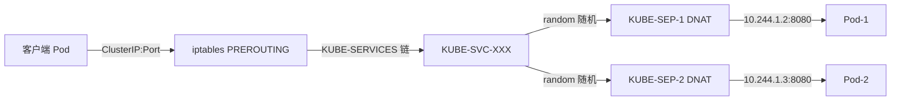
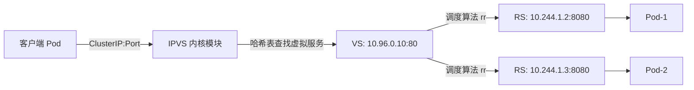
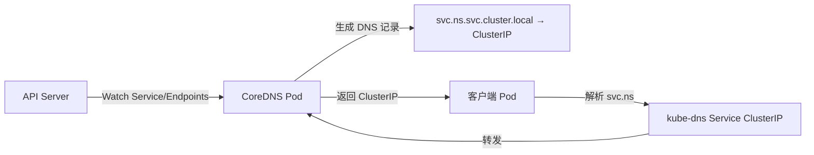

# Service 与 Ingress

> **一句话定位**：Service 是 K8s 服务发现的基石，kube-proxy 的 iptables/ipvs 数据路径是面试高频追问重灾区。
> **面试热度**：⭐⭐⭐⭐⭐
> **返回**：[K8s 知识图谱](../README.md)

---

## 一、概念定义

### 1.1 Service 的本质

**一句话**：Service 是为一组 Pod（通过 `labelSelector` 关联）提供**稳定虚拟 IP（ClusterIP）和 DNS 名**的抽象，负载均衡流量到后端 Pod——是 K8s 服务发现的核心原语。

Pod 的 IP 是易变的——重建后几乎必然变化（容器 netns 重建、CNI 重新分配 IP）。容器网络的 veth/bridge/iptables 底层机制详见 [Docker 网络模型](../../docker/04-network/docker-network.md)，本文不重复展开，只在 Service 层讲稳定入口与负载均衡机制。

Service 解决的核心矛盾：IP 易变（→ ClusterIP 稳定虚拟 IP + DNS 名）、多副本分发（→ kube-proxy iptables/ipvs DNAT）、服务发现（→ CoreDNS 监听 Service 生成 A 记录）、解耦生命周期（→ Endpoints controller 持续 reconcile Pod 列表）。

> **核心心智模型**：Service = 稳定入口（ClusterIP + DNS）+ 后端 Pod 列表（Endpoints）+ 转发规则（kube-proxy）。三者协作把"易变 Pod IP"包装成"稳定服务名"。

### 1.2 Service 四种类型对比

K8s 内置四种 Service 类型，按暴露范围递增：

| 类型 | 暴露方式 | 端口范围 | 典型场景 | 是否需外部 LB |
|------|---------|---------|---------|--------------|
| **ClusterIP**（默认） | 集群内虚拟 IP，仅集群内可达 | 任意 | 内部服务互访（Spring Boot 间调用） | 否 |
| **NodePort** | ClusterIP + 每个 Node 暴露端口 | 30000-32767（`--service-node-port-range`） | 简单对外暴露、调试、自建 LB 接入 | 否 |
| **LoadBalancer** | NodePort + 云厂商 LB | 30000-32767（NodePort）+ LB VIP | 云上对外暴露（云厂商提供 LB） | 是（云厂商 LB） |
| **ExternalName** | CNAME 到外部域名，无 ClusterIP | 无端口 | 集群内访问外部服务（如 `mydb.rds.aliyuncs.com`） | 否 |

**层级关系**：LoadBalancer（最外 LB VIP）→ NodePort（每 Node 端口）→ ClusterIP（集群内虚拟 IP）→ Endpoints（后端 Pod IP:Port）。ClusterIP 是基础，NodePort 在其上暴露到每 Node，LoadBalancer 在 NodePort 之上加云 LB，ExternalName 是特例（不分配 ClusterIP，DNS 返回 CNAME，kube-proxy 不写规则）。

> **核心选型**：内部互访用 ClusterIP，简单对外用 NodePort，云上对外用 LoadBalancer，访问外部服务用 ExternalName。

### 1.3 Endpoints 与 EndpointSlice

Service 的后端 Pod 列表由 **Endpoints**（或 EndpointSlice）维护：

| 维度 | Endpoints | EndpointSlice |
|------|-----------|---------------|
| 结构 | 单对象，含所有 Pod IP:Port | 分片，每片最多 100 个端点 |
| 规模上限 | 大规模（>1000 Pod）时单对象臃肿，apiserver/watch 压力大 | 分片支持大规模后端，watch 增量更新 |
| 默认 | 早期默认（仍兼容） | K8s 1.18+ 默认开启 `EndpointSlice` |

**维护流程**：Service 定义 `selector`（如 `{ app: order-service }`）和 `ports`；Endpoints controller（在 kube-controller-manager 内）Watch Service 与 Pod 变更，匹配 `selector` 且 `readinessProbe` 通过的 Pod 加入 Endpoints，未就绪或被摘除的移除。Pod 删除时 IP 从 Endpoints 移除，Service 流量不再转发。

> **关联**：readinessProbe 与 Endpoints 协作详见 [Pod 与控制器](../02-workload/pod-and-controllers.md) §2.4 容器探针——readiness 失败摘流量、滚动更新时新 Pod readiness 通过才加入 Endpoints。

### 1.4 Service 与 Endpoints 的层级关系

Service、Endpoints、kube-proxy 三者协作：

- **用户提交 Service**（yaml 定义 selector + port + type），不直接操作 Endpoints。
- **Endpoints controller**（kube-controller-manager 内）持续 reconcile，按 selector 匹配 Pod、按 readinessProbe 过滤，维护 IP:Port 列表。
- **kube-proxy** 在每个 Node Watch Service/Endpoints 变更，生成 iptables/ipvs 规则。
- **数据面**：客户端访问 ClusterIP → iptables/ipvs DNAT 到后端 Pod。

> **关联**：声明式 API 与 reconcile 机制详见 [架构总览与核心组件](../01-foundation/k8s-architecture.md) §1.4，Endpoints controller 是 kube-controller-manager 内众多 controller 之一。

---

## 二、原理与流程

### 2.1 kube-proxy 三种模式

kube-proxy 是每个 Node 上运行的 agent，负责把 Service 的 ClusterIP 流量转发到后端 Pod。三种工作模式：

| 模式 | 数据路径 | 性能 | 规则复杂度 | 默认 |
|------|---------|------|-----------|------|
| **userspace**（早期，已弃用） | 流量经 kube-proxy 进程中转 | 最差（用户态转发） | 中 | K8s 1.2 前默认 |
| **iptables** | kube-proxy 生成 iptables 规则，流量内核态 DNAT | 好（内核态） | O(N)，随 Service×Pod 线性增长 | K8s 1.2-1.21 默认 |
| **ipvs** | kube-proxy 调用 netlink 创建 IPVS 虚拟服务 | 最好（内核态，哈希表） | O(1)，每 Service 一条规则 | K8s 1.22+ 默认推荐 |

**选型**：userspace 仅历史遗留；iptables 小规模（Service×Pod < 1 万）够用，大规模规则链过长性能下降；ipvs 大规模首选，规则数 O(1) 且支持多种调度算法。

> **核心**：iptables 规则数随 Service×Pod 线性增长（O(N)），ipvs 每 Service 一条虚拟服务规则（O(1)）。大规模集群（Service×Pod > 1 万）应切 ipvs。

### 2.2 iptables 模式数据路径

iptables 模式下，kube-proxy Watch Service/Endpoints 变更，生成 iptables 规则链，流量在 netfilter 的 PREROUTING 钩子做 DNAT：



**规则链层级**：

| 链 | 作用 | 规则示例 |
|----|------|---------|
| `KUBE-SERVICES` | 入口链，按目标 ClusterIP:Port 分发到对应 Service 链 | `-d 10.96.0.10/32 --dport 80 -j KUBE-SVC-XXX` |
| `KUBE-SVC-XXX` | 每个 Service 一条，做随机负载均衡分发到 SEP 链 | `-m statistic --mode random --probability 0.5 -j KUBE-SEP-1` |
| `KUBE-SEP-XXX` | 每个后端 Pod 一条，DNAT 到 Pod IP:Port | `-j DNAT --to-destination 10.244.1.2:8080` |

**负载均衡机制**：iptables 用 `-m statistic --mode random --probability` 实现随机分发——每条 KUBE-SVC 规则按概率跳转到不同 KUBE-SEP 链，概率均分时即等概率负载均衡。

**规则数复杂度**：每个 Service 有 1 条 KUBE-SVC + N 条 KUBE-SEP（N = 后端 Pod 数）。集群总规则数 ≈ Service × (1 + Pod)。1000 Service × 10 Pod = 1.1 万条规则，iptables 遍历开销显著。

> **关联**：iptables/netfilter 钩子与 DNAT/SNAT 机制详见 [Docker 网络模型](../../docker/04-network/docker-network.md) §2.1.5 端口映射原理——Docker 的 `-p` 端口映射与 K8s Service 的 ClusterIP DNAT 是同一套 netfilter 机制。

### 2.3 ipvs 模式数据路径

ipvs（IP Virtual Server）模式用 Linux 内核的 IPVS 模块，kube-proxy 调用 netlink 创建虚拟服务，流量在内核态哈希表查找后 DNAT：



**IPVS 核心概念**：VS（Virtual Service，对应 ClusterIP:Port）、RS（Real Server，对应 Pod IP:Port）、调度算法（VS 按 scheduler 选 RS 转发）。

**ipvs 调度算法**：

| 算法 | 语义 |
|------|------|
| `rr`（默认） | 轮询，依次分发 |
| `lc` | 最少连接，优先发给当前连接数最少的 RS |
| `dh` / `sh` | 目标/源哈希，按 IP 哈希选 RS（会话保持） |
| `sed` / `nq` | 最短期望延迟 / 永不排队，考虑 RS 响应速度 |

**规则数复杂度**：每个 Service 一条 VS，后端 RS 在 IPVS 哈希表内。1000 Service × 10 Pod = 1000 条 VS 规则（与 Pod 数无关），复杂度 O(1)。

**为什么 ipvs 没有完全替代 iptables**：部分场景仍需 iptables 补充——masquerade（Pod 出网 SNAT，ipvs 不处理 SNAT，仍由 iptables POSTROUTING 的 KUBE-MASQ 链完成）、NodePort 入站 DNAT、NetworkPolicy。ipvs 负责 Service 的 ClusterIP 负载均衡（O(1) 哈希查找），iptables 负责 masquerade/NodePort 入站/网络策略等辅助规则，两者协作而非互斥。

### 2.4 Service 负载均衡完整链路

客户端（同集群 Pod）访问 Service 的完整数据流向，含 DNS 解析前缀与 conntrack 反向 NAT：

1. **DNS 解析**：客户端访问 `order-service.default:80`，CoreDNS 解析为 ClusterIP `10.96.0.10`。
2. **连接 ClusterIP**：客户端发 SYN 到 `10.96.0.10:80`，包到本 Node eth0。
3. **PREROUTING DNAT**：netfilter PREROUTING 命中 KUBE-SERVICES 链，按 KUBE-SVC → KUBE-SEP 随机选后端 DNAT 到 Pod IP（如 `10.244.1.2:8080`）。
4. **路由到 Pod**：目标改为 Pod IP 后，路由决策把包发到 Pod 所在 Node（或本 Node）。
5. **Pod 处理**：后端 Pod `accept()` 处理请求，响应包源 `10.244.1.2`、目标客户端 IP。
6. **响应返回**：conntrack 记录了 DNAT 连接，反向自动把源改回 `10.96.0.10`，客户端看到的响应来自 ClusterIP。

> **关键**：ClusterIP 是**虚拟 IP**，不绑定任何网卡，也不响应 ARP——它只在 iptables/ipvs 规则里"存在"。流量到 ClusterIP 全靠 netfilter 在 PREROUTING 钩子 DNAT。详见 §三 Q3。

### 2.5 Headless Service

Headless Service 是 `clusterIP: None` 的特殊 Service，**不分配 ClusterIP，kube-proxy 不写规则**。DNS 查询直接返回后端 Pod IP 列表：

```bash
# 普通 Service: DNS 返回 ClusterIP
$ nslookup order-service
Address:   10.96.0.10   # ClusterIP

# Headless Service: DNS 返回 Pod IP 列表
$ nslookup mysql-h
Address:   10.244.1.2   # Pod-0 IP
Address:   10.244.1.3   # Pod-1 IP
Address:   10.244.1.4   # Pod-2 IP
```

**用途**：

- **StatefulSet 稳定标识**：StatefulSet 必须配 Headless Service，每个 Pod 拿到稳定 DNS 名 `<pod-name>.<svc>.<ns>.svc.cluster.local`（如 `mysql-0.mysql-h.default.svc.cluster.local`），客户端连固定 Pod。
- **客户端自负载均衡**：客户端拿到 Pod IP 列表后自己选（如 gRPC 客户端负载均衡、Redis 客户端分片），不依赖 kube-proxy。

> **关联**：StatefulSet 与 Headless Service 协作详见 [Pod 与控制器](../02-workload/pod-and-controllers.md) §2.6 StatefulSet 稳定标识——`serviceName` 指向 Headless Service 是稳定网络标识的基础。

### 2.6 Ingress 与 Ingress Controller

Service 是 L4（TCP/UDP）负载均衡，**Ingress 是 L7（HTTP/HTTPS）路由规则**，按 host/path 转发到 Service：

| 维度 | Service | Ingress |
|------|---------|---------|
| 工作层 | L4（TCP/UDP） | L7（HTTP/HTTPS） |
| 路由依据 | 仅 IP:Port | host + path（如 `api.example.com/v1` → svc-a） |
| 负载均衡 | kube-proxy iptables/ipvs | Ingress Controller（nginx/traefik）自身 |
| 典型场景 | 内部服务互访 | 对外 Web API、按域名/路径分发 |

**分工**：Ingress 是 K8s 资源对象（`networking.k8s.io/v1`），用户提交路由规则（host/path → Service）；Ingress Controller 是实际跑的 Pod（nginx-ingress/traefik），Watch Ingress 资源变更，把规则翻译成自己的配置（如 nginx.conf）。Ingress Controller 自己以 Deployment + LoadBalancer Service 部署，外部流量经云 LB → Ingress Controller Pod → 按 host/path 转发到后端 Service。

**Ingress 示例**：

```yaml
apiVersion: networking.k8s.io/v1
kind: Ingress
metadata:
  name: api-ingress
  annotations:
    nginx.ingress.kubernetes.io/rewrite-target: /
spec:
  rules:
  - host: api.example.com
    http:
      paths:
      - path: /v1
        pathType: Prefix
        backend:
          service: { name: order-service-v1, port: { number: 80 } }
      - path: /v2
        pathType: Prefix
        backend:
          service: { name: order-service-v2, port: { number: 80 } }
```

流量经 Ingress Controller 按 `api.example.com/v1` → `order-service-v1:80`、`/v2` → `order-service-v2:80` 路由。

> **核心**：Ingress 是规则，Ingress Controller 是实现。K8s 内置 Ingress 资源但不内置 Controller，需自行部署 nginx-ingress/traefik 等。

### 2.7 CoreDNS 架构

CoreDNS 是 K8s 的默认 DNS 服务，监听 Service/Endpoints 变更生成 DNS 记录：



**DNS 记录规则**：

| 记录类型 | 格式 | 解析结果 |
|---------|------|---------|
| A 记录（普通 Service） | `<svc>.<ns>.svc.cluster.local` | ClusterIP |
| A 记录（Headless Service） | `<svc>.<ns>.svc.cluster.local` | 后端 Pod IP 列表 |
| SRV 记录 | `_<port>._tcp.<svc>.<ns>.svc.cluster.local` | 端口与 Pod IP |

**部署**：CoreDNS 以 Deployment 部署（通常 2 副本），暴露为 `kube-dns` Service（ClusterIP 通常 `10.96.0.10`，集群首个 Service IP）；Pod 的 `/etc/resolv.conf` 的 `nameserver` 指向它。CoreDNS 通过 `kubernetes` 插件 Watch API Server 的 Service/Endpoints 变更动态生成 DNS 记录，**TTL 默认 5s**（客户端缓存 5 秒，Service 变更后最多 5 秒感知）。

> **关联**：CoreDNS 与 [架构总览与核心组件](../01-foundation/k8s-architecture.md) §六大核心组件的 kube-dns 介绍对照，CoreDNS 是 addon 而非核心组件，但生产必备。

### 2.8 CNI 插件原理

CNI（Container Network Interface）负责为 Pod 分配 IP、配置 veth pair、打通跨节点网络。K8s 通过 CNI 接口调用插件，与 Docker 自有的 CNM 模型不同（详见 [Docker 网络模型](../../docker/04-network/docker-network.md) §1.3 CNM 与 K8s CNI 的边界）。

**主流 CNI 插件对比**：

| 插件 | 数据面 | 适用规模 | 特点 |
|------|--------|---------|------|
| **Flannel** | VXLAN（默认）/ Host-Gateway / WireGuard | 小到中 | 简单易用，无网络策略，Overlay 默认 |
| **Calico** | BGP 路由（无 Overlay）/ VXLAN 可选 | 中到大规模 | 无 Overlay 性能好，支持 NetworkPolicy，生产主流 |
| **Cilium** | eBPF（内核可编程） | 大规模 | eBPF 数据面高性能，L7 可观测，取代 kube-proxy |

**工作流程**（kubelet 调用）：kubelet 创建 Pod 时调用 CNI 插件二进制（如 `/opt/cni/bin/calico`），插件为 Pod 创建 veth pair、分配 IP（从 IPAM 插件）、配置路由。跨节点通信：Flannel VXLAN 封装 L2 帧跨 L3；Calico BGP 让各 Node 交换 Pod 子网路由，无封装直连。

**Flannel VXLAN vs Calico BGP**：Flannel VXLAN Overlay 封装，跨节点包套 VXLAN/UDP 头，MTU 降 50 字节，简单易用适合小集群；Calico BGP 无 Overlay，各 Node 用 BGP 交换 Pod 子网路由，跨节点包直传无封装，性能接近原生，适合大规模生产。

> **关联**：VXLAN 封装原理、Flannel/Calico/Cilium 深度对比、Service Mesh 与 eBPF 数据面详见 [云原生网络](../../network/05-system-design/cloud-native.md)——本文不展开，仅引用。

---

## 三、高频追问与面试题

### Q1：Service 和 Endpoints 的关系？

**参考答案**：Service 定义"前端"（selector + port + ClusterIP），Endpoints 维护"后端"（Pod IP:Port 列表），由 Endpoints controller 自动关联。

- **Service**：用户提交，定义 `spec.selector`（如 `{ app: order }`）和 `spec.ports`。
- **Endpoints**：controller Watch Service 与 Pod，按 selector 匹配 Pod，按 readinessProbe 过滤，把 Ready 的 Pod IP:Port 写入 Endpoints。
- **协作**：Service 引用 Endpoints，kube-proxy Watch Endpoints 变更生成 iptables/ipvs 规则。Pod 删除或 readiness 失败时，Endpoints 自动摘除对应 IP，Service 流量不再转发。

> **关联**：§1.3、§1.4、[Pod 与控制器](../02-workload/pod-and-controllers.md) §2.4 readinessProbe 摘流量。

### Q2：kube-proxy iptables 和 ipvs 怎么选？

**参考答案**：按集群规模选。小规模 iptables 够用，大规模（Service×Pod > 1 万）ipvs 更优。

| 维度 | iptables | ipvs |
|------|----------|------|
| 规则数 | O(N)，随 Service×Pod 线性增长 | O(1)，每 Service 一条 VS |
| 查找性能 | 遍历规则链，大规模下降 | 哈希表查找，恒定 |
| 调度算法 | 仅 random 随机 | rr/lc/dh/sh/sed/nq 多种 |
| 适用规模 | 小到中（< 1 万规则） | 中到大规模（> 1 万规则） |

**切换**：修改 kube-proxy ConfigMap 的 `mode: "ipvs"`，重启 kube-proxy Pod。

> **关联**：§2.1、§2.2、§2.3。

### Q3：ClusterIP 是虚拟 IP，流量怎么到 Pod？

**参考答案**：ClusterIP 不绑定任何网卡，也不响应 ARP，它只在 iptables/ipvs 规则里"存在"。流量到 ClusterIP 全靠 netfilter 在 PREROUTING 钩子 DNAT。

1. 客户端发 SYN 到 `10.96.0.10:80`（ClusterIP）。
2. 包到达本 Node eth0，进 netfilter **PREROUTING** 钩子。
3. 命中 KUBE-SERVICES 链：`-d 10.96.0.10/32 --dport 80 -j KUBE-SVC-XXX`。
4. KUBE-SVC 链按 random 概率跳到 KUBE-SEP 链。
5. KUBE-SEP 链做 DNAT：`--to-destination 10.244.1.2:8080`（后端 Pod IP）。
6. 目标改为 Pod IP 后路由转发到 Pod。
7. 响应包由 conntrack 反向 NAT，源改回 ClusterIP。

**关键**：`ping ClusterIP` 不通但 `curl ClusterIP:80` 通——ping 用 ICMP，iptables 默认不 DNAT ICMP；curl 走 TCP，命中 DNAT 规则。

> **关联**：§2.2、§2.4、[Docker 网络模型](../../docker/04-network/docker-network.md) §2.1.5 DNAT 端口映射（同一套 netfilter 机制）。

### Q4：NodePort 的端口范围和默认值？

**参考答案**：NodePort 端口范围 `30000-32767`，由 kube-apiserver 的 `--service-node-port-range` 控制（默认值）。

- **默认分配**：不指定 `nodePort` 时，kube-controller-manager 从范围内随机选一个。
- **指定分配**：`spec.ports[].nodePort: 30080` 显式指定，冲突时报错。
- **暴露方式**：每个 Node 的该端口都暴露，外部访问任一 Node IP:NodePort 即可达 Service。
- **流量路径**：Node IP:NodePort → iptables PREROUTING（KUBE-NODEPORTS 链）→ KUBE-SVC → KUBE-SEP DNAT → 后端 Pod。

> **生产建议**：NodePort 适合调试或自建 LB 接入，直接对外暴露有安全风险（端口暴露在所有 Node）。生产用 LoadBalancer（云上）或 Ingress（L7）。

> **关联**：§1.2、§2.4。

### Q5：Headless Service 为什么没有 ClusterIP？

**参考答案**：`clusterIP: None` 时 Service 不分配 ClusterIP，kube-proxy 不写 iptables/ipvs 规则。DNS 查询直接返回后端 Pod IP 列表，用于两个场景：

1. **StatefulSet 稳定标识**：StatefulSet 必须配 Headless Service，每个 Pod 拿到稳定 DNS 名 `<pod-name>.<svc>.<ns>.svc.cluster.local`（如 `mysql-0.mysql-h.default.svc.cluster.local`）。客户端连固定 Pod（如主从选举中连 `mysql-0` 当主），不依赖 kube-proxy 负载均衡。
2. **客户端自负载均衡**：客户端拿到 Pod IP 列表后自己选（如 gRPC 客户端负载均衡、Redis 客户端分片），不依赖 kube-proxy。

**对比**：普通 Service DNS 返回单个 ClusterIP，kube-proxy 负载均衡；Headless Service DNS 返回 Pod IP 列表，客户端自选。

> **关联**：§2.5、[Pod 与控制器](../02-workload/pod-and-controllers.md) §2.6 StatefulSet 稳定标识。

### Q6：Ingress 和 Service 的本质区别？

**参考答案**：Service 是 L4 负载均衡，Ingress 是 L7 路由规则，两者层级不同。

| 维度 | Service | Ingress |
|------|---------|---------|
| 工作层 | L4（TCP/UDP） | L7（HTTP/HTTPS） |
| 路由依据 | IP:Port | host + path |
| 负载均衡 | kube-proxy iptables/ipvs | Ingress Controller（nginx/traefik） |
| 是否需 Controller | 否（kube-proxy 是内置 agent） | 是（需部署 nginx-ingress/traefik） |
| 典型场景 | 内部服务互访、TCP 服务 | 对外 Web API、按域名/路径分发 |

**关键**：Ingress 是**规则**，Ingress Controller 才是**实际负载均衡器**。K8s 内置 Ingress 资源但不内置 Controller，需自行部署。Ingress Controller 自己以 Deployment + LoadBalancer Service 部署，外部流量经云 LB → Ingress Controller → 按 host/path 转发到后端 Service。

> **关联**：§2.6。

### Q7：CoreDNS 如何发现 Service？

**参考答案**：CoreDNS 监听 API Server 的 Service/Endpoints 变更，动态生成 DNS 记录。

1. CoreDNS Pod 通过 `kubernetes` 插件 Watch API Server 的 Service 与 Endpoints 对象。
2. Service 创建/更新/删除时，CoreDNS 动态生成/更新/删除对应 DNS 记录。
3. `<svc>.<ns>.svc.cluster.local` 解析为 Service 的 ClusterIP；Headless Service 解析为 Pod IP 列表。
4. **TTL 默认 5s**：客户端 DNS 缓存 5 秒，Service 变更后最多 5 秒感知。
5. 客户端 Pod 的 `/etc/resolv.conf` 的 `nameserver` 指向 `kube-dns` Service ClusterIP（通常 `10.96.0.10`）。

**性能**：CoreDNS 通常 2 副本高可用；大规模集群可加 `node-local-dns` DaemonSet 在每个 Node 缓存 DNS，减少 CoreDNS 压力。

> **关联**：§2.7。

### Q8：Flannel VXLAN 和 Calico BGP 怎么选？

**参考答案**：按集群规模与网络策略需求选。

| 维度 | Flannel VXLAN | Calico BGP |
|------|--------------|------------|
| 数据面 | Overlay（VXLAN 封装） | 无 Overlay（BGP 路由） |
| MTU | 1450（封装占 50 字节） | 1500（无封装） |
| 性能 | 封装/解封装 CPU 开销 | 接近原生 |
| 网络策略 | 不支持 | 支持 NetworkPolicy |
| 适用规模 | 小到中 | 中到大规模 |

- **Flannel VXLAN**：简单易用，适合小集群、PoC、开发环境。封装有性能代价，不支持网络策略。
- **Calico BGP**：无 Overlay 性能好，支持 NetworkPolicy，生产主流。需底层网络支持 BGP（云上需确认）。

> **生产建议**：小集群用 Flannel，大规模生产用 Calico（或 Cilium eBPF 数据面更进一步）。VXLAN 封装原理与 CNI 深度对比详见 [云原生网络](../../network/05-system-design/cloud-native.md)。

> **关联**：§2.8、[Docker 网络模型](../../docker/04-network/docker-network.md) §1.3 CNM 与 K8s CNI 的边界。

---

## 四、实战关联（Java 后端视角）

### 4.1 Spring Boot 应用通过 Service 暴露

Spring Boot 应用是典型的无状态服务，标准部署模式是 Deployment + ClusterIP Service + Ingress：

```yaml
apiVersion: apps/v1
kind: Deployment
metadata:
  name: order-service
spec:
  replicas: 3
  selector:
    matchLabels: { app: order-service }
  template:
    metadata:
      labels: { app: order-service }
    spec:
      containers:
      - name: app
        image: order-service:1.0
        ports: [{ containerPort: 8080 }]
        readinessProbe:
          httpGet: { path: /actuator/health/readiness, port: 8080 }
---
apiVersion: v1
kind: Service
metadata:
  name: order-service
spec:
  selector: { app: order-service }   # 匹配 Deployment 的 Pod
  ports:
  - port: 80                          # Service 端口
    targetPort: 8080                  # Pod 端口
  type: ClusterIP                     # 内部访问
---
apiVersion: networking.k8s.io/v1
kind: Ingress
metadata:
  name: order-ingress
spec:
  rules:
  - host: api.example.com
    http:
      paths:
      - path: /
        pathType: Prefix
        backend:
          service: { name: order-service, port: { number: 80 } }
```

**流量路径**：外部 → Ingress Controller（LoadBalancer Service）→ 按 `api.example.com` 路由 → `order-service:80`（ClusterIP）→ kube-proxy iptables/ipvs DNAT → 后端 Pod:8080。

**readinessProbe 与 Endpoints 协作**：新 Pod 启动 readinessProbe 失败 → 不加入 Endpoints → Service 不转发流量；readinessProbe 通过 → Endpoints controller 加入 Pod IP → kube-proxy 更新 iptables/ipvs 规则 → 接流量。Pod 删除/滚动更新缩容 → Endpoints 摘除 IP → kube-proxy 删规则 → 流量停止。

> **关联**：readinessProbe 与 Endpoints 协作、滚动更新时摘流量详见 [Pod 与控制器](../02-workload/pod-and-controllers.md) §2.4 容器探针、§2.5 Deployment 滚动更新。

### 4.2 关联 java-core/rmi：Java 原生 RPC 服务发现对照

Java RMI 的服务发现与 K8s Service 的服务发现机制对照：

| 维度 | Java RMI | K8s Service |
|------|---------|-------------|
| 服务注册 | `rmiregistry` 注册 Stub | Service 创建即注册（声明式） |
| 服务发现 | 客户端 `Registry.lookup(name)` 返回 Stub | 客户端 DNS 解析 `svc.ns.svc.cluster.local` 返回 ClusterIP |
| 地址绑定 | Stub 绑定固定 IP:Port | ClusterIP 是虚拟 IP，DNAT 到后端 Pod |
| 负载均衡 | 无（客户端拿 Stub 直连） | kube-proxy iptables/ipvs DNAT 分发 |
| 后端变更 | 需重新注册 Stub | Endpoints controller 自动 reconcile |

**关键差异**：RMI 的 Stub 绑定固定 IP:Port，后端变更需重新注册；K8s Service 的 ClusterIP 是虚拟 IP，后端 Pod 重建后 Endpoints 自动更新，客户端无感知。这是 K8s 声明式 + reconcile 模型相比传统 RPC 注册中心的核心优势。

> **关联 `java-core/rmi` 模块**：`com.yintp.rmi.api.*`、`com.yintp.rmi.provider.*`、`com.yintp.rmi.consumer.*` 有 RMI 服务注册与发现的完整实例，对照理解 Java 原生 RPC 的 Stub 绑定 vs K8s Service 的动态 Endpoints。

### 4.3 关联 java-core/service-provider-framework：SPI 服务发现对照

Java SPI（Service Provider Interface）与 K8s DNS 服务发现对照：

| 维度 | Java SPI | K8s DNS |
|------|---------|---------|
| 发现机制 | `ServiceLoader.load(Class)` 扫描 `META-INF/services` | DNS 解析 `svc.ns.svc.cluster.local` |
| 注册方式 | JAR 内 `META-INF/services/接口全限定名` 文件列出实现类 | Service 创建即注册（声明式） |
| 作用域 | 单 JVM 内（类路径） | 集群内（所有 Pod） |
| 动态更新 | 需重启 JVM 重新加载 | CoreDNS 监听变更动态更新（TTL 5s） |
| 典型用途 | 框架扩展点（如 JDBC Driver、SLF4J Binding） | 微服务间调用 |

**关键差异**：SPI 是编译期/启动期的静态发现（`ServiceLoader` 扫描 classpath），K8s DNS 是运行期的动态发现（CoreDNS 监听 Service 变更）。两者解决不同问题——SPI 是"插件化"，K8s DNS 是"服务发现"。

> **关联 `java-core/service-provider-framework` 模块**：`com.yintp.service.provider.framework.*` 有 JDBC 风格 SPI 的完整实例，对照理解 Java SPI 的静态发现 vs K8s DNS 的动态发现。

### 4.4 actuator 端点分层暴露

Spring Boot actuator 的健康检查与 metrics 端点通过独立 Service 暴露，供内部监控访问，避免对外暴露管理端口：

| 端口 | Service | 暴露范围 | 用途 |
|------|---------|---------|------|
| 业务端口 8080 | `order-service`（ClusterIP） | 集群内 + Ingress | 对外 API |
| 管理端口 8081 | `order-service-mgmt`（ClusterIP） | 仅集群内 | actuator/health、metrics，仅供 Prometheus 抓取 |

业务端口与管理端口分离，管理端口不进 Ingress、不做 NodePort，仅供集群内 Prometheus 抓取与 readinessProbe 探测，避免管理端点泄露。

> **关联 `framework/valid` 模块**：actuator/health 端点可作为自定义校验的接口示例，Hibernate Validator 校验在应用层（Valid），健康检查在容器层（actuator + readinessProbe），两者互补。详见 [Pod 与控制器](../02-workload/pod-and-controllers.md) §4.1 Spring Boot 探针配置。

---

## 五、面试案例

### 5.1 "你的微服务有 3 个 Pod，外部怎么访问？"——3 分钟标准答法

**3 分钟结构**（约 600-700 字口述）：

> 我会分三层暴露：Deployment + ClusterIP Service + Ingress。
>
> 首先是 **Deployment** 管理 3 个 Pod 副本，每个 Pod 跑一个 Spring Boot 实例，配 readinessProbe 对接 `/actuator/health/readiness`，启动完成且就绪后才接流量。
>
> 然后是 **ClusterIP Service**，定义 `selector` 匹配 Pod 的 `app: order-service` 标签，端口 `port: 80 → targetPort: 8080`。Endpoints controller 自动把 3 个 Ready Pod 的 IP:Port 加入 Endpoints，kube-proxy 在每个 Node 写 iptables/ipvs 规则，ClusterIP:80 流量 DNAT 到后端 Pod。集群内其他服务通过 `order-service.default:80` 或 DNS `order-service.default.svc.cluster.local` 访问，CoreDNS 解析为 ClusterIP。
>
> 最后是 **Ingress**，定义 host `api.example.com` + path `/` 路由到 `order-service:80`。Ingress Controller（nginx-ingress）以 Deployment + LoadBalancer Service 部署，云厂商 LB 把外部流量送到 Ingress Controller Pod，Controller 按 host/path 转发到后端 Service，再经 kube-proxy DNAT 到 Pod。
>
> 这样外部访问 `https://api.example.com` → 云 LB → Ingress Controller → Service ClusterIP → kube-proxy DNAT → 后端 Pod，3 个 Pod 负载均衡分担流量。

**结构要点**：Deployment 管 Pod → ClusterIP Service 做集群内服务发现 → Ingress 做 L7 路由对外。三层各司其职，Pod 重建 IP 变化无影响（Endpoints 自动 reconcile）。

**追问链**：不用 Ingress 行不行？（可用 LoadBalancer Service 直接对外，但每服务一个 LB 成本高；Ingress 一个 LB 复用多服务按 host/path 分发）；3 个 Pod 怎么负载均衡？（iptables 用 `-m statistic --mode random` 随机，ipvs 用 rr 轮询）；Pod 挂了一个怎么办？（readinessProbe 失败 → Endpoints 摘除 → 流量停；Deployment 拉起新 Pod，Ready 后重新加入）。

### 5.2 "Service 流量到 Pod 偶尔超时，怎么排查？"——kube-proxy/Endpoints 排障

**面试官**：你的 Service 流量到 Pod 偶尔超时，怎么排查？

**排查链**：

| 步骤 | 检查 | 结论 |
|------|------|------|
| 1. 看 kube-proxy 模式与规则数 | iptables 模式且 Service×Pod 过万 → 规则链过长，每个包遍历开销大 | 切 ipvs 模式，规则数 O(1) |
| 2. 看 readinessProbe 是否配置 | 没配 → Pod 启动期或卡死时仍接流量 → 超时 | 配 readinessProbe 对接 actuator/health/readiness |
| 3. 看 Endpoints 是否就绪 | `kubectl get endpoints <svc>` 看 IP 列表是否为空或缺失 | 空说明 selector 不匹配或全部 Pod NotReady |
| 4. 看 NodePort 端口冲突 | NodePort 范围 30000-32767，与 Node 已占用端口冲突 | 改 nodePort 或避开冲突 |
| 5. 看 conntrack 表满 | `dmesg | grep conntrack` 看是否 "table full, dropping packet" | 调大 `nf_conntrack_max` |
| 6. 看 CNI 跨节点网络 | Flannel VXLAN 封装有性能代价，跨节点延迟高 | 大规模切 Calico BGP 无 Overlay |

**根因分类**：

```
Service 流量超时
├── kube-proxy 层
│   ├── iptables 规则过多（大规模集群）→ 切 ipvs 模式
│   └── conntrack 表满 → 调大 nf_conntrack_max
├── Endpoints 层
│   ├── readinessProbe 未配 → 配 readiness 对接 actuator
│   └── Pod 全 NotReady → 查 Pod 日志/资源
└── CNI 层
    └── Flannel VXLAN 封装延迟 → 切 Calico BGP
```

**关键命令**：

```bash
kubectl get svc <name>          # 看 Service
kubectl get endpoints <name>    # 看 Endpoints
kubectl logs -n kube-system <kube-proxy-pod>   # kube-proxy 日志
kubectl exec -n kube-system <kube-proxy-pod> -- iptables -L KUBE-SERVICES -n | wc -l  # 规则数
dmesg | grep conntrack          # conntrack 表
cat /proc/sys/net/netfilter/nf_conntrack_count
```

> **关联**：§2.1 kube-proxy 三种模式、§2.2 iptables 规则复杂度、§1.3 Endpoints 维护。完整排障流程详见 [运维与故障排查](../07-operations/operations-and-troubleshooting.md)。

---

## 六、参考与延伸

- **官方文档**：Service、Ingress、kube-proxy、CoreDNS、Cluster Network（kubernetes.io/docs）
- **源码包**：
  - `k8s.io/kubernetes/pkg/proxy`——kube-proxy iptables/ipvs 规则生成入口（`Proxier.syncRules`、`pkg/proxy/ipvs`）
  - `k8s.io/kubernetes/pkg/controller/endpoint`——Endpoints controller reconcile
  - `k8s.io/dns`——CoreDNS 的 `kubernetes` 插件实现
- **延伸阅读（跨文档）**：
  - [架构总览与核心组件](../01-foundation/k8s-architecture.md)——kube-proxy 组件职责、reconcile 循环、声明式 API
  - [Pod 与控制器](../02-workload/pod-and-controllers.md)——readinessProbe 与 Endpoints 协作、StatefulSet 与 Headless Service
  - [运维与故障排查](../07-operations/operations-and-troubleshooting.md)——Service 排障、kube-proxy 日志分析
  - [Java 应用上 K8s](../09-performance/java-on-k8s.md)——Service 负载均衡与 Java 连接池、JVM 预热
- **ops/network 模块交叉引用**：
  - [TCP 连接管理](../../network/02-transport/tcp-connection.md)——Service 负载均衡与 TCP 连接、conntrack 表
  - [云原生网络](../../network/05-system-design/cloud-native.md)——Flannel/Calico/Cilium 深度对比、Service Mesh、eBPF 数据面
- **ops/docker 模块交叉引用**：
  - [Docker 网络模型](../../docker/04-network/docker-network.md)——bridge/veth/iptables 基础、CNM 与 CNI 边界、DNAT/SNAT 机制
- **仓库内关联**：
  - `java-core/rmi`——Java 原生 RPC 的 Stub 绑定 vs K8s Service 动态 Endpoints
  - `java-core/service-provider-framework`——Java SPI 静态发现 vs K8s DNS 动态发现
  - `framework/spring-framework`——actuator/health 端点、server.address 与 Service 暴露
  - `framework/valid`——actuator 端点作为自定义校验接口示例

> **返回**：[K8s 知识图谱](../README.md)
