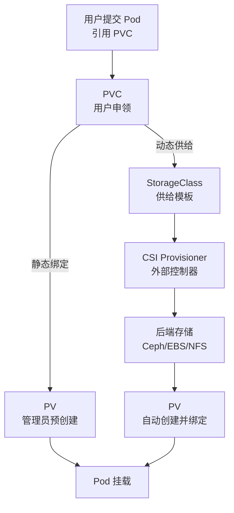
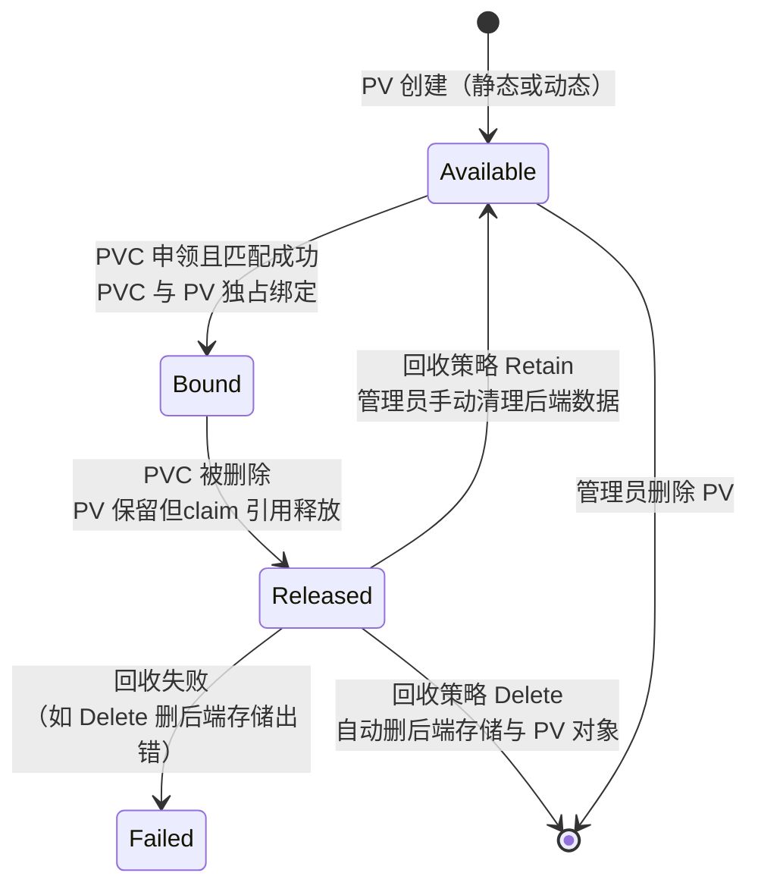
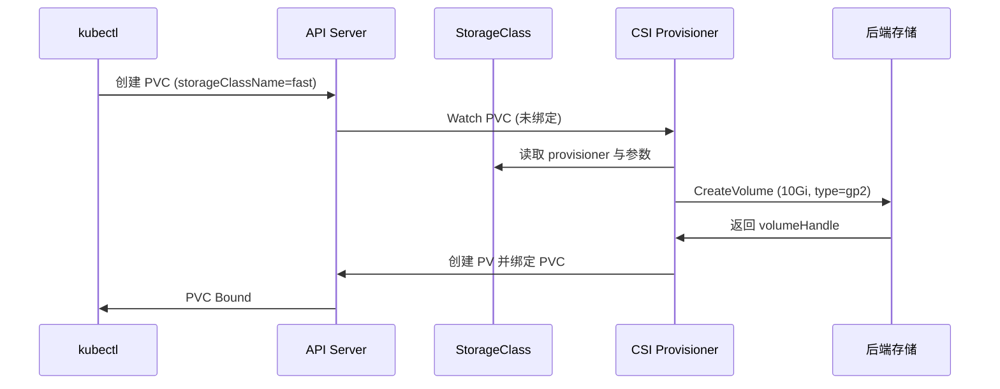

# Volume 与 PV/PVC

> **一句话定位**：PV/PVC 与 StorageClass 动态供给是 K8s 存储体系的核心，与 Docker 存储驱动的边界是面试区分点。
> **面试热度**：⭐⭐⭐⭐
> **返回**：[K8s 知识图谱](../README.md)

---

## 一、概念定义

### 1.1 K8s Volume 的本质

K8s 的 Volume 是 **Pod 级别的存储卷**，定义在 Pod 的 `spec.volumes` 中，由 Pod 内所有容器共享挂载。与 Docker volume 的本质区别在于**生命周期归属**与**跨节点能力**：

| 维度 | Docker volume | K8s Volume |
|------|---------------|------------|
| 生命周期归属 | 独立于容器，由 dockerd 管理 | 归 Pod，随 Pod 生命周期（部分类型随 PVC） |
| 跨节点能力 | ❌ 单机绑定（除非用 volume driver） | ✅ PV/PVC 体系支持网络存储跨节点 |
| 管理方 | dockerd（`/var/lib/docker/volumes/`） | kubelet + 外部 provisioner（CSI） |
| 动态供给 | ❌ 需 `docker volume create` 预创建 | ✅ StorageClass 按 PVC 自动创建 PV |
| 配置范式 | 命令行 `-v` | 声明式 YAML |

> **核心认知**：Docker volume 解决的是"单机容器数据持久化"，K8s Volume 解决的是"Pod 跨节点、跨生命周期的存储供给"——这是两者本质差异。Docker 的 OverlayFS/volume/bind mount/tmpfs 基础详见 [Docker 存储模型](../../docker/05-storage/docker-storage.md)，本文不重复展开，只讲 K8s 的 PV/PVC/CSI 体系。

### 1.2 Volume 类型全表

K8s Volume 类型按持久化能力分三类：

| 类型 | 用途 | 生命周期 | 是否持久 | 典型场景 |
|------|------|---------|---------|---------|
| **emptyDir** | Pod 内多容器共享临时数据 | 同 Pod，Pod 删即清 | ❌ | sidecar 共享日志目录、临时计算中间结果 |
| **hostPath** | 挂载 Node 路径 | Node 路径，Pod 漂移数据不跟随 | ⚠️ Node 级 | 节点级 agent（DaemonSet 挂 `/var/log`、`/sys`） |
| **configMap** | 挂载 ConfigMap 为文件 | 同 Pod（可热更新） | ❌（配置类） | Spring Boot `application.yaml` 外部化 |
| **secret** | 挂载 Secret 为文件 | 同 Pod（可热更新） | ❌（密钥类） | 数据库密码、TLS 证书挂载 |
| **nfs** | 挂载 NFS 共享目录 | 独立 Pod，NFS 服务端管理 | ✅ | 跨节点共享只读数据（旧方案） |
| **persistentVolumeClaim** | 引用 PVC | 独立 Pod，PV 绑定 | ✅ | 数据库数据、业务持久化 |
| **csi** | 直接挂 CSI 卷 | 独立 Pod，CSI 驱动管理 | ✅ | 云原生存储（Ceph/EBS/Cinder） |

> **选型口诀**：临时数据用 emptyDir，节点级 agent 用 hostPath（慎用），配置/密钥用 configMap/secret，持久化数据用 PVC，云原生优先 CSI。

### 1.3 PV/PVC/StorageClass 三者关系

PV、PVC、StorageClass 是 K8s 存储体系的三大核心对象：



- **PV（PersistentVolume）**：集群级资源，管理员创建，代表一块后端存储（NFS/Ceph/EBS）。**静态供给**时手动预创建。
- **PVC（PersistentVolumeClaim）**：命名空间级资源，用户申领，描述需要的存储容量与访问模式。绑定后**独占** PV。
- **StorageClass**：动态供给模板，定义 provisioner（如 `kubernetes.io/aws-ebs`）、参数（如 `type=gp2`）、回收策略。PVC 申领 StorageClass → provisioner 自动创建 PV 并绑定。

> **核心关系**：PV 是"供给侧"（管理员/自动创建的存储资源），PVC 是"需求侧"（用户申领），StorageClass 是"动态供给的配置模板"。三者通过绑定机制解耦存储供给与 Pod 使用。

### 1.4 与 Docker 存储的区别对比

| 维度 | Docker | K8s |
|------|--------|----|
| Volume 生命周期 | 独立于容器（dockerd 管理） | 随 Pod（emptyDir）或随 PVC（PV） |
| 绑定机制 | `-v name:path` 直接挂载 | PVC 申领 → PV 绑定 → Pod 挂载 |
| 跨节点能力 | ❌ 单机绑定 | ✅ PV/PVC 支持网络存储 |
| 动态供给 | ❌ 需预创建 | ✅ StorageClass 按 PVC 自动创建 |
| 配置范式 | 命令行 | 声明式 YAML + reconcile |
| 多容器共享 | 需 `--volumes-from` | Pod 内天然共享 Volume |
| 存储驱动 | OverlayFS/volume driver | CSI（Container Storage Interface） |

> **边界**：Docker 存储解决单机数据持久化（详见 [Docker 存储模型](../../docker/05-storage/docker-storage.md)），K8s 存储解决集群级 Pod 跨节点、跨生命周期的存储供给与解耦。

---

## 二、原理与流程

### 2.1 PV/PVC 生命周期状态机

PV 的生命周期由一组确定的状态驱动，`PersistentVolumeController` 持续 reconcile：



五个核心状态的语义：

| 状态 | 触发条件 | PVC 是否绑定 | 后端数据是否清理 |
|------|---------|-------------|-----------------|
| Available | PV 创建后未被绑定，或 Released 后回收完成 | 否 | 否 |
| Bound | PVC 申领匹配成功，独占绑定 | 是 | 否 |
| Released | PVC 被删除，PV 释放但 claim 引用仍保留 | 否（claim 已删） | 视回收策略 |
| Failed | 回收策略执行失败（如 Delete 删后端出错） | 否 | 不确定 |

> **要点**：PVC 删除后 PV 不会自动回到 Available——需按 `persistentVolumeReclaimPolicy` 执行回收。Retain 策略下需管理员**手动清理后端数据**再把 PV 标为 Available；Delete 策略下自动删后端存储与 PV 对象。

### 2.2 PV 回收策略

`persistentVolumeReclaimPolicy` 决定 PVC 删除后 PV 与后端数据的命运：

| 策略 | 行为 | 后端数据 | PV 对象 | 适用场景 |
|------|------|---------|---------|---------|
| **Retain** | 保留 PV 与后端数据，人工清理后改 Available | ✅ 保留 | ✅ 保留（Released 态） | 生产数据安全（默认推荐） |
| **Delete** | 自动删除后端存储资源（如 EBS 卷）与 PV 对象 | ❌ 删除 | ❌ 删除 | 动态供给的云盘（StorageClass 默认） |
| **Recycle** | `rm -rf` 卷内数据后回 Available | ❌ 清空 | ✅ 保留 | ⛔ 已弃用（1.11+ 废弃） |

> **生产建议**：核心数据用 Retain（防误删），开发/测试环境用 Delete（自动清理）。StorageClass 的 `reclaimPolicy` 字段可覆盖动态供给 PV 的默认策略。

### 2.3 StorageClass 动态供给流程

动态供给是 K8s 存储体系的核心能力——用户只提 PVC，provisioner 按 StorageClass 配置自动创建后端存储与 PV：



**逐步解读**：

1. **用户提交 PVC**：指定 `storageClassName: fast` 与 `resources.requests.storage: 10Gi`。
2. **API Server 持久化 PVC**：PVC 进入 Pending，`PersistentVolumeController` 发现无匹配 PV。
3. **CSI Provisioner Watch PVC**：外部 provisioner（如 `ebs.csi.aws.com`）通过 List-Watch 监听未绑定的 PVC。
4. **读取 StorageClass**：provisioner 从 PVC 的 `storageClassName` 找到 StorageClass，读取 `provisioner`、`parameters`、`reclaimPolicy`。
5. **调用后端 CreateVolume**：provisioner 通过 CSI gRPC 调用后端存储 API（如 AWS EBS `CreateVolume`），创建 10Gi 的 gp2 卷。
6. **创建 PV 并绑定**：provisioner 向 API Server 创建 PV 对象（`spec.capacity`、`spec.accessModes`、`spec.csi.driver` 填好后端信息），并自动绑定 PVC。
7. **PVC Bound**：用户看到 PVC 状态 Bound，Pod 可挂载使用。

> **与静态供给的区别**：静态供给需管理员预创建 PV，PVC 按容量与 accessModes 匹配；动态供给按 StorageClass 自动创建，无需人工干预。动态供给是生产首选。

### 2.4 PV 绑定机制

PVC 与 PV 的绑定由 `PersistentVolumeController` 驱动，匹配规则分两类：

**带 selector 的 PVC**（精确匹配）：

```yaml
spec:
  accessModes: ["ReadWriteOnce"]
  resources:
    requests:
      storage: 10Gi
  selector:
    matchLabels:
      environment: production
    matchExpressions:
      - {key: tier, operator: In, values: [ssd]}
```

**无 selector 的 PVC**（容量与 accessModes 匹配）：

- accessModes 必须是 PV 的子集（PVC 要 RWO，PV 支持 RWO 即可）
- capacity.storage 必须 ≥ PVC 的 requests.storage
- storageClassName 必须匹配（或都为空，走默认 StorageClass）

> **绑定是独占的**：一个 PV 同时只能被一个 PVC 绑定。PVC 删除后 PV 释放（Released），需回收策略处理后才回到 Available。

### 2.5 CSI 插件机制

CSI（Container Storage Interface）是 K8s 与外部存储驱动的标准接口，用 gRPC 通信，把存储逻辑从 K8s 核心代码解耦。kubelet 与外部 controller 通过 CSI 调用驱动：

| 服务组 | 调用方 | 核心接口 | 职责 |
|--------|--------|---------|------|
| **Identity** | kubelet / controller | `GetPluginInfo`、`GetPluginCapabilities` | 声明驱动身份与能力 |
| **Controller** | 外部 provisioner | `CreateVolume`、`DeleteVolume`、`ControllerExpand` | 创建/删除/扩容后端存储卷 |
| **Node** | kubelet | `NodeStageVolume`、`NodePublishVolume`、`NodeUnstageVolume`、`NodeUnpublishVolume` | 把卷挂载/卸载到 Pod |

**Node 服务的两步挂载**：

- **NodeStageVolume**：把后端存储（如 EBS 卷）格式化并挂载到 Node 的全局 staging 目录（`/var/lib/kubelet/plugins/<driver>/volumeDevices/<volumeID>/`）。每个卷每 Node 只 stage 一次，多 Pod 共享时复用。
- **NodePublishVolume**：把 staging 目录 bind mount 到 Pod 的挂载路径（`/var/lib/kubelet/pods/<podUID>/volumes/<driver>/<volumeName>/`）。Pod 删除时 NodeUnpublish 卸载，无其他 Pod 引用时 NodeUnstage 释放。

> **与 FlexVolume 的区别**：FlexVolume 是 K8s 早期方案，用 exec 二进制脚本调用驱动（shell 脚本），性能差、难维护，已弃用；CSI 是标准 gRPC 接口、外部驱动进程独立部署，是未来方向。详见 §三 Q6。

### 2.6 StatefulSet 持久化

StatefulSet 的 `volumeClaimTemplates` 为每个 Pod 自动创建独立 PVC，保证有状态应用的数据持久化：

```yaml
volumeClaimTemplates:
- metadata:
    name: data
  spec:
    accessModes: ["ReadWriteOnce"]
    storageClassName: fast
    resources:
      requests:
        storage: 10Gi
# 每个 Pod 自动生成独立 PVC：data-<sts-name>-0、data-<sts-name>-1、data-<sts-name>-2
```

**稳定标识与数据保留**：

- Pod 名固定（`mysql-0`、`mysql-1`），PVC 名也固定（`data-mysql-0`、`data-mysql-1`）。
- Pod 重建后，StatefulSet 按序号重新绑定同名 PVC——数据自动恢复。
- Pod 删除时默认**保留 PVC**（不删 PVC，防数据丢失），需手动清理才释放。

> **关联**：StatefulSet 稳定网络标识与顺序部署详见 [Pod 与控制器](../02-workload/pod-and-controllers.md) §2.6，本文只讲存储视角。

### 2.7 emptyDir 的用途

emptyDir 是 Pod 级临时卷，随 Pod 创建、Pod 删除即清空，典型用于同 Pod 内多容器共享临时数据：

| 场景 | 主容器职责 | sidecar 职责 | emptyDir 角色 |
|------|-----------|-------------|--------------|
| 日志采集 | 写日志到 `/logs/app.log` | Filebeat 读 `/logs/app.log` 上传 | 共享日志目录 |
| 密钥注入 | 读 `/secrets/token` | Vault agent 刷新 token 写 `/secrets` | 共享密钥目录 |
| 任务中转 | 计算写 `/work/out.dat` | 上传 sidecar 读 `/work/out.dat` 推送 | 临时计算产物 |

```yaml
volumes:
- name: shared-logs
  emptyDir: {}          # 默认存 Node 磁盘
- name: cache
  emptyDir:
    medium: Memory      # 存 tmpfs（内存），最快但受 Pod 内存限制
    sizeLimit: 256Mi
```

> **注意**：emptyDir 默认存 Node 磁盘（随 Pod 删除清空，但不占容器可写层）。`medium: Memory` 改为 tmpfs，速度最快但消耗 Pod 内存 cgroup。Pod 漂移到其他 Node 后 emptyDir 数据不跟随——这是它与 PVC 的本质差异。

---

## 三、高频追问与面试题

### Q1：PV 和 PVC 的关系？

**参考答案**：PV 是集群级资源（管理员创建），PVC 是命名空间级资源（用户申领），绑定后 PVC 独占 PV。

- **PV**：代表一块后端存储（NFS/Ceph/EBS），由管理员创建或 StorageClass 动态生成。
- **PVC**：用户申领，描述容量与访问模式，`PersistentVolumeController` 按 selector 或容量匹配绑定。
- **绑定后独占**：一个 PV 同时只能被一个 PVC 绑定，PVC 删除后 PV 释放（Released），需回收策略处理后才回 Available。

> **关联**：§1.3 PV/PVC/StorageClass 三者关系、§2.4 PV 绑定机制。

### Q2：StorageClass 动态供给和静态 PV 的区别？

**参考答案**：

| 维度 | 静态 PV | 动态供给（StorageClass） |
|------|---------|--------------------------|
| PV 创建方 | 管理员手动预创建 | provisioner 按 PVC 自动创建 |
| 匹配机制 | 按 selector/容量/accessModes 匹配 | 按 StorageClass 模板直接生成 |
| 后端存储 | 预先存在 | 按需调用后端 API 创建 |
| 适用 | 已有 NFS/Ceph 共享 | 云盘/分布式存储（EBS/Ceph） |

**核心差异**：静态需管理员预创建 PV 并保证后端存储已存在；动态按 PVC 申领自动创建后端存储与 PV，无需人工干预。动态是生产首选。

> **关联**：§2.3 StorageClass 动态供给流程、§2.4 PV 绑定机制。

### Q3：Pod 删除后 PVC 和数据会消失吗？

**参考答案**：**不会**。PVC 独立于 Pod 生命周期。

- Pod 删除只解除 Pod 对 PVC 的引用，PVC 对象与绑定关系仍在。
- PVC 与 PV 的绑定关系独立于 Pod——Pod 重建后重新挂载同一 PVC，数据自动恢复。
- 除非回收策略是 Delete 且 PVC 被**显式删除**，才会触发删后端存储。Retain 策略下 PVC 删除后后端数据仍保留。

> **生产警示**：StatefulSet 默认删除 Pod 时**保留 PVC**（防数据丢失）。若想删 Pod 同时清数据，需手动删 PVC，触发回收策略。

> **关联**：§2.1 PV/PVC 生命周期状态机、§2.2 PV 回收策略。

### Q4：StatefulSet 的 volumeClaimTemplates 有什么用？

**参考答案**：为每个 Pod 自动创建独立 PVC，保证 Pod 重建后数据保留。

- 每个 Pod 按序号生成同名 PVC（`<volume-name>-<sts-name>-<ordinal>`），如 `data-mysql-0`。
- Pod 重建后，StatefulSet 按序号重新绑定同名 PVC——数据自动恢复。
- Pod 删除时默认保留 PVC（不删），需手动清理才释放。
- 配合 StorageClass 动态供给，每个 PVC 自动触发后端存储创建。

> **关联**：§2.6 StatefulSet 持久化、[Pod 与控制器](../02-workload/pod-and-controllers.md) §2.6 StatefulSet 稳定标识。

### Q5：emptyDir 和 hostPath 怎么选？

**参考答案**：

| 维度 | emptyDir | hostPath |
|------|---------|----------|
| 生命周期 | 随 Pod，Pod 删即清 | Node 路径，Pod 漂移数据不跟随 |
| 共享范围 | Pod 内多容器共享 | Node 上所有 Pod（无隔离） |
| 数据跟随 | Pod 漂移数据不跟随 | 数据在 Node 不动 |
| 安全性 | 隔离较好 | ⚠️ 容器可改 Node 文件，有逃逸风险 |
| 适用 | 临时数据、sidecar 共享 | 节点级 agent（DaemonSet 挂 `/var/log`、`/sys`） |

**口诀**：临时数据用 emptyDir（Pod 删即清、多容器共享），节点级 agent 用 hostPath（挂 Node 系统路径，慎用避免逃逸）。

> **关联**：§2.7 emptyDir 用途、§1.2 Volume 类型全表。

### Q6：CSI 和 FlexVolume 的区别？

**参考答案**：CSI 是标准 gRPC 接口、外部驱动进程；FlexVolume 是 exec 二进制脚本，已弃用。

| 维度 | CSI | FlexVolume |
|------|-----|------------|
| 接口形式 | 标准 gRPC（Container Storage Interface） | exec 二进制脚本（shell/C） |
| 驱动部署 | 独立 Pod（Controller + Node） | 二进制放 Node 的 `/usr/libexec/kubernetes/kubelet-plugins/volume/exec/` |
| 能力 | 创建/删除/扩容/快照/拓扑感知 | 仅挂载/卸载（基础操作） |
| 维护 | 上游 CSI 规范，跨编排器通用 | K8s 专有，已弃用 |
| 性能 | gRPC 长连接 | 每次 exec 进程启动开销 |

**结论**：CSI 是未来方向，所有主流存储（Ceph/EBS/NFS）都有 CSI 驱动；FlexVolume 已弃用，新部署不应使用。

> **关联**：§2.5 CSI 插件机制、[架构总览与核心组件](../01-foundation/k8s-architecture.md) §CRI/CNI/CSI 接口边界。

### Q7：PV 的 accessModes 有哪些？

**参考答案**：三种访问模式，取决于后端存储能力。

| 模式 | 缩写 | 语义 | 典型后端 |
|------|------|------|---------|
| ReadWriteOnce | RWO | 单 Node 读写 | EBS/Ceph RBD（块存储） |
| ReadOnlyMany | ROX | 多 Node 只读 | NFS（共享只读） |
| ReadWriteMany | RWX | 多 Node 读写 | NFS/CephFS/FSx（共享文件存储） |

> **关键**：accessModes 是后端存储能力的描述，不是 PVC 的需求。块存储（EBS）只支持 RWO，文件存储（NFS/CephFS）支持 ROX/RWX。PVC 的 accessModes 必须是 PV 支持的子集。

### Q8：K8s Volume 和 Docker volume 有什么本质区别？

**参考答案**：

| 维度 | Docker volume | K8s Volume |
|------|---------------|------------|
| 生命周期 | 独立于容器（dockerd 管理） | 随 Pod 或随 PVC（PV） |
| 跨节点能力 | ❌ 单机绑定 | ✅ PV/PVC 支持网络存储 |
| 多容器共享 | 需 `--volumes-from` | Pod 内天然共享 |
| 动态供给 | ❌ 需预创建 | ✅ StorageClass 按 PVC 自动创建 |
| 解耦程度 | 存储与容器直接绑定 | PV/PVC 解耦存储与 Pod |

**核心差异**：K8s Volume 生命周期同 Pod 且可跨节点（PV/PVC）；Docker volume 生命周期独立于容器但绑定单机。K8s 通过 PV/PVC 体系解耦存储与 Pod，Docker 用 named volume 直接绑定。

> **关联**：§1.1 K8s Volume 的本质、[Docker 存储模型](../../docker/05-storage/docker-storage.md) §2.2 Volume。

---

## 四、实战关联（Java 后端视角）

### 4.1 Java 应用日志卷：emptyDir + sidecar Filebeat

Java 应用（如 Spring Boot）日志需要持久化与聚合，典型方案是 emptyDir 共享 + sidecar 采集：

```yaml
apiVersion: v1
kind: Pod
metadata:
  name: order-service
spec:
  containers:
  - name: app                          # 主容器：Java 应用
    image: order-service:1.0
    volumeMounts:
    - name: shared-logs
      mountPath: /app/logs              # logback 写到这里
  - name: filebeat                      # sidecar：日志采集
    image: docker.elastic.co/beats/filebeat:7.17
    volumeMounts:
    - name: shared-logs
      mountPath: /logs                   # 读同一目录
      readOnly: true
    - name: filebeat-config
      mountPath: /etc/filebeat
  volumes:
  - name: shared-logs
    emptyDir: {}                        # Pod 内共享，Pod 删即清
  - name: filebeat-config
    configMap:
      name: filebeat-config
```

**logback.xml 配置**（主容器写文件）：

```xml
<appender name="FILE" class="ch.qos.logback.core.rolling.RollingFileAppender">
  <file>/app/logs/app.log</file>
  <rollingPolicy class="ch.qos.logback.core.rolling.SizeAndTimeBasedRollingPolicy">
    <fileNamePattern>/app/logs/app.%d{yyyy-MM-dd}.%i.log.gz</fileNamePattern>
    <maxFileSize>100MB</maxFileSize>
    <maxHistory>7</maxHistory>
  </rollingPolicy>
</appender>
```

**方案对比**：

| 方案 | 优点 | 缺点 |
|------|------|------|
| emptyDir + sidecar Filebeat | 日志落文件可用 logback 滚动策略、sidecar 与应用同 Pod 易管理 | emptyDir 随 Pod 删即清，需 sidecar 实时转发到 ES/Kafka |
| 直接写 stdout + 采集 Agent | Docker/K8s 原生、`kubectl logs` 统一查看、无文件管理 | 无法用 logback 滚动、依赖节点级 Agent（DaemonSet Filebeat） |

> **生产推荐**：Java 应用写 stdout（`kubectl logs` 统一查看），节点级 DaemonSet Filebeat 采集 CRI 运行时（containerd 默认）落盘的日志转发到 ELK。审计日志需落文件时用 emptyDir + sidecar。

### 4.2 Java 应用配置卷：ConfigMap 作为 Volume

Spring Boot 的 `application.yaml` 可通过 ConfigMap Volume 挂载，实现配置外部化与热更新：

```yaml
apiVersion: v1
kind: ConfigMap
metadata:
  name: order-service-config
data:
  application.yaml: |
    server:
      port: 8080
    spring:
      datasource:
        url: jdbc:mysql://mysql:3306/orders
        username: order_user
    management:
      endpoint:
        health:
          probes:
            enabled: true
---
apiVersion: v1
kind: Pod
metadata:
  name: order-service
spec:
  containers:
  - name: app
    image: order-service:1.0
    volumeMounts:
    - name: config
      mountPath: /app/config            # Spring Boot 读 config/application.yaml
      readOnly: true
  volumes:
  - name: config
    configMap:
      name: order-service-config
```

**热更新机制**：ConfigMap 更新后，kubelet 自动刷新挂载的符号链接（`..data` → 最新版本），Pod 内文件内容变化。Spring Boot 需配 `spring.config.location=classpath:/,file:/app/config/` 才能读取外部配置。

> **关联 `framework/spring-framework` 模块**：该模块有 `@Value` 与外部化配置实例，对照理解 Spring Boot 的 `spring.config.import` 与 ConfigMap Volume 挂载协作——ConfigMap 提供 YAML 文件源，Spring Boot 启动时加载，`@Value("${server.port}")` 注入挂载的配置值。

### 4.3 关联 framework/jackson：ConfigMap 的 YAML 反序列化

ConfigMap 的 `data` 字段是 string 到 string 的映射，存储的 YAML/JSON 配置需应用侧反序列化：

```yaml
data:
  feature-flags.yaml: |
    features:
      newCheckout: true
      abTestRatio: 0.3
```

Java 应用用 Jackson（`ObjectMapper` + `YAMLFactory`）反序列化：

```java
ObjectMapper mapper = new ObjectMapper(new YAMLFactory());
FeatureFlags flags = mapper.readValue(
    new File("/app/config/feature-flags.yaml"),
    FeatureFlags.class
);
```

> **关联 `framework/jackson` 模块**：该模块有自定义序列化器实例，对照理解 Jackson 的 YAMLFactory 与 ConfigMap 的协作——ConfigMap 提供 YAML 文件存储，Jackson 负责 POJO 绑定，两者结合实现配置外部化与类型安全。

### 4.4 关联 framework/spring-framework：Spring Boot 外部化配置

Spring Boot 的配置优先级在 K8s 下表现为：

```
1. 命令行参数
2. 环境变量（K8s env）
3. SPRING_APPLICATION_JSON
4. ConfigMap Volume 挂载的 application.yaml（spring.config.location）
5. 镜像内 application.yaml（classpath）
6. 默认值
```

ConfigMap Volume 挂载的配置文件优先级**高于**镜像内默认值，但**低于**环境变量——这是"配置外部化"生效的底层保障。生产建议：ConfigMap 存非敏感配置，Secret 存密钥（数据库密码），两者都用 Volume 挂载。

> **关联 `framework/spring-framework` 模块**：该模块有 `ProfileConfig` 与 `@Value` 的配置实例，对照理解 K8s ConfigMap Volume 与 Spring Boot `@ConfigurationProperties` 的协作——ConfigMap 提供配置源，`@ConfigurationProperties` 批量绑定到 POJO，比 `@Value` 更适合复杂嵌套配置。

---

## 五、面试案例

### 5.1 "你的 Java 应用日志怎么持久化？"——3 分钟标准答法

**面试官**：你的 Java 应用上 K8s，日志怎么持久化？

**3 分钟标准答法**：

> 我们有两种方案，按场景选。
>
> 第一种是 **stdout + 节点级 Agent 采集**，这是生产首选。Java 应用（Spring Boot）默认日志输出到 stdout，kubelet 通过 CRI 让容器运行时（containerd 默认）落盘到 Node 的 `/var/log/containers/<pod>_<container>.log`（文件为 JSON 行格式；1.24 前借 dockershim 复用 docker json-file driver，1.24+ 由 containerd 的 CRI 日志实现落盘，非 docker 的 logging driver 概念）。然后部署一个 DaemonSet 的 Filebeat/Fluentd agent，挂载 hostPath `/var/log/containers` 读取日志转发到 ELK/Loki。优点是 K8s 原生、`kubectl logs` 统一查看、无需 Pod 内管理文件。缺点是无法用 logback 的滚动策略，依赖节点级 Agent。
>
> 第二种是 **emptyDir + sidecar Filebeat**，用于审计日志等需落文件的场景。主容器配 logback 写 `/app/logs/app.log`（滚动策略：100MB + 7 天），定义一个 emptyDir 卷 `shared-logs`，主容器与 Filebeat sidecar 都挂载这个卷。主容器写文件，Filebeat 读文件转发到 ES/Kafka。emptyDir 随 Pod 删即清，但 sidecar 实时转发已到中心化存储，数据不丢。
>
> 生产推荐 stdout 方案——日志聚合交给基础设施层，应用只管写 stdout，`kubectl logs` 与 ELK 两套查询通路都通。审计日志需落文件时才用 emptyDir + sidecar，但要监控 emptyDir 容量避免撑爆 Node 磁盘。

**结构要点**：两种方案对比（stdout + Agent vs emptyDir + sidecar）→ 各自优缺点 → 生产选型（stdout 优先）。

**追问链**：

| 追问 | 标准答法 |
|------|---------|
| emptyDir Pod 删了日志不就丢？ | sidecar 实时转发到 ES/Kafka，emptyDir 只是中转，中心化存储才是持久层 |
| 为什么不用 PVC 存日志？ | 日志是时序数据，查询走 ELK 不走文件系统；PVC 成本高且不适合高频写 |
| stdout 方案怎么控制日志大小？ | 由容器运行时的 CRI 日志实现控制轮转（containerd 默认按大小/时间轮转），1.24 前借 dockershim 复用 docker json-file driver 配 `max-size` + `max-file`；也可改用节点级 journald/fluentd |

### 5.2 "StatefulSet 部署 MySQL，数据怎么保证不丢？"——volumeClaimTemplates 全链路

**面试官**：用 StatefulSet 部署 MySQL，数据怎么保证不丢？

**参考答法**：

数据不丢靠四层保障：

1. **volumeClaimTemplates 自动创建独立 PVC**：StatefulSet 配 `volumeClaimTemplates`，每个 Pod（`mysql-0`、`mysql-1`）自动生成同名 PVC（`data-mysql-0`、`data-mysql-1`），Pod 重建后重新绑定同名 PVC，数据自动恢复。
2. **StorageClass 动态供给**：PVC 指定 `storageClassName: fast`，provisioner 自动调用后端 API（如 EBS `CreateVolume`）创建云盘并绑定 PV，无需人工干预。
3. **PV 回收策略 Retain**：PVC 删除时 PV 保留后端数据（Released 态），管理员确认后才手动清理，防误删。
4. **定期备份**：逻辑备份（`mysqldump` 定期跑 CronJob）+ 物理快照（EBS snapshot）双保险，逻辑备份跨版本兼容，物理快照恢复快。

**配置示例**：

```yaml
apiVersion: apps/v1
kind: StatefulSet
metadata:
  name: mysql
spec:
  serviceName: mysql
  replicas: 3
  template:
    spec:
      containers:
      - name: mysql
        image: mysql:8
        volumeMounts:
        - name: data
          mountPath: /var/lib/mysql
  volumeClaimTemplates:
  - metadata:
      name: data
    spec:
      accessModes: ["ReadWriteOnce"]
      storageClassName: fast        # 动态供给
      resources:
        requests:
          storage: 100Gi
---
apiVersion: storage.k8s.io/v1
kind: StorageClass
metadata:
  name: fast
provisioner: ebs.csi.aws.com
reclaimPolicy: Retain               # 保留后端数据
parameters:
  type: gp2
  fsType: ext4
```

> **关联**：§2.6 StatefulSet 持久化、§2.3 StorageClass 动态供给、[Pod 与控制器](../02-workload/pod-and-controllers.md) §2.6 StatefulSet 稳定标识。

---

## 六、参考与延伸

- **官方文档**：Volumes、Persistent Volumes、Storage Classes、Container Storage Interface (CSI)（kubernetes.io/docs）
- **CSI 规范**：github.com/container-storage-interface/spec（Identity/Controller/Node 三组 gRPC 服务定义）
- **源码包**：
  - `k8s.io/kubernetes/pkg/controller/volume/persistentvolume`——PersistentVolumeController 绑定与回收 reconcile
  - `k8s.io/kubernetes/pkg/volume/csi`——kubelet 调用 CSI Node 服务的挂载链路
  - `k8s.io/kubernetes/pkg/controller/statefulset`——volumeClaimTemplates 生成 PVC 的逻辑
- **延伸阅读（跨文档）**：
  - [架构总览与核心组件](../01-foundation/k8s-architecture.md)——CSI 接口边界、reconcile 循环、kubelet 与外部 controller 协作
  - [Pod 与控制器](../02-workload/pod-and-controllers.md)——StatefulSet 稳定标识、Pod 内多容器共享 Volume
  - [配置与 RBAC](../06-config-security/config-and-rbac.md)——ConfigMap/Secret 作为 Volume 挂载、热更新机制
  - [Java 应用上 K8s](../09-performance/java-on-k8s.md)——日志卷与配置卷的实战、ConfigMap 热更新与 Spring Boot
- **仓库内关联**：
  - [Docker 存储模型](../../docker/05-storage/docker-storage.md)——OverlayFS/volume/bind mount/tmpfs 基础、CoW 与 whiteout 陷阱（K8s 存储的底层基础，本文不重复展开）
  - `framework/spring-framework`——Spring Boot 外部化配置、`@Value` 与配置优先级、`@ConfigurationProperties` 批量绑定
  - `framework/jackson`——YAML/JSON 配置反序列化、自定义序列化器

> **返回**：[K8s 知识图谱](../README.md)
