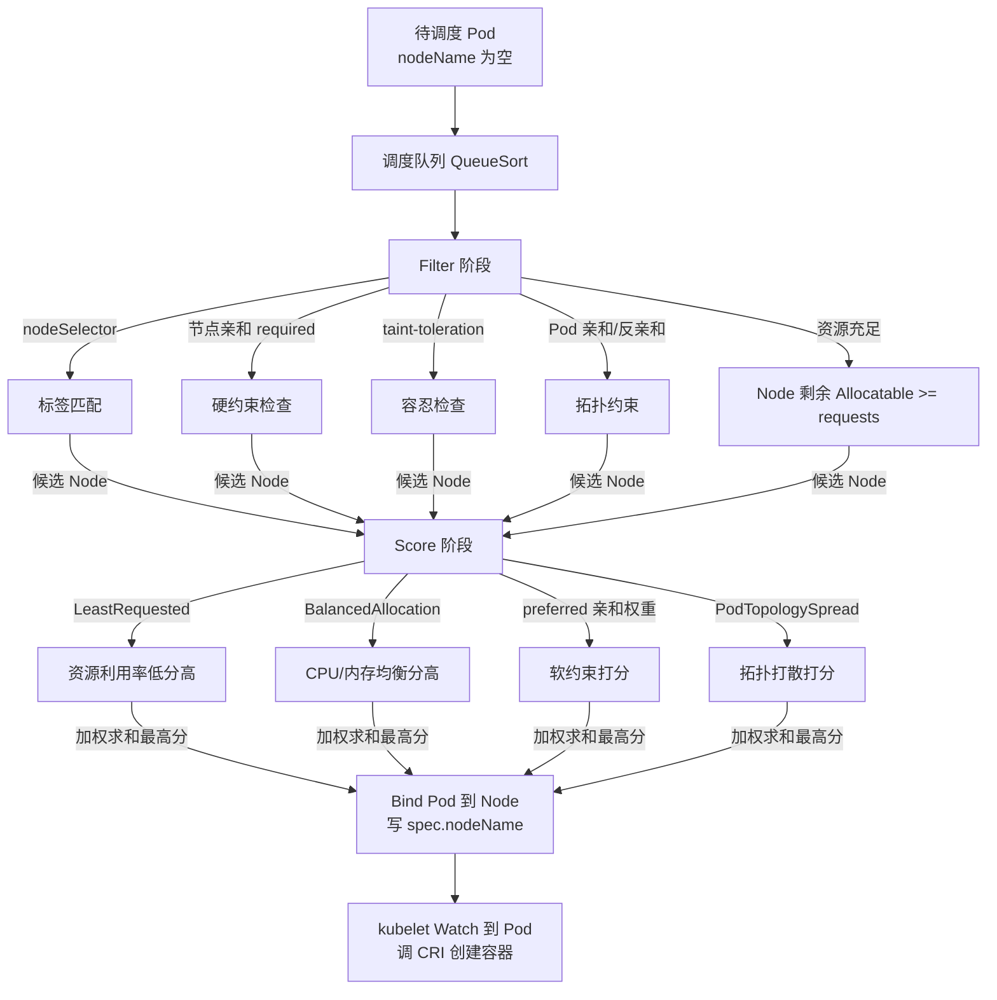
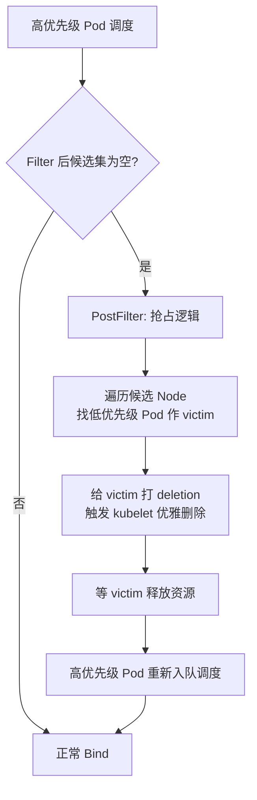

# 调度与资源管理

> **一句话定位**：调度器两阶段与 QoS 三级是中高级面试的分水岭，requests/limits 与 JVM 资源感知是 Java 上 K8s 的高频追问。
> **面试热度**：⭐⭐⭐⭐⭐
> **返回**：[K8s 知识图谱](../README.md)

---

## 一、概念定义

### 1.1 调度是什么

**一句话**：调度是把 `spec.nodeName` 为空的 Pod 绑定到合适 Node 的过程——kube-scheduler 监听 Pending Pod，跑调度算法选一个 Node，调 API Server 的 Bind 接口写入 `spec.nodeName`，后续由 kubelet 接管创建容器。

调度发生在 Pod 生命周期的 Pending 阶段（Pod 状态机详见 [Pod 与控制器](../02-workload/pod-and-controllers.md) §2.1）。Pod 一旦 Bind 到 Node，**默认不再迁移**——即使 Node 后来资源紧张，scheduler 也不会主动把已调度 Pod 搬走（除非启用 descheduler 这类扩展）。所以"调度一次定终身"是 K8s 的基本语义，调度决策的质量直接决定集群资源利用率与稳定性。

> **核心心智模型**：scheduler 只负责"选 Node + Bind"，不负责创建容器（那是 kubelet 的活）、不负责维持副本数（那是 controller-manager 的活）。它是一个**无状态的决策器**——多副本通过 leader election 选主，只有 leader 真正调度（避免两个 scheduler 给同一 Pod Bind 不同 Node）。详见 [架构总览与核心组件](../01-foundation/k8s-architecture.md) §三 Q4。

### 1.2 调度器两阶段

kube-scheduler 的调度算法分为两个阶段，对应源码 `k8s.io/kubernetes/pkg/scheduler` 下的调度框架（`framework.Plugin` 接口）：

| 阶段 | 作用 | 插件类型 | 典型插件 |
|------|------|---------|---------|
| **Filter（过滤）** | 把不满足硬约束的 Node 剔除，得到候选集 | `framework.FilterPlugin` | `NodeResourcesFit`、`NodeAffinity`、`TaintToleration`、`NodeUnschedulable`、`PodTopologySpread` |
| **Score（打分）** | 对候选 Node 打分排序，选最高分 | `framework.ScorePlugin` | `NodeResourcesFit`（LeastRequested）、`BalancedAllocation`、`NodeAffinity`（preferred 权重）、`InterPodAffinity`、`PodTopologySpread` |

- **Filter 是硬约束**：任一 Filter 插件失败，该 Node 直接出局。常见失败原因：资源不足（Node 剩余 < Pod requests）、不满足 nodeAffinity required、不容忍 taint、节点被 cordon（`nodeUnschedulable`）。
- **Score 是软约束**：所有候选 Node 都跑一遍 Score 插件，各插件返回 0-100 分，按权重加权求和，最高分 Node 胜出。同分时按 Node 名字典序打破平局（确定性，避免抖动）。

> **调度框架（Scheduling Framework）**：1.19+ 默认启用，把调度过程拆成一串插件钩子（QueueSort / PreFilter / Filter / PostFilter / PreScore / Score / NormalizeScore / Reserve / Bind）。每个插件实现 `framework.Plugin` 接口，可内建或自定义。这是"自定义调度器"的现代方式——不再需要 fork 整个 scheduler 二进制，注册自己的 Score 插件即可影响打分。

### 1.3 requests vs limits

K8s 资源管理的两个核心字段，语义截然不同：

| 维度 | requests | limits |
|------|----------|--------|
| 用途 | **调度决策** + HPA 指标分母 + QoS 判定 | **运行时上限**（写入 cgroups） |
| 调度阶段 | scheduler Filter 检查 `Node.Allocatable - 已用 >= sum(requests)` | 不参与调度决策 |
| 运行时 | 不直接限制进程，只影响调度与 HPA | CPU 写 `cpu.cfs_quota_us`，memory 写 `memory.limit_in_bytes` |
| 超限后果 | 无"超 requests"概念（requests 是预留） | CPU：CFS throttle（周期性限流，不杀进程）；memory：内核 OOM Killer 杀进程 |
| 是否可超 | 进程实际用量可超 requests（只要没到 limits） | 不可超 limits（CPU 被限流，memory 被 OOM） |
| HPA | CPU 利用率 = 实际用量 / requests（requests 是分母） | 不参与 HPA |

> **关键认知**：requests 是"声明预留"（scheduler 据此判断 Node 能否容纳），limits 是"硬上限"（kubelet 据此写 cgroups 限制进程）。两者独立——可以 requests=1 core limits=4 core（允许突发），也可以 requests=limits=2 core（Guaranteed QoS）。

### 1.4 QoS 三级

K8s 根据 Pod 所有容器的 requests/limits 配置，自动给 Pod 打 QoS 等级，决定**被 kubelet 驱逐的先后顺序**：

| 等级 | 判定条件 | 调度优先级 | 被驱逐顺序 |
|------|---------|-----------|-----------|
| **Guaranteed** | 所有容器**CPU 和 memory 的 requests=limits**（且都设置了） | 最高（scheduler 优先调度） | 最后（内存压力时最晚被驱逐） |
| **Burstable** | 至少设置了一个 requests 或 limits，但不满足 Guaranteed | 中等 | 中间（按超出 requests 的比例排序） |
| **BestEffort** | 所有容器都**未设置** requests 和 limits | 最低 | 最先（内存压力时首批被驱逐） |

QoS 由 kubelet 在 Pod 创建时计算并写入 Pod 的 `status.qosClass` 字段，不可手动设置。它是"被动分类"——你配 resources，K8s 据此推断 QoS，再据此决定驱逐顺序。

> **核心**：QoS 不影响正常运行（不影响 CPU/内存的实际限制），只在**节点资源紧张时**决定驱逐优先级。Guaranteed 的"调度优先级最高"也只在节点接近满载时才体现。详见 §2.8。

---

## 二、原理与流程

### 2.1 调度两阶段流程



**关键步骤解读**：

1. **Pod 入队**：apiserver 收到 Pod 对象，scheduler 的 Informer Watch 到新 Pod（`nodeName=""`），推入调度队列。`QueueSort` 插件决定出队顺序（默认按优先级 + 创建时间）。
2. **PreFilter**：预处理 Pod 的调度信息（如汇总 Pod requests 总量、构建亲和性的 topology pair 索引），供后续 Filter 复用。
3. **Filter**：对每个 Node 跑所有 FilterPlugin，任一失败即剔除。若候选集为空，触发 `PostFilter`（默认尝试抢占，详见 §2.5）。
4. **Score**：对候选集每个 Node 跑所有 ScorePlugin，各返回 0-100 分，按插件权重加权求和。
5. **Reserve / Permit**： Reserve 阶段预占资源（防止并发的两个 Pod 抢同一 Node），Bind 阶段异步调 API Server 写 `nodeName`。
6. **kubelet 接管**：Bind 成功后，目标 Node 的 kubelet Watch 到 Pod 落到自己，调 CRI 拉镜像、建容器。

> **要点**：Filter 决定"能不能放"，Score 决定"放哪个最好"。两个阶段都要跑，但 Filter 的 Node 数 = 集群规模，Score 只跑候选集。大集群下 Filter 是性能瓶颈，scheduler 会做节点缓存与预筛选优化。

### 2.2 nodeSelector 与节点亲和

**nodeSelector**：最简单的标签匹配——Pod spec 写 `nodeSelector: { disktype: ssd }`，只有带 `disktype=ssd` 标签的 Node 才进候选集。是 Filter 阶段的硬约束。

**节点亲和（nodeAffinity）**：nodeSelector 的增强版，分两类：

| 类型 | 语义 | 阶段 |
|------|------|------|
| `requiredDuringScheduling` | 硬约束，必须满足（等价 nodeSelector 但语法更强） | Filter |
| `preferredDuringScheduling` | 软约束，满足则加分，不满足也不剔除 | Score |

```yaml
affinity:
  nodeAffinity:
    requiredDuringSchedulingIgnoredDuringExecution:   # 硬约束
      nodeSelectorTerms:
      - matchExpressions:
        - { key: zone, operator: In, values: [east, west] }
    preferredDuringSchedulingIgnoredDuringExecution:  # 软约束
    - weight: 80
      preference:
        matchExpressions:
        - { key: ssd, operator: In, values: ["true"] }
```

- `operator` 支持 `In`/`NotIn`/`Exists`/`DoesNotExist`/`Gt`/`Lt`，比 nodeSelector 的等值匹配灵活。
- `IgnoredDuringExecution` 后缀：调度后即使 Node 标签变了也不再重新调度（K8s 默认不迁移已调度 Pod）。`RequiredDuringExecution` 变体目前未完整实现。
- nodeSelector 仍可用，但官方推荐用 `nodeAffinity.required` 替代（功能更全）。

### 2.3 taint 与 toleration

**taint（污点）** 打在 Node 上，表示"这个 Node 有特殊情况，默认不让 Pod 调度上来"。**toleration（容忍）** 写在 Pod 上，表示"我能忍受某种 taint，可以调度到带该 taint 的 Node"。

**taint 语法**：`key=value:Effect`

| Effect | 语义 | 对已有 Pod |
|--------|------|-----------|
| `NoSchedule` | 不调度新的不容忍 Pod | 已运行的不容忍 Pod 保留（不驱逐） |
| `PreferNoSchedule` | 尽量不调度（软约束，找不到别的 Node 仍可调度） | 保留 |
| `NoExecute` | 不调度 + **驱逐**已有不容忍 Pod | 驱逐（可配 `tolerationSeconds` 延迟驱逐） |

```bash
# 给 Node 打 taint（如专属节点）
kubectl taint nodes node1 dedicated=special:NoSchedule
# Pod 容忍该 taint
tolerations:
- { key: "dedicated", operator: "Equal", value: "special", effect: "NoSchedule" }
```

**典型用途**：
- **控制面节点专用**：master 节点打 `node-role.kubernetes.io/master:NoSchedule`，业务 Pod 默认不调度上去。
- **GPU/专用硬件节点**：打 taint 隔离，只有声明 toleration 且请求 GPU 的 Pod 才能上。
- **节点故障驱逐**：节点出问题时打 `NoExecute` taint，kubelet 驱逐其上不容忍 Pod（如网络插件、DaemonSet Pod 通常容忍所有 taint 以保证常驻）。

> **核心区别**：`NoSchedule` 只挡新 Pod（老的留着）；`NoExecute` 挡新 Pod **且驱逐老 Pod**。生产环境用 `NoExecute` 做节点维护驱逐时，务必给业务 Pod 配 `tolerationSeconds`，否则会立刻被赶走。

### 2.4 Pod 亲和与反亲和

**Pod 亲和/反亲和**基于**已运行 Pod 的 label** 决定调度，与 nodeAffinity（基于 Node label）互补。

| 模式 | 语义 | 典型场景 |
|------|------|---------|
| Pod 亲和 | 倾向与某些 Pod 调度到同一拓扑域 | 前端 Pod 想靠近缓存 Pod（同 Node/Zone 降低延迟） |
| Pod 反亲和 | 倾向远离某些 Pod，调度到不同拓扑域 | 同一 Deployment 的副本分散到不同 Node/Zone，做高可用 |

```yaml
affinity:
  podAntiAffinity:                           # 反亲和：分散部署
    requiredDuringSchedulingIgnoredDuringExecution:
    - labelSelector:
        matchLabels: { app: order-service }
      topologyKey: kubernetes.io/hostname     # 拓扑域 = Node
```

**topologyKey 的含义**：拓扑域的边界由 Node label 的 `topologyKey` 划分。同一 `topologyKey` 值的 Node 属于同一域：
- `topologyKey: kubernetes.io/hostname` → 每台 Node 一个域（Pod 反亲和 = 分散到不同 Node）。
- `topologyKey: topology.kubernetes.io/zone` → 每个 Zone 一个域（Pod 反亲和 = 跨 Zone 分散，做异地容灾）。

**陷阱**：
- `requiredDuringScheduling` 的 Pod 反亲和在副本数 > Node 数时会**永远调度失败**（没有足够的域可分散）。大集群推荐用 `PodTopologySpread` 插件（`maxSkew` 软约束）替代硬反亲和。
- Pod 亲和/反亲和需要 scheduler 遍历已运行 Pod 的 label 建索引，**大集群性能开销大**（数万 Pod 时 Filter 阶段会慢），需谨慎使用。

### 2.5 优先级与抢占

**PriorityClass** 定义 Pod 的优先级（一个整数，越大越优先）。当高优先级 Pod 因资源不足调度失败时，触发**抢占（Preemption）**——scheduler 在候选 Node 上找低优先级 Pod，驱逐它们腾出资源，让高优先级 Pod 调度成功。

**PriorityClass 核心字段对比**：

| 字段 | 语义 | 默认值 | 典型取值 |
|------|------|--------|---------|
| `value` | 优先级整数，越大越优先；决定调度队列出队顺序与抢占资格 | 无（必填） | 业务自定义 ≤ `1000000000`（十亿）；内置系统级 > `1000000000`，如 `system-cluster-critical`（集群级核心组件）、`system-node-critical`（节点级核心组件） |
| `globalDefault` | 是否作为全集群未指定 `priorityClassName` 的 Pod 的默认优先级来源 | `false` | 全集群最多一个设为 `true`；否则未指定优先级的 Pod 默认优先级为 0 |
| `preemptionPolicy` | 抢占策略：高优先级 Pod 调度失败时是否驱逐低优先级 Pod | `PreemptLowerPriority` | `PreemptLowerPriority`（可抢占，默认行为）/ `Never`（只排队不抢占，如数据科学批任务优先但不抢已有工作） |
| `description` | 人类可读描述，便于运维识别优先级用途 | 空 | 任意字符串，如"核心网络插件优先级" |

> **value 取值区间**：32 位整数，`-2147483648` 到 `1000000000` 留给用户自定义，`> 1000000000` 由 K8s 保留给内置系统 PriorityClass（`system-cluster-critical`、`system-node-critical`），用户不可占用该区间，保证系统组件永远比业务 Pod 优先级高。`globalDefault` 设为 `true` 只影响之后新建的未指定 `priorityClassName` 的 Pod，不改变存量 Pod 优先级。



**抢占的代价**：
- victim Pod 会先收到 SIGTERM（走 preStop + gracePeriod 优雅关闭，链路详见 [Pod 与控制器](../02-workload/pod-and-controllers.md) §4.3），不是直接强杀。
- 抢占不保证成功——victim 优雅关闭期间，可能被其他更高优先级 Pod 抢先占走释放的资源。
- 抢占可能引发"抢占链"（A 抢 B，B 又抢 C），scheduler 有防回环机制。

> **核心**：PriorityClass 是双刃剑——给关键 Pod 高优先级能保调度成功，但会牺牲低优先级 Pod。生产中**系统 Pod**（如 kube-system 下的网络插件、监控 agent）通常给高优先级，业务 Pod 按重要性分级，避免互相抢占。

### 2.6 resources requests/limits 与 cgroups

scheduler 只看 requests，kubelet 把 limits 翻译成 cgroups：

| 字段 | scheduler 行为 | kubelet 行为（写入 cgroups） |
|------|---------------|-----------------------------|
| `requests.cpu` | Node 剩余 Allocatable >= sum(requests.cpu) 才进候选 | 不直接写 cgroup（requests 是预留，非上限） |
| `requests.memory` | Node 剩余 Allocatable >= sum(requests.memory) 才进候选 | 不直接写 cgroup |
| `limits.cpu` | 不参与调度决策 | 写 `cpu.cfs_quota_us`（v1）/ `cpu.max`（v2），超限触发 CFS throttle |
| `limits.memory` | 不参与调度决策 | 写 `memory.limit_in_bytes`（v1）/ `memory.max`（v2），超限触发内核 OOM Killer |

**Node Allocatable 机制**：
```
Node 总资源 (capacity)
  - system-reserved（给系统进程预留，如 kubelet/containerd）
  - kube-reserved（给 K8s 组件预留）
  - eviction-hard（驱逐阈值，给缓冲）
= Allocatable（scheduler 用来算"剩余"的值）
```

scheduler 看的是 `Allocatable` 而非物理 `capacity`，这就是为什么 Node 物理有 64G 内存但 `kubectl describe node` 显示 `Allocatable: 62Gi`——被预留扣掉了。

> **CFS throttle 机制**：CPU limit 通过 `cpu.cfs_quota_us / cpu.cfs_period_us` 实现。如 `limits.cpu=500m` → quota=50000, period=100000（50ms/100ms），每 100ms 周期内容器只能用 50ms CPU，超出就被限流挂起，下一个周期恢复。这对延迟敏感应用是灾难（请求排队），详见 §三 Q8 与 §四 Java 陷阱。

### 2.7 LimitRange 与 ResourceQuota

两者都是**约束配额**，但粒度不同：

| 维度 | LimitRange | ResourceQuota |
|------|-----------|---------------|
| 粒度 | Pod / Container 级 | Namespace 级 |
| 作用 | 限制单个 Pod 的资源范围（默认值、最大/最小值） | 限制 Namespace 总资源量 |
| 典型用法 | 给没配 resources 的 Pod 注入默认 requests/limits；禁止 1 核 100G 的畸形 Pod | 限制某 NS 最多用 100 CPU / 200G 内存 / 50 个 Pod |
| 触发时机 | Pod 创建时校验（准入控制） | Pod 创建时累加 NS 总量校验 |

**LimitRange 示例**：
```yaml
apiVersion: v1
kind: LimitRange
metadata: { name: default-limits }
spec:
  limits:
  - type: Container
    default:          # 未设 limits 时的默认值
      cpu: 500m
      memory: 512Mi
    defaultRequest:   # 未设 requests 时的默认值
      cpu: 100m
      memory: 128Mi
    max:              # limits 不得超过
      cpu: 4
      memory: 8Gi
    min:              # requests 不得低于
      cpu: 50m
      memory: 64Mi
```

**ResourceQuota 示例**：
```yaml
apiVersion: v1
kind: ResourceQuota
metadata: { name: team-quota }
spec:
  hard:
    requests.cpu: 100
    requests.memory: 200Gi
    limits.cpu: 200
    limits.memory: 400Gi
    pods: 50
    persistentvolumeclaims: 10
```

> **核心**：LimitRange 管"单 Pod 别太离谱"（防超限 + 给懒人填默认值），ResourceQuota 管"团队别抢太多"（多租户配额隔离）。两者配合做 Namespace 级资源治理。

### 2.8 QoS 三级判定与 kubelet 驱逐

**QoS 判定算法**（kubelet 在 Pod 创建时计算 `status.qosClass`）：

```
for 每个容器:
    if cpu.requests == cpu.limits and memory.requests == memory.limits:
        continue
    else:
        return "Burstable"      # 只要有一个不等就是 Burstable
if 所有容器都设置了 cpu+memory 的 requests==limits:
    return "Guaranteed"
if 所有容器都没设 requests 也没设 limits:
    return "BestEffort"
```

**kubelet 驱逐机制**：kubelet 持续监控节点资源压力，触发硬驱逐阈值时按 QoS 顺序驱逐 Pod：

| 触发条件 | 默认阈值（eviction-hard） | 驱逐顺序 |
|---------|--------------------------|---------|
| `memory.available` < 100Mi | 节点剩余内存不足 | BestEffort → Burstable（按超 requests 比例排序）→ Guaranteed |
| `nodefs.available` < 10% | 节点根文件系统可用不足 | 删已退出的 Pod + 容器镜像 |
| `imagefs.available` < 15% | 镜像盘可用不足 | 删未使用的容器镜像 |
| `pid.available` < 10% | PID 耗尽 | 按 QoS 驱逐 |

**驱逐流程**（源码 `k8s.io/kubernetes/pkg/kubelet/eviction`）：
1. kubelet 的 eviction manager 周期性采样资源指标（cgroup 文件）。
2. 采样值 < eviction-hard 阈值 → 驱逐状态切换为"活跃"。
3. 按 QoS + 超出 requests 比例排序，选一个 Pod 驱逐（BestEffort 最先，Burstable 按超用比例，Guaranteed 最后）。
4. 给被驱逐 Pod 发 SIGTERM，走 `terminationGracePeriodSeconds` 优雅关闭，超时 SIGKILL。

> **核心区别**：scheduler 的 QoS"优先级"是**调度期**的偏好（节点满载时优先调度 Guaranteed）；kubelet 的 QoS"驱逐顺序"是**运行期**的应急（节点内存压力时先杀 BestEffort）。两者都基于 QoS，但作用时机不同——调度时是"选谁先上"，驱逐时是"选谁先走"。

---

## 三、高频追问与面试题

### Q1：requests 和 limits 的区别？

**参考答案**：requests 用于调度决策与 HPA 指标分母，limits 用于运行时 cgroups 上限。

| 维度 | requests | limits |
|------|----------|--------|
| 调度 | scheduler 检查 Node 剩余 Allocatable >= sum(requests) | 不参与 |
| 运行时 | 不直接限制进程 | CPU 写 CFS quota 限流，memory 写 cgroup 上限触发 OOM |
| HPA | CPU 利用率 = 实际用量 / requests（是分母） | 不参与 |
| QoS | 与 limits 共同判定 QoS 等级 | 同左 |

- **requests 不设的后果**：Pod 视为可用节点全部资源，scheduler 按其他 Pod 已用判断可调度，但运行时可能被别的 Pod 抢光资源导致 OOM。BestEffort 就是"全不设"的极端。
- **limits 不设的后果**：进程可用不受 cgroups 限制（但受 Node 物理资源限制），可能压垮同 Node 其他 Pod。

> **关联**：§1.3 requests vs limits 对比表、§2.6 resources 与 cgroups。

### Q2：QoS 三级怎么判定？

**参考答案**：按"所有容器 CPU 和 memory 的 requests 是否等于 limits"判定。

- **Guaranteed**：所有容器的 CPU 和 memory 都设了 requests=limits。例：`requests: {cpu: 1, memory: 2Gi}, limits: {cpu: 1, memory: 2Gi}`。
- **BestEffort**：所有容器都**没设** requests 和 limits。
- **Burstable**：其余情况（至少设了一个 requests 或 limits，但不满足 Guaranteed）。例：只设了 limits 没设 requests（requests 默认等于 limits 的值，但 CPU 不等 memory 也算 Burstable）。

**易错点**：
- 只设 limits 不设 requests 时，K8s 默认 `requests = limits`，此时若 CPU 和 memory 都只设了 limits，QoS 是 **Guaranteed**（requests 被默认填充为等于 limits）。
- 只设 CPU 不设 memory，或只设 memory 不设 CPU，都是 Burstable（必须两者都 requests=limits 才是 Guaranteed）。
- 加一个 sidecar 不设 resources，整个 Pod 降为 Burstable（所有容器都要满足条件）。

> **关联**：§1.4 QoS 三级对比表、§2.8 QoS 判定算法。

### Q3：节点内存压力时按什么顺序驱逐 Pod？

**参考答案**：BestEffort → Burstable（按超出 requests 比例排序）→ Guaranteed。

- **BestEffort 最先**：它们没设 requests，视为"超用全部资源"，驱逐性价比最高（杀一个释放一大块）。
- **Burstable 中间**：按"实际用量 / requests"比例排序，比例越高越先驱逐（超用越狠越先杀）。
- **Guaranteed 最后**：它们 requests=limits，用量理论上不超过 limits（不超过 requests 更不可能），驱逐它们释放的内存最少。

**触发条件**：kubelet 的 eviction manager 周期采样 `memory.available`，低于 `eviction-hard`（默认 100Mi）时启动驱逐。驱逐是**软驱逐**（有 gracePeriod），不是立即强杀——给 Pod SIGTERM，走优雅关闭。

> **关联**：§2.8 QoS 三级与 kubelet 驱逐机制。

### Q4：taint 的 NoExecute 和 NoSchedule 有什么区别？

**参考答案**：NoSchedule 只挡新 Pod，NoExecute 还驱逐已有 Pod。

| Effect | 对新 Pod | 对已有不容忍 Pod |
|--------|---------|----------------|
| `NoSchedule` | 不调度上来 | 保留（不驱逐） |
| `PreferNoSchedule` | 尽量不调度（软约束） | 保留 |
| `NoExecute` | 不调度上来 | **驱逐**（可配 `tolerationSeconds` 延迟） |

**典型场景**：
- master 节点打 `node-role.kubernetes.io/master:NoSchedule`——业务 Pod 不上去，但已存在的容忍 Pod 保留。
- 节点维护时打 `maintaining=true:NoExecute`——立刻驱逐所有不容忍 Pod，给运维腾出手。业务 Pod 可配 `tolerationSeconds: 60`，60 秒内不驱逐（给优雅关闭时间）。
- 网络插件 / DaemonSet 的 Pod 通常 `tolerate all taints`，保证任何 Node 都能跑（节点维护时 agent 仍在）。

> **关联**：§2.3 taint 与 toleration。

### Q5：Pod 反亲和怎么实现高可用？

**参考答案**：用 `podAntiAffinity` + `topologyKey`，让同一 Deployment 的副本分散到不同 Node/Zone。

```yaml
affinity:
  podAntiAffinity:
    preferredDuringSchedulingIgnoredDuringExecution:  # 软约束（副本数>Node数时不会卡死）
    - weight: 100
      podAffinityTerm:
        labelSelector: { matchLabels: { app: order-service } }
        topologyKey: kubernetes.io/hostname    # 不同 Node
```

- `topologyKey: kubernetes.io/hostname` → 副本分散到不同 Node（单机故障域隔离）。
- `topologyKey: topology.kubernetes.io/zone` → 副本分散到不同 Zone（机房故障域隔离，做异地容灾）。
- `required` 硬约束在副本数 > Node 数时**永远调度失败**，大集群推荐用 `preferred` 软约束或 `PodTopologySpread`（`maxSkew` 控制最大不均衡度）。

> **关联**：§2.4 Pod 亲和与反亲和。

### Q6：优先级抢占会不会影响生产 Pod？

**参考答案**：会，高优先级 Pod 调度失败时抢占低优先级 Pod 的资源。

- **抢占机制**：scheduler 的 PostFilter 遍历候选 Node，找低优先级 Pod 作 victim，给它们打 deletion 触发 kubelet 优雅删除，释放资源后高优先级 Pod 重新调度。
- **victim 选择**：按优先级排序，选最低的；同优先级按"释放后能否满足高优先级 Pod 的 requests"选最少必要 victim。
- **优雅关闭**：victim 收到 SIGTERM，走 preStop + gracePeriod（默认 30 秒），不是强杀。

**生产实践**：
- 系统组件（kube-system 下的网络插件、CoreDNS、监控 agent）给高优先级 PriorityClass（如 `system-cluster-critical`），保证节点资源紧张时优先调度。
- 业务 Pod 按重要性分级，避免互相抢占。关键业务给中等优先级，批处理任务给低优先级。
- 谨慎用"极高优先级"——一个误配的高优先级 Pod 可能抢占整个集群的低优先级 Pod。

> **关联**：§2.5 优先级与抢占。

### Q7：HPA 的 CPU 利用率分母是 requests 还是 limits？

**参考答案**：requests。所以不设 requests 的 Pod 无法基于 CPU 扩缩。

- HPA 的 CPU 利用率 = Pod 实际 CPU 用量 / Pod 的 CPU requests。
- 若 Pod 不设 requests（BestEffort），分母为 0，HPA 算不出利用率，无法基于 CPU 扩缩。
- limits 不参与 HPA 计算——它是运行时上限，不是调度预留。

**陷阱**：
- 设 `requests.cpu=100m` 但应用实际用 1 core（limits=2 core），HPA 看到的利用率是 1000%（1/0.1），立刻触发扩容到 maxReplicas。requests 设太小导致 HPA 误判。
- 推荐 requests 设为"日常平均用量"，limits 设为"突发上限"，HPA 才能准确反映负载。

> **关联**：§1.3 requests vs limits、§2.6 resources 与 cgroups、[运维与故障排查](../07-operations/operations-and-troubleshooting.md)——HPA 资源指标源。

### Q8：CPU limits 过低会导致什么？

**参考答案**：CFS throttle，CPU 被周期性限流，应用响应延迟抖动。

- **机制**：`limits.cpu=500m` → `cpu.cfs_quota_us=50000, cpu.cfs_period_us=100000`，每 100ms 周期内只能用 50ms CPU，超出被挂起，下个周期恢复。
- **现象**：应用 P99 延迟尖刺（周期初抢 CPU、周期末被限流排队）、吞吐下降、GC 日志显示周期性停顿。
- **Java 应用更严重**：GC 线程被 CFS 限流，导致 STW 时间抖动（GC 看似很快但实际被限流拖长）；ForkJoinPool/parallelStream 按 cgroup CPU 数 fork，但 limit 低导致并行度过高争抢，反而更慢。

**生产建议**：
- 延迟敏感应用**不设 CPU limits**（或设得很高），让 CPU 突发不受限（requests 仍设，保证调度与 HPA）。
- 批处理任务可设 limits 控制成本（可接受 throttle）。
- 必须设 limits 时，`limits/requests` 比例建议 ≥ 2 倍，给突发留空间。

> **关联**：§2.6 resources 与 cgroups（CFS throttle 机制）、§四 4.3 CPU limit 与 ForkJoinPool 陷阱、[Java 应用上 K8s](../09-performance/java-on-k8s.md)——JVM 资源感知与 CFS throttle。

---

## 四、实战关联（Java 后端视角）

### 4.1 Java 应用 resources 配置

Java 应用上 K8s 的 resources 配置标准模式——**requests=limits 保 Guaranteed QoS**，避免被驱逐：

```yaml
spec:
  containers:
  - name: app
    resources:
      requests:
        cpu: 1            # 1 核（日常负载）
        memory: 2Gi       # 2Gi（堆 + 堆外预算）
      limits:
        cpu: 2            # 2 核（允许突发，GC 与 JIT 编译峰值）
        memory: 2Gi      # 2Gi（= requests，保 Guaranteed QoS）
```

**为什么 memory requests=limits**：
- 保 Guaranteed QoS——内存压力时最后被驱逐。
- 防止 OOM Killer 在 Pod 突发用超 requests（但没到 limits）时误杀（Guaranteed 的内存超限才被杀）。
- 堆 + 堆外总和可预测（不超 limits 就是安全的）。

**为什么 CPU requests ≠ limits**：
- CPU 是可压缩资源（throttle 不杀进程），limits 可以高于 requests 给突发空间。
- requests 设日常平均（影响调度与 HPA 分母），limits 设峰值（影响 CFS 限流）。
- 若应用对延迟敏感，可不设 CPU limits（让 CPU 突发不受限），只设 requests。

> **核心公式**：`memory.requests = memory.limits`（保 Guaranteed），`cpu.limits ≈ 2 × cpu.requests`（给突发），`cpu.requests = 日常平均`（保 HPA 准确）。

### 4.2 JVM 堆与容器 memory limits 的关系

JVM 堆不能占满 `limits.memory`——要留堆外预算（Metaspace / 线程栈 / 直接内存 / CodeCache / JVM 自身）。**JVM 容器感知的完整原理（UseContainerSupport 源码路径、cgroup v1/v2 探测、堆外内存预算公式）详见 [Java 容器调优](../../docker/08-performance/java-container-tuning.md) §2.1–2.2**，本节只讲 K8s 层的配置要点。

**K8s 层的 resources 与 JVM 参数协作**：
```yaml
env:
- name: JAVA_OPTS
  value: >-
    -XX:MaxRAMPercentage=75.0
    -XX:InitialRAMPercentage=75.0
    -XX:ActiveProcessorCount=2
    -XX:+UseG1GC
```

- `MaxRAMPercentage=75.0`：JVM 堆 = `limits.memory × 75%`。剩 25% 给堆外（Metaspace、线程栈、直接内存）。
- `InitialRAMPercentage=75.0`：初始堆 = 最大堆，避免堆扩展时的 Full GC。
- `ActiveProcessorCount=2`：显式告诉 JVM CPU 数（防 cgroup 探测失败导致 GC 线程数异常），与 `requests.cpu=1, limits.cpu=2` 协调。
- `limits.memory=2Gi` + `MaxRAMPercentage=75` → 堆 1.5Gi，堆外预算 0.5Gi（Metaspace 256M + 线程栈 + 直接内存）。

**陷阱**：堆设过高（如 `MaxRAMPercentage=90`）→ 堆外预算不足，Native 内存（DirectBuffer、Metaspace）超 cgroup 限制触发内核 OOM Killer 杀 JVM（退出码 137），JVM 连 OutOfMemoryError 都没机会抛。详见 [Java 容器调优](../../docker/08-performance/java-container-tuning.md) §2.1.3 堆外陷阱与 §三 Q5 退出码 137。

> **去重说明**：UseContainerSupport 源码、cgroup v1/v2 对比、堆外内存预算公式、OOM Killed 诊断链均属"JVM 容器感知"主题，已在 docker 模块 [Java 容器调优](../../docker/08-performance/java-container-tuning.md) 深度展开。本文只讲 K8s resources 字段与 JVM 参数的协作配置，不重复底层机制。

### 4.3 CPU limit 与 ForkJoinPool 并行度陷阱

Java 应用的并行度（ForkJoinPool、parallelStream、Tomcat 线程数）依赖 `Runtime.availableProcessors()`，而该值受 cgroup CPU 限制影响。

**陷阱链**：
1. `limits.cpu=500m`（0.5 核）→ cgroup `cpu.cfs_quota_us=50000`。
2. JDK 8u191+ 的 `availableProcessors()` 读 cgroup，返回 1（向上取整 0.5）。
3. 但 `parallelStream` 默认用 `ForkJoinPool.commonPool()`，并行度 = `availableProcessors() - 1 = 0`，退化为串行。
4. 或 Tomcat 的 `acceptorCount`/`selectorCount` 按 `availableProcessors()` 配，CPU 数为 1 时线程数过少，高并发时 acceptor 成瓶颈。

**更隐蔽的陷阱**：
- JDK 8u191～8u372 对 cgroup v2 支持不完整，可能返回宿主 CPU 数（如 32），Tomcat 配 32 个 acceptor 线程，但 cgroup 只给 0.5 核配额，导致上下文切换开销与 CFS throttle 后的延迟尖刺。
- `parallelStream` 在 CPU limit 低时并行度反而争抢，比串行更慢。

**生产建议**：
- 显式设 `-XX:ActiveProcessorCount=N`，绕过 cgroup 探测的版本差异，Tomcat/ForkJoinPool/GC 线程数都按 N 配。
- CPU 敏感的并行计算任务，避免用默认 `parallelStream`，改用自定义 `ForkJoinPool` 显式控制并行度。
- 延迟敏感应用考虑不设 CPU limits（让 CPU 突发不受 CFS 限流）。

> **去重说明**：availableProcessors 与 cgroup 的完整版本矩阵、Tomcat 线程数暴涨案例详见 [Java 容器调优](../../docker/08-performance/java-container-tuning.md) §2.2 与 §五 5.4。**关联 `java-core/forkjoin` 模块**：该模块有 ForkJoinPool 工作窃取算法实例，对照理解并行度与 CPU 配额的关系。**关联 `java-core/stream` 模块**：parallelStream 的并行度陷阱，对照理解 K8s CPU limit 下并行流的退化。

---

## 五、面试案例

### 5.1 "你的 Java 应用上 K8s，resources 怎么配？"——3 分钟标准答法

**面试官**：你的 Java 应用上 K8s，resources 怎么配？

**3 分钟标准答法**：

> 我会配 `requests=limits` 保 Guaranteed QoS，具体是 `requests: {cpu: 1, memory: 2Gi}, limits: {cpu: 2, memory: 2Gi}`，再配 JVM 参数 `-XX:MaxRAMPercentage=75.0 -XX:InitialRAMPercentage=75.0 -XX:ActiveProcessorCount=2`。
>
> 首先是 **memory requests=limits=2Gi**。这是为了保 Guaranteed QoS——节点内存压力时最后被 kubelet 驱逐，稳定性最高。同时 memory 是不可压缩资源，超限会被 OOM Killer 杀，所以 requests=limits 让 Pod 的内存预算可预测。JVM 堆用 `MaxRAMPercentage=75`，堆 = 2Gi × 75% = 1.5Gi，剩 0.5Gi 给堆外（Metaspace、线程栈、直接内存）。堆不能设 100%——Native 内存超 cgroup 限制会被内核杀，JVM 连 OOM 都抛不了。
>
> 然后是 **CPU requests=1 limits=2**。CPU 是可压缩资源，超限只 throttle 不杀进程，所以 limits 可以高于 requests 给突发空间。requests 设日常平均（影响 scheduler 调度决策与 HPA 的 CPU 利用率分母——HPA 利用率 = 实际用量 / requests，requests 设太小会导致 HPA 误判立刻扩到 max）。limits 设峰值，覆盖 GC 与 JIT 编译的 CPU 突发。`ActiveProcessorCount=2` 显式告诉 JVM CPU 数，防 cgroup 探测失败导致 GC 线程数和 ForkJoinPool 并行度异常。
>
> 如果应用对延迟敏感，我会**不设 CPU limits**，让 CPU 突发不受 CFS throttle 限制——throttle 会导致 P99 延迟尖刺和 GC STW 抖动。批处理任务才设 limits 控制成本。

**结构要点**：memory requests=limits 保 Guaranteed → MaxRAMPercentage 75 留堆外 → CPU requests≠limits 给突发 → HPA 分母是 requests → ActiveProcessorCount 防 cgroup 探测失败 → 延迟敏感不设 CPU limits。

**追问链**：

| 追问 | 标准答法 |
|------|---------|
| 为什么 memory requests=limits？ | 保 Guaranteed QoS，内存压力时最后被驱逐；memory 不可压缩，requests=limits 让预算可预测 |
| 为什么 CPU requests≠limits？ | CPU 可压缩，超限只 throttle 不杀；limits 高于 requests 给突发空间，requests 设日常平均影响 HPA |
| MaxRAMPercentage 为什么不设 100%？ | 留堆外预算（Metaspace/线程栈/直接内存），否则 Native 超限被内核 OOM Killer 杀，JVM 没机会抛 OOM |
| 不设 CPU limits 会有什么问题？ | Pod 可能抢光 Node CPU，影响同 Node 其他 Pod；但 Guaranteed QoS 仍成立（QoS 只看 requests=limits 的 memory） |

### 5.2 "Java 应用响应延迟抖动，怎么排查？"——CFS throttle / OOM / GC 排查链

**面试官**：你的 Java 应用在 K8s 上响应延迟抖动，P99 偶尔尖刺，怎么排查？

**排查链**：

| 步骤 | 检查 | 结论 |
|------|------|------|
| 1. 看 CPU limits 是否过低 | `limits.cpu=500m` 但实际负载高 → CFS throttle | 升 limits 或去掉 limits（延迟敏感应用） |
| 2. 看 memory limits 是否过低 | `limits.memory` 接近实际用量 → 频繁 Full GC 或 OOM Killer | 升 limits 或降 MaxRAMPercentage |
| 3. 看 GC 日志 | Full GC 频繁、STW 时间长 → 堆太小或 GC 选型不当 | 调堆或换 G1/ZGC |
| 4. 看 activeProcessorCount | `availableProcessors()` 返回异常（宿主 CPU 数）→ 线程数过多争抢 | 显式设 `-XX:ActiveProcessorCount=N` |
| 5. 看 Node 是否资源压力 | `kubectl describe node` 看 `memory.available` 接近 eviction-hard | Pod 可能被驱逐前兆，扩容 Node 或迁 Pod |

**根因分类**（对照排查表的三类根因）：

- **CPU 类（CFS throttle）**：`limits.cpu` 过低周期性限流；或 `activeProcessorCount` 异常（读宿主 CPU）导致线程数过多争抢。修复：升 limits 或去掉 limits（延迟敏感）、显式设 `-XX:ActiveProcessorCount=N`。
- **内存类（GC 频繁 / OOM）**：`limits.memory` 过低致堆太小 Full GC 频繁；或 `MaxRAMPercentage` 过高致 Native 超限被 OOM Killed。修复：升 limits 或调 GC 选型（G1/ZGC）、降 `MaxRAMPercentage` 留堆外。
- **Node 级（资源压力）**：`memory.available` 接近 `eviction-hard` 是 Pod 驱逐前兆；或 Node 超卖致多 Pod 争抢 CPU。修复：扩容 Node 或迁 Pod、调 requests 或限制 Node 上的 Pod 数。

**验证命令**：
```bash
# 1. 看 Pod CPU throttle（cgroup v1 路径）
kubectl exec <pod> -- cat /sys/fs/cgroup/cpu/cpu.stat | grep throttled
# 2. 看 Pod 是否被 OOM Killed
kubectl describe pod <pod> | grep -E "OOMKilled|Restarts"
# 3. 看 JVM GC 日志
kubectl logs <pod> | grep -E "GC|Full"
# 4. 看 Node 资源压力
kubectl describe node <node> | grep -A5 "Allocated resources"
```

> **关联**：§2.6 resources 与 cgroups（CFS throttle 机制）、§三 Q8（CPU limits 过低）、§四 4.2–4.3（JVM 堆与 CPU 陷阱）、[Java 容器调优](../../docker/08-performance/java-container-tuning.md) §2.3 OOM 诊断与 §五 5.1 OOM Killed 排查链。

---

## 六、参考与延伸

- **官方文档**：Kubernetes Scheduler、Assigning Pods to Nodes、Resource Quality of Service Tiers、Compute Resources（kubernetes.io/docs）
- **源码包**：
  - `k8s.io/kubernetes/pkg/scheduler`——调度算法框架（`framework.Plugin` 接口、Filter/Score 插件实现）
  - `k8s.io/kubernetes/pkg/scheduler/framework`——调度框架插件钩子（QueueSort / PreFilter / Filter / Score / Reserve / Bind）
  - `k8s.io/kubernetes/pkg/kubelet/eviction`——kubelet 驱逐管理器（QoS 排序与软驱逐）
  - `k8s.io/kubernetes/pkg/kubelet/qos`——QoS 等级判定
- **延伸阅读（跨文档）**：
  - [架构总览与核心组件](../01-foundation/k8s-architecture.md)——kube-scheduler 组件职责、leader election、reconcile 循环
  - [Pod 与控制器](../02-workload/pod-and-controllers.md)——Pod 生命周期状态机、preStop 优雅关闭（被驱逐时沿用同一链路）
  - [运维与故障排查](../07-operations/operations-and-troubleshooting.md)——HPA 资源指标源（requests 是 HPA CPU 利用率分母）
  - [Java 应用上 K8s](../09-performance/java-on-k8s.md)——JVM 资源感知、MaxRAMPercentage、CFS throttle 与 GC 抖动
- **仓库内关联**：
  - [Java 容器调优](../../docker/08-performance/java-container-tuning.md)——JVM 容器感知基础（UseContainerSupport 源码、cgroup v1/v2、堆外内存预算、OOM Killed 诊断），本文不重复展开
  - `java-core/jvm`——JVM 类加载与 ShutdownHook（容器感知见 docker 模块引用的 HotSpot 上游源码路径）
  - `java-core/forkjoin`、`java-core/stream`——ForkJoinPool 并行度与 parallelStream 陷阱（CPU limit 下的退化）
  - [容器本质与底层原理](../../docker/01-foundation/container-principle.md) §2.2 Cgroups——cgroup v1/v2 是 K8s resources limits 的底层落地

> **返回**：[K8s 知识图谱](../README.md)

