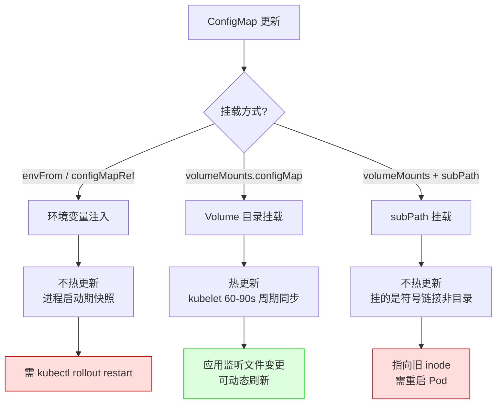
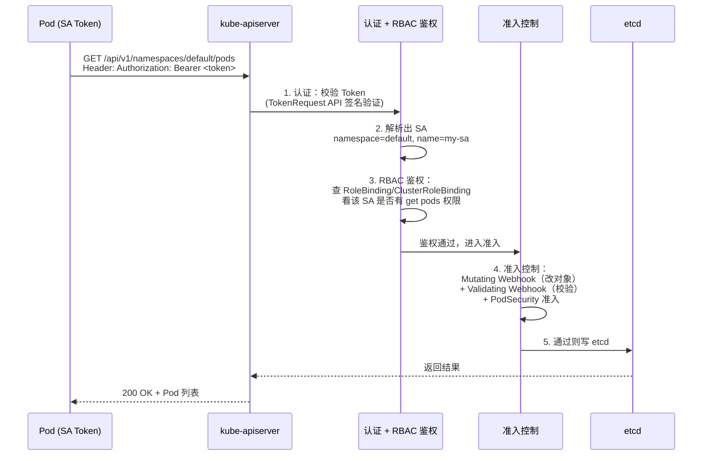
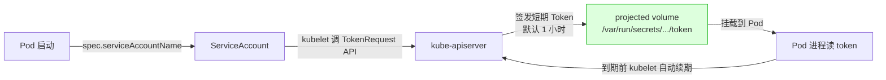

# 配置与 RBAC

> **一句话定位**：ConfigMap 热更新与 RBAC 鉴权是面试必考，PodSecurity 替代 PSP 是新版追问点。
> **面试热度**：⭐⭐⭐⭐⭐
> **返回**：[K8s 知识图谱](../README.md)

---

## 一、概念定义

### 1.1 配置与安全的三层心智模型

K8s 的"配置与安全"并非单一资源，而是贯穿**配置注入 → 身份认证 → 权限鉴权 → 工作负载安全**的四层心智模型：

| 层次 | 资源 | 解决什么问题 |
|------|------|-------------|
| **配置注入** | ConfigMap / Secret | 把镜像与配置解耦，同一镜像跑多环境 |
| **身份认证** | ServiceAccount + Token | Pod 在集群内的身份，调 API Server 的凭证 |
| **权限鉴权** | RBAC（Role/ClusterRole/Binding） | 该身份能对哪些资源做哪些操作 |
| **工作负载安全** | PodSecurity Standards | 限制 Pod 自身的安全姿态（特权/提权/caps） |

> **核心心智**：配置层解决"跑什么"，身份与权限层解决"谁能做什么"，PodSecurity 解决"Pod 自身能多危险"。三者正交，缺一不可——只配 RBAC 不配 PodSecurity，特权容器照样能逃逸；只配 ConfigMap 不配 Secret，密钥就泄露。

### 1.2 ConfigMap 是什么

**一句话**：ConfigMap 是存储**非敏感配置**的 K8s 资源，Key-Value 结构，可挂载为 Volume 或注入为环境变量，让镜像与配置解耦。

ConfigMap 的核心特征：**Key-Value 结构**（Value 可字符串或整文件内容如完整 YAML/JSON）、**命名空间级**（Pod 只能引用同 namespace 的 ConfigMap）、**非加密**（etcd 明文存储，**不能存密码/密钥**）、**大小限制**（单条 Value 最大 1MB，超大需拆分）。典型 YAML 把 `application.yaml` 整文件存进 `data` 字段，见 §4.1。

> **与 Secret 的边界**：ConfigMap 存"换了环境会变但不算密"的配置（数据库 URL、日志级别、特性开关），Secret 存"泄露就有损失"的凭证（数据库密码、TLS 私钥、API token）。把密码写进 ConfigMap 是常见违规——任何人 `kubectl get cm` 就能看到。

### 1.3 Secret 是什么

**一句话**：Secret 是存储**敏感信息**的 K8s 资源，etcd 中 base64 编码存储（**非加密**），按类型区分用途。

| Secret 类型 | 用途 | 典型字段 |
|-------------|------|---------|
| **Opaque** | 通用敏感数据（密码、token、密钥） | 自定义 Key-Value |
| **kubernetes.io/dockerconfigjson** | 镜像拉取凭证（私有 Registry） | `.dockerconfigjson`（含 `{"auths":{...}}`） |
| **kubernetes.io/tls** | TLS 证书与私钥 | `tls.crt`、`tls.key` |
| **kubernetes.io/service-account-token** | 1.24 前自动为 SA 创建的 Token Secret | `token`、`ca.crt`、`namespace` |

**关键认知——base64 ≠ 加密**：`kubectl get secret db-password -o jsonpath='{.data.password}'` 返回 `czNjcjN0`，`echo "czNjcjN0" | base64 -d` 即得明文 `s3cr3t`。base64 只是让二进制安全存进 JSON，**任何有 RBAC 读 Secret 权限的人都能解码出明文**。生产要真正加密，必须配 **EncryptionConfiguration 静态加密**（etcd 落盘加密）或外接 **KMS**（密钥管理服务），详见 §2.3。

> **与 ConfigMap 的核心差异**：Secret 的 Value 可被 K8s 内部组件直接识别（`imagePullSecrets` 自动读 dockerconfigjson、TLS Secret 自动被 Ingress 读）；ConfigMap 的 Value 永远是明文字符串。两者挂载方式相同，但 Secret 在 RBAC 上应收敛更严。

### 1.4 RBAC 三要素

**一句话**：RBAC（Role-Based Access Control）= **权限定义**（Role/ClusterRole）+ **主体**（Subject）+ **绑定**（RoleBinding/ClusterRoleBinding），三者分离实现"最小权限"。

| 要素 | 资源 | 作用域 | 职责 |
|------|------|--------|------|
| **权限定义** | Role | 命名空间级 | 定义"对某 namespace 内哪些资源能做什么操作" |
| | ClusterRole | 集群级 | 定义"对集群级资源（Node/PV）或跨 namespace 资源的操作" |
| **主体** | User/Group | 集群级 | 外部用户/组（由认证插件映射） |
| | ServiceAccount | 命名空间级 | Pod 在集群内的身份 |
| **绑定** | RoleBinding | 命名空间级 | 把 Subject 绑到 Role 或 ClusterRole（限本 namespace） |
| | ClusterRoleBinding | 集群级 | 把 Subject 绑到 ClusterRole（全 namespace 生效） |

**关键规则——deny by default**：未显式授权的操作默认拒绝。没有 RoleBinding 给某 ServiceAccount 授权 `get pods`，该 SA 调 API Server `GET /api/v1/pods` 就会被 403 拒绝。这是最小权限原则在 K8s 的硬性落地。

> **与 Spring Security 鉴权链的对照**：Spring Security 也是"认证（Authentication）→ 鉴权（Authorization）→ 准入"链，K8s 的 API Server 鉴权链与之同构——只是 K8s 的"主体"是 ServiceAccount 而非 User Principal，"权限定义"是 Role/ClusterRole 而非 `@PreAuthorize`。详见 §四 4.4。

### 1.5 ServiceAccount 是什么

**一句话**：ServiceAccount（SA）是 Pod 在集群内的身份，Pod 默认挂载所在 namespace 的 default SA，用它调 API Server。

- **命名空间级**：每个 namespace 自动有一个 `default` SA，Pod 不显式指定 `serviceAccountName` 时用它。
- **Token 挂载**：Pod 自动通过 projected volume 把 SA 的 Token 挂到 `/var/run/secrets/kubernetes.io/serviceaccount/`，含 `token`、`ca.crt`、`namespace` 三个文件——Pod 内进程读 `token` 拿 Bearer Token，读 `ca.crt` 校验 API Server TLS 证书，读 `namespace` 知道自己在哪。
- **1.24+ 演进**：1.24 前 Token 是永久有效的 Secret；1.24+ 改用 TokenRequest API 生成**短期 Token**（默认 1 小时），到期自动续期，详见 §2.6。

Pod 访问 API Server 的标准姿势：`curl -k -H "Authorization: Bearer $(cat .../token)" https://kubernetes.default.svc/api/v1/namespaces/$(cat .../namespace)/pods`。

### 1.6 PodSecurity Standards 三级

**一句话**：PodSecurity Standards 是 K8s 1.25+ 替代废弃的 PodSecurityPolicy（PSP）的新机制，用 namespace label 强制 Pod 安全姿态，分 privileged/baseline/restricted 三级。

| 级别 | 限制强度 | 典型要求 | 适用 |
|------|---------|---------|------|
| **privileged** | 无限制 | 允许特权容器、hostPath、所有 caps、hostNetwork/PID | 系统组件、特权 agent（如 CNI 插件） |
| **baseline** | 防最危险提权 | 禁特权容器、禁 hostPath、禁 hostNetwork/PID/IPC、禁添加大多数 caps | 一般业务 |
| **restricted** | 严格最佳实践 | 必须 runAsNonRoot、allowPrivilegeEscalation=false、drop ALL capabilities、seccompProfile=RuntimeDefault | 高安全要求业务、多租户 |

**启用方式**：给 namespace 打 label（`pod-security.kubernetes.io/enforce=restricted` + `enforce-version=v1.29`），详见 §2.7。

**与 PSP 的核心区别**：PSP 是集群级 Admission Controller 资源，需写策略 + 绑 RBAC，配置复杂、冲突难调试；PodSecurity 是 namespace label 驱动，一行 label 切换级别，策略内建于 kube-apiserver，无需额外资源。这是 K8s 1.25 用"声明式 label"替代"命令式策略资源"的典型简化。

> **关联**：PodSecurity 的 enforce 由 API Server 的 `PodSecurity` 准入控制器执行，与 RBAC 同属"准入控制层"。准入 Webhook 机制详见 [CRD 与 Operator](../08-extensions/crd-and-operator.md)。

---

## 二、原理与流程

### 2.1 ConfigMap 两种挂载方式

ConfigMap 注入 Pod 有两条路径，热更新行为截然不同：

| 挂载方式 | 配置 | 热更新 | 陷阱 |
|---------|------|--------|------|
| **环境变量注入** | `envFrom.configMapRef` 或 `env.valueFrom.configMapKeyRef` | ❌ 不热更新 | ConfigMap 改了，已运行的 Pod 环境变量不变，需重启 Pod |
| **Volume 挂载** | `volumes.configMap` + `volumeMounts` | ✅ 热更新（有延迟） | kubelet 周期同步，默认 60-90s；`subPath` 挂载**不热更新** |

#### 2.1.1 环境变量注入（不热更新）

```yaml
spec:
  containers:
  - name: app
    envFrom:
    - configMapRef: { name: order-config }     # 整个 ConfigMap 注入为环境变量
    env:
    - name: LOG_LEVEL
      valueFrom: { configMapKeyRef: { name: order-config, key: LOG_LEVEL } }  # 单个 Key
```

环境变量是进程启动时由 kubelet 通过 CRI 传入容器，写入环境块（environ）。ConfigMap 变更后，kubelet 不会重启容器重读——环境变量是"启动期快照"。要应用新值必须**滚动重启 Pod**（`kubectl rollout restart`）。

#### 2.1.2 Volume 挂载（热更新有延迟）

```yaml
spec:
  volumes:
  - name: config
    configMap: { name: order-config }          # 把 ConfigMap 挂为目录，每个 Key 是一个文件
  containers:
  - name: app
    volumeMounts:
    - name: config
      mountPath: /config                       # /config/application.yaml、/config/LOG_LEVEL
```

Volume 挂载时，kubelet 周期性（约 60-90 秒，走 kubelet volume manager）把 ConfigMap 最新内容刷新到挂载点文件。应用若监听文件变更（如 Spring Cloud Kubernetes Config），可动态刷新配置。

#### 2.1.3 subPath 挂载的陷阱（高频面试点）

当 `volumeMounts` 用 `subPath: application.yaml` 挂单个文件（`mountPath: /app/application.yaml`）时，**subPath 挂载不热更新**——这是 ConfigMap 热更新最常见的坑。根因是 subPath 挂载的是**符号链接文件本身**而非目录，kubelet 刷新的是目录内容（创建新文件 + 更新符号链接指向），但 subPath 挂载点指向的旧文件 inode 不会变。应用读到的还是旧内容，需重启 Pod。

**热更新三要素**：要真正动态刷新，需同时满足——（1）Volume 目录挂载（不用 subPath、不用环境变量）；（2）应用监听文件变更（Spring Cloud Kubernetes Config 或 Reloader sidecar）；（3）kubelet 60-90s 同步延迟可接受。不满足就 `kubectl rollout restart`。

> **关联**：ConfigMap 热更新与 Spring Boot 的配合详见 §四 4.1、§四 4.2。

### 2.2 ConfigMap 热更新决策图

三种挂载方式的热更新行为可归纳为以下决策树：



**决策要点**：env 方式是"启动期快照"，改了必须重启；Volume 目录挂载是唯一热更新路径，但有 60-90s 同步延迟，且应用须主动监听文件变更才能真正生效；subPath 看似 Volume 挂载实则不热更新，是最隐蔽的坑。三条路径只有 Volume 目录挂载能动态刷新，其余两条都需重启 Pod。

### 2.3 Secret 类型与加密

**四种 Secret 类型**已在 §1.3 列表，典型用法：Opaque 存自定义 Key-Value（密码/token，见 §4.3 完整 YAML）；dockerconfigjson 存 `.dockerconfigjson`（Pod 用 `spec.imagePullSecrets: [{ name: regcred }]` 引用，kubelet 拉镜像前读此凭证构造 `docker login`，也可给 SA 绑让所有 Pod 自动带凭证）；tls 存 `tls.crt`+`tls.key`（被 Ingress Controller 自动读取配 HTTPS）。1.14+ 支持 `stringData` 字段直接写明文，提交时 API Server 自动 base64 编码。

**etcd 加密的三道防线**——Secret 默认只 base64 编码，生产必须叠加加密：

| 防线 | 机制 | 防护范围 |
|------|------|---------|
| **第 1 道：RBAC** | 默认 SA 无读 Secret 权限 | 防 Pod 误读其他 Secret |
| **第 2 道：EncryptionConfiguration** | kube-apiserver 配静态加密，etcd 落盘密文 | 防 etcd 被直接读盘 |
| **第 3 道：外部 KMS** | 密钥存 Vault/云 KMS，集群内只存引用 | 防集群被攻破后密钥外泄 |

**EncryptionConfiguration 示例**（kube-apiserver `--encryption-provider-config`）：

```yaml
apiVersion: apiserver.config.k8s.io/v1
kind: EncryptionConfiguration
resources:
- resources: [secrets]
  providers:
  - aescbc:                        # AES-CBC 静态加密（密钥配在文件）
      keys:
      - name: key1
        secret: <base64 编码的 32 字节密钥>
  - identity:                      # 兜底：aescbc 失败时明文（不推荐，生产用 KMS）
```

配了之后，新写入的 Secret 在 etcd 是 AES 密文；已存在的旧 Secret 需重新写一遍才加密（`kubectl get secret --all-namespaces -o yaml | kubectl replace -f -`）。

> **关联**：etcd 是 API Server 的唯一存储后端，详见 [架构总览与核心组件](../01-foundation/k8s-architecture.md) §2.3。EncryptionConfiguration 让"etcd 被直接读盘"也读不到明文，是纵深防御的第 2 道。

### 2.4 RBAC 鉴权链（sequenceDiagram）

Pod 调 API Server 的完整鉴权链：



**五步链路**：1. **认证**：校验 Token（TokenRequest API 签名或查 Secret），解析出 SA 身份；2. **鉴权**：查 RoleBinding/ClusterRoleBinding 看该 SA 是否有对应权限，**deny by default**；3. **准入**：Mutating Webhook 可改对象（如 Istio 注入 sidecar）、Validating Webhook 校验（如 OPA Gatekeeper）、PodSecurity 准入检查安全姿态；4. **写 etcd**：通过准入才持久化；5. **返回**结果给 Pod。

> **与架构总览的关联**：这条链路是 [架构总览与核心组件](../01-foundation/k8s-architecture.md) §2.4 Pod 创建全流程的前半段（kubectl → API Server 的鉴权准入部分），Pod 作为内部组件调 API Server 走的是同一条链路——只是凭证从 kubeconfig 的客户端证书变成 Pod 内的 SA Token。

### 2.5 Role vs ClusterRole

| 维度 | Role | ClusterRole |
|------|------|-------------|
| 作用域 | 命名空间级（只能授权同 namespace 资源） | 集群级（可授权跨 namespace 资源或集群级资源） |
| 能授权的资源 | 同 namespace 的 namespaced 资源（Pod/Service/ConfigMap） | namespaced 资源（跨所有 namespace）+ 集群级资源（Node/PV/Namespace） |
| 典型用法 | 给某 namespace 的 SA 授权细粒度操作 | 定义通用权限集，被 RoleBinding 限定到某 namespace |

**典型模式——ClusterRole + RoleBinding**：生产中最常用的组合是**先建一个 ClusterRole 定义通用权限集**（如"只读用户"），再用 **RoleBinding** 把它绑到某 namespace 的 SA——这样 ClusterRole 的权限被 RoleBinding 限定到该 namespace，实现"集群级定义、命名空间级生效"。

```yaml
# ClusterRole：定义"只读"权限集（集群级，可复用）
apiVersion: rbac.authorization.k8s.io/v1
kind: ClusterRole
metadata: { name: pod-reader }
rules:
- apiGroups: [""]
  resources: ["pods", "pods/log"]
  verbs: ["get", "list", "watch"]
---
# RoleBinding：把 ClusterRole 绑到 default namespace 的 SA（限本 namespace）
apiVersion: rbac.authorization.k8s.io/v1
kind: RoleBinding
metadata: { name: read-pods, namespace: default }
subjects:
- kind: ServiceAccount
  name: my-sa
  namespace: default
roleRef:
  kind: ClusterRole              # 引用 ClusterRole
  name: pod-reader
  apiGroup: rbac.authorization.k8s.io
```

这样 `my-sa` 只能在 default namespace 读 Pod，不能读其他 namespace，也不能读 Node/PV 等集群级资源。

### 2.6 ServiceAccount Token 演进

#### 1.24 前：永久 Secret Token

1.24 前，创建 SA 时 K8s 自动生成 `kubernetes.io/service-account-token` 类型的 Secret，内含**永久有效**的 Token，Pod 挂载该 Secret 到 `/var/run/secrets/...`。问题：Token 永久有效泄露后无法吊销（除非删 SA 重建）、Secret 管理负担（每 SA 一个 Secret）、长期凭证不符合零信任"短期凭证"原则。

#### 1.24+：TokenRequest API 短期 Token

1.24+（`LegacyServiceAccountTokenNoAutoGeneration` 默认开启）不再自动创建 Token Secret，改用 **TokenRequest API** 按需生成短期 Token：



- **短期**：默认 1 小时，到期前 kubelet 自动调 TokenRequest 续期，应用无感。
- **bound 到 Pod**：Token 绑定到具体 Pod（`boundObjectRef`），Pod 删除后 Token 立即失效。
- **projected volume 挂载**：通过 `projected` Volume 类型挂载，不再走 Secret。

手工生成 Token 调试：`kubectl create token my-sa --duration=1h` 返回 JWT，可用作 Bearer Token。

> **核心收益**：从"永久凭证 + 难吊销"到"短期凭证 + Pod 绑定 + 自动续期"，符合零信任"凭证最小生命周期"原则——泄露的短期 Token 1 小时后自动失效，比永久 Token 安全得多。

### 2.7 PodSecurity 替代 PSP

PodSecurityPolicy（PSP）在 1.21 弃用、1.25 移除，被 PodSecurity Standards 替代。**PSP 废弃根因**：

| PSP 的痛点 | 说明 |
|-----------|------|
| **配置复杂** | 需写 PSP 资源（一堆字段）+ 绑 RBAC，两层配置 |
| **冲突难调试** | 多个 PSP 同时匹配时按优先级选一个，行为不直观 |
| **授权模型不直观** | PSP 通过 RBAC 授给 SA，导致"改 Pod 安全姿态"与"改 RBAC"耦合 |
| **默认拒绝陷阱** | 集群启用 PSP 但 Pod 没绑 PSP → 拒绝创建，新手常踩坑 |

**PodSecurity 准入控制器**用 **namespace label** 驱动，由 kube-apiserver 内建执行（无需额外资源）：`kubectl label namespace prod pod-security.kubernetes.io/enforce=restricted pod-security.kubernetes.io/enforce-version=v1.29`——之后 prod namespace 内创建不符合 restricted 的 Pod 会被拒绝（`Error: Pod ... is forbidden: violates PodSecurity "restricted:latest"`）。

**三种模式 label**：`enforce=<level>`（拒绝不合规，硬性）、`audit=<level>`（记审计日志不拒绝，软性观察）、`warn=<level>`（kubectl apply 时警告不拒绝）。

> **核心简化**：从"写 PSP 资源 + 绑 RBAC + 调优先级"简化为"给 namespace 打一个 label"。这是 K8s 用"声明式 label"替代"命令式策略资源"的典型演进——与 NetworkPolicy 用 label 选 Pod、Service 用 label 选 Endpoints 同构。

---

## 三、高频追问与面试题

### Q1：ConfigMap 挂载为环境变量和 Volume 有什么区别？

**参考答案**：热更新行为截然不同——环境变量**不热更新**（ConfigMap 改了需 `kubectl rollout restart` 重启 Pod），Volume 目录挂载**热更新**（kubelet 60-90s 同步），但 **subPath 挂载不热更新**（挂的是符号链接文件本身，不随目录刷新）。典型场景：启动期固定配置用环境变量（如 JVM 参数），运行期可变配置用 Volume（如日志级别）。

**核心**：要热更新就用 Volume 目录挂载（不用 subPath），要固定就用环境变量。subPath 是最隐蔽的坑——看似 Volume 挂载，实则不热更新。

> **关联**：§2.1 ConfigMap 两种挂载方式。

### Q2：Secret 在 etcd 里是加密的吗？

**参考答案**：**默认不加密，只 base64 编码**。生产必须配 EncryptionConfiguration 静态加密或外接 KMS。

- **默认行为**：Secret 在 etcd 是 base64 编码存储，`echo <value> | base64 -d` 就能还原明文。base64 只是让二进制安全存进 JSON，不是加密。
- **第 2 道防线——EncryptionConfiguration**：kube-apiserver 配 `--encryption-provider-config`，用 AES-CBC 或 AES-GCM 加密 Secret 后再写 etcd，etcd 落盘是密文。
- **第 3 道防线——外部 KMS**：密钥存 Vault/云 KMS（AWS KMS/Azure Key Vault），集群内只存密钥引用，密钥永不在集群内明文。最强安全。
- **第 1 道防线——RBAC**：默认 SA 无读 Secret 权限，需显式 RoleBinding 授权。但只挡"通过 API Server 读"，挡不住"直接读 etcd 盘"。

**加固顺序**：先收敛 RBAC（第 1 道）→ 配 EncryptionConfiguration（第 2 道）→ 高安全上 KMS（第 3 道）。

> **关联**：§2.3 Secret 类型与加密、§1.3 Secret 是什么。

### Q3：Role 和 ClusterRole 的区别？

**参考答案**：作用域不同——Role **命名空间级**（只能授权同 namespace 的 namespaced 资源如 Pod/Service/ConfigMap），ClusterRole **集群级**（可授权跨 namespace 的 namespaced 资源 + 集群级资源如 Node/PV/Namespace）。

**绑定方式**：RoleBinding 把 Subject 绑到 Role 或 ClusterRole（限本 namespace）；ClusterRoleBinding 把 Subject 绑到 ClusterRole（全 namespace 生效）。

**生产最佳实践——ClusterRole + RoleBinding**：先建 ClusterRole 定义通用权限集（如"只读用户"），再用 RoleBinding 绑到某 namespace 的 SA——ClusterRole 权限被 RoleBinding 限定到该 namespace，实现"集群级定义、命名空间级生效"，避免每个 namespace 重复定义 Role。

> **关联**：§2.5 Role vs ClusterRole。

### Q4：ServiceAccount Token 1.24 前后有什么变化？

**参考答案**：从永久 Secret Token 改为 TokenRequest API 短期 Token。

| 维度 | 1.24 前 | 1.24+ |
|------|---------|--------|
| Token 来源 | 自动创建 `service-account-token` 类型 Secret | TokenRequest API 按需签发 |
| 有效期 | 永久（除非删 SA） | 短期（默认 1 小时，可配） |
| Pod 绑定 | 不绑定 | 绑定具体 Pod（Pod 删 Token 失效） |
| 续期 | 不续期 | kubelet 自动续期，应用无感 |
| 吊销 | 删 SA 重建（影响所有 Pod） | Pod 删 Token 即失效 |

**核心收益**：从"永久凭证 + 难吊销"到"短期凭证 + Pod 绑定 + 自动续期"，符合零信任"凭证最小生命周期"原则——泄露的短期 Token 1 小时后自动失效，泄露的永久 Token 永远有效。

> **关联**：§2.6 ServiceAccount Token 演进。

### Q5：PSP 为什么被废弃？PodSecurity 怎么替代？

**参考答案**：PSP 配置复杂、冲突难调试、授权模型不直观，PodSecurity 用 namespace label 简化。

**PSP 痛点**：配置复杂（写 PSP 资源 + 绑 RBAC 两层）、冲突难调试（多 PSP 按优先级选一，行为不直观）、授权模型不直观（PSP 通过 RBAC 授给 SA，"改安全姿态"与"改 RBAC"耦合）、默认拒绝陷阱（启用 PSP 但 Pod 没绑 → 拒绝创建）。

**PodSecurity 简化**：用 namespace label（`pod-security.kubernetes.io/enforce=restricted`）驱动，由 kube-apiserver 内建准入控制器执行，无需额外资源。一行 label 切换级别。三级：privileged（无限制，系统组件）、baseline（防最危险提权，一般业务）、restricted（严格最佳实践，高安全/多租户）。

> **关联**：§2.7 PodSecurity 替代 PSP、§1.6 PodSecurity Standards 三级。

### Q6：PodSecurity 的 restricted 级别有什么要求？

**参考答案**：严格最佳实践，要求 Pod 不具备任何提权能力。

| 要求 | 字段 | 为什么 |
|------|------|--------|
| 非 root 运行 | `runAsNonRoot: true` 或 `runAsUser: non-zero` | root 容器逃逸风险高 |
| 禁止提权 | `allowPrivilegeEscalation: false` | 防止子进程获得更多权限 |
| 丢弃所有 caps | `capabilities.drop: [ALL]` | 不持有任何 Linux capability |
| seccomp | `seccompProfile: RuntimeDefault` | 限制 syscall 到默认白名单 |
| 禁特权容器 | 不设 `privileged: true` | 特权容器≈宿主 root |
| 禁 hostPath/hostNetwork | 不用 hostNetwork/hostPID/hostIPC/hostPath | 不共享宿主网络/进程/文件系统 |

**典型 restricted Pod 配置**：

```yaml
spec:
  securityContext:
    runAsNonRoot: true
    seccompProfile:
      type: RuntimeDefault
  containers:
  - name: app
    securityContext:
      allowPrivilegeEscalation: false
      runAsNonRoot: true
      runAsUser: 1000
      capabilities:
        drop: [ALL]
```

> **关联**：§1.6 PodSecurity Standards 三级、[Docker 安全模型](../../docker/07-security/docker-security.md) §2.1 capabilities——restricted 的 `drop: [ALL]` 与 Docker 的 `--cap-drop=ALL` 同构。

### Q7：RBAC 的 deny by default 是什么意思？

**参考答案**：未显式授权的操作默认拒绝，遵循最小权限原则。

- **机制**：API Server 鉴权时遍历所有 RoleBinding/ClusterRoleBinding，看是否有任一条规则允许该操作。**只要没有显式 allow，就 deny**——不存在"默认 allow 除非 deny"。
- **与防火墙对比**：像防火墙的"白名单"模式（默认拒绝，显式放行），而非"黑名单"模式（默认放行，显式拒绝）。
- **最小权限原则**：每个 SA 只授权它完成任务所需的最小权限。如某 SA 只需读 Pod，就只给 `get/list/watch pods`，不给 `create/delete pods`。
- **审计意义**：所有授权都是显式的，可追溯"谁授权了什么"，便于合规审计。

> **关联**：§1.4 RBAC 三要素、§2.4 RBAC 鉴权链。

### Q8：Pod 怎么访问 API Server？

**参考答案**：通过自动注入的 ServiceAccount Token + CA 证书，访问 `https://kubernetes.default.svc`。

Pod 内进程读 `/var/run/secrets/kubernetes.io/serviceaccount/token` 拿 Bearer Token，读 `ca.crt` 校验 API Server TLS 证书，读 `namespace` 知道自己在哪——请求形如 `curl -k -H "Authorization: Bearer <token>" https://kubernetes.default.svc/api/v1/namespaces/<ns>/pods`。Service `kubernetes` 自动创建，指向 API Server。

**默认权限**：default SA 默认无读 Pod 权限（deny by default），需 RoleBinding 显式授权。若 Pod 调 API Server 报 403，根因通常是没绑 RBAC。

> **关联**：§1.5 ServiceAccount 是什么、§2.4 RBAC 鉴权链、§五 5.2 Pod 无法访问 API Server 排查。

---

## 四、实战关联（Java 后端视角）

### 4.1 Spring Boot 配置注入：ConfigMap 挂载为 Volume

Spring Boot 的外部化配置与 K8s ConfigMap 的标准配合——ConfigMap 挂载为 Volume，Spring Boot 读 `application.yaml` + 环境变量覆盖占位符。

**ConfigMap（存完整 application.yaml，含 `${DB_USER}` 占位符）**：

```yaml
apiVersion: v1
kind: ConfigMap
metadata: { name: order-config }
data:
  application.yaml: |
    spring:
      datasource:
        url: jdbc:mysql://mysql:3306/order
        username: ${DB_USER}          # 占位，由 Secret 注入环境变量覆盖
      redis: { host: redis, port: 6379 }
    logging: { level: { com.yintp: INFO } }
```

**Deployment 挂载 ConfigMap + Secret 注密码**：`volumes.configMap` 挂到 `/app/config/`，环境变量 `SPRING_CONFIG_LOCATION=file:/app/config/` 让 Spring Boot 读外部配置；`SPRING_DATASOURCE_PASSWORD`/`DB_USER` 用 `secretKeyRef` 从 Secret 注入（见 §4.3）。

**配置优先级**（Spring Boot 从高到低）：环境变量/命令行参数 > 外部 `application.yaml`（ConfigMap 挂载）> 内嵌 `application.yaml`（镜像内）。ConfigMap 挂载的 `application.yaml` 覆盖镜像内同名配置，环境变量又覆盖 ConfigMap 的占位符——实现"同一镜像跑多环境"。

> **关联 `framework/spring-framework` 模块**：该模块的 `ProfileConfig`（`com.yintp.spring.framework.annotation.config.ProfileConfig`）演示 `@Profile` 与 `@Value`——对照理解：`@Value("${spring.datasource.url}")` 在 K8s 下会被 ConfigMap 挂载的值覆盖，`@Profile("prod")` 控制哪些 Bean 激活，配合 ConfigMap 实现"同一镜像 + 不同 ConfigMap + 不同 Profile"的多环境部署。

### 4.2 ConfigMap 热更新与 Spring Cloud Kubernetes

Spring Boot 原生不支持监听 ConfigMap 变更动态刷新 `@Value`——文件变了但已注入的 `@Value` 不变。要动态刷新需 **Spring Cloud Kubernetes Config**：

```yaml
# pom.xml: spring-cloud-starter-kubernetes-fabric8-config
spring:
  cloud:
    kubernetes:
      config:
        name: order-config            # 读同名 ConfigMap
        namespace: default
        reload:
          enabled: true               # 启用热更新
          strategy: polling           # 轮询模式（也可 watch 模式监听变更）
          period: 5000                # 轮询间隔 5 秒
  application:
    name: order-service
```

启用后，Spring Cloud Kubernetes 周期性读 ConfigMap，发现变更则触发 `@RefreshScope` Bean 重建，`@Value` 拿到新值。配合 `actuator/refresh` 端点可手动触发刷新。**三条件**（§2.1.3）：Volume 目录挂载（不用 subPath/环境变量）+ `reload.enabled=true` + SA 有读 ConfigMap 的 RBAC。

> **关联 `framework/jackson` 模块**：ConfigMap 存的 YAML/JSON 配置，Spring Boot 用 Jackson 反序列化为 `@ConfigurationProperties` Bean。该模块的自定义序列化器（`com.yintp.jackson`）演示 YAML/JSON ↔ POJO 的映射控制——ConfigMap 的 `application.yaml` 经 Jackson 反序列化为 `DataSourceProperties`，字段名匹配靠 Jackson 命名策略。

### 4.3 Secret 注入数据库密码

Spring Boot 读取 DataSource 密码的标准姿势——Secret 作为环境变量注入，或更安全的文件挂载 + `_FILE` 机制。

**方式一：环境变量注入**（`SPRING_DATASOURCE_PASSWORD` → `spring.datasource.password`）——Secret 存 `{ username: YWRtaW4=, password: czNjcjN0 }`（admin/s3cr3t 的 base64），Deployment 用 `env.valueFrom.secretKeyRef: { name: db-password, key: password }` 注入。环境变量注入后，`@Value("${spring.datasource.password}")` 拿到 Secret 的值。

**方式二（更安全）：文件挂载 + `_FILE` 后缀**——避免密码进环境变量（`ps auxe` 可见），改用 Secret 挂载为只读文件（权限 0400），Spring Boot 的 `_FILE` 机制读文件内容：

```yaml
spec:
  volumes:
  - name: secret
    secret: { secretName: db-password }
  containers:
  - name: app
    volumeMounts:
    - name: secret
      mountPath: /run/secrets/db
      readOnly: true
    env:
    - name: SPRING_DATASOURCE_PASSWORD_FILE   # Spring Boot _FILE 机制读文件
      value: /run/secrets/db/password
```

与 [Docker 安全模型](../../docker/07-security/docker-security.md) §4.2 的 Docker Secrets 文件注入方案同构——密钥不进环境变量，只以只读文件存在。

### 4.4 RBAC 鉴权链与 Spring Security 的对照

K8s API Server 鉴权链与 Spring Security 鉴权链同构，便于 Java 后端理解：

| 阶段 | K8s API Server | Spring Security |
|------|---------------|-----------------|
| **认证（Authentication）** | 校验 SA Token（TokenRequest API 签名） | 校验 JWT/Session（AuthenticationManager） |
| **鉴权（Authorization）** | RBAC：查 Role/ClusterRole 是否允许 | `@PreAuthorize`/`AccessDecisionManager` |
| **主体** | ServiceAccount（Pod 身份） | User Principal（用户身份） |
| **权限定义** | Role/ClusterRole（rules） | `@PreAuthorize("hasRole('ADMIN')")` |
| **绑定** | RoleBinding（Subject → Role） | 用户 → Role 映射（UserDetailsService） |
| **deny by default** | 未显式授权默认拒绝 | 同（无 `@PreAuthorize` 放行，有则需匹配） |

**核心同构**：两者都是"认证 → 鉴权 → 准入/拦截"三段式，且都遵循 deny by default。K8s 的 ServiceAccount 对应 Spring Security 的 User Principal，K8s 的 Role 对应 Spring Security 的 Role/Authority。

> **关联 `framework/spring-framework` 模块**：该模块演示 Spring 注解驱动配置与 Bean 生命周期——对照理解 K8s SA Token 的注入（Pod 启动期注入凭证）与 Spring Security 的认证链（Filter 链注入认证信息）都是"在请求入口注入身份，在请求处理时鉴权"。

### 4.5 关联 java-core/annotation、java-core/apt：准入 Webhook 与 APT 对照

K8s 的准入 Webhook（Mutating/Validating）与 Java 的 APT（Annotation Processing Tool）都是"在对象处理流程中拦截变更"的机制，对照理解：

| 维度 | K8s 准入 Webhook | Java APT 注解处理器 |
|------|-----------------|-------------------|
| 拦截时机 | API Server 收到请求、鉴权后、写 etcd 前 | 编译期，javac 处理源码时 |
| 拦截对象 | K8s 资源（Pod/Deployment/CRD） | Java 源码（带注解的类/方法/字段） |
| 变更能力 | Mutating 可改对象（如注入 sidecar） | 可生成新源码/类（如生成 Builder） |
| 校验能力 | Validating 可拒绝（返回 403） | 可报错终止编译 |
| 注册方式 | ValidatingWebhookConfiguration 资源 | `@SupportedAnnotationProcessor` + META-INF/services |

**核心同构**：两者都是"在对象生命周期某阶段插入自定义逻辑"，K8s 在"资源写 etcd 前"，APT 在"源码编译期"。Mutating Webhook 对应 APT 的"生成新源码"，Validating Webhook 对应 APT 的"报错终止编译"。

> **关联 `java-core/annotation`、`java-core/apt` 模块**：`java-core/annotation` 演示注解定义与运行时反射读取，`java-core/apt` 演示编译期注解处理器——对照理解 K8s 准入 Webhook 的"拦截 + 变更/校验"与 APT 的"拦截 + 生成/报错"是同一模式在不同运行时的落地。准入 Webhook 的实战（如 Istio sidecar 注入）详见 [CRD 与 Operator](../08-extensions/crd-and-operator.md)。

---

## 五、面试案例

### 5.1 "你的 Spring Boot 配置怎么管理？"——3 分钟标准答法

**面试官**：你的 Spring Boot 应用上 K8s，配置怎么管理？

**3 分钟标准答法**：

> 配置分两类：非敏感用 ConfigMap，敏感用 Secret。**ConfigMap 层**——`application.yaml` 存进 ConfigMap 挂为 Volume 到 `/app/config/`，Spring Boot 通过 `SPRING_CONFIG_LOCATION=file:/app/config/` 读外部配置，覆盖镜像内嵌配置，同一镜像跑 dev/staging/prod 三个环境只需换 ConfigMap。**热更新**——用 Volume 目录挂载（不用 subPath/环境变量），kubelet 60-90s 自动同步；但动态刷新 `@Value` 需 Spring Cloud Kubernetes Config（`reload.enabled=true` 触发 `@RefreshScope` 重建），没接就 `kubectl rollout restart`。
>
> **Secret 层**——数据库密码用文件挂载到 `/run/secrets/db/`，Spring Boot 用 `_FILE` 后缀机制读文件（`SPRING_DATASOURCE_PASSWORD_FILE=/run/secrets/db/password`），密码不进环境变量，`ps` 看不到。Secret 在 etcd 默认只 base64，生产配 EncryptionConfiguration 静态加密，高安全上 Vault。**配置优先级**：环境变量 > ConfigMap 挂载的 `application.yaml` > 镜像内嵌 `application.yaml`，ConfigMap 的占位符（如 `${DB_USER}`）由 Secret 注入的环境变量覆盖。

**结构要点**：ConfigMap/Secret 分管 → Volume 挂载（不用 subPath）→ 热更新（Spring Cloud Kubernetes 或 restart）→ Secret 加密（EncryptionConfiguration/Vault）→ 优先级。

**追问链**：

| 追问 | 标准答法 |
|------|---------|
| ConfigMap 改了应用怎么感知？ | Volume 挂载的话 kubelet 60-90s 同步；应用感知需 Spring Cloud Kubernetes 或 Reloader sidecar；不行就 rollout restart |
| 密码为什么不用环境变量？ | `ps auxe` 能看到环境变量；用文件挂载 + `_FILE` 后缀，只读文件 0400 权限，更安全 |
| Secret 在 etcd 安全吗？ | 默认只 base64，要配 EncryptionConfiguration 静态加密或 KMS；RBAC 也要收敛，默认 SA 无读 Secret 权限 |

### 5.2 "Pod 无法访问 API Server，怎么排查？"——ServiceAccount/RBAC 排查链

**面试官**：你的 Pod 内进程调 API Server 报 403，怎么排查？

**排查链**：

| 步骤 | 检查 | 结论 |
|------|------|------|
| 1. 看 SA 是否正确挂载 | `kubectl get pod <pod> -o yaml` 看 `spec.serviceAccountName`，进 Pod 看 `/var/run/secrets/.../token` 是否存在 | 没挂载 → SA 配置错误或 1.24+ TokenRequest 未生效 |
| 2. 看 Token 是否过期 | 1.24+ 短期 Token，kubelet 应自动续期；若续期失败 Token 过期 → 401 | 检查 kubelet 日志是否有 TokenRequest 失败；网络策略是否阻断 kubelet→API Server |
| 3. 看 RBAC 是否授权 | `kubectl auth can-i --as=system:serviceaccount:<ns>:<sa> get pods -n <ns>` | 返回 no → 没绑 RoleBinding，需补 RBAC |
| 4. 看 RoleBinding 是否绑对 | `kubectl get rolebinding -n <ns> -o yaml` 看 subjects 和 roleRef | subjects 的 SA name/namespace 拼错 → 403 |
| 5. 看 ClusterRole 的 rules | `kubectl get clusterrole <name> -o yaml` 看 verbs/resources | verbs 缺了需要的操作（如只有 get 没 list）→ 403 |
| 6. 看是否有 NetworkPolicy 阻断 | Pod 到 API Server 的 443 端口是否被 NetworkPolicy 挡 | `kubectl exec` 进 Pod `curl -k https://kubernetes.default.svc` 超时 → 网络策略 |
| 7. 看 API Server 鉴权日志 | API Server audit log 看 403 的 reason | reason 显示 "forbidden: User ... cannot get resource pods" → RBAC 问题 |

**根因分类**：401（认证失败）→ Token 过期（1.24+ 续期失败，查 kubelet TokenRequest 日志/网络策略）/ Token 未挂载（检查 `spec.serviceAccountName`）；403（鉴权失败）→ RBAC 未授权（最常见，`kubectl auth can-i` 确认后补 RoleBinding）/ RoleBinding subjects 拼错（核对 SA name/namespace）/ ClusterRole verbs 不全（补 list/watch 等）。

**快速验证**：进 Pod `ls /var/run/secrets/...` 看 Token 是否挂载；宿主用 `kubectl auth can-i --as=system:serviceaccount:<ns>:<sa> get pods -n <ns>` 模拟该 SA 权限（返回 no 即根因）；补 RBAC `kubectl create rolebinding my-sa-read --role=pod-reader --serviceaccount=<ns>:<sa> -n <ns>`。

> **关联**：§1.5 ServiceAccount 是什么、§2.4 RBAC 鉴权链、§Q8 Pod 怎么访问 API Server。

---

## 六、参考与延伸

- **官方文档**：
  - [ConfigMap](https://kubernetes.io/docs/concepts/configuration/configmap/)
  - [Secret](https://kubernetes.io/docs/concepts/configuration/secret/)
  - [Using RBAC Authorization](https://kubernetes.io/docs/reference/access-authn-authz/rbac/)
  - [Pod Security Standards](https://kubernetes.io/docs/concepts/security/pod-security-standards/)
  - [Service Accounts](https://kubernetes.io/docs/concepts/security/service-accounts/)
  - [Configure Service Accounts for Pods](https://kubernetes.io/docs/tasks/configure-pod-container/configure-service-account/)
  - [Encrypting Secret Data at Rest](https://kubernetes.io/docs/tasks/administer-cluster/encrypt-data/)
- **源码包**：
  - `k8s.io/kubernetes/plugin/pkg/auth/authorizer/rbac`——RBAC 鉴权器实现
  - `k8s.io/kubernetes/pkg/kubelet/token`——TokenRequest 客户端与 Token 续期
  - `k8s.io/kubernetes/pkg/kubelet/kubelet_pods.go`——SA Token projected volume 挂载入口
  - `k8s.io/apiserver/pkg/admission/plugin/podsecurity`——PodSecurity 准入控制器
- **延伸阅读（跨文档）**：
  - [架构总览与核心组件](../01-foundation/k8s-architecture.md)——API Server 鉴权链、准入控制收敛点、Pod 创建全流程中的鉴权准入段
  - [Pod 与控制器](../02-workload/pod-and-controllers.md)——Pod 内 sidecar 协作（如 Vault agent 注入密钥）、Init Container 初始化配置
  - [Service 与 Ingress](../03-network/service-and-ingress.md)——Service `kubernetes` 自动创建（Pod 访问 API Server 的 Service）、NetworkPolicy 阻断排查
  - [Volume 与 PV/PVC](../04-storage/volume-and-pv-pvc.md)——ConfigMap/Secret 作为 Volume 类型的挂载机制
  - [CRD 与 Operator](../08-extensions/crd-and-operator.md)——准入 Webhook（Mutating/Validating）、Operator 自定义 Controller 的 RBAC（Task 8 将引用本文 CRD 鉴权部分）
  - [Java 应用上 K8s](../09-performance/java-on-k8s.md)——ConfigMap 注入 Spring 配置的完整链路（Task 9 将引用本文热更新部分）
- **ops/docker 模块交叉引用**：
  - [Docker 安全模型](../../docker/07-security/docker-security.md) §2.1 capabilities——restricted 的 `drop: [ALL]` 与 Docker `--cap-drop=ALL` 同构
  - [Docker 安全模型](../../docker/07-security/docker-security.md) §4.2 密钥注入方案——Secret 文件挂载与 Docker Secrets 文件注入方案对照
- **仓库内关联**：
  - `framework/spring-framework`——`ProfileConfig`（`com.yintp.spring.framework.annotation.config.ProfileConfig`）演示 `@Profile` 与 `@Value`，对照理解 ConfigMap 注入 Spring 配置与配置优先级
  - `framework/jackson`——ConfigMap 的 YAML/JSON 配置与 Jackson 反序列化、`@ConfigurationProperties` 的字段映射
  - `java-core/annotation`、`java-core/apt`——注解处理器与准入 Webhook 的拦截机制对照（编译期拦截 vs 请求期拦截）

> **返回**：[K8s 知识图谱](../README.md)
