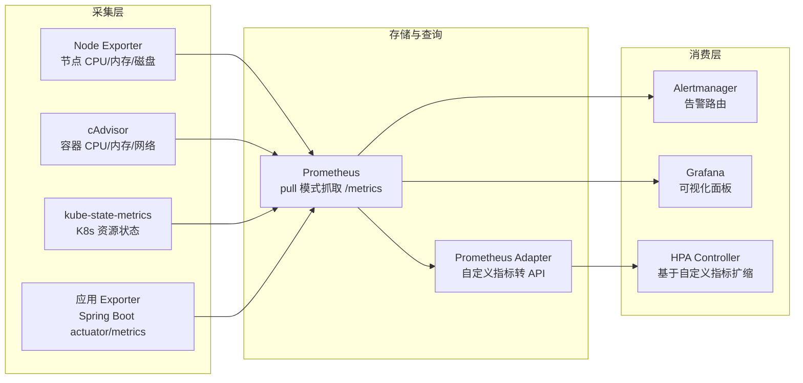
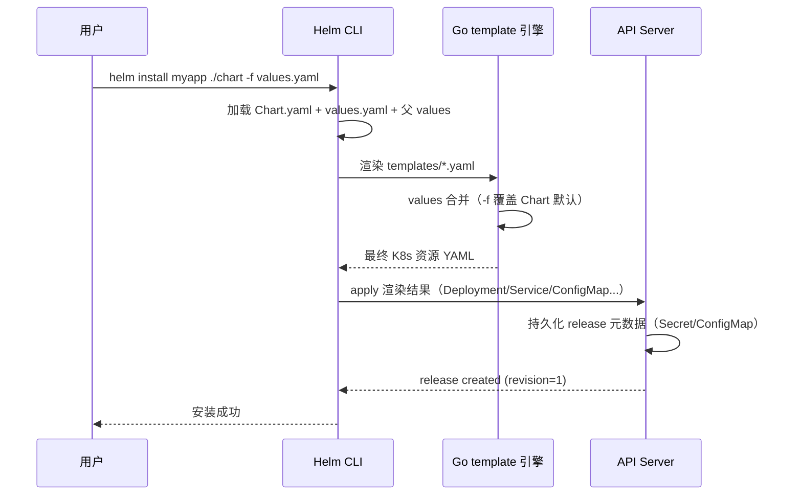
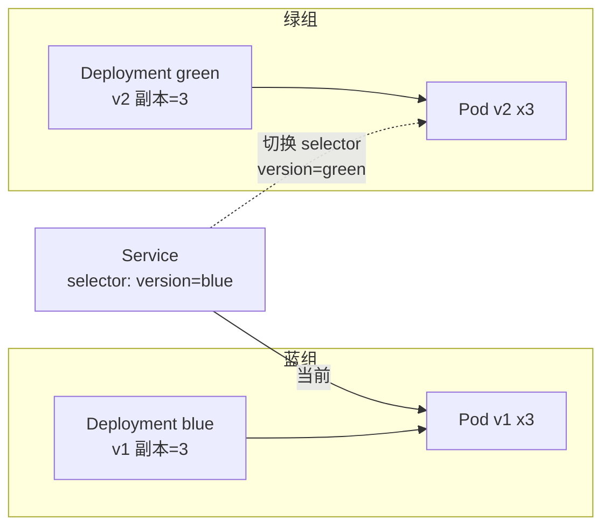
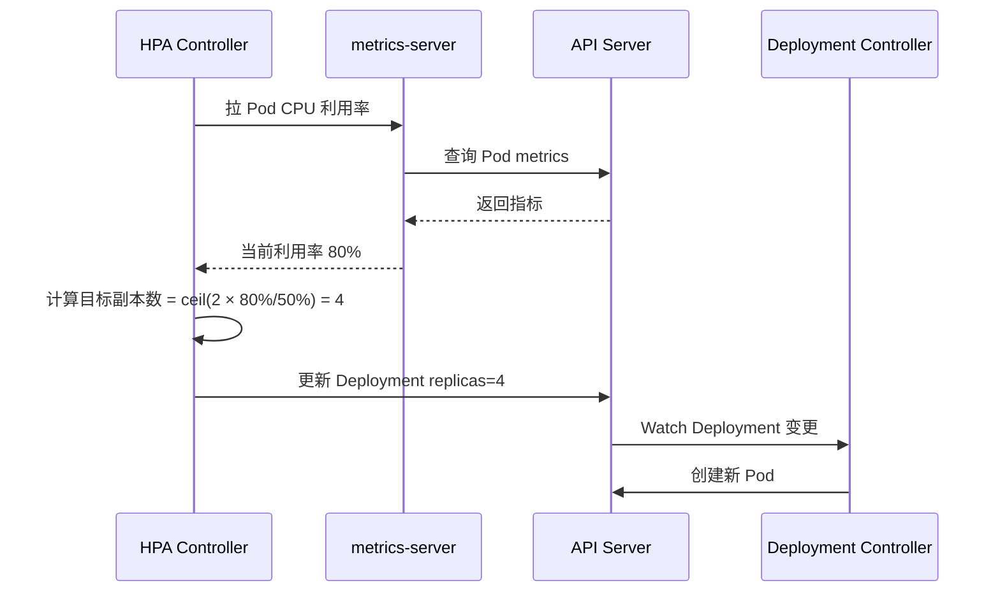
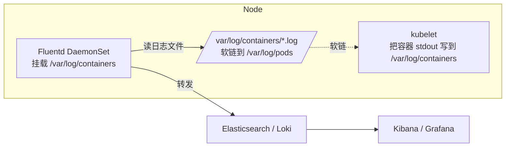
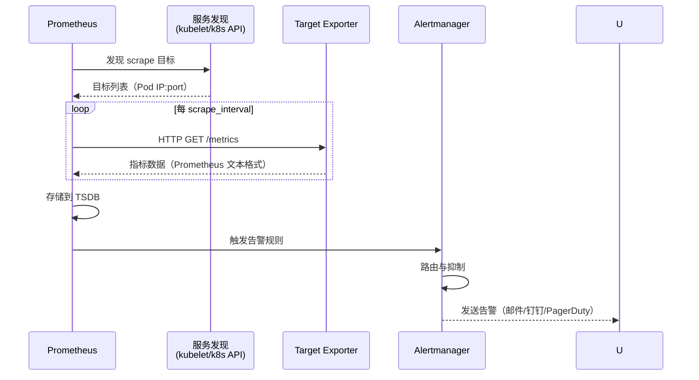

# 运维与故障排查

> **一句话定位**：故障排查方法论与 HPA/日志/Prometheus 是面试高频实战题，kubectl 排障命令链是必考。
> **面试热度**：⭐⭐⭐⭐⭐
> **返回**：[K8s 知识图谱](../README.md)

---

## 一、概念定义

### 1.1 运维与排障的四层心智模型

K8s 的"运维与排障"贯穿**包管理 → 发布策略 → 自动伸缩 → 可观测性 → 故障排查**五层：包管理用 Helm（版本化模板化部署）、发布策略有滚动/蓝绿/金丝雀（控制流量切换与回滚）、自动伸缩用 HPA/VPA（按指标扩缩副本或调资源）、可观测性靠日志采集 + Prometheus（看见状态定位故障）、故障排查用 kubectl 命令链 + crictl（从 Pod 到节点容器逐层定位）。

> **核心认知**：前四层是"主动运维"——让系统自愈、可观测；第五层是"被动排障"——出问题后的标准动作。面试常把发布策略、HPA、日志、Prometheus、CrashLoopBackOff 排查串成一串问。

### 1.2 Helm 是什么

**一句话**：Helm 是 K8s 的包管理器，把一组 K8s 资源定义（YAML）模板化、版本化，一次部署称为一个 release。

Helm 的三个核心概念：

| 概念 | 本质 | 类比 |
|------|------|------|
| Chart | 一组模板（Go template）+ `values.yaml` 默认值的目录 | apt 的 deb / yum 的 rpm |
| values.yaml | 用户可覆盖的参数集（镜像版本、副本数、端口等） | 软件配置文件 |
| release | Chart 的一次实例化部署，带版本号 | 一次安装的实例 |

- **Chart 仓库**：早期 Helm Hub（HTTP 仓库），现推荐 OCI Registry（如 `registry-1.docker.io`），Chart 作为 OCI 镜像存储，支持签名与跨仓库复制。
- **模板渲染**：`helm template` 把 Go template + values 渲染为最终 K8s 资源 YAML，提交到 API Server。
- **回滚**：`helm rollback <release> <revision>` 回到历史版本，本质是重新 apply 旧渲染结果。

> **与 kubectl apply 的区别**：`kubectl apply -f` 是直接提交原始 YAML；Helm 把 YAML 模板化，参数化部署、版本化管理、依赖管理（Chart 依赖 Chart）。复杂应用（如 Redis Cluster、Kafka）几乎都用 Helm Chart 部署。

### 1.3 三种发布策略对比

| 维度 | 滚动更新 | 蓝绿部署 | 金丝雀发布 |
|------|---------|---------|-----------|
| 原理 | Deployment 新旧 ReplicaSet 逐步替换 | 两套 Deployment（blue 旧/green 新），Service label 切换 | 新版本小比例流量灰度，逐步放量 |
| 流量切换方式 | 自动（Pod 替换即切） | 瞬时（改 Service selector） | 按权重路由（nginx-ingress canary-weight） |
| 回滚速度 | 中（再触发一次滚动更新） | 快（改回 selector） | 快（撤 canary 权重） |
| 资源占用 | 低（新旧短暂共存） | 高（两套完整副本） | 中（canary 副本少） |
| 版本混合期 | 有（新旧 Pod 同时接流量） | 无（切之前互不干扰） | 有（按比例混合） |
| 适用场景 | 常规版本迭代 | 需瞬时切换、回滚要求高 | 需灰度验证、按比例放量 |

> **核心选型**：常规迭代用滚动更新（默认，资源占用低）；关键版本需快速回滚用蓝绿（资源换时间）；需灰度验证业务正确性用金丝雀（按比例放量，发现问题即撤）。三者可叠加——先用金丝雀灰度，通过后切滚动全量。

### 1.4 HPA vs VPA 对比

| 维度 | HPA（HorizontalPodAutoscaler） | VPA（VerticalPodAutoscaler） |
|------|-------------------------------|------------------------------|
| 扩缩维度 | 副本数（replicas） | resources（requests/limits） |
| 指标源 | CPU/内存利用率（metrics-server）、自定义指标（Prometheus Adapter） | Pod 历史资源使用（kubelet 上报） |
| 是否重启 Pod | 否（只调 replicas） | 是（调 resources 需重建 Pod） |
| 生产成熟度 | 稳定（autoscaling/v2） | 准入推荐模式可用，自动模式慎用 |
| 适用场景 | 无状态服务横向扩展 | 有状态服务/需调资源配额但难水平扩展 |
| 约束 | 不设 requests 则 CPU 指标无法算 | 与 HPA 同用会冲突（VPA 调 resources 影响 HPA 分母） |

> **核心认知**：HPA 是"加机器"（扩副本），VPA 是"加配置"（调 resources）。生产主流用 HPA——无状态服务扩副本快、不影响可用性。VPA 自动模式因需重启 Pod 影响可用性，通常只开 recommend 模式做资源调优参考。

### 1.5 日志采集两种架构对比

| 维度 | DaemonSet 架构 | Sidecar 架构 |
|------|--------------|-------------|
| 部署方式 | 每 Node 一个 Fluentd/Filebeat DaemonSet | 每 Pod 内一个 sidecar 容器 |
| 资源开销 | 低（每 Node 一个，与 Pod 数无关） | 高（随 Pod 数线性增长） |
| 日志来源 | 容器 stdout（K8s 落到 `/var/log/containers`） | 主容器日志文件（emptyDir 共享） |
| 适用场景 | 应用写 stdout（标准 K8s 日志） | 应用写文件不上 stdout |
| 独立性 | 与 Pod 解耦（Node 级） | 与 Pod 同生命周期 |
| 采集可靠性 | Node 挂则该 Node 日志丢 | Pod 重建 sidecar 也重建，日志随 Pod |

> **核心选型**：标准 stdout 日志用 DaemonSet（资源开销小、与 Pod 解耦）；应用写文件不上 stdout 才用 Sidecar（emptyDir 共享日志文件，sidecar 读后转发）。Spring Boot 默认写 stdout，生产主流用 DaemonSet。

### 1.6 Prometheus 监控指标体系



> **核心**：Prometheus 用 **pull 模式**主动抓取各 Exporter 的 `/metrics` 端点，而非应用 push。pull 模式便于服务发现、控制抓取频率、目标健康检查。自定义指标经 Prometheus Adapter 转为 K8s 自定义指标 API，供 HPA 使用。四类指标源：Node Exporter（DaemonSet，节点指标）、cAdvisor（kubelet 内置，容器指标）、kube-state-metrics（Deployment，K8s 对象状态）、应用 Exporter（actuator 端点，业务指标）。

---

## 二、原理与流程

### 2.1 Helm 模板渲染流程



**关键步骤解读**：

1. **Chart 加载**：Helm 读取 `Chart.yaml`（版本、依赖）与 `values.yaml`（默认参数），再合并用户 `-f` 指定的 values 文件与 `--set` 参数（后者覆盖前者）。
2. **模板渲染**：`templates/*.yaml` 是 Go template，可引用 `.Values.*`、`.Release.*`、`.Chart.*` 等上下文。渲染产生最终 K8s 资源 YAML。
3. **apply 到 API Server**：Helm 把渲染结果提交给 API Server（两阶段：先 `--dry-run` 校验，再实际 apply）。
4. **release 持久化**：Helm 把 release 元数据（渲染结果、values、revision）存为 Secret（v3 默认）或 ConfigMap（v2），用于后续 `helm rollback`、`helm upgrade`。

> **核心**：`helm install` = `helm template`（渲染） + `kubectl apply`（提交）。Chart 本身不"运行"，只是模板；运行的是渲染后的 K8s 资源。Chart 仓库（OCI Registry）只是存模板，不影响运行时。

### 2.2 滚动更新（Deployment）

Deployment 控制新旧 ReplicaSet 替换实现滚动更新，详见 [Pod 与控制器](../02-workload/pod-and-controllers.md) §2.5。要点回顾：

- `maxSurge`/`maxUnavailable` 控制新旧副本数的此消彼长节奏。
- readinessProbe 决定新 Pod 何时算"就绪"可继续扩容。
- 回滚 = 把 `spec.template` 改回旧版本再触发一次滚动更新。

### 2.3 蓝绿部署

蓝绿部署用**两套 Deployment + 一个 Service 的 label 切换**实现瞬时切流量：



**切换流程**：

1. **部署 green**：先部署 v2 的 Deployment（label `version=green`），副本数与 blue 一致，等所有 Pod Ready。
2. **切流量**：修改 Service 的 `selector.version` 从 `blue` 改为 `green`，Endpoints 瞬时切换到 green Pod。
3. **回滚**：把 selector 改回 `blue`，瞬时切回。

> **关键**：蓝绿切换是**瞬时**的——Service selector 一改，Endpoints 立即更新，kube-proxy 同步 iptables 规则后流量全切。代价是资源翻倍（两套完整副本同时存在）。适合需快速回滚的关键版本发布。

### 2.4 金丝雀发布

金丝雀发布用**按权重路由**实现灰度，主流两种方式：

| 方式 | 实现 | 流量比例控制 |
|------|------|-------------|
| Ingress canary-weight | nginx-ingress 按 header/cookie/权重路由到 canary Deployment | `nginx.ingress.kubernetes.io/canary-weight: "10"` 精确 10% |
| 多 Deployment 副本比例 | 主 Deployment 副本=9，canary 副本=1，Service 负载均衡 | 副本比例近似 10%（受 Endpoints 离散度影响） |

**Ingress canary 流程**：canary Ingress 加两个关键 annotation——`nginx.ingress.kubernetes.io/canary: "true"` 标记为金丝雀、`nginx.ingress.kubernetes.io/canary-weight: "10"` 指定 10% 流量，backend 指向 canary Deployment 的 Service。

- 灰度比例可控：从 1% 到 10% 到 50% 到 100% 逐步放量。
- 可按 header 精确路由（如只让内部用户先试）。
- 发现问题即撤 canary Ingress，流量全回主版本。

> **与蓝绿的区别**：蓝绿是"两套瞬时切"，金丝雀是"小比例逐步放量"。金丝雀适合需业务正确性灰度验证的场景（如新算法、新 UI），蓝绿适合需快速回滚的基础版本发布。

### 2.5 HPA 工作流程

HPA controller 周期拉取指标，计算目标副本数，调整 Deployment 的 replicas：



**副本数计算公式**：

```
目标副本数 = ceil(当前副本数 × (当前指标值 / 目标指标值))
```

- 例：当前 2 副本，CPU 利用率 80%，目标 50% → 目标副本数 = ceil(2 × 80/50) = ceil(3.2) = 4。
- **分母是 requests**：CPU 利用率 = 实际 CPU / requests。不设 requests 则 HPA 无法基于 CPU 扩缩（分母为 0）。

**指标源三类**：

| 指标类型 | 来源 | 典型场景 |
|---------|------|---------|
| CPU/内存利用率 | metrics-server（汇总 kubelet cAdvisor） | 通用无状态服务 |
| Pod 自定义指标 | Prometheus Adapter（转换 Prometheus 指标） | QPS、队列长度 |
| 对象自定义指标 | Prometheus Adapter（按 K8s 对象聚合） | Ingress QPS、Job 队列深度 |

**扩缩延迟与 behavior**：

- 默认：30 秒拉一次指标；扩容 cooldown 0 秒（立即扩）；缩容 cooldown 5 分钟（防抖动）。
- `behavior` 字段（autoscaling/v2）可调：`scaleDown.stabilizationWindowSeconds` 控制缩容观察窗口，`policies` 控制每分钟最大变更副本数。

> **核心**：HPA 基于"当前指标值/目标值"比例扩缩。CPU 指标的分母是 requests——所以不设 requests 的 Pod，HPA 无法基于 CPU 扩缩，这是面试高频坑。详见 §三 Q3。

### 2.6 VPA 工作流程

VPA 三种模式（对比详见 §1.4）：`off`（只推荐不自动改，不重启 Pod，生产推荐）、`initial`（Pod 创建时按推荐值设 requests，不重启）、`auto`（自动调 resources，需重建 Pod 生效）。

**auto 模式流程**：VPA controller 观察 Pod 历史资源使用（kubelet 上报 cAdvisor）→ 计算推荐 requests/limits（基于 P95/P99 分位）→ 逐个驱逐 Pod，按推荐值重建（新 Pod 用新 requests）。

> **生产慎用 auto 模式**：VPA 调 resources 需重建 Pod——逐个驱逐 Pod 会影响可用性（尤其 StatefulSet 单副本场景）。生产通常只开 `off`（recommend）模式，人工评估后调 Deployment 的 resources。VPA 与 HPA 同用会冲突——VPA 调 resources 影响 HPA 的 CPU 分母，二者一般不同时用。

### 2.7 日志采集 DaemonSet 架构



**DaemonSet 架构要点**：

- kubelet 通过 CRI 让容器运行时（containerd 默认）把容器 stdout/stderr 落盘到 `/var/log/containers/<pod>_<ns>_<container>-<id>.log`，软链到 `/var/log/pods/<ns>_<pod>_<uid>/<container>/0.log`（文件为 JSON 行格式；1.24 前借 dockershim 复用 docker json-file driver，1.24+ 由 containerd 的 CRI 日志实现落盘，非 docker 的 logging driver 概念）。
- Fluentd/Filebeat 以 DaemonSet 形态部署，挂载 `/var/log/containers` 只读，读取日志文件转发到 ES/Loki。
- 资源开销与 Pod 数无关——每 Node 一个采集器，采集该 Node 所有 Pod 日志。

> **与容器运行时日志的衔接**：K8s 1.24 移除 dockershim 后，kubelet 通过 CRI 的 ContainerLogs 接口让 containerd（默认）落盘，文件为 JSON 行格式但**非 docker 的 logging driver**（详见 [容器运行时与生命周期](../../docker/03-container/container-runtime.md) §2.5）。1.24 前借 dockershim 复用 docker json-file driver，日志路径与 Docker 一致；1.24+ 改由 containerd 的 CRI 日志实现，路径不变但语义不同。Fluentd 读的就是这些文件。

### 2.8 日志采集 Sidecar 架构

Sidecar 架构核心是 Pod 内主容器与 sidecar 容器**共享 emptyDir Volume**：主容器把日志写到 emptyDir 挂载点（如 `/var/log/app`），sidecar 容器以 readOnly 挂载同一 Volume 读文件转发到 ES/Loki。

**Sidecar 架构要点**：

- 适用于应用**不写 stdout 而写文件**的场景（如传统 Java 应用用 log4j 写文件）。
- 资源开销随 Pod 数线性增长（每个 Pod 一个 sidecar）。

> **何时用 Sidecar**：标准 Spring Boot 应用写 stdout 用 DaemonSet 即可；只有应用历史包袱重、只写文件不上 stdout，才用 Sidecar + emptyDir 共享。详见 §三 Q6。

### 2.9 Prometheus 监控指标采集

**Pull 模式采集流程**：



**四类指标源详解**：

- **Node Exporter**（DaemonSet，`:9100/metrics`）：节点 CPU/内存/磁盘/网络。
- **cAdvisor**（kubelet 内置，`/metrics/cadvisor`）：容器 CPU/内存/网络（按 Pod/容器粒度）。
- **kube-state-metrics**（Deployment，`:8080/metrics`）：K8s 对象状态（Deployment 副本数/Pod 状态/Service 计数）。
- **应用 Exporter**（Pod 内或 actuator，`:8080/actuator/prometheus`）：业务指标（QPS/JVM/连接池）。

> **核心**：Prometheus 主动 pull 各 Exporter 的 `/metrics`，服务发现通过 kubelet API 或 K8s API 自动发现目标（Pod 的 annotation 标注端口）。Pull 模式便于控制抓取频率、目标健康检查、避免 push 模式下客户端故障丢数据。详见 §三 Q8。

### 2.10 故障排查方法论（kubectl 命令链）

K8s 故障排查的标准动作是从 Pod 状态逐层下沉到节点容器：

```bash
kubectl get pods -n <ns>                                # 看 STATUS（Pending/Running/CrashLoopBackOff/Completed）
kubectl describe pod <pod> -n <ns>                       # 看 Events（调度、拉镜像、探针失败、OOM）
kubectl logs <pod> -n <ns> -c <container>                # 看当前容器日志
kubectl logs <pod> --previous                            # 看上次崩溃实例日志（CrashLoopBackOff 必看）
kubectl logs <pod> -n <ns> --tail=100 -f                 # 实时看最后 100 行
kubectl get events -n <ns> --sort-by=.lastTimestamp      # 按时间看事件链
kubectl exec <pod> -n <ns> -- sh                         # 进容器排查（网络/文件/进程）
crictl ps && crictl logs <container-id>                   # 节点层面查容器（Pod 内查不出时下沉）
```

**Pod 状态与根因速查表**：

- `Pending`：资源不足（scheduler 无法 Bind）、镜像拉取失败、pvc 未就绪 → `kubectl describe pod` 看 Events。
- `CrashLoopBackOff`：启动失败、配置错误、依赖不可用、OOM → `kubectl logs --previous` 看崩溃日志。
- `ImagePullBackOff`：镜像名错、仓库无权限、网络不通 → `describe` 看 Events 的拉镜像报错。
- `OOMKilled`：内存超 limits，cgroup OOM Killer 杀进程 → `describe` 看 Last State 的 Reason。
- `Evicted`：节点磁盘压力/内存压力，kubelet 驱逐 → `describe` 看 Events 的 Evicted 原因。
- `Completed`：exit 0 正常退出（Job/CronJob 预期）。

> **核心方法论**：`describe pod` 看 Events + `logs --previous` 看崩溃日志是排障两把钥匙。Events 按时间排序看事件链（调度→拉镜像→探针→退出），`--previous` 看的是上次崩溃实例的日志（当前实例可能还没崩或刚重启）。详见 §五 5.2。

---

## 三、高频追问与面试题

### Q1：滚动更新和蓝绿部署的本质区别？

**参考答案**：滚动更新是新旧 Pod 逐步替换，过渡期共存接流量，资源占用小但版本混合；蓝绿是两套独立 Deployment，Service selector 一改瞬时切流量，回滚快但资源翻倍、版本不混合。

- **滚动更新**：Deployment 新旧 ReplicaSet 此消彼长，过渡期新旧 Pod 同时接流量，资源占用小但版本混合。适合常规迭代。
- **蓝绿部署**：两套完整 Deployment 并存，Service selector 一改瞬时切流量，回滚快但资源翻倍。适合需快速回滚的关键版本。
- **回滚速度对比**：滚动更新回滚需再触发一次滚动（中速）；蓝绿回滚只需改回 selector（瞬时）。

> **关联**：§1.3 三种发布策略对比、§2.2 滚动更新、§2.3 蓝绿部署、[Pod 与控制器](../02-workload/pod-and-controllers.md) §2.5 Deployment 滚动更新。

### Q2：金丝雀发布怎么控制流量比例？

**参考答案**：主流用 nginx-ingress 的 canary-weight 按权重路由。

- **Ingress canary-weight**：主 Ingress 指向主版本 Service，canary Ingress 加 `nginx.ingress.kubernetes.io/canary: "true"` + `canary-weight: "10"`，nginx-ingress 按权重把 10% 流量路由到 canary Deployment。精确比例可控。
- **多 Deployment 副本比例**：主副本=9，canary 副本=1，Service 负载均衡按 Endpoints 数量近似 10%。但受 Endpoints 离散度影响，小比例（如 1%）难精确。
- **按 header 路由**：canary Ingress 加 `canary-by-header: "X-Canary: true"`，只让带特定 header 的请求（如内部用户）到 canary，精确灰度。

> **核心**：Ingress canary-weight 是主流方案，比例精确可控；多 Deployment 副本比例是"穷人版金丝雀"，精度差。详见 §2.4 金丝雀发布。

**关联**：§1.3 三种发布策略对比、§2.4 金丝雀发布、[Service 与 Ingress](../03-network/service-and-ingress.md) §Ingress。

### Q3：HPA 的 CPU 利用率分母是 limits 还是 requests？

**参考答案**：**requests**。

- HPA 的 CPU 利用率 = Pod 实际 CPU 使用 / Pod 的 CPU requests。
- 例：Pod CPU requests=500m，实际用 400m → 利用率 80%。目标 50% → HPA 扩容。
- **不设 requests 则 HPA 无法基于 CPU 扩缩**——分母为 0，metrics-server 无法计算利用率。
- limits 不参与 HPA 计算，limits 只用于 cgroup 限制（超限触发 throttle）。

> **核心坑**：很多人以为分母是 limits，实际是 requests。所以生产部署必须设 requests——否则 HPA 失效。这也是 [调度与资源管理](../05-scheduling/scheduling-and-resources.md) §resources 的关键约束：requests 同时决定调度与 HPA 分母。

**关联**：§1.4 HPA vs VPA 对比、§2.5 HPA 工作流程、[调度与资源管理](../05-scheduling/scheduling-and-resources.md) §requests/limits。

### Q4：HPA 扩容有延迟吗？

**参考答案**：有，三段延迟叠加。

1. **拉指标延迟**：默认 30 秒拉一次指标（`--horizontal-pod-autoscaler-sync-period=30s`）。指标源是 metrics-server 或 Prometheus Adapter，本身有采集延迟。
2. **扩容 cooldown**：默认 0 秒（立即扩容，不加 cooldown）。
3. **缩容 cooldown**：默认 5 分钟（`--horizontal-pod-autoscaler-downscale-stabilization=5m0s`），防抖动——观察 5 分钟指标都低才缩。

**behavior 字段调优**（autoscaling/v2）：

```yaml
behavior:
  scaleDown:
    stabilizationWindowSeconds: 300    # 缩容观察 5 分钟
    policies:
    - type: Percent
      value: 50                         # 每分钟最多缩 50%
      periodSeconds: 60
  scaleUp:
    stabilizationWindowSeconds: 0       # 扩容不观察，立即
    policies:
    - type: Percent
      value: 100                         # 每分钟最多扩 100%
      periodSeconds: 60
```

> **核心**：扩容快（0 秒 cooldown + 立即）、缩容慢（5 分钟 cooldown 防抖动）。生产可通过 behavior 字段调——如突发流量快速扩、稳态慢缩，避免指标抖动导致副本数反复横跳。

**关联**：§2.5 HPA 工作流程、§1.4 HPA vs VPA 对比。

### Q5：VPA 为什么生产慎用？

**参考答案**：VPA 的 auto 模式需重建 Pod 才能调 resources，影响可用性。

- **VPA 调 resources 需重启 Pod**：K8s 不支持运行时改 Pod 的 requests/limits，VPA auto 模式通过驱逐 Pod（`kubectl delete pod` 触发重建）让新 Pod 用新 resources。
- **影响可用性**：逐个驱逐 Pod 会短暂减容，尤其 StatefulSet 单副本场景——VPA 驱逐唯一 Pod 导致服务中断。
- **与 HPA 冲突**：VPA 调 requests 影响 HPA 的 CPU 分母（利用率 = 实际/requests），两者一般不同时用。
- **生产推荐**：只开 `off`（recommend）模式——VPA 观察并推荐 requests/limits，不自动改。人工评估推荐值后调 Deployment 的 resources，避免自动驱逐 Pod 的风险。

> **核心**：VPA auto = 自动调 resources 但需重启 Pod，生产慎用；VPA off = 只推荐不自动改，安全。生产主流用 HPA（扩副本不重启），VPA 只做资源调优参考。

**关联**：§1.4 HPA vs VPA 对比、§2.6 VPA 工作流程。

### Q6：日志采集用 DaemonSet 还是 Sidecar？

**参考答案**：标准 stdout 日志用 DaemonSet，应用写文件不上 stdout 才用 Sidecar。

- **DaemonSet**：每 Node 一个，资源开销低，读容器 stdout（`/var/log/containers`）。适合 Spring Boot 默认写 stdout 的应用。
- **Sidecar**：每 Pod 一个，随 Pod 数线性增长，读主容器日志文件（emptyDir 共享）。适合传统应用只写文件不上 stdout。
- **混用**：大部分用 DaemonSet，个别写文件的应用加 sidecar——但通常推荐改应用写 stdout 更简单。

> **核心**：生产主流用 DaemonSet——资源开销小、与 Pod 解耦。Sidecar 是"应用不改 stdout"的兜底方案，能用 DaemonSet 就别用 Sidecar。详见 §1.5 对比表与 §2.7/§2.8 架构图。

**关联**：§1.5 日志采集两种架构对比、§2.7 日志采集 DaemonSet 架构、§2.8 日志采集 Sidecar 架构。

### Q7：Pod CrashLoopBackOff 怎么排查？

**参考答案**：`describe` 看事件 → `logs --previous` 看上次崩溃日志 → 定位根因。

**排查链**：

```bash
# 1. 看 Pod 状态
kubectl get pod <pod> -n <ns>
# STATUS: CrashLoopBackOff

# 2. describe 看事件
kubectl describe pod <pod> -n <ns>
# 看 Events：最近重启次数、Last State 的 Reason（如 Error/OOMKilled）

# 3. 看 --previous 日志（上次崩溃实例）
kubectl logs <pod> -n <ns> --previous
# 这是关键——看的是上次崩溃前的日志，当前实例可能还没崩
```

**常见根因分类**：

| 根因 | 日志特征 | 修复 |
|------|---------|------|
| 启动失败（配置错） | 应用启动报错（如 Spring Boot Bean 创建失败） | 修配置 |
| 依赖不可用 | 连接超时（如数据库连不上） | 修依赖或加 init container 等待 |
| OOM | `Last State Reason: OOMKilled` | 加大 memory limits 或查内存泄漏 |
| 命令/参数错 | `exec: "xxx": executable file not found` | 修 ENTRYPOINT/CMD |
| 探针失败重启 | Events 显示 liveness probe failed | 调探针或加 startup probe |

> **核心**：`logs --previous` 是 CrashLoopBackOff 的关键——当前实例可能刚重启还没崩，`--previous` 看的是上次崩溃前的日志，根因就在里面。详见 §五 5.2。

**关联**：§2.10 故障排查方法论、§五 5.2 CrashLoopBackOff 排查案例。

### Q8：Prometheus 为什么用 pull 不用 push？

**参考答案**：pull 模式便于服务发现、控制抓取频率、目标健康检查。

| 维度 | pull（Prometheus） | push（如 statsd/InfluxDB） |
|------|--------------------|---------------------------|
| 主动方 | Prometheus 主动抓取 | 应用主动上报 |
| 服务发现 | 自动发现目标（kubelet/k8s API） | 需各应用配置上报地址 |
| 抓取频率 | Prometheus 控制（scrape_interval） | 各应用自己控制 |
| 目标健康检查 | 抓取失败即发现目标挂了 | 应用挂了没人知道（除非另配探活） |
| 客户端故障 | 不影响 Prometheus（只是缺数据） | 可能丢数据（客户端崩了上报不上） |
| 防火墙友好 | 需 Prometheus 能访问目标 | 需应用能访问 Prometheus |

- **服务发现**：Prometheus 通过 kubelet API 或 K8s API 自动发现带 `prometheus.io/scrape: "true"` annotation 的 Pod，无需各应用配置上报地址。
- **抓取频率控制**：Prometheus 统一控制 `scrape_interval`（如 15 秒），避免各应用乱上报导致存储压力。
- **目标健康检查**：抓取失败（HTTP 5xx 或超时）即发现目标 Exporter 挂了，可触发告警。push 模式下应用挂了没人知道。
- **客户端故障隔离**：客户端崩了上报不上，push 模式丢数据；pull 模式只是缺该目标的数据，Prometheus 不受影响。

> **核心**：pull 模式让 Prometheus 主动控制采集节奏与目标发现，符合"中心化监控"理念。push 模式需各应用埋点上报，客户端故障可能丢数据，不适合大规模集群。

**关联**：§1.6 Prometheus 监控指标体系、§2.9 Prometheus 监控指标采集。

---

## 四、实战关联（Java 后端视角）

### 4.1 Spring Boot 应用日志采集

Spring Boot 应用的日志采集两种方式：

**方式一：写 stdout，DaemonSet 采集（推荐）**

Spring Boot 默认写 stdout，kubelet 落到 `/var/log/containers`，DaemonSet 的 Fluentd 自动采集。配置 `logging.pattern.console` 控制日志格式即可。

**方式二：写文件，Sidecar 采集（传统应用兜底）**

Spring Boot 配 `logging.file.name: /var/log/app/app.log` 写文件到 emptyDir 挂载点，Pod 内 sidecar 挂载同一 emptyDir 读文件转发。

**结构化日志与 Jackson**：配 `logging.pattern.console` 为 JSON 格式，或用 logstash-logback-encoder（底层依赖 Jackson 序列化），便于 ES/Loki 按字段检索（如按 traceId 查链路）。可自定义字段（加 traceId、userId）。

> **关联 `framework/jackson` 模块**：日志 JSON 结构化与 Jackson 的自定义序列化器对照——Spring Boot 的 logback JSON encoder 底层用 Jackson，可自定义字段（如加 traceId、userId）。

### 4.2 Spring Boot actuator/metrics 对接 Prometheus

Spring Boot 配 actuator + Micrometer，暴露 `/actuator/prometheus` 端点（`management.endpoints.web.exposure.include` 含 prometheus、metrics），Pod 加 `prometheus.io/scrape: "true"` + `prometheus.io/port: "8080"` + `prometheus.io/path: /actuator/prometheus` annotation。Prometheus 通过 K8s 服务发现自动抓取，指标含 JVM（堆/GC/线程）、HTTP（QPS/延迟/状态码）、Tomcat（连接池/线程池）。

> **关联 `framework/spring-framework` 模块**：Spring Boot actuator/metrics 的指标暴露与 Spring 的 `MeterRegistry` 机制对照——`Micrometer` 作为指标门面，把 JVM/HTTP/Tomcat 指标统一暴露为 Prometheus 格式。**关联 `framework/valid` 模块**：actuator/health 端点也是 livenessProbe/readinessProbe 的对接点（详见 [Pod 与控制器](../02-workload/pod-and-controllers.md) §4.1）。

### 4.3 JMX 指标暴露给 HPA

Java 应用的 JMX 指标（如线程数、堆使用率）可暴露给 Prometheus，转为自定义指标供 HPA 使用，链路为：JVM（JMX MBean）→ JMX Exporter 转换 → Prometheus 抓取 → Prometheus Adapter 转 K8s 自定义指标 API → HPA 拉取扩缩 → Deployment。

- **JMX Exporter**（`prometheus/jmx_exporter`）作为 Java agent 启动，把 JMX MBean 转为 Prometheus 指标暴露在 `/metrics`。
- **Prometheus Adapter** 把 Prometheus 指标转为 K8s 自定义指标 API，HPA 可基于这些指标扩缩（如按 JVM 堆使用率、线程池活跃数扩容）。

> **关联 `java-core/jmx` 模块**：JMX 指标暴露的底层是 `MBeanServer` 与 `ObjectName`，JMX Exporter 把这些转为 Prometheus 文本格式。对照理解 JMX 指标如何成为 HPA 的自定义指标源（§1.6 指标体系的自定义指标路径）。

### 4.4 Java agent 在 Pod 内 attach 的 namespace 陷阱

故障排查时常用 Java agent（如 Arthas、async-profiler）attach 到 Pod 内的 JVM，但常遇 attach 失败：

- **根因**：Java agent attach 用 Unix domain socket（`/tmp/.java_pid<pid>`），需与目标 JVM 在**同一 PID namespace 与 mount namespace**。`kubectl exec` 进入的是容器的 namespace，但 agent 工具若以 sidecar 或 hostPID 方式运行，namespace 不一致则 attach 失败。
- **常见陷阱**：Pod 未设 `shareProcessNamespace: true` 时，每个容器有独立 PID namespace，sidecar 的 agent 看不到主容器的 JVM 进程。
- **解决**：用 `kubectl exec` 进主容器内执行 agent（保证同 namespace），或 Pod 设 `shareProcessNamespace: true` 让 sidecar 能看到主容器进程。

> **关联 `java-core/agent` 模块**：Java agent 的 attach 机制（`AttachProvider`、`VirtualMachine.attach`）依赖 namespace 一致。K8s Pod 的 namespace 隔离是 attach 失败的常见根因，对照理解 agent attach 的底层机制。

---

## 五、面试案例

### 5.1 "你的 Spring Boot 应用上 K8s，监控告警怎么搭？"——3 分钟标准答法

**面试官**：你的 Spring Boot 应用上 K8s，监控告警怎么搭？

**3 分钟标准答法**：

> 我会搭一套基于 actuator + Prometheus + Grafana + HPA 的可观测体系。
>
> 首先是**指标暴露**。Spring Boot 配 actuator + Micrometer，暴露 `/actuator/prometheus` 端点，提供 JVM（堆/GC/线程）、HTTP（QPS/延迟/状态码）、Tomcat（连接池/线程池）指标。Pod 加 `prometheus.io/scrape: "true"` annotation，Prometheus 通过 K8s 服务发现自动抓取。集群再部署三类指标源：Node Exporter（节点）、cAdvisor（kubelet 内置，容器）、kube-state-metrics（K8s 对象状态）。Prometheus pull 模式统一抓取存 TSDB，Grafana 做面板。
>
> 然后是**告警**。Prometheus 配 alerting rule（如 Pod CPU > 80% 持续 5 分钟、JVM 堆 > 85%、HTTP 5xx 率 > 1%），触发后推 Alertmanager 按 severity 路由（critical → PagerDuty/电话，warning → 钉钉/邮件）。Alertmanager 做抑制与分组避免告警风暴。
>
> 最后是**自动伸缩**。配 HPA，基于 CPU 利用率或自定义指标（如 QPS）扩缩。CPU 指标源是 metrics-server，自定义指标经 Prometheus Adapter 转 K8s API。扩容快（0 秒 cooldown）、缩容慢（5 分钟 cooldown 防抖动）。这套体系的核心是 pull 模式——Prometheus 主动抓取，目标健康检查内置，客户端故障只是缺数据不影响监控平台。

**结构要点**：指标暴露（actuator + Micrometer）→ 监控基础设施（四类指标源 + Prometheus + Grafana）→ 告警（rule + Alertmanager 路由）→ 自动伸缩（HPA + 自定义指标）。

**追问链**：为什么用 pull 不用 push？（便于服务发现、控制抓取频率、目标健康检查；push 客户端故障可能丢数据）｜HPA 的 CPU 分母是什么？（requests，不是 limits，不设 requests 则 HPA 失效）｜日志怎么采集？（stdout 用 DaemonSet，写文件才用 sidecar）｜告警怎么避免风暴？（Alertmanager 抑制 + 分组 + cooldown）。

### 5.2 "Pod CrashLoopBackOff，怎么排查？"——3 分钟标准答法

**面试官**：你的 Pod 状态是 CrashLoopBackOff，怎么排查？

**3 分钟标准答法**：

> CrashLoopBackOff 是容器反复崩溃重启的退避状态。排查按"describe 看事件 → logs --previous 看崩溃日志 → 定位根因"三步走。
>
> 第一步，`kubectl describe pod <pod>` 看 Events。关注两点：一是重启次数（Containers 的 Restart Count），二是 Last State 的 Reason——`OOMKilled` 说明内存超限被杀，`Error` 说明进程异常退出（exit code 非 0），`Completed` 说明 exit 0 但 restartPolicy 不该重启。Events 按时间排序看事件链：调度成功 → 拉镜像成功 → 创建容器 → 启动 → 崩溃 → 重启 → 退避。
>
> 第二步，`kubectl logs <pod> --previous` 看上次崩溃前的日志。这是关键——当前实例可能刚重启还没崩，`--previous` 看的是上次崩溃前的输出，根因就在里面。比如 Spring Boot 启动报 `BeanCreationException` 说明配置错，报 `Connection refused` 说明依赖不可用，报 `OutOfMemoryError` 说明 OOM。
>
> 第三步，按根因分类修复。常见五类：一是启动失败，配置错或 Bean 创建失败，看日志修配置；二是依赖不可用，数据库连不上，加 init container 等待或修依赖；三是 OOM，`Last State Reason: OOMKilled`，加大 memory limits 或查内存泄漏；四是命令/参数错，`exec: "xxx": not found`，修 ENTRYPOINT/CMD；五是探针失败重启，liveness 太严，加 startup probe 屏蔽启动期。
>
> 常见误区是只看当前日志（`kubectl logs` 不加 `--previous`）——当前实例可能刚重启没输出，必须加 `--previous` 看崩溃前日志。另一个误区是忽略 `describe` 的 Events——Events 有完整的调度、拉镜像、探针、退出事件链，根因常就在 Events 里。

**结构要点**：describe（Events + Last State Reason）→ logs --previous（崩溃前日志）→ 根因分类修复（配置/依赖/OOM/命令/探针）→ 误区提醒（--previous 必加、Events 必看）。

**追问链**：`--previous` 看的是什么？（上次崩溃实例的日志，当前可能刚重启没输出）｜OOMKilled 和 OOM 的区别？（OOMKilled 是 K8s/cgroup 层面杀的，OOM 是 JVM 的 `OutOfMemoryError`，可能同时出现）｜怎么区分启动失败和运行中崩溃？（看 Restart Count 和日志时间——启动失败刚启动就崩，运行中崩溃运行一段后崩）｜节点层面怎么查？（`crictl ps`、`crictl logs <id>`）。

> **关联**：§2.10 故障排查方法论、§三 Q7 CrashLoopBackOff 排查、[Pod 与控制器](../02-workload/pod-and-controllers.md) §2.1 Pod 生命周期状态机。

---

## 六、参考与延伸

- **官方文档**：Helm 文档（helm.sh/docs，Chart 模板/values/OCI Registry）、HPA 文档（autoscaling/v2、behavior、自定义指标）、VPA 文档（三种模式）、Logging Architecture（DaemonSet vs Sidecar）、Prometheus 文档（pull 模式、服务发现、alerting rule）。
- **工具**：Helm CLI（`install`/`upgrade`/`rollback`/`template`）、metrics-server（HPA 的 CPU/内存指标源）、Prometheus Adapter（自定义指标转 API）、kube-state-metrics（K8s 对象状态指标）、JMX Exporter（JMX 转 Prometheus 指标）。
- **延伸阅读（跨文档）**：
  - [Pod 与控制器](../02-workload/pod-and-controllers.md)——Deployment 滚动更新、Pod 生命周期状态机、容器探针
  - [架构总览与核心组件](../01-foundation/k8s-architecture.md)——kubelet syncPod、controller reconcile、声明式 API
  - [Service 与 Ingress](../03-network/service-and-ingress.md)——Service selector 切流量、Ingress canary 路由、kube-proxy Endpoints
  - [调度与资源管理](../05-scheduling/scheduling-and-resources.md)——HPA 指标源 requests、QoS 与驱逐、LimitRange
  - [配置与 RBAC](../06-config-security/config-and-rbac.md)——ConfigMap 注入日志配置、Secret 挂载密钥
  - [Java 应用上 K8s](../09-performance/java-on-k8s.md)——actuator 探针与 metrics、preStop 优雅关闭、JVM 预热与 startupProbe
- **仓库内关联**：
  - `framework/spring-framework`——Spring Boot actuator/metrics、`ContextClosedEvent`、graceful shutdown、配置注入
  - `framework/valid`——actuator/health 端点、livenessProbe/readinessProbe 对接
  - `framework/jackson`——日志 JSON 结构化与 Jackson 自定义序列化
  - `java-core/jmx`——JMX 指标暴露（MBeanServer）、JMX Exporter 转 Prometheus 指标
  - `java-core/agent`——Java agent attach 的 namespace 陷阱（`AttachProvider`、`VirtualMachine.attach`）
  - `java-core/jvm`——JVM ShutdownHook 与 Pod 优雅关闭协作、JVM 类加载与启动慢根因
  - [容器运行时与生命周期](../../docker/03-container/container-runtime.md)——容器状态机、CRI 日志实现（1.24+ containerd 落盘，JSON 行格式）、docker stop 信号链
  - [容器本质与底层原理](../../docker/01-foundation/container-principle.md)——namespace/cgroups、OOM Killer 触发链

> **返回**：[K8s 知识图谱](../README.md)
