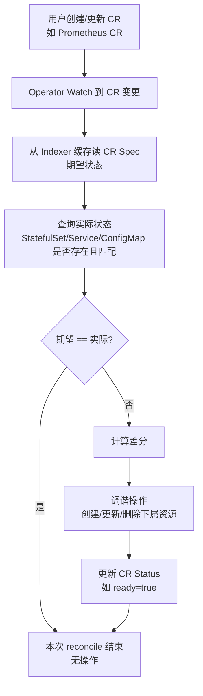
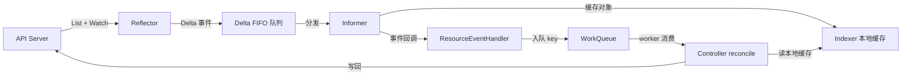
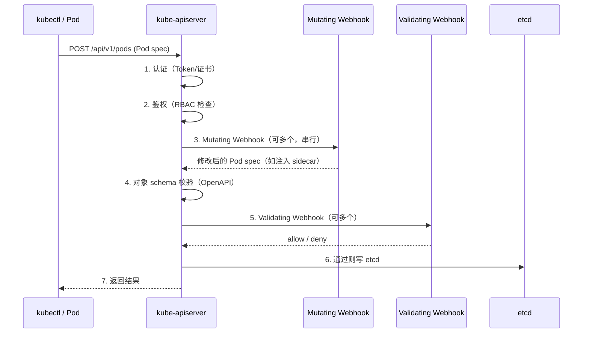

# CRD 与 Operator

> **一句话定位**：CRD/Operator/Informer 是高级面试的加分项，自定义调度器与准入 Webhook 是架构级追问点。
> **面试热度**：⭐⭐⭐⭐
> **返回**：[K8s 知识图谱](../README.md)

---

## 一、概念定义

### 1.1 扩展机制的三层心智模型

K8s 的"扩展机制"并非单一能力，而是贯穿 **API 层 → 控制层 → 调度层** 的三层扩展点：

| 层次 | 扩展点 | 解决什么问题 | 典型代表 |
|------|--------|-------------|---------|
| **API 层扩展** | CRD + 准入 Webhook | 让 API Server 像处理 Pod/Service 一样处理自定义资源，并在写 etcd 前插入变更/校验逻辑 | Prometheus Operator 的 `Prometheus` CRD、Istio 的 sidecar 注入 |
| **控制层扩展** | Operator（自定义 Controller） | 把人类运维知识编码为自动化 reconcile 循环，持续把 CR 拉回期望状态 | MySQL Operator（主从切换/备份恢复）、Argo CD（GitOps） |
| **调度层扩展** | 自定义调度器 / Scheduling Framework Plugin | 改变默认调度器的选 Node 决策（Filter/Score 阶段） | GPU 分组调度、拓扑亲和优化 |

> **核心心智**：API 层扩展解决"能描述什么"（CRD 定义新资源 + Webhook 守门），控制层扩展解决"谁来 reconcile"（Operator 监听 CR），调度层扩展解决"Pod 落到哪台 Node"。三者正交——CRD 只定义 schema 不带逻辑，逻辑全在 Operator 的 reconcile 里，调度决策则独立由调度框架插件影响。

### 1.2 CRD 是什么

**一句话**：CRD（CustomResourceDefinition）是用户自定义的 K8s 资源类型，让 API Server 像处理 Pod/Service 一样处理自定义资源——自动生成 REST 路径、支持 kubectl 操作、提供 schema 校验。

CRD 的核心特征：

- **声明式定义**：提交一份 `CustomResourceDefinition` 资源（含 `group`/`versions`/`names`/`scope`），API Server 自动注册新资源类型。
- **自动生成 REST 路径**：定义后立即可用 `/apis/<group>/<version>/namespaces/<ns>/<resource>` 访问，`kubectl get <plural>` 直接操作。
- **OpenAPI v3 schema 校验**：`spec.versions[].schema.openAPIV3Schema` 描述字段类型与约束，API Server 在写 etcd 前做结构校验。
- **命名空间级或集群级**：`scope: Namespaced`（默认，CR 随 namespace）或 `scope: Cluster`（如节点级资源）。

> **与 ConfigMap 的边界**：CRD 是"新资源类型"——有 schema 校验、有 API Server 原生 REST 路径、可被 Operator 监听 reconcile；ConfigMap 是"通用 K-V 存储"——无 schema、只是 Key-Value 数据载体、需要应用自己解析。把"一个微服务的部署规格"用 ConfigMap 存是常见做法，但用 CRD 能获得类型安全 + Operator 自动化。

### 1.3 Operator 模式是什么

**一句话**：Operator = CRD + Controller，把人类运维专家知识（如数据库主从切换、备份恢复、滚动升级）编码为自动化 Controller，持续 reconcile 自定义资源（CR）把集群拉回期望状态。

Operator 的核心要素：

- **CRD**：定义运维对象的 schema（如 `Prometheus` CR 描述要几个副本、用什么镜像、存多少数据）。
- **Controller**：监听 CR 变更，对比期望状态 vs 实际状态，调谐下属资源（Deployment/Service/PVC/ConfigMap）。
- **领域知识**：Controller 内嵌运维逻辑（如 MySQL 主库宕机自动提升从库、Prometheus 配置热重载）。

典型代表：Prometheus Operator（`Prometheus` CR → Operator 创建 StatefulSet + Service + ConfigMap）、MySQL Operator（`MySQL` CR → Operator 创建 StatefulSet + 定期备份 CronJob + 故障自动切换）、Argo CD（`Application` CR → Operator 监听 Git 仓库变更自动同步）。

### 1.4 Controller vs Operator

| 维度 | Controller（内置） | Operator（自定义） |
|------|-------------------|------------------|
| 监听资源 | 内置资源（Pod/Deployment/Service） | 自定义资源（CR） |
| 运维知识 | 通用（维持副本数、滚动更新） | 领域特定（主从切换、备份恢复、配置热重载） |
| 实现方式 | kube-controller-manager 内进程 | 独立部署的 Deployment（带 CRD） |
| 典型代表 | Deployment controller、StatefulSet controller | Prometheus Operator、MySQL Operator |
| 开发框架 | client-go informer + workqueue | Operator SDK / KubeBuilder（封装 controller-runtime） |

> **核心区分**：Controller 是通用 reconcile 循环（对任意资源做"期望 vs 实际"差分调谐）；Operator 是"面向特定应用的 Controller"——CRD（定义对象）+ Controller（reconcile）+ 领域知识（运维专家经验）。可以说所有 Operator 都是 Controller，但不是所有 Controller 都是 Operator。

### 1.5 准入 Webhook 两种

准入 Webhook 是 API Server 在"对象写 etcd 前"插入的自定义 HTTP 回调，分两类：

| 维度 | Mutating Webhook（变更） | Validating Webhook（校验） |
|------|-------------------------|--------------------------|
| 职责 | 修改对象（可改 spec 字段） | 校验对象（只能通过/拒绝，不改） |
| 执行顺序 | 先执行（schema 校验前） | 后执行（schema 校验后） |
| 可多次 | 按 webhook 配置顺序串行执行多个 | 按顺序并行校验，任一拒绝则拒绝 |
| 典型场景 | Istio 注入 envoy sidecar、Vault 注入密钥 | 禁止特权容器、强制 label、OPA Gatekeeper 策略 |
| 资源 | MutatingWebhookConfiguration | ValidatingWebhookConfiguration |

> **关联**：准入 Webhook 在 API Server 鉴权链中的位置详见 [配置与 RBAC](../06-config-security/config-and-rbac.md) §2.3 API Server 鉴权链，Pod 创建全流程中的准入段详见 [架构总览与核心组件](../01-foundation/k8s-architecture.md) §2.7。

### 1.6 自定义调度器

默认 kube-scheduler 的调度算法（Filter/Score 两阶段）详见 [调度与资源管理](../05-scheduling/scheduling-and-resources.md) §1.2。当默认调度策略无法满足业务需求（如 GPU 拓扑亲和、延迟敏感任务优先调度、多租户隔离），有两种扩展方式：

| 方式 | 原理 | 适用 |
|------|------|------|
| **Scheduling Framework Plugin**（推荐） | 1.19+ 默认启用，实现 `framework.Plugin` 接口注册到扩展点（PreFilter/Filter/Score/Bind 等），与默认调度器共存 | 扩展默认调度器某个阶段（如自定义 Score 打分逻辑） |
| **独立调度器** | 部署一个完整的自定义 scheduler 二进制，通过 `schedulerName` 字段让 Pod 指定走哪个调度器 | 完全自定义调度流程（如专用于 GPU/AI 训练任务的调度器） |

> **现代首选**：Scheduling Framework 是 1.19+ 的标准扩展方式，不再需要 fork 整个 scheduler 二进制——注册自己的 Plugin 即可影响 Filter/Score 决策。关键源码包：`k8s.io/kubernetes/pkg/scheduler/framework`（`Plugin` 接口与各扩展点定义）。

---

## 二、原理与流程

### 2.1 CRD 定义与使用

CRD 的定义包含两部分：**CustomResourceDefinition 资源本身**（声明新类型）与 **自定义资源实例**（CR，用户创建的具体对象）。

**CRD 定义骨架**（简化）：

```yaml
apiVersion: apiextensions.k8s.io/v1
kind: CustomResourceDefinition
metadata:
  name: appconfigs.demo.yintp.com       # <plural>.<group>
spec:
  group: demo.yintp.com
  scope: Namespaced
  names:
    plural: appconfigs
    singular: appconfig
    kind: AppConfig
    shortNames: ["appc"]
  versions:
  - name: v1
    served: true
    storage: true                       # 只能有一个版本标记为 storage（写 etcd 的版本）
    schema:
      openAPIV3Schema:                  # OpenAPI v3 schema 校验
        type: object
        properties:
          spec:
            type: object
            properties:
              image:
                type: string
              replicas:
                type: integer
                minimum: 1
                maximum: 100
              port:
                type: integer
```

**CR 实例**（用户提交的具体对象）：

```yaml
apiVersion: demo.yintp.com/v1
kind: AppConfig
metadata:
  name: order-service
  namespace: prod
spec:
  image: order-service:1.0
  replicas: 3
  port: 8080
```

**自动生成的 REST 路径**：

```
/apis/demo.yintp.com/v1/namespaces/prod/appconfigs/order-service
```

提交 CRD 后，API Server 自动注册该 REST 路径，`kubectl get appconfigs`、`kubectl apply -f cr.yaml` 直接可用，无需任何额外配置。

> **关键**：CRD 定义 schema 但不带逻辑——schema 校验只保证字段类型正确（`replicas` 是整数且 1-100），不保证业务语义（如端口不冲突、镜像存在）。业务逻辑全部由 Operator 的 reconcile 实现。

### 2.2 Controller/Operator 工作模式

Operator 基于 reconcile 循环（机制详见 [架构总览与核心组件](../01-foundation/k8s-architecture.md) §2.5 reconcile 循环），持续对比 CR 的期望状态与集群实际状态，差分触发调谐：



以 **Prometheus Operator** 为例的完整调谐链路：

1. 用户提交 `Prometheus` CR（`spec.replicas=2, spec.image=prometheus:v2.40`）。
2. Operator 的 Informer Watch 到 CR 创建事件 → 入队 key（`namespace/name`）。
3. Worker 协程消费 key → 从 Indexer 读 CR Spec（期望：2 副本、v2.40 镜像）。
4. 查实际状态：当前 namespace 是否有 `prometheus-<cr-name>` StatefulSet？副本数与镜像是否匹配？
5. 差分：StatefulSet 不存在 → 创建 StatefulSet（用 CR 的 spec 填模板）+ 关联 Service + ConfigMap。
6. 更新 CR `status.ready=true`，下次 reconcile 读到期望==实际则无操作。

> **核心**：Operator 的 reconcile 与内置 Deployment controller 的 reconcile 是同一范式——都是"读期望、查实际、差分调谐"。差异只在 Operator 监听的是 CR（自定义资源），调谐的下属资源组合更复杂（StatefulSet + Service + ConfigMap + PVC），且内嵌领域知识（如 Prometheus 配置热重载、MySQL 主从切换）。

### 2.3 Informer / List-Watch / WorkQueue 机制

Operator/Controller 的高效事件处理依赖于 client-go 提供的 **Informer 机制**。这是 K8s 所有 controller 的统一骨架（机制级讲解，提到关键组件名但不贴源码）：



**四大组件职责**：

| 组件 | 职责 | 关键源码包 |
|------|------|-----------|
| **Reflector** | List 全量建立缓存 + Watch 增量事件，把事件推入 Delta FIFO 队列 | `client-go/tools/cache`（`Reflector` 类型） |
| **Delta FIFO 队列** | 保证事件顺序（基于 `resourceVersion`），去重（同 key 多次变更合并） | `client-go/tools/cache`（`DeltaFIFO` 类型） |
| **Informer** | 从 Delta FIFO 取事件，更新 Indexer 缓存 + 分发给注册的 `ResourceEventHandler` | `client-go/tools/cache`（`SharedIndexInformer`） |
| **WorkQueue** | Controller 的 handler 把事件转为 key（`namespace/name`）入队，worker 协程消费 key 触发 reconcile | `client-go/util/workqueue`（`RateLimitingInterface`） |

**关键设计点**：

- **List 全量 + Watch 增量**：启动时 List 一次全量建立本地缓存（Indexer），后续只 Watch 增量事件，避免反复全量拉取压垮 API Server。List-Watch 机制详解见 [架构总览与核心组件](../01-foundation/k8s-architecture.md) §2.4。
- **本地缓存 Indexer**：reconcile 时读 CR Spec 从本地缓存读，不直连 API Server——减少 API Server 压力，且本地内存读取远快于网络调用。
- **SharedInformer**：多个 Controller 共享同一资源的 Informer（如 Deployment controller 与 ReplicaSet controller 都 Watch Pod），共享一个 Watch 长连接，减少 API Server 连接数与 List 压力。
- **RateLimitingQueue**：reconcile 失败可重试，按指数退避策略延迟重入队（如 5ms → 10ms → 20ms ... 上限 1000s），防止错误雪崩（如 API Server 抖动时所有 controller 疯狂重试）。
- **key 去重**：同一资源在短时间内多次变更，WorkQueue 只保留一个 key，worker 处理时读最新状态——避免重复 reconcile。

> **核心**：Informer 机制让 Controller 既高效（本地缓存读、增量 Watch）又可靠（resourceVersion 保证事件顺序、RateLimitingQueue 保证重试不雪崩）。这是 K8s 能支撑大规模集群（数万 Pod）的根基——所有 controller 共享同一套 Informer 骨架。

### 2.4 自定义调度器（Scheduling Framework）

[调度与资源管理](../05-scheduling/scheduling-and-resources.md) §1.2 介绍了默认调度器的 Filter/Score 两阶段。1.19+ 启用的 **Scheduling Framework** 把整个调度流程拆为一串扩展点，每个扩展点对应一个 Plugin 接口：

| 扩展点 | 接口 | 作用 | 默认插件举例 |
|--------|------|------|-------------|
| `QueueSort` | `QueueSortPlugin` | 排序待调度 Pod 队列 | `PrioritySort` |
| `PreFilter` | `PreFilterPlugin` | 预处理，校验 Pod 信息、算汇总状态 | `NodeResourcesFit`、`InterPodAffinity` |
| `Filter` | `FilterPlugin` | 硬约束过滤不满足的 Node | `NodeResourcesFit`、`NodeAffinity`、`TaintToleration` |
| `PostFilter` | `PostFilterPlugin` | Filter 无候选 Node 时的兜底（如抢占） | `DefaultPreemption` |
| `PreScore` | `PreScorePlugin` | Score 前预处理 | `InterPodAffinity` |
| `Score` | `ScorePlugin` | 软约束打分（0-100） | `NodeResourcesFit`（LeastRequested）、`PodTopologySpread` |
| `NormalizeScore` | `NormalizeScorePlugin` | 归一化各插件分数到 0-100 | — |
| `Reserve` | `ReservePlugin` | 预留资源（Pod 还没真正 Bind） | `VolumeBinding` |
| `Permit` | `PermitPlugin` | 允许延迟 Bind（如等待同批 Pod 都 ready） | `Coscheduling` |
| `Bind` | `BindPlugin` | 最终把 Pod Bind 到 Node | `DefaultBinder` |

**自定义 Plugin 的开发与部署**：

1. 实现特定扩展点的 `framework.Plugin` 接口（如 `FilterPlugin`/`ScorePlugin`）。
2. 编译为调度器二进制（可扩展默认调度器，或编译独立调度器）。
3. 通过 KubeSchedulerConfiguration 注册 Plugin，或部署独立调度器 + Pod `schedulerName` 字段指定。

**典型场景**：

- **GPU 拓扑亲和**：自定义 `ScorePlugin`，优先选 GPU 互联带宽高的 Node（NVLink 拓扑感知）。
- **延迟敏感任务优先调度**：自定义 `QueueSortPlugin`，让低延迟 Pod 排队靠前。
- **批处理协同调度**：自定义 `PermitPlugin`，等同组 Pod 都通过 Filter 才一起 Bind（`Coscheduling` 插件）。

> **关键源码包**：`k8s.io/kubernetes/pkg/scheduler/framework`——定义 `Plugin` 接口与所有扩展点接口。自定义调度器的现代方式不再需要 fork scheduler 二进制，注册 Plugin 即可影响决策。

### 2.5 准入 Webhook 流程

准入 Webhook 是 API Server 在"鉴权通过后、写 etcd 前"插入的自定义 HTTP 回调。完整链路如下：



**关键规则**：

- **Mutating 先执行**：在 schema 校验前，可修改对象（如 Istio 注入 envoy sidecar、Vault 注入密钥）。多个 Mutating Webhook 按 `webhooks[].order`（或配置顺序）串行执行，前一个的修改对后一个可见。
- **schema 校验居中**：Mutating 后做 OpenAPI schema 校验，保证字段类型正确。
- **Validating 后执行**：schema 校验后做 Validating，只能 allow/deny 不能改对象。多个 Validating Webhook 可并行校验，任一拒绝则整体拒绝。
- **失败策略**：Webhook 不可达时，`failurePolicy: Fail`（默认，拒绝请求）或 `Ignore`（跳过继续）。生产环境推荐 `Ignore` + 监控告警，避免 Webhook 服务故障导致整个集群不可写入。

**Mutating 典型——Istio sidecar 注入**：

1. 用户创建 Pod（业务容器 spec）。
2. Mutating Webhook 收到 Pod 创建请求 → 修改 Pod spec：
   - 注入 `envoy` sidecar 容器（与业务容器共享网络命名空间）。
   - 注入 `istio-init` init 容器（配置 iptables 拦截出站流量到 envoy）。
3. 修改后的 Pod spec 通过 schema 校验 + Validating → 写 etcd。

**Validating 典型——禁止特权容器**：

1. 用户创建 Pod（`spec.securityContext.privileged: true`）。
2. Validating Webhook 收到请求 → 检查 Pod spec → 发现特权容器 →  deny。
3. API Server 拒绝请求，用户收到 `Pod ... is forbidden: privileged containers are not allowed`。

> **关联**：准入 Webhook 在鉴权链中的位置详见 [配置与 RBAC](../06-config-security/config-and-rbac.md) §2.3（PodSecurity 准入也是 Validating Webhook 的一种内建实现）。

### 2.6 Operator SDK vs KubeBuilder

两者都是开发 Operator 的脚手架工具，生成 CRD + Controller 骨架：

| 维度 | Operator SDK | KubeBuilder |
|------|--------------|-------------|
| 出品方 | RedHat | K8s SIG（官方） |
| 支持语言 | Go / Ansible / Helm | Go 专用 |
| 底层框架 | controller-runtime（Go）/ Ansible Operator / Helm Operator | controller-runtime（原生 API） |
| 脚手架命令 | `operator-sdk init` / `operator-sdk create api` | `kubebuilder init` / `kubebuilder create api` |
| CRD 生成 | 从 Go 结构体 + marker 注解生成 | 从 Go 结构体 + marker 注解生成 |
| 生态 | 集成 OperatorHub（发布分发）、OLM（生命周期管理） | 更贴近 controller-runtime 原生 API，学习曲线平缓 |
| 适用 | 团队栈含 Ansible/Helm 或需 OLM 生命周期管理 | 纯 Go 团队、追求与上游一致 |

**选型建议**：

- **纯 Go 团队**：两者都行，KubeBuilder 更贴近 controller-runtime 原生 API，文档与上游同步更快。
- **非 Go 团队（Ansible/Helm）**：Operator SDK 是唯一选择——用 Ansible/Helm 编写 reconcile 逻辑，无需写 Go。
- **需 OperatorHub 分发 / OLM 管理**：Operator SDK 集成更完整。

> **共同点**：两者都基于 controller-runtime（封装 client-go informer + workqueue），生成的 Controller 骨架一致——`Reconcile(ctx, req ctrl.Request)` 方法，从缓存读 CR、调谐下属资源、更新 Status。差异主要在脚手架命令与生态集成。

---

## 三、高频追问与面试题

### Q1：CRD 和 ConfigMap 的区别？

**参考答案**：

| 维度 | CRD | ConfigMap |
|------|-----|-----------|
| 本质 | 新资源类型（有独立 REST 路径） | 通用 K-V 存储（只是数据载体） |
| schema 校验 | OpenAPI v3 schema（类型/范围/必填） | 无 schema（任意 K-V） |
| API Server 支持 | 原生（kubectl get/apply/describe） | 原生（同左） |
| 自动化 | 配 Operator 监听 CR 自动 reconcile | 需应用自己解析 |
| 适用 | 有结构、需自动化的领域对象（如微服务规格、数据库实例） | 简单配置注入（如 application.yml） |

- **CRD 是"新类型"**：定义后 API Server 自动注册 REST 路径、做 schema 校验、可被 Operator 监听。
- **ConfigMap 是"数据载体"**：无 schema、需应用自己解析、无自动化逻辑。
- **选型**：有结构 + 需 Operator 自动化用 CRD；纯配置注入用 ConfigMap。

> **关联**：§1.2 CRD 是什么、[配置与 RBAC](../06-config-security/config-and-rbac.md) §1.2 ConfigMap 是什么。

### Q2：Operator 解决了什么问题？

**参考答案**：把人类运维专家知识编码为自动化 Controller，替代人工运维。

- **传统运维**：MySQL 主库宕机 → 人登录从库 → 手动提升为主 → 改应用连接 → 通知下游。耗时数十分钟，依赖人随时待命。
- **Operator 运维**：MySQL Operator Watch 到主库 Pod 异常 → 自动选举新主 → 更新 Service Endpoints → 通知应用重连。秒级完成，无需人工。
- **核心价值**：把"有状态应用的复杂运维"（数据库主从切换/备份恢复/版本升级/配置热重载）从"人工 + 文档"变成"代码 + 自动化"，提升可靠性同时降低人力成本。
- **典型场景**：数据库（MySQL/PostgreSQL）、消息队列（Kafka/RabbitMQ）、监控系统（Prometheus）、GitOps（Argo CD）。

> **关联**：§1.3 Operator 模式是什么、§1.4 Controller vs Operator。

### Q3：Informer 为什么要本地缓存 Indexer？

**参考答案**：减少 API Server 压力 + 加速 reconcile 读取 + List+Watch 保证最终一致。

- **减少 API Server 压力**：reconcile 读 CR Spec 与下属资源状态若每次都直连 API Server，大规模集群（数万 Pod）会压垮 API Server。本地缓存让读操作走内存。
- **加速读取**：本地内存读取远快于网络调用（API Server REST），reconcile 循环延迟更低。
- **List 全量 + Watch 增量保证最终一致**：启动 List 一次建全量缓存，后续 Watch 增量事件实时更新缓存。Watch 断线重连用 `resourceVersion` 续传，不丢事件。
- **SharedInformer 共享**：多个 Controller 共享同一资源的 Informer，共享一个 Watch 长连接，进一步减少 API Server 连接数与 List 压力。

> **关联**：§2.3 Informer 机制、[架构总览与核心组件](../01-foundation/k8s-architecture.md) §2.4 List-Watch 机制、§三 Q3 为什么不只用 List。

### Q4：WorkQueue 为什么要 RateLimiting？

**参考答案**：reconcile 失败可重试 + 指数退避防雪崩 + 区分错误率。

- **可重试**：reconcile 调 API Server 创建资源可能临时失败（如 API Server 抖动、依赖未就绪）。失败时把 key 重入队，下次 worker 再处理。
- **指数退避**：同一 key 多次失败，重试间隔指数增长（如 5ms → 10ms → 20ms → ... 上限 1000s），防止错误资源疯狂重试压垮 API Server。
- **区分错误率**：`RateLimitingQueue` 支持两种限速——`BucketRateLimiter`（全局限速，如每秒最多 10 个 key）+ `ItemExponentialFailureRateLimiter`（单 key 指数退避）。前者防整体过载，后者防单 key 雪崩。
- **防雪崩**：API Server 抖动时所有 controller 都失败重试，若无限速会形成重试风暴压垮 API Server。RateLimiting 保证重试速率可控。

> **关联**：§2.3 Informer 机制（WorkQueue 组件）、关键源码包 `client-go/util/workqueue`。

### Q5：Mutating 和 Validating Webhook 的执行顺序？

**参考答案**：Mutating 先执行（可改对象）→ schema 校验 → Validating 后执行（只校验）。

```
认证 → 鉴权 → Mutating Webhook（可多个，串行）→ schema 校验 → Validating Webhook（可多个）→ 写 etcd
```

- **Mutating 先**：在 schema 校验前修改对象，保证修改后的对象仍符合 schema。多个 Mutating 按 `webhooks` 数组顺序串行执行，前一个的修改对后一个可见。
- **schema 校验居中**：Mutating 后做 OpenAPI schema 校验（字段类型、必填、范围）。
- **Validating 后**：schema 校验通过后做 Validating，只能 allow/deny 不能改。多个 Validating 可并行校验，任一拒绝则整体拒绝。
- **为何此顺序**：若 Validating 先执行，Mutating 的修改可能违反 Validating 规则（如 Validating 禁止某字段，但 Mutating 注入了该字段）；Mutating 先 + schema 校验 + Validating 后，保证最终对象既符合 schema 又满足业务规则。

> **关联**：§2.5 准入 Webhook 流程、[配置与 RBAC](../06-config-security/config-and-rbac.md) §2.3 API Server 鉴权链。

### Q6：自定义调度器的 Plugin 怎么扩展？

**参考答案**：实现 Scheduling Framework 的 Plugin 接口，注册到扩展点，编译为调度器二进制。

- **实现 Plugin 接口**：选择要扩展的扩展点（如 `FilterPlugin`/`ScorePlugin`），实现对应接口方法（如 `Filter(ctx, state, pod, nodeName) *Status`、`Score(ctx, state, pod, nodeName) (int64, *Status)`）。
- **注册 Plugin**：通过 KubeSchedulerConfiguration 的 `profiles[].plugins` 字段注册 Plugin 到对应扩展点，可替换默认插件或追加。
- **部署方式**：
  - **扩展默认调度器**：把自定义 Plugin 编译进默认 scheduler 二进制，用 KubeSchedulerConfiguration 启用——与默认插件共存。
  - **独立调度器**：部署独立的 scheduler 二进制（带自定义 Plugin），Pod 通过 `spec.schedulerName` 指定走该调度器——适合完全自定义调度流程（如 GPU/AI 训练专调度器）。
- **关键源码包**：`k8s.io/kubernetes/pkg/scheduler/framework`（`Plugin` 接口与各扩展点定义）。

> **关联**：§2.4 自定义调度器、[调度与资源管理](../05-scheduling/scheduling-and-resources.md) §1.2 调度器两阶段。

### Q7：Operator SDK 和 KubeBuilder 怎么选？

**参考答案**：Go 用哪个都行；非 Go 团队用 Operator SDK；需 OLM 生态用 Operator SDK。

- **纯 Go 团队**：两者都基于 controller-runtime，生成的 Controller 骨架一致。KubeBuilder 更贴近 controller-runtime 原生 API，文档与上游同步更快，学习曲线平缓。
- **非 Go 团队（Ansible/Helm）**：Operator SDK 是唯一选择——用 Ansible/Helm 编写 reconcile 逻辑，无需写 Go，适合运维团队快速上手。
- **需 OperatorHub 分发 / OLM 生命周期管理**：Operator SDK 集成更完整——OLM（Operator Lifecycle Manager）管理 Operator 的安装、升级、依赖。
- **生产实践**：多数 Go 团队选 KubeBuilder（与上游一致、文档及时）；混合栈团队选 Operator SDK。

> **关联**：§2.6 Operator SDK vs KubeBuilder。

### Q8：Informer 的 SharedInformer 是什么？

**参考答案**：多个 Controller 共享同一资源的 Informer，减少 API Server 连接数与 List 压力。

- **问题**：若每个 Controller 各起一个 Informer Watch Pod，集群内有 N 个 controller 就有 N 个 Watch 长连接 + N 次 List 全量——大规模集群压垮 API Server。
- **SharedInformer**：多个 Controller 共享同一个 `SharedIndexInformer`，内部只有一个 Watch 长连接 + 一次 List 全量。事件分发时，所有注册的 `ResourceEventHandler` 都收到回调。
- **本地缓存共享**：所有 Controller 共享同一个 Indexer 本地缓存，进一步省内存。
- **client-go 实践**：`client-go/informers` 工厂模式（`informers.SharedInformerFactory`）自动为同 namespace 的 controller 共享 Informer，避免重复创建。

> **关联**：§2.3 Informer 机制、[架构总览与核心组件](../01-foundation/k8s-architecture.md) §2.4 List-Watch 机制。

### Q9：CRD 的多个 version 怎么转换？

**参考答案**：通过 `conversion` 字段配置策略，支持无版本转换（推荐）或 Webhook 转换。

- **served vs storage**：每个 version 有 `served`（是否可 API 访问）与 `storage`（是否作为写 etcd 的版本），同一时刻只能有一个 `storage: true`。
- **无版本转换（推荐）**：各 version schema 只增字段不改语义，设 `conversion: { strategy: None }`，API Server 自动处理（共享存储格式，读时按请求 version 渲染）。
- **Webhook 转换**：version 间字段结构差异大，设 `conversion: { strategy: Webhook, clientConfig: ... }`，API Server 转换时调 Webhook 做字段映射。
- **演进实践**：新 version 先 `served: true, storage: false` 让用户可读，验证后切 `storage: true`，旧 version 保留 `served: true` 一段时间后改 `served: false` 下线。

> **关联**：§2.1 CRD 定义与使用。

---

## 四、实战关联（Java 后端视角）

### 4.1 Operator 在 Java 生态的实践（Fabric8）

虽然主流 Operator 用 Go 开发（基于 controller-runtime），但 Java 生态也有对应工具——**Fabric8 Kubernetes Client** 提供了 Java 开发 Operator 的能力。

**Fabric8 Informer 集成示例**（机制级，简化伪代码）：

```java
// 监听 AppConfig CR 变更，三个回调对应 Informer 的 ResourceEventHandler
client.customResources(AppConfig.class)
    .inNamespace("prod")
    .inform(new ResourceEventHandler<AppConfig>() {
        public void onAdd(AppConfig cr)       { reconcile(cr); }       // 创建 Deployment+Service+ConfigMap
        public void onUpdate(AppConfig o, AppConfig n) { reconcile(n); }
        public void onDelete(AppConfig cr, boolean b)  { cleanup(cr); }
    });
```

- **Spring Boot 集成**：应用启动时初始化 Fabric8 Informer，监听 CR 变更触发 reconcile。Informer 的 List-Watch 由 Fabric8 封装，开发者只处理事件回调。
- **与 Go Operator 的差异**：Fabric8 封装了 List-Watch + 本地缓存 + 事件分发，但 WorkQueue 的指数退避需自实现（Go 的 controller-runtime 内建）。生产仍推荐 Go（生态成熟、资源占用低），Java Operator 适合已有 Java 团队 + 简单 CRD 自动化。

### 4.2 自定义 CRD 示例：微服务部署规格

定义 `AppConfig` CR 把"部署一个微服务"声明式化——Operator 监听 CR 自动生成 Deployment + Service + ConfigMap：

```yaml
apiVersion: demo.yintp.com/v1
kind: AppConfig
metadata:
  name: order-service
spec:
  image: order-service:1.0
  replicas: 3
  port: 8080
  config: |
    spring.profiles.active=prod
    server.port=8080
```

**Operator reconcile 逻辑**（伪代码）：

```
Watch AppConfig CR 变更
    → 读 CR Spec（image/replicas/port/config）
    → 查 Deployment 是否存在且匹配
    → 不匹配则创建/更新 Deployment（用 CR spec 填模板）
    → 查 Service 是否存在
    → 不存在则创建 Service（port 对接 CR spec.port）
    → 查 ConfigMap 是否存在
    → 不存在则创建 ConfigMap（用 CR spec.config）
    → 更新 CR status.ready=true
```

**价值**：把"部署一个微服务"从"手写 Deployment + Service + ConfigMap 三份 yaml"简化为"写一份 AppConfig CR"，且变更（改副本数/换镜像）只改 CR，Operator 自动同步下属资源。

### 4.3 关联 java-core/annotation、java-core/apt：CRD 模型生成对照

KubeBuilder/Operator SDK 用 **marker 注解** 标记 Go 结构体字段，编译期生成 CRD 的 OpenAPI v3 schema——这与 Java 的 APT（Annotation Processing Tool）在编译期处理注解生成代码/配置是同一模式：

| 维度 | KubeBuilder marker 注解 | Java APT 注解处理器 |
|------|------------------------|--------------------|
| 标记方式 | Go 结构体字段加 `//+kubebuilder:validation:Minimum=1` 注释 | Java 字段加 `@Min(1)` 注解 |
| 处理时机 | 编译期（controller-gen 工具） | 编译期（javac 调用 Processor） |
| 产物 | CRD 的 OpenAPI v3 schema（YAML） | 新源码/配置文件/校验器 |
| 注册 | Makefile 调 controller-gen | `META-INF/services/javax.annotation.processing.Processor` |

**核心同构**：两者都是"在源码中用注解声明约束 → 编译期自动生成元数据/校验逻辑"。KubeBuilder 的 `//+kubebuilder:validation:Minimum=1` 生成 CRD schema 的 `minimum: 1`，对应 Java 的 `@Min(1)` 由 Hibernate Validator 生成运行时校验。

> **关联 `java-core/annotation` 模块**：注解定义与运行时反射读取，对照理解 CRD marker 注解的声明式约束。**关联 `java-core/apt` 模块**：编译期注解处理器生成代码/配置，对照理解 controller-gen 从 Go marker 注解生成 CRD schema 是同一模式。**关联 `framework/valid` 模块**：Hibernate Validator 的 `@Min`/`@Max`/`@NotNull` 与 CRD 的 OpenAPI schema 约束（`minimum`/`maximum`/`required`）是同构的校验声明。

### 4.4 关联 java-core/lambda、java-core/stream：Informer 事件回调链

Informer 的 `ResourceEventHandler` 回调（`onAdd`/`onUpdate`/`onDelete`）是典型的事件驱动编程，与 Java 的函数式回调、Stream 的事件编排同构：

```java
// Informer 事件回调链（伪代码）——三个函数式接口注册
informer.eventHandler(
    onAdd    = cr -> reconcile(cr),                  // Consumer<AppConfig>
    onUpdate = (oldC, newC) -> reconcile(newC),      // BiConsumer<AppConfig, AppConfig>
    onDelete = (cr, _) -> cleanup(cr)                // BiConsumer<AppConfig, Boolean>
);
// 对照 Stream 编排：events.stream().filter(ADD).map(AppConfig).forEach(this::reconcile)
```

- **回调注册**：Informer 的 `ResourceEventHandler` 是三个回调函数（add/update/delete），与 Java 的 `Consumer<T>`/`BiConsumer<T,T>` 函数式接口同构。
- **事件过滤与映射**：Informer 内部按资源类型分发事件，与 Stream 的 `filter` + `map` 编排同构。
- **异步消费**：Informer 事件分发 + WorkQueue 的 worker 消费是异步生产-消费模型，与 Java 的 `BlockingQueue` + 线程池同构。

> **关联 `java-core/lambda` 模块**：函数式接口与回调注册，对照 Informer 的 `ResourceEventHandler` 回调链。**关联 `java-core/stream` 模块**：事件流的 filter/map/forEach 编排，对照 Informer 事件分发的函数式风格。

---

## 五、面试案例

### 5.1 "你们团队怎么管理多个微服务的部署？"——CRD + Operator（3 分钟标准答法）

**面试官**：你们团队有十几个微服务，怎么管理它们的部署？

**3 分钟标准答法**：

> 我们定义了一个 `AppConfig` CRD，把"部署一个微服务"抽象为一份声明式 CR——包含镜像、副本数、端口、配置。每个微服务提交一份 `AppConfig` CR 到 Git，由 CI/CD apply 到集群。
>
> 集群里跑一个自研的 Operator（用 KubeBuilder 开发），它 Watch `AppConfig` CR 变更，reconcile 时自动生成三件套：Deployment（用 CR 的 image/replicas）、Service（用 CR 的 port）、ConfigMap（用 CR 的 config）。用户改副本数或换镜像，只改 CR，Operator 自动同步下属资源。
>
> Operator 的 reconcile 基于 client-go 的 Informer 机制——启动时 List 全量建本地缓存，后续 Watch 增量事件，事件入 WorkQueue 后由 worker 协程消费触发 reconcile。读 CR Spec 从本地缓存读，不直连 API Server，大规模集群也不会压垮 API Server。
>
> 这样做的好处是**声明式 + 自动化**——开发者只写一份 AppConfig CR，不用手写三份 yaml；变更只改 CR，Operator 自动同步；CR 入 Git 可审计可回滚。比 Helm 模板更进一步的是，Operator 能做 Helm 做不到的事——比如 CR 改副本数时顺带校验配额、主从切换时自动通知下游。

**结构要点**：CRD 定义（声明式规格）→ Operator reconcile（自动生成下属资源）→ Informer 机制（高效事件处理）→ 价值（声明式 + 自动化 + Git 可审计）。

**追问链**：

| 追问 | 标准答法 |
|------|---------|
| 和 Helm 模板有什么区别？ | Helm 是"渲染 yaml"，apply 完就结束；Operator 是"持续 reconcile"，CR 变更自动同步，且能做 Helm 做不到的运维逻辑（如主从切换、配置热重载） |
| Operator 怎么知道 CR 变了？ | Informer 的 List-Watch，API Server 推增量事件给 Operator 的事件回调，回调入队 key，worker 消费触发 reconcile |
| reconcile 失败怎么办？ | WorkQueue 的 RateLimitingQueue 支持失败重入队 + 指数退避，防止雪崩；最终失败的 CR status 标 false，可被监控告警 |

### 5.2 "Istio 注入 sidecar 是怎么实现的？"——Mutating Webhook（3 分钟标准答法）

**面试官**：Istio 的 sidecar 是怎么注入到 Pod 里的？

**3 分钟标准答法**：

> Istio 注入 sidecar 用的是 **Mutating Webhook**。Istio 在集群里部署一个 istio-sidecar-injector 服务，注册一个 `MutatingWebhookConfiguration`，配置成拦截 Pod 创建请求。
>
> 当用户创建 Pod（如 `kubectl apply pod.yaml`），请求到 API Server 后走鉴权链：认证 → 鉴权（RBAC）→ 准入。准入阶段先执行 Mutating Webhook，Istio 的 webhook 收到 Pod spec，返回一个 JSON Patch，给 Pod 注入两个东西：一是 `envoy` sidecar 容器（与业务容器共享网络命名空间，拦截出站流量做 mTLS 与熔断限流），二是 `istio-init` init 容器（在业务容器启动前配 iptables 规则，把出站流量重定向到 envoy）。
>
> Mutating 执行完做 schema 校验（注入后的 Pod spec 仍符合 K8s schema），再做 Validating Webhook（如 OPA Gatekeeper 的策略校验），通过后写 etcd。所以 Pod 一创建就已经带了 sidecar，业务容器无感知。
>
> 这个机制的核心是 **Mutating Webhook 在 schema 校验前执行**，能改对象。若放在 Validating 后（schema 校验后），改对象可能违反 schema。顺序是：Mutating（改）→ schema 校验 → Validating（校验）→ 写 etcd。

**结构要点**：MutatingWebhookConfiguration 注册 → 拦截 Pod 创建 → JSON Patch 注入 sidecar + init 容器 → 在 schema 校验前执行 → 业务容器无感知。

**追问链**：

| 追问 | 标准答法 |
|------|---------|
| Mutating 和 Validating 谁先？ | Mutating 先（改对象）→ schema 校验 → Validating 后（校验），保证最终对象既符合 schema 又满足规则 |
| 多个 Mutating Webhook 顺序？ | 按配置顺序串行执行，前一个的修改对后一个可见 |
| Webhook 服务挂了怎么办？ | `failurePolicy: Fail`（默认）会拒绝请求导致 Pod 创建失败；`Ignore` 跳过继续，生产推荐 `Ignore` + 监控告警，避免单点故障卡死集群 |
| 怎么只给部分 namespace 注入？ | MutatingWebhookConfiguration 的 `namespaceSelector` 字段，按 namespace label 过滤（如 `istio-injection: enabled`） |

---

## 六、参考与延伸

- **官方文档**：Custom Resources（kubernetes.io/docs）、Operator Pattern（kubernetes.io/docs）、Dynamic Admission Control（kubernetes.io/docs）、Scheduling Framework（kubernetes.io/docs）、Extensible Admissions（kubernetes.io/docs）
- **源码包**：
  - `client-go/tools/cache`——Reflector / DeltaFIFO / SharedIndexInformer / Indexer
  - `client-go/util/workqueue`——RateLimitingInterface（指数退避限速）
  - `k8s.io/kubernetes/pkg/scheduler/framework`——Scheduling Framework 的 `Plugin` 接口与扩展点
  - `sigs.k8s.io/controller-runtime`——Operator SDK / KubeBuilder 底层框架（封装 informer + workqueue + reconcile 骨架）
- **延伸阅读（跨文档）**：
  - [架构总览与核心组件](../01-foundation/k8s-architecture.md)——reconcile 循环、List-Watch 机制、Pod 创建全流程的准入段
  - [Pod 与控制器](../02-workload/pod-and-controllers.md)——Deployment controller reconcile 与 Operator 同构、sidecar 注入的 Mutating Webhook 引用
  - [Service 与 Ingress](../03-network/service-and-ingress.md)——Operator 生成的 Service 被 kube-proxy 转发
  - [Volume 与 PV/PVC](../04-storage/volume-and-pv-pvc.md)——StatefulSet 持久化与 Operator 生成的 PVC
  - [调度与资源管理](../05-scheduling/scheduling-and-resources.md)——调度器两阶段、Scheduling Framework 扩展点
  - [配置与 RBAC](../06-config-security/config-and-rbac.md)——RBAC（Operator 的 ServiceAccount）、PodSecurity 准入、API Server 鉴权链中的准入段
  - [Java 应用上 K8s](../09-performance/java-on-k8s.md)——Spring Boot 容器化与 Operator 自动化部署的衔接
- **仓库内关联**：
  - `java-core/annotation`、`java-core/apt`——注解处理器与 CRD marker 注解驱动的模型生成对照（编译期拦截 + 生成元数据）
  - `java-core/lambda`、`java-core/stream`——Informer 事件回调链与函数式编排、Stream 的 filter/map/forEach 对照
  - `framework/valid`——Hibernate Validator 的 `@Min`/`@Max`/`@NotNull` 与 CRD 的 OpenAPI schema 约束同构
  - [容器运行时与生命周期](../../docker/03-container/container-runtime.md)——容器状态机（Operator 创建的 Pod 沿用底层容器生命周期）

> **返回**：[K8s 知识图谱](../README.md)
