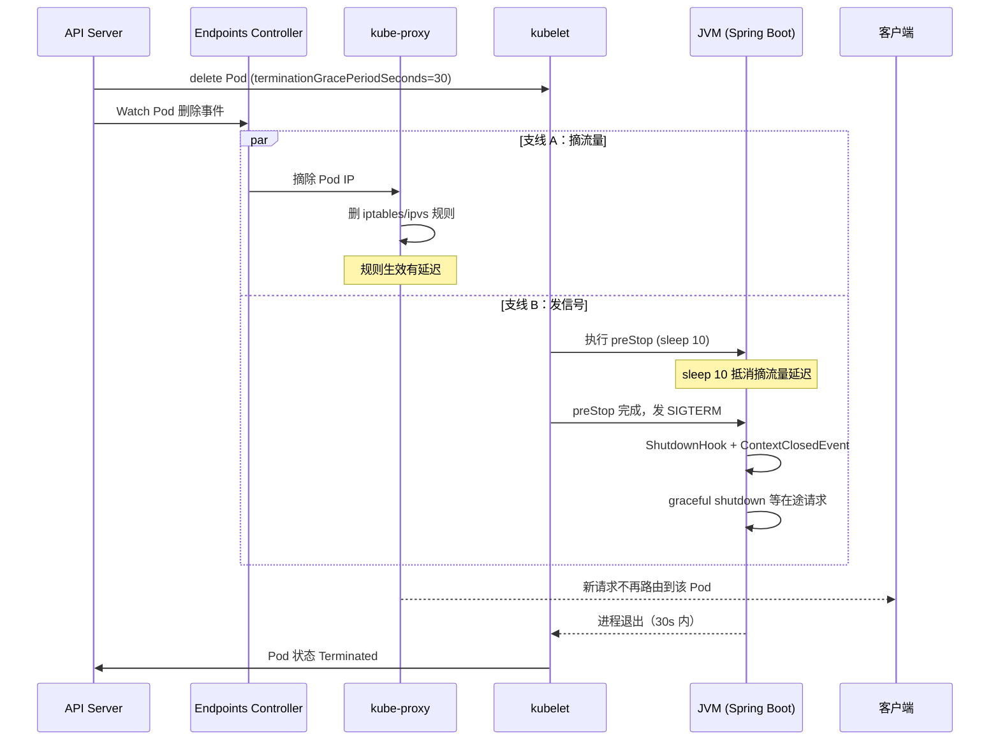
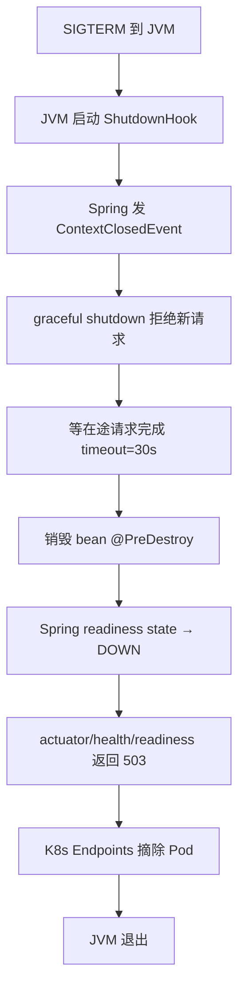

# Java 应用上 K8s

> **一句话定位**：Java 应用上 K8s 的 preStop 优雅关闭、探针配置、JVM 选型是 Java 面试官的高频追问。
> **面试热度**：⭐⭐⭐⭐⭐
> **返回**：[K8s 知识图谱](../README.md)

---

## 一、概念定义

### 1.1 Java 应用上 K8s 的特化场景

Java 应用上 K8s 不是「把 jar 包塞进容器跑起来」这么简单——JVM 的进程模型、内存模型、关闭模型与 K8s 的 Pod 生命周期、探针、流量摘除机制存在多个衔接点。Java 应用上 K8s 的特化场景集中在五处：

| 场景 | 矛盾点 | K8s 侧机制 | Java 侧机制 |
|------|--------|-----------|------------|
| **JVM 预热慢** | 启动 30s～5min，liveness 误判重启 | startupProbe 屏蔽启动期 | Spring Boot actuator/health |
| **优雅关闭** | SIGTERM 到 JVM 时仍在收新请求 + in-flight 被强杀 | preStop + terminationGracePeriodSeconds | Spring Boot graceful shutdown + JVM ShutdownHook |
| **堆外内存预算** | 堆 ≠ 容器内存，堆外超限被 OOM Killed | resources.limits.memory | MaxRAMPercentage + 堆外预算 |
| **配置注入** | ConfigMap 如何进 Spring 配置 + 是否热更新 | ConfigMap envFrom/Volume | @Value/@ConfigurationProperties |
| **镜像分发** | fat jar 改一行重传全部依赖 | K8s 拉镜像按层缓存 | Spring Boot Layertools |

### 1.2 与 Docker 模块的边界

JVM 容器感知的基础（cgroup v2 兼容、UseContainerSupport 源码、堆外预算公式、Layertools 分层原理、GC 选型决策树）详见 [Java 容器调优](../../docker/08-performance/java-container-tuning.md)，本文**不重复展开**，只聚焦 K8s 特有部分：

| 主题 | 归属 docker 模块 | 归属本文（K8s） |
|------|-----------------|---------------|
| JVM 容器感知源码（`os::Linux::container`） | ✅ §2.1 | 引用，不展开 |
| 堆外内存预算公式 | ✅ §2.1.4 | 引用，不展开 |
| Layertools 分层原理 | ✅ §2.4.1 | 引用，聚焦 K8s 滚动更新缓存命中 |
| GC 选型决策树 | ✅ §2.5 | 引用，不展开 |
| preStop 优雅关闭 | ❌ | ✅ §2.1（K8s 特有） |
| 探针对接 actuator | ❌ | ✅ §2.2（K8s 特有） |
| ConfigMap 注入 Spring | ❌ | ✅ §2.3（K8s 特有） |
| HPA 与 JVM 预热 | ❌ | ✅ §2.4（K8s 特有） |
| JDK 17/21 在 K8s 的选型 | ❌ | ✅ §2.5（K8s 特有） |

> **一句话区分**：docker 模块回答「JVM 在容器里怎么配才不被杀」，本文回答「Java 应用在 K8s 上怎么部署才不丢请求、不重启循环」。

### 1.3 关联 K8s 文档

本文是 K8s 模块的 Java 专题收束，前置知识分布在前序文档：

| 前置知识 | 文档 | 关联要点 |
|---------|------|---------|
| Pod 生命周期与 Terminating 状态 | [Pod 与控制器](../02-workload/pod-and-controllers.md) §2.1 | preStop 执行时机 |
| 三种探针（liveness/readiness/startup） | [Pod 与控制器](../02-workload/pod-and-controllers.md) §2.4 | 对接 actuator 端点 |
| Pod 优雅关闭链路 | [Pod 与控制器](../02-workload/pod-and-controllers.md) §4.3 | preStop + SIGTERM + gracePeriod |
| resources requests-limits 与 QoS | [调度与资源管理](../05-scheduling/scheduling-and-resources.md) | Guaranteed QoS 与 JVM 堆预算 |
| ConfigMap 挂载与热更新 | [配置与 RBAC](../06-config-security/config-and-rbac.md) | envFrom/Volume/subPath 热更新差异 |
| HPA 与 metrics | [运维与故障排查](../07-operations/operations-and-troubleshooting.md) | HPA 对接 actuator metrics |

---

## 二、原理与流程

### 2.1 Pod 优雅关闭全流程（深度重点）

Java 应用上 K8s 最容易踩的坑就是「Pod 删除时丢请求」。根因是 K8s 的 Pod 删除链路有两条并行支线，若不配 preStop 就会有时间窗让 SIGTERM 先到、Service 仍路由新请求到正在关闭的 Pod。

#### 2.1.1 并行支线矛盾

Pod 收到 `delete` 请求后，kubelet 与 endpoints controller **并行**工作：

| 支线 | 触发者 | 动作 | 延迟 |
|------|--------|------|------|
| **支线 A：摘流量** | endpoints controller（kube-controller-manager 内） | Watch Pod 删除事件 → 从 Service Endpoints 摘除 Pod IP → kube-proxy 删 iptables/ipvs 规则 | 异步，有同步延迟（iptables 模式约几百 ms～数秒） |
| **支线 B：发信号** | kubelet | 执行 preStop hook → 等 preStop 完成 → 发 SIGTERM 给 PID 1（JVM） → 等 terminationGracePeriodSeconds | 同步，preStop 完成才发 SIGTERM |

**矛盾**：若不配 preStop，支线 B 直接发 SIGTERM，但支线 A 的 iptables 规则可能还没生效——客户端请求仍被 kube-proxy 转发到正在关闭的 Pod，JVM 已经在跑 ShutdownHook 不接新请求 → 502/Connection Refused。

#### 2.1.2 完整时序图



#### 2.1.3 preStop Hook 配置

```yaml
lifecycle:
  preStop:
    exec:
      command: ["sh", "-c", "sleep 10"]  # 等 endpoints 摘除生效
```

**为什么是 sleep 10**：endpoints controller 摘除 Pod 与 kubelet 发 SIGTERM 并行，若 SIGTERM 先到则 Service 可能仍路由新请求到正在关闭的 Pod，导致 502。sleep 10 是经验值——给 kube-proxy 同步 iptables/ipvs 规则留时间，10 秒通常足够覆盖同步延迟。更精细的写法可主动等 readiness 返回非 UP（说明已被 Endpoints 摘除），但需 Spring Boot 配合。

#### 2.1.4 terminationGracePeriodSeconds 与 JVM ShutdownHook 协作

```yaml
terminationGracePeriodSeconds: 60  # 默认 30，Java 应用建议 60
```

**协作链**：

1. `terminationGracePeriodSeconds`（Pod 级，默认 30s）= preStop 执行时间 + SIGTERM 后 JVM 退出时间。
2. JVM 收到 SIGTERM → 启动 ShutdownHook 线程 → Spring 发 `ContextClosedEvent` → graceful shutdown 等在途请求 → 销毁 bean（`@PreDestroy`）→ JVM 退出。
3. 若 `terminationGracePeriodSeconds` 不够 ShutdownHook 执行完 → kubelet 发 SIGKILL 强杀 → ShutdownHook 中断 → in-flight 请求丢、资源未释放（连接池/锁）。

**对齐原则**：`terminationGracePeriodSeconds ≥ preStop 时间 + spring.lifecycle.timeout-per-shutdown-phase`。如 preStop sleep 10 占 10s、Spring graceful 30s，故 terminationGracePeriodSeconds 建议 60s（10 + 30 + 20s 余量）。

> **关联**：Pod 优雅关闭链路（kubelet 驱动版）详见 [Pod 与控制器](../02-workload/pod-and-controllers.md) §4.3。本文聚焦 Java 侧的 ShutdownHook 与 Spring graceful shutdown 协作。

### 2.2 容器探针与 Spring Boot actuator 对接

#### 2.2.1 三探针对接 actuator 端点

Spring Boot 2.3+ 引入 health groups，把 `/actuator/health` 拆为 liveness 与 readiness 两个子端点，与 K8s 三探针一一对应：

| K8s 探针 | actuator 端点 | Spring Boot 状态来源 | 失败后果 |
|---------|-------------|---------------------|---------|
| **startupProbe** | `/actuator/health` | 任意健康即可（应用起来就 200） | 启动期屏蔽 liveness/readiness，startup 成功后两者才生效 |
| **livenessProbe** | `/actuator/health/liveness` | `ApplicationState` = 空闲/启动后正常 | 失败次数达阈值 → kubelet 杀容器重建 |
| **readinessProbe** | `/actuator/health/readiness` | `ApplicationState` = 就绪接流量 / 不就绪 | 失败 → 从 Service Endpoints 摘除（不重启） |

#### 2.2.2 探针配置推荐

```yaml
startupProbe:                           # JVM 预热慢，先跑 startup
  httpGet: { path: /actuator/health, port: 8080 }
  initialDelaySeconds: 0
  periodSeconds: 10
  failureThreshold: 30                 # 10s × 30 = 容忍 5 分钟预热
livenessProbe:                          # startup 成功后生效
  httpGet: { path: /actuator/health/liveness, port: 8080 }
  periodSeconds: 10
  failureThreshold: 3                   # 连续 3 次失败重启（30s）
readinessProbe:                         # startup 成功后生效
  httpGet: { path: /actuator/health/readiness, port: 8080 }
  periodSeconds: 5
  failureThreshold: 2                   # 连续 2 次失败摘流量（10s）
```

**关键认知**：`initialDelaySeconds=0`——配了 startupProbe 就不需要 initialDelay，startupProbe 自己就是"探测直到成功"，不猜固定延迟。`failureThreshold=30` 覆盖大 Spring Boot 应用最长预热（10s × 30 = 5 分钟），快机器几秒就过不浪费、慢机器也能容忍。startup 通过后让位，liveness/readiness 接管。

#### 2.2.3 Spring Boot 侧配置

```yaml
management:
  endpoint:
    health:
      probes:
        enabled: true                   # 暴露 liveness/readiness 子端点
  health:
    livenessstate:
      enabled: true                     # 基于 ApplicationState 的 liveness
    readinessstate:
      enabled: true                     # 基于 ApplicationState 的 readiness
server:
  shutdown: graceful                    # 优雅停机
spring:
  lifecycle:
    timeout-per-shutdown-phase: 30s     # graceful shutdown 超时
```

**ApplicationState 状态机**：Spring Boot 内部维护 `ApplicationState`，启动完成后从 `STARTING` → `READY`，readiness 端点返回 UP；收到 SIGTERM 后进入 `REFRESHING` → readiness 端点返回 DOWN（让 Endpoints 摘流量），graceful shutdown 等在途请求。

> **关联**：三探针机制与失败行为详见 [Pod 与控制器](../02-workload/pod-and-controllers.md) §2.4。本文聚焦与 actuator 的对接。

### 2.3 ConfigMap 注入 Spring 配置

#### 2.3.1 三种注入方式

| 方式 | K8s 配置 | Spring Boot 读取 | 热更新 | 适用 |
|------|---------|-----------------|--------|------|
| **envFrom** | `envFrom.configMapRef` | 环境变量 → 覆盖 application.yaml | ❌ 不热更新（环境变量启动时注入） | 简单配置、环境隔离 |
| **Volume 挂载** | `volumes.configMap` + `volumeMounts` | 读 `/app/config/application.yaml` | ✅ 热更新（60～90s 延迟，subPath 不热更新） | 完整配置文件、需热更新 |
| **命令行参数** | `args` | `--spring.config.location` | ❌ | 覆盖配置路径 |

**envFrom 注入**：

```yaml
envFrom:
  - configMapRef:
      name: order-service-config
```

ConfigMap 的 key-value 全部变成环境变量，Spring Boot 按「环境变量 → application.yaml」优先级覆盖。如 ConfigMap 有 `SERVER_PORT: 8081`，Spring Boot 读为 `server.port=8081`。**陷阱**：环境变量不热更新——ConfigMap 更新后，已运行的 Pod 不会重新注入环境变量，需滚动重启 Pod 才生效。

**Volume 挂载**：

```yaml
volumes:
  - name: config
    configMap:
      name: order-service-config
containers:
  - name: app
    volumeMounts:
      - name: config
        mountPath: /app/config           # Spring Boot 读 /app/config/application.yaml
```

ConfigMap 的每个 key 变成 `/app/config/<key>` 文件。Spring Boot 默认从 `./config/application.yaml` 读配置，挂到 `/app/config/` 即可被识别。**热更新机制**：ConfigMap 更新后，kubelet 自动刷新挂载的 Volume（基于 Periodic Informer，约 60～90s 延迟）。**但 Spring Boot 不自动刷新**——`@Value` 在启动时注入，运行期不变。需 Spring Cloud Kubernetes Config 监听 ConfigMap 动态刷新，或滚动重启。

**subPath 挂载不热更新**：subPath 挂载是符号链接到某个具体文件，ConfigMap 更新后 kubelet 不会更新 subPath 挂载——因为 subPath 指向的是挂载时的快照。需用目录挂载（不带 subPath）才能热更新。

#### 2.3.2 Spring Cloud Kubernetes Config 动态刷新

```yaml
# 依赖 spring-cloud-starter-kubernetes-fabric8-config
spring:
  cloud:
    kubernetes:
      config:
        name: order-service-config
        namespace: default
      reload:
        enabled: true                   # 监听 ConfigMap 变更
        strategy: rolling-restart        # 或 polling，rolling-restart 自动滚动重启
```

**机制**：Spring Cloud Kubernetes Config 通过 Fabric8 client Watch ConfigMap 变更事件，触发 `@RefreshScope` bean 重建或滚动重启。**RBAC 要求**：Pod 的 ServiceAccount 需配 Role/RoleBinding 允许 `get/watch/list` ConfigMap，否则 Watch 失败。

> **关联**：ConfigMap 的三种挂载方式与热更新机制详见 [配置与 RBAC](../06-config-security/config-and-rbac.md)。本文聚焦与 Spring Boot 的对接。

### 2.4 JVM 堆与容器内存预算

#### 2.4.1 内存预算公式（容器内 Java 应用）

```
limits.memory > 堆 + Metaspace + DirectBuffer + ThreadStack × 线程数 + CodeCache + JVM 自身
```

JVM 容器感知的底层（cgroup v2 兼容、UseContainerSupport 源码、堆外各项典型量级）详见 [Java 容器调优](../../docker/08-performance/java-container-tuning.md) §2.1，本文只讲 K8s 侧的配置落地。

#### 2.4.2 limits.memory=2Gi 的预算分配

| 项 | 占比 | 量级（2Gi 容器） | 配置 |
|----|------|-----------------|------|
| 堆 | 75% | 1.5Gi | `-XX:MaxRAMPercentage=75.0` |
| Metaspace | ~6% | ~120Mi | `-XX:MaxMetaspaceSize=120m` |
| 线程栈 | ~6% | ~120Mi | Tomcat 120 线程 × `-Xss1m` |
| 直接内存 | ~2% | ~40Mi | NIO/Netty 应用偏大 |
| JIT CodeCache | ~7% | ~150Mi | `-XX:ReservedCodeCacheSize=150m` |
| JVM 自身 | ~4% | ~80Mi | GC 数据结构等 |

2Gi 容器各项总和约 2.0Gi（接近填满 2Gi 上限，仅余 ~2Mi buffer），小容器（<2GB）堆外预算紧张，建议 `MaxRAMPercentage=60` 留更多堆外预算。

#### 2.4.3 resources 配置与 QoS

```yaml
resources:
  requests:
    cpu: 1000m
    memory: 2Gi
  limits:
    cpu: 2000m
    memory: 2Gi                         # requests=limits 保 Guaranteed QoS
```

**为什么 requests=limits**：Guaranteed QoS（requests=limits 时 Pod 拿到 Guaranteed 级别，节点资源紧张时最后被驱逐）；JVM 堆预算可预测（`MaxRAMPercentage=75` 按 limits.memory 算堆 = 1.5Gi，requests < limits 时 JVM 按 limits 算但 cgroup limit 可能被 Burstable QoS 动态压缩，堆不稳定）；CPU 绑核（requests=limits=1000m 时 Pod 拿到 1 核 CPU 配额，`availableProcessors()` 返回 1，Tomcat/ForkJoinPool 按 1 配并行度，稳定）。

> **关联**：requests-limits、QoS 三级、kubelet 驱逐机制详见 [调度与资源管理](../05-scheduling/scheduling-and-resources.md)。JVM 堆外预算各项的典型量级与 MaxRAMPercentage 选型详见 [Java 容器调优](../../docker/08-performance/java-container-tuning.md) §2.1。

#### 2.4.4 HPA 与 JVM 预热的陷阱

HPA（Horizontal Pod Autoscaler）按 CPU/内存或自定义指标扩容，但 Java 应用有两个陷阱：

| 陷阱 | 现象 | 缓解 |
|------|------|------|
| **扩容时 JVM 预热慢** | HPA 扩容新 Pod，但 JVM 预热 1～5 分钟，期间新 Pod 没接流量，扩容"见效慢" | readinessProbe 对接 actuator，启动慢时新 Pod 不接流量；预热脚本（startupProbe 通过后 hit 常用接口预热 JIT） |
| **缩容时优雅关闭丢请求** | HPA 缩容删 Pod，若没 preStop，SIGTERM 时在途请求丢 | preStop sleep 10 + terminationGracePeriodSeconds 60 |

**HPA 对接 actuator metrics**：需 Prometheus Adapter 把 actuator 指标转成 K8s custom metrics API。Java 应用不适合 scale to zero，minReplicas 至少 2。

> **关联**：HPA/VPA 机制与对接 metrics 详见 [运维与故障排查](../07-operations/operations-and-troubleshooting.md)。本文聚焦 Java 应用的预热与缩容陷阱。

### 2.5 JDK 17/21 在 K8s 的选型

#### 2.5.1 JDK 17 vs 21 对比表

| 维度 | JDK 17 LTS | JDK 21 LTS |
|------|-----------|-----------|
| 容器感知 | 完整（cgroup v1/v2） | 完整 |
| ZGC | 可用（非分代，停顿 <10ms） | 分代 ZGC（JEP 439，停顿 <1ms，吞吐损失 2%～3%） |
| 虚拟线程 | ❌ | ✅ JEP 444（轻量级并发，适合 IO 密集） |
| Pattern Matching | records/sealed | switch 模式匹配、record 模式 |
| Spring Boot 兼容 | 3.0+ 要求 JDK 17+ | 3.2+ 充分利用虚拟线程 |

#### 2.5.2 K8s 上的选型决策

| 场景 | 推荐 JDK | 原因 |
|------|---------|------|
| 通用 Spring Boot Web 服务 | JDK 17 | LTS 稳定、Spring Boot 3.x 最低要求、生态成熟 |
| IO 密集（高并发 RPC/HTTP 客户端） | JDK 21 | 虚拟线程让 Tomcat/Reactor 不再受线程池上限，千级并发不需调线程数 |
| 大堆（>8GB）+ 低延迟 | JDK 21 | 分代 ZGC 停顿 <1ms，吞吐损失低于非分代 |
| 遗留 JDK 8 应用上 K8s | JDK 17（优先升级） | JDK 8 容器感知不完整（cgroup v2 需 8u372+），K8s 节点多为 cgroup v2，建议升级 |

**Spring Boot 3.x 与 JDK 17+**：Spring Boot 3.0 起要求 JDK 17+。JarLauncher 路径变化（3.x 是 `org.springframework.boot.loader.launch.JarLauncher`，2.x 是 `org.springframework.boot.loader.JarLauncher`），Dockerfile 的 `ENTRYPOINT` 需对应版本调整。虚拟线程开启（Spring Boot 3.2+）：`spring.threads.virtual.enabled=true`，Tomcat 用虚拟线程处理请求，千级并发不爆线程数。

### 2.6 Spring Boot Layertools 与 K8s 滚动更新缓存

Layertools 的分层原理与 Dockerfile 模板详见 [Java 容器调优](../../docker/08-performance/java-container-tuning.md) §2.4.1，本文聚焦对 K8s 滚动更新的影响。

K8s 滚动更新时，kubelet 通过 containerd/CRI-O 拉新镜像。镜像按层存储，若依赖层不变（digest 相同），containerd 走本地缓存，只拉变化的 application 层（几 MB）。

| 层 | 内容 | 变更频率 | 滚动更新时 |
|----|------|---------|-----------|
| `dependencies/` | 第三方依赖 jar | 极低（升版本才变） | 缓存命中，不拉 |
| `spring-boot-loader/` | Spring Boot 启动器 | 极低（Spring Boot 升级才变） | 缓存命中，不拉 |
| `snapshot-dependencies/` | SNAPSHOT 依赖 | 中（开发期常变） | 可能拉 |
| `application/` | 业务 classes 与资源 | 高（每次改代码） | 拉（几 MB） |

**加速效果**：不分层每次改代码重传 200MB+ fat jar，拉镜像分钟级；分层后只拉 application 层（几 MB），拉镜像秒级，滚动更新整个流程从分钟级降到秒级，对 HPA 扩容响应速度尤为关键。

> **关联**：Layertools 分层原理、Dockerfile 模板、与 CDS/Jib 对比详见 [Java 容器调优](../../docker/08-performance/java-container-tuning.md) §2.4。本文聚焦对 K8s 滚动更新缓存命中的影响。

---

## 三、高频追问与面试题

### Q1：Pod 优雅关闭时为什么需要 preStop sleep？

**参考答案**：endpoints 摘除与 SIGTERM 并行，不 sleep 则 SIGTERM 先到导致 Service 仍路由新请求到关闭中 Pod（502/Connection Refused）。preStop sleep 10 给 kube-proxy 同步 iptables 规则留时间。更精细可主动等 readiness 返回非 UP。

> **关联**：§2.1 Pod 优雅关闭全流程、[Pod 与控制器](../02-workload/pod-and-controllers.md) §4.3。

### Q2：terminationGracePeriodSeconds 默认多少？超时怎么办？

**参考答案**：默认 30s，超时 SIGKILL 强杀，JVM ShutdownHook 中断，in-flight 请求丢、资源未释放。对齐原则：`terminationGracePeriodSeconds ≥ preStop 时间 + spring.lifecycle.timeout-per-shutdown-phase`，Java 应用建议 60s（10+30+20s 余量）。**踩坑**：若前者 10s 但后者 30s，Spring 还在等就收到 SIGKILL。

> **关联**：§2.1.4 terminationGracePeriodSeconds 与 JVM ShutdownHook 协作。

### Q3：Java 应用为什么需要 startup probe？

**参考答案**：JVM 预热慢（类加载、Bean 初始化、JIT、连接池，冷启动 30s～5min），直接配 liveness 会被启动期重启导致 CrashLoopBackOff。传统解法把 `initialDelaySeconds` 设大是"猜"时间（慢机器不够、快机器白等）；startup probe 是"探测直到成功"，`initialDelaySeconds=0 + periodSeconds=10 + failureThreshold=30` 容忍 5 分钟，对接 `/actuator/health`。startup 成功前 liveness/readiness 都不生效。

> **关联**：§2.2 容器探针与 Spring Boot actuator 对接、[Pod 与控制器](../02-workload/pod-and-controllers.md) §三 Q4。

### Q4：liveness/readiness/startup 探针对接哪些 actuator 端点？

**参考答案**：liveness→`/actuator/health/liveness`、readiness→`/actuator/health/readiness`、startup→`/actuator/health`。Spring Boot 2.3+ health groups 把 `/actuator/health` 拆为 liveness 与 readiness 子端点，与 K8s 三探针一一对应。Spring Boot 侧需配 `management.endpoint.health.probes.enabled=true` 暴露子端点，`livenessstate.enabled=true` 与 `readinessstate.enabled=true` 启用基于 ApplicationState 的状态上报。

> **关联**：§2.2.1 三探针对接 actuator 端点。

### Q5：ConfigMap 挂载为环境变量和 Volume 哪个能热更新？

**参考答案**：环境变量不热更新需重启 Pod；Volume 热更新有 60～90s 延迟；subPath 挂载不热更新（指向快照）。但 Spring Boot 不自动刷新——`@Value` 在启动时注入，运行期不变。需 Spring Cloud Kubernetes Config 监听 ConfigMap 动态刷新 `@RefreshScope` bean，或滚动重启。

> **关联**：§2.3 ConfigMap 注入 Spring 配置、[配置与 RBAC](../06-config-security/config-and-rbac.md) §ConfigMap 热更新机制。

### Q6：JVM 堆与容器内存 limits 怎么分配？

**参考答案**：MaxRAMPercentage=75%，剩余 25% 给堆外：Metaspace/线程栈/直接内存/JIT。预算公式：`limits.memory > 堆 + Metaspace + DirectBuffer + ThreadStack × 线程数 + CodeCache + JVM 自身`。2Gi 容器堆 1.5Gi（75%）+ 堆外各项约 0.50Gi（合计约 2.0Gi，接近填满 2Gi 上限），小容器（<2GB）建议 `MaxRAMPercentage=60` 留更多堆外预算。requests=limits 保 Guaranteed QoS，JVM 按 limits 算堆可预测。

> **关联**：§2.4 JVM 堆与容器内存预算、[Java 容器调优](../../docker/08-performance/java-container-tuning.md) §2.1.4、[调度与资源管理](../05-scheduling/scheduling-and-resources.md) §QoS 三级。

### Q7：JDK 17 和 21 在 K8s 上有什么新特性值得用？

**参考答案**：JDK 17 容器感知完整 + ZGC（非分代）；JDK 21 虚拟线程（JEP 444，IO 密集千级并发不爆线程数）+ 分代 ZGC（JEP 439，停顿 <1ms，吞吐损失 2%～3%）。Spring Boot 3.x 要求 JDK 17+，3.2+ 用虚拟线程（`spring.threads.virtual.enabled=true`）。**选型**：通用 Web 用 JDK 17；IO 密集或大堆低延迟用 JDK 21。

> **关联**：§2.5 JDK 17/21 在 K8s 的选型、[Java 容器调优](../../docker/08-performance/java-container-tuning.md) §2.5 GC 选型。

### Q8：Spring Boot 分层镜像对 K8s 滚动更新有什么好处？

**参考答案**：依赖层缓存命中，拉镜像只拉变化层（application 层几 MB），加快滚动更新速度。不分层每次改代码重传 200MB+ fat jar，拉镜像分钟级；分层后拉镜像秒级，从分钟级降到秒级。对 HPA 扩容响应速度尤为关键——扩容新 Pod 拉镜像快，接流量快。

> **关联**：§2.6 Spring Boot Layertools 与 K8s 滚动更新缓存、[Java 容器调优](../../docker/08-performance/java-container-tuning.md) §2.4.1。

### Q9：HPA 扩容 Java 应用时为什么"见效慢"？

**参考答案**：JVM 预热慢，新 Pod 启动 1～5 分钟才接流量，期间 HPA 看到的指标不降可能继续扩容。缓解：readinessProbe 对接 actuator（启动慢时新 Pod 不接流量，HPA 指标不计入新 Pod，避免误判）；预热脚本（startupProbe 通过后 hit 常用接口预热 JIT）；minReplicas 至少 2（Java 应用不适合 scale to zero）。

> **关联**：§2.4.4 HPA 与 JVM 预热的陷阱、[运维与故障排查](../07-operations/operations-and-troubleshooting.md) §HPA/VPA。

### Q10：Java 应用上 K8s，PID 1 是谁？为什么重要？

**参考答案**：PID 1 应该是 JVM，否则 sh 不转发 SIGTERM，JVM 收不到优雅关闭信号。若 Dockerfile 写 `ENTRYPOINT ["sh", "-c", "java -jar app.jar"]`，sh 是 PID 1，sh 不转发信号给 JVM，JVM 等 30s gracePeriod 后被 SIGKILL，ShutdownHook 不执行。**修复**：用 `ENTRYPOINT ["java", "-jar", "app.jar"]`（exec 形式）或用 [tini](https://github.com/krallin/tini) 作为 init 转发信号。验证：`kubectl exec <pod> -- ps -o pid,comm` 看 PID 1 是不是 java。

> **关联**：§2.1.4 JVM ShutdownHook 与 SIGTERM 协作、[容器运行时与生命周期](../../docker/03-container/container-runtime.md) §2.4 PID 1 与信号处理。

---

## 四、实战关联（Java 后端视角）

### 4.1 Spring Boot 应用 Deployment 完整样板

含 resources/liveness/readiness/startup/preStop/ConfigMap 注入的完整 Deployment，作为实战参考：

```yaml
apiVersion: apps/v1
kind: Deployment
metadata:
  name: order-service
  namespace: default
spec:
  replicas: 3
  selector:
    matchLabels: { app: order-service }
  template:
    metadata:
      labels: { app: order-service }
    spec:
      terminationGracePeriodSeconds: 60    # Java 应用建议 60s
      containers:
      - name: app
        image: order-service:1.0
        ports: [{ containerPort: 8080 }]
        resources:
          requests:                        # requests=limits 保 Guaranteed QoS
            cpu: 1000m
            memory: 2Gi
          limits:
            cpu: 2000m
            memory: 2Gi
        envFrom:                            # ConfigMap 注入环境变量
          - configMapRef:
              name: order-service-config
        volumeMounts:
          - name: config-volume
            mountPath: /app/config          # ConfigMap 挂载为配置文件（热更新）
        startupProbe:                      # JVM 预热慢，先跑 startup
          httpGet: { path: /actuator/health, port: 8080 }
          initialDelaySeconds: 0
          periodSeconds: 10
          failureThreshold: 30             # 容忍 5 分钟预热
        livenessProbe:
          httpGet: { path: /actuator/health/liveness, port: 8080 }
          periodSeconds: 10
          failureThreshold: 3
        readinessProbe:
          httpGet: { path: /actuator/health/readiness, port: 8080 }
          periodSeconds: 5
          failureThreshold: 2
        lifecycle:
          preStop:                          # 等 endpoints 摘除生效
            exec:
              command: ["sh", "-c", "sleep 10"]
      volumes:
        - name: config-volume
          configMap:
            name: order-service-config
---
apiVersion: v1
kind: ConfigMap
metadata:
  name: order-service-config
data:
  SERVER_PORT: "8080"
  SPRING_PROFILES_ACTIVE: "prod"
  application.yaml: |
    spring:
      datasource:
        url: jdbc:mysql://mysql:3306/orders
        hikari:
          maximum-pool-size: 20
    server:
      shutdown: graceful
    spring:
      lifecycle:
        timeout-per-shutdown-phase: 30s
    management:
      endpoint:
        health:
          probes:
            enabled: true
      health:
        livenessstate:
          enabled: true
        readinessstate:
          enabled: true
```

**关键点注释**：resources requests=limits 保 Guaranteed QoS（JVM 堆预算可预测，MaxRAMPercentage=75 按 limits 算 1.5Gi 堆）；envFrom + volumeMounts 双注入（envFrom 注入环境变量简单配置，Volume 挂载完整 application.yaml 可热更新）；startupProbe failureThreshold=30（容忍 5 分钟 JVM 预热，不猜固定 initialDelay）；preStop sleep 10 + terminationGracePeriodSeconds 60（sleep 10 抵消 kube-proxy 摘流量延迟，60s 覆盖 preStop 10s + Spring graceful 30s + 余量）；三探针对接 actuator（startup→`/actuator/health`、liveness→`/actuator/health/liveness`、readiness→`/actuator/health/readiness`）。

### 4.2 Spring Boot 2.3+ graceful shutdown 与 readinessProbe 摘流量协作

Spring Boot 收到 SIGTERM 后的关闭链路：



**协作点**：Spring 主动摘流量——Spring Boot 2.3+ 收到 SIGTERM 后，`ApplicationState` 从 `READY` → `REFRESHING`，readiness 端点返回 DOWN（503），K8s readinessProbe 探测失败 → Endpoints 摘除。但 Spring 主动摘流量有延迟（从 SIGTERM 到 readiness 返回 DOWN 也有几百 ms），这期间 Service 可能仍路由新请求。**preStop sleep 10** 抵消这个延迟——sleep 期间 kube-proxy 已摘除 Pod，SIGTERM 后即使 readiness 没立刻 DOWN，新请求也不会进来。

> **关联 `framework/spring-framework` 模块**：该模块有 `ContextClosedEvent` 与 `@PreDestroy` 的执行顺序实例，对照理解 Spring Boot 2.3+ 的 graceful shutdown——Pod 被 kubelet 杀时，SIGTERM 到 JVM，Spring 发 `ContextClosedEvent`，graceful shutdown 等 in-flight 请求完成，readinessProbe 返回 DOWN 让 Endpoints 摘除。

### 4.3 Spring Cloud Kubernetes Config 监听 ConfigMap 动态刷新

```java
@RestController
@RefreshScope                          // ConfigMap 更新时重建 bean
public class OrderController {
    @Value("${order.feature.enabled:false}")
    private boolean featureEnabled;
}
```

Spring Cloud Kubernetes Config 通过 Fabric8 client Watch ConfigMap 变更事件，触发 `@RefreshScope` bean 重建或滚动重启。**RBAC 要求**：Pod 的 ServiceAccount 需配 Role/RoleBinding 允许 `get/watch/list` ConfigMap，否则 Watch 失败。

> **关联 `framework/spring-framework` 模块**：`@Value` 与 `@ConfigurationProperties` 的配置注入、`@RefreshScope` 的动态刷新机制。**关联 [配置与 RBAC](../06-config-security/config-and-rbac.md)**：ConfigMap 挂载方式与 RBAC 权限。

### 4.4 关联 java-core/jvm 与 framework 模块

> **关联 `java-core/jvm` 模块**：JVM ShutdownHook 是普通线程，由 JVM 在退出前启动（收到 SIGTERM 后），Pod 的 `terminationGracePeriodSeconds` 必须覆盖其执行时间否则被 SIGKILL 中断。该模块聚焦类加载（`com.yintp.jvm.classload.ClassLoadTest`、`com.yintp.jvm.classinit.ClassInitTest1~9`），本章在上游 HotSpot 层引用 ShutdownHook 机制；JVM 容器感知源码 `os::Linux::container` 详见 [Java 容器调优](../../docker/08-performance/java-container-tuning.md) §2.1；ZGC 选型（JDK 17 非分代 / JDK 21 分代 JEP 439）见 §2.5。

> **关联 `framework/spring-framework` 模块**：Spring Boot 3.x JarLauncher 路径（3.x `org.springframework.boot.loader.launch.JarLauncher` vs 2.x `org.springframework.boot.loader.JarLauncher`）、graceful shutdown（`server.shutdown=graceful`）、`ContextClosedEvent` 与 `@PreDestroy` 执行顺序、actuator 健康端点、Layertools 分层、`@RefreshScope` 动态刷新。

> **关联 `framework/valid` 模块**：`/actuator/health` 作为 livenessProbe/readinessProbe 探针接口；Hibernate Validator 自定义校验器（`com.yintp.valid.hibernate.StringArrayValidator`）演示请求参数校验——前者防非法输入（入口防护），后者探测存活（运行期守护），两者正交。

---

## 五、面试案例

### 5.1 "你的 Spring Boot 应用上 K8s，优雅关闭怎么保证不丢请求？"——3 分钟标准答法

**面试官**：你的 Spring Boot 应用上 K8s，Pod 删除时怎么保证不丢请求？

**3 分钟标准答法**：

> 我会配 preStop hook + Spring Boot graceful shutdown + terminationGracePeriodSeconds，三层协作保证不丢请求。
>
> 首先是 **preStop sleep 10**。Pod 收到 delete 请求后，endpoints controller 摘除 Pod IP（支线 A）与 kubelet 发 SIGTERM（支线 B）是并行的。若不配 preStop，支线 B 直接发 SIGTERM，但支线 A 的 kube-proxy iptables 规则可能还没生效——客户端请求仍被转发到正在关闭的 Pod，JVM 已在跑 ShutdownHook 不接新请求，导致 502。preStop sleep 10 给 kube-proxy 同步规则留时间。
>
> 然后是 **Spring Boot 2.3+ graceful shutdown**。配 `server.shutdown=graceful` 和 `spring.lifecycle.timeout-per-shutdown-phase=30s`。SIGTERM 到 JVM 后，JVM 启动 ShutdownHook，Spring 发 `ContextClosedEvent`，graceful shutdown 拒绝新请求、等在途请求完成（最多 30s）、销毁 bean。同时 Spring 的 readiness state 从 READY → REFRESHING，actuator/health/readiness 返回 DOWN，让 K8s Endpoints 摘除 Pod。
>
> 最后对齐 **terminationGracePeriodSeconds=60**。这个值要 ≥ preStop 时间（10s）+ Spring graceful timeout（30s）+ 余量。默认 30s 不够，Java 应用建议 60s。超时 kubelet 发 SIGKILL 强杀，ShutdownHook 中断，in-flight 请求丢。
>
> 三层协作：preStop sleep 抵消摘流量延迟 → Spring graceful 等在途请求 → gracePeriod 60s 覆盖总时间。**追问**：terminationGracePeriodSeconds 不宜设过大（Pod 删除慢，滚动更新/HPA 缩容都卡，60s 覆盖 99% 场景）；Spring graceful 与 K8s preStop 不重复（前者等在途请求，后者抵消摘流量延迟，正交）。

### 5.2 "Java 应用启动慢，K8s 探针怎么配？"——3 分钟标准答法

**面试官**：你的 Java 应用启动要 2 分钟，K8s 探针怎么配？

**3 分钟标准答法**：

> 我会配 startup、liveness、readiness 三探针，全部对接 Spring Boot actuator 的健康端点。
>
> 首先是 **startupProbe**。Java 应用 JVM 预热慢——类加载（Spring Boot fat jar 加载大量类）、Bean 初始化、JIT 编译（解释执行→C1/C2 编译）、连接池预热，冷启动 2 分钟，大应用甚至 5 分钟。如果直接配 livenessProbe 且 initialDelay 不够，启动期 liveness 探测失败 kubelet 就会杀容器重建，永远启动不完，CrashLoopBackOff。所以先配 startupProbe，对接 `/actuator/health`，`initialDelaySeconds=0`、`periodSeconds=10`、`failureThreshold=30`，容忍 5 分钟预热。startup 成功前 liveness 和 readiness 都不生效，启动完成后它们接管。
>
> 然后是 **livenessProbe**，对接 `/actuator/health/liveness`。这是 Spring Boot 2.3+ 内建的 liveness state 端点，应用主动上报"活着"。`period=10, failureThreshold=3`，连续 3 次失败 kubelet 杀容器重建。用来检测死锁/死循环这种"进程在但卡死"的情况。
>
> 最后是 **readinessProbe**，对接 `/actuator/health/readiness`，应用主动上报"是否就绪接流量"。`period=5, failureThreshold=2`，失败从 Service Endpoints 摘除，不重启。滚动更新时新 Pod readiness 通过才加入 Endpoints、旧 Pod 摘流量后才缩容——这是滚动更新的核心开关。
>
> Spring Boot 侧要配 `management.endpoint.health.probes.enabled=true` 暴露 liveness/readiness 子端点，`management.health.livenessstate.enabled=true` 与 `readinessstate.enabled=true` 启用基于 ApplicationState 的状态上报。**追问**：startupProbe 与 liveness 大 initialDelay 区别（前者探测直到成功不猜时间，后者猜固定延迟）；readinessProbe 失败不重启（启动慢/依赖临时不可用是正常的，重启反而打断启动）；滚动更新时 readiness 决定新 Pod 扩容与旧 Pod 缩容节奏。

> **关联**：§2.2 容器探针与 Spring Boot actuator 对接、[Pod 与控制器](../02-workload/pod-and-controllers.md) §5.1 Spring Boot 应用探针配置。

---

## 六、参考与延伸

- **官方文档**：Container Lifecycle Hooks（preStop/postStart）、Pod Termination（terminationGracePeriodSeconds 机制）、Configure Liveness/Readiness/Startup Probes、ConfigMap（envFrom/Volume/subPath 热更新）、HorizontalPodAutoscaler、Spring Boot Actuator Health Groups、Spring Cloud Kubernetes
- **源码包**：
  - `k8s.io/kubernetes/pkg/kubelet/lifecycle`——preStop handler 执行入口
  - `k8s.io/kubernetes/pkg/kubelet/prober`——探针 manager 与 httpGet/tcpSocket/exec 探测
  - `k8s.io/kubernetes/pkg/controller/endpoint`——endpoints controller 摘除 Pod IP
  - `org.springframework.boot:spring-boot-actuator`——HealthEndpoint、ApplicationState
- **延伸阅读（跨文档）**：
  - [Pod 与控制器](../02-workload/pod-and-controllers.md)——Pod 生命周期与探针、Pod 优雅关闭链路
  - [调度与资源管理](../05-scheduling/scheduling-and-resources.md)——resources requests-limits、QoS 三级、驱逐机制
  - [配置与 RBAC](../06-config-security/config-and-rbac.md)——ConfigMap 注入与热更新机制、RBAC
  - [运维与故障排查](../07-operations/operations-and-troubleshooting.md)——HPA 与 actuator metrics 对接
- **仓库内关联**：
  - [Java 容器调优](../../docker/08-performance/java-container-tuning.md)——JVM 容器感知基础（cgroup v2 兼容、UseContainerSupport 源码、堆外预算公式、Layertools 分层原理、GC 选型决策树）
  - [容器运行时与生命周期](../../docker/03-container/container-runtime.md)——PID 1 与信号转发、容器状态机
  - `java-core/jvm`——JVM ShutdownHook 与 Pod terminationGracePeriodSeconds 协作、HotspotContainer 源码（`os::Linux::container`）、ZGC 选型（JDK 17 非分代 / JDK 21 分代 JEP 439）、类加载与启动慢根因（`com.yintp.jvm.classload.ClassLoadTest`、`com.yintp.jvm.classinit.ClassInitTest1~9`）
  - `framework/spring-framework`——Spring Boot 3.x JarLauncher 路径（3.x `org.springframework.boot.loader.launch.JarLauncher` vs 2.x）、graceful shutdown（`server.shutdown=graceful`）、`ContextClosedEvent` 与 `@PreDestroy` 执行顺序、actuator 健康端点、Layertools 分层、`@RefreshScope` 动态刷新
  - `framework/valid`——`/actuator/health` 作为 livenessProbe/readinessProbe 探针接口，Hibernate Validator 自定义校验器（`com.yintp.valid.hibernate.StringArrayValidator`）

> **返回**：[K8s 知识图谱](../README.md)
