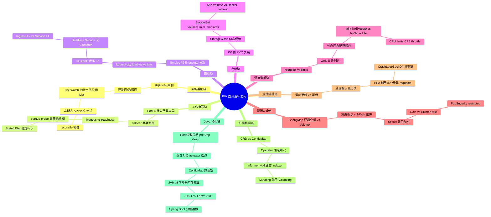

# 跨主题高频面试 Q&A

> **一句话定位**：面试前冲刺用，45 题速答串联各主题，附连环套问思维导图。
> **面试热度**：⭐⭐⭐⭐⭐
> **返回**：[K8s 知识图谱](../README.md)

---

## 使用说明

- 全部 45 题按主题分类，每题 3-5 句要点速答，末尾 **关联** 链接指向对应主题文档的详细推导。
- 连环追问题在题号后标注 🔗，配合文末「连环套问思维导图」把握面试官的追问路径。
- 建议先盖住答案自答，再对照要点查漏，最后跳转关联文档补全原理。

---

## 一、架构基础篇（6 题）

### Q1: 讲讲你对 K8s 架构的理解？🔗

**答**：3 分钟标准答法分四层递进。第一层说**控制面/数据面**：控制面管集群状态（API Server/scheduler/controller-manager/etcd），数据面跑业务（kubelet/kube-proxy/容器运行时）。第二层说**六大组件**：API Server 是唯一入口、etcd 存状态、scheduler 调度、controller-manager reconcile、kubelet 管 Node 上的 Pod、kube-proxy 管网络规则。第三层说**核心机制**：List-Watch 实现变更通知、reconcile 循环保证期望状态、声明式 API 让用户只描述"要什么"。第四层说**扩展接口**：CRI（容器运行时）、CNI（网络）、CSI（存储）三大接口让 K8s 不绑定具体实现。

**关联**：→ [架构总览与核心组件](./01-foundation/k8s-architecture.md) §2.2 架构图 / §五 5.1 3 分钟标准答法

### Q2: API Server 为什么是唯一访问 etcd 的组件？

**答**：三个原因。**隔离风险**——etcd 是核心状态存储，若所有组件直连，任一组件的 bug 都可能写坏 etcd，API Server 作为唯一入口可做鉴权、校验、准入控制。**缓存与归一化**——API Server 内建缓存减轻 etcd 压力，并把 etcd 的存储格式归一化为标准 RESTful 对象，其他组件不必关心底层存储。**审计与版本兼容**——所有读写经 API Server 可统一审计、做版本转换（不同 API version 间），组件只需与 API Server 对接，解耦 etcd 版本变化。

**关联**：→ [架构总览与核心组件](./01-foundation/k8s-architecture.md) §2.3 API Server 是唯一访问 etcd 的组件 / §三 Q1

### Q3: etcd 挂了集群会怎样？

**答**：分短期与长期。**短期不影响已运行业务**——kubelet 已调度的 Pod 继续运行、kube-proxy 已下发的 iptables/ipvs 规则继续转发流量，业务无感知。**但无法变更**——无法创建/删除/更新任何资源（kubectl 失败、控制器无法 reconcile、scheduler 无法调度新 Pod）。**长期风险**——若 etcd 长期不可用，控制器无法自愈（Pod 挂了无人重建）、滚动更新卡住、新调度无法进行。**恢复**——etcd 是状态源，必须从备份恢复，生产必做 etcd 定期备份（`etcdctl snapshot save`）。

**关联**：→ [架构总览与核心组件](./01-foundation/k8s-architecture.md) §三 Q2 etcd 挂了集群会怎样

### Q4: List-Watch 为什么不只用 List？🔗

**答**：List 和 Watch 配合，缺一不可。**List 只做一次**——启动时全量拉取当前状态建本地缓存（Indexer），保证组件有完整视图。**Watch 持续监听**——之后只收增量变更（Added/Modified/Deleted）更新本地缓存，避免反复全量拉取。若只用 List，组件要周期性全量轮询 API Server，延迟大、压力大；若只用 Watch，组件重启后没有初始状态，无法知道"当前有哪些资源"。**消息可靠性**——Watch 基于 HTTP 长连接 + chunked transfer，断线自动重连，重连时用 resourceVersion 续传不丢事件。

**关联**：→ [架构总览与核心组件](./01-foundation/k8s-architecture.md) §2.4 List-Watch 机制 / §三 Q3 List-Watch 为什么不只用 List

### Q5: 声明式 API 与命令式 API 的本质区别？🔗

**答**：核心在"描述目标 vs 描述动作"。**命令式**——告诉系统"做什么"（create this pod、delete that pod、update this config），系统按指令执行，用户需自己追踪当前状态与下一步。**声明式**——告诉系统"要什么"（期望有 3 个 Pod），系统持续 reconcile 让实际状态趋近期望，用户只关心目标不关心中间动作。**幂等性**——声明式天然幂等（重复提交同一期望无副作用），命令式需自己保证幂等。**自愈**——声明式下若实际状态偏离（Pod 挂了），控制器自动拉回期望；命令式下需人工或脚本补救。K8s 的核心范式是声明式 + reconcile，这是它"自愈"能力的根源。

**关联**：→ [架构总览与核心组件](./01-foundation/k8s-architecture.md) §1.4 声明式 API vs 命令式 API / §三 Q6 声明式 API 与命令式 API 的本质区别

### Q6: K8s 与 Docker 的关系？

**答**：互补而非替代。**Docker 是容器运行时**——负责构建镜像、跑容器、管单机容器生命周期（dockerd/containerd/runc 调用链）。**K8s 是容器编排系统**——负责跨多机的调度、自愈、扩缩容、滚动更新、服务发现。**K8s 不直接跑容器**——它通过 CRI 接口调用容器运行时（containerd/CRI-O），早期用 dockershim 适配 Docker，1.24 起移除 dockershim 改用 containerd 直连。**一句话**：Docker 解决"怎么跑一个容器"，K8s 解决"怎么管理一群容器"，生产用 K8s 编排 + containerd 运行。

**关联**：→ [架构总览与核心组件](./01-foundation/k8s-architecture.md) §1.3 与 Docker 的关系 / §三 Q8 K8s 与 Docker 的关系

---

## 二、工作负载篇（5 题）

### Q7: Pod 为什么不是"一个容器"？🔗

**答**：Pod 是"一组共享网络与存储的容器"，不是单容器。两个原因：**sidecar 协作模式**需要共享 localhost——日志采集 sidecar 挂主容器 Volume、Istio envoy 拦截主容器出站流量、Vault agent 把密钥写共享 Volume 给主容器读，这些都依赖同一 Pod 内容器共享网络栈与挂载点，单容器做不到。**调度原子单元**——K8s 把"主容器 + sidecar"作为整体调度到一个 Node，保证同生命周期同 Node，若独立容器调度器要保证两个容器落同 Node 且同时启停，复杂度爆炸。Pod 把"容器组"做成一等公民，是 K8s 的核心抽象。

**关联**：→ [Pod 与控制器](./02-workload/pod-and-controllers.md) §1.2 为什么是 Pod 而非容器 / §三 Q1

### Q8: liveness 和 readiness 的区别？🔗

**答**：失败行为不同。**livenessProbe** 判断容器是否"活着"，失败次数达阈值 kubelet 杀容器重建（按 restartPolicy），适合检测死锁/死循环（进程在但无响应）。**readinessProbe** 判断容器是否"就绪"接流量，失败只从 Service Endpoints 摘除（不重启），适合启动慢/依赖临时不可用时挡流量——等依赖恢复 readiness 自然通过流量重新进入。**滚动更新核心**——readinessProbe 决定新 Pod 何时加入 Endpoints、旧 Pod 何时摘流量，是滚动更新的核心开关；liveness 不直接参与扩缩容节奏。一句话：liveness 失败重启容器，readiness 失败只摘流量不重启。

**关联**：→ [Pod 与控制器](./02-workload/pod-and-controllers.md) §2.4 容器探针三种 / §三 Q3

### Q9: Java 应用为什么需要 startup probe？

**答**：JVM 预热慢，直接配 liveness 会被启动期重启。Java 启动要加载类、Spring 容器初始化、JIT 编译，冷启动 30 秒到 5 分钟。若只配 liveness 且 `initialDelaySeconds` 不够，启动期 liveness 探测失败 → kubelet 杀容器重建 → 永远启动不完（CrashLoopBackOff）。传统解法是加大 `initialDelaySeconds`（如 120 秒），但这是"猜"启动时间——慢机器仍不够、快机器白白等待。**startup probe 解法**：启动期只跑 startup、屏蔽 liveness/readiness，startup 成功后两者才生效。配 `period=10, failureThreshold=30` 容忍 5 分钟预热，对接 `/actuator/health`。

**关联**：→ [Pod 与控制器](./02-workload/pod-and-controllers.md) §三 Q4 Java 应用为什么需要 startup probe / [Java 应用上 K8s](./09-performance/java-on-k8s.md) §2.2 容器探针与 Spring Boot actuator 对接

### Q10: StatefulSet 和 Deployment 的本质区别？🔗

**答**：稳定标识 + 顺序部署 + 独立 PVC。**Pod 名**——Deployment 随机后缀（app-abc123），StatefulSet 固定序号（app-0/1/2）。**网络标识**——Deployment 不稳定（Pod 重建名变），StatefulSet 稳定 DNS（app-0.svc.ns.svc.cluster.local）。**部署顺序**——Deployment 并行无序，StatefulSet 顺序（pod-0 先）。**存储**——Deployment 共享或无存储，StatefulSet 每 Pod 独立 PVC（volumeClaimTemplates）。**选型**——无状态用 Deployment（请求经 Service 负载到任意 Pod），有状态如数据库/MQ 用 StatefulSet（稳定网络标识让客户端连固定 Pod 做主从选举、独立 PVC 保证数据隔离）。

**关联**：→ [Pod 与控制器](./02-workload/pod-and-controllers.md) §2.6 StatefulSet 稳定标识 / §三 Q6

### Q11: DaemonSet 与 Deployment 副本数=Node 数有什么区别？

**答**：调度方式与节点绑定不同。**DaemonSet** 副本数自动=Node 数，绑定 Node 不漂移，新 Node 加入自动调度一个 Pod，Node 挂了 Pod 跟着没了（不重调度，因为就是给这个 Node 用的）。**Deployment 副本数=Node 数**只是巧合地每个 Node 一个，但 Node 挂了 Pod 会重新调度到其他 Node（可能两个 Pod 在同一 Node，违反"每 Node 一个"语义），且新 Node 加入不会自动补 Pod（副本数固定）。**适用**——DaemonSet 用于节点级 agent（日志/网络/监控），Deployment 用于无状态服务刚好每 Node 一个（少见）。

**关联**：→ [Pod 与控制器](./02-workload/pod-and-controllers.md) §2.7 DaemonSet 调度 / §三 Q8

---

## 三、网络篇（5 题）

### Q12: Service 和 Endpoints 的关系？🔗

**答**：Service 是抽象的稳定访问入口，Endpoints 是它背后的 Pod IP 列表。**Service 通过 selector 关联 Pod**——Service 定义 selector（app=foo），控制器自动维护 Endpoints 对象，把符合 selector 的 Pod IP:port 写入。**Endpoints 与 EndpointSlice**——大量 Pod 时 Endpoints 对象过大（一次变更全量推送），1.21+ 默认用 EndpointSlice 分片（每片最多 100 个 Pod），降低推送压力。**kube-proxy 消费 Endpoints**——kube-proxy Watch Endpoints 变化，把 IP 列表写进 iptables/ipvs 规则，流量按规则负载到 Pod。**readinessProbe 影响 Endpoints**——Pod readiness 失败时从 Endpoints 摘除，流量不再转发，这是滚动更新摘流量的底层。

**关联**：→ [Service 与 Ingress](./03-network/service-and-ingress.md) §1.3 Endpoints 与 EndpointSlice / §三 Q1

### Q13: kube-proxy iptables 和 ipvs 怎么选？🔗

**答**：看集群规模。**iptables 模式**——用 iptables DNAT 规则做负载均衡，规则线性匹配，Pod 数多时规则链变长，查找复杂度 O(n)，大规模集群（>1000 Pod）性能下降明显，但规则简单易排查（`iptables-save` 可看）。**ipvs 模式**——用内核 IPVS（基于哈希表），查找复杂度 O(1)，支持更多负载均衡算法（rr/lc/dh/sed 等），大规模集群性能稳定。**选型**——小集群（<1000 Pod）iptables 足够，大集群或对网络延迟敏感用 ipvs。**注意**——ipvs 依赖内核模块（`ip_vs`、`ip_vs_rr` 等），需确保 Node 内核已加载；iptables 模式无额外依赖。

**关联**：→ [Service 与 Ingress](./03-network/service-and-ingress.md) §2.1 kube-proxy 三种模式 / §三 Q2

### Q14: Headless Service 为什么没有 ClusterIP？

**答**：因为它的用途不是负载均衡，而是直接暴露 Pod 端点。**普通 Service** 有 ClusterIP，kube-proxy 在这个虚拟 IP 上做 DNAT 负载均衡到后端 Pod。**Headless Service**（`clusterIP: None`）不分配 ClusterIP，kube-proxy 不为它建转发规则，DNS 查询直接返回后端 Pod IP 列表——客户端自己选 Pod 连。**典型用途**——StatefulSet 每个 Pod 需要稳定 DNS 名（`app-0.svc.ns.svc.cluster.local`）让客户端连固定 Pod（数据库主从选举），Headless Service 为每个 Pod 创建 DNS A 记录。**对比**——普通 Service 是"给一批 Pod 一个入口 IP"，Headless Service 是"给每个 Pod 一个稳定 DNS 名"。

**关联**：→ [Service 与 Ingress](./03-network/service-and-ingress.md) §2.5 Headless Service / §三 Q5

### Q15: Ingress 和 Service 的本质区别？🔗

**答**：工作层级与协议不同。**Service** 工作在 L4（TCP/UDP），用 ClusterIP/NodePort 做四层负载均衡，不关心 HTTP 路径/域名，只能按端口转发。**Ingress** 工作在 L7（HTTP/HTTPS），基于域名/路径路由（`host: api.foo.com` 路径 `/v1` 到 ServiceA、`/v2` 到 ServiceB），支持 TLS 终结、虚拟主机、流量权重（金丝雀）。**Ingress 不是 Service 的替代**——Ingress 本身只是路由规则，需 Ingress Controller（Nginx/Traefik/Envoy）实现，Controller 是个反向代理，背后仍要 Service 做四层转发到 Pod。**一句话**：Service 是 L4 入口，Ingress 是 L7 入口，生产用 Ingress 暴露 HTTP 服务、Service 暴露非 HTTP（数据库/TCP）服务。

**关联**：→ [Service 与 Ingress](./03-network/service-and-ingress.md) §2.6 Ingress 与 Ingress Controller / §三 Q6

### Q16: Flannel VXLAN 和 Calico BGP 怎么选？

**答**：看规模与网络策略需求。**Flannel VXLAN**——用 VXLAN 封装跨主机包（UDP 4789），配置简单、对底层网络无要求（只要宿主互通），但有约 5%~10% 封装开销，MTU 需减 50 字节。适合中小集群、对性能不敏感、网络环境复杂（跨子网/云）。**Calico BGP**——用 BGP 协议在 Node 间交换路由，容器 IP 直接路由无封装，性能接近原生网络，支持网络策略（NetworkPolicy）。适合大规模集群、对性能敏感、Node 在同一二层（BGP 需 Node 间可直连路由）。**选型**——小集群/跨子网用 Flannel VXLAN，大集群/同二层/需 NetworkPolicy 用 Calico BGP；混合场景用 Calico 的 IPIP 模式（封装但比 VXLAN 轻量）。

**关联**：→ [Service 与 Ingress](./03-network/service-and-ingress.md) §2.8 CNI 插件原理 / §三 Q8 Flannel VXLAN 和 Calico BGP 怎么选

---

## 四、存储篇（4 题）

### Q17: PV 和 PVC 的关系？🔗

**答**：PV 是集群的存储资源，PVC 是用户对存储的申请。**PV（PersistentVolume）**——由管理员创建或 StorageClass 动态生成，代表集群里的一块存储（NFS/iSCSI/Ceph RBD/云盘），独立于 Pod 生命周期。**PVC（PersistentClaim）**——用户声明需要的存储（容量、accessModes），集群自动找一个满足条件的 PV 绑定。**解耦**——管理员管 PV（存储怎么来的），用户管 PVC（我要多少存储），用户不必关心底层存储类型。**生命周期**——PV 和 PVC 绑定后，PV 不能再被其他 PVC 绑定；PVC 删除时按 PV 的 `persistentVolumeReclaimPolicy`（Retain/Recycle/Delete）决定 PV 命运。

**关联**：→ [Volume 与 PV/PVC](./04-storage/volume-and-pv-pvc.md) §1.3 PV/PVC/StorageClass 三者关系 / §三 Q1

### Q18: StorageClass 动态供给和静态 PV 的区别？🔗

**答**：存储创建时机与流程不同。**静态 PV**——管理员手动创建 PV（指定存储后端与容量），用户创建 PVC 后集群从已有 PV 中找匹配的绑定。适合存储需求固定、提前规划的场景，缺点是手动运维、PV 与 PVC 容量不匹配时绑定不上。**动态供给（StorageClass）**——用户创建 PVC 指定 StorageClass，集群自动调 CSI 插件按需创建存储（云盘/NFS）并生成 PV 绑定。适合按需存储、省运维，缺点是依赖存储插件支持。**生产推荐**——用 StorageClass 动态供给（云原生标配），静态 PV 仅用于已有固定存储（如自建 NFS）接入。

**关联**：→ [Volume 与 PV/PVC](./04-storage/volume-and-pv-pvc.md) §2.3 StorageClass 动态供给流程 / §三 Q2

### Q19: StatefulSet 的 volumeClaimTemplates 有什么用？

**答**：为每个 Pod 生成独立 PVC，保证有状态服务的存储隔离与稳定。**机制**——StatefulSet 的 `volumeClaimTemplates` 定义一个 PVC 模板，控制器为每个 Pod 实例化一个独立 PVC（命名 `<template-name>-<pod-name>`，如 `data-mysql-0`、`data-mysql-1`），各自绑定独立 PV。**稳定绑定**——Pod 重建（删除重建或滚动更新）后，同名 PVC 仍存在并被新 Pod 重新挂载，数据不丢。**对比 Deployment**——Deployment 的所有 Pod 共享或无存储，Pod 重建存储不保证跟随。**适用**——数据库主从（每个 Pod 独立数据盘）、消息队列（每个 broker 独立日志盘），是 StatefulSet 区别于 Deployment 的核心特征之一。

**关联**：→ [Volume 与 PV/PVC](./04-storage/volume-and-pv-pvc.md) §2.6 StatefulSet 持久化 / §三 Q4

### Q20: K8s Volume 和 Docker volume 有什么本质区别？

**答**：生命周期与抽象层级不同。**Docker volume**——由 Docker daemon 管理，存在 `/var/lib/docker/volumes/`，生命周期绑定容器（容器删 volume 留，需 `docker volume rm` 才删），单机概念，跨机需 NFS 等额外方案。**K8s Volume**——是 Pod 级抽象，生命周期绑定 Pod（Pod 删 Volume 随之销毁），但通过 PV/PVC 把存储与 Pod 解耦（PVC 独立于 Pod，Pod 删 PVC 留）。**类型丰富**——K8s Volume 支持 emptyDir（Pod 内临时共享）、hostPath（挂宿主目录）、configMap/secret（配置注入）、PV（持久化）等十几种，Docker volume 只是其中一种持久化形态。**核心**——K8s Volume 是 Pod 内容器共享挂载的抽象（sidecar 协作的基础），Docker volume 是单容器的持久化挂载。

**关联**：→ [Volume 与 PV/PVC](./04-storage/volume-and-pv-pvc.md) §1.1 K8s Volume 的本质 / §1.4 与 Docker 存储的区别对比 / §三 Q8

---

## 五、调度与资源篇（5 题）

### Q21: requests 和 limits 的区别？🔗

**答**：语义与用途不同。**requests**——容器**保证**能拿到这么多资源，用于调度（scheduler 按 requests 之和选 Node）和 QoS 判定，是 Pod 的"保底"。**limits**——容器**最多**能用这么多资源，超过 CPU limits 触发 CFS throttle（限流不杀），超过内存 limits 触发 OOM Killed（内核杀）。**关系**——requests ≤ limits，requests 决定调度、limits 决定上限。**常见配法**——CPU requests 设低（保调度）、limits 设高（保突发），内存 requests=limits（避免超卖导致 OOM 不可预测）。**陷阱**——只设 limits 不设 requests，K8s 默认 requests=limits，导致调度过严（所有 Pod 按 limits 算 Node 容量）。

**关联**：→ [调度与资源](./05-scheduling/scheduling-and-resources.md) §1.3 requests vs limits / §三 Q1

### Q22: QoS 三级怎么判定？🔗

**答**：按所有容器的 requests/limits 关系判定。**Guaranteed**——所有容器的 CPU 和内存 requests=limits（且非 0），最高优先级，最后被驱逐，资源紧张时最有保障。**Burstable**——至少一个容器设了 requests 或 limits，但不全满足 Guaranteed 条件，中等优先级。**BestEffort**——所有容器都没设 requests/limits，最低优先级，资源紧张时最先被驱逐。**判定规则**——按 Pod 内所有容器 collectively 判定，任一容器不满足 Guaranteed 条件就降级。**生产建议**——关键业务用 Guaranteed（requests=limits），非关键用 Burstable，绝不用 BestEffort（随时可能被杀）。

**关联**：→ [调度与资源](./05-scheduling/scheduling-and-resources.md) §1.4 QoS 三级 / §三 Q2

### Q23: 节点内存压力时按什么顺序驱逐 Pod？

**答**：按 QoS 等级 + 是否超 requests。**驱逐顺序**：BestEffort（无 requests/limits）→ Burstable 且实际使用超 requests 的 Pod → Burstable 且未超 requests 的 Pod → Guaranteed。**机制**——kubelet 监控 Node 资源压力（内存/磁盘），触发驱逐时按 QoS 从低到高、同 QoS 内按"超 requests 程度"排序，超得越多越先驱逐。**信号**——`MemoryAvailable < evictionHard`（默认 100Mi）触发，kubelet 发 SIGTERM 给选中的 Pod，宽限期内不退再 SIGKILL。**预防**——关键业务用 Guaranteed 等级（requests=limits），避免被优先驱逐；节点资源预留（kube-reserved/system-reserved）保护系统进程。

**关联**：→ [调度与资源](./05-scheduling/scheduling-and-resources.md) §2.8 QoS 三级判定与 kubelet 驱逐 / §三 Q3 节点内存压力时按什么顺序驱逐 Pod

### Q24: taint 的 NoExecute 和 NoSchedule 区别？🔗

**答**：作用时机与已有 Pod 行为不同。**NoSchedule**——"禁止新调度"——已在该 Node 的 Pod 不受影响（不被驱逐），但新 Pod 除非有 toleration 不能调度到该 Node。适合维护前先打 NoSchedule，让新 Pod 不再进来，已有 Pod 继续运行。**NoExecute**——"立即驱逐"——已在该 Node 的 Pod 若无对应 toleration 立即被驱逐（可配 `tolerationSeconds` 延迟），新 Pod 同样不能调度。适合 Node 要下线或故障时，把所有 Pod 赶走。**选型**——维护/排障用 NoSchedule（只挡新的），下线/隔离用 NoExecute（老的也赶走）。

**关联**：→ [调度与资源](./05-scheduling/scheduling-and-resources.md) §2.3 taint 与 toleration / §三 Q4

### Q25: CPU limits 过低会导致什么？

**答**：CFS throttle（限流）导致延迟抖动。**机制**——Linux CFS 用 cgroup CPU 配额控制，每周期（默认 100ms）给容器 `limits.cpu` 个毫秒的预算，用完该周期内容器被 throttle（暂停运行）等下周期。**症状**——应用响应延迟周期性抖动（每 100ms 卡一下），但 CPU 利用率看着不高（throttle 期间不算 busy），排查困难。**Java 陷阱**——JVM 的 ForkJoinPool 并行度默认按 CPU 核数算，若 limits.cpu=1 但宿主 32 核，ForkJoinPool 仍按 32 算并行度，实际只有 1 个 CPU 配额导致并行任务排队。**建议**——延迟敏感业务 CPU requests=limits（避免超卖导致 throttle），或干脆不设 limits（但可能影响其他 Pod）；监控 `container_cpu_cfs_throttled_seconds_total`。

**关联**：→ [调度与资源](./05-scheduling/scheduling-and-resources.md) §三 Q8 CPU limits 过低会导致什么 / §4.3 CPU limit 与 ForkJoinPool 并行度陷阱

---

## 六、配置与安全篇（5 题）

### Q26: ConfigMap 挂载为环境变量和 Volume 有什么区别？🔗

**答**：热更新能力与使用方式不同。**环境变量注入**——Pod 启动时把 ConfigMap 值注入为环境变量，进程从 `System.getenv()` 读，**不热更新**——ConfigMap 改了环境变量不变，需重启 Pod 才生效。**Volume 挂载**——ConfigMap 作为 Volume 挂到容器目录，kubelet 定期（默认 60~120 秒）把更新后的 ConfigMap 内容同步到挂载点，**热更新有延迟**——进程能读到新内容（若支持热重载如 Spring Boot `@RefreshScope`）。**subPath 陷阱**——Volume 挂载时用 `subPath` 挂单个文件，该文件不热更新（kubelet 只更新整个 Volume 目录，subPath 文件是符号链接固定不变），高频面试坑。**选型**——需热更新用 Volume，启动参数用环境变量。

**关联**：→ [配置与安全](./06-config-security/config-and-rbac.md) §2.1 ConfigMap 两种挂载方式 / §2.1.3 subPath 挂载的陷阱 / §三 Q1

### Q27: Secret 在 etcd 里是加密的吗？

**答**：默认不加密，只是 base64 编码（不是加密）。**默认状态**——Secret 的 data 字段值是 base64 编码，`kubectl get secret -o yaml` 能 decode 出明文，base64 只是传输编码不是加密，etcd 里存的是 base64 文本，有 etcd 读权限就能看明文。**加密方案**——启用 EncryptionAtRest（API Server 配置 `--encryption-provider-config`），用 AES/GCM 或 KMS 加密 Secret 数据，etcd 里存的是真密文，即使拿到 etcd 数据也解不开。**访问控制**——还需 RBAC 限制谁能 get/list Secret，防止从 kubectl 泄露。**生产推荐**——EncryptionAtRest + RBAC 严控 + 外部密钥管理（Vault/ExternalSecret）存高敏感密钥。

**关联**：→ [配置与安全](./06-config-security/config-and-rbac.md) §2.3 Secret 类型与加密 / §三 Q2

### Q28: Role 和 ClusterRole 的区别？🔗

**答**：作用域不同。**Role**——命名空间级，绑定的权限只在该 namespace 内生效，如"允许 get/list pod in default namespace"。**ClusterRole**——集群级，绑定的权限在整个集群生效，且能授权集群级资源（Node/Namespace/PV 等不属于任何 namespace 的资源）。**绑定方式**——Role 用 RoleBinding（也命名空间级），ClusterRole 用 ClusterRoleBinding（集群级）。**特殊**——ClusterRole 也能被 RoleBinding 绑定，但权限被缩减到该 namespace 内（用于"某 namespace 复用集群级 Role 定义"）。**选型**——namespace 内业务权限用 Role+RoleBinding，集群级管理权限（如查看所有 Node）用 ClusterRole+ClusterRoleBinding。

**关联**：→ [配置与安全](./06-config-security/config-and-rbac.md) §2.5 Role vs ClusterRole / §三 Q3

### Q29: ServiceAccount Token 1.24 前后有什么变化？

**答**：从永久 Secret Token 改为短期 TokenRequest API。**1.24 前**——创建 ServiceAccount 自动生成一个 Secret（挂载类型 `kubernetes.io/service-account-token`），里面是永久 JWT Token，Pod 自动挂载到 `/var/run/secrets/kubernetes.io/serviceaccount/token`。**风险**——永久 Token 泄露后无法吊销（只能删 SA），且 Secret 存 etcd 明文。**1.24+**——不再自动生成 Secret，改用 TokenRequest API 按需生成短期 Token（默认 1 小时），kubelet 自动挂载的是投影卷（projected volume），Token 过期前自动轮换。**优势**——Token 短期可吊销（删 Pod 或 SA 即失效）、自动轮换降低泄露风险。**迁移**——老集群升级 1.24 后，已有 Secret Token 仍可用但建议迁移到 TokenRequest。

**关联**：→ [配置与安全](./06-config-security/config-and-rbac.md) §2.6 ServiceAccount Token 演进 / §三 Q4

### Q30: PodSecurity 的 restricted 级别有什么要求？

**答**：restricted 是最严格的 Pod 安全级别，要求 Pod 满足一组硬性约束。**核心要求**：①必须以非 root 运行（`runAsNonRoot: true`，`runAsUser` 不能为 0）；②禁止 privilege escalation（`allowPrivilegeEscalation: false`）；③必须丢弃所有 capabilities 且只允许加 `NET_BIND_SERVICE`；④seccomp 必须设为 `runtime/default` 或 unset；⑤禁止 hostNetwork/hostPID/hostIPC；⑥只允许 `ReadOnlyRootFilesystem` 或显式允许的可写挂载。**作用**——restricted 级别防容器逃逸（非 root + 无特权 + seccomp），是高安全集群的准入门槛。**启用**——namespace 标注 `pod-security.kubernetes.io/enforce: restricted`，准入控制器拒绝不符合的 Pod。

**关联**：→ [配置与安全](./06-config-security/config-and-rbac.md) §2.7 PodSecurity 替代 PSP / §三 Q6 PodSecurity 的 restricted 级别有什么要求

---

## 七、运维与排障篇（5 题）

### Q31: 滚动更新和蓝绿部署的本质区别？🔗

**答**：资源占用与切换方式不同。**滚动更新**——新旧版本 Pod 共存，逐步替换（maxSurge/maxUnavailable 控制节奏），过程中新旧 Pod 都在接流量，资源占用是"新+旧"，适合无状态服务日常迭代。**蓝绿部署**——准备一套完整的新环境（green），旧环境（blue）继续接流量，新环境就绪后一次性切流量（改 Service selector 或路由），切换瞬间完成，但资源占用是"2 倍"（需同时跑两套）。**本质**——滚动是"渐变"（新旧交替），蓝绿是"突变"（一刀切）。**回滚**——滚动回滚需反向滚动（慢），蓝绿回滚只需切回 blue（快）。**选型**——日常迭代用滚动，重大版本切换或需秒级回滚用蓝绿。

**关联**：→ [运维与排障](./07-operations/operations-and-troubleshooting.md) §1.3 三种发布策略对比 / §三 Q1

### Q32: 金丝雀发布怎么控制流量比例？

**答**：按层级有不同方案。**Service 层（L4）**——用两个 Deployment（v1 10 副本、v2 1 副本），Service selector 都选中，流量按副本数比例分配（约 10:1），粗粒度。**Ingress 层（L7）**——Nginx Ingress 支持 `nginx.ingress.kubernetes.io/canary-weight: 10` 注解，按权重精确分流量（10% 到 canary），细粒度。**服务网格层**——Istio VirtualService 按 weight 精确分流量，支持按 header/cookie 路由（灰度特定用户），最灵活。**选型**——粗粒度用 Service 副本比，精确百分比用 Ingress 注解，按用户/请求特征灰度用 Istio。**注意**——金丝雀 Pod 的 readinessProbe 必须配好，避免未就绪 Pod 被分到流量。

**关联**：→ [运维与排障](./07-operations/operations-and-troubleshooting.md) §2.4 金丝雀发布 / §三 Q2

### Q33: HPA 的 CPU 利用率分母是 limits 还是 requests？🔗

**答**：是 requests。**机制**——HPA（Horizontal Pod Autoscaler）计算 CPU 利用率 = 实际 CPU 用量 / Pod 的 CPU requests，目标维持利用率在 targetCPUUtilizationPercentage（如 70%）。**为什么是 requests 不是 limits**——requests 是"保证拿到"的资源，代表 Pod 的"容量基准"；limits 是上限（可能远高于 requests），若用 limits 做分母，Pod 即使满负荷也到不了目标利用率，HPA 不扩容。**陷阱**——若 requests 设得太低（如 100m）而实际用量高，HPA 会频繁扩容（利用率轻松超 70%）；若 requests 设得太高（如 4 核）而用量低，HPA 不扩容（利用率上不去）。**内存 HPA**——K8s 1.18+ 支持内存利用率扩容，但内存不易弹性（扩容不解决内存压力，需排查内存泄漏），生产慎用。

**关联**：→ [运维与排障](./07-operations/operations-and-troubleshooting.md) §2.5 HPA 工作流程 / §三 Q3

### Q34: Pod CrashLoopBackOff 怎么排查？🔗

**答**：按"为什么容器反复崩溃重启"排查。**第一步看事件**——`kubectl describe pod <name>` 看 Events，最常见是 `ImagePullBackOff`（镜像拉不到）、`FailedScheduling`（资源不足）、`Liveness probe failed`（探针失败重启）。**第二步看日志**——`kubectl logs <pod> --previous` 看上次崩溃时的日志（容器当前可能已重启，`--previous` 看上一次死前输出），定位应用启动报错（如数据库连不上、配置缺失、OOM）。**第三步看退出码**——退出码 137（128+9）是 OOM Killed（内核杀，查内存 limits 与堆外预算），退出码 1 是应用异常（看日志）。**第四步看探针**——livenessProbe 太激进（initialDelay 太小）会在启动期杀容器，改用 startupProbe。**排查链**：describe → logs --previous → 退出码 → 探针配置。

**关联**：→ [运维与排障](./07-operations/operations-and-troubleshooting.md) §三 Q7 Pod CrashLoopBackOff 怎么排查 / §5.2 排查标准答法

### Q35: 日志采集用 DaemonSet 还是 Sidecar？

**答**：看场景与架构。**DaemonSet 模式**——每个 Node 跑一个日志 agent（Filebeat/Fluentd），挂载宿主 `/var/log/containers/` 读所有 Pod 的 stdout 日志文件。**优点**——资源开销小（每 Node 一个）、对业务 Pod 无侵入；**缺点**——只能采 stdout/stderr 文件，不能采容器内文件日志（除非也挂出来）。**Sidecar 模式**——每个业务 Pod 内跑一个日志 sidecar，挂载共享 Volume 读业务日志文件转发。**优点**——能采容器内文件日志、与业务 Pod 同生命周期；**缺点**——每 Pod 多一个容器（资源开销大）、镜像与配置耦合。**选型**——应用日志走 stdout 用 DaemonSet（主流），应用只能写文件用 Sidecar，混合用 DaemonSet 采 stdout + Sidecar 采文件。生产主流是 DaemonSet（标准化 stdout + 集中收集）。

**关联**：→ [运维与排障](./07-operations/operations-and-troubleshooting.md) §1.5 日志采集两种架构对比 / §三 Q6

---

## 八、扩展机制篇（4 题）

### Q36: CRD 和 ConfigMap 的区别？🔗

**答**：抽象层级与语义不同。**ConfigMap**——通用键值对配置存储，K8s 只把它当数据（不验证 schema、不 reconcile），应用自己读 ConfigMap 解析。**CRD（CustomResourceDefinition）**——定义新的资源类型（如 `MySQLCluster`），K8s 把它当一等公民资源：有 schema 校验（OpenAPI v3）、能被 kubectl 操作（get/apply/delete）、能被控制器 reconcile（Operator 监听 CR 变化执行业务逻辑）。**本质**——ConfigMap 是"配置数据"，CRD 是"领域模型 + 自动化逻辑"。**选型**——简单配置（数据库连接串、特性开关）用 ConfigMap；复杂领域对象（一个 MySQL 集群规格、一个微服务部署规格）用 CRD + Operator，让 K8s 原生管理领域资源。

**关联**：→ [CRD 与 Operator](./08-extensions/crd-and-operator.md) §1.2 CRD 是什么 / §三 Q1 CRD 和 ConfigMap 的区别

### Q37: Operator 解决了什么问题？

**答**：把人类运维专家的知识编码成自动化控制器。**问题**——有状态服务（数据库/MQ/缓存）的运维复杂：备份、恢复、扩缩容、主从切换、版本升级，这些操作有状态、有顺序、需专家判断，K8s 内置控制器（Deployment）搞不定。**Operator 方案**——用 CRD 定义领域资源（如 `MySQLCluster`），写一个控制器（Operator）监听 CR 变化，把运维专家的知识（什么时候备份、怎么主从切换）编码成 reconcile 逻辑自动执行。**核心**——Operator = CRD + 控制器 + 领域知识，让 K8s 原生管理复杂中间件。**典型**——Prometheus Operator 管理 Prometheus 实例、Strimzi Kafka Operator 管理 Kafka 集群、Etcd Operator 管理 etcd 集群。

**关联**：→ [CRD 与 Operator](./08-extensions/crd-and-operator.md) §1.3 Operator 模式是什么 / §三 Q2 Operator 解决了什么问题

### Q38: Informer 为什么要本地缓存 Indexer？🔗

**答**：减少 API Server 压力 + 提供快速查询。**问题**——控制器 reconcile 时要频繁查资源（"当前有哪些 Pod"、"这个 Service 的 Endpoints 是什么"），若每次都查 API Server，大规模集群下 API Server 与 etcd 压力巨大。**Indexer 方案**——Informer 启动时 List 全量拉取资源存到本地内存缓存（Indexer），之后 Watch 增量更新本地缓存，控制器 reconcile 时查本地缓存不查 API Server，O(1) 查询无网络开销。**Indexer 索引**——还能建索引（如按 namespace、按 label），支持快速过滤查询。**一致性**——本地缓存通过 Watch 保持与 etcd 最终一致，reconcile 时即使读到的是稍旧的缓存也无妨——声明式 reconcile 是幂等的，下次 Watch 事件会再触发修正。**本质**——Informer = 本地缓存 + Watch 增量 + WorkQueue，是控制器高性能的基础设施。

**关联**：→ [CRD 与 Operator](./08-extensions/crd-and-operator.md) §2.3 Informer / List-Watch / WorkQueue 机制 / §三 Q3

### Q39: Mutating 和 Validating Webhook 的执行顺序？

**答**：Mutating 先，Validating 后，且 Mutating 可能多轮。**执行顺序**——API Server 收到请求后：①先跑所有 Mutating Webhook（可修改对象），②再跑所有 Validating Webhook（只读校验不可改）。**为什么这个顺序**——Mutating 可能给对象加默认值（如注入 sidecar、补 label），Validating 要校验"最终形态"是否合法，所以必须 Mutating 改完再 Validating。**Mutating 多轮**——Mutating Webhook 之间可能互相依赖（A 加的字段 B 也要看），K8s 允许 Mutating 配 `reinvocationPolicy: IfNeeded` 让一个 Webhook 在其他 Mutating 改了对象后再跑一次。**失败行为**——任一 Webhook 拒绝（reject）请求直接失败；Webhook 服务不可用按 `failurePolicy`（Ignore 忽略/Fail 拒绝）。**选型**——加默认值/注入用 Mutating，强制约束（镜像必须来自私有仓）用 Validating。

**关联**：→ [CRD 与 Operator](./08-extensions/crd-and-operator.md) §2.5 准入 Webhook 流程 / §三 Q5 Mutating 和 Validating Webhook 的执行顺序

---

## 九、Java 篇（6 题）

### Q40: Pod 优雅关闭时为什么需要 preStop sleep？🔗

**答**：抵消 kube-proxy iptables 同步延迟，避免 SIGTERM 时还在收新请求。**问题**——Pod 删除时，kubelet 并行做两件事：①从 Endpoints 摘除该 Pod + kube-proxy 删 iptables 规则，②发 SIGTERM 给容器。但这两件事有竞争：iptables 规则同步有延迟（kube-proxy 从 Watch Endpoints 到改 iptables），若 SIGTERM 先到而 iptables 还在转发，客户端请求继续进来但应用已在关闭 → 连接失败。**preStop sleep 解法**——`lifecycle.preStop.exec.command: ["sh","-c","sleep 10"]`，Pod 删除时先执行 preStop（sleep 10 秒），这 10 秒内 kube-proxy 有时间同步完 iptables 摘流量，之后再 SIGTERM，此时已无新流量。**配合**——还需 `terminationGracePeriodSeconds` ≥ preStop 时间 + Spring Boot `timeout-per-shutdown-phase`，给 ShutdownHook 足够时间处理 in-flight 请求。

**关联**：→ [Java 应用上 K8s](./09-performance/java-on-k8s.md) §2.1 Pod 优雅关闭全流程 / §三 Q1

### Q41: liveness/readiness/startup 探针对接哪些 actuator 端点？

**答**：对接 Spring Boot actuator 的 health 子端点。**startupProbe** 对接 `/actuator/health`——启动期只要 actuator 能响应即认为启动完成，让 liveness/readiness 接管，配 `period=10, failureThreshold=30` 容忍 5 分钟。**livenessProbe** 对接 `/actuator/health/liveness`——Spring Boot 2.3+ 内建 liveness state 端点，应用主动上报"活着"，`period=10, failureThreshold=3`，失败 kubelet 重启。**readinessProbe** 对接 `/actuator/health/readiness`——应用主动上报"是否就绪接流量"，`period=5, failureThreshold=2`，失败从 Endpoints 摘除。**Spring Boot 侧配置**——`management.endpoint.health.probes.enabled=true` 暴露子端点，`management.health.livenessstate.enabled=true` 与 `readinessstate.enabled=true` 启用基于 ApplicationState 的状态上报。

**关联**：→ [Java 应用上 K8s](./09-performance/java-on-k8s.md) §2.2 容器探针与 Spring Boot actuator 对接 / §三 Q4

### Q42: ConfigMap 挂载为环境变量和 Volume 哪个能热更新？🔗

**答**：Volume 能热更新（有延迟），环境变量不能。**环境变量注入**——Pod 启动时把 ConfigMap 值注入为环境变量，进程从 `System.getenv()` 读，ConfigMap 改了环境变量不变，需重启 Pod 才生效（Spring Boot 的 `@Value` 也是启动时读环境变量，不热更新）。**Volume 挂载**——ConfigMap 作为 Volume 挂到容器目录，kubelet 定期（默认 60~120 秒）把更新后的 ConfigMap 同步到挂载点，进程能读到新内容，若应用支持热重载（Spring Cloud Kubernetes Config `@RefreshScope`）可不重启刷新。**subPath 陷阱**——Volume 挂载时用 `subPath` 挂单个文件，该文件不热更新（kubelet 只更新整个 Volume 目录，subPath 文件是符号链接固定不变），需重启 Pod。**选型**——需热更新用 Volume 挂载 + 应用热重载，启动参数用环境变量。

**关联**：→ [Java 应用上 K8s](./09-performance/java-on-k8s.md) §2.3 ConfigMap 注入 Spring 配置 / §三 Q5

### Q43: JVM 堆与容器内存 limits 怎么分配？

**答**：用 MaxRAMPercentage 而非固定 -Xmx，并留够堆外预算。**公式**——容器内存 > 堆 + Metaspace + DirectBuffer + Thread Stack × 线程数 + CodeCache + JVM 自身。即使 `-Xmx` 设了堆上限，若容器 `--memory` 也等于堆大小，剩余堆外项无处安放，触发 OOM Killed。**MaxRAMPercentage 方案**——`-XX:MaxRAMPercentage=75.0` 随容器 `--memory` 自动伸缩，一次构建多环境复用。**配法**——通用 75%（留 25% 堆外），小容器（<2GB）用 60%（堆外占比相对高），ZGC 用 70%（含染色指针 multi-mapping），小容器 <250MB 用 `MinRAMPercentage=50` 兜底。**常见漏项**——DirectBuffer（Netty/WebClient 30~100MB）、Thread Stack（Tomcat 200 线程 × 1MB = 200MB）。**修复**——降 MaxRAMPercentage 到 60%~70%，或显式限堆外（`-XX:MaxMetaspaceSize=256m`）。

**关联**：→ [Java 应用上 K8s](./09-performance/java-on-k8s.md) §2.4 JVM 堆与容器内存预算 / §三 Q6

### Q44: JDK 17 和 21 在 K8s 上有什么新特性值得用？

**答**：JDK 21 是 LTS，主要用分代 ZGC 与虚拟线程。**JDK 17**——容器感知完整支持 cgroup v2（JDK 14+ 完整，JDK 8u191+ 只支持 v1），现代 Linux（Ubuntu 21.10+/RHEL 9+）默认 cgroup v2，老 JDK 感知不到 v2 限制按宿主资源算堆与 CPU → OOM Killed。**JDK 21**——①分代 ZGC（`-XX:+UseZGC -XX:+ZGenerational`），吞吐损失从 5%~10% 降到 2%~3%，大堆（>8GB）强延迟场景首选；②虚拟线程（`Thread.ofVirtual()`），IO 密集型应用用虚拟线程替代线程池，单 Pod 可承数万并发连接，配合 K8s 弹性更高效。**选型**——生产底线 JDK 17（cgroup v2 + LTS），IO 密集 + 大堆用 JDK 21（虚拟线程 + 分代 ZGC）。**容器内 ZGC 陷阱**——堆外预算多留 2%~5%（染色指针 multi-mapping），MaxRAMPercentage=70 而非 75。

**关联**：→ [Java 应用上 K8s](./09-performance/java-on-k8s.md) §2.5 JDK 17/21 在 K8s 的选型 / §三 Q7

### Q45: Spring Boot 分层镜像对 K8s 滚动更新有什么好处？

**答**：大幅加速镜像推送与 Pod 滚动更新。**问题**——Spring Boot fat jar 是单体大文件（几十到上百 MB），每次构建只改了 application 层但整个 jar 重传重存，K8s 滚动更新时每个新 Pod 都要拉新镜像，构建与分发慢。**Layertools 方案**——把 fat jar 解包为四层：dependencies（第三方依赖，变最少）→ spring-boot-loader（启动器，几乎不变）→ snapshot-dependencies（SNAPSHOT 依赖）→ application（业务代码，最常变）。Docker 构建按层 COPY，依赖层不变 → Docker 缓存命中 → 只重传 application 层（几 MB），构建从分钟到秒级，推送从 GB 到 MB。**对 K8s 的好处**——滚动更新时新 Pod 拉镜像只下载变化的层（application 层几 MB），拉取快 → 新 Pod Ready 快 → 滚动更新快 → 502 窗口短。**配合**——还可用 Jib（无需 Dockerfile 自动分层）+ CDS（Class Data Sharing 优化冷启动）。

**关联**：→ [Java 应用上 K8s](./09-performance/java-on-k8s.md) §2.6 Spring Boot Layertools 与 K8s 滚动更新缓存 / §三 Q8

---

## 十、连环套问思维导图

下图标注了哪些题目构成面试官的「连环追问链」——答完一题后大概率被顺着追问下一环。带 🔗 标记的题即处于某条追问链中。每条链都是「入口题 → 原理 → 陷阱 → Java 关联」的递进，面试官常按此路径追问。

---

## 十一、自测清单

阅读完本文档后，尝试不查文档回答以下「一锤定音」要点，答不上则跳转关联文档补课：

- [ ] K8s 架构 3 分钟标准答法的四层递进是什么？
- [ ] API Server 为什么是唯一访问 etcd 的组件？etcd 挂了集群会怎样？
- [ ] List-Watch 为什么不只用 List？Watch 断线怎么续传？
- [ ] 声明式 API 与命令式 API 的本质区别？为什么声明式能自愈？
- [ ] Pod 为什么不是"一个容器"？sidecar 协作依赖什么共享？
- [ ] liveness 失败和 readiness 失败的后果分别是什么？滚动更新靠哪个？
- [ ] Java 应用为什么需要 startup probe？它和 initialDelay 有什么区别？
- [ ] StatefulSet 和 Deployment 的本质区别有哪四点？
- [ ] Service 和 Endpoints 的关系？readinessProbe 失败时 Endpoints 怎么变？
- [ ] kube-proxy iptables 和 ipvs 怎么选？分界线是多少 Pod？
- [ ] Headless Service 为什么没有 ClusterIP？它给 StatefulSet 提供什么？
- [ ] Ingress 和 Service 工作在 L 几？Ingress 背后还需不需要 Service？
- [ ] PV 和 PVC 的关系？PVC 删除时 PV 命运由什么决定？
- [ ] StorageClass 动态供给和静态 PV 的区别？生产推荐哪个？
- [ ] requests 和 limits 的区别？调度用哪个？QoS 判定用哪个？
- [ ] QoS 三级怎么判定？Guaranteed 要求什么？
- [ ] 节点内存压力时按什么顺序驱逐 Pod？
- [ ] taint NoExecute 和 NoSchedule 的区别？维护用哪个？下线用哪个？
- [ ] ConfigMap 挂载为环境变量和 Volume 哪个能热更新？subPath 有什么陷阱？
- [ ] Secret 在 etcd 里是加密的吗？怎么真正加密？
- [ ] Role 和 ClusterRole 的区别？ClusterRole 能被 RoleBinding 绑定吗？
- [ ] 滚动更新和蓝绿部署的本质区别？回滚哪个快？
- [ ] HPA 的 CPU 利用率分母是 requests 还是 limits？为什么？
- [ ] Pod CrashLoopBackOff 排查链的前三步是什么？
- [ ] CRD 和 ConfigMap 的本质区别？什么时候用 CRD？
- [ ] Informer 为什么要本地缓存 Indexer？reconcile 查的是本地还是 API Server？
- [ ] Mutating 和 Validating Webhook 的执行顺序？为什么是这个顺序？
- [ ] Pod 优雅关闭时 preStop sleep 解决了什么竞争？
- [ ] JVM 堆与容器内存 limits 的预算公式是什么？MaxRAMPercentage 通用配多少？
- [ ] JDK 21 在 K8s 上值得用的两个新特性是什么？

> **返回**：[K8s 知识图谱](../README.md)
