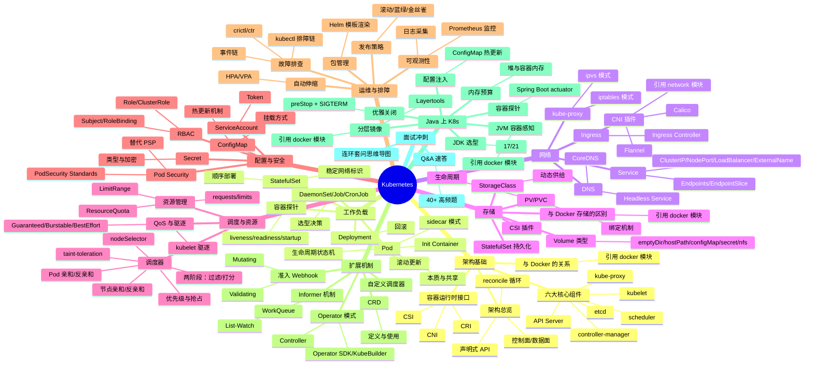

# k8s — Kubernetes 面试知识体系

## 一、模块简介

本模块按 K8s 架构层次组织 **9 份**主题文档，覆盖从架构基础、工作负载、网络存储到 Java 应用上 K8s 的完整面试知识图谱。

- **定位**：面向 Java 后端面试的 K8s 知识体系
- **适用对象**：Java 后端面试（初中级到高级），兼顾云原生与服务端架构方向
- **组织方式**：9 个主题目录 + 1 个 Q&A 文件，每份主题文档遵循六段式结构
- **导航约定**：每份文档顶部含 `> 返回 [K8s 知识图谱](../README.md)` 链接，本文档为统一入口

---

## 二、知识图谱



---

## 三、导航表

| 分层 | 文档 | 核心考点 |
|------|------|---------|
| 架构基础 | [架构总览与核心组件](./01-foundation/k8s-architecture.md) | 控制面/数据面、API Server/etcd/scheduler/controller-manager/kubelet/kube-proxy、CRI/CNI/CSI、声明式 API 与 reconcile |
| 工作负载 | [Pod 与控制器](./02-workload/pod-and-controllers.md) | Pod 本质/生命周期/探针、Deployment/StatefulSet/DaemonSet/Job/CronJob |
| 网络 | [Service 与 Ingress](./03-network/service-and-ingress.md) | Service 四类型/kube-proxy iptables·ipvs/Ingress/CoreDNS/CNI |
| 存储 | [Volume 与 PV/PVC](./04-storage/volume-and-pv-pvc.md) | Volume 类型/PV-PVC/StorageClass/CSI/StatefulSet 持久化 |
| 调度与资源 | [调度与资源管理](./05-scheduling/scheduling-and-resources.md) | 两阶段调度/亲和/taint/QoS/requests-limits/驱逐 |
| 配置与安全 | [配置与 RBAC](./06-config-security/config-and-rbac.md) | ConfigMap/Secret/RBAC/ServiceAccount/PodSecurity |
| 运维与排障 | [运维与故障排查](./07-operations/operations-and-troubleshooting.md) | Helm/发布策略/HPA-VPA/日志/Prometheus/排障方法论 |
| 扩展机制 | [CRD 与 Operator](./08-extensions/crd-and-operator.md) | CRD/Operator/Informer-List-Watch/Webhook/自定义调度器 |
| Java 调优 | [Java 应用上 K8s](./09-performance/java-on-k8s.md) | JVM 感知/preStop 优雅关闭/actuator 探针/ConfigMap/Layertools |
| 面试冲刺 | [Q&A 速答](./10-interview-qa.md) | 40+ 题速答 + 连环套问思维导图 |

> 共 **10 份**文档：入口 README（本文档）+ 上表 9 份主题/Q&A 文档。

---

## 四、推荐学习路径

### 路线一：系统学习（适合有 1-2 周准备期）

按 K8s 架构层次从基础向上深入，先建立全貌再下沉到细节：

```
01 架构基础 → 02 工作负载 → 03 网络 → 04 存储 → 05 调度与资源 → 06 配置与安全 → 07 运维与排障 → 08 扩展机制 → 09 Java 上 K8s → 10 Q&A
```

**特点**：先见森林后见树木，符合 K8s 架构层次，适合建立完整体系。

### 路线二：面试冲刺（高频优先，适合 3-5 天突击）

按面试热度排序，先啃必考点，再补体系：

1. 02 工作负载 → 03 网络 → 01 架构基础
2. 05 调度与资源 → 06 配置与安全 → 04 存储
3. 07 运维与排障 → 09 Java 上 K8s → 08 扩展机制
4. 10 Q&A（40+ 题，含连环套问思维导图）

**特点**：投入产出比最高，覆盖 80% 高频考点。

> 两套路线殊途同归，最终都应回到 [Q&A 速答](./10-interview-qa.md) 做闭环检验。

---

## 五、与 java-core / framework 模块的关联

本模块虽为运维文档，但与仓库内 Java 模块存在直接关联，便于在面试中结合源码与实战作答：

| K8s 知识点 | 关联 Java 模块 | 关联要点 |
|-----------|---------------|---------|
| 02 Pod 容器探针 / 健康检查 | `framework/valid` | livenessProbe/readinessProbe 对接 `/actuator/health` 端点 |
| 02 Pod 生命周期 / preStop + SIGTERM | `framework/spring-framework` | Spring Boot graceful shutdown、ContextClosedEvent、@PreDestroy |
| 02 Pod 生命周期 / JVM ShutdownHook | `java-core/jvm` | JVM ShutdownHook 执行时机与 Pod 优雅关闭的协作 |
| 03 Service / Endpoints 负载均衡 | `java-core/rmi`（api/provider/consumer） | 对照 Java 原生 RPC 的服务发现与负载均衡 |
| 03 CNI / CoreDNS / 服务发现 | `java-core/service-provider-framework` | SPI 与服务发现机制是微服务通信基础 |
| 05 调度 / resources requests-limits | `java-core/jvm` | JVM 容器内存感知（cgroup v2）、堆外内存预算、UseContainerSupport |
| 05 调度 / CPU requests 与线程池 | `java-core/forkjoin`、`java-core/stream` | ForkJoinPool 并行度与 CPU limit 的关系、parallelStream 陷阱 |
| 06 ConfigMap / 配置注入 | `framework/spring-framework` | ConfigMap 注入 Spring 配置、@Value 与配置优先级、热更新 |
| 06 ConfigMap / 配置序列化 | `framework/jackson` | ConfigMap 存储的 YAML/JSON 与 Jackson 反序列化 |
| 06 RBAC / ServiceAccount / Token | `framework/spring-framework` | K8s ServiceAccount Token 与 Spring Security 鉴权链对比 |
| 06 Pod Security / 准入控制 | `java-core/annotation`、`java-core/apt` | 准入 Webhook 与 APT 注解处理器的拦截机制对照 |
| 06 Secret / 密钥注入 | `framework/spring-framework` | Secret 挂载与 Spring 配置加密、外部化配置 |
| 07 HPA / 指标采集 | `java-core/jmx` | JMX 指标暴露给 Prometheus Adapter 的路径 |
| 07 故障排查 / Java agent attach | `java-core/agent` | Java agent 在 K8s Pod 内 attach 的 namespace 陷阱 |
| 07 日志采集 / 序列化 | `framework/jackson` | 日志聚合的 JSON 结构化与 Jackson |
| 08 Operator / Controller 模式 | `java-core/annotation`、`java-core/apt` | CRD 定义与注解驱动的模型生成对照 |
| 08 Informer / List-Watch | `java-core/lambda`、`java-core/stream` | 事件回调链与函数式编排 |
| 09 Java 上 K8s / JVM 感知 | `java-core/jvm` | HotspotContainer 源码、cgroup v2 兼容、ZGC 选型 |
| 09 Java 上 K8s / 优雅关闭 | `framework/spring-framework` | Spring Boot 3.x JarLauncher、优雅关闭、actuator 端点 |
| 09 Java 上 K8s / 容器探针 | `framework/valid` | `/actuator/health` 作为 livenessProbe/readinessProbe |
| 09 Java 上 K8s / 分层镜像 | `framework/spring-framework` | Spring Boot Layertools 与 K8s 滚动更新缓存命中 |

**延伸阅读**：

- `java-core/jvm` —— 对照理解 JVM 容器内存感知、GC 选型、ShutdownHook
- `framework/spring-framework` —— Spring Boot 容器化、优雅关闭、配置注入、Layertools
- `framework/valid` —— 健康检查端点与容器探针对接
- `ops/docker` —— 容器底层原理、运行时调用链、Java 容器调优（K8s 的底层基础）
- `ops/network` —— 网络分层、TCP 连接、云原生网络（K8s Service/CNI 的网络层基础）

> 建议在阅读工作负载与 Java 上 K8s 文档时，对照 `java-core`/`framework` 模块的源码实例，加深「面试八股 → 工程实战」的双向映射。
