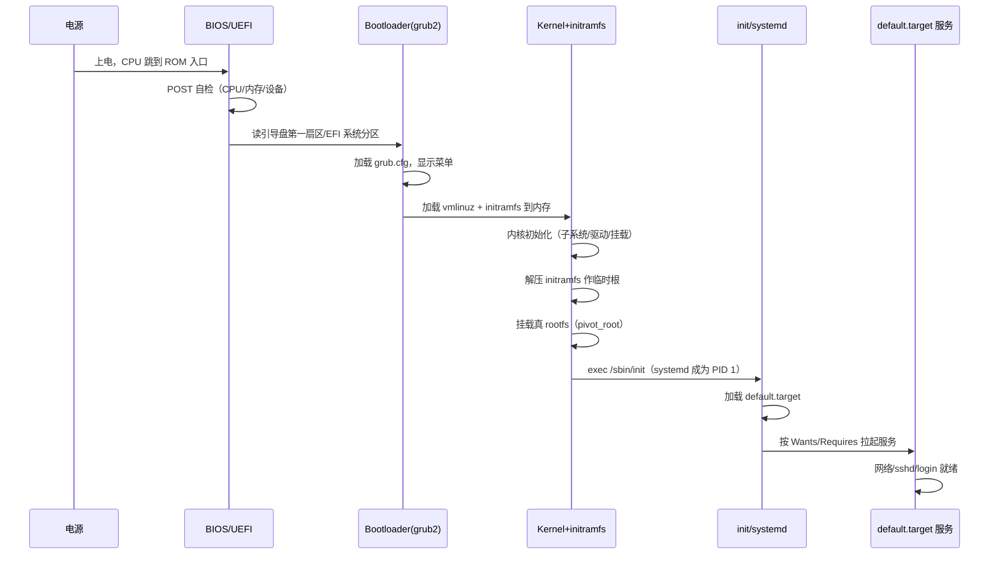
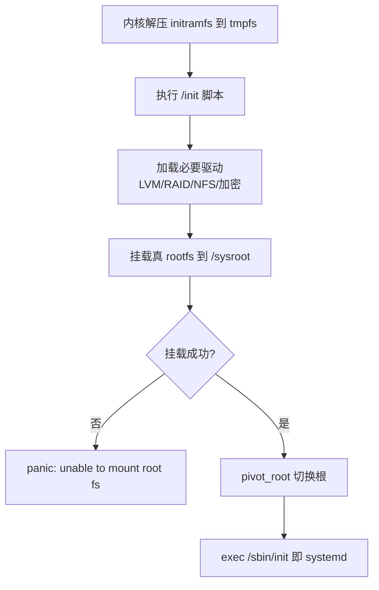
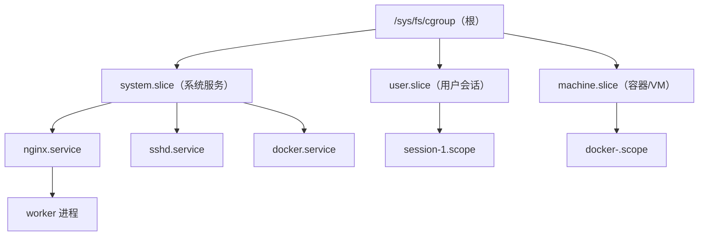
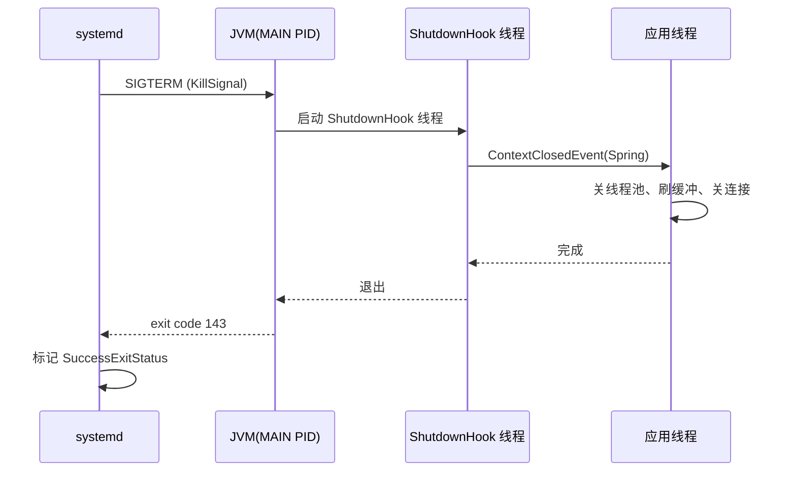

# 系统启动与运行时

> **一句话定位**：从按下电源到 systemd 拉起服务，Linux 启动链是理解一切运维行为的起点，面试官爱用"讲讲 Linux 启动流程"作开胃菜。
> **面试热度**：⭐⭐⭐⭐⭐
> **返回**：[Linux 知识图谱](../README.md)

---

## 一、概述

### 1.1 主题在 Linux 体系中的位置

Linux 系统从上电到提供服务的全过程，本质是一条**单向启动链**加上一套**长期运行时管理框架**。前者回答"机器怎么活过来"，后者回答"活过来之后谁来管服务、管资源、管身份"。面试中"讲讲 Linux 启动流程"几乎是开胃菜题，但它背后牵出的 systemd、cgroup、target、initramfs 才是真正的区分点——能讲清这些，才证明你不只是会敲 `reboot`。

本主题覆盖两条主线：**启动链**（BIOS/UEFI → Bootloader（grub2）→ kernel + initramfs → PID 1（init/systemd）→ default.target）与**运行时管理**（systemd Unit 体系、target/runlevel、cgroup v1/v2 基础、主机名与时区）。

### 1.2 与其他主题的边界

| 主题 | 边界说明 |
|------|---------|
| [02 进程与线程](../02-process/process-and-thread.md) | cgroup 基础概念在本主题，**进程限制的深入**（cpuShares、OOM killer 选主、pids 子系统防 fork bomb）下沉到 02 |
| [03 内存管理](../03-memory/memory-management.md) | memory cgroup 的 `memory.limit_in_bytes` 在此点到为止，**OOM killer 算法、swap/swappiness、RSS/PSS/USS** 深入在 03 |
| [08 Shell 与脚本](../08-shell/shell-and-scripting.md) | systemd Unit 的 `ExecStartPost=` 常调 shell 脚本，脚本健壮性（`set -euo pipefail`、`trap`）归 08 |
| [09 性能与故障排查](../09-ops/performance-and-troubleshooting.md) | `systemd-analyze blame` 是性能排查工具之一，**完整 USE/RED 方法论、perf/eBPF** 在 09 |

> **记住边界**：本主题讲 cgroup 是"是什么、v1/v2 差别、systemd 怎么管"，不讲"怎么调限制、OOM 怎么选主"——那些是 02/03 的事。

### 1.3 关键术语速览

| 术语 | 一句话定义 | 出现阶段 |
|------|-----------|---------|
| BIOS | 固化在主板 ROM 的基本输入输出系统，做 POST 自检后加载第一段引导 | 上电第一阶段 |
| UEFI | BIOS 的继任者，支持 GPT、大磁盘、Secure Boot、图形界面 | 上电第一阶段 |
| MBR | 主引导记录，磁盘第一个扇区（512B），含分区表与引导代码 | Bootloader 阶段 |
| GPT | GUID 分区表，UEFI 时代的分区方案，支持超大磁盘 | Bootloader 阶段 |
| Bootloader | 引导加载器，加载内核到内存，Linux 通用 grub2 | 第二阶段 |
| grub2 | GNU GRUB 2，主流 Linux 发行版的 Bootloader | 第二阶段 |
| initramfs | 初始内存文件系统，内核挂载真 rootfs 前的临时根 | 第三阶段 |
| runlevel | SysV init 时代的运行级别（0-6） | 运行时 |
| target | systemd 时代的"运行目标"，替代 runlevel | 运行时 |
| Unit | systemd 管理对象统称（service/socket/target/timer 等） | 运行时 |
| cgroup v1 | 控制组第一版，每个控制器独立层级 | 运行时资源管理 |
| cgroup v2 | 控制组第二版，统一层级，systemd 原生集成 | 运行时资源管理 |

---

## 二、核心机制

### 2.1 启动全流程时序

从按下电源到 login 提示符出现，Linux 经历四个阶段。每个阶段都有明确的"交接点"——前一阶段把控制权交给后一阶段，绝不会回头。



**四阶段交接点**：①**BIOS/UEFI → Bootloader**：固件完成 POST 后按启动顺序找可引导设备，BIOS 读磁盘第一扇区（MBR，512B）跳转，UEFI 直接从 ESP（EFI System Partition，FAT32 格式）读 `.efi` 文件；②**Bootloader → kernel**：grub2 把 `vmlinuz`（压缩内核镜像）和 `initramfs` 加载到内存，跳到内核入口，此阶段还在实模式→保护模式切换；③**kernel → init**：内核完成子系统初始化、挂载真 rootfs 后，`exec` 用户空间第一个进程 `/sbin/init`（现代发行版即 systemd），它成为 PID 1；④**init → 服务**：PID 1 读取默认 target，按依赖关系并行拉起所有服务，最终 `sshd`/`getty` 就绪，用户看到 login。

一句话记忆：固件找引导 → 引导加载内核 → 内核初始化并 exec init → init 拉服务。每一步都是"前者把后者加载到内存并跳过去"。

### 2.2 grub2 启动阶段

grub2 的启动分两段，**stage1/stage1.5/stage2 是 grub legacy（grub1）的说法，grub2 已经不再这样划分**——这是高频踩坑点。

| 阶段 | grub legacy（已淘汰） | grub2（现代） |
|------|----------------------|--------------|
| stage1 | MBR 前 440B 的引导代码 | `boot.img`，写入 MBR 引导扇区 |
| stage1.5 | 紧跟 MBR 的过渡代码，能读文件系统 | `core.img`（含文件系统驱动），可装在 MBR 后的扇区或 ESP |
| stage2 | 读 `/boot/grub/grub.conf` 显示菜单 | `normal.mod` 加载 `grub.cfg`，显示菜单 |

**grub2 实际流程**：固件加载 `boot.img`（512B，在 MBR 或 ESP 的 `.efi`）→ `boot.img` 加载 `core.img`（含足够驱动读 `/boot` 所在文件系统）→ `core.img` 加载 `normal.mod`，解析 `/boot/grub2/grub.cfg` 显示菜单 → 用户选内核后，grub2 加载 `vmlinuz` 与 `initramfs`，跳到内核入口。

**grub.cfg 关键字段**：

```bash
# /boot/grub2/grub.cfg（由 grub2-mkconfig 生成，勿手改）
menuentry 'CentOS Linux (5.14.0) ...' {
    set root='hd0,msdos1'          # 内核所在分区
    linux /vmlinuz-5.14.0 root=/dev/mapper/vg-root ro crashkernel=auto rd.lvm.lv=vg/root
    initrd /initramfs-5.14.0.img  # 配套 initramfs
}
```

修改菜单的正确姿势：编辑 `/etc/grub.d/40_custom` 或 `/etc/default/grub`（改 `GRUB_TIMEOUT` 等），再跑 `grub2-mkconfig -o /boot/grub2/grub.cfg`。直接改 `grub.cfg` 下次生成会被覆盖。

### 2.3 initramfs 的作用

**initramfs 是什么**：内核挂载真 rootfs 之前用的**临时根文件系统**，本质是一个 cpio 归档（`initramfs-<version>.img`），解压后挂到内存里的 tmpfs。

**为什么需要它**：真 rootfs 可能在 LVM、RAID、网络（NFS/iSCSI）、加密盘上，内核要把这些驱动和工具加载后才能挂载。但驱动本身又在 rootfs 的 `/lib/modules` 下——**鸡生蛋问题**。initramfs 就是破环的"蛋"：它自带必要的驱动、`lvm`、`mdadm`、`cryptsetup` 等工具，先把真 rootfs 挂上，再 `pivot_root` 切过去。

**initramfs 内部流程**：



**验证 initramfs 内容**：

```bash
lsinitrd /boot/initramfs-$(uname -r).img   # CentOS/RHEL，看 /init、/usr/sbin/lvm、/lib/modules
```

**踩坑**：升级内核后忘了 `dracut -f`（RHEL 系）或 `update-initramfs -u`（Debian 系）重新生成 initramfs，导致新内核启动时找不到磁盘控制器驱动，卡在 `dracut emergency shell`。

### 2.4 systemd 架构

systemd 是现代主流发行版（RHEL 7+/Ubuntu 15.04+/CentOS 7+/Debian 8+）的 init 系统，作为 **PID 1** 运行，是整个用户空间的总管。PID 1 的特殊职责：①**孤儿进程收养者**（父进程先于子进程退出，子进程被 PID 1 收养并 `wait` 回收，避免僵尸）；②**信号处理者**（内核对 PID 1 有特殊保护，未注册 handler 的信号默认被忽略，防误杀 init 导致系统崩溃）；③**服务管理**（按依赖拉起/回收所有 Unit）；④**cgroup 管理**（systemd 是 cgroup v2 的主要使用者，所有服务进程都挂在 systemd 创建的 cgroup 下）。

**Unit 类型对比表**：

| Unit 类型 | 文件后缀 | 管理对象 | 典型例子 |
|-----------|---------|---------|---------|
| service | `.service` | 长进程服务 | `nginx.service`、`sshd.service` |
| socket | `.socket` | IPC 套接字（按需启动） | `docker.socket` |
| target | `.target` | 一组 Unit 的集合点 | `multi-user.target` |
| timer | `.timer` | 定时任务（替代 cron） | `logrotate.timer` |
| mount | `.mount` | 挂载点 | `-.mount`（根挂载） |
| automount | `.automount` | 自动挂载 | `home.automount` |
| path | `.path` | 路径触发 | `systemd-coredump@.path` |
| slice | `.slice` | cgroup 分片 | `system.slice`、`user.slice` |
| scope | `.scope` | 外部进程组 | `session-1.scope` |

**依赖关系指令**：

| 指令 | 语义 | 失败行为 |
|------|------|---------|
| `Requires=` | 强依赖，目标必须启动 | 目标启动失败，本 Unit 也失败 |
| `Wants=` | 弱依赖，目标最好启动 | 目标失败不影响本 Unit |
| `Requisite=` | 强依赖，但**不触发**启动目标 | 目标未运行则本 Unit 直接失败 |
| `After=` | 顺序约束，目标启动完再启动本 Unit | 不影响成败，只调顺序 |
| `Before=` | 顺序约束，本 Unit 启动完再启动目标 | 不影响成败，只调顺序 |
| `Conflicts=` | 互斥 | 目标运行则本 Unit 不能启动 |

> **关键区分**：`Requires` 既要求启动又要求成功；`Requisite` 只检查"现在是否在运行"，不主动启动；`Wants` 是"尽力而为"。`After/Before` 只管顺序，不管依赖——必须配合 `Requires/Wants` 才有意义。

### 2.5 target vs runlevel 对照

systemd 用 target 替代 SysV init 的 runlevel，保留兼容映射：

| runlevel | 含义 | 对应 target |
|----------|------|-------------|
| 0 | 关机 | `poweroff.target` |
| 1 / S | 单用户模式（救援） | `rescue.target` |
| 2 | 多用户无网络（Debian 系传统） | `multi-user.target` |
| 3 | 多用户有网络（字符界面） | `multi-user.target` |
| 4 | 保留 / 自定义 | `multi-user.target` |
| 5 | 多用户有网络 + 图形界面 | `graphical.target` |
| 6 | 重启 | `reboot.target` |

默认 target 是 `/etc/systemd/system/default.target` 符号链接，指向真实 target：

```bash
$ ls -l /etc/systemd/system/default.target
lrwxrwxrwx 1 root root 36 ... default.target -> /lib/systemd/system/multi-user.target
```

切换默认 target：`systemctl set-default graphical.target`（改符号链接）；临时切到某 target：`systemctl isolate rescue.target`。

### 2.6 cgroup v1 vs v2

cgroup（Control Group）是 Linux 内核特性，用于**限制、记录、隔离**进程组的资源使用。本节讲"是什么"和"v1/v2 差别"，深入限制与 OOM 见 [03 内存管理](../03-memory/memory-management.md)。

| 维度 | cgroup v1 | cgroup v2 |
|------|----------|-----------|
| 层级结构 | 每个 controller 独立一棵树（多树） | 统一一棵树（单树） |
| 进程归属 | 一个进程可挂多个 cgroup（每控制器一个） | 一个进程只挂一个 cgroup |
| 控制器可用 | cpu/cpuacct/memory/blkio/pids/net_cls/... 分散 | 统一管理，部分控制器已合并 |
| `/proc/<pid>/cgroup` | 多行，每行一个控制器 | 单行 `0::/path` |
| systemd 集成 | 不友好（需 Unit 切片） | 原生 `Delegate=yes` |
| Docker 默认 | 早期默认 | 20.10+ 可用 `--cgroup-version` |
| RHEL/Ubuntu 默认 | RHEL 7 / Ubuntu 16.04 | RHEL 9 / Ubuntu 22.04+ |
| Java 影响 | JDK 8u191+ 可读 | 需 JDK 11+/8u372+ 才稳支持 |

**cgroup v2 层级结构图**：



v2 的核心设计是**统一层级**——一个进程只能挂在一个 cgroup，所有控制器对这个 cgroup 同时生效。这避免了 v1 中"进程在 cpu 树和 memory 树是不同位置，导致限制不一致"的问题，也让 systemd 能用一个 slice/scope/service 完整描述一组进程的所有资源边界。

**查看当前 cgroup 版本**：

```bash
$ mount | grep cgroup
# v1 输出多行: cgroup on /sys/fs/cgroup/cpu type cgroup (cpu)
# v2 输出单行: cgroup2 on /sys/fs/cgroup type cgroup2 (...)
$ stat -f /sys/fs/cgroup   # 文件系统类型 cgroup2fs => v2
```

### 2.7 关键源码路径

| 对象 | 源码/路径 | 说明 |
|------|----------|------|
| 内核启动入口 | `init/main.c` 的 `start_kernel()` | 上电后内核 C 代码入口，初始化所有子系统 |
| PID 1（systemd） | `src/core/main.c`（systemd 源码） | systemd 自身的启动入口，读 default.target |
| cgroup 文件接口 | `/sys/fs/cgroup/` | 用户态读写 cgroup 限制的接口 |
| 进程的 cgroup 归属 | `/proc/<pid>/cgroup` | 查某进程挂哪个 cgroup |
| cgroup 控制器总览 | `/proc/cgroups` | 列出所有已注册的控制器 |
| Unit 配置 | `/lib/systemd/system/`、`/etc/systemd/system/` | 前者发行版默认，后者管理员覆盖 |

面试口径：能说出"内核启动入口在 `init/main.c` 的 `start_kernel`，systemd 是 PID 1，cgroup 接口在 `/sys/fs/cgroup`"就足够。高级岗可补一句"内核完成初始化后 `rest_init` fork 出 PID 1（kernel_init → exec /sbin/init）和 PID 2（kthreadd，内核线程父进程）"。

---

## 三、命令与示例

### 3.1 命令族速查表

| 命令 | 作用 | 常用子命令 |
|------|------|-----------|
| `systemctl` | 管理 Unit | `status`/`start`/`stop`/`restart`/`enable`/`disable`/`list-units`/`list-sockets`/`list-timers` |
| `journalctl` | 查 systemd 日志 | `-u <unit>`/`-f`/`--since`/`--until`/`-p err`/`-k`（内核） |
| `hostnamectl` | 主机名管理 | `set-hostname`/`status` |
| `timedatectl` | 时区/时间管理 | `set-timezone`/`set-ntp`/`status` |
| `localectl` | 语言/键盘布局 | `set-locale`/`set-keymap`/`status` |
| `mount` | 挂载与 cgroup 查看 | `mount \| grep cgroup` |
| `systemd-analyze` | 启动耗时分析 | `blame`/`critical-chain`/`time`/`plot` |

### 3.2 systemctl 实战

```bash
# 查看所有正在运行的 service
systemctl list-units --type=service --state=running

# 查看某服务状态（最常用）
systemctl status nginx          # 典型输出字段解读见 3.4

# 开机自启/禁用
systemctl enable nginx          # 创建 Wanted-by 符号链接
systemctl disable nginx         # 删符号链接
systemctl is-enabled nginx

# 列出所有 socket / timer（替代 crontab -l）
systemctl list-sockets
systemctl list-timers --all

# 重新加载配置（改了 .service 文件后）
systemctl daemon-reload && systemctl restart nginx

# 查看某 Unit 的依赖链 / 完整配置
systemctl list-dependencies nginx
systemctl list-dependencies --reverse nginx   # 谁依赖它
systemctl cat nginx                            # Unit 文件原文
systemctl show nginx -p KillMode -p ExecStart  # 生效值
```

### 3.3 journalctl 实战

```bash
# 查某服务最近 1 小时日志
journalctl -u nginx --since "1 hour ago"

# 实时跟踪（类似 tail -f）
journalctl -u nginx -f

# 只看错误级别以上
journalctl -u nginx -p err

# 看本次启动以来的所有内核日志
journalctl -k -b

# 看上次启动的日志（排查上次崩溃）
journalctl -b -1

# 看某时间段所有日志
journalctl --since "2026-08-09 09:00" --until "2026-08-09 10:00"

# 查内核环形缓冲区（journalctl -k 的底层）
dmesg | tail -50

# 查某 PID 的日志
journalctl _PID=12345

# 看 journal 持久化占盘
journalctl --disk-usage
```

### 3.4 systemctl status 输出解读

```bash
$ systemctl status nginx
● nginx.service - The nginx HTTP and reverse proxy server
     Loaded: loaded (/usr/lib/systemd/system/nginx.service; enabled; vendor preset: disabled)
     Active: active (running) since Fri 2026-08-09 10:30:00 CST; 1h ago
   Main PID: 12345 (nginx)
      Tasks: 3 (limit: 10000)
     Memory: 5.2M
        CPU: 200ms
     CGroup: /system.slice/nginx.service
             ├─12345 nginx: master process /usr/sbin/nginx -c /etc/nginx/nginx.conf
             └─12346 nginx: worker process
```

**逐字段解读**：

| 字段 | 含义 | 面试关注点 |
|------|------|-----------|
| `Loaded` | Unit 文件位置 + enable 状态 | `enabled` = 开机自启；`disabled` = 不自启 |
| `Active` | 运行状态 + 时间戳 | `active (running)` 正常；`failed` 失败；`activating` 启动中 |
| `Main PID` | 主进程 PID | 服务的主进程，KillMode 时的信号接收者 |
| `Tasks` | cgroup 内进程数 | 受 `TasksMax=` 限制 |
| `Memory` | cgroup memory 当前用量 | 受 `MemoryLimit=` 限制 |
| `CPU` | 累计 CPU 时间 | 受 `CPUQuota=` 限制 |
| `CGroup` | cgroup 路径 + 子进程树 | systemd 把进程组挂在 `/system.slice/` 下 |

关键认知：`systemctl status` 输出底部的 `CGroup` 段直接展示了 systemd 的 cgroup 管理——主进程和 worker 都在 `/system.slice/nginx.service` 下，systemd 通过这个 cgroup 路径找到所有相关进程，`stop` 时按 `KillMode` 杀整组。

### 3.5 systemd-analyze 实战

```bash
# 总启动耗时
systemd-analyze time
# startup finished in 5.234s (kernel) + 2.100s (userspace) = 7.334s

# 各 Unit 启动耗时排行（找慢的）
systemd-analyze blame | head -20
# 5.123s network.service
# 3.456s dev-sda1.device
# 1.234s firewalld.service
# ...

# 关键路径（找拖累启动的串行链）
systemd-analyze critical-chain
# multi-user.target @2.100s
# └─nginx.service @1.5s +500ms
#   └─network.service @1.0s +500ms
#     └─NetworkManager.service @0.5s +500ms

# 生成启动时序图（SVG，可浏览器看）
systemd-analyze plot > boot.svg
```

### 3.6 主机名与时区

```bash
# 主机名
hostnamectl status              # 看 static/pretty/transient 三种主机名
hostnamectl set-hostname web01   # 改 static 主机名（同时改 transient，写 /etc/hostname，需重连生效）
hostname                        # 传统命令，只看 transient
cat /etc/hostname                # static 主机名的持久化文件

# 时区
timedatectl status                # 看 UTC/localRTC/RTC/Timezone
timedatectl set-timezone Asia/Shanghai
timedatectl set-ntp yes           # 开 NTP 同步
ls -l /etc/localtime              # 时区文件是 /usr/share/zoneinfo 的符号链接
# /etc/localtime -> /usr/share/zoneinfo/Asia/Shanghai

# 语言
localectl status
localectl set-locale LANG=en_US.UTF-8
```

### 3.7 cgroup 查看命令

```bash
# 当前 cgroup 版本
mount | grep cgroup                  # v1 多行、v2 单行 cgroup2
stat -f /sys/fs/cgroup | grep Type    # cgroup2fs => v2

# 看某进程的 cgroup 归属
cat /proc/$$/cgroup
# v1: 多行（11:cpu:/...，9:memory:/...）
# v2: 0::/user.slice/user-1000.slice/...

# 看所有可用控制器
cat /proc/cgroups
# #subsys_name hierarchy num_cgroups enabled
# cpu 0 1 1
# memory 0 1 1
# pids 0 1 1

# 看某 service 的 cgroup 限制（v2）
systemctl show nginx -p MemoryMax -p CPUQuotaPerSecUSec
systemctl cat nginx | grep -E 'Memory|CPU'

# v2 下某 cgroup 的内存用量
cat /sys/fs/cgroup/system.slice/nginx.service/memory.current
cat /sys/fs/cgroup/system.slice/nginx.service/memory.max
```

---

## 四、高频追问

### Q1：讲讲 Linux 启动流程？从按电源到 login 提示符

**参考答案**：四阶段，记住"前者把后者加载到内存并跳过去"：

1. **BIOS/UEFI**：上电后 CPU 跳到主板 ROM 入口，固件跑 POST 自检（CPU、内存、关键设备），然后按启动顺序找可引导设备——BIOS 读磁盘 MBR（第一扇区 512B），UEFI 直接从 ESP 读 `.efi` 文件。
2. **Bootloader（grub2）**：grub2 的 `boot.img` 被 BIOS/UEFI 加载，它再加载 `core.img`（含文件系统驱动），`core.img` 加载 `normal.mod` 与 `grub.cfg`，显示菜单。用户选内核后，grub2 把 `vmlinuz` 与 `initramfs` 加载到内存，跳到内核入口。
3. **kernel + initramfs**：内核解压、初始化各子系统（调度、内存、中断、驱动），解压 initramfs 作临时根，加载必要驱动（LVM/RAID/网络文件系统）后挂载真 rootfs，`pivot_root` 切根，最后 `exec /sbin/init`。
4. **init/systemd**：systemd 成为 PID 1，读取 `default.target`，按依赖关系并行拉起所有服务（`network`、`sshd`、`getty`），最终用户看到 login 提示符。

**口诀**：固件找引导 → 引导加载内核 → 内核初始化并 exec init → init 拉服务。

### Q2：systemd 比 SysV init 强在哪？

**参考答案**：见对照表，四个核心优势：

| 维度 | SysV init | systemd |
|------|-----------|---------|
| 启动方式 | 串行（一个一个跑 S 脚本） | 并行（按依赖图，无依赖的同时启动） |
| 依赖管理 | 靠文件名编号（S01nginx、S99sshd）无显式声明 | `Requires/Wants/After/Before` 显式声明，systemd 自动拓扑排序 |
| 按需启动 | 不支持，所有服务开机全跑 | `socket` 单元可实现按需启动（如 sshd 有人连接才起进程） |
| 日志归并 | 各服务自己写日志（分散、易丢、难关联） | `journald` 统一收集，按 Unit/时间/PID/优先级查询 |
| 服务状态 | `service nginx status` 模糊（grep 进程） | `systemctl status` 精确（按 cgroup 找进程，状态机明确） |
| 资源限制 | 不支持 | 原生集成 cgroup，`MemoryLimit/CPUQuota` 直接配 |

面试加分：补一句"systemd 把 PID 1、服务管理、cgroup 管理、日志归并、定时任务（timer）五件事合一，所以争议大——它跨了 Unix 传统职责边界。但工程上确实省心，主流发行版都默认了。"

### Q3：runlevel 和 target 的对应关系？

**参考答案**：见对照表（2.5 节）。要点：`runlevel 3`（多用户字符）↔ `multi-user.target`；`runlevel 5`（多用户图形）↔ `graphical.target`；`runlevel 1` / `S`（单用户救援）↔ `rescue.target`；`runlevel 0` ↔ `poweroff.target`；`runlevel 6` ↔ `reboot.target`。

切换命令：临时切 `systemctl isolate multi-user.target`（等价于 `init 3`）；改默认 `systemctl set-default graphical.target`（等价于改 `/etc/inittab`）。systemd 仍兼容 `init 3`、`runlevel` 命令，但内部都转成 target。

### Q4：systemd Unit 的 Requires 和 Wants 有什么区别？Requisite 呢？

**参考答案**：三者都是依赖声明，区别在"是否触发启动目标"和"目标失败是否影响本 Unit"：

| 指令 | 触发目标启动？ | 目标失败影响本 Unit？ | 典型用法 |
|------|--------------|---------------------|---------|
| `Requires=` | 是（主动拉起目标） | 是（目标失败则本 Unit 失败） | 强依赖：nginx Requires network |
| `Wants=` | 是（主动拉起目标） | 否（目标失败不影响本 Unit） | 弱依赖：sshd Wants firewall |
| `Requisite=` | 否（只检查是否已在运行） | 是（目标未运行则本 Unit 直接失败） | 前置条件：检查依赖已就位 |
| `After=` | 不主动启动，但若依赖在启动，则等它完成 | 不影响成败，只调顺序 | 配合 Requires/Wants 用 |

**示例**：

```ini
# nginx.service
[Unit]
Requires=network.target          # 强依赖，必须先启动 network
After=network.target              # 且必须 network 启动完再启动我
Wants=firewalld.service           # 弱依赖，最好有防火墙，没有也行
```

易错点：`Requisite` 不触发启动，所以单独用没意义——目标没启动它就失败。常配合 `After=` 用：先 `Wants=` 让 systemd 拉起目标，再 `After=` 保证顺序。

### Q5：cgroup v1 和 v2 有什么区别？对 Java 有什么影响？

**参考答案**：v1 vs v2 见 2.6 节对照表，核心差异是**层级结构**（多树 vs 单树）和**进程归属**（多挂 vs 单挂）。

对 Java 的影响在 **JVM 容器感知**——JVM 通过读 cgroup 文件探测内存/CPU 上限：① **JDK 8u131 前**：完全无感知，`Runtime.getRuntime().maxMemory()` 返回宿主机物理内存，容器内 `Xmx` 默认按宿主机算，OOM Killer 频繁杀 JVM；② **JDK 8u191+**：开启 `-XX:+UseContainerSupport`（默认开），能读 cgroup v1 的 `memory.limit_in_bytes`，但**不支持 cgroup v2**；③ **JDK 11+ / 8u372+**：补丁加入 v2 路径（`/sys/fs/cgroup/memory.max`），才稳定支持 cgroup v2。

实战陷阱：RHEL 9（默认 cgroup v2）+ JDK 8u191（恰好不支持 v2）→ JVM 读不到 limit，退化为宿主机内存，`Xmx` 默认值远超容器配额，OOM Killer 杀 JVM 而非抛 OutOfMemoryError。验证：`java -XX:+PrintContainerInfo -version 2>&1 | grep -i cgroup` 输出 cgroup 路径与读到的 limit。延伸：这条铺垫 [03 内存管理](../03-memory/memory-management.md) 的 OOM killer 主题，cgroup memory 超限如何触发内核 OOM，如何选主，详见该文档。

### Q6：systemd 怎么管理 cgroup？slice/scope/service 的关系？

**参考答案**：systemd 是 cgroup v2 的主要使用者，每个 Unit 自动创建一个 cgroup，进程归属天然清晰。

**三种 Unit 承担不同 cgroup 角色**：

| Unit 类型 | 谁创建 | cgroup 路径前缀 | 典型场景 |
|-----------|--------|----------------|---------|
| `service` | systemd 启动服务时 | `/system.slice/<name>.service` | 长期服务（nginx、docker） |
| `scope` | 外部进程注册 | `/system.slice/<name>.scope` | 用户会话、容器（docker 进程组） |
| `slice` | systemd 预定义或管理员配 | `/system.slice`、`/user.slice`、`/machine.slice` | 资源分片容器，分组管理 |

**层级关系**：

```
/（根）
├── system.slice          # 系统服务
│   ├── nginx.service     # nginx 进程组
│   ├── docker.service
│   └── docker-<container>.scope  # 容器进程组
├── user.slice            # 用户会话
│   └── user-1000.slice
│       └── session-1.scope
└── machine.slice         # VM/容器
```

**资源限制配法**：在 `.service` 文件里直接写，systemd 自动转 cgroup 文件：

```ini
# /etc/systemd/system/nginx.service
[Service]
ExecStart=/usr/sbin/nginx
MemoryMax=2G              # 对应 /sys/fs/cgroup/.../memory.max
CPUQuota=200%             # 对应 cpu.max（200% = 2 核）
TasksMax=100              # 对应 pids.max
KillMode=control-group    # stop 时杀整个 cgroup
```

> **核心**：systemd 用 cgroup v2 的"进程只挂一个 cgroup"特性，让 service/scope/slice 一一对应到 cgroup，**停止服务 = 杀整个 cgroup 进程组**，不会漏掉 fork 出去的子进程。

### Q7：initramfs 是什么？为什么需要它？

**参考答案**：见 2.3 节。一句话：内核挂真 rootfs 前的临时根，解压在内存 tmpfs 上，破"驱动在 rootfs 里、rootfs 又要驱动才能挂"的环。真 rootfs 可能在 LVM/RAID/iSCSI/加密盘上，挂载它们要 `lvm`/`mdadm`/`iscsiadm`/`cryptsetup` 等工具和磁盘控制器驱动，但工具在 rootfs 的 `/usr/sbin/`、驱动在 `/lib/modules/` 下，内核还没挂 rootfs 读不到。initramfs 自带这些工具和精简驱动，先挂真 rootfs，再 `pivot_root` 切过去。生成：RHEL 系 `dracut -f`、Debian 系 `update-initramfs -u`（升级内核后必跑）。故障现象：忘了重新生成，新内核启动卡在 `dracut emergency shell`，提示 `unable to mount root fs`。

### Q8：grub2 的启动阶段？stage1/stage1.5/stage2 现在还是这样吗？

**参考答案**：**不是了**，stage1/1.5/2 是 grub legacy（grub1）的说法，grub2 已经不分这么细：

| grub1（legacy） | grub2（现代） |
|----------------|--------------|
| stage1（MBR 440B） | `boot.img` |
| stage1.5（紧跟 MBR，带 fs 驱动） | `core.img`（含 fs 驱动） |
| stage2（读 menu.lst） | `normal.mod`（读 grub.cfg） |

grub2 实际流程：BIOS/UEFI 加载 `boot.img` → `boot.img` 加载 `core.img`（含足够文件系统驱动读 `/boot`）→ `core.img` 加载 `normal.mod` 解析 `grub.cfg` 显示菜单 → 用户选内核，grub2 加载 `vmlinuz` + `initramfs`。踩坑点：面试官问"stage1/1.5/2"是考察你是否跟得上版本，标准答法是"那是 grub1 的划分，grub2 改用 boot.img/core.img/normal.mod，但概念上还是三段——引导代码、带驱动的中间代码、菜单逻辑"。

### Q9：hostnamectl 和 hostname 的区别？

**参考答案**：`hostnamectl` 是 systemd 时代的工具，把"主机名"细分成三种：

| 类型 | 含义 | 持久化 | hostname 命令能改？ |
|------|------|--------|-------------------|
| `static` | 静态主机名，写在 `/etc/hostname` | 是 | `hostname <name>` 改临时，`/etc/hostname` 才持久 |
| `pretty` | 易读名字（可含空格/特殊字符） | 写在 `/etc/machine-info` | 不支持 |
| `transient` | 内核当前 hostname，临时 | 否（重启回退到 static） | `hostname <name>` 改的就是它 |

`hostnamectl set-hostname web01` 同时改 static 和 transient，并写入 `/etc/hostname`，是**唯一推荐的持久化改法**。传统 `hostname web01` 只改内核 transient，重启失效，且不动 `/etc/hostname`。关联：容器内 `hostname` 改的是 UTS namespace 内的 transient，宿主机看不到——这是 `ops/docker` 容器隔离的底层。

### Q10：systemd timer 比 cron 强在哪？

**参考答案**：五个核心优势：

| 维度 | cron | systemd timer |
|------|------|---------------|
| 精度 | 分钟级 | 秒级（`OnCalendar` + `OnUnitActiveSec=5s`） |
| 日志 | 任务自己写，难关联 | journald 自动归并，按 Unit 查 |
| 错过处理 | 错过就跳过（机器关机时） | `Persistent=true` 错过的开机后补跑 |
| 资源限制 | 不支持 | 继承 timer 关联 service 的 cgroup 限制 |
| 依赖 | 不支持 | `Requires=` / `After=` 显式依赖 |
| 状态查询 | `crontab -l` 列表 | `systemctl list-timers` 显示下次执行时间 |

**典型 timer 配置**：

```ini
# /etc/systemd/system/backup.timer
[Timer]
OnCalendar=weekly          # 每周
Persistent=true            # 错过补跑
AccuracySec=1h             # 1 小时内执行即可（省电）

# /etc/systemd/system/backup.service
[Service]
ExecStart=/usr/local/bin/backup.sh
MemoryMax=1G               # 资源限制
```

**对比**：cron 的优势是简单、跨发行版、非 systemd 系统仍可用（如 Alpine 默认 OpenRC + cronie）。timer 的优势是工程化、可观测、可限制。

> **关联**：这条直接接 [02 进程与线程](../02-process/process-and-thread.md) 的 PID 1 信号陷阱，以及 `ops/docker` 的容器 PID 1 设计。`KillMode` 与 JVM ShutdownHook 的协作详见 [五、Java/容器关联](#五java容器关联) §5.2。

---

## 五、Java/容器关联

### 5.1 JVM 启动参数与 systemd Unit 的协作

Java 后端服务通过 systemd Unit 启动时，JVM 参数直接写在 `ExecStart=`，典型配置：

```ini
# /etc/systemd/system/myapp.service
[Unit]
Description=My Java App
After=network.target

[Service]
Type=simple
User=app
WorkingDirectory=/opt/myapp
ExecStart=/usr/bin/java \
  -Xms1g -Xmx2g \
  -XX:MaxRAMPercentage=75.0 \
  -XX:ActiveProcessorCount=4 \
  -XX:+UseG1GC -XX:MaxGCPauseMillis=200 \
  -XX:+HeapDumpOnExit -XX:HeapDumpPath=/var/log/myapp/ \
  -Dspring.profiles.active=prod \
  -jar /opt/myapp/app.jar
ExecStop=/bin/kill -TERM $MAINPID

Restart=on-failure
RestartSec=10
TimeoutStartSec=120              # JVM 预热慢，给足启动时间
TimeoutStopSec=30                # ShutdownHook 超时

KillMode=mixed
KillSignal=SIGTERM
SuccessExitStatus=143            # JVM 收 SIGTERM 正常退出码

MemoryMax=3G                     # 留 1G 给堆外（Metaspace/Direct/Stack）
CPUQuota=400%                    # 4 核

[Install]
WantedBy=multi-user.target
```

**关键协作点**：

| 配置 | 为什么这样配 | 关联主题 |
|------|-------------|---------|
| `TimeoutStartSec=120` | JVM 启动 + Spring Boot bean 初始化慢，默认 90 秒不够 | JVM 预热 |
| `TimeoutStopSec=30` | ShutdownHook 要等线程池关闭、请求处理完 | 优雅关闭 |
| `SuccessExitStatus=143` | SIGTERM 正常退出码是 143，systemd 默认认为非 0 失败 | KillMode |
| `MemoryMax=3G` 比 `Xmx=2G` 多 1G | 留堆外预算：Metaspace + Direct + Stack + Code Cache | [03 内存](../03-memory/memory-management.md) |
| `CPUQuota=400%` | 4 核限制，JVM GC 线程数按它推算 | [02 进程](../02-process/process-and-thread.md) |

### 5.2 KillMode=control-group 与 JVM ShutdownHook

systemd 默认 `KillMode=control-group`，stop 时给整个 cgroup 发 SIGTERM，等 `TimeoutStopSec` 后给没退的进程发 SIGKILL。JVM 收到 SIGTERM 后启动 ShutdownHook 线程，触发 Spring 的 `ContextClosedEvent`，关线程池、刷缓冲、关连接，完成后返回 exit code 143，systemd 按 `SuccessExitStatus=143` 标记正常退出。



踩坑：①`KillMode=process` 只杀主进程，fork 出去的 worker 成孤儿，端口还占用，重启时绑定失败；②`TimeoutStopSec` 默认 90 秒，Spring Boot 大应用 ShutdownHook 可能要 2 分钟，要调大；③ShutdownHook 抛异常会中断但继续下一个，别在 hook 里做阻塞 IO——超过 timeout 会被 SIGKILL。

### 5.3 cgroup v2 与 JVM 容器感知

JVM 通过读 cgroup 文件探测容器资源限制（详见 [Q5](#q5cgroup-v1-和-v2-有什么区别对-java-有什么影响)），验证链：

```bash
# 1. systemd 跑 Java 服务，配 MemoryMax=2G
systemctl start myapp && systemctl show myapp -p MemoryMax
# MemoryMax=2147483648

# 2. cgroup 文件
cat /sys/fs/cgroup/system.slice/myapp.service/memory.max
# 2147483648

# 3. JVM 看到的上限（JDK 11+）
jcmd 1 VM.system_properties | grep -i container
#   ...containers=1, memoryLimit=2147483648, cpuCount=4, ...

# 4. JVM 实际堆上限
jcmd 1 VM.flags | grep -i heap
#   uintx MaxHeapSize = 1610612736  (≈ 1.5G，MaxRAMPercentage=75%)
```

关联 `java-core/jvm`：JVM 容器感知的源码在 HotSpot 的 `src/hotspot/os/linux/container_*`（v1/v2 各一组），探测逻辑封装在 `os::Linux::container`。该模块目前聚焦类加载与类初始化，未覆盖容器感知源码实例——本节在文档层引用上游路径作为面试口径。

### 5.4 容器内为何没有 systemd

容器内 PID 1 是 entrypoint（如 `java -jar app.jar`），**不是 systemd**——原因：①容器只跑一个进程组，不需要 PID 1 拉起一堆服务；②systemd 需要 cgroup、命名空间特权，在容器内跑要 `--privileged`，违背最小权限原则；③容器编排已接管服务管理（K8s Deployment、Docker restart policy 承担"失败重启"职责，systemd 在容器内是重复造轮子）。

**容器内 PID 1 的职责变化**：宿主机 systemd 负责"拉服务/收孤儿/处理信号/限资源/失败重启"，容器内 entrypoint 要**自己回收孤儿**（如 tini）、**自己注册信号 handler**（否则 SIGTERM 被忽略），资源限制和失败重启则交给 docker/`--cpus`/`--memory` 和 K8s。

> **关联 `ops/docker`**：详见 [容器本质与底层原理](../docker/01-foundation/container-principle.md) §2.1 的 PID namespace 与信号陷阱，那里讲清了容器 PID 1 的信号默认忽略问题。

### 5.5 实战映射表

| 场景 | Linux 知识点 | Java/容器关联 |
|------|-------------|--------------|
| Spring Boot 装 systemd | systemd Unit 配置 | §5.1 ExecStart 写 java 启动参数 |
| docker stop 数据丢失 | PID 1 信号保护 | `ops/docker` §2.1，需 `--init` 注入 tini |
| JVM 看错内存被 OOM Killer | cgroup v2 与 JVM 感知 | §5.3，JDK 版本要 11+/8u372+ |
| systemd 启动超时失败 | TimeoutStartSec | §5.1，JVM 预热慢要调大 |
| 容器内 fork 线程成孤儿 | KillMode | §5.2，用 `mixed` 兼顾主进程优雅 + 子进程清理 |
| K8s Pod 优雅停机 | SIGTERM + ShutdownHook | K8s preStop + Spring Boot graceful shutdown |

---

## 六、故障排查案例

### 6.1 案例：服务启动失败——systemctl status + journalctl -xe 排障链

**现象**：`systemctl start nginx` 返回失败，`systemctl status nginx` 显示 `Active: failed`。

**排障链**：

```bash
# 1. 看状态（第一手信息）
$ systemctl status nginx
● nginx.service - The nginx HTTP and reverse proxy server
     Loaded: loaded (/usr/lib/systemd/system/nginx.service; enabled)
     Active: failed (Result: exit-code) since ... 1s ago
   Main PID: 12345 (code=exited, status=1/FAILURE)
Aug 09 10:30:00 web01 systemd[1]: Failed to start The nginx HTTP and reverse proxy server.

# 2. 看 journalctl 详细（-e 跳到末尾，-x 加说明）
$ journalctl -xe -u nginx
Aug 09 10:30:00 web01 nginx[12345]: nginx: [emerg] bind() to 0.0.0.0:80 failed (98: Address already in use)

# 3. 根因：80 端口被占用
$ ss -tlnp | grep :80
LISTEN 0 128 0.0.0.0:80 0.0.0.0:* users:(("httpd",pid=9876,fd=4))

# 4. 解决
$ systemctl stop httpd && systemctl start nginx
$ systemctl status nginx  # Active: active (running)
```

**排障方法论**：①`systemctl status` 看 `Active` 状态 + 末尾日志提示；②`journalctl -xe -u <unit>` 看完整错误（`-x` 附 systemd 错误解释）；③根据错误定位到具体配置/端口/权限问题，修了再 `systemctl daemon-reload && systemctl restart`。

**常见根因速查**：

| 错误信息 | 根因 | 解决 |
|---------|------|------|
| `bind() failed (98: Address already in use)` | 端口被占 | `ss -tlnp \| grep <port>` 找占用者 |
| `Permission denied` | User= 指定的用户无权限读配置/日志 | 检查文件 owner、SELinux |
| `status=203/EXEC` | ExecStart 路径错或不是可执行 | `ls -l <path>` 确认 |
| `status=139` | 进程段错误（SIGSEGV） | 应用 crash，看 core dump |
| `Start request repeated too quickly` | 反复失败触发 systemd 限流 | 先修根因再 `systemctl reset-failed` |

### 6.2 案例：systemd-analyze blame 发现启动慢，定位耗时 Unit

**现象**：服务器启动后 30 秒才能 ssh，影响运维。

**排障链**：

```bash
# 1. 看总启动耗时（分清 kernel 慢还是 userspace 慢）
$ systemd-analyze time
startup finished in 5.234s (kernel) + 25.100s (userspace) = 30.334s
# userspace 占 25 秒

# 2. 各 Unit 启动耗时排行（找元凶）
$ systemd-analyze blame | head -10
         18.234s network.service
          5.456s dev-sda1.device
          3.234s firewalld.service
          ...
# network.service 占 18 秒

# 3. 关键路径（看它前面在串行等谁）
$ systemd-analyze critical-chain network.service
network.service @18.234s
└─NetworkManager-wait-online.service @18.200s +34ms
  └─NetworkManager.service @2.000s +16.200s
# 等 NetworkManager-wait-online，它等网卡 DHCP 超时

# 4. 解决：禁掉 wait-online（不等网卡就绪）
$ systemctl disable NetworkManager-wait-online.service && reboot

# 5. 复测
$ systemd-analyze time
# startup finished in 5.200s (kernel) + 7.100s (userspace) = 12.300s  从 30s 降到 12s
```

**排障方法论**：①`systemd-analyze time` 分清 kernel/userspace 慢——kernel 慢查驱动/硬件，userspace 慢查服务；②`blame` 排行找耗时最大 Unit；③`critical-chain <unit>` 看串行链；④根因通常是"等待外部资源"（网络就绪/磁盘设备/DNS），禁掉或调超时。

**常见慢启动 Unit**：

| Unit | 为什么慢 | 解决 |
|------|---------|------|
| `NetworkManager-wait-online.service` | 等所有网卡 DHCP | 禁用，或配 `Timeout=` |
| `dev-sda1.device` | 等磁盘就绪 | 检查磁盘/驱动，必要时加 `nofail` 挂载 |
| `firewalld.service` | 初始化规则多 | 检查规则数量，精简 |
| `tuned.service` | 调优脚本慢 | 改 `tuned-adm` profile |
| `plymouth-quit-wait.service` | 等开机动画 | 服务器禁用 plymouth |

---

> **返回**：[Linux 知识图谱](../README.md)
