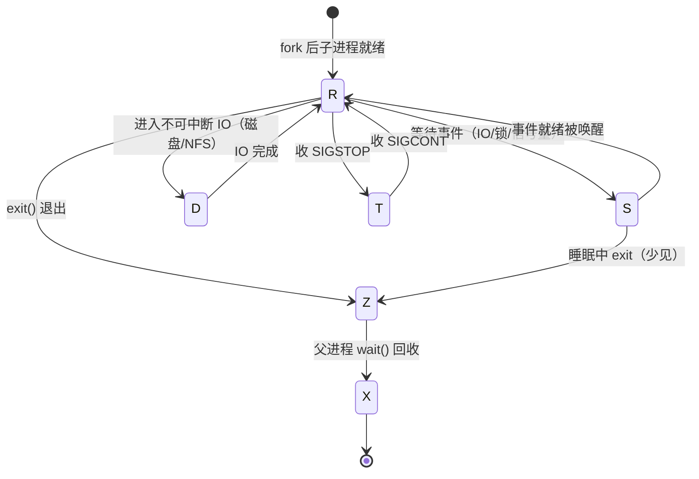
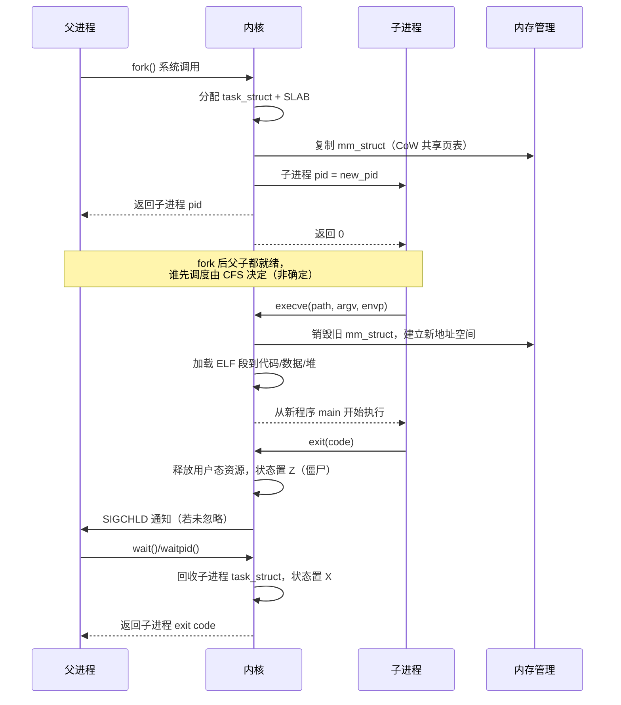
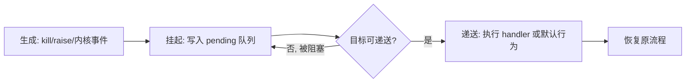
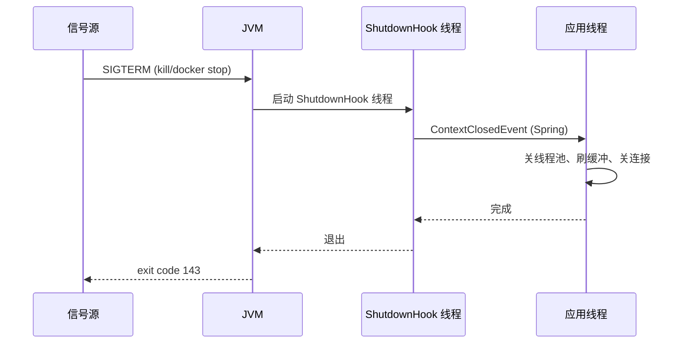

# 进程与线程

> **一句话定位**：进程是 Linux 调度的基本单位，task_struct 是它的全息画像，面试官爱从"讲讲进程状态机"切入。
> **面试热度**：⭐⭐⭐⭐⭐
> **返回**：[Linux 知识图谱](../README.md)

---

## 一、概述

### 1.1 主题在 Linux 体系中的位置

Linux 是一个**多进程**操作系统，内核以 `task_struct` 为核心数据结构描述每一个可调度实体（进程或线程）。进程这一抽象承上启下：向上承载用户程序与 JVM、向下消费 CPU/内存/IO。面试官问"讲讲进程状态机"看似基础，但它牵出 `task_struct` 字段、CFS 调度、信号机制、PID 1 陷阱——能讲清这些才证明你不只是会敲 `ps`。

本主题覆盖五条主线：**进程描述**（`task_struct` 关键字段、PID/TGID/LWP）、**生命周期**（状态机 R/S/D/T/Z/X、fork/exec/exit/wait）、**调度**（CFS 红黑树、vruntime、调度类、nice）、**线程模型**（Linux 线程 = LWP、`clone(CLONE_THREAD)`、TLS）、**信号机制**（标准/实时信号、默认行为、PID 1 信号陷阱）。

### 1.2 与其他主题的边界

| 主题 | 边界说明 |
|------|---------|
| [03 内存管理](../03-memory/memory-management.md) | 进程地址空间布局（用户/内核、代码/数据/堆/栈）归 03，本主题只点到 `mm_struct` 指针 |
| [04 IO 模型与 epoll](../04-io/io-model-and-epoll.md) | 进程在 IO 等待时进入 S/D 状态在本主题，**阻塞/非阻塞/多路复用模型本身**归 04 |
| [07 安全与权限](../07-security/security-and-permission.md) | 进程 credentials（uid/gid/capabilities）在本主题只点字段名，**判定逻辑**归 07 |

> **记住边界**：本主题讲进程"是什么、怎么调度、怎么通信（信号）"，不讲"地址空间长什么样、IO 怎么阻塞、权限怎么判"——那些是 03/04/07 的事。

### 1.3 关键术语速览

| 术语 | 一句话定义 | 出现阶段 |
|------|-----------|---------|
| `task_struct` | 内核描述进程的全息结构体（PCB），一个进程一个 | 进程描述 |
| PCB | 进程控制块，Linux 的 PCB 即 `task_struct` | 进程描述 |
| PID | 进程 ID，内核 `pid` 字段，用户态唯一标识 | 进程描述 |
| PPID | 父进程 ID，即创建者的 PID | fork |
| TGID | 线程组 ID，多线程主线程的 PID，等于 `tgid` 字段 | 线程模型 |
| LWP | 轻量级进程，Linux 线程的本质，每个线程一个 PID | 线程模型 |
| nice | 静态优先级偏移值（-20 到 19），值越大优先级越低 | CFS 调度 |
| oom_score | OOM killer 选主打分（0-1000），越高越先被杀 | OOM 关联 |
| 信号 | 内核/进程向另一进程发送的异步通知，编号 1-64 | 信号机制 |

---

## 二、核心机制

### 2.1 task_struct：进程的全息画像

`task_struct` 定义在 `include/linux/sched.h`（约 800 行的结构体，字段上千），是 Linux 唯一的进程描述符（PCB）。每个进程在内核空间有一个 `task_struct`，调度器、信号系统、内存管理、文件系统都从它取信息。

**关键字段表**（按子系统分组，面试只记这十几个）：

| 字段 | 类型 | 作用 |
|------|------|------|
| `pid` / `tgid` | pid_t | 内核 PID / 线程组 ID（用户态 getpid 返回 tgid） |
| `state` | volatile long | 进程状态（TASK_RUNNING 等） |
| `prio` / `static_prio` / `normal_prio` | int | 动态/静态/规范化优先级 |
| `policy` | unsigned int | 调度策略（SCHED_NORMAL/FIFO/RR/BATCH/IDLE） |
| `mm` | struct mm_struct * | 进程地址空间（线程共享） |
| `fs` | struct fs_struct * | 当前目录与根目录（线程共享） |
| `files` | struct files_struct * | 打开的文件描述符表（线程共享） |
| `signal` | struct signal_struct * | 信号处理共享结构（线程共享） |
| `parent` / `children` | task_struct * / list_head | 父进程 / 子进程链表 |
| `pending` | struct sigpending | 私有挂起信号队列 |

**线程共享语义**：`mm`/`fs`/`files`/`signal` 是**进程级共享**字段——同一线程组的所有 LWP 共享同一组，这就是"线程共享地址空间和文件描述符"的内核根因；而 `pid`/`state`/`prio`/`pending` 是**线程级私有**字段，每个 LWP 各自一份。

> **面试口径**：能说出"`task_struct` 在 `include/linux/sched.h`，关键字段按子系统分组，线程共享 `mm`/`files`/`signal` 而私有 `pid`/`state`/`pending`"就足够。高级岗可补一句"`task_struct` 太大（数 KB），内核用 SLAB 分配器缓存（`task_struct_cachep`），fork 时优先复用"。

### 2.2 进程状态机：R/S/D/T/Z/X 六状态

Linux 进程有六种状态（内核常量 → `ps` 显示字母）：

| 内核状态 | ps 显示 | 全称 | 含义 |
|---------|---------|------|------|
| `TASK_RUNNING` | `R` | Running/Ready | 可运行（就绪或在 CPU 上跑） |
| `TASK_INTERRUPTIBLE` | `S` | 可中断睡眠 | 等待事件，**可被信号唤醒** |
| `TASK_UNINTERRUPTIBLE` | `D` | 不可中断睡眠 | 等待 IO，**不响应信号**（kill -9 无效） |
| `__TASK_STOPPED` | `T` | 暂停 | 收 SIGSTOP/SIGTSTP，等 SIGCONT |
| `EXIT_ZOMBIE` | `Z` | 僵尸 | 已退出但父进程未 wait |
| `EXIT_DEAD` | `X` | 死亡 | 最终状态，即将被回收（瞬时） |

状态机转换图（面试常考）：



**关键转换**：① **R ↔ S**：进程调用阻塞 API（read/recv/sleep）转入 S，事件就绪（数据来/超时）转回 R，这是最高频路径；② **R → D**：进程在 `TASK_RUNNING` 调用某些 IO 操作（直接 IO、NFS）进入 D，**D 不响应任何信号**，`kill -9` 也无效，只能等 IO 完成或硬件复位；③ **R/S → Z**：进程 `exit()` 释放用户态资源后进入 Z，等待父进程 `wait()` 回收 `task_struct`；④ **Z → X**：父进程 `wait()` 后内核回收 `task_struct`，进程彻底消失。

**D 状态高频追问**：D = 不可中断睡眠，典型场景是磁盘 IO、NFS、内存回收（`lock_page`）。`kill -9` 无效是因为内核在 D 状态不检查信号 pending，只在返回 `TASK_RUNNING` 时才处理。D 状态堆积（`ps` 见大量 D）通常意味着磁盘慢或 NFS 卡死，排查用 `iostat`/`iotop` 看 IO 延迟，或 `cat /proc/<pid>/stack` 看内核栈卡在哪。

### 2.3 fork/exec/exit/wait：进程生命周期

`fork()` 创建子进程（CoW 复制父进程地址空间），`exec()` 加载新程序（地址空间被替换），`exit()` 退出，`wait()` 回收。完整时序：



**四个关键点**：

1. **fork 返回值**：fork 一次调用返回两次——父进程返回子进程 PID（>0），子进程返回 0，失败返回 -1。这是区分父子分支的标准写法。
2. **fork 后执行顺序不确定**：父子都进入 `TASK_RUNNING` 就绪队列，谁先被 CFS 调度谁先跑。**不要假设父先执行**——这是并发 bug 的常见根因。
3. **exec 不创建新进程**：exec 只替换地址空间和代码，PID 不变。exec 失败（如文件不存在）才返回 -1，成功不返回（直接跳到新程序入口）。
4. **exit 与 wait 的协作**：exit 释放用户态资源（地址空间、文件描述符）但保留 `task_struct`（含退出码），状态变 Z；父进程 wait 时内核才释放 `task_struct`。**父进程不 wait → 子进程变僵尸**。

> **延伸**：vfork 是 fork 的"轻量版"，父子共享地址空间、父进程阻塞直到子进程 exec 或 exit。现代 Linux 已不推荐 vfork，`posix_spawn` 和 `clone` 能更好替代。详见 man vfork(2)。

### 2.4 CFS 调度器：完全公平调度

CFS（Completely Fair Scheduler，2.6.23 引入）是 Linux 默认调度类，目标是"让每个进程公平分享 CPU"。核心数据结构与算法：

**三个关键概念**：
- **vruntime**：虚拟运行时间，CFS 按它排序，vruntime 小的先调度。实际运行时间 ÷ 权重（nice 越高权重越低）= vruntime 增量，**低优先级进程 vruntime 增长更快**，更快被调度器"放下"。
- **红黑树**：每个 CPU 一个，按 vruntime 排序，最左叶子（vruntime 最小）就是下一个被调度的进程。调度复杂度 O(log n)。
- **min_vruntime**：跟踪当前队列最小 vruntime，新进程初始化 vruntime 为 min_vruntime + 当前增量，防止新进程"饿死"老进程或"霸占"CPU。

**调度类层次**（优先级从高到低）：

| 调度类 | 策略 | 用途 | 可抢占 |
|--------|------|------|--------|
| `stop_sched_class` | - | 停机任务（迁移/热插拔） | 最高，不被抢占 |
| `dl_sched_class` | SCHED_DEADLINE | 实时截止时间（4.x+） | 高于 RT |
| `rt_sched_class` | SCHED_FIFO/SCHED_RR | 实时进程 | 高于 fair |
| `cfs_sched_class` | SCHED_NORMAL/SCHED_BATCH | 普通进程（默认） | 按公平 |
| `idle_sched_class` | SCHED_IDLE | 空闲任务（每 CPU 一个） | 最低 |

**nice 与权重映射**：nice 范围 -20 到 19（默认 0），不是直接调时间片而是调整**权重**（`prio_to_weight` 表，nice 0 权重 1024）。nice 每差 1，权重差约 25%（×1.25 或 ÷1.25）。nice -20 比 nice 0 权重高约 87 倍（88761 ÷ 1024 ≈ 86.7，与 ×1.25 的 20 次方一致）。

> **关键认知**：nice 调的是**权重比**（影响 vruntime 增长速度），不是直接的时间片长度。时间片是"当前周期内按权重分配的份额"，会随队列进程数变化。所以问"nice 调的是优先级还是时间片"——答案是"调权重，间接影响两者"。

### 2.5 线程模型：Linux 没有"线程"，只有 LWP

Linux 内核**没有专门的线程概念**——线程在内核层就是普通进程，只是多个"线程"通过 `clone()` 共享了 `mm`/`files`/`signal` 等字段。用户态说的"线程"在内核是 **LWP（Lightweight Process，轻量级进程）**，每个 LWP 有独立 `task_struct` 和 `pid`。

**创建线程的系统调用**：`clone()`，通过 flags 控制共享什么：

| flag | 共享对象 | 含义 |
|------|---------|------|
| `CLONE_THREAD` | 线程组 | 新进程加入当前线程组，tgid = 主线程 pid |
| `CLONE_VM` | 地址空间（`mm`） | 共享内存 |
| `CLONE_FILES` | 文件描述符表 | 共享 fd |
| `CLONE_SIGHAND` | 信号处理表 | 共享 signal handler |
| `CLONE_FS` | 文件系统信息 | 共享 cwd/root |
| `CLONE_SETTLS` | TLS | 设置线程本地存储 |

**pthread_create 的底层**：glibc 的 `pthread_create` 最终调 `clone(CLONE_THREAD|CLONE_VM|CLONE_FILES|CLONE_SIGHAND|CLONE_FS|CLONE_SETTLS, ...)`，创建一个共享几乎所有进程资源的 LWP。验证：

```bash
# 一个 Java 多线程程序，ps -eLf 能看到每个线程一个 LWP
ps -eLf | grep java | head
# UID  PID  PPID  LWP  C  NLWP  STIME  TTY  CMD
# app  1234  1    1234 0  50    ...    ?    java -jar app.jar
# app  1234  1    1235 0  50    ...    ?    java (GC 线程)
# app  1234  1    1236 0  50    ...    ?    java (业务线程)
```

**线程组与 PID/TGID**：多线程进程的 `tgid` 字段 = 主线程的 `pid`，用户态 `getpid()` 返回 `tgid`（全组一致），`gettid()` 返回 `pid`（每线程不同）。`ps` 默认按 tgid 聚合，`ps -L` 才显示每个 LWP。

**TLS（Thread-Local Storage）**：每个线程独立的存储区，通过 `CLONE_SETTLS` 设置，glibc `pthread_self()` 访问。Java 的 `ThreadLocal` 在用户态用 `Thread.threadLocals` 字段实现，与内核 TLS 不同层。

### 2.6 信号机制：异步通知的标准方式

信号是 Unix 最古老的 IPC，内核或进程可向另一进程发送异步通知，接收进程在信号到达时暂停当前流程执行 handler。

**信号类型表**（编号与含义）：

| 编号 | 名称 | 默认行为 | 常见来源 |
|------|------|---------|---------|
| 1 | SIGHUP | Term | 终端挂起，systemd 重载配置（`systemctl reload`） |
| 2 | SIGINT | Term | Ctrl+C |
| 3 | SIGQUIT | Core | Ctrl+\，JVM 收到打全栈 |
| 9 | SIGKILL | Term | 强杀，**不可捕获/忽略** |
| 15 | SIGTERM | Term | 优雅终止（`kill` 默认） |
| 17 | SIGCHLD | Ign | 子进程退出通知父进程 |
| 18 | SIGCONT | Cont | 继续（被 SIGSTOP 暂停后恢复） |
| 19 | SIGSTOP | Stop | 暂停，**不可捕获/忽略** |
| 20 | SIGTSTP | Stop | Ctrl+Z |

> **关键区分**：1-31 是**标准信号**（无排队，多次发送只计一次 pending，保留最后到达的）；32-63 是**实时信号**（SIGRTMIN-SIGRTMAX，排队，不丢失）。标准信号中，**SIGKILL(9) 和 SIGSTOP(19) 不可被捕获/忽略/阻塞**——这是内核安全兜底。

**默认行为五类**：① **Term** 终止（SIGTERM/SIGHUP/SIGINT）；② **Core** 终止并 dump core（SIGQUIT/SIGSEGV）；③ **Ign** 忽略（SIGCHLD/SIGURG）；④ **Stop** 暂停（SIGSTOP/SIGTSTP）；⑤ **Cont** 继续（SIGCONT）。

**信号生命周期**（生成 → 挂起 → 递送）：



> **关联**：信号在多线程进程的递送语义复杂——标准信号递送给整个进程，内核选一个不阻塞该信号的线程执行 handler。详见 [五、Java/容器关联](#五java容器关联) §5.4 的 JVM ShutdownHook。

### 2.7 PID 1 陷阱：信号保护与孤儿收养

PID 1（init/systemd）在内核有**特殊保护**：未注册 handler 的信号对 PID 1 默认忽略，防止误杀 init 导致系统崩溃。这个保护延续到容器（容器内 PID 1 也享受该保护），是容器优雅停机的常见坑。

**两个特殊职责**：
1. **孤儿进程收养者**：父进程先于子进程退出，子进程被重新挂到 PID 1 下（reparent），PID 1 负责 `wait()` 回收，避免僵尸堆积。
2. **信号处理者**：内核对 PID 1 的信号递送有特殊判定——除非 PID 1 自己 `signal(SIGTERM, handler)` 注册了 handler，否则 SIGTERM/SIGINT 默认忽略，只有 SIGKILL（不可捕获）能强杀。

**容器内的两个陷阱**：
- **陷阱一：Spring Boot fat jar 作 PID 1 未注册 handler**。早期 Spring Boot 默认不注册 SIGTERM handler，`docker stop` 发 SIGTERM 后等 10 秒超时强杀，导致 ShutdownHook 不执行、请求中断、数据丢失。
- **陷阱二：shell 包装作 PID 1 不转发信号**。`CMD ["sh", "-c", "java -jar app.jar"]` 让 sh 成为 PID 1，sh 默认不转发 SIGTERM 给 java 子进程，java 收不到信号，等 10 秒超时强杀。

**解决方案**：① **Dockerfile 用 exec 形式**：`ENTRYPOINT ["java", "-jar", "app.jar"]`，java 直接作 PID 1；② **注入 init 进程**：`docker run --init`（注入 tini 作 PID 1，转发信号并回收僵尸），java 作 PID 2；③ **Spring Boot 2.3+ 开启 graceful shutdown**：注册 SIGTERM handler，触发 `ContextClosedEvent` 优雅停机。

> **关联**：详见 [ops/docker 容器本质与底层原理](../docker/01-foundation/container-principle.md) §2.1 的 PID namespace 与信号陷阱，以及 [01 系统启动与运行时](../01-foundation/system-boot-and-runtime.md) §五的 KillMode 与 JVM ShutdownHook 协作。

---

## 三、命令与示例

### 3.1 命令族速查表

| 命令 | 作用 | 常用形式 |
|------|------|---------|
| `ps` | 查进程快照 | `ps -ef`/`ps aux`/`ps -eLf`/`ps -p <pid> -o pid,ppid,ni,stat,cmd` |
| `top` / `htop` | 实时进程监控 | `top -H -p <pid>`（看线程）/`top -p <pid>` |
| `pstree` | 进程树可视化 | `pstree -p`（带 PID）/`pstree -ap <pid>` |
| `pgrep` / `pkill` | 按名查/杀进程 | `pgrep -f 'java.*app'`/`pkill -SIGTERM -f nginx` |
| `kill` / `killall` | 发信号 | `kill -TERM <pid>`/`kill -9 <pid>`/`killall nginx` |
| `nice` / `renice` | 调优先级 | `nice -n 10 ./cmd`/`renice -n -5 -p <pid>` |
| `taskset` | CPU 亲和 | `taskset -p <mask> <pid>`/`taskset -c 0,1 ./cmd` |
| `strace` | 跟踪系统调用 | `strace -p <pid>`/`strace -f -e trace=signal ./cmd` |

### 3.2 实战 one-liner

```bash
# 1. 按优先级排序查看进程（nice 越低越靠前）
ps -eo pid,ppid,ni,stat,cmd --sort=-ni | head -20

# 2. 进程树可视化（带 PID）
pstree -p $(pgrep -f 'spring' | head -1)

# 3. 批量杀匹配进程（-f 全命令行匹配）
kill -SIGTERM $(pgrep -f 'java.*app')

# 4. 实时看某进程的所有线程（top -H 显示 LWP）
top -H -p <pid>

# 5. 调整运行中进程的 nice
renice -n -5 -p 12345

# 6. 把进程绑定到 CPU 0 和 1
taskset -cp 0,1 12345

# 7. 查某进程打开了哪些文件（含网络 socket）
lsof -p <pid> | head -30

# 8. 查某进程监听的端口
ss -tlnp | grep <pid>

# 9. 跟踪某进程的系统调用（看它卡在哪个 syscall）
strace -p <pid> -f -e trace=network

# 10. 看某进程的 pending 信号与 mask
cat /proc/<pid>/status | grep -E 'Sig|State|Uid'
```

### 3.3 命令输出解读

**top 字段**（最常考）：

| 字段 | 含义 | 面试关注点 |
|------|------|-----------|
| `PR` | 优先级（内核 prio - 100，RT 是负数） | `rt` 前缀 = 实时进程 |
| `NI` | nice 值（-20 到 19） | 越低越优先，普通进程可调 |
| `VIRT` | 虚拟内存大小（含映射库/堆保留） | 不等于实际占用 |
| `RES` | 常驻物理内存（RSS） | 实际占内存的指标 |
| `SHR` | 共享内存（库/IPC） | 含在 RES 内 |
| `S` | 状态列（R/S/D/T/Z） | 见 2.2 状态机 |
| `%CPU` | CPU 占比（单核 100%，4 核满载 400%） | top -H 定位线程 |
| `%MEM` | 占物理内存百分比 | RES / 总内存 |
| `TIME+` | 累计 CPU 时间 | 不含睡眠时间 |

**ps 状态列**：与 top 的 S 字段同义，R/S/D/T/Z/X，详见 2.2 状态机。

**/proc/\<pid\>/status 关键字段**：

```bash
$ cat /proc/12345/status | grep -E '^(Name|State|Pid|PPid|Tgid|Uid|Threads|Sig)'
Name:   java
State:  S (sleeping)           # 见 2.2 状态机
Tgid:   12345                  # 线程组 ID（用户态 getpid）
Pid:    12345                  # 内核 PID（主线程 = Tgid）
PPid:   1                      # 父进程
Uid:    1000 1000 1000 1000    # real/effective/saved/fs
Threads: 50                    # 线程数（LWP 数）
SigQ:    0/12345                # pending/limit 信号队列
SigPnd:  0000000000000000      # 私有 pending（位图）
SigBlk:  0000000000000000      # 阻塞信号
SigIgn:  0000000000001000      # 忽略信号（位图，bit 13 = SIGPIPE）
SigCgt:  0000000180000000      # 捕获信号（注册了 handler）
```

> **技巧**：`SigPnd`/`SigBlk`/`SigIgn`/`SigCgt` 是 64 位十六进制位图，每位对应一个信号编号。查 JVM 的 `SigCgt` 位可验证它是否注册了 SIGTERM handler——bit 15（SIGTERM）置 1 表示已捕获。

---

## 四、高频追问

### Q1：进程有哪些状态？D 状态是什么？能 kill -9 吗？

**参考答案**：六种状态（见 2.2 状态机）：R（运行/就绪）、S（可中断睡眠）、D（不可中断睡眠）、T（暂停）、Z（僵尸）、X（死亡，瞬时）。**D 状态不可被 kill -9 杀**——D 是 `TASK_UNINTERRUPTIBLE`，内核不检查信号 pending，只等待 IO 完成或硬件复位。`kill -9` 只把信号写入 pending 队列，进程从 D 返回 R 时才会处理，若永远不返回（NFS 卡死、磁盘故障）则永远杀不掉。D 状态堆积（`ps` 见大量 D）通常意味着磁盘慢或 NFS 卡死，排查方向是 `iostat`/`iotop` 看 IO 延迟，或 `cat /proc/<pid>/stack` 看内核栈卡在哪。

### Q2：僵尸进程怎么产生的？怎么清理？

**参考答案**：子进程 `exit()` 后释放用户态资源但保留 `task_struct`（含 exit code），状态置 Z，等父进程 `wait()` 回收。**父进程不 wait → 子进程变僵尸**，僵尸不占内存（只有 task_struct，数 KB）但占 PID。清理方法：① 找僵尸的父进程：`ps -o ppid= -p <zombie_pid>`；② 让父进程回收：给父进程发 SIGCHLD 或重启它（重启时 init 收养僵尸并回收）；③ 杀父进程：父进程死后僵尸被 PID 1 收养并自动回收。预防：父进程用 `signal(SIGCHLD, SIG_IGN)` 显式忽略，内核自动回收子进程；或用 `waitpid` 配合 SIGCHLD handler。

### Q3：fork 之后子进程的执行顺序？

**参考答案**：**不确定**。fork 后父子都进入 `TASK_RUNNING` 就绪队列，谁先被 CFS 调度谁先跑，由 vruntime 和 CPU 队列决定，**不要假设父先执行**。这是并发 bug 的常见根因——如果代码依赖"父先于子"，必须用同步原语（管道/信号量/eventfd）显式同步。历史教训：早期 BSD 的 `vfork` 假设父阻塞到子 exec，但语义复杂已被弃用；现代代码用 `posix_spawn` 或 `clone` 显式控制。

### Q4：Linux 线程和进程的区别？为什么说 Linux 没有"线程"？

**参考答案**：**Linux 内核没有专门的线程概念**——线程在内核层就是普通进程（`task_struct`），只是多个"线程"通过 `clone(CLONE_VM|CLONE_FILES|...)` 共享了地址空间和文件描述符。用户态说的"线程"在内核是 **LWP（轻量级进程）**，每个 LWP 有独立 `pid`，但共享 `tgid`（线程组 ID）。用户态 `getpid()` 返回 tgid（全组一致），`gettid()` 返回 pid（每线程不同）。这就是"Linux 没有线程"的由来——内核只有进程，"线程"是用户态对"共享资源的进程组"的抽象。验证：`ps -eLf` 看一个 Java 进程，每个线程一个 LWP 行，PID 相同但 LWP 不同。

### Q5：CFS 调度器原理？nice 调整的是优先级还是时间片？

**参考答案**：CFS 用红黑树按 vruntime 排序，vruntime 小的先调度，最左叶子是下一个被调度的进程。vruntime = 实际运行时间 ×（参考权重 ÷ 进程权重），低优先级进程 vruntime 增长更快，更快被"放下"。**nice 调的是权重**（`prio_to_weight` 表，nice 0 = 1024，每差 1 ×1.25 或 ÷1.25），不是直接调时间片。时间片是"当前周期内按权重分配的份额"，会随队列进程数变化。所以问"nice 调的是优先级还是时间片"——答案是"调权重，间接影响两者"：权重高 → vruntime 增长慢 → 被调度次数多 → 实际时间片长。

### Q6：kill -9 和 kill -15 有什么区别？为什么 PID 1 默认不被 kill -15 杀？

**参考答案**：kill -9 是 SIGKILL，内核默认行为 Term，**不可捕获/忽略/阻塞**，是强杀兜底；kill -15 是 SIGTERM，默认行为 Term，**可被捕获**，应用可注册 handler 做清理（JVM ShutdownHook、Spring graceful shutdown）。**PID 1 默认不被 kill -15 杀**：内核对 PID 1 有特殊保护——**未注册 handler 的信号对 PID 1 默认忽略**，防止误杀 init 导致系统崩溃。要让 PID 1 响应 SIGTERM，必须 PID 1 自己 `signal(SIGTERM, handler)` 注册。容器继承了这个保护——Spring Boot fat jar 作 PID 1 若不注册 handler，`docker stop` 发 SIGTERM 等于无效，10 秒后强杀。

### Q7：孤儿进程和僵尸进程的区别？

**参考答案**：**孤儿进程**：父进程先于子进程退出，子进程被 reparent 到 PID 1（init/systemd），PID 1 负责回收——孤儿不是问题，是正常生命周期。**僵尸进程**：子进程先于父进程退出，父进程未 `wait()` 回收，子进程 `task_struct` 残留状态 Z——僵尸是问题，占 PID 不释放。一句话：孤儿是"父死了子还活着"，僵尸是"子死了父不收尸"。容器内的坑：容器 PID 1 若不是 init（如 java），**不自动回收孤儿**——子线程 fork 出去的孙进程若父线程退出，会变僵尸挂在 java PID 1 下，java 不 wait 就堆积。这就是 `docker run --init` 注入 tini 的核心价值——tini 作 PID 1 负责收尸。

### Q8：线程池里一个线程 OOM 了其他线程会怎样？

**参考答案**：**其他线程继续运行**。OOM（OutOfMemoryError）是 JVM 内的异常，不是内核信号，只抛在触发它的线程上，JVM 不退出。但有几个连带影响：① 触发 OOM 的线程若没 catch，线程终止，线程池会新建一个补上（默认 `ThreadPoolExecutor` 的 worker 终止后会补）；② 堆内存仍是满的，新线程也可能立刻 OOM；③ 若 OOM 是 Native 内存超 cgroup，内核 OOM killer 会直接 SIGKILL 整个 JVM，所有线程一起死。区分：JVM OOM（堆）= 单线程异常，内核 OOM killer（cgroup 超限）= 整进程被杀。详见 [03 内存管理](../03-memory/memory-management.md) 的 OOM killer 选主。

### Q9：怎么查看一个进程打开了哪些文件？哪些端口？

**参考答案**：两个命令：① **文件**：`lsof -p <pid>` 列出所有 fd（含普通文件、socket、管道、设备）；② **端口**：`ss -tlnp | grep <pid>`（或 `netstat -tlnp`）列出监听端口，`ss -tnp` 列出已建立连接。底层是 `/proc/<pid>/fd/` 目录（每个 fd 一个符号链接）和 `/proc/<pid>/net/tcp`（TCP 连接表）。实战排障：服务起不来报 "Address already in use"，用 `ss -tlnp | grep :<port>` 找占用者，`lsof -i :<port>` 也能查。

### Q10：多线程程序怎么排查哪个线程吃 CPU？

**参考答案**：三步定位法（Java 经典面试题）：

1. `top -H -p <pid>` 看哪个 LWP（线程）CPU 高，记下 TID。
2. `printf '%x\n' <tid>` 把十进制 TID 转十六进制（jstack 输出是 nid=0x...）。
3. `jstack <pid> | grep -A 30 <hex_tid>` 找到对应线程栈，看它在跑什么代码。

```bash
# 1. 找 CPU 高的线程
top -H -p 12345
#   PID  USER  PR NI %CPU ...
#   12350 app  20 0 95  ...

# 2. TID 转十六进制
printf '%x\n' 12350
#   303e

# 3. jstack 找栈
jstack 12345 | grep -A 30 'nid=0x303e'
#   "http-nio-8080-exec-3" #25 daemon prio=5 os_prio=0 tid=... nid=0x303e runnable
#   at com.example.Service.heavyCalc(Service.java:42)
```

> **关联**：详见 [六、故障排查案例](#六故障排查案例) §6.1 的完整实战。

### Q11：容器内 PID 1 是什么？为什么 Spring Boot fat jar 的 PID 1 有坑？

**参考答案**：容器内 PID 1 是 entrypoint 进程（如 `java -jar app.jar`），**不是 systemd**——容器只跑一个进程组，PID 1 的"拉服务/限资源/失败重启"职责交给了 docker/K8s。Spring Boot fat jar 的坑有两个：① **PID 1 信号保护**：内核对未注册 handler 的信号默认忽略，Spring Boot 早期不注册 SIGTERM handler，`docker stop` 等于无效，10 秒后强杀，ShutdownHook 不执行；② **孤儿回收**：java PID 1 不自动 wait 子进程，子进程退出变僵尸堆积。解决：`docker run --init`（注入 tini）+ Spring Boot 2.3+ 开启 `server.shutdown=graceful`。详见 [五、Java/容器关联](#五java容器关联) §5.5。

### Q12：CPU 亲和性怎么设置？对 Java 线程池有什么影响？

**参考答案**：CPU 亲和（CPU affinity）让进程/线程绑定到特定核，减少缓存失效。设置：① `taskset -c 0,1 ./cmd` 启动时绑定；② `taskset -p <mask> <pid>` 运行中改；③ `sched_setaffinity` syscall（代码层）。对 Java 的影响：① **ForkJoinPool 并行度**：默认 `Runtime.getRuntime().availableProcessors()`，若容器 CPU 限制 2 核但 JVM 探测失败看到 8 核，会起 8 个 worker 线程但实际只能跑 2 个，上下文切换开销大——用 `-XX:ActiveProcessorCount=2` 显式指定；② **parallelStream**：默认用公共 ForkJoinPool，并行度 = CPU 数，若 nice 高或 CPU 限制严，并行任务反而比串行慢；③ **GC 线程**：G1/ZGC 的 GC 线程数也按 CPU 数推算，容器内可能起过多 GC 线程。详见 [五、Java/容器关联](#五java容器关联) §5.2。

---

## 五、Java/容器关联

### 5.1 Java 线程 = Linux LWP

Java 的 `java.lang.Thread` 在内核层就是一个 LWP（轻量级进程），通过 glibc `pthread_create` → `clone(CLONE_THREAD|CLONE_VM|...)` 创建。每个 Java 线程有独立 `task_struct` 和 `pid`，但共享 `tgid`（即 `Thread.currentThread().getId()` 不等于内核 pid，而是 JVM 内部分配的 tid）。

**验证映射**：

```bash
# 启动一个多线程 Java 程序
java -jar app.jar &

# 看主进程
ps -ef | grep java
#   app 12345 1 ... java -jar app.jar

# 看所有线程（LWP）
ps -eLf | grep 12345
#   app 12345 1 12345 ... java (main)
#   app 12345 1 12350 ... java (GC Thread)
#   app 12345 1 12351 ... java (http-nio-8080-exec-1)

# 看线程数
cat /proc/12345/status | grep Threads
#   Threads: 50
```

**关键认知**：`Thread.getId()` 返回的是 JVM 内部 tid（从 0 递增），不等于内核 pid。要找内核 pid，用 `jstack <pid> | grep -A 5 <thread_name>` 拿 nid（十六进制），再 `printf '%d\n' 0x<nid>` 转十进制。

### 5.2 ForkJoinPool 与 CPU 亲和（关联 java-core/forkjoin）

`ForkJoinPool` 的并行度（parallelism）默认 = `Runtime.getRuntime().availableProcessors()`，每个 worker 线程是一个 LWP，受 CFS 调度。问题：① 容器内 JVM 若探测失败（cgroup v2 + 老 JDK），看到宿主机 CPU 数，会起过多 worker，实际只能跑几个，上下文切换开销大；② nice/CPU limit 高的 ForkJoinPool 任务会被 CFS 降权，vruntime 增长快，被频繁抢占，并行任务反而比串行慢。

**推荐配置**：

```bash
# 容器内显式指定 CPU 数
java -XX:ActiveProcessorCount=4 -jar app.jar

# 或 ForkJoinPool 显式并行度
ForkJoinPool pool = new ForkJoinPool(4);  // 不依赖 Runtime
```

> **关联**：`java-core/forkjoin` 模块有 ForkJoinPool 的源码实例（`com.yintp.forkjoin.*`），对照理解 worker 线程窃取（work-stealing）与 CFS 调度的交互。

### 5.3 parallelStream 与 nice/CPU limit 的冲突

`parallelStream` 默认用**公共 ForkJoinPool**（`ForkJoinPool.commonPool()`），并行度 = CPU 数 - 1。两个陷阱：① **阻塞公共池**：parallelStream 里调阻塞 IO（如 HTTP 调用），会占满公共池 worker，影响其他 parallelStream 任务（如 `list.parallelStream().map(...)`）；② **与 CPU limit 冲突**：容器 CPU 限制 2 核但 JVM 看到 8 核，公共池起 7 个 worker，每个都吃 CPU，触发 cgroup CPU 限流（throttling），parallelStream 反而比串行慢。

**实战建议**：① parallelStream 只用于 CPU 密集且非阻塞任务；② 阻塞任务用独立 `ForkJoinPool` 或 `CompletableFuture.supplyAsync` + 显式线程池；③ 容器内用 `-XX:ActiveProcessorCount` 显式指定。

> **关联**：详见 [04 IO 模型与 epoll](../04-io/io-model-and-epoll.md) 的 parallelStream 阻塞陷阱，以及 `java-core/forkjoin`、`java-core/stream` 的源码实例。

### 5.4 JVM ShutdownHook 与 SIGTERM/SIGINT

JVM 注册了 SIGTERM（15）、SIGINT（2）、SIGHUP（1）的 handler，收到后启动 ShutdownHook 线程，触发 Spring 的 `ContextClosedEvent`，关线程池、刷缓冲、关连接。



**关键点**：① SIGKILL（9）不触发 ShutdownHook，直接杀 JVM；② ShutdownHook 有超时（cgroup `TimeoutStopSec` 或 JVM 内部限制），超时被 SIGKILL；③ 多个 ShutdownHook 并发执行，无顺序保证。关联 `java-core/jvm`：该模块的类初始化实例（`com.yintp.jvm.classinit.*`）涉及 JVM 生命周期，可对照理解 ShutdownHook 触发时机。

> **关联**：[01 系统启动与运行时](../01-foundation/system-boot-and-runtime.md) §5.2 的 KillMode=control-group 与 JVM ShutdownHook 协作。

### 5.5 容器 PID 1 陷阱与 Spring Boot graceful shutdown

容器内 PID 1 享受内核信号保护——未注册 handler 的信号默认忽略。Spring Boot 2.3+ 内建 graceful shutdown，注册 SIGTERM handler：

```yaml
# application.yml
server:
  shutdown: graceful              # 开启优雅停机
spring:
  lifecycle:
    timeout-per-shutdown-phase: 30s   # 等待最多 30s
```

**Dockerfile 最佳实践**：

```dockerfile
# 用 exec 形式，让 java 直接作 PID 1
ENTRYPOINT ["java", "-jar", "app.jar"]
# 或注入 init 进程（推荐生产用）
# docker run --init myapp
```

**K8s 优雅停机**：

```yaml
# pod.yaml
spec:
  terminationGracePeriodSeconds: 30   # 等待 30s 再发 SIGKILL
  containers:
  - name: app
    lifecycle:
      preStop:
        exec:
          command: ["sh", "-c", "sleep 5"]  # 给负载均衡器摘节点时间
```

> **关联**：`ops/docker` 的 [容器本质与底层原理](../docker/01-foundation/container-principle.md) §2.1 PID namespace 与信号陷阱；`framework/spring-framework` 的 `ContextClosedEvent` 与 `@PreDestroy` 执行顺序实例。

### 5.6 实战映射表

| 场景 | Linux 知识点 | Java/容器关联 |
|------|-------------|--------------|
| Java 线程数高 | LWP 与 task_struct | §5.1 `ps -eLf` 可见每个 Java 线程 |
| ForkJoinPool 过多 worker | CFS 调度与 nice | §5.2 用 `-XX:ActiveProcessorCount` 显式指定 |
| parallelStream 阻塞 | 公共 ForkJoinPool 与 IO | §5.3 阻塞任务用独立线程池 |
| docker stop 数据丢失 | PID 1 信号保护 | §5.5 `--init` 注入 tini + Spring graceful |
| K8s Pod 优雅停机 | SIGTERM + ShutdownHook | §5.5 `terminationGracePeriodSeconds` + preStop |
| JVM OOM vs 内核 OOM | 信号 vs OOM killer | §Q8 JVM OOM 单线程，内核 OOM 整进程 |

---

## 六、故障排查案例

### 6.1 案例：Java 服务 CPU 100%，top -H + jstack 定位热点线程

**现象**：Java 服务 CPU 持续 100%，请求变慢。

**排障链**：

```bash
# 1. 找 CPU 高的进程
$ top
#   PID  USER  ...  %CPU  ...
#   12345 app   ...  100  ... java -jar app.jar

# 2. 看该进程的线程（-H 显示 LWP）
$ top -H -p 12345
#   PID    USER  PR  NI %CPU  ...
#   12350  app   20  0  95   ... java
#   12351  app   20  0  3    ... java

# 3. 把高 CPU 线程的 TID 转十六进制
$ printf '%x\n' 12350
#   303e

# 4. jstack 找栈
$ jstack 12345 | grep -A 30 'nid=0x303e'
#   "http-nio-8080-exec-3" #25 daemon prio=5 os_prio=0 tid=... nid=0x303e runnable
#   at com.example.Service.heavyCalc(Service.java:42)
#   at java.util.stream.ReferencePipeline$Head.forEach(...)

# 5. 根因：parallelStream 里的 heavyCalc 被密集调用
# 优化：改用串流或限流 + 缓存
```

**方法论**：① `top` 找高 CPU 进程；② `top -H -p <pid>` 找高 CPU 线程 TID；③ `printf '%x\n'` 转十六进制；④ `jstack | grep` 找栈。这个三步法是 Java 后端最经典的 CPU 排障套路。

### 6.2 案例：容器内 kill -TERM 1 不生效，定位 PID 1 未注册信号 handler

**现象**：`docker stop myapp` 等 10 秒后强杀，ShutdownHook 未执行，请求中断。

**排障链**：

```bash
# 1. 进容器看 PID 1 是谁
$ docker exec myapp ps -ef
#   UID  PID  PPID  C  STIME  CMD
#   app  1    0     0  ...    java -jar app.jar   # java 作 PID 1

# 2. 看信号 handler 注册情况
$ docker exec myapp cat /proc/1/status | grep -E 'Sig'
#   SigPnd: 0000000000000000      # 无 pending
#   SigBlk: 0000000000000000      # 无阻塞
#   SigIgn: 0000000000001000      # 忽略 SIGPIPE（bit 13）
#   SigCgt: 0000000180000000      # 捕获了 SIGINT(bit 2)，但没捕获 SIGTERM(bit 15)

# 3. 根因：JVM 未注册 SIGTERM handler（老版本 Spring Boot）
# 验证：发 SIGTERM 不响应
$ docker exec myapp kill -TERM 1
$ docker exec myapp ps -p 1
#   PID TTY STAT TIME CMD
#   1   ?   S    0:00 java -jar app.jar   # 仍存活

# 4. 解决：注入 tini + Spring Boot 2.3+ graceful
$ docker run -d --init myapp:latest
$ docker exec myapp ps -ef
#   app  1  0 ... tini java -jar app.jar    # tini 作 PID 1
#   app  2  1 ... java -jar app.jar          # java 作 PID 2，tini 转发信号

# 5. 验证：kill -TERM 1 现在生效
$ docker stop myapp
#   1.5s 内优雅退出（ShutdownHook 执行）
```

**方法论**：① 确认 PID 1 是谁（java / sh / tini）；② 查 `/proc/1/status` 的 SigCgt 位图验证 handler 注册；③ 用 `docker run --init` 注入 tini 转发信号；④ Spring Boot 2.3+ 开启 graceful shutdown。关联 [ops/docker 容器本质与底层原理](../docker/01-foundation/container-principle.md) §2.1 PID namespace 与信号陷阱。

---

> **返回**：[Linux 知识图谱](../README.md)
