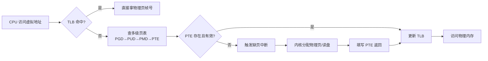
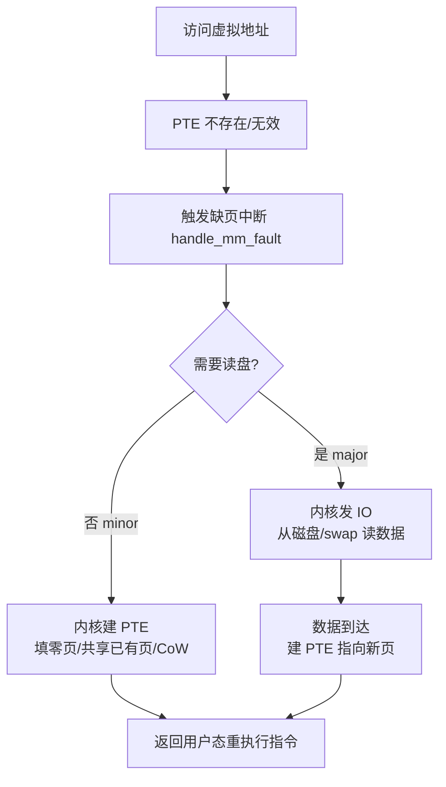
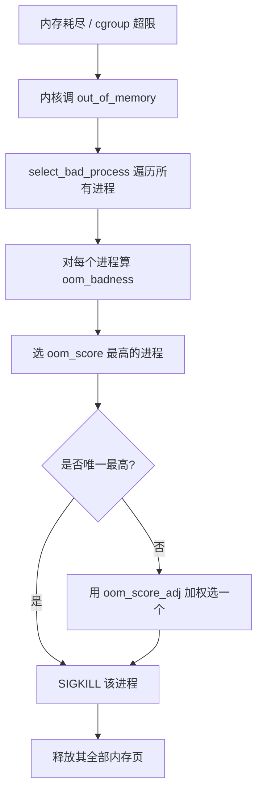
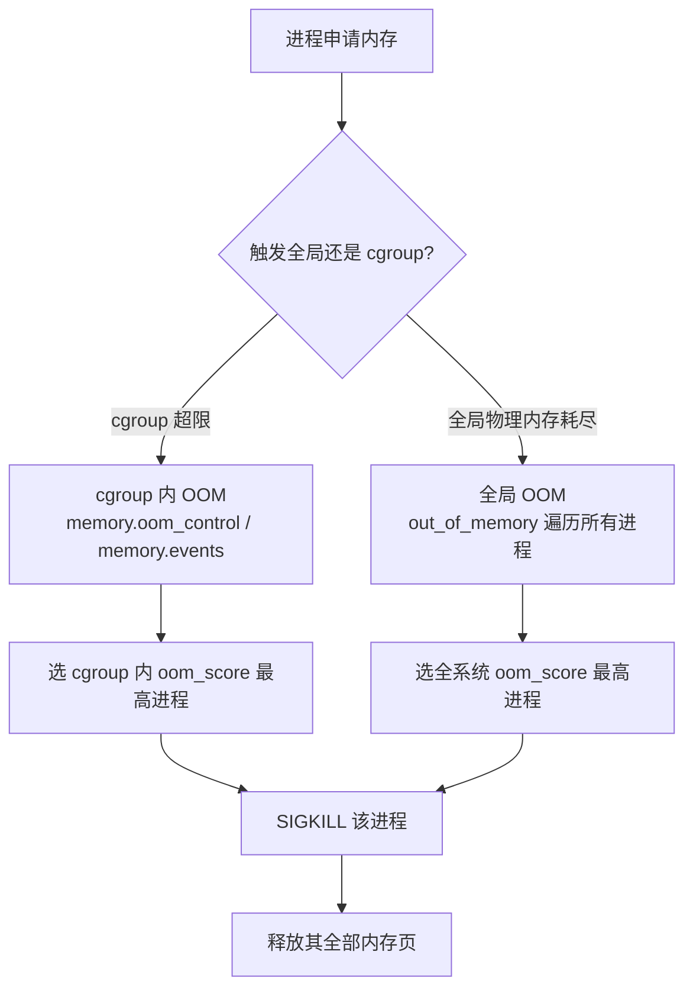

# 内存管理

> **一句话定位**：内存是 Java 后端面试的高频区，OOM killer 选主策略和 JVM 堆感知是两个必考点。
> **面试热度**：⭐⭐⭐⭐⭐
> **返回**：[Linux 知识图谱](../README.md)

---

## 一、概述

### 1.1 主题在 Linux 体系中的位置

Linux 内存的本质是一条**虚拟地址 → 物理页帧**的翻译链，加上一套在物理内存紧张时回收页面的机制。面试官问"讲讲 Linux 内存管理"看似宽泛，但它精准牵出三个区分点：虚拟内存与多级页表、缺页中断、OOM killer 选主——能讲清这些，才证明你不只是会敲 `free`。

本主题覆盖六条主线：**虚拟内存**（多级页表、TLB、缺页）、**进程地址空间**（text/data/bss/heap/mmap/stack）、**分配器**（伙伴系统 + slub）、**回收**（swap/swappiness、kswapd、zswap/zram）、**OOM killer**（选主打分、`oom_score_adj`）、**指标**（RSS/PSS/USS、`/proc/meminfo`、`smaps`）。

### 1.2 与其他主题的边界

| 主题 | 边界说明 |
|------|---------|
| [02 进程与线程](../02-process/process-and-thread.md) | `task_struct` 的 `mm` 指针指向 `mm_struct`（地址空间根）在 02 点到为止，**地址空间布局、缺页、RSS 定义**归 03 |
| [04 IO 模型与 epoll](../04-io/io-model-and-epoll.md) | Page Cache 作为文件 IO 缓存在本主题只讲**归属与回收**，**读写路径、脏页 writeback、mmap 与 epoll 交互**归 04 |
| [09 性能与故障排查](../09-ops/performance-and-troubleshooting.md) | `free`/`vmstat`/`pmap` 作为内存观测工具在本主题讲用法，**完整 USE 方法论、内存泄漏端到端排障**归 09 |

> **记住边界**：本主题讲内存"怎么映射、怎么分配、怎么回收、怎么看指标"，不讲"地址空间字段在 task_struct 的位置（02）、Page Cache 读写路径（04）、内存泄漏完整排障四步法（09）"。

### 1.3 关键术语速览

| 术语 | 一句话定义 | 出现阶段 |
|------|-----------|---------|
| 虚拟内存 | 每个进程看到的独立线性地址空间，由页表映射到物理页 | 虚拟内存 |
| 物理内存 | 实际 RAM 页帧，以 4KB 为基本单位（页） | 伙伴系统 |
| 页表 | 虚拟地址 → 物理地址的映射表，x86_64 四级（PGD/PUD/PMD/PTE） | 虚拟内存 |
| TLB | CPU 内的页表缓存，缓存最近使用的 PTE，miss 时查内存页表 | 虚拟内存 |
| 缺页（fault） | 访问的虚拟页未映射到物理页，触发中断由内核处理 | 缺页中断 |
| major fault | 缺页需从磁盘/swap 读数据（慢） | 缺页中断 |
| minor fault | 缺页只需建映射无需读盘（如 CoW、零页）（快） | 缺页中断 |
| swap | 把不活跃的匿名页写入交换区（磁盘/zram），腾出物理内存 | 回收 |
| swappiness | 内核回收匿名页 vs 文件页的倾向度（0-200，默认 60） | 回收 |
| OOM killer | 物理内存耗尽时内核选一个进程 SIGKILL 的兜底机制 | OOM |
| 伙伴系统 | 物理页帧分配器，按 2 的幂次方阶数管理空闲块 | 分配器 |
| slub | slub 分配器，在伙伴系统之上分配小对象（task_struct/sk_buff 等） | 分配器 |
| RSS | 常驻物理内存，含共享库等共享页 | 指标 |
| PSS | 按比例分摊共享页后的实际占用（RSS - 共享 + 共享/n） | 指标 |
| USS | 独占物理内存，进程独有不被共享的部分 | 指标 |
| mmap | 内存映射，把文件或匿名区域映射到进程地址空间 | mmap |

---

## 二、核心机制

### 2.1 虚拟内存到物理内存的映射

每个进程有独立的虚拟地址空间（x86_64 默认 48 位，128TB 用户态 + 128TB 内核态，5 级页表 57 位时达 PB 级）。CPU 访问内存时先查 TLB，miss 再走多级页表：



**四个关键点**：① **TLB 是性能关键**——CPU 每次访存都要查页表，TLB miss 会查 4 次内存（四级页表），所以内核尽量用大页（THP 4KB→2MB）减少 PTE 条目数，降低 TLB miss；② **多级页表省内存**——并非所有虚拟地址都映射，未映射的区域 PTE 不存在，比"一维页表全分配"省几个数量级；③ **缺页是惰性分配的根**——`malloc` 只分配虚拟地址区间，真正写时才触发缺页分配物理页（demand paging）；④ **内核态与用户态共享同一套页表**——内核空间在所有进程页表中映射同一区域（`[0xffff888000000000, ...]` 直接映射区），切换进程时只换用户态部分。

### 2.2 进程地址空间布局

每个进程的虚拟地址空间由 `mm_struct`（`include/linux/mm_types.h`）描述，按 VMA（Virtual Memory Area，`struct vm_area_struct`）划分：

```
高地址（内核空间，所有进程共享）
─────────────────────────────────────── 0x7fffffffffff（48 位用户态顶）
│ 栈 stack（向下生长，RLIMIT_STACK）     │ ← argc/envp 在最顶
│   ↓                                   │
│   （空隙）                             │
│ mmap 区（向下生长，含文件映射/匿名映射）│ ← 大对象/堆外内存在此
│   ↑                                   │
│   （空隙）                             │
│ 堆 heap（向上生长，brk/sbrk）          │
│ bss（未初始化全局变量，零页）          │
│ data（已初始化全局变量）                │
│ text（代码段，只读执行）               │
─────────────────────────────────────── 0x400000（x86_64 默认）
低地址
```

**Java 进程映射**：JVM 堆（`-Xmx`）通过 `mmap` 匿名映射分配，落在 mmap 区；Metaspace 同样是 mmap 匿名映射；DirectByteBuffer 调 `malloc` 在堆外，落 C 堆（仍是 mmap 管理的 brk/mmap 区）；线程栈每个线程独立 mmap 一段，落在栈区附近。所以 JVM 内存预算 = 堆 + Metaspace + 直接内存 + 线程栈 × N + Code Cache + GC 内部结构，远不止 `-Xmx`。

**查看某进程的 VMA 布局**：

```bash
$ cat /proc/12345/maps | head -20
00400000-01000000 r-xp ... /opt/jdk/bin/java      # text
01000000-01020000 r--p ... /opt/jdk/bin/java      # rodata
01020000-01040000 rw-p ... /opt/jdk/bin/java      # data/bss
7f0000000000-7f0020000000 rw-p ...                 # JVM 堆 mmap（anon）
7f0020000000-7f0021000000 rw-p ...                # Metaspace mmap（anon）
7fffa0000000-7fffa8000000 rw-p ...                # 线程栈
ffffffffff600000-ffffffffff601000 r-xp ...         # vsyscall（内核映射）
```

每行一个 VMA，字段：起止地址、权限（r/w/x/p）、偏移、设备号、inode、文件路径（匿名映射无）。`pmap -x <pid>` 是同样信息的可读化输出。

### 2.3 缺页中断处理流程

CPU 访问的虚拟页在 PTE 中不存在或无权限时触发缺页中断，由 `mm/memory.c` 的 `handle_mm_fault()` 处理：

| 缺页类型 | 触发条件 | 处理 | 耗时 |
|---------|---------|------|------|
| minor fault | 首次访问匿名页（零页）/ CoW 页 / 文件页已在 Page Cache | 内核建 PTE、填零页或共享现有页 | 微秒级 |
| major fault | 文件页不在 Page Cache（需读盘）/ 匿名页在 swap 中 | 内核发 IO 读盘/读 swap，再建 PTE | 毫秒级 |

**minor fault 高频场景**：① `malloc` 后首次写——分配虚拟地址但未映射，写时触发 minor fault 分配零页；② `fork` 后父子写——CoW，写时复制一页；③ `exec` 后首次执行——text 段映射到已缓存的文件页。**major fault 高频场景**：① 启动时冷读二进制/库（`filefault`）；② swap 回读——匿名页被换出到 swap，访问时从磁盘读回。

两类缺页的处理流程对比：



**查看某进程的缺页数**：`grep -E 'min_flt|maj_flt' /proc/<pid>/stat`（第 10 字段 minor、第 12 字段 major），或 `ps -o min_flt,maj_flt -p <pid>`。排查"服务启动慢"常发现是大量 major fault（冷读二进制和库），用 `madvise(MADV_WILLNEED)` 预读或开启 `readahead` 可缓解。

> **面试口径**：能说出"minor 是建映射、major 是要读盘，所以 major 慢一个数量级"就足够。可补一句"minor 常见于 demand paging 与 CoW，major 常见于冷启动读盘与 swap 回读"。

### 2.4 swap 与 swappiness

当物理内存紧张，内核通过 `kswapd`（`mm/vmscan.c`）后台回收页面：①**文件页**——干净页直接丢弃（下次访问重新从磁盘读），脏页先 writeback 再丢弃；②**匿名页**——写入 swap 区（磁盘分区或 zram），下次访问触发 major fault 读回。`vm.swappiness`（范围 0-200，默认 60）控制**回收匿名页的倾向**：值 0 表示尽量不回收匿名页（仅当内存与 swap 都将耗尽才用）；100 表示匿名页与文件页等权回收；200 表示激进回收匿名页。

**zswap 与 zram**：两者都是"压缩的 swap"——把匿名页压缩后存内存而非磁盘，省 IO 但消耗 CPU。zswap 在内核态（`mm/zswap.c`），是磁盘 swap 的前置缓存；zram 是块设备（`drivers/block/zram/`），可作为独立 swap。容器/云原生环境常配 `zswap.enabled=1` 或用 zram 替代磁盘 swap，降低 major fault 延迟。

> **关键认知**：swappiness=0 **不等于完全禁用 swap**，只是降低倾向。要真禁用，`swapoff -a` 或不设 swap 分区。容器内常禁 swap（`--memory-swap=memory`），此时 OOM 风险更高，因内核无缓冲。

### 2.5 OOM killer 选主流程

当物理内存耗尽且 kswapd 回收不足以缓解（或 cgroup memory 超限且不可回收），内核触发 OOM killer（`mm/oom_kill.c`）：



**`oom_badness()` 打分公式**（简化）：`oom_score = (RSS + swap 占用 + 页表) / 总内存 × 10 × 调整系数`，再叠加 `oom_score_adj`（`/proc/<pid>/oom_score_adj`，范围 -1000 到 1000）。`oom_score_adj = -1000` 完全豁免（如 systemd、sshd），`+1000` 强制优先杀。打分在 `oom_badness()` 内部还会做归一化（最终 `oom_score` 在 0-1000 区间，`/proc/<pid>/oom_score` 可读）。

**cgroup OOM 与全局 OOM 的差异**：cgroup memory 超限触发的是**该 cgroup 内的 OOM**——v1 通过 `memory.oom_control`（`disable=1` 可禁用 kill 改为阻塞）、`memory.failcnt` 计数；v2 通过 `memory.events` 的 `oom`/`oom_kill` 计数、`memory.oom.group`（设 1 时杀整个 cgroup 子树）。cgroup OOM 只在该 cgroup 内选主，不影响其他 cgroup；全局内存耗尽才是内核级 OOM（`out_of_memory()` 遍历所有进程）。容器内 JVM 被 OOM kill 通常是 cgroup 触发（`docker run --memory=2g` 设了上限），看 `dmesg | grep -i 'killed process'` 验证，输出含 `constraint=CONSTRAINT_MEMCG` 即 cgroup 触发。



> **关键区分**：`constraint=CONSTRAINT_MEMCG` = cgroup OOM（容器内常见）；`constraint=CONSTRAINT_NONE` = 全局 OOM。两者选主范围不同——cgroup OOM 只杀该 cgroup 内进程，全局 OOM 遍历全系统。

### 2.6 伙伴系统与 slub 分配器

内核物理内存分配分两层：**伙伴系统**管页（4KB 起，2 的幂次方阶），**slub** 管小对象（在页之上）。

| 维度 | 伙伴系统 | slub |
|------|---------|------|
| 分配单位 | 物理页（order 0=4KB, order 1=8KB, ... order 10=4MB） | 对象（task_struct、inode、sk_buff 等几十到几百字节） |
| 数据结构 | 每个 order 一个空闲块链表 + 区段管理 | 每 CPU 一个 partial 链表 + per-node partial |
| 算法 | 按 2 的幂拆分/合并 | 伙伴系统分配页，页内切分为对象 slab |
| 源码 | `mm/page_alloc.c` `__alloc_pages()` | `mm/slub.c` `kmem_cache_alloc()` |
| 用户态 | 用户态不直接用 | 用户态用 `malloc`（glibc → `brk`/`mmap` → 伙伴系统） |

**关键认知**：用户态 `malloc` 不直接走 slub——glibc 自己有 ptmalloc 等用户态分配器，向内核要页（`brk` 扩堆或 `mmap` 匿名映射），内核这层才用伙伴系统。slub 只服务内核对象（如 fork 时分配 `task_struct`）。`cat /proc/meminfo` 的 `Slab` 字段统计 slub 占用，`SReclaimable` 是可回收的（dentry/inode cache），`SUnreclaim` 是不可回收的（`task_struct`、inode 等）。

**伙伴系统的分配流程**（`__alloc_pages()`）：① 先看当前 order 的空闲链表，命中直接取；② 不命中则从更高 order 拆分（如要 order 0 但只有 order 2 空闲，把 order 2 拆成两个 order 1，其中一个再拆成两个 order 0，取一个）；③ 仍无空闲则触发回收（`kswapd` 唤醒或直接回收）；④ 回收后仍不够且内存紧张触发 OOM killer。释放走相反路径——相邻空闲块合并成更大 order（"伙伴"合并）。

> **面试口径**：能说出"用户态 `malloc` 走 glibc → `brk`/`mmap` → 伙伴系统；slub 只服务内核对象（`task_struct`、`inode`），用户态不直接用"就足够。高级岗可补一句"`Slab` 字段里 `SReclaimable` 是 dentry/inode cache 可回收，`SUnreclaim` 是 `task_struct` 等不可回收"。

### 2.7 RSS / PSS / USS 与查看接口

| 指标 | 定义 | 查看方式 |
|------|------|---------|
| RSS | 进程常驻物理内存，含共享库等共享页（会被多进程重复计入） | `ps -o rss`、`top` 的 RES 列、`/proc/<pid>/status` 的 VmRSS |
| PSS | 按比例分摊共享页后的实际占用（共享页 ÷ 共享进程数 + 独占页） | `/proc/<pid>/smaps` 的 Pss 汇总、`smem -r` |
| USS | 独占物理内存（进程私有页，进程退出可释放） | `/proc/<pid>/smaps` 的 Private_Clean + Private_Dirty |
| VmSize | 虚拟内存大小（含已映射但未分配物理页的部分） | `/proc/<pid>/status` 的 VmSize、`top` 的 VIRT 列 |

**为什么 RSS 不准**：①一个共享库（libc）被 N 个进程加载，每个进程 RSS 都计入它，加总远超实际；② RSS 不含被换出到 swap 的页，但 swap 中的匿名页仍"属于"该进程。所以评估"进程真实占用"用 PSS，评估"杀掉能释放多少"用 USS。`/proc/<pid>/smaps_rollup`（4.x+）是汇总行，一行拿到 RSS/PSS/USS 总和。

### 2.8 mmap 原理

`mmap()` 把文件或匿名区域映射到进程地址空间，返回一段虚拟地址——访问该地址等价于访问文件/内存。分两类：①**文件映射**（`MAP_PRIVATE` CoW / `MAP_SHARED` 共享写回）——把文件的页缓存（Page Cache）直接映射到用户态，省一次 `read` 的内核→用户拷贝；②**匿名映射**（`MAP_ANONYMOUS`）——不关联文件，内核分配零页，常用于大块内存分配（JVM 堆、glibc `malloc` 大块）。

**mmap vs read**：`read(fd, buf, n)` = 内核从 Page Cache 拷贝到用户 buf + 一次系统调用；`mmap` 后直接访问 = Page Cache 映射到用户态 + 一次 mmap 系统调用（之后访问无需 syscall）。大文件随机访问用 mmap 省拷贝，但要小心 SIGBUS（文件被截断后访问越界）和 page fault 开销。详见 [04 IO 模型与 epoll](../04-io/io-model-and-epoll.md) 的零拷贝与 Page Cache 章节。

### 2.9 关键源码路径

| 对象 | 源码/路径 | 说明 |
|------|----------|------|
| OOM killer | `mm/oom_kill.c` `out_of_memory()` / `select_bad_process()` / `oom_badness()` | 选主与打分逻辑 |
| 伙伴系统 | `mm/page_alloc.c` `__alloc_pages()` / `__free_pages()` | 物理页分配释放 |
| slub 分配器 | `mm/slub.c` `kmem_cache_alloc()` / `kmem_cache_free()` | 内核对象分配 |
| 缺页处理 | `mm/memory.c` `handle_mm_fault()` / `handle_pte_fault()` | 缺页中断入口 |
| 地址空间 | `include/linux/mm_types.h` `struct mm_struct` / `struct vm_area_struct` | 进程地址空间描述 |
| 回收 | `mm/vmscan.c` `kswapd()` / `shrink_page_list()` | 后台回收与直接回收 |
| `/proc/meminfo` | `fs/proc/meminfo.c` | 字段实现 |
| `/proc/<pid>/smaps` | `fs/proc/task_mmu.c` | RSS/PSS/USS 计算 |
| zswap | `mm/zswap.c` | 压缩 swap 前端 |

> **面试口径**：能说出"OOM 在 `mm/oom_kill.c`，伙伴系统在 `mm/page_alloc.c`，slub 在 `mm/slub.c`，缺页在 `mm/memory.c`"就足够。高级岗可补一句"`/proc/meminfo` 由 `fs/proc/meminfo.c` 实现，`smaps` 由 `fs/proc/task_mmu.c` 实现，所以字段含义直接看内核文档"。

---

## 三、命令与示例

### 3.1 命令族速查表

| 命令 | 作用 | 常用形式 |
|------|------|---------|
| `free` | 看系统内存总览 | `free -h` / `free -m` / `free -g` |
| `vmstat` | 看内存与 swap 活动趋势 | `vmstat 1` / `vmstat -w 1` / `vmstat -s` |
| `top` | 实时进程内存（RES/SHR） | `top -p <pid>` / `top -o %MEM` |
| `ps` | 进程内存快照（RSS） | `ps -eo pid,rss,cmd --sort=-rss` |
| `pmap` | 进程地址空间映射 | `pmap -x <pid>` / `pmap -d <pid>` |
| `smem` | 按比例算 PSS/USS | `smem -r -k` / `smem -p <pid>` |
| `cat /proc/meminfo` | 内核内存统计 | `grep -E 'MemFree\|Cached\|Swap'` |
| `cat /proc/<pid>/status` | 进程 VmRSS/VmSize | `grep -E 'VmRSS\|VmSize'` |
| `cat /proc/<pid>/smaps_rollup` | 进程 RSS/PSS/USS 汇总 | 4.x+ 一行汇总 |
| `sysctl vm.swappiness` | 看/设 swappiness | `sysctl -w vm.swappiness=10` |

### 3.2 实战 one-liner

```bash
# 1. 系统内存总览（人类可读）
free -h
#                total   used   free   shared  buff/cache  available
# Mem:            16Gi   4.2Gi  7.8Gi  48Mi    4.1Gi       11Gi
# Swap:          4.0Gi   0.7Gi  3.3Gi

# 2. 内存与 swap 活动趋势（si/so 是 swap in/out）
vmstat 1 5
# r  b  swpd  free   buff  cache  si  so  ...
# 1  0  716   7999   375   3140   0   0

# 3. 按内存占用排序的 top 10 进程（RSS 单位 KB）
ps -eo pid,rss,cmd --sort=-rss | head -10

# 4. 看某进程地址空间映射（最详细）
pmap -x 12345 | sort -k3 -rn | head
# 12345:  java -jar app.jar
# Address  Kbytes  RSS  Dirty  ...
# ...

# 5. 按 PSS 排序（更准确反映真实占用）
smem -r -k | head -20
# PID  User  Command  Swap  USS  PSS  RSS

# 6. 看某进程的 RSS/VmSize
grep -E 'VmRSS|VmSize|VmSwap' /proc/12345/status
# VmSize:  8388608 kB   (8G 虚拟)
# VmRSS:   2147484 kB   (2G 物理)
# VmSwap:  10240 kB     (10M 在 swap)

# 7. 看某进程 RSS/PSS/USS 汇总（4.x+）
cat /proc/12345/smaps_rollup
# Rss:            2147484 kB
# Pss:            1850000 kB
# Uss:            1500000 kB

# 8. 看系统 OOM 历史记录
dmesg | grep -i 'killed process' | tail

# 9. 看某进程的 oom_score 与 oom_score_adj
cat /proc/12345/oom_score
cat /proc/12345/oom_score_adj

# 10. 看/设 swappiness（临时）
sysctl vm.swappiness
sysctl -w vm.swappiness=10   # 持久写 /etc/sysctl.d/
```

### 3.3 命令输出解读

**`free` 各列含义**：

| 列 | 含义 | 面试关注点 |
|---|------|-----------|
| `total` | 物理内存总量（含被内核保留的部分） | = `/proc/meminfo` 的 MemTotal |
| `used` | 已用（= total - free - buff/cache） | 不含 buffer/cache |
| `free` | 完全未用 | 看可用要看 `available` |
| `shared` | tmpfs/IPC 共享内存 | 通常很小 |
| `buff/cache` | buffer（块设备 IO 缓存）+ cache（Page Cache） | 可被回收，不是"占用" |
| `available` | 估算的可用内存（free + 可回收 cache - 不可回收部分） | **看系统压力看这列** |

> **关键认知**：`free` 看系统内存健康**只看 `available`**，不看 `free`——`free` 少但 `available` 多说明 cache 占用，是健康状态。`available` 才是"新进程能立即拿到的内存"。

**`/proc/meminfo` 关键字段**：

```bash
$ grep -E '^(Mem|Swap|Cached|Slab|SReclaim|SUnreclaim|Anon|Shmem|Mapped)' /proc/meminfo
MemTotal:       16328804 kB    # 物理内存总量
MemFree:         7999820 kB    # 完全空闲
MemAvailable:   11632136 kB    # 估算可用（看这列）
Cached:          3140092 kB    # Page Cache（文件页缓存）
SwapCached:        21532 kB    # 从 swap 读回但仍留 swap 副本
SwapTotal:       4194300 kB    # swap 总量
SwapFree:        3483420 kB    # swap 剩余
Slab:             613512 kB    # slub 占用（内核对象）
SReclaimable:     463036 kB    # 可回收 slub（dentry/inode cache）
SUnreclaim:       150476 kB    # 不可回收 slub（task_struct 等）
AnonPages:       3943404 kB    # 匿名页（进程堆/栈，无 backing file）
Shmem:               488 kB    # tmpfs/共享内存
Mapped:           531164 kB    # 已映射的文件页（含在 Cached 内）
```

**记忆公式**：`MemAvailable ≈ MemFree + Cached + SReclaimable - 不可回收部分`。看到 `MemFree` 低别慌，看 `MemAvailable`；看到 `Cached` 高是好事（说明 IO 缓存多）；看到 `Slab` 高且 `SReclaimable` 占大头通常是文件访问频繁（dentry/inode cache 增长）。

**判断内存压力的四个信号**：① `MemAvailable` 持续低于总内存 10%（`free -h` 看 available）；② `vmstat 1` 的 `si`/`so` 列非零（swap in/out，说明在换页）；③ `dmesg` 出现 `oom-kill` 记录；④ `vmstat` 的 `r` 列含 kswapd 线程频繁（说明后台回收忙）。单看 `MemFree` 低或 `Cached` 高不诊断问题——前者是正常（cache 占用），后者是健康（IO 缓存多）。

**`/proc/meminfo` 字段速查表**：

| 字段 | 含义 | 判断 |
|------|------|------|
| `MemTotal` | 物理内存总量 | 固定值 |
| `MemFree` | 完全未用 | 低别慌，看 MemAvailable |
| `MemAvailable` | 估算可用 | **系统压力看这列** |
| `Cached` | Page Cache（文件页缓存） | 高是好事 |
| `SwapCached` | 从 swap 读回但仍留 swap 副本 | 减少 IO，正常 |
| `SwapTotal` / `SwapFree` | swap 总量 / 剩余 | 用了说明内存紧张 |
| `Slab` | slub 占用（内核对象） | = SReclaimable + SUnreclaim |
| `SReclaimable` | 可回收 slub（dentry/inode） | 高说明文件访问频繁，可 `echo 2 > /proc/sys/vm/drop_caches` 清 |
| `SUnreclaim` | 不可回收 slub（task_struct） | 进程多时增长 |
| `AnonPages` | 匿名页（进程堆/栈） | RSS 主体，不可直接丢弃 |
| `Mapped` | 已映射文件页（含在 Cached 内） | mmap 文件多时增长 |
| `Shmem` | tmpfs/共享内存 | 算在 Cached 里但不可丢弃 |
| `CommitLimit` | overcommit 上限 | = MemTotal × ratio + SwapTotal |
| `Committed_AS` | 当前已承诺分配 | 超过 CommitLimit 看 overcommit 行为 |

---

## 四、高频追问

### Q1：虚拟内存是什么？为什么需要它？

**参考答案**：虚拟内存是每个进程拥有的独立线性地址空间，由内核通过页表映射到物理内存。需要它的三个原因：①**隔离**——每个进程有独立页表，无法访问其他进程的内存，提供内存保护；②**超量分配**——虚拟地址空间可远大于物理内存（x86_64 用户态 128TB），配合 swap 实现"总虚拟 > 物理内存"；③**惰性分配**——`malloc` 只分配虚拟地址区间，真正写时才触发缺页中断分配物理页（demand paging），避免"声明大数组就占满内存"。本质是把"地址"与"物理页"解耦，让内核按需映射。

### Q2：缺页中断是什么？major 和 minor fault 有什么区别？

**参考答案**：CPU 访问的虚拟页在页表中不存在或无权限时，触发缺页中断，内核接管后决定分配物理页、读盘还是杀进程。**minor fault** 只需建映射无需读盘（首次写匿名页建零页、CoW 复制页、文件页已在 Page Cache），微秒级；**major fault** 需读盘（文件页不在 Page Cache、匿名页在 swap 中），毫秒级，慢一个数量级。查看某进程：`grep -E 'min_flt|maj_flt' /proc/<pid>/stat`，或 `ps -o min_flt,maj_flt -p <pid>`。排查"服务启动慢"常发现是大量 major fault（冷读二进制和库），用 `madvise(MADV_WILLNEED)` 预读可缓解。

### Q3：swap 是什么？swappiness 调高调低有什么影响？

**参考答案**：swap 是把不活跃的匿名页（堆/栈，无 backing file）写入交换区（磁盘或 zram），腾出物理内存。`vm.swappiness`（0-200，默认 60）控制内核回收匿名页 vs 文件页的倾向：0 表示尽量不回收匿名页（优先丢文件页，仅当内存与 swap 都将耗尽才换出匿名页）；100 表示匿名页与文件页等权；200 表示激进换出匿名页。调高 → 匿名页更易被换出，物理内存压力小但访问换出页时 major fault 多、延迟高；调低 → 保护匿名页，但文件页缓存减少可能影响 IO 性能。容器内常禁 swap（`--memory-swap=memory`），此时 swappiness 无意义，OOM 风险更高。要彻底禁用 swap：`swapoff -a` 或不设 swap 分区。

**内核 5.8+ 的语义变化**：早期内核 swappiness 范围 0-100，值 100 表示"激进换出匿名页"。5.8 起（`mm/vmscan.c`）范围扩展到 0-200，值 > 100 允许匿名页比文件页更优先被回收（用于 swap 性能优于文件系统缓存的场景，如 zram/NVMe swap）。但大多数场景仍建议 0-100 区间，默认 60 是经验值。

**zram 与 zswap 的选择**：zram 是块设备（`/dev/zram0`），需手动 `mkswap && swapon`，压缩比高但占 CPU；zswap 是磁盘 swap 的前置缓存（压缩后存内存，不够再写磁盘），配置简单（`echo 1 > /sys/module/zswap/parameters/enabled`）。容器/云原生环境常配 zswap 或 zram 替代磁盘 swap，降低 major fault 延迟。

### Q4：OOM killer 怎么选进程？能禁用吗？

**参考答案**：OOM killer 遍历所有进程，用 `oom_badness()`（`mm/oom_kill.c`）按 `RSS + swap 占用 + 页表大小`打分，选 `oom_score` 最高的进程 SIGKILL。可调项：`/proc/<pid>/oom_score_adj`（范围 -1000 到 1000）——设 -1000 完全豁免（如 systemd、sshd 等关键进程），设 +1000 强制优先杀。**禁用全局 OOM 不可取**（系统会因内存耗尽而卡死），但可以：① 对某进程豁免（`echo -1000 > /proc/<pid>/oom_score_adj`）；② 对某 cgroup 禁用 OOM kill（v1 `memory.oom_control.disable=1`，慎用——超限后进程阻塞在 memory 分配上而非被杀）；③ 加 swap 或扩内存治本。容器内 JVM 被 OOM kill 通常是 cgroup memory 超限触发，看 `dmesg | grep -i 'killed process'` 验证。

**`oom_score` vs `oom_score_adj` 的关系**：`oom_score` 是内核根据 RSS 等算出的原始分（0-1000），`oom_score_adj` 是用户调的偏移（-1000 到 1000），最终选主时按 `oom_score + oom_score_adj` 综合排序。所以一个 RSS 大但 `oom_score_adj = -500` 的进程可能排在一个 RSS 小但 `adj = 0` 的进程后面。保护关键服务（如数据库、sshd）的标准做法：`echo -1000 > /proc/$(pidof sshd)/oom_score_adj`。

> **坑**：`oom_score_adj` 重启后失效（不持久化），需写 systemd Unit 的 `OOMScoreAdjust=-1000` 或 `/etc/systemd/system.conf`。容器内进程的 `oom_score_adj` 由 docker/K8s 设置，通常不可改。

### Q5：伙伴系统和 slub 是什么关系？

**参考答案**：**伙伴系统**是物理页分配器（`mm/page_alloc.c`），按 2 的幂次方阶数（order 0=4KB，order 1=8KB，... order 10=4MB）管理空闲块，分配/释放是页级。**slub** 是小对象分配器（`mm/slub.c`），在伙伴系统之上工作——先向伙伴系统要若干页，再把页切成固定大小的对象（如 `task_struct` 几 KB、`inode` 几百字节）用 freelist 管理。关系：slub 依赖伙伴系统提供页，伙伴系统不直接服务用户态对象。用户态 `malloc` 走 glibc ptmalloc，向内核要页时（`brk`/`mmap`）才用伙伴系统，不直接用 slub。`/proc/meminfo` 的 `Slab` = `SReclaimable`（可回收，dentry/inode cache）+ `SUnreclaim`（不可回收，`task_struct` 等）。

### Q6：RSS/PSS/USS 有什么区别？怎么看一个进程真实占用？

**参考答案**：①**RSS**（常驻集）含共享库等共享页，会被多进程重复计入，加总远超实际；②**PSS**（比例分摊集）= 独占页 + 共享页 ÷ 共享进程数，加总等于系统真实占用，评估"进程真实占用"用它；③**USS**（独占集）= 进程私有页，进程退出能立即释放的部分，评估"杀掉能回收多少"用它。查看：`/proc/<pid>/status` 的 VmRSS（RSS）、`/proc/<pid>/smaps_rollup` 的 Pss/Uss（4.x+，一行汇总）、`smem -r -k`（按 PSS 排序，人类可读）。评估 Java 进程真实占用**必看 PSS**——因为 JVM 堆外内存 + 共享库 + NMT 不计入堆，RSS 会重复算共享库，PSS 才准。

### Q7：mmap 读文件和 read 有什么区别？

**参考答案**：`read(fd, buf, n)` 把数据从 Page Cache 拷贝到用户 buf，多一次内核→用户态拷贝；`mmap` 把文件的 Page Cache 直接映射到进程地址空间，访问映射地址等价于访问 Page Cache，省一次拷贝。差异：①**系统调用次数**——read 每次都要 syscall，mmap 一次映射后访问无需 syscall（除非缺页）；②**数据拷贝**——read 有 Page Cache→用户 buf 的拷贝，mmap 无（直接访问）；③**适用场景**——大文件随机访问、进程间共享内存用 mmap；小文件顺序读、需对流处理用 read。坑：mmap 访问被截断的文件区域触发 SIGBUS；文件映射的 Page Cache 与 [04 IO](../04-io/io-model-and-epoll.md) 的 Page Cache 是同一套，回收时都受 swappiness 影响。详见 [04 IO 模型与 epoll](../04-io/io-model-and-epoll.md) 的零拷贝章节。

### Q8：buff/cache 占很高是问题吗？

**参考答案**：**不是问题**，是健康状态。`buff/cache` 是内核用空闲内存做 IO 缓存（buffer 缓存块设备 IO，cache 缓存文件页），进程需要内存时内核会自动回收（除 `SUnreclaim` 等不可回收部分）。看系统健康**只看 `free` 的 `available` 列**——它估算 = MemFree + 可回收的 cache/buffer - 不可回收部分。`available` 充足说明即使 cache 高，新进程仍能立即拿到内存。判断"内存真紧张"的信号：① `available` 持续低（< 总内存 10%）；② `vmstat 1` 的 `si/so` 非零（在换页）；③ `dmesg` 出现 `oom-kill`；④ `kswapd` 频繁唤醒（`vmstat` 的 `r` 列含 kswapd 线程）。单看 cache 高不诊断问题。

### Q9：一个 Java 进程内存 = 堆 + 什么？

**参考答案**：JVM 内存远不止堆（`-Xmx`）。完整预算：①**堆**（`-Xmx`，Heap）；②**Metaspace**（`-XX:MaxMetaspaceSize`，类元数据，取代老年代 PermGen）；③**直接内存**（DirectByteBuffer、Netty 的 `PooledDirectByteBufAllocator`、NIO，`-XX:MaxDirectMemorySize`）；④**线程栈**（每线程 `-Xss` 默认 1MB，几百线程就是几百 MB）；⑤**Code Cache**（JIT 编译后的机器码，`-XX:ReservedCodeCacheSize`）；⑥**GC 内部结构**（G1 的 region 元数据、ZGC 的 barrier buffer）；⑦**JNI/native 库**（Java 调 C 库占的内存，不在 JVM 管理）。生产配 cgroup memory 应 = 堆 + 上述堆外预算 + 余量，典型 `MemoryMax = Xmx × 1.25-1.5`。用 `jcmd <pid> VM.native_memory`（NMT）追踪堆外分布。

### Q10：容器内 free 看到的是宿主内存吗？怎么限制？

**参考答案**：**老版本内核/工具是**——`free` 读 `/proc/meminfo`，而 `/proc/meminfo` 反映的是宿主机物理内存（namespace 不隔离 `/proc/meminfo`）。内核 4.x+ 引入 LXCFS、`/sys/fs/cgroup/memory` 统计，但 `free` 仍可能显示宿主内存。**限制方式**：① docker `--memory=2g` 写 cgroup memory 上限（v1 `memory.limit_in_bytes`，v2 `memory.max`）；② K8s `resources.limits.memory: 2Gi` 同样落到 cgroup；③ JVM 用 `-XX:MaxRAMPercentage=75` 或 `-XX:MaxRAMSize` 显式指定堆上限，不依赖探测。坑：JDK 8u131 前完全无容器感知，`Xmx` 默认按宿主算；JDK 8u191+ 支持 cgroup v1，**不支持 v2**；JDK 11+/8u372+ 才稳定支持 cgroup v2。验证：`java -XX:+PrintContainerInfo -version 2>&1 | grep -i cgroup`。

### Q11：怎么定位一个进程的内存泄漏？

**参考答案**：分堆内泄漏与堆外泄漏两条路。**堆内泄漏**（JVM 堆）：① `jstat -gcutil <pid> 1s` 看 Heap 占用是否单调增长、GC 后不回落；② `jmap -dump:live,format=b,file=heap.hprof <pid>` dump 堆，MAT/VisualVM 分析支配树找 GC Root；③ `jcmd <pid> GC.heap_info` 看 region 分布。**堆外泄漏**（Native/Metaspace/Direct）：① `top` 看 RSS 持续增长但 `jstat` 堆稳定 → 堆外泄漏；② `jcmd <pid> VM.native_memory summary`（需开 NMT `-XX:NativeMemoryTracking=summary`）看 Metaspace/Direct/Thread 分布；③ `pmap -x <pid> | sort -k3 -rn` 看哪段地址大；④ `lsof -p <pid> | grep -i 'mem\|\.so'` 看是否有未释放的 mmap 区。完整端到端排障详见 [09 性能与故障排查](../09-ops/performance-and-troubleshooting.md)。

### Q12：transparent huge page（THP）对 Java 有什么影响？

**参考答案**：THP（透明大页）把 4KB 页合并为 2MB 大页，减少 PTE 条目数，降低 TLB miss，对大内存访问（数据库、JVM 大堆）有性能提升。但坑：① **同步压缩延迟**——内核默认 `madvise` 或 `always` 模式下，分配大页若碎片化会触发同步内存压缩（`khugepaged` 线程），导致进程卡顿（毫秒级 stop-the-world）；② **G1/ZGC 与 THP 冲突**——G1 的 region 是 2MB 时正好与大页对齐（利好），但 ZGC 用染色指针，THP 可能干扰；③ **建议**——生产环境设 `echo madvise > /sys/kernel/mm/transparent_hugepage/enabled`（仅对显式 `madvise(MADV_HUGEPAGE)` 的区域用大页），避免 `always` 模式的全局压缩延迟。Java 可加 `-XX:+UseLargePages` 显式用大页（需配 `sys.nr_hugepages`）。查看当前模式：`cat /sys/kernel/mm/transparent_hugepage/enabled`。

---

## 五、Java/容器关联

### 5.1 JVM 各区在 Linux 地址空间的映射

JVM 的内存区域在 Linux 进程地址空间中各有归属，并非都落在"堆"VMA：

| JVM 区域 | Linux 地址空间归属 | 查看 |
|---------|-------------------|------|
| Heap（`-Xmx`） | mmap 匿名映射，落 mmap 区 | `pmap -x <pid>` 的 `anon` 段 |
| Metaspace | mmap 匿名映射（取代 PermGen） | `pmap -x <pid>` 的 `anon` 段 |
| Direct Buffer | `malloc` → glibc → `brk`/`mmap`（C 堆） | `pmap -x <pid>` 的 `anon` 段 |
| 线程栈 | 每线程 mmap 一段（`-Xss` 大小） | `pmap -x <pid>` 的 `[stack: tid]` |
| Code Cache | mmap 匿名映射 | `pmap -x <pid>` 的 `anon` 段 |
| 共享库（libc 等） | 文件映射，落 mmap 区 | `pmap -x <pid>` 的 `.so` 段 |

**关键认知**：JVM 堆、Metaspace、Code Cache 都是 mmap 匿名映射，在 `pmap -x` 中都显示为 `anon`，要区分需用 `jcmd <pid> VM.native_memory`（NMT）。NMT 是 JVM 内部记账（`-XX:NativeMemoryTracking=summary`），追踪每块内存的用途（Java Heap/Metaspace/Thread/Direct/...），是排查堆外内存的首选工具。

### 5.2 堆外内存与 RSS

Java 堆外内存三大来源：①**DirectByteBuffer**——`sun.misc.Unsafe.allocateDirect` 或 NIO 的 `ByteBuffer.allocateDirect`，底层 `malloc` 一块堆外内存，Netty 的 `PooledDirectByteBufAllocator` 大量用；②**JNI/native 库**——Java 调 C 库（RocksDB、JNI 桥接），C 库 `malloc` 的内存不在 JVM 管理；③**Thread Stack**——每线程 `-Xss`（默认 1MB），几百线程就是几百 MB。这些不计入 `-Xmx`，但计入进程 RSS。

**坑**：DirectByteBuffer 的 GC 释放依赖 Cleaner（PhantomReference），若 ByteBuf 不释放（Netty 的引用计数泄漏），堆外内存持续增长，`jstat` 堆稳定但 RSS 涨，最终 cgroup OOM。排查：① `jcmd <pid> VM.native_memory summary` 看 Direct 区；② Netty 用 `ResourceLeakDetector`（`-Dio.netty.leakDetection.level=PARANOID`）；③ `jcmd <pid> GC.class_histogram | head` 看是否有大量 `DirectByteBuffer` 实例未释放。

### 5.3 OOM killer 杀 JVM 的现象与排查

JVM 被 OOM killer 杀的现象：进程突然消失，`dmesg` 有 `killed process <pid> (java)` 行，无 JVM 日志（SIGKILL 不可捕获，ShutdownHook 不执行），`exit code 137`（128 + 9）。这是内核 OOM 而非 JVM `OutOfMemoryError`——后者会打 heap dump、exit code 非 137。

**排查链**：

```bash
# 1. 看 dmesg 确认是 OOM killer
dmesg -T | grep -A 5 'killed process'
# [时间] host kernel: Out of memory: Killed process 12345 (java) ...
# oom-kill:constraint=CONSTRAINT_MEMCG, ... (cgroup OOM)

# 2. 看是全局 OOM 还是 cgroup OOM
# CONSTRAINT_MEMCG = cgroup memory 超限
# CONSTRAINT_NONE = 全局物理内存耗尽

# 3. 看 JVM 堆外分布（下次启动后开 NMT）
java -XX:NativeMemoryTracking=summary -jar app.jar
jcmd <pid> VM.native_memory summary | head -30

# 4. 对照 RSS 与堆上限
grep -E 'VmRSS|VmSize' /proc/<pid>/status
# VmRSS 远超 Xmx + Metaspace → 堆外泄漏
```

> **关联 `java-core/jvm`**：JVM OOM（堆）抛 `OutOfMemoryError` 走 ShutdownHook；内核 OOM killer 直接 SIGKILL，无 ShutdownHook。两者的区分与排查详见 `java-core/jvm` 模块的 JVM 生命周期章节。

### 5.4 cgroup memory 与 JVM 堆感知

JVM 通过读 cgroup 文件探测容器内存上限，用其推算堆大小（`-XX:MaxRAMPercentage` 默认 25%，即 `Xmx = cgroup_limit × 0.25`）：

| JDK 版本 | cgroup v1 支持 | cgroup v2 支持 | 探测路径 |
|---------|---------------|---------------|---------|
| JDK 8u131 前 | 否 | 否 | 无，按宿主机算 |
| JDK 8u191+ | 是（`UseContainerSupport` 默认开） | **否** | v1 `/sys/fs/cgroup/memory/.../memory.limit_in_bytes` |
| JDK 11+ / 8u372+ | 是 | 是 | v2 `/sys/fs/cgroup/memory.max`（值为 `max` 表示无限制） |

**坑**：RHEL 9 / Ubuntu 22.04（默认 cgroup v2）+ JDK 8u191（恰好不支持 v2）→ JVM 读不到 limit 退化为宿主机内存，`Xmx` 默认远超容器配额，堆外内存先超 cgroup 触发 OOM killer 杀 JVM。验证：`java -XX:+PrintContainerInfo -version 2>&1 | grep -iE 'cgroup|memory'`。解决：升级 JDK 到 11+/8u372+，或显式 `-XX:MaxRAMPercentage=75` + `-XX:MaxRAMSize=2g`。

> **关联 `java-core/jvm`**：JVM 容器感知源码在 HotSpot 的 `src/hotspot/os/linux/container_*`（v1/v2 各一组），封装在 `os::Linux::container`。**关联 `ops/docker`**：docker `--memory` 与 K8s `resources.limits.memory` 都落到 cgroup memory.max，详见 [容器本质与底层原理](../docker/01-foundation/container-principle.md) §2.2。

### 5.5 容器内 free 显示宿主内存的坑

`free` 读 `/proc/meminfo`，而 `/proc/meminfo` 不受 namespace 隔离（反映宿主机物理内存）。容器内 `free -h` 显示 64G，但实际 cgroup 限制 2G，JVM 按宿主算堆 → OOM。

**解决方案**：① JDK 8u191+ 开 `UseContainerSupport`（默认开），读 cgroup 而非 `/proc/meminfo`；② 显式 `-XX:MaxRAMPercentage=75 -XX:InitialRAMPercentage=75` 不依赖探测；③ LXCFS（FUSE 文件系统）劫持 `/proc/meminfo` 返回容器视角（K8s 部分运行时支持）；④ 用 `cat /sys/fs/cgroup/memory.max`（v2）或 `cat /sys/fs/cgroup/memory/memory.limit_in_bytes`（v1）直接看容器上限。

### 5.6 实战映射表

| 场景 | Linux 知识点 | Java/容器关联 |
|------|-------------|--------------|
| Java 进程 RSS 远超 Xmx | 堆外内存与 mmap 匿名映射 | §5.1/§5.2，用 `jcmd VM.native_memory` 追踪 |
| JVM 被 OOM killer 杀 | OOM killer 选主与 cgroup memory | §5.3，`dmesg` + NMT 排查堆外泄漏 |
| 容器内 free 显示 64G | `/proc/meminfo` 不隔离 + cgroup | §5.5，读 `memory.max` 或显式 `MaxRAMPercentage` |
| DirectByteBuffer 不释放 | 堆外内存与 Cleaner | §5.2，Netty `ResourceLeakDetector` |
| G1 region 与 THP 对齐 | THP 2MB 大页 | §Q12，G1 region 2MB 正好对齐 THP 利好 |
| JVM GC 线程数按 CPU 算 | cgroup CPU 限制与容器感知 | [02 进程](../02-process/process-and-thread.md) §5.2 |

---

## 六、故障排查案例

### 6.1 案例：Java 服务频繁被 OOM Killed，定位堆外内存泄漏

**现象**：Java 微服务每隔 2-3 小时被杀，`dmesg` 显示 OOM killer，JVM 日志无 `OutOfMemoryError`，`exit code 137`。

**排障链**：

```bash
# 1. 确认是内核 OOM 而非 JVM OOM
$ dmesg -T | grep -A 3 'killed process'
# [Mon ...] host kernel: Out of memory: Killed process 12345 (java) ...
#   total-vm:8388608kB, anon-rss:2147484kB, file-rss:0kB, ...
#   oom-kill:constraint=CONSTRAINT_MEMCG, ...   # cgroup 触发

# 2. 启动时开 NMT 追踪堆外
$ java -XX:NativeMemoryTracking=summary -XX:MaxRAMPercentage=50 -jar app.jar
# 等下次内存涨起来后

# 3. 看堆外分布
$ jcmd 12345 VM.native_memory summary | grep -E 'Internal|Direct|Thread|Java Heap'
# Total: reserved=4194304KB, committed=3145728KB
# Java Heap:    reserved=2097152KB, committed=2097152KB  # 2G 堆稳定
# Thread:      reserved=102400KB,  committed=51200KB      # 50 线程 × 1MB
# Direct:      reserved=858993KB,  committed=858993KB    # ← 持续增长！
# Internal:    reserved=10240KB,   committed=10240KB

# 4. 看 RSS 与堆的差距
$ grep -E 'VmRSS' /proc/12345/status
# VmRSS: 3072000 kB   # 3G RSS，但堆只有 2G，差 1G 在堆外

# 5. 根因：Direct Buffer 泄漏（Netty 未 release）
# 解决：开启 Netty 泄漏检测
$ java -Dio.netty.leakDetection.level=PARANOID -jar app.jar
# 日志出现 LEAK: ByteBuf.release() ... 定位到未 release 的代码
```

**方法论**：① `dmesg` 看 `constraint` 区分 cgroup OOM vs 全局 OOM；② 开 NMT（`-XX:NativeMemoryTracking=summary`）后 `jcmd VM.native_memory` 看堆外分布；③ 对比 `VmRSS` 与 Java Heap，差距大说明堆外泄漏；④ Direct 泄漏用 Netty `ResourceLeakDetector` 或 `jcmd GC.class_histogram` 看是否有大量 `DirectByteBuffer` 未释放。关联 [09 性能与故障排查](../09-ops/performance-and-troubleshooting.md) 的内存泄漏端到端排障。

### 6.2 案例：容器内 free 显示 64G，JVM 按宿主算堆导致 OOM

**现象**：Spring Boot 容器（cgroup 限制 2G）启动后 10 分钟被 OOM killer 杀，`free -h` 显示 64G，`-Xmx` 未显式设置。

**排障链**：

```bash
# 1. 进容器看内存视图
$ docker exec app free -h
#                total   used   free  ...
# Mem:            64G    8G     50G   ...   # 看到宿主机内存！
$ docker exec app cat /proc/meminfo | grep MemTotal
# MemTotal: 67108864 kB   # 64G，是宿主机

# 2. 看实际 cgroup 限制
$ docker exec app cat /sys/fs/cgroup/memory.max   # v2
# 2147483648   # 2G
# 或 v1: docker exec app cat /sys/fs/cgroup/memory/memory.limit_in_bytes

# 3. 看 JVM 探测到的内存
$ docker exec app java -XX:+PrintContainerInfo -version 2>&1 | grep -i cgroup
# OSContainer::memory_limit_in_bytes: 2147483648   # 正确读到 2G（JDK 11+）

# 但应用启动参数没显式设 Xmx
$ docker exec app ps -ef | grep java
# app 1 0 ... java -jar app.jar   # 没设 Xmx/MaxRAMPercentage

# 4. 根因：JDK 版本旧（8u191，不支持 cgroup v2），JVM 按宿主 64G 算
#   MaxRAMPercentage 默认 25% → Xmx = 64G × 0.25 = 16G，远超 2G cgroup

# 5. 解决：显式指定 + 升级 JDK
$ docker run --memory=2g \
  -e JAVA_OPTS="-XX:MaxRAMPercentage=60 -XX:InitialRAMPercentage=60" \
  myapp:latest
# 或升级到 JDK 11+/8u372+ 让 JVM 正确读 cgroup v2
```

**方法论**：① 容器内 `free`/`/proc/meminfo` 显示宿主内存，不能信；② `cat /sys/fs/cgroup/memory.max`（v2）或 `memory.limit_in_bytes`（v1）才是真实上限；③ JVM 探测依赖 JDK 版本，8u191 不支持 v2，11+/8u372+ 才稳；④ 生产显式设 `-XX:MaxRAMPercentage`，不依赖探测。关联 [ops/docker 容器本质与底层原理](../docker/01-foundation/container-principle.md) §2.2 cgroup memory 与 `--memory` 映射。

---

> **返回**：[Linux 知识图谱](../README.md)
