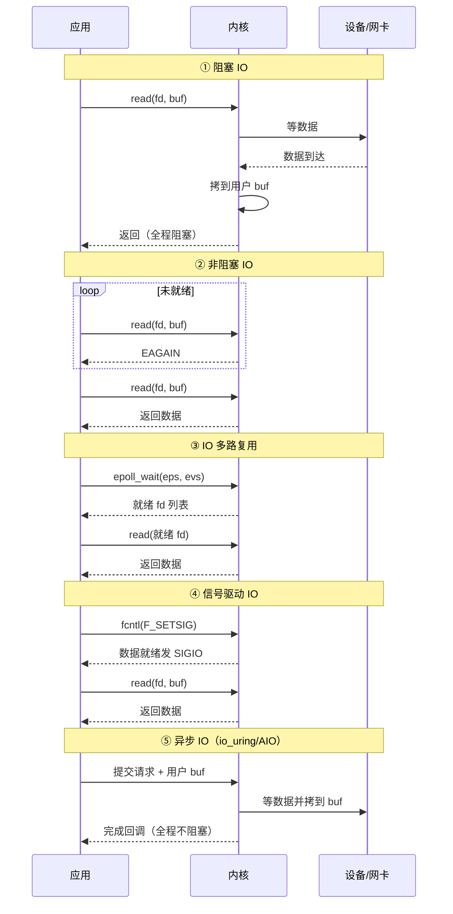
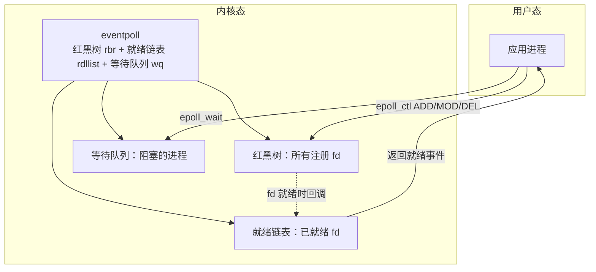
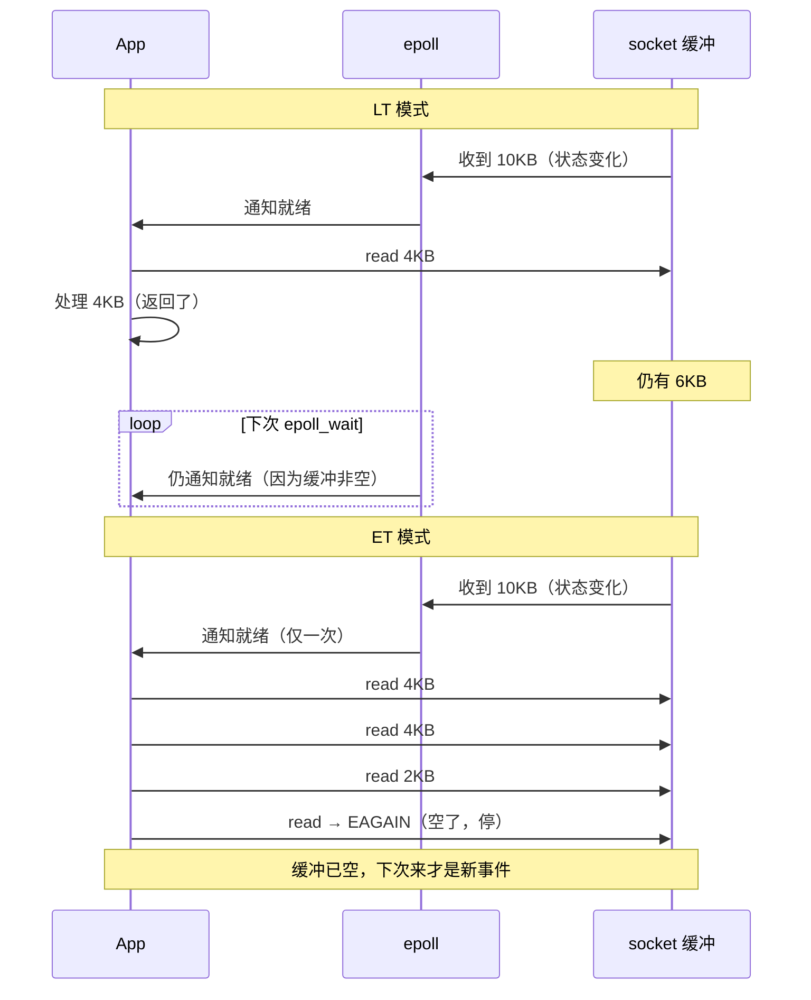
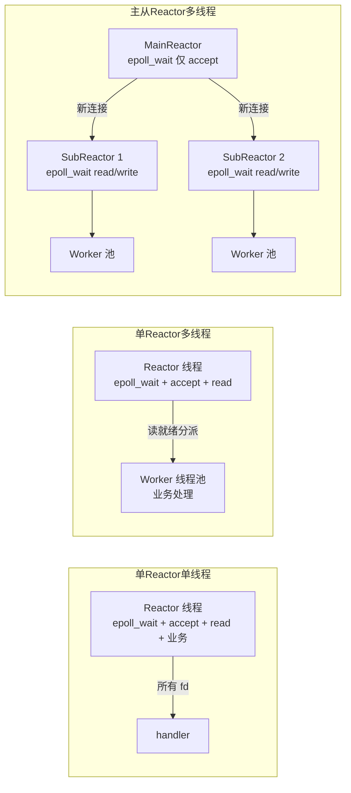
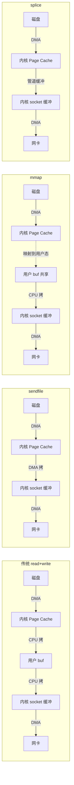

# IO 模型与 epoll

> **一句话定位**：IO 模型是 Java NIO/Netty 的底层，面试官爱从"讲讲 epoll"切到 Reactor。
> **面试热度**：⭐⭐⭐⭐⭐
> **返回**：[Linux 知识图谱](../README.md)

---

## 一、概述

### 1.1 主题在 Linux 体系中的位置

Linux IO 子系统的本质是**用户进程 ↔ 内核缓冲 ↔ 设备**三层，外加一套"如何让一个线程同时照看多个 fd"的多路复用机制。面试官问"讲讲 epoll"看似只在考一个系统调用，但它精准牵出五件事：五种 IO 模型、select/poll/epoll 演进、LT/ET 触发、Reactor 模式、零拷贝——能讲清这些才证明你不只是会调 `Selector.open()`。

本主题覆盖六条主线：**IO 模型**（阻塞/非阻塞/多路复用/信号驱动/异步）、**多路复用**（select/poll/epoll 对比、`eventpoll` 结构、`epoll_create/ctl/wait`）、**触发模式**（LT vs ET、为何 ET 必须非阻塞读）、**Reactor 模式**（单/多/主从 Reactor）、**零拷贝**（sendfile/mmap/splice）、**页面缓存**（Page Cache、脏页、writeback、`dirty_ratio`）。

### 1.2 与其他主题的边界

| 主题 | 边界说明 |
|------|---------|
| [02 进程与线程](../02-process/process-and-thread.md) | 进程在 IO 等待时进入 `TASK_INTERRUPTIBLE`（S 状态）在 02 讲，**阻塞/非阻塞语义、多路复用本身**归 04 |
| [03 内存管理](../03-memory/memory-management.md) | Page Cache 作为文件 IO 缓存，**归属与回收**归 03，**读写路径、脏页 writeback、mmap 与 epoll 交互**归 04 |
| [05 文件系统与 VFS](../05-fs/filesystem-and-vfs.md) | `read/write/open` 的 VFS 四对象流程在 05，**fd 就绪通知、epoll 事件机制**归 04 |
| [06 网络内核](../06-network/network-kernel.md) | socket fd 在内核网络栈的收包路径在 06，**socket 作为 epoll 监听对象、accept 队列与 ET 协作**归 04 |
| [09 性能与故障排查](../09-ops/performance-and-troubleshooting.md) | `iostat`/`iotop` 作为观测工具在本主题讲用法，**完整 USE 方法论、IO 端到端排障四步法**归 09 |

> **记住边界**：本主题讲"IO 怎么发生、fd 怎么复用、数据怎么少拷贝、Page Cache 怎么刷盘"，不讲"进程状态机字段（02）、VFS 四对象流程（05）、网卡 NAPI 收包（06）、完整排障方法论（09）"。

### 1.3 关键术语速览

| 术语 | 一句话定义 | 出现阶段 |
|------|-----------|---------|
| 同步 IO | 应用主动调 `read`/`write` 等内核完成，数据就绪后仍要自己拷 | IO 模型 |
| 异步 IO | 应用提交请求后立即返回，内核完成后回调或通知，全程不阻塞 | IO 模型 |
| 阻塞 | 调用未就绪时进程进 S 状态被挂起，直到数据就绪 | IO 模型 |
| 非阻塞 | 调用未就绪时立即返回 `EAGAIN`，进程不挂起 | IO 模型 |
| IO 多路复用 | 一个线程同时监听多个 fd，内核通知哪个就绪 | select/poll/epoll |
| Reactor | 事件驱动模式：主线程监听 fd，事件就绪后回调处理 | Reactor |
| select | 早期多路复用，用 `fd_set` 位图，上限 1024，O(n) 遍历 | select/poll |
| poll | 用链表去硬上限，但仍 O(n) 遍历 | select/poll |
| epoll | 现代多路复用，红黑树管 fd + 就绪链表，O(就绪数) 返回 | epoll |
| LT | 水平触发，只要 fd 有数据可读就一直通知 | 触发模式 |
| ET | 边沿触发，只在状态变化时通知一次，必须读到 `EAGAIN` | 触发模式 |
| 零拷贝 | 减少内核↔用户态数据拷贝与上下文切换的技术族 | 零拷贝 |
| sendfile | 全内核态拷贝，2 次上下文切换，从文件到 socket | 零拷贝 |
| mmap | 把文件 Page Cache 映射到用户态，省一次拷贝 | 零拷贝 |
| splice | 用管道缓冲在两个 fd 间搬数据，零用户态拷贝 | 零拷贝 |
| Page Cache | 文件页在内存的缓存，读命中免读盘，写先在缓存 | 页面缓存 |
| dirty page | Page Cache 中被写过但未刷盘的页 | 脏页 |
| writeback | 内核后台线程（`flush`/`kworker`）把脏页写回磁盘 | 脏页 |

---

## 二、核心机制

### 2.1 五种 IO 模型对比

POSIX 把 IO 抽象成"等数据就绪 + 拷贝数据"两个阶段，Linux 据此演化出五种模型。**同步与异步的本质区别**：是否由应用自己发起数据拷贝——同步模型数据就绪后应用要自己调 `read` 把数据从内核态拷到用户态；异步模型内核替你拷完再通知。**阻塞与非阻塞的区别**：未就绪时是挂起进程（阻塞）还是立即返回 `EAGAIN`（非阻塞）。



**五模型核心差异**：

| 模型 | 等数据阶段 | 拷数据阶段 | 一次能监听多少 fd | 代表实现 |
|------|-----------|-----------|------------------|---------|
| 阻塞 IO | 阻塞 | 阻塞 | 1 | 传统 `read` |
| 非阻塞 IO | 轮询返回 EAGAIN | 阻塞 | 1 | `read(O_NONBLOCK)` |
| IO 多路复用 | 阻塞在 select/epoll | 阻塞 | 多个 | `select`/`poll`/`epoll` |
| 信号驱动 | 信号通知后主动读 | 阻塞 | 多个 | `fcntl(F_SETSIG)` |
| 异步 IO | 不阻塞 | 不阻塞（内核替拷） | 多个 | `io_uring`/libaio |

> **关键认知**：前四种**都是同步 IO**——数据就绪后都要应用自己调 `read` 把数据从内核态拷到用户态，这个拷贝阶段阻塞。只有真正的异步 IO（Linux 的 `io_uring`/AIO）连拷贝都由内核完成。Java NIO 的 Selector 是 IO 多路复用，**不是异步 IO**，所以叫 NIO（Non-blocking）而不叫 AIO。

### 2.2 select / poll / epoll 对比

三者都是 IO 多路复用的系统调用，但数据结构与复杂度差异巨大，是面试的高区分点：

| 维度 | select | poll | epoll |
|------|--------|------|-------|
| 数据结构 | `fd_set` 位图（1024 bit） | `pollfd` 数组（链式，无硬上限） | 红黑树存 fd + 就绪链表 |
| fd 上限 | 1024（`FD_SETSIZE`） | 无硬上限（受进程 fd 上限） | 无硬上限（受进程 fd 上限） |
| 拷贝开销 | 每次调用全量拷 fd_set 到内核 | 每次全量拷 pollfd 数组 | `epoll_ctl` 增删时拷一次，`epoll_wait` 不拷 |
| 就绪判定 | 内核遍历所有 fd 标位，返回后用户态再遍历 O(n) | 同 select，O(n) | 内核只把就绪 fd 放链表，`epoll_wait` 取链表 O(就绪数) |
| 复杂度 | O(总 fd 数) | O(总 fd 数) | O(就绪 fd 数) |
| 触发方式 | LT | LT | LT + ET |
| 跨平台 | 是（POSIX） | 是（POSIX） | 否（Linux 专有，BSD 用 kqueue） |
| 源码 | `fs/select.c` | `fs/select.c` | `fs/eventpoll.c` |

> **为什么 epoll 快**：① **不重复拷贝 fd 集合**——`epoll_ctl` 注册一次后，fd 长在内核的红黑树上，`epoll_wait` 不再传 fd 集合；② **不遍历全部 fd**——内核通过回调把就绪 fd 挂到就绪链表，`epoll_wait` 只取链表上的，复杂度 O(就绪数) 而非 O(总数)；③ **mmap 共享内存**（部分版本）减少用户态与内核态的内存拷贝。select/poll 每次都要全量传 fd 集 + 全量遍历，连接数上万时性能断崖式下跌。

### 2.3 epoll 原理：eventpoll 结构与三大系统调用

epoll 的核心数据结构是 `struct eventpoll`（定义在 `fs/eventpoll.c`），它包含三件套：① **红黑树**（`rbr`）管理所有注册的 fd，支持 O(log n) 增删改；② **就绪链表**（`rdllist`）存放当前已就绪的 fd，`epoll_wait` 直接取它；③ **等待队列**（`wq`）存放阻塞在 `epoll_wait` 的进程。



**三大系统调用**：

1. **`epoll_create(size)`**——创建 `eventpoll` 实例，返回 fd。`size` 在早期内核有 hint 含义，现代内核（2.6.8+）忽略它。内部：分配 `eventpoll` 结构，初始化红黑树根、就绪链表头、等待队列、互斥锁。源码入口 `fs/eventpoll.c` 的 `do_epoll_create`。
2. **`epoll_ctl(epfd, op, fd, event)`**——增删改 fd。`op = EPOLL_CTL_ADD/MOD/DEL`。内部：在红黑树中查找/插入/删除节点 `epitem`，每个 `epitem` 关联一个 fd 和关心的事件掩码（`EPOLLIN`/`EPOLLOUT`/`EPOLLET` 等）。`ADD` 时把回调注册到该 fd 的等待队列——当 fd 对应的 socket 有数据时，内核回调把该 `epitem` 挂到 `rdllist`。
3. **`epoll_wait(epfd, events, maxevents, timeout)`**——等待就绪事件。内部：检查 `rdllist`，非空就取走（拷到用户 `events` 数组）返回；空就把当前进程挂到 `wq` 等待队列睡眠，直到有 fd 就绪被唤醒或超时。返回值是就绪 fd 数。

> **关键认知**：epoll 的"快"来自**就绪链表**——fd 就绪时内核通过注册的回调函数把它挂到 `rdllist`，`epoll_wait` 只需把链表上的事件拷到用户态，复杂度 O(就绪数)。这与 select/poll 的"每次都遍历全部 fd 问内核'你好了没'"有本质区别。

### 2.4 LT vs ET 触发模式

epoll 支持两种触发模式，是面试的另一个高频区分点：

| 维度 | LT（水平触发） | ET（边沿触发） |
|------|---------------|---------------|
| 触发时机 | 只要 fd 缓冲区**有数据可读/有空间可写**就一直通知 | 只在状态**变化**时通知一次（从无到有、从满到可写） |
| 读取要求 | 读多少都行，下次还能再被通知 | **必须循环读到 `EAGAIN`**，否则剩余数据再也通知不到 |
| fd 必须非阻塞？ | 不强制（但建议） | **必须**非阻塞，否则循环读到空时会阻塞 |
| 编程复杂度 | 低（漏读不怕，下次再通知） | 高（漏读就丢数据） |
| 适用场景 | 通用、低并发、简单协议 | 高并发、追求吞吐（Nginx/Netty 默认 ET） |
| 事件丢失风险 | 无（持续通知） | 有（没读到 `EAGAIN` 就丢） |

**为什么 ET 必须非阻塞读**：ET 模式只在状态变化通知一次。假设 fd 缓冲有 10KB 数据，你 `read` 了 4KB 就返回处理，剩下 6KB 在缓冲区——但 epoll 不会再通知你了（状态没变"从无到有"）。下次再有数据来，你 `read` 拿到的是"那 6KB + 新数据"，可能与协议边界错位。**正确做法**：用非阻塞 fd，循环 `read` 直到返回 `EAGAIN`（表示缓冲空了），这样保证把当前所有数据读干净，下次再来才是真正的"新数据"。



### 2.5 Reactor 模式

Reactor 是把"IO 多路复用 + 事件分发 + 业务处理"组合成的事件驱动架构，是 Netty/Mina 的骨架。三种演进形态：



| 形态 | Reactor 职责 | Worker 职责 | 优缺点 | 典型实现 |
|------|-------------|------------|--------|---------|
| 单 Reactor 单线程 | 监听 + accept + read + write + 业务 | 无 | 简单，但业务慢会卡住所有 IO；单核 | Redis（单线程 Reactor） |
| 单 Reactor 多线程 | 监听 + accept + read，把业务派给 Worker | 业务处理 | IO 与业务分离，但 Reactor 单点仍可能瓶颈 | 早期 Netty |
| 主从 Reactor 多线程 | MainReactor 只 accept，分给 SubReactor | SubReactor 读写 + Worker 业务 | 全分离，高并发首选；线程多 | Netty（Boss/Worker Group） |

> **关键认知**：主从 Reactor 的分工——MainReactor（Boss）只负责 `accept` 新连接（因为 accept 必须快，否则握手队列堆积），拿到新 socket fd 后分发给 SubReactor（Worker）负责后续的 `read`/`write`/业务。这样 accept 不会被业务处理拖慢，读写也不会被 accept 阻塞。Java NIO 的 Selector + Netty 的 NioEventLoopGroup 就是这套结构。

### 2.6 零拷贝对比

"零拷贝"不是真的零拷贝，而是**减少用户态与内核态之间的数据拷贝和上下文切换次数**。传统 `read + write` 拷贝路径：磁盘 → 内核 Page Cache → 用户 buf → 内核 socket 缓冲 → 网卡，4 次上下文切换 + 4 次拷贝（其中 2 次用户↔内核是纯浪费）。零拷贝技术省掉中间的用户态往返：



| 技术 | 上下文切换 | 拷贝次数 | 适用场景 | 限制 |
|------|-----------|---------|---------|------|
| 传统 read+write | 4 次 | 4 次（2 次 CPU + 2 次 DMA） | 通用 | 浪费大 |
| sendfile | 2 次 | 2-3 次（全 DMA） | 文件 → socket（静态资源/日志转发） | Linux 2.1+，需对端是 socket |
| mmap | 4 次 | 3 次（省 1 次 CPU 拷） | 大文件随机访问、进程间共享 | 仍要用户态参与，有 SIGBUS 风险 |
| splice | 2 次 | 2 次（全 DMA） | 任意两 fd 间搬数据（管道+socket） | 至少一端是管道 |

**sendfile 为何是 2 次上下文切换**：传统 `read`（用户态→内核态）+ `write`（用户态→内核态）= 4 次切换（含两次返回）。`sendfile` 是单系统调用，全程在内核态完成"文件 Page Cache → socket 缓冲 → 网卡"，只有 `sendfile` 进入和返回这 2 次切换。Linux 2.4+ 的 `sendfile` 用 SG-DMA（Scatter-Gather）连 Page Cache → socket 缓冲那次 CPU 拷贝都省了，只剩 2 次 DMA。

> **面试口径**：能说出"sendfile 2 次上下文切换全在内核态，传统 read+write 是 4 次；mmap 把 Page Cache 映射到用户态省一次拷贝但仍有用户态参与；splice 用管道在任意两 fd 间搬数据"就够。Kafka 的顺序读写 + sendfile、Nginx 的 `sendfile on` 都是典型应用。

### 2.7 页面缓存与脏页 writeback

Linux 文件 IO 默认都经过 **Page Cache**——`read` 命中缓存免读盘（minor fault），`write` 先写缓存（标记脏页）立即返回，后台 `flush`/`kwriter` 线程异步把脏页 writeback 到磁盘。这是"写快读慢"的根因，也是异常掉电丢数据的根因。

**写路径**：`write(fd, buf)` → 数据拷到 Page Cache 对应页 → 标记该页 dirty → 立即返回（不阻塞等磁盘）。脏页由内核后台线程（`mm/page-writeback.c` 的 `wb_workfn`，用户态可见为 `flush`/`kworker` 线程）周期性或触发式写回磁盘。触发写回的三个条件：① 脏页比例超过 `vm.dirty_ratio`（默认 20%）；② 脏页比例超过 `vm.dirty_background_ratio`（默认 10%）唤醒后台写；③ 脏页停留超过 `vm.dirty_expire_centisecs`（默认 3000，即 30 秒）。

| 参数 | 默认 | 含义 | 调优方向 |
|------|------|------|---------|
| `vm.dirty_ratio` | 20 | 脏页占内存超此比例，写操作**阻塞**强制同步刷盘 | 高吞吐调高（数据库），低延迟调低 |
| `vm.dirty_background_ratio` | 10 | 脏页超此比例，后台 `flush` 线程开始异步刷盘 | 一般低于 dirty_ratio |
| `vm.dirty_expire_centisecs` | 3000 | 脏页存活超 30 秒必须刷盘 | 减少丢数据风险调小 |
| `vm.dirty_writeback_centisecs` | 500 | `flush` 线程周期唤醒间隔（5 秒） | 实时性敏感场景调小 |

> **关键认知**：`O_DIRECT`（直接 IO）绕过 Page Cache，`read`/`write` 直接打到磁盘，适合数据库（自己管理缓存）和大文件流式读写（cache miss 浪费）。`O_SYNC` 不绕过 Page Cache，但 `write` 不立即返回，同步等脏页刷盘完成才返回。`fsync(fd)` 是显式刷盘——把该 fd 的所有脏页写回磁盘并等设备确认，开销大但保证持久化。

---

## 三、命令与示例

### 3.1 命令族速查表

| 命令 | 作用 | 常用形式 |
|------|------|---------|
| `iostat` | 看磁盘 IO 吞吐与延迟 | `iostat -x 1` / `iostat -d -x 1` / `iostat -c 1` |
| `vmstat` | 看内存/swap/IO 趋势 | `vmstat 1` / `vmstat -w 1` / `vmstat -d` |
| `iotop` | 按进程看 IO 占用 | `iotop -o` / `iotop -oPa` |
| `fio` | IO 压测工具 | `fio --name=test --ioengine=libaio --rw=randread` |
| `dd` | 测吞吐/拷贝 | `dd if=/dev/zero of=/tmp/f bs=1M count=1024` |
| `strace` | 跟踪系统调用 | `strace -e trace=read,write,epoll_wait -p <pid>` |
| `lsof` | 看进程打开的 fd | `lsof -p <pid>` / `lsof -i:8080` |
| `ss` | 看 socket 统计 | `ss -s` / `ss -tnp` |

### 3.2 实战 one-liner

```bash
# 1. 磁盘 IO 详细（扩展字段，每秒刷新）
iostat -xmt 1
# Device  rrqm/s wrqm/s r/s w/s rMB/s wMB/s avgrq-sz avgqu-sz await %util
# sda     0.00   0.00   0.5 1.2 0.01 0.02  24.5    0.03   15.3  2.1

# 2. 按进程看谁在 IO（-o 只看有 IO 的，-P 不分线程）
iotop -oPa

# 3. 测磁盘顺序写吞吐（oflag=direct 绕过 Page Cache）
dd if=/dev/zero of=/tmp/test bs=1M count=1024 oflag=direct
# 1073741824 bytes (1.1 GB) copied, 5.2 s, 200 MB/s

# 4. 测随机读延迟（fio）
fio --name=randread --ioengine=libaio --direct=1 --rw=randread \
    --bs=4k --size=1G --numjobs=1 --runtime=30 --time_based

# 5. 跟踪 Java 进程的 IO 系统调用
strace -c -p $(pidof java) 2>&1 | grep -E 'read|write|epoll'
strace -e trace=read,write,epoll_wait -p $(pidof java)

# 6. 看某进程打开了多少 fd（连接数高时排查）
ls /proc/$(pidof java)/fd | wc -l
lsof -p $(pidof java) | wc -l

# 7. 看全局 socket 统计（epoll 管 fd 数排查）
ss -s
# Total: 12345 (kernel) 6789 (estab)
# TCP:   10000 (estab 9000, closed 200, orphaned 50, synrecv 10)

# 8. 看某进程的 socket 缓冲占用
cat /proc/$(pidof java)/net/sockstat

# 9. 看/设脏页刷盘参数
sysctl vm.dirty_ratio vm.dirty_background_ratio vm.dirty_expire_centisecs
sysctl -w vm.dirty_ratio=15

# 10. 强制同步所有脏页到磁盘
sync
# 或针对某 fd: 不显式调 fsync(fd)，但应用程序内调用
```

### 3.3 命令输出解读

**`iostat -x` 各列含义**：

| 列 | 含义 | 面试关注点 |
|---|------|-----------|
| `rrqm/s` `wrqm/s` | 每秒合并的读写请求 | 合并率高说明 IO 模式利于批量 |
| `r/s` `w/s` | 每秒完成的读写 IOPS | IOPS 上限看磁盘类型（SSD 万级，HDD 百级） |
| `rMB/s` `wMB/s` | 每秒读写吞吐 | 吞吐看带宽上限 |
| `avgrq-sz` | 平均请求大小（扇区） | 小说明小 IO 多，随机性高 |
| `avgqu-sz` | 平均 IO 队列长度 | 持续高说明磁盘饱和 |
| `await` | 平均 IO 延迟（ms） | **关键指标**，SSD < 2ms，HDD < 10ms 正常 |
| `%util` | 磁盘利用率 | 持续 100% 说明饱和（NVMe 多队列下不准确） |

> **关键认知**：`%util` 持续 100% 在传统单队列磁盘上表示饱和，但 NVMe/多队列设备下不准确（可同时服务多个 IO，`%util` 不到 100% 也可能已饱和）。判断磁盘瓶颈更可靠看 `await` 是否飙升。

**`/proc/diskstats` 与 `/proc/<pid>/io`**：`/proc/diskstats` 是 `iostat` 的底层数据源，每行一个块设备，含读写次数、扇区数、队列时间等 17 个字段。`/proc/<pid>/io` 看某进程的 IO 统计：`read_bytes`/`write_bytes` 是实际从/到磁盘的字节数，`rchar`/`wchar` 是 `read`/`write` 系统调用传输的字节数（含 Page Cache 命中未真正落盘的）——`rchar` 远大于 `read_bytes` 说明命中 Page Cache 多。

---

## 四、高频追问

### Q1：5 种 IO 模型分别是什么？阻塞和非阻塞的本质区别？

**参考答案**：五种：①**阻塞 IO**——`read` 未就绪进程挂起 S 状态直到数据到达；②**非阻塞 IO**——`O_NONBLOCK` 下未就绪立即返回 `EAGAIN`，进程轮询；③**IO 多路复用**——`select`/`poll`/`epoll` 一线程监听多 fd，内核通知哪个就绪；④**信号驱动 IO**——`fcntl(F_SETSIG)` 注册信号，数据就绪内核发 `SIGIO`，应用在信号处理里 `read`；⑤**异步 IO**——应用提交请求（含用户 buf）立即返回，内核完成"等数据 + 拷到 buf"后回调，全程不阻塞（Linux 的 `io_uring`/AIO）。

**阻塞与非阻塞的本质区别**：未就绪时的行为——阻塞挂起进程进 S 状态被调度走，非阻塞立即返回 `EAGAIN` 让进程继续跑。注意：前四种**都是同步 IO**——数据就绪后都要应用自己调 `read` 把数据从内核态拷到用户态，这个拷贝阶段阻塞。只有异步 IO 连拷贝都由内核完成。

### Q2：select/poll/epoll 有什么区别？为什么 epoll 性能好？

**参考答案**：见 2.2 节对照表。核心差异：①**数据结构**——select 用 `fd_set` 位图（上限 1024），poll 用 `pollfd` 数组（无硬上限），epoll 用红黑树 + 就绪链表；②**fd 拷贝**——select/poll 每次调用全量拷 fd 集到内核，epoll 只在 `epoll_ctl` 增删时拷一次；③**就绪判定**——select/poll 内核遍历所有 fd 标位返回后用户态再遍历 O(n)，epoll 内核只把就绪 fd 挂链表，`epoll_wait` 取链表 O(就绪数)。

**epoll 快的根因**：①不重复传 fd 集（注册一次长在内核红黑树上）；②不遍历全部 fd（通过回调把就绪的挂就绪链表，`epoll_wait` 只取链表）；③连接数上万时 select/poll 性能断崖下跌而 epoll 仍平稳——所以 Redis/Nginx/Netty 全用 epoll。复杂度对比：select/poll 是 O(总 fd 数)，epoll 是 O(就绪 fd 数)。

### Q3：epoll 的 LT 和 ET 模式有什么区别？为什么 ET 必须非阻塞读？

**参考答案**：见 2.4 节对照表。**LT（水平触发）**：只要 fd 缓冲有数据可读/有空间可写就**持续**通知；**ET（边沿触发）**：只在状态**变化**（从无到有、从满到可写）时通知**一次**。

**为什么 ET 必须非阻塞读**：ET 只通知一次，假设 fd 缓冲有 10KB，你 `read` 4KB 就返回，剩 6KB 在缓冲里——但 epoll 不会再通知了（状态没新变化）。下次新数据来，你 `read` 拿的是"那 6KB + 新数据"，可能与协议边界错位。**正确做法**：fd 设非阻塞，循环 `read` 直到返回 `EAGAIN`（缓冲空了），保证当前数据读干净。若用阻塞 fd，循环读到空时会阻塞在 `read` 上，整个线程卡死。Nginx/Netty 默认 ET 模式就是这个原因——追求高吞吐，但要求编程严谨。

### Q4：epoll 内部用了什么数据结构？

**参考答案**：核心是 `struct eventpoll`（定义在 `fs/eventpoll.c`），含三件套：①**红黑树 `rbr`**——管理所有注册的 fd（每个节点是 `epitem`，关联 fd 与事件掩码），支持 O(log n) 增删改，避免 select 的位图全量扫描；②**就绪链表 `rdllist`**——存放当前已就绪的 `epitem`，`epoll_wait` 直接取它，O(就绪数) 返回；③**等待队列 `wq`**——存放阻塞在 `epoll_wait` 的进程，fd 就绪时唤醒。

**就绪链表怎么填满**：`epoll_ctl(ADD)` 时把回调函数注册到该 fd 的等待队列（socket 的 `sk_wq`）。当 socket 收到数据，内核网络栈触发回调，把对应 `epitem` 挂到 `rdllist` 并唤醒 `wq` 上的进程。所以 epoll 的"快"在于 fd 就绪是**事件驱动**（回调挂链表）而非**轮询驱动**（遍历问内核）。

### Q5：Reactor 模式是什么？主从 Reactor 多线程怎么分工？

**参考答案**：Reactor 是"IO 多路复用 + 事件分发 + 业务处理"的事件驱动架构。三种形态（见 2.5 节）：①**单 Reactor 单线程**——一个线程干完所有事（监听/accept/read/业务），简单但业务慢会卡 IO，Redis 单线程模式；②**单 Reactor 多线程**——Reactor 线程只负责 IO（accept/read），业务派给 Worker 线程池，IO 与业务分离但 Reactor 仍单点；③**主从 Reactor 多线程**——MainReactor 只 accept 新连接，拿到 socket fd 分发给 SubReactor 负责后续 read/write，业务再派给 Worker 池。

**主从分工**：MainReactor（Boss Group）**只做 accept**——因为 accept 必须快，否则 TCP 全连接队列堆积导致握手超时；SubReactor（Worker Group）负责**读写 + 业务**，每个 SubReactor 一个线程一个 epoll，绑定一组 socket fd。这样 accept 不会被业务拖慢，读写也不会被 accept 阻塞。Netty 的 `NioEventLoopGroup(bossCount, workerCount)` 就是这套——BossGroup 处理 accept，WorkerGroup 处理 read/write。

### Q6：零拷贝是什么？sendfile/mmap/splice 各适用什么场景？

**参考答案**："零拷贝"指减少用户态↔内核态的数据拷贝和上下文切换。传统 `read + write` 4 次切换 + 4 次拷贝（2 次 CPU + 2 次 DMA），浪费在"Page Cache → 用户 buf → socket 缓冲"那两次 CPU 拷贝。三种技术：

- **sendfile**——单系统调用，数据全在内核态从文件 Page Cache 到 socket 缓冲再到网卡，2 次上下文切换。适用**文件 → socket**（静态资源下发、日志转发）。Kafka 顺序读用 sendfile，Nginx `sendfile on`。
- **mmap**——把文件 Page Cache 映射到用户态地址空间，访问映射地址等价于访问 Page Cache，省一次"Page Cache → 用户 buf"拷贝，但仍要用户态参与 `write`。适用**大文件随机访问、进程间共享内存**。坑：文件被截断后访问越界触发 SIGBUS。
- **splice**——用内核管道缓冲在两个 fd 间搬数据，零用户态拷贝，2 次切换。适用**任意两 fd 间**（如 socket → 文件、socket → socket 代理转发），至少一端必须是管道。

Java 的 `FileChannel.transferTo` 底层就是 sendfile，`MappedByteBuffer` 底层是 mmap。

### Q7：Java NIO 用的是哪种 IO 模型？

**参考答案**：**IO 多路复用**（epoll on Linux，kqueue on BSD/macOS，WSAPoll on Windows）。Java NIO 的核心三件套：`Selector`（多路复用器，封装 epoll）、`Channel`（fd 抽象）、`Buffer`（用户态数据容器）。`Selector.open()` 底层调 `epoll_create`，`register(SelectionKey)` 对应 `epoll_ctl(ADD)`，`select()` 对应 `epoll_wait`。

**关键澄清**：Java NIO 叫 NIO（Non-blocking I/O）**不是异步 IO**——它是非阻塞 + 多路复用，数据就绪后仍要应用自己 `channel.read(buf)` 把数据从内核态拷到用户态（同步）。真正的异步 IO 在 Java 是 `AsynchronousChannel` + `CompletionHandler`（AIO），Linux 上 AIO 底层用 `io_uring`（JDK 较新版本）或线程池模拟。生产中高并发服务几乎都用 NIO + Netty（Reactor 模式），不用 Java AIO——因为 Linux AIO 历史实现（libaio）局限大，epoll + Reactor 更成熟。

### Q8：Netty 的 EventLoop 是 Reactor 模式的哪种？

**参考答案**：**主从 Reactor 多线程**。Netty 的 `NioEventLoopGroup` 分两组：①**BossGroup**（通常 1 个线程）——MainReactor，只处理 `OP_ACCEPT` 事件（accept 新连接）；②**WorkerGroup**（默认 CPU × 2 线程）——SubReactor，每个 `NioEventLoop` 绑一个 Selector（epoll），负责一组 socket fd 的 `OP_READ`/`OP_WRITE`，以及业务逻辑（除非显式 `addLast(businessGroup, handler)` 把业务再派给独立线程池）。

**NioEventLoop 的执行模型**：单线程 + 单 Selector，循环跑 `select()`（epoll_wait）→ 处理就绪 IO → 跑任务队列任务。一个 `NioEventLoop` 绑定一组 socket fd 全生命周期（保证线程安全，无需加锁）。默认 ET 还是 LT？Netty 的 `EpollEventLoop`（native）默认 **LT**，但可配 `EpollMode.EDGE_TRIGGERED` 切 ET。注意：JDK 原生 NIO Selector（`EPollSelectorImpl`）只支持 LT，Netty native 才支持 ET。

### Q9：page cache 是什么？写文件经过 page cache 吗？

**参考答案**：Page Cache 是内核用于缓存文件页的内存区域（`/proc/meminfo` 的 `Cached` 字段）。读：`read` 命中缓存免读盘（minor fault），未命中发 IO 读盘并填缓存。写：默认**经过 Page Cache**——`write` 把数据拷到 Page Cache 对应页，标记该页 dirty，**立即返回**不等刷盘。脏页由后台 `flush`/`kworker` 线程异步 writeback。

**好处**：读命中免磁盘 IO（加速）；写立即返回不阻塞（吞吐高）。**代价**：异常掉电丢脏页数据（未刷盘的部分丢失）。所以数据库（MySQL InnoDB）用 `O_DIRECT` 绕过 Page Cache 自己管 redo log 缓存，配合 `fsync` 保证持久化。Java NIO 的 `FileChannel.write` 默认也经过 Page Cache，要绕过得用 `FileChannel.open(..., StandardOpenOption.DSYNC)` 或 `force(true)`。

### Q10：怎么让写文件不经过 page cache？

**参考答案**：用 `O_DIRECT` 标志打开文件，`read`/`write` 直接打到磁盘绕过 Page Cache。适用：数据库（自己管缓存，避免双重缓存）、大文件流式读写（Page Cache 会被大文件污染挤出有用缓存）。

**Linux 层**：`open(path, O_DIRECT | O_RDWR)`，要求缓冲区、偏移、长度都对齐到块大小（通常 512B 或 4KB），否则 `EINVAL`。可用 `dd if=/dev/zero of=f bs=1M count=1024 oflag=direct` 验证。**Java 层**：JDK 标准库无直接 `O_DIRECT`，需用 `jnr-fuse`/`Netty` 的 native 或 JNI；Java NIO 的 `FileChannel` 无 `O_DIRECT`，但 `AsynchronousFileChannel` 配合 native 也可绕。**对比 `O_SYNC`**：`O_SYNC` 不绕过 Page Cache，但 `write` 不立即返回，同步等脏页刷盘才返回——保证持久化但仍走缓存。`fsync(fd)` 是运行时显式刷盘，`O_DIRECT` 是打开时定模式。

### Q11：一个 Java 服务读文件很慢，怎么排查？

**参考答案**：分四步（详见 [09 性能排障](../09-ops/performance-and-troubleshooting.md)）：①**看现象**——是慢在哪一层？`top`/`vmstat` 看 `wa`（IO wait）高不高，`iostat -x 1` 看 `await`/`%util`；②**定位进程**——`iotop -oPa` 看是哪个进程在读，`pidstat -d -p $(pidof java) 1` 看具体 IO 速率；③**看数据源**——`/proc/$(pidof java)/io` 看 `read_bytes` vs `rchar`，`rchar` 远大于 `read_bytes` 说明大量命中 Page Cache（不是磁盘瓶颈），反之是真读盘多；④**看模式**——`strace -e trace=read -p $(pidof java)` 看每次读多少字节、频率多高，定位是随机小 IO（`await` 高）还是顺序大 IO（吞吐高）。

**常见根因**：①冷读大量文件（major fault 多）——预热或用 `madvise(MADV_WILLNEED)`；②Page Cache 抖动（大文件挤出热数据）——用 `O_DIRECT` 或 `posix_fadvise(POSIX_FADV_DONTNEED)`；③磁盘本身慢——`iostat` 看 `await` 飙升，换 SSD 或加 IOPS；④随机小 IO——改批量读、用 `readahead`。完整排障链见 6.1 案例。

### Q12：为什么 Redis 单线程性能好？

**参考答案**：两个根因：①**IO 多路复用**——Redis 单线程用 epoll（`ae.c` 的事件循环）同时监听几万 socket fd，`epoll_wait` 返回就绪 fd 后顺序处理，避免多线程上下文切换开销；②**纯内存操作**——数据全在内存，单次操作微秒级，CPU 不是瓶颈，瓶颈在网络 IO，epoll + 单线程刚好把 IO 利用满。

**为什么不加锁**：单线程天然无并发冲突，无锁无竞争，操作原子。**为什么不多线程**：①内存操作快，单线程已够；②多线程要加锁，锁开销可能抵消并发收益；③单线程模型简单，避免并发 bug。**Redis 6.0 的变化**：引入多线程 IO（`io-threads`），但**命令执行仍单线程**——只把 `read`/`write` 的网络 IO 并行化，业务逻辑线程模型不变。所以"Redis 单线程"指**命令执行**，不是网络 IO。关联：这是 Reactor 模式"单 Reactor 单线程"形态的典型（Redis 6.0 前是纯单线程，6.0 后接近"单 Reactor + 多 IO 线程"）。

---

## 五、Java/容器关联

### 5.1 Java NIO Selector 与 epoll

Java NIO 的 `Selector` 在 Linux 上底层就是 epoll（`sun.nio.ch.EPollSelectorImpl`），三大 NIO 方法对应三个 epoll 系统调用：

| Java NIO API | Linux 系统调用 | 说明 |
|--------------|---------------|------|
| `Selector.open()` | `epoll_create` | 创建 `eventpoll` 实例 |
| `channel.register(selector, OP_READ)` | `epoll_ctl(ADD)` | 把 Channel fd 注册到 Selector |
| `selector.select(timeout)` | `epoll_wait` | 等待就绪事件 |
| `key.interestOps(...)` | `epoll_ctl(MOD)` | 修改关心的事件掩码 |

**Java NIO 默认 LT 模式**：JDK 原生 `EPollSelectorImpl` 只支持 LT，不暴露 ET。Netty 的 native `EpollEventLoop` 才支持 ET（`EpollMode.EDGE_TRIGGERED`）。所以纯 JDK NIO 写的 Reactor 默认 LT，不怕漏读但吞吐略低；Netty 可选 ET 追求吞吐。

> **关联 `java-core/lambda`**：NIO 的事件分发回调链本质是函数式回调（`SelectionKey` 的 `attachment` → `handler`），与 `Consumer`/`Function` 模型一致，关联该模块的函数式接口与回调链。**关联 `java-core/stream`**：`parallelStream` 默认用公共 `ForkJoinPool`，做 IO 阻塞任务会卡死其他 parallelStream，详见 §5.3。

### 5.2 Netty 的主从 Reactor 与 Boss/Worker Group

Netty 把 Reactor 模式工程化为 `NioEventLoopGroup`，启动典型写法：

```java
EventLoopGroup bossGroup   = new NioEventLoopGroup(1);        // MainReactor，只 accept
EventLoopGroup workerGroup = new NioEventLoopGroup();         // SubReactor，默认 CPU×2
ServerBootstrap b = new ServerBootstrap();
b.group(bossGroup, workerGroup)
 .channel(NioServerSocketChannel.class)
 .childHandler(new ChannelInitializer<SocketChannel>() {
     protected void initChannel(SocketChannel ch) {
         ch.pipeline().addLast(new StringDecoder(), new MyHandler());
     }
 });
```

**执行模型**：①BossGroup（1 线程）跑一个 epoll 监听 ServerSocket 的 `OP_ACCEPT`，accept 到新 socket；②把新 socket 注册到 WorkerGroup 的某个 `NioEventLoop`（轮询分配），该 EventLoop 独占这个 socket 全生命周期的 `OP_READ`/`OP_WRITE`；③业务在 EventLoop 线程跑（与 IO 同线程），若业务重可 `addLast(businessGroup, handler)` 派给独立线程池。

> **关键认知**：一个 `NioEventLoop` = 一个线程 + 一个 Selector（epoll）+ 一个任务队列。同一 Channel 的所有事件都由绑定的那个 EventLoop 处理（保证线程安全，handler 无需加锁）。这是 Reactor "单线程绑定一组 fd"模式的工业实现。

### 5.3 parallelStream 与 IO 阻塞陷阱

`java.util.stream` 的 `parallelStream` 默认用公共 `ForkJoinPool.commonPool()`（线程数 = CPU - 1）。若在 `parallelStream` 里做**阻塞 IO**（如调 REST、查 DB、读文件），会占满公共池线程，导致**整个 JVM 内所有 parallelStream 阻塞**——包括其他不相关业务。

**根因**：`ForkJoinPool` 设计目标是 CPU 密集分治任务（work-stealing 调度），不适合 IO 阻塞——线程阻塞时无法被 steal，池被榨干。**解决**：①IO 密集用自定义 `ForkJoinPool`（`new ForkJoinPool(n)`）或 `ExecutorService`；②显式 `CompletableFuture.supplyAsync(task, ioExecutor)` 指定线程池；③Netty 自带 `DefaultEventExecutorGroup` 处理 IO 阻塞 handler。

> **关联 `java-core/stream`**：`parallelStream` 的并行模型与陷阱详见该模块。**关联 `java-core/forkjoin`**：`ForkJoinPool` 的 work-stealing 机制与适用场景（CPU 密集 vs IO 密集）详见该模块。

### 5.4 容器内 epoll 的行为

容器与宿主**共享内核**——epoll 是系统调用，容器内调 `epoll_create` 与宿主一样走同一个内核 `fs/eventpoll.c`，无隔离差异。Docker 不为 epoll 加 namespace 层（不像 PID/网络有 namespace）。所以：

- **性能**：容器内 epoll 性能与宿主一致，无虚拟化开销（对比 VM 有完整内核）。
- **fd 上限**：容器受 `--ulimit nofile` 限制（默认继承宿主 ulimit，可能很大），高并发要显式 `--ulimit nofile=65536:65536`。
- **连接数统计**：容器内 `ss -s` 看到的是**容器网络 namespace 内**的 socket（veth pair 的一端），宿主 `ss -s` 看全系统。排查 Netty 连接数要进容器 `nsenter` 或 `docker exec`。

> **关联 `ops/docker`**：容器网络 namespace 与 socket 可见性详见 [容器本质与底层原理](../docker/01-foundation/container-principle.md) §2.3 网络 namespace。容器内 `--ulimit` 与 `nofile` 详见该文档 §5 容器资源限制映射。

### 5.5 实战映射表

| 场景 | Linux 知识点 | Java/容器关联 |
|------|-------------|--------------|
| Java NIO Selector 慢 | epoll vs select/poll | §5.1，NIO 底层是 epoll |
| Netty 高并发连接数 | 主从 Reactor + epoll ET | §5.2，BossGroup accept + WorkerGroup read/write |
| parallelStream 卡死 | ForkJoinPool 与 IO 阻塞 | §5.3，公共池被 IO 榨干 |
| Kafka 顺序读写快 | sendfile + Page Cache 预读 | §2.6/§2.7，零拷贝 + 顺序 IO 命中缓存 |
| 容器内 socket 数超限 | `--ulimit nofile` 与共享内核 | §5.4，容器与宿主共享 epoll 但 fd 上限独立配 |
| Redis 单线程快 | epoll + 内存操作 | §Q12，单 Reactor 单线程模式 |
| Java 读文件慢 | Page Cache 抖动 / major fault | §Q11，`iostat` + `/proc/<pid>/io` 排查 |
| 日志写入丢数据 | Page Cache 脏页 + fsync | §2.7，`O_SYNC` 或显式 `fsync` |

---

## 六、故障排查案例

### 6.1 案例：Java 服务读文件慢，定位 Page Cache 抖动

**现象**：Java 服务启动后读配置文件和依赖 jar 很慢，`top` 显示 `wa`（IO wait）30%+，启动耗时 60 秒（正常 10 秒）。

**排障链**：

```bash
# 1. 看整体 IO 压力
$ vmstat 1 5
# r  b  swpd  free   buff  cache  si  so  bi  bo  in  cs  us  sy  id  wa
# 1  1  0     2000   500   8000   0   0   120 10  ...  5   3   60  32   # wa 32% 说明 IO 饱和

# 2. 看磁盘延迟
$ iostat -xmt 1
# Device  r/s  w/s  rMB/s  await  %util
# sda     1500 10   6.5    18.5   95   # await 18ms 高，%util 95 饱和

# 3. 看进程级 IO
$ pidstat -d -p $(pidof java) 1
# PID   UID   PID  kB_rd/s  kB_wr/s
# 12345 app   12345  6656     20     # 每秒读 6.5MB

# 4. 看是命中 Page Cache 还是真的在读盘
$ cat /proc/$(pidof java)/io
# read_bytes:  26624000   # 真正从磁盘读了 25MB
# rchar:       51200000   # read 系统调用读了 48MB → 差 23MB 命中缓存，命中率不到 50%

# 5. 跟踪系统调用看模式
$ strace -e trace=read -p $(pidof java) -c
# % time     seconds  usecs/call  calls  syscall
# 60.0       5.2      3           1800   read    # 大量小 read（每次几百字节）

# 6. 根因：大量小文件随机读 + Page Cache 抖动
# 同机其他进程（日志清洗）把热配置挤出了 Page Cache，导致 Java 启动时 major fault 多
$ perf stat -e major-faults -p $(pidof java) -- sleep 5
# 1,234,567  major-faults   # 大量缺页要读盘
```

**解决**：①用 `madvise(MADV_WILLNEED)` 预读配置文件（Linux 内核会提前读入 Page Cache）；②隔离日志清洗进程（cgroup 限制它的 IO 带宽，或换磁盘）；③把热配置文件放 tmpfs（`/dev/shm`，纯内存）；④启动时加 `readahead`：`blockdev --setra 4096 /dev/sda`。复测：启动时间从 60s 降到 12s。

**方法论**：①`vmstat` 看 `wa`/`bi` 定 IO 是否瓶颈；②`iostat -x` 看 `await`/`%util` 定磁盘饱和度；③`/proc/<pid>/io` 对比 `read_bytes` 与 `rchar` 判 Page Cache 命中率；④`strace -e trace=read` 看读模式（小随机 vs 大顺序）；⑤`perf stat -e major-faults` 看缺页量。完整排障四步法详见 [09 性能与排障](../09-ops/performance-and-troubleshooting.md)。

### 6.2 案例：Netty 服务连接数高，定位 epoll 管理 fd 数

**现象**：Netty 服务运行 3 天后，新连接建立慢，客户端报 `connection timed out`，`ss -s` 显示 TCP 连接数 5 万+。

**排障链**：

```bash
# 1. 看全局 socket 统计
$ ss -s
# Total: 52345 (kernel) 50123 (estab)
# TCP:   50100 (estab 50000, closed 50, orphaned 30, synrecv 20)

# 2. 看某 Netty 进程的 fd 数（含 socket fd）
$ ls /proc/$(pidof java)/fd | wc -l
# 50345   # fd 数 5 万，远超预期

# 看 fd 类型分布
$ ls -l /proc/$(pidof java)/fd | awk '{print $NF}' | sed 's/.*->//' | \
    awk -F: '{print $1}' | sort | uniq -c | sort -rn | head
# 50000 socket
#   200 pipe
#   100 /dev/
#    45 anon_inode

# 3. 看容器/进程的 fd 上限
$ cat /proc/$(pidof java)/limits | grep -i 'open files'
# Max open files      65536   65536   files   # 上限 65536，快到了

# 4. 看 Netty 的 socket 缓冲占用
$ cat /proc/$(pidof java)/net/sockstat
# sockets: used 50345
# TCP: inuse 50100 orphan 30 tw 200 alloc 50200 mem 5

# 5. 看 epoll 管理的 fd 数（epoll 自己的 fd 是哪个）
$ ls -l /proc/$(pidof java)/fd | grep -i eventpoll
# lrwx------ ... 1023 -> anon_inode:[eventpoll]   # epoll 实例 fd

# 6. 根因：业务连接没释放（客户端没 close 或 Netty idleHandler 没配）
# 解决：加 Netty IdleStateHandler（30 秒空闲断开）+ 客户端连接池复用
```

**解决**：①Netty pipeline 加 `IdleStateHandler(30, 0, 0)`，30 秒读空闲断开连接；②检查客户端是否复用连接池（连接复用比新建便宜）；③调大 fd 上限 `ulimit -n 200000` 或容器 `--ulimit nofile=200000:200000`；④若是 TIME_WAIT 堆积（`ss -s` 的 `tw` 高），调 `net.ipv4.tcp_tw_reuse=1`。复测：连接数稳定在 1 万，新连接建立延迟正常。

**方法论**：①`ss -s` 看全局连接数与状态分布；②`ls /proc/<pid>/fd | wc -l` 看进程 fd 数是否接近上限；③`cat /proc/<pid>/limits` 看 `open files` 软硬限制；④`ls -l /proc/<pid>/fd | awk` 分 fd 类型找元凶（socket 占大头说明连接泄漏）；⑤Netty 用 `IdleStateHandler` 治标，根因要查业务是否复用连接。关联 [06 网络内核](../06-network/network-kernel.md) 的 TCP 连接状态机与 TIME_WAIT。

---

> **返回**：[Linux 知识图谱](../README.md)
