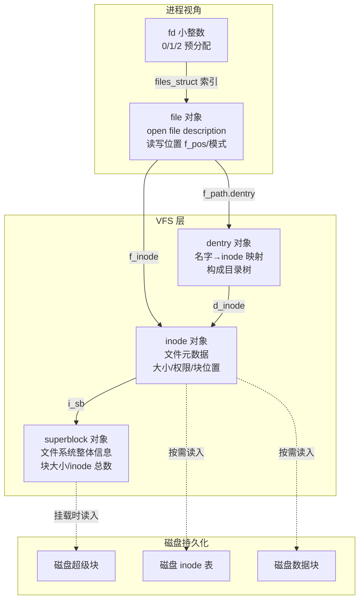
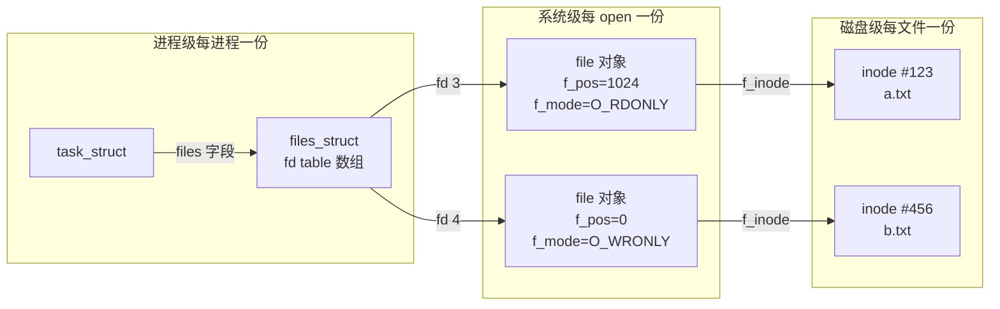
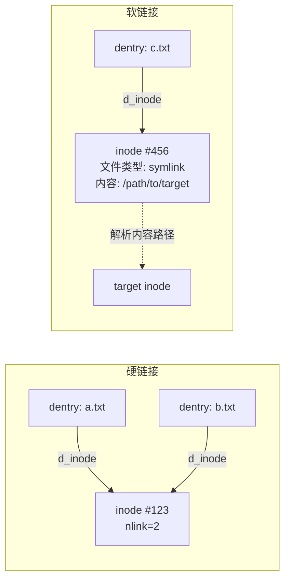
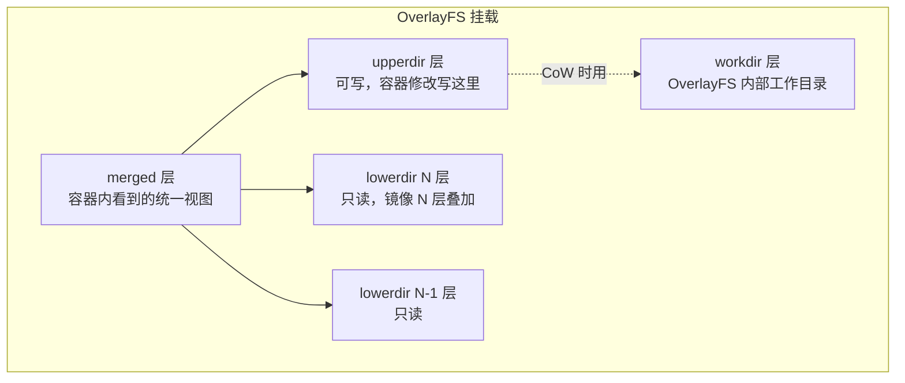

# 文件系统与 VFS

> **一句话定位**：VFS 是理解一切文件操作的根，OverlayFS 是容器镜像的底层。
> **面试热度**：⭐⭐⭐⭐⭐
> **返回**：[Linux 知识图谱](../README.md)

---

## 一、概述

### 1.1 主题在 Linux 体系中的位置

Linux 文件子系统的本质是一套**用户进程 ↔ VFS 抽象 ↔ 具体文件系统 ↔ 块设备**的四层栈，加上一个把"一切皆文件"贯彻到底的 fd 表。面试官问"讲讲 Linux 文件系统"看似只在考 `inode`/`dentry`，但它精准牵出五件事：VFS 四对象、fd 表层次、硬软链接、OverlayFS 分层、fsync 刷盘——能讲清这些才证明你不只是会敲 `ls -l`。

本主题覆盖六条主线：**VFS 抽象层**（superblock/inode/dentry/file 四对象）、**fd 表层次**（`files_struct` → `file` → inode）、**链接**（硬链接 vs 软链接、inode 视角）、**OverlayFS**（lowerdir/upperdir/workdir/merged、CoW、whiteout）、**伪文件系统**（procfs/sysfs/debugfs）、**fsync 与写屏障**（`fsync`/`fdatasync`/`O_SYNC`、磁盘 write cache）。

### 1.2 与其他主题的边界

| 主题 | 边界说明 |
|------|---------|
| [03 内存管理](../03-memory/memory-management.md) | Page Cache 作为文件页缓存在 03 讲**归属与回收**，**文件 IO 读写路径、脏页 writeback 触发**归 05 |
| [04 IO 模型与 epoll](../04-io/io-model-and-epoll.md) | epoll 监听 socket fd 的就绪通知归 04，**fd 的 VFS 含义、open/read/write 的 VFS 流程**归 05 |
| [07 安全与权限](../07-security/security-and-permission.md) | 文件权限位（rwx/ACL/SELinux label）归 07，**inode 的权限字段位置**归 05 |
| [09 性能与故障排查](../09-ops/performance-and-troubleshooting.md) | `df`/`du`/`lsof` 作为观测工具在本主题讲用法，**完整端到端排障四步法**归 09 |

> **记住边界**：本主题讲"文件怎么抽象、fd 怎么层次化、链接怎么对 inode 操作、OverlayFS 怎么分层、fsync 怎么刷盘"，不讲"Page Cache 回收策略（03）、epoll 事件机制（04）、ACL/SELinux 细则（07）、完整排障方法论（09）"。

### 1.3 关键术语速览

| 术语 | 一句话定义 | 出现阶段 |
|------|-----------|---------|
| VFS | Virtual File System，内核的文件操作抽象层，统一四对象接口 | VFS 抽象 |
| superblock | 超级块，描述一个已挂载文件系统的整体元信息 | 四对象 |
| inode | 索引节点，描述一个文件的元数据（大小/权限/块位置） | 四对象 |
| dentry | 目录项，构成目录树，把名字映射到 inode | 四对象 |
| file | 打开文件，描述进程与 inode 的会话（读写位置/模式） | 四对象 |
| fd | 文件描述符，进程级小整数，指向 `file` 对象 | fd 表 |
| inode number | inode 唯一编号，同一文件系统内唯一标识 inode | 链接 |
| hard link | 硬链接，多个 dentry 指向同一 inode | 链接 |
| symlink | 软链接，一个特殊文件其内容是目标路径字符串 | 链接 |
| mount | 挂载，把一个文件系统接到目录树的某一点 | VFS |
| OverlayFS | 联合挂载文件系统，把多层目录叠加成统一视图 | OverlayFS |
| procfs | 伪文件系统，挂载在 `/proc`，暴露内核与进程状态 | 伪文件系统 |
| sysfs | 伪文件系统，挂载在 `/sys`，暴露设备与内核对象模型 | 伪文件系统 |
| debugfs | 伪文件系统，挂载在 `/sys/kernel/debug`，调试用 | 伪文件系统 |

---

## 二、核心机制

### 2.1 VFS 四对象

VFS（Virtual File System）是内核的文件操作抽象层，把"具体文件系统（ext4/xfs/OverlayFS/procfs）"的差异屏蔽在统一接口下。`open`/`read`/`write`/`close` 等系统调用进入内核后，先走 VFS 通用逻辑，再 dispatch 到具体文件系统的实现（`file_operations`/`inode_operations` 函数表）。VFS 的核心是四对象：**superblock**（超级块）、**inode**（索引节点）、**dentry**（目录项）、**file**（打开文件）。



**四对象职责与源码路径**：

| 对象 | 职责 | 内存结构 | 磁盘对应 | 源码定义 |
|------|------|---------|---------|---------|
| superblock | 描述已挂载文件系统（块大小、inode 总数、空闲数） | `struct super_block` | 磁盘超级块 | `include/linux/fs.h` |
| inode | 文件元数据（大小、权限、块位置、时间戳） | `struct inode` | 磁盘 inode 表一项 | `include/linux/fs.h` |
| dentry | 目录项（名字 → inode 映射，构成目录树） | `struct dentry` | 磁盘目录项（ext4 的目录项） | `include/linux/dcache.h` |
| file | 打开文件会话（读写位置 `f_pos`、打开模式 `f_mode`） | `struct file` | 无（纯内存，进程打开时创建） | `include/linux/file.h` |

> **关键认知**：①**superblock 与 inode 在磁盘上有持久化对应**，挂载/访问时按需读入内存；②**dentry 纯内存**但有磁盘目录项对应（构成目录树缓存）；③**file 纯内存**——每次 `open` 创建一个，`close` 销毁，磁盘上无对应。`file` 的 `f_pos`（读写位置）只在内存，所以同一文件多次 `open` 得到独立 `f_pos`，互不影响。

### 2.2 文件描述符表层次

"fd 是什么"是高频面试题，关键在于讲清**三层映射**：进程级 `files_struct` → 系统级 `file` → inode。



**三层职责**：

| 层次 | 数据结构 | 粒度 | 关键字段 | 源码 |
|------|---------|------|---------|------|
| 进程级 fd 表 | `files_struct`（每进程一份） | 进程私有，存 fd 数组 | `fdt[fd]` 指向 `file` | `include/linux/fdtable.h` |
| 系统级 open file | `struct file`（每 `open` 一份） | 系统全局，可被多进程共享（fork 后） | `f_pos`（读写位置）、`f_mode` | `include/linux/file.h` |
| 磁盘级 inode | `struct inode`（每文件一份） | 文件系统全局，唯一标识文件 | `i_ino`（inode 号）、`i_size` | `include/linux/fs.h` |

**关键点**：

- **fd 与 `file` 是一对一但可复用**：fd 是 `files_struct.fdt[fd]` 的小整数索引，指向一个 `file` 对象。`close(fd)` 清掉索引位，`file` 引用计数归 0 才销毁。
- **`file` 与 inode 是多对一**：同一文件多次 `open` 产生多个 `file`，每个有独立 `f_pos`，但都指向同一 inode。
- **fork 后 `file` 被共享**：`fork()` 用 `CLONE_FILES` 标志决定是否复制 `files_struct`。默认复制（父子各一份 fd 表），但 fd 表里的指针指向**同一 `file` 对象**——所以父子进程共享 `f_pos`（这是 shell 重定向 `>& 子进程`能继承的前提）。
- **0/1/2 预分配**：每个进程默认有 fd 0（stdin）、1（stdout）、2（stderr），由 `init` 或 shell 的 `dup2` 设置。

> **fd 与 file 的区别**：fd 是**进程私有**的小整数（`files_struct` 的索引），`file` 是**系统级**的打开文件描述（open file description）。两个进程可以有不同的 fd 指向同一 `file`（通过 `fork` 或 `SCM_RIGHTS` 传 fd），此时它们共享 `f_pos`；也可以各自 `open` 同一文件得到不同 `file`，此时 `f_pos` 独立。

### 2.3 inode 与 dentry：目录树怎么长出来

**dentry 构成目录树**：每个 dentry 有名字（`d_name`）和指向的 inode（`d_inode`），还有父指针（`d_parent`）和子链表（`d_subdirs`）。从根 dentry（`/`）出发，沿父子链遍历就是目录树。路径解析（如 `/etc/hosts`）就是从根 dentry 开始，逐级查找子 dentry：`/` → `etc` → `hosts`。

**inode 与 dentry 的关系**：

- **inode 是文件的"身份证"**：包含文件大小、权限、块位置等元数据，通过 inode 号（`i_ino`）在文件系统内唯一标识。inode **不含文件名**——文件名是 dentry 的事。
- **dentry 是文件的"门牌"**：包含文件名与指向 inode 的指针。一个 inode 可以有多个 dentry 指向它（硬链接）。
- **dentry 缓存（dcache）**：内核维护 dentry 缓存加速路径解析，避免每次都读磁盘目录项。`/proc/sys/fs/dentry-state` 可看 dentry 缓存状态。

**路径解析流程**（`/etc/hosts`）：

1. 从根 dentry（`/`）开始，在 dcache 查子 dentry `etc`，未命中则读磁盘目录项。
2. 找到 `etc` 的 dentry，沿 `d_inode` 拿到 `etc` 的 inode。
3. 在 `etc` 的 dentry 下查子 dentry `hosts`，拿到 `hosts` 的 inode。
4. 返回 `hosts` 的 inode，VFS 后续可调 `inode_operations` 或创建 `file` 对象。

> **关键认知**：dentry 是"名字 → inode"的映射，**inode 不存名字**。这就是为什么硬链接能存在——多个 dentry（多个名字）指向同一 inode，inode 的 `i_nlink` 字段记录硬链接数，归 0 时才真正释放磁盘块。

### 2.4 硬链接 vs 软链接

硬链接与软链接是面试高频区分点，本质区别在"指向 inode 还是指向路径"：



| 维度 | 硬链接（hard link） | 软链接（symlink） |
|------|--------------------|------------------|
| 本质 | 多个 dentry 指向同一 inode | 一个特殊文件，内容是目标路径字符串 |
| inode | 与原文件同一 inode（`i_nlink` +1） | 独立 inode（文件类型 `S_IFLNK`） |
| 跨文件系统 | **不能**（inode 是 per-fs 的，跨 fs 无意义） | 可以（路径字符串可任意） |
| 跨挂载点 | 不能（同上） | 可以 |
| 删除原文件 | inode 不释放（nlink > 0），硬链接仍可读 | 软链接变"悬空链接"（dangling） |
| 创建权限 | 需对目标目录有写权限 | 需对目标目录有写权限 |
| 链接到目录 | 一般不允许（避免循环，ext4 默认禁） | 允许 |
| 创建命令 | `ln source target` | `ln -s source target` |
| inode 号 | 与原文件相同 | 不同 |

**为什么硬链接不能跨文件系统**：inode 号只在**同一文件系统内**唯一。文件系统 A 的 inode #123 与文件系统 B 的 inode #123 是两个完全不同的东西。硬链接靠"dentry 指向 inode"，跨 fs 后 dentry 无法指向另一个 fs 的 inode（`d_inode` 是内存指针，文件系统边界处无对应）。软链接只存"目标路径字符串"，路径解析时由 VFS 重新走路径查找，自然能跨 fs。

**为什么硬链接不能链接目录**：防止目录树出现环（`a/b -> a` 会导致路径解析死循环）。ext4 默认 ` hardened_links` 不允许，但 root 用户可强制（用于 `rename` 的原子操作场景）。软链接链接目录是允许的（但要小心循环）。

> **记忆口诀**：硬链接 = 同 inode 共享；软链接 = 路径字符串重定向。硬链接跨不了 fs（inode 局限），软链接跨得了（路径解析）。删除原文件，硬链接还在（inode 引用还在），软链接悬空（路径找不到目标）。

### 2.5 OverlayFS：容器镜像的底层

OverlayFS 是 Linux mainline 的联合挂载文件系统（4.0+ 进入主线），是 Docker 镜像分层的底层。它把多个目录"叠加"成一个统一视图，写时复制（CoW）保证只读层不被修改。OverlayFS 内容在 [Docker 容器本质与底层原理](../docker/01-foundation/container-principle.md) §2.3 已有基础介绍，本节从 VFS 角度深入。

**四层结构**：



| 层 | 作用 | 读写权限 | Docker 中的对应 |
|----|------|---------|----------------|
| lowerdir | 镜像的只读层，可多层叠加 | 只读 | `/var/lib/docker/overlay2/<hash>/diff/` |
| upperdir | 容器可写层，所有修改写这里 | 读写 | 容器专属，`/var/lib/docker/overlay2/<cid>/diff/` |
| workdir | OverlayFS 内部工作目录（CoW 临时文件） | 内部用 | `/var/lib/docker/overlay2/<cid>/work/` |
| merged | 叠加后的统一视图，挂载点 | 读写 | 容器 rootfs |

**CoW（Copy-On-Write）原理**：

- **读**：从 merged 读，按层级向上找（upperdir 优先，再 lowerdir 从上到下），第一次命中即返回。
- **写**（首次修改文件）：①文件不在 upperdir → 从 lowerdir 复制到 upperdir 后修改（**file-level** 复制，不是 block-level）；②已在 upperdir → 直接改。
- **删除**：在 upperdir 创建 **whiteout** 文件（character device 0/0），遮蔽 lowerdir 同名文件——对容器来说文件"消失"了，但 lowerdir 的原文件仍在。
- **新建**：直接写 upperdir。

**从 VFS 视角看 OverlayFS**：OverlayFS 是一个**注册到 VFS 的具体文件系统**，有自己的 `super_operations`/`inode_operations`/`file_operations`（源码 `fs/overlayfs/`）。挂载时 `mount -t overlay overlay -o lowerdir=...,upperdir=...,workdir=... /merged`，VFS 创建一个 overlay 类型的 superblock，它的 dentry/inode 是"叠加"逻辑实现——每个 merged 层的 dentry 查找时，OverlayFS 内部会依次查 upperdir、lowerdir，合并视图。

> **陷阱**：容器内 `rm` 一个镜像内的大文件**不会释放空间**——只是 upperdir 加了 whiteout 遮蔽了 lowerdir，**lowerdir 的原文件仍在**。要让镜像变小要在构建期删除，且最好**同一 Dockerfile 层 ADD + rm**（否则前层还有该文件）。关联 [Docker 容器本质](../docker/01-foundation/container-principle.md) §5 镜像分层存储。

### 2.6 伪文件系统：procfs / sysfs / debugfs

Linux 有一类"伪文件系统"——不对应磁盘上的真实文件，而是内核运行时动态生成内容，用 VFS 接口暴露内核/进程状态。三者挂载点与职责不同：

| 伪文件系统 | 挂载点 | 职责 | 典型内容 | 内核源码 |
|-----------|--------|------|---------|---------|
| procfs | `/proc` | 进程与内核状态 | `/proc/<pid>/` 进程信息、`/proc/meminfo`、`/proc/cpuinfo` | `fs/proc/` |
| sysfs | `/sys` | 设备与内核对象模型（kobject） | `/sys/class/`、`/sys/devices/`、`/sys/fs/cgroup/` | `fs/kernfs/`、`fs/sysfs/` |
| debugfs | `/sys/kernel/debug` | 调试接口（开发用） | 内核子系统调试参数 | `fs/debugfs/` |

**procfs 的两类内容**：

1. **进程相关**（`/proc/<pid>/`）——每个进程一个目录，含 `status`（状态）、`maps`（内存映射）、`fd/`（打开的 fd）、`cmdline`（启动命令）、`cwd`（工作目录符号链接）等。这是 `ps`/`top`/`lsof` 的底层数据源。
2. **系统相关**（`/proc/` 顶层）——`meminfo`（内存）、`cpuinfo`（CPU）、`loadavg`（负载）、`mounts`（挂载表）、`net/`（网络统计）等。

**为什么程序能"读自己的内存"**：`/proc/<pid>/maps` 列出进程的内存映射区域（text/data/heap/mmap/stack），`/proc/<pid>/mem` 是进程地址空间的字节流视图。内核在 procfs 的 `file_operations.read` 实现里，按 `f_pos`（即虚拟地址）从 `current->mm`（当前进程地址空间）读数据返回。这是 `gdb` 读取被调试进程内存的底层。

**sysfs 与 kobject**：sysfs 是内核对象模型（kobject）的 VFS 呈现，每个 kobject 在 `/sys` 下有对应目录。比如 `/sys/class/net/eth0/` 对应一个网络设备 kobject。sysfs 的写操作（`echo 1 > /sys/.../some_file`）会触发内核回调，这是用户态配置内核参数的通道。

> **关键认知**：伪文件系统的 `read`/`write` 不是真的磁盘 IO，而是内核函数调用——`cat /proc/cpuinfo` 等价于调内核函数 `cpuinfo_show()`，数据在内核态生成后拷到用户态，无磁盘参与。所以读 `/proc` 不会慢，但读 `/proc/<pid>/maps` 会暂时 `mmap_sem` 加锁，大进程可能影响性能。

### 2.7 fsync 与写屏障

文件写默认经过 Page Cache，`write` 只把数据写到缓存就返回（详见 [04 IO §2.7](../04-io/io-model-and-epoll.md)）。要保证数据真正落盘，必须显式刷盘。刷盘相关 API 与语义：

| API / 选项 | 作用范围 | 是否刷元数据 | 典型场景 |
|-----------|---------|-------------|---------|
| `fsync(fd)` | 单个 fd 的脏页 + inode 元数据 | 是 | 数据库 redo log、关键配置写 |
| `fdatasync(fd)` | 单个 fd 的脏页（仅必要元数据，如文件大小） | 仅必要 | 日志追加写（性能优于 fsync） |
| `O_SYNC`（open 时） | 每次 `write` 都同步刷盘 | 是 | 配置文件、审计日志 |
| `O_DSYNC`（open 时） | 每次 `write` 同步刷数据（仅必要元数据） | 仅必要 | 同 fdatasync 的 per-write 版 |
| `sync`（全局） | 所有脏页 | 是 | 系统关机前 |
| `msync(MSYNC_SYNC, addr, len)` | mmap 区域的脏页 | 是 | mmap 写文件后 |

**fsync 刷盘流程**：

1. 应用调 `fsync(fd)` → 进入内核 `do_fsync`（`fs/sync.c`）。
2. 内核调该 inode 的 `file_operations.fsync` 实现（如 ext4 的 `ext4_sync_file`）。
3. 文件系统把该 fd 关联的脏页从 Page Cache 提交到块层（`submit_bio`）。
4. 块层把 IO 发给块设备驱动，驱动下发到磁盘。
5. **磁盘 write cache**：现代磁盘有板载 write cache（NVMe 一般有，HDD 部分有）。数据到磁盘后可能先在 write cache，未真正写到盘片。fsync 要等磁盘确认"已落盘"才返回——这需要**写屏障（write barrier）**或 FUA（Force Unit Access）。
6. fsync 返回 0 表示数据已持久化（到盘片或非易失 cache）。

**写屏障与 FUA**：

- **barrier**：挂载选项 `-o barrier=1`（ext4 默认开），文件系统在元数据 IO 中插入屏障，保证顺序——避免元数据先于数据落盘导致一致性问题。fsync 依赖屏障保证"数据落盘 → 元数据落盘"的顺序。
- **FUA**：`REQ_FUA` 标志告诉磁盘"这次 IO 绕过 write cache 直接落盘"，比屏障开销小。NVMe 的 `nvme write -f` 支持。现代内核优先用 FUA 替代屏障。

**为什么数据库要 fsync**：数据库（MySQL InnoDB）的 redo log 写入必须保证持久化——崩溃后能靠 redo log 重放恢复。`write` 只到 Page Cache，掉电丢数据；`fsync` 强制落盘才能保证 ACID 的 D（持久性）。InnoDB 的 `innodb_flush_log_at_trx_commit=1` 就是每事务提交都 `fsync` redo log（最安全但最慢），`=0`/`=2` 是延迟刷或每秒刷（性能高但有丢数据风险）。

> **关键认知**：`write` 返回 0 不代表数据落盘，只代表进了 Page Cache。`fsync` 是显式强制刷盘并等设备确认。`O_SYNC` 是 open 时声明"每次 write 都同步刷"，等价于每次 write 后自动 fsync。磁盘 write cache 存在时，fsync 的"确认落盘"依赖写屏障或 FUA——所以**关闭 barrier 挂载选项能提速但有掉电丢数据风险**。

---

## 三、命令与示例

### 3.1 命令族速查表

| 命令 | 作用 | 常用形式 |
|------|------|---------|
| `ls` | 列目录 | `ls -l`（长格式）、`ls -i`（显 inode 号）、`ls -li`（两者） |
| `stat` | 看文件/文件系统元信息 | `stat file.txt`、`stat -f /`（文件系统信息） |
| `df` | 看文件系统磁盘用量 | `df -h`（人类可读）、`df -i`（inode 用量） |
| `du` | 看目录占用 | `du -sh dir`（汇总）、`du --max-depth=1` |
| `mount` | 挂载文件系统 | `mount -t overlay`、`mount -o remount,rw /` |
| `find` | 查找文件 | `find -inum 12345`、`find -type l`、`find -size +100M` |
| `lsof` | 看进程打开的文件 | `lsof -p <pid>`、`lsof -i:8080`、`lsof +L1`（删了但被持有） |
| `ln` | 创建链接 | `ln src dst`（硬）、`ln -s src dst`（软） |
| `fsck` | 文件系统检查与修复 | `fsck.ext4 /dev/sda1`、`fsck -y /dev/sda1` |
| `xfs_growfs` / `resize2fs` | 扩展文件系统 | `xfs_growfs /mnt`（xfs）、`resize2fs /dev/sda1`（ext4） |

### 3.2 实战 one-liner

```bash
# 1. 看文件 inode 号与硬链接数（ls -li）
ls -li /etc/hosts
# 12345 -rw-r--r-- 1 root root 158 8月 9 10:00 /etc/hosts
# 第 1 列 inode 号，第 3 列硬链接数

# 2. 看文件完整元信息（stat）
stat /etc/hosts
#   File: /etc/hosts
#   Size: 158         Blocks: 8          IO Block: 4096   regular file
#   Device: 801h/2049d  Inode: 12345       Links: 2
#   Access: (0644/-rw-r--r--)  Uid: (0/root)  Gid: (0/root)
#   Access: 2026-08-09 10:00:00  Modify: 2026-08-09 09:00:00

# 3. 看文件系统 inode 用量（df -i）
df -i /
# Filesystem     Inodes IUsed IFree IUse% Mounted on
# /dev/sda1      1000000 50000 950000   5% /
# inode 用满会导致"No space left on device"即使磁盘还有空间

# 4. 看某进程打开了多少 fd
lsof -p $(pidof java) | wc -l
ls /proc/$(pidof java)/fd | wc -l

# 5. 找 inode 号为 12345 的文件（恢复硬链接来源）
find / -inum 12345 2>/dev/null

# 6. 找所有符号链接
find /etc -type l -ls

# 7. 创建硬链接与软链接
ln /etc/hosts /tmp/hosts_hard       # 硬链接，ls -li 看 inode 相同
ln -s /etc/hosts /tmp/hosts_soft    # 软链接，ls -li 看 inode 不同

# 8. 找被删除但被进程持有的文件（lsof +L1）
lsof +L1
# COMMAND   PID USER   FD   TYPE DEVICE SIZE/O NLINK   NODE NAME
# java     12345  app   10w  REG    8,1  1.2G    0 123456 /tmp/big.log (deleted)
# NLINK=0 表示文件已从目录树删除，但进程还持有

# 9. 看进程的内存映射（/proc/<pid>/maps）
cat /proc/$(pidof java)/maps | head
# 00400000-00a00000 r-xp 00000000 08:01 12345  /usr/lib/jvm/java-8/bin/java
# 7f0000000000-7f0000100000 rw-p 00000000 00:00 0      [heap]

# 10. 看进程打开的 fd 列表（/proc/<pid>/fd）
ls -l /proc/$(pidof java)/fd
# 0 -> /dev/null
# 1 -> /var/log/app.log
# 10 -> socket:[12345]
# 11 -> anon_inode:[eventpoll]
```

### 3.3 命令输出解读

**`stat` 各字段含义**：

| 字段 | 含义 | 面试关注点 |
|------|------|-----------|
| `Size` | 文件字节数 | |
| `Blocks` | 占用 512B 块数 | 稀疏文件可能 `Blocks × 512` 远小于 `Size` |
| `Inode` | inode 号 | 硬链接 inode 相同，软链接不同 |
| `Links` | 硬链接数 | 删除一个硬链接 `Links-1`，归 0 才释放 |
| `Device` | 设备号（主:次） | 不同 fs 的 inode 号空间独立 |
| `Access` | 权限与类型 | `0644` 是八进制权限 |
| `Modify` | 数据修改时间 | `touch` 可改 |
| `Change` | inode 元数据修改时间 | 改权限/属主时变，`touch` 改不了 |

**`df -i` inode 用量**：

```
Filesystem     Inodes IUsed IFree IUse% Mounted on
/dev/sda1      1000000 50000 950000   5% /
```

- `Inodes`：该文件系统总 inode 数（创建时固定，ext4 可调 `mkfs.ext4 -N`）。
- `IUsed`/`IFree`：已用/空闲 inode 数。
- `IUse%`：inode 使用率。**inode 用满比磁盘满更隐蔽**——大量小文件（如邮件队列、session 文件）会先耗尽 inode 而非磁盘空间，报错 `No space left on device` 但 `df -h` 显示有空。

**`/proc/<pid>/maps` 字段**：

```
00400000-00a00000 r-xp 00000000 08:01 12345  /usr/lib/jvm/java-8/bin/java
│          │       │││ │          │  │       │
│          │       │││ │          │  │       └─ 文件路径（匿名区域为空）
│          │       │││ │          │  └─ inode 号
│          │       │││ │          └─ 设备号（主:次）
│          │       │││ └─ 文件内偏移
│          │       ││└─ 私有(p)/共享(s)
│          │       │└─ 读(r)/写(w)/执行(x)
│          │       └─ 映射模式
│          └─ 结束地址
└─ 起始地址
```

**`/proc/<pid>/fd`**：每进程一个目录，每个打开的 fd 一个符号链接条目（fd 号 → 真实文件/socket/pipe）。`ls -l` 能看到 fd 指向什么。这是 `lsof -p` 的底层数据源。

---

## 四、高频追问

### Q1：VFS 是什么？为什么需要它？

**参考答案**：VFS（Virtual File System）是内核的文件操作抽象层，把"具体文件系统（ext4/xfs/OverlayFS/procfs）"的差异屏蔽在统一接口下。`open`/`read`/`write` 等系统调用进入内核后，先走 VFS 通用逻辑，再 dispatch 到具体文件系统的实现。

**为什么需要它**：①**统一接口**——应用不需要管底层是 ext4 还是 OverlayFS，都调 `open`/`read`；②**跨文件系统操作**——`cp /proc/cpuinfo /tmp/a.txt` 能从伪文件系统拷到磁盘文件系统，靠 VFS 抽象；③**挂载叠加**——把多个 fs 挂到目录树不同点，VFS 负责路径解析跨挂载点。VFS 的核心是四对象（superblock/inode/dentry/file），每个对象有操作函数表（`file_operations`/`inode_operations`/`super_operations`），具体文件系统实现这些函数表，VFS 调用时多态 dispatch。

### Q2：inode 和 dentry 有什么区别？

**参考答案**：见 2.3 节。**inode** 是文件的"身份证"——包含文件大小、权限、块位置、时间戳等元数据，通过 inode 号在文件系统内唯一标识，**不含文件名**。**dentry** 是文件的"门牌"——包含文件名与指向 inode 的指针，构成目录树（父指针 + 子链表）。

**关系**：dentry 是"名字 → inode"的映射，一个 inode 可以有多个 dentry 指向它（硬链接）。inode 的 `i_nlink` 字段记录硬链接数，归 0 时才真正释放磁盘块。**源码定义**：inode 在 `include/linux/fs.h`，dentry 在 `include/linux/dcache.h`。

**路径解析**：`/etc/hosts` 从根 dentry 开始，逐级查子 dentry（`/` → `etc` → `hosts`），每步通过 dentry 的 `d_inode` 拿到对应 inode。dentry 缓存（dcache）加速这个过程，避免每次都读磁盘目录项。

### Q3：硬链接和软链接的区别？为什么硬链接不能跨文件系统？

**参考答案**：见 2.4 节对照表。**硬链接**：多个 dentry 指向同一 inode，inode 的 `i_nlink` +1。**软链接**：一个特殊文件，inode 类型是 `S_IFLNK`，内容是目标路径字符串。

**为什么硬链接不能跨文件系统**：inode 号只在**同一文件系统内**唯一。文件系统 A 的 inode #123 与文件系统 B 的 inode #123 是两个完全不同的东西。硬链接靠"dentry 指向 inode"（`d_inode` 是内存指针），跨 fs 后 dentry 无法指向另一个 fs 的 inode。软链接只存"目标路径字符串"，路径解析时由 VFS 重新走路径查找，自然能跨 fs。

**删除影响**：删原文件，硬链接的 inode `i_nlink` -1 但不释放（nlink > 0），硬链接仍可读；软链接变"悬空链接"（路径找不到目标）。**创建命令**：硬 `ln src dst`，软 `ln -s src dst`。

### Q4：一个文件被打开后，别人删了它，读取还会成功吗？

**参考答案**：**会成功**。这是 VFS 设计的精妙之处。文件被 `open` 后，内核创建 `file` 对象，`file` 持有对 inode 的引用（`f_inode`）。别人 `rm` 文件只是从目录树删了 dentry，inode 的 `i_nlink` 归 0，但**只要还有 `file` 引用，inode 不释放**——已打开的进程仍能正常 `read`/`write`。

**根因**：inode 的释放条件是 `i_nlink == 0 && i_count == 0`（无硬链接且无打开引用）。`rm` 让 nlink 归 0，但 `file` 的引用让 `i_count` > 0，inode 仍在内存。直到所有进程 `close` 该文件，`i_count` 归 0，inode 才真正释放，磁盘块回收。

**实用场景**：`lsof +L1` 能找到这类"已删除但被持有"的文件（NLINK=0 但有进程持有）。排查"删除大文件但空间没释放"就靠它——kill 持有进程即可释放空间（见 §6.1 案例）。

### Q5：OverlayFS 是什么？Docker 镜像怎么用它的？

**参考答案**：见 2.5 节。OverlayFS 是 Linux mainline 的联合挂载文件系统（4.0+ 进入主线），把多个目录叠加成统一视图。**四层**：lowerdir（只读，镜像层叠加）+ upperdir（可写，容器修改写这里）+ workdir（内部工作目录）+ merged（统一视图）。

**Docker 怎么用**：①镜像 pull 后每层解压成一个目录，按 hash 链叠加成 lowerdir（`lowerdir=l1:l2:l3...`）；②创建容器时生成专属 upperdir 与 workdir；③`mount -t overlay` 成 merged 作为容器 rootfs；④容器修改只写 upperdir，lowerdir 只读共享——**同一镜像启动 100 个容器只读层只占一份**。

**CoW 与 whiteout**：首次修改文件从 lowerdir 复制到 upperdir（file-level 复制，不是 block-level）；删除在 upperdir 创建 whiteout 文件（character device 0/0）遮蔽 lowerdir 同名文件。**陷阱**：容器内 `rm` 镜像内大文件不释放空间，lowerdir 原文件仍在。详见 [Docker 容器本质](../docker/01-foundation/container-principle.md) §5。

### Q6：/proc 是什么？为什么程序能读自己的内存？

**参考答案**：见 2.6 节。`/proc` 是 procfs 伪文件系统的挂载点，不对应磁盘真实文件，内核运行时动态生成内容。两类内容：①**进程相关**（`/proc/<pid>/`）——`status`/`maps`/`fd`/`cmdline`/`cwd` 等；②**系统相关**（`/proc/` 顶层）——`meminfo`/`cpuinfo`/`loadavg`/`mounts`/`net/` 等。

**为什么能读自己内存**：`/proc/<pid>/maps` 列出进程内存映射区域，`/proc/<pid>/mem` 是进程地址空间的字节流视图。内核在 procfs 的 `file_operations.read` 实现里，按 `f_pos`（即虚拟地址）从 `current->mm`（当前进程地址空间）读数据返回。这是 `gdb` 读被调试进程内存的底层。读 `/proc/<pid>/maps` 会加 `mmap_sem` 锁，大进程可能影响性能。

**本质**：伪文件系统的 `read`/`write` 不是磁盘 IO，而是内核函数调用——`cat /proc/cpuinfo` 等价于调 `cpuinfo_show()`，数据在内核态生成后拷到用户态，无磁盘参与。

### Q7：fsync 和 fdatasync 有什么区别？为什么数据库要 fsync？

**参考答案**：见 2.7 节对照表。**fsync(fd)**：刷该 fd 的所有脏页 + inode 元数据（大小、时间戳、权限等）到磁盘，等设备确认才返回。**fdatasync(fd)**：只刷脏页 + **必要元数据**（如文件大小，但不刷 Modify 时间等），开销小于 fsync。

**区别根因**：元数据落盘也要发 IO，fdatasync 省掉"非必要元数据"的 IO。日志追加写场景（如数据库 redo log、应用日志）只关心数据落盘，文件大小变化但访问时间不重要，fdatasync 性能更优。

**为什么数据库要 fsync**：数据库（MySQL InnoDB）的 redo log 写入必须保证持久化——崩溃后靠 redo log 重放恢复。`write` 只到 Page Cache，掉电丢数据；`fsync` 强制落盘才能保证 ACID 的 D（持久性）。InnoDB 的 `innodb_flush_log_at_trx_commit=1` 是每事务提交都 fsync redo log（最安全但最慢），`=0`/`=2` 是延迟刷或每秒刷（性能高但有丢数据风险）。**注意**：fsync 的"确认落盘"依赖磁盘 write cache 与写屏障/FUA——关 barrier 挂载选项能提速但有掉电丢数据风险。

### Q8：文件描述符是什么？0/1/2 是什么？

**参考答案**：见 2.2 节。fd（file descriptor）是进程级小整数，是 `files_struct.fdt[fd]` 数组的索引，指向一个 `file` 对象（open file description）。fd 本身只是个索引，真正的状态（读写位置 `f_pos`、打开模式 `f_mode`）在 `file` 对象里。

**0/1/2 预分配**：每个进程默认有 fd 0（stdin，标准输入）、1（stdout，标准输出）、2（stderr，标准错误）。由 `init` 或 shell 设置，通常指向终端设备（`/dev/tty`）或管道/文件（重定向后）。`dup2(oldfd, newfd)` 可把 newfd 重定向到 oldfd 指向的 `file`——shell 的 `> file` 就是 `dup2(open(file, O_WRONLY), 1)`。

**层次**：fd（进程私有，`files_struct`）→ `file`（系统级，每 open 一份）→ inode（磁盘级，每文件一份）。fork 默认复制 `files_struct`（父子各一份 fd 表），但 fd 表里的指针指向同一 `file`——所以父子共享 `f_pos`。

### Q9：一个进程能打开多少文件？ulimit 和 file-max 的区别？

**参考答案**：两层限制：①**进程级**——`ulimit -n`（`RLIMIT_NOFILE`），默认 1024 或 65536（看发行版），限制单个进程能打开的 fd 数；②**系统级**——`/proc/sys/fs/file-max`，限制全系统所有进程打开的文件总数（内核 `file` 对象池上限）。

**区别**：ulimit 是**进程级软硬限制**（`/proc/<pid>/limits` 可看），用户可调（`ulimit -n 65536`）但不能超硬限制（root 可调硬限制）。file-max 是**系统级上限**，由内核根据内存算出（每个 `file` 对象占约 1KB 内存），`sysctl -w fs.file-max=1000000` 可调。

**容器场景**：Docker 用 `--ulimit nofile=65536:65536` 限制容器内进程的 fd 上限，默认继承宿主 ulimit。高并发服务（如 Netty 5 万连接）要显式调高。关联 [04 IO §5.4](../04-io/io-model-and-epoll.md) 容器内 epoll。

### Q10：怎么查看一个进程打开了哪些文件？

**参考答案**：三种方式：

```bash
# 1. lsof -p <pid>（最常用，输出友好）
lsof -p $(pidof java)
# COMMAND  PID USER  FD  TYPE DEVICE SIZE/OFF NODE NAME
# java 12345 app  cwd DIR 8,1 4096 2 /var/app
# java 12345 app  10u REG 8,1 1.2G 12345 /var/log/app.log
# java 12345 app  11u sock 0,0 0t0 67890 [email protected]
# FD 列：cwd=工作目录，rtd=根目录，数字+u/w/r=fd 号与模式

# 2. ls /proc/<pid>/fd（底层，lsof 的数据源）
ls -l /proc/$(pidof java)/fd
# 0 -> /dev/null
# 1 -> /var/log/app.log
# 10 -> socket:[12345]
# 11 -> anon_inode:[eventpoll]

# 3. lsof -i:8080（按端口查）
lsof -i:8080  # 看谁监听/连接 8080 端口
```

**统计 fd 数**：`ls /proc/$(pidof java)/fd | wc -l` 或 `lsof -p $(pidof java) | wc -l`。fd 数接近 `ulimit -n` 上限要警惕——可能是连接泄漏（客户端没 close）或 Netty IdleStateHandler 没配。关联 [04 IO §6.2](../04-io/io-model-and-epoll.md) Netty 连接数排查案例。

### Q11：du 和 df 统计不一致是什么原因？

**参考答案**：**根因：被删除但被进程持有的文件**。`du` 遍历目录树统计（看到的文件都算），`df` 读文件系统 superblock 的空闲块统计。若一个文件被 `rm`（目录树无 dentry，`du` 看不到）但进程还持有（inode 未释放，磁盘块未回收），则 `df` 认为这些块仍被占用，`du` 认为这些块不存在——**df 显示的用量 > du 统计的总量**。

**定位方法**：`lsof +L1` 找 NLINK=0 但被进程持有的文件（+L1 是"link count < 1"过滤）。找到后 kill 持有进程，inode 释放，空间回收。

```bash
# du 显示 50G，df 显示 200G
du -sh /var  # 50G
df -h /var   # 200G used

# 找被删除但被持有的文件
lsof +L1 | grep /var
# java 12345 app 10w REG 8,1 150G 0 123456 /var/log/big.log (deleted)
# 这个文件 150G，被 java 进程持有，目录树已删

# kill 进程释放空间
kill 12345
df -h /var  # 复测：用量降回 50G
```

### Q12：为什么删除大文件后磁盘空间没释放？

**参考答案**：见 Q11 与 6.1 案例。文件被 `rm` 后：①目录树删了 dentry（`ls` 看不到）；②但若进程还持有该文件的 `file` 对象，inode 的 `i_count` > 0，inode 不释放，磁盘块不回收——`df` 仍认为这些块被占用。

**典型场景**：日志文件被 `rm` 清理，但写入日志的 Java 进程仍持有 fd（日志框架没 reopen）。空间不释放，`df` 显示磁盘满。

**正确做法**：①先 `kill` 持有进程（如重启 Java 服务），inode 释放空间回收；②或用 `truncate` 清空文件内容而非 `rm`——`> big.log` 让文件大小归 0 但 inode 仍存在，进程继续写入新内容；③或配置日志框架的 `RollingFileAppender` 滚动 + reopen，避免持有旧 fd。

**定位**：`lsof +L1` 找被删除但被持有的文件。详见 6.1 案例。

---

## 五、Java/容器关联

### 5.1 Spring Boot Layertools 与 OverlayFS 分层

Spring Boot 2.3+ 的 Layertools 把 fat jar 拆成多层（dependencies/spring-boot-loader/snapshot-dependencies/application），每层一个目录。Docker 构建时每层一个 `COPY --from=builder`，对应 OverlayFS 的一个 lowerdir 层：

```
镜像层（lowerdir）叠加：
  Layer 1: dependencies（第三方依赖，变化少）
  Layer 2: spring-boot-loader（启动器）
  Layer 3: snapshot-dependencies（SNAPSHOT 依赖）
  Layer 4: application（业务代码，变化多）
```

**为什么这样分层**：OverlayFS 的 lowerdir 是只读共享的——同一镜像启动多个容器，只读层只占一份。把变化少的放底层（dependencies），变化多的放顶层（application），改代码重新构建时**底层不变，Docker 缓存命中**，构建快、push/pull 数据量小。

> **关联 `framework/spring-framework`**：Spring Boot Layertools 的分层配置与构建命令详见该模块。**关联 `ops/docker`**：Docker 镜像分层存储与 OverlayFS 的对应详见 [Docker 容器本质](../docker/01-foundation/container-principle.md) §5。

### 5.2 Spring `@Value` 与配置文件加载

Spring 的 `@Value("${config.key}")` 从 Environment 取值，Environment 的属性源（PropertySource）链按顺序查找。常见顺序：命令行参数 → 环境变量 → `application.yml` → `application.properties`。每个属性源本质是一个文件或内存 Map，Spring 通过 VFS 抽象加载。

**与 VFS 关联**：①`classpath:application.yml`——Spring 用 VFS 读 classpath 资源（jar 内文件，本质是 zip entry，但 VFS 抽象统一）；②`file:./config/`——外部配置目录，VFS 读磁盘文件；③`configtree:/etc/config/**`——Spring Boot 2.4+ 支持从目录树加载配置（K8s ConfigMap 挂载点），VFS 遍历目录。

**热加载**：`@RefreshScope` + Spring Cloud Config，配置变更后重新读文件。底层仍走 VFS `read`，但要注意**文件被外部进程修改后，Spring 缓存的 PropertySource 不会自动失效**——需显式 refresh。

### 5.3 日志文件 fsync 与磁盘 IO 原力

Java 日志框架（Logback/Log4j2）写文件默认走 `FileChannel.write`（经 Page Cache，`write` 不阻塞）。若配 `immediateFlush=true`（Logback 默认），每次写后调 `FileChannel.force(false)`（等价 fsync，`false` 表示不刷元数据，类似 fdatasync）——保证日志不丢但 IO 开销大。

**性能权衡**：

| 配置 | 行为 | 性能 | 丢数据风险 |
|------|------|------|-----------|
| `immediateFlush=true` | 每条日志 fsync | 慢（每条一次刷盘） | 不丢 |
| `immediateFlush=false` + 异步刷 | 攒一批后 fsync | 快 | 崩溃丢最后一批 |
| `AsyncAppender` + `immediateFlush=true` | 异步线程 fsync | 中 | 崩溃丢队列未刷部分 |

**生产实践**：高吞吐日志用 `AsyncAppender` + 定时批量 fsync（如每秒一次），平衡性能与可靠性。关联 [04 IO §2.7](../04-io/io-model-and-epoll.md) Page Cache 与脏页 writeback。

### 5.4 FileChannel 与 sendfile / transferTo 零拷贝

Java NIO 的 `FileChannel.transferTo(position, count, WritableByteChannel)` 底层调 `sendfile` 系统调用（Linux），数据全在内核态从文件 Page Cache 到目标 Channel（通常是 socket），2 次上下文切换，零用户态拷贝。关联 [04 IO §2.6](../04-io/io-model-and-epoll.md) 零拷贝对比。

```java
// 静态文件下发（如 Spring WebFlux 静态资源）
FileChannel fileChannel = FileChannel.open(Paths.get("/var/www/index.html"));
fileChannel.transferTo(0, fileChannel.size(), socketChannel);
// 底层: sendfile(file_fd, socket_fd, offset, count)
```

**MappedByteBuffer 与 mmap**：`FileChannel.map(MapMode.READ_WRITE, pos, size)` 底层调 `mmap`，把文件 Page Cache 映射到用户态 `ByteBuffer`，访问 buffer 等价于访问 Page Cache，省一次"Page Cache → 用户 buf"拷贝。适用大文件随机访问（如 Kafka 的 index 文件、Lucene 的倒排索引）。坑：文件被截断后访问越界触发 SIGBUS。

### 5.5 实战映射表

| 场景 | Linux 知识点 | Java/容器关联 |
|------|-------------|--------------|
| Spring Boot 镜像分层缓存 | OverlayFS lowerdir 共享 | §5.1，Layertools 分层 = OverlayFS 层 |
| `@Value` 配置加载 | VFS 抽象 + procfs/sysfs | §5.2，配置文件加载顺序 |
| 日志 fsync 压力 | fsync/fdatasync + Page Cache | §5.3，Logback immediateFlush |
| Kafka 顺序读写快 | sendfile + mmap | §5.4，transferTo/MappedByteBuffer |
| 容器内删除大文件不释放 | OverlayFS whiteout + lowerdir 残留 | §2.5，构建期删而非运行时删 |
| 容器 rootfs 分层 | OverlayFS 四层 | §2.5，lowerdir=镜像层，upperdir=容器可写层 |
| Java 进程 fd 泄漏 | files_struct + ulimit | §Q9/Q10，`lsof -p` 排查 |
| /proc 读自己内存 | procfs 伪文件系统 | §2.6，`/proc/<pid>/maps`/`mem` |

---

## 六、故障排查案例

### 6.1 案例：du 显示 50G，df 显示 200G（被删除但被进程持有的文件）

**现象**：磁盘告警 `df -h /var` 显示 200G used（95%），但 `du -sh /var` 统计只有 50G，差 150G 不翼而飞。

**排障链**：

```bash
# 1. 对比 du 与 df
$ du -sh /var 2>/dev/null
50G     /var

$ df -h /var
Filesystem      Size  Used Avail Use% Mounted on
/dev/sda1       200G  200G  0G   100% /var   # df 显示 200G 满了

# 2. 找被删除但被进程持有的文件（NLINK=0 但有引用）
$ lsof +L1 | grep /var
COMMAND   PID USER   FD  TYPE DEVICE  SIZE/O NLINK  NODE NAME
java    12345 app   10w REG  8,1   150G   0   123456 /var/log/app.log (deleted)
#       ^^^^               ^^^^         ^^^^
#       进程持有 fd 10 写模式  文件 150G   NLINK=0 已删除但仍占用

# 3. 确认进程持有
$ ls -l /proc/12345/fd/10
lrwx------ 1 app app 64 8月 9 10:00 /proc/12345/fd/10 -> /var/log/app.log (deleted)
# fd 10 指向一个 (deleted) 文件

# 4. 根因：日志被 rm 清理，但 Java 进程的日志框架没 reopen，仍持有旧 fd 写入
# 空间没释放因为 inode 还在（进程持有），df 仍算它占用

# 5. 解决：重启 Java 进程（或让日志框架 reopen）
$ kill 12345 && /opt/app/start.sh
# 重启后 inode 释放，磁盘块回收

$ df -h /var
Filesystem      Size  Used Avail Use% Mounted on
/dev/sda1       200G  50G   150G 25%  /var    # 用量降回 50G
```

**解决**：①重启 Java 进程（kill 后 inode 释放）；②或配置 Logback 的 `RollingFileAppender` 滚动时 reopen（`prudent=false` 默认会 reopen）；③或用 `truncate -s 0 /var/log/app.log` 清空内容而非 `rm`——文件大小归 0 但 inode 仍在，进程继续写入新内容。

**方法论**：①`df -h` 显示满但 `du` 统计少 → 怀疑"被删除但被持有"的文件；②`lsof +L1`（link count < 1）精准定位；③看 `/proc/<pid>/fd/<fd>` 确认指向 `(deleted)`；④kill 持有进程释放空间，或改用 `truncate` 清空而非 `rm`。关联 [09 性能与故障排查](../09-ops/performance-and-troubleshooting.md) 的磁盘空间排障四步法。

### 6.2 案例：Docker 容器内写文件慢，定位 OverlayFS upperdir 在慢盘

**现象**：Docker 容器内应用写日志明显慢（宿主直接写秒级，容器内要 5-10 秒），`iostat` 显示某个盘 `await` 高。

**排障链**：

```bash
# 1. 看容器 rootfs 的 OverlayFS 挂载参数
$ docker inspect <cid> --format '{{.GraphDriver.Data.MergedDir}}'
/var/lib/docker/overlay2/<hash>/merged

$ mount | grep overlay2
overlay on /var/lib/docker/overlay2/<hash>/merged type overlay \
  (lowerdir=...,upperdir=/var/lib/docker/overlay2/<hash>/diff,\
   workdir=/var/lib/docker/overlay2/<hash>/work)

# 2. 看 upperdir 所在盘的 IO 延迟
$ iostat -xmt 1
Device  r/s  w/s  rMB/s  await  %util
sda     10   5    0.1    1.2    5%    # 系统盘，正常
sdb     20   50   0.5    85.0   95%   # 数据盘，await 85ms 严重饱和
# upperdir 在 sdb（/var/lib/docker 在 sdb 挂载点）

# 3. 确认 docker 数据目录
$ ls -l /var/lib/docker
lrwxrwxrwx 1 root root 9 8月 1 10:00 /var/lib/docker -> /data/docker
$ df -h /data/docker
Filesystem  Size  Used Avail Use% Mounted on
/dev/sdb    500G  200G  300G  40%  /data   # docker 数据在 sdb

# 4. 根因：upperdir 在慢盘 sdb，容器写都打到 sdb，await 85ms 导致写慢
# sdb 是机械盘（HDD），随机写性能差

# 5. 解决：迁移 docker 数据目录到 SSD
# 停 docker，迁移数据，改配置
$ systemctl stop docker
$ mv /data/docker /ssd/docker
$ ln -s /ssd/docker /var/lib/docker
$ systemctl start docker

# 复测
$ iostat -xmt 1
Device  r/s  w/s  rMB/s  await  %util
sdc     20   50   0.5    0.8    10%   # SSD，await 0.8ms 正常
# 容器内写日志恢复正常
```

**解决**：①迁移 Docker 数据目录到 SSD（`/var/lib/docker` 软链到 SSD 挂载点）；②或为容器单独挂载 volume（`-v /ssd/logs:/var/log`）绕过 OverlayFS upperdir；③生产环境 Docker 主机的数据目录应优先用 SSD/NVMe，避免 HDD 跑容器写。

**方法论**：①`docker inspect` 看 OverlayFS 挂载参数，定位 upperdir 路径；②`iostat -x` 看 upperdir 所在盘的 `await`/`%util`；③`df` 确认数据目录在哪个物理盘；④迁移到 SSD 或用 volume 绕过 OverlayFS。关联 [Docker 容器本质](../docker/01-foundation/container-principle.md) §5 镜像分层存储与 [09 性能与故障排查](../09-ops/performance-and-troubleshooting.md) 磁盘 IO 排障。

---

> **返回**：[Linux 知识图谱](../README.md)
