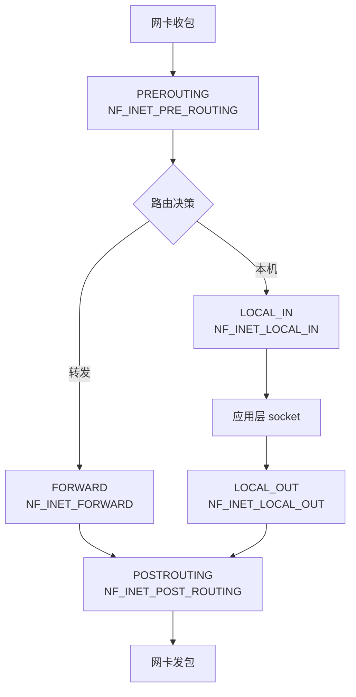
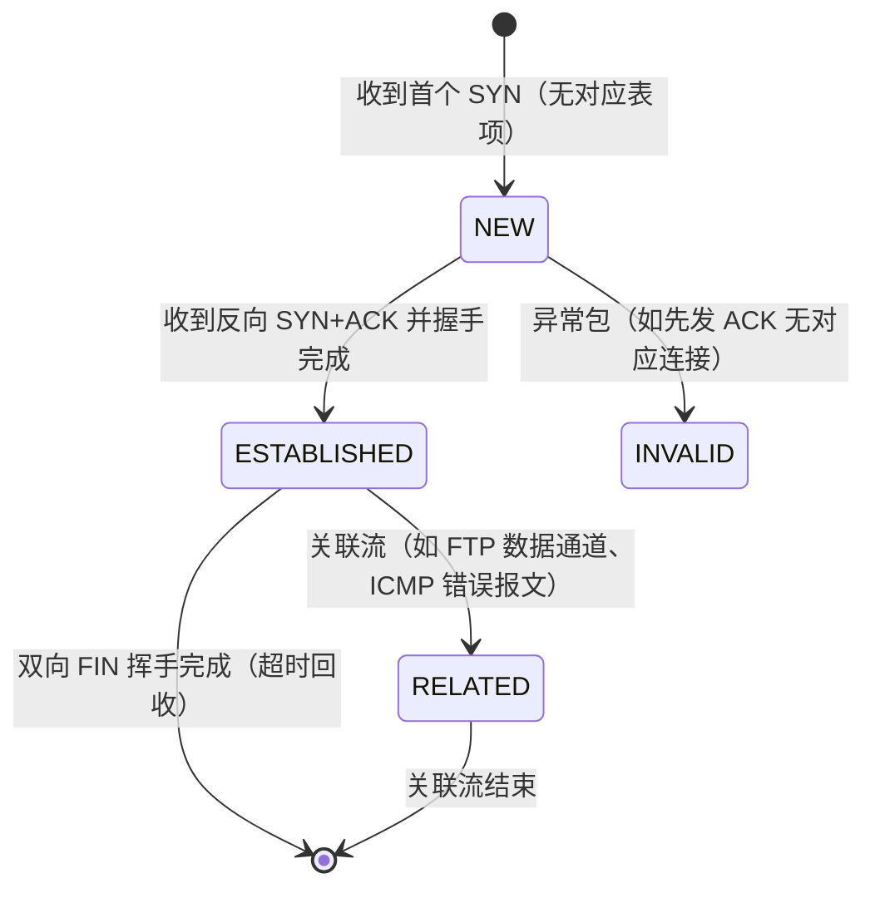
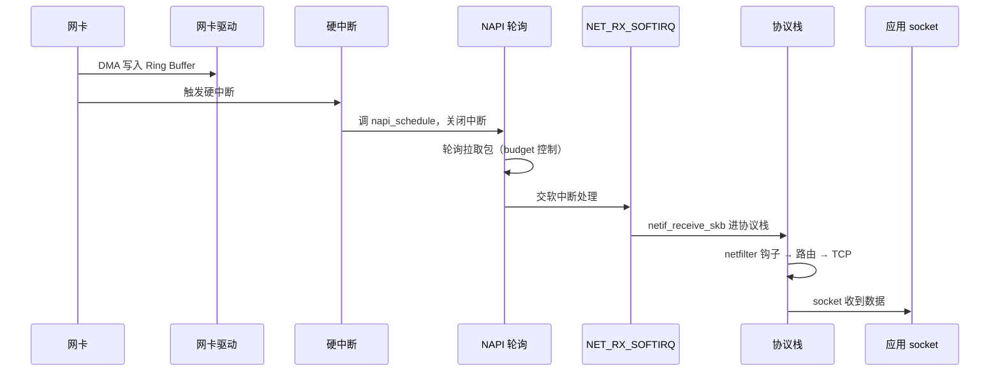
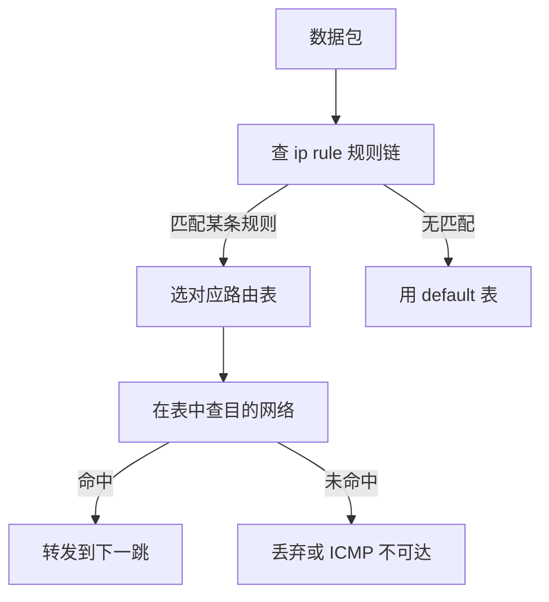
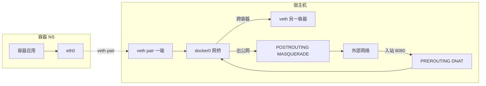

# 网络内核

> **一句话定位**：netfilter/iptables 是容器网络的底层，conntrack 耗尽是高并发服务的经典坑。
> **面试热度**：⭐⭐⭐⭐⭐
> **返回**：[Linux 知识图谱](../README.md)

---

## 一、概述

### 1.1 主题在 Linux 体系中的位置

Linux 网络内核的本质是**网卡 ↔ 协议栈 ↔ socket ↔ 应用**一条收发路径，外加 netfilter 在协议栈各关键点埋的钩子链与一张记录"连接四元组"的 conntrack 表。面试官问"讲讲 iptables"看似只在考几条命令，但它精准牵出五件事：netfilter 五钩子、iptables 四表五链、conntrack 表与耗尽、TCP 栈三队列、网卡 NAPI/RPS——能讲清这些才证明你不只是会敲 `iptables -L`。

本主题覆盖六条主线：**netfilter 五钩子**（PRE_ROUTING/LOCAL_IN/FORWARD/LOCAL_OUT/POST_ROUTING）、**iptables 表链**（raw/mangle/nat/filter 四表 × 五链）、**conntrack 表**（`/proc/net/nf_conntrack`、状态机、表耗尽）、**TCP 栈队列**（半连接 synq / 全连接 accept queue / 接收 recvq）、**网卡收包**（硬中断 → NAPI → softirq、RPS/RFS 多核分发）、**路由与策略路由**（`ip rule` + `ip route` 多路由表）。

### 1.2 与其他主题的边界

| 主题 | 边界说明 |
|------|---------|
| [04 IO 模型与 epoll](../04-io/io-model-and-epoll.md) | socket fd 的就绪通知与 epoll 机制归 04，**socket 在内核网络栈的收包路径、accept 队列与 ET 协作**归 06 |
| `ops/network` | TCP/UDP 协议层（三次握手、拥塞控制、TIME_WAIT）归 network，**内核侧的 netfilter 钩子、conntrack 表、iptables 规则、NAT 实现**归 06 |
| `ops/docker` | 容器网络（veth + bridge + iptables 端口映射）的工程用法归 docker，**iptables 规则长什么样、conntrack 如何追踪容器流**归 06 |
| `ops/k8s` | kube-proxy 的 iptables/IPVS 模式与 CNI 归 k8s，**底层 netfilter 钩子位置、conntrack 表压力的内核视角**归 06 |
| [09 性能与故障排查](../09-ops/performance-and-troubleshooting.md) | `tcpdump`/`ss`/`conntrack` 作为观测工具在本主题讲用法，**完整网络端到端排障四步法**归 09 |

> **记住边界**：本主题讲"包进内核后怎么走 netfilter 钩子、iptables 规则怎么匹配、conntrack 表怎么追踪、TCP 栈队列怎么排队、网卡怎么收包"，不讲"TCP 协议字段、拥塞算法（network）、容器网络工程模型（docker/k8s）、完整排障方法论（09）"——那些是上游模块的事。

### 1.3 关键术语速览

| 术语 | 一句话定义 | 出现阶段 |
|------|-----------|---------|
| netfilter | 内核协议栈的报文处理框架，在五处埋钩子 | netfilter |
| 钩子（hook） | netfilter 在协议栈的五个挂载点，NF_INET_* | netfilter |
| iptables | netfilter 的用户态规则配置工具，按表/链组织 | iptables |
| 表（table） | iptables 按功能划分的规则集（raw/mangle/nat/filter） | iptables |
| 链（chain） | iptables 按钩子位置划分的规则序列（五链） | iptables |
| conntrack | 连接追踪，记录每条流的四元组与状态 | conntrack |
| accept queue | 全连接队列，已完成三次握手待 accept 的连接 | TCP 栈队列 |
| synq | 半连接队列，收到 SYN 未完成握手的连接 | TCP 栈队列 |
| recvq | 接收队列，socket 已收到未应用读取的字节 | TCP 栈队列 |
| NAPI | 混合中断+轮询的网卡收包机制，降低中断风暴 | 网卡收包 |
| RPS | Receive Packet Steering，按 CPU mask 分发软中断到多核 | 网卡收包 |
| RFS | Receive Flow Steering，按流亲和性分发到同一 CPU | 网卡收包 |
| softirq | 软中断，网络收包的 `NET_RX_SOFTIRQ` | 网卡收包 |
| 策略路由 | `ip rule` + 多路由表，按规则选表再查路由 | 路由 |

---

## 二、核心机制

### 2.1 netfilter 五钩子

netfilter 是 Linux 内核协议栈的报文处理框架（源码 `net/netfilter/`），在 IP 层收发路径的五个关键点埋了钩子（hook），每个钩子挂一组规则链，包经过时依次匹配。五个钩子按收发流向分布：



**五钩子位置与源码**：

| 钩子常量 | 链名 | 触发时机 | 典型用途 |
|----------|------|---------|---------|
| `NF_INET_PRE_ROUTING` | PREROUTING | 包刚进协议栈、路由决策前 | DNAT（端口映射）、raw 表 NOTRACK |
| `NF_INET_LOCAL_IN` | INPUT | 路由判定为本机接收的包 | filter 表过滤入站、conntrack 已建立放行 |
| `NF_INET_FORWARD` | FORWARD | 路由判定为转发到其他接口的包 | filter 表过滤转发、容器跨节点流量 |
| `NF_INET_LOCAL_OUT` | OUTPUT | 本机应用发出的包 | filter 过滤出站、本地生成的 NAT |
| `NF_INET_POST_ROUTING` | POSTROUTING | 包即将出网卡前 | SNAT（MASQUERADE）、容器出公网改源 IP |

> **关键认知**：五钩子是 netfilter 框架的"挂载点"，iptables 是基于 netfilter 的用户态工具——它把规则按"表 × 链"组织，注册到对应钩子。包经过一个钩子时，按表的优先级（raw > mangle > nat > filter）依次执行该链上各表的规则。钩子注册入口在 `net/netfilter/core.c` 的 `nf_register_net_hook`，IP 层调用点在 `net/ipv4/ip_input.c`/`ip_output.c`/`ip_forward.c`。

### 2.2 iptables 表链关系

iptables 把规则按两个维度组织：**表（table）**按功能分（raw/mangle/nat/filter），**链（chain）**按钩子位置分（PREROUTING/INPUT/FORWARD/OUTPUT/POSTROUTING）。一张表只挂载到部分链上：

| 表 | 功能 | 优先级 | 挂载的链 | 典型动作 |
|----|------|--------|---------|---------|
| raw | 在 conntrack 前标记，跳过追踪 | 最高（先执行） | PREROUTING、OUTPUT | `-j NOTRACK` 跳过 conntrack |
| mangle | 修改报文元数据（TOS/TTL/mark） | 次高 | 全部五链 | `-j MARK --set-mark` |
| nat | 地址翻译（DNAT/SNAT） | 次低 | PREROUTING（DNAT）、POSTROUTING（SNAT）、OUTPUT | `-j DNAT`、`-j MASQUERADE` |
| filter | 过滤（ACCEPT/DROP） | 最低（最后执行） | INPUT、FORWARD、OUTPUT | `-j DROP`、`-j ACCEPT` |

**同一链上多表执行顺序**：包经过某链时，按 raw → mangle → nat → filter 的优先级依次匹配各表规则。例如 PREROUTING 链同时挂 raw/mangle/nat，包先过 raw（决定是否追踪），再过 mangle（改 mark），最后过 nat（做 DNAT）。filter 表不挂 PREROUTING——因为过滤决策通常在路由后（INPUT/FORWARD）才做。

**四表五链对应矩阵**（✓ 表示该表挂该链）：

| 链 \ 表 | raw | mangle | nat | filter |
|---------|-----|--------|-----|--------|
| PREROUTING | ✓ | ✓ | ✓（DNAT） | |
| INPUT | | ✓ | ✓（SNAT 内部） | ✓ |
| FORWARD | | ✓ | | ✓ |
| OUTPUT | ✓ | ✓ | ✓（DNAT 本地） | ✓ |
| POSTROUTING | | ✓ | ✓（SNAT） | |

> **面试口径**：能说出"四表 raw/mangle/nat/filter，优先级 raw > mangle > nat > filter；五链对应 netfilter 五钩子；nat 表做 NAT（PREROUTING 做 DNAT、POSTROUTING 做 SNAT），filter 表做过滤（INPUT/FORWARD/OUTPUT）"就够。高级岗可补一句"raw 表的 NOTRACK 用于跳过 conntrack 追踪，对超大流量（如镜像端口流量）减少表压力"。

### 2.3 conntrack：连接追踪表

conntrack（connection tracking）是 netfilter 的子系统（源码 `net/netfilter/nf_conntrack_core.c`），记录每条网络流的四元组（src_ip:port → dst_ip:port）与状态。它让防火墙能区分"这是新连接的 SYN"还是"这是已建立连接的数据包"，从而对已建立的连接放行（`-m state --state ESTABLISHED -j ACCEPT`）。

**conntrack 状态机**：



| 状态 | 含义 | 典型包 |
|------|------|--------|
| NEW | 连接新建，只见到首个 SYN | TCP SYN |
| ESTABLISHED | 连接已建立（双向通信过） | 握手完成后的数据包 |
| RELATED | 与已有连接相关联（如 FTP 数据通道、ICMP 错误） | FTP 20 端口、ICMP 不可达 |
| INVALID | 无法识别的异常包（先发 ACK 无对应连接） | 乱序/伪造包 |
| UNREPLY（可选） | NEW 的反方向，等回应 | 未收到回应的 SYN |

**conntrack 表**：内核维护一张哈希表，每条表项记录四元组、状态、超时时间、流量统计。查看 `/proc/net/nf_conntrack`：

```
ipv4 2 tcp 6 431999 ESTABLISHED src=10.0.0.5 dst=10.0.0.10 sport=54321 dport=80 src=10.0.0.10 dst=10.0.0.5 sport=80 dport=54321 [ASSURED] mark=0 use=2
```

字段含义：`tcp 6`（协议）、`431999`（剩余超时秒）、`ESTABLISHED`（状态）、两组 src/dst（正向与反向流）、`[ASSURED]`（已确认双向通信）。

**表上限与耗尽**：

| 参数 | 路径 | 默认 | 含义 |
|------|------|------|------|
| `nf_conntrack_max` | `/proc/sys/net/netfilter/nf_conntrack_max` | 65536（可调） | 表最大条目数 |
| `nf_conntrack_count` | `/proc/sys/net/netfilter/nf_conntrack_count` | 实时 | 当前条目数（只读） |
| `nf_conntrack_buckets` | 模块参数 | 65536（哈希桶） | 哈希桶数（模块加载时定，不可动态改） |
| `nf_conntrack_tcp_timeout_established` | sysctl | 432000（5 天） | ESTABLISHED 状态超时 |

**耗尽现象**：当 `nf_conntrack_count` 达到 `nf_conntrack_max`，新连接的 SYN 被丢弃，`dmesg` 出现 `nf_conntrack: table full, dropping packet`。高并发服务（如 K8s NodePort、NAT 网关）是经典坑。调大 `nf_conntrack_max`（需同时调 `nf_conntrack_buckets`，重新加载模块）并缩短超时可缓解。关联 `ops/network` 的 NAT 穿透与 `ops/k8s` 的 Service conntrack 压力。

### 2.4 TCP 栈三队列

TCP 连接建立与收发涉及三个关键队列，理解它们是排查连接超时与丢弃的基础：

```mermaid
flowchart LR
    Client[客户端] -->|SYN| SYNQ[半连接队列 SYN queue<br/>syncookies]
    Client -->|SYN+ACK<br/>握手| SYNQ
    SYNQ -->|三次握手完成| ACCQ[全连接队列 accept queue<br/>min(somaxconn, backlog)]
    ACCQ -->|accept| APP[应用 socket]
    APP -->|read| RECVQ[接收队列 recvq<br/>socket 缓冲]
    RECVQ --> APP
```

| 队列 | 内核参数/字段 | 作用 | 满的后果 |
|------|--------------|------|---------|
| 半连接队列（synq） | `tcp_max_syn_backlog` | 存收到 SYN 但未完成握手的连接 | SYN 丢弃或触发 syncookies |
| 全连接队列（accept queue） | `min(net.core.somaxconn, listen backlog)` | 存已完成握手待应用 accept 的连接 | 超时后重传 SYN+ACK 或发 RST |
| 接收队列（recvq） | socket 的 `sk_receive_queue` | 存已收到但应用未 read 的字节 | 窗口收缩，对端停止发送 |

**`ss -lnt` 输出解读**：

```
State  Recv-Q Send-Q Local Address:Port  Peer Address:Port
LISTEN 0      128    0.0.0.0:8080        0.0.0.0:*
```

- **Recv-Q**：当前 accept queue 长度（已完成握手待 accept 的连接数）。**非 0 表示应用 accept 速度跟不上**，持续增长说明应用处理慢。
- **Send-Q**：listen 时的 backlog 值（配置的全连接队列上限）。这里 128，即 `min(somaxconn, backlog)` 的结果。

> **关键认知**：accept queue 满时，内核默认行为是丢弃完成握手的 ACK（让客户端超时重传 SYN+ACK），若 `tcp_abort_on_overflow=1` 则直接发 RST。应用 accept 慢导致 accept queue 堆积是 Java 服务（Tomcat/Netty）偶发连接超时的根因。调大 `somaxconn` + 应用 `listen backlog` 是标准解法。关联 [04 IO §2.4](../04-io/io-model-and-epoll.md) 的 epoll ET 与 accept 协作。

**SYN Flood 与 syncookies**：攻击者发大量伪造源 IP 的 SYN，塞满半连接队列（synq），合法连接无法建立。内核 `tcp_syncookies`（默认 1）开启 syncookies：队列满时不存半连接，而用加密 cookie 编码连接信息返回 SYN+ACK，合法客户端回 ACK 时还原连接。这是防 SYN Flood 的经典机制，但有性能开销，生产环境仍要靠上游防护。

### 2.5 网卡收包流程：硬中断 → NAPI → softirq

网卡收到数据包后，经过硬中断 → NAPI 轮询 → 软中断（softirq）→ 协议栈的路径交付应用：



**NAPI（New API）**：传统模式下每个包触发一次硬中断，高吞吐时中断风暴耗尽 CPU。NAPI 采用混合策略：①第一个包来触发硬中断，进入轮询模式后**关闭硬中断**；②后续包在轮询中批量拉取（受 `budget` 控制，一次最多拉 N 个包）；③轮询空了或 budget 用完，重新开硬中断。这样低吞吐时及时响应，高吞吐时降中断开销。

**RPS/RFS 多核分发**：单核处理 softirq 成为瓶颈时，RPS/RFS 把收包分发到多核：

| 机制 | 原理 | 配置 | 适用 |
|------|------|------|------|
| RSS | 网卡硬件多队列，按哈希分发到不同 CPU 的硬中断 | `ethtool -L eth0 combined N` | 网卡支持多队列 |
| RPS | 软件层按 CPU mask 分发 softirq 到指定核 | `/sys/class/net/eth0/queues/rx-*/rps_cpus` | 网卡无多队列 |
| RFS | 按流亲和性，把同一流分发到应用所在 CPU | `/proc/sys/net/core/rps_flow_cnt` | 降低 CPU 缓存失效 |

> **面试口径**：能说出"网卡收包经硬中断 → NAPI 轮询 → NET_RX_SOFTIRQ 软中断 → 协议栈；NAPI 混合中断+轮询降低高吞吐中断开销；RPS/RFS 把 softirq 分发到多核"就够。高级岗可补一句"高 pps 场景看 `cat /proc/interrupts | grep eth0` 确认 RSS 是否均衡分布，不均衡调 `smp_affinity`"。源码入口 `net/core/dev.c` 的 `net_rx_action`（softirq 处理函数）。

### 2.6 路由与策略路由

Linux 路由默认查主路由表（`main`），策略路由（policy routing）允许按规则选不同路由表，实现"源 IP / 标记 / 接口"分流。机制是 `ip rule`（规则）+ `ip route`（表）的组合：

**路由决策流程**：



**多路由表**：Linux 最多支持 32767 个路由表（`/etc/iproute2/rt_tables` 定义编号到名字映射），默认三张：

| 表 | 编号 | 作用 |
|----|------|------|
| local | 255 | 本地地址（lo/本机 IP），优先级最高 |
| main | 254 | 主路由表，`ip route` 默认查它 |
| default | 253 | 默认路由表（兜底） |

**`ip rule` 规则**：每条规则指定"匹配条件 → 选哪个表"，按优先级（priority 数字小先匹配）：

```bash
$ ip rule show
0:     from all lookup local       # 优先级 0，所有包先查 local 表
32766: from all lookup main         # 优先级 32766，查 main 表
32767: from all lookup default      # 兜底
```

**策略路由典型用法**：多网卡环境按源 IP 选出口（`ip rule add from 10.0.0.5 table 100`），或按防火墙标记选表（`ip rule add fwmark 0x1 table 100`）。容器场景常用：Pod 流量打标记后选独立表，与宿主机流量分流。

> **关联**：策略路由是 `ops/network` 路由层的内核侧实现，容器网络（`ops/docker` veth + bridge、`ops/k8s` CNI）的流量分流依赖它。源码在 `net/ipv4/fib_rules.c` 的 `fib_lookup`。

### 2.7 关键源码路径

| 对象 | 源码/路径 | 说明 |
|------|----------|------|
| netfilter 核心 | `net/netfilter/core.c` | 钩子注册与调用入口 `nf_register_net_hook` |
| 钩子调用点 | `net/ipv4/ip_input.c`/`ip_output.c`/`ip_forward.c` | IP 层在收/发/转发路径调 `NF_HOOK` |
| conntrack 核心 | `net/netfilter/nf_conntrack_core.c` | 表项创建/查找/老化 |
| conntrack 表接口 | `/proc/net/nf_conntrack` | 用户态查看表项 |
| iptables 规则 | `/proc/net/ip_tables_names` 等 | 当前加载的表与链 |
| TCP 队列 | `net/ipv4/tcp_ipv4.c`/`tcp_minisocks.c` | synq/accept queue 实现 |
| NAPI | `net/core/dev.c` 的 `net_rx_action` | 软中断收包入口 |
| 路由策略 | `net/ipv4/fib_rules.c` 的 `fib_lookup` | 多路由表查询 |

面试口径：能说出"netfilter 钩子在 `net/netfilter/core.c` 注册，IP 层在 `ip_input.c`/`ip_output.c` 调 `NF_HOOK`，conntrack 在 `nf_conntrack_core.c`，表项看 `/proc/net/nf_conntrack`"就足够。高级岗可补一句"五钩子常量是 `NF_INET_PRE_ROUTING` 等，定义在 `include/uapi/linux/netfilter.h`"。

---

## 三、命令与示例

### 3.1 命令族速查表

| 命令 | 作用 | 常用子命令 |
|------|------|-----------|
| `iptables` | 配置 netfilter 规则 | `-L`/`-t nat -L`/`-A`/`-D`/`-save`/`-restore` |
| `ss` | 看 socket 统计 | `-lnt`（监听）/`-tn`（已建立）/`-s`（汇总）/`-tnp`（带进程） |
| `conntrack` | 看 conntrack 表（需 conntrack-tools） | `-L`（列表）/`-C`（计数）/`-S`（统计） |
| `ip` | 网络配置 | `addr`/`link`/`route`/`rule`/`neigh` |
| `tcpdump` | 抓包 | `-i`/`-nn`/`-X`/`-c`/`-w` |
| `ethtool` | 网卡状态与统计 | `-S`（统计）/`-g`（Ring Buffer）/`-k`（特性）/`-L`（多队列） |
| `nstat` | 内核网络协议统计 | `nstat -z`/`nstat -s` |
| `netstat` | 传统网络统计（已被 ss 替代） | `-s`（协议统计）/`-tlnp` |

### 3.2 实战 one-liner

```bash
# 1. 看监听端口与 accept queue 状态（最常用）
ss -lnt | grep :8080
# State  Recv-Q Send-Q Local Address:Port  Peer Address:Port
# LISTEN 0      128    0.0.0.0:8080        0.0.0.0:*
# Recv-Q=当前 accept queue 长度，Send-Q=listen backlog

# 2. 看 NAT 规则（Docker 端口映射长什么样）
iptables -t nat -L PREROUTING -n -v
# Chain PREROUTING (policy ACCEPT  packets, bytes)
#  DNAT tcp -- * * 0.0.0.0/0 0.0.0.0 tcp dpt:8080 to:172.17.0.2:8080

# 3. 看 conntrack 表（按目标 IP 过滤）
conntrack -L -d 1.2.3.4
# conntrack v1.4.6 (5 entries, 65536 max)
# tcp 6 431999 ESTABLISHED src=10.0.0.5 dst=1.2.3.4 ...

# 4. 看 conntrack 表使用量与上限
cat /proc/sys/net/netfilter/nf_conntrack_count
cat /proc/sys/net/netfilter/nf_conntrack_max
conntrack -C   # 同上，count

# 5. 看 conntrack 统计（找哪类流多）
conntrack -S
# entries  active  tcp  udp  ... found new invalid

# 6. 抓 TCP 三次握手（最经典抓包）
tcpdump -i eth0 -nn 'port 80' -c 100
# 10:00:00.000000 IP 10.0.0.5.54321 > 10.0.0.10.80: Flags [S], ...
# 10:00:00.000100 IP 10.0.0.10.80 > 10.0.0.5.54321: Flags [S.], ...
# 10:00:00.000200 IP 10.0.0.5.54321 > 10.0.0.10.80: Flags [.], ...

# 7. 看网卡 Ring Buffer 与统计
ethtool -g eth0     # Ring Buffer 大小（rx/tx）
ethtool -S eth0     # 收发包/丢包/错误统计
ethtool -k eth0     # 特性（GRO/GSO/checksum offload）

# 8. 看网卡多队列与中断分布
ethtool -l eth0     # Channel 数（多队列）
cat /proc/interrupts | grep eth0   # 各队列中断分布到哪些 CPU

# 9. 看路由与策略路由
ip route show                   # 主路由表
ip route show table 100         # 指定表
ip rule show                    # 策略路由规则

# 10. 看 TCP 协议统计（/proc/net/snmp）
cat /proc/net/snmp | grep -A1 '^Tcp:'
# Tcp: RtoAlgorithm RtoMin RtoMax MaxConn ActiveOpens PassiveOpens AttemptFails ...
# Tcp: 1 200 120000 -1 12345 678 0 ...

# 11. 看 socket 汇总
ss -s
# Total: 12345 (kernel 6789 estab)
# TCP: 10000 (estab 9000, closed 200, orphaned 50, synrecv 10)

# 12. 持久化 iptables 规则
iptables-save > /etc/sysconfig/iptables
iptables-restore < /etc/sysconfig/iptables
```

### 3.3 命令输出解读

**`ss -lnt` 的 Recv-Q 与 Send-Q**：

| 字段 | LISTEN 状态含义 | ESTAB 状态含义 |
|------|----------------|----------------|
| Recv-Q | 当前 accept queue 长度（待 accept 的已完成握手连接数） | socket 接收缓冲已收到未读字节数 |
| Send-Q | listen backlog 值（配置上限 `min(somaxconn, backlog)`） | socket 发送缓冲待发字节数 |

> **关键认知**：LISTEN 状态的 Recv-Q 持续非 0 是**应用 accept 速度跟不上**的信号，涨到接近 Send-Q（backlog）时新连接会被丢。ESTAB 状态的 Recv-Q 大表示应用 read 慢，数据堆在 socket 缓冲。

**`/proc/net/snmp` 的 TCP 指标**：

```
Tcp: RtoAlgorithm RtoMin RtoMax MaxConn ActiveOpens PassiveOpens AttemptFails EstabResets CurrEstab InSegs OutSegs RetransSegs
Tcp: 1 200 120000 -1 12345 678 0 10 9000 5000000 5000500 12
```

关键指标：`ActiveOpens`（主动发起 SYN 数）、`PassiveOpens`（被动接受连接数，即 accept 次数）、`CurrEstab`（当前 ESTABLISHED 连接数）、`RetransSegs`（重传段数，**高重传率说明网络质量差或对端处理慢**）。重传率 = `RetransSegs / OutSegs`，生产环境应 < 1%。

**`conntrack -S` 统计**：

```
entries  active  hitsearch  found  new  invalid  insert  delete  ...
678      600     150000     149000  678  5        678     0
```

`entries`（当前表项数）、`found`（查找命中数）、`new`（新建连接数）、`invalid`（无效包数，**突增说明有伪造包或网络异常**）。

---

## 四、高频追问

### Q1：netfilter 的五个钩子是什么？在协议栈什么位置？

**参考答案**：见 2.1 节。五个钩子按收发路径分布：①**PRE_ROUTING**（`NF_INET_PRE_ROUTING`）——包刚进协议栈、路由决策前，做 DNAT；②**LOCAL_IN**（`NF_INET_LOCAL_IN`）——路由判定本机接收的包，做入站过滤；③**FORWARD**（`NF_INET_FORWARD`）——路由判定转发的包，做转发过滤；④**LOCAL_OUT**（`NF_INET_LOCAL_OUT`）——本机应用发出的包，做出站过滤/本地 NAT；⑤**POST_ROUTING**（`NF_INET_POST_ROUTING`）——包即将出网卡前，做 SNAT。

**位置记忆**：收包路径是 网卡 → PREROUTING → 路由决策 →（本机走 LOCAL_IN / 转发走 FORWARD）→ POSTROUTING → 网卡；本机发包路径是 应用 → LOCAL_OUT → POSTROUTING → 网卡。钩子注册在 `net/netfilter/core.c` 的 `nf_register_net_hook`，IP 层调用点在 `ip_input.c`/`ip_output.c`/`ip_forward.c` 调 `NF_HOOK` 宏。

### Q2：iptables 的表和链是什么关系？哪个表做 NAT？哪个做过滤？

**参考答案**：见 2.2 节。**表按功能分**：raw（跳过 conntrack）/mangle（改元数据）/nat（地址翻译）/filter（过滤），优先级 raw > mangle > nat > filter。**链按钩子位置分**：PREROUTING/INPUT/FORWARD/OUTPUT/POSTROUTING，对应 netfilter 五钩子。一张表只挂载到部分链（见对应矩阵）。

**哪个表做 NAT**：nat 表，PREROUTING 做 DNAT（端口映射，如 Docker `-p 8080:80`）、POSTROUTING 做 SNAT（出公网改源 IP，如 `MASQUERADE`）、OUTPUT 做本地生成的 DNAT。**哪个表做过滤**：filter 表，挂 INPUT（入站）/FORWARD（转发）/OUTPUT（出站）。**执行顺序**：包经过某链时按 raw → mangle → nat → filter 优先级依次匹配各表规则。

### Q3：conntrack 是什么？耗尽了会怎样？

**参考答案**：见 2.3 节。conntrack 是 netfilter 的连接追踪子系统，记录每条流的四元组（src/dst IP+port）与状态（NEW/ESTABLISHED/RELATED/INVALID）。表项存在 `/proc/net/nf_conntrack`，上限 `nf_conntrack_max`（默认 65536，可调）。它让防火墙能写 `-m state --state ESTABLISHED -j ACCEPT` 放行已建立连接，而不必每条流都写规则。

**耗尽现象**：`nf_conntrack_count` 达到 `nf_conntrack_max` 时，新连接的 SYN 被丢，`dmesg` 报 `nf_conntrack: table full, dropping packet`。应用表现为新连接偶发超时，`conntrack -S` 的 `insert` 失败数增长。**高发场景**：K8s NodePort 高并发、NAT 网关、容器密集节点。**解法**：①调大 `nf_conntrack_max`（同时调 `nf_conntrack_buckets`，需重载模块）；②缩短超时（`nf_conntrack_tcp_timeout_established` 从 5 天调到 1 小时）；③用 raw 表 NOTRACK 跳过大流量追踪。关联 `ops/k8s` 的 Service conntrack 压力。

### Q4：accept 队列满会怎样？怎么排查？

**参考答案**：见 2.4 节。accept queue（全连接队列）存已完成三次握手待应用 `accept` 的连接，上限是 `min(net.core.somaxconn, listen backlog)`。满了之后内核默认丢弃完成握手的 ACK（客户端超时重传 SYN+ACK），若 `tcp_abort_on_overflow=1` 则直接发 RST。

**排查**：①`ss -lnt` 看 LISTEN 状态的 Recv-Q——持续非 0 说明应用 accept 慢，涨到接近 Send-Q（backlog）就要警惕；②看应用是否有阻塞（GC、慢 IO）导致 accept 跟不上；③看 `netstat -s | grep -i 'overflowed'` 统计溢出次数。**解法**：①调大 `net.core.somaxconn`（如 4096）和应用 `listen(backlog)`（Tomcat `acceptCount`、Netty `ServerSocketChannel` 配置）；②优化应用 accept 速度（减少 accept 后的处理阻塞，或用 Reactor 分离 IO 与业务）。关联 `framework/spring-framework` 的 Tomcat/Netty 配置。

### Q5：SYN Flood 攻击原理？内核怎么防？

**参考答案**：见 2.4 节。攻击者发大量**伪造源 IP** 的 SYN 包，服务端为每个 SYN 在半连接队列（synq）建表项并回 SYN+ACK，但伪造 IP 永不回 ACK，表项超时前占满队列，合法连接无法建立。

**内核防御——syncookies**（`tcp_syncookies` 默认 1）：队列满时不存半连接表项，而用加密 cookie（编码源 IP/端口/时间戳/MSS）作为 SYN+ACK 的序列号返回。合法客户端回 ACK 时，内核从序列号还原 cookie 验证合法性，直接建全连接，绕过半连接队列。**代价**：cookie 编解码有开销，且丢失部分 TCP 选项（如 wscale），生产环境仍要靠上游防护（SYN 限速、Anycast 分散流量）。**其他参数**：`tcp_max_syn_backlog`（半连接队列大小，调大缓解）、`tcp_synack_retries`（SYN+ACK 重传次数，调小加速丢弃伪造连接）。

### Q6：TIME_WAIT 太多怎么处理？

**参考答案**：TIME_WAIT 是 TCP 主动关闭方进入的状态（持续 2MSL，约 60-120 秒），目的是等迷途包消亡。高并发短连接服务（如 HTTP/1.0、未用连接池的 DB 连接）会堆积大量 TIME_WAIT，耗尽端口。

**排查**：`ss -s` 看 `closed`（含 TIME_WAIT）数；`ss -tan state time-wait | wc -l` 精确计数；`netstat -s | grep -i 'time wait'` 看累计。**处理**：①`net.ipv4.tcp_tw_reuse=1`（允许新连接复用 TIME_WAIT 端口，基于时间戳防迷途包，**推荐**）；②`net.ipv4.tcp_max_tw_buckets` 调大上限（默认约 4096，高并发调到几万）；③应用层用长连接/连接池（HikariCP、HTTP keepalive）减少连接创建关闭——**治本**；④`tcp_tw_reuse` 比 `tcp_tw_recycle`（已废弃，NAT 环境会导致连接被拒）安全。**关联**：TIME_WAIT 的协议层细节详见 `ops/network` 的 TCP 连接文档，本主题只讲内核侧参数调优。

### Q7：网卡硬中断和软中断的关系？NAPI 是什么？

**参考答案**：见 2.5 节。**硬中断**：网卡收到包后通过 DMA 写入 Ring Buffer，触发硬件中断，CPU 响应后调网卡驱动的中断处理函数——硬中断只做最简工作（关中断、调 `napi_schedule` 把 NAPI 加入轮询队列），迅速返回。**软中断**：硬中断把工作 deferred 到 `NET_RX_SOFTIRQ` 软中断处理（`net_rx_action`），在软中断里批量拉取包、过协议栈。这样硬中断快进快出，重活在软中断做，避免中断风暴。

**NAPI（New API）**：混合中断+轮询机制。①第一个包触发硬中断，进入轮询模式后**关闭硬中断**；②后续包在轮询中批量拉取（受 `budget` 控制，一次最多 N 个包）；③轮询空了或 budget 用完，重新开硬中断。**好处**：低吞吐时及时响应（硬中断触发），高吞吐时降中断开销（轮询批量处理）。源码入口 `net/core/dev.c` 的 `net_rx_action`。

### Q8：RPS 和 RFS 解决什么问题？

**参考答案**：见 2.5 节。单核处理 softirq 成为瓶颈（高 pps 单核打满），RPS/RFS 把收包分发到多核。**RPS（Receive Packet Steering）**：软件层按包的哈希（四元组）映射到 CPU mask 指定的核，把 softirq 分发过去处理。配置 `/sys/class/net/eth0/queues/rx-*/rps_cpus`（CPU 掩码）。适用网卡不支持多队列的场景。**RFS（Receive Flow Steering）**：在 RPS 基础上按流亲和性，把同一流的包分发到**应用所在 CPU**（通过查 socket 的 CPU 归属），降低 CPU 缓存失效。配置 `/proc/sys/net/core/rps_flow_cnt`。

**对比 RSS**：RSS 是**网卡硬件**多队列，按哈希分发到不同 CPU 的硬中断（`ethtool -L eth0 combined N`），需要网卡支持。三者递进：RSS（硬件）→ RPS（软件 mask）→ RFS（软件流亲和）。生产高 pps 场景优先用 RSS，无多队列网卡用 RPS+RFS。

### Q9：Docker 的端口映射 iptables 规则长什么样？

**参考答案**：`docker run -p 8080:80` 会在 nat 表的 PREROUTING 与 OUTPUT 链各加一条 DNAT 规则，把目标端口 8080 改成容器 IP:80：

```bash
$ iptables -t nat -L -n -v
Chain PREROUTING (policy ACCEPT)
  DNAT tcp -- * * 0.0.0.0/0 0.0.0.0 tcp dpt:8080 to:172.17.0.2:80
Chain OUTPUT (policy ACCEPT)
  DNAT tcp -- * * 0.0.0.0/0 127.0.0.1 tcp dpt:8080 to:172.17.0.2:80
Chain POSTROUTING (policy ACCEPT)
  MASQUERADE tcp -- * * 172.17.0.0/16 0.0.0.0/0
```

**三条规则协作**：①PREROUTING DNAT 把入站 8080 改到容器 IP:80（外部访问）；②OUTPUT DNAT 让本机 `curl localhost:8080` 也走容器；③POSTROUTING MASQUERADE 让容器出公网流量源 IP 改成宿主机 IP。**流量路径**：外部包 → PREROUTING DNAT 改目标 → 路由判定转发（走 FORWARD 链）→ 从 veth 发进容器。关联 `ops/docker` 的容器网络与 `ops/network` 的 NAT 协议层。

### Q10：K8s Service 的 conntrack 陷阱？

**参考答案**：K8s Service（ClusterIP/NodePort）通过 kube-proxy 在 netfilter 写 DNAT 规则，把 Service IP 改成 Pod IP。**每个访问 Service 的流都占一条 conntrack 表项**，高并发下表项爆炸：

- **NodePort 陷阱**：外部访问 NodePort，每个客户端 IP:port 占一条，高 QPS 客户端（如 CDN 回源）单节点 conntrack 表瞬间爆。
- **iptables 模式规则爆炸**：每个 Service 生成若干 iptables 规则，万级 Service 时规则链 O(N) 遍历，单包匹配延迟飙升。kube-proxy 全量重写规则需秒级。
- **conntrack 表满**：`dmesg` 报 `nf_conntrack: table full`，新 Pod 访问 Service 失败。

**解法**：①kube-proxy 切 IPVS 模式（`--proxy-mode=ipvs`），基于哈希表 O(1) 查找，规则数不随 Service 线性增长；②调大 `nf_conntrack_max`；③上 Cilium eBPF 替代 kube-proxy，在 socket 层直接 redirect，跳过 netfilter 与 conntrack。关联 `ops/k8s` 的网络与 `ops/network` 的云原生网络。

### Q11：怎么抓包看 TCP 三次握手？

**参考答案**：用 `tcpdump` 抓指定端口，`-nn` 禁用域名解析加速：

```bash
$ tcpdump -i eth0 -nn 'port 80' -c 10
10:00:00.000000 IP 10.0.0.5.54321 > 10.0.0.10.80: Flags [S], seq 1234567890, win 64240
10:00:00.000100 IP 10.0.0.10.80 > 10.0.0.5.54321: Flags [S.], seq 9876543210, ack 1234567891, win 65160
10:00:00.000200 IP 10.0.0.5.54321 > 10.0.0.10.80: Flags [.], ack 9876543211, win 64240
```

**三次握手**：①客户端发 SYN（`Flags [S]`，seq=x）；②服务端回 SYN+ACK（`Flags [S.]`，seq=y，ack=x+1）；③客户端回 ACK（`Flags [.]`，ack=y+1）。`Flags` 的 `S`=SYN，`.`=ACK，`S.`=SYN+ACK，`P.`=PSH+ACK，`F.`=FIN+ACK。**抓包定位连接问题**：只见到 SYN 没回 SYN+ACK 说明服务端没收到或拒绝（防火墙 DROP / 进程没起）；回 SYN+ACK 但客户端没回 ACK 说明客户端问题或路径丢包。关联 [09 性能排障](../09-ops/performance-and-troubleshooting.md) 的 tcpdump 详解。

### Q12：策略路由是什么？什么时候用？

**参考答案**：见 2.6 节。策略路由是 `ip rule`（规则）+ `ip route`（多路由表）的组合，按"源 IP / 标记 / 接口"等条件选不同路由表，再在表内查目的网络。默认三张表：local（255，本机地址）/main（254，主表）/default（253，兜底）。最多 32767 张表。

**什么时候用**：①**多网卡分流**——eth0 走公网、eth1 走内网，按源 IP 选表（`ip rule add from 10.0.0.5 table 100`）；②**容器/Pod 流量隔离**——Pod 流量打 fwmark，选独立表与宿主机分流（CNI 常用）；③**VPN 策略**——特定源 IP 走 VPN 表，其他走默认；④**多 ISP 出口**——按目的 IP 选不同 ISP 出口（`ip rule add to 8.8.8.0/24 table isp2`）。**配置示例**：

```bash
echo "100 custom" >> /etc/iproute2/rt_tables
ip route add default via 192.168.1.1 table custom
ip rule add from 10.0.0.5 table custom
```

源 10.0.0.5 的包查 custom 表，走 192.168.1.1 网关，其他走 main 表。关联 `ops/network` 的路由协议与 `ops/docker`/`ops/k8s` 的容器网络。

---

## 五、Java/容器关联

### 5.1 Tomcat/Netty 的 accept queue 与 listen backlog

Java 服务的全连接队列（accept queue）上限由 `min(net.core.somaxconn, 应用 listen backlog)` 决定。不同框架配法不同：

| 框架 | 配置项 | 默认值 | 说明 |
|------|--------|--------|------|
| Tomcat（Spring Boot 内嵌） | `server.tomcat.accept-count` | 100 | 即 listen backlog |
| Netty | `ServerSocketChannel` 配置 | 50（SocketChannel 默认） | `option(ChannelOption.SO_BACKLOG, 1024)` |
| Nginx（反衬对比） | `listen 80 backlog=2048` | 511 | nginx 自己的 backlog |

**典型坑**：Spring Boot 默认 `accept-count=100`，若 `somaxconn` 也是 128（旧内核默认），accept queue 上限只有 100。突发高并发时 accept queue 满，新连接 ACK 被丢，客户端表现为连接超时。**解法**：①`server.tomcat.accept-count=2048`；②`sysctl net.core.somaxconn=4096`；③确认 `ss -lnt` 的 Send-Q 是调大后的值（确认配置生效）。关联 `framework/spring-framework` 的 Tomcat 配置。

### 5.2 高并发 Java 服务的 conntrack 耗尽

Java 服务作为 K8s Pod 或 Docker 容器运行时，每个进出连接都占宿主机 conntrack 表项。高并发场景（如电商大促、秒杀）表项爆炸：

**触发条件**：①Pod 高 QPS 访问其他 Service（每条流一条表项）；②NodePort 外部访问量大（每个客户端 IP:port 一条）；③连接短（无 keepalive）导致表项频繁创建回收。**现象**：`dmesg` 报 `nf_conntrack: table full`，`conntrack -C` 接近 `nf_conntrack_max`，新连接偶发超时。**解法**：①调大 `nf_conntrack_max`（百万级）+ 缩短 `nf_conntrack_tcp_timeout_established`；②应用层用连接池/长连接（HikariCP、HTTP keepalive）减少流创建；③kube-proxy 切 IPVS（规则与表压力都降）；④上 Cilium eBPF 替代 kube-proxy。关联 `ops/docker` 的容器网络与 `ops/k8s` 的 Service。

### 5.3 TCP 栈参数调优与网络模块对照

高并发 Java 服务的 TCP 栈参数调优与 `ops/network` 的协议层对照：

| 内核参数 | 默认 | 调优值 | 作用 | 关联 |
|----------|------|--------|------|------|
| `net.core.somaxconn` | 128（旧）/4096（新） | 4096 | accept queue 上限 | §5.1 |
| `net.ipv4.tcp_max_syn_backlog` | 1024 | 4096 | 半连接队列上限 | §2.4 |
| `net.ipv4.tcp_tw_reuse` | 0 | 1 | 复用 TIME_WAIT 端口 | §Q6 |
| `net.ipv4.tcp_max_tw_buckets` | 4096 | 50000 | TIME_WAIT 上限 | §Q6 |
| `net.ipv4.ip_local_port_range` | 32768-60999 | 10000-65535 | 临时端口范围（出站连接） | 连接数上限 |
| `net.netfilter.nf_conntrack_max` | 65536 | 1048576 | conntrack 表上限 | §5.2 |

> **关联 `ops/network`**：TCP 协议层（握手/挥手/拥塞/TIME_WAIT）的详细原理在该模块，本主题只讲内核侧参数与排查。对照阅读 [TCP 连接](../../network/02-transport/tcp-connection.md) 与 [TCP 高频追问](../../network/02-transport/tcp-high-frequency.md)。

### 5.4 容器网络 veth + iptables 的底层

容器网络（`ops/docker` 的 bridge 模式）在内核侧的底层：①创建 veth pair（虚拟网卡对），一端在容器 namespace（eth0），一端在宿主机挂到 docker0 网桥；②容器出公网走 POSTROUTING 的 MASQUERADE（SNAT）规则改源 IP；③外部访问容器端口走 PREROUTING 的 DNAT 规则改目标 IP:port；④容器间同节点通信走 docker0 网桥二层转发，不经 iptables；跨节点走宿主机路由。



> **关联 `ops/docker`**：容器网络的工程模型（bridge/overlay/macvlan）、`docker network` 命令、跨节点组网详见 [Docker 网络模块](../docker/04-network/)。本主题只讲内核侧的 veth/iptables/conntrack 视角。

### 5.5 实战映射表

| 场景 | Linux 知识点 | Java/容器关联 |
|------|-------------|--------------|
| Spring Boot 连接超时 | accept queue + somaxconn | §5.1，调大 accept-count + somaxconn |
| K8s NodePort 丢包 | conntrack 表耗尽 | §5.2，调 nf_conntrack_max + 切 IPVS |
| Tomcat 短连接多 | TIME_WAIT 堆积 | §Q6，tcp_tw_reuse + 连接池 |
| Docker 端口映射 | PREROUTING DNAT + POSTROUTING MASQUERADE | §5.4，容器网络底层 |
| 高 pps 服务单核打满 | NAPI + RPS/RFS 多核分发 | §2.5，调 rps_cpus |
| Pod 出公网 | POSTROUTING MASQUERADE + conntrack | §5.4，SNAT 改源 IP |
| 多网卡分流 | ip rule + 多路由表 | §2.6，策略路由 |

---

## 六、故障排查案例

### 6.1 案例：Java 服务偶发连接超时，accept queue 满

**现象**：Spring Boot 服务（Tomcat）在大促时客户端报偶发连接超时（`ConnectException: Connection timed out`），服务端 CPU 与 GC 正常。

**排障链**：

```bash
# 1. 看监听端口的 accept queue 状态
$ ss -lnt | grep :8080
LISTEN 145 100  0.0.0.0:8080  0.0.0.0:*
#       ^^^ Recv-Q=145 已超过 Send-Q=100（backlog） → accept queue 溢出

# 2. 看全连接队列溢出统计
$ netstat -s | grep -i 'overflow'
  12345 times the listen queue of a socket overflowed
# 累计溢出 1.2 万次

# 3. 看 somaxconn 与应用 backlog
$ sysctl net.core.somaxconn
net.core.somaxconn = 128
$ grep accept-count /opt/app/application.yml
server.tomcat.accept-count: 100
# accept queue 上限 = min(128, 100) = 100

# 4. 看应用是否有 accept 慢（GC 或业务阻塞）
$ jstat -gc <pid> 1000 5
# S0C  S1C  S0U  S1U  EC  EU  OC  OU  MC  MU  CCSC CCSU YGC YGCT FGC FGCT GCT
# ...  FGC 5  FGCT 12.345  # Full GC 5 次耗时 12 秒，accept 被停顿卡住

# 5. 根因：大促时 Full GC 停顿（STW）导致 accept 速度跟不上，
# accept queue 堆积溢出，新连接 ACK 被丢，客户端超时
```

**解决**：①调大 `net.core.somaxconn=4096` + `server.tomcat.accept-count=2048`，吸收 STW 期间的连接堆积；②优化 JVM GC（换 G1/ZGC 降低停顿，详见 `java-core/jvm`）；③前端加负载均衡限速，避免突发。复测：`ss -lnt` 的 Recv-Q 回到 0-10，溢出统计不再增长。

**方法论**：①`ss -lnt` 看 Recv-Q 是否持续非 0 并接近 Send-Q；②`netstat -s | grep overflow` 看溢出统计；③确认 `somaxconn` 与应用 backlog 两个都够大；④查应用是否有 GC/IO 停顿导致 accept 慢。关联 [04 IO §6.2](../04-io/io-model-and-epoll.md) 的 Netty 连接数案例与 `framework/spring-framework` 的 Tomcat 调优。

### 6.2 案例：K8s NodePort 服务高并发丢包，conntrack 表满

**现象**：K8s 集群某 NodePort 服务（外部 CDN 回源）在 QPS 突增时客户端报连接失败，`kubectl logs` 无异常，Pod 健康。

**排障链**：

```bash
# 1. 看节点 conntrack 表使用量
$ cat /proc/sys/net/netfilter/nf_conntrack_count
65530
$ cat /proc/sys/net/netfilter/nf_conntrack_max
65536
# count 接近 max，表快满了

# 2. 看 conntrack 统计（找哪类流多）
$ conntrack -S
entries  active  hitsearch  found  new      invalid  insert  delete
65530    65000   500000     490000 3000000  50       3000000 2950000
# new=300万 说明大量新建连接，insert 失败的可能被丢

# 3. 看 dmesg 确认丢包
$ dmesg | grep conntrack | tail
[12345.678] nf_conntrack: table full, dropping packet
[12345.680] nf_conntrack: table full, dropping packet
# 确认 conntrack 表满丢包

# 4. 看 kube-proxy 模式（iptables 还是 IPVS）
$ kubectl logs -n kube-system kube-proxy-xxx | grep -i mode
# Using iptables Proxier  # iptables 模式，规则爆炸 + conntrack 压力

# 5. 根因：CDN 回源 QPS 高，每个客户端 IP:port 占一条 conntrack 表项，
# NodePort 流量经过节点 SNAT 更放大表项数，表满后新连接 SYN 被丢
```

**解决**：①紧急调大 `sysctl net.netfilter.nf_conntrack_max=1048576`（百万级），同时调 `nf_conntrack_buckets`（需重载模块）；②缩短 `nf_conntrack_tcp_timeout_established`（从 5 天到 1 小时）加速回收；③kube-proxy 切 IPVS 模式（`--proxy-mode=ipvs`），降低规则与表压力；④长期上 Cilium eBPF 替代 kube-proxy，跳过 conntrack。复测：`conntrack -C` 稳定在 20 万以下，`dmesg` 不再报 table full。

**方法论**：①`cat /proc/sys/net/netfilter/nf_conntrack_count` 对比 `max` 看表是否满；②`dmesg | grep conntrack` 确认丢包日志；③`conntrack -S` 看新建/无效流统计；④确认 kube-proxy 模式（iptables→IPVS→eBPF 递进优化）。关联 `ops/k8s` 的 Service 网络与 `ops/network` 的 NAT 连接追踪。

---

> **返回**：[Linux 知识图谱](../README.md)
