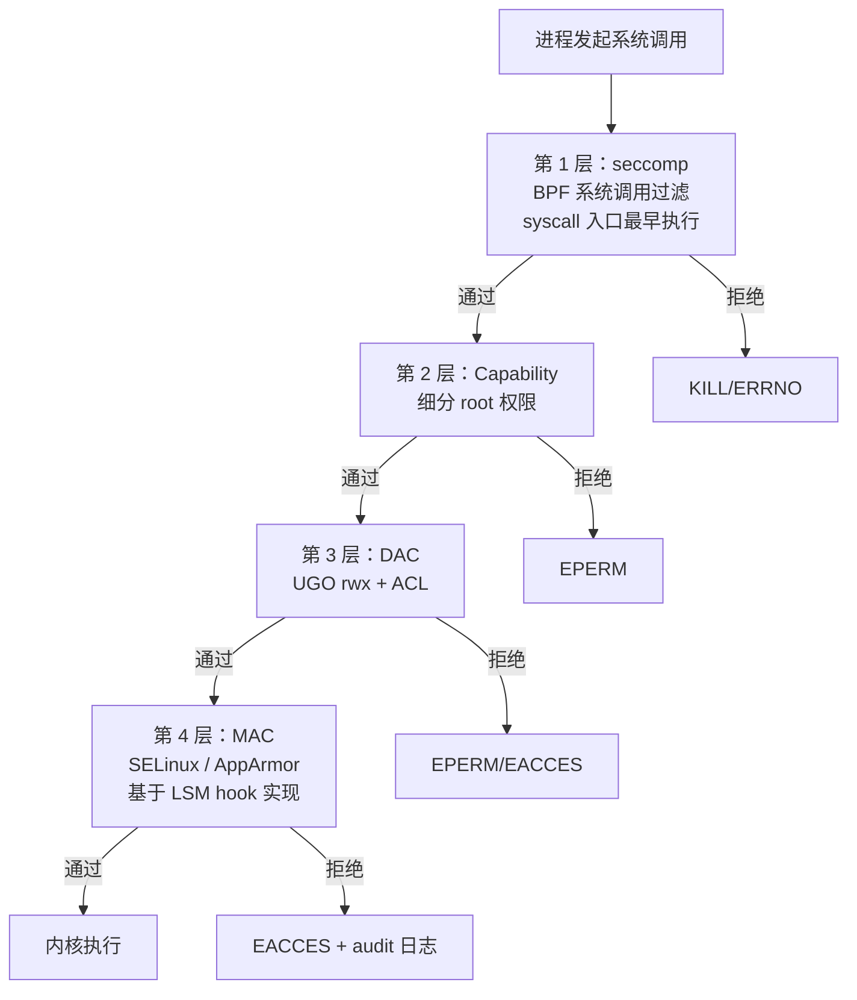
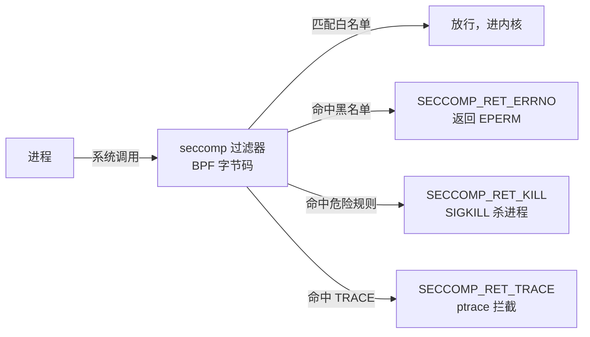
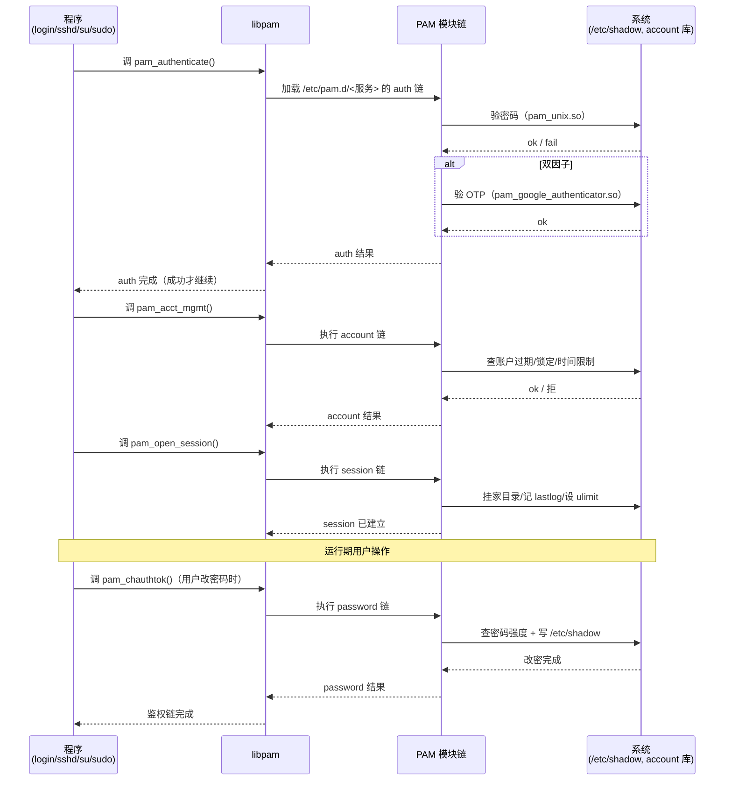
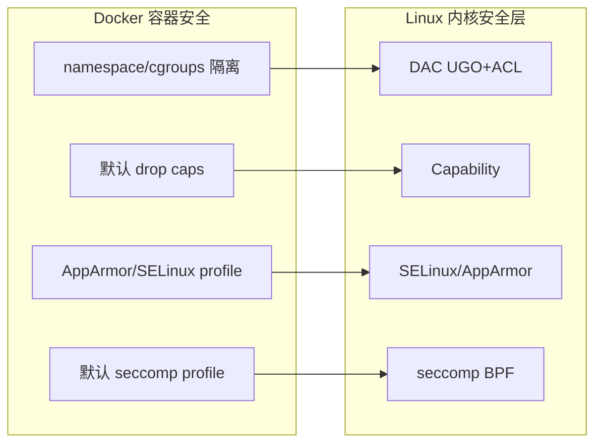

# 安全与权限

> **一句话定位**：Linux 安全模型是容器安全的底层，Capability 和 seccomp 是 Docker/K8s 安全的基石。
> **面试热度**：⭐⭐⭐⭐⭐
> **返回**：[Linux 知识图谱](../README.md)

---

## 一、概述

### 1.1 主题在 Linux 体系中的位置

Linux 安全的本质是**谁能对谁做什么**的一套判定链：进程发起系统调用 → 内核查进程凭证（uid/gid/capabilities）→ 对照客体（文件 inode 权限位、SELinux label）→ DAC 判定 → MAC 判定 → seccomp/LSM hook → 放行或拒绝。面试官问"讲讲 Linux 权限"看似只在考 `chmod`/`chown`，但它精准牵出五件事：UGO + ACL 的 DAC 模型、Capability 细分 root、SELinux/AppArmor 的 MAC、seccomp BPF 系统调用过滤、PAM 鉴权链——能讲清这些才证明你不只是会敲 `sudo`。

本主题覆盖六条主线：**UGO 权限模型**（rwx 三组、SUID/SGID/Sticky bit）、**ACL**（`getfacl`/`setfacl`、比 UGO 更细的访问控制）、**Capability**（细分 root 权限、`task_struct` 的 capability 集、drop 机制）、**SELinux/AppArmor**（MAC 强制访问控制、label 与 profile）、**seccomp BPF**（系统调用过滤、strict/filter 模式）、**PAM 鉴权链**（`/etc/pam.d/` 四阶段、sudoers 配置陷阱）。

### 1.2 与其他主题的边界

| 主题 | 边界说明 |
|------|---------|
| [02 进程与线程](../02-process/process-and-thread.md) | 进程 credentials（uid/gid/capabilities）在 02 只点 `task_struct` 字段名，**判定逻辑、Capability 集合语义、drop 机制**归 07 |
| [05 文件系统与 VFS](../05-fs/filesystem-and-vfs.md) | inode 的权限字段位置归 05，**rwx/SUID/SGID/Sticky 的语义、ACL/SELinux label 判定**归 07 |
| `ops/docker` | 容器安全工程（Docker 默认 drop caps、默认 seccomp profile、userns-remap）归 docker，**Capability/seccomp/LSM 的内核机制**归 07 |
| `ops/k8s` | PodSecurity Standards/ PSP 归 k8s，**底层 Capability、seccomp profile 内容**归 07 |
| [09 性能与故障排查](../09-ops/performance-and-troubleshooting.md) | `strace`/`auditd` 作为观测工具在本主题讲用法，**完整排障四步法**归 09 |

> **记住边界**：本主题讲"权限怎么判、root 怎么细分、系统调用怎么过滤、鉴权链怎么走"，不讲"task_struct 字段布局（02）、inode 在磁盘的位置（05）、容器安全工程模型（docker/k8s）、完整排障方法论（09）"——那些是上游模块的事。

### 1.3 关键术语速览

| 术语 | 一句话定义 | 出现阶段 |
|------|-----------|---------|
| DAC | 自主访问控制，基于属主/属组/其他的 rwx 判定 | UGO/ACL |
| MAC | 强制访问控制，系统级策略不可被属主绕过 | SELinux/AppArmor |
| UGO | User/Group/Other，传统三组 rwx 权限模型 | UGO |
| ACL | Access Control List，比 UGO 更细的访问控制列表 | ACL |
| Capability | 把 root 权限细分为约 40 个独立特权单元 | Capability |
| SELinux | 基于 label 的 MAC 实现，label = `user:role:type:level` | SELinux |
| AppArmor | 基于 path 的 MAC 实现，profile 在 `/etc/apparmor.d/` | AppArmor |
| seccomp | 系统调用过滤，strict 只放 4 个，filter 用 BPF | seccomp |
| PAM | Pluggable Authentication Modules，可插拔鉴权框架 | PAM |
| sudoers | `/etc/sudoers`，定义谁可以 sudo 以谁身份执行什么 | sudo |
| LSM | Linux Security Module，内核安全 hook 框架 | LSM |

---

## 二、核心机制

### 2.1 安全模型层次图

Linux 安全不是单一机制，而是多层叠加的判定链。一个系统调用进来后，依次经过 seccomp → Capability → DAC → MAC 各层，任一层拒绝即失败（seccomp 在 syscall 入口最早执行，独立于 LSM；MAC 的 SELinux/AppArmor 基于 LSM hook 框架实现）：



**层次关系认知**：

| 层次 | 机制 | 判定对象 | 源码/配置 |
|------|------|---------|----------|
| 第 1 层 | seccomp | 系统调用号 + 参数 vs BPF 过滤器 | `kernel/seccomp.c` |
| 第 2 层 | Capability | 进程 cap 集合 vs 操作所需 cap | `kernel/cred.c`、`security/commoncap.c` |
| 第 3 层 | DAC（UGO + ACL） | 文件 rwx 位 + ACL 条目 | `fs/attr.c`、`fs/posix_acl.c` |
| 第 4 层 | MAC（SELinux/AppArmor） | 进程 label/domain vs 客体 label/profile | `security/selinux/`、`security/apparmor/`（底层基于 LSM hook 框架：`security/security.c`、`include/linux/lsm_hooks.h`） |

> **LSM 不是独立一层**：LSM（Linux Security Module）是供 SELinux/AppArmor 等安全模块挂载的 hook 框架，本身不提供策略，MAC 层的判定实际由挂载的 SELinux/AppArmor 模块在 LSM hook 点执行。seccomp 则独立于 LSM，在 syscall 入口提前过滤（先于 capability/DAC/MAC 执行）。

> **关键认知**：seccomp 在 syscall 入口最早过滤（判调用号是否被禁），独立于 LSM；Capability 细分 root（判是否有所需 cap）；DAC 是基础（判 rwx）；MAC 叠加系统级策略（判 label 是否允许），SELinux/AppArmor 都基于 LSM hook 框架实现（LSM 是 MAC 的实现底座，不是独立一层）。`--privileged` 容器一次性禁用第 1～4 层（seccomp + cap + DAC 绕过 + MAC），是容器安全最大禁区。

### 2.2 UGO 权限模型与特殊位

UGO（User/Group/Other）是 Linux 最基础的 DAC 模型：每个 inode 有三组 rwx 位，分别对属主/属组/其他。`ls -l` 输出的第一段就是这 9 位 + 3 个特殊位：

```bash
$ ls -l /usr/bin/passwd
-rwsr-xr-x. 1 root root  ... /usr/bin/passwd
# 权限位拆解：
# -   普通文件
# rws 属主：rwx + SUID（s 表示 SUID 置位）
# r-x 属组：r-x
# r-x 其他：r-x
```

**三组 rwx 的判定逻辑**：进程 uid 等于文件属主 uid → 用属主权限；否则进程 gid 等于文件属组 gid（或附加组）→ 用属组权限；否则用其他权限。**只取一组**，不会累加（属主是 r--、属组是 rwx，属主进程只有 r 没有 w）。

**三个特殊位**：

| 特殊位 | 八进制 | 设置命令 | 作用 | 典型场景 |
|--------|--------|----------|------|---------|
| SUID | 4 | `chmod u+s` | 可执行文件执行时以**文件属主**身份运行 | `/usr/bin/passwd` 以 root 身份改密码 |
| SGID | 2 | `chmod g+s` | 可执行文件以**属组**身份运行；目录下新文件继承目录属组 | 共享目录、`/usr/bin/wall` |
| Sticky | 1 | `chmod +t` | 目录下文件只有属主和 root 才能删 | `/tmp`、`/var/tmp` |

**SUID 为什么危险**：SUID 程序以文件属主（常是 root）身份运行，一旦 SUID 程序有漏洞（如缓冲区溢出），攻击者就能以 root 身份执行任意代码。`find / -perm -4000 2>/dev/null` 列出所有 SUID 程序，是安全审计的第一步。Capability 机制提供替代 SUID 的更细粒度方案——把"给全部 root 权限"细化为"只给所需 cap"（系统仍大量使用 SUID，Capability 并非完全替代，而是更安全的选项）。

> **关联**：SUID 程序的文件权限位归 05 的 inode 字段，**SUID 的语义、风险、与 Capability 的替代关系**归 07。`/tmp` 的 Sticky bit 见 §4 的 Q9。

### 2.3 ACL：比 UGO 更细的访问控制

UGO 只有三组权限，无法表达"给用户 alice 单独 rw、给组 dev 组 r"这种细粒度需求。ACL（Access Control List）在 UGO 之上扩展，允许为任意用户/组单独设置权限：

```bash
$ getfacl /shared/project
# file: shared/project
# owner: root
# group: dev
user::rwx           # 属主（= UGO 的属主位）
user:alice:rwx      # 额外给 alice rwx（UGO 表达不了）
group::r-x          # 属组（= UGO 的属组位）
group:qa:r-x        # 额外给 qa 组 r-x
other::r--          # 其他（= UGO 的其他位）

$ setfacl -m u:alice:rwx /shared/project   # 设 ACL
$ setfacl -x u:alice /shared/project        # 删 ACL
$ setfacl -b /shared/project                # 清所有 ACL
```

**ACL 与 UGO 的关系**：ACL 是 UGO 的超集——`user::` 对应 UGO 属主位、`group::` 对应属组位、`other::` 对应其他位，这三条是"基础 ACL"，`ls -l` 显示的就是它们。`user:alice:`、`group:qa:` 是"扩展 ACL"，`ls -l` 会在权限位后显示一个 `+` 表示有扩展 ACL（如 `rwxrwxr-x+`）。

**mask 位**：扩展 ACL 受 mask 约束——mask 是扩展 ACL 的有效权限上限。`setfacl -m m::r--` 把 mask 设为只读，则所有扩展 ACL 的有效权限被压到 r--。`getfacl` 输出会有 `mask::r-x` 一行。**这是 ACL 最易踩的坑**：改了 mask 后所有扩展 ACL 生效权限变了，但 `ls -l` 看不出来。

> **面试口径**：能说出"ACL 是 UGO 的扩展，可给任意用户/组单独设权限；`getfacl`/`setfacl` 操作；有扩展 ACL 时 `ls -l` 权限位后有个 `+`；mask 约束扩展 ACL 的有效权限上限"就够。

### 2.4 Capability 集合

传统 Unix 权限是 root/non-root 二分法：root 拥有全部特权，non-root 无任何特权。问题是很多服务只需"绑定 80 端口"一项特权，却要么用 root（过度授权）、要么用 setuid（给全部 root 权限，攻击面过大）。Linux 2.2 引入 Capability，把 root 权限细分为约 40 个（随内核版本变化）独立特权单元。

**`task_struct` 的 capability 集**：每个进程的 `task_struct` 持有 `struct cred`（credentials），其中包含 5 个 capability 集（内核 4.3+）：

| 集 | 含义 | 典型用途 |
|----|------|---------|
| permitted（许可集） | 进程当前可用的 cap 上限 | cap 是否能被 effective 提升 |
| effective（有效集） | 当前生效的 cap | 内核判权限时查这个 |
| inheritable（可继承集） | exec 后子进程可继承的 cap | 跨 exec 传递 |
| ambient（环境集，4.3+） | 非 SUID 程序 exec 后自动继承的 cap | 给非特权程序提权的新机制 |
| bounding（边界集） | exec 后子进程 permitted 的上限 | 限制子进程能获得的 cap |

**常见 Capability**：

| Capability | 作用 | 风险 |
|------------|------|------|
| `CAP_CHOWN` | 修改文件属主/属组 | 中 |
| `CAP_DAC_OVERRIDE` | 绕过 DAC 读/写/执行检查 | 高 |
| `CAP_FOWNER` | 绕过属主权限检查 | 中 |
| `CAP_KILL` | 向非本用户进程发信号 | 中 |
| `CAP_SETGID` / `CAP_SETUID` | 切换 gid/uid | 高 |
| `CAP_SETPCAP` | 转移 cap 给其他进程 | 高 |
| `CAP_NET_BIND_SERVICE` | 绑定 <1024 端口 | 低（业务常需） |
| `CAP_NET_RAW` | 发原始网络包（ping/traceroute） | 中 |
| `CAP_NET_ADMIN` | 网络配置（路由/iptables） | 高 |
| `CAP_SYS_PTRACE` | ptrace 附加其他进程 | 高（可读其他进程内存） |
| `CAP_SYS_ADMIN` | 系统管理（挂载/pivot_root/内核模块） | ⛔ 极高（"新 root"） |

**root 与 Capability 的关系**：uid=0（root）的进程默认拥有全部 cap（permitted/effective 都是全集），non-root 进程默认无任何 cap。**drop 机制**：root 进程可通过 `prctl(PR_SET_KEEPCAPS)` + `capset` 主动丢弃 cap，或通过 bounding set 限制子进程能获得的 cap。Docker 容器就是利用这个机制——只给容器进程一个有限 cap 子集，丢弃 `CAP_SYS_ADMIN` 等高危 cap。

**SUID 程序的 cap 替代**：`ping` 传统是 SUID root，现在改用 `setcap CAP_NET_RAW+ep /usr/bin/ping` 给文件设 cap，进程执行时获得该 cap 即可发 ICMP 包，无需全部 root 权限。`getcap /usr/bin/ping` 可查看文件 cap。这是 Capability 替代 SUID 的典型场景。

> **关联**：进程 `task_struct` 的 cred 字段位置归 02，**Capability 集合语义、drop 机制、与 SUID 替代关系**归 07。Docker 默认 drop 哪些 cap 见 `ops/docker/07-security`。

### 2.5 SELinux：基于 label 的 MAC

SELinux（Security-Enhanced Linux）是基于 label 的强制访问控制实现，由 NSA 主导合入内核（源码 `security/selinux/`）。它通过给每个进程和客体（文件/端口/设备）打 label，由策略决定哪个进程 label 能访问哪个客体 label，且**属主无法绕过**（区别于 DAC 的"自主"）。

**label 格式**：`user:role:type:level`，其中 level 是 MLS（Multi-Level Security）才有的，普通场景只见前三个：

```bash
$ ls -Z /var/www/html/index.html
-rw-r--r--. root root system_u:object_r:httpd_sys_content_t:s0 /var/www/html/index.html
#                user     role           type                  level
```

| 字段 | 含义 | 示例 |
|------|------|------|
| user | SELinux 用户身份 | `system_u`、`unconfined_u` |
| role | 角色（与 user 关联） | `object_r`、`system_r` |
| type | 类型（策略判定的核心） | `httpd_sys_content_t`、`httpd_t` |
| level | MLS 级别（可选） | `s0` |

**策略判定**：进程有 domain（如 `httpd_t`），客体有 type（如 `httpd_sys_content_t`），策略文件定义"allow httpd_t httpd_sys_content_t:file read"。**进程 domain 与客体 type 的 allow 规则存在才放行**，否则即使 DAC 通过也会被 SELinux 拒绝。

**三种模式**（配置 `/etc/selinux/config` 的 `SELINUX=`）：

| 模式 | 行为 | 用途 |
|------|------|------|
| enforcing | 拦截违规并记日志 | 生产环境 |
| permissive | 不拦截，只记日志 | 调试策略、排查问题 |
| disabled | 完全关闭 | 不加载策略 |

```bash
$ getenforce
Enforcing
$ sestatus
SELinux status:                 enabled
SELinuxfs mount:                /sys/fs/selinux
Current mode:                   enforcing
Mode from config file:          enforcing

$ setenforce 0   # 临时切 permissive（重启失效）
$ setenforce 1   # 临时切 enforcing
```

**SELinux 与 DAC 的关系**：**先判 DAC 后判 SELinux**——DAC 拒绝（如 rwx 不满足）直接 EACCES，不会到 SELinux；DAC 通过后再判 SELinux，SELinux 拒绝才记 audit 日志（`/var/log/audit/audit.log`）。排查"SELinux 拦截"的标志是 `ls -l` 能读写但实际 EACCES，且 `getenforce` 不是 disabled。

**label 操作**：

```bash
$ ls -Z /var/www/html       # 看文件 label
$ ps -eZ | grep httpd       # 看进程 domain
$ chcon -t httpd_sys_content_t /var/www/html/index.html   # 临时改 label
$ restorecon -Rv /var/www/html                            # 按策略规则恢复默认 label
$ semanage fcontext -a -t httpd_sys_content_t '/var/www/html(/.*)?'  # 永久规则
$ getsebool -a | grep httpd   # 看布尔开关
$ setsebool httpd_can_network_connect on  # 开开关
```

> **关联**：SELinux 基于 LSM hook 实现（§2.8），AppArmor 是另一种 MAC（§2.6）。Docker 容器的 SELinux 配置见 `ops/docker/07-security`。

### 2.6 AppArmor：基于 path 的 MAC

AppArmor 是另一种 MAC 实现，与 SELinux 的根本区别是**基于路径而非 label**——它给可执行程序路径挂 profile，profile 用路径规则定义能访问哪些文件/能力，配置在 `/etc/apparmor.d/`：

```bash
$ cat /etc/apparmor.d/usr.sbin.nginx
# profile 示例（简化）
profile nginx /usr/sbin/nginx {
  #include <tunables/global>
  capability net_bind_service,
  /usr/sbin/nginx rix,
  /var/log/nginx/** rw,
  /var/www/html/** r,
  deny /etc/shadow r,   # 显式拒绝
}
```

**SELinux vs AppArmor 对比**：

| 维度 | SELinux | AppArmor |
|------|---------|----------|
| 策略模型 | 基于 label（type enforcement） | 基于 path（per-path rule） |
| 配置位置 | 策略文件 + `semanage` | `/etc/apparmor.d/` profile |
| 默认发行版 | RHEL/CentOS/Fedora | Ubuntu/Debian/SUSE |
| 学习曲线 | 高（label + 策略语言） | 低（路径规则直观） |
| 粒度 | type 级，跨路径一致 | 路径级，换路径要改 profile |
| 是否需 label | 需要（`ls -Z`/`chcon`） | 不需要（按路径匹配） |
| 文件系统支持 | 需支持 xattr | 不依赖 xattr |

**AppArmor 操作**：

```bash
$ apparmor_status      # 看状态
$ aa-enforce /etc/apparmor.d/usr.sbin.nginx   # 切 enforcing
$ aa-complain /etc/apparmor.d/usr.sbin.nginx  # 切 complain（= permissive）
$ aa-disable /etc/apparmor.d/usr.sbin.nginx   # 禁用
$ systemctl restart apparmor                    # 重载所有 profile
```

> **面试口径**：能说出"SELinux 基于 label、AppArmor 基于 path；SELinux 在 RHEL 系、AppArmor 在 Ubuntu 系；AppArmor 配置在 `/etc/apparmor.d/`、不需要 label"就够。

### 2.7 seccomp：系统调用过滤

seccomp（secure computing mode）是内核的系统调用过滤机制（源码 `kernel/seccomp.c`），在进程发起 syscall 时用 BPF 字节码过滤，决定放行、拒绝（返回 ERRNO）或杀进程（KILL）。

**两种模式**：

| 模式 | 行为 | 用途 |
|------|------|------|
| strict（SECCOMP_MODE_STRICT） | 只允许 read/write/exit/sigreturn 4 个调用，其余 SIGKILL | 极简沙箱（如计算密集型 worker） |
| filter（SECCOMP_MODE_FILTER） | 用 BPF 过滤器按系统调用号+参数过滤 | Docker/K8s 容器默认 |



**返回值**（`SECCOMP_RET_*`）：

| 返回值 | 行为 |
|--------|------|
| `SECCOMP_RET_ALLOW` | 放行 |
| `SECCOMP_RET_ERRNO` | 返回 EPERM（进程不退出） |
| `SECCOMP_RET_KILL` | SIGKILL 杀进程（默认对未匹配调用的行为） |
| `SECCOMP_RET_TRAP` | 发 SIGSYS 信号 |
| `SECCOMP_RET_TRACE` | 交给 ptrace 处理 |

**Docker 默认 seccomp profile**：Docker 内置白名单 profile（约 300 个 syscall 放行），禁了 `ptrace`、`mount`、`reboot`、`kexec_load`、`keyctl`、`bpf`（部分版本）等高危调用。`--security-opt seccomp=unconfined` 禁用 seccomp = 撤掉第 1 层防线，生产绝禁。

**与 Capability 的区别**：Capability 管"有没有特权做某操作"（如能不能绑 <1024 端口），seccomp 管"能不能调这个系统调用"（如能不能 `mount`）。两者正交——有 `CAP_SYS_ADMIN` 但 seccomp 禁了 `mount`，仍调不了。

> **关联**：Docker 默认 seccomp profile 内容详见 `ops/docker/07-security`，本主题只讲内核机制。seccomp 在 syscall 入口过滤，独立于 LSM hook。

### 2.8 PAM 鉴权链

PAM（Pluggable Authentication Modules）是 Linux 的可插拔鉴权框架（源码在用户态 `libpam`），把鉴权逻辑从程序中解耦——程序调 PAM API，PAM 按 `/etc/pam.d/<服务>` 配置加载模块链，依次执行。

**四阶段**（每阶段可配多个模块，按顺序执行）：

| 阶段 | 作用 | 典型模块 |
|------|------|---------|
| auth | 验证身份（密码/指纹/双因子） | `pam_unix.so`（密码）、`pam_google_authenticator.so` |
| account | 检查账户是否可用（过期/锁定/时间限制） | `pam_time.so`、`pam_access.so` |
| session | 会话建立/销毁（挂载家目录、记日志） | `pam_mkhomedir.so`、`pam_lastlog.so` |
| password | 修改密码 | `pam_unix.so` |

**PAM 鉴权链流程**（程序调 PAM API 后，四阶段依次执行，任一 required/requisite 失败即整体失败）：



**配置示例**（`/etc/pam.d/system-auth`）：

```bash
$ cat /etc/pam.d/system-auth
auth       required     pam_env.so
auth       required     pam_unix.so try_first_pass          # 先用密码验
auth       sufficient   pam_google_authenticator.so        # 或双因子
auth       required     pam_deny.so                         # 都失败则拒

account    required     pam_unix.so                         # 检查账户
account    required     pam_time.so                         # 时间限制

password   required     pam_pwquality.so retry=3            # 密码强度
password   required     pam_unix.so sha512 shadow           # 改密码

session    required     pam_limits.so                       # ulimit
session    required     pam_unix.so
```

**控制字段**：

| 字段 | 含义 |
|------|------|
| required | 必须通过，失败也继续执行后续（记录但不立即拒） |
| requisite | 必须通过，失败立即拒（不执行后续） |
| sufficient | 通过则立即成功（不再执行后续），失败则继续 |
| optional | 可有可无，失败不影响 |

> **PAM 链失败排查**：用 `pamtester` 工具模拟鉴权，或看 `/var/log/secure`（RHEL）/`/var/log/auth.log`（Ubuntu）。配错 `pam.d` 会导致 `ssh`/`su`/`sudo` 全部无法鉴权，是高危操作，改前先备份。

### 2.9 sudoers 配置

`sudo` 通过 PAM 鉴权后，按 `/etc/sudoers`（必须用 `visudo` 编辑，语法错误会导致 sudo 失效）和 `/etc/sudoers.d/` 判定能以谁身份执行什么：

```bash
# 格式：谁  在哪台主机=（以谁身份）  能执行什么
root    ALL=(ALL)       ALL                    # root 可任意主机以任意身份执行任意命令
%wheel  ALL=(ALL)       ALL                    # wheel 组成员同上
appuser ALL=(root)      /usr/bin/systemctl restart nginx  # 只能重启 nginx
appuser ALL=(root)      NOPASSWD: /usr/bin/systemctl restart nginx  # 免密
```

**高危陷阱**：

| 陷阱 | 说明 | 后果 |
|------|------|------|
| `NOPASSWD: ALL` | 免密执行任意命令 | 等于把 root 给了这个用户 |
| `appuser ALL=(ALL) /usr/bin/vim` | 兆 vim 可 sudo | vim 内 `:!bash` 直接得 root shell |
| 通配符过宽 | `appuser ALL=(root) /usr/bin/*` | 所有 /usr/bin 下程序都能 root 执行，含 vim/less/find 等 |
| 编辑器未用 visudo | 语法错误 | sudo 完全失效，连修都修不了 |

> **关联**：`su -` vs `su` 的区别见 §4 Q8。`sudo` 与 PAM 的协作：`sudo` 先过 PAM auth（输密码），再查 sudoers。

### 2.10 关键源码路径

| 对象 | 源码/路径 | 说明 |
|------|----------|------|
| 进程凭证 | `include/linux/cred.h`、`kernel/cred.c` | `struct cred` 含 uid/gid/capabilities |
| Capability | `security/commoncap.c`、`include/uapi/linux/capability.h` | cap 判定与 cap 数定义 |
| ACL | `fs/posix_acl.c`、`include/linux/posix_acl.h` | POSIX ACL 实现 |
| SELinux | `security/selinux/` | hooks、策略、AVC（access vector cache） |
| AppArmor | `security/apparmor/` | path-based MAC |
| seccomp | `kernel/seccomp.c`、`include/uapi/linux/seccomp.h` | BPF 过滤器入口 |
| LSM 框架 | `security/security.c`、`include/linux/lsm_hooks.h` | hook 注册与调用 |
| PAM | 用户态 `libpam`、配置 `/etc/pam.d/` | 非内核，用户态鉴权框架 |

面试口径：能说出"进程凭证在 `kernel/cred.c` 的 `struct cred`，Capability 在 `security/commoncap.c` 判、定义在 `include/uapi/linux/capability.h`，SELinux 在 `security/selinux/`，seccomp 在 `kernel/seccomp.c`，LSM 框架在 `security/security.c`"就够。

---

## 三、命令与示例

### 3.1 命令族速查表

| 命令 | 作用 | 常用子命令/选项 |
|------|------|----------------|
| `id` / `whoami` / `who` / `w` | 查身份 | `id -u`/`id -G`/`who -a`/`w` |
| `chmod` / `chown` / `chgrp` | 改权限/属主 | `chmod 755`/`chmod u+s`/`chown user:group` |
| `umask` | 默认权限掩码 | `umask 022` |
| `getfacl` / `setfacl` | ACL 操作 | `getfacl file`/`setfacl -m u:u:rwx` |
| `sudo` / `visudo` | 提权 / 编辑 sudoers | `sudo -l`/`sudo -u user`/`visudo -c` |
| `su` | 切换用户 | `su - user`/`su user` |
| `getenforce` / `setenforce` / `sestatus` | SELinux 模式 | `setenforce 0`/`setenforce 1` |
| `getsebool` / `setsebool` | SELinux 布尔开关 | `getsebool -a`/`setsebool -P xxx on` |
| `ls -Z` / `ps -Z` / `chcon` / `restorecon` | SELinux label | `ls -Z file`/`chcon -t`/`restorecon -Rv` |
| `semanage` | SELinux 策略管理 | `semanage fcontext -a -t`/`semanage port -l` |
| `apparmor_status` / `aa-*` | AppArmor 状态/profile | `aa-enforce`/`aa-complain`/`aa-disable` |
| `capsh` / `getcap` / `setcap` | Capability 操作 | `getcap file`/`setcap CAP_NET_RAW+ep file` |
| `auditd` / `ausearch` / `aureport` | 审计日志 | `ausearch -m AVC -ts recent` |

### 3.2 实战 one-liner

```bash
# 1. 看身份与所属组
id
# uid=1000(app) gid=1000(app) groups=1000(app),998(docker)
# 进程的 uid/gid 与附加组，决定 DAC 判定

# 2. 看文件权限位（含 SUID/SGID/Sticky）
ls -l /usr/bin/passwd
# -rwsr-xr-x. 1 root root ... /usr/bin/passwd  → SUID 置位（s）

# 3. 看目录的 Sticky bit
ls -ld /tmp
# drwxrwxrwt.  ... /tmp  → t 表示 Sticky bit

# 4. 查系统所有 SUID 程序（安全审计第一步）
find / -perm -4000 2>/dev/null

# 5. ACL 操作
getfacl /shared/project                    # 查 ACL
setfacl -m u:alice:rwx /shared/project     # 给 alice 设 rwx
setfacl -m m::r-x /shared/project          # 设 mask
setfacl -b /shared/project                 # 清所有 ACL

# 6. 看 SELinux 模式与状态
getenforce                                  # enforcing/permissive/disabled
sestatus                                    # 详细状态

# 7. 看文件与进程的 SELinux label
ls -Z /var/www/html                         # 文件 label
ps -eZ | grep httpd                         # 进程 domain
# LABEL      PID     ...  CMD
# system_u:system_r:httpd_t:s0  1234 ?  ... /usr/sbin/httpd

# 8. 改 label 与恢复
chcon -t httpd_sys_content_t /var/www/html/index.html
restorecon -Rv /var/www/html               # 按策略恢复默认 label

# 9. 看 SELinux 布尔开关
getsebool -a | grep httpd_can_network      # off/on

# 10. 看 capability
getcap /usr/bin/ping
# /usr/bin/ping = cap_net_raw+ep  → 文件有 CAP_NET_RAW
capsh --print                              # 当前进程 cap 集
# Current: = cap_chown,cap_dac_override,...,cap_net_bind_service,...

# 11. 给文件设 capability（替代 SUID）
setcap CAP_NET_BIND_SERVICE+ep /usr/bin/myapp   # 非 root 绑 80 端口
setcap -r /usr/bin/myapp                        # 清除 cap

# 12. 看当前进程的 capability 集
grep Cap /proc/self/status
# CapInh: 0000000000000000   inheritable
# CapPrm: 0000003fffffffff   permitted
# CapEff: 0000003fffffffff   effective
# CapBnd: 0000003fffffffff   bounding
# CapAmb: 0000000000000000   ambient

# 13. 看容器的 capability（容器内执行）
grep Cap /proc/1/status
# CapEff: 00000000a80425fb   → 不是全 1，说明 cap 被 drop 了

# 14. sudo 配置检查
sudo -l                          # 当前用户能执行哪些 sudo
visudo -c                        # 检查 /etc/sudoers 语法

# 15. AppArmor 状态
apparmor_status                  # 哪些 profile 加载、模式
```

### 3.3 命令输出解读

**`ls -Z` 的 SELinux label**：

```bash
$ ls -Z /var/www/html/index.html
-rw-r--r--. root root system_u:object_r:httpd_sys_content_t:s0 index.html
# 权限位. 属主 属组 user     :role      :type                  :level
```

末尾 `.` 表示启用了 SELinux（有 security context）；若 SELinux 关闭则没有 `.`。

**`getcap` 的 capability 输出**：

```bash
$ getcap /usr/bin/ping /usr/bin/newuidmap
/usr/bin/ping = cap_net_raw+ep
/usr/bin/newuidmap = cap_setuid+ep
#   cap 名 +ep：effective+permitted 置位（文件 cap，exec 时进 effective）
```

**`grep Cap /proc/self/status` 解读**：4 个十六进制掩码分别对应 inheritable/permitted/effective/bounding（4.3+ 还有 ambient）。全 1（如 `0000003fffffffff`）表示该集有全部 cap（root 进程的特征），不全 1 说明被 drop 过。

---

## 四、高频追问

### Q1：SUID 是什么？为什么 `/usr/bin/passwd` 需要 SUID？

**参考答案**：见 §2.2。SUID（Set-owner-User-ID）是可执行文件的特殊位（`chmod u+s`，八进制 4），进程执行该文件时以**文件属主**身份运行而非执行者身份。`/usr/bin/passwd` 属主是 root，设 SUID 后，普通用户执行 `passwd` 时进程 euid 变 root，才能读写 `/etc/shadow`（只有 root 可读）改密码。SUID 的风险是给程序全部 root 权限，一旦有漏洞（缓冲区溢出）就被提权——现代 Linux 用 Capability 替代（`setcap CAP_CHOWN+ep` 只给所需 cap）。`find / -perm -4000` 审计所有 SUID 程序。

### Q2：Capability 是什么？解决了什么问题？

**参考答案**：见 §2.4。Capability 把传统 root 权限细分为约 40 个独立特权单元（如 `CAP_NET_BIND_SERVICE` 绑 <1024 端口、`CAP_NET_RAW` 发原始包、`CAP_SYS_ADMIN` 系统管理）。进程的 `struct cred` 持有 permitted/effective/inheritable/bounding/ambient 五个集，内核判权限时查 effective 集。**解决的问题**：① SUID 给程序全部 root 权限攻击面过大，Capability 只给所需 cap；② 服务可只持有 `CAP_NET_BIND_SERVICE` 绑 80 端口后 drop 其余 cap，比用 root 启动安全。**Docker 利用此机制**——只给容器有限 cap 子集，丢弃 `CAP_SYS_ADMIN` 等高危 cap。

### Q3：Docker 默认 drop 了哪些 Capability？为什么不能 drop CAP_NET_RAW？

**参考答案**：Docker 默认授予容器约 14 个 cap（`CAP_CHOWN`/`CAP_NET_BIND_SERVICE`/`CAP_KILL`/`CAP_SETUID` 等），drop 了 `CAP_SYS_ADMIN`/`CAP_NET_ADMIN`/`CAP_SYS_PTRACE`/`CAP_SYS_MODULE` 等高危 cap。加固实践是 `--cap-drop=ALL --cap-add=NET_BIND_SERVICE` 先全丢再按需加。**CAP_NET_RAW 默认不 drop**（保留给容器），因为 `ping`/`traceroute` 等网络诊断工具依赖它发 ICMP 包，容器内常见网络调试需要。但若业务容器不需要 ping，应显式 `--cap-drop=NET_RAW` 收紧。关联 `ops/docker/07-security`。

### Q4：SELinux 和 AppArmor 有什么区别？

**参考答案**：见 §2.5、§2.6。**SELinux**：基于 label（`user:role:type:level`），策略用 type enforcement，进程 domain vs 客体 type 判定，配置复杂，默认在 RHEL 系，需要文件有 xattr label。**AppArmor**：基于 path，profile 用路径规则（`/var/www/** r,`），不需要 label，配置直观，默认在 Ubuntu 系，配置在 `/etc/apparmor.d/`。**共同点**：都是 MAC（强制访问控制），都基于 LSM hook，都在 DAC 通过后叠加判定，属主无法绕过。**选型**：RHEL 系用 SELinux（生态成熟），Ubuntu 系用 AppArmor（易上手），容器场景两者都可用但常被关闭。

### Q5：SELinux 的 enforcing 和 permissive 模式有什么区别？怎么排查 SELinux 拦截？

**参考答案**：见 §2.5。**enforcing**：拦截违规并记 audit 日志（`/var/log/audit/audit.log`）。**permissive**：不拦截只记日志，用于调试策略、排查问题。`getenforce` 看当前模式，`setenforce 0/1` 临时切（重启失效），`/etc/selinux/config` 的 `SELINUX=` 永久配。**排查拦截**：①现象是 DAC 权限够（`ls -l` 能读写）但实际 EACCES，且 `getenforce` 非 disabled；②`getenforce`/`sestatus` 确认是 enforcing；③看 audit 日志 `ausearch -m AVC -ts recent` 或 `sealert -a /var/log/audit/audit.log`，找 `denied` 行；④`ls -Z`/`ps -eZ` 对比进程 domain 与客体 type；⑤临时切 permissive（`setenforce 0`）验证是否 SELinux 问题；⑥修策略用 `semanage fcontext` + `restorecon`，或 `setsebool` 开开关。

### Q6：seccomp 是什么？Docker 的默认 seccomp 禁了什么？

**参考答案**：见 §2.7。seccomp 是内核系统调用过滤机制，用 BPF 字节码在 syscall 入口过滤。两种模式：strict（只放 read/write/exit/sigreturn 4 个）、filter（BPF 按调用号+参数过滤）。**Docker 默认 seccomp profile** 是白名单（约 300 个 syscall 放行），禁了 `ptrace`、`mount`、`reboot`、`kexec_load`、`keyctl`、`bpf` 等高危调用。`--security-opt seccomp=unconfined` 禁用 seccomp = 撤掉纵深防御第 1 层，生产绝禁。**与 Capability 区别**：Capability 管"有没有特权做操作"，seccomp 管"能不能调这个系统调用"，两者正交。关联 `ops/docker/07-security`。

### Q7：sudo 配置错了会有什么安全问题？

**参考答案**：见 §2.9。常见高危配置：①`NOPASSWD: ALL`——免密执行任意命令，等于把 root 给了用户；②`appuser ALL=(root) /usr/bin/vim`——vim 内 `:!bash` 直接得 root shell（任何能执行 shell 的程序如 less/find/awk 都一样）；③通配符过宽——`/usr/bin/*` 让所有 /usr/bin 程序能 root 执行；④不用 `visudo` 编辑——语法错误导致 sudo 完全失效，连修都修不了（需单用户模式）。**加固**：①最小授权，只给具体命令；②`NOPASSWD` 只给脚本化场景且命令明确；③用 `visudo` 编辑并 `visudo -c` 校验；④排除能执行 shell 的程序（vim/less/find/awk 等）。

### Q8：为什么 `su -` 和 `su` 不同？

**参考答案**：`su`（不带 `-`）只切换 uid/gid，**不加载目标用户的登录环境**——沿用当前用户的环境变量（`PATH`/`HOME`/工作目录）。`su -`（等价 `su -l`）模拟完整登录，**加载目标用户的登录环境**——读 `/etc/profile`、`~/.bash_profile` 等，`PATH`/`HOME`/工作目录都变成目标用户的。**区别场景**：`su` 切到 root 后执行 `ifconfig` 可能 `command not found`（因为 PATH 还是当前用户的，不含 `/sbin`），`su -` 则能找到。**生产实践**：切换身份执行管理操作一律用 `su -`，确保环境完整。**与 sudo 区别**：`su -` 需知目标用户密码且会话全切换，`sudo` 只提权单条命令、用自己密码、可记日志（`/var/log/secure`）。

### Q9：Sticky bit 是什么？为什么 /tmp 要设它？

**参考答案**：见 §2.2。Sticky bit（`chmod +t`，八进制 1）作用于目录时，限制**只有文件属主和 root 才能删除/改名该目录下的文件**，即使其他用户对目录有写权限。`/tmp` 设 Sticky bit 是因为 `/tmp` 对所有用户可写（`drwxrwxrwx`），若不设 Sticky，任意用户都能删别人的临时文件（恶意或误删）。设 Sticky 后（`drwxrwxrwt`），用户只能删自己创建的文件。**验证**：`ls -ld /tmp` 看末位是 `t`。**SUID/SGID/Sticky 的八进制**：SUID=4、SGID=2、Sticky=1，`chmod 4755` 同时设 SUID。

### Q10：ACL 和 UGO 的关系是什么？

**参考答案**：见 §2.3。ACL 是 UGO 的超集扩展。`getfacl` 输出的 `user::`/`group::`/`other::` 三条对应 UGO 的属主/属组/其他位（基础 ACL），`ls -l` 显示的就是这三组。`user:alice:`/`group:qa:` 是扩展 ACL，表达 UGO 无法表达的"给特定用户/组单独权限"。有扩展 ACL 时 `ls -l` 权限位后会显示 `+`。**mask 位**是扩展 ACL 的有效权限上限——`setfacl -m m::r--` 把 mask 设只读，则所有扩展 ACL 有效权限压到 r--，但 `ls -l` 看不出来（这是最易踩的坑）。**判定顺序**：进程若匹配扩展 ACL 条目用扩展权限，否则用基础 UGO 位。

### Q11：PAM 是什么？怎么自定义鉴权？

**参考答案**：见 §2.8。PAM（Pluggable Authentication Modules）是可插拔鉴权框架，把鉴权逻辑从程序解耦——程序调 PAM API，PAM 按 `/etc/pam.d/<服务>` 配置加载模块链。四阶段：auth（验身份）、account（查账户可用）、session（会话建立/销毁）、password（改密码）。控制字段：required（必须过、失败也继续）、requisite（必须过、失败立即拒）、sufficient（过则立即成功、失败继续）、optional（可有可无）。**自定义鉴权**：在 `/etc/pam.d/sshd` 加 `auth sufficient pam_google_authenticator.so` 接入 Google 二次验证；加 `auth required pam_time.so` 限制登录时间；加 `account required pam_access.so` 按 `/etc/security/access.conf` 限制来源 IP。**改前必备份**，配错会导致 ssh/su/sudo 全部无法鉴权。

### Q12：怎么让一个非 root 用户绑定 80 端口？（CAP_NET_BIND_SERVICE）

**参考答案**：见 §2.4。三种方案：①`setcap CAP_NET_BIND_SERVICE+ep /usr/bin/myapp` 给可执行文件设 cap，进程执行时获得该 cap 即可绑 <1024 端口——**推荐，最小权限**；②用 root 启动后 `setuid` 切到普通用户（`setuid(1000)`），但启动期需 root；③iptables REDIRECT 把 80 转到 8080（`iptables -t nat -A PREROUTING -p tcp --dport 80 -j REDIRECT --to-port 8080`），应用绑 8080——需 root 配 iptables。**Java 场景**：JVM 启动时需 cap，`setcap` 给 `java` 二进制（影响所有 Java 进程，不推荐），或用方案③端口转发。容器场景直接 `docker run -p 80:8080` 容器内绑 8080，宿主机 iptables DNAT 到容器，无需 cap。

---

## 五、Java/容器关联

### 5.1 Docker seccomp/Capability 的底层

Docker 的容器安全建立在 Linux Capability/seccomp/LSM 三层之上（关联 `ops/docker/07-security`）。**Capability 侧**：Docker 默认给容器约 14 个 cap、drop 高危 cap（`CAP_SYS_ADMIN`/`CAP_NET_ADMIN`/`CAP_SYS_PTRACE` 等），加固用 `--cap-drop=ALL --cap-add=NET_BIND_SERVICE`。**seccomp 侧**：默认白名单 profile 禁 `ptrace`/`mount`/`reboot` 等 300+ syscall 中的高危子集，`--security-opt seccomp=unconfined` 禁用是禁区。**LSM 侧**：Ubuntu 默认挂 `docker-default` AppArmor profile，SELinux 需手动配。



> **关联 `ops/docker`**：Docker 的 `--cap-drop`/`--cap-add`/`--security-opt` 工程用法、默认 cap 集合、`--privileged` 的危害详见 [Docker 安全模型](../docker/07-security/docker-security.md)。

### 5.2 K8s PodSecurity Standards 替代 PSP

K8s 1.25 起 PodSecurityPolicy（PSP）被移除，由 PodSecurity Standards（PSS）替代。PSS 定义三个等级：

| 等级 | 策略 | 适用 |
|------|------|------|
| privileged | 不限制 | 系统组件、可信工作负载 |
| baseline | 禁最危险（不加 cap、不挂 docker.sock、不 hostPath） | 一般业务 |
| restricted | 要求 runAsNonRoot、drop ALL cap、seccomp=RuntimeDefault | 安全合规场景 |

```yaml
# namespace 标注为 restricted
apiVersion: v1
kind: Namespace
metadata:
  name: prod
  labels:
    pod-security.kubernetes.io/enforce: restricted
    pod-security.kubernetes.io/enforce-version: latest
```

**底层映射**：PSS 的 `restricted` 等级要求 `runAsNonRoot`（对应 uid 非 0）、`drop ALL cap`（对应 Capability）、`seccomp=RuntimeDefault`（对应 seccomp filter）——这些字段最终落到 Pod 的 `securityContext`，由容器运行时（containerd/CRI-O）转成 Linux 内核的 cap drop/seccomp profile。**关联 `ops/k8s`** 的 Pod 安全策略。

### 5.3 Java agent attach 的权限要求

Java agent（如 Arthas、Skywalking agent）通过 `attach` API 挂到目标 JVM，底层调 `ptrace` 或 Unix socket。**权限要求**：①同 uid 进程可直接 attach；②跨 uid 需 `CAP_SYS_PTRACE`（否则 `Operation not permitted`）；③容器内 attach 另一容器 JVM 需共享 pid namespace 且有 `CAP_SYS_PTRACE`（Docker 默认 drop 了，需 `--cap-add=SYS_PTRACE`）。**关联 `java-core/agent`** 的 attach 机制与 [09 性能排障](../09-ops/performance-and-troubleshooting.md) 的 Arthas 原理。

### 5.4 Java 进程以非 root 绑定低端口

Java 应用绑 80/443 端口（<1024）的方案：

| 方案 | 做法 | 优缺点 |
|------|------|--------|
| `setcap` | `setcap CAP_NET_BIND_SERVICE+ep $JAVA_HOME/bin/java` | 给所有 Java 进程 cap，范围过宽 |
| iptables REDIRECT | `iptables -t nat -A PREROUTING -p tcp --dport 80 -j REDIRECT --to-port 8080` | 应用绑 8080，需 root 配 iptables |
| systemd socket activation | systemd 绑 80，socket 传给 Java | 推荐，systemd 是 root，Java 非 root |
| 容器端口映射 | `docker run -p 80:8080` 容器内绑 8080 | 容器场景最简，宿主机 iptables DNAT |
| nginx 反代 | nginx 绑 80 转发到 8080 | 经典，多一层 |

**生产推荐**：容器场景用端口映射（`-p 80:8080`），裸机用 nginx 反代或 systemd socket activation，避免给 JVM `setcap`（影响所有 Java 进程）。

### 5.5 实战映射表

| 场景 | Linux 知识点 | Java/容器关联 |
|------|-------------|--------------|
| Docker 容器 escape | Capability drop + seccomp | §5.1，`--privileged` 禁用所有层 |
| K8s Pod 安全 | PodSecurity Standards | §5.2，restricted 等级 = drop ALL + seccomp |
| Arthas attach 失败 | `CAP_SYS_PTRACE` | §5.3，容器需 `--cap-add=SYS_PTRACE` |
| Java 绑 80 端口 | `CAP_NET_BIND_SERVICE` | §5.4，端口映射或反代 |
| Spring Boot 容器非 root 运行 | uid 非 0 + drop ALL cap | §5.2，Dockerfile `USER appuser` |
| SELinux 拦截 Nginx | label 不匹配 | §6.1，`ls -Z` + `restorecon` |
| 容器内 ping 失败 | `CAP_NET_RAW` 被 drop | §6.2，`getcap` + `--cap-add` |

---

## 六、故障排查案例

### 6.1 案例：Nginx 启动失败 permission denied，SELinux 拦截

**现象**：CentOS/RHEL 上把 Nginx 文档根目录改到 `/opt/www/html`，重启 Nginx 后访问报 `403 Forbidden`，Nginx error log 显示 `permission denied`，但 `ls -l` 显示文件 644、目录 755，nginx worker 进程是 nginx 用户，权限明显够。

**排障链**：

```bash
# 1. 确认 DAC 权限够（文件 644、目录 755，nginx 用户能读）
$ ls -l /opt/www/html/index.html
-rw-r--r--. 1 nginx nginx 612 ... index.html   # 权限够

# 2. 怀疑 SELinux，看模式
$ getenforce
Enforcing                                    # enforcing，可能拦截

# 3. 看文件 label（对比 /var/www/html 默认 label）
$ ls -Z /opt/www/html/index.html
-rw-r--r--. root root unconfined_u:object_r:default_t:s0 index.html
#                        ^^^^^^^^ type=default_t，不是 httpd_sys_content_t
$ ls -Z /var/www/html/index.html
-rw-r--r--. root root system_u:object_r:httpd_sys_content_t:s0 index.html
#                        ^^^^^^^^ type=httpd_sys_content_t（正确的）

# 4. 看 Nginx 进程 domain
$ ps -eZ | grep nginx
system_u:system_r:httpd_t:s0  1234 ?  ... nginx: master
# 进程 domain=httpd_t，但客体 type=default_t，策略不允许 httpd_t 读 default_t

# 5. 切 permissive 验证是否 SELinux 问题
$ setenforce 0
$ curl http://localhost/           # 现在能访问了 → 确认是 SELinux

# 6. 看 audit 日志确认 AVC denied
$ ausearch -m AVC -ts recent | grep nginx
type=AVC msg=audit(...): avc:  denied  { read } for  pid=1234
  comm="nginx" path="/opt/www/html/index.html" scontext=system_u:system_r:httpd_t
  tcontext=unconfined_u:object_r:default_t:s0 tclass=file
#  denied { read }：httpd_t 读 default_t 被拒
```

**解决**：给 `/opt/www/html` 及其下文件设正确的 SELinux label——临时 `chcon -Rt httpd_sys_content_t /opt/www/html`，永久 `semanage fcontext -a -t httpd_sys_content_t '/opt/www/html(/.*)?'` 后 `restorecon -Rv /opt/www/html`，再 `setenforce 1` 切回 enforcing，访问正常。

**方法论**：①DAC 权限够但 EACCES/403，先想 SELinux/AppArmor；②`getenforce` 确认非 disabled；③`ls -Z` 对比正常 label 与异常 label；④`ausearch -m AVC` 看 denied 日志；⑤`setenforce 0` 切 permissive 验证；⑥`semanage fcontext` + `restorecon` 修 label（永久生效）。

### 6.2 案例：Docker 容器内 ping 失败，CAP_NET_RAW 被 drop

**现象**：业务容器用 `docker run --cap-drop=ALL --cap-add=NET_BIND_SERVICE` 启动加固，容器内 `ping 10.0.0.1` 报 `socket: Operation not permitted`，但 `curl 10.0.0.1` 正常（TCP 能通）。

**排障链**：

```bash
# 1. 容器内看 ping 是否有 cap
$ docker exec <cid> getcap /usr/bin/ping
# (无输出) → /usr/bin/ping 文件没设 cap

# 2. 看容器的 capability 集（容器内）
$ docker exec <cid> grep CapEff /proc/1/status
CapEff: 00000000a80225fb    # 不是全 1，且不含 CAP_NET_RAW 位

# 3. 解码 cap 集合确认 CAP_NET_RAW 是否在
$ docker exec <cid> capsh --decode=00000000a80225fb
0x00000000a80225fb=cap_chown,cap_dac_override,cap_fowner,...,cap_net_bind_service,...
# 没有 cap_net_raw → 确认被 drop

# 4. 看启动参数
$ docker inspect <cid> | grep -A5 CapAdd
"CapAdd": ["NET_BIND_SERVICE"],
"CapDrop": ["ALL"],
# 只加了 NET_BIND_SERVICE，NET_RAW 被 drop 了

# 5. 根因：ping 依赖 CAP_NET_RAW 发 ICMP socket，
# --cap-drop=ALL 把它也丢了，容器内 ping 失败
# （curl 用 TCP，不需要 NET_RAW，所以正常）
```

**解决**：①若业务确实需要 ping，`--cap-add=NET_RAW` 单独加回；②若不需 ping（纯业务容器），保持 drop，用 `curl` 替代 ping 做存活检查（更贴近业务）；③宿主机上用 `ping` 诊断网络。复测：加回 `NET_RAW` 后容器内 `ping` 正常。

**方法论**：①`docker inspect` 看 `CapAdd`/`CapDrop` 确认 cap 配置；②容器内 `grep CapEff /proc/1/status` 看有效 cap 集；③`capsh --decode=` 解码十六进制掩码到 cap 名列表；④区分 ICMP（需 `NET_RAW`）与 TCP（不需）的网络工具差异。关联 `ops/docker/07-security` 的 Capability 详解。

---

> **返回**：[Linux 知识图谱](../README.md)
