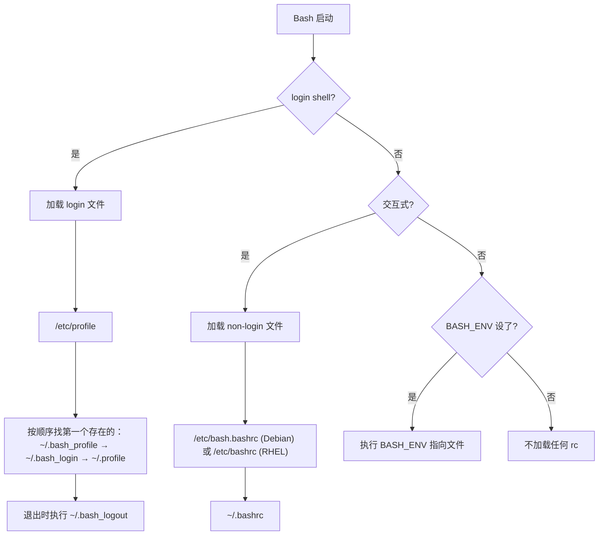
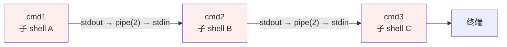

# Shell 与脚本

> **一句话定位**：Shell 是 Linux 的交互层，三剑客与 set -euo pipefail 是脚本健壮性的核心。
> **面试热度**：⭐⭐⭐⭐⭐
> **返回**：[Linux 知识图谱](../README.md)

---

## 一、概述

### 1.1 主题在 Linux 体系中的位置

Shell 不是内核的一部分，而是**用户态的命令解释器**——它读入一行命令，解析、展开、fork 子进程、exec 目标程序，再把内核的退出码回传给用户。面试官问"讲讲 Bash 启动加载哪些文件"看似只在考配置，但它精准牵出六件事：login/non-login 与交互式的启动文件层级、`export` 与环境变量作用域、管道与子 shell 的执行模型、进程替换 `<()` 解决的问题、三剑客 `grep`/`sed`/`awk` 的分工、`set -euo pipefail` 与 `trap` 的健壮性工程——能讲清这些才证明你不只是会敲 `ls`/`cd`。

本主题覆盖七条主线：**Bash 启动层级**（login/non-login/interactive/non-interactive 四象限的文件加载顺序）、**变量作用域**（`export` 才能被子进程继承、`source`/`.` 在当前 shell 执行）、**管道与子 shell**（`|` 每段在子 shell、`$()` 命令替换、进程替换 `<()`）、**三剑客分工**（`grep` 行过滤 / `sed` 行编辑 / `awk` 列处理）、**here doc 与 here string**（`<<EOF` vs `<<<`）、**健壮性选项**（`set -euo pipefail` 各选项语义与陷阱）、**信号与 trap**（`trap 'cleanup' EXIT INT TERM` 捕获信号做清理）。

### 1.2 与其他主题的边界

| 主题 | 边界说明 |
|------|---------|
| [02 进程与线程](../02-process/process-and-thread.md) | 子 shell 的本质是 fork 子进程，fork/exec 机制归 02，**子 shell 在脚本中的作用域、管道执行模型**归 08 |
| [07 安全与权限](../07-security/security-and-permission.md) | `sudoers` 配置、PAM 鉴权链归 07，**Shell 中调用 sudo 的脚本陷阱**在 08 仅点用法 |
| [09 性能与故障排查](../09-ops/performance-and-troubleshooting.md) | `awk`/`sed` 解析 `top`/`ps` 输出在 08 讲用法，**完整排障方法论**归 09 |
| `ops/docker` | Dockerfile ENTRYPOINT 与 Shell 协作归 docker 主题，**ENTRYPOINT exec/shell 形式的信号陷阱**在 08 只关联引用 |

> **记住边界**：本主题讲"Shell 怎么启动、变量怎么传、管道怎么跑、脚本怎么写得健壮"，不讲"fork/exec 内核实现（02）、sudo 鉴权链（07）、排障四步法（09）、容器 ENTRYPOINT 工程模型（docker）"——那些是上游模块的事。

### 1.3 关键术语速览

| 术语 | 一句话定义 | 出现阶段 |
|------|-----------|---------|
| Bash | GNU Bourne-Again Shell，Linux 默认 shell 实现 | 启动层级 |
| login shell | 登录时启动的 shell，加载 `/etc/profile` 等 | 启动层级 |
| non-login shell | 非登录场景的交互 shell，加载 `~/.bashrc` | 启动层级 |
| 交互式 shell | 有提示符、读终端输入的 shell | 启动层级 |
| 非交互式 shell | 执行脚本时无提示符的 shell | 启动层级 |
| 子 shell | 由 `()`、管道、`$()` fork 出的子进程 shell | 管道与子 shell |
| 管道 `\|` | 把前一命令 stdout 接到后一命令 stdin | 管道与子 shell |
| 进程替换 `<()` | 用 `/dev/fd/N` 命名管道把命令输出当文件传 | 管道与子 shell |
| here doc `<<EOF` | 多行输入，支持变量展开 | here doc |
| here string `<<<` | 单行字符串作为 stdin | here doc |
| 环境变量 | 已 `export` 的变量，子进程可继承 | 变量作用域 |
| 位置参数 | `$1`/`$2`...脚本参数，`$#` 个数，`$@` 全部 | 脚本骨架 |
| 特殊变量 | `$?` 退出码、`$$` PID、`$!` 后台 PID | 脚本骨架 |

---

## 二、核心机制

### 2.1 Bash 启动文件加载顺序

Bash 启动时按"登录与否 + 交互与否"四象限加载不同文件，这是 cron 任务脚本失败的最高频根因：



**四象限加载规则**：

| 场景 | 加载文件 | 典型触发方式 |
|------|---------|-------------|
| login + 交互 | `/etc/profile` → `~/.bash_profile`（或 `.bash_login`/`.profile`）→ 退出时 `~/.bash_logout` | `ssh user@host`、`su - user`、TTY 登录 |
| non-login + 交互 | `/etc/bash.bashrc`（或 `/etc/bashrc`）→ `~/.bashrc` | 新开终端标签、`bash`（已登录后再敲） |
| 非交互式（脚本） | `$BASH_ENV` 指向的文件（若设了） | `bash script.sh`、cron 执行 |
| 登录 + 非交互 | `/etc/profile` → `~/.bash_profile`（不读 `.bashrc`） | `ssh user@host 'command'` |

**关键陷阱**：①`~/.bash_profile` 与 `~/.bash_login` 与 `~/.profile` **只加载第一个存在的**，后面的不再读——这是历史兼容设计，常导致改错文件不生效；②cron 跑脚本是**非交互非登录**，默认只读 `$BASH_ENV`，若未设则连 `~/.bashrc` 都不加载，PATH 常缺失；③`ssh user@host 'cmd'` 虽是非交互但**算登录**，会读 `/etc/profile`。生产实践：`~/.bash_profile` 里手动 `source ~/.bashrc` 让两类 shell 配置统一。

### 2.2 管道与子 shell

管道 `|` 是 Shell 的核心组合原语：把左侧命令的 stdout 通过 pipe(2) 接到右侧命令的 stdin。**每段命令都在各自子 shell 中执行**（Bash 4+ 可 `shopt -s lastpipe` 让最后一段在当前 shell，但默认不开）：



**子 shell 的四个来源**：①管道每段；②圆括号 `(cmd)` 显式子 shell；③命令替换 `$(cmd)` 或反引号 `` `cmd` ``；④进程替换 `<(cmd)` `>(cmd)`。**核心认知**：子 shell 是 fork 出的独立进程，**父 shell 的变量改动在子 shell 里改了回不来**——这是 `while read` 管道循环变量丢失的根因。

| 写法 | 是否子 shell | 变量改动 | 典型用途 |
|------|------------|---------|---------|
| `cmd1 \| cmd2` | 每段都是子 shell | 不回传父 shell | 流水线过滤 |
| `$(cmd)` | 子 shell | 不回传 | 取命令输出赋值 |
| `(cmd)` | 子 shell | 不回传 | 临时改环境不影响父 |
| `source cmd` / `. cmd` | 当前 shell | **回传** | 加载配置/函数库 |
| `./script.sh` | 子进程 | 不回传 | 执行独立脚本 |

### 2.3 环境变量作用域：export 与 source

Shell 变量分两类：**局部变量**（只在当前 shell 可见）和**环境变量**（已 `export`，子进程能继承）。区别在子进程的 `environ` 数组是否包含该变量：

```bash
VAR=hello              # 局部变量，子进程看不到
export VAR             # 提升为环境变量
export VAR2=world      # 一步到位
env | grep VAR         # env 只列环境变量，VAR2 在列，VAR 不在（已 export 故都在）
```

**`export` 的本质**：fork 子进程时，内核把父进程的环境变量复制到子进程的 `environ`（C 库 `environ` 指针，对应 `task_struct` 的 `mm->env_start` 区域）。未 export 的变量不进 `environ`，子进程 `getenv` 拿不到。**`source`/`.` 与 `./script.sh` 的区别**：`source` 在当前 shell 执行（不 fork），脚本里的 `export`/变量改动**对当前 shell 生效**——这就是 `source ~/.bashrc` 能重载配置的根因；`./script.sh` fork 子进程执行，变量改动不回传。

### 2.4 三剑客分工：grep / sed / awk

`grep`/`sed`/`awk` 是文本处理三剑客，各自擅长不同维度：

| 工具 | 擅长 | 数据模型 | 典型场景 |
|------|------|---------|---------|
| `grep` | **行过滤**（保留/排除含模式的行） | 行 | 找日志里含 ERROR 的行 |
| `sed` | **行编辑**（按规则替换/删除/插入） | 行 + 流编辑器 | 批量替换字符串、删空行 |
| `awk` | **列处理**（按分隔符切列，做计算） | 行 + 列 + 程序 | 求和、分组统计、多列格式化 |

**选型口诀**：过滤用 grep、替换用 sed、算列用 awk。三者常组合成管道：`grep ERROR app.log | sed 's/\[//g' | awk -F: '{sum+=$2} END{print sum}'`。

**grep 典型用法**：

```bash
# 扩展正则：-E 支持 +、|、()，等价于 egrep
grep -E 'ERROR|WARN' app.log

# 只输出匹配部分（-o），常配合 -E 提取片段
grep -oE 'user_id=[0-9]+' app.log | sort | uniq -c | sort -rn | head

# 上下文：-A 后 N 行、-B 前 N 行、-C 前后各 N 行
grep -C 3 'NullPointerException' app.log

# 反向过滤：排除含模式的行
grep -v 'healthcheck' access.log
```

**sed 典型用法**：

```bash
# 全局替换（g 标志：行内所有匹配，无 g 只替第一个）
sed 's/foo/bar/g' file.txt

# 原地改 + 备份（-i.bak 生成 file.txt.bak）
sed -i.bak 's/port=8080/port=9090/' app.conf

# 删空行与注释行（-n 静默 + /pat/d 删匹配行）
sed -n '/^$/d; /^#/d; p' app.conf

# 多脚本（-e 串多个命令）
sed -e 's/A/a/g' -e 's/B/b/g' file.txt
```

**awk 典型用法**：

```bash
# 按列输出：-F 指定分隔符，$1/$3 是列号，$0 是整行
awk -F: '{print $1, $3}' /etc/passwd

# 分组求和：用关联数组 count[key]
awk -F, '{count[$1]+=$2} END {for(k in count) print k, count[k]}' data.csv

# 条件过滤 + 格式化
awk '$3 > 1000 {printf "%-10s %8.2f\n", $1, $3}' /etc/passwd

# 传外部变量：-v var=val
awk -v threshold="$WARN" '$2 > threshold {print}' metrics.log
```

> **awk 是最强大的**：awk 是图灵完备的语言，能写 `if`/`for`/函数/关联数组，理论上 grep+sed 能做的 awk 都能做，但分工协作更清晰、性能更好（grep/sed 是 C 优化的专用工具，awk 解释执行）。

### 2.5 here doc 与 here string

两者都给命令喂 stdin，但行为不同：

| 写法 | 语法 | 变量展开 | 多行 | 典型用途 |
|------|------|---------|------|---------|
| here doc | `cmd <<EOF ... EOF` | 默认展开 | 是 | 生成配置文件、多行输入 |
| here doc 不展开 | `cmd <<'EOF' ... EOF` | 不展开 | 是 | 写含 `$` 的脚本/SQL |
| here string | `cmd <<<"string"` | 展开 | 否 | 单行字符串喂 stdin |

```bash
# here doc：多行配置，变量展开
cat > /app.conf <<EOF
port=${PORT}
db=${DB_URL}
EOF

# here doc 引号括起 EOF：不展开，原样输出
python3 <<'PY'
print("$HOME 不会被展开")   # 原样输出 $HOME
PY

# here string：单行喂 stdin
grep ERROR <<<"$LOG_LINE"
```

### 2.6 set -euo pipefail：脚本健壮性三件套

`set -euo pipefail` 是生产脚本的标配，四选项各管一件事：

| 选项 | 全称 | 语义 | 不适用场景 |
|------|------|------|-----------|
| `-e` | errexit | 命令失败（非零退出码）立即退出 | 命令预期会失败（如 `grep` 无匹配返回 1） |
| `-u` | nounset | 引用未定义变量报错退出 | `$1` 可能不传时需用 `${1:-default}` |
| `-o pipefail` | pipefail | 管道返回最后一个非零退出码 | 管道中段预期失败 |
| `-x` | xtrace | 执行前打印命令（调试） | 生产环境（只调试时开） |

```mermaid
flowchart TD
    CMD[执行命令] --> Q1{退出码非 0?}
    Q1 -->|否| OK[继续]
    Q1 -->|是| Q2{set -e 开?}
    Q2 -->|是| EXIT1[立即退出]
    Q2 -->|否| OK
    CMD2[引用变量] --> Q3{变量已定义?}
    Q3 -->|否| Q4{set -u 开?}
    Q4 -->|是| EXIT2[报错退出]
    Q4 -->|否| EMPTY[按空串处理]
    Q3 -->|是| OK2[使用变量]
    PIPE[管道 cmd1|cmd2] --> Q5{任一段失败?}
    Q5 -->|是| Q6{pipefail 开?}
    Q6 -->|是| EXIT3[返回非零]
    Q6 -->|否| RETURN[返回最后一段码]
```

**关键陷阱**：①`set -e` 对管道只看最后一段，中段失败被忽略——故需配合 `pipefail`；②`grep` 无匹配返回 1 会触发 `-e` 退出，要用 `grep ... || true` 兜底；③`set -u` 下用 `$1` 必须有默认值 `${1:-}`，否则未传参直接崩；④`local var=$(cmd)` 中 `local` 永远返回 0，会掩盖 `$(cmd)` 的失败——这是 `set -e` 的经典坑，要拆成 `var=$(cmd); local var`。

**`local var=$(cmd)` 的陷阱演示**：

```bash
set -e
fail() {
  local var=$(false)    # local 恒返回 0，掩盖了 false 的失败
  echo "看不到失败，继续跑"  # 这行会执行！
}
fail

# 正确写法：先赋值再 local（赋值失败触发 set -e）
fail_fixed() {
  local var              # 先声明
  var=$(false)          # 赋值失败，set -e 直接退出
  echo "不会到这"
}
fail_fixed
```

**`set -e` 失效的其他场景**：①命令在 `if`/`while`/`&&`/`||` 条件位置时失败不退出（被当成判断）；②命令前缀 `!` 取反时失败不退出；③函数内失败若无 `set -e` 或被条件包裹，外层 `set -e` 也救不了。生产脚本里关键命令显式判断退出码更稳：`cmd || { echo "fail"; exit 1; }`。

### 2.7 信号与 trap

`trap` 捕获信号执行清理命令，是脚本优雅退出的关键：

```bash
trap 'cleanup' EXIT INT TERM   # 退出/Ctrl+C/TERM 时执行 cleanup
trap - INT                     # 取消 INT 的捕获
trap '' INT                    # 忽略 INT（不可中断）
```

| 信号 | 编号 | 默认行为 | 常用 trap |
|------|------|---------|----------|
| `EXIT` | - | 进程退出 | 清理临时文件、回滚 |
| `INT` | 2 | 终止（Ctrl+C） | 同 EXIT 清理 |
| `TERM` | 15 | 终止（kill 默认） | 同 EXIT 清理 |
| `HUP` | 1 | 挂断 | nohup 屏蔽它 |
| `KILL` | 9 | 强杀 | **不可捕获**，trap 无效 |

**陷阱**：①`trap 'cleanup' EXIT` 会在脚本任何退出路径（正常结束、`set -e` 触发、Ctrl+C）都执行，是最稳的清理点；②`KILL`（9）不可捕获，靠 trap 清理的脚本被 `kill -9` 会留下垃圾；③子 shell 的 trap 不影响父，管道里的子 shell 捕获信号要单独设。关联 [02 进程与线程](../02-process/process-and-thread.md) 的信号机制。

---

## 三、命令与示例

### 3.1 命令族速查表

| 工具 | 常用选项 | 用途 |
|------|---------|------|
| `grep` | `-r` 递归 / `-v` 反向 / `-E` 扩展正则 / `-o` 只输出匹配 / `-A/-B/-C N` 上下文 | 行过滤 |
| `sed` | `-i` 原地改 / `-n` 静默 / `-e` 多脚本 / `s/A/B/g` 全局替换 | 行编辑 |
| `awk` | `-F` 分隔符 / `-v var=val` 传变量 / `-f` 脚本文件 | 列处理 |
| `find` | `-name` / `-type f/d` / `-mtime +/-N` / `-exec cmd {} \;` | 文件查找 |
| `xargs` | `-I {}` 占位 / `-n N` 分批 / `-P N` 并发 | 把 stdin 转命令参数 |
| `cut` | `-d` 分隔符 / `-f` 列 / `-c` 字符 | 列切割 |
| `sort` | `-k N` 按列 / `-n` 数字序 / `-r` 倒序 / `-u` 去重 | 排序 |
| `uniq` | `-c` 计数 / `-d` 只显重复 | 去重（需先 sort） |
| `tr` | `tr A B` / `tr -d ' '` / `tr -s ' '` | 字符转换/删除/压缩 |
| `tee` | `tee file` / `tee -a` 追加 | stdin 分流到文件+stdout |
| `paste` | `-d` 分隔符 / `-s` 横向合并 | 列合并 |
| `column` | `-t` 对齐 / `-s,` 指定分隔符 | 表格美化 |

### 3.2 实战 one-liner

```bash
# 递归找含 pattern 的行（带行号）
grep -rn 'ERROR' .

# 批量替换文件内容（原地改）
sed -i 's/old/new/g' file.txt

# 按第三列数字排序去重（passwd 按 uid）
awk -F: '{print $1,$3}' /etc/passwd | sort -k2 -n

# 找 7 天前的 log 并 gzip
find . -name '*.log' -mtime +7 -exec gzip {} \;

# 看内存 TOP10 进程并格式化 MB
ps -eo pid,rss,cmd --sort=-rss | head -10 | awk '{printf "%s %.0fMB %s\n",$1,$2/1024,$3}'

# 统计日志中各错误码出现次数（sort + uniq -c）
grep -oE 'code=[0-9]+' app.log | sort | uniq -c | sort -rn

# 找最大的 N 个文件（du + sort）
du -sh /* 2>/dev/null | sort -rh | head -10

# 批量改名（find + xargs + sed）
find . -name '*.txt' | xargs -I {} sh -c 'mv "{}" "$(echo {} | sed "s/old/new/")"'
```

### 3.3 健壮脚本骨架

```bash
#!/usr/bin/env bash
# 健壮脚本骨架：set -euo pipefail + trap 清理
set -euo pipefail
IFS=$'\n\t'

# 临时文件与清理
TMPDIR_WORK=$(mktemp -d)
cleanup() {
  rm -rf "$TMPDIR_WORK"
  echo "[cleanup] 临时目录已删除" >&2
}
trap cleanup EXIT INT TERM

# 参数校验
usage() { echo "Usage: $0 <env> <svc>" >&2; exit 1; }
[[ $# -ge 2 ]] || usage
ENV="${1:?ENV 必填}"
SVC="${2:?SVC 必填}"

# 主逻辑
echo "[$ENV] 部署 $SVC，工作目录 $TMPDIR_WORK"
# ... 业务命令 ...
echo "完成"
```

**骨架要点**：①`set -euo pipefail` 三件套兜底；②`IFS=$'\n\t'` 防「未加引号的变量」按空格分词踩坑；③`mktemp -d` + `trap cleanup EXIT INT TERM` 保证任何退出路径都清理临时文件；④`${1:?msg}` 既能校验必填又能给默认错误信息；⑤`>&2` 把错误信息走 stderr，不污染 stdout 管道。

---

## 四、高频追问

**Q1：login shell 和 non-login shell 的区别？加载哪些文件？**

login shell 加载 `/etc/profile` → 按顺序找第一个存在的 `~/.bash_profile` / `~/.bash_login` / `~/.profile`，退出时执行 `~/.bash_logout`；non-login 交互 shell 加载 `/etc/bash.bashrc`（或 `/etc/bashrc`）→ `~/.bashrc`。触发方式：`ssh user@host`、`su - user`、TTY 登录是 login；新开终端标签、`bash` 是 non-login。关键：`~/.bash_profile` 系列只读第一个存在的，常在它里头 `source ~/.bashrc` 统一配置。

**Q2：为什么要 export？不 export 子进程能拿到吗？**

不能。Shell 变量分局部（只在当前 shell）和环境变量（进 `environ`）。fork 子进程时内核只复制 `environ`，未 export 的变量不在 `environ` 里，子进程 `getenv` 拿不到。`export VAR` 把变量从局部提升到环境变量，`env` 命令只列环境变量。验证：`VAR=x; bash -c 'echo $VAR'`（空），`export VAR; bash -c 'echo $VAR'`（x）。

**Q3：source 和 ./script.sh 有什么区别？**

`source`（或 `.`）在当前 shell 执行脚本，不 fork 子进程，脚本里的 `export`、变量赋值、`cd` 都对当前 shell 生效——所以 `source ~/.bashrc` 能重载配置；`./script.sh` fork 子进程执行，变量改动不回传，脚本结束子进程退出，当前 shell 环境不变。加载配置/函数库用 `source`，跑独立程序用 `./`。

**Q4：管道会创建子 shell 吗？为什么管道里的变量改了不生效？**

会。管道每段都在各自子 shell 中执行，子 shell 是 fork 的独立进程，退出后变量改动丢失。经典坑：`seq 10 | while read i; do sum=$((sum+i)); done; echo $sum` 输出空——`while` 在子 shell 里改的 `sum` 回不到父。解法：用进程替换 `while read i; do sum=$((sum+i)); done < <(seq 10)`，让 `while` 在当前 shell 跑；或 Bash 4+ `shopt -s lastpipe` 让管道最后一段在当前 shell。

**Q5：进程替换 <() 是什么？解决什么问题？**

`<(cmd)` 把命令的输出接到一个 `/dev/fd/63` 这样的命名管道上，作为文件名传给需要文件参数的命令。解决"差集"问题：`diff <(cmd1) <(cmd2)` 比较两个命令输出，不用先落临时文件；`comm <(sort a) <(sort b)` 求两列表的交集/差集。本质：`<()` fork 子 shell 跑 cmd，stdout 接到 pipe，再把 pipe 的 fd 路径当文件名给父命令。

**Q6：grep/sed/awk 各自擅长什么？**

grep 擅长**行过滤**（保留含模式的行），正则强但不改内容；sed 擅长**行编辑**（替换/删除/插入），是流编辑器逐行处理；awk 擅长**列处理**（按分隔符切列、做计算、格式化输出），是完整的程序语言。口诀：过滤 grep、替换 sed、算列 awk。常组合：`grep ... | sed ... | awk ...`。

**Q7：set -euo pipefail 各是什么意思？什么时候不适用？**

`-e` 命令失败即退；`-u` 引用未定义变量报错；`-o pipefail` 管道返回最后非零退出码；`-x` 调试打印命令。不适用：①命令预期失败（`grep` 无匹配返回 1 触发 `-e`，用 `|| true` 兜底）；②`$1` 可能不传时触发 `-u`，用 `${1:-default}`；③`local var=$(cmd)` 中 `local` 返回 0 掩盖失败，拆成两步。cron 脚本尤其要加，否则静默失败无人知。

**Q8：here doc 和 here string 的区别？**

here doc `<<EOF ... EOF` 多行输入，默认变量展开，引号括 EOF（`<<'EOF'`）则不展开——写脚本/SQL 时用引号版避免 `$` 被吃；here string `<<<"str"` 单行字符串喂 stdin，变量展开。场景：多行配置用 here doc，单行喂 stdin（`grep pat <<<"$line"`）用 here string。注意 here doc 结束符 EOF 必须顶格且单独成行（除非用 `<<-EOF` 可用 tab 缩进）。

**Q9：怎么写一个能在 Ctrl+C 时清理临时文件的脚本？**

用 `trap 'cleanup' EXIT INT TERM`。`EXIT` 是伪信号，脚本任何退出路径（正常、`set -e` 失败、收到 INT/TERM）都触发，是最稳的清理点。cleanup 函数里 `rm -rf` 临时目录。注意 `kill -9`（SIGKILL 不可捕获）会跳过 trap——所以生产里临时文件最好用 `mktemp -d` 放 `/tmp`，系统重启自动清。关联 02 进程的信号机制。

**Q10：xargs -P 并发执行的陷阱？**

`xargs -P N` 起 N 个并发进程跑命令，提升吞吐但有三坑：①输出交错（多进程同时写 stdout），需 `xargs -P 4 -I {} sh -c 'cmd {} > {}.log'` 各自落文件；②失败码只看子进程退出，父 xargs 返回 123（任一失败 123、命令找不到 127）；③`set -e` 不跨 xargs 子进程，xargs 内部失败不触发父脚本的 `-e`。替代方案：`parallel`（GNU）输出更可控。

**Q11：怎么让一个脚本既能交互式跑又能 cron 跑？**

核心：脚本头部加 `set -euo pipefail`，所有外部命令用绝对路径（cron 的 PATH 极简），依赖的环境变量在脚本里显式 `export`，不假设 `~/.bashrc` 已加载。cron 行里加 `BASH_ENV=~/.bashrc` 让非交互 shell 加载配置，或脚本内 `source ~/.bashrc` 兜底。输出重定向到日志文件，cron 的 stdout 默认寄给 cron 用户。

**Q12：Bash 脚本里怎么处理错误码？|| 和 && 的短路怎么用？**

`cmd1 || cmd2`：cmd1 失败（非零）才跑 cmd2；`cmd1 && cmd2`：cmd1 成功（零）才跑 cmd2。经典：`mkdir -p dir || exit 1`（建失败就退）、`test -f f && rm f`（存在才删）、`grep pat file || echo "未找到"`。注意 `set -e` 下 `cmd || true` 能屏蔽失败不退出，`cmd && true` 不行。`$?` 存上一条退出码，`if cmd; then` 显式判断比短路更可读。

---

## 五、Java/容器关联

### 5.1 Dockerfile ENTRYPOINT 与 Shell 协作

Dockerfile 的 ENTRYPOINT 有 exec 形式（`["java","-jar","app.jar"]`）和 shell 形式（`java -jar app.jar`），后者被包成 `sh -c "java ..."`，导致 java 不是 PID 1，`SIGTERM` 被 sh 吞掉——这是容器优雅停机失效的高频根因。关联 `ops/docker/01-foundation/container-principle.md` 的 PID 1 信号陷阱。

```dockerfile
# 错误：sh 作 PID 1，java 收不到 SIGTERM
ENTRYPOINT java -jar app.jar

# 正确：exec 形式，java 作 PID 1，收 SIGTERM 触发 ShutdownHook
ENTRYPOINT ["java", "-jar", "app.jar"]

# 或用 ENTRYPOINT 脚本做启动前检查
ENTRYPOINT ["./entrypoint.sh"]
# entrypoint.sh 内：set -euo pipefail + 校验环境 + exec java "$@"
```

### 5.2 kubectl 排障 one-liner

```bash
# 看所有 Pod 的名字/状态/IP
kubectl get pods -o wide | awk '{print $1,$3,$7}'

# 找所有非 Running 的 Pod
kubectl get pods -A | grep -v Running | grep -v NAME

# 看某 Pod 最近事件
kubectl describe pod <name> | grep -A10 Events

# 批量取 Pod 日志（最近 5 分钟）
kubectl get pods -n default -o name | xargs -I {} kubectl logs {} --since=5m
```

关联 `ops/k8s` 的排障实战。注意 `awk` 列号依赖 `kubectl get` 的输出列顺序，不同版本可能变，稳妥用 `-o jsonpath`。

### 5.3 Java 启动脚本模板

生产 Java 服务常配一个启动脚本做环境校验 + JVM 参数注入 + trap 优雅关闭：

```bash
#!/usr/bin/env bash
set -euo pipefail

# 环境校验
: "${JAVA_HOME:?未设}"
: "${APP_JAR:?未设}"

# JVM 参数
JAVA_OPTS="${JAVA_OPTS:--Xms1g -Xmx1g -XX:+UseG1GC}"
JAVA_OPTS="$JAVA_OPTS -XX:+ExitOnOutOfMemoryError"

# 优雅关闭：发 SIGTERM 触发 ShutdownHook
trap 'kill -TERM $JAVA_PID; wait $JAVA_PID' INT TERM

# 启动
exec java $JAVA_OPTS -jar "$APP_JAR" &
JAVA_PID=$!
wait $JAVA_PID
```

关键点：`exec` 让 java 接管当前进程作 PID 1（容器场景）；脚本场景用 `&` + `wait` + `trap` 转发信号。关联 `framework/spring-framework` 的 `ContextClosedEvent` 与 `@PreDestroy`。

### 5.4 jps/jstack/jcmd 输出用 awk 解析

```bash
# 列出所有 JVM 进程（jps -l 输出 "PID 主类全名"）
jps -l | awk '$2 ~ /com.example/ {print $1}'

# 找高 CPU 线程（top -H 的 TID 转十六进制后在 jstack 里找）
top -H -p <PID> -bn1 | awk '$9>50 {print $1}' | while read tid; do
  nid=$(printf '0x%x' $tid)
  jstack <PID> | grep -A20 "nid=$nid"
done

# jcmd 看 GC 情况
jcmd <PID> GC.heap_info | awk '/used/{print}'
```

关联 `java-core/jvm` 的 JVM 工具与 `ops/linux/09-ops` 的性能排障方法论。

### 5.5 实战映射表

| 场景 | Shell 知识点 | Java/容器关联 |
|------|-------------|--------------|
| 容器优雅停机 | ENTRYPOINT exec 形式 + trap | §5.1，`sh -c` 吞 SIGTERM |
| K8s 排障 | kubectl + awk 管道 | §5.2，列号依赖输出顺序 |
| Java 启动脚本 | set -euo + trap 信号转发 | §5.3，`exec java` 作 PID 1 |
| 高 CPU 线程定位 | top -H + jstack + awk | §5.4，TID 转十六进制 grep 栈 |
| cron 跑 Java 任务 | 非 login shell PATH | §四 Q11，脚本内显式 export PATH |

---

## 六、故障排查案例

### 6.1 案例：cron 任务脚本失败，non-login shell 没加载 ~/.bashrc 的 PATH

**现象**：手动 `./deploy.sh` 正常，但放进 cron 跑报 `java: command not found`，脚本头部已 `source ~/.bashrc` 仍失败。

**排障链**：

```bash
# 1. 看 cron 实际执行环境
* * * * * env > /tmp/cron_env.log 2>&1
# 查看 PATH=/usr/bin:/bin（极简，无 JAVA_HOME/bin）

# 2. 确认 java 在哪
which java          # 手动看：/opt/jdk/bin/java
# cron 的 PATH 没有 /opt/jdk/bin

# 3. 看 ~/.bashrc 是否被加载
bash -c 'echo $PATH'   # 非交互非登录，PATH 极简 → ~/.bashrc 没加载

# 4. 确认脚本头 source ~/.bashrc 为何不生效
head -1 deploy.sh   # #!/bin/bash（解释器没问题）
tail -3 ~/.bashrc
# case $- in *i*) ;; *) return;; esac   # .bashrc 开头常这样非交互早退
# → 即便 source，非交互下 .bashrc 内容也被跳过

# 5. 根因：cron 是非交互非登录，默认只读 $BASH_ENV，若未设则
# ~/.bashrc 不加载；即便脚本里 source ~/.bashrc，标准 .bashrc 开头
# 的 `*i*) ;; *) return` 会在非交互时直接 return，PATH 设置被跳过
```

**解决**：①脚本头部用 `#!/usr/bin/env bash`（非 `/bin/sh`）+ `set -euo pipefail`；②所有外部命令用绝对路径或在脚本内显式 `export PATH=/usr/bin:/bin:/opt/jdk/bin`；③cron 行加 `BASH_ENV=~/.bashrc` 或脚本内 `source ~/.bashrc` 用 `.` 兼容 POSIX；④依赖的环境变量在脚本里 `export`，不假设已加载。

**方法论**：①`env > log` dump cron 实际环境；②`which cmd` 确认命令路径与 cron PATH 是否一致；③脚本头部用 `#!/usr/bin/env bash` 而非 `/bin/sh`；④所有 PATH/变量在脚本内显式设，不依赖 rc 文件。

### 6.2 案例：管道 while 循环变量丢失，用进程替换替代

**现象**：用管道 `while read` 累加变量，循环结束后变量是空，但循环内打印有值。

**排障链**：

```bash
# 失败写法：管道的 while 在子 shell
sum=0
seq 1 10 | while read i; do
  sum=$((sum + i))
done
echo $sum       # 空！sum 在子 shell 里改的回不来

# 验证子 shell
seq 1 10 | { while read i; do sum=$((sum+i)); done; echo $sum; }
# 输出 55（子 shell 内可见），但外层 sum 仍空

# 解决：用进程替换让 while 在当前 shell
sum=0
while read i; do
  sum=$((sum + i))
done < <(seq 1 10)
echo $sum       # 55，当前 shell 改的变量保留
```

**根因**：管道每段在子 shell 执行，子 shell 是 fork 的独立进程，变量改动在子进程内存里，退出后丢失。`< <(cmd)` 的进程替换让 cmd 在子 shell 跑，但 while 在当前 shell 读它的输出，变量改动保留。

**解决**：①优先用进程替换 `done < <(cmd)`；②Bash 4+ 可 `shopt -s lastpipe` 让管道最后一段在当前 shell（但需后台或非交互才稳定）；③若必须管道，把结果写到文件再读回。

**方法论**：①管道里变量丢失先想子 shell；②`< <(cmd)` 进程替换是标准解法；③`lastpipe` 是 Bash 4+ 选项但有局限。

### 6.3 案例：管道中段失败被吞，加 pipefail 后定位 sed 报错

**现象**：数据 ETL 脚本 `grep + sed + awk` 管道，跑完 awk 输出空，但脚本退出码 0，CI 判定通过但下游数据缺失。

**排障链**：

```bash
# 失败写法：无 pipefail，中段失败被吞
grep 'order' data.log | sed 's/,/\t/g' | awk -F'\t' '{sum+=$3} END{print sum}'
# 输出空，退出码 0（awk 成功跑完，没数据也不报错）

# 1. 拆开看每段退出码
grep 'order' data.log; echo "grep=$?"
# grep=1（无匹配，订单日志在另一个文件）
# sed / awk 没 stdin 但正常结束

# 2. 加 pipefail + set -e 复跑
set -euo pipefail
grep 'order' data.log | sed 's/,/\t/g' | awk -F'\t' '{sum+=$3} END{print sum}'
# 现在脚本因 grep 返回 1 立即退出，暴露根因

# 3. 确认日志文件路径
ls -lh data.log            # 0 字节（当天没订单写入此文件）
ls -lh orders-*.log        # 实际在 orders-2026-08-09.log
```

**根因**：管道默认退出码只取最后一段（awk 成功返回 0），中段 grep 无匹配返回 1 被吞，`set -e` 不带 `pipefail` 也救不了。加 `pipefail` 后管道返回第一个非零退出码，grep 的 1 暴露问题。

**解决**：①脚本头部始终 `set -euo pipefail`；②grep 预期可能无匹配时用 `grep ... || true` 兜底，区分"无匹配正常"与"无匹配异常"；③关键 ETL 在管道后显式校验输出非空：`out=$(...); [[ -n "$out" ]] || { echo "空输出"; exit 1; }`。

**方法论**：①管道退出码异常先加 `pipefail`；②拆开看每段 `${PIPESTATUS[@]}`（Bash 内置数组存管道各段退出码）；③grep 无匹配是预期还是异常要分清，异常该让它失败。

---

> **返回**：[Linux 知识图谱](../README.md)
