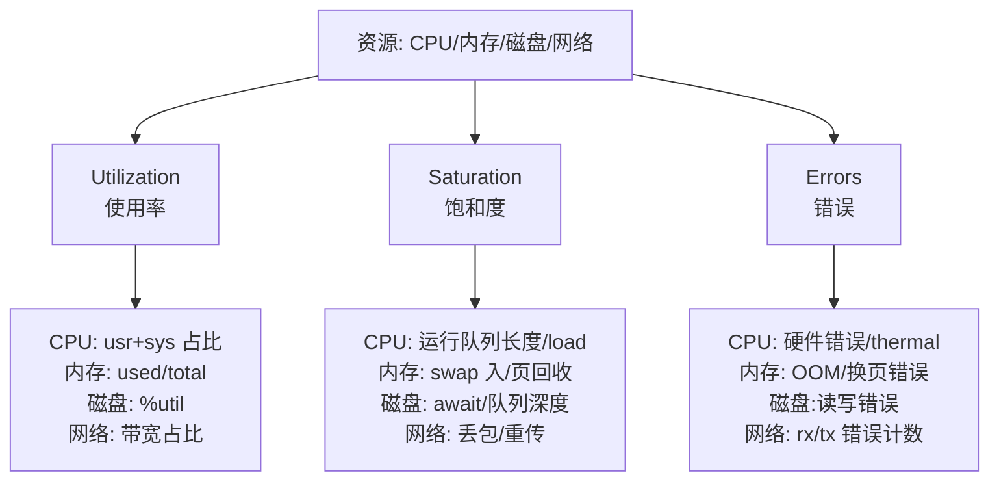
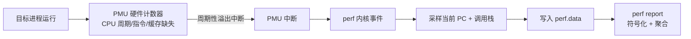
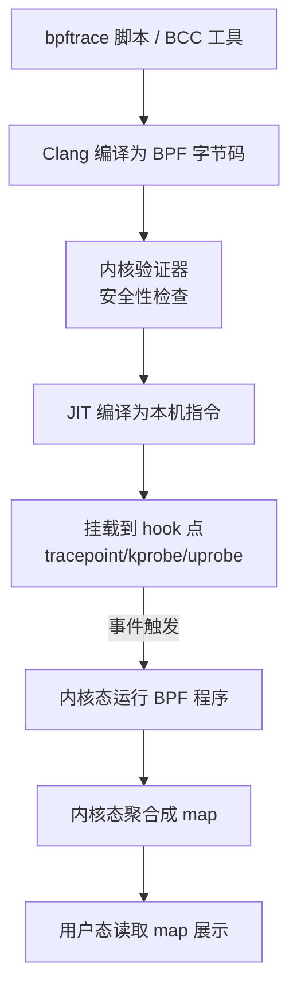
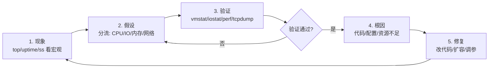

# 性能与故障排查

> **一句话定位**：性能排查方法论比工具更重要，USE/RED 模型 + 排障四步法是面试加分项。
> **面试热度**：⭐⭐⭐⭐⭐
> **返回**：[Linux 知识图谱](../README.md)

---

## 一、概述

### 1.1 主题在 Linux 体系中的位置

性能与故障排查不是某个独立子系统，而是**前面所有主题的综合应用层**——进程怎么调度、内存怎么回收、IO 怎么走、网络怎么收包，到了排障现场都会以"某个指标异常"的形式重新登场。面试官问"Java 服务 CPU 100% 怎么排查"看似在考工具，但它精准牵出六件事：USE/RED 方法论的选型思路、load average 与 CPU 利用率的区分、perf 采样原理、strace 的 ptrace 机制、eBPF 的内核可编程性、排障四步法（现象→假设→验证→根因）——能讲清这些才证明你不只是会敲 `top`。

本主题覆盖七条主线：**方法论**（USE 三维度 / RED 三维度 / 排障四步法）、**CPU 观测**（top/vmstat/mpstat/load average/CPU 各状态）、**内存与 IO 观测**（free/iostat/pidstat/sar）、**系统调用追踪**（strace 的 ptrace 原理与开销陷阱）、**内核剖析**（perf 的 PMU 采样、record/report/top）、**eBPF 可编程观测**（bpftrace one-liner、BCC 工具集、与 strace 的性能差距）、**网络抓包**（tcpdump/wireshark/ss）。

### 1.2 与其他主题的边界

| 主题 | 边界说明 |
|------|---------|
| [02 进程与线程](../02-process/process-and-thread.md) | `task_struct` 的 `state` 字段、R/S/D 状态机在 02 讲，**load average 怎么算、top 各状态列怎么读**归 09 |
| [03 内存管理](../03-memory/memory-management.md) | `free`/`vmstat`/`pmap` 的字段含义在 03 讲，**内存泄漏端到端排障四步法、USE 方法论对内存的应用**归 09 |
| [04 IO 模型与 epoll](../04-io/io-model-and-epoll.md) | `iostat`/`iotop` 的字段含义在 04 讲，**IO 饱和的 USE 视角、iowait 高的端到端排查**归 09 |
| [06 网络内核](../06-network/network-kernel.md) | `ss`/`tcpdump` 的命令用法在 06 讲，**网络偶发延迟的端到端排障、tcpdump 抓慢请求**归 09 |
| [08 Shell 与脚本](../08-shell/shell-and-scripting.md) | `awk`/`sed` 解析 `top`/`ps` 输出的用法在 08 讲，**完整排障方法论**归 09 |

> **记住边界**：本主题讲"用什么方法论选指标、用什么工具看指标、看到异常怎么走四步法定根因"，不讲"进程状态机字段（02）、free 字段含义（03）、iostat 字段含义（04）、tcp 协议字段（06）、awk 语法（08）"——那些是上游主题的事，本主题只在排障链里把它们串起来用。

### 1.3 关键术语速览

| 术语 | 一句话定义 | 出现阶段 |
|------|-----------|---------|
| USE 方法论 | 对每个资源看 Utilization（使用率）/Saturation（饱和度）/Errors（错误）三维度 | 方法论 |
| RED 方法论 | 面向服务看 Rate（请求率）/Errors（错误）/Duration（延迟）三维度 | 方法论 |
| 排障四步法 | 现象 → 假设 → 验证 → 根因，每步用对应工具 | 方法论 |
| load average | 1/5/15 分钟平均运行队列长度（R+D 状态进程数的指数移动平均） | CPU 观测 |
| CPU utilization | CPU 各状态时间占比（usr/sys/idle/iowait/steal/softirq/hardirq） | CPU 观测 |
| CPU load | 运行队列长度，即 R+D 状态进程数 | CPU 观测 |
| iowait | CPU 有空闲且存在未完成 IO 请求的时间占比 | CPU 观测 |
| steal | 虚拟化环境下被宿主或其他 VM 偷走的 CPU 时间占比 | CPU 观测 |
| softirq | 软中断处理时间占比（网络收包等） | CPU 观测 |
| hardirq | 硬中断处理时间占比 | CPU 观测 |
| PMU | Performance Monitoring Unit，CPU 硬件性能计数单元 | perf |
| ptrace | 进程跟踪系统调用，strace/gdb 的底层机制 | strace |
| eBPF | 内核可编程字节码，4.x+ 引入，比 strace 性能好几个数量级 | eBPF |
| bpftrace | eBPF 的 one-liner 探针语言 | eBPF |
| BCC | BPF Compiler Collection，eBPF 工具集 | eBPF |

---

## 二、核心机制

### 2.1 USE 方法论：资源视角的三维度

USE（Utilization / Saturation / Errors）是 Brendan Gregg 提出的资源观测方法论：**对每个资源，从使用率、饱和度、错误三个维度看**。它解决"指标这么多看哪个"的选择困难——不是盯着一个 CPU 使用率，而是对 CPU/内存/磁盘/网络每个资源都问三个问题。



**三维度区分**：① Utilization 衡量"用了多少"（忙不忙），高使用率不一定是问题（CPU 100% 跑计算可能正常）；② Saturation 衡量"排队程度"（堵不堵），饱和度高**几乎一定是问题**——队列堆积说明处理速度跟不上到达速度；③ Errors 衡量"出错量"，错误非零**一定是问题**。口诀：**高使用率观察、高饱和度扩容、非零错误必查**。

> **关键认知**：USE 是**资源视角**（对每个硬件资源问三问），与下文 RED 的**服务视角**正交。CPU 100%（Utilization 高）但 load 1（Saturation 低）说明在干活没排队，可能正常；CPU 30% 但 load 8（Saturation 高）说明在等 IO 或锁，反而有问题。**饱和度比使用率更值得警惕**。

### 2.2 RED 方法论：服务视角的三维度

RED（Rate / Errors / Duration）面向服务（HTTP/RPC），与 USE 互补：USE 看硬件资源，RED 看服务行为。

| 维度 | 含义 | 典型指标 | 适用层 |
|------|------|---------|--------|
| Rate | 请求率（QPS/RPS） | 每秒请求数 | 服务入口 |
| Errors | 错误率 | 5xx 数/错误占比 | 服务处理 |
| Duration | 延迟（P50/P95/P99） | 请求耗时分布 | 服务处理 |

**USE vs RED 选型**：基础设施（机器/节点）排障用 USE（硬件资源视角），微服务排障用 RED（服务行为视角）。实战常两者结合：Java 服务 P99 延迟高（RED Duration 异常）→ 查 GC 日志 → 发现 Full GC 频繁 → 查内存 USE（Saturation：swap 入/老年代占用）→ 定位堆泄漏。**面试加分点**：能说出"先 RED 定位是哪类问题，再 USE 下沉到资源根因"的协作思路。

### 2.3 load average：运行队列长度的指数移动平均

`uptime`/`top` 显示的三个数（如 `load average: 2.50, 1.80, 1.20`）是 **1/5/15 分钟的平均运行队列长度**——即 R（运行/就绪）+ D（不可中断睡眠）状态进程数的指数移动平均。**它不是 CPU 使用率**。

```bash
$ uptime
 10:30:00 up 30 days, load average: 2.50, 1.80, 1.20
#                1 分钟 ^^^  5 分钟 ^^^  15 分钟 ^^^
```

**与 CPU 核数的关系**：load average 的绝对值要对比 CPU 核数看——8 核机器 load 8 表示每核刚好满载不排队（理想），load 16 表示每核排 2 个进程（饱和），load 2 表示大部分核空闲。**三数趋势**：1min > 5min > 15min 说明负载在上升（突发），1min < 5min < 15min 说明负载在下降（恢复）。**D 状态计入 load 的陷阱**：D（不可中断睡眠，等 IO）进程也计入 load，所以磁盘慢时 load 也会飙高但 CPU 可能很闲——这是"load 高但 CPU 不忙"的典型根因。

> **关键区分**：load average 是"队列长度"（Saturation 视角），CPU utilization（usr+sys）是"忙时占比"（Utilization 视角）。load 高 + CPU 高 = CPU 瓶颈；load 高 + CPU 低 = IO/锁瓶颈（D 状态多）。这两个指标配合能快速分流问题类型。

### 2.4 CPU 各状态：usr/sys/idle/iowait/steal/softirq/hardirq

`top`/`vmstat`/`mpstat` 显示的 CPU 占比分七种状态，每种代表不同的忙法：

| 状态 | 缩写 | 含义 | 高了说明 |
|------|------|------|---------|
| usr | us | 用户态执行用户代码 | CPU 密集计算（业务逻辑/算法） |
| sys | sy | 内核态执行（系统调用/中断） | 系统调用过多/内核瓶颈 |
| idle | id | 空闲（无任务） | CPU 不忙 |
| iowait | wa | 空闲且存在未完成 IO 请求 | IO 慢（但 CPU 同时空闲） |
| steal | st | 被宿主/其他 VM 偷走的时间 | 云主机超卖 |
| softirq | si | 软中断处理（网络收包等） | 网络包量大 |
| hardirq | hi | 硬中断处理 | 硬件中断频繁 |

**iowait 的反直觉认知**：iowait 高**不代表 CPU 忙**——它本质是"CPU 空闲（idle）但有线程在等 IO，所以把这段时间记成 iowait 而非 idle"。iowait 和 idle 是**互斥的两个空闲桶**，iowait 高时把任务从"idle"挪到"iowait"，CPU 实际还是闲的。所以单看 iowait 高不能下结论，要配合 `iostat`/`vmstat` 的 `bi`（读块数）看 IO 是否真的慢。**sys 高的典型场景**：大量系统调用（strace/epoll_wait 频繁）、锁竞争（futex 自旋）、内存操作（page fault 处理）。**steal 高**只在虚拟化环境出现，宿主超卖把 vCPU 时间分给了别的 VM。

### 2.5 perf 工作原理：PMU 采样

`perf` 是 Linux 内核的性能分析工具（源码 `tools/perf/`），基于 CPU 的 PMU（Performance Monitoring Unit）硬件计数器。核心三个子命令：`perf top`（实时热点）、`perf record`（采样落盘）、`perf report`（解析报告）。



**采样原理**：perf 设定 PMU 计数器（如 `PERF_COUNT_HW_CPU_CYCLES`），每 N 个周期溢出触发一次中断（默认采样频率 4000Hz，即每秒最多 4000 次采样），中断时记录当前指令地址（PC）和调用栈。**`perf record -F 999 -g -p <pid>`**：`-F 999` 设采样频率 999Hz，`-g` 记录调用栈，`-p` 指定进程。**`perf report`** 把 perf.data 里的 PC 地址通过 `/proc/kallsyms`（内核符号）和 ELF 符号表（用户态）翻译成函数名，按占比排序展示热点。

> **面试口径**：能说出"perf 基于 PMU 硬件计数器采样，不是全量记录，所以开销低（1-5%）；`perf record -g` 记调用栈，`perf report` 符号化展示；Java 进程要先用 `perf-map-agent` 生成 JIT 代码符号表，否则栈里只有 `[unknown]`"就够。关联 `java-core/jvm` 的 C2 编译与符号解析。

### 2.6 strace 原理：ptrace 的性能陷阱

`strace` 追踪进程的系统调用，底层是 `ptrace(PTRACE_SYSCALL, pid)`：每次系统调用入口和出口都让被追踪进程陷入停顿，strace 读取寄存器拿 syscall 号、参数、返回值。**因为每个 syscall 都要两次上下文切换（停→跑→停），开销巨大（10-100x 慢）**。

```bash
# strace 原理：ptrace 在 syscall 入口/出口各停一次
strace -p <pid>                     # 追踪所有 syscall
strace -p <pid> -e trace=read,write # 只追踪 read/write
strace -p <pid> -c                  # 汇总统计（不打印每次调用）
strace -p <pid> -f                  # 跟踪子进程/fork
```

**性能陷阱**：strace 对高频 syscall 的进程（如网络服务每秒上万 read/write）是灾难——原本 10 万 QPS 的服务 strace 后可能只剩 1 千 QPS，且会让被追踪进程的延迟暴增，**生产环境慎用**。**`-c` 汇总模式**相对好一些（不打印每次调用只统计），但仍比原生慢一个数量级。**替代方案**：eBPF（下节）能以纳秒级开销观测 syscall，比 strace 快几个数量级，生产排障优先用 eBPF。

> **关键认知**：strace 是"精确但慢"的诊断工具——适合开发/测试环境定位"进程到底在调什么 syscall、卡在哪个调用"，不适合生产高性能场景。面试常问"strace 原理与为什么生产慎用"，答出 ptrace + 两端停顿 + 10-100x 开销 + eBPF 替代就到位。

### 2.7 eBPF：内核可编程观测

eBPF（extended BPF）是 Linux 内核的可编程字节码框架（4.x+ 内核引入），允许在内核态运行安全的沙箱程序，挂载到各种 hook 点（syscall/tracepoint/kprobe/uprobe）。**相比 strace 的全量 ptrace 拦截，eBPF 在内核聚合后再传用户态，开销低几个数量级**。



**两大上层工具**：① **bpftrace**：one-liner 探针语言，适合临时排查，如 `bpftrace -e 'tracepoint:syscalls:sys_enter_openat { @[comm] = count(); }'` 统计各进程 openat 次数；② **BCC**（BPF Compiler Collection）：Python 封装的成熟工具集，如 `execsnoop`（追踪进程执行）、`opensnoop`（追踪文件打开）、`runqlat`（运行队列延迟）、`biosnoop`（块 IO 延迟）、`tcplife`（TCP 连接生命周期）。**与 strace 的对比**：strace 拦截每次 syscall 都要两次上下文切换，eBPF 在内核聚合成 map 才传用户态，开销从 O(每次调用) 降到 O(聚合批次)，**生产可用**。

> **面试口径**：eBPF 是 4.x+ 内核引入的可编程观测框架，在内核态安全运行 BPF 字节码，开销极低；bpftrace 是 one-liner 探针语言，BCC 是成熟工具集；相比 strace 的 ptrace 全量拦截，eBPF 在内核聚合后传用户态，性能好几个数量级，是生产排障的现代工具。关联 `ops/k8s` 的 Cilium（eBPF 网络方案）。

### 2.8 排障四步法：现象 → 假设 → 验证 → 根因

性能排障不是乱敲命令，而是有方法论的递进过程：**观察现象 → 形成假设 → 工具验证 → 定位根因**，每一步用对应的工具。



**四步法实战映射**：
1. **现象**：用 `top`/`uptime`/`ss` 看宏观（CPU 高？load 高？连接多？），定位是哪类问题。
2. **假设**：根据现象分流——CPU usr 高想计算密集，iowait 高想 IO 慢，load 高 CPU 低想 IO/锁，sy 高想系统调用/锁竞争。
3. **验证**：用针对性工具验证假设——`vmstat 1` 看队列与 IO、`iostat -x` 看磁盘延迟、`perf top` 看函数热点、`tcpdump` 抓包看网络。
4. **根因**：验证通过后下沉到代码/配置/资源——`perf report` 定位函数、`jstack` 看线程栈、读配置文件、确认资源水位。

**反模式**：①跳过现象直接敲命令（"先 strace 看看"是灾难）；②假设后不验证就改配置（改了不测）；③定位到现象层就停（"CPU 高因为 GC 频繁"没到根因，要再问 GC 为什么频繁）。**每步都有工具、每步都有产出**是四步法的纪律。

---

## 三、命令与示例

### 3.1 命令族速查表

| 工具 | 常用选项 | 用途 |
|------|---------|------|
| `top`/`htop`/`atop` | `-H`（线程视图）/ `-p <pid>` | 实时进程资源占用 |
| `vmstat` | `-w`（宽格式）/ `-s`（事件计数）/ `-m`（slab）/ `-d`（磁盘） | 系统级 CPU/内存/IO 综合快照 |
| `mpstat` | `-P ALL`（所有 CPU） | 各 CPU 核的状态占比 |
| `iostat` | `-x`（扩展）/ `-m`（MB）/ `-t`（时间戳） | 磁盘 IO 吞吐/延迟/饱和度 |
| `sar` | `-u`（CPU）/ `-r`（内存）/ `-d`（磁盘）/ `-n DEV`（网络） | 历史性能数据回看 |
| `free` | `-h`（人类可读）/ `-m`/`-g` | 内存使用快照 |
| `pidstat` | `-d`（IO）/ `-r`（内存）/ `-u`（CPU） | 进程级资源占用 |
| `perf` | `top`/`record -g`/`report`/`stat -e` | 内核/函数级 CPU 剖析 |
| `strace` | `-p`/`-e trace=`/`-c`/`-f` | 系统调用追踪 |
| `tcpdump` | `-i`/`-nn`/`-c`/`-w`/`-r` | 网络抓包 |
| `ss`/`netstat` | `-lnt`/`-s`/`-tnp` | socket 统计 |
| `bpftrace` | `-e 'one-liner'`/`-l 'probe'` | eBPF 探针脚本 |
| `BCC` 工具 | `execsnoop`/`opensnoop`/`runqlat`/`biosnoop` | 成熟 eBPF 工具集 |

### 3.2 实战 one-liner

```bash
# 综合快照：CPU/内存/IO 一屏
vmstat 1 5                    # 每秒 1 次共 5 次，看 r/b/wa/bi/bo
mpstat -P ALL 1 5             # 各 CPU 核的 usr/sys/iowait 占比

# 磁盘 IO 饱和度
iostat -xmt 1                 # 每秒一次，看 await/%util/svctm
pidstat -d 1                  # 每秒看各进程的读写速率

# 进程级 CPU/内存/IO 三合一
pidstat -urd 1                # -u CPU -r 内存 -d IO 一次输出

# perf 实时热点（按函数）
perf top -p $(pidof java)     # 实时看 java 进程的函数 CPU 占比

# perf 采样落盘 + 报告
perf record -F 999 -g -p $(pidof java) -- sleep 30
perf report --stdio           # 解析 perf.data 展示调用栈热点

# strace 汇总（统计 syscall 次数/耗时，不打印每次）
strace -p $(pidof java) -e trace=read,write -c

# tcpdump 抓 80 端口 100 个包存文件
tcpdump -i eth0 -nn 'port 80' -c 100 -w out.pcap
tcpdump -nn -r out.pcap | head    # 回放分析

# bpftrace 统计各进程 openat 次数
bpftrace -e 'tracepoint:syscalls:sys_enter_openat { @[comm] = count(); }'

# BCC 工具：追踪短命进程
execsnoop                     # 实时打印新进程的 exec
opensnoop -p $(pidof java)   # 追踪 java 打开的文件
runqlat -p $(pidof java)     # 运行队列延迟分布
biosnoop                     # 块 IO 延迟追踪
```

### 3.3 vmstat 输出解读

`vmstat 1` 是排障起手式，一行看全 CPU/内存/IO：

```bash
$ vmstat 1
# procs --------------------memory---------------- ---swap-- -----io---- -system-- --------cpu--------
#  r  b   swpd   free   buff  cache   si   so    bi    bo   in   cs  us sy id wa st
#  2  1      0 200000  50000 800000    0    0   120    10 2000 3000  60  5 30  5  0
```

| 列组 | 关键列 | 高了说明 |
|------|--------|---------|
| procs | `r`（运行队列）/ `b`（D 状态数） | r 高=CPU 饱和；b 高=IO 瓶颈（D 状态多） |
| memory | `swpd`（swap 用量）/ `free`/`buff`/`cache` | swpd 非 0=内存不足已换出 |
| swap | `si`（换入）/ `so`（换出） | si/so 非 0=内存紧张在抖动 |
| io | `bi`（读块）/ `bo`（写块） | bi/bo 大=IO 流量大 |
| system | `in`（中断数）/ `cs`（上下文切换） | cs 高=线程多/锁竞争频繁 |
| cpu | `us`/`sy`/`id`/`wa`/`st` | 见 §2.4 各状态语义 |

**核心判读**：`r` 持续 > CPU 核数 = CPU 饱和（USE Saturation）；`b` 持续 > 0 = IO 瓶颈（D 状态堆积）；`wa` 高 + `bi` 大 = IO 慢拖累 CPU（iowait 高）；`si`/`so` 非 0 = 内存不足已 swap。

### 3.4 iostat 扩展输出解读

```bash
$ iostat -xmt 1
# Device  rrqm/s  wrqm/s  r/s   w/s   rMB/s  wMB/s  avgrq-sz  avgqu-sz  await  %util
# sda     0.50    1.00    50    10    3.0    0.5    80        2.5        15.0   85
```

| 列 | 含义 | 排障判读 |
|------|------|---------|
| `r/s` `w/s` | 每秒读写 IOPS | 高 IOPS 判业务模式 |
| `rMB/s` `wMB/s` | 每秒读写吞吐 | 看带宽是否打满 |
| `avgqu-sz` | 平均队列深度 | USE Saturation，>1 说明饱和 |
| `await` | 平均 IO 延迟（ms） | SSD 应 <10ms，机械盘 <20ms，高了说明盘慢 |
| `%util` | 设备利用率 | USE Utilization，100% = 带宽打满（SSD 不代表饱和） |

**`%util` 的陷阱**：对 SSD/NVMe，`%util=100%` 只说明"每时每刻都有 IO 在队列"，**不代表带宽打满**（SSD 可并行处理多 IO）。判 SSD 饱和要看 `await` 是否飙升 + `avgqu-sz` 是否持续 >1，单看 `%util` 会误判。**`await` 是最可靠的延迟指标**：SSD 应 <10ms，机械盘正常 <20ms，NFS/网络盘可能 50ms+，await 飙到 100ms+ 说明盘有严重问题。

---

## 四、高频追问

**Q1：load average 是什么？和 CPU 使用率有什么区别？**

load average 是 1/5/15 分钟的平均运行队列长度（R+D 状态进程数的指数移动平均），反映"有多少进程在等 CPU 或 IO"。CPU 使用率（usr+sys）是"CPU 忙时占比"。区别：load 是队列长度（Saturation），util 是忙时占比（Utilization）。load 8 + CPU 100% = CPU 瓶颈；load 8 + CPU 30% = IO/锁瓶颈（D 状态多，进程在等不在 CPU 上跑）。load 要对比 CPU 核数看：8 核 load 8 是满载不排队，load 16 才是饱和。

**Q2：USE 和 RED 方法论是什么？分别适用什么场景？**

USE（Utilization/Saturation/Errors）对每个硬件资源问三问，面向基础设施排障（CPU/内存/磁盘/网络）。RED（Rate/Errors/Duration）面向服务，看请求率/错误率/延迟，适合微服务/HTTP 接口。选型：节点级资源排障用 USE（"磁盘 %util 多少？await 多少？"），服务行为排障用 RED（"QPS 多少？P99 多少？5xx 多少？"）。实战常结合：RED 发现 P99 高 → 下沉到 USE 查 GC/IO 根因。

**Q3：top 里的 wa（iowait）高说明什么？怎么排查？**

wa（iowait）高说明"CPU 有空闲且存在未完成 IO 请求"——本质是 CPU 闲着在等 IO，把这段时间记成 iowait 而非 idle。**iowait 高不代表 CPU 忙**。排查：①`vmstat 1` 看 `wa` 列 + `bi`/`bo` 列，确认 IO 流量确实大；②`iostat -x 1` 看 `await`/`%util` 确认盘慢；③`pidstat -d 1` 看哪个进程 IO 大；④`iotop`/`biotop`（BCC）定位具体文件；⑤根因可能是磁盘慢、随机 IO 多、Page Cache 抖动。关联 [04 IO §6.1](../04-io/io-model-and-epoll.md) 的 Page Cache 抖动案例。

**Q4：vmstat 各列什么意思？r 列高说明什么？b 列高说明什么？**

`r` = 运行队列长度（R 状态进程数），`b` = D 状态（不可中断睡眠）进程数。r 高（持续 > CPU 核数）= CPU 饱和，进程在抢 CPU，可能需要扩容或优化计算；b 高 = IO 瓶颈，进程卡在磁盘 IO/NFS/内存回收，`kill -9` 无效（D 状态不响应信号）。`si`/`so` 非 0 = 内存不足 swap 抖动；`cs` 高 = 上下文切换频繁（线程多/锁竞争）；`in` 高 = 中断频繁（网络包多）。`r` 和 `b` 配合能快速分流 CPU 瓶颈 vs IO 瓶颈。

**Q5：iostat 的 %util 和 await 各代表什么？SSD 该多少？**

`%util` = 设备利用率（有 IO 在队列的时间占比），`await` = 平均 IO 延迟（从入队到完成）。SSD 正常 await 应 <10ms，机械盘 <20ms，NFS/网络盘 50ms+。`%util=100%` 对机械盘说明带宽打满（饱和），但对 SSD/NVMe 不一定（可并行处理多 IO，%util=100% 但带宽可能没打满）——判 SSD 饱和要看 `await` 是否飙升 + `avgqu-sz` 是否 >1。排障：await >50ms 说明盘有问题，查盘健康/IO 模式/是否有坏道。

**Q6：perf 是什么？怎么定位一个进程的 CPU 热点？**

perf 是基于 PMU 硬件计数器的性能剖析工具。定位 CPU 热点：①`perf top -p <pid>` 实时看函数 CPU 占比（快速定位）；②`perf record -F 999 -g -p <pid> -- sleep 30` 采样 30 秒落 perf.data；③`perf report --stdio` 解析展示调用栈热点。原理：PMU 计数器周期性溢出中断，中断时采样 PC + 调用栈，`perf report` 符号化后按占比排序。Java 进程要先装 `perf-map-agent` 生成 JIT 代码符号表，否则栈里只有 `[unknown]`。

**Q7：strace 的原理是什么？为什么生产慎用？**

strace 底层是 `ptrace(PTRACE_SYSCALL, pid)`，每次系统调用入口和出口都让被追踪进程停顿，strace 读寄存器拿 syscall 号/参数/返回值。因为每个 syscall 两次上下文切换（停→跑→停），开销 10-100x 慢——高频 syscall 的网络服务（每秒上万 read/write）strace 后可能只剩 1% 性能，延迟暴增。`-c` 汇总模式相对好（只统计不打印每次），但仍慢一个数量级。生产排障优先用 eBPF（bpftrace/BCC），开销纳秒级，性能好几个数量级。

**Q8：eBPF 是什么？比 strace 强在哪？**

eBPF 是 4.x+ 内核的可编程字节码框架，在内核态安全运行 BPF 程序，挂载到 tracepoint/kprobe/uprobe 等 hook 点。比 strace 强在：①**性能**：strace 每个 syscall 两次上下文切换（O(每次调用)），eBPF 在内核聚合成 map 再传用户态（O(聚合批次)），开销低几个数量级；②**覆盖面**：strace 只看 syscall，eBPF 能看内核函数/硬件事件/网络包；③**生产可用**：eBPF 开销低可常驻生产，strace 只能临时挂。上层工具：bpftrace（one-liner 探针语言）、BCC（execsnoop/opensnoop/runqlat 等成熟工具集）。

**eBPF 的安全机制**：BPF 程序加载时经内核**验证器**（verifier）检查——校验指令数上限（早期 4096，5.x+ 提升到 100 万）、无循环死路、无非法内存访问、无空指针解引用，通过后 JIT 编译为本机指令。验证器是 eBPF 能常驻生产的安全前提。**典型场景**：`bpftrace -e 'tracepoint:syscalls:sys_enter_openat { @[comm] = count(); }'` 统计各进程打开文件次数，开销纳秒级，挂生产无压力；strace 同样的事会让被追踪进程慢 10-100 倍。关联 `ops/k8s` 的 Cilium（eBPF 网络方案替代 kube-proxy）。

**Q9：怎么抓 TCP 包分析慢请求？**

用 tcpdump 抓包 + wireshark 分析：①`tcpdump -i eth0 -nn 'port 80' -c 100 -w out.pcap` 抓 80 端口 100 个包存文件；②`wireshark out.pcap` 或 `tcpdump -r out.pcap` 回放，按 TCP 流过滤（`tcp.stream eq 0`），看三次握手/数据传输/ACK 的间隔；③慢请求看"请求发出到响应到达"的时间差，Wireshark 的 `tcp.analysis.ack_rtt` 字段直接显示 RTT。生产用 `ss -tnp` 看连接状态分布（TIME_WAIT/CLOSE_WAIT 异常多），`netstat -s | grep -i retrans` 看重传。

**抓包技巧**：①`-nn` 不解析端口名（快），`-c N` 限包数防磁盘爆，`-G 60` 滚动 60 秒切文件；②过滤表达式缩小抓包量，如 `'host 10.0.0.1 and port 8080'`，否则全量抓包磁盘撑不住；③`-w file.pcap` 存原始包供 Wireshark 分析，`-r file.pcap` 回放读包；④容器内抓包要进容器 namespace（`nsenter` 或 `docker exec`），或宿主用 `tcpdump -i vethxxx` 抓 veth 对。关联 [06 网络 §6](../06-network/network-kernel.md) 的 socket 状态机与连接排障。

**Q10：一个 Java 服务 CPU 100%，完整的排查链是什么？**

四步法：①`top` 定位是哪个 java 进程 CPU 高；②`top -H -p <pid>` 定位是哪个线程 CPU 高，记下 TID；③`printf '%x\n' <TID>` 转 16 进制；④`jstack <pid> | grep <hex_tid> -A 30` 看该线程栈，定位是业务代码死循环/GC 线程/编译线程。分流：`jstat -gc <pid> 1s 5` 看 GC 频率——FGC 频繁 = GC 瓶颈（查内存泄漏）；业务线程高 = 计算密集（查代码）；编译线程高 = JIT 预热（启动期正常）。完整案例见 §6.1。

**Q11：一个 Java 服务内存涨，怎么区分是堆泄漏还是堆外？**

分流：①`jmap -heap <pid>` 或 `jcmd <pid> GC.heap_info` 看堆各代占用——堆占用持续涨且 Full GC 后不降 = 堆泄漏；②堆稳定但 `top` 的 RSS 持续涨 = 堆外泄漏（Direct Buffer/线程栈/JNI/mmap）；③`jcmd <pid> VM.native_memory summary`（需启动时加 `-XX:NativeMemoryTracking=summary`）看堆外各分类——`Direct` 涨 = DirectByteBuffer 泄漏，`Thread` 涨 = 线程泄漏；④对比 `grep VmRSS /proc/<pid>/status` 与堆占用，差距大 = 堆外。完整案例见 [03 内存 §6.1](../03-memory/memory-management.md)。

**堆泄漏的判据**：连续触发 Full GC 但 Old 代占用不降（GC 回收不掉），`jmap -histo:live <pid>` 看对象直方图，多次采样对比某类对象持续增长即泄漏；用 `jmap -dump:format=b,file=heap.hprof <pid>` dump 后 MAT/jvisualvm 分析支配树（Dominator Tree）找 GC Root。**堆外的判据**：`NativeMemoryTracking` 的 `Direct`/`Internal` 分类持续涨；Netty 用 `-Dio.netty.leakDetection.level=PARANOID` 开泄漏检测，日志出现 `LEAK: ByteBuf.release()` 即定位。堆外泄漏比堆泄漏难查（无 GC 兜底），NMT 是主力工具，但 NMT 自身有 5-10% 开销，生产按需开。

**Q12：怎么排查网络偶发延迟？用什么工具？**

偶发延迟最难排查因为不持续：①`ss -tnpi` 看连接的 rtt/发送接收队列，延迟发生时是否有积压；②`tcpdump -i eth0 'port <svc>' -w latency.pcap -G 60` 长期抓包滚动存盘，延迟发生时回看；③`ping`/`mtr` 看网络层延迟与丢包；④`bpftrace` 挂 tcp 状态机 tracepoint 看重传/拥塞；⑤查内核 `netstat -s | grep -iE 'retrans|overflow|drop'` 看丢包统计；⑥容器环境还要看宿主 IO（cgroup 调度延迟/磁盘抖动影响网络栈），见 §6.2 案例。偶发问题用长期抓包 + 事后回看是标准打法。

**分层排查思路**：偶发延迟要逐层验证——应用层（GC 停顿/锁竞争，`jstat -gc`/`jstack`）→ 内核网络层（重传/丢包，`netstat -s`/`ss -ti`）→ 内核调度层（cgroup 限流/调度延迟，`cpu.stat`/`bpftrace sched`）→ 宿主资源层（磁盘抖动影响 D 状态，`iostat`）。每层排除后再下沉，避免"一上来就 strace"。关联 [06 网络 §6.1](../06-network/network-kernel.md) 的 accept queue 偶发超时案例与 [04 IO §6.1](../04-io/io-model-and-epoll.md) 的 Page Cache 抖动。

---

## 五、Java/容器关联

### 5.1 JMX 指标采集与 Prometheus 暴露

JMX（Java Management Extensions）是 JVM 的标准监控接口（`java.lang.management` 包），暴露 GC/内存/线程/类加载等 MBean。生产监控常把 JMX 指标通过 JMX Exporter 转 Prometheus 格式，接入 Grafana 告警。

```bash
# 启动时开 JMX 远程（生产慎用，优先用 exporter agent）
java -Dcom.sun.management.jmxremote \
     -Dcom.sun.management.jmxremote.port=9010 \
     -Dcom.sun.management.jmxremote.authenticate=false \
     -Dcom.sun.management.jmxremote.ssl=false \
     -jar app.jar

# JMX Exporter agent 模式（推荐）
java -javaagent:jmx_prometheus_javaagent.jar=9400:config.yml -jar app.jar
```

**关联 USE/RED**：JMX 提供 RED 的 Duration（`jvm.gc.time`/线程状态）、Errors（`jvm.threads.deadlocked`），配合 Prometheus 的 `http_request_duration_seconds` 补齐 Rate/Duration。**关联 `java-core/jmx`** 的 MBean 注册与自定义指标。Linux 侧用 `top`/`pidstat` 补 USE 的 CPU/内存维度，两者互补。

### 5.2 Java agent attach 排障与 Arthas 原理

Java agent（`-javaagent` 或运行时 attach）能在不重启 JVM 的情况下注入诊断逻辑，Arthas 是代表性工具。**Arthas 的底层**：①通过 `Attach API`（`com.sun.tools.attach.VirtualMachine`）连接目标 JVM；②加载 agent jar 到目标 JVM；③通过 `Instrumentation` API 字节码增强（redefine 类）实现方法监控/热更新；④命令交互通过 telnet/websocket。

```bash
# Arthas attach 排障
./as.sh <pid>                  # attach 到目标 JVM
[arthas@12345]$ dashboard      # 实时看线程/内存/GC
[arthas@12345]$ thread <tid>   # 看某线程栈（定位 CPU 高）
[arthas@12345]$ trace com.example.Service method  # 追踪方法调用链耗时
[arthas@12345]$ watch com.example.Service method '{params, returnObj}'  # 观察方法入参返回
```

**与 Linux 工具的配合**：`top -H` 定位线程 TID → `printf '%x'` 转十六进制 → Arthas `thread <tid>` 看栈（比 `jstack` 更灵活，能动态 trace/watch）。**关联 `java-core/agent`** 的 Instrumentation API 与字节码增强原理。Arthas 与 `perf` 的分工：perf 看函数 CPU 占比（含 native），Arthas 看方法调用链耗时（纯 Java）。

### 5.3 容器内 top 看到的是宿主 CPU/内存

容器与宿主**共享内核**，`/proc` 反映宿主视角：容器内 `top` 看到的进程数/CPU 核数/总内存都是宿主的，不是 cgroup 限制的。这会导致：①`top` 显示 32 核但 cgroup 限制 2 核，JVM 按 32 核算 GC 线程数（过多）；②`free` 显示 64G 但 cgroup 限制 2G，JVM 按宿主算堆（OOM）。

```bash
# 容器内看真实限制（cgroup v2）
cat /sys/fs/cgroup/cpu.max        # 200000 100000 = 2 核（配额/周期）
cat /sys/fs/cgroup/memory.max     # 2147483648 = 2G

# cgroup v1
cat /sys/fs/cgroup/cpu/cpu.cfs_quota_us    # 200000
cat /sys/fs/cgroup/cpu/cpu.cfs_period_us   # 100000
cat /sys/fs/cgroup/memory/memory.limit_in_bytes  # 2147483648
```

**JVM 容器感知**：JDK 8u191+ 默认开 `UseContainerSupport`，读 cgroup 而非 `/proc`；JDK 10+ 支持 cgroup v2，11+/8u372+ 稳定。生产显式 `-XX:MaxRAMPercentage=75 -XX:InitialRAMPercentage=75` 不依赖探测。**关联 `ops/docker`** 的容器资源限制与 `ops/k8s` 的 Pod resources。Linux 侧排障：进容器 `nsenter` 或 `docker exec` 跑 `top`/`pidstat`，但读 `cgroup` 文件看真实限制。

### 5.4 JVM 性能排查工具链与 Linux 工具的配合

| 排障阶段 | Linux 工具 | JVM 工具 | 配合方式 |
|---------|-----------|---------|---------|
| 宏观定位 | `top`/`uptime`/`vmstat` | `jcmd`/`jps` | top 定进程 → jcmd 看 JVM 状态 |
| CPU 热点 | `top -H`/`perf record` | `jstack`/`arthas thread` | TID 转十六进制 → jstack 看栈 |
| 内存分析 | `free`/`pidstat -r` | `jmap`/`jcmd GC.heap_info`/NMT | free 看总量 → NMT 看分类 |
| GC 排查 | `pidstat -u` | `jstat -gc`/`jcmd GC.heap_info` | pidstat 看 CPU → jstat 看 GC |
| IO 分析 | `iostat`/`pidstat -d` | `/proc/<pid>/io` | iostat 看盘 → pidstat 看进程 |
| 系统调用 | `strace`/`bpftrace` | Arthas `trace`/`watch` | strace 看 syscall → Arthas 看方法 |

**配合原则**：Linux 工具看"进程/系统级"（CPU/内存/IO/系统调用），JVM 工具看"JVM 内部"（堆/GC/线程/方法）。CPU 高先 `top -H` 定线程 → `jstack` 看栈是 GC 还是业务；内存高先 `free`/`pidstat` 看总量 → `jmap`/NMT 看堆/堆外。**关联 `java-core/jvm`** 的 JVM 工具与调优。

### 5.5 实战映射表

| 场景 | Linux 知识点 | Java/容器关联 |
|------|-------------|--------------|
| JVM 指标采集 | USE/RED 方法论 | §5.1，JMX Exporter + Prometheus |
| 动态诊断 | strace/bpftrace 原理 | §5.2，Arthas agent attach + Instrumentation |
| 容器内排障 | cgroup 限制与 /proc 视角 | §5.3，JVM 容器感知 + MaxRAMPercentage |
| CPU 100% 排查 | top -H + perf + 排障四步法 | §5.4 + §6.1，TID 转十六进制 + jstack |
| 内存泄漏 | free + NMT 对账 | §5.4 + [03 §6.1](../03-memory/memory-management.md)，堆 vs 堆外分流 |
| 偶发延迟 | tcpdump + bpftrace 长期抓包 | §6.2，cgroup 调度延迟 + iowait |

---

## 六、故障排查案例

### 6.1 案例：Java 服务 CPU 100%，完整排障链定位死循环

**现象**：Java 微服务上线后 CPU 持续 100%，接口响应慢，但内存与 GC 正常，无 OOM。

**排障链**：

```bash
# 1. top 定位进程
$ top
#   PID  USER  %CPU %MEM  COMMAND
#  12345 app   99.2  15.0  java -jar app.jar   # java 进程吃满 1 核

# 2. top -H 定位线程（看哪个线程 CPU 高）
$ top -H -p 12345
#   PID    USER  %CPU  COMMAND
#  12367   app   98.5  ...                    # TID=12367 吃满

# 3. TID 转十六进制（jstack 栈里 nid 是十六进制）
$ printf '%x\n' 12367
# 304f

# 4. jstack 看该线程栈
$ jstack 12345 | grep -A 30 'nid=0x304f'
# "http-nio-8080-exec-3" #45 daemon prio=5 tid=0x... nid=0x304f runnable
#    at com.example.OrderService.process(OrderService.java:128)
#    at com.example.OrderService.lambda$calc$0(OrderService.java:100)
#    ...

# 5. 看代码（OrderService.java:128）
#    while (status == PROCESSING) {  // status 永远不变成 DONE，死循环
#        // ...
#    }

# 6. 根因：status 字段缺少 volatile，多线程可见性导致死循环
```

**解决**：①紧急回滚到上一版本；②`status` 字段加 `volatile` 保证可见性；③加超时兜底 `while (status == PROCESSING && timeout < 5s)`。复测：CPU 回落到 15%，接口响应正常。

**方法论**：①`top` 定进程；②`top -H -p <pid>` 定线程记 TID；③`printf '%x\n' <TID>` 转十六进制；④`jstack <pid> | grep <hex_tid> -A 30` 看栈定位代码；⑤区分 GC 瓶颈（`jstat -gc`）vs 业务死循环（栈在业务方法）。关联 [02 进程 §5](../02-process/process-and-thread.md) 的 Java 线程模型与 `java-core/jvm` 的线程栈分析。**这是面试最高频的排障题，必须能背出完整链路**。

### 6.2 案例：容器内服务偶发超时，bpftrace 定位 cgroup 调度延迟

**现象**：K8s Pod 内 Spring Boot 服务偶发接口超时（P99 正常 50ms，偶发飙到 2s），CPU/内存/网络监控正常，无 GC 停顿。

**排障链**：

```bash
# 1. 进容器看宏观（排除应用自身）
$ kubectl exec -it <pod> -- top
#    CPU 5%，load 0.5，无明显异常（但偶发时没抓到）

# 2. 长期抓包排除网络层（持续 10 分钟）
$ kubectl exec -it <pod> -- tcpdump -i eth0 'port 8080' -w /tmp/latency.pcap -G 300
# 回放分析：超时时刻的包 RTT 正常（<1ms），排除网络层

# 3. 用 bpftrace 挂调度延迟探针（宿主机上跑，eBPF 看全节点）
$ bpftrace -e '
    tracepoint:sched:sched_wakeup { @qstart[args->pid] = nsecs; }
    tracepoint:sched:sched_switch { @runqlat[nsecs - @qstart[args->next_pid]] = hist(nsecs - @qstart[args->prev_pid]); }
    interval:s:5 { print(@runqlat); clear(@runqlat); }
'
# 偶发时刻 runqlat 出现 100ms+ 的长尾（正常 <1ms）

# 4. 看宿主磁盘 IO（容器与宿主共享内核，磁盘抖动影响全局）
$ iostat -xmt 1
# Device  await  %util
# sda     85.2   100      # await 飙到 85ms，%util 100%（偶发）

# 5. 看容器 cgroup 调度延迟（cpu.stat 的 nr_periods/nr_throttled）
$ kubectl exec -it <pod> -- cat /sys/fs/cgroup/cpu.stat
# nr_periods 123456
# nr_throttled 6789      # 被限流 6789 次！throttled 占比 5.5%
# throttled_time 12.345  # 累计被限流 12 秒

# 6. 根因：宿主磁盘偶发抖动（await 85ms）导致 D 状态进程堆积，
#   cgroup CPU 限流 + 磁盘 IO 等待双重叠加，偶发调度延迟传到应用
```

**解决**：①宿主磁盘换 SSD/NVMe（根因是机械盘抖动）；②调大 Pod CPU limit（`requests=limits` 避免 throttling）；③应用层加超时熔断（Hystrix/Resilience4j）防止偶发超时级联。复测：runqlat 长尾消失，P99 稳定 50ms。

**方法论**：①偶发问题用长期抓包 + bpftrace 持续观测；②`bpftrace` 挂 `sched_wakeup`/`sched_switch` 看运行队列延迟（USE Saturation 的内核视角）；③`iostat -x` 看宿主磁盘（容器共享内核，磁盘抖动全局影响）；④`cat /sys/fs/cgroup/cpu.stat` 看 `nr_throttled` 判 cgroup CPU 限流；⑤容器排障要跳出容器看宿主，cgroup 限制 + 宿主资源抖动是容器偶发问题的常见根因。关联 [04 IO §6.1](../04-io/io-model-and-epoll.md) 的 IO 排障与 `ops/docker` 的容器资源限制。

---

> **返回**：[Linux 知识图谱](../README.md)
