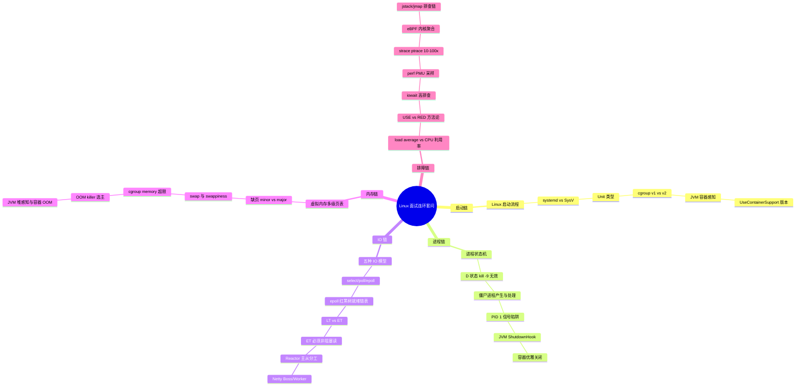

# 跨主题高频面试 Q&A

> **一句话定位**：面试前冲刺用，50 题速答串联各主题，附连环套问思维导图。
> **面试热度**：⭐⭐⭐⭐⭐
> **返回**：[Linux 知识图谱](../README.md)

---

## 使用说明

- 全部 50 题按主题分类，每题 3-5 句要点速答，末尾 **关联** 链接指向对应主题文档的详细推导。
- 连环追问题在题号后标注 🔗，配合文末「连环套问思维导图」把握面试官的追问路径。
- 建议先盖住答案自答，再对照要点查漏，最后跳转关联文档补全原理。

---

## 一、启动与运行时篇（5 题）

### Q1: 讲讲 Linux 启动流程？🔗

**答**：从按下电源到 login 提示符，经历四阶段：①**BIOS/UEFI** 完成 POST 自检后按启动顺序找可引导设备，BIOS 读磁盘第一扇区（MBR，512B）跳转，UEFI 直接从 ESP（FAT32）读 `.efi` 文件；②**Bootloader（grub2）** 加载 `vmlinuz`（压缩内核镜像）与 `initramfs` 到内存，跳到内核入口；③**kernel** 完成子系统初始化、挂载真 rootfs 后 `exec /sbin/init`（现代发行版即 systemd），它成为 PID 1；④**systemd** 读取 default.target 按依赖并行拉起服务，最终 sshd/getty 就绪出现 login。关键点：initramfs 是内核挂载真 rootfs 前的临时根文件系统，提供驱动和工具破"驱动在 rootfs 而 rootfs 又需驱动"的鸡生蛋问题。

**关联**：→ [系统启动与运行时](./01-foundation/system-boot-and-runtime.md)

### Q2: systemd 和 SysV init 的本质区别？

**答**：三方面差异。**启动方式**——SysV 串行执行 `/etc/rc.d/rcN.d/S*` 脚本，一个卡住全等；systemd 按依赖关系并行拉起 Unit，用 socket/dbus 激活实现按需启动。**依赖管理**——SysV 靠脚本注释 `# chkconfig: 2345 20 80` 粗粒度排序；systemd 用 `Requires=`/`Wants=`/`After=` 显式声明依赖图，自动拓扑排序。**资源管理**——SysV 与 cgroup 无关；systemd 是 cgroup v2 的主要使用者，每个 Unit 自动创建一个 cgroup，停止服务 = 杀整个 cgroup 进程组（KillMode=control-group），不会漏掉 fork 出去的子进程。现代发行版（RHEL 7+/Ubuntu 15.04+）默认 systemd。

**关联**：→ [系统启动与运行时](./01-foundation/system-boot-and-runtime.md)

### Q3: systemd 有哪些 Unit 类型？🔗

**答**：核心 9 类。**service**（长进程，`nginx.service`）、**socket**（IPC 套接字按需启动，`docker.socket`）、**target**（Unit 集合点，`multi-user.target`）、**timer**（定时任务替代 cron，`logrotate.timer`）、**mount/automount**（挂载点）、**path**（路径触发，`systemd-coredump@.path`）、**slice**（cgroup 分片，`system.slice`/`user.slice`）、**scope**（外部进程组，`session-1.scope`）。target 替代 SysV 的 runlevel：runlevel 3 多用户字符界面对应 `multi-user.target`，runlevel 5 图形界面对应 `graphical.target`，0 关机对应 `poweroff.target`。生产常用 `systemctl list-units --type=service` 看运行中的服务。

**关联**：→ [系统启动与运行时](./01-foundation/system-boot-and-runtime.md)

### Q4: cgroup v1 和 v2 有什么区别？对 Java 有什么影响？🔗

**答**：**v1** 多层级——每个控制器（cpu/memory/blkio）独立一棵树，进程在不同控制器下位置可不一致；**v2** 统一层级——进程只挂一个 cgroup，所有控制器对它同时生效，更简洁、systemd 原生集成。接口路径：v1 在 `/sys/fs/cgroup/<controller>/`，v2 在 `/sys/fs/cgroup/`（根树）。对 Java 的影响在 JVM 容器感知：JDK 8u131 前完全无感知；JDK 8u191+ 开 `UseContainerSupport` 只读 v1 的 `memory.limit_in_bytes`，**不支持 v2**；JDK 11+/8u372+ 才补 v2 路径 `/sys/fs/cgroup/memory.max`。陷阱：RHEL 9/Ubuntu 22.04 默认 v2 + JDK 8u191 恰好不读 v2 → 退化按宿主算 → OOM Killed。生产底线 JDK 11+，推荐 JDK 17+。

**关联**：→ [系统启动与运行时](./01-foundation/system-boot-and-runtime.md)

### Q5: initramfs 的作用是什么？忘了重建会怎样？

**答**：initramfs 是内核挂载真 rootfs 之前用的**临时根文件系统**，本质是 cpio 归档，解压后挂到内存里的 tmpfs。它解决"驱动在 rootfs 的 `/lib/modules` 下，但 rootfs 可能在 LVM/RAID/加密盘/NFS 上需要驱动才能挂载"的鸡生蛋问题——initramfs 自带 `lvm`/`mdadm`/`cryptsetup` 等工具先把真 rootfs 挂上，再 `pivot_root` 切过去并 `exec /sbin/init`。**陷阱**：升级内核后忘了 `dracut -f`（RHEL 系）或 `update-initramfs -u`（Debian 系）重新生成 initramfs，导致新内核启动时找不到磁盘控制器驱动，卡在 `dracut emergency shell`。验证内容：`lsinitrd /boot/initramfs-$(uname -r).img`。

**关联**：→ [系统启动与运行时](./01-foundation/system-boot-and-runtime.md)

---

## 二、进程与线程篇（6 题）

### Q6: 讲讲 Linux 进程状态机？🔗

**答**：六状态 R/S/D/T/Z/X。**R**（TASK_RUNNING，运行/就绪）、**S**（TASK_INTERRUPTIBLE，可中断睡眠，等 IO/锁/信号量，可被信号唤醒）、**D**（TASK_UNINTERRUPTIBLE，不可中断睡眠，等磁盘 IO/NFS/内存回收，**kill -9 无效**）、**T**（停止，SIGSTOP/ptrace）、**Z**（EXIT_ZOMBIE，已 exit 但父进程未 wait）、**X**（EXIT_DEAD，父进程 wait 后即将消失）。关键转换：R↔S 最高频（阻塞 API ↔ 事件就绪）；R→D 是直接 IO/NFS；R/S→Z 是 exit；Z→X 是父进程 wait。`ps`/`top` 的 STAT 列显示这些字母。D 状态堆积通常意味磁盘慢或 NFS 卡死。

**关联**：→ [进程与线程](./02-process/process-and-thread.md)

### Q7: D 状态进程 kill -9 杀不掉怎么办？🔗

**答**：D = TASK_UNINTERRUPTIBLE 不可中断睡眠，内核在 D 状态不检查信号 pending，只在返回 TASK_RUNNING 时才处理，所以 `kill -9` 无效只能等。典型场景是磁盘 IO（直接 IO）、NFS 卡死、内存回收（`lock_page`）。**排查**：①`ps -eo pid,stat,wchan | awk '$2~/D/'` 找 D 状态进程，`wchan` 列看内核函数名；②`cat /proc/<pid>/stack` 看内核栈卡在哪（如 `__do_page_fault`/`ext4_da_writepages`）；③`iostat -x 1` 看磁盘 `%util` 与 `await`，NFS 看 `nfsstat`。**解决根因**：磁盘慢换盘/加 IO 调度、NFS 卡检查网络与 NFS server、内存回收太频繁加内存或调 swappiness。**注意**：D 状态也计入 load average，所以磁盘慢时 load 飙高但 CPU 可能很闲。

**关联**：→ [进程与线程](./02-process/process-and-thread.md)

### Q8: 僵尸进程怎么产生？怎么处理？🔗

**答**：子进程 `exit()` 释放用户态资源（地址空间、文件描述符）但保留 `task_struct`（含退出码），状态置 Z（EXIT_ZOMBIE），等父进程 `wait()`/`waitpid()` 回收。**父进程不 wait → 子进程一直 Z**。处理方法：①父进程代码加 `wait()` 或注册 SIGCHLD handler 调 `waitpid`；②若父进程还活着但不 wait，`kill -SIGCHLD <ppid>` 提醒它；③若父进程已死，子进程变孤儿被 PID 1（systemd）收养，systemd 会自动 wait 回收；④若父进程是 bug 程序不修且不想 kill，可 kill 父进程让 PID 1 收养回收。**生产**：容器内 PID 1 若是 sh 不回收僵尸（sh 默认不 wait），用 `docker run --init` 注入 tini 作 PID 1 自动回收。

**关联**：→ [进程与线程](./02-process/process-and-thread.md)

### Q9: CFS 调度器怎么实现"完全公平"？

**答**：CFS（Completely Fair Scheduler，2.6.23 引入）用**红黑树**按 `vruntime`（虚拟运行时间）排序，vruntime 小的先调度。**vruntime 计算**：实际运行时间 ÷ 权重 = vruntime 增量。权重由 nice 值映射（nice -20 到 19，nice 越高权重越低），所以**低优先级进程 vruntime 增长更快**，更快被调度器"放下"——这就是"公平"的体现：让低优先级进程"看起来"跑了很久，从而让 CPU 给高优先级进程。**周期**：CFS 设 sched_period（如 6ms），周期内每个进程至少跑一次，按权重分配时间片。**调度类**：CFS 是默认调度类（`fair_sched_class`），实时进程用 `rt_sched_class`（FIFO/RR），优先级高于 CFS。

**关联**：→ [进程与线程](./02-process/process-and-thread.md)

### Q10: PID 1 陷阱是什么？为什么容器优雅关闭难？🔗

**答**：PID 1（init/systemd）在内核有**特殊保护**：未注册 handler 的信号默认忽略，防止误杀 init 导致系统崩溃。容器内 PID 1 享受同样保护——这是容器优雅关闭的常见坑。**两个陷阱**：①Spring Boot fat jar 作 PID 1 早期不注册 SIGTERM handler，`docker stop` 发 SIGTERM 被忽略，等 10 秒超时 SIGKILL，ShutdownHook 不执行；②`CMD ["sh","-c","java -jar app.jar"]` 让 sh 成 PID 1，sh 默认不转发 SIGTERM 给 java，java 收不到信号干等超时。**解决**：①Dockerfile 用 exec 形式 `ENTRYPOINT ["java","-jar","app.jar"]` 让 JVM 直接当 PID 1；②`docker run --init` 注入 tini 作 PID 1 转发信号并回收僵尸；③Spring Boot 2.3+ 开 graceful shutdown 注册 SIGTERM handler。

**关联**：→ [进程与线程](./02-process/process-and-thread.md)

### Q11: Linux 线程和进程有什么区别？

**答**：Linux 内核**没有专门的线程概念**——线程在内核层就是普通进程，只是多个"线程"通过 `clone()` 共享了 `mm`/`files`/`signal` 等字段。用户态说的"线程"在内核是 **LWP（轻量级进程）**，每个 LWP 有独立 `task_struct` 和 `pid`。**共享与私有**：`mm`（地址空间）/`fs`（当前目录）/`files`（文件描述符表）/`signal`（信号处理表）是**进程级共享**——同线程组所有 LWP 共用一组；`pid`/`state`/`prio`/`pending`（私有信号队列）是**线程级私有**。**用户态视角**：`getpid()` 返回 tgid（线程组 ID，即主线程 pid），`gettid()` 返回 LWP 的 pid。`ps -eLf` 能看到每个线程一个 LWP。Java 多线程程序 `ps -eLf` 能看到 GC 线程、业务线程各自一个 LWP。

**关联**：→ [进程与线程](./02-process/process-and-thread.md)

---

## 三、内存管理篇（6 题）

### Q12: 讲讲 Linux 虚拟内存到物理内存的映射？

**答**：每个进程有独立的虚拟地址空间，通过**多级页表**映射到物理页帧。x86_64 用四级页表（PGD/PUD/PMD/PTE），每次访存 CPU 查页表，TLB miss 会查 4 次内存。**四个关键点**：①TLB 是性能关键，内核用大页（THP 4KB→2MB）减少 PTE 条目数降低 TLB miss；②多级页表省内存——未映射的区域 PTE 不存在，比一维页表全分配省几个数量级；③**缺页是惰性分配的根**——`malloc` 只分配虚拟地址区间，真正写时才触发缺页中断分配物理页（demand paging）；④内核态与用户态共享同一套页表，内核空间在所有进程页表中映射同一区域（直接映射区），切换进程时只换用户态部分。

**关联**：→ [内存管理](./03-memory/memory-management.md)

### Q13: minor fault 和 major fault 的区别？🔗

**答**：缺页中断分两类。**minor fault（小缺页）** 只需建映射无需读盘，微秒级，场景：①`malloc` 后首次写分配零页；②`fork` 后父子写触发 CoW 复制一页；③`exec` 后首次执行 text 段（已缓存的文件页）。**major fault（大缺页）** 需从磁盘/swap 读数据，毫秒级，慢一个数量级，场景：①启动时冷读二进制/库；②swap 回读——匿名页被换出到 swap，访问时从磁盘读回。查看某进程缺页数：`grep -E 'min_flt|maj_flt' /proc/<pid>/stat`（第 10 字段 minor、第 12 字段 major），或 `ps -o min_flt,maj_flt -p <pid>`。排查"服务启动慢"常发现是大量 major fault（冷读二进制和库），用 `madvise(MADV_WILLNEED)` 预读可缓解。

**关联**：→ [内存管理](./03-memory/memory-management.md)

### Q14: swap 和 swappiness 是什么？容器里要不要禁 swap？🔗

**答**：物理内存紧张时，内核 `kswapd` 后台回收页面：①**文件页**——干净页直接丢弃（下次重新从磁盘读），脏页先 writeback 再丢弃；②**匿名页**——写入 swap 区（磁盘/zram），下次访问触发 major fault 读回。`vm.swappiness`（范围 **0-200，默认 60**）控制回收匿名页的倾向：0 尽量不回收匿名页，100 等权，200 激进回收。**关键认知**：swappiness=0 **不等于完全禁用 swap**，只是降低倾向，要真禁用 `swapoff -a` 或不设 swap 分区。**容器场景**：容器常禁 swap（`--memory-swap=memory`），此时 OOM 风险更高因内核无缓冲；但 K8s 1.x 起默认允许 swap（受控），JVM 用 ZGC 等需要 swap 做堆备份。zswap（内核态压缩 swap 前置缓存）和 zram（块设备 swap）是"压缩的 swap"，省 IO 但消耗 CPU。

**关联**：→ [内存管理](./03-memory/memory-management.md)

### Q15: OOM killer 怎么选主？怎么调整？🔗

**答**：物理内存耗尽且 kswapd 回收不足以缓解（或 cgroup memory 超限不可回收），内核触发 OOM killer（`mm/oom_kill.c`）。**打分公式**：`oom_score = (RSS + swap 占用 + 页表) / 总内存 × 10 × 调整系数`，选 `oom_score` 最高的进程 SIGKILL。**调整**：`/proc/<pid>/oom_score_adj`（范围 **-1000 到 1000**）——设 -1000 完全豁免（如 systemd、sshd），设 +1000 强制优先杀。**cgroup OOM vs 全局 OOM**：cgroup memory 超限触发该 cgroup 内 OOM（v1 `memory.oom_control`/`memory.failcnt`，v2 `memory.events` 的 `oom`/`oom_kill`、`memory.oom.group`），只在 cgroup 内选主；全局内存耗尽才是内核级 OOM。**区分**：`dmesg | grep -i 'killed process'` 输出含 `constraint=CONSTRAINT_MEMCG` 是 cgroup 触发，`CONSTRAINT_NONE` 是全局。容器内 JVM 被 OOM kill 通常 cgroup 触发。

**关联**：→ [内存管理](./03-memory/memory-management.md)

### Q16: RSS、PSS、USS 有什么区别？看哪个？

**答**：三者衡量进程物理内存占用的不同视角。**RSS**（常驻集）含共享库等共享页，会被多进程重复计入，加总远超实际。**PSS**（比例分摊集）= 独占页 + 共享页 ÷ 共享进程数，加总等于系统真实占用，评估"进程真实占用"用它。**USS**（独占集）= 进程私有页，进程退出能立即释放的部分，评估"杀掉能回收多少"用它。**查看**：`/proc/<pid>/status` 的 VmRSS（RSS）、`/proc/<pid>/smaps_rollup` 的 Pss/Uss（4.x+ 一行汇总）、`smem -r -k`（按 PSS 排序人类可读）。**评估 Java 进程真实占用必看 PSS**——JVM 堆外内存 + 共享库 + NMT 不计入堆，RSS 会重复算共享库，PSS 才准。

**关联**：→ [内存管理](./03-memory/memory-management.md)

### Q17: 容器内 free 显示的是宿主内存吗？怎么正确限制？🔗

**答**：**是**——`free` 读 `/proc/meminfo`，而 `/proc/meminfo` 不受 namespace 隔离（反映宿主机物理内存）。容器内 `free -h` 显示 64G，但实际 cgroup 限制 2G，JVM 按宿主算堆 → OOM。**限制方式**：①docker `--memory=2g` 写 cgroup memory 上限（v1 `memory.limit_in_bytes`，v2 `memory.max`）；②K8s `resources.limits.memory: 2Gi` 同样落到 cgroup；③JVM 用 `-XX:MaxRAMPercentage=75` 或 `-XX:MaxRAMSize` 显式指定堆上限，不依赖探测。**JVM 容器感知版本**：JDK 8u131 前完全无感知；JDK 8u191+ 开 `UseContainerSupport` 支持 cgroup v1但**不支持 v2**；JDK 11+/8u372+ 才支持 cgroup v2。**验证**：`java -XX:+PrintContainerInfo -version 2>&1 | grep -i cgroup`；`cat /sys/fs/cgroup/memory.max`（v2）或 `cat /sys/fs/cgroup/memory/memory.limit_in_bytes`（v1）。

**关联**：→ [内存管理](./03-memory/memory-management.md)

---

## 四、IO 模型篇（6 题）

### Q18: 讲讲 Linux 的五种 IO 模型？🔗

**答**：POSIX 把 IO 抽象成"等数据就绪 + 拷贝数据"两阶段，Linux 据此演化五种模型：①**阻塞 IO**——等和拷贝都阻塞，传统 `read`；②**非阻塞 IO**——未就绪立即返回 `EAGAIN`，需轮询，`read(O_NONBLOCK)`；③**IO 多路复用**——阻塞在 select/epoll 等多个 fd，就绪后自己 read，select/poll/epoll；④**信号驱动**——内核数据就绪发 SIGIO，应用主动 read，`fcntl(F_SETSIG)`；⑤**异步 IO**——不阻塞，内核替你拷完再通知，`io_uring`/libaio。**关键认知**：前四种**都是同步 IO**——数据就绪后都要应用自己调 read 把数据从内核态拷到用户态，这个拷贝阶段阻塞。只有真正的异步 IO（`io_uring`）连拷贝都由内核完成。Java NIO 的 Selector 是 IO 多路复用，**不是异步 IO**，所以叫 NIO（Non-blocking）而不叫 AIO。

**关联**：→ [IO 模型与 epoll](./04-io/io-model-and-epoll.md)

### Q19: select、poll、epoll 的区别？为什么 epoll 快？🔗

**答**：三维度对比。**数据结构**：select 用 `fd_set` 位图（**上限 1024**，`FD_SETSIZE`），poll 用 pollfd 数组（无硬上限），epoll 用**红黑树存 fd + 就绪链表**。**拷贝开销**：select/poll 每次调用全量拷 fd 集到内核，epoll 只 `epoll_ctl` 增删时拷一次，`epoll_wait` 不拷。**就绪判定**：select/poll 内核遍历所有 fd 标位，返回后用户态再 O(n) 遍历；epoll 内核通过回调把就绪 fd 挂就绪链表，`epoll_wait` 只取链表，**复杂度 O(就绪数) 而非 O(总数)**。**触发方式**：select/poll 只 LT，epoll 支持 LT + ET。**epoll 快的三原因**：①不重复传 fd 集（注册一次长在红黑树）；②不遍历全部 fd（回调挂就绪链表）；③连接数上万时 select/poll 性能断崖下跌而 epoll 平稳——Redis/Nginx/Netty 全用 epoll。源码 `fs/eventpoll.c`。

**关联**：→ [IO 模型与 epoll](./04-io/io-model-and-epoll.md)

### Q20: epoll 的 LT 和 ET 模式有什么区别？ET 为何必须非阻塞读？🔗

**答**：**LT（水平触发）** 只要 fd 有数据可读就一直通知；**ET（边沿触发）** 只在状态变化时通知一次，之后不再通知直到新数据来。**ET 必须非阻塞读的原因**：ET 只通知一次，假设 fd 缓冲有 10KB，你 `read` 4KB 就返回，剩 6KB 在缓冲里——但 epoll 不会再通知了。下次新数据来，`read` 拿的是"那 6KB + 新数据"，可能与协议边界错位。**正确做法**：fd 设非阻塞，循环 `read` 直到返回 `EAGAIN`（缓冲空了），保证当前数据读干净。若用阻塞 fd，循环读到空时会阻塞在 `read` 上整个线程卡死。Nginx/Netty 默认 ET 模式——追求高吞吐但要求编程严谨。Redis 默认 LT。**经验**：ET 适合高并发追求吞吐、编程严谨场景；LT 适合通用场景、不易出错。

**关联**：→ [IO 模型与 epoll](./04-io/io-model-and-epoll.md)

### Q21: Reactor 模式是什么？主从 Reactor 怎么分工？🔗

**答**：Reactor 是"IO 多路复用 + 事件分发 + 业务处理"的事件驱动架构，是 Netty/Mina 的骨架。三种形态：①**单 Reactor 单线程**——一个线程干完所有事（监听/accept/read/业务），简单但业务慢会卡 IO，Redis 单线程模式；②**单 Reactor 多线程**——Reactor 线程只负责 IO（accept/read），业务派给 Worker 线程池，IO 与业务分离但 Reactor 仍单点；③**主从 Reactor 多线程**——MainReactor 只负责 accept 新连接（因为 accept 必须快否则握手队列堆积），拿到新 socket fd 分发给 SubReactor 负责后续 read/write，业务再派给 Worker 池。**Netty 的 Boss/Worker Group** 就是主从 Reactor：Boss Group 只 accept，Worker Group 负责 read/write + 业务。Java NIO 的 Selector 是基础组件。

**关联**：→ [IO 模型与 epoll](./04-io/io-model-and-epoll.md)

### Q22: 零拷贝是什么？sendfile/mmap/splice 区别？🔗

**答**："零拷贝"不是真的零拷贝，而是**减少用户态与内核态之间的数据拷贝和上下文切换次数**。传统 `read + write`：磁盘 → 内核 Page Cache → 用户 buf → 内核 socket 缓冲 → 网卡，**4 次上下文切换 + 4 次拷贝**（其中 2 次用户↔内核是纯浪费）。三种零拷贝：①**sendfile**——全内核态拷贝，**2 次上下文切换**，从文件到 socket，Linux 2.4+ 用 SG-DMA 连 CPU 拷贝都省，Nginx `sendfile on`、Kafka 顺序读用；②**mmap**——把文件 Page Cache 映射到用户态，省一次拷贝但仍要用户态参与，4 次切换 3 次拷贝，大文件随机访问/进程间共享用，有 SIGBUS 风险；③**splice**——用管道缓冲在任意两 fd 间搬数据，零用户态拷贝，至少一端是管道。**选型**：文件→socket 用 sendfile，大文件随机访问用 mmap，任意两 fd 搬数据用 splice。

**关联**：→ [IO 模型与 epoll](./04-io/io-model-and-epoll.md)

### Q23: page cache 是什么？脏页怎么刷盘？🔗

**答**：Page Cache 是内核的文件页缓存，文件 IO 读写都先经过它——读时先查 cache 命中即返回，未命中从磁盘读入 cache；写时先写 cache 标脏，异步刷盘。**脏页刷盘机制**：①内核 `pdflush`/`flush` 线程周期性（`dirty_writeback_centisecs`，默认 5 秒）扫描脏页 writeback；②脏页比例超 `vm.dirty_ratio`（默认 20%）触发同步 writeback 阻塞写；③`fsync(fd)` 主动强制刷单个文件的脏页 + 元数据。**关键参数**：`dirty_ratio`（20%）超则写阻塞，`dirty_background_ratio`（10%）超则后台刷不阻塞。**fsync vs fdatasync**：`fsync` 刷数据 + 全部元数据（inode 大小/时间/块位置），`fdatasync` 只刷数据 + 必要元数据（如文件大小），日志追加写用 fdatasync 性能更好。**陷阱**：磁盘有板载 write cache，fsync 要等"已落盘"确认，需 write barrier 或 FUA 保证顺序。

**关联**：→ [IO 模型与 epoll](./04-io/io-model-and-epoll.md)

---

## 五、文件系统篇（5 题）

### Q24: VFS 的四个核心对象是什么？🔗

**答**：VFS（Virtual File System）是内核的文件操作抽象层，把具体文件系统（ext4/xfs/OverlayFS/procfs）的差异屏蔽在统一接口下。核心四对象：①**superblock**（超级块）——描述已挂载文件系统整体信息（块大小、inode 总数、空闲数），磁盘上有持久化对应；②**inode**（索引节点）——文件元数据（大小、权限、块位置、时间戳），磁盘上有 inode 表对应；③**dentry**（目录项）——名字→inode 映射，构成目录树，纯内存但有磁盘目录项对应（dcache 缓存）；④**file**（打开文件）——进程与 inode 的会话（读写位置 `f_pos`、打开模式 `f_mode`），**纯内存**每次 open 创建一个 close 销毁，磁盘上无对应。`file` 的 `f_pos` 只在内存，所以同一文件多次 open 得到独立 `f_pos` 互不影响。

**关联**：→ [文件系统与 VFS](./05-fs/filesystem-and-vfs.md)

### Q25: 硬链接和软链接有什么区别？🔗

**答**：**硬链接**——多个 dentry 指向同一 inode，本质是同一文件多个名字。不能跨文件系统（inode 不跨文件系统）、不能链接目录（防环）。`ln source hard`，删 source 文件 hard 仍可访问（inode 引用计数减 1 不为 0 不释放）。**软链接**（symlink）——一个特殊文件，内容是目标路径字符串。能跨文件系统、能链接目录。`ln -s source soft`，删 source 后 soft 变"悬空链接"（dangling），访问报错。**inode 视角**：硬链接共享 inode（`ls -i` 看到相同 inode 号），软链接有自己独立 inode（存的是目标路径）。**典型陷阱**：`cp` 软链接默认复制的是链接指向的目标文件内容，不是链接本身；`find -type l` 找所有软链接；`readlink` 读软链接指向。

**关联**：→ [文件系统与 VFS](./05-fs/filesystem-and-vfs.md)

### Q26: OverlayFS 的分层原理是什么？容器删文件为什么镜像不变小？🔗

**答**：OverlayFS 是 Linux mainline 的联合挂载文件系统（4.0+），是 Docker 镜像分层的底层。四层：①**lowerdir**（镜像只读层，可多层叠加）；②**upperdir**（容器可写层，所有修改写这里）；③**workdir**（OverlayFS 内部工作目录，CoW 临时文件）；④**merged**（叠加后的统一视图，容器 rootfs）。**CoW 原理**：读从 merged 按 upper→lower 逐层找（upper 优先）；写首次修改文件时若在 lower，先从 lower 复制到 upper 再改（file-level 复制），lower 不变；删除在 upper 创建 **whiteout** 文件（character device 0/0）遮蔽 lower 同名文件——对容器来说文件"消失"了，但 **lowerdir 的原文件仍在**。**所以容器内 `rm` 镜像内大文件不会释放空间**，只是 upper 加了 whiteout，lower 大文件还在。要让镜像变小要在构建期删除且最好同一 Dockerfile 层 ADD + rm。

**关联**：→ [文件系统与 VFS](./05-fs/filesystem-and-vfs.md)

### Q27: /proc 是什么？为什么程序能"读自己的内存"？🔗

**答**：`/proc` 是 **procfs 伪文件系统**，暴露内核与进程状态。分两类：①**进程相关**（`/proc/<pid>/`）——每个进程一个目录，含 `status`（状态）、`maps`（内存映射）、`fd/`（打开的 fd）、`cmdline`（启动命令）、`cwd`（工作目录符号链接）；②**系统相关**（`/proc/` 顶层）——`meminfo`（内存）、`cpuinfo`（CPU）、`loadavg`（负载）、`mounts`（挂载表）、`net/`（网络统计）。**关键认知**：伪文件系统的 `read`/`write` 不是真的磁盘 IO，而是内核函数调用——`cat /proc/cpuinfo` 等价于调内核函数 `cpuinfo_show()`，数据在内核态生成后拷到用户态，无磁盘参与。**为什么程序能读自己内存**：`/proc/<pid>/maps` 列出进程内存映射区域，`/proc/<pid>/mem` 是进程地址空间的字节流视图，内核在 procfs 的 `file_operations.read` 实现里按 `f_pos`（虚拟地址）从 `current->mm` 读数据返回——这是 gdb 读取被调试进程内存的底层。

**关联**：→ [文件系统与 VFS](./05-fs/filesystem-and-vfs.md)

### Q28: fsync 一定保证数据落盘吗？

**答**：不一定，取决于磁盘 write cache 与写屏障。**fsync 刷盘流程**：①应用调 `fsync(fd)` → 内核 `do_fsync`；②调该 inode 的 `file_operations.fsync` 实现（如 ext4 的 `ext4_sync_file`）；③内核把该 fd 对应的脏页 + inode 元数据标记需刷盘，调块层 writeback；④块层发 IO 到磁盘；⑤**磁盘 write cache**——现代磁盘有板载 write cache（NVMe 一般有，HDD 部分有），数据到磁盘后可能先在 write cache 未真正到盘片。fsync 要等磁盘确认"已落盘"才返回，这需**写屏障（write barrier）**或 FUA（Force Unit Access）。**barrier**：挂载选项 `-o barrier=1`（ext4 默认开），文件系统在元数据 IO 中插入屏障，保证"数据落盘 → 元数据落盘"顺序，避免元数据先于数据落盘导致一致性问题。**坑**：关 barrier 提升性能但断电可能丢数据；廉价磁盘谎报"已落盘"（write cache 透传为 fsync 返回），断电丢数据。

**关联**：→ [文件系统与 VFS](./05-fs/filesystem-and-vfs.md)

---

## 六、网络内核篇（6 题）

### Q29: netfilter 的五钩子是什么？🔗

**答**：netfilter 是 Linux 内核协议栈的报文处理框架（源码 `net/netfilter/`），在 IP 层收发路径的**五个关键点**埋了钩子（hook），每个钩子挂一组规则链，包经过时依次匹配。五钩子按收发流向分布：①**PRE_ROUTING**——包刚进网卡未路由前，做 DNAT（端口映射）；②**LOCAL_IN**——路由判定为本机接收的包，filter 表过滤入站；③**FORWARD**——路由判定转发的包（非本机），filter 表过滤转发；④**LOCAL_OUT**——本机产生的包刚出协议栈，做 DNAT；⑤**POST_ROUTING**——包即将出网卡前，做 SNAT（容器端口映射源 IP 改写）。iptables 是基于 netfilter 的用户态工具，把规则按"表 × 链"组织注册到对应钩子，包经过时按表优先级（raw > mangle > nat > filter）执行。

**关联**：→ [网络内核](./06-network/network-kernel.md)

### Q30: iptables 的四表五链是什么？🔗

**答**：iptables 按两个维度组织规则。**四表**（按功能分，优先级 raw > mangle > nat > filter）：①**raw**——在 conntrack 前标记，`-j NOTRACK` 跳过连接追踪，对超大流量（镜像端口）减表压力；②**mangle**——修改包的 TOS/TTL/标记；③**nat**——做 NAT，PREROUTING 做 DNAT（目标地址改写）、POSTROUTING 做 SNAT（源地址改写）；④**filter**——过滤（ACCEPT/DROP/REJECT），INPUT/FORWARD/OUTPUT。**五链**（按钩子位置分）：PREROUTING、INPUT、FORWARD、OUTPUT、POSTROUTING，对应 netfilter 五钩子。一张表只挂载到部分链上——如 nat 表挂 PREROUTING/POSTROUTING/OUTPUT，filter 表挂 INPUT/FORWARD/OUTPUT。**典型规则**：`iptables -t nat -A PREROUTING -p tcp --dport 8080 -j DNAT --to-destination 172.17.0.2:80`（Docker 端口映射）。

**关联**：→ [网络内核](./06-network/network-kernel.md)

### Q31: conntrack 是什么？表满了怎么办？🔗

**答**：conntrack（connection tracking）是 netfilter 的子系统（源码 `net/netfilter/nf_conntrack_core.c`），记录每条网络流的**四元组**（src_ip:port → dst_ip:port）与状态。它让防火墙能区分"这是新连接的 SYN"还是"已建立连接的数据包"，从而对已建立的连接放行（`-m state --state ESTABLISHED -j ACCEPT`）。**状态机**：NEW（只见首个 SYN）→ SYN_SENT → ESTABLISHED（双向通信过）→ TIME_WAIT（一端发 FIN）→ CLOSED。**表是哈希表**：`/proc/net/nf_conntrack` 查看每条表项，`nf_conntrack_max`（默认 65536，可调）表最大条目数，`nf_conntrack_count` 实时当前条目数，`nf_conntrack_buckets`（65536 哈希桶，模块加载时定不可动态改）。**表满症状**：`dmesg` 见 `nf_conntrack: table full, dropping packet`，高并发服务丢包。**解决**：①调大 `nf_conntrack_max`（`echo 262144 > /proc/sys/net/netfilter/nf_conntrack_max`）；②用 raw 表 NOTRACK 跳过高流量流（如镜像端口流量）；③缩短 timeout（`nf_conntrack_tcp_timeout_established` 默认 5 天太长）。

**关联**：→ [网络内核](./06-network/network-kernel.md)

### Q32: accept 队列和半连接队列是什么？满了怎么办？🔗

**答**：TCP 栈三队列。①**半连接队列（synq）**——收到 SYN 未完成握手的连接，上限 `tcp_max_syn_backlog`，满后 SYN 丢弃或触发 syncookies；②**全连接队列（accept queue）**——已完成三次握手待应用 accept 的连接，上限 `min(net.core.somaxconn, listen backlog)`，满后内核默认丢弃完成握手的 ACK（让客户端超时重传 SYN+ACK），若 `tcp_abort_on_overflow=1` 直接发 RST；③**接收队列（recvq）**——socket 已收到未应用读取的字节。**查看**：`ss -ltn` 的 Send-Q 是 listen 时的 backlog 值，Recv-Q 是当前 accept queue 待取的连接数。**accept queue 满的症状**：Java 服务（Tomcat/Netty）偶发连接超时，因为应用 accept 慢导致堆积。**解决**：①调大 `net.core.somaxconn`（默认 128 太小，改 4096+）；②应用层 `listen(fd, 4096)` 设大 backlog（Tomcat `acceptCount`、Netty `ServerSocketChannelConfig.setBacklog`）；③让应用 accept 更快（不要在 accept 线程做重活）。**SYN Flood** 攻击塞满 synq，内核 `tcp_syncookies`（默认 1）开 syncookies 防御。

**关联**：→ [网络内核](./06-network/network-kernel.md)

### Q33: NAPI 是什么？为什么能降低中断风暴？🔗

**答**：NAPI（New API）是网卡收包的**混合中断+轮询**机制。传统模式每个包触发一次硬中断，高吞吐时中断风暴耗尽 CPU。NAPI 策略：①第一个包来触发硬中断，进入轮询模式后**关闭硬中断**；②后续包在轮询中批量拉取（受 `budget` 控制，一次最多拉 N 个包）；③轮询空了或 budget 用完，重新开硬中断。这样低吞吐时及时响应，高吞吐时降中断开销。**完整收包路径**：网卡收包 → DMA 写到环形缓冲（ring buffer） → 触发硬中断 → 硬中断调 `napi_schedule` 关中断进轮询 → NAPI 轮询拉包交 **NET_RX_SOFTIRQ 软中断** → 软中断处理函数 `net_rx_action` 走协议栈 → 交 socket 收队列。**多核分发**：RSS（网卡硬件多队列按哈希分发到不同 CPU 硬中断）、RPS（软件层按 CPU mask 分发 softirq）、RFS（按流亲和性分发到应用所在 CPU）。高 pps 场景看 `cat /proc/interrupts | grep eth0` 确认 RSS 均衡分布。

**关联**：→ [网络内核](./06-network/network-kernel.md)

### Q34: 策略路由是什么？多网卡怎么分流？

**答**：Linux 路由默认查主路由表（main），策略路由（policy routing）允许按**规则选不同路由表**，实现"源 IP / 标记 / 接口"分流。机制是 `ip rule`（规则）+ `ip route`（表）的组合。**多路由表**：Linux 最多支持 32767 个路由表（`/etc/iproute2/rt_tables` 定义编号到名字映射），默认三张——local（255，本地地址）、main（254，默认查它）、default（253，查不到的最后兜底）。**`ip rule` 规则**：每条规则指定"匹配条件 → 选哪个表"，按优先级（priority 数字小先匹配），如 `ip rule add from 10.0.0.5 table 100`（源 10.0.0.5 的包查 table 100）、`ip rule add fwmark 0x1 table 100`（防火墙标记 0x1 的包查 table 100）。**多网卡分流**：多网卡环境按源 IP 选出口——eth1 流量打标记进 table 100，table 100 的默认路由指向 eth1 网关；eth2 流量进 table 200，默认路由指向 eth2 网关。容器场景常用：Pod 流量打标记后选独立表与宿主机流量分流。

**关联**：→ [网络内核](./06-network/network-kernel.md)

---

## 七、安全与权限篇（5 题）

### Q35: Capability 是什么？有哪些集合？🔗

**答**：传统 Unix 权限是 root/non-root 二分法，问题是很多服务只需"绑定 80 端口"一项特权却要给全部 root。Linux 2.2 引入 Capability，把 root 权限细分为**约 40 个**（随内核版本变化）独立特权单元，如 `CAP_NET_BIND_SERVICE`（绑 1024 以下端口）、`CAP_NET_RAW`（发 ICMP/raw socket）、`CAP_SYS_ADMIN`（高危，挂载/设置主机名等）、`CAP_KILL`（发信号绕过权限检查）。**五集**（`task_struct` 的 cred 字段）：①**permitted**（许可集，进程当前可用的 cap 上限）；②**effective**（有效集，当前生效的，内核判权限查这个）；③**inheritable**（可继承集，exec 后子进程可继承的）；④**ambient**（环境集，4.3+，非 SUID 程序 exec 后自动继承的，给非特权程序提权的新机制）；⑤**bounding**（边界集，exec 后子进程 permitted 的上限）。**root 与 cap**：uid=0 的进程默认拥有全部 cap；non-root 默认无 cap。Docker 容器只给有限 cap 子集，丢弃 `CAP_SYS_ADMIN` 等高危项。

**关联**：→ [安全与权限](./07-security/security-and-permission.md)

### Q36: SELinux 和 AppArmor 的区别？🔗

**答**：两者都是 MAC（强制访问控制）实现，属主无法绕过，区别在模型。**SELinux**（NSA 主导，源码 `security/selinux/`）——基于 **label**，给每个进程和客体（文件/端口/设备）打 label（`user:role:type:level`），由策略决定哪个进程 label 能访问哪个客体 label。标签语义复杂，配置陡峭，RHEL/CentOS 默认启用 enforcing 模式。**AppArmor**（源码 `security/apparmor/`）——基于 **path**，profile 在 `/etc/apparmor.d/`，按可执行文件路径关联策略，写法像"允许读 /etc/passwd、拒绝写 /etc/shadow"，配置相对简单，Ubuntu/Debian 默认。**共同点**：都基于 LSM（Linux Security Module）hook 框架实现（`security/security.c`、`include/linux/lsm_hooks.h`），都让"属主无法绕过"（区别于 DAC 的"自主"）。**选型**：RHEL 系用 SELinux（label 模型更细但更复杂），Debian 系用 AppArmor（path 模型易上手）。Docker 默认支持两者但 profile 较宽松。

**关联**：→ [安全与权限](./07-security/security-and-permission.md)

### Q37: seccomp 是什么？Docker 默认 seccomp 干嘛？🔗

**答**：seccomp（secure computing mode）是**系统调用过滤**机制，在 syscall 入口最早执行，独立于 LSM。两种模式：①**strict**——只允许 4 个调用（read/write/_exit/sigreturn），太严格几乎无用；②**filter**——用 BPF（Berkeley Packet Filter）字节码按系统调用号+参数过滤，可精细控制。**判定链位置**：seccomp 在 syscall 入口最早执行（第 1 层）→ Capability（第 2 层）→ DAC（第 3 层，rwx）→ MAC（第 4 层，SELinux/AppArmor 基于 LSM hook）。**Docker 默认 seccomp profile**——白名单允许约 300 个安全 syscall，**禁用** `mount`/`umount`、`reboot`、`kexec_load`、`init_module`/`finit_module`（加载内核模块）、`iopl`（直接 IO）、`pivot_root` 等，防容器逃逸与破坏宿主。**`--privileged` 会禁用 seccomp**（同时放开 cap + 绕过 DAC + 关 MAC），是容器安全最大禁区。生产按需自定义 seccomp profile，进一步收紧。

**关联**：→ [安全与权限](./07-security/security-and-permission.md)

### Q38: SUID 为什么危险？怎么替代？

**答**：**SUID**（Set User ID upon execution）——可执行文件执行时以**文件属主**身份运行（常是 root），`chmod u+s` 后权限位显示 `rws`。典型例子 `/usr/bin/passwd` 以 root 身份改 `/etc/shadow`。**为什么危险**：SUID 程序一旦有漏洞（如缓冲区溢出），攻击者就能以 root 身份执行任意代码。`find / -perm -4000 2>/dev/null` 列出所有 SUID 程序是安全审计第一步。**类似机制**：SGID（以属组身份运行，目录下新文件继承目录属组）、Sticky bit（目录下文件只有属主和 root 能删，`/tmp` 用）。**Capability 替代**：把"给全部 root 权限"细化为"只给所需 cap"。`ping` 传统是 SUID root，现在改用 `setcap CAP_NET_RAW+ep /usr/bin/ping` 给文件设 cap，进程执行时获得该 cap 即可发 ICMP 包无需全部 root。`getcap /usr/bin/ping` 可查看文件 cap。**注意**：系统仍大量使用 SUID，Capability 并非完全替代而是更安全的选项。

**关联**：→ [安全与权限](./07-security/security-and-permission.md)

### Q39: PAM 鉴权链怎么走？sudoers 配置有什么陷阱？🔗

**答**：PAM（Pluggable Authentication Modules）是 Linux 的可插拔鉴权框架（用户态 `libpam`），把鉴权逻辑从程序解耦——程序调 PAM API，PAM 按 `/etc/pam.d/<服务>` 配置加载模块链依次执行。**四阶段**（每阶段可配多个模块按顺序执行）：①**auth**——验证身份（密码/指纹/双因子），`pam_unix.so`（密码）、`pam_google_authenticator.so`（OTP）；②**account**——检查账户可用（过期/锁定/时间限制），`pam_time.so`、`pam_access.so`；③**session**——会话建立/销毁（挂载家目录、记日志），`pam_mkhomedir.so`、`pam_lastlog.so`；④**password**——修改密码，`pam_unix.so`。任一 required/requisite 失败即整体失败。**sudoers 陷阱**：`/etc/sudoers` 定义"谁可以 sudo 以谁身份执行什么"，语法 `user ALL=(runuser) NOPASSWD: /path/cmd`。**陷阱**：①用 `visudo` 编辑而非直接 vim（visudo 会校验语法，配置错 sudo 全废）；②`%wheel ALL=(ALL) NOPASSWD: ALL` 给 wheel 组免密全权太危险，应按命令细粒度授权；③规则顺序——后面的可覆盖前面的，更具体的规则放后面。

**关联**：→ [安全与权限](./07-security/security-and-permission.md)

---

## 八、Shell 与脚本篇（5 题）

### Q40: login shell 和 non-login shell 加载哪些文件？🔗

**答**：Bash 启动按 login/non-login × 交互/非交互 四象限加载不同文件。**login shell**（`ssh user@host`、`su - user`、TTY 登录）加载：`/etc/profile` → 按顺序找第一个存在的 `~/.bash_profile`（或 `~/.bash_login`/`~/.profile`）→ 退出时 `~/.bash_logout`。**non-login shell**（新开终端标签、`bash`）加载：`/etc/bash.bashrc`（或 `/etc/bashrc`）→ `~/.bashrc`。**关键陷阱**：①`~/.bash_profile`/`~/.bash_login`/`~/.profile` **只加载第一个存在的**，后面的不再读——常导致改错文件不生效；②cron 跑脚本是**非交互非登录**，默认只读 `$BASH_ENV`，若未设则连 `~/.bashrc` 都不加载，PATH 常缺失；③`ssh user@host 'cmd'` 虽是非交互但**算登录**，会读 `/etc/profile`。**生产实践**：`~/.bash_profile` 里手动 `source ~/.bashrc` 让两类 shell 配置统一。

**关联**：→ [Shell 与脚本](./08-shell/shell-and-scripting.md)

### Q41: export 的作用是什么？source 和 ./script.sh 区别？🔗

**答**：Shell 变量分两类：**局部变量**（只在当前 shell 可见）和**环境变量**（已 `export`，子进程能继承）。`export VAR` 把局部变量提升为环境变量。**本质**：fork 子进程时，内核把父进程的环境变量复制到子进程的 `environ`（C 库 `environ` 指针，对应 `task_struct` 的 `mm->env_start` 区域）。未 export 的变量不进 `environ`，子进程 `getenv` 拿不到。**`source`/`.` 与 `./script.sh` 的区别**：`source script.sh` 在**当前 shell 执行**（不 fork），脚本里的 `export`/变量改动**对当前 shell 生效**——这就是 `source ~/.bashrc` 能重载配置的根因；`./script.sh` **fork 子进程执行**，变量改动不回传父 shell。**典型场景**：激活 Python venv 用 `source venv/bin/activate`（它要改 PATH），若用 `./venv/bin/activate` 改的 PATH 在子进程退出后消失。

**关联**：→ [Shell 与脚本](./08-shell/shell-and-scripting.md)

### Q42: 管道每段在子 shell 吗？while read 变量为什么丢？🔗

**答**：**是**——管道 `|` 每段命令都在各自子 shell 中执行（Bash 4+ 可 `shopt -s lastpipe` 让最后一段在当前 shell，但默认不开）。**子 shell 的本质**是 fork 出的独立进程，**父 shell 的变量改动在子 shell 里改了回不来**——这是 `while read` 管道循环变量丢失的根因。**典型陷阱**：`cat file | while read line; do count=$((count+1)); done; echo $count` 输出 0（count 改动在子 shell 里，循环结束子 shell 退出，count 仍是 0）。**子 shell 的四个来源**：①管道每段；②圆括号 `(cmd)` 显式子 shell；③命令替换 `$(cmd)` 或反引号；④进程替换 `<(cmd)` `>(cmd)`。**解决 while read 变量丢失**：①用进程替换让 while 在当前 shell：`while read line; do ...; done < <(cat file)`；②用 here string：`while read line; do ...; done <<< "$(cat file)"`；③改用 for 循环 + 数组。

**关联**：→ [Shell 与脚本](./08-shell/shell-and-scripting.md)

### Q43: 进程替换 `<()` 解决了什么问题？

**答**：解决了"把命令输出当文件传给需文件参数的命令"的问题。传统做法 `cmd1 > tmp; cmd2 tmp; rm tmp` 要临时文件。**进程替换** `<(cmd1)` 用 `/dev/fd/N` 命名管道把命令输出当文件传——内核创建一个管道，`cmd1` 的 stdout 接管道写端，`<(cmd1)` 展开为 `/dev/fd/N`（管道读端的路径名），传给需文件参数的 `cmd2`。**典型场景**：`diff <(ls dir1) <(ls dir2)` 比较两目录内容无需临时文件；`comm <(sort a) <(sort b)` 比较两排序文件。**本质**：进程替换是子 shell（fork），命令在子 shell 跑，输出通过管道传给读端。**与命令替换 `$()` 区别**：`$(cmd)` 取命令输出**作为字符串**赋值或拼接；`<(cmd)` 取命令输出**作为文件**（文件名）传给命令参数。两者底层都是 fork 子 shell + 管道，但用法不同。

**关联**：→ [Shell 与脚本](./08-shell/shell-and-scripting.md)

### Q44: set -euo pipefail 各管什么？有什么陷阱？🔗

**答**：`set -euo pipefail` 是生产脚本标配，四选项各管一件事：①**`-e`**（errexit）——任一命令非零退出立即终止脚本；②**`-u`**（nounset）——引用未定义变量报错而非当空串（防 `${typo}` 静默失败）；③**`-o pipefail`**——管道返回最后一个非零退出码（默认返回最后一段，中段失败被吞）；④**`-o`** 是开关前缀。**陷阱**：①`-e` 对 `cmd1 && cmd2` 中 `cmd1` 失败不退出（因 `&&` 是条件判断语义）；②`-e` 对 `if cmd; then` 中的 cmd 失败不退出（条件判断场景）；③`-e` 对 `cmd || true` 的 cmd 失败不退出（被 `|| true` 兜底）；④`-u` 对 `$1` 等位置参数未传时也报错，需用 `${1:-default}` 兜底；⑤`pipefail` 与 `-e` 组合时，管道中段失败也会触发 `-e` 退出。**配合 `trap 'cleanup' EXIT INT TERM`** 捕获信号做清理（删临时文件、回滚事务），`EXIT` 兜底所有退出路径。**三剑客分工**：过滤用 grep、替换用 sed、算列用 awk。

**关联**：→ [Shell 与脚本](./08-shell/shell-and-scripting.md)

---

## 九、性能与排障篇（6 题）

### Q45: load average 是什么？和 CPU 利用率有什么区别？🔗

**答**：`uptime`/`top` 的三个数（如 `load average: 2.50, 1.80, 1.20`）是 **1/5/15 分钟的平均运行队列长度**——即 R（运行/就绪）+ D（不可中断睡眠）状态进程数的指数移动平均。**它不是 CPU 使用率**。**区别**：load average 是队列长度（Saturation 视角），CPU utilization（usr+sys）是忙时占比（Utilization 视角）。**配合分流**：①load 高 + CPU 高 = CPU 瓶颈（R 状态多，扩容或优化）；②load 高 + CPU 低 = IO/锁瓶颈（D 状态多，进程在等不在 CPU 上跑，查磁盘/NFS/锁）。**D 状态计入 load 的陷阱**：磁盘慢时 load 飙高但 CPU 可能很闲——这是"load 高但 CPU 不忙"的典型根因。**核数对比**：8 核机器 load 8 是满载不排队（理想），load 16 是每核排 2 个进程（饱和），load 2 是大部分核空闲。**三数趋势**：1min > 5min > 15min 负载在上升，反之下降。

**关联**：→ [性能与排障](./09-ops/performance-and-troubleshooting.md)

### Q46: USE 和 RED 方法论有什么区别？怎么配合？🔗

**答**：两者正交。**USE**（Utilization / Saturation / Errors）是 Brendan Gregg 提出的**资源视角**方法论——对每个硬件资源（CPU/内存/磁盘/网络）问三维度：使用率（忙不忙）、饱和度（堵不堵，队列长度）、错误（出错量）。口诀：**高使用率观察、高饱和度扩容、非零错误必查**。**RED**（Rate / Errors / Duration）是**服务视角**方法论——面向服务（HTTP/RPC）看请求率、错误率、延迟。**区别**：USE 看硬件资源（机器/节点排障），RED 看服务行为（微服务排障）。**配合**：先 RED 定位是哪类问题，再 USE 下沉到资源根因。实战链：Java 服务 P99 延迟高（RED Duration 异常）→ 查 GC 日志 → 发现 Full GC 频繁 → 查内存 USE（Saturation：swap 入/老年代占用）→ 定位堆泄漏。**关键认知**：饱和度比使用率更值得警惕——CPU 100%（Utilization 高）但 load 1（Saturation 低）在干活没排队可能正常；CPU 30% 但 load 8（Saturation 高）在等 IO/锁反而有问题。

**关联**：→ [性能与排障](./09-ops/performance-and-troubleshooting.md)

### Q47: iowait 高是什么意思？怎么排查？🔗

**答**：**iowait 高不代表 CPU 忙**——它本质是"CPU 空闲（idle）但有线程在等 IO，所以把这段时间记成 iowait 而非 idle"。iowait 和 idle 是**互斥的两个空闲桶**，iowait 高时把任务从"idle"挪到"iowait"，CPU 实际还是闲的。**反直觉**：单看 iowait 高不能下结论，要配合 `iostat`/`vmstat` 的 `bi`（读块数）看 IO 是否真的慢。**排查链**：①`top`/`vmstat` 看 iowait（wa 列）高 → CPU 空闲但等 IO；②`iostat -x 1` 看磁盘 `%util`（>80% 饱和）、`await`（>10ms 慢）、`svctm`（服务时间）；③`iotop`/`pidstat -d` 看哪个进程 IO 大；④`lsof -p <pid>` 或 `cat /proc/<pid>/io` 看进程读写哪些文件；⑤D 状态进程 `cat /proc/<pid>/stack` 看内核栈卡在哪（如 `__do_page_fault`/`ext4_da_writepages`）。**根因类型**：磁盘慢换 SSD、IO 模式差（随机改顺序，如 Kafka 顺序写）、Page Cache 不足（内存不够缓存热数据）、swap 频繁（加内存或禁 swap）。

**关联**：→ [性能与排障](./09-ops/performance-and-troubleshooting.md)

### Q48: perf 的工作原理是什么？怎么用？🔗

**答**：`perf` 是 Linux 内核性能分析工具（源码 `tools/perf/`），基于 CPU 的 **PMU（Performance Monitoring Unit）硬件计数器**。核心三子命令：`perf top`（实时热点）、`perf record`（采样落盘）、`perf report`（解析报告）。**采样原理**：perf 设定 PMU 计数器（如 `PERF_COUNT_HW_CPU_CYCLES`），每 N 个周期溢出触发一次中断（默认采样频率 4000Hz，即每秒最多 4000 次采样），中断时记录当前指令地址（PC）和调用栈。**常用命令**：`perf record -F 999 -g -p <pid>`——`-F 999` 设采样频率 999Hz，`-g` 记录调用栈，`-p` 指定进程；`perf report` 把 perf.data 里的 PC 地址通过 `/proc/kallsyms`（内核符号）和 ELF 符号表（用户态）翻译成函数名，按占比排序展示热点。**适用场景**：CPU 利用率高找热点函数、sys 高找系统调用热点、GC 频繁找 GC 线程在干嘛。**局限**：采样是统计近似非精确，函数没采样到不代表没开销；需要符号表（无 strip 的二进制或 debuginfo 包）才能翻译函数名。

**关联**：→ [性能与排障](./09-ops/performance-and-troubleshooting.md)

### Q49: strace 原理是什么？为什么生产慎用？🔗

**答**：`strace` 追踪进程系统调用，底层是 **ptrace(PTRACE_SYSCALL, pid)**：每次系统调用入口和出口都让被追踪进程陷入停顿，strace 读取寄存器拿 syscall 号、参数、返回值。**因为每个 syscall 都要两次上下文切换（停→跑→停），开销巨大（10-100x 慢）**。**性能陷阱**：strace 对高频 syscall 的进程（如网络服务每秒上万 read/write）是灾难——原本 10 万 QPS 的服务 strace 后可能只剩 1 千 QPS，且让被追踪进程延迟暴增，**生产环境慎用**。`-c` 汇总模式相对好（不打印每次调用只统计），但仍比原生慢一个数量级。**替代方案——eBPF**：eBPF（extended BPF，4.x+ 内核引入）在内核态运行安全的沙箱 BPF 字节码，挂载到 syscall/tracepoint/kprobe/uprobe 等 hook 点，**在内核聚合成 map 再传用户态，开销从 O(每次调用) 降到 O(聚合批次)，比 strace 快几个数量级，生产可用**。两大上层工具：**bpftrace**（one-liner 探针语言，如 `bpftrace -e 'tracepoint:syscalls:sys_enter_openat { @[comm] = count(); }'`）、**BCC**（Python 封装工具集，`execsnoop`/`opensnoop`/`runqlat`/`biosnoop`）。

**关联**：→ [性能与排障](./09-ops/performance-and-troubleshooting.md)

### Q50: Java 服务 CPU 100% 怎么排查？🔗

**答**：按"现象 → 假设 → 验证 → 根因"四步法。**第一步现象**：`top` 看是哪个进程 CPU 高，`top -H -p <pid>` 看哪个线程 CPU 高（注意 Java 线程在内核是 LWP，`top -H` 能看到），记下十进制 TID。**第二步假设**：CPU 高常见三类——业务计算重（GC 不频繁但某个线程跑满）、GC 频繁（堆内存不足反复 Full GC）、锁竞争（大量线程 sys 高在 futex 自旋）。**第三步验证**：①业务线程高 → `printf '%x\n' <TID>` 转十六进制，`jstack <pid> | grep -A 30 <hexTID>` 看该线程栈在执行什么（如某个循环/正则）；②GC 频繁 → `jstat -gcutil <pid> 1s` 看 FGC 涨速、`jmap -histo <pid> | head` 看对象分布，必要时 `jmap -dump:format=b,file=h.hprof <pid>` dump 堆用 MAT 分析；③锁竞争 → `jstack <pid>` 找 `BLOCKED` 状态线程看锁住的对象，或 `perf top`/`perf record -F 999 -g -p <pid>` 采样找热点函数。**第四步根因**：验证通过后下沉到代码/配置——定位到具体方法、GC 参数、锁粒度。**完整工具链**：top → top -H → jstack/jstat/jmap → perf → MAT。

**关联**：→ [性能与排障](./09-ops/performance-and-troubleshooting.md)

---

## 十、连环套问思维导图

下图标注了哪些题目构成面试官的「连环追问链」——答完一题后大概率被顺着追问下一环。带 🔗 标记的题即处于某条追问链中。每条链都是「入口题 → 原理 → 陷阱 → Java 关联」的递进，面试官常按此路径追问。

---

## 十一、自测清单

阅读完本文档后，尝试不查文档回答以下「一锤定音」要点，答不上则跳转关联文档补课：

- [ ] Linux 启动四阶段是什么？initramfs 解决什么鸡生蛋问题？
- [ ] systemd 和 SysV init 的三方面差异？systemd 与 cgroup 的关系？
- [ ] cgroup v1 和 v2 的分界 JDK 版本是哪些？RHEL 9 + JDK 8u191 会有什么坑？
- [ ] 进程六状态 R/S/D/T/Z/X，D 状态为什么 kill -9 无效？
- [ ] 僵尸进程怎么产生？容器内 PID 1 是 sh 不回收僵尸怎么办？
- [ ] CFS 怎么用 vruntime 实现公平？nice 与权重什么关系？
- [ ] PID 1 的两个信号陷阱是什么？Spring Boot 怎么解决？
- [ ] minor fault 和 major fault 哪个慢一个数量级？分别什么场景？
- [ ] swappiness 范围和默认值？swappiness=0 等于禁用 swap 吗？
- [ ] OOM killer 打分公式？oom_score_adj 范围？怎么区分 cgroup OOM 和全局 OOM？
- [ ] RSS/PSS/USS 哪个加总等于系统真实占用？看 Java 进程用哪个？
- [ ] 容器内 free 为什么显示宿主内存？JVM 容器感知的版本分界？
- [ ] 五种 IO 模型哪个是真正的异步 IO？Java NIO 的 Selector 是哪种？
- [ ] select/poll/epoll 复杂度分别是什么？epoll 用什么数据结构？
- [ ] ET 模式为什么必须非阻塞读？Nginx/Netty 默认哪种？
- [ ] 主从 Reactor 怎么分工？Netty 的 Boss/Worker Group 对应什么？
- [ ] sendfile 几次上下文切换？传统 read+write 几次？
- [ ] VFS 四对象哪个纯内存无磁盘对应？file 的 f_pos 为什么多次 open 互不影响？
- [ ] 硬链接和软链接哪个不能跨文件系统？哪个不能链接目录？
- [ ] OverlayFS 容器内 rm 大文件为什么镜像不变小？whiteout 在哪一层？
- [ ] /proc/cpuinfo 的 read 是真的磁盘 IO 吗？为什么程序能读自己内存？
- [ ] netfilter 五钩子是什么？iptables 四表优先级顺序？
- [ ] conntrack 表满了什么症状？怎么调？
- [ ] accept 队列满了内核默认怎么处理？somaxconn 默认值太小怎么办？
- [ ] NAPI 怎么降低中断风暴？RPS/RFS 区别？
- [ ] Capability 五集是哪些？root 进程默认有多少 cap？
- [ ] SELinux 基于 label 还是 path？AppArmor 呢？
- [ ] seccomp 在判定链第几层？--privileged 禁用了哪几层？
- [ ] login shell 加载哪些文件？~/.bash_profile 和 ~/.bash_login 哪个先读？
- [ ] export 的本质是什么？source 和 ./script.sh 区别？
- [ ] while read 管道循环变量为什么丢？怎么解决？
- [ ] set -euo pipefail 各管什么？pipefail 与 -e 组合什么效果？
- [ ] load average 是 CPU 利用率吗？load 高 + CPU 低说明什么瓶颈？
- [ ] USE 和 RED 哪个看资源哪个看服务？饱和度比使用率更值得警惕吗？
- [ ] iowait 高代表 CPU 忙吗？怎么配合 iostat 排查？
- [ ] strace 为什么 10-100x 慢？eBPF 快几个数量级的原理是什么？
- [ ] Java CPU 100% 排查四步法是什么？top -H 的 TID 怎么转成 jstack 的 nid？

> **返回**：[Linux 知识图谱](../README.md)
