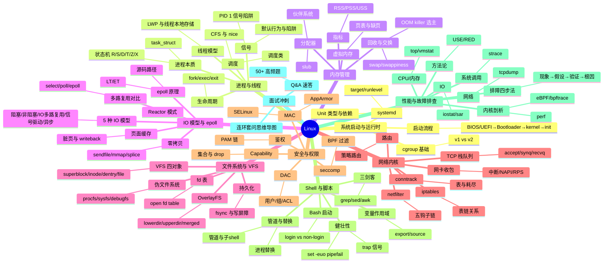

# linux — Linux 面试知识体系

## 一、模块简介

本模块按抽象层级组织 **9 份**主题文档，覆盖从系统启动、进程内存、IO 文件系统、网络内核到安全 Shell 与性能排障的完整面试知识图谱，并把 Linux 当作"容器与 JVM 的底层"来讲，每个专题都落到 Java/容器关联。

- **定位**：面向 Java 后端面试的 Linux 知识体系，深度对标 `ops/docker`、`ops/k8s`
- **适用对象**：Java 后端面试（初中级到高级），兼顾云原生与服务端架构方向
- **组织方式**：9 个主题目录 + 1 个 Q&A 文件，每份主题文档遵循 Linux 专用六段式结构
- **导航约定**：每份文档顶部含 `> 返回 [Linux 知识图谱](../README.md)` 链接，本文档为统一入口

---

## 二、知识图谱



---

## 三、导航表

| 分层 | 文档 | 核心考点 |
|------|------|---------|
| 系统启动 | [系统启动与运行时](./01-foundation/system-boot-and-runtime.md) | BIOS/UEFI→Bootloader→kernel→init、systemd Unit、cgroup v1/v2 基础 |
| 进程 | [进程与线程](./02-process/process-and-thread.md) | task_struct、状态机、fork/exec/exit、CFS 调度、信号、PID 1 陷阱 |
| 内存 | [内存管理](./03-memory/memory-management.md) | 虚拟内存、页表、swap、OOM killer、伙伴系统、RSS/PSS/USS |
| IO | [IO 模型与 epoll](./04-io/io-model-and-epoll.md) | 5 种 IO 模型、select/poll/epoll、LT/ET、Reactor、零拷贝、页面缓存 |
| 文件系统 | [文件系统与 VFS](./05-fs/filesystem-and-vfs.md) | VFS 四对象、inode/dentry、OverlayFS、procfs/sysfs、fsync |
| 网络 | [网络内核](./06-network/network-kernel.md) | netfilter、iptables、conntrack、TCP 栈队列、NAPI/RPS、策略路由 |
| 安全 | [安全与权限](./07-security/security-and-permission.md) | DAC/MAC、Capability、SELinux、seccomp、AppArmor、PAM |
| Shell | [Shell 与脚本](./08-shell/shell-and-scripting.md) | Bash 启动层级、三剑客、进程替换、变量作用域、set -euo pipefail |
| 性能排障 | [性能与故障排查](./09-ops/performance-and-troubleshooting.md) | USE/RED、top/vmstat/iostat、perf、strace、tcpdump、eBPF、排障四步法 |
| 面试冲刺 | [Q&A 速答](./10-interview-qa.md) | 50+ 题速答 + 连环套问思维导图 |

> 共 **11 份**文档：入口 README（本文档）+ 上表 9 份主题/Q&A 文档。

---

## 四、推荐学习路径

### 路线一：系统学习（适合有 1-2 周准备期）

按抽象层级自顶向下，先建立 Linux 全貌再下沉到内核机制：

```
01 系统启动 → 02 进程 → 03 内存 → 04 IO 模型 → 05 文件系统 → 06 网络内核 → 07 安全 → 08 Shell → 09 性能排障 → 10 Q&A
```

**特点**：先见森林后见树木，符合 Linux 抽象层级，适合建立完整体系。

### 路线二：面试冲刺（高频优先，适合 3-5 天突击）

按面试热度排序，先啃必考点，再补体系：

1. 04 IO 模型 → 02 进程 → 03 内存
2. 09 性能排障 → 08 Shell → 06 网络内核
3. 01 启动 → 05 文件系统 → 07 安全 → 10 Q&A

**特点**：投入产出比最高，覆盖 80% 高频考点。

> 两套路线殊途同归，最终都应回到 [Q&A 速答](./10-interview-qa.md) 做闭环检验。

---

## 五、与 java-core / framework 模块的关联

本模块虽为系统层文档，但与仓库内 Java 模块存在直接关联，便于在面试中结合源码与实战作答：

| Linux 知识点 | 关联 Java/容器模块 | 关联要点 |
|-------------|-------------------|---------|
| 01 启动与运行时 / systemd Unit | `java-core/jvm` | JVM 启动参数与 systemd Unit 协作、启动超时与 JVM 预热 |
| 02 进程与线程 / task_struct | `java-core/jvm` | Java 线程 = LWP、JVM 线程模型与内核 task_struct 对应 |
| 02 进程与线程 / CFS 调度 | `java-core/forkjoin` | ForkJoinPool 并行度与 CPU 亲和、nice/CFS 对并行任务影响 |
| 02 进程与线程 / 信号 | `java-core/jvm` | JVM ShutdownHook 与 SIGTERM/SIGINT 的协作、PID 1 信号陷阱 |
| 03 内存管理 / OOM killer | `java-core/jvm` | OOM killer 选主策略杀 JVM、cgroup memory 与 JVM 堆感知 |
| 03 内存管理 / RSS/PSS/USS | `java-core/jvm` | 堆外内存预算、NMT 与 RSS 对账、ZGC 选型与容器内存 |
| 04 IO 模型 / epoll | `java-core/lambda`、`java-core/stream` | NIO/Netty 的 epoll、Reactor 模式与 Java 事件循环 |
| 04 IO 模型 / parallelStream | `java-core/forkjoin`、`java-core/stream` | parallelStream 阻塞公共线程池与 IO 阻塞陷阱 |
| 05 文件系统 / OverlayFS | `framework/spring-framework` | Spring Boot Layertools 分层 = OverlayFS、镜像分层缓存 |
| 05 文件系统 / 配置加载 | `framework/spring-framework` | Spring 配置文件加载顺序与 VFS/procfs |
| 06 网络内核 / TCP 栈参数 | `ops/network` | TCP 栈参数与网络模块对照、TIME_WAIT 与高并发服务 |
| 06 网络内核 / conntrack | `ops/network` | conntrack 表耗尽与高并发连接、NAT 穿透 |
| 07 安全与权限 / Capability | `ops/docker`、`ops/k8s` | Docker seccomp/Capability drop、K8s PodSecurity |
| 07 安全与权限 / seccomp | `ops/docker` | Docker 默认 seccomp profile 与容器 syscall 过滤 |
| 08 Shell 与脚本 / ENTRYPOINT | `ops/docker`、`ops/k8s` | 镜像构建 ENTRYPOINT、kubectl 排障 one-liner |
| 08 Shell 与脚本 / set -euo | `ops/docker` | 容器启动脚本健壮性与 set -euo pipefail |
| 09 性能与排障 / JMX | `java-core/jmx` | JMX 指标采集对接 Prometheus、MBean 暴露 |
| 09 性能与排障 / Java agent | `java-core/agent` | Java agent attach 排障、Arthas 原理与 ptrace |
| 09 性能与排障 / eBPF | `java-core/jvm` | eBPF uprobe 挂 JVM 方法、perf 与 JVM 符号解析 |

**延伸阅读**：

- `java-core/jvm` —— 对照理解 JVM 容器内存感知、GC 选型、ShutdownHook、线程模型
- `framework/spring-framework` —— Spring Boot 容器化、配置加载、Layertools、优雅关闭
- `ops/docker` —— 容器底层原理、Capability/seccomp、OverlayFS、Java 容器调优
- `ops/k8s` —— Pod 安全、容器运行时、Java 上 K8s
- `ops/network` —— 网络分层、TCP 连接、conntrack 与高并发（Linux 网络内核的上层基础）

> 建议在阅读进程、内存、IO 与性能排障文档时，对照 `java-core`/`framework` 模块的源码实例，加深「面试八股 → 工程实战」的双向映射。
