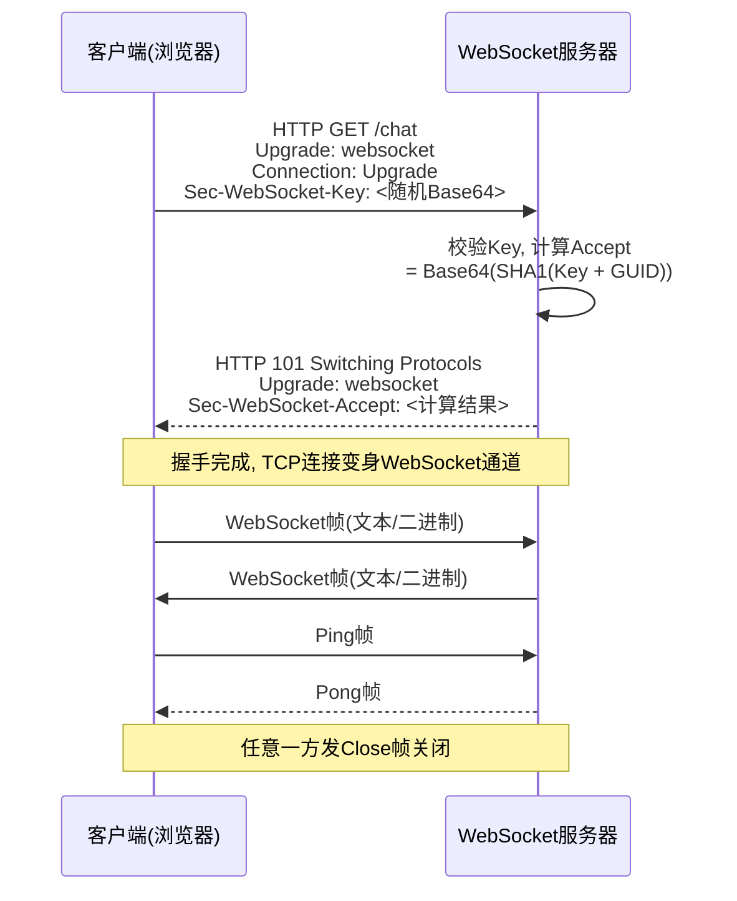
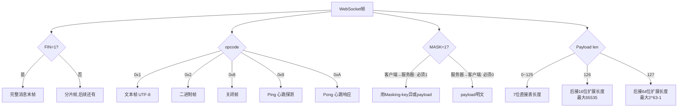
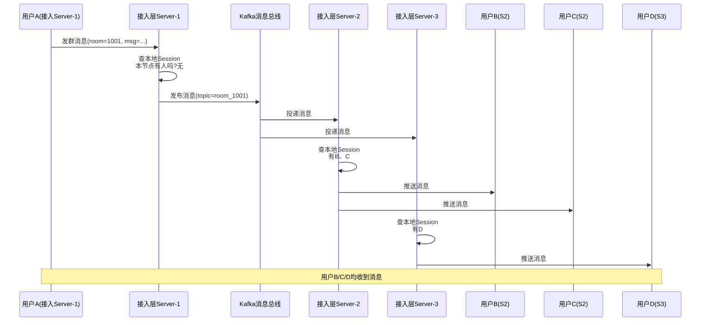

# 其他应用层协议（WebSocket / CDN / FTP / SMTP）

> **一句话定位**：WebSocket 与 CDN 是 Java 后端面试中长连接与内容分发的常考题。
> **面试热度**：⭐⭐⭐⭐
> **返回**：[网络知识图谱](../README.md)

---

## 一、概念定义

### 1.1 WebSocket 定位

WebSocket（RFC 6455，2011）是一种**基于 TCP 的全双工应用层协议**，它在一条持久化连接上允许服务器与客户端**随时互发消息**，解决了 HTTP「请求-响应」模型下服务器无法主动推送的痛点。默认端口与 HTTP 共用：80（明文 `ws://`）与 443（TLS 加密 `wss://`）。

> **为什么需要 WebSocket？** HTTP 是请求-响应模型，服务器只能被动应答，无法主动向客户端推消息。早期实现"服务器推送"靠**轮询**（polling，客户端定时拉）、**长轮询**（long polling，服务器 hold 住请求直到有数据）、**SSE**（Server-Sent Events，单向服务器→客户端流）。这些方案要么延迟高、要么浪费连接、要么只能单向。WebSocket 用一次 HTTP Upgrade 握手建立持久全双工连接，之后双方可任意时刻发帧，延迟低、开销小、双向通信，是 IM/弹幕/实时协作/行情推送的主流方案。

WebSocket 的三个本质特征：

- **全双工**：连接建立后，服务器与客户端可同时、独立、任意时刻向对方发数据，无需"请求-应答"配对。
- **基于 TCP**：底层复用 TCP 的可靠字节流，自己定义帧（frame）边界与协议头，TCP 只管传输可靠。
- **握手复用 HTTP**：用 HTTP `Upgrade: websocket` 报文完成握手，借道 80/443 端口穿过防火墙，握手成功后协议切换为 WebSocket 帧格式。

### 1.2 CDN 定位

CDN（Content Delivery Network，内容分发网络）是一种**通过在多个地理区域部署边缘节点、把内容缓存到离用户最近的地方**的分布式网络。它解决的核心问题是**"距离远导致延迟高、源站压力大导致可用性差"**——把静态资源（图片/JS/CSS/视频）甚至动态接口的边缘转发能力下沉到各地边缘节点，让用户就近访问、源站减负。

CDN 的本质：

- **边缘缓存**：把热点内容复制到全球/全国数百上千个边缘节点，用户访问被 DNS 调度到最近节点，命中缓存直接返回，未命中再回源。
- **调度分发**：通过 DNS 智能解析、Anycast、HTTP 302 跳转等方式把用户流量调度到最优节点。
- **回源兜底**：缓存未命中时，边缘节点代替用户向源站请求，对源站做请求收敛（多个用户请求合并为一次回源）。

### 1.3 FTP / SMTP / IMAP 简述

这三个老牌应用层协议在 Java 后端面试中**常作背景题**（理解传统协议栈、与 HTTP 对比、对照 TCP 长连接），不是高频主考点，但概念必须清晰：

| 协议 | 全称 | 端口 | 传输 | 核心特点 |
|------|------|:----:|:----:|---------|
| **FTP** | File Transfer Protocol（RFC 959） | 21 控制端口 / 20 数据端口 | TCP | 双连接：控制连接（命令）+ 数据连接（传输），有主动/被动模式之分 |
| **SMTP** | Simple Mail Transfer Protocol（RFC 5321） | 25 / 587（提交）/ 465（SMTPS） | TCP | 推送模型：发件方主动把邮件推给收件方邮件服务器，纯发不发收 |
| **IMAP** | Internet Message Access Protocol（RFC 3501） | 143 / 993（IMAPS） | TCP | 拉取模型：客户端从服务器拉邮件，邮件留在服务器，支持多端同步 |
| **POP3** | Post Office Protocol v3（RFC 1939） | 110 / 995（POP3S） | TCP | 拉取模型：客户端拉下来后默认从服务器删除，单端使用 |

> **三者关系**：发邮件用 SMTP（客户端→自己邮件服务器，再→对方邮件服务器）；收邮件用 IMAP 或 POP3（客户端从自己邮件服务器拉）。邮件在服务器间传递用 SMTP，客户端与服务器间收发分用 SMTP（发）和 IMAP/POP3（收）。

---

## 二、原理与流程

### 2.1 WebSocket 握手升级

WebSocket 复用 HTTP/1.1 的 `Upgrade` 机制完成握手，本质是一次 HTTP GET 请求 + 101 响应，握手成功后该 TCP 连接"变身"为 WebSocket 通道。

**客户端握手请求**（典型报文）：

```http
GET /chat HTTP/1.1
Host: api.example.com
Upgrade: websocket
Connection: Upgrade
Sec-WebSocket-Key: dGhlIHNhbXBsZSBub25jZQ==
Sec-WebSocket-Version: 13
Origin: https://www.example.com
Sec-WebSocket-Protocol: chat, superchat
```

**服务器握手响应**（101 Switching Protocols）：

```http
HTTP/1.1 101 Switching Protocols
Upgrade: websocket
Connection: Upgrade
Sec-WebSocket-Accept: s3pPLMBiTxaQ9kYGzzhZRbK+xOo=
```

**关键字段**：

| 字段 | 作用 | 由谁提供 |
|------|------|---------|
| `Upgrade: websocket` | 声明升级到的协议 | 客户端请求 + 服务器响应 |
| `Connection: Upgrade` | 通知中间代理本连接要升级，勿缓存 | 客户端 + 服务器 |
| `Sec-WebSocket-Key` | 客户端生成的 16 字节随机数 Base64 | 客户端 |
| `Sec-WebSocket-Version: 13` | 协议版本（RFC 6455 即为 13） | 客户端 |
| `Origin` | 客户端来源，服务器据此做跨域校验 | 客户端（浏览器自动加） |
| `Sec-WebSocket-Protocol` | 子协议协商（如 `chat`） | 客户端提议，服务器选一个回 |
| `Sec-WebSocket-Accept` | 服务器证明自己懂 WebSocket | 服务器 |

**`Sec-WebSocket-Accept` 计算规则**（RFC 6455 §1.3，是握手防误升级的核心）：

```
Accept = Base64(SHA1(Sec-WebSocket-Key + "258EAFA5-E914-47DA-95CA-C5AB0DC85B11"))
```

其中 `258EAFA5-...` 是 RFC 写死的 GUID。服务器把客户端的 Key 拼上 GUID，做 SHA-1，再 Base64 编码，作为 Accept 返回。客户端收到 101 后用同样算法验算 Accept，匹配则握手成功。这个机制保证只有"真正懂 WebSocket 的服务器"才能完成握手——普通的 HTTP 服务器不会算这个值，也就不会误升级。

**握手时序图**：



> **关键点**：①握手是普通 HTTP，能穿过所有支持 HTTP 的代理/防火墙；②101 之后这条 TCP 连接不再讲 HTTP，双方按 WebSocket 帧格式收发；③`Sec-WebSocket-Accept` 的 SHA-1 + GUID 是协议级防误升级机制，不是安全认证——真正的身份认证靠 `wss://`（TLS）+ 应用层 token。

### 2.2 WebSocket 帧格式

握手成功后，双方按 RFC 6455 §5.2 定义的**帧（frame）格式**收发数据。一个 WebSocket 帧的结构：

```
 0                   1                   2                   3
 0 1 2 3 4 5 6 7 8 9 0 1 2 3 4 5 6 7 8 9 0 1 2 3 4 5 6 7 8 9 0 1
+-+-+-+-+-------+-+-------------+-------------------------------+
|F|R|R|R| opcode|M| Payload len |    Extended payload length    |
|I|S|S|S|  (4)  |A|     (7)     |             (16/64)           |
|N|V|V|V|       |S|             |   (if payload len==126/127)   |
| |1|2|3|       |K|             |                               |
+-+-+-+-+-------+-+-------------+ - - - - - - - - - - - - - - - +
|     Extended payload length continued (if payload len == 127)  |
+ - - - - - - - - - - - - - - - +-------------------------------+
|                               |Masking-key (if MASK==1)       |
+-------------------------------+-------------------------------+
| Masking-key (continued)       |          Payload Data         |
+-------------------------------- - - - - - - - - - - - - - - - +
:                     Payload Data continued                    :
+ - - - - - - - - - - - - - - - - - - - - - - - - - - - - - - - +
|                     Payload Data continued                    |
+---------------------------------------------------------------+
```

**核心字段**：

| 字段 | 长度 | 含义 |
|------|------|------|
| **FIN** | 1 bit | 是否是消息的最后一帧（1=末帧，0=还有后续分片帧） |
| **RSV1/2/3** | 3 bit | 保留位，非扩展必须为 0（扩展如压缩用 RSV1） |
| **opcode** | 4 bit | 帧类型（见下表） |
| **MASK** | 1 bit | Payload 是否被掩码（客户端→服务器必须为 1，服务器→客户端必须为 0） |
| **Payload len** | 7 bit | 长度标识：0~125 直接表长度；126 表后接 16 位扩展长度；127 表后接 64 位扩展长度 |
| **Masking-key** | 0 或 32 bit | 掩码密钥（仅 MASK=1 时存在） |
| **Payload Data** | 变长 | 实际数据（被掩码时需用 Masking-key 异或解出） |

**opcode 取值**：

| opcode | 含义 | 说明 |
|:------:|------|------|
| `0x0` | continuation | 分片消息的后续帧 |
| `0x1` | text | 文本帧（UTF-8） |
| `0x2` | binary | 二进制帧 |
| `0x8` | close | 关闭帧（可携带状态码与原因） |
| `0x9` | ping | 心跳探测 |
| `0xA` | pong | 心跳响应（必须用最近一次 ping 的 payload 回） |
| `0x3`~`0x7`, `0xB`~`0xF` | 保留 | 非控制帧/控制帧保留，暂未用 |

**客户端掩码（Masking）规则**：

RFC 6455 规定**客户端→服务器的所有帧必须掩码**，服务器→客户端的帧禁止掩码。掩码用 32 位随机 Masking-key，对 payload 按字节循环异或：

```
for i in range(len(payload)):
    transformed[i] = payload[i] ^ masking_key[i % 4]
```

> **为什么客户端必须掩码？** 不是加密（掩码密钥就明文带在帧里），而是**防止中间代理缓存污染**。早期某些 HTTP 代理会被攻击者用"伪装成 HTTP 的 WebSocket 帧"欺骗，把恶意 payload 缓存到缓存里污染其他用户。强制掩码让攻击者无法精确控制经过代理的字节流（中间代理若试图解析会因掩码而解不出有意义的 HTTP 报文），从而阻断这类缓存污染攻击。服务器→客户端方向不经过这种代理，故不需要掩码。

**分片（Fragmentation）**：

一条长消息可拆成多个帧发送：第一帧 opcode 为 `0x1`/`0x2` 且 FIN=0，中间帧 opcode 为 `0x0` 且 FIN=0，末帧 opcode 为 `0x0` 且 FIN=1。接收方按顺序拼回。分片用于：①消息长度未知时边产生边发；②大消息与高优先级小消息穿插（控制帧如 ping 可插在分片中间发送）。

**帧格式示意图**：



### 2.3 心跳（Ping/Pong）

WebSocket 连接是长连接，但中间网络（NAT、防火墙、负载均衡）会因长时间无流量而**静默丢弃空闲连接**（典型 NAT 老化时间 5~10 分钟，SLB 默认空闲超时 60~900 秒）。为保活连接、及时检测连接是否健康，需要心跳机制。

**协议级心跳——Ping/Pong 帧**：

RFC 6455 定义了 opcode `0x9`（Ping）和 `0xA`（Pong）。任意一方发 Ping，对方**必须尽快回 Pong**，且 Pong 的 payload 必须与 Ping 一致。常见做法是服务器定时（如 30s/60s）给客户端发 Ping：

- 客户端正常 → 收到 Ping 回 Pong，服务器确认连接存活；
- 客户端异常/网络断 → 服务器在超时内收不到 Pong，主动关闭连接、释放资源。

**应用层心跳**：

很多业务用应用层消息做心跳（如 IM 的 `{"type":"ping"}` / `{"type":"pong"}` JSON 报文），不依赖协议级 Ping/Pong。原因：①协议级心跳穿透某些代理时可能被剥离；②应用层心跳可携带业务信息（如最近消息 seq、客户端状态）；③便于跨语言客户端统一实现。

**心跳间隔设计**（经验值）：

| 场景 | 间隔 | 原因 |
|------|------|------|
| 移动端 IM | 60~120s | 兼顾省电与 NAT 保活（移动网络 NAT 老化常 ~5min） |
| Web 端实时协作 | 30~60s | 浏览器标签页可见时低延迟，不可见可拉长 |
| 服务间长连接 | 10~30s | 服务端连接稳定，但 LB 空闲超时短需更勤 |
| 极端省电场景 | 5~10min | 如推送类 App，平时只收推送，不主动心跳 |

> **心跳间隔必须 < 中间设备空闲超时**：常见 SLB（如 Nginx 默认 `proxy_read_timeout 60s`、阿里云 SLB 默认 900s）会主动断开静默连接。心跳间隔若大于这个值，连接会在两次心跳之间被中间设备静默断开，客户端收不到任何通知，"假连接"持续到下次发包失败。生产实践：心跳间隔取中间设备超时的 1/2~2/3 作为安全余量。

### 2.4 CDN 原理

CDN 的核心是把内容缓存到边缘节点，让用户就近访问。一次 CDN 访问的关键流程：

**1. 域名接入与 DNS 调度**

源站把域名（如 `cdn.example.com`）通过 CNAME 接入 CDN 厂商。用户访问时，DNS 解析到 CNAME 目标，CDN 的智能 DNS 根据用户来源 IP 段、各边缘节点负载、健康状况返回**最优边缘节点 IP**。

```
用户访问 cdn.example.com
  ↓ DNS解析
example.com → CNAME → example.cdn.net
  ↓ CDN智能DNS
返回离用户最近的边缘节点IP（如北京节点 1.1.1.1）
```

**2. 边缘缓存命中判断**

用户请求到达边缘节点，节点按 URL（或自定义 cache-key）查本地缓存：

- **命中**：直接返回缓存内容（TTL 未过期）。
- **未命中（MISS）**：回源拉取，回源成功后按缓存策略存入本地缓存，再返回用户。
- **过期（STALE/EXPIRED）**：缓存存在但 TTL 过期，可触发**回源刷新**或**异步刷新**（stale-while-revalidate）。

**3. 回源（Origin Pull）**

边缘节点未命中时，代替用户向源站请求。回源是 CDN 的"慢路径"，是源站压力与用户延迟的来源，CDN 的核心优化目标是**提高命中率、降低回源量**。

**回源请求收敛**：多个用户请求同一未命中 URL，若不控制会触发多次回源。CDN 边缘节点对同一 URL 的并发未命中请求做**请求合并（request coalescing）**——只发一次回源，其他请求等待结果共享。

**CDN 调度方式对比**：

| 调度方式 | 原理 | 优点 | 缺点 |
|---------|------|------|------|
| **DNS 调度** | CNAME 到 CDN，智能 DNS 按来源 IP 段返回最优节点 IP | 简单、覆盖广、无侵入 | 受客户端/LDNS 缓存影响，调度切换有 TTL 延迟 |
| **HTTP 302 调度** | 用户先访问调度服务器，302 跳转到最优边缘节点 | 调度精细、实时、不受 DNS 缓存影响 | 多一次 RTT，首字节延迟略高 |
| **Anycast** | 多节点宣告同一 IP，BGP 路由就近 | 网络层调度、容灾快 | 节点不可控性高，调试复杂 |
| **静态配置** | 客户端硬编码节点列表 | 客户端可控 | 维护成本高，不灵活 |

> **国内 CDN 主流是 DNS 调度 + HTTP 302 补充**：DNS 做粗调度（按省/运营商返回 IP 列表），302 做细调度（边缘节点内部再 302 到具体 cache 机器）。海外 CDN（Cloudflare、Akamai）大量用 Anycast 简化调度。

### 2.5 CDN 缓存策略

CDN 命中率是性能核心，命中率取决于缓存策略：

**缓存 key**：默认是 URL（含 query string）。可配置忽略指定 query 参数（如 `?ts=随机数` 防缓存则忽略）、忽略 header（如 `Cookie`）、自定义 key（含 `Host`、`scheme`）。

**TTL 来源**（优先级从高到低）：

1. CDN 控制台/ API 显式配置的规则（如 `.jpg` 缓存 30 天）；
2. 源站响应的 `Cache-Control: max-age=N` / `Expires`；
3. CDN 默认策略。

**常见缓存头**：

| 响应头 | 含义 | 对 CDN 的影响 |
|--------|------|-------------|
| `Cache-Control: max-age=600` | 缓存 600 秒 | 边缘节点缓存 600s，期间命中不回源 |
| `Cache-Control: no-cache` | 每次必须回源验证 | 边缘缓存但每次回源带 `If-None-Match` 验证 |
| `Cache-Control: no-store` | 禁止缓存 | 边缘不缓存，每次回源 |
| `Cache-Control: s-maxage=600` | 共享缓存（CDN）专用 TTL | 覆盖 max-age，仅对 CDN 生效，不影响浏览器 |
| `Cache-Control: stale-while-revalidate=60` | 过期后 60s 内可返回旧内容同时异步刷新 | 提升命中率，避免回源期间用户等待 |
| `ETag` / `Last-Modified` | 内容指纹 / 最后修改时间 | 配合 `If-None-Match` / `If-Modified-Since` 做条件回源，命中返回 304 |

**刷新与预热**：

- **刷新（Purge/Refresh）**：主动从边缘节点删除指定 URL 或目录缓存，下次访问回源拉新。用于内容更新后立即生效（避免等 TTL 过期）。
- **预热（Prefetch）**：在用户访问前主动把内容推送到边缘节点缓存，避免首用户回源慢。常用于发版、大促前预热热点资源。

**CDN 命中率优化经验**：

- 静态资源（JS/CSS/图片）用内容哈希命名（如 `app.a1b2c3.js`），永不过期（`max-age=31536000`），靠文件名变化触发更新；
- 动态接口默认不缓存（`no-cache` 或不带缓存头），但可对**幂等只读接口**做短 TTL 缓存（如商品详情 1s）；
- 区分 `max-age`（浏览器+CDN 都生效）与 `s-maxage`（仅 CDN），避免长 `max-age` 导致浏览器缓存难以更新；
- 用 `stale-while-revalidate` 兜底，过期瞬间返回旧内容，异步刷新，用户无感；
- 大文件用 **Range 请求分片缓存**（CDN 支持 `Accept-Ranges`，分块回源分块缓存）。

### 2.6 动态加速

CDN 早期只加速静态资源，但越来越多业务需要加速动态接口（如 API、登录、支付）。**动态加速（Dynamic Site Acceleration, DSA）** 不靠缓存，靠网络路径优化与连接复用：

| 加速手段 | 原理 | 收益 |
|---------|------|------|
| **边缘节点回源长连接** | 边缘节点与源站保持 TCP/TLS 长连接池，用户请求到达边缘后复用已建立连接回源 | 省去用户→源站每次 TCP 握手 + TLS 握手（2~3 RTT） |
| **Anycast 路径优化** | 用户→边缘节点走运营商最优路径，边缘节点→源站走 CDN 专线/BGP 优化路径 | 避开拥塞运营商互联点，降低丢包与延迟 |
| **TCP 优化** | 边缘节点用更大初始拥塞窗口、BBR 拥塞控制、TCP Fast Open | 提升回源链路吞吐 |
| **TLS 会话复用** | 边缘节点与源站复用 TLS Session ID/Ticket，跳过完整握手 | 省去 TLS 握手 RTT |
| **HTTP/2 多路复用** | 边缘→源站用 HTTP/2 多路复用，多个回源请求复用一条连接 | 减少连接数、降低队头阻塞 |

> **动态加速的本质**：把"用户→源站"的长距离高延迟链路，拆成"用户→边缘节点（近、快）"+"边缘节点→源站（专线、长连接池、协议优化）"两段，用 CDN 的网络与连接优势抵消用户直连源站的劣势。对跨境、跨运营商访问尤其有效。

### 2.7 FTP 主动与被动模式

FTP 独特之处是用**两条 TCP 连接**：

- **控制连接**（端口 21）：传输命令（`USER`、`PASS`、`CWD`、`RETR`、`STOR`）与响应码（`200 OK`、`421`、`530`），全程保持，交互式。
- **数据连接**（端口 20 或随机高位端口）：传输文件内容与目录列表，每次传输建立一次，传完关闭。

数据连接的建立方式分**主动模式（PORT/Active）** 与**被动模式（PASV/Passive）**：

**主动模式（PORT）**：

```
1. 客户端任意端口N → 服务器端口21（控制连接,客户端主动连）
2. 客户端端口N+1监听,通过PORT命令告诉服务器:"我在N+1端口等你"
3. 服务器端口20 → 客户端端口N+1（数据连接,服务器主动连客户端）
```

问题：客户端常在 NAT 后，服务器无法主动连到客户端的 N+1 端口（NAT 会丢弃），主动模式在 NAT 环境下基本不可用。

**被动模式（PASV）**：

```
1. 客户端任意端口N → 服务器端口21（控制连接,客户端主动连）
2. 客户端发PASV命令,服务器回:"我在端口P等你"(P是服务器随机高位端口)
3. 客户端任意端口M → 服务器端口P（数据连接,客户端主动连服务器）
```

被动模式下两条连接都由客户端主动发起，能穿过客户端 NAT，是现代 FTP 客户端默认模式。但服务器侧的 P 端口需要在防火墙白名单内，且需开启 PASV 端口范围（如 `30000-40000`）。

> **面试要点**：①FTP 双连接（控制+数据），这是它与 HTTP（单连接）的本质区别；②主动模式服务器主动连客户端，NAT 后客户端不可用；③被动模式客户端主动连服务器，是 NAT 友好的现代默认；④FTP 控制连接用明文命令，数据连接也是明文，**FTP over TLS（FTPS）** 用 TLS 加密两条连接，**SFTP** 是 SSH 子系统，与 FTP 协议无关，只是名字相近。

### 2.8 SMTP 与 IMAP 流程

**SMTP 推送模型**——发邮件：

```
Alice@a.com → 发给 Bob@b.com

1. Alice 的邮件客户端 → SMTP → a.com 邮件服务器（提交,端口587+TLS）
2. a.com 服务器查 b.com 的 MX 记录,得到 b.com 邮件服务器地址
3. a.com 服务器 → SMTP → b.com 邮件服务器（投递,端口25）
4. b.com 服务器把邮件存到 Bob 的邮箱存储
```

关键点：①SMTP 是**推送**（发件方主动连收件方）；②用 MX 记录定位收件方邮件服务器；③服务器间投递用端口 25（明文）或 STARTTLS；④客户端提交用端口 587（提交，要求认证）或 465（SMTPS 直接 TLS）。

**IMAP 拉取模型**——收邮件：

```
Bob 的客户端 → IMAP → b.com 邮件服务器（端口993 IMAPS）
  ↓ LIST/SELECT INBOX
  ↓ FETCH 1:* （拉取邮件，邮件仍留在服务器）
  ↓ STORE +FLAGS \Seen（标记已读，多端同步状态）
```

关键点：①IMAP 是**拉取**（客户端主动连服务器）；②邮件**留在服务器**，多端可同步（与 POP3 下载即删对比）；③支持邮件状态同步（已读、已回复、旗标）；④UID 保证多端操作一致性。

> **对照 HTTP**：SMTP/IMAP/FTP 都是"长连接 + 命令-响应"模型，与 HTTP 的"短连接 + 请求-响应"对照，反映了早期协议（1980s）的设计哲学——长连接交互式、命令式协议族，而 HTTP（1990s）选择了无状态短连接换取可扩展性与缓存友好。

---

## 三、高频追问与面试题

### Q1：WebSocket 和 HTTP/2 Server Push 有什么区别？

**参考答案**：两者都解决了"HTTP 服务器无法主动推送"的问题，但机制与方向差异很大。

| 维度 | WebSocket | HTTP/2 Server Push |
|------|-----------|--------------------|
| 协议模型 | 全双工，双方可任意时刻互发 | 半双工推送，服务器在响应中"夹带"资源，但仍基于 HTTP 请求-响应 |
| 连接生命周期 | 长连接，握手后持续到主动关闭 | 随请求开始，请求结束（响应完成）即结束，push 在此期间发生 |
| 数据格式 | WebSocket 帧（opcode/mask/payload） | HTTP/2 帧（PUSH_PROMISE + DATA），仍是 HTTP 语义 |
| 客户端能力 | 可主动向服务器发任意消息 | 客户端只能发请求，服务器 push 的资源对应"客户端本会请求的资源" |
| 典型场景 | IM、弹幕、行情、协同编辑 | 推送与请求资源相关的预加载资源（如 HTML 推送其依赖的 CSS/JS） |
| 客户端 API | `WebSocket` 对象，事件驱动 `onmessage` | 浏览器透明处理，无独立 API |
| 取代关系 | 未被 HTTP/2 取代，仍是双向实时通信主流 | **HTTP/2 Server Push 已被 Chrome 弃用**（2022），改用 `<link rel="preload">` 与 103 Early Hints |

**关键区别**：HTTP/2 Server Push 是"服务器替客户端决定要哪些资源并提前发"，本质还是围绕一次请求的优化；WebSocket 是"双方独立通信"，根本不围绕请求。HTTP/3 沿用 HTTP/2 的语义，也提供 Server Push 但同样面临被 Early Hints 替代的趋势。**WebSocket 解决的是双向实时通信，HTTP/2 Server Push 解决的是请求-响应模型的预推送优化**，二者目标不同，WebSocket 不会被 HTTP/2 Push 取代。

**追问**：HTTP/2 Server Push 为什么被 Chrome 弃用？

> 缓存匹配困难：服务器 push 的资源常常是客户端已有缓存（浏览器缓存或 CDN 缓存）的资源，强行 push 反而浪费带宽。客户端虽可用 `RST_STREAM` 拒绝 push，但 push 决策权在服务器，难以准确判断客户端缓存状态。替代方案是 **103 Early Hints** 响应——服务器先发 `Link: <style.css>; rel=preload; as=style` 头提示客户端预加载，客户端自己决定要不要拉，避免浪费。

### Q2：WebSocket 怎么做心跳？为什么需要？

**参考答案**：心跳有两种层面。

**协议级心跳**：RFC 6455 定义 opcode `0x9`（Ping）和 `0xA`（Pong）。一方发 Ping，对方必须回 Pong，payload 一致。常见服务器定时（30~60s）发 Ping，超时未收到 Pong 则判定连接失效、主动 close。

**应用层心跳**：业务自定义消息，如 `{"type":"ping","ts":...}` / `{"type":"pong","ts":...}`。不依赖协议级帧，跨代理更稳，可携带业务信息（如 seq、状态）。

**为什么需要心跳**——三个目的：

1. **保活连接，防中间设备静默丢弃**：NAT、防火墙、SLB（如 Nginx `proxy_read_timeout`、阿里云 SLB 默认 900s）会因长时间无流量而丢弃空闲连接，且不发任何通知。心跳流量让连接"看起来活跃"，把静默断开风险转为主动可控。**心跳间隔必须 < 中间设备空闲超时**（取 1/2~2/3 作安全余量）。

2. **及时检测连接异常**：客户端进程崩溃、网络断线、移动网络切换等情况下，TCP 不一定立即感知（TCP keepalive 默认 2 小时才探测）。应用层心跳周期短（30~120s），收不到响应即可快速判定连接异常、清理资源、触发重连。

3. **维持连接新鲜度，触发后续业务**：某些场景下心跳还兼带业务含义（如 IM 上报客户端在线状态、同步消息 seq），不只是保活。

> **TCP keepalive 为什么不够用？** TCP keepalive（`SO_KEEPALIVE`）默认参数：空闲 2 小时（`tcp_keepalive_time`）才开始探测，每 75s 一次，9 次失败才报错，全周期约 2 小时 11 分钟。对实时业务来说太迟钝，无法快速感知断线。应用层心跳可自由控制间隔（30~120s），且能穿透部分会剥离 TCP 选项的代理。所以 WebSocket 业务一般**关掉 TCP keepalive，用应用层或协议级 Ping/Pong 代替**。

**追问**：心跳间隔怎么定？太长太短各有什么问题？

> 太长（如 10 分钟）→ 中间设备可能已静默断开，心跳前连接已死，下次业务发包才发现失败，延迟感知断线。太短（如 5 秒）→ 流量与电量浪费（移动端尤其敏感），频繁唤醒影响省电。经验值：移动 IM 60~120s、Web 端 30~60s、服务间 10~30s，且必须小于中间设备空闲超时的一半。

### Q3：CDN 回源策略有哪些？

**参考答案**：CDN 边缘节点未命中缓存时需要回源，回源策略决定了缓存刷新的时机与方式。常见策略：

| 策略 | 触发条件 | 行为 | 适用场景 |
|------|---------|------|---------|
| **MISS 回源** | 缓存中无此 URL | 同步回源拉取，返回用户后写入缓存 | 首次访问、缓存被 purge |
| **EXPIRED 同步回源** | TTL 过期 | 同步回源拉取，用户等待 | 内容更新容忍度低 |
| **EXPIRED 异步刷新（stale-while-revalidate）** | TTL 过期但 < `stale-while-revalidate` 窗口 | 立即返回旧内容，后台异步回源刷新 | 容忍旧内容、追求低延迟（如商品列表） |
| **条件回源（304 验证）** | TTL 过期 | 回源带 `If-None-Match: <ETag>` / `If-Modified-Since`，源站未改返回 304，CDN 续命 TTL | 内容是否变更不固定，节省带宽 |
| **请求合并（coalescing）** | 同 URL 并发未命中 | 只发一次回源，其他请求等待共享结果 | 突发流量打同一 URL，防回源风暴 |
| **预热（prefetch）** | 用户访问前 | 主动推送内容到边缘缓存 | 发版、大促前预热热点 |
| **分层回源（L2 cache）** | 边缘未命中 | 边缘→L2 中间节点→源站，多级缓存 | 海量节点收敛回源，降低源站压力 |
| **不缓存（bypass）** | 配置 no-store 或低 TTL | 每次回源 | 动态接口、个性化内容 |

**回源策略的权衡维度**：

- **延迟 vs 一致性**：异步刷新与 stale-while-revalidate 牺牲一致性换低延迟，适合容忍旧内容的场景；同步回源保证新鲜但用户需等待。
- **源站压力 vs 命中率**：长 TTL + 异步刷新 + 分层回源是降源站压力的组合拳；短 TTL + 同步回源会放大回源量。
- **缓存粒度**：URL 粒度（默认）vs 自定义 cache-key（合并 query、忽略指定 header），粒度越粗命中率越高但个性化越弱。

> **生产经验**：①静态资源用内容哈希命名 + 永不过期，命中率近 100%，几乎不回源；②动态接口做 0~2s 短 TTL 缓存，回源量与新鲜度兼顾；③发版/活动前用预热 API 提前把热点 URL 推到边缘，避免首用户回源；④突发流量打同一 URL 时务必开启请求合并，防回源风暴压垮源站。

**追问**：源站宕机时 CDN 怎么办？

> 开启**源站故障兜底**：①返回过期内容（TTL 过期但边缘仍有缓存时，降级返回旧内容，配 `stale-if-error`）；②返回预设的"降级页"或"维护页"；③多源站容灾，CDN 健康检查自动切换到备用源站。这个机制是 CDN 的容灾价值之一——源站宕而 CDN 仍能用旧内容撑一段时间。

### Q4：WebSocket 会断吗？断线重连怎么做？

**参考答案**：WebSocket 长连接会因多种原因断开，必须设计断线重连机制。

**断开的常见原因**：

1. **网络抖动/断网**：客户端网络瞬断、移动网络切换（4G→WiFi）、信号差丢包超时。
2. **中间设备超时**：NAT、SLB、Nginx 因空闲超时主动断开（不发 close 帧，客户端"假连接"）。
3. **服务器重启/扩容**：服务器进程重启或被 LB 摘除，TCP 连接被 reset。
4. **协议错误**：未掩码、opcode 非法等，服务器发 close 帧主动关闭。
5. **应用主动关闭**：服务器业务逻辑判定异常后 close。

**断线感知**：

- **理想情况**：服务器发 close 帧，浏览器触发 `onclose` 事件，立即感知。
- **非理想情况**：网络瞬断、NAT 静默丢弃，浏览器 `onclose` 不触发，需靠心跳超时感知——心跳 Ping 后超时未收到 Pong，判定连接失效，主动 close + 重连。

**重连设计要点**：

1. **指数退避（exponential backoff）**：重连间隔递增（1s → 2s → 4s → 8s → 16s → 上限 30s），避免服务器故障时大量客户端同时重连打爆服务器（**惊群**）。可加随机抖动（jitter），如 `interval = min(base * 2^n + random(0, base), maxInterval)`。
2. **重连上限与降级**：连续重连失败到一定次数后，提示用户网络异常、降级到 HTTP 轮询或长轮询兜底。
3. **断线期间消息缓存**：客户端断线期间用户产生的消息缓存到本地，重连成功后补发；服务器待发的消息走离线消息存储，重连后推送。
4. **重连后状态恢复**：重连成功后上报本地最新消息 seq，服务器按 seq 推送缺失消息，保证消息不丢不重（去重靠 seq 或业务 id）。
5. **页面可见性优化**：浏览器标签页不可见时（`document.hidden`）可暂停心跳或拉长间隔省资源，可见时再恢复；移动 App 后台时同样降级。
6. **心跳超时兜底**：设置心跳 Pong 超时（如 3 次心跳间隔未收到 Pong），强制 close 并触发重连，覆盖"假连接"场景。

**伪代码**：

```javascript
class ReconnectWebSocket {
  constructor(url) {
    this.url = url;
    this.retries = 0;
    this.maxRetries = 10;
    this.baseDelay = 1000;
    this.maxDelay = 30000;
    this.connect();
  }
  connect() {
    this.ws = new WebSocket(this.url);
    this.ws.onopen = () => { this.retries = 0; this.startHeartbeat(); };
    this.ws.onclose = (e) => { this.stopHeartbeat(); this.scheduleReconnect(); };
    this.ws.onmessage = (e) => { /* 业务处理 */ };
  }
  scheduleReconnect() {
    if (this.retries >= this.maxRetries) {
      this.onGiveUp();  // 降级到轮询
      return;
    }
    const delay = Math.min(
      this.baseDelay * Math.pow(2, this.retries) + Math.random() * 1000,
      this.maxDelay
    );
    this.retries++;
    setTimeout(() => this.connect(), delay);
  }
}
```

> **关键工程点**：①指数退避 + jitter 防惊群；②重连后用 seq 恢复状态，消息不丢不重；③心跳超时兜底，覆盖假连接；④重连次数上限 + 降级方案，避免无限重连耗电耗资源。

**追问**：重连用同一个 URL 还是要重新选服务器？

> 通常重连到同一 URL（CDN 调度/LB 会重新选具体节点），但极端情况下（某区域整体故障）可让客户端获取备用接入点列表（HTTPDNS 思路），重连时轮询备用点。移动端常配 HTTPDNS + 多接入点，重连时重新拉取最优 IP，避免单一节点故障持续重连失败。

### Q5：长轮询、SSE、WebSocket 怎么选？

**参考答案**：三者都是实现"服务器向客户端推送"的方案，选型看场景：

| 维度 | 长轮询（Long Polling） | SSE（Server-Sent Events） | WebSocket |
|------|----------------------|-------------------------|-----------|
| 协议 | HTTP/1.1 | HTTP/1.1+（基于 `text/event-stream`） | 独立协议（HTTP Upgrade 后切换） |
| 方向 | 单向（服务器→客户端，靠"hold 住请求"） | 单向（服务器→客户端流） | 全双工 |
| 连接 | 短连接复用（每次响应后断） | 长连接（HTTP 持久） | 长连接（持久全双工） |
| 客户端 API | 普通 `fetch`/`XHR` | `EventSource` | `WebSocket` |
| 服务器复杂度 | 简单（HTTP 即可） | 简单（HTTP 即可） | 较复杂（需 WebSocket 服务器） |
| 代理穿透 | 好（纯 HTTP） | 好（纯 HTTP） | 一般（需代理支持 Upgrade） |
| 自动重连 | 需手动实现 | 内置自动重连 | 需手动实现 |
| 二进制支持 | 否（文本） | 否（文本） | 是（文本+二进制） |
| 典型场景 | 兼容性兜底、低频推送 | 通知、行情单向推送 | IM、协同编辑、双向实时通信 |

**选型决策树**：

- 需要**客户端也主动发消息** → 必须 WebSocket（IM、协同编辑、游戏）；
- 只需**服务器→客户端单向推送**，且消息为文本 → SSE（更简单，自带重连）；
- 只能**用旧 HTTP 基础设施**、推送频率极低 → 长轮询（兼容性最好）；
- 需要**二进制传输**（如视频流、二进制协议）→ WebSocket；
- 需要**多路复用多通道** → WebSocket（一条连接多个子频道）。

> **实际经验**：①IM/弹幕/协同编辑用 WebSocket（双向、高频、二进制可选）；②通知/行情/日志流用 SSE（单向、简单、自动重连、走 HTTP 基础设施友好）；③作为 WebSocket 不可用时的降级，长轮询仍有价值（兼容老旧代理、降级方案）。

**追问**：SSE 为什么没取代 WebSocket？

> SSE 是单向的，客户端只能听不能说；WebSocket 是全双工，双方独立通信。SSE 基于 HTTP 流，开销是文本格式 + HTTP 头，无二进制；WebSocket 帧开销更小且支持二进制。SSE 简单但限于"服务器推送事件"场景，无法满足 IM/协同编辑的"双方实时互动"需求。两者互补：单向推送用 SSE，双向实时用 WebSocket。

### Q6：WebSocket 如何做认证与鉴权？

**参考答案**：WebSocket 握手是 HTTP GET，但**不能用常规 HTTP 中间件做认证**——握手成功后协议切换，后续不再有 HTTP 头。常见做法：

1. **握手时通过 Query 携带 token**：`ws://api/chat?token=xxx`，服务器在握手请求中校验 token，决定是否回 101。简单，但 token 会出现在日志、Referer、代理缓存中，**必须用 wss 防窃听**，且 token 应是短期一次性。
2. **握手时通过 Cookie**：浏览器自动带同源 Cookie，服务器校验 Session。复用现有 HTTP 会话，但受同源限制（跨域需 CORS）。
3. **握手时通过 `Sec-WebSocket-Protocol`** 携带 token（子协议位置），部分场景用作非标准 token 通道。
4. **握手成功后第一条消息鉴权**：握手放行，客户端首条消息发 `{"type":"auth","token":"xxx"}`，服务器校验通过才允许后续业务消息。这样可以把握手与业务鉴权解耦，但握手到鉴权完成期间连接处于"未授权"态，需防业务消息绕过。
5. **JWT + 短期 refresh**：握手用短期 access token，过期后服务器主动 close，客户端用 refresh token 获取新 token 后重连。

> **关键点**：①握手成功后无法再读 HTTP 头，鉴权必须在握手时或握手后首消息完成；②token 不要放 Query 明文（除非 wss），优先 Cookie 或首消息鉴权；③鉴权后到 close 期间连接属于该用户，业务层做权限校验仍不可省（如某房间是否可入）。

---

## 四、实战与 Java 生态关联

### 4.1 Java WebSocket 标准 API（javax.websocket）

Java EE 7+ 内置 `javax.websocket`（JSR 356）规范，提供注解驱动、事件回调的 WebSocket API：

```java
import javax.websocket.*;
import javax.websocket.server.ServerEndpoint;
import java.io.IOException;
import java.util.concurrent.CopyOnWriteArraySet;
import javax.websocket.Session;

@ServerEndpoint("/chat/{roomId}")
public class ChatEndpoint {

    private static final CopyOnWriteArraySet<Session> sessions = new CopyOnWriteArraySet<>();

    @OnOpen
    public void onOpen(Session session, javax.websocket.EndpointConfig config) {
        sessions.add(session);
        System.out.println("连接建立: " + session.getId());
    }

    @OnMessage
    public void onMessage(String message, Session session) throws IOException {
        // 收到客户端消息后广播
        for (Session s : sessions) {
            if (s.isOpen()) {
                s.getBasicRemote().sendText("[" + session.getId() + "]: " + message);
            }
        }
    }

    @OnClose
    public void onClose(Session session, CloseReason reason) {
        sessions.remove(session);
        System.out.println("连接关闭: " + reason);
    }

    @OnError
    public void onError(Session session, Throwable throwable) {
        throwable.printStackTrace();
        sessions.remove(session);
    }
}
```

**关键 API**：

| 注解/接口 | 触发时机 | 用途 |
|----------|---------|------|
| `@ServerEndpoint("/path")` | 类级 | 声明服务器端点路径 |
| `@OnOpen` | 连接建立 | 初始化资源、注册 Session |
| `@OnMessage` | 收到消息 | 业务处理，可重载分别处理文本/二进制/Pong |
| `@OnClose` | 连接关闭 | 释放资源、清理 Session |
| `@OnError` | 异常 | 错误处理 |
| `Session` | — | 连接会话对象，`getBasicRemote()` 同步发、`getAsyncRemote()` 异步发 |

> **部署**：JSR 356 由 Servlet 容器（Tomcat 8+、Jetty 9+、Undertow 2+）原生支持，无需额外依赖。Spring Boot 嵌入式 Tomcat 也内置支持。但单机内存中维护 Session 集合**无法横向扩展**——多机部署时需要把 Session 与消息路由到对应节点（见 §5 IM 案例）。

### 4.2 Spring WebSocket

Spring 提供更高层抽象：`spring-websocket` + `spring-messaging`（STOMP 子协议支持），与 Spring 生态（IoC、AOP、消息代理）无缝集成。

**简单 WebSocket（无 STOMP）**：

```java
import org.springframework.web.socket.*;
import org.springframework.web.socket.handler.TextWebSocketHandler;
import org.springframework.web.socket.server.HandshakeInterceptor;
import java.util.Map;
import java.util.concurrent.ConcurrentHashMap;

@Configuration
@EnableWebSocket
public class WebSocketConfig implements WebSocketConfigurer {

    private final Map<String, WebSocketSession> sessions = new ConcurrentHashMap<>();

    @Override
    public void registerWebSocketHandlers(WebSocketHandlerRegistry registry) {
        registry.addHandler(new ChatHandler(), "/chat")
                .addInterceptors(new AuthHandshakeInterceptor())
                .setAllowedOrigins("*");
    }

    class ChatHandler extends TextWebSocketHandler {
        @Override
        public void afterConnectionEstablished(WebSocketSession session) {
            sessions.put(session.getId(), session);
        }

        @Override
        protected void handleTextMessage(WebSocketSession session, TextMessage message) throws Exception {
            for (WebSocketSession s : sessions.values()) {
                if (s.isOpen()) {
                    s.sendMessage(new TextMessage(message.getPayload()));
                }
            }
        }

        @Override
        public void afterConnectionClosed(WebSocketSession session, CloseStatus status) {
            sessions.remove(session.getId());
        }
    }
}
```

**STOMP 子协议**：Spring 推荐在 WebSocket 之上叠加 STOMP（Simple Text Oriented Messaging Protocol）子协议，提供消息目的地（destination）路由、订阅/发布语义：

```java
@Configuration
@EnableWebSocketMessageBroker
public class StompConfig implements WebSocketMessageBrokerConfigurer {

    @Override
    public void registerStompEndpoints(WebSocketMessageBrokerRegistry registry) {
        registry.addEndpoint("/ws").setAllowedOrigins("*")
                .withSockJS();  // 兼容不支持 WS 的浏览器,降级到 xhr 流
    }

    @Override
    public void configureMessageBroker(MessageBrokerRegistry registry) {
        registry.enableSimpleBroker("/topic", "/queue");
        registry.setApplicationDestinationPrefixes("/app");
    }
}

@Controller
class ChatController {
    @MessageMapping("/chat.sendMessage")     // 客户端发到 /app/chat.sendMessage
    @SendTo("/topic/messages")                 // 服务器推到 /topic/messages
    public ChatMessage send(ChatMessage msg) {
        return msg;
    }
}
```

**STOMP 优势**：①声明式订阅/发布，业务代码不用维护 Session 集合；②可与外部消息代理（RabbitMQ、ActiveMQ、Kafka via Spring Cloud Stream）集成做跨机广播；③内置 `/user/queue/xxx` 实现点对点推送。多机扩展时把 `enableSimpleBroker` 换成 `enableStompBrokerRelay`，接外部 broker。

> **STOMP vs 裸 WebSocket**：裸 WebSocket 是"管道"，业务要自己定义消息格式与路由；STOMP 在管道上加了"主题订阅、消息路由"语义，与 Spring 消息抽象结合好。中小项目用 STOMP 省事，大型 IM/推送系统常自定义二进制协议 + 裸 WebSocket 追求极致性能。

### 4.3 Netty WebSocket

Netty 提供完整的 WebSocket 协议编解码器，适合**自定义协议、超高并发、二进制优化**场景（如 IM、行情、游戏）：

```java
import io.netty.bootstrap.ServerBootstrap;
import io.netty.channel.*;
import io.netty.channel.nio.NioEventLoopGroup;
import io.netty.channel.socket.SocketChannel;
import io.netty.channel.socket.nio.NioServerSocketChannel;
import io.netty.handler.codec.http.*;
import io.netty.handler.codec.http.websocketx.*;
import io.netty.handler.stream.ChunkedWriteHandler;

public class NettyWebSocketServer {

    public static void main(String[] args) throws Exception {
        EventLoopGroup boss = new NioEventLoopGroup(1);
        EventLoopGroup worker = new NioEventLoopGroup();
        try {
            ServerBootstrap b = new ServerBootstrap();
            b.group(boss, worker)
             .channel(NioServerSocketChannel.class)
             .childHandler(new ChannelInitializer<SocketChannel>() {
                 @Override
                 protected void initChannel(SocketChannel ch) {
                     ChannelPipeline p = ch.pipeline();
                     // HTTP 编解码（握手阶段是 HTTP）
                     p.addLast(new HttpServerCodec());
                     p.addLast(new HttpObjectAggregator(64 * 1024));
                     p.addLast(new ChunkedWriteHandler());
                     // WebSocket 握手与帧处理
                     p.addLast(new WebSocketServerProtocolHandler("/ws"));
                     // 业务处理
                     p.addLast(new WebSocketFrameHandler());
                 }
             });
            ChannelFuture f = b.bind(8080).sync();
            f.channel().closeFuture().sync();
        } finally {
            boss.shutdownGracefully();
            worker.shutdownGracefully();
        }
    }
}

class WebSocketFrameHandler extends SimpleChannelInboundHandler<WebSocketFrame> {
    @Override
    protected void channelRead0(ChannelHandlerContext ctx, WebSocketFrame frame) {
        if (frame instanceof TextWebSocketFrame) {
            String text = ((TextWebSocketFrame) frame).text();
            // 业务处理...
            ctx.channel().write(new TextWebSocketFrame("echo: " + text));
        } else if (frame instanceof BinaryWebSocketFrame) {
            // 二进制帧处理
        } else if (frame instanceof PingWebSocketFrame) {
            // 自动回 Pong, Netty 的 WebSocketServerProtocolHandler 默认处理
        } else if (frame instanceof CloseWebSocketFrame) {
            ctx.channel().close();
        }
    }

    @Override
    public void exceptionCaught(ChannelHandlerContext ctx, Throwable cause) {
        cause.printStackTrace();
        ctx.close();
    }
}
```

**Netty 的优势**：

- **自定义协议**：直接处理二进制帧，可设计紧凑二进制协议（如 Protobuf/自定义结构），比 STOMP 文本协议开销小、解析快。
- **超高并发**：NIO + Reactor 线程模型，单机扛数十万连接；用 `EpollEventLoopGroup`（Linux native）性能更优。
- **Pipeline 编排**：HTTP 编解码、握手、心跳、业务 Handler 用函数式编排，可插拔。
- **背压控制**：通过 `ChannelOption.WRITE_BUFFER_HIGH_WATER_MARK` 与 `isWritable()` 自动控制写入速率，避免 OOM。

> **三种方案对比**：`javax.websocket`（Tomcat 内置）适合中小项目、快速上手；Spring WebSocket（+STOMP）适合 Spring 生态、声明式路由、中小到中等规模；Netty 适合超高并发、自定义协议、性能极致的大规模 IM/推送/游戏服务。生产 IM 与大型推送服务多选 Netty。

### 4.4 Nginx WebSocket 代理

Nginx 默认会在 `proxy_read_timeout`（默认 60s）内静默断开空闲连接，且默认不转发 `Upgrade`/`Connection` 头，必须显式配置才能正确代理 WebSocket：

```nginx
# /etc/nginx/conf.d/websocket.conf

upstream websocket_backend {
    server 10.0.0.1:8080;
    server 10.0.0.2:8080;
    # 健康检查
    keepalive 32;    # 回源长连接池,降低握手开销
}

server {
    listen 80;
    server_name ws.example.com;

    location /ws {
        proxy_pass http://websocket_backend;
        proxy_http_version 1.1;          # WebSocket 握手必须 HTTP/1.1

        # 关键:转发 Upgrade/Connection 头
        proxy_set_header Upgrade $http_upgrade;
        proxy_set_header Connection "upgrade";

        # 透传客户端真实信息
        proxy_set_header Host $host;
        proxy_set_header X-Real-IP $remote_addr;
        proxy_set_header X-Forwarded-For $proxy_add_x_forwarded_for;
        proxy_set_header X-Forwarded-Proto $scheme;

        # WebSocket 长连接超时调长(默认 60s 太短)
        proxy_read_timeout 3600s;
        proxy_send_timeout 3600s;

        # 防 buffer 阻塞
        proxy_buffering off;
    }
}
```

**关键配置点**：

1. **`proxy_http_version 1.1`**：HTTP/1.0 不支持 Upgrade 机制，必须 1.1。
2. **`proxy_set_header Upgrade $http_upgrade`**：透传客户端的 `Upgrade: websocket` 请求头给后端。Nginx 默认不转发 `Upgrade`/`Connection`。
3. **`proxy_set_header Connection "upgrade"`**：固定设为 `"upgrade"`，让 Nginx 不主动关闭连接（默认 `Connection: close` 会断开）。
4. **`proxy_read_timeout 3600s`**：把读超时调到 1 小时甚至更长，避免空闲断开。需配合客户端心跳（间隔 < 此超时）。
5. **`proxy_buffering off`**：关闭响应缓冲，让 WebSocket 帧即时透传，避免延迟。

**为什么 `proxy_set_header Upgrade $http_upgrade` 必须有？**

Nginx 默认会清理掉请求中的 `Upgrade` 和 `Connection` 头（认为这是 HTTP 协议升级相关、不应转发），需要用 `proxy_set_header` 显式设置回传。漏掉这两个头会导致后端收到的请求是普通 HTTP GET，无法识别 WebSocket 握手，返回 200 而非 101，连接升级失败。

> **HTTPS + wss**：生产环境 WebSocket 必须走 `wss://`（TLS）。Nginx 在 443 终结 TLS，后端用明文 `ws://` 或 `wss://`：

```nginx
server {
    listen 443 ssl http2;
    server_name ws.example.com;

    ssl_certificate /etc/nginx/ssl/ws.example.com.crt;
    ssl_certificate_key /etc/nginx/ssl/ws.example.com.key;

    location /ws {
        proxy_pass http://websocket_backend;    # 后端明文
        proxy_http_version 1.1;
        proxy_set_header Upgrade $http_upgrade;
        proxy_set_header Connection "upgrade";
        proxy_read_timeout 3600s;
    }
}
```

### 4.5 CDN 配置实战

以阿里云 CDN / 腾讯云 CDN / Cloudflare 为例，常见配置任务：

**1. 域名接入与 CNAME**：

源站把 `cdn.example.com` CNAME 到 CDN 厂商提供的接入域名（如 `example.cdn.net`），DNS 解析后用户的请求被调度到 CDN 节点。

**2. 缓存规则配置**：

按文件后缀/目录配置 TTL：

| 路径匹配 | TTL | 说明 |
|---------|-----|------|
| `/*.jpg` `*.png` `*.css` `*.js` | 30 天 | 静态资源长缓存 |
| `/*.html` | 60s | HTML 短缓存，便于更新 |
| `/api/*` | 不缓存 | 动态接口 |
| `/static/*` | 1 年 + 文件哈希命名 | 永久缓存 |

**3. 缓存 key 配置**：

- 忽略 query：`/api/list?type=hot` 与 `?type=new` 视为同 key（避免参数变体冲散缓存）；
- 忽略 header：忽略 `User-Agent`（避免按 UA 分裂缓存）；
- 自定义 key：含 `Host` + `URI` + 部分 query。

**4. 刷新（Purge）与预热（Prefetch）**：

```bash
# 阿里云 CDN API 调用示例(伪代码)
# 刷新 URL
POST https://cdn.aliyuncs.com?Action=RefreshObjectCaches&ObjectPath=https://cdn.example.com/app.js&ObjectType=File

# 刷新目录
POST https://cdn.aliyuncs.com?Action=RefreshObjectCaches&ObjectPath=https://cdn.example.com/static/&ObjectType=Directory

# 预热 URL
POST https://cdn.aliyuncs.com?Action=PushObjectCache&ObjectPath=https://cdn.example.com/app.v2.js
```

**5. 回源配置**：

- 回源 Host：CDN 回源时带的 `Host` 头（与源站虚拟主机匹配）；
- 回源协议：HTTP / HTTPS / 协议跟随；
- 回源超时：30s 默认，超时视为源站异常；
- 回源重试：失败重试次数与备用源站。

**6. HTTPS 与证书**：

在 CDN 上传/绑定 SSL 证书，开启 HTTPS 加速；可启用 HTTP/2、HTTP/3（部分厂商支持）。

**7. 访问控制**：

- Referer 黑白名单：防盗链；
- IP 黑白名单：封禁恶意 IP；
- URL 鉴权：签名 URL，防资源被他人盗用（如 `?auth_key=签名&expire=时间戳`）；
- 限流：单 IP 请求频率限制。

**8. 监控与日志**：

- 实时监控：流量、带宽、请求数、命中率、回源率、状态码分布；
- 日志分析：CDN 访问日志下载或推送日志服务（SLS/Kafka），用于运营分析、故障排查；
- 告警：命中率跌破阈值、4xx/5xx 飙升、带宽超限告警。

> **生产坑点**：①CNAME 接入后 DNS 缓存导致切换有延迟，发布前预热 + 主动刷新；②CDN 节点可能缓存了错误内容（源站 5xx 也被缓存），务必对 5xx 配置 `Cache-Control: no-cache` 或 CDN 侧"不缓存错误响应"；③query 参数变化导致缓存分裂，配忽略无关 query；④预热与刷新有限额（如阿里云每日 URL 刷新 3000 条），高发版需提前规划。

---

## 五、系统设计案例

### 5.1 IM 系统长连接选型

**需求**：设计一个千万级日活的 IM 系统（私聊 + 群聊 + 在线状态），需要：

- 支持 Web、iOS、Android 三端长连接；
- 消息实时触达（延迟 < 500ms）；
- 高并发（峰值同时在线 100w+）；
- 移动端省电、弱网友好；
- 消息不丢不重，断线重连可恢复。

#### 5.1.1 协议选型：WebSocket vs MQTT vs 私有协议

| 协议 | 优点 | 缺点 | 适用场景 |
|------|------|------|---------|
| **WebSocket** | 标准、浏览器原生支持、生态成熟、穿透 80/443 | 帧格式略重（每帧 2~14B 头）、文本协议默认（需二进制则用 binary frame） | Web 端必选；移动端可用 |
| **MQTT** | 极轻量（CONNECT 包最小 2B）、QoS 0/1/2、遗嘱消息、主题订阅模型 | 移动端需自集成 SDK、浏览器无原生支持 | IoT 与移动端推送主流，IM 也可用 |
| **私有 TCP 协议** | 极致压缩（自定义二进制头 1~4B）、完全按业务定制 | 自研成本高、需客户端配合、协议演进难 | 超大规模 IM（如微信、QQ 的私有协议） |

**决策**：

- **Web 端**：必须 WebSocket（浏览器原生支持，无替代）。
- **移动端**：可选 WebSocket 或 MQTT。考虑到团队已有 WebSocket 服务端能力、协议统一、降低运维成本，**移动端也用 WebSocket**（wss + 二进制帧），自定义二进制消息体（用 Protobuf 编码业务消息，外层套 WebSocket 二进制帧）。
- **不选 MQTT 的原因**：MQTT 的 QoS 与遗嘱机制对 IM 有吸引力，但 IM 私聊/群聊的房间路由、消息存储/同步逻辑与 MQTT 的 broker 模型不完全匹配；团队若已有 WebSocket + 业务路由的架构，统一比引入 MQTT 简化。极致大规模的 IM（亿级同时在线）才考虑私有 TCP 协议（如微信的 MMTLS + 私有协议）。
- **不选 HTTP 长轮询**：移动端网络抖动时长连接更稳健，长轮询每次重连开销大，不省电。

#### 5.1.2 心跳间隔设计

**关键约束**：

- 移动网络 NAT 老化时间通常 5 分钟（4G）~10 分钟（WiFi），SLB 默认空闲超时 60~900s；
- iOS 后台执行限制（后台 30s 后挂起，需 APNs 唤醒）；
- 省电：心跳越频繁越耗电（每唤醒一次消耗约 20~50mAh）。

**分层心跳**：

| 场景 | 间隔 | 心跳方式 |
|------|------|---------|
| Web 端（前台可见） | 30s | 应用层 `{"type":"ping"}` |
| Web 端（标签页不可见） | 120s | 拉长间隔，配合 `document.visibilitychange` 事件 |
| 移动端（前台） | 60s | 协议级 Ping/Pong 或应用层 ping |
| 移动端（后台） | 180s | 拉长间隔，或暂停心跳靠 APNs/FCM 推送消息 |
| 服务间（接入层↔逻辑层） | 10s | TCP keepalive + 应用层 ping 双保险 |

> **设计要点**：①心跳间隔 < NAT 老化时间与 SLB 超时的 1/2；②移动后台暂停心跳、改用系统推送通道（APNs/FCM/华为/小米推送）兜底；③心跳与业务消息复用同一连接，避免额外流量；④心跳响应超时（如 3 次未收到）触发重连。

#### 5.1.3 断线重连

**触发场景**：

- 网络瞬断（4G→WiFi 切换、信号差丢包）；
- 服务器重启/扩容，连接被 reset；
- 心跳超时未收到响应（"假连接"兜底）。

**重连策略**：

1. **指数退避 + 随机抖动**：1s → 2s → 4s → 8s → 16s → 30s 上限，每次加随机 0~1s 抖动，防止惊群。
2. **网络变化触发立即重连**：监听 Android `ConnectivityManager` / iOS `SCNetworkReachability`，网络恢复立即重连不等下次定时。
3. **重连上限与降级**：连续失败 10 次后提示"网络异常"，并降级到 HTTP 短轮询兜底（每 30s 拉一次未读消息）。
4. **离线消息缓存**：客户端断线期间产生的消息存本地队列，重连后批量补发；服务器待发消息存离线消息表（按用户 seq），重连后按客户端上报的本地最大 seq 推送增量。
5. **重连后状态恢复**：客户端重连成功后发 `{"type":"sync","last_seq":12345}`，服务器查 `message` 表 `seq > 12345 AND (to = user OR room_id IN 用户加入的房间)`，按 seq 顺序推送缺失消息。

#### 5.1.4 房间路由（跨机消息投递）

**问题**：群聊中 A 在接入层 Server-1，B/C 在 Server-2，D 在 Server-3。A 发消息到 Server-1，如何投递到 B/C/D？

**架构分层**：

```
客户端 ──→ 接入层(WebSocket 长连接) ──→ 逻辑层(消息路由) ──→ 存储层(消息持久化)
              ↑                              ↑
              └── 消息总线(Kafka/MQ) ────────┘
```

**消息流**：

1. A 的消息发到所在接入层节点 Server-1；
2. Server-1 把消息投递到**消息总线**（Kafka topic `im_message`），不直接跨机找 B/C/D；
3. 所有接入层节点都订阅 `im_message` topic；
4. 每个节点收到消息后，检查本地维护的 Session 表，"本节点是否有 B/C/D 的连接"：
   - 有 → 通过本地 WebSocket 连接推送；
   - 无 → 丢弃（这条消息与本节点无关）。

**优化——按房间分 partition**：

- 把 Kafka topic 按 `room_id` 分 partition，相同房间消息落到同一 partition；
- 接入层节点按 `room_id` 哈希分组订阅，节点只处理"自己负责的房间"消息，减少全量广播的开销；
- 但这样要求"用户加入某房间的连接固定路由到对应节点"，引入一致性哈希与房间迁移问题。

**点对点消息**：

- 私聊消息按 `to_uid` 路由，逻辑层查"目标用户当前在哪台接入层"（用户路由表，存 Redis `user:{uid} → server_id`）；
- 投递消息到对应 server_id 的内部消息队列；
- 该节点查本地 Session 表推送。

**整体时序**：



**关键设计决策**：

1. **接入层无状态化**：接入层只维护本地 Session 表与连接，不维护业务状态；消息路由走消息总线 + 逻辑层，便于横向扩展。
2. **用户路由表**：Redis 存 `user:{uid} → {server_id, session_id, last_active}`，用户上下线时更新；点对点消息靠这张表路由。
3. **消息持久化**：所有消息落 MySQL/HBase（按 seq 自增），离线用户重连时按 seq 拉增量；群消息按 `room_id` + `seq` 分表。
4. **顺序保证**：单房间消息按 partition 内 Kafka 顺序消费 + seq 单调递增；客户端按 seq 去重与排序。
5. **推送失败兜底**：本节点推送失败（用户已下线或连接异常）→ 消息标"未送达"，落离线消息表，用户下次上线时拉取。
6. **接入层 LB**：客户端通过 LVS/Nginx（4 层或 7 层 WebSocket 代理）接入，LB 按最少连接数分发；用户与节点的绑定关系动态变化，靠 Redis 路由表实时更新。

**容量评估**：

- 100w 同时在线，每用户平均 3 条消息/分钟 → 5w QPS；
- 单台接入层 Server（16C 32G，Netty + Epoll）扛 10w 连接 + 1w msg/s，需要 10 台接入层；
- Kafka 集群 6 broker，单 broker 10w msg/s，峰值 5w msg/s 绰绰有余；
- 逻辑层 20 台，单台 5k msg/s 路由处理；
- Redis 集群 3 主 3 从，存用户路由表 + 在线状态，单 key 几十字节，内存压力小。

**Java 生态落地**：

- 接入层：Netty 4 + 自定义二进制帧编解码 + Protobuf 业务消息；
- 逻辑层：Spring Boot + Kafka 消费者 + Redis（用户路由表）+ MySQL（消息持久化）；
- 配置中心：Nacos，管理节点列表、房间 partition 路由；
- 监控：Prometheus + Grafana，监控连接数、消息 QPS、心跳延迟、推送成功率、断线重连率；
- 客户端 SDK：跨端统一（Web 用 `WebSocket` + Protobuf.js，移动端用原生 WebSocket + Protobuf）。

> **面试加分点**：①讲清 WebSocket vs MQTT vs 私有协议的选型逻辑（团队成本 + 协议匹配 + 规模）；②心跳间隔按场景分层（前后台、移动 Web、服务间）；③断线重连指数退避 + 网络变化即时重连 + 离线消息补发；④房间路由靠消息总线 + Session 表，不要让接入层直接跨机 RPC 查找用户；⑤消息顺序靠 Kafka partition + 业务 seq，去重靠 seq 或业务 id；⑥用户路由表用 Redis 维护，点对点消息靠路由表投递；⑦超大规模考虑一致性哈希 + 房间 partition 绑定节点，减少全量广播。

---

## 六、参考与延伸

- RFC 6455（WebSocket 协议）、RFC 7936（WebSocket 子协议注册）
- RFC 959（FTP）、RFC 5321（SMTP）、RFC 3501（IMAP4）、RFC 1939（POP3）
- RFC 7230（HTTP/1.1 消息语法与路由，含 Upgrade 机制）、RFC 9110（HTTP 语义）
- HTTP/2 Server Push 弃用：[Chrome 官方说明](https://developer.chrome.com/blog/removing-push)（HTTP/2/3 Server Push 已被 103 Early Hints 替代）
- CDN 缓存策略：RFC 9211（CDN Cache-Control Header）、`stale-while-revalidate`（RFC 5861）
- 延伸阅读：[HTTP 协议全解](./http.md)、[HTTPS 与 TLS](./https-tls.md)、[TCP 连接](../02-transport/tcp-connection.md)、[UDP/QUIC](../02-transport/udp-quic.md)
- 仓库内关联：`framework/spring-framework`（Spring WebSocket + STOMP 实战）、`java-core/proxy`/`reflect`（动态代理与反射配合 RPC）、`framework/jackson`（消息体 JSON/Protobuf 序列化）

> **返回**：[网络知识图谱](../README.md)
