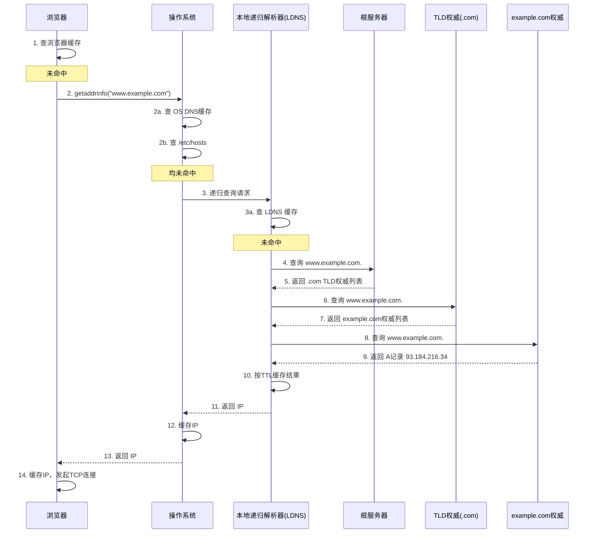
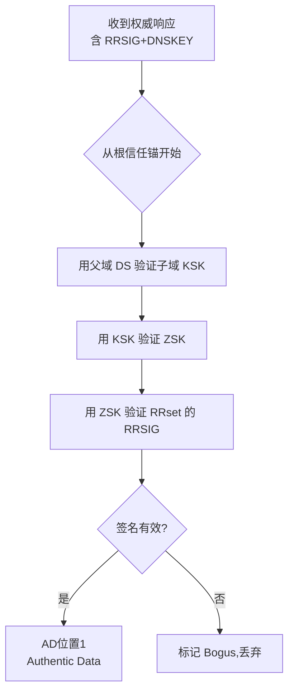
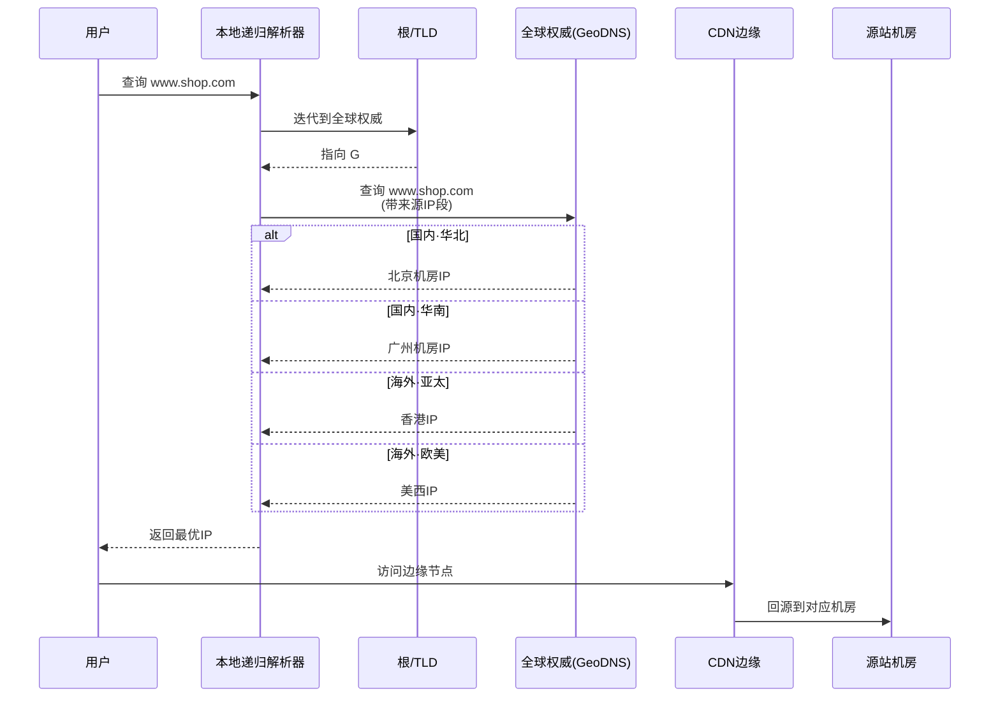

# DNS 域名解析

> **一句话定位**：DNS 是应用层基础，解析流程与缓存层次是高频考点，HTTPDNS 常作追问题。
> **面试热度**：⭐⭐⭐⭐
> **返回**：[网络知识图谱](../README.md)

---

## 一、概念定义

### 1.1 DNS 是什么

DNS（Domain Name System，域名系统）是一种**将人类易记的域名解析为机器可识别的 IP 地址**的分布式、层次化命名系统。它位于应用层（默认端口 53），但承载着几乎所有上层协议（HTTP/SMTP/FTP…）的寻址基础——一次 `https://www.example.com` 访问，真正的连接目标是 IP，而 DNS 就是"域名 → IP"的翻译官。

> **为什么需要 DNS？** IP 难记（IPv4 32 位、IPv6 128 位）、易变（服务器迁移、扩缩容），而域名稳定、可读、可语义化。DNS 把"稳定名称"与"易变地址"解耦，并通过分布式缓存将解析延迟压到毫秒级。

DNS 的三个本质特征：

- **分布式**：没有任何一台服务器承载全部域名记录，而是按层次划分管理权。
- **层次化**：域名空间是一棵倒置树，`www.example.com.` 实际是 `. → com → example → www` 的逐级授权。
- **缓存友好**：每级解析结果都带 TTL，允许中间节点缓存，把根/权威服务器的压力降到极低。

### 1.2 域名空间分层

DNS 的命名空间是一棵**倒置树**，根节点是 `.`（通常省略不写），向下逐级授权：

```
                    .(root)                    ← 根域，全球 13 组根服务器（a~m）
                  /       \
                com        org  ...            ← 顶级域 TLD（gTLD/ccTLD）
               /  \         |
          example  google   example.org       ← 二级域（权威服务器管理）
            /    \
         www     api                            ← 主机名 / 子域
```

**各级域名说明**：

| 层级 | 示例 | 管理方 | 服务器 |
|------|------|--------|--------|
| 根域 `.` | 通常省略 | ICANN / IANA | 13 组根服务器（a.root-servers.net ~ m.root-servers.net） |
| 顶级域 TLD | `.com` `.org` `.cn` `.dev` | 注册局（Verisign 管理 .com/.net） | TLD 权威服务器 |
| 二级域 | `example.com` | 注册人（通过注册商购买） | 域名所有人的权威服务器 |
| 三级/子域 | `www.example.com` `api.example.com` | 二级域持有人自行划分 | 同上或委托子域权威 |

**TLD 分类**：

- **gTLD（Generic TLD）**：通用顶级域，如 `.com` `.net` `.org` `.info` `.app` `.dev`。
- **ccTLD（Country Code TLD）**：国家/地区代码，如 `.cn`（中国）`.jp`（日本）`.us`（美国）`.hk`。
- **new gTLD**：2012 年 ICANN 开放后新增的 `.blog` `.shop` `.xyz` 等。
- **Infrastructure TLD**：`.arpa`，用于反向解析（IP → 域名）与基础设施。

### 1.3 DNS 服务器的四种角色

一次完整的解析涉及四类 DNS 服务器，职责不同、缓存策略不同：

| 角色 | 别名 | 职责 | 是否缓存 | 典型实现 |
|------|------|------|:--------:|---------|
| **根服务器** | Root | 返回 TLD 权威服务器地址 | ❌（仅返回指引） | 13 组任播集群 |
| **TLD 权威** | TLD Authority | 返回二级域权威服务器地址 | ❌ | Verisign、CNNIC 等 |
| **权威服务器** | Authoritative | 持有域名实际记录，返回最终 IP | ❌（权威数据，不缓存他人） | 自建 / 云厂商 DNS |
| **本地递归解析器** | Recursive Resolver / LDNS | 代客户端逐级查询，缓存结果 | ✅（按 TTL） | ISP、`8.8.8.8`、`1.1.1.1`、运营商 DNS |

> **权威 vs 递归的关键区别**：权威服务器是"记录的源头"，对自有域名的回答是 **Authoritative Answer（AA=1）**；递归解析器是"代客查询 + 缓存"的中介，其回答来自缓存或代查，AA=0。一次解析中，客户端只与递归解析器打交道，递归解析器再去串联根 → TLD → 权威。

### 1.4 资源记录类型

DNS 数据库中以"资源记录（Resource Record, RR）"为单位存储，每条 RR 含 `名称 / 类型 / TTL / 类 / 数据`。常见记录类型：

| 类型 | 全称 | 用途 | 数据示例 |
|------|------|------|---------|
| **A** | Address | 域名 → IPv4 地址 | `www.example.com. IN A 93.184.216.34` |
| **AAAA** | IPv6 Address | 域名 → IPv6 地址（4 个 A 因 IPv6 是 128 位） | `www.example.com. IN AAAA 2606:2800:220:1::68` |
| **CNAME** | Canonical Name | 别名 → 规范名（域到域映射） | `blog.example.com. IN CNAME example.github.io.` |
| **MX** | Mail Exchange | 邮件交换，指定收件服务器（带优先级） | `example.com. IN MX 10 mail.example.com.` |
| **TXT** | Text | 任意文本，常用于域名所有权校验、SPF/DKIM/DMARC | `"v=spf1 include:_spf.google.com ~all"` |
| **NS** | Name Server | 域名的权威服务器 | `example.com. IN NS ns1.example.com.` |
| **SOA** | Start of Authority | 区域起始记录，含主权威、管理员邮箱、序列号、刷新/重试/过期/最小 TTL | `example.com. IN SOA ns1.example.com. admin.example.com. 2026080701 7200 3600 1209600 3600` |
| **PTR** | Pointer | IP → 域名（反向解析） | `34.216.184.93.in-addr.arpa. IN PTR www.example.com.` |
| **SRV** | Service | 服务发现（协议+端口+主机） | `_sip._tcp.example.com. IN SRV 10 60 5060 sip.example.com.` |
| **CAA** | Certification Authority Authorization | 指定允许为本域名签发证书的 CA | `example.com. IN CAA 0 issue "letsencrypt.org"` |

**SOA 各字段含义**（面试常追问）：

- **MNAME**：主权威服务器（Master）。
- **RNAME**：管理员邮箱（用 `.` 代替 `@`，如 `admin.example.com.` = admin@example.com）。
- **Serial**：区域版本号，从服务器据此判断是否拉取更新（常用 `YYYYMMDDNN`）。
- **Refresh**：从服务器多久检查一次主服务器序列号。
- **Retry**：刷新失败后重试间隔。
- **Expire**：从服务器在多久联系不上主后，停止对外服务该区域。
- **Minimum（TTL）**：否定缓存的默认 TTL（RFC 2308 规定否定缓存用此值）。

> **CNAME 关键约束**：CNAME 不能与其他记录类型共存于同一名称（例如 `example.com` 既有 SOA/NS 又想设 CNAME 会冲突），且 CNAME 链长度有限制（建议不超过 5 跳）。根域 `example.com` 通常不能设 CNAME（因需有 SOA/NS），这是 ALIAS/ANAME 等伪 CNAME 方案的由来。

---

## 二、原理与流程

### 2.1 解析全流程

以浏览器访问 `https://www.example.com` 为例，DNS 解析会经历**客户端本地缓存链 → 递归解析器逐级代查**两大阶段：

**阶段一：客户端侧缓存链（命中即止）**

1. **浏览器 DNS 缓存**：Chrome 维护 host resolver cache，TTL 由记录本身决定（默认 60s~60min）。命中直接用。
2. **操作系统 DNS 缓存**：Linux 由 systemd-resolved / nscd 维护，Windows 有 `ipconfig /displaydns`。命中直接用。
3. **OS hosts 文件**：`/etc/hosts`（Linux）或 `C:\Windows\System32\drivers\etc\hosts`，优先级高于 DNS。常用于本地联调、屏蔽域名。

**阶段二：递归解析器逐级代查**

4. **本地递归解析器（LDNS）**：客户端配置的 DNS 服务器（如 DHCP 下发的运营商 DNS、`8.8.8.8`）。先查 LDNS 自身缓存，未命中则发起**递归查询**。
5. **查询根服务器**：LDNS 向根服务器查 `www.example.com.`。根返回 `.com` 的 TLD 权威服务器列表。
6. **查询 TLD 权威**：LDNS 向 `.com` TLD 权威查 `www.example.com`。TLD 返回 `example.com` 的权威服务器。
7. **查询权威服务器**：LDNS 向 `example.com` 权威查 `www` 记录。权威返回最终 A 记录。
8. **LDNS 缓存 + 返回客户端**：LDNS 按 TTL 缓存结果，返回给客户端。客户端 OS / 浏览器也各自缓存。

**完整时序图**：



> **递归查询 vs 迭代查询**：客户端→LDNS 是**递归查询**（"帮我查到底，结果给我"）；LDNS→根→TLD→权威 是**迭代查询**（"每次给我下一步线索，我自己再去问"）。LDNS 承担了串联三级的"跑腿"工作，客户端只与 LDNS 通信一次。

### 2.2 缓存层次与 TTL

DNS 缓存分多级，每级都按记录的 TTL 决定缓存时长：

| 缓存层 | 缓存主体 | 失效策略 | 备注 |
|--------|---------|---------|------|
| 浏览器 | Chrome host resolver | 按记录 TTL（默认 60s~60min） | 内存中，关闭浏览器清空 |
| OS | systemd-resolved / nscd / Windows DNS Client | 按记录 TTL | 进程重启或手动 flush |
| 路由器/家庭网关 | 部分家用路由器代理 DNS | 短 TTL | 部分路由不缓存 |
| 本地递归解析器 | ISP / 公共 DNS | 严格按 TTL | 否定缓存由 SOA minimum 控制 |
| 权威服务器 | — | 不缓存他人记录 | 是数据源头 |

**TTL 权衡**：

- **长 TTL**（如 86400s）：缓存命中率高、解析快、权威压力小，但**改记录生效慢**——旧 IP 可能被全网缓存一天。
- **短 TTL**（如 60s）：改记录秒级生效，但缓存命中率低、解析慢、权威压力大。
- **运维经验**：平时用长 TTL（1h~1d），需要切换前先调短 TTL（如 60s）让全网缓存过期，再执行切换，切换后稳定再调回长 TTL。这是**灰度切流 / 容灾切换**的标准姿势。

**否定缓存**：查询不存在的域名时，权威返回的 SOA 中 `Minimum TTL` 字段决定否定缓存时长（RFC 2308）。这避免了 NXDOMAIN 风暴打穿权威。

> **坑点**：调短 TTL 后，**必须等旧的 TTL 时间过去**，全网才会更新。例如原 TTL 3600s，改成 60s 后立即切换 IP，那些还持有旧记录（TTL 3600s）的解析器仍会返回旧 IP 一小时——因为它们根本不知道 TTL 已变。

### 2.3 负载均衡

DNS 天然支持"一个域名多个 A 记录"，从而实现**粗粒度负载均衡**：

**轮询（Round Robin）**：

```
www.example.com. IN A 1.1.1.1
www.example.com. IN A 2.2.2.2
www.example.com. IN A 3.3.3.3
```

权威服务器返回全部 IP，客户端/递归解析器按顺序轮询。优点简单；缺点是**不感知服务器负载与健康状态**、**客户端缓存导致分布不均**、**TCP 连接建立后才知故障**。

**智能 DNS（GeoDNS / View）**：

权威服务器根据**请求来源 IP 段**返回不同的 A 记录，实现按地理/运营商调度：

- 华北用户 → 北京机房 IP
- 华南用户 → 广州机房 IP
- 移动用户 → 移动机房 IP（避免跨网慢）
- 海外用户 → 香港节点

实现上依赖 DNS 软件的 view 功能（BIND 的 `view`、PowerDNS 的 geoip-backend、云厂商的线路解析）。

**权重 / 比例调度**：部分 DNS 服务支持对每条 A 记录设权重（如 80%/20%），实现灰度切流。

> **DNS 负载均衡的局限**：①粒度粗（DNS 层无后端健康感知，故障 IP 仍可能被返回，依赖客户端重试）；②客户端缓存延迟故障感知；③跨网调度依赖 IP 段库准确性。生产中常**与 LVS/Nginx 健康检查 + 4/7 层负载均衡配合**：DNS 做地理调度，LVS/Nginx 做后端细粒度分发。

### 2.4 DNSSEC

DNS 协议本身不验证数据真伪——中间人可以伪造 DNS 响应（DNS 欺骗）。**DNSSEC（DNS Security Extensions，RFC 4033-4035）** 通过**数字签名**为 DNS 数据提供**来源认证 + 完整性 + 否定存在证明**，但不加密内容。

**核心机制**：

- 每个区域生成一对密钥：**KSK（Key Signing Key）** 签 ZSK，**ZSK（Zone Signing Key）** 签 RRset。
- 每条 RRset 附带 **RRSIG**（签名）。
- 新增 **DNSKEY**（公钥）、**DS**（Delegation Signer，父域对子域 KSK 的哈希，构建信任链）、**NSEC/NSEC3**（否定存在证明，防伪造 NXDOMAIN）。
- 信任链从**根的信任锚**逐级向下：根 DNSKEY → 验证 `.com` DS → `.com` DNSKEY → 验证 `example.com` DS → … 直至目标域。

**验证流程（递归解析器侧）**：



> **DNSSEC 不加密**：它只保证"这确实是权威发出的、未被篡改的数据"，但查询/响应仍是明文。要防窃听需配合 DoH/DoT。DNSSEC 部署复杂（密钥轮转、签名膨胀），全球普及率约 30%，是根因之一。

### 2.5 DNS 劫持与污染

| 攻击类型 | 原理 | 触发点 | 典型表现 |
|---------|------|--------|---------|
| **DNS 劫持** | 控制权威/递归服务器，故意返回错误 IP | 权威 / 递归解析器 | 整个域名被指向错误站，常见于运营商广告、域名被查封 |
| **DNS 污染（投毒）** | 在真正响应到达前，伪造更快的假响应给递归解析器 | 递归解析器收包环节 | 特定域名返回错误 IP，可针对单个请求污染 |
| **中间人 MITM** | 监听并伪造 DNS 响应 | 网络链路 | 同上 |

**DNS 污染经典场景**：用户查询 `google.com`，GFW 在递归查询路径上抢先返回一个伪造的 A 记录（如某国内 IP），递归解析器先收到假响应并缓存，真正响应到达时被丢弃。

**HTTPDNS 的解法**：

传统 DNS 走 53/UDP，明文、易被劫持/污染。**HTTPDNS** 把 DNS 查询**封装在 HTTP 请求中**绕过运营商 DNS：

- 客户端直接 HTTP GET `https://dns.example.com/resolve?name=www.example.com&type=A`
- 服务端在云端解析，返回 JSON 结果
- 整个链路走 HTTPS，运营商无法劫持/污染
- 客户端拿到 IP 后，用 SNI/Host 头直连目标，不走系统 DNS

代表实现：阿里云 HTTPDNS、腾讯云 HTTPDNS、Cloudflare `1.1.1.1` API。是移动端 App 防劫持的主流方案。

### 2.6 DoH 与 DoT

为防止 DNS 查询被窃听/篡改，IETF 推出了两种**加密 DNS**方案：

| 方案 | 全称 | 端口 | 传输 | 典型实现 |
|------|------|:----:|------|---------|
| **DoT** | DNS over TLS（RFC 7858） | 853 | TLS 长连接承载 DNS 报文 | Unbound、Knot Resolver、运营商 |
| **DoH** | DNS over HTTPS（RFC 8484） | 443 | HTTP/2 + TLS 承载 DNS wireformat 或 JSON | Cloudflare 1.1.1.1、Google DoH、Firefox |

**DoT vs DoH**：

- **DoT** 独立端口 853，易被防火墙识别与封锁；适合运营商/企业部署。
- **DoH** 走 443，与普通 HTTPS 流量混在一起，**难以识别与封锁**；适合终端用户绕过审查。
- DoH 因绑定 HTTP/2 多路复用，更适合浏览器；DoT 更适合系统级 resolver。

**DoH 请求示例**：

```http
GET /dns-query?name=www.example.com&type=A HTTP/1.1
Accept: application/dns-json
Host: 1.1.1.1
```

响应：

```json
{"Status":0,"Answer":[{"name":"www.example.com.","type":1,"TTL":300,"data":"93.184.216.34"}]}
```

> **面试要点**：DoH/DoT 解决"链路被窃听/污染"，DNSSEC 解决"数据被篡改且查不出"，二者互补。HTTPDNS 是国内对抗运营商劫持的工程化方案，与 DoH 思路相近但非 IETF 标准。

---

## 三、高频追问与面试题

### Q1：一次浏览器输入 URL 到页面显示，DNS 经历了哪些步骤？

**参考答案**：分两阶段。

**客户端缓存链**（命中即止）：

1. **浏览器 DNS 缓存**（Chrome 自带 host resolver cache）；
2. **OS DNS 缓存**（systemd-resolved / nscd / Windows DNS Client）；
3. **`/etc/hosts` 文件**（优先级高于 DNS）。

**递归解析器代查**（前三步均未命中时）：

4. 客户端向配置的**本地递归解析器（LDNS）**发递归查询，LDNS 先查自身缓存；
5. 未命中则 LDNS 向**根服务器**查，根返回 `.com` TLD 权威列表（迭代指引）；
6. LDNS 向 **TLD 权威**查，返回 `example.com` 权威列表；
7. LDNS 向 **example.com 权威**查 `www`，拿到 A 记录；
8. LDNS 按 TTL 缓存结果，返回客户端；客户端 OS / 浏览器各自缓存；
9. 客户端拿到 IP，开始 TCP 三次握手 → TLS → HTTP。

**追问**：为什么客户端 → LDNS 是递归，LDNS → 根 → TLD → 权威是迭代？

> 递归意味着"代客查到底"，迭代意味着"只给下一步线索"。客户端只发一次请求给 LDNS 就等结果；LDNS 则要自己跑完根→TLD→权威三级，每级给它下一级地址，它再去问下一级。这样设计让客户端简单、让 LDNS 集中承担缓存与串联，便于规模化。

### Q2：为什么 DNS 用 UDP？什么时候用 TCP？

**参考答案**：DNS 默认走 **UDP 端口 53**，原因：

1. **查询/响应短小**：一次 A 查询报文通常 < 512B，UDP 无连接开销，省去 TCP 握手 RTT。
2. **请求-响应模型天然适配 UDP**：DNS 是一问一答，不需要 TCP 的流控/可靠重传——丢了重发即可，UDP 之上应用层自己做超时重查。
3. **高并发低开销**：根/权威服务器每秒处理千万级查询，UDP 无连接状态，内核与服务器压力远小于 TCP。

**切换 TCP 的两种情况**（RFC 1035 / 7766）：

- **响应超过 512B**：当 DNSSEC 或大量记录导致 UDP 报文超 512B（或 EDNS0 协商的 1232B），UDP 装不下 → 服务器返回 TC=1（Truncation），客户端改用 TCP 重查。
- **区域传送（AXFR/IXFR）**：从权威服务器拉取整个区域数据，量大且必须可靠 → 强制 TCP。
- **DoT/DoH**：加密 DNS 走 TCP（853）/ HTTP2（443）。

> **EDNS0（RFC 6891）** 通过 OPT 伪记录扩展 UDP 容量（默认 4096B），减少回退 TCP 的频次，是现代 DNS 性能优化的关键。

**追问**：UDP 不可靠，DNS 查询丢了怎么办？

> 应用层超时重查：客户端/递归解析器设短超时（1~3s），未收到响应就重发，多次失败切换备用 DNS 或报错。DNS 设计上接受了"偶尔丢包重发"，用 UDP 换低延迟高吞吐，是经典"简单可靠"取舍。

### Q3：DNS 劫持和污染的区别？HTTPDNS 怎么解决？

**参考答案**：

- **DNS 劫持**：控制了**权威或递归服务器**本身，故意返回错误结果。例如运营商把 NXDOMAIN 改成广告页 IP，或域名被行政下线。
- **DNS 污染（投毒）**：权威与递归服务器本身正常，但**网络链路上**有人抢先伪造更快的假响应给递归解析器，递归先收到假响应并缓存，真响应被丢弃。GFW 的 DNS 污染是典型。

二者本质：劫持是"服务器说谎"，污染是"链路上抢先说谎"。

**HTTPDNS 解决思路**：

1. **绕开 53 端口与运营商 DNS**：客户端不向系统 DNS 发请求，而是直接 HTTPS 请求 `https://dns.example.com/resolve?name=...`，走 443 端口、TLS 加密。
2. **云端解析**：HTTPDNS 服务端在云端用受控的递归解析链路拿到真实 IP，返回 JSON。
3. **运营商无法劫持/污染**：整个链路是 HTTPS 加密，看不见也改不动；即使运营商劫持 53，HTTPDNS 根本不走 53。
4. **客户端缓存 + 预解析**：SDK 缓存 IP 并定期刷新，避免每次请求都走 HTTPDNS。
5. **SNI/Host 直连**：拿到 IP 后，客户端用 IP 建连 + Host 头/SNI 标识目标域名，绕过系统 DNS。

**追问**：HTTPDNS 与 DoH/DoT 的关系？

> 都是"加密 DNS 绕过运营商劫持"的思路。DoH/DoT 是 IETF 标准，把 DNS wireformat 套在 TLS/HTTP2 里，适合浏览器/系统级 resolver；HTTPDNS 是国内厂商工程化方案，用普通 HTTP/JSON 接口，适合移动 App SDK 集成，且常附带调度、容灾等增值能力。技术上 DoH 是 HTTPDNS 的标准化版本，二者可互相替代。

### Q4：DNSSEC 的原理？为什么普及率不高？

**参考答案**：DNSSEC 通过**数字签名**为 DNS 数据提供来源认证 + 完整性 + 否定存在证明，不加密内容。

- 每个区域生成 KSK（签 ZSK）与 ZSK（签 RRset），RRset 附带 RRSIG 签名。
- 父域用 DS 记录对子域 KSK 哈希签名，形成**从根信任锚到目标域的信任链**。
- 递归解析器收到响应后，沿信任链逐级验证 RRSIG，验证通过设 AD=1。
- NSEC/NSEC3 提供否定存在证明，防止伪造 NXDOMAIN。

**普及率不高的原因**：

1. **部署复杂**：密钥生成、轮转、DS 上传到父域流程繁琐，运维门槛高。
2. **签名膨胀**：每条 RRset 加 RRSIG，DNSSEC 响应常超 512B，需要 EDNS0 或回退 TCP，性能下降。
3. **递归侧验证可选**：很多递归解析器默认不验证 DNSSEC（仅 forward），终端无感知。
4. **收益非直接**：DNSSEC 防篡改但不加密，运营商仍可看查询内容，且不能直接防劫持（如果运营商控制了递归解析器，DNSSEC 会让查询失败而非返回假数据，影响可用性）。
5. **错误配置风险**：密钥过期或 DS 不同步会导致整个域无法解析，事故代价大。

全球根签名始于 2010 年，至今顶级域签名率约 90%，但二级域签名率仅 ~30%。

**追问**：DNSSEC 验证失败时怎么处理？

> 递归解析器若开启 DNSSEC 验证（`dnssec-validation yes`），验证失败会返回 SERVFAIL，客户端拿不到 IP → 域名"无法解析"。这是一种"宁可不可用也不返回假数据"的 fail-closed 设计，但也是运营商担心 DNSSEC 的原因（配置错误会让域名大面积不可达）。

### Q5：CNAME 和 A 记录的区别？为什么根域不能设 CNAME？

**参考答案**：

| 维度 | A 记录 | CNAME 记录 |
|------|--------|-----------|
| 数据 | 域名 → IPv4 | 域名 → 规范域名 |
| 跳数 | 一步到位 | 需再查规范名的 A 记录 |
| 共存 | 可与多 A 共存 | 同名下不能与其他记录类型共存 |
| 用途 | 直连 IP | 别名映射、CDN 接入、托管迁移 |

**典型 CNAME 场景**：把 `blog.example.com` 指向 `example.github.io`，由 GitHub 的权威再返回真实 IP。优点是 GitHub 改 IP 时不用动你的 DNS；缺点是多一跳解析。

**根域不能设 CNAME 的原因**：

`example.com` 作为区域根，必须存在 **SOA + NS** 记录（标识区域的起点与权威服务器）。而 CNAME 的 RFC 规定：**CNAME 不能与任何其他记录类型共存于同一名称**。因此 `example.com` 既有 SOA/NS 又想设 CNAME 会冲突，导致解析行为未定义或被忽略。

**解决方案**：

- 历史方案：在根域直接设 A 记录（多 IP 轮询）。
- 现代方案：使用 **ANAME / ALIAS**（部分 DNS 厂商提供的"扁平 CNAME"，服务端解析 CNAME 目标并把 A 记录返回客户端，对客户端透明）。

**追问**：CNAME 链能不能无限套娃？

> 不建议。RFC 建议不超过 5 跳，超过会被解析器视为环路丢弃。CNAME 链每跳增加一次解析往返，影响延迟。优化做法是权威服务器在返回 CNAME 时把目标 A 记录一起返回（额外段），客户端可省一跳。

### Q6：为什么根服务器只有 13 组 IP？

**参考答案**：根服务器的"13"是**IPv4 地址数**，不是物理机器数。原因来自 DNS 早期协议约束：

- DNS 未扩展（EDNS0 前）UDP 响应最大 512B。
- 根服务器响应要列出所有根服务器 NS 记录及其 A 记录。
- 每个 NS + A 约 36B，13 组 × 36B ≈ 468B，再加分隔与头部已接近 512B 上限。
- 早期为保证 UDP 不分片，把根服务器数量定在 13。

**关键澄清**：

- 这是 **13 个 IP/标签**（a~m），背后是**数百台物理服务器**通过 **Anycast（任播）** 共享同一 IP——全球部署，就近响应。
- IPv6 没有这个限制，根服务器有大量 IPv6 地址。
- B 根等部分根还部署了本地镜像，实际物理节点远超 13。

**追问**：Anycast 是怎么做到"全球同一个 IP 就近响应"的？

> Anycast 借助 BGP：多个节点宣告同一 IP 段，BGP 路由按最短路径把请求送到最近的宣告节点。请求到达哪个节点由网络层路由决定，应用层透明。CDN、根 DNS、公共 DNS（8.8.8.8/1.1.1.1）都用 Anycast 实现全球加速与容灾。

### Q7：dig +trace 的输出分几段？分别对应解析的哪些环节？

**参考答案**：`dig +trace www.example.com` 模拟递归解析器逐级查询，输出三段：

1. **根段**：先查根（从内置根 hint），根返回 `.com` 的 TLD 权威 NS + A 记录列表。
2. **TLD 段**：向 `.com` TLD 查，返回 `example.com` 的权威 NS + 胶水记录（glue record）。
3. **权威段**：向 `example.com` 权威查 `www`，返回最终 A 记录。

每段对应解析流程的一级。`+trace` 是排查"DNS 解析到哪一级出问题"的利器：根段异常 → 根/网络问题；TLD 段异常 → 注册局问题；权威段异常 → 域名所有人的权威服务器问题。

**追问**：什么是 glue record（胶水记录）？为什么需要？

> 当父域返回子域的 NS 时，子域权威服务器的名称往往在子域自己下面（如 `example.com` 的 NS 是 `ns1.example.com`），这就形成"要查 example.com 必须先问 ns1.example.com，而 ns1 的 IP 又得查 example.com"的循环。glue record 是父域在 NS 响应的额外段里**附带给出子域 NS 的 A 记录**，打破循环。

---

## 四、实战与 Java 生态关联

### 4.1 dig / nslookup / host 命令

**dig**（最常用，输出结构化）：

```bash
# 基础查询（默认 A 记录）
dig www.example.com

# 指定记录类型
dig example.com MX
dig example.com NS
dig example.com SOA
dig example.com TXT

# 指定解析器（默认走 /etc/resolv.conf）
dig @8.8.8.8 www.example.com

# 模拟递归解析全流程（排查哪一级出问题）
dig +trace www.example.com

# 只看答案段（+short 简洁输出）
dig +short www.example.com

# 查 DNSSEC（+dnssec 显示 RRSIG/DNSKEY）
dig +dnssec www.example.com

# 反向解析
dig -x 93.184.216.34

# 查指定权威服务器（绕过递归）
dig @ns1.example.com www.example.com
```

**nslookup**（跨平台，交互式）：

```bash
nslookup www.example.com
nslookup -type=mx example.com 8.8.8.8
nslookup -type=ns example.com
```

**host**（最简洁，适合脚本）：

```bash
host www.example.com              # 返回 IP
host -t MX example.com            # 查 MX
host -t NS example.com            # 查 NS
```

> **排查思路**：①`dig +short` 验证解析结果；②`dig +trace` 看哪一级断了；③`dig @权威 IP` 直接问权威，绕过递归缓存；④`dig +dnssec` 看 RRSIG 验证 DNSSEC。

### 4.2 Java InetAddress 解析

JDK 通过 `java.net.InetAddress` 完成域名解析：

```java
import java.net.InetAddress;
import java.net.UnknownHostException;

public class DnsDemo {
    public static void main(String[] args) throws UnknownHostException {
        // 正向解析：域名 → IP（阻塞调用）
        InetAddress[] addrs = InetAddress.getAllByName("www.example.com");
        for (InetAddress addr : addrs) {
            System.out.println(addr.getHostAddress());  // 93.184.216.34
        }

        // 单个 IP（取第一个）
        InetAddress one = InetAddress.getByName("www.example.com");

        // 反向解析：IP → 域名
        InetAddress reverse = InetAddress.getByName("93.184.216.34");
        System.out.println(reverse.getHostName());      // www.example.com（可能返回反向记录）

        // 测试可达性（ICMP，受系统权限影响）
        boolean reachable = one.isReachable(3000);       // 3s 超时
    }
}
```

**JVM  DNS 缓存与 TTL**：

JVM 默认会缓存 DNS 解析结果，由 `networkaddress.cache.ttl` 控制（`$JAVA_HOME/lib/security/java.security` 或系统属性 `-Dsun.net.inetaddr.ttl=...`）：

| 参数 | 含义 | 默认值 |
|------|------|--------|
| `networkaddress.cache.ttl` | 成功解析的缓存秒数 | 有 SecurityManager 时 30s，否则由系统 |
| `-Dnetworkaddress.cache.ttl=60` | 缓存 60s | — |
| `networkaddress.cache.negative.ttl` | 失败解析的缓存秒数 | 10s |
| `-Dnetworkaddress.cache.negative.ttl=0` | 不缓存失败 | — |

> **生产坑点**：JVM DNS 缓存若设为永久（`-1` 或历史默认 30s 在无 SecurityManager 时），切机后仍可能持有旧 IP。常见做法：①设 `networkaddress.cache.ttl=10~60` 让缓存秒级过期；②接入 HTTPDNS SDK，自己控缓存与刷新；③配合 Spring 的 `RestTemplate` / `okhttp` 自定义 DNS 解析器。

**自定义 DNS 解析器（okhttp 示例）**：

```java
import okhttp3.OkHttpClient;
import okhttp3.Dns;
import java.net.InetAddress;
import java.net.UnknownHostException;
import java.util.Arrays;
import java.util.List;
import java.util.concurrent.ConcurrentHashMap;

public class HttpDns implements Dns {
    private final ConcurrentHashMap<String, List<InetAddress>> cache = new ConcurrentHashMap<>();

    @Override
    public List<InetAddress> lookup(String hostname) throws UnknownHostException {
        // 先查本地缓存
        List<InetAddress> cached = cache.get(hostname);
        if (cached != null) return cached;
        // 调 HTTPDNS 接口拿到 IP（伪代码）
        String ip = HttpDnsClient.resolve(hostname);
        InetAddress addr = InetAddress.getByName(ip);
        cache.put(hostname, Arrays.asList(addr));
        return Arrays.asList(addr);
    }

    public static void main(String[] args) {
        OkHttpClient client = new OkHttpClient.Builder()
            .dns(new HttpDns())                       // 替换默认 DNS 行为
            .build();
        // ...
    }
}
```

### 4.3 HTTPDNS SDK 接入

移动 App 防运营商 DNS 劫持的主流方案，国内阿里云/腾讯云均提供 SDK。典型接入：

```java
// 阿里云 HTTPDNS SDK 示例（伪代码）
import com.aliyun.httpdns.HttpDnsService;

HttpDnsService httpdns = HttpDnsService.getInstance(
    context, "yourAccountId");
httpdns.setCachedIPEnable(true);              // 启用本地缓存
httpdns.setPreResolveAfterNetworkChanged(true);  // 网络变化后预解析

// 同步获取 IP（命中缓存秒级返回，否则走 HTTPS）
String ip = httpdns.getIpByHostAsync("www.example.com");
// 拿到 IP 后用 SNI/Host 直连
HttpsURLConnection conn = (HttpsURLConnection)
    new URL("https://" + ip + "/api/...").openConnection();
conn.setRequestProperty("Host", "www.example.com");
// TLS 握手时指定 SNI
conn.setSSLSocketFactory(new SNISocketFactory("www.example.com"));
```

**关键设计要点**：

- **本地缓存 + TTL**：SDK 持久化缓存 IP，按 TTL 刷新，避免每次请求走 HTTPDNS。
- **预解析**：App 启动或网络变化时批量预解析关键域名，降低首屏延迟。
- **容灾降级**：HTTPDNS 失败时回退系统 DNS，保证可用性。
- **SNI/Host 直连**：拿到的 IP 必须配 `Host` 头与 SNI，否则目标服务器无法识别虚拟主机（多域名共享 IP）。

### 4.4 本地 hosts 与 DNS 缓存排查

```bash
# Linux：查看 /etc/hosts
cat /etc/hosts

# Linux：查看 systemd-resolved 缓存状态
systemd-resolve --statistics

# Linux：刷新 DNS 缓存（systemd-resolved）
systemd-resolve --flush-caches

# Windows：查看 DNS 缓存
ipconfig /displaydns

# Windows：刷新 DNS 缓存
ipconfig /flushdns

# Chrome：浏览器 DNS 缓存
# 访问 chrome://net-internals/#dns
```

> **联调技巧**：把测试环境域名写入 `/etc/hosts` 指向测试 IP，绕过 DNS，是本地联调的常用姿势。注意 hosts 不支持通配符（`*.example.com` 无效），需逐条写。

---

## 五、系统设计案例

### 5.1 设计一个全球 DNS 调度方案

**需求**：一家全球电商，服务部署在中国（北京/广州）、海外（香港/新加坡/美西）多机房，需要：

- 用户就近接入最近机房，降低延迟；
- 移动/电信/联通跨网优化（国内跨网慢）；
- 机房故障时秒级切换，DNS 不成为瓶颈；
- 海外用户不被国内 GFW 影响。

**整体方案**：



**关键设计决策**：

1. **智能 DNS（GeoDNS）做地理调度**：
   - 全球权威按请求来源 IP 段返回不同 A 记录；
   - 国内按省份/运营商细分（南电信/北联通/移动专线）；
   - 海外按大区（亚太/北美/欧洲）划分；
   - 用短 TTL（30~60s）保证故障切换快速生效。

2. **CDN 边缘节点作为入口**：
   - 静态资源（图片/JS/CSS）走 CDN，边缘缓存就近返回；
   - 动态接口回源到机房，CDN 做 4 层入口转发（Anycast）；
   - CDN 节点故障由 CDN 厂商内部调度，对上层 DNS 透明。

3. **多线路（多 IP）容灾**：
   - 权威服务器本身做 Anycast + 多机房部署，单点故障由 BGP 切换；
   - 每个机房返回多个 IP（主 + 备），客户端 SDK/浏览器自动重试；
   - 关键域名配 LVS/Nginx 健康检查，故障 IP 由 4 层 LB 摘除。

4. **灰度切流与容灾切换**：
   - 平时 TTL 设长（如 300s）保证缓存命中；
   - 切换前 5 分钟先调短 TTL 至 30s，等全网旧缓存过期；
   - 切换时调整 GeoDNS 权重：北京 90%→50%→0%，广州 10%→50%→100%；
   - 切换后稳定，TTL 调回长值。

5. **海外防 GFW**：
   - 海外用户走海外权威（如 AWS Route53、Cloudflare），不经过国内 DNS 链路；
   - 海外域名可独立子域 `www.shop.com` 与国内 `www.shop.cn` 分离管理；
   - 国内用户访问海外域名仍可能被污染，必要时国内用户走 HTTPDNS。

6. **HTTPDNS 作为移动端补充**：
   - App 内嵌 HTTPDNS SDK，绕过运营商 DNS 防劫持/污染；
   - SDK 自带缓存 + 预解析 + 容灾回退，保证首屏速度与可用性；
   - Web 端走 DoH（如 Cloudflare 1.1.1.1）作为加密 DNS 兜底。

**容量与延迟评估**：

- 假设日活 1 亿次访问、平均域名解析 1 次/会话 → 日解析 1 亿次、峰值 QPS ~10k；
- 权威服务器 Anycast 集群 + 多线路，单机 10w QPS，4 台冗余即可扛住；
- CDN 边缘缓存 95% 流量，回源 QPS < 1k；
- 智能调度依赖 IP 段库准确性（GeoIP 库定期更新，覆盖率 ~95%）；
- 故障切换：TTL 30s + 客户端重试，实际生效 < 1 分钟。

**Java 生态落地**：

- 权威 DNS：自建 BIND/PowerDNS + GeoIP 模块，或用阿里云 DNS / AWS Route53 / Cloudflare DNS；
- 健康检查：Spring Boot Actuator + Prometheus + Alertmanager，故障自动触发切流脚本；
- HTTPDNS SDK：阿里云/腾讯云 HTTPDNS SDK，集成进 App；
- 服务发现：Nacos / Consul 注册服务实例，DNS 作为入口层调度，4/7 层 LB 做细粒度分发。

> **面试加分点**：①强调 DNS 调度粒度粗、需要 LB/健康检查配合；②讲清"调短 TTL → 等过期 → 切换 → 调回"的灰度切流姿势；③海外防 GFW 用独立权威 + HTTPDNS；④容灾切换要算上客户端缓存延迟，TTL 是切换速度的下限。

---

## 六、参考与延伸

- RFC 1034/1035（DNS 基础协议）、RFC 6891（EDNS0）、RFC 4033-4035（DNSSEC）
- RFC 7858（DoT）、RFC 8484（DoH）、RFC 2308（否定缓存）
- RFC 7766（DNS over TCP）、RFC 8499（DNS 术语）
- 延伸阅读：[HTTP 协议全解](./http.md)、[HTTPS 与 TLS](./https-tls.md)、[TCP 连接](../02-transport/tcp-connection.md)
- 仓库内关联：`framework/spring-framework`（服务间调用与 DNS）、`algorithm`（DNS 解析复杂度讨论）

> **返回**：[网络知识图谱](../README.md)
