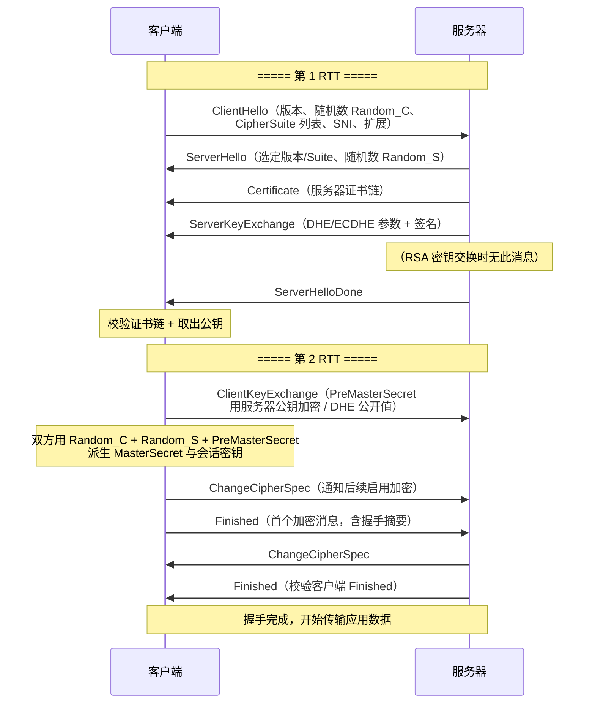
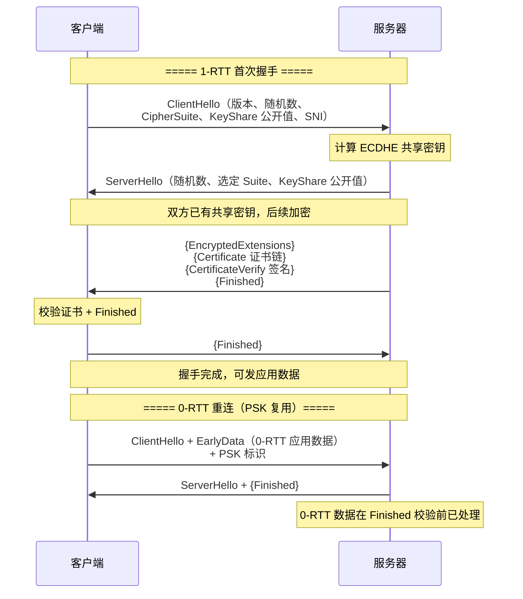
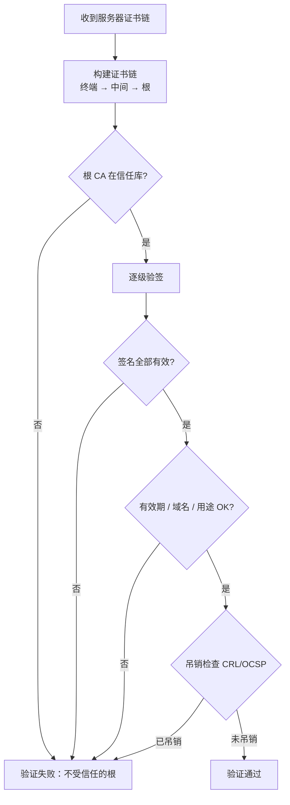
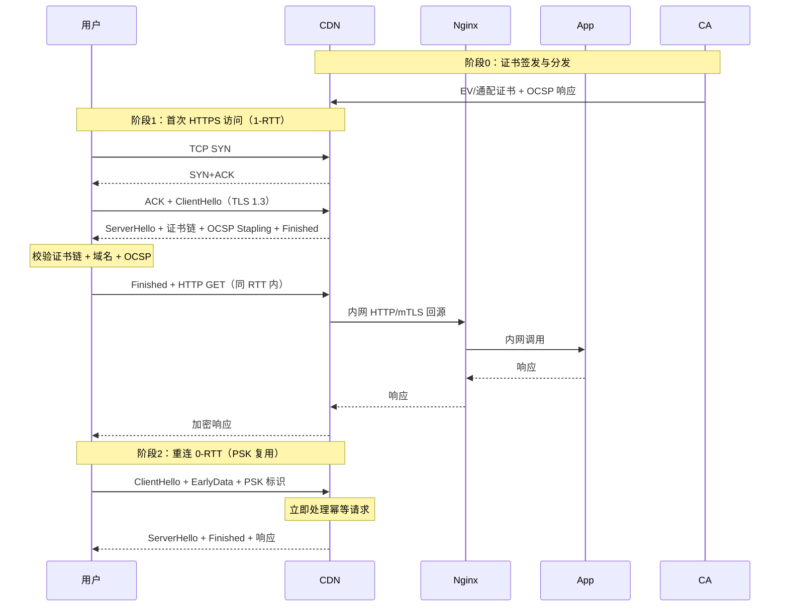

# HTTPS 与 TLS

> **一句话定位**：TLS 握手与证书链是中高级后端面试的分水岭，能讲清 1.2 vs 1.3 差异加分明显。
> **面试热度**：⭐⭐⭐⭐⭐
> **返回**：[网络知识图谱](../README.md)

---

## 一、概念定义

### 1.1 TLS 在协议栈的位置

TLS（Transport Layer Security，传输层安全）是一种**为端到端通信提供机密性、完整性与身份认证**的安全协议。它在协议栈中位于**应用层与传输层之间**，对应用层数据做"加密包装"，对下层 TCP 透明：

```
┌──────────────────────────┐
│  应用层（HTTP/SMTP/...）  │   ← 业务报文明文
├──────────────────────────┤
│  TLS（安全层）            │   ← 加密 / 完整性 / 认证
├──────────────────────────┤
│  传输层（TCP）            │   ← 可靠字节流
├──────────────────────────┤
│  网络层（IP）             │
└──────────────────────────┘
```

**HTTPS = HTTP + TLS**：客户端先与服务器完成 TLS 握手建立加密通道，再在通道内发送 HTTP 报文。HTTPS 默认端口 443。TLS 前身是 SSL（Secure Sockets Layer），SSL 3.0 之后由 IETF 接管并更名为 TLS（TLS 1.0 ≈ SSL 3.1）。当前主流版本为 **TLS 1.2（RFC 5246，2008）** 与 **TLS 1.3（RFC 8446，2018）**。

### 1.2 三种加密原语

| 原语 | 特点 | TLS 中的角色 |
|------|------|-------------|
| 对称加密（AES/ChaCha20） | 加解密同一密钥，速度快，适合大块数据 | **记录层**加密应用数据 |
| 非对称加密（RSA/ECDSA） | 公钥加密/私钥解密（或反过来），速度慢 | **握手层**做密钥交换与签名认证 |
| 哈希/ MAC（SHA-256/HMAC） | 单向、定长输出、抗碰撞 | **完整性**校验与 PRF 派生密钥 |

> **为什么不只用对称加密？** 对称加密的前提是双方共享同一密钥，但客户端与服务器首次通信无法安全交换密钥（任何明文传输的密钥都会被窃听）。非对称加密解决了"首次密钥交换"难题，但其计算开销远高于对称（约 1000 倍），不适合加密大流量。因此 TLS 采用**混合加密**：握手阶段用非对称协商出对称密钥，记录阶段用对称加密数据。

### 1.3 CA 的"为什么"

**为什么需要 CA（证书颁发机构）？**

仅有非对称加密还不够：客户端拿到公钥 `Pub_s` 后，必须确认这个公钥**确实属于服务器**而非中间人伪造的。若无可信第三方背书，中间人可在握手时把自己的公钥发给客户端，冒充服务器与客户端建立连接，同时与真服务器另建连接，形成**中间人攻击（MITM）**。

CA 的作用就是用**自己的私钥**对服务器的公钥与身份信息做签名，生成**数字证书**。客户端预置（操作系统/浏览器内置）CA 的根证书（含 CA 公钥），用 CA 公钥验签即可确认服务器证书的真实性。这一信任链是 HTTPS 安全的基石。

- **根 CA（Root CA）**：自签名证书，预置于操作系统/浏览器信任库。
- **中间 CA（Intermediate CA）**：根 CA 不直接签发终端证书（降低根私钥泄露风险），而是签发中间 CA，由中间 CA 签发终端证书，形成**证书链**。
- **终端证书（End-Entity / Leaf Certificate）**：服务器实际使用的证书，绑定域名与公钥。

> **核心信任模型**：客户端信任根 CA → 根 CA 担保中间 CA → 中间 CA 担保终端证书 → 终端证书含服务器公钥。这是一条**自上而下**的信任链。

---

## 二、原理与流程

### 2.1 TLS 1.2 全握手流程

TLS 1.2 的完整握手（Full Handshake）需 **2 个 RTT**（不含 TCP 握手）完成，流程如下：



**关键消息解释**：

1. **ClientHello**：客户端发送支持的 TLS 版本、加密套件列表、客户端随机数（`Random_C`，32 字节）、SNI（要访问的域名，用于服务器选择对应证书）、扩展（如签名算法、曲线选择等）。
2. **ServerHello**：服务器选定一个加密套件、返回服务器随机数（`Random_S`，32 字节）、会话 ID（用于 Session 复用）。
3. **Certificate**：服务器发送证书链（终端证书 + 中间 CA 证书，通常不含根 CA）。
4. **ServerKeyExchange**：仅 DHE/ECDHE 算法需要，发送 Diffie-Hellman 参数并用服务器私钥签名（防篡改）。RSA 密钥交换不需要此消息。
5. **ClientKeyExchange**：客户端生成 `PreMasterSecret`（48 字节随机）。
   - **RSA 模式**：用服务器证书中的 RSA 公钥加密 `PreMasterSecret` 后发送；
   - **DHE/ECDHE 模式**：发送客户端的 DH 公开值，双方各自计算出 `PreMasterSecret`。
6. **密钥派生**：双方用 `Random_C + Random_S + PreMasterSecret` 通过 PRF（TLS 1.2 用 HMAC-SHA256）派生出 `MasterSecret`，再派生出一组对称密钥（客户端写密钥、服务器写密钥、MAC 密钥、IV）。
7. **ChangeCipherSpec**：通知对端"从下一条消息起启用加密"。
8. **Finished**：握手阶段第一条加密消息，内容是整个握手消息的摘要（用 MasterSecret 与特定标签计算），双方校验 Finished 一致，确保握手过程未被篡改（**握手防篡改的关键**）。

> **为什么需要 2 RTT？** 第 1 RTT 协商参数与交换密钥素材，第 2 RTT 用 Finished 互相确认握手完整性。客户端的 Finished 必须等密钥派生完成后才能发出，无法与服务器 Finished 合并，故多一轮往返。

### 2.2 TLS 1.3 简化握手

TLS 1.3 对握手做了大幅精简，**首次连接 1-RTT，重连可 0-RTT**。核心改动：

- **合并握手**：ServerHello 之后服务器直接发出密钥交换参数与 Finished，客户端回一条 Finished 即完成。将密钥交换提前到 ServerHello 阶段。
- **移除 RSA 密钥交换**：只保留 (EC)DHE / PSK，**强制前向保密**（PFS）。
- **移除 ChangeCipherSpec**：密钥切换隐含在消息中（1.3 仍保留 CCS 作为兼容性记录层信号，但非必需）。
- **移除压缩、静态 DH、CBC 等弱机制**，加密套件大幅精简。



**1-RTT 与 0-RTT 说明**：

- **1-RTT**：ClientHello 与 ServerHello 之后双方即可派生密钥，服务器把证书与 Finished 一起发出，客户端校验后回 Finished，共一轮往返完成。
- **0-RTT**：重连场景下，客户端用之前会话的 PSK（Pre-Shared Key）在 ClientHello 中直接携带 EarlyData（应用数据），服务器在还没完成完整握手时就处理该数据。**风险**：0-RTT 数据不抗重放（攻击者可重放 EarlyData），因此只适合幂等请求（如 GET），不可用于写操作。

### 2.3 TLS 1.2 vs 1.3 对比

| 维度 | TLS 1.2 | TLS 1.3 |
|------|---------|---------|
| 首次握手 RTT | 2-RTT（含 TCP 共 3-RTT） | 1-RTT（含 TCP 共 2-RTT） |
| 重连握手 | Session ID/Ticket 复用 1-RTT | PSK 复用 0-RTT |
| 密钥交换 | RSA / DHE / ECDHE | 仅 (EC)DHE / PSK（移除 RSA） |
| 前向保密 | 可选（RSA 模式无 PFS） | **强制**（所有握手 PFS） |
| 加密套件数量 | 上百种（含弱算法） | 精简为 5 个核心套件 |
| 对称算法 | CBC / GCM / ChaCha20 等 | 仅 AEAD（GCM / ChaCha20-Poly1305） |
| 哈希/MAC | HMAC-SHA256 + 独立 MAC | 合并进 AEAD（无独立 MAC） |
| 静态 RSA | 支持 | 移除 |
| 压缩 | 支持（已不安全） | 移除 |
| 重协商 | 支持 | 移除 |
| 0-RTT | 不支持 | 支持（仅 PSK 复用） |
| Finished 消息 | 2 条（CCS 分隔） | 合并进加密记录 |
| PRF | HMAC-SHA256 两轮 | HKDF（基于 HMAC） |

### 2.4 证书链验证

客户端验证服务器证书的完整流程：

1. **链构建**：终端证书 → 中间 CA 证书 → 根 CA 证书。终端证书的 Issuer 指向中间 CA，中间 CA 的 Issuer 指向根 CA，根 CA 自签。
2. **签名验证**：用上级 CA 的公钥验证下级证书的签名，逐级向上直到根 CA。
3. **根 CA 校验**：根 CA 证书必须存在于客户端的**信任库**（操作系统或浏览器内置的根证书集合）。
4. **有效期校验**：`notBefore ≤ 当前时间 ≤ notAfter`。
5. **域名匹配**：证书的 `Subject Alternative Name (SAN)` 字段须包含请求的域名（SNI）。旧版 `CommonName (CN)` 已废弃。
6. **用途校验**：证书的 `KeyUsage` / `ExtendedKeyUsage` 需含 `serverAuth`。
7. **吊销状态校验**：通过 CRL 或 OCSP 检查证书是否被吊销。



**根 CA 从哪来？** 操作系统（Windows / macOS / Linux）与浏览器（Firefox 自带根库）内置了由各自维护的**根证书信任库**，包含上百个受信任根 CA（如 DigiCert、Let's Encrypt 的 ISRG Root X1 等）。这些根证书随系统更新而更新。客户端只信任链能延伸到信任库中根 CA 的证书链。

### 2.5 吊销机制：CRL / OCSP / OCSP Stapling

| 机制 | 全称 | 工作方式 | 优缺点 |
|------|------|---------|--------|
| CRL | Certificate Revocation List | CA 定期发布被吊销证书的列表，客户端下载并查询 | 列表大、更新不及时、增加客户端延迟 |
| OCSP | Online Certificate Status Protocol | 客户端实时向 CA 的 OCSP 服务器查询证书状态 | 实时性好，但暴露用户访问域名给 CA，且增加额外往返 |
| OCSP Stapling | — | 服务器在握手时主动附带 CA 签发的 OCSP 响应给客户端 | 解决隐私与延迟，是主流推荐方案 |

> **实践要点**：生产环境 Nginx 应开启 `ssl_stapling on`，让服务器缓存 OCSP 响应在握手时返回，避免客户端单独请求 OCSP，既保护隐私又降低延迟。

### 2.6 密钥交换算法

| 算法 | 密钥交换方式 | 前向保密 | 说明 |
|------|-------------|:--------:|------|
| RSA | 客户端生成 PreMasterSecret，用服务器 RSA 公钥加密发送 | ❌ | 服务器私钥泄露则历史会话可解密；TLS 1.3 移除 |
| DHE | 双方交换 DH 公开值，各自计算共享密钥 | ✅ | 离散对数难解；每次握手临时 DH 参数，私钥泄露不影响历史会话 |
| ECDHE | DHE 的椭圆曲线版本，同等安全强度下密钥更短 | ✅ | TLS 1.2/1.3 主流，性能优于 DHE |
| PSK | 双方预共享密钥 | ❌（纯 PSK） | TLS 1.3 用于 0-RTT；需配合 ECDHE 才有 PFS（即 PSK-DHE） |

**前向保密（Forward Secrecy）原理**：使用临时 Diffie-Hellman 密钥交换时，每次握手的对称密钥由双方的**临时 DH 私钥**派生，这些私钥用完即弃、不落盘。即使服务器长期私钥（用于证书签名）日后泄露，攻击者也无法解密历史录制的密文——因为缺少当时握手的 DH 临时私钥。这就是"前向"保密：保护的是**过去**的会话。

> **没有前向保密的后果**：RSA 密钥交换下，会话密钥 = f(PreMasterSecret, Randoms)，PreMasterSecret 用服务器公钥加密。一旦服务器私钥泄露，攻击者可解密所有录制流量中的 PreMasterSecret，进而还原全部历史会话密钥。这就是 Heartbleed / 私钥泄露事件后业界全面转向 ECDHE 的根本原因。

### 2.7 Session 复用

为降低完整握手的 RTT 与计算开销，TLS 支持 Session 复用：

| 机制 | TLS 版本 | 原理 | 特点 |
|------|---------|------|------|
| Session ID | 1.2 | 服务器在 ServerHello 返回 session_id，客户端重连时带上，服务器查缓存恢复 | 服务器需缓存会话状态，水平扩展难（需共享 Session 缓存） |
| Session Ticket | 1.2/1.3 | 服务器用票据密钥加密会话状态发给客户端，客户端重连时回带票据 | 无服务器侧状态（stateless），扩展性好；票据密钥泄露则历史会话可解密 |
| PSK | 1.3 | 基于 Ticket 或外部预共享密钥派生，支持 0-RTT | 可携带 EarlyData，但不抗重放 |

> **Session ID vs Session Ticket**：ID 是"服务器记着客户端"，Ticket 是"客户端记着服务器加密的状态"。Ticket 解除了服务器侧状态依赖，利于多实例部署，是 TLS 1.3 的 PSK 基础。

### 2.8 常见攻击与防御

| 攻击 | 原理 | 影响版本 | 防御 |
|------|------|---------|------|
| 降级攻击（POODLE） | 攻击者篡改 ClientHello 伪造低版本/弱套件协商 | 1.2 及以下 | TLS 1.3 用 `supported_versions` 扩展 + ServerHello 随机数后缀防降级；1.2 用 `fallback_scsv` |
| 中间人攻击（MITM） | 攻击者伪造证书或劫持 DNS 后插入自签证书 | 全版本 | 客户端严格证书链校验 + HSTS 强制 HTTPS + 证书透明度（CT） |
| BEAST | 利用 CBC 模式可预测 IV 做选择明文攻击 | TLS 1.0 CBC | 升级 TLS 1.2+，使用 GCM/ChaCha20（AEAD） |
| CRIME/BREACH | 利用 TLS 压缩的明文长度信息做侧信道泄漏 | 启用压缩时 | TLS 1.3 移除压缩；1.2 禁用 `SSLCompression` |
| Heartbleed | OpenSSL 实现漏洞，可读取服务器内存（非协议缺陷） | OpenSSL 1.0.1 | 升级 OpenSSL；与协议无关，但催生 TLS 1.3 简化 |
| 重放攻击（0-RTT） | 攻击者重放 EarlyData 使服务器重复执行 | TLS 1.3 0-RTT | 仅允许幂等请求走 0-RTT；服务器侧防重放窗口 |

---

## 三、高频追问与面试题

### Q1：TLS 1.2 为什么需要 4 个 RTT（含 TCP 3 次握手）？TLS 1.3 怎么优化？

**参考答案**：从 TCP 建立到 TLS 建立再到首字节应用数据，TLS 1.2 的完整开销：
- **TCP 3 次握手**：1 RTT（SYN → SYN+ACK → ACK，最后一个 ACK 可携带数据但通常不携带）。
- **TLS 1.2 握手**：2 RTT（ClientHello/ServerHello 一轮，ClientKeyExchange+Finished / Server Finished 一轮）。
- 合计 **3 RTT** 才能发出首个应用数据（部分场景算上 TCP 共称 4 RTT 是把"首字节传输"也算入）。

TLS 1.3 优化：
1. **合并握手到 1-RTT**：ServerHello 之后服务器直接发 KeyShare + Finished，客户端只需回一个 Finished，一轮往返完成。含 TCP 共 **2 RTT** 发出首字节。
2. **0-RTT 重连**：基于 PSK 复用，ClientHello 中即可携带 EarlyData，无需等握手完成。
3. 优化来源：把密钥交换前置到 ServerHello，去掉独立的 ClientKeyExchange/ServerKeyExchange 往返；去掉 ChangeCipherSpec 独立往返。

**追问**：TLS 1.3 的 1-RTT 服务器在客户端 Finished 之前就发出证书，万一客户端验证证书失败怎么办？
> 服务器无法等客户端校验完证书再发——那就退回 2-RTT。1.3 的做法是**乐观发送**：服务器先发加密的证书与 Finished，客户端校验失败则中止连接。代价是服务器多发了一个 RTT 的数据，但绝大多数情况校验通过，整体收益为正。

### Q2：为什么 TLS 1.3 移除了 RSA 密钥交换？

**参考答案**：三个原因：
1. **没有前向保密**：RSA 密钥交换下，PreMasterSecret 用服务器公钥加密，会话密钥只依赖服务器长期私钥。一旦私钥泄露（如 Heartbleed、备份被窃），所有历史录制流量可被解密。ECDHE 使用临时 DH 私钥（用完即弃），私钥泄露不影响历史会话。
2. **强制 PFS 是行业共识**：NSA "Project BULLRUN" 事件后，IETF 决定 TLS 1.3 只允许有前向保密的密钥交换。
3. **简化协议**：移除 RSA 后所有握手都走 (EC)DHE，加密套件与握手消息大幅简化，安全分析更容易，减少实现漏洞面。

**追问**：ECDHE 怎么做到前向保密的？
> 每次 handshake 双方生成一对**临时** DH 私钥/公钥（不落盘、握后销毁），通过公开信道交换公钥，各自用对方公钥 + 自己私钥算出共享密钥。离散对数难题保证攻击者即使录下全部公开值也无法还原共享密钥。即使服务器证书私钥日后泄露，攻击者也没有当时的临时 DH 私钥，无法还原会话密钥。

### Q3：证书链怎么验证？根 CA 从哪来？

**参考答案**：验证流程四步：
1. **构建链**：终端证书 → 中间 CA（可能多级）→ 根 CA，按 `Issuer` 字段逐级衔接。
2. **逐级验签**：用上级 CA 证书的公钥验证下级证书签名，一直到根。
3. **根 CA 比对信任库**：根 CA 证书必须在客户端**预置的信任库**中（操作系统或浏览器内置）。Windows 用 `certmgr`，macOS 用 Keychain，Linux 用 `/etc/ssl/certs`，Firefox 自带根库。
4. **附加校验**：有效期（`notBefore/notAfter`）、域名（SAN）、KeyUsage（`serverAuth`）、吊销状态（CRL/OCSP）。

根 CA 来自系统/浏览器厂商（Microsoft、Apple、Mozilla、Google 等）维护的信任计划，经 WebTrust 审计后纳入信任库，随系统更新推送。

**追问**：如果中间 CA 证书没随终端证书一起发，客户端怎么办？
> 客户端会查本地缓存的中间 CA 证书；若仍缺，RFC 5280 定义了 `Authority Information Access (AIA)` 扩展指向 CA 的下载 URL，客户端可主动下载补全链。但生产应避免——Nginx 必须配置 `ssl_certificate` 含完整链（终端 + 中间），否则部分客户端验证失败。

### Q4：前向保密是什么？没有它会有什么后果？

**参考答案**：前向保密（Forward Secrecy，又称 Perfect Forward Secrecy PFS）指：**即使服务器长期私钥泄露，过去已录制的会话仍然无法被解密**。其前提是会话密钥由**临时**密钥交换材料（DHE/ECDHE 的临时 DH 私钥）派生，这些临时私钥在握手结束后销毁、不落盘。

后果对比：
- **有 PFS（ECDHE）**：私钥泄露只能让攻击者**未来**冒充服务器，无法解密**历史**流量。
- **无 PFS（RSA 密钥交换）**：私钥泄露 → 攻击者解密所有录制流量中的 PreMasterSecret → 还原所有历史会话密钥 → 全部历史明文暴露。这正是 Heartbleed 后 Google/Cloudflare 紧急禁用 RSA 密钥交换的原因。

**追问**：Session Ticket 会破坏前向保密吗？
> 会。Ticket 用服务器票据密钥加密会话状态，票据密钥若泄露，持有 Ticket 的历史会话可被解密。因此生产环境应：①票据密钥定期轮换；②票据密钥与证书私钥分离存储；③TLS 1.3 的 PSK-DHE 模式（PSK + ECDHE）仍保留 ECDHE 的 PFS，比纯 PSK 更安全。

### Q5：HTTPS 会被中间人攻击吗？什么情况下会？

**参考答案**：HTTPS 协议本身设计能防 MITM，但在以下情况仍可能被攻破：
1. **用户信任了伪造根证书**：企业代理/抓包工具（Charles/Fiddler）要求用户安装其根证书，之后可对所有 HTTPS 做 MITM。这是"合法"的 MITM——用户主动放弃安全。
2. **根 CA 被入侵或作恶**：CA 私钥泄露或恶意签发 → 可伪造任意域名证书（DigiNotar 事件，2011）。
3. **降级攻击**：攻击者篡改 ClientHello 强制降级到弱版本/弱套件（POODLE/BEAST）。TLS 1.3 用 `supported_versions` 与 `downgrade_sentinel` 防御。
4. **HSTS 缺失**：用户首次访问用 HTTP，被劫持跳不到 HTTPS。HSTS 头强制浏览器后续只走 HTTPS。
5. **证书透明度缺失**：CA 偷偷为某域名签发证书而不被发现。CT 日志让所有证书签发公开可查。

防御组合：证书链严格校验 + HSTS（`Strict-Transport-Security`）+ CT（Certificate Transparency）+ HPKP（已废弃，被 CT 取代）。

**追问**：HSTS 怎么解决"首次访问"问题？
> HSTS 只在浏览器已缓存策略后生效，首次 HTTP 访问仍可能被劫持。彻底解决需浏览器维护**HSTS Preload List**（Chrome/Firefox 内置的强制 HTTPS 域名清单），用户首次访问即走 HTTPS。站点可申请加入 preload list（hstspreload.org）。

### Q6：Session Ticket 和 Session ID 区别？

**参考答案**：

| 维度 | Session ID | Session Ticket |
|------|-----------|----------------|
| 状态位置 | 服务器侧缓存会话状态 | 客户端侧持有加密票据 |
| 重连流程 | 客户端带 session_id，服务器查缓存恢复 | 客户端带 Ticket，服务器解密恢复 |
| 服务器扩展 | 难（多实例需共享 Session 缓存） | 易（无状态，任何实例可解密 Ticket） |
| 安全性 | 服务器内存泄漏风险 | 票据密钥泄漏则历史会话可解密 |
| 负载均衡友好 | 否（需 sticky 或共享缓存） | 是 |
| TLS 1.3 | 不用 | 用（PSK 基于 Ticket） |

Session Ticket 是 RFC 5077 引入的优化，解决了 Session ID 的状态化痛点，成为主流。TLS 1.3 进一步基于 Ticket 派生 PSK，支持 0-RTT。

**追问**：Session Ticket 的票据密钥怎么管理才安全？
> ①票据密钥与证书私钥分离存储；②定期轮换（如每周），保留旧密钥一段时间处理在途 Ticket；③多实例共享同一密钥（通过 KMS 或配置中心分发）；④轮换时新旧密钥并存过渡，避免正在握手的会话失败；⑤严禁把密钥写入版本控制。

### Q7：什么是 OCSP Stapling？为什么要开？

**参考答案**：OCSP Stapling 指**服务器在 TLS 握手时主动附带 CA 签发的 OCSP 响应**给客户端，省去客户端单独向 CA 的 OCSP 服务器查询。

不开 OCSP Stapling 的问题：
- 客户端每次握手都需向 CA 的 OCSP 服务器发请求查询证书状态 → 增加一个额外往返；
- 该请求暴露用户访问的域名给 CA → 隐私问题；
- OCSP 服务器故障 → 客户端可能直接拒连（fail-hard）或忽略吊销（fail-soft，不安全）。

OCSP Stapling 解决上述三点：服务器周期性向 CA 拉取并缓存 OCSP 响应，握手时一并下发。Nginx 配置 `ssl_stapling on; ssl_stapling_verify on;`。

**追问**：OCSP Must-Staple 是什么？
> 证书中嵌入 `status_request` 扩展要求客户端**必须**校验 Stapled OCSP 响应，若握手时服务器未附带有效 OCSP 响应则直接拒连。Let's Encrypt 等支持签发 Must-Staple 证书，用于强保证书吊销状态实时可查，杜绝 fail-soft 不安全场景。

### Q8：0-RTT 为什么不安全？生产能用吗？

**参考答案**：TLS 1.3 的 0-RTT 把应用数据放进 ClientHello 一并发送，此时服务器尚未完成 Finished 校验，攻击者可**重放**整个 ClientHello + EarlyData：
- 服务器看到"合法 PSK 标识 + EarlyData"就会处理（PSK 校验只需查 Ticket）；
- 攻击者录下后多次重放，服务器重复执行 EarlyData 中的请求（如下单、扣款）。

防御：
1. **仅允许幂等请求**走 0-RTT（GET / 查询），写操作必须等握手完成。
2. 服务器侧维护**反重放窗口**（记录已见 ClientHello 指纹，短期去重）。
3. 应用层加幂等键（Idempotency-Key）做最终防线。

生产建议：电商/支付类高敏感场景**关闭 0-RTT**（Nginx `ssl_early_data off`）；纯读 CDN 场景可开。

**追问**：0-RTT 数据有加密吗？
> 有。EarlyData 用 PSK 派生的早期密钥加密，攻击者无法读取内容，但**可重放**——加密防的是机密性，不防重放。这也是为什么 0-RTT 必须配幂等约束。

---

## 四、实战与 Java 生态关联

### 4.1 keytool 生成证书

JDK 自带 `keytool` 用于管理密钥库（KeyStore），常见格式：

- **JKS**：Java 早期专有格式（`.jks`），JDK 9+ 默认改为 PKCS12。
- **PKCS12**：标准格式（`.p12`/`.pfx`），跨平台，推荐使用。
- **PEM**：Base64 文本证书，OpenSSL 常用，需转 PKCS12 才能直接入 KeyStore。

```bash
# 1. 生成自签名证书（开发/内网用），存入 PKCS12 密钥库
keytool -genkeypair \
  -alias server \
  -keyalg RSA \
  -keysize 2048 \
  -sigalg SHA256withRSA \
  -validity 365 \
  -keystore server.p12 \
  -storetype PKCS12 \
  -storepass changeit \
  -dname "CN=api.example.com,OU=Dev,O=yintp,L=Beijing,ST=Beijing,C=CN"

# 2. 导出证书（PEM）
keytool -exportcert -alias server -keystore server.p12 -storepass changeit -rfc -file server.crt

# 3. 导入 CA 签发证书到信任库
keytool -importcert -alias myca -file ca.crt -keystore truststore.p12 -storetype PKCS12 -storepass changeit

# 4. 查看密钥库内容
keytool -list -v -keystore server.p12 -storepass changeit

# 5. JKS（兼容老系统）
keytool -genkeypair -alias server -keyalg RSA -keystore server.jks -storetype JKS -storepass changeit
```

> **生产 vs 开发**：自签名证书仅适合内网联调；对外服务必须用 CA 签发的证书（Let's Encrypt / 商业 CA）。

### 4.2 Spring Boot 配置 HTTPS

`application.yml`：

```yaml
server:
  port: 8443
  ssl:
    enabled: true
    key-store: classpath:server.p12        # 或 file:/etc/ssl/server.p12
    key-store-password: changeit
    key-store-type: PKCS12
    key-alias: server
    key-password: changeit
    # 协议与套件
    protocol: TLS                           # 自动协商最高版本
    enabled-protocols: [TLSv1.2, TLSv1.3]  # 禁用 TLSv1/1.1
    ciphers:                                # 仅启用强套件
      - TLS_AES_128_GCM_SHA256
      - TLS_AES_256_GCM_SHA384
      - TLS_CHACHA20_POLY1305_SHA256
      - TLS_ECDHE_RSA_WITH_AES_128_GCM_SHA256
```

**同时监听 HTTP 与 HTTPS**（Spring Boot 2.x 需额外配置 connector）：

```java
@Configuration
public class HttpConnectorConfig {
    @Bean
    public ServletWebServerFactory servletContainer() {
        TomcatServletWebServerFactory tomcat = new TomcatServletWebServerFactory();
        tomcat.addAdditionalTomcatConnectors(httpConnector());
        return tomcat;
    }

    private Connector httpConnector() {
        Connector connector = new Connector("org.apache.coyote.http11.Http11NioProtocol");
        connector.setScheme("http");
        connector.setPort(8080);
        connector.setSecure(false);
        return connector;
    }
}
```

**HTTP 强制跳 HTTPS**（HSTS）：

```java
@Component
public class HstsFilter implements Filter {
    @Override
    public void doFilter(ServletRequest req, ServletResponse res, FilterChain chain)
            throws IOException, ServletException {
        HttpServletResponse response = (HttpServletResponse) res;
        response.setHeader("Strict-Transport-Security",
                "max-age=63072000; includeSubDomains; preload");
        chain.doFilter(req, res);
    }
}
```

### 4.3 HttpClient 证书校验与忽略

**生产：严格校验证书链**（JDK HttpClient，Java 11+）：

```java
// 默认即用系统 truststore（cacerts）严格校验，无需额外配置
HttpClient client = HttpClient.newBuilder()
        .version(HttpClient.Version.HTTP_2)
        .connectTimeout(Duration.ofSeconds(3))
        .build();

HttpRequest req = HttpRequest.newBuilder()
        .uri(URI.create("https://api.example.com/users"))
        .timeout(Duration.ofSeconds(5))
        .GET()
        .build();

HttpResponse<String> resp = client.send(req, HttpResponse.BodyHandlers.ofString());
```

**自定义信任库**（连私有 CA 签发证书的服务）：

```java
KeyStore ts = KeyStore.getInstance("PKCS12");
try (InputStream in = Files.newInputStream(Path.of("truststore.p12"))) {
    ts.load(in, "changeit".toCharArray());
}
TrustManagerFactory tmf = TrustManagerFactory.getInstance(TrustManagerFactory.getDefaultAlgorithm());
tmf.init(ts);

SSLContext sslContext = SSLContext.getInstance("TLS");
sslContext.init(null, tmf.getTrustManagers(), null);

HttpClient client = HttpClient.newBuilder()
        .sslContext(sslContext)
        .build();
```

**开发：忽略证书校验**（仅本地联调，**严禁上生产**）：

```java
TrustManager[] trustAll = {
    new X509TrustManager() {
        public X509Certificate[] getAcceptedIssuers() { return new X509Certificate[0]; }
        public void checkClientTrusted(X509Certificate[] certs, String t) { }
        public void checkServerTrusted(X509Certificate[] certs, String t) { }
    }
};
SSLContext sslContext = SSLContext.getInstance("TLS");
sslContext.init(null, trustAll, new SecureRandom());

HttpClient client = HttpClient.newBuilder()
        .sslContext(sslContext)
        // 同时需关主机名校验
        .build();
```

> **注意**：忽略证书相当于关掉 HTTPS 的核心安全保证，仅适合内网自签名证书联调。okhttp 用 `HostnameVerifier` 与 `X509TrustManager` 同理配置。

### 4.4 Let's Encrypt + Certbot 实战

Let's Encrypt 是免费、自动化的 CA，通过 ACME 协议签发 90 天有效证书。Certbot 是官方推荐客户端。

```bash
# 1. Nginx 已装、域名解析已指向服务器
# 2. 安装 certbot
sudo apt install certbot python3-certbot-nginx

# 3. 自动获取并配置证书（自动改 nginx 配置 + 加 HTTPS server block）
sudo certbot --nginx -d api.example.com -d www.example.com

# 4. 仅获取证书（手动配 Nginx，推荐）
sudo certbot certonly --nginx -d api.example.com

# 5. 通配符证书（需 DNS-01 验证）
sudo certbot certonly --manual --preferred-challenges dns -d *.example.com -d example.com

# 6. 自动续期（certbot 装好后默认装 systemd timer，可查）
sudo systemctl list-timers | grep certbot
sudo certbot renew --dry-run        # 测试续期流程
```

**Nginx 配置 Let's Encrypt 证书（含 OCSP Stapling + TLS 1.3）**：

```nginx
server {
    listen 443 ssl http2;
    listen [::]:443 ssl http2;
    server_name api.example.com;

    ssl_certificate     /etc/letsencrypt/live/api.example.com/fullchain.pem;
    ssl_certificate_key /etc/letsencrypt/live/api.example.com/privkey.pem;

    ssl_protocols TLSv1.2 TLSv1.3;
    ssl_prefer_server_ciphers off;           # 1.3 由客户端选；1.2 也建议 off
    ssl_ciphers TLS_AES_128_GCM_SHA256:TLS_AES_256_GCM_SHA384:TLS_CHACHA20_POLY1305_SHA256:ECDHE-RSA-AES128-GCM-SHA256;
    ssl_session_cache shared:SSL:10m;
    ssl_session_timeout 1d;
    ssl_session_tickets off;                 # 关 Ticket 提升前向保密（取舍）

    ssl_stapling on;                          # OCSP Stapling
    ssl_stapling_verify on;
    ssl_trusted_certificate /etc/letsencrypt/live/api.example.com/chain.pem;
    resolver 8.8.8.8 valid=300s;

    add_header Strict-Transport-Security "max-age=63072000; includeSubDomains; preload" always;

    location / {
        proxy_pass http://127.0.0.1:8080;
        proxy_set_header Host $host;
        proxy_set_header X-Forwarded-Proto https;
    }
}
# HTTP 跳 HTTPS
server {
    listen 80;
    server_name api.example.com;
    return 301 https://$host$request_uri;
}
```

> **续期说明**：Let's Encrypt 证书有效期 90 天，Certbot 默认在到期前 30 天自动续期。生产可用 `--deploy-hook` 在续期后自动 `nginx -s reload`。

---

## 五、系统设计案例

### 5.1 大型电商全站 HTTPS 化迁移方案

**背景**：某日活千万级电商平台，原全站 HTTP，因支付合规与 SEO 要求需在 3 个月内全站 HTTPS 化，涉及 www 主站、API 网关、图片 CDN、第三方回调等。

**目标**：所有对外域名启用 HTTPS（TLS 1.3 优先），HTTP 强制 301 跳转，零安全事故，首字节延迟增加 < 50ms。

**阶段拆解**：

**阶段 1：证书获取与管理**

- **选型**：主域名用商业 EV/OV 证书（DigiCert，1-2 年期，企业资质背书）；泛内容域用 Let's Encrypt 通配符证书（免费、自动续期）。
- **私钥管理**：私钥用 KMS（AWS KMS / 阿里 KMS）托管，签发与分发走内部 CA 流水线，禁止落盘到 Git 或配置中心明文。
- **证书监控**：监控 `notAfter`，到期前 30 天告警；接 CT 日志监控，发现未授权签发立即响应。

**阶段 2：边缘节点配置（CDN / Nginx）**

- **TLS 版本与套件**：`TLSv1.2 TLSv1.3`，禁用 1.0/1.1；1.3 用 AEAD 套件，1.2 仅留 ECDHE+AES-GCM/ChaCha20。
- **OCSP Stapling**：所有 Nginx 开启 `ssl_stapling on`，避免客户端单独查 OCSP，降低延迟与隐私泄漏。
- **Session 复用**：开 `ssl_session_cache` 与 `ssl_session_tickets`（对延迟敏感的支付域关 Ticket 保 PFS，内容域开 Ticket 提速，按域权衡）。
- **0-RTT**：纯读接口（如商品列表 GET）可开 EarlyData；写操作（下单、支付）关闭，防重放。

**阶段 3：HTTP 强制跳转与 HSTS**

- 全站 80 端口 301 跳 443。
- 加 HSTS 头：`Strict-Transport-Security: max-age=63072000; includeSubDomains; preload`，运行稳定后申请 preload list。
- 内部 API 调用也强制 HTTPS，关闭 HTTP fallback。

**阶段 4：内网与服务间通信**

- 内网服务间（网关 → 业务服务）可暂用 mTLS（双向 TLS）或走 Service Mesh（Istio）自动 mTLS。
- 内网调用延迟敏感，证书可用内部 CA 自签 + 服务网格统一签发，避免每服务单独管理证书。

**阶段 5：性能影响与优化**

TLS 握手增加延迟与 CPU，优化措施：

| 优化点 | 措施 | 收益 |
|--------|------|------|
| 握手 RTT | 启 TLS 1.3（1-RTT / 0-RTT） | 首字节延迟降 1 RTT |
| 计算开销 | 用 ECDHE + ChaCha20（移动端友好）或 AES-NI 硬件加速 | CPU 占用降 |
| 连接复用 | HTTP/2 + 长连接 + Session 复用 | 握手频率降 |
| 证书体积 | 选 ECC 证书（ECDSA）替代 RSA 证书 | 证书链体积减半，握手包小 |
| 静态资源 | CDN 边缘终止 TLS，回源走内网 | 用户感知延迟最低 |

**阶段 6：第三方回调与兼容性**

- 支付回调（支付宝/微信）域名需提前报备 HTTPS；
- 老版本 SDK/客户端不支持 TLS 1.3，需保留 1.2 兼容期；
- 监控握手失败率，针对特定 UA 做套件降级兜底（过渡期）。

**阶段 7：灰度与回滚**

- 灰度顺序：先静态资源域 → CDN 边缘 → 主站非核心页 → 核心交易页 → API。
- 每阶段监控握手成功率、首字节延迟、转化率（SEO 与支付转化），异常即回滚。
- 保留 HTTP 兜底通道 1-2 个月，给老客户端升级时间。

**整体迁移时序**：



**风险与权衡清单**：

| 风险 | 权衡 | 决策 |
|------|------|------|
| 0-RTT 重放 | 速度 vs 安全 | 写操作关 0-RTT，仅读场景开 |
| Session Ticket 与 PFS | 速度 vs 前向保密 | 支付域关 Ticket，内容域开 |
| TLS 1.3 兼容性 | 新特性 vs 老客户端 | 保留 1.2 兜底 6 个月 |
| HSTS preload 不可逆 | 安全 vs 灵活 | 灰度稳定 2 月后再申请 |
| RSA 证书 vs ECC 证书 | 兼容性 vs 体积 | 新域名用 ECC，老域名过渡保留 RSA |

**容量与成本评估**：
- TLS 握手 CPU 开销：ECDHE + AES-GCM，单核约 1000-2000 次/秒，集群需评估峰值 QPS 与核心数；
- 证书管理成本：商业 EV 证书 ~万元/年，Let's Encrypt 免费 + Certbot 运维成本可忽略；
- 0-RTT 节省：移动弱网场景首字节延迟降 100-300ms，转化率提升 1-3%（行业基准）。

**Java 生态落地**：
- Spring Boot 服务用 `server.ssl.*` 启用 8443 + 内部 mTLS；
- 服务间调用用 RestClient / WebClient 配自定义 truststore 校验内部 CA；
- 网关（Spring Cloud Gateway / Nginx）边缘终止 TLS，回源走内网 HTTP/mTLS；
- 监控：Prometheus + `ssl_cert_expiry` 指标 + HSTS 命中率。

---

## 六、参考与延伸

- RFC 8446（TLS 1.3）、RFC 5246（TLS 1.2）、RFC 5077（Session Ticket）、RFC 6066（TLS 扩展含 SNI/OCSP）
- RFC 6960（OCSP）、RFC 5280（X.509 证书与 CRL）、RFC 6962（Certificate Transparency）
- OWASP TLS Cheat Sheet、Mozilla SSL Configuration Generator
- 延伸阅读：[HTTP 协议全解](./http.md)、[DNS](./dns.md)、[TCP 连接](../02-transport/tcp-connection.md)
- 仓库内关联：`framework/spring-framework`（REST 接口 HTTPS 配置）、`framework/valid`（API 参数校验与幂等）、`framework/jackson`（HTTPS 报文体 JSON 序列化）

> **返回**：[网络知识图谱](../README.md)
