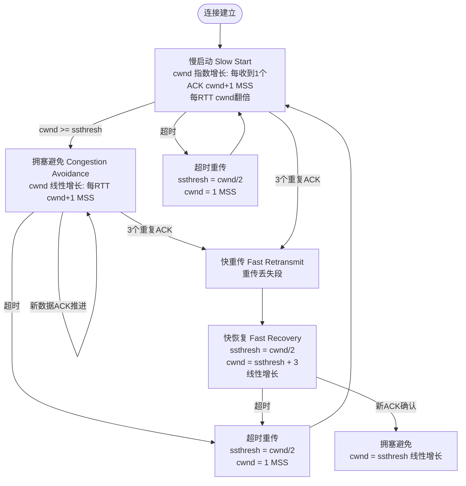
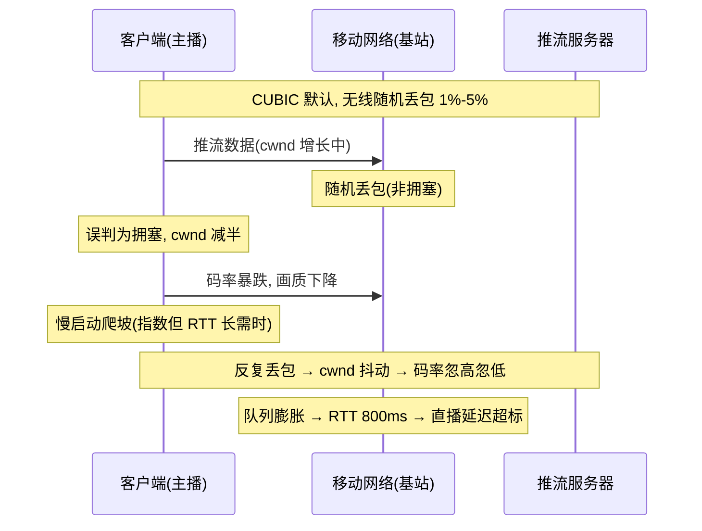
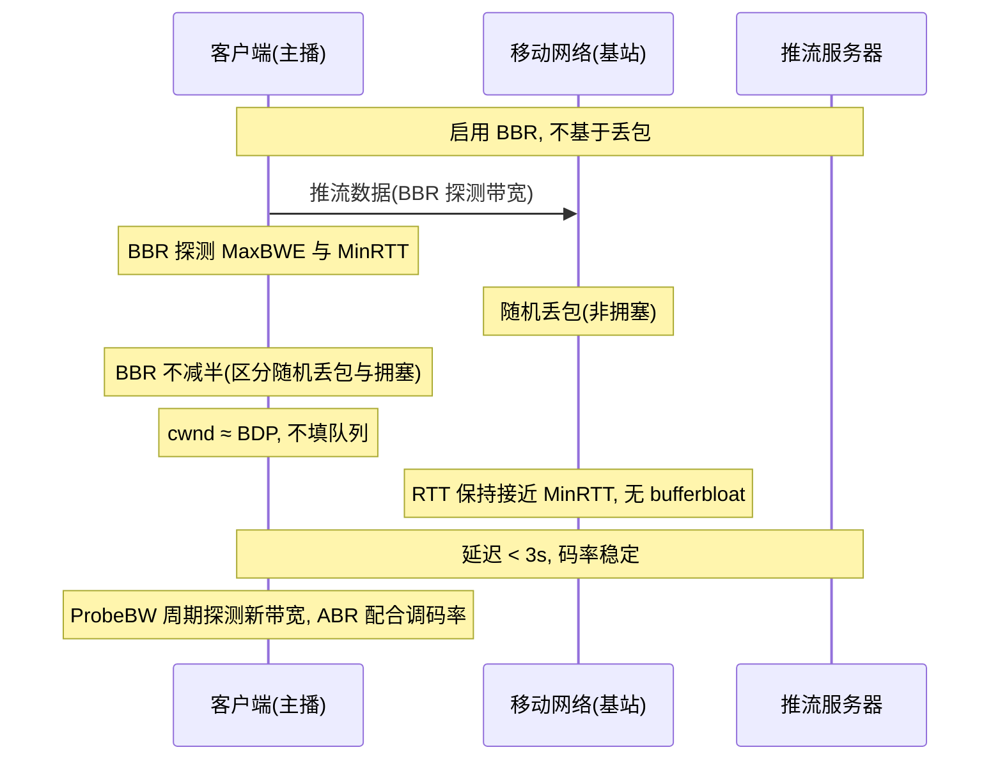

# TCP 拥塞控制

> **一句话定位**：拥塞控制是 TCP 高阶考点，BBR 是近年中高级面试加分项。
> **面试热度**：⭐⭐⭐⭐
> **返回**：[网络知识图谱](../README.md)

---

## 一、概念定义

### 1.1 拥塞控制 vs 流量控制

TCP 同时存在两套"别发太快"的机制，二者目标不同、作用域不同、控制方也不同，是面试第一道分水岭：

| 维度 | 流量控制（Flow Control） | 拥塞控制（Congestion Control） |
|------|-------------------------|-------------------------------|
| 目标 | 保护接收方不被压垮 | 保护网络不被压垮 |
| 作用域 | 端到端（发送方 ↔ 接收方） | 主机到网络（发送方 → 整个网络） |
| 控制方 | 接收方主导，通过 ACK 通告 rwnd | 发送方主导，通过估算网络状况调节 cwnd |
| 窗口变量 | rwnd（接收窗口） | cwnd（拥塞窗口） |
| 判据 | 接收缓冲区剩余空间 | 超时、重复 ACK、RTT 变化、ECN |
| 详见 | [TCP 可靠性 §2.3](./tcp-reliability.md#23-流量控制) | 本文 |

**一句话区分**：流量控制是"接收方告诉发送方别发太快我跟不上"，拥塞控制是"发送方自己判断网络塞了主动减速"。前者是接收方驱动的端到端反馈，后者是发送方驱动的网络状况探测。

**实际发送窗口 = min(rwnd, cwnd)**。两者取小者，避免同时压垮接收方和网络。若 rwnd 很大但 cwnd 很小，瓶颈在网络；若 cwnd 很大但 rwnd 很小，瓶颈在接收方。详见 [TCP 可靠性 §2.2](./tcp-reliability.md#22-滑动窗口) 与 Q7。

### 1.2 cwnd 与 ssthresh

拥塞控制的核心是两个状态变量：

- **cwnd（Congestion Window，拥塞窗口）**：发送方维护的"网络当前能承受的在途数据量"上限。单位为 MSS（或字节，内核实现以包数为单位再换算）。cwnd 越大，发送方越激进。
- **ssthresh（Slow Start Threshold，慢启动门限）**：cwnd 增长模式的分水岭。cwnd < ssthresh 时用慢启动（指数增长），cwnd ≥ ssthresh 时用拥塞避免（线性增长）。

**初始值**：RFC 5681 建议 cwnd 初始值 IW（Initial Window）为 1-10 MSS，Linux 3.0 起默认 `tcp_init_cwnd` 为 10 MSS（RFC 6928）。ssthresh 初始值设为一个很大值（如 65535 MSS 或无限），让连接先走慢启动快速爬坡。

**窗口关系**：发送窗口 = min(rwnd, cwnd)。本文聚焦 cwnd 的演变，rwnd 详见 [TCP 可靠性 §2.2](./tcp-reliability.md#22-滑动窗口)。

### 1.3 拥塞判定依据

发送方如何知道"网络塞了"？TCP 不直接观测路由器队列，而是**从端到端行为反推**：

| 判据 | 含义 | 拥塞程度 | 响应 |
|------|------|---------|------|
| 超时（RTO 到期未收到 ACK） | 报文丢失或延迟剧增，网络严重拥塞 | 重度 | cwnd 归 1，进入慢启动 |
| 3 个重复 ACK | 某段丢了但后续段仍到达，网络轻度拥塞 | 轻度 | cwnd 减半，进入快恢复 |
| RTT 显著上升（BBR/vegas 类） | 队列开始堆积，尚未丢包 | 早期 | 提前减速（非 Reno 算法） |
| ECN 标记（IP/TCP 头显式拥塞通知） | 路由器主动标记"我拥塞了" | 早期 | 减小 cwnd（RFC 3168） |

**关键区别**：经典 Reno/NewReno/CUBIC 基于**丢包**判定拥塞（超时或重复 ACK）；BBR 基于**带宽与 RTT 探测**判定拥塞，不依赖丢包。这是两类算法的本质分野，详见 §2.4-2.5。

> **与 [TCP 可靠性](./tcp-reliability.md) 的关联**：超时重传与快重传的触发条件详见 [可靠性 §2.1](./tcp-reliability.md#21-确认与重传)，本文聚焦这些事件触发后的 **cwnd 调节策略**。重传是"补丢的包"，拥塞控制是"丢包后减速"。

---

## 二、原理与流程

### 2.1 四大阶段总览

RFC 5681 定义的经典拥塞控制（Reno 算法）由四个阶段组成，cwnd 在它们之间转移：



**四大阶段一句话总结**：

| 阶段 | 触发 | cwnd 变化 | 增长速率 |
|------|------|----------|---------|
| 慢启动 | 连接初始 或 超时后 | 每收到 1 个 ACK，cwnd += 1 MSS | 每 RTT 翻倍（指数） |
| 拥塞避免 | cwnd ≥ ssthresh | 每 RTT，cwnd += 1 MSS | 每 RTT +1 MSS（线性） |
| 快重传 | 3 个重复 ACK | 立即重传丢失段（cwnd 暂不变） | — |
| 快恢复 | 快重传后 | ssthresh = cwnd/2，cwnd = ssthresh | 线性增长（同拥塞避免） |

### 2.2 慢启动（Slow Start）

**为什么叫"慢"**：不是指增长慢，而是相对于"一开始就全速发送"而言"慢慢起步"。cwnd 从 IW（默认 10 MSS）开始，**每收到一个 ACK 就 +1 MSS**，由于一个 RTT 内能发 cwnd 个段、收到 cwnd 个 ACK，所以**每 RTT cwnd 翻倍**——指数增长。

```
RTT 0: cwnd = 1 MSS  → 发 1 段
RTT 1: cwnd = 2 MSS  → 发 2 段
RTT 2: cwnd = 4 MSS  → 发 4 段
RTT 3: cwnd = 8 MSS  → 发 8 段
RTT 4: cwnd = 16 MSS → 发 16 段
...
```

**退出条件**：
- cwnd ≥ ssthresh → 切换到拥塞避免（线性增长）。
- 超时 → ssthresh = cwnd/2，cwnd = IW，重新慢启动。
- 3 个重复 ACK → 切换到快重传 + 快恢复。

**设计意图**：连接刚建立时发送方不知道网络容量，用指数增长快速探测可用带宽，避免长时间低效爬坡。ssthresh 是"探测阶段"与"谨慎阶段"的分界。

### 2.3 拥塞避免（Congestion Avoidance）

cwnd 达到 ssthresh 后，增长方式从指数切到**线性**：每 RTT cwnd += 1 MSS。实现上仍是"每收到一个 ACK cwnd += 1/cwnd MSS"（这样 cwnd 个 ACK 累加正好 +1 MSS）。

**为什么切线性**：指数增长到一定规模后会迅速压垮网络，线性增长更保守，避免在接近网络容量时激进试探。

**退出条件**：
- 超时 → ssthresh = cwnd/2，cwnd = IW，慢启动。
- 3 个重复 ACK → 快重传 + 快恢复。

### 2.4 快重传与快恢复

#### 2.4.1 快重传（Fast Retransmit）

超时重传代价大（RTO 通常几百 ms~秒级，且触发 cwnd 归 1）。快重传让发送方在**超时前**就重传丢失段。触发条件：连续收到 **3 个重复 ACK**（同一 ack 号出现 4 次，含首次）。

**为什么是 3 次**：1-2 个重复 ACK 可能由乱序到达引起（IP 层不保证顺序，少量乱序常见），并不一定丢包。3 个重复 ACK 几乎确定丢了——因为接收方收到 3 个乱序段说明后续数据仍在到达，唯独中间空缺。RFC 5681 把阈值定为 3，平衡误判与延迟。详见 [TCP 可靠性 §2.1.2](./tcp-reliability.md#212-快重传fast-retransmit) 与 Q3。

**重传后立即触发快恢复**（不进入慢启动，因为 3 重复 ACK 说明网络仍有连续流量，只是轻度拥塞）。

#### 2.4.2 快恢复（Fast Recovery）

快重传后 cwnd 的调节：

1. **ssthresh = max(cwnd/2, 2)**：门限减半。
2. **cwnd = ssthresh**：窗口直接减半（Reno 简化版；某些实现 cwnd = ssthresh + 3，补偿收到 3 个重复 ACK 所代表的 3 个段已离开网络）。
3. **线性增长**：后续按拥塞避免的线性方式增长。
4. 收到新 ACK（确认了重传段及后续）→ cwnd = ssthresh，正式进入拥塞避免。

**与超时对比**：

| 事件 | ssthresh | cwnd | 后续阶段 |
|------|---------|------|---------|
| 超时 | cwnd/2 | IW（=1 或 10） | 慢启动（指数） |
| 3 重复 ACK | cwnd/2 | ssthresh（减半） | 快恢复 → 拥塞避免（线性） |

**设计哲学**：超时意味着"网络严重拥塞，几乎没流量通过"，必须从头探测；3 重复 ACK 意味着"网络轻度拥塞，后续段还在到"，只需减半不必归零。这是 AIMD（Additive Increase, Multiplicative Decrease）思想的体现。

### 2.5 AIMD 与公平性

**AIMD（加性增，乘性减）**：Reno 系列算法的核心策略。

- **加性增**：正常时 cwnd 每 RTT +1 MSS（线性增长），温和探测。
- **乘性减**：拥塞时 cwnd 减半（×0.5），快速退避。

**为什么 AIMD 能保证公平性**：多个连接共享同一瓶颈链路时，AIMD 的数学性质保证它们**收敛到公平份额**。设 N 个连接共享带宽 C：

1. 初始各连接 cwnd 之和 > C → 发生丢包。
2. 丢包的连接 cwnd 减半，未丢包的连接继续 +1。
3. 经过多轮迭代，各连接 cwnd 趋于相等，且总和 ≈ C。

**收敛证明直觉**：假设两个连接 A、B 共享带宽，A 的 cwnd 大 B 的 cwnd 小。丢包概率与 cwnd 成正比（cwnd 越大越容易丢包），所以 A 更容易减半，B 更容易增长。反复迭代后两者趋于相等。这是 AIMD 的"公平性收敛"性质。

**BBR 不基于 AIMD**：BBR 基于带宽探测而非丢包减半，其公平性机制不同（详见 §2.7），在与 CUBIC 共存时可能抢占更多带宽，这是 BBR 的争议点之一。

### 2.6 CUBIC 算法

CUBIC 是 Linux 2.6.19 起的默认拥塞控制算法（直至 5.4+ 仍默认），是 Reno 的改进版，专为**高 BDP 长肥管道**优化。

**核心思想**：cwnd 不再按 RTT 线性增长，而是按**三次函数（cubic 函数）**增长，增长曲线呈"W"形——刚减半后增长慢（给网络缓冲时间），接近减半点前增长快（快速恢复），超过减半点后增长又变慢（谨慎探测新容量）。

**窗口增长公式**：

```
W(t) = C(t - K)^3 + W_max

其中:
  t       = 距上次减半的时间
  W_max   = 上次减半时的 cwnd
  C, K    = 常数（Linux 默认 C=0.4, K 由 W_max 和 C 决定）
```

**增长曲线特征**：

```
cwnd
  ↑              新 W_max 探测区(慢)
  │           ╭─╮
  │         ╭╯   ╰╮ 快速接近区
  │       ╭╯       ╰╮
  │     ╭╯           ╰╮
  │   ╭╯               ╰╮ 给网络缓冲时间(慢)
  │ ╭╯
  │╱
  └─────────────────────────────→ 时间
     ← 谨慎  快速  谨慎  →
         减半点(W_max)
```

**三大优势**：
1. **RTT 公平性**：增长基于绝对时间而非 RTT 计数，长 RTT 与短 RTT 连接增长速率一致，缓解 Reno 在长肥管道下"RTT 长增长慢"的劣势。
2. **快速恢复**：减半后先慢后快再慢的曲线，能在较少 RTT 内恢复到 W_max 附近。
3. **可扩展性**：高 BDP 链路（如 10Gbps × 100ms = 125MB）下，Reno 线性增长需要数千 RTT 才能填满管道，CUBIC 的三次函数增长更快。

**局限性**：
- 仍基于丢包判定拥塞，会与路由器队列膨胀互动（bufferbloat，见 §2.8）。
- 在浅缓冲链路（无队列累积）下，CUBIC 的优势减弱。

### 2.7 BBR 算法

BBR（Bottleneck Bandwidth and Round-trip propagation time）是 Google 2016 年提出、Linux 4.9 起内置的拥塞控制算法，**不基于丢包**，而是基于**瓶颈带宽与最小 RTT 的探测**。

**核心观察**：网络吞吐量受限于两个物理量——**瓶颈链路带宽**（Bottleneck Bandwidth）与**最小往返时延**（RTT，实际是传播时延）。两者乘积即 BDP（带宽延迟积），是管道容量的理论上限。

**BBR 的两个核心估计**：

1. **Max BWE（最大带宽估计）**：滑动窗口内观测到的最大发送速率（字节/秒）。
2. **Min RTT（最小 RTT 估计）**：滑动窗口内观测到的最小 RTT（反映纯传播时延，排除排队时延）。

**BDP = Max BWE × Min RTT**，BBR 试图将 cwnd 维持在 BDP 附近，让管道"刚好填满不溢出"。

**四个状态机阶段**：

| 状态 | 行为 | 目的 |
|------|------|------|
| Startup | cwnd 增长 2 倍/RTT，探测带宽 | 快速找到 Max BWE |
| Drain | cwnd 减小，排空队列 | 消除 Startup 阶段造成的队列堆积 |
| ProbeBW | 周期性增/减 cwnd（8 个周期，1 个增益 >1 探测，6 个 <1 排空，1 个 =1 维持） | 持续探测新带宽，与公平性 |
| ProbeRTT | 每 10s 强制 cwnd=4 个段，持续 200ms | 周期性重新探测 Min RTT |

**BBR 与 CUBIC 的本质区别**：

| 维度 | CUBIC | BBR |
|------|-------|-----|
| 拥塞判据 | 丢包（超时/重复 ACK） | 带宽与 RTT 探测 |
| 窗口增长 | 三次函数（时间驱动） | 基于实时 BDP |
| 队列占用 | 持续填充队列直到丢包 | 维持 cwnd ≈ BDP，尽量不排队 |
| 丢包响应 | 减半 | 不一定减半（区分随机丢包与拥塞丢包） |
| 弱网表现 | 长肥管道恢复慢 | 快速探测，恢复快 |
| 公平性 | AIMD 收敛，对同算法公平 | 与 CUBIC 共存时可能抢占更多 |
| 缓冲膨胀 | 加剧（需丢包才减速） | 缓解（不靠丢包） |
| 内核版本 | 2.6.19+ 默认 | 4.9+ 内置，需手动启用 |

**BBR 的争议**：
- **公平性**：BBR 与 CUBIC 共存时，BBR 不靠丢包减速，可能在瓶颈队列中占据更多份额，挤压 CUBIC 连接。BBR v2 致力改善公平性。
- **浅缓冲链路**：BBR 在浅缓冲（如交换机共享缓冲）下表现好；在深缓冲（家用路由器大缓冲）下也能避免 bufferbloat。
- **部署**：Google 内部大规模部署 BBR 用于 B4 网络与 YouTube，显著提升吞吐与延迟。

### 2.8 缓冲膨胀（Bufferbloat）

**问题**：现代路由器/交换机的队列缓冲区很大（以应对突发），但基于丢包的算法（Reno/CUBIC）在填满队列前不会减速——于是数据包在队列中排队，**RTT 被人为膨胀到几百 ms 甚至秒级**，导致交互式应用（游戏、VoIP、SSH）延迟飙升。

**典型场景**：家用路由器缓冲区 1MB，下行 10Mbps，CUBIC 在丢包前把队列填满，排队时延 = 1MB/10Mbps = 0.8s，实际 RTT 从 20ms 膨胀到 800ms。

**根本原因**：基于丢包的算法把"队列填满丢包"当作拥塞信号，但队列填满前 RTT 已经严重膨胀——**丢包是滞后的拥塞信号**。

**解法**：
1. **BBR**：不靠丢包，靠 RTT 探测，cwnd 维持在 BDP 附近，不填队列 → RTT 不膨胀。
2. **CoDel / fq_codel**：路由器侧 AQM（主动队列管理），对排队超时的包主动丢弃/标记，让发送方早减速。
3. **ECN**：路由器在队列堆积时标记 IP 头，TCP 收到后主动减速，不依赖丢包。
4. **小缓冲设计**：交换机用小缓冲 + 共享缓冲架构，减少排队深度。

### 2.9 cwnd/ssthresh 状态转移完整图

下表汇总 cwnd 与 ssthresh 在各事件下的转移（Reno 基准，CUBIC/BBR 在增长曲线与判据上不同，但状态骨架类似）：

| 当前阶段 | 事件 | ssthresh | cwnd | 下一阶段 |
|---------|------|---------|------|---------|
| 慢启动 | 收到 ACK，cwnd < ssthresh | 不变 | cwnd += 1 MSS（指数） | 慢启动 |
| 慢启动 | cwnd ≥ ssthresh | 不变 | 切线性增长 | 拥塞避免 |
| 慢启动 | 超时 | cwnd/2 | IW | 慢启动 |
| 慢启动 | 3 重复 ACK | cwnd/2 | ssthresh | 快恢复 |
| 拥塞避免 | 收到 ACK | 不变 | cwnd += 1/cwnd MSS（线性） | 拥塞避免 |
| 拥塞避免 | 超时 | cwnd/2 | IW | 慢启动 |
| 拥塞避免 | 3 重复 ACK | cwnd/2 | ssthresh | 快恢复 |
| 快恢复 | 收到重复 ACK | 不变 | cwnd += 1 MSS（可选，膨胀） | 快恢复 |
| 快恢复 | 收到新 ACK | 不变 | ssthresh（去膨胀） | 拥塞避免 |
| 快恢复 | 超时 | cwnd/2 | IW | 慢启动 |

> **记忆口诀**：超时归 1（cwnd=IW，慢启动重启），重复 ACK 减半（cwnd=ssthresh，快恢复）。ssthresh 永远在"丢包事件"时减半，cwnd 的归宿取决于事件严重程度。

---

## 三、高频追问与面试题

### Q1：拥塞控制和流量控制有什么区别？

**参考答案**：两者都是"别发太快"机制，但**作用域与控制方不同**：

| 维度 | 流量控制 | 拥塞控制 |
|------|---------|---------|
| 目标 | 保护接收方 | 保护网络 |
| 作用域 | 端到端 | 主机到网络 |
| 控制方 | 接收方主导（通告 rwnd） | 发送方主导（估算 cwnd） |
| 窗口 | rwnd | cwnd |
| 判据 | 接收缓冲区剩余 | 超时、重复 ACK、RTT、ECN |

**实际发送窗口 = min(rwnd, cwnd)**。流量控制是接收方告诉发送方"我跟不上"，拥塞控制是发送方自己判断"网络塞了"。前者是被动反馈，后者是主动探测。

**追问**：如果 rwnd 很大但 cwnd 很小，发送窗口受谁限制？
> 受 cwnd 限制。典型场景：高 BDP 链路接收方缓冲区大（rwnd=1GB），但网络拥塞 cwnd 被限制在几 KB，发送窗口=min(1GB, 几 KB)=几 KB，瓶颈在网络。反之若接收方处理慢，cwnd 大但 rwnd 小，瓶颈在接收方。两者取小者保证不压垮任一方。详见 [TCP 可靠性 Q7](./tcp-reliability.md#q7滑动窗口和拥塞窗口有什么区别发送窗口由谁决定)。

### Q2：慢启动为什么叫"慢"？慢在哪？

**参考答案**："慢"不是指增长慢——慢启动阶段 cwnd 每 RTT 翻倍，是**指数增长**，比拥塞避免的线性增长快得多。"慢"是相对于"一开始就按网络满速发送"而言的**起步谨慎**：连接刚建立时发送方不知道网络容量，从 IW（默认 10 MSS）开始，而非直接发满 rwnd。

**命名由来**：RFC 793/1122 时代 IW=1 MSS，从 1 个段开始确实很慢（首个 RTT 只发 1 个段），所以叫"慢启动"。后来 RFC 6928 把 IW 提到 10 MSS，但名字沿用。

**退出条件**：①cwnd ≥ ssthresh 切到拥塞避免（线性）；②超时则 ssthresh=cwnd/2, cwnd=IW 重新慢启动；③3 重复 ACK 切快恢复。

**追问**：为什么慢启动用指数增长而不是线性？
> 连接刚建立时不知道网络容量，需要快速探测到可用带宽。线性增长太慢——10Gbps 链路 RTT=20ms 下，从 10 MSS 线性增长到 BDP（25MB ≈ 17000 MSS）需要 17000 个 RTT ≈ 340s，完全无法利用链路。指数增长只需 log2(17000) ≈ 14 个 RTT ≈ 280ms 即可探测到。ssthresh 是"探测阶段"与"谨慎阶段"的分界，达到后切线性避免激进压垮网络。

### Q3：快重传为什么是 3 次重复 ACK？

**参考答案**：1-2 个重复 ACK 可能由**乱序到达**引起——IP 层不保证顺序，少量乱序在网络中很常见（多路径路由、并行链路），并不一定丢包。3 个重复 ACK 几乎确定丢了，因为：

- 接收方收到乱序段会立即回重复 ACK（ack 停留在期望序号）。
- 连续收到 3 个重复 ACK 意味着接收方收到了 3 个乱序段（即 seq > 期望序号的段），说明**后续数据仍在到达**，唯独中间空缺——丢包概率极高。

RFC 5681 把阈值定为 3，是**误判概率与检测延迟的平衡**：阈值太低（1-2）会因乱序误判触发不必要的重传与 cwnd 减半；阈值太高（5-10）会延迟丢包检测，增加 RTO 超时风险。实测中 3 是工程最优。

**追问**：如果网络严重乱序，3 次重复 ACK 会不会误判？
> 会。在数据中心多路径或 ECMP 环境下，乱序可能超过 3 段，触发误快重传。Linux 提供 `tcp_reordering` 参数（默认 3）可调高重复 ACK 阈值，但调高会延迟真实丢包的检测。现代方案是用 SACK（[可靠性 §2.1.3](./tcp-reliability.md#213-sackselective-ack选择性确认)）精确告知哪些段已收，发送方据此判断是乱序还是真丢包，减少误判。

### Q4：BBR 和 CUBIC 本质区别？

**参考答案**：**CUBIC 基于丢包，BBR 基于带宽与 RTT 探测**。这是两类算法的根本分野。

| 维度 | CUBIC | BBR |
|------|-------|-----|
| 拥塞判据 | 丢包（超时/重复 ACK） | 瓶颈带宽 + 最小 RTT 探测 |
| 窗口增长 | 三次函数 W(t)=C(t-K)³+W_max | 基于 BDP = MaxBWE × MinRTT |
| 队列占用 | 填满队列直到丢包 | cwnd ≈ BDP，尽量不排队 |
| 丢包响应 | cwnd 减半 | 区分随机丢包与拥塞丢包，不一定减半 |
| 缓冲膨胀 | 加剧（需丢包才减速） | 缓解（不靠丢包） |
| 公平性 | AIMD 收敛 | 与 CUBIC 共存可能抢占更多 |
| 适用 | 大带宽长肥管道（默认算法） | 弱网/移动端/高延迟链路 |

**BBR 的核心**：不把丢包当拥塞信号（因为随机丢包在无线/移动网络很常见，并非真拥塞），而是探测"网络管道容量"（BDP=带宽×RTT），把 cwnd 维持在 BDP 附近，既填满管道又不溢出排队。

**追问**：BBR 不靠丢包，那它怎么知道网络拥塞了？
> BBR 通过 **RTT 上升**与**带宽下降**判定拥塞。当队列开始堆积，RTT 会从 MinRTT 上升；当带宽达到瓶颈，MaxBWE 不再增长。BBR 在 ProbeBW 状态周期性探测：cwnd 增益 >1 时若 BWE 上升则更新估计，若 RTT 上升说明排队了就减小 cwnd。这与 CUBIC"等丢包才减速"的滞后逻辑完全不同——BBR 在队列堆积早期就响应，避免 bufferbloat。

### Q5：缓冲膨胀是什么？为什么 BBR 能缓解？

**参考答案**：**Bufferbloat（缓冲膨胀）**指现代网络设备的大缓冲队列在基于丢包的拥塞算法下被持续填满，导致数据包排队、RTT 被人为膨胀到几百 ms 甚至秒级，交互式应用延迟飙升。

**根因**：CUBIC 等基于丢包的算法把"队列填满丢包"当作拥塞信号，但队列填满前 RTT 已严重膨胀——丢包是**滞后的信号**。例：家用路由器 1MB 缓冲、10Mbps 下行，CUBIC 在丢包前填满队列，排队时延 1MB/10Mbps=0.8s，RTT 从 20ms 膨胀到 800ms，游戏/VoIP/SSH 无法用。

**BBR 缓解原理**：BBR 不靠丢包，靠**最小 RTT 探测**。cwnd 维持在 BDP（带宽×最小 RTT）附近，刚好填满管道不溢出，不往队列里塞包。即使路由器缓冲很大，BBR 也不会填满它，RTT 保持接近 MinRTT。

**其他解法**：CoDel/fq_codel AQM（路由器主动丢弃排队超时的包）、ECN（路由器标记拥塞，TCP 早减速）、小缓冲设计。

**追问**：为什么路由器要把缓冲做得这么大？
> 历史原因：早期网络带宽低，大缓冲应对突发与 TCP 拥塞窗口爬坡。但现代高带宽网络下，大缓冲反而成为延迟元凶。缓冲大小是"吞吐与延迟的权衡"——太大则延迟膨胀（bufferbloat），太小则突发丢包降吞吐。理想是"小而智能"的缓冲 + AQM（如 fq_codel），既容纳突发又及时让发送方减速。

### Q6：为什么 TCP 要做公平性？AIMD 怎么保证？

**参考答案**：TCP 公平性指**多个连接共享同一瓶颈链路时，各自分得相近的带宽份额**。这是 TCP 设计的核心目标之一——避免某个连接霸占带宽，让所有连接公平收敛。

**AIMD 的公平性收敛**：
- **加性增（AI）**：正常时 cwnd 每 RTT +1 MSS。
- **乘性减（MD）**：拥塞时 cwnd ×0.5。

**收敛直觉**：两个连接 A、B 共享带宽 C。假设 A 的 cwnd 大、B 的 cwnd 小。丢包概率与 cwnd 成正比（cwnd 越大在途包越多越容易丢），所以 A 更容易减半、B 更容易增长。反复迭代后，A 减 B 增，两者趋于相等，且总和收敛到 C 附近。

**数学证明**：设两连接 cwnd 为 (x, y)，x > y。丢包后 x 减半为 x/2，y 增长为 y+1。经过多轮，差值 (x-y) 单调减小，最终 x ≈ y ≈ C/2。

**BBR 的公平性争议**：BBR 不基于 AIMD，与 CUBIC 共存时，BBR 不靠丢包减速，可能在瓶颈队列中占更多份额，挤压 CUBIC 连接。BBR v2 改善了公平性，但仍不如 AIMD 的天然收敛性质。

**追问**：UDP 不做拥塞控制，会不会抢光 TCP 的带宽？
> 会，这是 UDP 的"不公平性"问题。UDP 无拥塞控制，持续高速发送不会因丢包减速，可能挤压同链路的 TCP 连接（TCP 减半让出带宽，UDP 占用）。解决方案：①应用层自行限速（如 QUIC 在 UDP 之上实现 BBR-like 拥塞控制）；②路由器 AQM 对 UDP 流也施加限速；③DCCP 等协议在传输层做拥塞控制但不保序。这是 QUIC 选择"UDP 之上实现自己的拥塞控制"而非裸 UDP 的关键原因。

### Q7：cwnd 初始值 IW 为什么从 1 MSS 提到 10 MSS？

**参考答案**：RFC 6928（2013）将 IW 从 1 MSS 提到 **10 MSS**，Linux 3.0+ 默认采用。原因：

1. **IW=1 过于保守**：首个 RTT 只发 1 段，慢启动需 14+ RTT 才能到合理窗口，短连接（HTTP 请求）可能整个生命周期都在慢启动爬坡，吞吐极低。
2. **IW=10 的合理性**：10 MSS ≈ 14.6KB，小于典型 ACK 反馈延迟内的管道容量，不会压垮网络，又能让短连接首个 RTT 就发够数据。
3. **实测支持**：Google 在 B4 网络与公网大规模实测，IW=10 不显著增加丢包率但显著提升短连接吞吐。

**风险**：IW 过大（如 100 MSS）会在网络拥塞时瞬间丢包，加剧拥塞。10 是工程平衡。

**追问**：IW=10 会不会让 SYN Flood 更严重？
> 有限影响。SYN Flood 是攻击者发 SYN 不回 ACK，与 IW 无关（IW 是连接建立后的初始窗口）。但 IW=10 让每条连接初始发更多数据，若 SYN Cookies 启用后直接进 ESTABLISHED，每条连接占更多带宽。整体看 IW=10 的收益远大于 SYN Flood 风险，且 SYN Flood 有独立防御（[连接管理 §2.6](./tcp-connection.md#26-syn-cookies-机制)）。

### Q8：Linux 如何切换拥塞控制算法？

**参考答案**：通过 `sysctl` 或 `/proc` 接口切换，支持每连接用不同算法。

```bash
# 查看当前算法
sysctl net.ipv4.tcp_congestion_control

# 查看内核支持的算法
sysctl net.ipv4.tcp_available_congestion_control
# 或
cat /proc/sys/net/ipv4/tcp_available_congestion_control
# 典型输出: cubic reno ...
# 若内核编译了 bbr 模块, 还有 bbr

# 全局切换为 BBR
sysctl -w net.ipv4.tcp_congestion_control=bbr

# 若提示 bbr 不可用, 需加载内核模块
modprobe tcp_bbr

# 持久化到 /etc/sysctl.conf
echo "net.ipv4.tcp_congestion_control=bbr" >> /etc/sysctl.conf
sysctl -p

# 查看每连接使用的算法与 cwnd
ss -i -nt
# 输出中 "cubic" 或 "bbr" 字样即该连接当前算法
```

**BBR 启用额外参数**：

```bash
# BBR 建议开启 fq（fair queue）队列调度, 配合 pacing
sysctl -w net.core.default_qdisc=fq
sysctl -w net.ipv4.tcp_congestion_control=bbr
```

**Java 无法直接控制**：拥塞算法是内核协议栈行为，Java Socket API 不暴露 cwnd/算法切换接口。应用层只能通过系统级 `sysctl` 或容器/宿主机配置全局切换，所有连接共享。若需精细控制，需用 native 代码（JNI 调 setsockopt）或借助 Netty 的 `ChannelOption` 间接影响（如 `TCP_NODELAY` 影响 Nagle 但不影响拥塞算法）。

**追问**：能不能让不同连接用不同算法？
> 可以。Linux 支持 per-connection 切换：用 `setsockopt(fd, IPPROTO_TCP, TCP_CONGESTION, "bbr", 3)` 在连接级别设置。但 Java 标准库不暴露此选项，需 JNI 或 native helper。实际上更常见的是按服务/容器分组：BBR 容器跑延迟敏感服务，CUBIC 容器跑大流量传输。

---

## 四、实战与 Java 生态关联

### 4.1 Linux 查看与切换拥塞算法

#### 4.1.1 查看当前算法

```bash
# 全局默认算法
sysctl net.ipv4.tcp_congestion_control
# 输出示例: net.ipv4.tcp_congestion_control = cubic

# 内核支持的所有算法
sysctl net.ipv4.tcp_available_congestion_control
# 或
cat /proc/sys/net/ipv4/tcp_available_congestion_control
# 输出示例: cubic reno ...
# 若已加载 bbr 模块: cubic reno ... bbr

# 每连接算法与窗口
ss -i -nt
# 输出示例:
# ESTAB 0 0 10.0.0.1:8080 10.0.0.2:50000
#      cubic wscale:7,7 rto:204 rtt:0.022/0.003 cwnd:10 send 1.2Gbps
#       ↑
#       该连接当前算法
```

**ss -i 关键字段解读**：

| 字段 | 含义 |
|------|------|
| `cubic` / `bbr` / `reno` | 该连接使用的拥塞算法 |
| `cwnd:10` | 当前拥塞窗口（MSS 数） |
| `ssthresh:32` | 慢启动门限（部分版本显示） |
| `wscale:7,7` | 窗口缩放因子（详见 [可靠性 §2.3.3](./tcp-reliability.md#233-窗口缩放选项)） |
| `rto:204` | 重传超时（ms） |
| `rtt:0.022/0.003` | RTT / RTT 方差（ms） |
| `send 1.2Gbps` | 当前发送速率（含 cwnd 与 pacing） |
| `pacing_rate 1.2Gbps` | Pacing 速率（BBR/TSQ 用） |

#### 4.1.2 切换为 BBR

```bash
# 1. 加载 BBR 内核模块（4.9+ 内置，部分发行版需显式 modprobe）
modprobe tcp_bbr
lsmod | grep bbr  # 确认加载

# 2. 切换全局默认算法
sysctl -w net.ipv4.tcp_congestion_control=bbr
# 验证
sysctl net.ipv4.tcp_congestion_control
# 输出: net.ipv4.tcp_congestion_control = bbr

# 3. BBR 建议配合 fq 队列调度（pacing 友好）
sysctl -w net.core.default_qdisc=fq

# 4. 持久化（写入 /etc/sysctl.conf）
cat >> /etc/sysctl.conf <<EOF
net.core.default_qdisc = fq
net.ipv4.tcp_congestion_control = bbr
EOF
sysctl -p

# 5. 验证新连接是否生效
curl -s https://example.com >/dev/null &  # 触发新连接
ss -i -nt | grep -A1 ":443"
# 应看到 bbr 字样
```

**BBR 启用注意事项**：

- 内核版本 ≥ 4.9（`uname -r` 确认）。
- 容器场景下需宿主机内核支持，容器内 `sysctl` 可能受 `--privileged` 限制。
- BBR 对深缓冲链路（家用宽带）效果显著，对浅缓冲数据中心提升有限。
- 切换后仅影响**新建连接**，已建立连接的算法不变。

#### 4.1.3 内核参数总览

```bash
# ===== 拥塞控制 =====
# 当前算法
net.ipv4.tcp_congestion_control = cubic  # 或 bbr

# 可用算法列表
net.ipv4.tcp_available_congestion_control = cubic reno ...

# 初始拥塞窗口（IW, 单位 MSS）
net.ipv4.tcp_init_cwnd = 10

# 慢启动后初始 ssthresh（部分场景）
net.ipv4.tcp_slow_start_after_idle = 1  # 长空闲后重启慢启动, 关闭则保持窗口

# ===== 重传相关（影响拥塞判定, 详见可靠性 §4.3）=====
net.ipv4.tcp_retries2 = 15          # 数据段重传上限
net.ipv4.tcp_thin_linear_timeouts = 0  # 瘦连接（少量数据）线性退避, 交互场景可开

# ===== ECN（显式拥塞通知, 配合 BBR/AQM）=====
net.ipv4.tcp_ecn = 0  # 0=关, 1=被动协商, 2=主动
```

### 4.2 Java 系统级关联

Java 标准库**不直接暴露**拥塞控制接口（cwnd、ssthresh、算法切换都不是 Socket 选项），拥塞算法是内核行为，Java 应用只能间接影响：

| Java 层操作 | 影响的 TCP 行为 | 与拥塞控制关系 |
|-------------|----------------|---------------|
| `Socket.setTcpNoDelay(true)` | 关闭 Nagle | 不影响算法，但影响小包发送时机 |
| `Socket.setSendBufferSize(n)` | SO_SNDBUF | 间接影响发送缓冲上限，但 cwnd 才是主要约束 |
| `Socket.setReceiveBufferSize(n)` | SO_RCVBUF → rwnd | 影响流量控制，间接影响 min(rwnd,cwnd) |
| 无 | cwnd/ssthresh/算法 | 纯内核行为，需 `sysctl` 系统级配置 |

**生产实践**：

1. **系统级配置**：在 Docker 镜像/部署脚本中预设 `sysctl.conf`，让 BBR/CUBIC 全局生效。
2. **容器限制**：K8s Pod 默认无法 `sysctl`，需在 `securityContext` 声明 `net.ipv4.tcp_congestion_control` 为"unsafe"并经宿主机授权。
3. **JVM 调优间接影响**：GC 长停顿会让 ACK 延迟，发送方误判 RTT 上升触发减速。ZGC/G1 减少停顿可间接改善拥塞判定稳定性。
4. **Netty**：`ChannelOption` 不暴露算法切换，但 `TCP_NODELAY`、`SO_SNDBUF` 可配。若需 per-connection 切换算法，需 native helper 或 Netty 的 `EpollChannelOption`（Linux 特有，部分版本支持 `TCP_CONGESTION`）。

**Netty 间接配置示例**：

```java
ServerBootstrap b = new ServerBootstrap();
b.group(bossGroup, workerGroup)
 .channel(NioServerSocketChannel.class)
 // 以下都是间接影响, 不直接控制 cwnd/算法
 .childOption(ChannelOption.TCP_NODELAY, true)       // 关 Nagle, 小包立即发
 .childOption(ChannelOption.SO_SNDBUF, 1024 * 1024)  // 发送缓冲, 不影响 cwnd
 .childOption(ChannelOption.SO_RCVBUF, 1024 * 1024) // 接收缓冲 → rwnd
 .childOption(ChannelOption.SO_KEEPALIVE, true);     // 保活, 与拥塞无关

// 算法切换需在系统层（Dockerfile/sysctl.conf）:
// RUN sysctl -w net.ipv4.tcp_congestion_control=bbr
// 或在 K8s securityContext 声明
```

### 4.3 抓包与排查

```bash
# 查看重传统计（拥塞的间接信号）
nstat -az TcpRetransSegs TcpExtTCPSpuriousRTOs

# 抓包看快重传与超时
tcpdump -nn -i eth0 'tcp[tcpflags] & tcp-ack != 0' | head

# 看 ECN 标记（若启用）
tcpdump -nn 'ip[1] & 0x03 = 0x03'

# 实时监控 cwnd 变化（ss 反复采样）
watch -n 0.5 'ss -i -nt | grep -E "cwnd|cubic|bbr"'

# BBR 内部状态（若用 BBR）
ss -i -nt | grep -i bbr
# 输出含 bbr 状态: Startup/Drain/ProbeBW/ProbeRTT
```

---

## 五、系统设计案例

### 5.1 视频直播场景的拥塞控制选型

**需求**：一个面向移动端的视频直播平台，主播推流 + 观众拉流，要求弱网下卡顿少、延迟低（端到端 < 3s）、画质自适应。

**问题分析**：

| 维度 | 挑战 |
|------|------|
| 网络 | 移动端 RTT 高（50-300ms）、丢包率高（1-5%，无线随机丢包）、带宽波动大 |
| 算法痛点 | CUBIC 基于丢包，会把无线随机丢包误判为拥塞，cwnd 反复减半，码率暴跌 |
| 延迟 | CUBIC 填满队列导致 bufferbloat，RTT 膨胀到几百 ms，直播延迟超标 |
| 自适应 | 需要根据带宽快速调整视频码率（ABR 算法） |

**CUBIC 在直播场景的缺陷**：



**BBR 选型方案**：



**方案落地**：

| 层级 | 措施 | 收益 |
|------|------|------|
| 内核 | 宿主机/Pod `tcp_congestion_control=bbr` + `default_qdisc=fq` | 弱网不误判，RTT 不膨胀 |
| 应用 | 推流 SDK 基于 RTT 与 BBR pacing_rate 反馈做 ABR 码率自适应 | 码率跟随带宽平滑变化 |
| 协议 | RTMP/WebRTC over UDP（自实现 BBR-like 拥塞控制） | 绕开 TCP 限制，更精细控制 |
| 监控 | `ss -i` 采样 BBR 状态与 pacing_rate，上报 Prometheus | 实时感知弱网程度 |
| 降级 | BBR 不可用时回退 CUBIC + `fq_codel` AQM | 兼容性兜底 |

**为什么不直接用 WebRTC**：WebRTC 走 UDP 且自带 GCC 拥塞控制（类似 BBR），是直播的理想方案。但若历史架构是 RTMP over TCP，迁移成本高，先用 TCP+BBR 作为过渡，逐步切 WebRTC。

### 5.2 文件下载场景的拥塞控制选型

**需求**：一个大文件下载服务（如系统镜像 ISO，单文件 4GB），用户经家用宽带（100Mbps，RTT 20ms）下载，要求吞吐最大化、不过度占用用户带宽。

**问题分析**：

| 维度 | 挑战 |
|------|------|
| 目标 | 吞吐最大化（填满 100Mbps 管道），延迟不敏感 |
| BDP | 100Mbps × 20ms = 250KB ≈ 170 MSS，CUBIC 线性增长需 170 RTT ≈ 3.4s 爬坡 |
| 算法 | CUBIC 的三次函数增长能更快爬坡到 BDP，适合大文件 |
| 队列 | 家用路由器深缓冲，CUBIC 会填满队列导致 bufferbloat，但文件下载对延迟不敏感，影响小 |

**CUBIC 选型方案**：

| 层级 | 措施 | 收益 |
|------|------|------|
| 内核 | 保持默认 `cubic` | 大带宽长 RTT 场景爬坡快 |
| 缓冲 | 调大 `tcp_rmem`/`tcp_wmem` 上限到 16MB | 配合窗口缩放利用高 BDP |
| 并发 | 多线程分块下载（HTTP Range），每连接独立 cwnd | 绕开单连接 cwnd 爬坡慢的瓶颈 |
| 重试 | 基于 SACK 精准重传（`tcp_sack=1`） | 长传输减少冗余重传 |
| 监控 | `ss -i` 看 cwnd 与 send 速率 | 确认是否填满管道 |

**为什么 CUBIC 适合文件下载**：
- 文件下载是**长连接 + 大流量**，CUBIC 的三次函数增长能在 10-20 RTT 内爬到 BDP，吞吐高。
- 延迟不敏感，bufferbloat 影响小（用户不在乎 RTT 800ms，只在乎下载快）。
- BBR 虽然不排队延迟低，但 cwnd 严格按 BDP，可能不如 CUBIC 激进地填满管道，吞吐略低。

**为什么 BBR 仍可作备选**：
- 若用户同时玩游戏/VoIP，CUBIC 的 bufferbloat 会影响其他应用。BBR 不填队列，RTT 低，更适合"下载 + 交互"并存场景。
- 弱网（丢包率高）下 BBR 不误判随机丢包，吞吐比 CUBIC 稳定。

**对比结论**：

| 场景 | 首选算法 | 理由 |
|------|---------|------|
| 视频直播（移动端、延迟敏感） | BBR | 不误判无线丢包，RTT 不膨胀 |
| 文件下载（家用宽带、吞吐优先） | CUBIC | 三次函数快速爬坡，吞吐高 |
| 数据中心内部 RPC（短 RTT、高 BDP） | CUBIC 或 DCTCP | 默认算法够用，DCTCP 针对 ECN 优化 |
| 跨洲传输（长 RTT、高 BDP） | BBR | 探测带宽不受 RTT 长拖慢 |
| 混合场景（下载 + 交互） | BBR | 不影响其他应用延迟 |

---

## 六、参考与延伸

- RFC 5681（拥塞控制标准，定义慢启动/拥塞避免/快重传/快恢复）、RFC 6298（RTO 计算）、RFC 6928（IW=10 MSS）、RFC 3168（ECN 显式拥塞通知）、RFC 8312（CUBIC 算法规范）、BBR 论文（Cardwell et al., 2017, "BBR: Congestion-Based Congestion Control"）
- Linux 内核文档：`Documentation/networking/ip-sysctl.txt`、`tcp(7)` man 手册、BBR 文档 `Documentation/networking/tcp_bbr.txt`
- 延伸阅读：[TCP 连接管理](./tcp-connection.md)（握手/挥手，连接建立后拥塞控制才开始）、[TCP 可靠性](./tcp-reliability.md)（重传/滑动窗口/流量控制，拥塞判据的基础）、[TCP 高频追问](./tcp-high-frequency.md)、[UDP/QUIC](./udp-quic.md)（QUIC 在 UDP 之上实现 BBR-like 拥塞控制）
- 仓库内关联：`java-core/jvm`（GC 停顿对 ACK 时机与拥塞判定的间接影响）、`framework/spring-framework`（REST 接口的 TCP 行为）、[HTTP](../01-application/http.md)（长连接与并发下载）、[HTTPS/TLS](../01-application/https-tls.md)（TCP 之上的加密流）

> **返回**：[网络知识图谱](../README.md)
