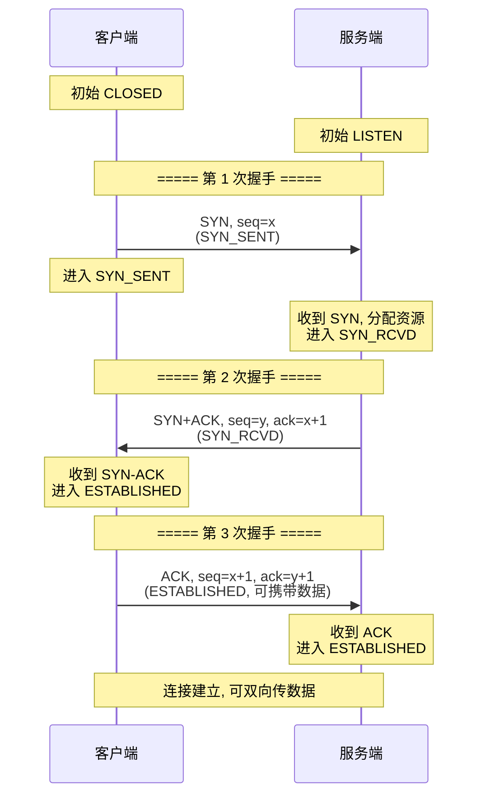
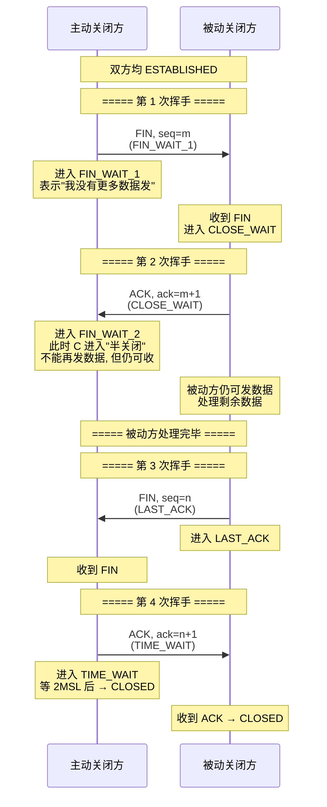
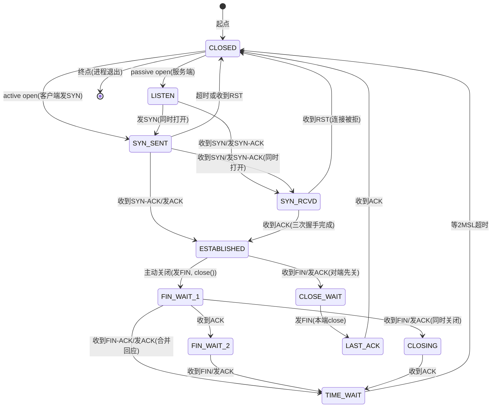
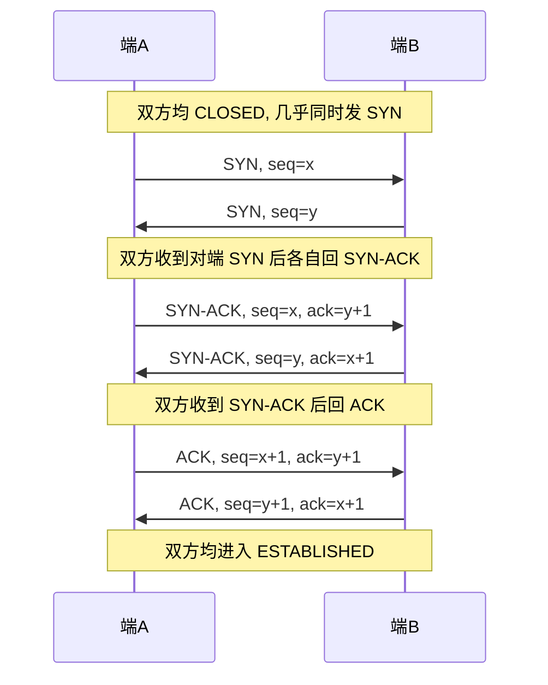
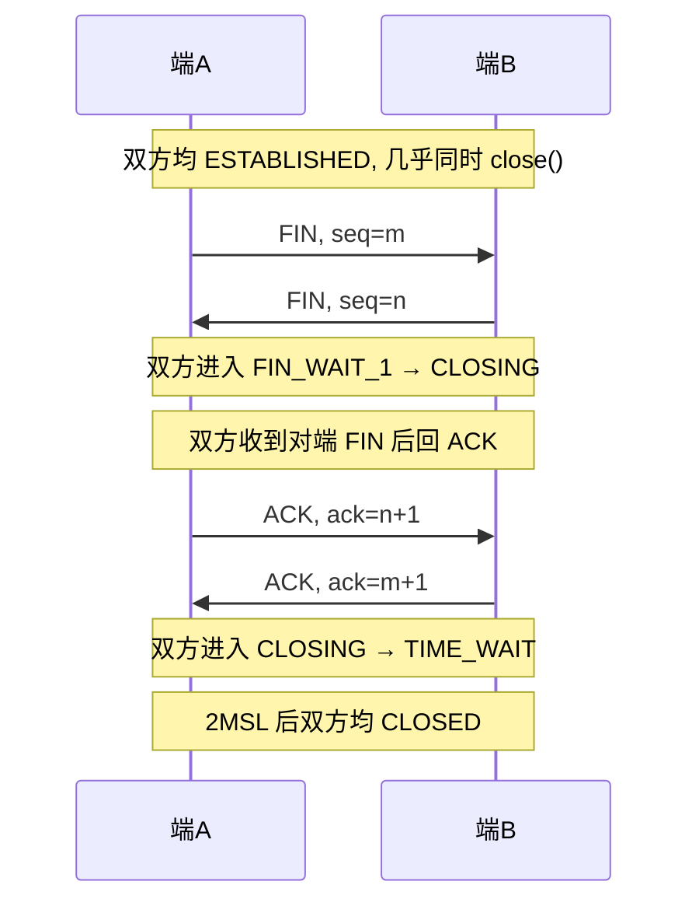
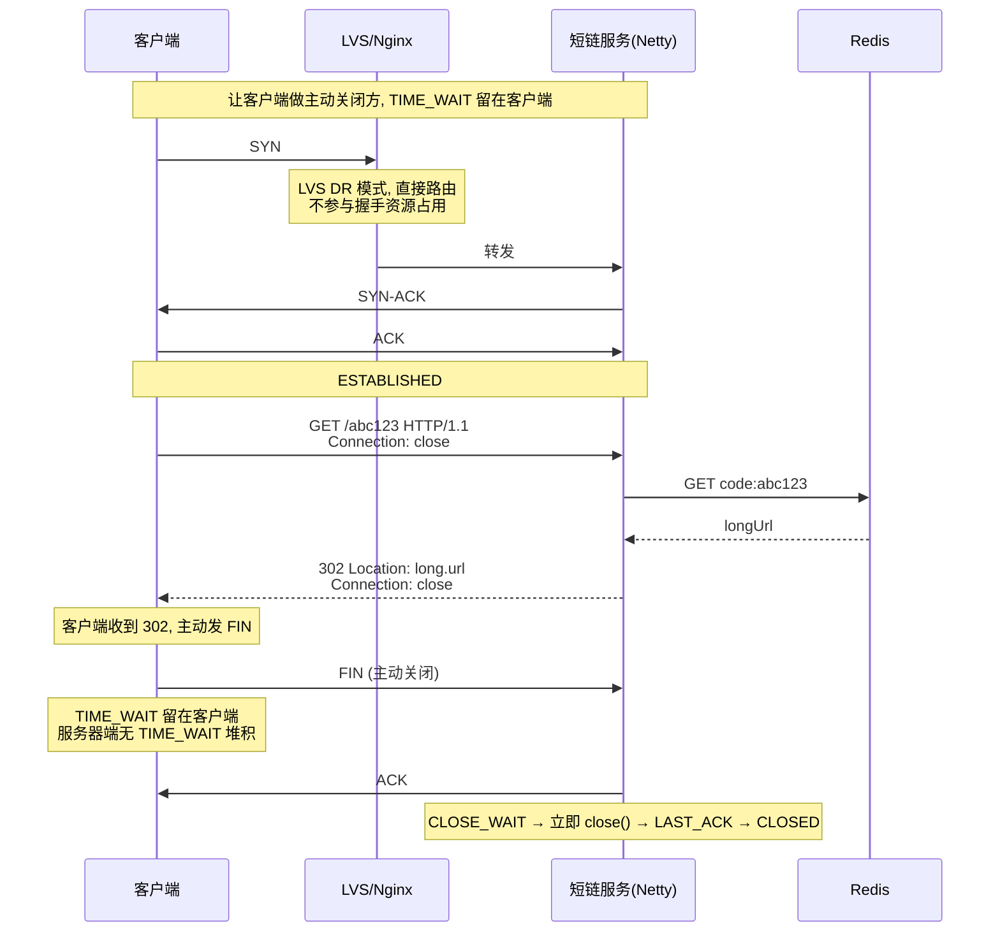

# TCP 连接管理

> **一句话定位**：三次握手/四次挥手是 TCP 面试的起手式，状态机是高频追问核心。
> **面试热度**：⭐⭐⭐⭐⭐
> **返回**：[网络知识图谱](../README.md)

---

## 一、概念定义

### 1.1 TCP 的核心特性

TCP（Transmission Control Protocol，传输控制协议）是一种**面向连接、可靠、全双工、面向字节流**的传输层协议，定义于 RFC 793，默认承载于 IP 之上，知名端口号范围 0-1023。它与 UDP 的本质差异体现在四点：

| 特性 | TCP | UDP |
|------|-----|-----|
| 连接 | 面向连接（先握手再传数据） | 无连接 |
| 可靠性 | 可靠（序号+确认+重传+流量/拥塞控制） | 不可靠（尽力交付） |
| 传输单元 | 面向字节流（无边界，需应用层定界） | 面向报文（保留边界） |
| 通信方式 | 全双工（双向独立收发） | 可单播/组播/广播 |
| 首部开销 | 20 字节（最小）+ 选项 | 8 字节 |
| 拥塞/流量控制 | 有（滑动窗口、CUBIC/BBR） | 无 |

**四个特性展开**：

1. **面向连接**：数据传输前必须通过三次握手建立连接，传输结束通过四次挥手释放连接。连接是一个**逻辑概念**——由双方的四元组 `{本地 IP, 本地端口, 远端 IP, 远端端口}` 唯一标识，不存在物理"线路"。
2. **可靠**：通过序号保证按序、通过确认+超时重传+快重传保证不丢、通过校验和保证不损坏。详见 [TCP 可靠性](./tcp-reliability.md)。
3. **全双工**：通信双方各有一对发送/接收缓冲区，两个方向独立收发、独立关闭（**半关闭**），这也是四次挥手的根因。
4. **面向字节流**：应用层写入的数据没有边界，TCP 按字节流编号；一次 `write` 不等于一次发送，一次发送也不等于对端一次 `read`，**粘包/拆包问题需应用层自行定界**（定长/分隔符/长度前缀）。

### 1.2 TCP 首部格式

TCP 首部最小 20 字节，最大 60 字节（含 40 字节选项）。结构如下：

```
 0                   1                   2                   3
 0 1 2 3 4 5 6 7 8 9 0 1 2 3 4 5 6 7 8 9 0 1 2 3 4 5 6 7 8 9 0 1
+-+-+-+-+-+-+-+-+-+-+-+-+-+-+-+-+-+-+-+-+-+-+-+-+-+-+-+-+-+-+-+-+
|          源端口号 (16)        |       目的端口号 (16)        |
+-+-+-+-+-+-+-+-+-+-+-+-+-+-+-+-+-+-+-+-+-+-+-+-+-+-+-+-+-+-+-+-+
|                        序号 (32)                             |
+-+-+-+-+-+-+-+-+-+-+-+-+-+-+-+-+-+-+-+-+-+-+-+-+-+-+-+-+-+-+-+-+
|                    确认号 (32)                               |
+-+-+-+-+-+-+-+-+-+-+-+-+-+-+-+-+-+-+-+-+-+-+-+-+-+-+-+-+-+-+-+-+
|  数据偏移(4)| 保留(3)|标志(9)|        窗口大小 (16)           |
+-+-+-+-+-+-+-+-+-+-+-+-+-+-+-+-+-+-+-+-+-+-+-+-+-+-+-+-+-+-+-+-+
|       校验和 (16)             |       紧急指针 (16)          |
+-+-+-+-+-+-+-+-+-+-+-+-+-+-+-+-+-+-+-+-+-+-+-+-+-+-+-+-+-+-+-+-+
|                    选项 (0-40 字节，可变)                   |
+-+-+-+-+-+-+-+-+-+-+-+-+-+-+-+-+-+-+-+-+-+-+-+-+-+-+-+-+-+-+-+-+
```

**关键字段详解**：

| 字段 | 位宽 | 作用 |
|------|------|------|
| 源/目的端口 | 各 16 | 与 IP 头组成四元组，定位连接 |
| 序号 Sequence Number | 32 | 本报文数据第一个字节的编号。建立时 SYN 占一个序号（即 ISN+1 起算数据） |
| 确认号 ACK Number | 32 | **期望收到对端下一个字节的序号**，即"序号 < ACK 的数据已收到"。仅当 ACK=1 才生效 |
| 数据偏移 | 4 | 首部长度（以 4 字节为单位），范围 5-15，对应 20-60 字节 |
| 保留 | 3 | 历史保留位，部分系统用作 ECN/NS（RFC 3168/3540） |
| 标志位 | 9 | 见下表 |
| 窗口大小 Window | 16 | **接收方通告的剩余接收缓冲区大小**，用于流量控制。最大 65535，配合窗口缩放可放大 |
| 校验和 Checksum | 16 | 覆盖首部+数据+伪首部（源/目的 IP、协议、TCP 长度），检测损坏 |
| 紧急指针 Urgent Pointer | 16 | URG=1 时有效，指向紧急数据末尾相对序号的偏移 |

**9 个标志位**（前 6 个经典、后 3 个为拥塞控制扩展）：

| 标志 | 全称 | 含义 |
|------|------|------|
| URG | Urgent | 紧急指针有效，紧急数据（带外数据 OOB）优先处理 |
| ACK | Acknowledgment | 确认号有效。除初始 SYN 外几乎所有报文都置 1 |
| PSH | Push | 提示接收方立即把数据交给应用，不要缓存等满缓冲区 |
| RST | Reset | 复位连接。收到不存在的连接/非法报文/队列满时返回，强制释放 |
| SYN | Synchronize | 请求建立连接/同步序号。握手阶段唯一置 1 的核心标志 |
| FIN | Finish | 请求关闭发送方向。表示"我没有更多数据了"，半关闭 |
| CWR | Congestion Window Reduced | 拥塞窗口已减小，配合 ECN |
| ECE | ECN-Echo | 拥塞通知回显。协商阶段表示支持 ECN，传输阶段表示网络拥塞 |
| NS | Nonce Sum | ECN 防伪造保护（RFC 3540） |

> **易混点**：SYN、FIN 虽不携带数据，但**各消耗一个序号**（因为要被 ACK 确认）；纯 ACK 不消耗序号。

### 1.3 TCP 选项

选项字段位于首部之后，以 1 字节 `Kind` 标识，常见如下：

| Kind | 名称 | 长度 | 作用 |
|------|------|------|------|
| 0 | EOL | 1 | 选项列表结束 |
| 1 | NOP | 1 | 填充，用于 4 字节对齐 |
| 2 | MSS | 4 | **最大报文段长度**，通告本端可接收的最大数据段。默认 536（IP 最小重组 576-20-20），以太网典型 1460（MTU 1500 - IP 20 - TCP 20） |
| 3 | Window Scale | 3 | 窗口缩放因子，握手时协商，左移位数 0-14 → 窗口最大 1GB。仅 SYN 报文有效 |
| 4 | SACK-Permitted | 2 | 协商允许选择性确认。握手时置 |
| 5 | SACK | 可变 | 选择性确认，告知对端已收到的非连续段范围，避免重传已收数据 |
| 8 | Timestamps | 10 | 双向时间戳，用于 RTT 估算与 PAWS（防止序号回绕）。详见 [TCP 可靠性](./tcp-reliability.md) |
| 5/254/253 | MD5/MPTCP | 可变 | TCP-AO 认证、Multipath TCP |

**MSS 协商规则**：双方在 SYN 中各自通告本端可接收的 MSS，最终采用**较小者**（双方按各自通告发送，实际生效的是对端通告值）。MTU 探测（PMTUD）可在路径上动态探测更小 MTU，避免分片。

**窗口缩放的意义**：16 位窗口最大 64KB，对高 BDP（带宽×延迟积）链路（如 1Gbps × 100ms RTT = 12.5MB）严重不足。协商缩放因子后窗口可达 1GB，是长肥管道的必备选项。

### 1.4 TCP 11 个状态概览

TCP 连接在其生命周期内处于 11 个状态之一，由内核协议栈维护：

| 状态 | 位置 | 含义 |
|------|------|------|
| CLOSED | 起点 | 无连接，初始/最终状态 |
| LISTEN | 服务端 | 等待连接请求（被动打开） |
| SYN_SENT | 客户端 | 已发 SYN，等待 SYN-ACK（主动打开） |
| SYN_RCVD | 双端 | 已收 SYN 并回 SYN-ACK，等待最后 ACK |
| ESTABLISHED | 双端 | 连接建立，可双向传数据 |
| FIN_WAIT_1 | 主动关闭方 | 已发 FIN，等待 ACK |
| FIN_WAIT_2 | 主动关闭方 | 收到对端 ACK，进入半关闭，仍可收数据 |
| CLOSE_WAIT | 被动关闭方 | 收到对端 FIN，等待本端发 FIN |
| LAST_ACK | 被动关闭方 | 已发 FIN，等待最后 ACK |
| CLOSING | 同时关闭 | 双方都发了 FIN，少见 |
| TIME_WAIT | 主动关闭方 | 等 2MSL，确保对端收到最后 ACK 与旧报文消亡 |

> **记忆口诀**：服务端走「LISTEN → SYN_RCVD → ESTABLISHED → CLOSE_WAIT → LAST_ACK → CLOSED」；客户端走「CLOSED → SYN_SENT → ESTABLISHED → FIN_WAIT_1 → FIN_WAIT_2 → TIME_WAIT → CLOSED」。

---

## 二、原理与流程

### 2.1 三次握手详图

三次握手建立 TCP 连接，核心目的是**双方同步初始序号（ISN）并互相确认收发能力**。



**序号变化要点**：

1. 客户端选 ISN `x`，SYN 报文 `seq=x`（SYN 占一个序号，故后续数据从 `x+1` 起算）。
2. 服务端选 ISN `y`，SYN-ACK 报文 `seq=y, ack=x+1`（确认收到 SYN，期望下一个序号 `x+1`）。
3. 客户端 ACK 报文 `seq=x+1, ack=y+1`（确认收到 SYN-ACK，期望 `y+1`）。**此 ACK 可携带数据**。
4. 后续数据段 `seq` 从 `x+1`/`y+1` 起递增，按已发送字节数累加。

**ISN 随机化原因**（详见 Q6）：

- 防止**历史重复连接**的延迟报文被误接收（旧连接的报文与序号错开）。
- 防止**序号预测攻击**（盲伪造 TCP 段，如伪造 RST）。
- RFC 793 建议用**每 4 微秒递增的时钟**作为基础，Linux 用**密码学哈希**（key + 四元组 + 时间戳）生成，难预测。

### 2.2 四次挥手详图

四次挥手释放 TCP 连接，核心原因是**全双工**——两个方向独立关闭，FIN 与 ACK 时机不同。



**半关闭状态（Half-Close）**：

- 主动关闭方在 `FIN_WAIT_2` 时仍可接收对端数据，仅关闭了"发送方向"。
- 被动关闭方在 `CLOSE_WAIT` 时仍可发送数据——这正是 `FIN` 与 `ACK` 不能合并的原因：被动方收到 FIN 时往往还有未发完的数据，它的 ACK 要立即回（让对端知道 FIN 已收到），而它的 FIN 必须等数据发完才能发。
- 这就是"为什么挥手是四次而握手是三次"——握手时无数据传输，SYN-ACK 可以合并；挥手时被动方 ACK 与自己的 FIN 时机不同，必须分开发。

**为什么主动方要 TIME_WAIT 等 2MSL**（详见 [TCP 高频追问](./tcp-high-frequency.md)）：

1. **保证最后 ACK 到达**：若被动方没收到最后 ACK，会重传 FIN，主动方在 TIME_WAIT 内能重发 ACK。若主动方直接 CLOSED，重传 FIN 会触发 RST，连接异常。
2. **让旧连接报文消亡**：2MSL 足以让本次连接的所有延迟报文在网络中过期，防止干扰下一个同四元组连接。

### 2.3 TCP 11 状态完整状态机

下图是 RFC 793 定义的完整 TCP 状态机，标注所有 11 状态及其转移条件：



**关键路径解读**：

- **服务端被动打开**：`CLOSED → LISTEN → SYN_RCVD → ESTABLISHED → CLOSE_WAIT → LAST_ACK → CLOSED`
- **客户端主动打开**：`CLOSED → SYN_SENT → ESTABLISHED`
- **客户端主动关闭**：`ESTABLISHED → FIN_WAIT_1 → FIN_WAIT_2 → TIME_WAIT → CLOSED`
- **服务端被动关闭**：`ESTABLISHED → CLOSE_WAIT → LAST_ACK → CLOSED`
- **同时关闭**：双方都从 `ESTABLISHED → FIN_WAIT_1`，随后双方都收到对端 FIN 进入 `CLOSING → TIME_WAIT → CLOSED`

### 2.4 同时打开与同时关闭

**同时打开（Simultaneous Open）**：双方同时主动发 SYN（都不在 LISTEN），罕见但合法：



- 状态序列：`CLOSED → SYN_SENT → SYN_RCVD → ESTABLISHED`
- 连接建立用 4 次报文交互（相当于把三次握手的"中间两次"换成两次独立的 SYN-ACK）
- 应用场景：NAT 穿透、对等 P2P 协议（双方主动打洞）

**同时关闭（Simultaneous Close）**：双方几乎同时发 FIN：



- 状态序列：`ESTABLISHED → FIN_WAIT_1 → CLOSING → TIME_WAIT → CLOSED`
- 双方都经历 TIME_WAIT（与正常单向关闭只有一方 TIME_WAIT 不同）

### 2.5 半连接队列与全连接队列

Linux 内核为每条 LISTEN 套接字维护两个队列：

```
                    ┌────────────────────────────────────────┐
                    │          LISTEN socket                │
                    └────────────────────────────────────────┘
                                    │ 收到 SYN
                                    ▼
                    ┌────────────────────────────────────────┐
                    │  SYN Queue(半连接队列)                 │
                    │  存：收到SYN已回SYN-ACK, 未收到ACK的    │
                    │  每条占 ~256B 的请求块                 │
                    └────────────────────────────────────────┘
                                    │ 收到第3次ACK
                                    ▼ 移到全连接队列
                    ┌────────────────────────────────────────┐
                    │  Accept Queue(全连接队列)              │
                    │  存：握手完成, 等待 accept() 取走       │
                    │  accept() 取走后返回 socket 给应用     │
                    └────────────────────────────────────────┘
```

**两队列参数**：

| 参数 | 路径 | 含义 | 默认 |
|------|------|------|------|
| `tcp_max_syn_backlog` | `/proc/sys/net/ipv4/tcp_max_syn_backlog` | SYN Queue 上限 | 1024（CentOS）/ 4096+ |
| `somaxconn` | `/proc/sys/net/core/somaxconn` | Accept Queue 上限（系统级） | 128（老内核）/ 4096（4.x+） |
| 应用 `backlog` | `listen(fd, backlog)` | 单 socket 期望队列大小 | 应用指定，受 somaxconn 截断 |
| `tcp_abort_on_overflow` | `/proc/sys/net/ipv4/tcp_abort_on_overflow` | Accept Queue 满时行为：0=丢弃 ACK（让客户端重传超时），1=直接回 RST | 0 |

**实际队列上限计算**：

- SYN Queue 长度 = `min(tcp_max_syn_backlog, 应用 backlog, somaxconn)` 的基础上再受 `tcp_syncookies` 影响。
- Accept Queue 长度 = `min(somaxconn, 应用 backlog)`。例如 Nginx `listen 80 backlog=1024`，若 `somaxconn=128`，实际只有 128。

**队列满的行为**：

- **Accept Queue 满**（已握手完成但未 accept）：默认 `tcp_abort_on_overflow=0` 时**丢弃客户端最后的 ACK**，客户端会重传 ACK，超时后失败；`=1` 时直接回 RST，客户端立即收到 `Connection reset`。
- **SYN Queue 满**（未握手）：默认丢弃新 SYN。若 `tcp_syncookies=1`，则启用 SYN Cookies 机制不保存半连接，直接回带编码的 SYN-ACK，能抗 SYN Flood。

### 2.6 SYN Cookies 机制

**SYN Flood 攻击**：攻击者伪造大量源 IP 发 SYN，服务端回 SYN-ACK 后等不到 ACK，半连接队列被占满，正常用户无法建立连接。

**SYN Cookies 原理**：

- SYN Queue 满时不再分配半连接，直接用**密码学方法**计算 SYN-ACK 的序号：`ISN = hash(key, 四元组, MSS, 时间) + 编码`
- 收到第三次 ACK 时，由 `ack-1` 反算验证合法性，通过则直接建立连接（绕过半连接队列）
- 优点：无需维护半连接队列，抗 SYN Flood
- 代价：丢失部分 TCP 选项（SACK、Window Scale、Timestamps）、无法早重传

```bash
# 开启 SYN Cookies（默认开启）
sysctl -w net.ipv4.tcp_syncookies=1
```

---

## 三、高频追问与面试题

### Q1：三次握手为什么不是两次？（防止历史重复连接）

**参考答案**：核心原因是为了**防止历史重复连接（historical duplicate connection）初始化造成的资源错配**。经典场景：

1. 客户端发了一个 SYN `seq=x`（旧连接），但报文在网络中滞留。
2. 客户端超时后重发 SYN `seq=y`（新连接，ISN 不同）。
3. 旧 SYN 先到达服务端，服务端若**两次握手**就视为建立成功，直接进入 ESTABLISHED 并分配资源等待数据。
4. 但客户端这个连接早已废弃，永远不会发数据 → 服务端**资源泄漏**。
5. 三次握手下，服务端回 SYN-ACK 给客户端，客户端收到后**发现不是自己当前连接的回应**（ISN 不匹配），会发 RST 中止，服务端立即释放资源。

另一角度：**两次握手只确认了"客户端→服务端"方向的收发能力**，而"服务端→客户端"方向未确认（服务端不知道自己的 SYN-ACK 是否到达）。三次握手让双方都至少收到一次对端的确认，**双向收发能力都被验证**。

**追问**：那为什么不是四次？
> 四次也能完成，但第三次的 ACK 已经隐含确认了服务端的 SYN-ACK，再补一次纯属冗余。三次是**理论下限**：双方互发 SYN（合并到 SYN-ACK 里）+ 双方互发 ACK（合并到客户端的 ACK 里），即 `SYN, SYN+ACK, ACK` 共三次。

### Q2：三次握手能不能携带数据？（第三次 ACK 可以）

**参考答案**：**第一、二次不能，第三次可以**。

- 第 1 次 SYN：携带数据会让服务端在**还未确认客户端收发能力**前就分配资源缓存数据，攻击者可借此放大攻击（一个 SYN 携带大数据段）。RFC 793 也不允许。
- 第 2 次 SYN-ACK：同理，服务端不应在客户端确认前发送大量数据。
- 第 3 次 ACK：此时客户端已进入 ESTABLISHED，**确认号、窗口、序号都已同步**，可携带数据。客户端的 ACK 若超时需要重传，重传时数据会一起重传（TCP 的数据段自带 ACK）。

**工程价值**：TCP Fast Open（TFO，RFC 7413）允许在**重连场景**下的第一个 SYN 携带数据（基于之前握手签发的 Cookie），降低 1 RTT 延迟。但首次连接仍需常规握手。

**追问**：如果第三次 ACK 携带的数据丢了怎么办？
> TCP 把 ACK 与数据合并，丢了就由对端重传 SYN-ACK 触发客户端重传 ACK+数据，或客户端数据自身超时重传。本质上第三次"ACK"和数据段都受 TCP 可靠性保障，丢失会自动重传。

### Q3：四次挥手为什么是四次不是三次？（全双工）

**参考答案**：根因是 **TCP 全双工**，两个方向独立关闭，FIN 和 ACK 时机不同：

- 主动方发 FIN 表示"我没有更多数据要发了"，被动方收到后**立即回 ACK**（让主动方知道 FIN 已收到，进入半关闭 `FIN_WAIT_2`）。
- 但被动方此时**可能还有数据要发**——这些数据必须在被动方自己的 FIN 之前发出，所以被动方的 FIN 必须等到数据发完才发。
- 即 `被动方的 ACK` 与 `被动方的 FIN` 在时间上是**分离**的，无法合并成一个报文 → 多一轮 → 四次。

**对比握手**：握手时没有应用数据传输，服务端的 SYN-ACK 可以直接回应客户端的 SYN（合并 SYN 和 ACK），所以三次够用。

**特例**：若被动方收到 FIN 时**恰好没有数据要发**，被动方可以**合并 ACK 和 FIN**成一个报文，挥手退化为三次——称为"延迟 ACK + piggyback FIN"。这是优化场景，不是协议要求。

**追问**：被动方一直不发 FIN 会怎样？
> 主动方进入 `FIN_WAIT_2` 后会一直等被动方 FIN，被动方仍在 `CLOSE_WAIT` 发数据。这是**合法的半关闭**。但主动方应用可以设置 `SO_LINGER` 或超时强制关闭，避免无限等待。实际中 `CLOSE_WAIT` 长期堆积通常是**应用 bug**——对端关闭了但本端没调用 `close()`。

### Q4：CLOSE_WAIT 过多是谁的锅？TIME_WAIT 过多呢？

**参考答案**：

**CLOSE_WAIT 过多 = 应用层 bug**。CLOSE_WAIT 出现在**被动关闭方收到对端 FIN 后**，等本端调用 `close()` 发出自己的 FIN。长期堆积意味着：

- 应用忘记 `close()` 关流（典型：Java 忘关 InputStream、Nginx upstream 故障没清理、数据库连接池泄漏）。
- 应用处理慢，数据没读完就阻塞，迟迟不进入 `close()` 调用。
- **锅在应用代码**，调内核参数无效，必须查代码。

**TIME_WAIT 过多 = 短连接过多**。TIME_WAIT 出现在**主动关闭方**，每条短连接关闭后都留 2MSL（典型 60s）。问题：

- **端口耗尽**：客户端 ephemeral port（默认 32768-60999，约 2.8 万）被占满，新建连接失败 `Cannot assign requested address`。
- **内核内存**：每条 TIME_WAIT 占 ~1.7KB（hash+timer），10 万条占 ~170MB。
- **锅在架构**：短连接太多。解决：①用长连接/连接池；②`tcp_tw_reuse=1`（允许新连接复用 TIME_WAIT 端口，依赖 Timestamps 防旧报文）；③`tcp_tw_recycle`（4.12 已移除，NAT 后端有坑别用）；④调大 `tcp_max_tw_buckets`；⑤让客户端做主动关闭方，把 TIME_WAIT 留给不创建外部连接的内网节点。

**追问**：为什么服务端一般不愿意做主动关闭方？
> 服务端做主动关闭方会留下大量 TIME_WAIT，占端口与内存。常见做法：让客户端先 FIN，服务端被动关闭进入 CLOSE_WAIT 后立即 `close()`，TIME_WAIT 留给客户端。HTTP `Connection: close` 时通常由客户端发起关闭。

### Q5：半连接队列和全连接队列满了会怎样？

**参考答案**：

**Accept Queue 满**（已握手完成未 accept）：

- `tcp_abort_on_overflow=0`（默认）：内核**丢弃客户端最后一次 ACK**，客户端会超时重传 ACK，超过重试次数后失败。客户端表现为连接超时，无任何明确错误，难排查。
- `tcp_abort_on_overflow=1`：内核**直接回 RST**，客户端立即收到 `Connection reset by peer`，快速失败便于发现问题。
- 影响：已建立握手但应用 accept 不及，新连接全部失败，但已 ESTABLISHED 的连接不受影响。

**SYN Queue 满**（未握手）：

- `tcp_syncookies=0`：直接**丢弃新 SYN**，客户端超时重传 SYN，多次后失败。
- `tcp_syncookies=1`（默认）：启用 SYN Cookies，不分配半连接，用密码学方法验证第三次 ACK，**能抗 SYN Flood 但丢失部分选项**。
- 现象：`netstat -s | grep -i overflow` 计数增长、`ss -lnt` 的 `Recv-Q` 接近队列上限。

**典型根因**：应用 accept 速度跟不上（线程池满、GC 长停顿、慢调用占线程）、`somaxconn` 太小、`backlog` 设置不足。

**追问**：如何定位是哪个队列满？
> ①`ss -lnt` 看 `Recv-Q`：LISTEN 状态下 `Recv-Q` 是当前 Accept Queue 长度，接近 `somaxconn` 即满；②`netstat -s | grep -iE "overflowed|overflow|dropped"` 看溢出计数；③`nstat -az TcpExtListenOverflows TcpExtListenDrops` 实时计数；④`tcpdump` 抓 SYN 看是否回 RST 或 ACK 是否被丢。

### Q6：ISN 为什么要随机化？（防止序号回绕、旧连接）

**参考答案**：四个核心目的：

1. **防止历史重复报文干扰新连接**：若 ISN 从 0 开始，旧连接延迟到达的报文（序号也小）极易落入新连接序号范围，被当作有效数据接收，造成数据错乱。随机化后新连接序号与旧连接错开，旧报文序号不在合法窗口内被丢弃。
2. **防止序号回绕攻击**：TCP 序号 32 位，高带宽链路下 4GB 数据即可回绕一圈。若 ISN 可预测，攻击者可注入伪造序号的报文覆盖真实数据。
3. **防止盲伪造攻击（Blind Spoofing）**：如攻击者猜出 ISN 可伪造 RST 中断连接，或注入数据。早期 BSD 用**每 4us 加 1** 的时钟型 ISN，可被预测；现代 Linux 用**哈希（key + 四元组 + 时间）**，攻击者无法在合理时间猜出。
4. **避免新连接复用同四元组时的序号重叠**：当客户端 ephemeral port 被快速复用（同四元组重新建立连接），随机 ISN 配合 Timestamps（PAWS）确保旧报文过期前不会被混入。

**Linux 实现**：4.x 起用 `get_random_hash()` 配合 MD5/SHA 派生 ISN，每个连接独立、不可预测、单调递增（在一个连接内）。

**追问**：ISN 完全随机不行吗？为什么要是"伪随机递增"？
> 完全随机会让序号回绕检测困难——序号回绕（wraparound）需要单调性辅助判断"哪个序号更新"。RFC 1323 用 Timestamps（PAWS）解决高带宽下的回绕判定。ISN 的"递增"特性配合 PAWS 时间戳，能在序号回绕场景下区分新旧报文。

### Q7：三次握手失败，连接怎么清理？

**参考答案**：失败发生在不同阶段有不同清理路径：

1. **SYN 未达服务端**：客户端 SYN_SENT 内核**重传 SYN**（`tcp_syn_retries`，默认 6 次，指数退避 1→2→4→8→16→32→64s，约 127s），超时后 SYN_SENT → CLOSED，应用 `connect()` 返回 `ETIMEDOUT`。
2. **SYN 到达但 SYN-ACK 未回**：服务端 SYN_RCVD 状态有定时器（默认约 60-75s），超时后丢弃半连接 → 服务端清理；客户端则等不到 SYN-ACK，重传 SYN 直到超时。
3. **SYN-ACK 到达但 ACK 未达服务端**：服务端 SYN_RCVD 重传 SYN-ACK（`tcp_synack_retries`，默认 5 次，约 63s），超时后半连接释放；客户端已 ESTABLISHED 但服务端没收到 ACK，服务端会重传 SYN-ACK 让客户端重发 ACK。
4. **服务端 SYN Queue 满**：丢弃新 SYN（或启用 SYN Cookies 绕过），客户端重传 SYN 超时失败。
5. **连接被拒（端口无监听/防火墙）**：服务端回 **RST**，客户端立即从 SYN_SENT → CLOSED，`connect()` 返回 `ECONNREFUSED`。

**清理机制**：内核通过定时器扫描半连接表，超时项被回收。`tcp_syn_retries`/`tcp_synack_retries` 控制重传次数，最终回收。

**追问**：握手失败时会留垃圾连接吗？
> 不会。每次失败最终都被内核定时器回收，CLOSED 状态不占用任何资源。但**高频失败的 SYN Flood** 会在短时间内堆积大量 SYN_RCVD 半连接，挤压 SYN Queue → 这正是 SYN Cookies 设计要应对的。

### Q8：握手期间 SYN Queue 满了会怎样？

**参考答案**：SYN Queue 是**半连接队列**，存"收到 SYN 已回 SYN-ACK 但未收到最后 ACK"的连接。满了的后果取决于配置：

- **`tcp_syncookies=0`**：新 SYN 被丢弃，客户端重传 SYN 也会被丢，最终连接失败。同时**正常用户和攻击者一视同仁**被拒绝，服务可用性归零。
- **`tcp_syncookies=1`**（默认）：不分配半连接，直接用 SYN Cookies 算法计算 SYN-ACK 序号，收到 ACK 反算验证。**不依赖半连接队列**，理论上无上限（实际受 CPU 与 socket 总数限制）。
- **`tcp_syncookies=2`**（部分发行版）：仅在半连接队列满时启用 SYN Cookies，平时关闭以保留选项。

**SYN Cookies 的代价**：

- 丢失 SACK、Window Scale、Timestamps 等握手选项（因为 SYN-ACK 编码空间有限），影响大窗口与选择性重传。
- 服务端没有半连接记录，无法做 SYN-ACK 早重传，握手延迟略增。
- 不适合作为常态使用，是**应急机制**。

**生产建议**：开启 `tcp_syncookies=1` 应急；同时调大 `tcp_max_syn_backlog`、`somaxconn`、应用 `backlog`；前端加防御 SYN Flood 的防火墙/CDN（Cloudflare 等）。

**追问**：怎样判断 SYN Queue 是否被打满？
> ①`netstat -s | grep -iE "SYNs to LISTEN"` 看 SYN 丢弃计数；②`nstat -az TcpExtTCPReqQFullDoCookies TcpExtTCPReqQFullDrop` 看队列满时的 cookies 与丢包计数；③`ss -lnt` 看 SYN-ACK 阶段 Recv-Q；④`tcpdump -nn 'tcp[tcpflags] & tcp-syn != 0'` 抓 SYN 流量；⑤应用日志看 `connect timeout` 与 `ECONNREFUSED` 比例。

---

## 四、实战与 Java 生态关联

### 4.1 Linux 内核参数调优

TCP 连接相关的关键内核参数：

```bash
# ===== 半连接 / 全连接队列 =====
# SYN Queue 上限（半连接）
sysctl -w net.ipv4.tcp_max_syn_backlog=8192

# Accept Queue 上限（全连接, 系统级）
sysctl -w net.core.somaxconn=8192

# Accept Queue 满时是否回 RST（0=丢弃ACK, 1=回RST）
sysctl -w net.ipv4.tcp_abort_on_overflow=0

# SYN Cookies 应急开关
sysctl -w net.ipv4.tcp_syncookies=1

# ===== 握手重传 =====
# 客户端 SYN 重传次数（默认6, 指数退避约127s）
sysctl -w net.ipv4.tcp_syn_retries=6

# 服务端 SYN-ACK 重传次数（默认5, 约63s）
sysctl -w net.ipv4.tcp_synack_retries=5

# ===== TIME_WAIT 优化 =====
# 允许复用 TIME_WAIT 端口（依赖 Timestamps）
sysctl -w net.ipv4.tcp_tw_reuse=1

# TIME_WAIT 上限（超过则随机清理）
sysctl -w net.ipv4.tcp_max_tw_buckets=5000

# ===== 持久化配置 =====
# 写入 /etc/sysctl.conf 重启后生效
cat >> /etc/sysctl.conf <<EOF
net.ipv4.tcp_max_syn_backlog = 8192
net.core.somaxconn = 8192
net.ipv4.tcp_syncookies = 1
net.ipv4.tcp_tw_reuse = 1
net.ipv4.tcp_max_tw_buckets = 5000
EOF
sysctl -p
```

**参数关系图**：

```
应用 listen(fd, backlog=B)
            │
            ▼
Accept Queue 实际上限 = min(B, somaxconn)
            │
            ▼
SYN Queue 实际上限 ≈ min(tcp_max_syn_backlog, B, somaxconn) [syncookies 关时]
                              │
                              ▼ 满时
                  syncookies=1 → 用 cookies 绕过
                  syncookies=0 → 丢弃新 SYN
```

**调优建议**：

| 场景 | 推荐配置 |
|------|---------|
| 高并发短连接服务 | `somaxconn=8192`、`tcp_max_syn_backlog=8192`、`tcp_tw_reuse=1`、`tcp_max_tw_buckets=10000` |
| 抗 SYN Flood | `tcp_syncookies=1`、`tcp_max_syn_backlog=16384`、前端加 Cloudflare |
| 内网 RPC（连接稳定） | `tcp_keepalive_time=600`、调小重试次数降低故障感知延迟 |
| 长连接池服务 | 应用层做心跳 + 重连，内核参数保守 |

### 4.2 ss / netstat 排查连接状态

**队列长度排查（最常用）**：

```bash
# -l: LISTEN 状态
# -n: 不解析端口名（快）
# -t: TCP
# -e: 显示扩展信息（含 Skmem 与进程）
ss -lnt
# 输出示例：
# State  Recv-Q  Send-Q  Local Address:Port  Peer Address:Port  Process
# LISTEN 0       511     0.0.0.0:80          0.0.0.0:*
#        ↑       ↑
#   Accept Queue 当前长度   Accept Queue 上限 = min(somaxconn, 应用 backlog)
#
# Recv-Q 非零 = Accept Queue 堆积 = 应用 accept 不及

# Send-Q 在 LISTEN 状态显示的是 backlog 上限值
```

**连接状态统计**：

```bash
# 各状态连接数统计
netstat -n | awk '/^tcp/ {print $NF}' | sort | uniq -c | sort -rn
# 输出示例：
#   3282 ESTABLISHED
#    142 TIME_WAIT
#     23 CLOSE_WAIT
#      5 SYN_RECV
#      0 LISTEN

# 查看 SYN-RCVD 半连接详情
netstat -n | grep SYN_RECV
ss -n state syn-recv

# 查看所有连接四元组
ss -nt
```

**队列溢出计数**：

```bash
# 累计溢出统计
netstat -s | grep -iE "overflowed|overflow|listen|SYNs to LISTEN"

# 实时计数（nstat 比 netstat 更精细）
nstat -az TcpExtListenOverflows TcpExtListenDrops TcpExtTCPReqQFullDoCookies TcpExtTCPReqQFullDrop

# 持续监控
watch -n 1 'nstat -az TcpExtListenOverflows TcpExtListenDrops'
```

**抓包定位握手异常**：

```bash
# 抓所有 SYN 报文（看是否回 SYN-ACK 或 RST）
tcpdump -nn -i eth0 'tcp[tcpflags] & tcp-syn != 0 and tcp[tcpflags] & tcp-ack == 0'

# 抓某客户端连接全过程
tcpdump -nn -i eth0 host 10.0.0.5 and port 80

# 看 RST（连接被拒/队列满 tcp_abort_on_overflow=1）
tcpdump -nn 'tcp[tcpflags] & tcp-rst != 0'
```

**CLOSE_WAIT / TIME_WAIT 排查思路**：

```bash
# 1. 找出占 CLOSE_WAIT 最多的进程
ss -n state close-wait | awk '{print $4}' | sort | uniq -c | sort -rn | head
# 再用 lsof / netstat -tnp 找进程
lsof -i :80 | grep CLOSE_WAIT

# 2. TIME_WAIT 数量
ss -n state time-wait | wc -l

# 3. 端口耗尽检查（ephemeral port 默认 32768-60999）
sysctl net.ipv4.ip_local_port_range
ss -n state established | awk '{print $4}' | cut -d: -f2 | sort -u | wc -l
```

### 4.3 Java ServerSocket backlog 与 Netty 配置

**Java BIO `ServerSocket`**：

```java
import java.net.ServerSocket;
import java.net.InetSocketAddress;

// backlog=50 是 Java 默认值, 调大到 1024+
ServerSocket server = new ServerSocket();
// 必须在 bind 前设置 backlog
server.setReceiveBufferSize(64 * 1024); // SO_RCVBUF 接收缓冲
server.bind(new InetSocketAddress(8080), 1024); // backlog=1024
// 实际 Accept Queue 上限 = min(1024, somaxconn)
// 若 somaxconn=128, 实际只有 128 → 必须同时调大 somaxconn

while (true) {
    var client = server.accept(); // 阻塞取连接, 取走后 Accept Queue 减 1
    // 处理...
}
```

**Tomcat / Spring Boot**：

```yaml
# application.yml
server:
  port: 8080
  tomcat:
    accept-count: 1000      # 等价 backlog, Accept Queue 上限
    max-connections: 10000  # 已 accept 但未处理完的连接上限
    threads:
      max: 800              # 工作线程数, 决定 accept 速度
    connection-timeout: 20s # 等价 SO_TIMEOUT, 防止慢连接占线程

# 实际 Accept Queue = min(accept-count, somaxconn)
# 若 somaxconn < accept-count, 调 somaxconn 才能生效
```

**Netty**（NIO， Boss Group 接受连接，Worker Group 处理 IO）：

```java
import io.netty.bootstrap.ServerBootstrap;
import io.netty.channel.*;
import io.netty.channel.socket.nio.NioServerSocketChannel;
import io.netty.channel.socket.SocketChannel;
import io.netty.handler.logging.LogLevel;
import io.netty.handler.logging.LoggingHandler;

ServerBootstrap b = new ServerBootstrap();
b.group(bossGroup, workerGroup)
 .channel(NioServerSocketChannel.class)
 .handler(new LoggingHandler(LogLevel.INFO))
 .childHandler(new ChannelInitializer<SocketChannel>() {
     @Override
     protected void initChannel(SocketChannel ch) {
         ch.pipeline().addLast(new MyHandler());
     }
 });

// 关键：ServerSocketChannel 的 backlog
// Netty 默认由 io.netty.util.NetUtil 调用 SO_BACKLOG
// 等价于 listen(fd, backlog), 受 somaxconn 截断
b.option(ChannelOption.SO_BACKLOG, 4096);
b.option(ChannelOption.SO_REUSEADDR, true); // 服务端重启时快速复用 TIME_WAIT 端口
b.option(ChannelOption.TCP_NODELAY, true); // 禁用 Nagle, 小包场景降低延迟
// childHandler 端的 socket 选项
b.childOption(ChannelOption.TCP_NODELAY, true);
b.childOption(ChannelOption.SO_KEEPALIVE, true); // 开 TCP KeepAlive, 配合应用层心跳
b.bind(8080).sync();
```

**JVM 层面与 TCP 的关联**：

- **GC 长停顿**：Full GC 暂停期间应用线程无法 `accept()`，Accept Queue 堆积甚至溢出。G1/ZGC 显著缓解。
- **线程池满**：业务慢调用占满 Tomcat 工作线程，`accept()` 速度下降，新连接排队。需配 `max-connections` 拒绝策略。
- **直接内存**：Netty 用堆外内存做 IO 缓冲，避免 ByteBuf 拷贝，但需监控 `-XX:MaxDirectMemorySize` 不超限。
- **epoll**：Linux 下 Netty 用 `EpollEventLoop`（JNI 调用 epoll）比 NIO（`SelectorProvider`）吞吐更高、延迟更低。

---

## 五、系统设计案例

### 5.1 高并发短链服务 TCP 连接优化

**需求**：日活 1 亿次跳转、峰值 QPS 5 万的短链服务，每次跳转是独立 HTTP 请求（302 重定向），客户端拿到 Location 后断开与服务器的连接。如何优化 TCP 层避免连接瓶颈？

**问题分析**：

- 短链跳转本质是**短连接**：客户端建立 TCP → 发 HTTP 请求 → 服务器回 302 → 客户端断开。
- 服务器若做**主动关闭方**，每秒 5 万条 TIME_WAIT，60s 后堆积 300 万条 → 端口耗尽 + 内存膨胀。
- 半连接队列与全连接队列在突发流量下易满，握手失败。
- HTTP/1.1 默认 `keep-alive` 但浏览器跳转场景下基本不重用连接。

**优化方案**：



**TCP 层优化清单**：

| 优化点 | 措施 | 收益 |
|--------|------|------|
| 让客户端做主动关闭方 | HTTP 响应头 `Connection: close`，服务端不主动 FIN | 服务器无 TIME_WAIT 堆积 |
| 内核参数调大 | `somaxconn=16384`、`tcp_max_syn_backlog=16384` | Accept/SYN Queue 抗突发 |
| 应用 backlog 调大 | Netty `SO_BACKLOG=8192`，Tomcat `accept-count=2000` | 配合 somaxconn 不被截断 |
| 服务端快速 close() | 收到 FIN 后立即 close，避免 CLOSE_WAIT 堆积 | 防 CLOSE_WAIT 泄漏 |
| LVS DR 模式 | 入站流量不经过 LB 的 TCP 栈 | LB 不占连接资源 |
| SYN Cookies 应急 | `tcp_syncookies=1` | 抗 SYN Flood |
| 连接复用（可选） | 服务间用长连接 RPC，短链对外用短连接 | 平衡延迟与资源 |

**为什么不直接用 301 + CDN 边缘缓存？** 短链服务要统计点击量、动态切目标（活动/风控/失效页），必须回流服务器，所以用 302。详见 [HTTP](../01-application/http.md) §5.1。

**容灾与监控**：

- **Prometheus 指标**：`node_netstat_TcpExt_ListenOverflows`、`node_sockstat_TCP_tw`、应用层连接数与 accept 耗时。
- **告警阈值**：Accept Queue `Recv-Q > somaxconn*0.8` 持续 1 分钟告警；TIME_WAIT 数 > 10 万告警。
- **自愈**：连接池满时降级返回 503 + `Retry-After`，避免雪崩。
- **压测**：用 `wrk -c 50000 -t 32 --latency http://short.url/abc` 模拟 5 万并发，观察队列与 TIME_WAIT。

**Java 落地**：

- 框架：Spring Boot + Spring WebFlux（响应式，少线程高并发）或 Netty 直接处理。
- 配置：`server.netty.connection-timeout=5s`、`server.netty.idle-timeout=30s` 主动清理僵死连接。
- 监控：Micrometer 暴露 `netty_*`、`process_*_connections` 指标到 Prometheus。

---

## 六、参考与延伸

- RFC 793（TCP 核心规范）、RFC 1122（TCP 实现要求）、RFC 1323（窗口缩放/PAWS/Timestamps）、RFC 2018（SACK）、RFC 7323（窗口缩放更新）、RFC 7413（TCP Fast Open）
- Linux 内核文档：`Documentation/networking/ip-sysctl.txt`、`tcp(7)` man 手册
- 延伸阅读：[TCP 可靠性](./tcp-reliability.md)、[TCP 拥塞控制](./tcp-congestion.md)、[TCP 高频追问](./tcp-high-frequency.md)、[UDP/QUIC](./udp-quic.md)
- 仓库内关联：`java-core/rmi`（基于 TCP 长连接的 Java RPC）、`framework/spring-framework`（REST/WebSocket）、[HTTP](../01-application/http.md)（短链服务设计）、[HTTPS/TLS](../01-application/https-tls.md)（TCP 之上的握手）

> **返回**：[网络知识图谱](../README.md)
