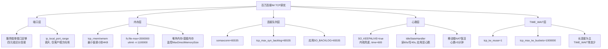

# TCP 高频面试追问

> **一句话定位**：TIME_WAIT/SYN Flood/KeepAlive 是社招高频追问，能讲到内核参数加分。
> **面试热度**：⭐⭐⭐⭐⭐
> **返回**：[网络知识图谱](../README.md)

---

## 一、概念定义

### 1.1 本文定位与前置阅读

本文是 [TCP 连接管理](./tcp-connection.md)（握手/挥手/状态机）与 [TCP 可靠性机制](./tcp-reliability.md)（重传/窗口）的"追问续篇"，聚焦社招面试从那两份文档进一步延伸出的**运维与调参类高频问题**：TIME_WAIT/2MSL、KeepAlive vs 应用层心跳、端口耗尽、SYN Flood/连接队列、SO_REUSEADDR/SO_REUSEPORT。握手与状态机基础不在本文重复，只引用；重传与窗口详见可靠性文档，本文仅在需要时给出反向链接。

### 1.2 TIME_WAIT 定义

TIME_WAIT 是 TCP 11 状态之一（完整状态机见 [TCP 连接管理 §1.4](./tcp-connection.md#14-tcp-11-状态完整状态机)），**只出现在主动关闭方**：发出 FIN、收到对端 FIN 并回出最后一个 ACK 后进入，停留 2MSL 后转入 CLOSED。

| 维度 | 说明 |
|------|------|
| 出现位置 | 主动关闭方（客户端/服务端/同时关闭时双方都会出现） |
| 占用资源 | 一对四元组 `{本地IP, 本地端口, 远端IP, 远端端口}` + 内核 hash 表项 + 重传定时器，约 1.7KB/条 |
| 应用可见性 | 应用已 `close()`，socket 资源回收，但协议栈仍保留连接上下文以应对可能的 FIN 重传 |
| 持续时间 | 2MSL（RFC 793 建议 MSL=2 分钟，故 4 分钟；Linux 实现固定 60 秒） |
| 唯一可写 | 仅能重传最后一个 ACK，不可发数据 |

> **记忆要点**：TIME_WAIT 是"主动方等死"的过渡态，不是 bug，是协议设计的保险期。

### 1.3 2MSL 定义

2MSL = 2 × MSL（Maximum Segment Lifetime，报文最大生存时间）。MSL 是一个 TCP 报文段在网络中能存活的最长时间，超过即被路由器按 TTL=0 丢弃。

| 来源 | MSL | 2MSL | TIME_WAIT 时长 |
|------|-----|------|----------------|
| RFC 793（建议值） | 2 分钟 | 4 分钟 | 4 分钟 |
| Linux 实现（固定） | — | — | 60 秒（不严格等于 2×MSL，是工程取舍） |
| Windows | 2 分钟 | 4 分钟 | 4 分钟（`TcpTimedWaitDelay` 可调，最小 30 秒） |

TIME_WAIT 持续 2MSL 而非 1MSL，是为了覆盖"最后 ACK 丢失 + 对端重传 FIN"的最坏往返，详见 §2.2。

### 1.4 KeepAlive 定义

TCP KeepAlive 是**内核级空闲探测机制**：连接长时间无数据传输时，协议栈自动发探测包，探活对端是否还在，避免连接长时间"假死"（对端主机崩溃、断网、路由丢失，本端却毫不知情）。

四个参数控制行为：

| 参数 | 路径 | 含义 | 默认（Linux） |
|------|------|------|------|
| `tcp_keepalive_time` | `/proc/sys/net/ipv4/tcp_keepalive_time` | 连接空闲多久后开始发探测 | 7200 秒（2 小时） |
| `tcp_keepalive_intvl` | `/proc/sys/net/ipv4/tcp_keepalive_intvl` | 探测间隔 | 75 秒 |
| `tcp_keepalive_probe` | `/proc/sys/net/ipv4/tcp_keepalive_probe` | 探测失败重试次数 | 9 次 |
| `so_keepalive`（per-socket） | `setsockopt(SO_KEEPALIVE)` | 单连接开关 | 默认关 |

默认参数过于宽松：2 小时 + 9×75 秒 ≈ 2.19 小时才发现对端死了，生产基本不可用，必须调小或改用应用层心跳（详见 §2.4、Q3）。

> **作用边界**：KeepAlive 只探活"TCP 连接是否活着"，不探活"应用是否健康"——对端内核回 ACK 但应用死锁/线程满时，KeepAlive 完全无感知。这是应用层心跳必须存在的根本原因。

### 1.5 SYN Flood 定义

SYN Flood 是**经典拒绝服务（DoS）攻击**：攻击者用伪造源 IP 大量发 SYN，服务端每收一个 SYN 就分配半连接并回 SYN-ACK，但永远等不到第三次 ACK，半连接队列被占满，正常用户无法建连。防护核心是 SYN Cookies（不保存半连接，用密码学方法在序号中编码，收到 ACK 反算验证），详见 §2.6 与 [TCP 连接管理 §2.6](./tcp-connection.md#26-syn-cookies-机制)。

**与其它攻击的区别**：

| 攻击 | 层 | 手法 | TCP 状态影响 |
|------|-----|------|--------------|
| SYN Flood | 传输层 | 伪造 SYN 占半连接队列 | 服务端 SYN_RCVD 堆积 |
| 连接耗尽（CC） | 应用层 | 真实建连后不发包/慢发包 | 服务端 ESTABLISHED 堆积 |
| RST 注入 | 传输层 | 伪造 RST 中断合法连接 | 连接被强制复位 |

---

## 二、原理与流程

### 2.1 TIME_WAIT 存在的两个原因

主动关闭方进入 TIME_WAIT 而非直接 CLOSED，是协议设计为可靠性留的两道保险：

#### 原因一：保证最后 ACK 到达，让被动方正常关闭

四次挥手最后一拍是主动方发 ACK（回应被动方的 FIN）。这个 ACK 可能在网络中丢失，被动方收不到就会**重传 FIN**。主动方若已 CLOSED，收到重传 FIN 会回 **RST**，被动方认为连接异常终止（应用可能上报错误日志、连接计数异常）。主动方留在 TIME_WAIT 期间若收到重传 FIN，可**重发最后 ACK**，让被动方顺利进入 CLOSED。

```
主动方(进 TIME_WAIT)            被动方(LAST_ACK)
   │  发 ACK, ack=f+1                │
   │─────────────────────────────────►│  ACK 丢失
   │                                  │  超时重传 FIN
   │◄─────────────────────────────────│
   │  重发 ACK                        │
   │─────────────────────────────────►│  → CLOSED
   │  等 2MSL                         │
   │  ...无新 FIN到达...              │
   └─→ CLOSED
```

#### 原因二：让旧连接的延迟报文消亡，防干扰下一个同四元组连接

同一四元组 `{本地IP, 本地端口, 远端IP, 远端端口}` 可能被快速复用（尤其是客户端 ephemeral port 复用）。若本次连接的延迟报文（滞留路由器中刚到达）混入下一个新连接，新连接会收到序号错乱/重复的"幽灵报文"。TIME_WAIT 持续 2MSL 足以让本次连接的所有延迟报文在网络中过期（TTL 归零），新连接不再受干扰。

> **这两个原因也解释了为什么 TIME_WAIT 在主动关闭方**：被动方收完最后 ACK 即可安全 CLOSED（它的"关闭动作"已被对端 ACK 确认）；主动方发出最后 ACK 后**无法保证对端收到**，必须自己留时间兜底，所以 TIME_WAIT 落在主动方。详见 Q8。

### 2.2 2MSL 的来由

MSL = 报文最大生存时间，由 IP 层 TTL 间接保证（每个路由器跳数 -1，TTL=0 即丢；TCP 工程上把"网络滞留上限"取为 MSL）。**2 倍是为了覆盖一次最坏往返**：

```
时间轴(主动方视角):
  t=0     发出最后 ACK           ─── 最多 1 MSL 到达被动方 ───►
  t=1MSL  若 ACK 丢失,被动方重传 FIN ◄─── 最多 1 MSL 到达主动方 ───
  t=2MSL  主动方必须仍能重发 ACK   ─────────────────────────────►
```

- **第 1 个 MSL**：容忍最后 ACK 在网络中滞留 / 丢失的最长时间。
- **第 2 个 MSL**：容忍被动方重传 FIN 在网络中到达主动方的最长时间。
- 两个方向各覆盖一次 MSL，合计 2MSL，即可覆盖"ACK 丢 + FIN 重传到达"的最坏往返。

**为什么不是 1MSL 或 4MSL**：1MSL 只覆盖单程，无法兜底重传 FIN 的到达；4MSL 是浪费（最坏往返只需 2MSL）。2MSL 是理论下限。

> **Linux 的取舍**：Linux 内核把 TIME_WAIT 固定为 60 秒（`TCP_TIMEWAIT_LEN`），不严格等于 2×MSL=240 秒。这是工程权衡：60 秒已能覆盖绝大多数现实 RTT（广域网也远小于 30 秒），且大幅降低 TIME_WAIT 堆积对端口与内存的压力。RFC 值是保守上界，生产实现可缩短。

### 2.3 TIME_WAIT 过多怎么办

TIME_WAIT 出现在主动关闭方，**短连接服务**（如 HTTP/1.0、爬虫、RPC 短连）若服务端主动关闭，每条连接留 60 秒 TIME_WAIT，堆积导致两个问题：

| 问题 | 现象 | 后果 |
|------|------|------|
| 端口耗尽 | 客户端 ephemeral port（默认 32768-60999，约 2.8 万）占满 | 新建连接报 `Cannot assign requested address` |
| 内核内存 | 每条 ~1.7KB，10 万条约 170MB | 严重时挤压业务内存 |
| hash 表查找开销 | TIME_WAIT hash 表过大，新连接查找变慢 | 微弱 CPU 开销 |

**四个解决手段**（按推荐顺序）：

#### 1. `tcp_tw_reuse=1`（推荐）

允许新连接**复用 TIME_WAIT 状态的本地端口**（仅客户端 outbound 方向），依赖 TCP Timestamps（PAWS）防止旧报文干扰。

```bash
sysctl -w net.ipv4.tcp_tw_reuse=1
# 持久化
echo 'net.ipv4.tcp_tw_reuse = 1' >> /etc/sysctl.conf
```

- 安全性：依赖 PAWS（时间戳），新连接的 SYN 携带更新的时间戳，旧报文时间戳更老会被丢弃，不会混入。
- 仅对 outbound（主动连接）方向生效，不影响服务端 LISTEN 端口。
- Linux 4.10+ 默认即开启（`tcp_tw_reuse` 在新内核默认值已为 2/1）。

#### 2. `tcp_max_tw_buckets` 调大

系统级 TIME_WAIT 总数硬上限，超过后内核**随机杀掉**老的 TIME_WAIT（牺牲"防旧报文"保险换资源）。

```bash
sysctl -w net.ipv4.tcp_max_tw_buckets=1000000
```

- 默认值与内存相关，通常 4096-262144。调大是"允许更多 TIME_WAIT 共存"，不解决根因。
- 设过大要注意内存：100 万条约 1.7GB。

#### 3. 架构调整：让客户端做主动关闭方

让服务端做被动关闭方（收 FIN → CLOSE_WAIT → 立即 `close()`），TIME_WAIT 留给客户端或不创建外部连接的内网节点。HTTP 在 `Connection: close` 场景下通常由客户端先 FIN。详见 [TCP 连接管理 §5.1](./tcp-connection.md#51-高并发短链服务-tcp-连接优化) 短链案例。

#### 4. 用长连接/连接池

从根上减少短连接数。RPC 用长连接池、HTTP 用 keep-alive、数据库用连接池。这是治本方案，前三者是治标。

#### ⚠️ `tcp_tw_recycle` 为什么危险（4.12 内核已移除）

`tcp_tw_recycle=1` 曾是"快速回收 TIME_WAIT"的开关，但它依赖 **per-host 时间戳**（PAWS 假设每条连接来自同一对端的报文时间戳单调递增）。在 **NAT 后端**（公司内网、容器、手机基站）多台内网主机经同一公网 IP 出口时，它们的 TCP 时间戳可能不同步，服务端会**按时间戳丢弃**来自"更老时间戳"主机的 SYN，导致部分客户端**偶发连不上**——典型现象是"少数用户连接超时，换台机器就好"。

```bash
# ❌ 不要再用
sysctl -w net.ipv4.tcp_tw_recycle=1   # 4.12 内核起已被移除, sysctl 报错或无效
```

Linux 4.12（2017 年）已彻底移除该选项，原因正是 NAT 下的踩坑案例太多且无法可靠规避。**面试中应明确说"已废弃，不要用"**，能讲到这一层是加分项。

### 2.4 KeepAlive 机制与为何应用层心跳更可靠

#### 内核 KeepAlive 工作流程

连接 `SO_KEEPALIVE` 开启后，连接空闲达 `tcp_keepalive_time` 秒，内核发一个**探测包**（空 ACK 或 1 字节，seq=旧序号-1）。对端响应：

| 对端响应 | 含义 | 内核行为 |
|---------|------|---------|
| 回 ACK | 对端活着 | 重置计时器，等下一个 `tcp_keepalive_time` |
| 回 RST | 对端已复位连接 | 本端连接立即关闭，应用 `read` 收到 `ECONNRESET` |
| 无响应 | 对端主机崩溃/断网 | 等 `tcp_keepalive_intvl` 秒重试，共 `tcp_keepalive_probe` 次，全部失败后关闭连接 |

**默认总耗时**：7200 + 9×75 = 7875 秒 ≈ 2 小时 12 分钟，才判定对端死了。生产不可用。

#### 为什么应用层心跳更可靠（必考）

| 维度 | TCP KeepAlive | 应用层心跳 |
|------|---------------|-----------|
| 探测层级 | 内核（TCP 协议栈活着？） | 应用层（业务进程能响应？） |
| 默认参数 | 2 小时起探，太慢 | 自定义（IM 常用 60 秒） |
| 粒度 | 全局内核参数或 per-socket 三参数 | per-connection 自定义，灵活 |
| 应用死锁/线程满感知 | ❌ 不感知（内核仍回 ACK） | ✅ 感知（应用不回 Pong） |
| 中间设备兼容性 | 部分防火墙/NAT 丢弃纯 ACK | 应用层心跳有数据，NAT 不丢 |
| 携带业务信息 | ❌ 纯探测 | ✅ 可带时间戳、seq、状态等 |
| 重连策略 | 内核仅关闭连接，不重连 | 应用决定是否重连、如何重连 |

**核心论点**：TCP KeepAlive 只能证明"对端内核的 TCP 栈还活着"，**不能证明"对端应用还活着"**。应用死锁、线程池满、GC 长停顿、数据库连接池耗尽……这些都让内核继续回 ACK，但应用已无法服务。**IM、长连接 RPC、推送**等场景必须用应用层心跳（如 Netty `IdleStateHandler` + 自定义 Ping/Pong 帧），把死连接检测粒度压到分钟级甚至秒级。

> **典型应用层心跳设计**：客户端每 60 秒发 Ping，服务端立即回 Pong；服务端 60+30=90 秒收不到 Ping 即判定客户端僵死，主动 close；客户端 90 秒收不到 Pong 也判定服务端僵死，触发重连。详见 §4.3 Netty 实现。

### 2.5 SO_REUSEADDR / SO_REUSEPORT 与端口耗尽真相

#### 端口耗尽：65535 限制的真相

TCP 端口字段 16 位，最大 65535。但**连接由四元组** `{本地IP, 本地端口, 远端IP, 远端端口}` **唯一标识**，不是由单边端口决定：

- **服务端**：监听一个端口（如 80），可接受任意数量客户端连接，每条连接四元组不同（客户端 IP/端口不同）。理论上单端口可支撑百万连接。
- **客户端 outbound**：本地 ephemeral port（默认 `ip_local_port_range` 32768-60999，约 2.8 万）与目标 IP:端口配对。若固定目标 IP:port，本地端口耗尽在 2.8 万条，无法继续。这就是"端口耗尽"。

| 角色 | 端口限制 | 突破方式 |
|------|---------|---------|
| 服务端 LISTEN | 一个监听端口即可，不受 65535 限 | 天然支撑百万连接 |
| 客户端 outbound | 受 ephemeral port 范围限制 | 调大 `ip_local_port_range`、增加本地出口 IP（多 IP）、`tcp_tw_reuse` 复用 TIME_WAIT |

**IM 单机百万连接**：服务端只需一个 LISTEN 端口，连接四元组靠客户端 IP:port 区分，100 万连接毫无端口问题。瓶颈在**内存**和**fd 上限**，不在端口。详见 §5.1。

```bash
# 调大 ephemeral port 范围（客户端 outbound 用）
sysctl -w net.ipv4.ip_local_port_range='10000 65535'
# 查看当前已用端口数
ss -nt state established | awk '{print $4}' | cut -d: -f2 | sort -u | wc -l
```

#### SO_REUSEADDR

`SO_REUSEADDR`（POSIX 标准，Linux 扩展）解决两类问题：

1. **服务端重启复用 TIME_WAIT 端口**：服务进程崩溃重启时，刚关闭的 LISTEN 端口可能还在 TIME_WAIT（少见，因为 LISTEN socket 不走正常挥手），或此前 accept 出的连接还在 TIME_WAIT 占着同一本地端口。`SO_REUSEADDR` 允许新 socket bind 到该端口，立即重新提供服务，避免"Address already in use"。
2. **通配地址与具体地址的 bind 冲突**：允许一个 socket bind `0.0.0.0:80`（通配），另一个 socket bind `10.0.0.1:80`（具体），内核按"最长前缀匹配"分发连接给具体地址的 socket。

```java
// Java: ServerSocket 复用端口
ServerSocket ss = new ServerSocket();
ss.setReuseAddress(true);   // 必须在 bind 前调用
ss.bind(new InetSocketAddress(8080));
```

#### SO_REUSEPORT（Linux 3.9+）

`SO_REUSEPORT` 允许**多个 socket bind 到完全相同的 {IP, 端口}**，内核把进入的连接/数据包在多个 socket 间**负载均衡**分发。

| 维度 | SO_REUSEADDR | SO_REUSEPORT |
|------|--------------|--------------|
| 解决问题 | TIME_WAIT 端口复用、通配/具体地址冲突 | 多进程/多线程共享同一端口 |
| 多 socket 同 {IP, port} | 仅 Linux 扩展允许，但分发不保证均衡 | 标准支持，内核哈希负载均衡 |
| 连接分发 | 不保证（抢锁竞争） | 内核按四元组哈希分配到 socket |
| 典型用途 | 服务端重启 | Nginx worker、多进程监听同端口 |
| 可用内核 | 通用 | Linux 3.9+ |

**Nginx `reuseport` 场景**：多个 worker 进程各自 bind 同一 `80` 端口（设置 `SO_REUSEPORT`），内核把进入的 SYN 按四元组哈希分给某个 worker，该 worker 独占该连接的 accept。相比"单 accept 锁"模式，减少锁竞争，提升多核利用率。

### 2.6 SYN Flood 与 SYN Cookies、半连接队列保护

半连接队列（SYN Queue）与全连接队列（Accept Queue）的完整定义、参数、满队列行为详见 [TCP 连接管理 §2.5](./tcp-connection.md#25-半连接队列与全连接队列)。这里聚焦**攻击与防护**。

#### SYN Flood 攻击手法

```
攻击者(伪造源IP)          服务端
   │  SYN seq=x1              │
   │─────────────────────────►│ 分配半连接, 回 SYN-ACK, 等ACK
   │  (不回ACK)                │
   │  SYN seq=x2              │
   │─────────────────────────►│ 又一条半连接
   │  ...大量伪造 SYN...       │
   │                          │ SYN Queue 满 → 新 SYN 被丢
   │  正常用户 SYN            │ 正常用户无法建连
   │─────────────────────────►│ ✗ 被丢
```

伪造源 IP 让攻击者自身不被回 SYN-ACK 打爆，且服务端永远等不到 ACK。半连接队列满后，正常用户也被拒绝服务。

#### SYN Cookies 防护原理

SYN Cookies（Bernstein 提出）的核心思想：**握手阶段不保存半连接**，把"半连接状态"编码进 SYN-ACK 的序号里，收到第三次 ACK 时反算验证。

**流程**：

```
1. 服务端收 SYN(四元组, MSS, 时间t)
   计算 ISN = hash(MSS, 四元组, t, 密钥key) 的前24位
            + (t mod 24小时) 的3位编码
            + MSS的3位编码
   不分配半连接! 直接回 SYN-ACK, seq=ISN

2. 客户端回 ACK, ack=ISN+1
   服务端反算: 验证 ack-1 是否符合当前/上一时间窗口的 hash
   通过 → 直接建立连接(ESTABLISHED), 绕过半连接队列
   失败 → 丢弃
```

**优点**：不依赖半连接队列，理论上无上限（实际受 CPU 与 socket 总数限）。

**代价**：

- 丢失 TCP 握手选项（SACK、Window Scale、Timestamps），因为 SYN-ACK 编码空间被序号占用 → 大窗口、选择性重传受影响。
- 无法做 SYN-ACK 早重传（没保存半连接记录）。
- 是**应急机制**，非日常常态。

**配置**：

```bash
# 0=关, 1=默认开(队列满时启用), 2=部分发行版(总是开)
sysctl -w net.ipv4.tcp_syncookies=1
```

> **生产建议**：`tcp_syncookies=1` 应急保留，同时调大 `tcp_max_syn_backlog`、`somaxconn`、应用 `backlog`，前端加 Cloudflare/抗 DDoS 设备拦源头。SYN Cookies 是兜底，不是常态。

### 2.7 连接队列溢出排查

Accept Queue 与 SYN Queue 满时，应用表现为连接超时/重置，但内核有计数可查。命令清单见 [TCP 连接管理 §4.2](./tcp-connection.md#42-ss--netstat-排查连接状态)，这里给出排查决策树：

```
现象: 客户端连接超时 / Connection reset
   │
   ▼
ss -lnt
   │  看 LISTEN 行的 Recv-Q 与 Send-Q
   │  Recv-Q = 当前 Accept Queue 长度(当前已握手未 accept)
   │  Send-Q = Accept Queue 上限 = min(somaxconn, backlog)
   │
   ├─ Recv-Q 接近 Send-Q → Accept Queue 满
   │     ▼
   │     原因: 应用 accept 慢(线程池满/GC/慢调用) 或 somaxconn/backlog 太小
   │     验证: netstat -s | grep -iE "overflowed|overflow|listen"
   │           nstat -az TcpExtListenOverflows TcpExtListenDrops
   │
   └─ Recv-Q=0 但仍连不上 → 看 SYN Queue
         ▼
         netstat -s | grep -iE "SYNs to LISTEN"
         nstat -az TcpExtTCPReqQFullDoCookies TcpExtTCPReqQFullDrop
         ss -n state syn-recv | wc -l   # SYN_RCVD 数
         │
         ├─ 大量 SYN_RCVD → SYN Flood 或握手慢
         └─ 计数为零但连不上 → 可能防火墙/路由问题, tcpdump 抓 SYN
```

**关键命令速查**：

```bash
# Accept Queue 当前长度与上限（LISTEN 状态）
ss -lnt
#   State  Recv-Q  Send-Q  Local Address:Port
#   LISTEN 0       128     0.0.0.0:80
#          ↑       ↑
#     当前长度      上限=min(somaxconn, backlog)

# 累计溢出统计
netstat -s | grep -iE "overflowed|overflow|listen|SYNs to LISTEN"

# 实时精细计数
nstat -az TcpExtListenOverflows TcpExtListenDrops \
        TcpExtTCPReqQFullDoCookies TcpExtTCPReqQFullDrop

# 持续监控
watch -n 1 'nstat -az TcpExtListenOverflows TcpExtListenDrops'

# 抓 SYN 看是否回 SYN-ACK 或 RST
tcpdump -nn -i eth0 'tcp[tcpflags] & tcp-syn != 0 and tcp[tcpflags] & tcp-ack == 0'
```

---

## 三、高频追问与面试题

### Q1：TIME_WAIT 为什么是 2MSL？

**参考答案**：2 倍 MSL 是为了覆盖"最后 ACK 丢失 + 对端重传 FIN"这一最坏往返场景。MSL 是报文最大生存时间，2MSL 拆为两段：

1. **第 1 个 MSL**：容忍主动方最后 ACK 在网络中滞留 / 丢失的最长时间。
2. **第 2 个 MSL**：容忍被动方因未收到 ACK 而重传的 FIN 到达主动方的最长时间。

主动方在 TIME_WAIT 期间若收到重传 FIN，就重发最后 ACK，让被动方正常关闭；若 2MSL 内都没收到重传 FIN，说明最后 ACK 已被收到，可安全 CLOSED。同时 2MSL 也足够让本次连接的所有延迟报文在网络中过期（TTL 归零），防止干扰下一个同四元组的新连接。

**追问**：为什么不是 1MSL 或 4MSL？
> 1MSL 只覆盖单程，无法兜底"FIN 重传到达"的回程时间；4MSL 是浪费，最坏往返只需 2MSL。2MSL 是理论下限，也是 RFC 793 的建议值。Linux 工程上进一步缩短为固定 60 秒（远小于 2×MSL=240 秒），因为现实 RTT 远小于 30 秒，且可降低 TIME_WAIT 堆积压力。

### Q2：TIME_WAIT 过多怎么办？`tcp_tw_recycle` 为什么危险？

**参考答案**：TIME_WAIT 出现在主动关闭方，短连接服务每条连接留 60 秒 TIME_WAIT，堆积导致**端口耗尽**（客户端 ephemeral port 占满报 `Cannot assign requested address`）和**内核内存**膨胀（每条约 1.7KB）。四个解决手段：

1. **`tcp_tw_reuse=1`**（推荐）：允许新连接复用 TIME_WAIT 的本地端口，依赖 Timestamps（PAWS）防旧报文干扰。仅 outbound 方向生效。
2. **`tcp_max_tw_buckets` 调大**：系统级 TIME_WAIT 上限，超过则随机清理老的（牺牲保险换资源）。
3. **架构调整**：让客户端做主动关闭方，服务端做被动方（`Connection: close` 由客户端先 FIN），TIME_WAIT 留在客户端。
4. **用长连接/连接池**：治本，减少短连接数。

`tcp_tw_recycle` 危险在于它依赖 **per-host 时间戳**判断（PAWS 假设同一对端时间戳单调递增）。在 **NAT 后端**（公司内网、容器、手机基站）多台主机经同一公网 IP 出口时，各主机 TCP 时间戳不同步，服务端会按"时间戳更老"丢弃来自部分主机的 SYN，导致**偶发连不上**——典型现象是"少数用户连接超时，换台机器就好"，非常难排查。Linux 4.12（2017 年）已彻底移除该选项，**不要再用**。

**追问**：`tcp_tw_reuse` 为什么不踩 NAT 的坑？
> `tcp_tw_reuse` 只在 **outbound 方向**复用 TIME_WAIT 端口（本端作为客户端发起连接时），复用前用 PAWS 校验新 SYN 的时间戳是否更新，是本端自己的时间戳，不涉及对 NAT 多主机的判断。而 `tcp_tw_recycle` 是在**服务端 inbound 方向**按 per-source-host 时间戳丢弃，才会误杀 NAT 后的不同主机。两者作用方向不同，安全性也不同。

### Q3：TCP KeepAlive 能替代应用层心跳吗？

**参考答案**：不能完全替代，长连接业务（IM/RPC/推送）必须用应用层心跳。三个核心差距：

1. **探测层级不同**：KeepAlive 只证明"对端 TCP 内核栈活着"，不证明"对端应用活着"。应用死锁、线程池满、GC 长停顿、DB 连接池耗尽时，内核仍回 ACK，KeepAlive 完全无感知。应用层心跳（Ping/Pong）要求应用层响应，能感知应用层故障。
2. **参数太慢且不灵活**：KeepAlive 默认 2 小时起探，即便调到 30 秒也是全局内核参数（或 per-socket 三参数），粒度粗。应用层心跳每连接可自定义间隔（IM 常用 60 秒），还可携带业务信息（时间戳、seq、状态）。
3. **NAT/防火墙兼容性**：部分 NAT/防火墙会丢弃纯 ACK 探测包（看起来像"幽灵包"），导致 KeepAlive 失效。应用层心跳有数据载荷，NAT 不丢。

**推荐方案**：TCP KeepAlive 作为兜底（防止应用忘了发心跳时连接假死），应用层心跳作为主探测（精确感知应用健康）。两者并用。

**追问**：应用层心跳间隔怎么定？
> 取决于业务对"死连接感知延迟"的要求。IM 常用 60 秒 Ping + 90 秒（1.5 倍）超时；高频交易用 1-5 秒；推送服务用 120-300 秒省流量。原则：间隔 > 单次 RTT 数倍（避免误判），总超时 < 业务可容忍的"用户掉线感知时间"。配合指数退避避免雪崩重连。

### Q4：服务器端口只有 65535 个，怎么支撑百万连接？

**参考答案**：这是经典误解。TCP 连接由**四元组** `{本地IP, 本地端口, 远端IP, 远端端口}` 唯一标识，**不是由单边端口决定**。

- **服务端**：监听一个端口（如 80）即可，每条连接靠客户端 IP:port 区分四元组。理论上单端口支撑百万连接，瓶颈在内存与 fd 上限，不在端口。
- **客户端 outbound**：本地 ephemeral port（默认约 2.8 万）与固定目标 IP:port 配对才受限。突破方式：调大 `ip_local_port_range`、多本地出口 IP（每个 IP 独立 6.5 万端口）、`tcp_tw_reuse` 复用 TIME_WAIT。

**单机百万连接的真正瓶颈**：

| 瓶颈 | 估算 | 调优 |
|------|------|------|
| 内存（每连接 buffer） | 默认 rmem/wmem 各 8-16KB，100 万约 16-32GB | 调小 `tcp_rmem`/`tcp_wmem` 最小值，ZRAM/大内存机器 |
| 文件描述符 | 每 fd 一个 socket，`ulimit -n` 默认 1024 | `ulimit -n 1100000`、`fs.file-max` 调大 |
| 连接表 hash 槽 | 内核 `tcp_max_tw_buckets`、hash 表大小 | 内核参数或编译时调 |
| CPU | 中断/软中断处理 | RPS/RFS/XPS 多核分发、DPDK |

详见 §5.1 百万连接 IM 案例。

**追问**：那客户端短连接大量调用同一个目标服务时，端口真的会耗尽吗？
> 会。若客户端固定连同一个 `{目标IP, 目标端口}`，本地 ephemeral port 约 2.8 万条用完即报 `Cannot assign requested address`。解决：①调大 `ip_local_port_range`；②`tcp_tw_reuse=1` 复用 TIME_WAIT 端口；③让目标服务部署多实例多 IP，客户端轮询不同目标 IP，本地端口空间 ×N；④改长连接池复用连接。

### Q5：SYN Flood 怎么攻击？怎么防？

**参考答案**：攻击者用**伪造源 IP** 大量发 SYN，服务端每收一个 SYN 就分配半连接并回 SYN-ACK，但永远等不到第三次 ACK，半连接队列被占满，正常用户无法建连。伪造源 IP 让攻击者自身不被回包打爆，且服务端无法溯源。

**五层防御**：

1. **SYN Cookies**（内核兜底）：`tcp_syncookies=1`，半连接队列满时不保存半连接，用密码学方法把状态编码进 SYN-ACK 序号，收到 ACK 反算验证。不依赖队列，理论上无上限。代价是丢失握手选项（SACK/Window Scale/Timestamps）。
2. **调大队列**：`tcp_max_syn_backlog=16384`、`somaxconn=16384`、应用 `backlog` 调大，提高半连接/全连接容量。
3. **缩短重试**：`tcp_synack_retries=2`（默认 5），让无效半连接更快被回收。
4. **前端清洗**：Cloudflare/抗 DDoS 设备在边缘拦 SYN Flood，只放行清洗后的流量到源站。
5. **源验证**：SYN Proxy / SYN Cache（防火墙代答 SYN-ACK，验证客户端重传后才转发到后端）。

**追问**：SYN Cookies 为什么不能作为常态？
> 代价：①丢失 SACK/Window Scale/Timestamps 等握手选项（编码空间被序号占用），影响大窗口与选择性重传；②无半连接记录，无法做 SYN-ACK 早重传，握手延迟略增；③密码学计算有 CPU 开销。它是"队列满时的应急兜底"，不是日常模式。`tcp_syncookies=1` 的语义本身就是"队列满时启用"，平时队列不满时不触发。

### Q6：`SO_REUSEADDR` 和 `SO_REUSEPORT` 区别？

**参考答案**：两者都允许 socket 复用端口，但解决的问题和分发行为不同：

| 维度 | SO_REUSEADDR | SO_REUSEPORT |
|------|--------------|--------------|
| 解决问题 | TIME_WAIT 端口复用、通配/具体地址 bind 冲突 | 多进程/多线程共享同一 {IP, 端口} |
| 多 socket 同 {IP, port} | Linux 扩展允许，但分发不保证均衡 | 标准支持，内核哈希负载均衡 |
| 连接分发 | 不保证（抢锁竞争） | 内核按四元组哈希分配到 socket |
| 典型用途 | 服务端重启避免 "Address already in use" | Nginx worker、多进程监听同端口 |
| 可用内核 | 通用（POSIX） | Linux 3.9+ |

**SO_REUSEADDR 的两类用途**：
1. 服务进程崩溃重启时，原端口可能还在 TIME_WAIT，`SO_REUSEADDR` 允许立即 bind 重新提供服务。
2. 通配 `0.0.0.0:80` 与具体 `10.0.0.1:80` 并存，内核按最长前缀匹配分发。

**SO_REUSEPORT 的核心价值**：多个 worker 进程各自 bind 同一端口，内核把进入的 SYN 按四元组哈希分给某个 worker，该 worker 独占该连接的 accept。相比"单 accept 锁"模式，减少锁竞争，提升多核利用率。Nginx 1.9.1+ 的 `listen 80 reuseport;` 即用此机制。

**追问**：为什么 `SO_REUSEPORT` 要在 Linux 3.9 才支持？
> 早期 BSD 的 `SO_REUSEPORT` 语义是"允许多 socket bind 同端口，但内核分发不保证均衡（可能只发给第一个 socket）"。Linux 3.9 引入的 `SO_REUSEPORT` 在此基础上增加了**内核级哈希负载均衡**（按四元组哈希到 socket），让多进程真正均分连接，这才是生产可用的语义。3.9 之前用 `SO_REUSEADDR` + 用户态 accept 锁模拟，效率低。

### Q7：连接队列满了会怎样？怎么排查？

**参考答案**：连接队列分**半连接队列（SYN Queue）**和**全连接队列（Accept Queue）**（定义见 [TCP 连接管理 §2.5](./tcp-connection.md#25-半连接队列与全连接队列)），满了的表现不同：

**Accept Queue 满**（已握手完成但应用未 accept）：
- `tcp_abort_on_overflow=0`（默认）：内核**丢弃客户端最后 ACK**，客户端重传 ACK 超时后失败，现象是"连接超时无明确错误"，难排查。
- `tcp_abort_on_overflow=1`：内核**直接回 RST**，客户端立即收到 `Connection reset by peer`，快速失败便于发现问题。

**SYN Queue 满**（未握手完成）：
- `tcp_syncookies=0`：丢弃新 SYN，客户端重传 SYN 超时失败。
- `tcp_syncookies=1`（默认）：启用 SYN Cookies 绕过半连接队列，能抗 SYN Flood 但丢失部分选项。

**排查决策树**：
1. `ss -lnt` 看 LISTEN 行：`Recv-Q` 是当前 Accept Queue 长度，接近 `Send-Q`（= min(somaxconn, backlog)）即满。
2. `netstat -s | grep -iE "overflowed|overflow|listen|SYNs to LISTEN"` 看累计溢出计数。
3. `nstat -az TcpExtListenOverflows TcpExtListenDrops` 实时精细计数（Accept Queue 溢出/丢弃）。
4. `nstat -az TcpExtTCPReqQFullDoCookies TcpExtTCPReqQFullDrop` 看 SYN Queue 满时的 cookies 与丢包计数。
5. `ss -n state syn-recv | wc -l` 看 SYN_RCVD 半连接数。
6. 仍定位不到 → `tcpdump -nn 'tcp[tcpflags] & tcp-syn != 0'` 抓 SYN 看是否回 SYN-ACK 或 RST。

**典型根因**：应用 accept 速度跟不上（线程池满、GC 长停顿、慢调用占线程）、`somaxconn` 太小、应用 `backlog` 设置不足。修应用是治本，调内核参数是治标。

**追问**：`tcp_abort_on_overflow` 该不该开？
> 看场景。默认 0（丢 ACK）让客户端重传超时，延迟高但"温和"；设 1（回 RST）让客户端快速失败，便于发现问题但可能放大瞬时故障。生产建议：**有监控且希望快速暴露问题时开 1**；**希望尽量保连接、靠客户端重试自愈时保 0**。配合监控 `TcpExtListenOverflows` 计数告警。

### Q8：为什么 TIME_WAIT 在主动关闭方？

**参考答案**：根因是**最后 ACK 的可靠性由谁兜底**。四次挥手的最后一拍是主动方发 ACK（回应被动方的 FIN）：

- **被动方**：收完这个 ACK 就能安全 CLOSED。它的"关闭动作"（发 FIN）已被主动方的 ACK 确认，后续无需再发任何东西。即便主动方的 ACK 丢了，被动方重传 FIN，主动方仍在 TIME_WAIT 能重发 ACK，被动方最终会收到。
- **主动方**：发出最后 ACK 后，**无法保证被动方收到了**。若被动方没收到，会重传 FIN，主动方若已 CLOSED 会回 RST，被动方连接异常终止。所以主动方必须留在 TIME_WAIT 一段时间（2MSL）以应对可能的 FIN 重传，并让旧报文消亡。

**对称性的不对称**：四次挥手本质是对称的（双方各发一次 FIN、各回一次 ACK），但**最后一拍落在主动方**，所以"等待兜底"的责任也落在主动方。被动方的最后一拍是"收 ACK"，收到即完成；主动方的最后一拍是"发 ACK"，发出后仍需等待确认是否到达。

**同时关闭的特例**：双方同时发 FIN 时，双方都要等对方的 ACK，**双方都进入 TIME_WAIT**（详见 [TCP 连接管理 §2.4](./tcp-connection.md#24-同时关闭与异常路径)）。这是对称场景，不违反"主动方等"的原则——此时双方都是"主动方"。

**追问**：被动方能立即 CLOSED 吗？不等最后 ACK？
> 不能。被动方在 LAST_ACK 状态等最后 ACK，收到才转 CLOSED。若不等（假设收 FIN 立即 CLOSED），最后 ACK 丢了就永远等不到，且若主动方重传 FIN 会触发 RST。被动方必须等 ACK 才能确认"对方知道我关了"。这是四次挥手的对称性要求，TIME_WAIT 的不对称性来自"最后一拍在主动方"。

---

## 四、实战与 Java 生态关联

### 4.1 Linux 内核参数全景表

本文涉及的内核参数集中汇总，便于面试与运维速查。握手/重传/窗口参数详见 [TCP 连接管理 §4.1](./tcp-connection.md#41-linux-内核参数调优) 与 [TCP 可靠性 §4.3](./tcp-reliability.md#43-linux-内核参数与排查)。

| 参数 | 路径 | 含义 | 默认 | 推荐值 |
|------|------|------|------|--------|
| **TIME_WAIT 相关** | | | | |
| `tcp_tw_reuse` | `/proc/sys/net/ipv4/tcp_tw_reuse` | 允许 outbound 复用 TIME_WAIT 端口（依赖 Timestamps） | 0（旧）/2（4.10+） | 1 |
| `tcp_tw_recycle` | — | 快速回收 TIME_WAIT（**4.12 已移除**，NAT 有坑） | — | **禁用** |
| `tcp_max_tw_buckets` | `/proc/sys/net/ipv4/tcp_max_tw_buckets` | 系统级 TIME_WAIT 总数上限，超过随机清理 | 4096-262144 | 100000-1000000 |
| `tcp_fin_timeout` | `/proc/sys/net/ipv4/tcp_fin_timeout` | FIN_WAIT_2 状态超时（被动方不发 FIN 时的兜底） | 60 | 30 |
| **KeepAlive 相关** | | | | |
| `tcp_keepalive_time` | `/proc/sys/net/ipv4/tcp_keepalive_time` | 空闲多久开始探测 | 7200 | 600（10 分钟） |
| `tcp_keepalive_intvl` | `/proc/sys/net/ipv4/tcp_keepalive_intvl` | 探测间隔 | 75 | 30 |
| `tcp_keepalive_probe` | `/proc/sys/net/ipv4/tcp_keepalive_probe` | 探测失败重试次数 | 9 | 3 |
| **SYN Flood / 队列相关** | | | | |
| `tcp_syncookies` | `/proc/sys/net/ipv4/tcp_syncookies` | SYN Cookies 开关（0=关，1=队列满启用，2=总开） | 1 | 1 |
| `tcp_max_syn_backlog` | `/proc/sys/net/ipv4/tcp_max_syn_backlog` | SYN Queue 上限（半连接） | 1024-4096 | 16384 |
| `somaxconn` | `/proc/sys/net/core/somaxconn` | Accept Queue 上限（全连接，系统级） | 128（老）/4096 | 16384 |
| `tcp_abort_on_overflow` | `/proc/sys/net/ipv4/tcp_abort_on_overflow` | Accept Queue 满时行为（0=丢 ACK，1=回 RST） | 0 | 视场景 |
| `tcp_synack_retries` | `/proc/sys/net/ipv4/tcp_synack_retries` | SYN-ACK 重传次数 | 5 | 2（抗 Flood） |
| **端口相关** | | | | |
| `ip_local_port_range` | `/proc/sys/net/ipv4/ip_local_port_range` | 客户端 ephemeral port 范围 | 32768-60999 | 10000-65535 |

**持久化配置示例**：

```bash
cat >> /etc/sysctl.conf <<EOF
# ===== TIME_WAIT =====
net.ipv4.tcp_tw_reuse = 1
net.ipv4.tcp_max_tw_buckets = 1000000
net.ipv4.tcp_fin_timeout = 30

# ===== KeepAlive =====
net.ipv4.tcp_keepalive_time = 600
net.ipv4.tcp_keepalive_intvl = 30
net.ipv4.tcp_keepalive_probe = 3

# ===== SYN Flood / 队列 =====
net.ipv4.tcp_syncookies = 1
net.ipv4.tcp_max_syn_backlog = 16384
net.core.somaxconn = 16384
net.ipv4.tcp_synack_retries = 2

# ===== 端口 =====
net.ipv4.ip_local_port_range = 10000 65535
EOF
sysctl -p
```

### 4.2 Java Socket 选项

Java 通过 `Socket`/`ServerSocket` 暴露 TCP 选项的子集，底层映射到 `setsockopt`。

```java
import java.net.ServerSocket;
import java.net.Socket;

public class TcpOptionsDemo {
    public static void server() throws Exception {
        ServerSocket ss = new ServerSocket();
        // SO_REUSEADDR: 服务端重启时复用 TIME_WAIT 端口（必须 bind 前调用）
        ss.setReuseAddress(true);
        // SO_RCVBUF: 接收缓冲区（影响 rwnd）
        ss.setReceiveBufferSize(64 * 1024);
        // backlog: Accept Queue 期望上限（实际 = min(backlog, somaxconn)）
        ss.bind(new java.net.InetSocketAddress(8080), 4096);
    }

    public static void client() throws Exception {
        Socket s = new Socket();
        // SO_KEEPALIVE: 开启 TCP KeepAlive（全局参数仍由内核控制间隔）
        s.setKeepAlive(true);
        // SO_REUSEADDR: 复用 TIME_WAIT 端口（客户端 outbound）
        s.setReuseAddress(true);
        // TCP_NODELAY: 关闭 Nagle（小包立即发，详见 tcp-reliability.md）
        s.setTcpNoDelay(true);
        // SO_LINGER: close() 行为（0=立即 RST 关闭，>0=等待数据发完）
        s.setSoLinger(false, 0);  // false=不启用，close 正常走挥手
        s.connect(new java.net.InetSocketAddress("10.0.0.1", 8080));
    }
}
```

**Java 选项的局限**：

| 选项 | Java 支持？ | 说明 |
|------|------------|------|
| `SO_KEEPALIVE` | ✅ `setKeepAlive(boolean)` | 仅开关，间隔/次数需改内核参数 |
| `SO_REUSEADDR` | ✅ `setReuseAddress(boolean)` | 完整支持 |
| `SO_REUSEPORT` | ❌ JDK 未直接暴露 | 需 JNI 或用 Netty 的 `EpollChannelOption` |
| KeepAlive 三参数 | ❌ JDK 8 无 | JDK 11+ 通过 `ExtendedSocketOptions` 支持 |
| `TCP_KEEPIDLE`/`TCP_KEEPINTVL`/`TCP_KEEPCNT` | ❌ JDK 8 | 需 JNI 或 Netty `EpollChannelOption` |

> **生产建议**：Java 层只做开关（`setKeepAlive(true)` + `setReuseAddress(true)`），间隔由内核参数统一管；应用层心跳用 Netty `IdleStateHandler` 实现，不依赖 KeepAlive。

### 4.3 Netty IdleStateHandler 心跳

Netty 的 `IdleStateHandler` 在 pipeline 中检测连接空闲，触发 `IdleStateEvent`，业务据此发 Ping 或关连接。这是应用层心跳的标准实现。

```java
import io.netty.channel.ChannelHandlerContext;
import io.netty.channel.ChannelInboundHandlerAdapter;
import io.netty.handler.timeout.IdleState;
import io.netty.handler.timeout.IdleStateEvent;
import io.netty.handler.timeout.IdleStateHandler;
import java.util.concurrent.TimeUnit;

public class ImServerInitializer extends ChannelInitializer<SocketChannel> {
    @Override
    protected void initChannel(SocketChannel ch) {
        ch.pipeline()
            // 空闲检测: 60s 未读 / 40s 未写 / 120s 无任何活动
            // 读空闲=对端不发数据(可能僵死), 写空闲=本端没数据发(主动发 Ping)
            .addLast("idle", new IdleStateHandler(60, 40, 0, TimeUnit.SECONDS))
            // 业务心跳处理
            .addLast("heartbeat", new HeartbeatHandler())
            // ...其他业务 Handler
            ;
    }
}

class HeartbeatHandler extends ChannelInboundHandlerAdapter {
    private static final Object PING = new Object();  // 心跳帧, 实际为自定义协议的 Ping

    @Override
    public void userEventTriggered(ChannelHandlerContext ctx, Object evt) throws Exception {
        if (evt instanceof IdleStateEvent) {
            IdleStateEvent e = (IdleStateEvent) evt;
            if (e.state() == IdleState.READER_IDLE) {
                // 60s 没收到对端任何数据 → 判定僵死, 关连接
                ctx.close();
                return;
            }
            if (e.state() == IdleState.WRITER_IDLE) {
                // 40s 没向对端发数据 → 主动发 Ping 探活
                ctx.writeAndFlush(PING);
            }
        } else {
            super.userEventTriggered(ctx, evt);
        }
    }
}
```

**空闲检测三维度**：

| 维度 | 触发条件 | 典型用途 |
|------|---------|---------|
| `readerIdleTime` | N 秒未收到对端任何数据 | 判定对端僵死，关连接 |
| `writerIdleTime` | N 秒未向对端发数据 | 触发主动 Ping 探活 |
| `allIdleTime` | N 秒无任何收发 | 兜底，一般设 0 不用 |

**心跳间隔设计原则**：
- `readerIdleTime` > Ping 间隔 + 单次 RTT 数倍，避免误判。
- `writerIdleTime` < `readerIdleTime`，先发 Ping 再等 Pong。
- 客户端与服务端两侧都装 `IdleStateHandler`，双向探活。

> **与 TCP KeepAlive 并用**：Netty 层 `childOption(ChannelOption.SO_KEEPALIVE, true)` 开内核兜底，`IdleStateHandler` 做主探测。前者防"应用忘了发心跳"，后者精确感知应用层健康。

---

## 五、系统设计案例

### 5.1 百万连接 IM 服务器 TCP 调优

**需求**：单机支撑 100 万长连接的 IM 推送服务，客户端为移动端 App，长连接保活，消息推送延迟 < 1 秒，连接波动时（用户网络切换、App 重启）能快速重建连接。

**问题分析**：

| 维度 | 瓶颈 | 估算 |
|------|------|------|
| 端口 | 服务端单端口无瓶颈（四元组区分），客户端 outbound 才受限 | 服务端 1 端口足够 |
| 内存 | 每连接 rmem+wmem 默认各 8-16KB，100 万约 16-32GB | 需调小最小 buffer |
| fd 上限 | `ulimit -n` 默认 1024，`fs.file-max` 系统级 | 需调到 110 万+ |
| 连接队列 | 滚动重启/断网恢复时百万级重连洪峰，Accept Queue 易溢出 | `somaxconn`/`backlog` 调大 |
| 心跳 | 移动端 NAT 超时通常 5-10 分钟，KeepAlive 默认 2 小时太慢 | 应用层 60 秒心跳 |
| TIME_WAIT | IM 是长连接，常态 TIME_WAIT 少；重连洪峰时短暂堆积 | `tcp_tw_reuse=1` 兜底 |

**调优方案**：



**参数清单**：

```bash
# ===== 1. 端口（服务端无瓶颈，仅客户端方向调优） =====
# ip_local_port_range: IM 服务端作为客户端连 Redis/DB 时用
sysctl -w net.ipv4.ip_local_port_range='10000 65535'

# ===== 2. 内存（百万连接关键瓶颈） =====
# 调小每连接 buffer 最小值（仅在连接空闲时生效，活跃时自动涨）
# min: 最小值, default: 默认, max: 自动调优上限
sysctl -w net.ipv4.tcp_rmem='4096 87380 16777216'   # 4KB / 87KB / 16MB
sysctl -w net.ipv4.tcp_wmem='4096 16384 16777216'   # 4KB / 16KB / 16MB
sysctl -w net.core.rmem_max=16777216
sysctl -w net.core.wmem_max=16777216

# 文件描述符上限（每连接 1 个 socket = 1 个 fd）
echo 'fs.file-max = 2000000' >> /etc/sysctl.conf
sysctl -w fs.file-max=2000000
# 进程级（在 /etc/security/limits.conf 或 systemd LimitNOFILE）
# * soft nofile 1100000
# * hard nofile 1100000
ulimit -n 1100000

# ===== 3. 连接队列（重连洪峰保护） =====
sysctl -w net.core.somaxconn=65535
sysctl -w net.ipv4.tcp_max_syn_backlog=65535
# 应用层: Netty b.option(ChannelOption.SO_BACKLOG, 65535)

# ===== 4. 心跳（移动端 NAT 保活 + 应用层探活） =====
sysctl -w net.ipv4.tcp_keepalive_time=600   # 10 分钟（兜底）
sysctl -w net.ipv4.tcp_keepalive_intvl=30
sysctl -w net.ipv4.tcp_keepalive_probe=3
# 应用层: Netty IdleStateHandler(60s读/40s写), 60秒Ping + 90秒超时关连接

# ===== 5. TIME_WAIT（长连接常态少，重连洪峰兜底） =====
sysctl -w net.ipv4.tcp_tw_reuse=1
sysctl -w net.ipv4.tcp_max_tw_buckets=1000000

# ===== 6. SYN Flood（IM 是公网服务，必开） =====
sysctl -w net.ipv4.tcp_syncookies=1
sysctl -w net.ipv4.tcp_synack_retries=2
```

**Netty 服务端配置**：

```java
ServerBootstrap b = new ServerBootstrap();
b.group(bossGroup, workerGroup)
 .channel(NioServerSocketChannel.class)
 // 连接队列
 .option(ChannelOption.SO_BACKLOG, 65535)
 .option(ChannelOption.SO_REUSEADDR, true)
 .childOption(ChannelOption.TCP_NODELAY, true)
 .childOption(ChannelOption.SO_KEEPALIVE, true)   // 内核 KeepAlive 兜底
 .childOption(ChannelOption.SO_RCVBUF, 8 * 1024)   // 接收 buffer 最小
 .childOption(ChannelOption.SO_SNDBUF, 8 * 1024)  // 发送 buffer 最小
 .childHandler(new ChannelInitializer<SocketChannel>() {
     @Override
     protected void initChannel(SocketChannel ch) {
         ch.pipeline()
             // 应用层心跳: 60s 读空闲 / 40s 写空闲
             .addLast(new IdleStateHandler(60, 40, 0, TimeUnit.SECONDS))
             .addLast(new HeartbeatHandler())
             .addLast(new ImMessageDecoder())
             .addLast(new ImMessageEncoder())
             .addLast(new ImBusinessHandler());
     }
 });
```

**容量规划与监控**：

| 指标 | 目标 | Prometheus 指标 |
|------|------|-----------------|
| 连接数 | 100 万 | `netty_active_connections` |
| 内存 | rmem+wmem < 32GB | `node_memory_MemAvailable` |
| fd 数 | < 110 万 | `process_open_fds` |
| Accept Queue | Recv-Q < somaxconn × 0.8 | `node_netstat_TcpExt_ListenOverflows` |
| TIME_WAIT | < 10 万 | `node_sockstat_TCP_tw` |
| 心跳超时关连接 | 看趋势 | `im_heartbeat_timeout_total` |

**为什么不直接全靠 TCP KeepAlive**：

1. 移动端 NAT 超时通常 5-10 分钟（运营商策略），KeepAlive 默认 2 小时根本保不住连接，必须应用层 60 秒心跳。
2. IM 要感知"用户是否在线"（应用层状态），KeepAlive 只知"TCP 是否活着"，不知"IM 应用是否响应"。
3. 应用层心跳可携带业务信息（如最后消息 seq，重连后补推）。

**容灾设计**：
- **重连洪峰**：滚动重启时百万客户端同时重连，Accept Queue 易溢出。客户端加**随机退避**（0-60 秒随机抖动），避免瞬时洪峰。
- **单机故障**：客户端连其他节点，路由层（LVS/网关）健康检查摘除故障节点。
- **脑裂**：长连接 + 心跳双向探活，避免半开连接。

---

## 六、参考与延伸

- RFC 793（TCP 核心规范，定义 MSL/TIME_WAIT）、RFC 1122（TCP 实现要求，KeepAlive 规则）、RFC 1337（TIME_WAIT 重用与 PAWS 安全性讨论）
- Linux 内核文档：`Documentation/networking/ip-sysctl.txt`、`tcp(7)`/`socket(7)` man 手册、`TCP_TIMEWAIT_LEN`（`include/net/tcp.h`，固定 60 秒）
- SYN Cookies：D. J. Bernstein 原始论文《SYN Cookies》、`tcp_syncookies` 内核文档
- SO_REUSEPORT：Linux 3.9 引入，内核文档 `Documentation/networking/multiqueue.txt`、Nginx `listen ... reuseport` 文档
- 延伸阅读：[TCP 连接管理](./tcp-connection.md)（握手/挥手/状态机/半连接队列/SYN Cookies 基础）、[TCP 可靠性机制](./tcp-reliability.md)（重传/窗口/PAWS）、[TCP 拥塞控制](./tcp-congestion.md)（cwnd/BBR）、[UDP/QUIC](./udp-quic.md)
- 仓库内关联：`java-core/rmi`（TCP 长连接 RPC 的 KeepAlive 与超时）、`framework/spring-framework`（WebSocket 心跳）、[HTTP](../01-application/http.md)（keep-alive 与短连接 TIME_WAIT）、[HTTPS/TLS](../01-application/https-tls.md)（长连接之上的 TLS 心跳）

> **返回**：[网络知识图谱](../README.md)
