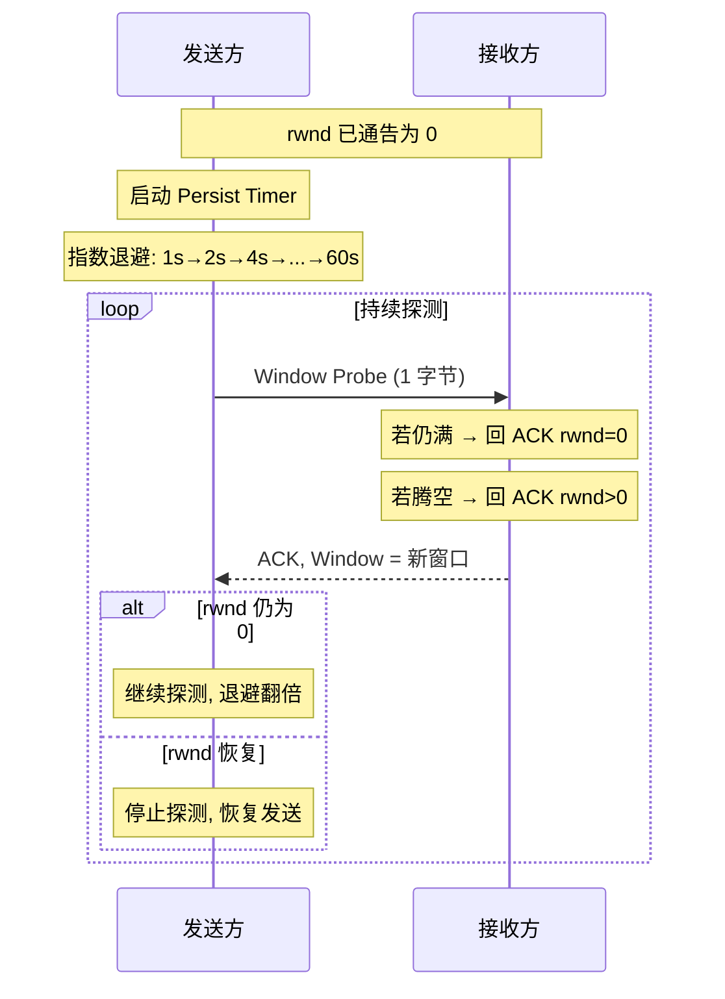

# TCP 可靠性机制

> **一句话定位**：重传/滑动窗口/流量控制是 TCP 可靠传输的三大支柱，粘包拆包是 Java 网络编程高频题。
> **面试热度**：⭐⭐⭐⭐⭐
> **返回**：[网络知识图谱](../README.md)

---

## 一、概念定义

### 1.1 TCP 字节流特性与可靠传输的定义

TCP 之所以被称为"可靠"的传输层协议，是因为它在不可靠的 IP 层之上构建了一套**端到端的可靠传输机制**。这一定义可以拆解为三个子目标：

| 目标 | 含义 | 保障机制 |
|------|------|---------|
| 不丢 | 应用写入的数据对端一定能收到 | 序号 + 确认 + 超时重传 + 快重传 + SACK |
| 不乱 | 数据按写入顺序交付应用 | 32 位字节序号 + 按序号重组 |
| 不重 | 重复报文被识别并丢弃 | 序号去重 + PAWS 时间戳防序号回绕 |

而**面向字节流**是 TCP 的另一根本特性，它既是可靠性的基础，也是粘包/拆包问题的根因：

1. **无边界**：应用层调用一次 `write(1000B)` 不等于对端一次 `read` 收到 1000B。TCP 把应用数据看作一连串**无结构的字节流**，按 MSS 切段、按字节编号，发送与接收边界都由协议栈决定。
2. **按字节编号**：每个字节都有一个 32 位序号，TCP 用序号做确认、重组、去重。这与 UDP 的"面向报文、保留边界"形成鲜明对比。
3. **一次写入 ≠ 一次发送**：写入 4KB 可能被切成 3 个段（MSS=1460）发出；写入 10B 也可能被 Nagle 算法攒着等下一个数据包合并发出。
4. **一次接收 ≠ 一次读取**：接收端把字节流攒在接收缓冲区，应用 `read` 时拿到的可能是半个包、一个包、或多个半包的拼接。**应用层必须自行定界**（定长/分隔符/长度前缀），否则出现粘包拆包。

> **与 [TCP 连接管理](./tcp-connection.md) 的关联**：连接建立（三次握手）同步双方初始序号（ISN）后，可靠性机制才开始运转；连接释放（四次挥手）保证半关闭期间对端剩余数据可靠交付。本文聚焦 ESTABLISHED 状态下的可靠传输，状态机详见 [TCP 连接管理 §2.3](./tcp-connection.md#23-tcp-11-状态完整状态机)。

### 1.2 序号与确认号

序号（Sequence Number）与确认号（Acknowledgment Number）是 TCP 可靠性的"坐标系"。首部字段定义见 [TCP 连接管理 §1.2](./tcp-connection.md#12-tcp-首部格式)，这里聚焦其语义：

- **序号 seq**：本报文段所携带数据部分**第一个字节**的字节编号。
  - SYN 报文虽不携带数据，但**消耗一个序号**（seq 字段值为 ISN，后续数据从 ISN+1 起算）。
  - FIN 报文同理消耗一个序号，用于保证 FIN 被确认。
  - 纯 ACK 不携带数据，不消耗序号。
- **确认号 ack**：**期望收到对端下一个字节的序号**，即"序号 < ack 的数据我已全部收到"。
  - ACK 标志位为 1 时 ack 字段才有效（除初始 SYN 外几乎所有报文 ACK=1）。
  - 确认是**累积的**：ack=1001 表示"1~1000 已收到"，即使中间收到过 ack=500 的确认。
  - 累积确认的代价：若 1001~2000 丢失，即使后续 2001~3000 到达，ack 仍停留在 1001，发送方无法仅凭 ack 知道 2001~3000 已到 → 这正是 **SACK** 要解决的问题。

**序号空间与回绕**：32 位序号空间约 4.29×10⁹。在 1Gbps 链路上约 34 秒即可回绕一圈。RFC 1323 的 **PAWS（Protect Against Wrapped Sequence）** 机制配合 Timestamps 选项，用时间戳判定新报文，防止回绕后旧报文冒充新数据。

### 1.3 可靠传输的三次交互模型

TCP 可靠性建立在"**发送 → 确认 → 超时重传**"的闭环之上，可归纳为三次交互：

1. **发送方编号发送**：从发送缓冲区取出 ≤ min(cwnd, rwnd, MSS) 的字节，打上序号发出，**存入"已发送未确认"队列**，启动重传定时器。
2. **接收方按序确认**：收到报文校验通过后放入接收缓冲区，按序号去重重组。若 seq 正好等于期望序号，回 ACK（ack = 新的期望序号）；若乱序到达，**默认回重复 ACK**（ack 仍停留在旧值）。
3. **发送方根据 ACK 推进窗口**：收到 ack 后，把"已发送未确认"队列中序号 < ack 的数据移出（已确认），发送窗口前沿前移，允许新数据进入。若超时未收到 ack，**重传**；若连续收到 3 个重复 ACK，触发**快重传**。

> 这套机制与 [TCP 连接管理](./tcp-connection.md) 的握手/挥手共享同一套序号体系：握手同步 ISN 是"建立坐标系"，挥手 FIN 各消耗一个序号是为了保证关闭动作本身可被确认。

---

## 二、原理与流程

### 2.1 确认与重传

#### 2.1.1 超时重传与 RTO 计算

TCP 对每个已发送未确认的段启动**重传定时器（RTO, Retransmission Timeout）**。超时未收到 ACK 即重传，并进入指数退避（RTO 翻倍）。

RTO 不能写死，必须**自适应**网络往返时延 RTT。RFC 6298 定义的经典算法如下：

```
首次测量 RTT (SampleRTT):
    SRTT  ← SampleRTT              # 平滑 RTT
    RTTVAR ← SampleRTT / 2         # RTT 方差

后续测量 SampleRTT:
    RTTVAR ← (1-β) * RTTVAR + β * |SampleRTT - SRTT|     # β = 1/4
    SRTT   ← (1-α) * SRTT + α * SampleRTT                 # α = 1/8
    RTO ← SRTT + max(G, 4 * RTTVAR)                        # G = 时钟粒度

重传后未收到新 ACK (指数退避):
    RTO ← 2 * RTO                   # 翻倍, 不再用新 RTT 样本
```

**关键点**：

- **SRTT（Smoothed RTT）**：指数加权移动平均（EWMA），α=1/8，对新样本平滑。
- **RTTVAR（RTT Variation）**：方差估计，β=1/4。
- **RTO = SRTT + max(G, 4·RTTVAR)**：留 4 倍方差余量，避免误判超时。
- ** Karn 算法**：重传的报文不能用于测量 RTT（无法分辨 ACK 是对原报文还是重传报文的确认），否则会污染 RTT 样本。
- **指数退避**：重传后 RTO 翻倍，连续重传持续翻倍，直到上限或收到新 ACK 重置。
- **下限与上限**：RTO 下限通常 200ms-1s，上限 60s-120s（实现相关）。
- **Linux 实测**：`ss -i` 可查看每连接 `rto`、`rtt`、`srtt`。

#### 2.1.2 快重传（Fast Retransmit）

超时重传代价大（RTO 通常几百毫秒到秒级，且退避）。快重传让发送方在**超时前**就重传丢失段：

**触发条件**：连续收到 **3 个重复 ACK**（即同一 ack 号出现 4 次，含首次）。

**原理**：接收方收到乱序段会立即回重复 ACK（ack 停留在期望序号）。3 个重复 ACK 几乎确定某个段丢了——因为接收方收到 3 个乱序段说明后续数据仍在到达，唯独中间空缺。

```
发送序号:    1     2     3     4     5     6
正常确认:    ACK1  ACK2  ACK3  ACK4  ACK5  ACK6
丢包3:       ACK1  ACK2  ---   ACK2  ACK2  ACK2
                                  ↑     ↑     ↑
                              重复1  重复2  重复3 → 触发快重传段3
```

快重传后不进入慢启动（那是拥塞控制的事，详见 [TCP 拥塞控制](./tcp-congestion.md)），而是配合**快恢复**：ssthresh = cwnd/2，cwnd = ssthresh，线性增长。

#### 2.1.3 SACK（Selective ACK，选择性确认）

累积确认的缺陷：若 1001~2000 丢失，但 2001~5000 都到了，接收方 ack 停在 1001，发送方不知道 2001~5000 已到达，超时/快重传时**可能把 2001~5000 全部重传**——浪费带宽。

**SACK 机制**（RFC 2018）：

- 握手时双方通过 `Kind=4 (SACK-Permitted)` 选项协商支持 SACK。
- 数据传输时，ACK 报文携带 `Kind=5 (SACK)` 选项，**列出已收到的非连续字节块范围**。
- 每个块用 `[左边界, 右边界)` 表示，最多携带 3 块（受选项长度 40 字节限制，考虑 NOP 对齐）。
- 发送方据此只重传真正缺失的段，避免冗余重传。

**SACK 选项格式**：

```
+--------+--------+--------+--------+
| Kind=5 | Length |   Left Edge 1 (块1左边界)  |
+--------+--------+--------+--------+
|   Right Edge 1 (块1右边界)        |
+--------+--------+--------+--------+
|   Left Edge 2  |   Right Edge 2  |  ... 最多4块
+--------+--------+--------+--------+
```

**示例**：发送 1~5000，其中 1001~2000 丢失，接收方 SACK 选项携带 `[{1,1001},{2001,3001},{3001,4001},{4001,5001}]`（简化表示），发送方据此只重传 1001~2000。

> **SACK 与窗口缩放、Timestamps 一起是 RFC 1323/2018 的"高 BDP 管道三件套"**。Linux 默认开启：`sysctl net.ipv4.tcp_sack=1`。SYN Cookies 模式下 SACK 选项丢失（详见 [TCP 连接管理 §2.6](./tcp-connection.md#26-syn-cookies-机制)）。

### 2.2 滑动窗口

滑动窗口是 TCP **流量控制与收发同步的核心数据结构**。它同时存在于发送端与接收端，本质上是一段"允许操作的序号区间"。

#### 2.2.1 发送窗口与接收窗口

**发送窗口（Send Window）**：发送端维护的"对端允许我发送但还未确认"的字节区间。由两部分组成：

- **已发送未确认**：已发出但未收到 ACK，必须保留在缓冲区以备重传。
- **允许发送未发送**：对端通告窗口允许发，但应用还没写入或发送方还没取走。

**接收窗口（Receive Window, rwnd）**：接收端缓冲区中"还能容纳的字节数"。通过 ACK 报文首部的**窗口字段（Window）**通告给发送方。

**二者关系**：发送窗口大小 ≤ min(接收通告窗口 rwnd, 拥塞窗口 cwnd)。本文聚焦 rwnd，cwnd 详见 [TCP 拥塞控制](./tcp-congestion.md)。

#### 2.2.2 窗口字段与窗口移动

TCP 首部 16 位 **Window 字段**通告"本端剩余接收缓冲区大小"（详见 [TCP 连接管理 §1.2](./tcp-connection.md#12-tcp-首部格式)）。配合 **Window Scale 选项**（Kind=3，握手时协商左移位数 0-14），窗口最大可达 1GB，解决高 BDP 链路 64KB 上限不足的问题。

**窗口移动规则**（以发送窗口为例，假设窗口 [base, base+N)）：

1. 收到 ack = base+k，则 **base 前移到 base+k**（左边界后移，称为"窗口滑动"）。
2. 若新通告窗口 rwnd 变化，**右边界**相应前移或后移（窗口缩放）。
3. **左边界只能前移**（已确认数据不可回退）；右边界可前可后，但右边界 < 左边界是非法的。
4. 窗口为 0 时，发送方不得发新数据（除探测段）。

#### 2.2.3 发送窗口四区间（ASCII 图）

发送窗口把整个序号空间划分为四个区间。设当前已确认到序号 `A`，窗口前沿到 `W`，已写入应用数据到 `B`，总缓冲区上界 `U`：

```
序号空间 →
┌──────────────────────┬────────────────────────┬──────────────────────┬────────────────────────┐
│   1. 已发送已确认     │   2. 已发送未确认       │   3. 允许发送未发送   │   4. 不可发送          │
│   (已收到ACK,         │   (已发出,未收到ACK,    │   (在窗口内,应用已    │   (超出窗口右沿,        │
│    可释放缓冲区)      │    需保留以备重传)       │    写入或可写入)      │    等窗口前移后才能发)  │
└──────────────────────┴────────────────────────┴──────────────────────┴────────────────────────┘
                       ↑                        ↑                        ↑
                       A=已确认序号              W=窗口前沿=A+rwnd         B=应用已写入序号
                       (左边界)                  (右边界)                 (发送指针)

窗口滑动后:
   收到 ack=A+k  →  A 前移到 A+k  →  窗口整体右移 k  →  区间4中 k 字节进入区间3(可发)
   接收方通告 rwnd 缩小 →  W 左移(收缩), 区间3变窄
   接收方通告 rwnd 扩大 →  W 右移(扩张), 区间3变宽
```

**四区间含义**：

| 区间 | 名称 | 字节范围 | 处理 |
|------|------|---------|------|
| 1 | 已发送已确认 | [1, A) | 已收到 ACK，**可从缓冲区释放** |
| 2 | 已发送未确认 | [A, W) 中的已发部分 | 已发出未确认，**必须保留以备重传** |
| 3 | 允许发送未发送 | [已发部分, W) | 在窗口内，**可立即发送** |
| 4 | 不可发送 | [W, ∞) | 超出窗口前沿，**禁止发送** |

> **面试口诀**：左边界=已确认序号 A，右边界=A+rwnd。收到 ACK → A 前移 → 窗口滑动；rwnd 变化 → 右边界移动 → 窗口缩放。区间 2 是重传责任区，区间 3 是发送候选区。

### 2.3 流量控制

流量控制是**接收方主导**的"别发太快我跟不上"机制，本质是滑动窗口在 rwnd 维度的调节。

#### 2.3.1 窗口探测与零窗口

当接收方缓冲区满，通告 **rwnd=0**，发送方停止发送新数据。但接收方缓冲区腾空后必须通知发送方——这个通知本身也是一个 ACK，**万一丢了，发送方永远不知道窗口恢复，连接死锁**。

**破局机制**：

1. **坚持定时器（Persist Timer / Zero Window Probe Timer）**：发送方在收到 rwnd=0 后启动该定时器，到期发**窗口探测段（Window Probe）**，强制对端回 ACK 通告最新窗口。探测段通常携带 1 字节数据（序号占用一个字节，需被确认）。
2. **指数退避**：探测间隔翻倍（典型从 ~1s 起，上限 ~60s），避免频繁打扰。
3. **粘性更新**：接收方窗口恢复后，只在窗口"显著"恢复（≥ MSS 或 ≥ 半缓冲区）时才通告，避免 silly window syndrome（见下）。

**零窗口场景下的报文交互**：



#### 2.3.2 糊涂窗口综合征（Silly Window Syndrome）

**问题**：若接收方每收 1 字节就通告窗口=1，发送方每收 rwnd=1 就发 1 字节报文，效率极低（有效载荷占比 1/41 ≈ 2.4%）。

**双端解法**：

- **接收端 David Clark 算法**：只在窗口 ≥ max(MSS, 缓冲区/2) 时才通告新窗口；否则通告 rwnd=0。避免小窗口通告。
- **发送端 Nagle 算法**：见 §2.5，攒够数据或等 ACK 再发，避免小包。

#### 2.3.3 窗口缩放选项

详见 [TCP 连接管理 §1.3](./tcp-connection.md#13-tcp-选项)：握手时 `Kind=3 Window Scale` 协商左移位数 0-14，窗口最大 1GB。注意：

- **仅 SYN/SYN-ACK 报文有效**，数据传输期间 Window 字段含义不变，但接收方按协商因子左移通告值。
- **双向独立**：A→B 与 B→A 各自协商，可不对称。
- **协商失败回退**：若一方不支持，则该方向窗口上限 65535。

### 2.4 粘包拆包

**粘包拆包不是 TCP 的 bug，而是字节流特性的必然结果**。"包"是应用层概念，TCP 只保证字节流可靠交付，不保证应用层消息边界。

#### 2.4.1 成因

```
发送方写 3 次:  "AB"  "CDEF"  "GHIJ"
TCP 字节流编号:  1-2   3-6     7-10
                                    ↓ 按 MSS 切段与网络发送
可能到达对端的形式:
  情况1 (粘包):  "ABCDEFGHIJ"      一次 read 读到 10 字节 = 3 个消息粘在一起
  情况2 (拆包):  "AB"  "CDE"  "FGHIJ"  第二次发送被切两段
  情况3 (混粘拆): "ABC" "DEFG" "HIJ"  既粘又拆
```

**根因四要素**：

1. **字节流无边界**：TCP 按字节编号切段，不保留应用 write 边界。
2. **MSS 切段**：一次 write 超过 MSS 被切成多段（拆包）。
3. **接收缓冲区**：多个小段到达后被攒在缓冲区，应用一次 read 读到多个消息（粘包）。
4. **发送速率与 Nagle**：多个小 write 被 Nagle 合并成一个段发出（粘包）。

#### 2.4.2 三种解法

| 解法 | 原理 | 优点 | 缺点 | 典型场景 |
|------|------|------|------|---------|
| **定长消息** | 每条消息固定 N 字节，不足补齐 | 实现简单，无需解析 | 浪费带宽，扩展差 | 金融 FIX 协议、老式工控 |
| **分隔符** | 消息末尾加特殊字节（如 `\n`、`\0`） | 文本友好，可读 | 分隔符不能出现在正文，需转义 | HTTP 头（`\r\n\r\n`）、Redis 协议、行式协议 |
| **长度字段（TLV/LV）** | 消息头含长度字段，载荷按长度读取 | 通用、高效、支持二进制 | 需定义头部格式，跨语言需约定字节序 | Thrift、Protobuf、Netty LengthFieldBasedFrameDecoder |

> **生产首选长度字段法**：天然适配二进制协议，零拷贝，Netty 有现成解码器。详见 §4。

### 2.5 Nagle 算法 vs Delayed ACK、TCP_Cork

三者都是"小包优化"，但目标与行为不同，常常被混淆。

#### 2.5.1 Nagle 算法

**目标**：减少小包数量，提高网络效率。RFC 896。

**规则**：当连接中存在"已发送未确认"的小包（小于 MSS）时，**后续小数据要攒在发送缓冲区，等前面 ACK 到达或攒够 MSS 才发**。

- 大块数据（≥ MSS）立即发。
- 小块数据若前面无未确认数据，立即发；若前面有未确认，攒着。
- 收到 ACK 后，攒下的数据一并发出。

**收益**：交互式 telnet/SSH 等场景减少小包数量；**代价**：增加延迟（最多一个 RTT），对延迟敏感场景不友好。

#### 2.5.2 Delayed ACK（延迟确认）

**目标**：让 ACK 有机会"捎带"数据，减少纯 ACK 数量。RFC 1122。

**规则**：接收方收到数据后**不立即回 ACK**，等待一小段时间（典型 40ms-200ms，最大 ≤ 500ms）：

- 若期间有数据要发给对端，ACK 随数据捎带（piggyback）。
- 若窗口有显著变化，单独发 ACK 通告新窗口。
- 若收到第二个报文段（按序），立即回 ACK（第二段触发确认）。
- 超时（如 200ms）未触发，发纯 ACK。

**收益**：减少纯 ACK 数量，尤其全双工双向通信；**代价**：发送方更晚收到 ACK，可能拖慢窗口推进。

#### 2.5.3 Nagle + Delayed ACK 的死锁

**经典问题**：两者一起启用时，会陷入"互相等待"死锁：

1. 发送方（Nagle）发了一个小包 P1，等 ACK 才发后续小包 P2。
2. 接收方（Delayed ACK）收到 P1 后**故意不立即回 ACK**，等超时或第二段。
3. 但发送方的 P2 被 Nagle 卡住不发，接收方永远等不到第二段。
4. 直到 Delayed ACK 超时（200ms）才回 ACK，发送方才发 P2。

**后果**：小数据交互场景（如 HTTP 头+请求体、Redis PIPELINE 中的单条小命令）出现 **200ms 量级延迟毛刺**。

**解法**：

- **关闭 Nagle**：`TCP_NODELAY=1`，禁用 Nagle，小包立即发。绝大多数现代应用（HTTP/Redis/MySQL RPC）默认开启。
- **关闭 Delayed ACK**：`TCP_QUICKACK=1`（Linux），立即回 ACK。较少用，副作用是纯 ACK 增多。
- **同时关闭**：彻底消除死锁，代价是小包数量上升，适合 LAN/低延迟场景。

#### 2.5.4 TCP_Cork

**目标**：比 Nagle 更激进的批量发送，应用层控制"攒包"窗口。Linux 扩展。

**规则**：设置 `TCP_CORK=1` 后，**所有小数据强制攒在发送缓冲区**，直到：

- 攒满 MSS，或
- 应用显式 `TCP_CORK=0`（"拔塞子"，立即 flush），或
- 200ms 超时自动 flush。

**与 Nagle 区别**：

| 维度 | Nagle | TCP_Cork |
|------|-------|---------|
| 触发 | 协议栈自动 | 应用显式开关 |
| 行为 | 仅当前面有未确认小包才攒 | 无论如何都攒，直到拔塞子或超时 |
| 适用 | 通用交互场景减少小包 | 应用层批量场景（如先写 HTTP 头再写 HTTP 体，希望合并发） |
| 关闭方式 | TCP_NODELAY | TCP_CORK=0 |

**典型用法**：先 `TCP_CORK=1` → 写 header + body → `TCP_CORK=0` flush，合并成一个段发送，减少小包。

---

## 三、高频追问与面试题

### Q1：粘包拆包怎么产生的？怎么解决？

**参考答案**：粘包拆包**不是 TCP 的协议缺陷，而是字节流特性的必然结果**。TCP 面向字节流，按 MSS 切段、按字节编号，**不保留应用层 write 边界**。一次 `write("ABC")` 可能与下一次 `write("DEF")` 合并成一段发出（粘包），也可能被 MSS 切成两段到达（拆包）。具体成因：

1. **字节流无边界**：TCP 只保证字节序可靠交付，不管应用消息边界。
2. **MSS 切段**：单次 write 超过 MSS 被拆成多段（拆包）。
3. **接收缓冲区聚合**：多个小段被攒在缓冲区，应用一次 read 读到多消息（粘包）。
4. **发送侧合并**：Nagle 算法把多个小 write 合成一个段发出（粘包）。

**三种解法**：

- **定长消息**：每条固定 N 字节，不足补齐。简单但浪费带宽。
- **分隔符**：消息末尾加 `\n`、`\r\n`、`\0`。文本友好但需转义。
- **长度字段（推荐）**：消息头含长度字段，载荷按长度读取。通用高效，支持二进制，Netty `LengthFieldBasedFrameDecoder` 现成实现。

**追问**：为什么 UDP 没有粘包问题？
> UDP 面向报文，保留消息边界，一次 `sendto` = 一个 UDP 数据报 = 对端一次 `recvfrom`。应用写入边界即传输边界，天然定界。这也是流媒体、DNS、QUIC（基于 UDP）选 UDP 的原因之一。

### Q2：滑动窗口四个边界是什么？窗口怎么滑动？

**参考答案**：发送窗口把序号空间划分为四个区间，以已确认序号 `A`、窗口前沿 `W`、应用已写入序号 `B` 为界：

1. **已发送已确认** [1, A)：可释放缓冲区。
2. **已发送未确认** [A, 已发部分)：需保留以备重传。
3. **允许发送未发送** [已发部分, W)：可立即发。
4. **不可发送** [W, ∞)：超出窗口，禁止发。

**窗口滑动**：收到 ack=A+k 后，**左边界 A 前移到 A+k**，窗口整体右移 k 字节，区间 4 中 k 字节进入区间 3（变为可发）。**窗口缩放**：接收方通告 rwnd 变化，**右边界 W** 随之前移或后移，但 W ≥ A 恒成立。窗口为 0 时发送方停发（除探测段）。

**追问**：窗口能"倒退"吗？即已确认的字节能变成未确认吗？
> 不能。ACK 是累积的，序号 < ack 的字节永久确认，缓冲区可释放。即使后续收到乱序或重传报文，左边界只前进不后退。右边界可前可后（rwnd 可缩可扩），但"已确认"状态不可逆。

### Q3：接收窗口为 0 时发送方怎么办？

**参考答案**：发送方收到 rwnd=0 的 ACK 后**停止发送新数据**，启动**坚持定时器（Persist Timer）**，到期发**窗口探测段（Window Probe）**，强制对端回 ACK 通告最新窗口。探测段携带 1 字节数据（占一个序号需被确认）。探测间隔**指数退避**（典型 1s→2s→4s→…→60s 上限），避免频繁打扰。直到对端回 rwnd>0，恢复发送。

这套机制防止"接收方窗口恢复通告丢失导致死锁"——发送方持续探测保证最终能收到最新窗口。

**追问**：为什么不直接定期发探测，而要指数退避？
> 接收方缓冲区腾空需要时间（应用处理数据有快慢），频繁探测会浪费带宽并打扰接收方。指数退避自适应处理速度：处理慢则退避拉长，处理快则第一次探测就能拿到新窗口。上限 60s 保证不会无限等待。

### Q4：Nagle 算法和 Delayed ACK 一起用会怎样？

**参考答案**：会陷入**互相等待的死锁**，造成小数据交互场景的 **200ms 量级延迟毛刺**：

1. 发送方（Nagle）发了一个小包 P1，等 ACK 才发后续 P2（Nagle 规则：前面有未确认小包，后续小数据要攒）。
2. 接收方（Delayed ACK）收到 P1 后**故意不立即回 ACK**，等超时（200ms）或第二段触发。
3. 但发送方的 P2 被 Nagle 卡住不发，接收方永远等不到第二段。
4. 直到 Delayed ACK 超时（200ms）才回 ACK，发送方才发 P2。

**典型受害场景**：HTTP 请求（头+体分两次 write）、Redis 单条小命令、SSH 交互。表现为间歇性 200ms 延迟。

**解法**：①设 `TCP_NODELAY=1` 关闭 Nagle（最常用，绝大多数现代应用默认开）；②设 `TCP_QUICKACK=1` 关闭 Delayed ACK（Linux，较少用）；③同时关闭（彻底消除，适合 LAN 低延迟）。Nginx、Redis、MySQL 等默认 `TCP_NODELAY=1`。

**追问**：既然 Nagle 有副作用，为什么默认开启？
> 历史原因：早期网络带宽珍贵，小包纯 ACK 占带宽。Nagle 在 telnet/SSH 等交互场景显著减少小包数量。现代高带宽 LAN/数据中心，延迟比带宽更敏感，所以应用层普遍关闭 Nagle。Linux 默认仍开 Nagle，但应用可按需关。Nagle 在长肥管道或高 RTT 链路（卫星、移动）仍有价值。

### Q5：超时重传和快重传区别？RTO 怎么算？

**参考答案**：

| 维度 | 超时重传 | 快重传 |
|------|---------|--------|
| 触发 | 重传定时器 RTO 到期 | 连续 3 个重复 ACK |
| 时机 | 被动，等 RTO（几百 ms~秒级） | 主动，远早于 RTO |
| 代价 | RTO 大，且触发慢启动（拥塞） | 配合快恢复，cwnd 减半而非归 1 |
| 退避 | 重传后 RTO 翻倍（指数退避） | 不涉及 RTO |
| 适用 | 单个 ACK 丢失、长静默后丢包 | 网络有连续流量、乱序到达明显 |

**RTO 计算**（RFC 6298）：

- 测量 SampleRTT（注意 Karn 算法：重传报文的 RTT 不采样，避免歧义）。
- **SRTT ← (1-1/8)SRTT + (1/8)SampleRTT**（平滑 RTT，EWMA）。
- **RTTVAR ← (3/4)RTTVAR + (1/4)|SampleRTT - SRTT|**（方差）。
- **RTO = SRTT + max(G, 4·RTTVAR)**，G 为时钟粒度，下限通常 200ms-1s。
- 重传后 **RTO 翻倍**（指数退避），直到上限或收到新 ACK 重置。

**追问**：为什么快重传要 3 个重复 ACK 才触发，不是 1 个或 2 个？
> 1-2 个重复 ACK 可能由乱序到达引起（IP 层不保证顺序，少量乱序常见），并不一定丢包。3 个重复 ACK 几乎确定丢了——因为接收方收到 3 个乱序段说明后续数据仍在到达，唯独中间空缺，丢包概率极高。RFC 5681 把阈值定为 3，平衡误判与延迟。

### Q6：SACK 解决什么问题？

**参考答案**：SACK（Selective ACK）解决**累积确认无法告知非连续已收数据**的问题。

**场景**：发送 1~5000，其中 1001~2000 丢失，2001~5000 到达。累积确认下接收方 ack 停在 1001，发送方不知道 2001~5000 已到达，超时或快重传时可能把 2001~5000 也重传——浪费带宽，尤其长肥管道。

**SACK 机制**：握手时 `Kind=4 SACK-Permitted` 协商，数据传输时 ACK 携带 `Kind=5 SACK` 选项，列出已收到的非连续字节块（最多 4 块，受选项长度限制）。发送方据此只重传真正缺失的段。

**代价**：①选项占用首部空间（最多 40 字节选项区，与 Timestamps/Window Scale 争用）；②接收方需维护更复杂的重组队列；③发送方需实现选择性重传逻辑。现代 Linux 默认开启 `tcp_sack=1`。

**追问**：SACK 与重传的关系是什么？SACK 本身会触发重传吗？
> SACK 只是"通告信息"，不直接触发重传。触发重传的仍是超时或 3 重复 ACK。但有了 SACK 信息，发送方在重传时可以**精准只重传缺失段**，避免冗余重传。SACK 与快重传配合：快重传触发时，发送方根据 SACK 选项确定具体重传哪些段。

### Q7：滑动窗口和拥塞窗口有什么区别？发送窗口由谁决定？

**参考答案**：两个窗口含义不同：

| 窗口 | 决定方 | 含义 |
|------|--------|------|
| 接收窗口 rwnd | 接收方通告 | "我能接收多少"（流量控制） |
| 拥塞窗口 cwnd | 发送方估算 | "网络能承受多少"（拥塞控制） |

**实际发送窗口 = min(rwnd, cwnd)**。rwnd 反映接收方处理能力，cwnd 反映网络拥塞程度。两者取小者，避免压垮任一方。详细机制见 [TCP 拥塞控制](./tcp-congestion.md)。

**追问**：如果 rwnd 很大但 cwnd 很小，发送窗口受谁限制？
> 受 cwnd 限制。典型场景：高 BDP 链路接收方缓冲区大（rwnd=1GB），但网络拥塞，cwnd 被慢启动限制在几 KB，发送窗口=min(1GB, 几KB)=几 KB。此时瓶颈在网络而非接收方。反之若接收方慢，cwnd 大但 rwnd 小，瓶颈在接收方。

### Q8：窗口缩放选项为什么必要？协商失败会怎样？

**参考答案**：16 位 Window 字段最大 65535 字节（64KB），对高 BDP 链路严重不足。例：1Gbps × 100ms RTT = 12.5MB，64KB 窗口下吞吐仅 64KB/100ms = 5.12Mbps，远低于链路容量。**窗口缩放选项（Kind=3，RFC 7323）** 在握手时协商左移位数 0-14，窗口最大可达 1GB（65535 << 14），解决长肥管道吞吐瓶颈。

**协商规则**：仅在 SYN/SYN-ACK 报文有效，协商因子 `shift`。后续数据报文中 Window 字段值需左移 `shift` 位才是真实窗口。双向独立，可不对称。

**协商失败**：若一方不支持或拒绝，该方向回退到无缩放，窗口上限 65535。SYN Cookies 模式下选项丢失，窗口无法缩放（详见 [TCP 连接管理 §2.6](./tcp-connection.md#26-syn-cookies-机制)）。

**追问**：为什么缩放因子最多 14（1GB），不是更大？
> 1GB 接收缓冲区对单连接已足够（1Gbps × 8s 才填满），再大无收益且占内核内存。RFC 7323 限定 0-14 是工程平衡。实际 Linux `tcp_window_scaling=1` 默认开，但实际因子由内核根据接收缓冲区动态决定。

---

## 四、实战与 Java 生态关联

### 4.1 Java 粘包解法三种实现

#### 4.1.1 DataInputStream（BIO，定长 + 长度字段）

```java
import java.io.BufferedInputStream;
import java.io.DataInputStream;
import java.io.IOException;
import java.net.ServerSocket;
import java.net.Socket;

// 自定义协议: [长度(4字节, big-endian)] [载荷(长度字节)]
public class LengthPrefixedServer {
    public static void main(String[] args) throws IOException {
        try (ServerSocket server = new ServerSocket(8080)) {
            while (true) {
                Socket client = server.accept();
                client.setTcpNoDelay(true); // 关闭 Nagle
                handle(client);
            }
        }
    }

    private static void handle(Socket client) {
        try (DataInputStream in = new DataInputStream(
                new BufferedInputStream(client.getInputStream()))) {
            while (true) {
                // 读 4 字节长度, readInt 阻塞直到读满 4 字节, 解决半包
                int len = in.readInt();
                if (len < 0 || len > 1024 * 1024) {
                    throw new IllegalArgumentException("非法长度: " + len);
                }
                byte[] payload = new byte[len];
                // readFully 阻塞直到读满 len 字节, 解决拆包
                in.readFully(payload);
                System.out.println("收到: " + new String(payload));
            }
        } catch (IOException e) {
            // 连接断开
        }
    }
}
```

**要点**：

- `DataInputStream.readInt()` / `readFully()` 是**阻塞读满** API，天然解决半包拆包。
- 必须用 `BufferedInputStream` 包裹，否则每次读都直通 socket，性能差。
- BIO 模型每连接一线程，扩展性差，仅适合低并发或学习。

#### 4.1.2 ByteBuf（Netty，手动处理）

```java
import io.netty.buffer.ByteBuf;
import io.netty.buffer.Unpooled;
import java.nio.charset.StandardCharsets;

// 假设 ByteBuf 中已累积了若干字节, 需按长度字段切分
public void decode(ByteBuf in) {
    while (in.readableBytes() >= 4) { // 至少 4 字节才能读长度
        in.markReaderIndex();
        int len = in.readInt(); // 读 4 字节长度
        if (len < 0 || len > 1024 * 1024) {
            in.resetReaderIndex();
            throw new IllegalArgumentException("非法长度");
        }
        if (in.readableBytes() < len) {
            in.resetReaderIndex(); // 半包, 回滚读指针, 等下次数据
            return;
        }
        byte[] payload = new byte[len];
        in.readBytes(payload);
        System.out.println("收到: " + new String(payload, StandardCharsets.UTF_8));
    }
    // 丢弃已读部分, 防止缓冲区膨胀
    in.discardReadBytes();
}
```

**要点**：

- `markReaderIndex` / `resetReaderIndex` 处理半包回滚。
- `discardReadBytes` 回收已读内存，防止缓冲区膨胀。
- 实际项目直接用现成解码器（见 4.1.3），不必手写。

#### 4.1.3 Netty LengthFieldBasedFrameDecoder（生产首选）

```java
import io.netty.bootstrap.ServerBootstrap;
import io.netty.channel.*;
import io.netty.channel.socket.SocketChannel;
import io.netty.channel.socket.nio.NioServerSocketChannel;
import io.netty.handler.codec.LengthFieldBasedFrameDecoder;
import io.netty.handler.codec.LengthFieldPrepender;

ServerBootstrap b = new ServerBootstrap();
b.group(bossGroup, workerGroup)
 .channel(NioServerSocketChannel.class)
 .childOption(ChannelOption.TCP_NODELAY, true) // 关闭 Nagle, 小包立即发
 .childHandler(new ChannelInitializer<SocketChannel>() {
     @Override
     protected void initChannel(SocketChannel ch) {
         ChannelPipeline p = ch.pipeline();
         // 入站: 按长度字段切分, maxFrameLength=1MB, lengthFieldOffset=0, lengthFieldLength=4, lengthAdjustment=0, initialBytesToStrip=4(去掉长度字段)
         p.addLast(new LengthFieldBasedFrameDecoder(
             1024 * 1024, // maxFrameLength
             0,           // lengthFieldOffset: 长度字段从第 0 字节起
             4,           // lengthFieldLength: 长度字段 4 字节
             0,           // lengthAdjustment: 载荷长度=长度字段值
             4            // initialBytesToStrip: 解码后跳过 4 字节长度字段
         ));
         // 出站: 自动在消息前加 4 字节长度
         p.addLast(new LengthFieldPrepender(4));
         // 业务 Handler 拿到的就是纯载荷 ByteBuf
         p.addLast(new MyBusinessHandler());
     }
 });
```

**参数详解**：

| 参数 | 含义 |
|------|------|
| `maxFrameLength` | 单条消息最大长度，超限抛 TooLongFrameException，防 OOM |
| `lengthFieldOffset` | 长度字段在帧中的偏移（如有魔数/版本在前面则 >0） |
| `lengthFieldLength` | 长度字段字节数（2/3/4） |
| `lengthAdjustment` | 长度字段值是否含长度字段本身（含则 -4，不含则 0） |
| `initialBytesToStrip` | 解码后跳过头部多少字节（剥离长度字段则 = lengthFieldLength） |

**与 §5 案例对照**：自定义协议 `魔数(2) + 版本(1) + 长度(4) + 类型(1) + 载荷`，对应 `lengthFieldOffset=3, lengthFieldLength=4, lengthAdjustment=1`（载荷后还有类型字段），`initialBytesToStrip=0`（保留魔数/版本/类型供业务解析）。

### 4.2 TCP_NODELAY 关闭 Nagle 的实战

```java
import java.net.Socket;

// Java BIO
Socket socket = new Socket("example.com", 8080);
socket.setTcpNoDelay(true); // 禁用 Nagle, 小包立即发

// Netty
b.childOption(ChannelOption.TCP_NODELAY, true);
// 或对单个连接
channel.config().setOption(ChannelOption.TCP_NODELAY, true);
```

**何时关 Nagle**（设 `TCP_NODELAY=1`）：

- **低延迟交互**：HTTP 请求/响应、Redis/MySQL RPC、SSH/telnet 交互。
- **小包密集**：游戏/IM 心跳、股票行情推送。
- **配合 Delayed ACK 死锁场景**：消除 200ms 毛刺。

**何时保留 Nagle**（默认 `TCP_NODELAY=0`）：

- **带宽敏感、延迟不敏感**：文件传输、日志上报。
- **高 RTT 链路**：卫星、弱网移动，小包聚合收益大。
- **攒包场景用 TCP_Cork 代替**：应用层精确控制比 Nagle 自动更可控。

### 4.3 Linux 内核参数与排查

```bash
# ===== 滑动窗口 / 流量控制 =====
# 接收缓冲区大小（影响 rwnd）
sysctl -w net.core.rmem_max=16777216
sysctl -w net.core.rmem_default=262144

# 自动调优上限
sysctl -w net.ipv4.tcp_rmem="4096 87380 16777216"  # min default max

# 发送缓冲区
sysctl -w net.core.wmem_max=16777216
sysctl -w net.ipv4.tcp_wmem="4096 16384 16777216"

# 窗口缩放（默认开）
sysctl -w net.ipv4.tcp_window_scaling=1

# SACK（默认开）
sysctl -w net.ipv4.tcp_sack=1

# ===== 重传 =====
# SYN 重传次数（详见 tcp-connection.md）
sysctl -w net.ipv4.tcp_syn_retries=6
sysctl -w net.ipv4.tcp_synack_retries=5

# 数据段重传次数（默认 15, 指数退避约 924s 后放弃）
sysctl -w net.ipv4.tcp_retries2=15

# ===== 排查 =====
# 查看每连接 rto/rtt/srtt/cwnd
ss -i -nt

# 抓包看重传与 SACK
tcpdump -nn -i eth0 'tcp[tcpflags] & tcp-ack != 0' | grep -E "ack|sack"

# 重传统计
nstat -az TcpRetransSegs TcpExtTCPSpuriousRTOs TcpExtTCPSpuriousRtxHostQueues
```

**ss -i 输出解读**：

```
ESTAB 0 0 10.0.0.1:8080 10.0.0.2:50000
     cubic wscale:7,7 rto:204 rtt:0.022/0.003 ...
                      ↑       ↑     ↑     ↑
                      RTO     RTT   SRTT/var  窗口缩放因子
     ...
     send 1.2Gbps lastsnd:1ms lastrcv:1ms lastack:1ms
     pacing_rate 1.2Gbps rcv_space 64240
```

---

## 五、系统设计案例

### 5.1 自定义二进制协议设计（基于 Netty）

**需求**：设计一个自定义 RPC 协议，要求：

1. 天然解决粘包拆包。
2. 支持版本演进（前后兼容）。
3. 区分消息类型（请求/响应/心跳/控制）。
4. 校验合法性（防误连、防伪造）。
5. 二进制高效，支持零拷贝。

**协议格式设计**：

```
+--------+--------+--------+--------+--------+--------+--------+--------+
| 魔数(2)| 版本(1)| 长度(4)| 类型(1)| 序列ID(8)|           载荷(变长)      |
+--------+--------+--------+--------+--------+--------+--------+--------+
| 0xMN   | 0x01   | len    | 1=请求 | reqId  |     ... JSON/Protobuf ... |
| 2字节  | 1字节  | 4字节  | 1字节  | 8字节  |     len - 8 字节          |
+--------+--------+--------+--------+--------+--------+--------+--------+

字段说明:
- 魔数 (2字节): 0x4D 0x4E, 用于识别合法协议帧, 防误连
- 版本 (1字节): 0x01, 支持协议演进, 不兼容版本拒绝连接
- 长度 (4字节): 整帧剩余字节数(类型+序列ID+载荷), big-endian, 上限 16MB
- 类型 (1字节): 1=请求 2=响应 3=心跳请求 4=心跳响应 5=控制
- 序列ID (8字节): 请求唯一标识, 响应回填以匹配请求
- 载荷 (变长): JSON / Protobuf / Thrift 等序列化内容
```

**Netty 实现**：

```java
import io.netty.buffer.ByteBuf;
import io.netty.channel.ChannelHandlerContext;
import io.netty.handler.codec.LengthFieldBasedFrameDecoder;
import io.netty.handler.codec.LengthFieldPrepender;

public class CustomProtocolServer {

    public static final int MAGIC = 0x4D4E; // 魔数 'MN'
    public static final byte VERSION = 0x01;

    public static class Frame {
        public byte version;
        public byte type;
        public long requestId;
        public byte[] payload;
    }

    // ===== 编码器(出站) =====
    public static class FrameEncoder extends MessageToByteEncoder<Frame> {
        @Override
        protected void encode(ChannelHandlerContext ctx, Frame msg, ByteBuf out) {
            out.writeShort(MAGIC);       // 魔数 2
            out.writeByte(VERSION);      // 版本 1
            // 长度字段 = 类型(1) + 序列ID(8) + 载荷
            out.writeInt(1 + 8 + msg.payload.length);
            out.writeByte(msg.type);      // 类型 1
            out.writeLong(msg.requestId); // 序列ID 8
            out.writeBytes(msg.payload);  // 载荷
        }
    }

    // ===== 解码器(入站) =====
    // LengthFieldBasedFrameDecoder 解决半包: 按 [魔数2][版本1][长度4] 切分
    public static class FrameDecoder extends LengthFieldBasedFrameDecoder {
        public FrameDecoder() {
            super(
                16 * 1024 * 1024, // maxFrameLength: 16MB 上限防 OOM
                3,                // lengthFieldOffset: 魔数(2)+版本(1)=3 字节后是长度字段
                4,                // lengthFieldLength: 长度字段 4 字节
                1 + 8,            // lengthAdjustment: 长度字段值不含类型(1)+序列ID(8), 需 +9
                0                 // initialBytesToStrip: 不剥离, 保留魔数/版本供校验
            );
        }

        @Override
        protected Object decode(ChannelHandlerContext ctx, ByteBuf in) throws Exception {
            ByteBuf frame = (ByteBuf) super.decode(ctx, in);
            if (frame == null) return null; // 半包, 等下次数据

            try {
                // 1. 校验魔数
                short magic = frame.readShort();
                if (magic != MAGIC) {
                    throw new IllegalArgumentException("非法魔数: " + Integer.toHexString(magic));
                }
                // 2. 校验版本
                byte version = frame.readByte();
                if (version != VERSION) {
                    throw new IllegalArgumentException("不支持的版本: " + version);
                }
                // 3. 跳过长度字段(LengthFieldBasedFrameDecoder 已按它切分, 这里直接读后续)
                frame.readInt();
                // 4. 读类型与序列ID
                Frame f = new Frame();
                f.version = version;
                f.type = frame.readByte();
                f.requestId = frame.readLong();
                // 5. 读载荷
                f.payload = new byte[frame.readableBytes()];
                frame.readBytes(f.payload);
                return f;
            } finally {
                frame.release(); // 释放 ByteBuf
            }
        }
    }

    // ===== Pipeline 装配 =====
    public static class ServerInitializer extends ChannelInitializer<SocketChannel> {
        @Override
        protected void initChannel(SocketChannel ch) {
            ch.pipeline()
                // 入站: 半包切分 + 魔数版本校验 + 字段解析
                .addLast(new FrameDecoder())
                // 出站: 编码为二进制帧
                .addLast(new FrameEncoder())
                // 业务处理
                .addLast(new BusinessHandler());
        }
    }
}
```

**天然解决粘包的原理**：

- **LengthFieldBasedFrameDecoder** 按"长度字段"切分字节流，每次给下游的 ByteBuf 一定是**完整的一帧**——粘在一起的多个帧被切分（解决粘包），不完整的帧累积到下次数据到达再切（解决拆包）。
- **魔数 + 版本** 在解码器内做合法性校验，非本协议流量立即拒绝，防误连。
- **长度字段 4 字节 big-endian + maxFrameLength=16MB** 防止恶意大长度导致 OOM。

**为什么这样设计能解决面试八股**：

| 面试考点 | 落地 |
|---------|------|
| 粘包拆包 | 长度字段 + LengthFieldBasedFrameDecoder 切分，天然定界 |
| 协议演进 | 版本字段，按版本路由解码逻辑，旧客户端新服务端兼容 |
| 消息边界 | 长度字段明确每帧边界，与 UDP 等价 |
| 流量控制 | 复用 TCP rwnd，应用层 maxFrameLength 防 OOM |
| 重传与可靠性 | 复用 TCP 序号/ACK/重传，应用层不操心 |
| 零拷贝 | ByteBuf 直接内存 + writeBytes，避免堆内堆外拷贝 |
| Nagle 死锁 | `TCP_NODELAY=1` 关 Nagle，小帧立即发 |

### 5.2 协议设计决策记录

| 决策 | 选项 | 选择 | 理由 |
|------|------|------|------|
| 长度字段字节 | 2/4/8 | 4 | 16MB 上限对单消息足够，4 字节字节序明确 |
| 字节序 | 大端/小端 | 大端（网络字节序） | 与 TCP/IP 习惯一致，跨平台 |
| 魔数位置 | 头/尾 | 头 | 尽早识别非法流量，防误连 |
| 序列化格式 | JSON/Protobuf | 二选一，载荷字段透明 | 高频用 Protobuf 省带宽，调试用 JSON 可读 |
| 心跳复用协议 | 独立协议/复用 | 复用（type=3/4） | 减少协议栈切换，统一编解码 |
| 压缩 | 协议层/传输层 | 传输层 TLS 压缩或应用层 gzip | 协议层保持简单 |

**延伸**：生产协议常进一步加入 CRC32 校验、压缩标志、traceId（分布式追踪）、租户 ID（多租户）等。本案例聚焦粘包解法，是协议设计的最小可用集。

---

## 六、参考与延伸

- RFC 793（TCP 核心规范，定义序号/确认/重传基础）、RFC 1122（TCP 实现要求，Delayed ACK 规则）、RFC 6298（RTO 计算标准）、RFC 2018（SACK）、RFC 7323（窗口缩放/Timestamps 更新）、RFC 896（Nagle 算法）
- Linux 内核文档：`Documentation/networking/ip-sysctl.txt`、`tcp(7)` man 手册
- 延伸阅读：[TCP 连接管理](./tcp-connection.md)（握手/挥手/状态机，本文序号体系基础）、[TCP 拥塞控制](./tcp-congestion.md)（cwnd vs rwnd、慢启动/快重传/快恢复、CUBIC/BBR）、[TCP 高频追问](./tcp-high-frequency.md)、[UDP/QUIC](./udp-quic.md)（UDP 保边界，无粘包问题）
- 仓库内关联：`framework/spring-framework`（REST/WebSocket 之上的粘包处理）、`java-core/rmi`（Java 原生 RPC 的 Socket 与序列化）、[HTTP](../01-application/http.md)（HTTP 头分隔符定界）、[HTTPS/TLS](../01-application/https-tls.md)（TCP 之上的记录层）

> **返回**：[网络知识图谱](../README.md)
