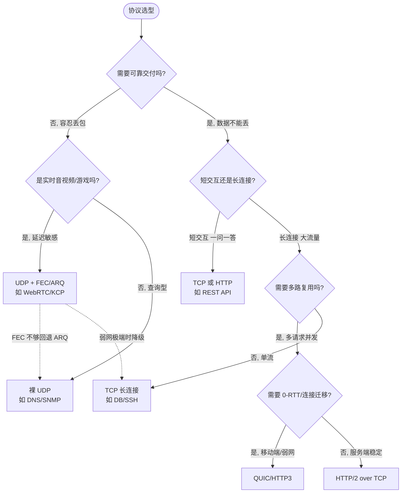
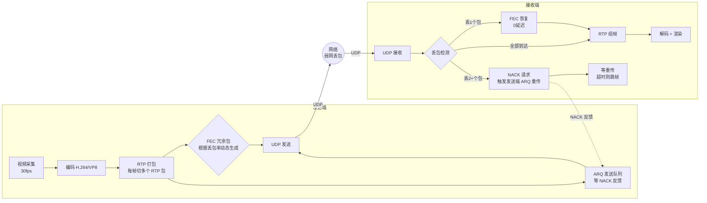

# UDP、QUIC 与 KCP

> **一句话定位**：UDP 与 QUIC 是 HTTP/3 的基础，KCP 在游戏/音视频面试常出现。
> **面试热度**：⭐⭐⭐⭐
> **返回**：[网络知识图谱](../README.md)

---

## 一、概念定义

### 1.1 UDP 的三大特点

UDP（User Datagram Protocol，用户数据报协议，RFC 768）是与 TCP 并列的两大传输层协议之一，设计哲学是"只做最少的交付，把控制权交给应用"。与 TCP 的"厚协议栈"不同，UDP 几乎不在 IP 层之上增加任何机制，三大特性如下：

| 特性 | 含义 | 与 TCP 对比 | 工程影响 |
|------|------|------------|---------|
| 无连接 | 发送前无需握手，直接把报文交给 IP 层发出 | TCP 需三次握手建立连接 | 首包即可携带数据，延迟低 |
| 不可靠 | 不保证到达、不保证顺序、不保证不重复 | TCP 靠序号/ACK/重传保证可靠 | 可靠性由应用自行实现（或不在意） |
| 面向报文 | 保留应用层消息边界，一次 send = 一次 deliver | TCP 面向字节流，无边界 | 天然无粘包拆包问题 |

**面向报文是 UDP 与 TCP 最本质的工程差异**：应用调用一次 `sendto(1000B)`，接收端对应一次 `recvfrom(1000B)` 拿到完整的 1000 字节（若该报文未丢失）。UDP 把应用交付的"数据报"作为一个整体交给 IP 层，IP 分片仅在 IP 层发生且重组对 UDP 透明。这使 UDP 天然适合"以消息为单位"的协议（DNS 查询、SNMP、RADIUS），而 TCP 需要应用层自行定界（长度前缀/分隔符，详见 [TCP 可靠性 §5.1](./tcp-reliability.md#51-netty-长度域拆包编码器)）。

**UDP 的"不作为"恰恰是它的优势**：

1. **无连接 → 低延迟**：首包即数据，无握手开销。DNS 查询一次 RTT 即得响应，TCP 需 2 个 RTT（握手 + 请求）。
2. **无拥塞控制 → 不减速**：UDP 不会因丢包减半发送速率，适合实时音视频（宁可丢帧也不延迟）。代价是可能挤压 TCP 流（公平性问题，见 [拥塞控制 Q6](./tcp-congestion.md#q6为什么-tcp-要做公平性aimd-怎么保证)）。
3. **无流量控制 → 不阻塞**：发送方不会因接收方慢而停发，需应用自行控制节奏或承受丢包。
4. **首部小 → 开销低**：UDP 首部仅 8 字节，TCP 首部 20 字节起，小包场景（DNS、IoT）节省明显。

### 1.2 UDP 首部格式（8 字节）

UDP 首部固定 8 字节，四个字段各 2 字节，结构极简：

```
 0                   1                   2                   3
 0 1 2 3 4 5 6 7 8 9 0 1 2 3 4 5 6 7 8 9 0 1 2 3 4 5 6 7 8 9 0 1
+-+-+-+-+-+-+-+-+-+-+-+-+-+-+-+-+-+-+-+-+-+-+-+-+-+-+-+-+-+-+-+-+
|          源端口              |        目的端口              |
+-+-+-+-+-+-+-+-+-+-+-+-+-+-+-+-+-+-+-+-+-+-+-+-+-+-+-+-+-+-+-+-+
|         长度                 |        校验和                 |
+-+-+-+-+-+-+-+-+-+-+-+-+-+-+-+-+-+-+-+-+-+-+-+-+-+-+-+-+-+-+-+-+
```

| 字段 | 字节 | 含义 | 备注 |
|------|------|------|------|
| 源端口 | 2 | 发送方端口 | 可选为 0（无回执需求时） |
| 目的端口 | 2 | 接收方端口 | 必填 |
| 长度 | 2 | UDP 首部 + 数据的总字节数 | 最小 8（空数据报），最大 65535 |
| 校验和 | 2 | 覆盖首部 + 数据 + 伪首部 | IPv4 可选（0 表示不校验），IPv6 强制 |

**伪首部（Pseudo Header）**：校验和计算时临时拼接 12 字节伪首部（含源/目的 IP、协议号、UDP 长度），目的是让 UDP 校验"这个报文是否送到了正确的 IP 与端口"。若 IP 地址在传输中被篡改，伪首部校验会失败，避免错投。

**与 TCP 首部对比**：

| 项 | UDP 首部 | TCP 首部 |
|----|---------|---------|
| 长度 | 固定 8 字节 | 最小 20 字节，含选项可达 60 字节 |
| 序号/确认号 | 无 | 有（32 位 seq + 32 位 ack） |
| 窗口 | 无 | 有（16 位 rwnd） |
| 标志位 | 无 | 有（SYN/ACK/FIN/RST/PSH/URG） |
| 选项 | 无 | 有（MSS/窗口缩放/SACK/Timestamps） |

UDP 的"无序号、无窗口、无选项"意味着协议栈无需维护连接状态，每个报文独立处理——这正是"面向报文、无连接"在首部层面的体现。

### 1.3 QUIC 的定位

QUIC（Quick UDP Internet Connections）是 Google 设计、IETF 标准化的传输层协议（RFC 9000-9002），**承载 HTTP/3**。它不是取代 TCP，而是在 UDP 之上"重新实现一个比 TCP 更好的传输层"，本质是"UDP 之上的可靠传输 + TLS 1.3 + 多路复用 + 连接迁移"。

**一句话定位**：QUIC = UDP + （TCP 的可靠性）+ （TLS 1.3 的加密）+ （HTTP/2 的多路复用）+ （TCP 没有的连接迁移与 0-RTT）。

**为什么需要 QUIC**：HTTP/2 over TCP 仍存在两个顽疾——①TCP 层队头阻塞（一个 TCP 段丢失阻塞所有 HTTP/2 流，详见 §2.2）；②连接建立慢（TCP 握手 1 RTT + TLS 握手 1-2 RTT，移动端首屏慢）。QUIC 把传输层与加密层融合，握手与 TLS 合并，1 RTT（甚至 0 RTT）完成连接建立与密钥协商，且多路复用在传输层做、流之间互不阻塞。

### 1.4 KCP 的定位

KCP 是开源的"在 UDP 之上实现可靠传输"的协议（C 语言实现，作者林伟），设计目标是**低延迟**，典型场景是游戏与实时音视频。它不是 IETF 标准，但在国内游戏/直播行业广泛使用。

**一句话定位**：KCP = UDP + （ARQ 可靠传输）+ （FEC 前向纠错）+ （快速重传模式），用 10%-20% 的额外带宽换取 30%-40% 的延迟降低。

**与 QUIC 的区别**：QUIC 面向 Web（HTTP/3），目标是替代 TCP+TLS+HTTP/2 栈，工程复杂度高；KCP 面向实时交互（游戏/音视频），目标是"比 TCP 快"，实现轻量、可控。两者都基于 UDP 实现可靠传输，但定位不同——QUIC 是"新一代 Web 传输底座"，KCP 是"低延迟 ARQ 加速器"。

---

## 二、原理与流程

### 2.1 UDP 应用场景

UDP 的"不可靠、无连接、保边界"特性，决定了它适合以下四类场景：

| 场景 | 为什么用 UDP | 代表协议/应用 | 可靠性谁负责 |
|------|-------------|--------------|-------------|
| 查询型短交互 | 一问一答，握手不划算，丢一次重发即可 | DNS、SNMP、NTP、DHCP | 应用层超时重发 |
| 实时音视频 | 宁可丢帧不延迟，重传到的过期帧无意义 | WebRTC（RTP/RTCP）、RTSP、直播推流 | 应用层 FEC + ARQ |
| 实时游戏 | 低延迟优先，丢包用预测补偿或 FEC 兜底 | 游戏帧同步、状态同步 | KCP/自研 ARQ |
| IoT 传感 | 设备资源受限，UDP 开销小；容忍少量丢包 | CoAP、MQTT-SN | 应用层简单重试 |

**查询型（DNS）**：DNS 查询报文小（通常 < 512B），一问一答，TCP 握手开销占比过高。UDP 下一个 RTT 即得响应，超时由应用重发。详见 [DNS §2.1](../01-application/dns.md)。

**实时音视频（WebRTC）**：视频帧 30fps，每帧 33ms 内有效，重传到达时帧已过期。UDP 允许丢帧（播放卡顿）而非排队堆积（延迟膨胀）。WebRTC 在 RTP 之上做 FEC + NACK 重传，对关键帧重传、对非关键帧容忍丢失。

**实时游戏**：游戏状态更新 10-20Hz，旧状态立即被新状态覆盖，重传旧状态无意义。KCP 用快速重传模式把延迟从 TCP 的 200ms+ 降到 30-80ms。

**IoT**：设备 CPU/内存受限，TCP 状态机与缓冲开销大；UDP 无连接、首部小，适合低功耗。CoAP 默认 UDP，用 Confirmable 消息做简单重传。

### 2.2 QUIC 详解

#### 2.2.1 基于 UDP 实现可靠传输

QUIC 在 UDP 之上重新实现了一套类似 TCP 的可靠传输机制——序号、确认、重传、流量控制、拥塞控制，但全部在用户态实现（不依赖内核 TCP 栈）。这样做的好处：

1. **协议演进快**：TCP 在内核态，升级需改内核、需全生态协调（CUBIC→BBR 花了十年）；QUIC 在用户态，Google/Cloudflare 自己升级客户端即可迭代。
2. **可加密**：QUIC 报文（含首部部分字段）被 TLS 1.3 加密，中间设备无法窥探或篡改，避免 TCP 时代中间盒僵化（详见 §2.2.5）。
3. **可绕过内核限制**：TCP 的 cwnd、慢启动等内核行为应用不可控，QUIC 在用户态可实现任意拥塞算法（BBR/CUBIC/自定义）。

**可靠传输机制对照**：

| 机制 | TCP | QUIC |
|------|-----|------|
| 序号 | 字节流序号（32 位） | 包序号（单调递增，不回绕） |
| 确认 | 累积 ACK + SACK | ACK Range（多段确认，比 SACK 更灵活） |
| 重传 | 超时重传 + 快重传 | 超时重传 + 快重传 + ACK 触发 |
| 流量控制 | rwnd（接收窗口） | 每流独立 rwnd + 连接级 rwnd |
| 拥塞控制 | 内核（CUBIC/BBR） | 用户态（CUBIC/BBR/自定义） |

#### 2.2.2 多路复用无队头阻塞

HTTP/2 在一条 TCP 连接上多路复用多个流，但 TCP 层保证字节流按序交付——若某个 TCP 段丢失，**所有流都被阻塞**等待重传，这就是 TCP 层的队头阻塞（HOL Blocking）。HTTP/2 的流复用在应用层，可靠性在 TCP 层，两层错位导致一损俱损。

QUIC 把多路复用下沉到传输层：一条 QUIC 连接承载多个 Stream，**每个 Stream 独立做序号确认与重传**。Stream A 的某个包丢失，只阻塞 Stream A，Stream B/C 的包仍可按序交付给应用。

```
HTTP/2 over TCP（有队头阻塞）:
  TCP 字节流: [A1][B1][A2丢失][B2][A3] → B2 也被阻塞等 A2 重传
              ↓
              应用层多路复用解复用, 但 TCP 层卡住全部流

QUIC（无队头阻塞）:
  Stream A: [A1][A2丢失][A3] → A 卡住等 A2 重传, A3 乱序暂存
  Stream B: [B1][B2][B3]      → B 不受影响, B1/B2/B3 按序交付
  Stream C: [C1][C2]          → C 不受影响
```

这是 QUIC 相对 HTTP/2 最核心的改进，也是 HTTP/3 选择 QUIC 的根本原因。

#### 2.2.3 0-RTT 与 1-RTT 握手

TCP + TLS 1.2 建立连接需 3 RTT（TCP 握手 1 + TLS 1.2 握手 2），TLS 1.3 仍需 2 RTT（TCP 1 + TLS 1.3 1）。QUIC 把传输层握手与 TLS 握手合并：

| 场景 | RTT | 说明 |
|------|-----|------|
| 首次连接 | 1 RTT | ClientHello + ServerHello 同时完成传输握手与密钥协商 |
| 恢复连接（有 PSK） | 0 RTT | 客户端利用之前协商的 PSK，首包即携带应用数据 |

**0-RTT 的代价**：0-RTT 数据是"基于 PSK 重放"的，若被攻击者录制重放，可能造成重复请求（如重复下单）。QUIC 用服务端 nonce 记录防重放，但 0-RTT 仅限幂等请求（GET），POST 类敏感请求仍需 1-RTT 确认。

#### 2.2.4 连接迁移

TCP 连接由四元组（源 IP、源端口、目的 IP、目的端口）标识。移动设备从 WiFi 切到 4G，IP 变了，TCP 连接必须断开重建——这对移动端长连接是巨大痛点（重连 + 重新握手 + 状态恢复）。

QUIC 用 **Connection ID（CID）** 标识连接，CID 由客户端生成、不依赖 IP 端口。网络切换后 IP 变了，CID 不变，服务端凭 CID 识别同一连接，**连接不断、传输不中断**。

```
WiFi 环境: Client(CID=0x1234, IP=192.168.1.5) → Server(IP=1.2.3.4)
    ↓ 切换到 4G
4G 环境: Client(CID=0x1234, IP=10.0.0.8) → Server(IP=1.2.3.4)
    Server 凭 CID=0x1234 识别同一连接, 连接不断
```

#### 2.2.5 前向纠错（FEC）与多路径

QUIC 早期版本（Google QUIC）支持 FEC：发送方在原始包之外额外发一个冗余包（异或若干原始包得到），接收方若丢失 1 个原始包可用冗余包恢复，无需重传。但 IETF QUIC（RFC 9000）已移除 FEC，因实测收益不如预期（冗余包浪费带宽、移动端乱序丢包模式不匹配）。FEC 的思想在 WebRTC 与 KCP 中更常见（详见 §2.3 与 §5.1）。

**QUIC 核心特性汇总**：

| 特性 | 解决的 TCP 痛点 | 代价 |
|------|----------------|------|
| 多路复用无 HOL | HTTP/2 的 TCP 层队头阻塞 | 实现复杂度高 |
| 0-RTT | TCP+TLS 握手慢 | 重放攻击风险（需防重放） |
| 连接迁移 | TCP 四元组绑死、移动端断连 | CID 管理、安全审计复杂 |
| 用户态拥塞控制 | 内核 TCP 算法升级慢 | 不享受内核优化（GSO/TSO 需自适配） |
| 报文加密 | TCP 头明文、中间盒僵化 | 调试困难（需专用工具） |

### 2.3 KCP 详解

KCP 是纯 ARQ（自动重传请求）+ FEC 的可靠 UDP 实现，核心思想是"以带宽换延迟"——牺牲 10%-20% 额外带宽，把端到端延迟降到 TCP 的 1/3-1/2。

#### 2.3.1 ARQ + 前向纠错

KCP 的可靠性由两部分组成：

1. **ARQ（停等/退回 N/选择重传）**：KCP 用选择重传（Selective Repeat）+ SACK，发送方维护发送窗口，接收方反馈序号缺口，发送方精准重传丢失段，不重传已收到的段。
2. **FEC（前向纠错）**：可选开启，发送方在数据包之外发冗余包。若接收方丢 1 个包但收到了冗余包，可直接恢复，**无需等待 ARQ 重传**——这是延迟降低的关键。

```
无 FEC:  丢包 → 等 ARQ 超时/快重传 → 1 个 RTT+ 延迟
有 FEC:  丢 1 个包 → 用冗余包恢复 → 0 延迟（无需重传）
         丢 2+ 个包 → FEC 不够 → 回退 ARQ 重传
```

#### 2.3.2 快速模式 vs 正常模式

KCP 有两种重传模式，由 `nodelay` 参数控制：

| 模式 | 触发条件 | RTO 增长 | 行为 | 适用 |
|------|---------|---------|------|------|
| 正常模式 | `nodelay=0` | RTO × 1.5（可配） | 保守退避，类似 TCP | 一般可靠传输 |
| 快速模式 | `nodelay=1` | RTO × 1（不退避） | 超时立即重传，且跳过慢启动 | 实时游戏/音视频 |

**快速模式的关键差异**：

1. **RTO 不退避**：TCP 超时重传后 RTO ×2（指数退避），KCP 快速模式下 RTO 保持不变，反复快速重传。
2. **快重传更激进**：KCP 收到 2-3 个跨序 ACK 即触发快重传（TCP 是 3 个重复 ACK），更快定位丢包。
3. **可配发送窗口**：`snd_wnd` 控制在途包数，`rcv_wnd` 控制接收窗口，应用可调到很大以容忍高 RTT。

#### 2.3.3 牺牲带宽换延迟

KCP 的设计哲学是"带宽便宜，延迟贵"——尤其在游戏与音视频场景。具体表现：

| 策略 | TCP | KCP | 代价 |
|------|-----|-----|------|
| 超时 RTO | ×2 退避 | ×1 不退避（快速模式） | 重复重传多，耗带宽 |
| 快重传阈值 | 3 重复 ACK | 2-3 跨序 ACK | 误判概率略高 |
| FEC | 无 | 有（可选） | 冗余包占 10%-20% 带宽 |
| 拥塞控制 | 有（CUBIC/BBR） | 无（可选开启） | 可能挤压 TCP 流 |

**典型延迟对比**（弱网，RTT 60ms，丢包 5%）：

| 协议 | 单包丢失后恢复延迟 | 原因 |
|------|-------------------|------|
| TCP（CUBIC） | 200-600ms | RTO 退避 + 慢启动重启 |
| TCP + FEC（应用层） | 0ms（FEC 恢复）/ 200ms（FEC 不够回退 ARQ） | FEC 兜底 |
| KCP 正常模式 | 120-200ms | RTO ×1.5 退避 |
| KCP 快速模式 | 30-80ms | RTO ×1 + 激进快重传 + FEC |

### 2.4 TCP vs UDP 对比表

| 维度 | TCP | UDP |
|------|-----|-----|
| 连接性 | 面向连接（三次握手） | 无连接 |
| 可靠性 | 可靠（序号/ACK/重传） | 不可靠（尽力交付） |
| 顺序性 | 保证按序交付 | 不保证顺序 |
| 流量控制 | 有（rwnd 滑动窗口） | 无 |
| 拥塞控制 | 有（CUBIC/BBR） | 无（应用自行实现） |
| 传输方式 | 面向字节流 | 面向报文（保边界） |
| 首部开销 | 20-60 字节 | 8 字节 |
| 通信方式 | 点对点（一对一） | 一对一/一对多/多播/广播 |
| 适用场景 | 文件传输、Web、邮件、数据库 | DNS、音视频、游戏、IoT |
| 典型协议 | HTTP、HTTPS、SMTP、SSH、MySQL | DNS、DHCP、SNMP、RTP、QUIC |
| 粘包拆包 | 有（需应用层定界） | 无（保留消息边界） |
| 内核实现 | 内核协议栈（优化多 GSO/TSO） | 内核协议栈（轻量） |
| 公平性 | AIMD 收敛，对同算法公平 | 无拥塞控制，可能挤压 TCP |

### 2.5 TCP vs UDP 选型决策树

**Mermaid 版**：



**文字版决策清单**：

1. **需要可靠交付？** 否 → UDP；是 → 进入 2
2. **实时音视频/游戏（延迟敏感）？** 是 → UDP + FEC/ARQ（WebRTC/KCP）；否 → 进入 3
3. **查询型短交互（一问一答）？** 是 → 裸 UDP（DNS）或 TCP（HTTP）；否 → 进入 4
4. **长连接大流量？** 是 → 进入 5
5. **多请求并发多路复用？** 是 → 移动端/弱网选 QUIC（HTTP/3），稳定服务端选 HTTP/2 over TCP；否 → TCP 长连接（DB/SSH）

> **决策口诀**：丢得起用 UDP（实时），丢不起用 TCP（可靠），又要快又要稳用 QUIC/KCP（UDP+ARQ）。移动端弱网优先 QUIC，游戏优先 KCP，Web 服务 TCP/HTTP 仍是主流。

---

## 三、高频追问与面试题

### Q1：为什么 DNS 用 UDP 而不是 TCP？

**参考答案**：DNS 查询是典型的"一问一答"短交互，UDP 的无连接特性让首包即可携带查询，一个 RTT 得到响应；TCP 需三次握手（1-RTT）+ 请求/响应（1-RTT）共 2 个 RTT，握手开销占比过高（查询报文通常 < 512B，握手报文反而更大）。UDP 首部 8 字节 vs TCP 20+ 字节，小包场景开销节省明显。

**可靠性由应用层兜底**：DNS 客户端发查询后启动超时定时器（通常 1-2 秒），超时未收到响应则重发（可换 DNS 服务器）。DNS 设计上就容忍偶发丢包，靠重发保证最终可达，无需 TCP 的重机制。

**例外**：①响应超过 512 字节（DNSSEC、大 TXT 记录）时，传统 DNS 会回退 TCP（UDP 报文被 IP 分片后丢片率高）；②区域传送（zone transfer，主从同步大量记录）用 TCP，因为数据量大且必须可靠按序。DoT（DNS over TLS）和 DoH（DNS over HTTPS）也走 TCP，但那是为加密而非可靠性。

**追问**：DNS over HTTPS（DoH）走 TCP+TLS，是不是说明 TCP 更好？
> DoH 选 TCP+TLS 是为了**加密与穿透 HTTPS 基础设施**（复用 443 端口、过 CDN、抗 DNS 污染），不是因为 TCP 传输更好。DoH 的延迟比 UDP DNS 高（握手 + TLS），但换来了隐私与抗劫持。Google 的 DNS 与 Cloudflare 的 1.1.1.1 仍同时提供 UDP DNS（53 端口）与 DoH，按场景选——普通解析用 UDP，隐私场景用 DoH。

### Q2：QUIC 为什么基于 UDP 而不是定义新的 IP 协议号？

**参考答案**：理论上 QUIC 可以作为独立传输层协议（像 TCP 那样有自己的 IP 协议号），但实际选择基于 UDP，核心原因是**部署可行性**：

1. **中间设备兼容**：现网有海量 NAT、防火墙、负载均衡器，它们只认识 TCP（协议号 6）和 UDP（协议号 17）。若 QUIC 用新协议号，大量中间设备会丢弃或无法处理，部署受阻。基于 UDP（协议号 17）天然穿透现有 NAT 与防火墙。
2. **内核无需改动**：新协议号需改内核协议栈，Linux/Windows/macOS 内核更新周期长（数年）。UDP 已是内核成熟功能，QUIC 在用户态实现，客户端（浏览器/APP）升级即可推广，Google 用几周就完成 Chrome 部署。
3. **可演进快**：用户态实现让 QUIC 协议本身可快速迭代（IETF QUIC vs Google QUIC 不同版本共存），内核协议演进慢得多（CUBIC→BBR 花了十年）。
4. **复用 UDP 生态**：UDP 的 socket API、NAT 穿透（STUN/TURN）、负载均衡（四层 LB 按 UDP 分流）等基础设施已成熟，QUIC 直接复用。

**代价**：UDP 报文首部增加 8 字节开销（QUIC 自己的首部另算），且 UDP 在某些网络（深包检测 DPI）会被限速或丢弃，需应用层降级到 TCP（HTTP/3 不可用时回退 HTTP/2）。

**追问**：基于 UDP 会不会被某些网络限速（因 UDP 被 QoS 限制）？
> 会。部分企业网络与运营商对 UDP 限速或阻断（认为 UDP 是视频流量或攻击来源）。QUIC 的应对：①降级到 HTTP/2 over TCP（gQUIC 与 HTTP/2 协商 fallback）；②用 UDP 443 端口（与 HTTPS 同端口，中间盒不易区分）；③IETF QUIC 的连接 ID 与加密让 DPI 更难识别。这是 QUIC 部署的痛点之一，但相比"改内核+改中间盒"，基于 UDP 仍是工程最优解。

### Q3：QUIC 怎么解决 TCP 层的队头阻塞？

**参考答案**：队头阻塞（HOL Blocking）的根因是"一条字节流上承载多个逻辑流，前段丢失阻塞所有流的按序交付"。HTTP/2 over TCP 的队头阻塞发生在 TCP 层：HTTP/2 在一条 TCP 连接上多路复用多个 Stream，但 TCP 是字节流，保证字节序——某个段丢失，后续到达的段（哪怕属于不同 Stream）都因字节序不连续被阻塞，等待重传。

**QUIC 的解法：把多路复用下沉到传输层，每个 Stream 独立保证序号交付**：

1. **Stream 级独立序号**：QUIC 的每个 Stream 有独立的包序号与确认，Stream A 的包丢失只影响 Stream A 的按序交付。
2. **乱序交付**：Stream B 的包即使比 Stream A 的包晚到（因 A 丢失触发重传），只要 Stream B 自己的序号连续，就立即交付给应用层，不等 Stream A。
3. **ACK Range**：QUIC 的 ACK 报文可一次确认多个不连续的序号区间（比 TCP SACK 更灵活），发送方精准知道哪些包丢了、哪些 Stream 受影响，只重传受影响的包。

```
HTTP/2 over TCP:
  TCP 字节流: [A1][B1][A2丢失][B2][A3]
  → A2 丢失, B2/B3 字节序不连续, 全部阻塞
  → 应用层无法读到 B2, 即使 B2 已到达

QUIC:
  Stream A: [A1][A2丢失][A3] → A 的序号不连续, A 阻塞, 等 A2 重传
  Stream B: [B1][B2][B3]      → B 序号连续, 立即交付应用
  → B 不受 A 丢包影响
```

**关键区别**：HTTP/2 的多路复用在应用层（HTTP 帧），可靠性在 TCP 层（字节流），两层错位导致"应用层一个流丢段、TCP 层全部流阻塞"。QUIC 把多路复用与可靠性都放在传输层，**按 Stream 隔离**，一损不再俱损。

**追问**：QUIC 完全没有队头阻塞了吗？
> 不是。QUIC 消除的是**跨 Stream 的队头阻塞**，但单 Stream 内仍有队头阻塞——Stream A 的 A2 丢失，A3 到达后仍需等 A2 重传才能按序交付。这是"按序交付"语义的固有代价。对 HTTP/3 而言，单 Stream 通常对应一个 HTTP 请求/响应，单请求内的队头阻塞可接受；多请求并发的整体阻塞被消除，这就是 QUIC 的价值。

### Q4：KCP 比 TCP 快在哪？代价是什么？

**参考答案**：KCP 在弱网（丢包、高 RTT）下延迟显著低于 TCP，核心快在三处：

1. **RTO 不退避（快速模式）**：TCP 超时重传后 RTO ×2（指数退避），第二次超时 RTO 翻倍，弱网下恢复慢。KCP 快速模式 RTO ×1（不退避），超时立即重传，恢复快。
2. **快重传更激进**：TCP 需 3 个重复 ACK 才触发快重传；KCP 收到 2-3 个跨序 ACK 即触发，更快定位丢包。
3. **FEC 前向纠错**：发送冗余包，丢 1 个包直接恢复无需重传，0 延迟。TCP 无 FEC，任何丢包都要等重传。

**代价**：

| 代价 | 具体表现 |
|------|---------|
| 带宽浪费 | FEC 冗余包占 10%-20%；RTO 不退避导致重复重传多，总流量比 TCP 高 10%-30% |
| 公平性差 | KCP 无拥塞控制（或可选），不会因丢包减速，挤压同链路 TCP 流 |
| 误判风险 | 快重传阈值低，乱序场景可能误触发重传 |
| 不适合大文件 | 大流量场景带宽浪费显著，TCP 的 AIMD 公平性更适合 |

**一句话**：KCP 用 10%-20% 带宽换 30%-40% 延迟降低，适合"延迟敏感、带宽充裕"的实时交互，不适合"带宽敏感、延迟宽容"的文件传输。

**追问**：为什么 TCP 不学 KCP 的 RTO 不退避？
> TCP 面向通用场景，RTO 退避是为应对**持续性拥塞**——若网络一直丢包，退避让发送方逐渐减少在途流量，给网络恢复时间；不退避会持续往拥塞网络塞包，加剧拥塞甚至拥塞崩溃。KCP 不退避的前提是"应用容忍丢包且延迟敏感"，且 KCP 通常用在带宽充裕、丢包是瞬时/随机的场景（游戏帧）。TCP 若学 KCP，在真正拥塞时会恶化网络，违背其"网络友好"设计目标。

### Q5：视频/游戏/IM 分别选 TCP 还是 UDP？

**参考答案**：三者对延迟、可靠性、有序性的要求不同，选型也不同：

| 场景 | 延迟要求 | 可靠性要求 | 选型 | 典型协议 |
|------|---------|-----------|------|---------|
| 视频直播/点播 | 中（秒级可接受） | 中（丢帧可容忍） | UDP + FEC/ARQ（直播）或 TCP（点播） | RTMP（TCP，历史）、WebRTC（UDP）、HLS（HTTP/TCP） |
| 实时游戏 | 高（< 100ms） | 低（状态可预测补偿） | UDP + KCP/自研 ARQ | KCP、游戏自研协议 |
| IM 即时通讯 | 中（秒级） | 高（消息不丢不重） | TCP 长连接 | MQTT、WebSocket、自研 TCP 长连接 |

**视频**：直播延迟敏感，用 UDP + FEC + ARQ（WebRTC 的 RTP）；点播可缓冲，用 TCP（HLS/HTTP 渐进下载）。RTMP 历史用 TCP，但弱网下延迟膨胀，正被 WebRTC/SRT 替代。

**游戏**：状态更新高频（10-20Hz），旧状态立即被新状态覆盖，丢包用预测补偿或 FEC 兜底。TCP 的重传与拥塞控制会让延迟飙升，KCP 的快速模式是主流选择。

**IM**：消息不能丢（"你发的话我没收到"不可接受），且可秒级延迟，TCP 长连接 + 应用层重试 + 消息序号去重是稳妥选择。WebSocket（基于 TCP）是 IM 主流。UDP 适合 IM 的"信令"部分（如音视频通话的 SIP/信令），但消息正文仍走 TCP。

**追问**：IM 的消息为什么不能用 UDP + ARQ 自己保证可靠？
> 可以，但没必要重造轮子。TCP 的可靠性是内核协议栈经过几十年打磨的，序号/ACK/重传/流量控制/拥塞控制都成熟。IM 用 TCP 长连接 + 应用层消息序号（防重复/补丢）是工程最优。UDP + ARQ（如 KCP）的优势在低延迟，IM 的秒级延迟对 TCP 不敏感，KCP 的带宽浪费反而不划算。除非 IM 含实时音视频通话功能，信令通道才用 UDP。所以选型要看场景的"延迟-可靠性"权衡点，没有银弹。

---

## 四、实战与 Java 生态关联

### 4.1 Java DatagramSocket（标准 UDP）

Java 标准库的 UDP API 是 `java.net.DatagramSocket` 与 `DatagramPacket`，相比 TCP 的 `Socket`/`ServerSocket` 更简单——无连接、无流、直接收发数据报包。

#### 4.1.1 UDP 服务端（接收）

```java
import java.net.DatagramSocket;
import java.net.DatagramPacket;
import java.net.InetSocketAddress;

public class UdpServer {
    public static void main(String[] args) throws Exception {
        // bind 0.0.0.0:9876, 无需 listen/backlog, UDP 无连接队列
        try (DatagramSocket socket = new DatagramSocket(null)) {
            socket.bind(new InetSocketAddress(9876));
            // 设置接收缓冲, 对应 SO_RCVBUF, 影响 UDP 丢包率(缓冲满则丢)
            socket.setReceiveBufferSize(1024 * 1024);

            byte[] buf = new byte[65507]; // UDP 单包上限 65507 字节
            while (true) {
                DatagramPacket packet = new DatagramPacket(buf, buf.length);
                socket.receive(packet); // 阻塞到收到一个数据报
                // 保留消息边界: 一次 receive = 对端一次 send, 无粘包
                byte[] data = packet.getData();
                int len = packet.getLength(); // 实际长度, 非缓冲全长
                // 处理 data[0..len)
            }
        }
    }
}
```

#### 4.1.2 UDP 客户端（发送）

```java
import java.net.DatagramSocket;
import java.net.DatagramPacket;
import java.net.InetSocketAddress;

public class UdpClient {
    public static void main(String[] args) throws Exception {
        try (DatagramSocket socket = new DatagramSocket()) {
            // 无需 connect, 可选 connect 做端口/地址过滤
            byte[] data = "hello".getBytes();
            DatagramPacket packet = new DatagramPacket(
                data, data.length,
                new InetSocketAddress("127.0.0.1", 9876)
            );
            socket.send(packet); // 直接发, 不保证到达, 不保证顺序
        }
    }
}
```

**关键工程点**：

1. **无粘包**：`receive` 一次拿到对端一次 `send` 的完整数据报，应用无需定界。
2. **缓冲与丢包**：`SO_RCVBUF` 满了内核直接丢弃新包（UDP 无流量控制），需调大缓冲并加快 `receive` 循环。
3. **无超时重传**：`receive` 可设 `setSoTimeout`，但发送方不会自动重发，应用自行实现超时重试。
4. **阻塞模式**：`DatagramSocket` 默认阻塞，NIO 可用 `DatagramChannel` 配 `Selector` 实现非阻塞 UDP。

### 4.2 Netty UDP（DatagramChannel + Pipeline）

Netty 的 UDP 通过 `DatagramChannel` 实现，可复用 Netty 的 Pipeline 编解码与线程模型，适合高性能 UDP 服务（DNS 服务器、SNMP 采集、游戏服务端）。

```java
import io.netty.bootstrap.Bootstrap;
import io.netty.channel.*;
import io.netty.channel.nio.NioEventLoopGroup;
import io.netty.channel.socket.DatagramPacket;
import io.netty.channel.socket.nio.NioDatagramChannel;
import io.netty.handler.codec.MessageToMessageDecoder;
import io.netty.util.CharsetUtil;
import java.net.InetSocketAddress;
import java.util.List;

public class NettyUdpServer {
    public static void main(String[] args) throws Exception {
        EventLoopGroup group = new NioEventLoopGroup();
        try {
            Bootstrap b = new Bootstrap();
            b.group(group)
             .channel(NioDatagramChannel.class)
             .option(ChannelOption.SO_BROADCAST, false)
             .option(ChannelOption.SO_RCVBUF, 1024 * 1024)
             .handler(new ChannelInitializer<NioDatagramChannel>() {
                 @Override
                 protected void initChannel(NioDatagramChannel ch) {
                     ch.pipeline()
                       // DatagramPacket 解包, 提取 ByteBuf 与发送方地址
                       .addLast(new UdpDecoder())
                       // 业务处理
                       .addLast(new UdpBusinessHandler());
                 }
             });
            // bind 不阻塞, UDP 无 accept 过程
            Channel channel = b.bind(9876).sync().channel();
            channel.closeFuture().await();
        } finally {
            group.shutdownGracefully();
        }
    }
}

// 解码器: DatagramPacket -> 业务对象
class UdpDecoder extends MessageToMessageDecoder<DatagramPacket> {
    @Override
    protected void decode(ChannelHandlerContext ctx, DatagramPacket packet, List<Object> out) {
        String msg = packet.content().toString(CharsetUtil.UTF_8);
        InetSocketAddress sender = packet.sender();
        // 保留发送方地址, 用于回包
        out.add(new UdpMessage(msg, sender));
    }
}

// 业务 Handler
class UdpBusinessHandler extends SimpleChannelInboundHandler<UdpMessage> {
    @Override
    protected void channelRead0(ChannelHandlerContext ctx, UdpMessage msg) {
        // 处理消息, 可通过 ctx.writeAndFlush(new DatagramPacket(...)) 回包
        System.out.println("recv from " + msg.sender + ": " + msg.text);
    }
}

class UdpMessage {
    final String text;
    final InetSocketAddress sender;
    UdpMessage(String t, InetSocketAddress s) { text = t; sender = s; }
}
```

**Netty UDP 的工程优势**：

1. **复用 Pipeline**：UDP 报文可走与 TCP 相同的编解码 Handler（长度域、CRC、Protobuf），降低协议层代码重复。
2. **EventLoop 复用**：UDP 的 `DatagramChannel` 同样由 EventLoop 驱动，与 TCP 服务共享线程池。
3. **回包便捷**：`DatagramPacket` 携带发送方地址，回包直接 `ctx.writeAndFlush(new DatagramPacket(buf, recipient))`，无需"连接"概念。

### 4.3 HTTP/3 客户端支持现状

HTTP/3 基于 QUIC（基于 UDP），Java 生态的客户端支持仍在演进：

| 客户端/库 | HTTP/3 支持 | 说明 |
|-----------|-----------|------|
| `java.net.http.HttpClient`（JDK 11+） | ❌ 不支持 | JDK 原生 HTTP 客户端仅 HTTP/1.1 与 HTTP/2，无 QUIC |
| OkHttp | ❌ 不支持 | 主流 Android/Java HTTP 客户端，无内置 QUIC |
| Cronet（Google） | ✅ 支持 | Chromium 网络栈，Android 上 Google 系 APP（YouTube/Maps）用，是 gQUIC/IETF QUIC 的主力实现 |
| Cloudflare quiche | ✅ Rust 实现 | 提供 HTTP/3 客户端/服务端，Java 需通过 JNI 或 FFI 调用 |
| lsquic（LiteSpeed） | ✅ C 实现 | 高性能 QUIC 库，可被 Java 通过 JNI 集成 |
| netty-incubator-codec-quic | ⚠️ 孵化中 | Netty 官方孵化的 QUIC 编解码器，基于 lsquic 的 JNI 封装，可用于构建 HTTP/3 服务端/客户端，尚未稳定 |

**Java 场景的实用建议**：

1. **服务端 HTTP/3**：若需在 Java 提供 HTTP/3，目前主流是用 nginx/Envoy/Caddy 反向代理（它们已支持 HTTP/3），Java 应用仍走 HTTP/2 给反代，由反代对客户端提供 HTTP/3。
2. **客户端 HTTP/3**：Java 客户端要原生用 HTTP/3 较难，工程上多通过 Cronet（Android）或系统级 HTTP/3 支持（iOS/macOS 自动升级）。后端服务间通信仍以 HTTP/2 + TCP 为主。
3. **QUIC 协议本身**：若需在 Java 实现自定义 QUIC（如非 HTTP 的可靠 UDP 传输），可基于 `netty-incubator-codec-quic`，但生产稳定性需评估。

### 4.4 KCP 的 Java 实现

KCP 原始实现是 C 语言（[kcp by skywind3000](https://github.com/skywind3000/kcp)），Java 生态有以下方案：

| 方案 | 说明 | 适用 |
|------|------|------|
| jkcp / java-kcp | 社区 Java 移植，API 与 C 版对齐 | 学习、原型 |
| Netty + KCP codec | 基于 Netty `DatagramChannel`，封装 KCP 的 ARQ/FEC | 游戏服务端、实时音视频 |
| JNI 调用 C kcp | Java 通过 JNI 调用原生 kcp.c | 极致性能、复用 C 实现成熟度 |

**KCP Java 用法示例（基于 Netty 自封装）**：

```java
// 伪代码, 展示 KCP 的典型使用模式
public class KcpServer {
    public void start() {
        // 1. 底层用 Netty UDP DatagramChannel 收发原始包
        Bootstrap b = new Bootstrap();
        b.group(new NioEventLoopGroup())
         .channel(NioDatagramChannel.class)
         .handler(new KcpCodec()); // KcpCodec 负责把 UDP 包喂给 KCP 实例

        Channel channel = b.bind(9876).sync().channel();

        // 2. 每个 client 一个 Kcp 对象(类似 TCP 的每连接一个 socket)
        // Kcp 对象负责 ARQ 重传、FEC、序号管理
        // 应用层调用 kcp.send(data) → KCP 内部分段 + FEC → Netty UDP 发出
        // Netty UDP 收到 → KcpCodec 喂给 Kcp → kcp.recv() 输出有序数据
    }
}

class Kcp {
    private final int conv;          // 会话 ID, 双方一致
    private final boolean nodelay;   // true=快速模式
    private final int interval;      // KCP 内部 update 周期 ms
    private final int resend;        // 快重传 ACK 阈值
    private final boolean nc;        // 是否关闭拥塞控制

    public void send(byte[] data) { /* 分段 + 入发送队列 */ }
    public byte[] recv() { /* 输出有序数据 */ return null; }
    public void input(byte[] rawUdp) { /* 喂入 UDP 原始包 */ }
    public void update(long nowMs) { /* 定期驱动 ARQ 重传/FEC */ }
}
```

**KCP 关键工程点**：

1. **`update` 必须周期调用**：KCP 是事件驱动的，需定时器周期性调 `update` 推进重传与 FEC，通常 10-50ms 一次。
2. **`conv` 会话 ID**：类似 TCP 的四元组，KCP 用 `conv` 标识会话，双方一致才通信。
3. **FEC 与 ARQ 配合**：FEC 优先恢复单包丢失，ARQ 兜底多包丢失，两者叠加效果最佳。
4. **拥塞控制可选**：`nc=1` 关闭拥塞控制（延迟优先，游戏常用），`nc=0` 开启（公平性优先，大流量场景）。

---

## 五、系统设计案例

### 5.1 实时音视频通信协议选型：UDP + FEC + ARQ

**需求**：设计一个面向移动端的实时视频通话服务（类似微信视频通话、Zoom），要求端到端延迟 < 300ms，弱网（4G 切换、丢包 5-10%）下可通话，画质自适应。

**问题分析**：

| 维度 | 挑战 |
|------|------|
| 网络 | 移动端 RTT 50-300ms、丢包 1-10%（无线随机丢包）、带宽波动大 |
| 延迟 | 视频帧 33ms 有效期（30fps），重传到达过期则无意义 |
| 可靠性 | 关键帧（I 帧）丢了会花屏，需重传；P 帧丢了可跳过 |
| TCP 痛点 | TCP 重传与拥塞控制让延迟膨胀到秒级，不可用 |

**协议选型：UDP + FEC + ARQ（WebRTC 方案）**



**关键机制**：

1. **UDP 为底座**：无连接、无拥塞控制，延迟最低。RTP（RFC 3550）在 UDP 之上做音视频打包与序号/时间戳。
2. **FEC 前向纠错**：根据实时丢包率动态生成冗余包（丢包率高则冗余多）。丢 1 个包用冗余恢复，0 延迟；丢 2+ 个包回退 ARQ。
3. **NACK 选择性重传**：接收端检测到丢包，发 NACK 请求重传关键帧；非关键帧（P 帧）丢了直接跳过，不等重传。比 TCP 的"全部重传"更智能。
4. **GCC 拥塞控制**：WebRTC 自带 GCC（Google Congestion Control），基于带宽探测与延迟梯度估算，不基于丢包（类似 BBR 思路），弱网下不误判随机丢包。
5. **ABR 自适应码率**：根据 GCC 估算的可用带宽，动态调整编码器码率，带宽低则降码率保流畅。

**为什么 TCP 不行**：

| TCP 痛点 | 在视频通话中的表现 |
|---------|------------------|
| 重传延迟 | RTO 退避 + 慢启动，单包丢失恢复 200-600ms，超过帧有效期 |
| 拥塞控制 | 无线丢包被误判为拥塞，码率暴跌，卡顿 |
| 队头阻塞 | 一个包丢，后续帧全阻塞，延迟累积 |
| 无选择性重传 | 过期帧也会被重传，浪费带宽且无用 |

**为什么 WebRTC 用 UDP**：

1. **延迟优先于可靠**：实时通话宁可丢几帧（画面短暂卡顿）也不要排队堆积（延迟膨胀导致"对不上口型"）。UDP 的"尽力交付"恰好匹配——丢了就算了，下一帧补上。
2. **应用层精准控制**：WebRTC 在 RTP/RTCP 之上自实现 FEC、NACK、GCC，对"哪些帧重传、哪些跳过、码率怎么调"有细粒度控制。TCP 的重传与拥塞控制是内核黑盒，应用无法按帧粒度干预。
3. **多路复用无阻塞**：WebRTC 一条 UDP 流承载音频、视频、数据通道，通道间独立。音频丢包不应阻塞视频交付（反之亦然），UDP 上各流独立，无 TCP 的字节流队头阻塞。
4. **NAT 穿透友好**：UDP 的 STUN/TURN 穿透方案成熟（详见 [NAT §3](../03-network/nat.md)），TCP 穿透困难（需双方都能接受入站连接）。

**方案落地**：

| 层级 | 选型 | 收益 |
|------|------|------|
| 传输层 | UDP（WebRTC 默认） | 延迟最低，无 TCP 重传/拥塞包袱 |
| 打包层 | RTP（序号+时间戳+SSRC） | 帧级乱序检测、组帧、流标识 |
| 可靠性 | FEC + NACK 选择性重传 | 关键帧重传，非关键帧跳过 |
| 拥塞控制 | GCC（延迟梯度+带宽探测） | 弱网不误判随机丢包 |
| 自适应 | ABR 码率调整 | 带宽波动下保流畅 |
| 信令 | UDP（STUN/TURN）或 WebSocket | 媒体走 UDP，信令可 TCP |
| 降级 | TCP 不可用场景下无降级，UDP 被阻断时无法通话 | 需企业网络放通 UDP 443 |

### 5.2 选型决策记录

| 决策 | 选项 | 选择 | 理由 |
|------|------|------|------|
| 传输层 | TCP / UDP | UDP | 延迟优先，TCP 重传与拥塞包袱过重 |
| 可靠性机制 | 全重传 / FEC+NACK | FEC + NACK 选择重传 | 关键帧重传、非关键跳过，带宽与延迟平衡 |
| 拥塞控制 | CUBIC / BBR / GCC | GCC | 基于 RTT 梯度，不误判无线丢包 |
| 编码 | H.264 / VP8 / AV1 | H.264（兼容性）/ AV1（新端） | H.264 兼容广，AV1 压缩率高但兼容渐进 |
| 信令通道 | UDP / WebSocket | WebSocket（TCP） | 信令可秒级延迟，TCP 可靠更稳；媒体仍 UDP |
| NAT 穿透 | 直连 / STUN / TURN | STUN 优先 + TURN 兜底 | STUN 失败（对称 NAT）回退 TURN 中继 |

---

## 六、参考与延伸

- RFC 768（UDP 规范）、RFC 9000-9002（QUIC 核心规范、传输/恢复/安全性）、RFC 3550（RTP/RTCP，音视频打包）、WebRTC 标准（W3C 与 IETF 双轨）
- KCP 开源实现：[skywind3000/kcp](https://github.com/skywind3000/kcp)（C 语言，含协议文档）、社区 Java 移植版
- Linux 内核文档：`udp(7)` man 手册、`Documentation/networking/ip-sysctl.txt`（UDP 相关参数）
- 延伸阅读：[TCP 连接管理](./tcp-connection.md)（TCP 握手与连接，对照 UDP 无连接）、[TCP 可靠性](./tcp-reliability.md)（TCP 字节流与粘包，对照 UDP 面向报文）、[TCP 拥塞控制](./tcp-congestion.md)（CUBIC/BBR，对照 UDP 无拥塞控制）、[TCP 高频追问](./tcp-high-frequency.md)
- 跨层关联：[DNS](../01-application/dns.md)（UDP 典型场景）、[HTTP](../01-application/http.md)（HTTP/3 基于 QUIC）、[NAT](../03-network/nat.md)（UDP 的 STUN/TURN 穿透）
- 仓库内关联：`java-core/rmi`（Java 原生 RPC 用 TCP，对照 UDP 不可靠传输）、`framework/spring-framework`（REST/WebSocket 基于 TCP）、`java-core/stream`（Netty Pipeline 用函数式编排 UDP Handler）

> **返回**：[网络知识图谱](../README.md)
