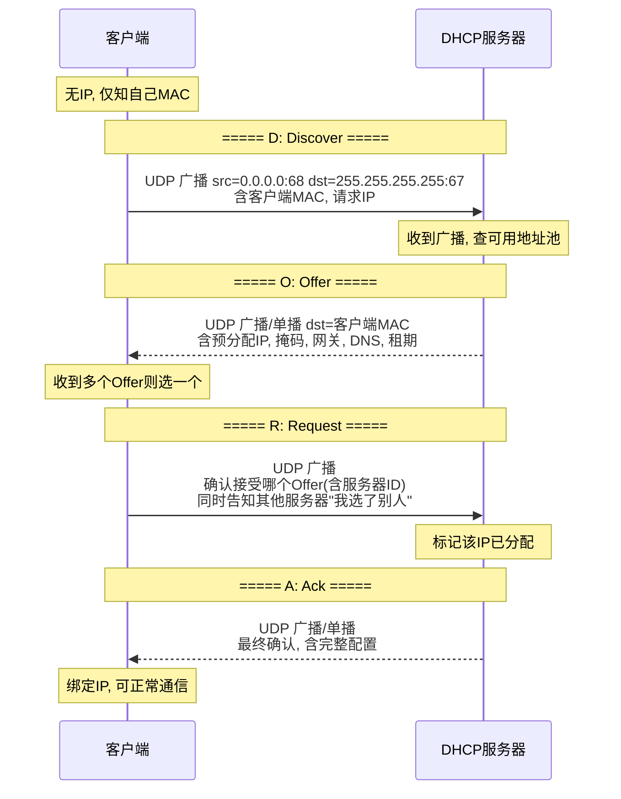
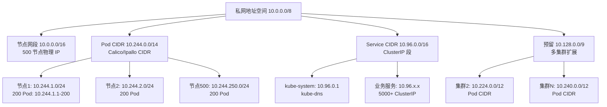

# IP 协议

> **一句话定位**：子网划分与 CIDR 是网络层高频考点，IPv6 在云原生面试常出现。
> **面试热度**：⭐⭐⭐⭐
> **返回**：[网络知识图谱](../README.md)

---

## 一、概念定义

### 1.1 IP 协议的定位与特性

IP（Internet Protocol，网际协议）是 TCP/IP 协议栈的**网络层**核心协议，定义于 RFC 791（IPv4）/ RFC 8200（IPv6）。它在链路层之上提供**主机到主机**的寻址与路由，是整个互联网的"地址体系"与"转发体系"基础。所有传输层协议（TCP/UDP/QUIC）与应用层协议（HTTP/DNS/SMTP）都承载于 IP 之上。

IP 协议有两个本质特性，它与 TCP 的"可靠传输"形成鲜明对比：

| 特性 | 含义 | 工程影响 | 与 TCP 对比 |
|------|------|---------|------------|
| 无连接 | 发送前无需建立连接，每个数据报独立路由 | 无握手开销，但无状态记录 | TCP 面向连接，需三次握手 |
| 不可靠 | 不保证到达、不保证顺序、不保证不重复 | 可靠性由上层（TCP）或应用自行实现 | TCP 靠序号/ACK/重传保证可靠 |
| 尽力交付 | 网络尽力转发，但不承诺 | 丢包、乱序、重复由上层处理 | TCP 在 IP 之上补齐这些缺陷 |

> **关键澄清**：IP 的"不可靠"是**设计哲学**而非缺陷——网络层只做最简的寻址转发，把可靠性交给端到端的传输层（TCP），这就是端到端原则（end-to-end principle）的体现。TCP 的可靠传输正是在不可靠的 IP 之上构建的（详见 [TCP 可靠性](../02-transport/tcp-reliability.md)）。

### 1.2 IPv4 首部格式

IPv4 首部固定部分 20 字节，含选项最大 60 字节。结构如下：

```
 0                   1                   2                   3
 0 1 2 3 4 5 6 7 8 9 0 1 2 3 4 5 6 7 8 9 0 1 2 3 4 5 6 7 8 9 0 1
+-+-+-+-+-+-+-+-+-+-+-+-+-+-+-+-+-+-+-+-+-+-+-+-+-+-+-+-+-+-+-+-+
|版本(4)|IHL(4)|  DSCP(6)|ECN(2)|        总长度 (16)            |
+-+-+-+-+-+-+-+-+-+-+-+-+-+-+-+-+-+-+-+-+-+-+-+-+-+-+-+-+-+-+-+-+
|       标识 (16)              |标志(3)|     分片偏移 (13)      |
+-+-+-+-+-+-+-+-+-+-+-+-+-+-+-+-+-+-+-+-+-+-+-+-+-+-+-+-+-+-+-+-+
|  TTL (8)      |   协议 (8)   |      首部校验和 (16)         |
+-+-+-+-+-+-+-+-+-+-+-+-+-+-+-+-+-+-+-+-+-+-+-+-+-+-+-+-+-+-+-+-+
|                       源 IP (32)                            |
+-+-+-+-+-+-+-+-+-+-+-+-+-+-+-+-+-+-+-+-+-+-+-+-+-+-+-+-+-+-+-+-+
|                     目的 IP (32)                            |
+-+-+-+-+-+-+-+-+-+-+-+-+-+-+-+-+-+-+-+-+-+-+-+-+-+-+-+-+-+-+-+-+
|                    选项 (0-40 字节, 可变)                  |
+-+-+-+-+-+-+-+-+-+-+-+-+-+-+-+-+-+-+-+-+-+-+-+-+-+-+-+-+-+-+-+-+
```

**关键字段详解**：

| 字段 | 位宽 | 作用 |
|------|------|------|
| 版本 Version | 4 | IP 协议版本，IPv4=4，IPv6=6 |
| IHL（Internet Header Length） | 4 | 首部长度，以 4 字节为单位，范围 5-15，对应 20-60 字节 |
| DSCP/ECN（TOS） | 8 | DSCP（区分服务，6 位）做 QoS 分级；ECN（显式拥塞通知，2 位）由路由器标记拥塞 |
| 总长度 Total Length | 16 | 整个 IP 包（首部+数据）字节数，最大 65535，受 MTU 限制实际通常 ≤1500 |
| 标识 Identification | 16 | 唯一标识本数据报，分片时所有分片共用同一值，用于重组 |
| 标志 Flags | 3 | bit1=保留(0)；bit2=DF（Don't Fragment，禁止分片）；bit3=MF（More Fragments，还有后续分片，最后一片=0） |
| 分片偏移 Fragment Offset | 13 | 本分片在原数据报中的偏移，以 8 字节为单位（故分片大小必为 8 的倍数） |
| TTL（Time To Live） | 8 | 生存时间，每经过一台路由器减 1，归 0 则丢弃（防路由环路） |
| 协议 Protocol | 8 | 上层协议号：TCP=6、UDP=17、ICMP=1、IGMP=2、OSPF=89 |
| 首部校验和 | 16 | 仅覆盖首部（不含数据），每跳需重算（因 TTL 变化） |
| 源/目的 IP | 各 32 | 发送方与接收方的 IPv4 地址 |

> **易混点**：①IPv4 首部校验和**只校验首部不校验数据**（数据校验交给 TCP/UDP 校验和），而 TCP/UDP 校验和覆盖伪首部+首部+数据。②TTL 每跳减 1，故首部校验和每跳都要重算。③标识字段配合 MF 与分片偏移完成重组，详见 §2.3。

### 1.3 IPv4 地址分类（A/B/C/D/E）

IPv4 地址 32 位，传统分类按前几位区分网络号与主机号：

| 类别 | 前导位 | 网络号范围 | 默认掩码 | 主机位数 | 单网主机数 | 用途 |
|------|--------|-----------|---------|---------|------------|------|
| A | 0xxxxxxx | 1-126 | /8 | 24 | 2²⁴-2 = 1677 万 | 大型网络 |
| B | 10xxxxxx | 128-191 | /16 | 16 | 2¹⁶-2 = 65534 | 中型网络 |
| C | 110xxxxx | 192-223 | /24 | 8 | 2⁸-2 = 254 | 小型网络 |
| D | 1110xxxx | 224-239 | — | — | — | 组播（多播） |
| E | 1111xxxx | 240-255 | — | — | — | 保留（实验） |

**特殊地址**：

| 地址段 | 含义 |
|--------|------|
| 0.0.0.0/8 | 本网络本主机（0.0.0.0 表示"未指定地址"） |
| 127.0.0.0/8 | 环回（loopback），127.0.0.1 最常用 |
| 10.0.0.0/8 | A 类私网 |
| 172.16.0.0/12 | B 类私网（172.16.0.0 - 172.31.255.255） |
| 192.168.0.0/16 | C 类私网 |
| 169.254.0.0/16 | 链路本地（APIPA 自动分配） |
| 255.255.255.255 | 有限广播（本网所有主机） |

> **为什么每个网段主机数要减 2**：主机号全 0 = 网络地址（如 192.168.1.0 表示"本网络"），主机号全 1 = 广播地址（如 192.168.1.255 表示"本网所有主机"），这两个不能分配给主机。

> **分类地址已过时**：现代网络统一用 CIDR（无类别域间路由，RFC 4632）取代 A/B/C 分类，但分类地址仍是面试基础概念，且在路由表聚合、私网规划中常用。D 类组播详见 [路由/ICMP（规划中）](./routing.md)。

---

## 二、原理与流程

### 2.1 子网掩码与 CIDR

#### 2.1.1 子网划分的动机

传统分类地址把网络号与主机号固化为 8/16/24 位，灵活性不足：一个 /16 网段有 65534 个主机地址，单个组织用不完又不能拆给他人；一个 /24 只有 254 个主机，不够用又不能再借一位。**子网划分**（subnets）允许在分类地址基础上"借位"：从主机位借用若干位作为子网号，把一个大网切成多个小子网。

**子网掩码**：与 IP 地址逐位与运算，分离出网络号。掩码中 1 表示网络位，0 表示主机位。如 255.255.255.0 = 前 24 位是网络位。

#### 2.1.2 CIDR 表示法

CIDR（Classless Inter-Domain Routing，无类别域间路由）彻底取消 A/B/C 分类，用 `IP/前缀长度` 表示网络号位数：

```
192.168.1.0/24
└──────┬──────┘└┬┘
   网络号(24位) 主机位(8位)

子网掩码 = 前 24 位 1 = 11111111.11111111.11111111.00000000 = 255.255.255.0
```

**`/N` 的含义**：前 N 位是网络号（前缀），剩余 32-N 位是主机位。

| CIDR | 掩码 | 主机位数 | 可用主机数 |
|------|------|---------|-----------|
| /24 | 255.255.255.0 | 8 | 254 |
| /23 | 255.255.254.0 | 9 | 510 |
| /22 | 255.255.252.0 | 10 | 1022 |
| /16 | 255.255.0.0 | 16 | 65534 |
| /8 | 255.0.0.0 | 24 | 16777214 |
| /30 | 255.255.255.252 | 2 | 2（点对点链路） |
| /32 | 255.255.255.255 | 0 | 1（单机路由） |

> **记忆技巧**：可用主机数 = 2^(32-N) - 2（减去网络地址与广播地址）。/30 段仅 2 个可用主机，是点对点链路（如 OSPF 邻居、容器 veth）的标准配置。/32 是单机路由，常见于云上浮动 IP、LB 后端路由。

#### 2.1.3 子网划分计算示例

**场景**：把 192.168.1.0/24 划分成 4 个子网。

**计算步骤**：

```
原网段: 192.168.1.0/24   主机位 8 位 → 可用 254
借 2 位做子网号 → 2² = 4 个子网, 每个子网主机位 8-2=6 位 → 每子网可用 2⁶-2=62
```

| 子网 | 子网地址 | 可用范围 | 广播地址 |
|------|---------|---------|---------|
| 0 | 192.168.1.0/26 | 192.168.1.1 - 192.168.1.62 | 192.168.1.63 |
| 1 | 192.168.1.64/26 | 192.168.1.65 - 192.168.1.126 | 192.168.1.127 |
| 2 | 192.168.1.128/26 | 192.168.1.129 - 192.168.1.190 | 192.168.1.191 |
| 3 | 192.168.1.192/26 | 192.168.1.193 - 192.168.1.254 | 192.168.1.255 |

**通用公式**：

- 切成 K 个子网需借 ⌈log₂K⌉ 位
- 每子网可用主机 = 2^(主机位) - 2
- 子网大小（块大小）= 2^(主机位)，子网地址必须是块大小的整数倍

> **反向题**：一个 /27 网段包含多少个子网、多少主机？/27 = 借 3 位（相对 /24），故 2³=8 个子网，每个子网主机位 5，可用 2⁵-2=30。

#### 2.1.4 路由聚合（超网）

CIDR 的另一面是**路由聚合**：把多个小网段合并成一个大网段，减少路由表条目。如：

```
192.168.0.0/24
192.168.1.0/24
192.168.2.0/24
192.168.3.0/24
─────────────────
聚合为 192.168.0.0/22（前 22 位相同）
```

这使 BGP 路由表从理论上的数百万条压缩到实际几十万条。运营商把客户网段聚合后对外宣告，互联网骨干路由才得以维系。

### 2.2 IPv6

#### 2.2.1 IPv6 地址格式

IPv6 地址 128 位（16 字节），写作 8 组 4 位十六进制，用冒号分隔：

```
2001:0db8:85a3:0000:0000:8a2e:0370:7334
```

**简化规则**：

1. 每组前导 0 可省略：`0db8` → `db8`，`0370` → `370`
2. 连续的 0 组可用 `::` 表示（但 `::` 在一个地址中只能出现一次）

```
2001:db8:85a3:0:0:8a2e:370:7334
2001:db8:85a3::8a2e:370:7334
```

3. IPv4 嵌入地址：`::ffff:192.168.1.1`（IPv4 映射地址，用于双栈过渡）

**地址分类**：

| 类型 | 前缀 | 用途 |
|------|------|------|
| 全球单播 | 2000::/3 | 公网可路由地址 |
| 链路本地 | fe80::/10 | 单链路通信（类似 IPv4 的 169.254/16），不跨路由器 |
| 唯一本地 | fc00::/7 | 私网地址（类似 IPv4 私网） |
| 组播 | ff00::/8 | 多播（取代 IPv4 的 D 类 224-239） |
| 环回 | ::1/128 | 本机环回（类似 127.0.0.1） |
| 未指定 | ::/128 | 未分配（类似 0.0.0.0） |

> **无广播**：IPv6 没有广播地址（IPv4 的 255.255.255.255 与全 1 主机地址在 IPv6 不存在），用组播替代。这是协议设计上的简化——广播会中断链路上所有主机，组播只唤醒订阅者，效率更高。

#### 2.2.2 为什么 IPv6 不需要 NAT

IPv6 设计的核心动机是**地址耗尽**：IPv4 仅 2³² ≈ 43 亿地址，而 IPv6 有 2¹²⁸ ≈ 3.4×10³⁸，人均可分到数千个全球地址。

**IPv4 用 NAT 的原因**：私网主机无公网 IP，靠 NAT 把多私网 IP 映射到一个公网 IP（详见 [NAT（规划中）](./nat.md)）。NAT 打破了端到端原则，导致 P2P 困难、应用层需 STUN/TURN 穿透、连接追踪表成为瓶颈。

**IPv6 无需 NAT 的理由**：

1. **地址充足**：每个设备可分配全球单播地址，无需私网映射。
2. **端到端恢复**：主机有公网地址后可直接被寻址，P2P、VoIP、WebRTC 无需穿透。
3. **SLAAC 自动配置**：主机根据路由器通告的前缀 + 自己的 MAC/EUI-64 自动生成地址，无需 DHCP。
4. **安全模型变化**：IPv4 时代"私网 + NAT = 隐式安全"是误读，IPv6 时代应靠防火墙规则而非地址翻译做安全。

> **现实过渡**：部分企业仍用 IPv6 NAT66 做地址隐藏或 ULA（唯一本地）与公网隔离，但这不是设计本意，主流方案是"每个设备公网 IP + 防火墙策略"。

#### 2.2.3 IPv4 到 IPv6 的过渡

过渡不可能一蹴而就，主流方案有三：

| 方案 | 原理 | 适用场景 | 缺点 |
|------|------|---------|------|
| 双栈 Dual Stack | 主机同时跑 IPv4 与 IPv6 协议栈，按目的地址选协议 | 新部署、双协议都可达 | 需双份配置、双份监控 |
| 隧道 Tunneling | 在 IPv4 网络上封装 IPv6 报文（如 6in4、Teredo、6to4） | IPv6 孤岛穿越 IPv4 海洋 | 有 MTU 与封装开销、性能损耗 |
| 翻译 Translation | NAT64/DNS64 把 IPv6 主机访问 IPv4 资源时做协议翻译 | IPv6-only 主机访问 IPv4 旧服务 | 翻译有损耗、部分协议不兼容 |

**双栈详解**：主机同时配 IPv4 与 IPv6 地址，DNS 返回 A（IPv4）与 AAAA（IPv6）记录，应用按 RFC 6724 地址选择策略决定用哪个。问题：只有双栈都通的链路才真正过渡，IPv4 耗尽问题不解决，只是推迟。

**6in4 隧道详解**：IPv6 报文封装在 IPv4 报文里（Protocol=41），穿越 IPv4 网络到对端解封装。常见于早期 Hurricane Electric 隧道 Broker。问题：MTU 缩小 20 字节、需公网 IPv4 端点、NAT 环境需 Teredo（UDP 封装）。

**NAT64 + DNS64 详解**：IPv6-only 主机查 DNS 时，DNS64 把 A 记录（IPv4）合成 AAAA 记录（IPv6 段，前缀 `64:ff9b::/96`），主机连这个合成地址，NAT64 网关把 IPv6 流量翻译成 IPv4 发出。这是 IPv6-only 移动网络（如 T-Mobile）访问旧 IPv4 服务的方案。

### 2.3 分片与重组

#### 2.3.1 MTU 与分片机制

**MTU（Maximum Transmission Unit，最大传输单元）**：链路层单帧能承载的最大数据字节数。以太网 MTU 默认 1500 字节，IPv4 首部 20 字节，故 TCP MSS 通常 1460（1500-20-20）。

**分片触发**：IP 层要发送的数据报长度 > 出接口 MTU，且 DF=0（允许分片）时，IP 层把数据报切成多个分片：

```
原数据报: 数据 4000 字节, DF=0, MTU=1500
IP 首部 20B, 数据 1480B, offset=0, MF=1, id=X
IP 首部 20B, 数据 1480B, offset=1480/8=185, MF=1, id=X
IP 首部 20B, 数据 1040B, offset=2960/8=370, MF=0, id=X
                                      ↑ 最后一片 MF=0
```

**重组机制**：目的主机（不在中间路由器）根据 `id` 与 `offset` 重组。所有分片到达后按 offset 拼回原数据报交给上层。分片偏移以 8 字节为单位，故每个分片的数据长度必须是 8 的倍数（最后一片除外）。

#### 2.3.2 PMTU Discovery 与 DF 标志

**PMTUD（Path MTU Discovery，路径 MTU 发现，RFC 1191）**：发送方把 IP 包的 DF 标志置 1（禁止分片），若路径上某跳 MTU 不足，路由器丢弃包并回 ICMP Fragmentation Needed（Type 3 Code 4），携带下一跳 MTU。发送方据此降低 MSS 重发。

```
发送方 → DF=1, 包长 1500B → 路由器(MTU=1400)
路由器丢包, 回 ICMP "需分片但 DF=1, 下跳 MTU=1400"
发送方降低 MSS=1380(1400-20-20) 重发, 后续包不再被丢
```

**为什么 TCP 默认走 PMTUD**：TCP 在握手时协商 MSS，但路径 MTU 可能比两端 MTU 更小（如 PPPoE 封装减 8 字节、隧道封装减 20-50 字节）。TCP 把 DF=1 让 IP 层不分片，靠 ICMP 反馈动态调整，避免分片开销与风险。

#### 2.3.3 分片的风险与规避

**分片为什么有风险**：

| 风险 | 描述 |
|------|------|
| 丢一片全丢 | 任一分片丢失，整个数据报无法重组，上层需重传全部（TCP 重传整个段） |
| 放大攻击 | 攻击者发小包让路由器分片成大量碎片，耗尽目标重组缓冲（IP 分片攻击） |
| 绕过防火墙 | 防火墙只看首片（含四层头），后继分片只含数据，可绕过四层规则（分片绕过） |
| 重组资源 | 目的主机需缓存乱序分片等待齐套，重组缓冲被占满可致 DoS |
| NAT 穿透难 | NAT 需对每个分片单独建映射表，首片含四层端口后继片没有，NAT 实现复杂 |

**规避措施**：

1. **TCP 用 PMTUD + DF=1**：避免 IP 层分片，靠 MSS 协商与 ICMP 反馈调整。
2. **UDP 应用自行分片**：DNS 等小包协议控制报文 < 512B 避免 EDNS0 与分片；大 UDP（如 QUIC）在应用层分片重传，不依赖 IP 分片。
3. **防火墙补丁**：现代防火墙做"虚拟重组"（先拼完整再判规则），防分片绕过。
4. **ICMP 不被丢弃**：PMTUD 依赖 ICMP Type 3 Code 4，若防火墙盲目丢 ICMP 会导致 PMTUD 失败，TCP 连接卡死（典型现象：小包通大包卡）。Linux 有 `tcp_mtu_probing` 兜底。

### 2.4 DHCP 工作流程（DORA）

DHCP（Dynamic Host Configuration Protocol，RFC 2131）让主机动态获取 IP 地址、子网掩码、网关、DNS 等网络配置，避免手工配置。它基于 UDP，服务器端口 67，客户端端口 68。核心流程是 **DORA** 四步：



**四步详解**：

| 步骤 | 报文 | 方向 | 关键内容 |
|------|------|------|---------|
| Discover | 客户端广播 | C → 所有 DHCP | 源 IP 0.0.0.0，目的 255.255.255.255，含 MAC 与参数请求列表 |
| Offer | 服务器响应 | S → C（广播或单播） | 预分配 IP、租期、掩码、网关、DNS、服务器标识 |
| Request | 客户端广播确认 | C → 所有 DHCP | 确认接受某服务器的 Offer（带 Server ID），其他服务器释放预占 IP |
| Ack | 服务器最终确认 | S → C（广播或单播） | 确认租约生效，含完整配置参数 |

**为什么 Discover 与 Request 都用广播**：客户端此时无 IP，无法单播回复；Request 用广播是让**所有** DHCP 服务器知道"我选了谁"，未被选中的服务器可立即回收预占 IP，避免浪费。

**租约续约**：DHCP 地址有租期（如 24h），客户端在租期 50% 时单播 Request 续约，87.5% 时广播 Request 兜底。续约失败则租约到期，客户端释放 IP 重新走 DORA。

**DHCP 中继（Relay）**：DHCP 广播不跨路由器，跨网段获取需在路由器配 DHCP Relay（`ip helper-address`），把广播封装成单播转发给指定 DHCP 服务器。

---

## 三、高频追问与面试题

### Q1：`192.168.1.0/24` 能容纳多少主机？怎么算？

**参考答案**：**254 个可用主机**。

计算步骤：

1. `/24` 表示前 24 位是网络号，后 8 位是主机位。
2. 主机位 8 位，理论上 2⁸ = 256 个地址。
3. 减去两个保留地址：
   - 主机位全 0 = 网络地址（192.168.1.0）
   - 主机位全 1 = 广播地址（192.168.1.255）
4. 可用主机 = 256 - 2 = **254**。
5. 可用范围：192.168.1.1 - 192.168.1.254。

通用公式：**可用主机数 = 2^(32-N) - 2**（/31 与 /32 例外，/31 用于点对点链路 RFC 3021 不需网络/广播地址，可用 2 个；/32 是单机路由可用 1 个）。

**追问**：那 `/16`、`/30` 呢？

> `/16` 主机位 16，可用 2¹⁶-2 = 65534；`/30` 主机位 2，可用 2²-2 = 2，常用于路由器点对点链路（如 OSPF 邻居、容器 veth pair），刚好够两端各一个 IP，不浪费。

### Q2：为什么需要 IPv6？IPv4 耗尽后怎么过渡？

**参考答案**：IPv4 地址仅 2³² ≈ 43 亿，2011 年 IANA 主地址池耗尽，2019 年 APNIC/RIPENCC 等区域地址池告罄。移动互联网、IoT、云原生使地址需求爆炸式增长，NAT 缓解但破坏端到端。IPv6 提供 2¹²⁸ 地址（人均数万亿），恢复端到端寻址，是必然演进。

过渡三种方案：

1. **双栈**：主机同时配 IPv4 与 IPv6，DNS 同时返回 A 与 AAAA 记录，按可达性选协议。简单但需双份网络配置与监控，且 IPv4 耗尽问题不解决。
2. **隧道**：在 IPv4 网络上封装 IPv6（6in4、Teredo、6pe），让 IPv6 孤岛穿越 IPv4 海洋。有封装与 MTU 开销，适合过渡期。
3. **翻译（NAT64 + DNS64）**：IPv6-only 主机访问 IPv4 旧服务时，DNS64 合成 AAAA 记录，NAT64 网关做协议翻译。这是 IPv6-only 移动网络的兜底方案。

主流策略：**双栈优先，隧道与翻译兜底，最终走向 IPv6-only**。云厂商（AWS/GCP/阿里云）已默认提供 IPv6 双栈，K8s 1.20+ 支持 IPv6 单栈与双栈集群。

**追问**：为什么不能一夜之间切到 IPv6？

> 几十亿存量 IPv4 设备与上百万 IPv4-only 应用无法立即升级；DNS、路由、监控、防火墙、负载均衡等基础设施需全链路改造；运维团队需重新培训。过渡期至少持续 10-20 年，双栈是务实选择。

### Q3：IP 分片在什么情况下发生？为什么有风险？

**参考答案**：**当 IP 数据报长度 > 出接口 MTU 且 DF=0 时**，IP 层自动分片。典型场景：

1. 应用发送大 UDP 包（如 DNS EDNS0 超过 512B、某些流媒体协议）超过 MTU。
2. 路径 MTU 小于两端 MTU（如 PPPoE 减 8B、隧道封装减 20-50B），且 DF=0。
3. TCP 通常用 PMTUD + DF=1 规避分片，但当 PMTUD 失败（ICMP 被防火墙丢）时也可能回退分片。

**分片风险**：

| 风险 | 说明 |
|------|------|
| 任一片丢全丢 | 丢失任一分片导致整个数据报无法重组，上层需重传全部，放大丢包影响 |
| 重组 DoS | 攻击者发大量伪造分片，目标主机重组缓冲被占满，耗尽内存 |
| 防火墙绕过 | 防火墙只看首片（含四层端口），后续分片只含数据，可绕过四层规则 |
| NAT 复杂 | NAT 需对每个分片单独建映射，首片含端口后继片没有，实现易错 |
| 性能损耗 | 分片与重组消耗 CPU 与内存，重组需缓存乱序分片等待齐套 |

**规避**：TCP 用 PMTUD（DF=1 + ICMP 反馈）避免 IP 分片；UDP 应用自行控制报文大小（DNS 控制 < 512B，QUIC 在应用层分片重传）；防火墙做虚拟重组补丁；确保 ICMP Type 3 Code 4 不被盲目丢弃，否则 PMTUD 失败致大包黑洞。

**追问**：PMTUD 失败会怎样？

> 现象是"小包通大包卡"——握手（小包）成功，但数据传输（大包）超时。因 DF=1 的大包被中间路由器丢弃并回 ICMP Fragmentation Needed，但 ICMP 被某跳防火墙挡住，发送方收不到反馈无法降 MSS，持续发大包持续被丢。Linux 可开 `tcp_mtu_probing` 兜底，靠探测主动发现 PMTU。

### Q4：TTL 怎么防止路由环路？

**参考答案**：TTL（Time To Live）是 IP 首部 8 位字段，初始值由发送方设置（Linux 默认 64，Windows 默认 128），**每经过一台路由器减 1**，归 0 时路由器丢弃该包并向源端回 ICMP Time Exceeded（Type 11 Code 0）。

**防环路原理**：若网络中存在路由环路（A 的下一跳是 B，B 的下一跳是 A），无 TTL 的包会无限循环，耗尽链路带宽。TTL 保证每个包最多经过 255 跳必被丢弃，环路包在 TTL 耗尽时自动消亡，网络自愈。

**Traceroute 利用 TTL**：发送方发 TTL=1 的包，第一跳路由器收到后 TTL=0 丢包并回 ICMP Time Exceeded，发送方据此获知第一跳 IP；再发 TTL=2 的包，第二跳丢包回 ICMP，依次探测整条路径。详见 [路由/ICMP（规划中）](./routing.md)。

**追问**：为什么 Linux 默认 64 而不是 255？

> 64 跳已覆盖绝大多数互联网路径（实际互联网平均跳数约 15-20 跳），过大的 TTL 会让环路包在环路里转更久才消亡，浪费带宽。64 是平衡值：足够覆盖正常路径，又能在环路时较快收敛。255 是协议上限，不是推荐默认值。

### Q5：DHCP 怎么避免 IP 冲突？

**参考答案**：DHCP 通过**三层机制**避免冲突，但仍非绝对可靠：

1. **服务器侧地址池管理**：DHCP 服务器维护地址池，已分配的 IP 标记为占用，不会再分配给别人。租约到期自动回收。
2. **客户端侧冲突检测**：客户端收到 Offer/Ack 后，发 ARP 探测（"谁有这个 IP？"），若有人回应则拒绝该 IP，重新走 DORA。这叫** Gratuitous ARP / 冲突检测**。
3. **服务器侧 ping 检测**：部分 DHCP 服务器在分配前 ping 该 IP，无回应才分配。

**为什么仍可能冲突**：

- 静态配置的主机不在 DHCP 地址池管理范围内，管理员误把静态 IP 划入池就会冲突。
- 客户端离线时租约未到期，服务器可能误判 IP 空闲重新分配（ARP 探测可能漏检离线主机）。
- 多个 DHCP 服务器地址池重叠会交叉分配。

**工程规避**：地址池与静态分配段严格分离；租约续期失败及时释放；客户端冲突检测是最后防线；监控 ARP 表异常（同一 IP 多 MAC）告警。

**追问**：DHCP 是怎么防 IP 冲突的，如果两个 DHCP 服务器同时分配会怎样？

> 若两个 DHCP 服务器地址池不重叠，正常工作；若重叠，会出现"双分配"冲突——两个客户端拿到同一 IP。客户端的 ARP 冲突检测是最后防线，但仍可能漏检（如对方离线）。生产环境应确保多 DHCP 服务器地址池严格不重叠，或用 DHCP Failover 协议（RFC 6701）做主备同步。

---

## 四、实战与 Java 生态关联

### 4.1 Linux ip / ifconfig / route 命令

**ip 命令**（现代标准，`iproute2` 包，替代 ifconfig）：

```bash
# 查看所有网卡与 IP
ip addr show
ip -br addr show          # 简洁模式: 网卡名 状态 IP

# 查看路由表
ip route
ip route get 8.8.8.8       # 查看到某 IP 的路由决策(含出口网卡与下一跳)

# 查看邻居表(ARP/NDP)
ip neigh
ip neigh show dev eth0

# 增删 IP
sudo ip addr add 192.168.1.10/24 dev eth0
sudo ip addr del 192.168.1.10/24 dev eth0

# 增删路由
sudo ip route add 10.0.0.0/8 via 192.168.1.1
sudo ip route add default via 192.168.1.1   # 默认路由

# 查看网卡统计与状态
ip -s link
ip -s -s link show eth0    # 详细统计(含丢包/错误)
```

**ifconfig**（老式，部分发行版已不默认安装）：

```bash
ifconfig                  # 查看所有网卡
ifconfig eth0            # 查看指定网卡
ifconfig eth0 192.168.1.10 netmask 255.255.255.0 up  # 配 IP 并启用
ifconfig eth0:0 192.168.1.11/24  # 别名(虚拟网卡), 一卡多 IP
ifconfig eth0 mtu 1400   # 改 MTU
```

**route**（老式路由查看）：

```bash
route -n                  # 数字形式显示路由(不解析主机名)
route add -net 10.0.0.0 netmask 255.0.0.0 gw 192.168.1.1
route add default gw 192.168.1.1
```

> **排查思路**：①`ip -br addr` 看网卡与 IP 配置；②`ip route` 看路由是否正确；③`ip neigh` 看 ARP/NDP 表是否异常（如某 IP 多 MAC = 冲突或 ARP 欺骗）；④`ip -s link` 看网卡丢包与错误计数；⑤`ip route get <目标>` 验证到某 IP 的路由决策。

### 4.2 Java InetAddress / NetworkInterface

JDK 通过 `java.net.InetAddress` 与 `java.net.NetworkInterface` 操作 IP 地址与网卡：

```java
import java.net.InetAddress;
import java.net.NetworkInterface;
import java.net.SocketException;
import java.net.UnknownHostException;
import java.util.Collections;
import java.util.Enumeration;

public class IpDemo {
    public static void main(String[] args) throws Exception {
        // ===== 1. 域名解析(走系统 DNS) =====
        InetAddress[] addrs = InetAddress.getAllByName("www.example.com");
        for (InetAddress a : addrs) {
            System.out.println(a.getHostAddress());
            // IPv4: 93.184.216.34
            // IPv6: 2606:2800:220:1:248:1893:25c8:1946
        }

        // ===== 2. 判断 IPv4 / IPv6 =====
        InetAddress addr = InetAddress.getByName("192.168.1.1");
        System.out.println(addr instanceof java.net.Inet4Address); // true
        InetAddress addr6 = InetAddress.getByName("2001:db8::1");
        System.out.println(addr6 instanceof java.net.Inet6Address); // true

        // ===== 3. 反向解析(IP → 域名) =====
        InetAddress reverse = InetAddress.getByName("8.8.8.8");
        System.out.println(reverse.getHostName()); // dns.google

        // ===== 4. 可达性测试(底层 ICMP, 需 root 或 CAP_NET_RAW) =====
        boolean ok = InetAddress.getByName("8.8.8.8").isReachable(3000);

        // ===== 5. 遍历本机所有网卡与 IP =====
        Enumeration<NetworkInterface> nics = NetworkInterface.getNetworkInterfaces();
        for (NetworkInterface nic : Collections.list(nics)) {
            System.out.printf("网卡: %s, 状态: %s%n",
                nic.getName(), nic.isUp() ? "UP" : "DOWN");
            // MAC 地址
            byte[] mac = nic.getHardwareAddress();
            if (mac != null) {
                StringBuilder sb = new StringBuilder();
                for (byte b : mac) sb.append(String.format("%02X:", b));
                System.out.println("  MAC: " + sb.substring(0, sb.length() - 1));
            }
            // 该网卡所有 IP
            Enumeration<InetAddress> ipList = nic.getInetAddresses();
            while (ipList.hasMoreElements()) {
                InetAddress ip = ipList.nextElement();
                System.out.println("  IP: " + ip.getHostAddress()
                    + (ip.isLoopbackAddress() ? " (loopback)" : ""));
            }
        }
    }
}
```

**JVM 与 IP 层的关联**：

- **JVM DNS 缓存**：`networkaddress.cache.ttl`（默认 30s，无 SecurityManager 时）控制解析缓存，详见 [DNS §4.2](../01-application/dns.md#42-java-inetaddress-解析)。
- **IPv4/IPv6 优先**：JVM 默认双栈，按 RFC 6724 选择地址。可设 `-Djava.net.preferIPv4Stack=true` 强制 IPv4（JDK 12+ 已废弃，推荐用系统 `/etc/gai.conf`）。
- **NIC 绑定**：服务端可用 `ServerSocket.bind(InetSocketAddress)` 绑定到指定网卡 IP，多网卡环境避免监听 0.0.0.0 被外部网络访问。

### 4.3 CIDR 计算工具

**python3 ipaddress 模块**（标准库，最常用）：

```python
import ipaddress

# 解析 CIDR
net = ipaddress.ip_network('192.168.1.0/24')
print(net.netmask)           # 255.255.255.0
print(net.network_address)   # 192.168.1.0
print(net.broadcast_address) # 192.168.1.255
print(net.num_addresses)     # 256
print(list(net.hosts()))     # 可用主机(去网络与广播) [.1 ~ .254]

# 子网划分
for sub in net.subnets(new_prefix=26):
    print(sub)  # 192.168.1.0/26, 192.168.1.64/26, 192.168.1.128/26, 192.168.1.192/26

# 超网聚合
nets = [ipaddress.ip_network(f'192.168.{i}.0/24') for i in range(4)]
for sup in ipaddress.collapse_addresses(nets):
    print(sup)  # 192.168.0.0/22

# 判断 IP 是否在网段内
net = ipaddress.ip_network('192.168.1.0/24')
print(ipaddress.ip_address('192.168.1.100') in net)  # True

# IPv6 同样支持
net6 = ipaddress.ip_network('2001:db8::/32')
print(net6.num_addresses)  # 79228162514264337593543950336
```

**Linux sipcalc（命令行 CIDR 计算）**：

```bash
sipcalc 192.168.1.0/24
# 输出: 网络地址, 广播地址, 掩码, 可用范围, 主机数

sipcalc 192.168.1.0 255.255.255.0    # 用掩码形式
sipcalc -6 2001:db8::/32             # IPv6
```

**纯手算技巧**（面试常考）：

1. 主机位 = 32 - N，可用主机 = 2^(主机位) - 2。
2. 子网大小（块大小）= 2^(主机位)，子网地址必须是块大小的整数倍。
3. 借 K 位切成 2^K 个子网，每子网主机位 = 原主机位 - K。
4. 掩码快速换算：/24 = 255.255.255.0；/25 = 255.255.255.128；/26 = 255.255.255.192；/27 = 255.255.255.224。

---

## 五、系统设计案例

### 5.1 K8s 集群 Pod 网段规划

**需求**：规划一个生产级 K8s 集群（500 节点、每节点 200 Pod、峰值 10 万 Pod），需规划 Pod 网段、Service IP 段、NodePort 范围，并考虑 IPv4 耗尽下的策略。

**问题分析**：

| 维度 | 需求 | 估算 |
|------|------|------|
| Pod 网段 | 10 万 Pod，每节点 200 Pod，需节点级子网 | 500 节点 × /24 子网 = 500 × 256 = 12.8 万 IP |
| Service IP | ClusterIP 数量，每服务 1 IP | 业务服务 + 系统组件，预估 5000 |
| NodePort | 对外暴露端口 | 30000-32767 默认 2768 个，可能不够 |
| 节点 IP | 物理节点 IP | 500 节点，需 500 IP |
| IPv4 耗尽 | 私网空间有限 | 10.0.0.0/8 仅 1677 万，多集群易冲突 |

**方案对比：/16 vs /14 vs /12 Pod CIDR**

| 维度 | /16 Pod CIDR | /14 Pod CIDR | /12 Pod CIDR |
|------|-------------|--------------|-------------|
| 容量 | 65536 IP | 262144 IP | 104 万 IP |
| 可支持节点（每节点 /24） | 256 节点 | 1024 节点 | 4096 节点 |
| 适用规模 | 小型集群（< 256 节点） | 中型集群（256-1000 节点） | 中大型集群（500-1000 节点） |
| 跨集群冲突 | 易冲突（多集群都占 10.244.0.0/16） | 可分配不同 /14 段（10.244.0.0/14 vs 10.248.0.0/14） | 可分配不同 /12 段（10.224.0.0/12 vs 10.240.0.0/12） |
| 路由表大小 | 256 条节点路由 | 1024 条节点路由 | 4096 条节点路由（需 BGP 或等价路由） |

**推荐规划（500 节点场景）**：



**具体分配**：

| 用途 | 网段 | 大小 | 说明 |
|------|------|------|------|
| 节点物理 IP | 10.0.0.0/16 | 65534 | 500 节点绰绰有余，预留扩容 |
| Pod CIDR | 10.244.0.0/14 | 262144 | 每节点 /24，1024 子网 × 256 = 26.2 万 IP，500 节点足够 |
| Service CIDR | 10.96.0.0/16 | 65534 | ClusterIP，5000 服务绰绰有余 |
| 多集群预留 | 10.128.0.0/9 | 33M | 集群 2 用 10.224.0.0/12，集群 N 用 10.240.0.0/12 |

**关键设计决策**：

1. **Pod CIDR 用 /14 而非 /16**：500 节点用 /16（256 子网 × 256 IP = 65536）只能容纳 256 节点，不够；/14（1024 子网 × 256 IP = 262144）可支持 1024 节点，500 节点足够且留扩容余量。若用 /12 需 BGP 或等价多路径路由，运维复杂度上升，规模超 1000 节点才考虑 /12。
2. **每节点分配 /24 子网**：每节点最多 254 Pod，预留冗余。Calico/Flannel 等 CNI 按节点分配子网，节点加入时从 CIDR 池拿一个 /24。
3. **Service CIDR 与 Pod CIDR 分离**：Service IP 是虚拟 IP（kube-proxy iptables/IPVS 规则），不分配给任何网卡，与 Pod 网段必须不重叠，避免路由混乱。
4. **NodePort 范围调整**：默认 30000-32767 仅 2768 个，生产环境需扩大。`kube-apiserver --service-node-port-range=20000-32767` 或更宽 `10000-32767`（避开 1-1023 特权端口与临时端口 32768-60999）。
5. **跨集群 Pod CIDR 隔离**：多集群互不重叠，集群 1 用 10.244.0.0/14，集群 2 用 10.248.0.0/14，避免 Pod 跨集群路由冲突。跨集群通信走 Ingress/Egress Gateway 或 Submariner 做路由通告。

**IPv4 耗尽下的策略**：

| 策略 | 做法 | 适用场景 |
|------|------|---------|
| 私网复用 | 多集群都用 10.0.0.0/8，各自隔离不互通 | 中小规模，集群间无直连 |
| CIDR 聚合 | 集群 1 用 10.224.0.0/12，集群 2 用 10.240.0.0/12，上层 BGP 聚合 | 大规模多集群 |
| IPv6 双栈 | Pod 同时配 IPv4 + IPv6，优先 IPv6 通信 | 云厂商默认支持，K8s 1.20+ |
| IPv6 单栈 | Pod 仅 IPv6，NAT64 访问 IPv4 旧服务 | IPv6-only 集群，需 NAT64 网关 |
| NAT 兜底 | Pod 出公网走 SNAT，复用少数公网 IP | 对外访问，牺牲端到端 |

**K8s IPv6 双栈配置**（v1.20+）：

```yaml
# kube-controller-manager
--cluster-cidr=10.244.0.0/14,fd00:10:244::/54      # IPv4 + IPv6 Pod CIDR
--service-cluster-ip-range=10.96.0.0/16,fd00:10:96::/112  # 双栈 Service

# Pod 同时获得 IPv4 与 IPv6
apiVersion: v1
kind: Pod
metadata:
  name: dual-stack-pod
spec:
  containers:
  - name: app
    image: nginx
# 自动分配 IPv4 10.244.1.10 + IPv6 fd00:10:244:1::a
```

**容量与监控**：

- Pod IP 利用率：`kubelet` 与 CNI 报告每节点已用 IP，超过 80% 告警。
- Service IP 利用率：kube-apiserver 报告 Service 数量，接近 CIDR 容量 80% 需扩 CIDR。
- NodePort 占用率：`kubectl get svc` 统计已用 NodePort，接近上限扩范围。
- 路由表大小：`ip route | wc -l`，超过 1000 条评估是否用 BGP 替代静态。

**容灾设计**：

- **CIDR 耗尽**：预留扩展空间，Pod CIDR 用 /16 而非占满 /24，未来可扩到 /15。
- **单节点子网耗尽**：节点 Pod 数超 /24 容量时，CNI 支持给单节点分配第二个 /24。
- **跨集群网络隔离**：NetworkPolicy 限制 Pod 跨命名空间访问，避免 Pod 网段互通带来的安全风险。

> **面试加分点**：①强调 Pod CIDR 与 Service CIDR 必须不重叠；②讲清 /16 vs /14 vs /12 的容量与路由表大小权衡，500 节点选 /14 而非 /16（/16 仅够 256 节点）；③NodePort 默认范围不够需调整；④IPv4 耗尽用 IPv6 双栈是云原生趋势，K8s 1.20+ 原生支持；⑤多集群 CIDR 隔离避免路由冲突。

---

## 六、参考与延伸

- RFC 791（IPv4 规范）、RFC 8200（IPv6 规范）、RFC 4291（IPv6 地址架构）、RFC 4632（CIDR）、RFC 2131（DHCP）、RFC 4861（IPv6 ND，含 SLAAC）、RFC 1918（私网地址）
- RFC 1191（PMTU Discovery）、RFC 8201（IPv6 PMTU）、RFC 3021（/31 点对点链路）、RFC 6724（IPv6 地址选择）、RFC 7050（IPv6 SLAAC 通用前缀）
- Linux 内核文档：`Documentation/networking/ip-sysctl.txt`、`ip(8)`/`ifconfig(8)`/`route(8)` man 手册
- 延伸阅读：[NAT（规划中）](./nat.md)（NAT 与 IPv6 无 NAT 的关系）、[路由/ICMP（规划中）](./routing.md)（TTL 与 Traceroute、ICMP 与 PMTUD）、[TCP 可靠性](../02-transport/tcp-reliability.md)（MSS 与 PMTUD 的配合）、[TCP 连接](../02-transport/tcp-connection.md)（四元组与端口）
- 仓库内关联：`java-core/rmi`（基于 IP+端口的服务发现）、`framework/spring-framework`（RestTemplate 与 InetAddress 解析）、[DNS](../01-application/dns.md)（域名→IP 解析）、[HTTP](../01-application/http.md)（基于 IP+端口的请求）

> **返回**：[网络知识图谱](../README.md)
