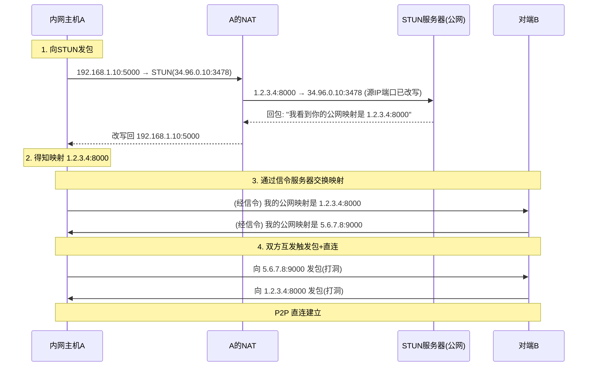
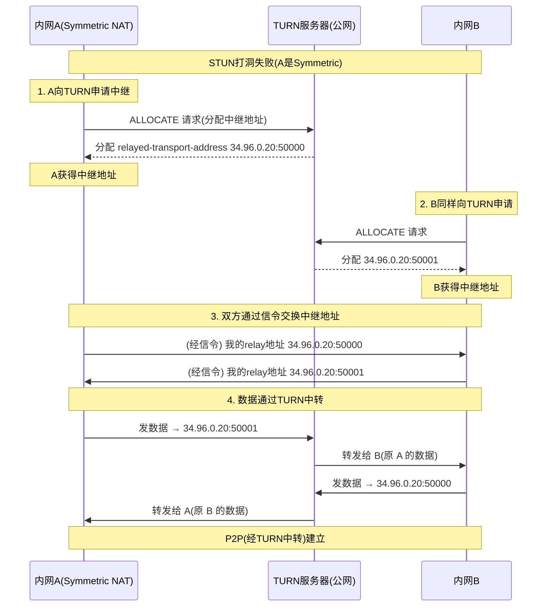
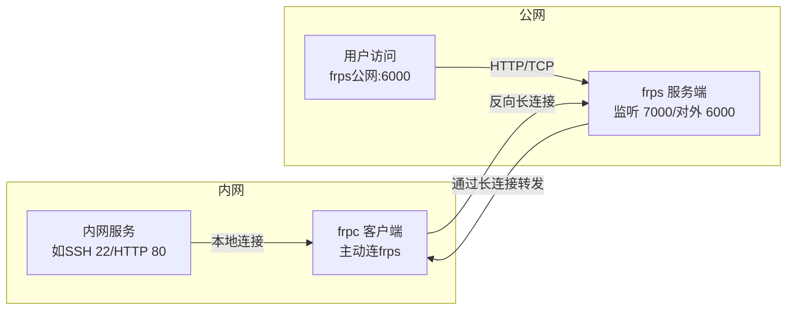
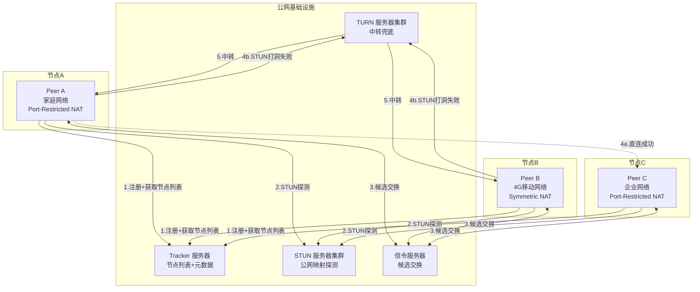
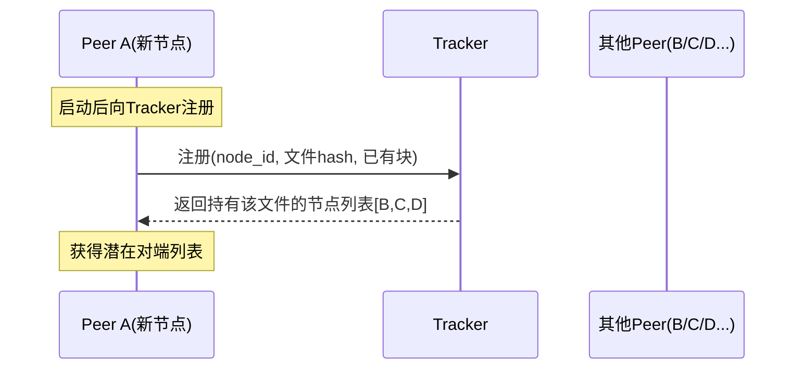
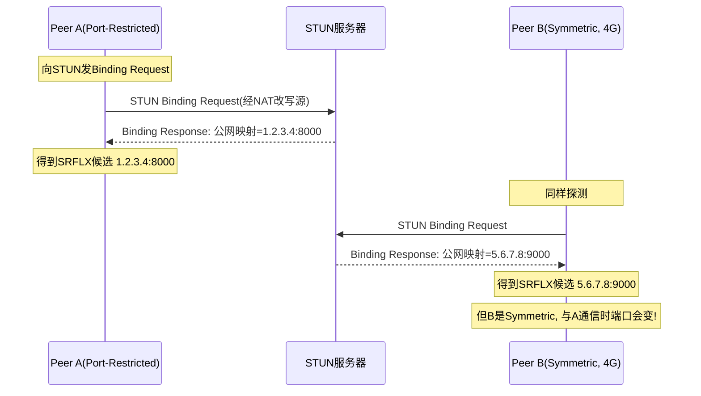
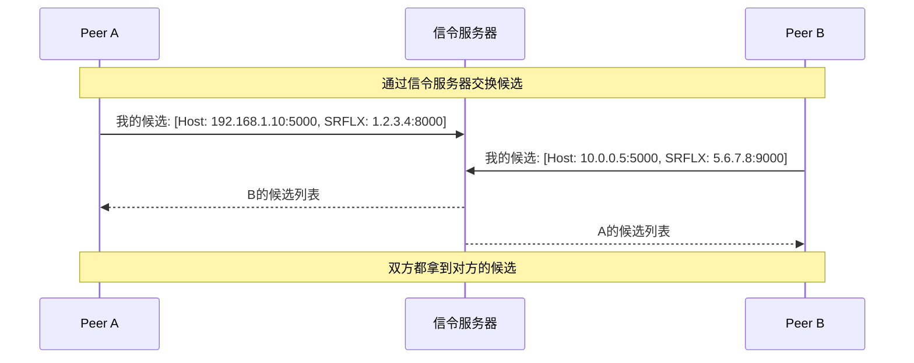
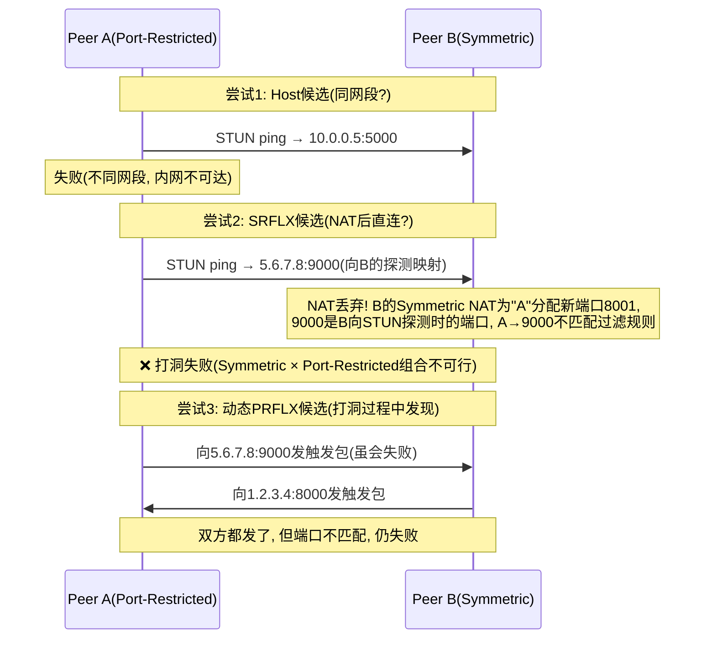
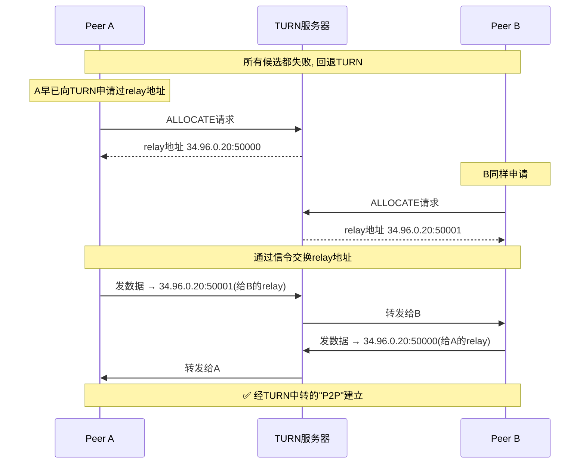

# NAT 与内网穿透

> **一句话定位**：NAT 类型与穿透方案是 P2P/WebRTC 面试的门槛题。
> **面试热度**：⭐⭐⭐⭐
> **返回**：[网络知识图谱](../README.md)

---

## 一、概念定义

### 1.1 NAT 的定位与本质

NAT（Network Address Translation，网络地址转换，RFC 1631 / RFC 2663）是部署在网关路由器上的一项**地址翻译技术**：它把内网主机发出的 IP 包源地址（私网 IP）改写为网关的公网 IP，反向把回包的目的地址（公网 IP）改写回内网主机的私网 IP。对内网主机而言，NAT 让多台主机共享一个公网 IP 访问外网；对外网而言，整个内网看起来只有一个公网 IP 在通信。

NAT 的本质是一个**有状态的地址翻译器**，它维护一张"映射表"记录每个会话的 `(内网IP, 内网端口) ↔ (公网IP, 公网端口)` 对应关系，所有改写都基于这张表。这与 IP 层无状态转发的路由器形成鲜明对比：

| 维度 | 路由器（IP 层转发） | NAT 网关（地址翻译） |
|------|---------------------|---------------------|
| 是否改地址 | 不改源/目的 IP | 改写源 IP（出向）与目的 IP（入向） |
| 是否有状态 | 无状态，每包独立转发 | 有状态，需维护映射表 |
| 端口处理 | 不感知四层端口 | NAPT 模式下还要改写端口 |
| 端到端原则 | 遵守，主机可直接被寻址 | 打破，主机失去公网可寻址性 |

> **关键澄清**：NAT 不是一个层独立协议，它是部署在网络层与传输层边界上的"中间盒子"（middlebox）。它打破互联网的端到端原则（end-to-end principle）——主机不再有全局唯一可寻址的地址，导致 P2P、VoIP、IPSec 等端到端应用必须依赖穿透方案。详见 [IP 协议 §2.2.2](./ip.md#222-为什么-ipv6-不需要-nat) 对 IPv6 无 NAT 的论述。

### 1.2 为什么需要 NAT：IPv4 地址耗尽

NAT 诞生的根本动机是 **IPv4 地址耗尽**：

- IPv4 地址仅 2³² ≈ 43 亿个，2011 年 IANA 主地址池耗尽，2019 年 APNIC/RIPENCC 等区域地址池告罄。
- 移动互联网、IoT、云原生使设备数爆炸式增长（人均多设备），公网 IP 远远不够。
- IPv6 普及缓慢（过渡期持续 10-20 年，详见 [IP §2.2.3](./ip.md#223-ipv4-到-ipv6-的过渡)），NAT 成为务实兜底方案。

**NAT 的核心价值**：用少量公网 IP 让大量私网主机共享上网。典型场景——家庭宽带运营商只给用户分配 1 个公网 IP，但家庭有手机、电脑、电视、IoT 等几十台设备，靠 NAT 让所有设备共享这 1 个公网 IP 访问互联网。

**私有地址空间**（RFC 1918）：

| 地址段 | 范围 | 规模 | 典型用途 |
|--------|------|------|---------|
| 10.0.0.0/8 | 10.0.0.0 - 10.255.255.255 | 1677 万 | 企业内网、K8s Pod CIDR |
| 172.16.0.0/12 | 172.16.0.0 - 172.31.255.255 | 104 万 | 中型内网、Docker 默认 |
| 192.168.0.0/16 | 192.168.0.0 - 192.168.255.255 | 65534 | 家庭/小办公网络 |

私网地址在公网不可路由，必须靠 NAT 翻译成公网 IP 才能访问互联网。

> **NAT 的副作用**：①打破端到端，P2P 困难；②连接追踪表成为性能瓶颈（高并发场景）；③部分协议不兼容（如 FTP 主动模式、IPSec AH）；④端到端可观测性下降（应用看到的 IP 是 NAT 后的）。这些都是 IPv6 想消除 NAT 的原因，但 IPv6 普及前 NAT 仍是主流。

### 1.3 NAPT：端口多路复用

最常用的 NAT 形态是 **NAPT**（Network Address Port Translation，网络地址端口翻译，RFC 2663 又称 PAT），也称 "Full Cone NAT 之外的常见形态" / "many-to-one NAT"。它不仅翻译 IP，还翻译端口，让多台内网主机共享同一个公网 IP 的不同端口。

**为什么需要端口翻译**：如果只翻译 IP 不翻译端口，当内网两台主机（如 192.168.1.10 与 192.168.1.11）同时访问同一个外网服务器（如 8.8.8.8:53），回包目的 IP 都是网关公网 IP（如 1.2.3.4），网关无法区分该回包该转给哪台主机——因为只有目的 IP 不同，目的端口都是 53。**端口翻译让每个会话分配一个独立的公网端口**，回包就能靠公网端口区分归属。

**NAPT 映射表示例**：

| 内网源 IP:端口 | 公网源 IP:端口 | 目的 IP:端口 | 协议 |
|---------------|---------------|-------------|------|
| 192.168.1.10:50000 | 1.2.3.4:40001 | 8.8.8.8:53 | UDP |
| 192.168.1.11:50000 | 1.2.3.4:40002 | 8.8.8.8:53 | UDP |
| 192.168.1.10:51000 | 1.2.3.4:40003 | 142.250.80.46:443 | TCP |

可以看到，两台内网主机的相同源端口（50000）被翻译成不同的公网端口（40001、40002），靠公网端口区分会话归属。这就是**端口多路复用**——多个内网会话复用同一个公网 IP 的不同端口。

> **NAT vs NAPT**：狭义 NAT 仅翻译 IP（一对一，公网 IP 数=内网主机数，不解决耗尽问题）；NAPT 翻译 IP+端口（多对一，少量公网 IP 服务大量内网主机）。日常说的"NAT"几乎都是 NAPT，本文后续除非特别说明，NAT 均指 NAPT。Linux iptables 的 `MASQUERADE` / `SNAT --to-source :port-range` 即 NAPT 实现。

### 1.4 SNAT 与 DNAT

NAT 按改写方向分两类：

| 类型 | 改写 | 时机 | 典型场景 |
|------|------|------|---------|
| SNAT（Source NAT） | 源 IP（出向） | 内网→外网方向 | 内网主机访问公网，源 IP 从私网改公网 |
| DNAT（Destination NAT） | 目的 IP（入向） | 外网→内网方向 | 公网访问内网服务，目的 IP 从公网改私网 |

- **SNAT 典型**：家庭路由器把 192.168.1.10 改写成 1.2.3.4 发出，回包 1.2.3.4 改写回 192.168.1.10。这是 NAPT 的主流程。
- **DNAT 典型**：端口转发（port forwarding），运营商把公网 1.2.3.4:8080 映射到内网 192.168.1.10:80，让外网能访问内网 Web 服务。K8s 的 NodePort 即 DNAT（节点 IP:NodePort → Pod IP:TargetPort）。
- **双向 NAT**：同时改源与目的（如两个重叠私网互联），少见。

> **NAT 穿透主要针对 SNAT/NAPT**：因为 NAPT 让内网主机"主动出站才能建立映射"，外网无法主动发起连接到内网——这正是 P2P 的核心障碍，需要穿透方案。

---

## 二、原理与流程

### 2.1 NAT 四种类型（RFC 3489 经典分类）

NAT 按映射与过滤规则的不同，分为四种类型（RFC 3489 定义，RFC 5389 沿用）。理解类型差异是 P2P 穿透的基础——不同类型的"打洞"可行性完全不同。

#### 2.1.1 类型总览

| 类型 | 映射规则（同一内网主机访问不同外网 IP） | 过滤规则（外网谁能进来） | P2P 打洞 |
|------|----------------------------------------|-------------------------|---------|
| Full Cone（完全锥形） | 同一内网 `ip:port` → 固定公网 `ip:port`，不区分目的 | 任何外网 IP:端口都能通过该公网映射访问内网 | ✅ 最易，几乎都能打 |
| Restricted Cone（限制锥形） | 同一内网 `ip:port` → 固定公网 `ip:port`，不区分目的 | 仅当内网先访问过该外网 IP（任意端口）才能进 | ✅ 可打，需诱骗对方发包 |
| Port-Restricted Cone（端口限制锥形） | 同一内网 `ip:port` → 固定公网 `ip:port`，不区分目的 | 仅当内网先访问过该外网 IP:端口才能进 | ✅ 可打，双方互发触发包 |
| Symmetric（对称型） | 同一内网 `ip:port` 访问不同目的 → 不同公网 `ip:port`（按目的分配新端口） | 仅当内网先访问过该外网 IP:端口才能进 | ❌ 几乎不能打洞 |

**核心区别**：前三类（Cone 形）的**公网映射与目的无关**——同一内网 `ip:port` 对所有外网都映射到同一个公网 `ip:port`；而 Symmetric 的**公网映射与目的绑定**——换个目的就换个公网端口。这一区别决定了 STUN 探测能否预知 P2P 端口。

#### 2.1.2 Full Cone NAT 详解

**规则**：
- **映射**：同一内网 `192.168.1.10:5000` 访问任何外网，NAT 都用同一公网映射 `1.2.3.4:8000`。
- **过滤**：任何外网主机（不论是否被访问过）都能通过 `1.2.3.4:8000` 把包送进内网。

**通信示例**：

```
内网 A(192.168.1.10:5000) → NAT(1.2.3.4:8000) → 外网 S1(5.5.5.5:99)   建立映射
外网 S2(6.6.6.6:100) → 1.2.3.4:8000 → NAT 转发给 192.168.1.10:5000    S2 直接可达！
```

**为什么最易打洞**：A 通过 STUN 向 S1 探测后知道自己的公网映射是 `1.2.3.4:8000`，把这个映射告诉对端 B，B 直接向 `1.2.3.4:8000` 发包即可建立 P2P 连接——因为 NAT 不限制来源。

> **现实罕见**：Full Cone 是最"宽松"的 NAT，安全性最差（任何外网都能主动连内网）。现代运营商与企业 NAT 几乎都不用 Full Cone，主要见于早期 SOHO 路由器与某些对等网络环境。Linux iptables 默认 `MASQUERADE` 行为更接近 Symmetric 或 Port-Restricted。

#### 2.1.3 Restricted Cone NAT 详解

**规则**：
- **映射**：同一内网 `192.168.1.10:5000` 访问任何外网，NAT 用同一公网映射 `1.2.3.4:8000`（与 Full Cone 相同）。
- **过滤**：只有内网先访问过的外网 IP（任意端口）才能通过 `1.2.3.4:8000` 进来。

**通信示例**：

```
A → S1(5.5.5.5)  建立映射 1.2.3.4:8000
S1(5.5.5.5:任意端口) → 1.2.3.4:8000  允许（A 访问过 5.5.5.5）
S2(6.6.6.6:任意端口) → 1.2.3.4:8000  丢弃（A 没访问过 6.6.6.6）
```

**打洞方法**：A 想与 B 直接 P2P，需让 A 主动访问 B 的公网 IP（任意端口，如 ping 或发空包），NAT 即建立"A 访问过 B"的过滤放行记录，之后 B 向 `1.2.3.4:8000` 发包即可进入。这与 Full Cone 的差别仅在"需先发触发包"。

#### 2.1.4 Port-Restricted Cone NAT 详解

**规则**：
- **映射**：同一内网 `192.168.1.10:5000` 访问任何外网，NAT 用同一公网映射 `1.2.3.4:8000`。
- **过滤**：只有内网先访问过的外网 `IP:端口` 组合才能通过 `1.2.3.4:8000` 进来（比 Restricted Cone 更严，要匹配端口）。

**通信示例**：

```
A → S1(5.5.5.5:99)  建立映射 1.2.3.4:8000
S1(5.5.5.5:99) → 1.2.3.4:8000   允许（A 访问过 5.5.5.5:99）
S1(5.5.5.5:100) → 1.2.3.4:8000  丢弃（端口不匹配）
S2(6.6.6.6:99) → 1.2.3.4:8000   丢弃（IP 不匹配）
```

**打洞方法**：A 与 B 互相向对方的公网 `IP:端口` 发触发包，双方 NAT 各自建立"A 访问过 B 的 IP:端口"放行记录，之后双向直连即可。这是最常见、可打洞的 NAT 类型。

> **典型实现**：Linux iptables 默认行为接近 Port-Restricted Cone（连接追踪 + 端口匹配过滤）。家用路由器多数也属此类。

#### 2.1.5 Symmetric NAT 详解

**规则**：
- **映射**：同一内网 `192.168.1.10:5000` 访问**不同**外网 IP，NAT 分配**不同**公网端口。
- **过滤**：只有内网先访问过的外网 `IP:端口` 组合才能进来（与 Port-Restricted 相同的过滤规则）。

**通信示例**：

```
A(192.168.1.10:5000) → S1(5.5.5.5:99)   NAT 分配公网映射 1.2.3.4:8000
A(192.168.1.10:5000) → S2(6.6.6.6:100)  NAT 分配公网映射 1.2.3.4:8001（新端口！）
S1(5.5.5.5:99) → 1.2.3.4:8000   允许
S2(6.6.6.6:100) → 1.2.3.4:8001  允许
B 向 1.2.3.4:8000 发包           丢弃（B 不在 S1 的过滤记录里，且 B 不知道 8001）
```

**为什么最难穿透**：A 通过 STUN 向服务器 S1 探测，得知自己的公网映射是 `1.2.3.4:8000`。但 A 与 B 直接 P2P 通信时，NAT 会为"A 访问 B"分配**全新的公网端口**（如 8001），这个端口 A 与 B 事先都不知道，STUN 探测的 8000 对 B 无用。详见 §3 Q4 的分析。

> **典型实现**：运营商级 NAT（CGNAT，Carrier-Grade NAT）多为 Symmetric——为了最大化端口利用率（每个会话用独立端口便于计费与隔离），且加强安全性。这是 4G/5G 移动网络的常见 NAT 形态，也是手机端 P2P 困难的原因。

#### 2.1.6 类型与 P2P 可行性总结

| NAT 类型组合（A × B） | P2P 打洞可行性 | 说明 |
|----------------------|---------------|------|
| Cone × Cone | ✅ 可打 | 双方公网映射稳定，互发触发包即可 |
| Cone × Symmetric | ❌ 不行 | Symmetric 端不可预测，Cone 端无法直连 |
| Symmetric × Symmetric | ❌ 不行 | 双方都不可预测，且互发触发包建立的映射对方都不知道 |
| Symmetric × 任何 | ❌ 几乎不行 | 必须靠 TURN relay 中转 |

**结论**：只要任一端是 Symmetric NAT，P2P 直连几乎不可行，必须回退 TURN 中转。这是 ICE 框架设计"先试 STUN 打洞，失败回退 TURN"的根本原因。

### 2.2 为什么 P2P 需要 NAT 穿透

P2P（Peer-to-Peer）通信要求两个对等节点**直接互发数据包**，不经过中心服务器中转。但 NAT 环境下，内网主机没有公网 IP，外网无法主动发起连接——这与 P2P 的"双向主动连接"需求直接冲突。

**核心冲突**：

| 维度 | P2P 需求 | NAT 限制 | 冲突 |
|------|---------|---------|------|
| 可寻址性 | 双方需有公网可寻址地址 | 内网主机无私网外的公网 IP | 内网主机不可被外网主动寻址 |
| 主动发起 | 双向都需能主动发包 | NAPT 只在内网先出站后才放行入站 | 外网无法主动发起连接到内网 |
| 端口预测 | 需预知对方监听端口 | Symmetric NAT 端口随目的变化 | 双方无法预知对方 P2P 端口 |

**典型 P2P 场景**：

1. **文件分享**（BitTorrent、eMule）：节点间直接传文件块，减少中心服务器带宽。
2. **实时音视频**（WebRTC、Skype）：端到端直连降低延迟与中转成本。
3. **在线游戏**：玩家间直接同步状态，避免游戏服务器中转延迟。
4. **去中心化应用**（区块链节点发现、IPFS）：节点间 gossip 协议直连。

**没有穿透的代价**：如果双方都通过中心服务器中转（如传统 IM 的"客户端-服务器-客户端"），中心服务器带宽与延迟成本高、单点故障、扩展性差。P2P 直连可省去中转，是高并发实时应用（如千万级并发的视频会议）的必经之路。

> **P2P 穿透的本质**：让双方在 NAT 后的主机各自"骗"自己的 NAT 放行对方的入站包。手段包括：STUN 探测公网映射、互发"触发包"建立 NAT 放行记录、用 TURN 中转兜底。详见 §2.3。

### 2.3 内网穿透方案

#### 2.3.1 STUN：探测公网映射

**STUN**（Session Traversal Utilities for NAT，RFC 5389，前身为 RFC 3489）是一个**轻量探测协议**：内网主机向 STUN 服务器（部署在公网）发请求，服务器回包告知主机"我看到的你的公网 IP:端口是什么"。主机据此得知自己的 NAT 公网映射，再把映射告知对端，对端即可尝试直连。

**STUN 工作流程**：



**STUN 的局限**：
- 只能探测，不能中转——若 NAT 是 Symmetric，探测的端口与实际 P2P 端口不同，打洞失败。
- 对 Symmetric NAT 无效——这是 STUN 的根本盲区。
- 依赖公网部署 STUN 服务器（Google 公开 STUN：`stun.l.google.com:19302`）。

#### 2.3.2 TURN：中转兜底

**TURN**（Traversal Using Relays around NAT，RFC 8656）是一个**中转协议**：当 STUN 打洞失败（如 Symmetric NAT），双方通过 TURN 服务器中转所有数据流。TURN 服务器部署在公网，双方各自与 TURN 建立 TCP/UDP 连接，数据通过 TURN 转发给对端。

**TURN 工作流程**：



**TURN 的代价**：
- 服务器带宽成本高（所有 P2P 流量都过 TURN）。
- 延迟增加（多一跳）。
- 部署与运维成本（需公网带宽充足）。

> **STUN vs TURN 对照**：STUN 是"侦察兵"（探测公网映射），TURN 是"中转站"（数据兜底转发）。WebRTC 实践中约 80% 连接走 STUN 直连，20% 走 TURN 中转（统计数据）。

#### 2.3.3 ICE：组合框架

**ICE**（Interactive Connectivity Establishment，RFC 8445）不是一个新协议，而是一个**组合框架**：它系统化地尝试所有可能的连接路径，按优先级排序，找到第一条能通的就用。

**ICE 的候选地址**：

| 类型 | 来源 | 优先级 | 示例 |
|------|------|--------|------|
| Host 候选 | 本机网卡 IP | 最高 | 192.168.1.10:5000（同网段直连） |
| Server-Reflexive（SRFLX）候选 | STUN 探测的公网映射 | 中 | 1.2.3.4:8000（NAT 后直连） |
| Peer-Reflexive（PRFLX）候选 | 打洞过程中动态发现的候选 | 低（动态升） | 1.2.3.4:8005（Symmetric 临时发现） |
| Relay 候选 | TURN 分配的中继地址 | 最低 | 34.96.0.20:50000（中转兜底） |

**ICE 流程**：

1. **收集候选**：双方向 STUN/TURN 服务器查询，收集所有可能的连接地址（Host/SRFLX/Relay）。
2. **交换候选**：通过信令服务器（如 SIP、WebSocket）把候选列表发给对端。
3. **连接检查**：双方按优先级两两配对尝试连接（A 的候选 × B 的候选的笛卡尔积），每对发 STUN Binding 请求测试连通性。
4. **选择最优**：选第一对通的（通常是 Host > SRFLX > Relay），后续可继续尝试更高优先级。

**ICE 的优势**：自适应——不管双方是哪种 NAT 组合，ICE 都能找到一条能通的路径。Host 通就 Host 直连（最低延迟），不通就 SRFLX 打洞（NAT 后直连），再不通就 TURN 中转（兜底）。

> **WebRTC 默认用 ICE**：WebRTC 的 `RTCPeerConnection` 内置 ICE 框架，开发者只需配置 STUN/TURN 服务器 URL，ICE 自动完成候选收集与连接检查。详见 §4.2。

#### 2.3.4 frp：反向 SOCKS 穿透

**frp**（fast reverse proxy，[fatedier/frp](https://github.com/fatedier/frp)）是国内流行的内网穿透工具，采用**反向代理**模型：内网主机主动连接公网 frp 服务器（frps），frps 把外部请求通过这条长连接转回内网。

**frp 架构**：



**工作原理**：

1. 内网 frpc 启动后，主动向公网 frps 建立长连接（如 TCP 到 frps:7000）。
2. 用户访问 frps 的对外端口（如 6000），frps 通过已建立的长连接把请求转给 frpc。
3. frpc 收到请求后，转发给本地服务（如 SSH 127.0.0.1:22），回包原路返回。

**特点**：
- 内网主机**主动出站**，绕过 NAT 的入站限制（NAT 不限制出站）。
- 不需要公网 IP（frps 在公网，frpc 主动连）。
- 适合"内网服务暴露给公网"场景（如本地开发预览、远程 SSH）。
- 与 STUN/TURN 的区别：frp 是中心化中转（类似 TURN 的简化版），不做 P2P 直连。适合点对点暴露服务，不适合大规模 P2P。

**典型配置**（详见 §4.3）：

```toml
# frpc.toml（内网客户端）
serverAddr = "frps.example.com"
serverPort = 7000

[[proxies]]
name = "ssh"
type = "tcp"
localIP = "127.0.0.1"
localPort = 22
remotePort = 6000   # frps 对外暴露的端口
```

#### 2.3.5 Ngrok：托管式穿透

**Ngrok**（[ngrok.com](https://ngrok.com)）是商业化的内网穿透服务，原理与 frp 类似（反向代理），但由官方托管 frps 角色，用户只需在内网跑 ngrok 客户端。

**特点**：
- 一行命令暴露本地服务：`ngrok http 8080` → 得到 `https://abc123.ngrok.io` 公网域名。
- 免运维（frps 由官方托管，用户无需自建）。
- 免费版有限制（带宽、并发、域名随机），付费版支持固定域名与 TCP 穿透。
- 适合开发调试与轻量场景，不适合生产级高并发。

#### 2.3.6 方案对比

| 方案 | 模型 | 适用场景 | P2P 直连 | 自建 | 典型协议 |
|------|------|---------|---------|------|---------|
| STUN | 探测公网映射 | P2P 打洞前置 | ✅ 是 | 需部署 STUN | UDP/TCP STUN |
| TURN | 中转兜底 | STUN 失败后兜底 | ❌ 否（中转） | 需部署 TURN（带宽贵） | UDP/TCP TURN |
| ICE | 组合框架 | WebRTC 标准 | ✅/❌ 自适应 | 需 STUN+TURN | ICE+STUN+TURN |
| frp | 反向代理 | 暴露内网服务 | ❌ 否（中转） | 需自建 frps | TCP/HTTP |
| Ngrok | 托管反向代理 | 开发调试 | ❌ 否（中转） | 不需（官方托管） | HTTPS |

> **选型建议**：①WebRTC/P2P 实时通信 → ICE（STUN+TURN）；②远程 SSH/暴露本地服务 → frp（自建可控）或 Ngrok（免运维）；③大规模 P2P 文件分享 → ICE + TURN 兜底（参考 §5 案例）。

---

## 三、高频追问与面试题

### Q1：NAT 四种类型的区别？哪种最难穿透？

**参考答案**：NAT 按"映射规则"与"过滤规则"分四类，核心区别在于**公网映射是否随目的变化**：

| 类型 | 映射规则 | 过滤规则 | P2P 打洞 |
|------|---------|---------|---------|
| Full Cone | 同一内网 `ip:port` → 固定公网 `ip:port`，不区分目的 | 任何外网都能进 | ✅ 最易 |
| Restricted Cone | 同一内网 `ip:port` → 固定公网 `ip:port`，不区分目的 | 仅访问过的外网 IP 能进 | ✅ 可打 |
| Port-Restricted Cone | 同一内网 `ip:port` → 固定公网 `ip:port`，不区分目的 | 仅访问过的外网 IP:端口 能进 | ✅ 可打 |
| Symmetric | 同一内网 `ip:port` 访问不同目的 → 不同公网 `ip:port` | 仅访问过的外网 IP:端口 能进 | ❌ 最难 |

**最难穿透的是 Symmetric NAT**。因为 STUN 探测时（向 STUN 服务器）获得的公网端口，与实际 P2P 通信时（向对端）分配的公网端口**不同**——对端无法预知这个端口，无法主动发包建立连接。前三类 Cone NAT 的公网映射稳定，STUN 探测的端口就是 P2P 时用的端口，对端可直连。

**追问**：那 Symmetric NAT 一定不能 P2P 吗？

> 严格说不是绝对不行——如果对端是 Full Cone，对端可以让 Symmetric 端先发起连接（Symmetric 端主动出站建立映射，对端 Full Cone 接受任意来源），形成单向直连。但双向直连几乎不可能，且 ICE 探测这种组合的连接检查通常失败。生产实践是 Symmetric × 任何都回退 TURN 中转。

### Q2：STUN 和 TURN 的区别？

**参考答案**：

| 维度 | STUN | TURN |
|------|------|------|
| 定位 | 探测协议（侦察兵） | 中转协议（中转站） |
| 作用 | 让内网主机得知自己的公网 IP:端口映射 | 双方通过 TURN 服务器中转数据 |
| 数据流 | 不中转业务数据，只回探测响应 | 所有业务数据过 TURN 转发 |
| 部署成本 | 低（轻量 UDP 服务器） | 高（需大带宽，所有 P2P 流量过它） |
| 延迟 | 无（直连后延迟等于网络延迟） | 增加（多一跳中转） |
| 适用 NAT | Cone NAT（可打洞的） | 所有 NAT（兜底） |
| 协议 | RFC 5389 | RFC 8656 |
| 端口 | 3478 UDP/TCP | 3478 UDP/TCP（同 STUN 端口，协议层区分） |

**核心区别**：STUN 是"探测后直连"，TURN 是"中转兜底"。STUN 失败时（如 Symmetric NAT）才用 TURN。WebRTC 实践中约 80% 走 STUN 直连，20% 走 TURN 中转。

**追问**：为什么 TURN 服务器要分配 relayed-transport-address？

> TURN 服务器给每个客户端分配一个"中继地址"（如 `34.96.0.20:50000`），客户端把这个地址通过信令告诉对端，对端向这个地址发包，TURN 服务器收到后通过已建立的"分配"（allocation）转给客户端。这个中继地址是 TURN 协议的核心——它让对端"以为"自己在与 TURN 服务器通信，实际数据是中转给客户端的。

### Q3：ICE 是什么？怎么组合 STUN/TURN？

**参考答案**：**ICE（Interactive Connectivity Establishment，RFC 8445）**不是一个新协议，而是 NAT 穿透的**组合框架**。它系统化地尝试所有可能的连接路径，按优先级排序，选第一条能通的。

**组合方式**：ICE 收集四类候选地址，按优先级排序后两两配对尝试：

| 候选类型 | 来源 | 优先级 | 依赖 |
|---------|------|--------|------|
| Host | 本机网卡 IP | 最高 | 无（同网段直连） |
| SRFLX（Server-Reflexive） | STUN 探测的公网映射 | 中 | STUN 服务器 |
| PRFLX（Peer-Reflexive） | 打洞时动态发现 | 低（可升） | 双方互发触发包 |
| Relay | TURN 分配的中继地址 | 最低 | TURN 服务器 |

**流程**：

1. **收集**：双方向配置的 STUN/TURN 服务器查询，收集 Host/SRFLX/Relay 候选。
2. **交换**：通过信令（SIP/WebSocket）把候选列表发给对端。
3. **检查**：双方按优先级两两配对（A 候选 × B 候选的笛卡尔积），每对发 STUN Binding 请求测试连通性。
4. **选择**：选第一对通的，通常是 Host > SRFLX > Relay。

**优势**：自适应——不管双方是什么 NAT 组合，ICE 都能找到一条路径。Host 通就同网段直连（最低延迟），不通就 SRFLX 打洞（NAT 后直连），再不通就 TURN 中转。WebRTC 的 `RTCPeerConnection` 默认用 ICE，开发者只需配 STUN/TURN URL。

**追问**：为什么 ICE 要尝试这么多候选，不能直接用 TURN 中转吗？

> 可以直接用 TURN，但延迟与带宽成本高（所有数据过中转）。ICE 的设计目标是"尽量直连，实在不行才中转"。80% 的连接能走 STUN 直连，省下 80% 的 TURN 带宽。这对千万级并发的 WebRTC 应用是巨大的成本差异，所以 ICE 是性能与可用性的平衡。

### Q4：为什么 Symmetric NAT 不能打洞？

**参考答案**：Symmetric NAT 的**映射规则**是"同一内网 `ip:port` 访问不同外网 IP → 分配不同公网端口"。这与 STUN 探测的假设矛盾：

```
A 向 STUN 服务器 S1 探测: NAT 分配公网端口 8000 → A 以为 P2P 端口是 8000
A 向对端 B 发包:           NAT 分配公网端口 8001（不同目的→不同端口）
B 收到 A 的包(来自8001), 但 B 不知道 8001（A 通过信令告诉 B 的是 8000）
B 向 1.2.3.4:8000 发包:    NAT 丢弃（A 没访问过 B→8000，过滤规则不匹配）
```

**根本原因**：STUN 探测的端口（8000）与实际 P2P 通信的端口（8001）**不一致**——Symmetric NAT 的端口分配依赖目的 IP，目的变了端口就变。A 无法预知"我与 B 通信时 NAT 会分配什么端口"，B 也无从得知，双方无法建立直连。

**对比 Cone NAT**：Cone NAT 的映射与目的无关，A 向 STUN 探测的端口（8000）就是 A 与 B 通信时用的端口，B 向 8000 发包能通。

**追问**：有没有"扩展 STUN"能探测 Symmetric 的端口规律？

> RFC 5780（STUN Extension for NAT Behavior Discovery）可探测 NAT 的映射与过滤行为，包括 Symmetric 的端口分配规律（如递增、随机）。但即使知道规律（如递增），也无法精确预测"A→B"时的端口（取决于中间访问了多少其他目的），实战中难以稳定打洞。所以 ICE 标准做法是 Symmetric 直接回退 TURN，不浪费时间尝试。

### Q5：frp 的原理是什么？

**参考答案**：**frp（fast reverse proxy）**是国内流行的内网穿透工具，采用**反向代理**模型：内网主机主动连接公网 frp 服务器（frps），frps 把外部请求通过这条长连接转回内网。

**工作原理**：

1. **主动出站**：内网 frpc 启动后，主动向公网 frps 建立长连接（如 TCP 到 frps:7000）。这一步绕过 NAT 的入站限制——NAT 不限制出站，内网主机主动连公网总是通的。
2. **请求转发**：用户访问 frps 的对外端口（如 `frps.example.com:6000`），frps 通过已建立的长连接把请求转给 frpc。
3. **本地转发**：frpc 收到请求后，转发给本地服务（如 SSH `127.0.0.1:22`），回包原路返回给 frps，frps 再返回给用户。

**为什么能绕过 NAT**：NAT 只限制外网主动发起的入站连接，不限制内网主动发起的出站。frpc 主动出站连接 frps，frps 通过这条已建立的连接反向把请求"塞"回内网——这本质是利用 TCP 长连接的双向性。

**与 STUN/TURN 的区别**：frp 不做 P2P 直连，是中心化中转（类似简化版 TURN）。适合"暴露内网服务给公网"（如远程 SSH、本地开发预览），不适合大规模 P2P 通信。

**追问**：frp 与 SSH 反向隧道（`ssh -R`）有什么区别？

> 原理相同（都是反向代理），但 frp 更通用：①支持 TCP/UDP/HTTP/HTTPS 多协议；②支持多客户端共享 frps；③有负载均衡与健康检查；④配置文件化，比 SSH 命令行参数更易管理。SSH `-R` 是单连接、单协议、命令行驱动，适合临时调试。生产环境用 frp，临时调试可用 SSH 反向隧道。

### Q6：NAPT 的连接追踪表会成为性能瓶颈吗？怎么解决？

**参考答案**：会。NAPT 维护一张连接追踪表（conntrack），每个会话一条记录。高并发场景下表项数爆炸，成为瓶颈：

| 瓶颈点 | 表现 | 原因 |
|--------|------|------|
| 表项数 | 百万级会话占满表 | 每个五元组一条记录，高并发短连接快速累积 |
| 内存 | 表项占满导致丢包 | conntrack 表有上限（如 Linux `nf_conntrack_max` 默认 65536） |
| CPU | 每包查表改写 | 高 PPS 场景下 NAT 改写消耗 CPU |
| 端口耗尽 | 单公网 IP 端口不够 | 65535 端口 ÷ 高并发会话 = 端口耗尽（C0002 错误） |

**解决方案**：

1. **调大 conntrack 表**：`sysctl net.netfilter.nf_conntrack_max=1048576`（百万级），配合内存监控。
2. **多公网 IP**：SNAT 池（`iptables -t nat -A POSTROUTING -j SNAT --to-source 1.2.3.4-1.2.3.10`），端口数 ×N。
3. **端口范围调整**：`sysctl net.ipv4.ip_local_port_range="10000 65535"` 扩大 ephemeral 端口。
4. **短连接改长连接**：减少表项累积（如 HTTP keepalive、gRPC 长连接）。
5. **硬件 NAT**：运营商级 CGNAT 用专用硬件（如 Cisco ASR 9000）做百万级会话 NAT。
6. **IPv6 消除 NAT**：根本解决——每个设备公网 IP，无需 NAT。详见 [IP §2.2.2](./ip.md#222-为什么-ipv6-不需要-nat)。

**追问**：为什么 K8s Pod 出公网要用 SNAT（masquerade）？

> K8s Pod IP 是私网（如 10.244.x.x），出公网必须 SNAT 成节点 IP。kube-proxy 的 `iptables masquerade` 规则把 Pod 出公网流量源 IP 改写为节点 IP。这会带来连接追踪表压力——大规模集群（万级 Pod × 高并发）节点 conntrack 表易爆。解决方案：①用 IPv6 双栈让 Pod 有公网 IPv6；②用 eBPF（如 Cilium）替代 iptables 做 SNAT，eBPF 的连接追踪更高效；③垂直扩展节点（更多 CPU/内存）或水平扩展（更多节点分摊）。

---

## 四、实战与 Java 生态关联

### 4.1 Java `java.net` 在 NAT 环境下的局限

JDK 的 `java.net` 与 `java.nio` 包提供 Socket 编程能力，但在 NAT 环境下有根本局限——**JVM 看不到自己的公网 IP，也无法控制 NAT 映射**。

**局限详解**：

| 局限 | 表现 | 原因 |
|------|------|------|
| 不感知公网 IP | `InetAddress.getLocalHost()` 返回内网 IP | NAT 改写在 OS 层，JVM 看到的是网卡私网 IP |
| 无法主动映射 | `new ServerSocket(8080)` 监听内网，外网不可达 | NAT 不放行未映射的入站连接 |
| 无法探测映射 | 没有原生 STUN 客户端 API | `java.net` 不内置 NAT 探测 |
| UDP 打洞难 | `DatagramSocket` 可发 UDP，但需手动实现 STUN 协议 | 无现成 P2P 库 |

**示例：内网监听被外网访问需 DNAT**：

```java
import java.net.ServerSocket;
import java.net.Socket;

public class NatLimitationDemo {
    public static void main(String[] args) throws Exception {
        // 在 NAT 后的内网主机上监听
        ServerSocket server = new ServerSocket(8080);
        System.out.println("监听 0.0.0.0:8080, 等待连接...");

        // ❌ 外网无法直接连这个 8080（除非配置 DNAT 端口转发）
        //    外网 → NAT公网IP:8080 → (需DNAT) → 内网IP:8080
        //    没有DNAT规则, NAT会丢弃这个入站包

        // ✅ 需在 NAT 网关配 DNAT：
        //    iptables -t nat -A PREROUTING -p tcp --dport 8080 \
        //              -j DNAT --to-destination 192.168.1.10:8080
        //    或 frp/Ngrok 反向代理

        Socket client = server.accept();
        System.out.println("客户端来自: " + client.getInetAddress());
        // 如果是经过NAT的连接, getInetAddress() 看到的是NAT改写后的源IP
        // 无法直接获知客户端真实公网IP（除非应用层X-Forwarded-For）
    }
}
```

**UDP 打洞的 Java 实现**（概念示例）：

```java
import java.net.DatagramSocket;
import java.net.DatagramPacket;
import java.net.InetAddress;

public class UdpHolePunchingDemo {
    public static void main(String[] args) throws Exception {
        DatagramSocket socket = new DatagramSocket();  // 随机本地端口

        // 1. 向 STUN 服务器探测公网映射（简化, 实际需实现 STUN 协议）
        byte[] req = "STUN_BINDING_REQUEST".getBytes();
        InetAddress stunAddr = InetAddress.getByName("stun.l.google.com");
        DatagramPacket stunReq = new DatagramPacket(req, req.length, stunAddr, 19302);
        socket.send(stunReq);  // NAT 建立映射

        // 2. 接收 STUN 响应, 解析公网映射（此处省略解析）
        byte[] buf = new byte[1024];
        DatagramPacket stunResp = new DatagramPacket(buf, buf.length);
        socket.receive(stunResp);
        // String publicMapping = parseStunResponse(stunResp.getData());
        // 假设得到 1.2.3.4:8000

        // 3. 通过信令服务器告知对端我的公网映射（需另建信令通道）
        // sendToSignalingServer(publicMapping);

        // 4. 接收对端的公网映射（经信令）
        // String peerMapping = receiveFromSignalingServer();

        // 5. 双方互发触发包建立 NAT 放行
        // InetAddress peerAddr = InetAddress.getByName("5.6.7.8");
        // DatagramPacket trigger = new DatagramPacket(
        //     "PUNCH".getBytes(), 5, peerAddr, 9000);
        // socket.send(trigger);  // A→B 触发 NAT 放行

        // 6. 双向直连后正常收发数据
        // socket.receive(...);  // 收 B 的包
        // socket.send(...);      // 发给 B

        socket.close();
    }
}
```

> **工程实践**：纯 `java.net` 实现 P2P 穿透复杂且易错（需手写 STUN 协议、信令、打洞逻辑），生产环境几乎都用现成库（如 WebRTC Java SDK、libnice JNI 封装）。

### 4.2 WebRTC Java SDK

WebRTC 原生是 C++/JavaScript API，Java 生态通过以下方式集成：

#### 4.2.1 Google WebRTC Java 封装

[google/webrtc](https://github.com/webrtc/webrtc) 官方提供 Java 绑定（用于 Android），核心类：

| 类 | 作用 |
|----|------|
| `PeerConnectionFactory` | 创建 `RTCPeerConnection` 的工厂 |
| `RTCPeerConnection` | P2P 连接, 内置 ICE 框架 |
| `RTCConfiguration` | 配置 ICE 服务器（STUN/TURN URL） |
| `IceServer` | 单个 STUN/TURN 服务器配置 |
| `MediaStream` | 音视频流（WebRTC 的核心数据载体） |
| `DataChannel` | P2P 数据通道（非音视频数据） |

**配置 STUN/TURN 示例**：

```java
import org.webrtc.PeerConnection;
import org.webrtc.PeerConnectionFactory;
import org.webrtc.RTCConfiguration;
import org.webrtc.IceServer;
import java.util.ArrayList;
import java.util.List;

public class WebrtcDemo {
    public static void main(String[] args) {
        // 初始化工厂（Android 平台需先初始化 EGL/BaseContext）
        PeerConnectionFactory.InitializationOptions initOptions =
            PeerConnectionFactory.InitializationOptions.builder(null)
                .createInitializationOptions();
        PeerConnectionFactory.initialize(initOptions);

        PeerConnectionFactory factory = PeerConnectionFactory.builder()
            .createPeerConnectionFactory();

        // 配置 ICE 服务器（STUN + TURN）
        List<IceServer> iceServers = new ArrayList<>();
        // Google 公开 STUN
        iceServers.add(IceServer.builder("stun:stun.l.google.com:19302").createIceServer());
        // 自建 TURN（带凭证）
        iceServers.add(IceServer.builder("turn:turn.example.com:3478")
            .setUsername("user")
            .setPassword("pass")
            .createIceServer());

        RTCConfiguration config = new RTCConfiguration(iceServers);
        // ICE 自动尝试 Host → SRFLX → Relay 候选

        // 创建 P2P 连接
        PeerConnection pc = factory.createPeerConnection(config, new PeerConnection.Observer() {
            @Override
            public void onIceCandidate(IceCandidate candidate) {
                // 通过信令服务器把候选发给对端
                // signalingChannel.send(candidate);
            }
            @Override
            public void onIceConnectionChange(PeerConnection.IceConnectionState state) {
                // CONNECTED 表示 ICE 选定最优路径
                System.out.println("ICE 状态: " + state);
            }
            // 其他回调省略...
        });

        // 后续: createOffer/createAnswer/SendDataChannel 等
    }
}
```

#### 4.2.2 Java 服务端 WebRTC 方案

| 方案 | 说明 | 适用场景 |
|------|------|---------|
| Kurento | Java/ Spring Boot 友好的 Media Server | 视频会议、直播 |
| JitsiVideoBridge | Java 实现的 SFU（选择性转发单元） | 大规模视频会议（如 Jitsi Meet） |
| OpenVidu | 基于 Kurento 的 Java 封装 | 快速开发 WebRTC 应用 |
| libnice + JNI | C 库 libnice 的 Java 绑定 | 自定义 P2P（非音视频） |

> **架构模式**：WebRTC 的服务端角色通常是 SFU（Selective Forwarding Unit，选择性转发）或 MCU（Multipoint Control Unit，多点控制单元），它们本身部署在公网（有公网 IP），充当 TURN-like 中转。客户端（浏览器/移动端）通过 ICE 与服务端或其他客户端建立 P2P 或中转连接。

### 4.3 frp 配置示例

#### 4.3.1 frps（公网服务端）配置

```toml
# frps.toml（公网服务器，如 1.2.3.4）
bindPort = 7000                # frpc 连接的端口
auth.token = "your-secret"     # 鉴权 token, 防止未授权连接

# Web 管理面板（可选）
webServer.addr = "0.0.0.0"
webServer.port = 7500
webServer.user = "admin"
webServer.password = "admin123"

# 允许 frpc 申请的远程端口范围
allowPorts = [
    { start = 6000, end = 7000 },
    { start = 8000, end = 9000 }
]
```

启动：

```bash
./frps -c frps.toml
```

#### 4.3.2 frpc（内网客户端）配置

**TCP 穿透（如 SSH）**：

```toml
# frpc.toml（内网主机 192.168.1.10）
serverAddr = "frps.example.com"   # 或公网 IP 1.2.3.4
serverPort = 7000
auth.token = "your-secret"        # 与 frps 一致

# SSH 穿透
[[proxies]]
name = "ssh"
type = "tcp"
localIP = "127.0.0.1"
localPort = 22
remotePort = 6000                # 访问 frps:6000 即连到内网 SSH

# HTTP 穿透（带域名）
[[proxies]]
name = "web"
type = "http"
localIP = "127.0.0.1"
localPort = 8080
customDomains = ["dev.example.com"]  # 访问 dev.example.com 即本地 8080

# HTTPS 穿透（frps 持有证书）
[[proxies]]
name = "https-svc"
type = "https"
localIP = "127.0.0.1"
localPort = 8443
customDomains = ["api.example.com"]

# UDP 穿透（如 DNS）
[[proxies]]
name = "dns"
type = "udp"
localIP = "127.0.0.1"
localPort = 53
remotePort = 6001
```

启动：

```bash
./frpc -c frpc.toml
```

访问：

```bash
# SSH（经 frps:6000 → frpc → 内网:22）
ssh -p 6000 user@frps.example.com

# HTTP（经 frps:80 → frpc → 内网:8080）
curl http://dev.example.com
```

#### 4.3.3 frp 与 systemd 集成

```ini
# /etc/systemd/system/frpc.service
[Unit]
Description=frp client
After=network.target

[Service]
Type=simple
ExecStart=/usr/local/bin/frpc -c /etc/frp/frpc.toml
Restart=on-failure
RestartSec=5

[Install]
WantedBy=multi-user.target
```

```bash
sudo systemctl enable --now frpc
sudo systemctl status frpc
```

> **生产建议**：①frps 部署在公网 VPS，带宽充足；②auth.token 用强随机串防爆破；③allowPorts 严格限制，避免被滥用；④用 systemd 守护 frpc，断线自动重连；⑤监控 frpc 日志与连接状态，NAT 超时（如 TCP keepalive 不足）会断长连接。

### 4.4 NAT 环境排查工具

#### 4.4.1 检测自身 NAT 类型

```bash
# 1. 用 pystun3（Python）探测 NAT 类型
pip install pystun3
pystun3
# 输出示例:
# NAT Type: Port-Restricted Cone NAT
# External IP: 1.2.3.4
# External Port: 8000

# 2. 用 nattedpy（更全）
pip install nattedpy
python -m nattedpy --stun_host stun.l.google.com
```

#### 4.4.2 Linux conntrack 表查看

```bash
# 查看 NAT 连接追踪表
sudo cat /proc/net/nf_conntrack | head
# 输出示例:
# ipv4 2 udp 17 30 src=192.168.1.10 dst=8.8.8.8 sport=50000 dport=53 \
#   src=8.8.8.8 dst=1.2.3.4 sport=53 dport=8000 [ASSURED] mark=0 ...

# 统计连接数
sudo cat /proc/net/nf_conntrack | wc -l

# 查看 conntrack 表上限
cat /proc/sys/net/netfilter/nf_conntrack_max
# 默认 65536, 生产可调大

# 调大 conntrack 表（百万级）
sudo sysctl -w net.netfilter.nf_conntrack_max=1048576

# 查看 NAT 规则（iptables）
sudo iptables -t nat -L -n -v
# Chain POSTROUTING (policy ACCEPT)
#   MASQUERADE  all  --  *  *  192.168.0.0/16  0.0.0.0/0
```

#### 4.4.3 Wireshark 看 STUN 协议

抓 UDP 3478 端口的包，可看到 STUN 的 Binding Request/Response：

```
Frame 123: 192.168.1.10:50000 → 142.250.80.46:19302 (STUN Binding Request)
    STUN Binding Request
        Message Type: Binding Request (0x0001)
        Message Length: 0
        Magic Cookie: 0x2112a442
        Transaction ID: a1b2c3d4e5f6...

Frame 124: 142.250.80.46:19302 → 192.168.1.10:50000 (STUN Binding Response)
    STUN Binding Response
        Message Type: Binding Response (0x0101)
        XOR-MAPPED-ADDRESS: 1.2.3.4:8000  ← 这就是公网映射
```

---

## 五、系统设计案例

### 5.1 P2P 文件分享系统：NAT 探测 → 打洞 → TURN 兜底

**需求**：设计一个 P2P 文件分享系统（类似 BitTorrent 风格），支持百万节点互传文件块，需处理节点 NAT 多样性（家庭路由器、4G/5G 移动网络、企业 NAT）。

#### 5.1.1 架构总览



#### 5.1.2 详细流程

**阶段 1：节点注册与列表获取**



**阶段 2：NAT 探测（STUN）**



**阶段 3：候选交换（信令）**



**阶段 4：连接检查（ICE）**



**阶段 5：回退 TURN 中转**



#### 5.1.3 关键设计决策

| 决策点 | 选择 | 理由 |
|--------|------|------|
| 探测协议 | STUN（RFC 5389） | 标准化，与 WebRTC 生态兼容 |
| 组合框架 | ICE | 自适应，覆盖所有 NAT 组合 |
| 中转兜底 | TURN（UDP 优先，TCP 回退） | 标准 P2P 中转协议 |
| 信令通道 | WebSocket（长连接） | Tracker/信令复用，穿透 NAT 出站 |
| 候选优先级 | Host > SRFLX > PRFLX > Relay | 尽量直连，省中转带宽 |
| TURN 部署 | 多机房公网 VPS + BGP 任播 | 就近接入，降延迟 |

#### 5.1.4 容量与成本估算

**场景**：百万节点，平均每节点同时与 5 个对端传文件，平均 10 Mbps 流量。

| 维度 | 估算 | 说明 |
|------|------|------|
| STUN 探测量 | 100 万次/启动 | 轻量，单 STUN 服务器可承 10 万 QPS |
| TURN 中转比例 | 20%（Symmetric NAT 占比） | 约 20 万节点走 TURN |
| TURN 带宽 | 20 万 × 10 Mbps = 2 Tbps | 巨大！需分布式 TURN 集群 |
| TURN 服务器数 | 2000 台 × 1 Gbps | 单机 1 Gbps 上联 |
| 直连带宽 | 免费（走用户网络） | 80% 节点直连，省下 80% 中转成本 |
| 信令服务器 | 10 台（10 万连接/台） | WebSocket 长连接，每节点 1 连接 |

**优化策略**：

1. **Symmetric NAT 优先 TURN**：探测到 Symmetric 直接分配 TURN，不浪费 ICE 检查时间。
2. **TURN 服务器分层**：按地域（华东/华北/华南）部署，BGP 任播就近接入。
3. **中转流量计量**：限制单节点 TURN 带宽（如 5 Mbps），避免大文件滥用。
4. **超时分流**：长时间 TURN 中转的会话尝试重新探测（NAT 类型可能变化，如手机从 4G 切 WiFi）。
5. **IPv6 优先**：双方有 IPv6 公网地址则直接 IPv6 直连，绕过 NAT 与 TURN。详见 [IP §2.2.2](./ip.md#222-为什么-ipv6-不需要-nat)。

#### 5.1.5 监控与运维

| 监控项 | 指标 | 告警阈值 |
|--------|------|---------|
| STUN 探测成功率 | < 95% 告警 | 反映用户网络质量 |
| TURN 中转比例 | > 25% 告警 | Symmetric NAT 占比异常上升 |
| TURN 服务器带宽 | > 80% 告警 | 需扩容 |
| ICE 连接建立耗时 | P95 > 5s 告警 | 候选检查慢 |
| P2P 直连成功率 | < 75% 告警 | 整体连通性下降 |
| TURN 服务器负载 | CPU > 70% 告警 | 中转压力 |

**容灾设计**：
- STUN/TURN 服务器多机房冗余，BGP 任播自动故障转移。
- 信令服务器无状态化，可水平扩展。
- Tracker 分片（按文件 hash 分片），单点故障不影响整体。
- 客户端缓存最近成功连接的对端，Tracker 不可用时降级为 DHT（分布式哈希表）发现。

> **面试加分点**：①强调 ICE 的"先 STUN 后 TURN"自适应策略，80% 直连省成本；②Symmetric NAT 直接回退 TURN，不浪费检查；③TURN 带宽是主要成本，需分布式部署+BGP 任播；④IPv6 是终极方案，能直连的优先 IPv6；⑤监控 NAT 类型分布与 TURN 中转比例，反映用户网络质量。

---

## 六、参考与延伸

- RFC 1631（经典 NAT 定义，已被 RFC 2663 取代）、RFC 2663（IP NAT 术语）、RFC 3022（NAPT）、RFC 1918（私网地址）
- RFC 3489（STUN 经典，已被 RFC 5389 取代）、RFC 5389（STUN 现行规范）、RFC 5780（NAT 行为发现）、RFC 8656（TURN 现行规范，前身 RFC 5766）
- RFC 8445（ICE 规范）、RFC 8445 附录（ICE 与 SIP/WebRTC 集成）
- WebRTC 标准：[W3C WebRTC 1.0](https://www.w3.org/TR/webrtc/)、[IETF RTCWeb](https://datatracker.ietf.org/wg/rtcweb/)
- 开源实现：[fatedier/frp](https://github.com/fatedier/frp)、[ngrok](https://ngrok.com)、[coturn（TURN 服务器）](https://github.com/coturn/coturn)、[libnice（ICE 实现）](https://gitlab.freedesktop.org/libnice/libnice)
- Linux 内核文档：`Documentation/networking/nf_conntrack-sysctl.txt`、`iptables(8)` man 手册（NAT 部分）
- 延伸阅读：[IP 协议](./ip.md)（IPv4 耗尽与 IPv6 无 NAT）、[UDP/QUIC](../02-transport/udp-quic.md)（UDP 的 STUN/TURN 穿透）、[TCP 连接](../02-transport/tcp-connection.md)（四元组与端口）、[TCP 高频追问](../02-transport/tcp-high-frequency.md)（conntrack 与连接追踪）
- 仓库内关联：`framework/spring-framework`（WebSocket 信令通道）、`java-core/rmi`（基于固定 IP+端口的 RPC，NAT 下需穿透）

> **返回**：[网络知识图谱](../README.md)
