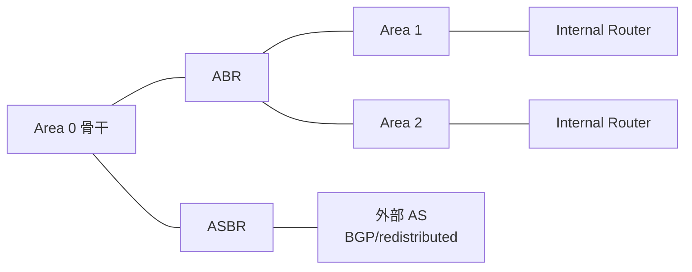
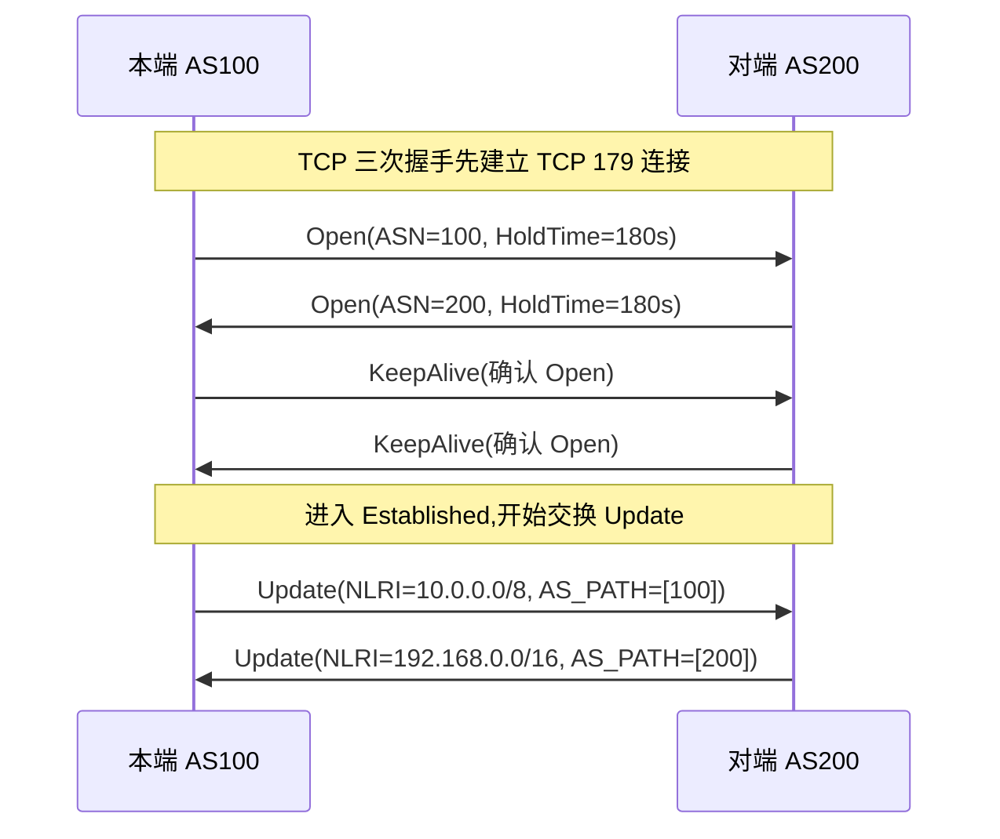
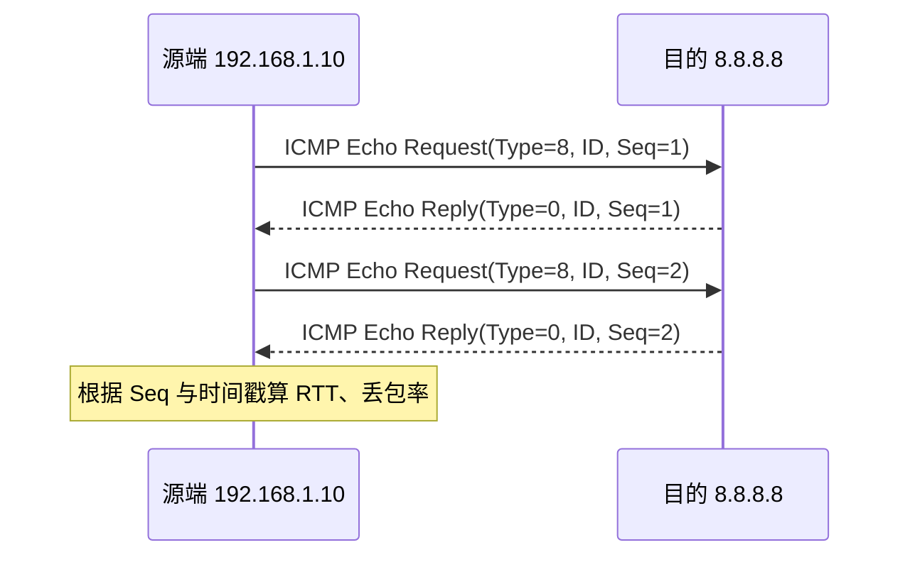
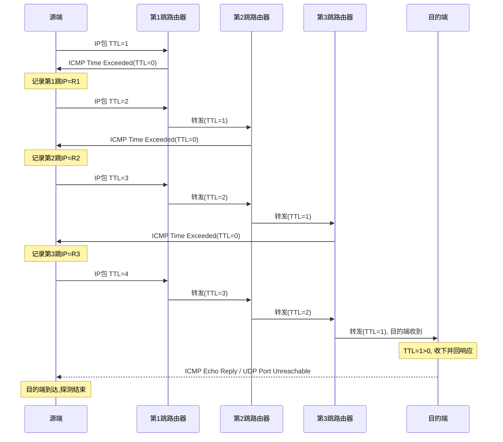
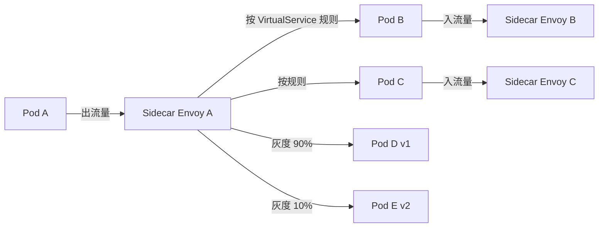

# 路由与 ICMP

> **一句话定位**：OSPF/BGP 是网络工程师考点，Java 后端面试常考 Traceroute 原理。
> **面试热度**：⭐⭐⭐
> **返回**：[网络知识图谱](../README.md)

---

## 一、概念定义

### 1.1 路由表：网络层的"转发决策表"

路由（routing）是网络层的核心职责——决定一个 IP 包从哪条路径转发到目的地。每台路由器维护一张**路由表**（routing table），每条记录告诉路由器：目的网段、下一跳、从哪个接口发出去。当一个 IP 包到达路由器，路由器用目的 IP 在路由表中做**最长前缀匹配**（Longest Prefix Match），选中最具体的一条作为转发依据，找不到匹配项则走默认路由（`0.0.0.0/0`），都没有就丢包并向源端回 ICMP Destination Unreachable（Type 3 Code 0）。

**典型 Linux 路由表**（`ip route` 输出）：

```
default via 192.168.1.1 dev eth0        # 默认路由 0.0.0.0/0，下一跳网关
192.168.1.0/24 dev eth0 proto kernel   # 直连网段，无下一跳
10.0.0.0/8 via 192.168.1.254 dev eth0  # 远端网段，下一跳是另一台路由器
169.254.0.0/16 dev eth0 scope link     # 链路本地
```

**路由表的关键字段**：

| 字段 | 含义 | 示例 |
|------|------|------|
| 目的网段（Destination） | 目标 IP 前缀，用 CIDR 表示 | `192.168.1.0/24` |
| 下一跳（Next Hop） | 转发到的下一台路由器 IP，直连网段为空 | `192.168.1.254` |
| 出接口（Interface） | 从哪块网卡发出 | `eth0` |
| 度量值（Metric） | 优先级/代价，同目的多路径选最小者 | `100` |
| 协议（Protocol） | 该路由来源：kernel/static/OSPF/BGP | `proto OSPF` |

> **关键澄清**：路由表里存的是**网段**（前缀）不是单个主机 IP。一个 192.168.1.0/24 的条目覆盖 254 台主机，路由器不需要为每台主机建条目。这与 NAT 的映射表（per-session）形成对比——路由是按前缀聚合的无状态转发，NAT 是按五元组的有状态翻译，详见 [NAT §1.1](./nat.md#11-nat-的定位与本质)。

### 1.2 静态路由 vs 动态路由

路由按"路由表如何生成"分两类：

| 维度 | 静态路由 | 动态路由 |
|------|---------|---------|
| 生成方式 | 管理员手动配置（`ip route add`） | 路由协议自动学习与收敛 |
| 收敛 | 无收敛，配置即生效 | 拓扑变化后自动重算，需收敛时间 |
| 开销 | 配置与维护人力，规模大不现实 | 协议开销（CPU/带宽/内存） |
| 适用规模 | 小网络（几台路由器）、默认路由、兜底 | 中大型网络（数十至数万节点） |
| 灵活性 | 差，故障不会自动切换 | 强，自动绕过故障链路 |
| 典型场景 | 家庭路由器的默认路由、点对点链路 | 企业骨干、ISP 互联网 |

**静态路由典型用法**：

```bash
# 配默认路由（家庭路由器出口）
ip route add default via 192.168.1.1 dev eth0

# 配远端网段（两地机房点对点）
ip route add 10.10.0.0/16 via 192.168.1.254 dev eth0
```

**动态路由协议分类**：

- **IGP（Interior Gateway Protocol，内部网关协议）**：用于一个**自治系统（AS）内部**，重收敛速度与无环。代表：OSPF（链路状态）、RIP（距离矢量，已淘汰）、IS-IS（链路状态，ISP 骨干常用）。
- **EGP（Exterior Gateway Protocol，外部网关协议）**：用于 **AS 之间**，重策略与稳定性。代表：BGP（路径向量）。

> **AS（Autonomous System，自治系统）**：一个受单一技术管理、对外呈现一致路由策略的网络集合。每个 AS 有一个全球唯一编号（ASN，2 字节 0-65535 或 4 字节），如 AS4134（中国电信）、AS4837（中国联通）。AS 是 BGP 的基本单位。

### 1.3 ICMP：网络层的"信令协议"

ICMP（Internet Control Message Protocol，网际控制报文协议，RFC 792）是 IP 层的辅助协议，用于在 IP 主机/路由器之间传递**控制与差错消息**。它不承载业务数据，而是报告网络层的异常与状态：

| 类型 | Type | Code | 用途 |
|------|------|------|------|
| Echo Reply | 0 | 0 | ping 的回应 |
| Destination Unreachable | 3 | 0-15 | 目的不可达（网络/主机/协议/端口） |
| Source Quench（已废弃） | 4 | 0 | 拥塞抑制（RFC 6633 废弃，改用 ECN） |
| Redirect | 5 | 0-3 | 重定向到更优路由 |
| Echo Request | 8 | 0 | ping 的请求 |
| Time Exceeded | 11 | 0/1 | TTL 耗尽（Traceroute 用）/ 分片重组超时 |
| Parameter Problem | 12 | 0 | IP 首部错误 |

**ICMP 报文封装**：ICMP 直接承载于 IP 之上（Protocol=1），不经过 TCP/UDP。这常被误解为"ICMP 是传输层协议"——实际上它是网络层的信令，与 IP 同层。

> **关键澄清**：①ICMP 不携带业务数据，只携带控制消息，故不保证可靠（无重传）。②ping 与 Traceroute 是 ICMP 的两个典型应用，但 Traceroute 在 Linux 上默认用 UDP 探测（详见 §2.4）。③防火墙常盲目丢弃所有 ICMP，这会破坏 PMTUD（详见 [IP §2.3](./ip.md#23-分片与重组)）与 Traceroute，正确做法是放行 Echo/Time Exceeded/Destination Unreachable，丢弃 Redirect 与 Source Quench。

---

## 二、原理与流程

### 2.1 OSPF：链路状态协议

#### 2.1.1 链路状态（Link State）思想

OSPF（Open Shortest Path First，开放最短路径优先，RFC 2328）是 IGP 的代表，基于**链路状态**算法。每个 OSPF 路由器不交换路由表（像距离矢量那样），而是交换自己与邻居的**链路状态**——"我连了哪些邻居，每条链路的代价是多少"。每台路由器都收集到全网的链路状态，构建出一张**完整的拓扑图**（LSDB，Link State Database），然后各自用相同算法算出最短路径。

| 算法 | OSPF（链路状态） | RIP（距离矢量，对照） |
|------|----------------|---------------------|
| 交换内容 | 链路状态（谁连谁） | 距离矢量（到各目的的跳数） |
| 视野 | 全网拓扑（上帝视角） | 仅邻居的视角 |
| 收敛 | 快（泛洪 LSA + SPF 重算） | 慢（逐跳传递 + 计数到无穷） |
| 防环 | 全网拓扑保证无环 | 依赖水平分割/毒性逆转 |
| 规模 | 支持大规模（区域划分） | 限 15 跳，小网络 |

> **核心区别**：距离矢量（RIP）像"问邻居到哪儿怎么走"，链路状态（OSPF）像"每人都广播自己与邻居的关系，大家拼出完整地图再各自规划"。前者只听邻居一面之词易传谣（环路），后者掌握全貌自能算出正确路径。

#### 2.1.2 SPF 算法（Dijkstra）

OSPF 用 Dijkstra 最短路径算法，从自身节点出发，逐步扩展到全网最短路径树。LSDB 是一棵以自己为根的最短路径树的输入。

**示例拓扑**：

```
       10        5
  R1 ------ R2 ------ R3
  |                     |
  | 30                  | 20
  |                     |
  +------- R4 ----------+
            25
```

**SPF 计算过程**（以 R1 为根）：

| 步骤 | 已确定最短路径 | 候选（临时距离） | 选中 |
|------|---------------|-----------------|------|
| 1 | R1(0) | R2(10), R4(30) | R2(10) |
| 2 | R1, R2(10) | R4(30), R3(10+5=15) | R3(15) |
| 3 | R1, R2, R3(15) | R4(30), R4(15+20=35)→不更新 | R4(30) |
| 4 | R1, R2, R3, R4(30) | 无 | 完成 |

**结果**：R1→R2=10, R1→R3=15（经R2）, R1→R4=30（直连，不经R3因35>30）。

#### 2.1.3 Hello 协议与邻居发现

OSPF 通过 **Hello 协议**（Type 1 报文）发现与维护邻居关系：

1. **发现邻居**：路由器周期性（默认 10 秒）从所有 OSPF 接口组播 Hello（`224.0.0.5`）。新邻居收到后回 Hello，双方进入 **2-Way** 状态。
2. **建立邻接（Adjacency）**：广播网络（如以太网）需选举 **DR（Designated Router）** 与 **BDR（Backup DR）**，其他路由器（DROther）只与 DR/BDR 建立完整邻接，彼此间止于 2-Way。这减少泛洪规模。
3. **同步 LSDB**：邻接建立后双方交换 LSA 摘要，对比缺失，互传完整 LSA，达成 LSDB 同步。
4. **保活**：Hello 持续发送，**Dead Interval**（默认 40 秒，即 4 个 Hello）内未收到邻居 Hello 则判定邻居失效，触发 LSA 重新泛洪与 SPF 重算。

**OSPF 报文类型**：

| 类型 | 名称 | 作用 |
|------|------|------|
| Type 1 | Hello | 发现邻居、选 DR/BDR、保活 |
| Type 2 | Database Description (DBD) | LSDB 摘要交换 |
| Type 3 | Link State Request (LSR) | 请求缺失 LSA |
| Type 4 | Link State Update (LSU) | 传完整 LSA |
| Type 5 | Link State Ack (LSAck) | 可靠传输确认 |

#### 2.1.4 区域划分与 LSA 类型

OSPF 通过**区域（Area）** 划分控制 LSA 泛洪范围，避免全网 SPF 重算的爆炸。每个区域有一个 32 位 ID（如 `0.0.0.0`），**骨干区域 Area 0** 是中心，所有非骨干区域必须连到 Area 0。



**路由器角色**：

| 角色 | 定义 | LSA 生成 |
|------|------|---------|
| Internal Router | 所有接口在同一区域 | Type 1（Router LSA） |
| ABR（Area Border Router） | 接口跨多个区域，连 Area 0 与非骨干 | Type 3（Network Summary LSA） |
| ASBR（AS Boundary Router） | 引入外部路由（如 BGP/静态重分发） | Type 5（AS External LSA） |
| Backbone Router | 接口在 Area 0 | — |

**LSA 类型**：

| 类型 | 名称 | 生成者 | 泛洪范围 |
|------|------|--------|---------|
| Type 1 | Router LSA | 每台路由器 | 本区域 |
| Type 2 | Network LSA | DR | 本区域 |
| Type 3 | Network Summary LSA | ABR | 跨区域（到 Area 0） |
| Type 4 | ASBR Summary LSA | ABR | 告知 ASBR 位置 |
| Type 5 | AS External LSA | ASBR | 全 AS |
| Type 7 | NSSA External LSA | NSSA 区域的 ASBR | 本 NSSA 区域，转 Type 5 进 Area 0 |

**区域类型**：

| 类型 | 接收 LSA | 允许引入外部路由 | 典型用途 |
|------|---------|----------------|---------|
| Normal | Type 1/2/3/4/5 | ✅ | 普通区域 |
| Stub | 不收 Type 5（外部），用 Type 3 默认替代 | ❌ | 末梢区域，减少 LSA |
| Totally Stubby | 只收 Type 1/2 与一条默认 Type 3 | ❌ | 更激进的末梢 |
| NSSA | 不收 Type 5，但允许本区域 ASBR 产 Type 7 | ✅（Type 7） | 需引入部分外部的末梢 |

> **为什么要划分区域**：单区域时全网每台路由器都要存完整 LSDB，LSA 泛洪遍全网，任一拓扑变化都触发全网 SPF 重算，规模上千节点时 CPU 与内存吃不消。区域划分后，区域内的拓扑变化只在本区域泛洪与重算，ABR 用 Type 3 Summary 把"区域内路由"压缩成前缀通告给其他区域——其他区域只见前缀不见拓扑，不需重算 SPF。这是 OSPF 的核心可扩展性设计。

### 2.2 BGP：路径矢量协议

#### 2.2.1 路径矢量（Path Vector）思想

BGP（Border Gateway Protocol，边界网关协议，RFC 4271）是互联网的骨干路由协议，运行在 AS 之间（eBGP）与 AS 内部（iBGP）。BGP 不像 OSPF 交换链路状态，而是交换**到达目的地的路径**——一组 AS 编号的序列（AS_PATH）。每个 AS 在转发路由时把自己的 ASN prepend（追加）到 AS_PATH 头部，下游 AS 看到 AS_PATH 就知道这条路由经过了哪些 AS。

```
AS100 始发 10.0.0.0/8
  → AS200 收到，AS_PATH=[100]，prepend 自己 → [200, 100]
    → AS300 收到，AS_PATH=[200, 100]，prepend → [300, 200, 100]
      → AS400 收到，AS_PATH=[300, 200, 100]
```

**防环原理**：BGP 接收方检查 AS_PATH，若其中含自己的 ASN，则丢弃（否则就是环路）。这比距离矢量的水平分裂更可靠——AS_PATH 是路径的全貌，环路在路径里就能直接看出。

> **关键澄清**：BGP 不叫"距离矢量"也不叫"链路状态"，它是 **路径矢量**——交换的是路径（AS 序列），用路径长度做选路偏好之一，但更依赖属性做策略。BGP 不关心链路带宽与代价，它关心的是**策略**（"我愿意经哪些 AS 转发"）——这是 AS 之间（不同管理域）的天然需求。

#### 2.2.2 为什么 BGP 用 TCP

BGP 运行在 **TCP 179** 端口上，不自己实现可靠性。原因：

| 原因 | 说明 |
|------|------|
| 互联网规模巨大 | 全球数十万 AS，路由表数百万条，需可靠传输保证路由信息一致 |
| TCP 提供可靠有序 | BGP Update 报文大且重要（撤销与通告），丢失会致路由不一致 |
| TCP 提供流控与拥塞控制 | 长会话跨广域网，需 TCP 的滑动窗口适应带宽 |
| 减少协议复杂度 | 复用 TCP 的可靠性，BGP 不需自己实现重传与序号管理 |
| 长会话保活 | BGP 邻居是长期会话（不像 OSPF 的 Hello 那样频繁），TCP KeepAlive 维护会话活性 |

**对比 OSPF 用 IP 直接承载（Protocol 89）**：OSPF 邻居通常同链路同区域，链路较稳定，自实现可靠性（LSAck）开销可接受；BGP 邻居跨广域网，链路不稳，复用 TCP 更经济。详见 Q5。

#### 2.2.3 BGP 报文与会话建立

BGP 有 5 种报文：

| 类型 | 名称 | 作用 |
|------|------|------|
| Type 1 | Open | 建立会话，协商 Hold Time 与 Router ID |
| Type 2 | KeepAlive | 保活，默认 60 秒，无 Update 时发送 |
| Type 3 | Update | 通告可行路由 + 撤销失效路由（NLRI + 路径属性） |
| Type 4 | Notification | 报错并关闭会话（如 Hold Time 超时） |
| Type 5 | Route Refresh | 请求对端重发某前缀的全部路由（策略变更后） |

**会话建立流程**：



**eBGP vs iBGP**：

| 维度 | eBGP（External） | iBGP（Internal） |
|------|------------------|-----------------|
| 场景 | AS 之间 | AS 内部 |
| TTL | 默认 1（直连） | 默认 255（可跨多跳） |
| AS_PATH 处理 | 接收时 prepend 自己 ASN | 不 prepend（同 AS） |
| 路由反射 | 不需要 | 需 RR 或全连接避免环路 |
| 默认行为 | 接收的路由可转给其他 AS | 接收的 iBGP 路由不再转给其他 iBGP（防环） |

> **iBGP 全连接爆炸问题**：iBGP 规定"从 iBGP 学到的路由不再转给其他 iBGP"（防环，因 AS_PATH 不变）。一个 AS 内 N 台 iBGP 路由器需 N(N-1)/2 条会话，规模大不现实。解决方案：**路由反射器（Route Reflector, RR）**——少量 RR 与所有 iBGP 邻居建立会话，RR 把学到的路由反射给其他 iBGP，把网状变星状，N² → N。或用 **BGP 联盟（Confederation）** 把一个大 AS 划成若干子 AS。

#### 2.2.4 BGP 属性与选路

BGP 用 13+ 种**路径属性**做选路决策，按优先级依次比较，第一个能决出胜负的就停止。这是 BGP 的策略能力核心——通过属性灵活控制"走哪条路"。

| 优先级 | 属性 | 说明 | 典型应用 |
|--------|------|------|---------|
| 1 | Weight（Cisco 私有） | 本地权重，越高越优，不传给邻居 | 本机选路偏好 |
| 2 | Local Preference | 本 AS 内偏好，越高越优，传 iBGP 不传 eBGP | AS 出口选择 |
| 3 | AS_PATH 长度 | 越短越优 | 默认主选路标准 |
| 4 | Origin | IGP < EGP < Incomplete | 来源可信度 |
| 5 | MED（Multi-Exit Discriminator） | 越小越优，影响邻居 AS 入口选择 | 多链路入 AS 选路 |
| 6 | eBGP > iBGP | 优先 eBGP 学到的路由 | — |
| 7 | IGP 代价到下一跳 | 越小越优 | 链路代价 |
| 8 | 最短 AS_PATH 不决则走 Older | — | — |
| 9 | Router ID | 最小者胜 | 兜底 |

**常用策略实践**：

- **Local Preference 调出口**：AS 有两条出口到互联网，主链路设 LP=200，备链路设 LP=100，主链路故障时主路由撤销，备链路 LP=100 被选中——这就是**多机房容灾切换**的基础。
- **AS_PATH Prepending 降优先级**：在 AS_PATH 前追加多个自己的 ASN（如 `[100, 100, 100, 200]`），让下游认为这条路径更长更差，用于"备链路降级"。
- **MED 影响入向**：AS 通告路由时带 MED，告诉对端"从这条链路进来代价低"，对端按 MED 选入向路径。
- **Community 标记批量策略**：给路由打 Community 标签（如 `100:80`），下游按标签批量应用策略（限速、降优先级、过滤）。

> **关键澄清**：BGP 是**策略驱动**而非"最短路径"。一条路由 AS_PATH 更短但 Local Preference 更低，BGP 选 LP 高的——策略优先于路径长度。这与 OSPF 的"纯最短路径"形成鲜明对比。互联网骨干的选路是**商业与政治**的反映——你愿意经哪些 AS 转发，比"哪条最短"重要。

### 2.3 ICMP 报文详解

#### 2.3.1 Echo Request/Reply（ping）

ping（Packet Internet Groper）用 ICMP Type 8（Echo Request）/ Type 0（Echo Reply）测试主机连通性与往返延迟。流程：



**Echo 报文结构**：

```
 0                   1                   2                   3
 0 1 2 3 4 5 6 7 8 9 0 1 2 3 4 5 6 7 8 9 0 1 2 3 4 5 6 7 8 9 0 1
+-+-+-+-+-+-+-+-+-+-+-+-+-+-+-+-+-+-+-+-+-+-+-+-+-+-+-+-+-+-+-+-+
| Type (8/0)    | Code (0)      |       Checksum (16)         |
+-+-+-+-+-+-+-+-+-+-+-+-+-+-+-+-+-+-+-+-+-+-+-+-+-+-+-+-+-+-+-+-+
|       Identifier (16)        |       Sequence Number (16)   |
+-+-+-+-+-+-+-+-+-+-+-+-+-+-+-+-+-+-+-+-+-+-+-+-+-+-+-+-+-+-+-+-+
|                    Data (变长, 常为时间戳)                  |
+-+-+-+-+-+-+-+-+-+-+-+-+-+-+-+-+-+-+-+-+-+-+-+-+-+-+-+-+-+-+-+-+
```

**字段作用**：

| 字段 | 作用 |
|------|------|
| Type | 8=Request, 0=Reply |
| Identifier | 区分多个 ping 进程（与 PID 关联） |
| Sequence Number | 递增序号，对端原样回填，用于检测丢包与乱序 |
| Data | 发送方写入，对端原样回填，常用作时间戳载体 |

> **关键澄清**：ping 不是"协议"，是 ICMP Echo 的应用。Linux 的 ping 默认每秒一个 Request，Windows 的 ping 默认 4 个后停止。Echo Reply 必须把 Request 的 ID/Seq/Data 原样回填，源端据此配对请求与响应。

#### 2.3.2 Time Exceeded（Traceroute 的核心）

ICMP Type 11（Time Exceeded）由路由器在 **IP 包 TTL 归 0 时**回送给源端，Code 0 表示 TTL 耗尽，Code 1 表示分片重组超时。Traceroute 正是利用 Type 11 探测路径上每一跳路由器的 IP，详见 §2.4。

**触发条件**：

- 路由器收到 IP 包，TTL 减 1 后为 0，丢弃该包，向源端回 ICMP Time Exceeded Code 0。
- 若 TTL 减 1 后 > 0，转发；若 = 0，丢并回 ICMP。
- 这就是 IP 首部 TTL 字段的"兜底防环"机制，详见 [IP §1.2](./ip.md#12-ipv4-首部格式) 与 Q3。

#### 2.3.3 Destination Unreachable（目的不可达）

ICMP Type 3 在路由器或主机无法把包送达目的时回送，Code 区分原因：

| Code | 含义 | 触发场景 |
|------|------|---------|
| 0 | Network Unreachable | 路由表无匹配条目，无默认路由 |
| 1 | Host Unreachable | 网段可达但主机无响应（ARP 失败） |
| 2 | Protocol Unreachable | 上层协议未实现（如未启用 TCP） |
| 3 | Port Unreachable | UDP/TCP 端口无监听（Traceroute UDP 模式靠这个识别到达） |
| 4 | Fragmentation Needed & DF Set | 需分片但 DF=1，PMTUD 的核心反馈 |
| 5 | Source Route Failed | 源路由失败（已罕用） |

> **易混点**：Code 0 是"网络不可达"（路由器无路由），Code 1 是"主机不可达"（路由器有路由但主机 ARP 无响应），Code 3 是"端口不可达"（主机收到包但无端口监听）。三者层级递进：网络层 → 链路层 → 传输层。PMTUD 依赖 Code 4，但 Code 4 常被防火墙丢，导致 PMTUD 失败，详见 [IP §2.3](./ip.md#23-分片与重组)。

### 2.4 Traceroute 原理：TTL 递增 + ICMP 超时

Traceroute 是 ICMP 的经典应用，通过**逐跳递增 TTL**迫使路径上每台路由器回 ICMP Time Exceeded，从而**逐跳探测**整条路径。

#### 2.4.1 工作流程



**步骤详解**：

1. 源端发一个**目的为目标的探测包**，TTL=1。第一跳路由器 R1 收到后 TTL 减 1 为 0，丢弃该包，回 ICMP Time Exceeded 给源端。源端从 ICMP 报文的源 IP 得到 R1 的地址。
2. 源端再发一个 TTL=2 的包。R1 收到后 TTL 减 1 为 1，转发给 R2。R2 收到后 TTL 减 1 为 0，丢弃并回 ICMP Time Exceeded。源端得到 R2 地址。
3. 依次递增 TTL，每跳触发一台路由器回 ICMP Time Exceeded，直到目的端收到包（TTL 足够大），目的端不再回 Time Exceeded 而是回 Echo Reply 或 Port Unreachable，源端据此判定到达目的，探测结束。

**RTT 计算**：每个 TTL 探测发 3 个包（默认），源端记录每个包的发送与 ICMP 回应时间差，得 3 个 RTT，显示在输出中。

#### 2.4.2 为什么 Linux 用 UDP 而 Windows 用 ICMP

Traceroute 在不同实现里探测包的协议不同：

| 实现 | 探测包 | 目的端响应 | 识别到达的依据 |
|------|--------|-----------|--------------|
| Linux `traceroute` | UDP 高端口（33434+） | ICMP Port Unreachable（Type 3 Code 3） | 收到 ICMP Code 3 即到达 |
| Windows `tracert` | ICMP Echo Request（Type 8） | ICMP Echo Reply（Type 0） | 收到 Echo Reply 即到达 |
| `mtr` | UDP 或 ICMP（可配置） | 同上 | 同上 |

**为什么 Linux 选 UDP 而不直接用 ICMP**：

1. **历史与协议设计**：早期 ICMP Echo 被某些路由器特殊处理（如限速或丢弃），用 UDP 高端口能避免这种偏差，让路径探测更真实反映数据流量的转发行为。
2. **区分探测与业务**：UDP 探测包用递增端口（33434、33435…），易与业务流量区分；而 ICMP Echo 易与 ping 混淆，路由器对 ICMP 的处理策略可能与普通数据包不同。
3. **NAT 与防火墙穿透**：某些防火墙只放行 UDP 不放行 ICMP（或反之），双模式让 Traceroute 在更多环境下能工作。

**为什么有时用 ICMP 更稳**：现代网络对 ICMP 的限速与丢弃更严格（防 ICMP 洪泛），UDP 探测反而更易被中间设备限速。某些场景下 `traceroute -I`（强制 ICMP）反而更准。这也是 `mtr` 默认用 UDP 但支持 `-I` 切换的原因。

> **关键澄清**：①Linux 默认 UDP 是为了模拟真实数据流量的转发行为，Windows 用 ICMP 是因为 Windows 的网络栈对 ICMP 的处理更统一。②Traceroute 的中间跳 IP 来自 ICMP Time Exceeded 的源地址，与探测包用什么协议无关——协议只影响最后一跳的"到达识别"方式。③某些跳显示 `* * *` 是因为该路由器配置了不回 Time Exceeded（或限速），不一定是故障。详见 Q1 与 §4.1。

### 2.5 路由环路与其防护

#### 2.5.1 环路怎么产生

路由环路（routing loop）指数据包在两台或多台路由器之间循环转发，无法到达目的。常见成因：

| 成因 | 说明 |
|------|------|
| 静态配置错误 | A 的下一跳指向 B，B 的下一跳指向 A |
| 距离矢量收敛期 | 拓扑变化时路由信息逐跳传递，瞬间不一致可致环 |
| 重分发配置错误 | 两个协议互相重分发对方路由，致路由回环 |
| 路由汇总错误 | 汇总覆盖了不存在的更具体网段，包发到汇总点后被丢或回环 |

**距离矢量环路经典案例**（RIP 的"计数到无穷"）：

```
正常：A → 目的网N（直连，1跳），B 经 A 到 N（2跳）
故障：A 到 N 的链路断了，A 丢失 N 的路由
A 收到 B 的路由通告"B 到 N 是 2 跳"，A 误以为 B 有路，更新为"A 经 B 到 N 是 3 跳"
B 收到 A 的通告"A 到 N 是 3 跳"，B 更新为"B 经 A 到 N 是 4 跳"
A 再收到 B 通告... → 跳数交替递增，直到 16 跳（RIP 上限）才宣告不可达
```

#### 2.5.2 防环机制

| 协议 | 防环机制 |
|------|---------|
| IP 层 | **TTL**——每跳减 1，归 0 丢弃，环路包在 255 跳内必消亡（兜底） |
| 距离矢量（RIP） | 水平分裂（不把学到的路由回传给来源）、毒性逆转（传回无穷大）、触发更新、计数到无穷上限 |
| OSPF（链路状态） | 全网拓扑一致性保证无环——LSDB 同步后每台路由器算出的最短路径树天然无环 |
| BGP（路径矢量） | AS_PATH 检查——含自己 ASN 则丢，路径里直接看出环 |

**TTL 是兜底**：即使上述协议层防环失效，TTL 保证环路包不会无限循环——最多 255 跳必丢，网络自愈。这就是为什么 IP 首部要有 TTL 字段，详见 [IP §1.2](./ip.md#12-ipv4-首部格式)。

> **关键澄清**：①TTL 不是"防环"的根本机制，它是"环路发生后的兜底"——防环主要靠协议层（水平分裂/链路状态/AS_PATH）。②TTL 兜底也有副作用：环路包在 TTL 耗尽前持续占用带宽，故协议层防环才是根本。③Traceroute 反过来"利用" TTL 的兜底机制做路径探测，详见 §2.4。

---

## 三、高频追问与面试题

### Q1：Traceroute 怎么工作？为什么用 UDP/ICMP？

**参考答案**：Traceroute 通过**逐跳递增 TTL**迫使路径上每台路由器回 ICMP Time Exceeded，从而逐跳探测整条路径。

工作流程：
1. 源端发目的为目标的探测包，TTL=1。第一跳路由器收到后 TTL 减 1 为 0，丢包并回 ICMP Time Exceeded（Type 11 Code 0）。源端从 ICMP 源 IP 得到第 1 跳地址。
2. 源端发 TTL=2 的包。第 1 跳转发（TTL=1），第 2 跳收到后 TTL=0 丢包回 ICMP Time Exceeded。源端得第 2 跳地址。
3. 依次递增 TTL，每跳触发一台路由器回 Time Exceeded，直到目的端收到包（TTL 足够大），回 Echo Reply 或 Port Unreachable，探测结束。

为什么用 UDP 而非 ICMP（Linux 默认 UDP 高端口 33434+）：
- **模拟真实数据流量**：ICMP 在某些路由器被特殊处理（限速/丢弃），UDP 探测更能反映业务流量的真实转发行为。
- **区分探测与业务**：UDP 用递增端口易与业务区分；ICMP Echo 易与 ping 混淆。
- **协议多样性兜底**：某些防火墙只放行 UDP 或只放行 ICMP，双模式（`traceroute` 默认 UDP，`-I` 切换 ICMP）让探测在更多环境下可用。

Linux UDP 模式识别"到达"靠 ICMP Port Unreachable（目的端口无监听时主机回 Type 3 Code 3）；Windows tracert 用 ICMP Echo，靠 Echo Reply 识别到达。两者中间跳都靠 ICMP Time Exceeded，与探测包协议无关。

**追问**：为什么有的跳显示 `* * *`？

> 该路由器配置了不回 ICMP Time Exceeded（如 `no ip unreachables`），或对 ICMP 限速（如每秒限若干个），或中间设备屏蔽了 ICMP。`*` 不一定代表故障——数据包仍在转发，只是该跳的 ICMP 回应被抑制。可换 `-I`（ICMP）或 `-T`（TCP）模式重试，或用 `mtr` 长时间观察。

### Q2：OSPF 和 BGP 区别？分别用在什么场景？

**参考答案**：

| 维度 | OSPF | BGP |
|------|------|-----|
| 类型 | IGP（AS 内） | EGP（AS 间，也可 AS 内 iBGP） |
| 算法 | 链路状态（Dijkstra SPF） | 路径矢量（AS_PATH） |
| 关注点 | 收敛速度、最短路径 | 策略、稳定性、可控选路 |
| 承载 | IP（Protocol 89） | TCP 179 |
| 邻居 | 同链路同区域，Hello 发现 | TCP 会话，可跨多跳 |
| 规模 | 区域划分支持中等规模 | 全球互联网数十万 AS |
| 选路 | 纯最短路径（代价） | 13+ 属性策略选路 |
| 防环 | 全网拓扑无环 | AS_PATH 含自身则丢 |
| 收敛 | 秒级（LSA 泛洪 + SPF 重算） | 分钟级（策略与稳定性优先） |

**场景**：
- OSPF 用于一个 AS 内部（企业骨干、机房内网），追求快速收敛与最优路径。
- BGP 用于 AS 之间（互联网骨干、多机房互联、与运营商互联），追求策略控制与稳定性——"走哪条路"由商业与政治决定，而非纯最短路径。

**典型组合**：大型企业多机房互联，机房内用 OSPF（IGP 收敛快），机房之间用 BGP（eBGP 跨 AS，策略控制流量走向）。OSPF 负责机房内网可达，BGP 负责机房间路由通告与容灾切换。详见 §5.1。

**追问**：为什么不用 OSPF 直接跑互联网？

- OSPF 链路状态需全网 LSDB 同步，数十万 AS 的规模下 LSDB 与 SPF 计算爆炸；互联网由不同管理域构成，需"策略优先于最优"——OSPF 无策略能力，BGP 的属性体系是策略路由的核心。OSPF 适合"单一管理域、追求最优"，BGP 适合"多管理域、追求可控"。

### Q3：路由环路怎么产生？怎么防？

**参考答案**：路由环路是数据包在路由器间循环转发，无法到达目的。成因：

1. **静态配置错误**：A 下一跳指向 B，B 下一跳指向 A。
2. **距离矢量收敛期**：拓扑变化时路由信息逐跳传递，瞬间不一致可致环（RIP 的"计数到无穷"经典案例）。
3. **重分发配置错误**：两协议互相重分发对方路由，致路由回环。
4. **路由汇总错误**：汇总覆盖了不存在的更具体网段，包发到汇总点后被丢或回环。

防环机制分层：

| 层 | 机制 | 说明 |
|----|------|------|
| IP 层 | TTL | 每跳减 1，归 0 丢弃——环路包在 255 跳内必消亡，是兜底 |
| 距离矢量（RIP） | 水平分裂/毒性逆转/触发更新/跳数上限 | 不把学到的路由回传来源；传回无穷大；变化立即通知；16 跳判不可达 |
| 链路状态（OSPF） | 全网拓扑一致性 | LSDB 同步后每台路由器算出的最短路径树天然无环 |
| 路径矢量（BGP） | AS_PATH 检查 | 含自己 ASN 则丢，路径里直接看出环 |

**追问**：TTL 是防环的根本吗？

> TTL 是**兜底**不是根本。防环主要靠协议层（水平分裂/链路状态/AS_PATH），TTL 保证协议层失效时环路包不致无限循环。TTL 兜底有副作用——环路包在耗尽前持续占带宽，故协议层防环才是正解。Traceroute 反过来"利用" TTL 的兜底做路径探测，详见 §2.4。

### Q4：ping 用什么协议？

**参考答案**：ping 用 **ICMP**（Internet Control Message Protocol），具体是 ICMP Echo Request（Type 8）与 Echo Reply（Type 0）。ping 不是独立协议，是 ICMP 的应用。

工作流程：
1. 源端发 ICMP Echo Request（Type=8, Code=0），携带 Identifier、Sequence Number、Data（常为时间戳）。
2. 目的端收到后回 ICMP Echo Reply（Type=0, Code=0），把 Request 的 ID/Seq/Data 原样回填。
3. 源端按 Seq 配对请求与响应，计算 RTT、丢包率，输出统计。

**为什么不直接用 ICMP 这个名字**：ICMP 是网络层信令协议，ping 只是它的一个应用。除了 ping，ICMP 还承载 Traceroute 的 Time Exceeded、Destination Unreachable、PMTUD 的 Fragmentation Needed 等控制消息。详见 §2.3。

**追问**：ping 不通就一定是不通吗？

> 不一定。①目的端防火墙丢 ICMP Echo（如某些服务器 `iptables -A INPUT -p icmp --icmp-type echo-request -j DROP`）；②中间设备限速 ICMP；③目的端禁 ping 但业务端口（如 80/443）仍可通。排查时应配合 `telnet`/`nc` 测 TCP 端口，`mtr` 看路径各跳，不能只凭 ping 下结论。

### Q5：BGP 为什么用 TCP？

**参考答案**：BGP 运行在 TCP 179 端口，复用 TCP 的可靠性与流控。原因：

1. **互联网规模巨大**：全球数十万 AS，路由表数百万条，BGP Update 报文大且重要（撤销与通告），丢失会致路由不一致，必须可靠传输。
2. **TCP 提供可靠有序交付**：BGP Update 携带 NLRI（可达前缀）与 Withdrawn（撤销前缀），错序或丢失会致路由表漂移，TCP 的序号与重传保证一致性。
3. **TCP 提供流控与拥塞控制**：BGP 邻居跨广域网，链路带宽与时延差异大，TCP 的滑动窗口与拥塞控制自适应。
4. **减少协议复杂度**：复用 TCP 的可靠性，BGP 不需自己实现重传/序号/分片管理，专注路由策略逻辑。
5. **长会话保活**：BGP 邻居是长期会话（不像 OSPF Hello 那样频繁），TCP KeepAlive 与 BGP KeepAlive 配合维护会话活性。

**对比 OSPF 用 IP 直接承载（Protocol 89）**：OSPF 邻居通常同链路同区域，链路较稳定，自实现可靠性（LSAck）开销可接受；BGP 邻居跨广域网，链路不稳，复用 TCP 更经济。

**追问**：BGP 用 TCP 有什么缺点？

> ①BGP 收敛依赖 TCP 拥塞控制，大规模路由抖动时 TCP 慢启动致收敛慢（分钟级）；②TCP 是面向连接的，邻居故障检测依赖 Hold Time（默认 180 秒）超时，比 OSPF 的 Hello/Dead（默认 40 秒）慢；③TCP 头部开销（20 字节）比 OSPF 直接 IP 多。生产环境用 BFD（Bidirectional Forwarding Detection）加速故障检测，把秒级收敛压到毫秒级。

### Q6：为什么 BGP 收敛比 OSPF 慢？

**参考答案**：BGP 收敛通常分钟级，OSPF 秒级，原因：

| 维度 | OSPF | BGP |
|------|------|-----|
| 设计目标 | 快收敛（IGP） | 稳定性优先（EGP） |
| 承载 | IP 直接泛洪 LSA | TCP 拥塞控制限制 |
| 触发 | 拓扑变化立即泛洪 | MRAI（Min Route Advertisement Interval，默认 30 秒）抑制抖动 |
| 故障检测 | Hello/Dead（默认 40 秒） | Hold Time（默认 180 秒） |
| 规模 | 单 AS 数百节点 | 全球数十万 AS |

**根本原因**：BGP 是策略驱动，"稳定优先于快速"——MRAI 抑制路由抖动避免全网震荡，Hold Time 较长避免误判。这是设计取舍：互联网骨干不能因一次抖动全网重算，宁可慢点也要稳。OSPF 是单一管理域，追求快速收敛，抖动可接受。

**加速手段**：BFD（毫秒级故障检测）、调小 MRAI 与 Hold Time、Graceful Restart（GR）减少会话重建、Add-Path 传多路径加速收敛。

**追问**：BFD 是什么？为什么能加速 BGP 收敛？

> BFD（Bidirectional Forwarding Detection）是轻量级双向保活协议，毫秒级周期发包检测邻居可达性，故障通知上层协议（BGP/OSPF）。BGP 本身的 Hold Time 检测是秒级（默认 180 秒），加 BFD 后故障检测压到毫秒级，BGP 立即触发重算。生产环境的关键链路（机房互联、运营商出口）几乎都配 BFD。

---

## 四、实战与 Java 生态关联

### 4.1 Linux 排查工具：traceroute / mtr / ip route

#### 4.1.1 traceroute

`traceroute` 逐跳探测路径，Linux 默认 UDP 高端口，可切换 ICMP/TCP：

```bash
# 默认 UDP 探测
traceroute 8.8.8.8

# 强制 ICMP（绕过 UDP 被限速的场景）
traceroute -I 8.8.8.8

# 强制 TCP 80（绕过 ICMP 被防火墙丢的场景）
traceroute -T -p 80 8.8.8.8

# 指定源接口（多网卡场景）
traceroute -s 192.168.1.10 8.8.8.8

# 控制最大跳数与每跳探测次数
traceroute -m 30 -q 3 8.8.8.8
```

**输出解读**：

```
traceroute to 8.8.8.8 (8.8.8.8), 30 hops max, 60 byte packets
 1  192.168.1.1 (192.168.1.1)   1.234 ms  1.156 ms  1.089 ms
 2  10.0.0.1 (10.0.0.1)         5.678 ms  5.432 ms  5.321 ms
 3  * * *
 4  8.8.8.8 (8.8.8.8)          12.345 ms 12.456 ms 12.567 ms
```

- 每行 3 个 RTT 对应 3 个探测包；`*` 表示该跳未回 Time Exceeded（被限速或不回）。
- 第 3 跳 `*` 不一定是故障，可能该路由器对 ICMP 限速；数据包仍在转发。
- 最后到达目的端，Linux UDP 模式收到 ICMP Port Unreachable 探测结束。

#### 4.1.2 mtr（My Traceroute）

`mtr` 是 traceroute + ping 的持续版，实时显示每跳的丢包率、延迟、抖动，是排查网络抖动的首选：

```bash
# 实时模式（默认 UDP）
mtr 8.8.8.8

# 用 ICMP
mtr -i 1 8.8.8.8        # -i 指定间隔（秒）

# 用 TCP 80
mtr -T -P 80 8.8.8.8

# 报告模式（输出一次后退出，适合脚本）
mtr --report 8.8.8.8
mtr --report-cycles 10 8.8.8.8   # 探测 10 轮
```

**输出列**：

| 列 | 含义 |
|----|------|
| Host | 每跳 IP/主机名 |
| Loss% | 丢包率（注意中间跳高丢包可能是 ICMP 限速，非真实丢包） |
| Snt | 发送包数 |
| Last/Avg/Best/Wrst | RTT 统计 |
| StDev | 抖动（标准差） |

> **排查技巧**：①若目的端丢包但中间跳不丢，是目的端或最后一跳的问题；②若某中间跳丢包且其后所有跳都丢，是该跳链路问题；③中间跳高丢包但后续正常，多是该跳 ICMP 限速，非真实故障。这与 traceroute 的 `*` 解读一致。

#### 4.1.3 ip route

`ip route` 查看与管理路由表，是排查路由问题的核心：

```bash
# 查看路由表
ip route

# 查看到某 IP 的路由决策（含出口网卡、下一跳、来源）
ip route get 8.8.8.8

# 添加静态路由
sudo ip route add 10.10.0.0/16 via 192.168.1.254 dev eth0

# 添加默认路由
sudo ip route add default via 192.168.1.1

# 删除路由
sudo ip route del 10.10.0.0/16

# 查看路由策略（多路由表场景，如 K8s CNI）
ip rule
ip route show table main
ip route show table 100
```

**输出解读**：

```
default via 192.168.1.1 dev eth0 proto dhcp metric 100
192.168.1.0/24 dev eth0 proto kernel scope link src 192.168.1.10
10.0.0.0/8 via 192.168.1.254 dev eth0 proto static metric 10
```

- `proto`：路由来源（kernel=直连自动、dhcp=DHCP 学到、static=手动、ospf/bgp=协议学到）。
- `scope link`：直连网段，无需下一跳；`via` 表示需经下一跳。
- `metric`：优先级，越小越优，同目的多路径选最小者。

**排查"路由不通"**：

1. `ip route get <目的IP>` 看实际选了哪条路由、从哪个网卡发、下一跳是谁。
2. 若 `default` 走了错误的网卡，检查 metric 或路由策略（`ip rule`）。
3. 若路由正确但 ping 不通，用 `mtr` 看是哪一跳丢的。

### 4.2 Java 无法直接控制路由表

Java 标准库（`java.net`/`java.nio`）不提供读写系统路由表的能力——路由表是操作系统内核态资源，Java 作为用户态进程无直接 API 操作。这限制了 Java 后端在网络层排查与控制上的能力。

**Java 能做的**：

| 能力 | API | 说明 |
|------|-----|------|
| 查看本机网卡与 IP | `NetworkInterface.getNetworkInterfaces()` | 列出所有网卡、MAC、IP（含 IPv4/IPv6） |
| 查看 DNS 解析 | `InetAddress.getAllByName("host")` | 返回域名对应的所有 IP |
| 测试连通性 | `InetAddress.isReachable(timeout)` | 用 ICMP Echo（需 root）或 TCP Echo 测连通 |
| 指定源 IP 发请求 | `Socket.bind(new InetSocketAddress(srcIP, 0))` | 多网卡场景选源 IP |

**Java 做不到的**：

| 能力 | 原因 |
|------|------|
| 读路由表 | 无 API，需调 `Runtime.exec("ip route")` 解析输出 |
| 写路由表（增删路由） | 无 API，需 root 权限调 `ip route add/del` |
| 逐跳 Traceroute | 无 API，需自己构造 IP 包设 TTL（需 raw socket，Java 不支持） |
| 发 ICMP Echo | `InetAddress.isReachable` 在非 root 下回退到 TCP Echo 端口 7，非真 ICMP |

**实战变通**：

```java
// 读路由表（调系统命令）
Process p = Runtime.getRuntime().exec("ip route");
try (BufferedReader r = new BufferedReader(
        new InputStreamReader(p.getInputStream()))) {
    r.lines().filter(l -> l.contains("default"))
     .forEach(System.out::println);  // 只看默认路由
}

// 多网卡场景指定源 IP
try (Socket s = new Socket()) {
    s.bind(new InetSocketAddress("192.168.1.10", 0));
    s.connect(new InetSocketAddress("8.8.8.8", 53));
    // 从指定网卡发出
}

// 测连通性（非 root 下走 TCP 而非 ICMP）
boolean ok = InetAddress.getByName("8.8.8.8").isReachable(3000);
```

> **关键澄清**：`InetAddress.isReachable` 在 Linux 非 root 下**不走 ICMP** 而是尝试 TCP Echo（端口 7），结果与 `ping` 不一致。这是因为发 ICMP Echo 需 raw socket，普通用户无权限。要真 ICMP，需 JNI 调 native 或 root 运行。排查网络问题不要只依赖 Java API，应配合系统工具（`ip route`/`mtr`/`tcpdump`）。

### 4.3 Service Mesh 的路由控制

云原生场景下，路由控制从内核路由表下沉到应用层，由 **Service Mesh** 承担。Istio/Linkerd 等 Service Mesh 用 Sidecar 拦截 Pod 的出入流量，在应用层实现细粒度路由控制，不依赖内核路由表。

**Service Mesh 路由模型**：



**Istio VirtualService 示例（按权重灰度）**：

```yaml
apiVersion: networking.istio.io/v1beta1
kind: VirtualService
metadata:
  name: my-service
spec:
  hosts:
  - my-service
  http:
  - route:
    - destination:
        host: my-service
        subset: v1
      weight: 90           # 90% 流量到 v1
    - destination:
        host: my-service
        subset: v2
      weight: 10           # 10% 流量到 v2（灰度）
```

**与内核路由表对比**：

| 维度 | 内核路由表（IP 层） | Service Mesh（应用层） |
|------|---------------------|----------------------|
| 粒度 | 网段前缀 | Pod/Service/HTTP 路径/Header |
| 决策 | 目的 IP 前缀 | L7 元数据（URL/Header/Cookie） |
| 协议 | IP | HTTP/gRPC/TCP |
| 实现 | 内核 netfilter/路由表 | Envoy Sidecar iptables REDIRECT |
| 策略 | 静态/OSPF/BGP | VirtualService/DestinationRule |
| 灰度 | 难（需 DNS 或 LB） | 原生支持（按权重/Header） |
| 故障切换 | 路由收敛 | 健康检查 + 自动摘除 |

> **关键澄清**：Service Mesh 的"路由"是 L7 层（HTTP/gRPC）的流量调度，与 IP 层路由表是不同抽象——内核路由表管"包发到哪个网卡/下一跳"，Service Mesh 管"HTTP 请求转发到哪个 Pod/版本"。两者层级不同：Service Mesh 的 Sidecar 仍依赖内核路由表把包发出去，但在应用层做更细粒度的调度。K8s 的 kube-proxy（iptables/IPVS）介于两者之间——它改内核路由规则做 Service→Pod 的负载均衡，是 L4 层。详见 [云原生网络（规划中）](../05-system-design/cloud-native.md)。

### 4.4 ICMP 排查工具

```bash
# ping 测连通性与 RTT
ping -c 4 8.8.8.8              # 发 4 个包后停
ping -i 0.2 8.8.8.8            # 每 0.2 秒一个（需 root 才能快于 0.2）
ping -s 1400 8.8.8.8           # 指定包大小（测 MTU/PMTUD）

# traceroute / mtr 见 §4.1

# 抓 ICMP 包确认是否发出/收到
sudo tcpdump -i eth0 -n icmp
sudo tcpdump -i eth0 -n 'icmp[icmptype] = icmp-echorequest'  # 只抓 Echo Request

# 查 ICMP 统计（收发计数、错误）
cat /proc/net/snmp | grep -A1 '^Icmp:'
nstat -az | grep Icmp          # 现代版
```

**排查 ICMP 被防火墙丢**：

```bash
# 看本机是否丢 ICMP
sudo iptables -L -n -v | grep icmp

# 看是否禁 ping
sysctl net.ipv4.icmp_echo_ignore_all       # 1 表示禁 ping
sudo sysctl -w net.ipv4.icmp_echo_ignore_all=0  # 临时开启

# 中间设备丢 ICMP——用 mtr 看哪跳开始丢
mtr 8.8.8.8
```

> **PMTUD 排查**：若"小包通大包卡"，很可能是 PMTUD 失败——中间路由器丢大包并回 ICMP Fragmentation Needed，但 ICMP 被某防火墙挡住，发送方收不到反馈无法降 MSS。排查：`ping -s 1400 -M do 8.8.8.8`（DF=1 发大包，看是否通）；`tcpdump` 看是否收到 ICMP Type 3 Code 4；确保路径上所有防火墙放行 ICMP Type 3 Code 4。详见 [IP §2.3](./ip.md#23-分片与重组)。

---

## 五、系统设计案例

### 5.1 多机房互联路由设计：BGP + OSPF

**需求**：某互联网公司有 3 个机房（北京、上海、深圳），每机房 2000 台服务器，需设计机房内与机房间的路由方案，要求：
- 机房内路由快速收敛（秒级）
- 机房间互联支持多链路容灾（主备 + 负载分担）
- 与两家运营商互联（电信 AS4134、联通 AS4837），支持运营商级容灾切换
- 单链路/单机房故障时业务自动切换，秒级收敛

#### 5.1.1 架构总览

```mermaid
flowchart TB
    subgraph 北京机房 AS65001
        BJ_CORE[核心交换机<br/>OSPF Area 0]
        BJ_EOR[汇聚交换机<br/>OSPF Area 0]
        BJ_TOR[TOR 交换机<br/>OSPF Area 0]
        BJ_BORDER[边界路由器<br/>BGP + OSPF]
        BJ_EOR --- BJ_TOR
        BJ_CORE --- BJ_EOR
        BJ_BORDER --- BJ_CORE
    end
    subgraph 上海机房 AS65002
        SH_CORE[核心交换机]
        SH_BORDER[边界路由器]
        SH_CORE --- SH_BORDER
    end
    subgraph 深圳机房 AS65003
        SZ_CORE[核心交换机]
        SZ_BORDER[边界路由器]
        SZ_CORE --- SZ_BORDER
    end

    BJ_BORDER <-->|eBGP 主链路| CT[电信 AS4134]
    BJ_BORDER <-->|eBGP 备链路| CU[联通 AS4837]
    SH_BORDER <-->|eBGP| CT
    SH_BORDER <-->|eBGP| CU
    SZ_BORDER <-->|eBGP| CT
    SZ_BORDER <-->|eBGP| CU

    BJ_BORDER <-.>|iBGP 隧道| SH_BORDER
    BJ_BORDER <-.>|iBGP 隧道| SZ_BORDER
    SH_BORDER <-.>|iBGP 隧道| SZ_BORDER
```

#### 5.1.2 AS 与协议分工

**AS 划分**：每个机房一个 ASN，便于 BGP 策略控制：
- 北京机房 AS65001
- 上海机房 AS65002
- 深圳机房 AS65003
- 与运营商互联：电信 AS4134（eBGP）、联通 AS4837（eBGP）

**协议分工**：

| 协议 | 范围 | 职责 |
|------|------|------|
| OSPF Area 0 | 单机房内 | 核心到 TOR 的内部路由，秒级收敛 |
| eBGP | 机房 ↔ 运营商 | 公网路由通告与学习，策略选路 |
| iBGP | 机房 ↔ 机房（跨机房隧道） | 机房间私网路由通告，多链路容灾 |

**为什么不直接用 OSPF 跨机房**：机房间链路是广域网（租用专线/VPN），OSPF 在广域网链路上 Hello/Dead 较慢且 LSA 泛洪对带宽敏感；BGP 更适合跨广域网，策略可控且稳定。机房内用 OSPF 追求快速收敛，机房间用 BGP 追求策略与稳定。

#### 5.1.3 容灾切换设计

**场景 1：单运营商链路故障（主→备切换）**

北京机房同时连电信与联通，电信是主、联通是备。通过 BGP 属性控制主备：

```
北京 → 电信（主）：Local Preference = 200
北京 → 联通（备）：Local Preference = 100
```

电信链路故障时，BGP 会话 down，主路由撤销，联通链路 LP=100 被选中——**自动切换**，无需人工干预。配合 BFD，故障检测从 180 秒压到毫秒级，切换在秒内完成。

**或用 AS_PATH Prepending 降备链路优先级**（影响对端选路）：

```
北京 → 电信（主）：AS_PATH = [65001, 4134]
北京 → 联通（备）：AS_PATH = [65001, 65001, 65001, 4837]  # prepend 3 次，让联通侧认为更长更差
```

**场景 2：单机房故障（机房级容灾）**

北京机房整体故障，需把流量切到上海/深圳。通过 BGP 通告控制：

- 三个机房都向运营商通告同一公网网段（如 `203.0.113.0/24`，Anycast 风格）。
- 正常时北京 LP 最高，流量走北京；上海、深圳 LP 较低作备。
- 北京故障时其 BGP 会话全 down，路由撤销，上海/深圳自动接管。
- DNS 层也可配合：用健康检查摘除故障机房的 GSLB 记录，但 BGP 层的 Anycast 切换比 DNS TTL 更快。

**场景 3：机房间互联链路故障**

机房间用 iBGP over 隧道（如 GRE/IPSec）互联，多隧道冗余：

```
北京-上海：主隧道（专线）+ 备隧道（VPN over 互联网）
北京-深圳：主隧道 + 备隧道
上海-深圳：主隧道 + 备隧道
```

主隧道故障时 OSPF（隧道上的 IGP）检测链路 down，切到备隧道；或用 BGP over 隧道的多路径（`maximum-paths`）做负载分担，单路径故障自动用其余路径。

#### 5.1.4 关键设计决策

| 决策 | 方案 | 理由 |
|------|------|------|
| 机房内 IGP | OSPF Area 0 单区域 | 2000 节点规模单区域可承受，收敛快；超 5000 节点再划多区域 |
| 机房间协议 | iBGP over GRE/IPSec | 跨广域网，BGP 稳；隧道加密保证私网路由不泄露公网 |
| 运营商互联 | eBGP 多链路 + LP/AS_PATH | 策略控制主备，BFD 加速故障检测 |
| 公网网段 | Anycast 多机房同通告 | 单机房故障自动切换，比 DNS 切换快 |
| 故障检测 | BFD 毫秒级 | BGP Hold Time 默认 180 秒太慢，BFD 压到 50ms |
| 收敛目标 | 秒级 | 业务层 SLA 要求故障切换 < 30 秒 |

#### 5.1.5 监控与运维

| 监控项 | 工具 | 告警阈值 |
|--------|------|---------|
| BGP 会话状态 | Prometheus + bgp_exporter | 任一会话 down 立即告警 |
| 路由表大小 | snmpwalk BGP peer table | 路由数异常波动（抖动）告警 |
| 链路延迟/丢包 | mtr 持续探测 | 丢包 > 1% 或延迟抖动 > 50ms 告警 |
| 容灾切换演练 | 定期 chaos engineering | 季度演练单链路/单机房切换 |

**容灾演练**：定期模拟单链路故障（`shutdown` 运营商端口）、单机房故障（`shutdown` 全机房 BGP 会话），验证切换时间与业务影响，确保故障时自动切换符合 SLA。

> **面试加分点**：①强调 OSPF（机房内快收敛）与 BGP（机房间策略）的分工，不是非此即彼；②用 LP/AS_PATH 控制 BGP 主备，配 BFD 加速检测；③Anycast 通告实现机房级容灾，比 DNS 切换快；④多隧道冗余保证机房间互联高可用；⑤容灾要演练，不能等真故障才发现切换不生效。

---

## 六、参考与延伸

- RFC 792（ICMP）、RFC 1812（IPv4 路由器要求）、RFC 2328（OSPFv2）、RFC 4271（BGP-4）、RFC 4360（BGP Communities）、RFC 8326（Graceful Restart）
- RFC 1393（Traceroute 用 ICMP）、RFC 2925（ping/traceroute MIB）、RFC 7880（SESSM, ping 与 traceroute 监测）
- RFC 5340（OSPFv3 for IPv6）、RFC 6850（OSPFv3 AF）、RFC 7474（OSPFv2 认证扩展）
- RFC 7938（BGP 用于数据中心，RFC 7938 使用 BGP 做 DC 路由替代 OSPF）、RFC 5549（BGP 通告 IPv4 over IPv6 next-hop）
- Linux 文档：`ip-route(8)`、`traceroute(8)`、`mtr(8)`、`tcpdump(8)` man 手册；`Documentation/networking/ip-sysctl.txt`
- 延伸阅读：[IP](./ip.md)（TTL 与首部、PMTUD 与 ICMP Code 4）、[NAT](./nat.md)（NAT 与路由器对比、连接追踪）、[TCP 连接](../02-transport/tcp-connection.md)（BGP 用 TCP 179）、[TCP 可靠性](../02-transport/tcp-reliability.md)（BGP 复用 TCP 的可靠性）、[云原生网络（规划中）](../05-system-design/cloud-native.md)（Service Mesh 路由控制）
- 仓库内关联：`java-core/rmi`（基于 IP+端口的服务发现）、`framework/spring-framework`（REST 与 InetAddress）、[DNS](../01-application/dns.md)（域名→IP 解析与 GSLB）

> **返回**：[网络知识图谱](../README.md)
