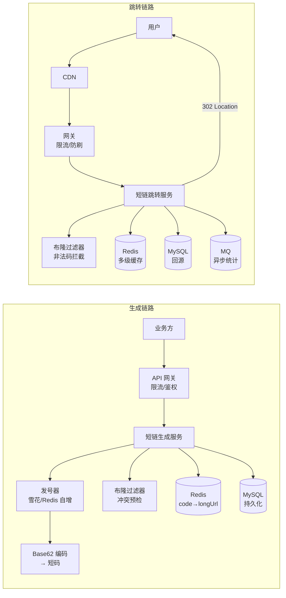
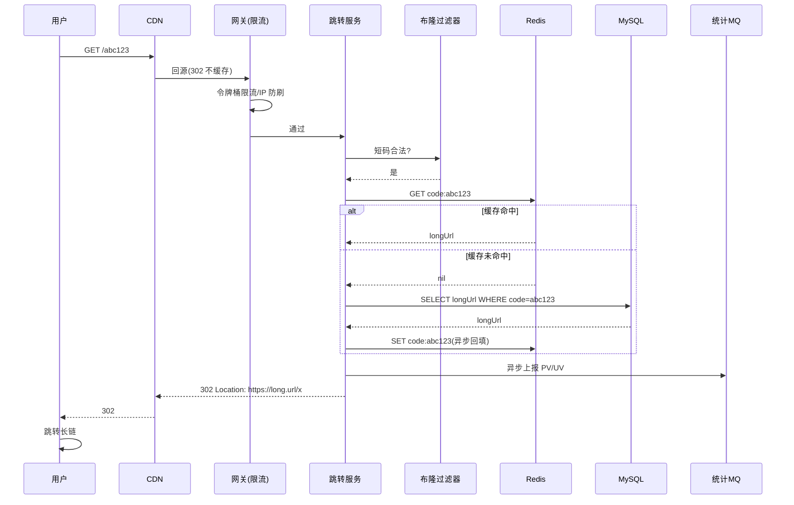
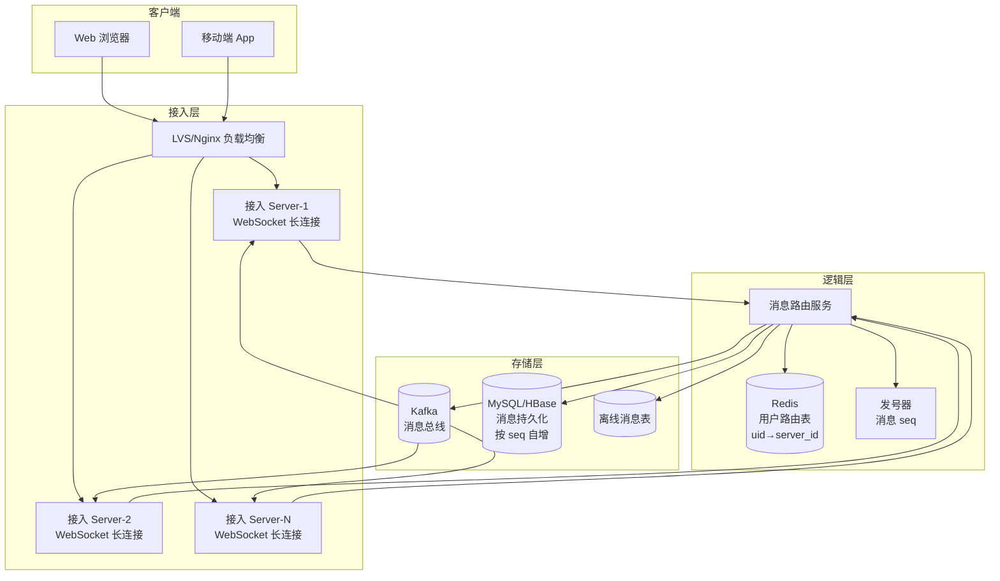
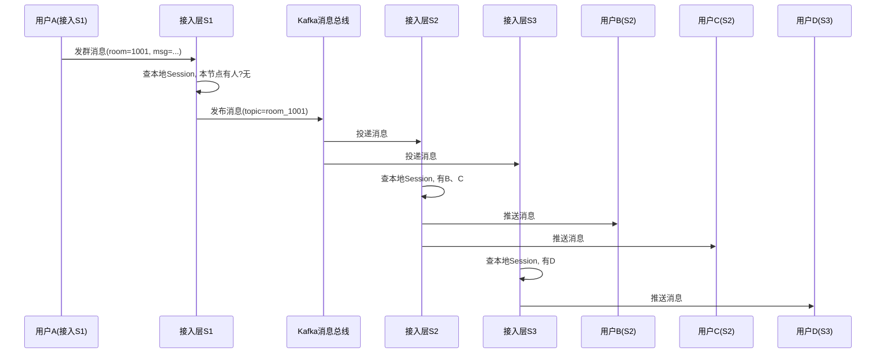
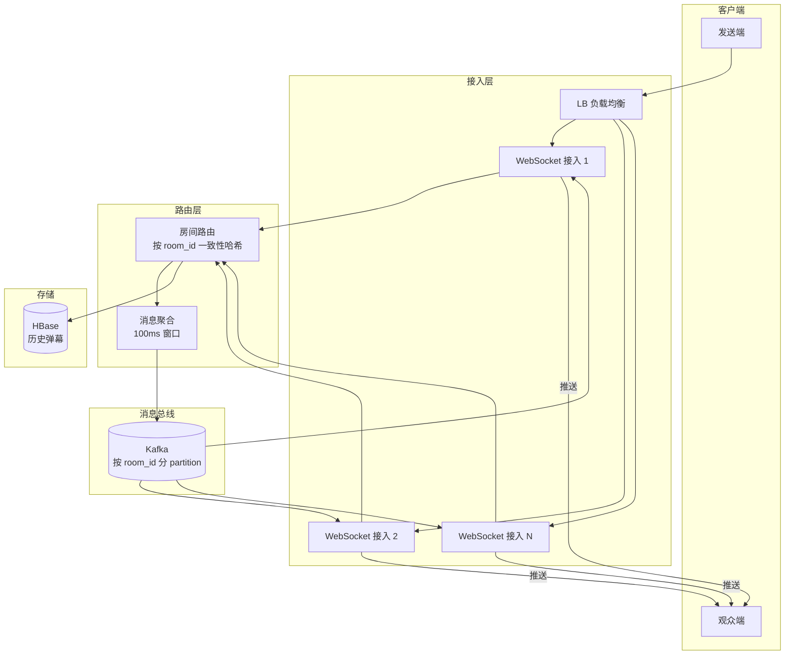
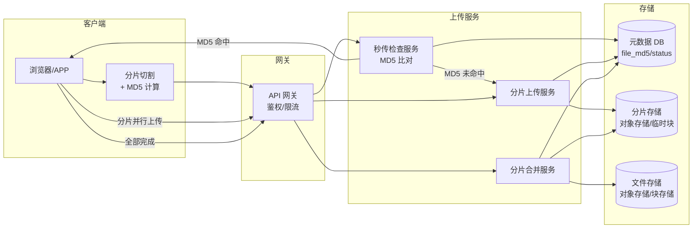
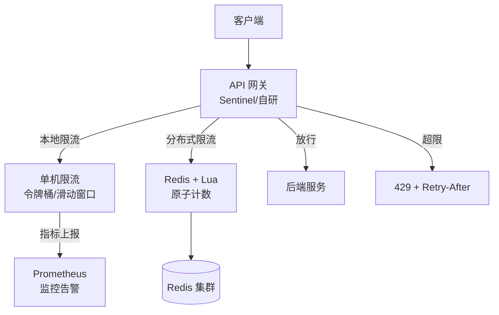
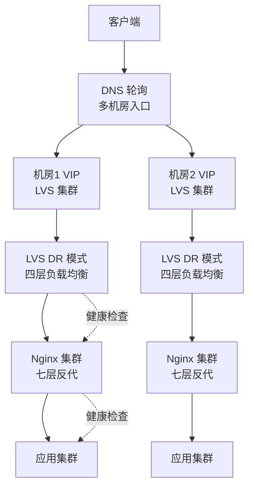

# 经典网络架构案例

> **一句话定位**：系统设计题是高级后端面试的核心环节，本篇覆盖 6 个网络相关的经典案例。
> **面试热度**：⭐⭐⭐⭐⭐
> **返回**：[网络知识图谱](../README.md)

---

## 引言

前四层文档（应用层/传输层/网络层/链路层）解答的是"协议怎么工作"，本篇则回答"如何用这些协议搭出一个能扛流量的系统"。系统设计题在高级后端面试中几乎是必考环节，其考察的不是某一条协议的细节，而是**候选人对协议选型、容量估算、容灾降级、热点应对的综合判断力**。

本篇选取 6 个与网络协议强相关的经典案例，覆盖高并发读、实时推送、文件传输、流量治理、流量分发五大场景。每个案例统一遵循五段式结构：

```
需求分析 → 整体架构（Mermaid 图）→ 协议选型 → 容量/带宽估算 → 热点追问
```

| 案例 | 核心考点 | 关联协议/文档 |
|------|---------|--------------|
| 案例 1 短链系统 | 发号器、Base62、KV 存储、缓存穿透、防刷 | HTTP 301/302、[HTTP](../01-application/http.md)、[TCP 连接](../02-transport/tcp-connection.md) §5.1 |
| 案例 2 IM 消息推送 | 长连接选型、可靠投递、消息漫游、群消息扇出 | WebSocket、TCP、[应用层协议](../01-application/application-protocols.md) §5.1 |
| 案例 3 弹幕系统 | 房间隔离、消息聚合、削峰、UDP vs WebSocket | WebSocket/UDP、[UDP/QUIC](../02-transport/udp-quic.md) |
| 案例 4 大文件分片上传 | 分片大小、秒传去重、断点续传、防篡改 | HTTP multipart、[HTTP](../01-application/http.md) |
| 案例 5 接口限流 | 令牌桶/漏桶/滑动窗口、Redis+Lua、分布式限流 | 应用层网关、[HTTP](../01-application/http.md) §429 |
| 案例 6 负载均衡 | 四层 vs 七层、LVS DR/NAT/TUN、一致性哈希 | LVS、Nginx、[TCP 连接](../02-transport/tcp-connection.md) |

> 阅读建议：先看需求分析与整体架构建立全局观，再按协议选型与容量估算理解工程取舍，最后用热点追问自检。

---

## 案例 1：短链系统

### 1.1 需求分析

**业务场景**：营销活动、短信推广、二维码、分享链接中常出现 `https://s.cn/abc123` 这样的短链，点击后跳转到长达几 KB 的原始 URL。短链系统的核心职责是把"长 URL"压缩为"短码"并提供跳转服务。

**功能需求**：

1. **长链转短链**：输入一个长 URL，生成一个 6-8 位的短码，拼接域名后形成可访问的短链。
2. **短链跳转**：访问短链，服务端返回目标长链，客户端自动跳转。
3. **访问统计**：记录 PV/UV、来源、设备，用于运营分析。
4. **过期与失效**：支持短链设置有效期，到期后跳转失效页或 404。
5. **防刷限流**：防止恶意刷量、爬虫批量请求。

**非功能需求**：

- **高可用**：跳转是营销入口，宕机直接影响转化，要求 99.99% 可用。
- **低延迟**：跳转响应 < 50ms（P99），用户体验敏感。
- **高并发读**：跳转 QPS 远高于生成 QPS，读多写少。
- **短码唯一**：不允许两条短码指向不同的长链（冲突不可接受）。
- **短码不可猜测**：避免被遍历爬取（如 `1, 2, 3` 这种递增会被刷）。

**规模假设**：日活 1 亿次跳转、峰值 QPS 10 万、短链总量 10 亿条。

### 1.2 整体架构



**生成链路**：业务方调用生成接口 → 发号器取唯一 ID → Base62 编码为短码 → 布隆过滤器检查冲突（理论上不冲突，兜底）→ 写 Redis 缓存 + MySQL 持久化。

**跳转链路**：用户访问短链 → CDN（302 不缓存，回源）→ 网关限流 → 布隆过滤器拦截非法码（防穿透）→ Redis 多级缓存查 longUrl → 命中则 302 跳转，未命中回源 MySQL → 异步 MQ 上报统计。

**一次跳转时序**：



### 1.3 协议选型

#### 跳转码选择：301 vs 302

| 状态码 | 语义 | 浏览器缓存 | 适用场景 |
|--------|------|-----------|---------|
| **301 Moved Permanently** | 永久重定向 | 默认缓存，下次直接走浏览器缓存不再回源 | 永久固定的短链，不需要统计 |
| **302 Found** | 临时重定向 | 不缓存，每次都回源 | 需要统计点击、动态切目标、风控 |

**决策：采用 302**。

- 理由：①需要统计点击回流服务器；②支持临时切活动/风控页/失效页；③CDN 不缓存，失效立即生效。
- 代价：服务压力大 → 用多级缓存 + 布隆过滤器化解。

> 短链若用 301 + CDN 边缘缓存，可极大降低服务压力，但代价是统计丢失、失效延迟（CDN 缓存未过期仍跳转旧目标）。营销场景需统计与风控，故选 302。详见 [HTTP](../01-application/http.md) §5.1。

#### 短码生成：发号器 vs 哈希

| 方案 | 原理 | 优点 | 缺点 |
|------|------|------|------|
| **发号器 + Base62** | 雪花/Redis 自增取唯一 ID，再 Base62 编码 | 短码短（6-7 位）、无冲突、可逆 | 短码可预测（递增），需加随机扰动 |
| **哈希（MD5/Murmur）** | 长 URL 哈希后取前 6-7 位 | 同长链同短码（天然幂等） | 可能冲突，需冲突检测；短码不可预测性弱 |
| **随机数** | 随机生成 6 位字符串 | 不可预测 | 冲突率高，需反复重试 |

**决策：发号器 + Base62 为主，哈希兜底同长链去重**。

- 发号器用**雪花算法**（Snowflake）生成 64 位 ID，取低 41 位（约 2 万亿）做 Base62 编码，得到 6-7 位短码。
- Redis 自增（`INCR short:seq`）作为备选发号器，简单但单点；可分片（`INCR short:seq:{shard}`）提升吞吐。
- 同一长链多次提交 → 用 `长链 hash → code` 的 Redis 去重表保证幂等。

#### Base62 编码

```
字符集：0-9 a-z A-Z，共 62 个字符
6 位可表示：62^6 ≈ 568 亿
7 位可表示：62^7 ≈ 3.5 万亿
```

- 10 亿短链 → 6 位 Base62 足够（568 亿 >> 10 亿）。
- 防猜测：发号器 ID 上叠加一位随机位，或对 ID 做位移混淆，避免 `1,2,3` 递增被遍历。

### 1.4 容量/带宽估算

**假设规模**：

- 短链总量：10 亿条
- 日活跳转：1 亿次
- 峰值 QPS：10 万（日活 1 亿 / 86400 × 峰谷比 5-10）

**存储容量**：

| 存储项 | 单条大小 | 10 亿条总量 | 选型 |
|--------|---------|------------|------|
| code→longUrl 映射 | 200B（code 7B + longUrl 150B + 元数据 40B） | 200 GB | Redis 缓存热数据 + MySQL 持久化 |
| 访问统计（PV/UV） | 50B/条 | 每日 5 GB | Kafka → 离线数仓 |
| 布隆过滤器 | 10 亿条 × 10bit ≈ 1.2 GB | 1.2 GB | 单机内存 |

**带宽估算**：

- 跳转响应体（302 + Location 头）约 300B；
- 峰值 10 万 QPS × 300B = 30 MB/s ≈ 240 Mbps，千兆网卡可承载，建议双网卡冗余。

**缓存层设计**：

- Redis 集群：3 主 3 从，单节点 10w QPS，3 节点扛 30w QPS，覆盖峰值。
- 本地缓存（Caffeine）：热短链（Top 1%）缓存 1 分钟，拦截 60% 流量，降低 Redis 压力。
- 布隆过滤器：10 亿条目，误判率 0.1%，内存约 1.2 GB，单机常驻。

**写入估算**：

- 生成 QPS 远低于跳转，假设日生成 100 万短链 → 平均 12 QPS，峰值 100 QPS，MySQL 单库轻松。

### 1.5 热点追问

**Q1：发号器怎么选？雪花算法和 Redis 自增各有什么优缺点？**

- **雪花算法**：生成 64 位 ID（时间戳 41 位 + 机器 ID 10 位 + 序列号 12 位），不依赖外部存储，无单点；缺点是依赖时钟，时钟回拨会冲突，需用逻辑时钟或等待。适合大规模分布式部署。
- **Redis 自增**：`INCR` 原子自增，简单可靠；缺点是单点（需主从/集群），且自增值连续可预测。可通过分片（`INCR short:seq:{shardId}`）提升吞吐，但需保证分片不重。
- **Leaf（美团）**：双 buffer 方案，号段模式（从 DB 批量取号到内存），兼顾性能与可靠性，工业界常用。

**Q2：短码冲突怎么办？**

- 发号器方案理论上不冲突（ID 全局唯一，Base62 编码可逆）。
- 哈希方案需冲突检测：生成后查布隆过滤器/Redis，冲突则换盐值重哈希或增长位数。
- 兜底：写入时用 `code` 做唯一索引，捕获 DuplicateKey 异常后重试。

**Q3：怎么防刷？**

- 网关层令牌桶限流（单 IP/单 code 维度），超限返回 429 + `Retry-After`。
- 异常频次（如单 IP 每秒 > 100 次）触发风控：跳验证码页或 403。
- 布隆过滤器拦截非法码，避免恶意遍历短码打穿缓存。
- 短码加随机扰动，避免递增可预测。

**Q4：缓存穿透/击穿/雪崩怎么处理？**

- **穿透**：非法码用布隆过滤器拦截；不存在的 code 缓存空值（`code → nil`，TTL 60s）。
- **击穿**：热 key 过期时用互斥锁（Redis SETNX）单线程回源，或热点永不过期 + 异步刷新。
- **雪崩**：缓存 TTL 加随机抖动（如 5min ± 60s），避免同时失效；多级缓存兜底。

**Q5：为什么不用 301 + CDN 边缘缓存？**

- 301 会被浏览器/CDN 长期缓存，导致统计丢失、失效延迟、无法动态切目标。
- 营销短链需要 PV/UV 统计、风控、活动切换，必须每次回源，故选 302。
- 若是纯永久固定短链（如官方文档链接），可用 301 + CDN。

---

## 案例 2：IM 消息推送系统

### 2.1 需求分析

**业务场景**：类似微信/钉钉的即时通讯系统，支持单聊、群聊、消息漫游、已读回执。

**功能需求**：

1. **单聊**：用户之间一对一发送消息，实时触达。
2. **群聊**：群消息广播，成员可能数千。
3. **消息漫游**：换设备登录也能看到历史消息。
4. **已读回执**：发送方知道对方已读。
5. **离线消息**：离线期间的消息，上线后补发。

**非功能需求**：

- **实时性**：消息延迟 < 500ms。
- **可靠性**：消息不丢、不重、按序。
- **高并发**：百万级同时在线。
- **省电/弱网友好**：移动端长连接稳定、心跳省电。

**规模假设**：同时在线 100 万、每用户每分钟 3 条消息、群聊平均 100 人。

### 2.2 整体架构



**三层架构**：

1. **接入层**：维护 WebSocket 长连接，无状态，只负责收发消息帧。LB 按最少连接数分发。
2. **逻辑层**：消息路由，查用户路由表（`uid → server_id`），决定消息投到哪个接入节点。
3. **存储层**：Kafka 消息总线做跨节点扇出，MySQL/HBase 持久化消息（按 `seq` 自增）。

**群消息扇出流程**：



### 2.3 协议选型

#### 长连接选型：WebSocket vs MQTT vs 私有 TCP 协议

| 协议 | 优点 | 缺点 | 适用场景 |
|------|------|------|---------|
| **WebSocket** | 标准、浏览器原生支持、穿透 80/443 | 帧头略重（2-14B）、文本协议默认（需二进制帧） | Web 端必选；移动端可用 |
| **MQTT** | 极轻量（最小 2B）、QoS 0/1/2、遗嘱消息 | 浏览器无原生支持，移动端需集成 SDK | IoT、移动端推送 |
| **私有 TCP 协议** | 极致压缩（自定义头 1-4B）、完全定制 | 自研成本高、协议演进难 | 超大规模 IM（亿级在线） |

**决策：Web 端用 WebSocket（必选），移动端也用 WebSocket（wss + 二进制帧 + Protobuf 业务消息），统一协议栈降低运维成本。亿级在线再考虑私有 TCP 协议。**

详见 [应用层协议](../01-application/application-protocols.md) §5.1。

#### 消息可靠投递：ACK + 重发 + 序号

**三层保障**：

1. **客户端→服务端**：客户端发消息后等 ACK，超时（如 5s）重发，服务端按 `seq` 去重。
2. **服务端→客户端**：服务端推送消息后等客户端 ACK，未收到 ACK 则重发（限定次数，如 3 次）。
3. **跨服务节点**：接入层与逻辑层之间用 Kafka，Kafka 自身有 ACK 机制（`acks=all`）保证不丢。

**消息序号**：每条消息分配全局唯一递增 `seq`（发号器生成），客户端按 `seq` 去重与排序，断线重连后按本地最大 `seq` 拉增量。

### 2.4 容量/带宽估算

**规模**：同时在线 100 万、每用户每分钟 3 条消息、群聊平均 100 人。

| 维度 | 计算 | 结果 |
|------|------|------|
| 消息 QPS | 100w × 3 / 60 | 5 万 msg/s |
| 群消息扇出 | 5w × 100（平均群成员） | 500w 推送/s |
| 接入层节点数 | 单台 10w 连接 + 1w msg/s | 10 台（100w 在线） |
| Kafka 集群 | 单 broker 10w msg/s | 6 broker 冗余 |
| 逻辑层节点数 | 单台 5k msg/s 路由 | 20 台 |
| Redis 路由表 | 100w key × 50B | 50 MB，单节点足够 |

**带宽**：

- 单条消息平均 200B（Protobuf 编码）；
- 推送 500w/s × 200B = 1 GB/s ≈ 8 Gbps，需万兆网络或按房间分片。

**存储**：

- 消息持久化：5w msg/s × 86400 = 43 亿条/日，单条 200B → 860 GB/日，按月分表 + HBase 冷热分离。

### 2.5 热点追问

**Q1：怎么保证消息不丢？**

- 端到端 ACK：客户端发送等 ACK，服务端推送等 ACK，超时重发。
- 服务端持久化在 ACK 客户端之前：先落库/落 Kafka，再推送，推送失败也不丢。
- 离线消息表兜底：推送失败的消息落离线表，用户上线后按 `seq` 拉增量补发。

**Q2：消息顺序怎么保证？**

- 单会话内消息按 `seq` 单调递增（发号器保证）。
- Kafka 按 `room_id`/`uid` 分 partition，partition 内有序。
- 客户端按 `seq` 排序与去重，乱序到达时缓冲等待。

**Q3：离线消息怎么处理？**

- 用户下线期间，消息写入离线消息表（按 `uid` + `seq`）。
- 用户上线后发 `{"type":"sync","last_seq":12345}`，服务端查 `seq > 12345` 的消息按序推送。
- 离线消息保留 7 天，超时清理。

**Q4：群消息扇出怎么优化？**

- **读扩散 vs 写扩散**：小群写扩散（给每个成员写收件箱），大群读扩散（消息只写一份到群时间线，成员主动拉）。
- **按房间分 partition**：Kafka 按 `room_id` 分区，相同房间消息落同一 partition，接入层按 `room_id` 哈希分组订阅，减少全量广播。
- **消息聚合**：高频消息按 100ms 窗口聚合后批量推送，减少推送次数。

**Q5：怎么保证消息不重？**

- 每条消息有唯一 `msg_id`（发号器生成），服务端按 `msg_id` 去重。
- 客户端按 `seq` 去重，重复 `seq` 的消息丢弃。

---

## 案例 3：弹幕系统

### 3.1 需求分析

**业务场景**：直播/视频弹幕，用户发送的文字消息实时飘过画面，所有房间内用户可见。

**功能需求**：

1. **实时广播**：用户发弹幕，房间内所有在线用户实时收到。
2. **房间隔离**：不同房间的弹幕互不干扰。
3. **历史弹幕回放**：点播视频可回看历史弹幕。
4. **弹幕排序**：按时间顺序展示。

**非功能需求**：

- **低延迟**：弹幕延迟 < 1s。
- **高并发峰值**：热门直播房间峰值可达 10 万 msg/s。
- **房间隔离**：单房间故障不影响其他房间。

**规模假设**：10 万房间、每房间平均 1 万人在线、热门房间峰值 10 万 msg/s。

### 3.2 整体架构



**核心流程**：

1. 发送端通过 WebSocket 发弹幕到接入层。
2. 接入层按 `room_id` 路由到对应 partition（一致性哈希绑定节点）。
3. 消息聚合器按 100ms 窗口聚合批量发送到 Kafka，减少消息数。
4. Kafka 按 `room_id` 分 partition，接入层订阅后推送给本节点的房间内在线用户。
5. 历史弹幕异步落 HBase，供回放查询。

### 3.3 协议选型

#### WebSocket vs UDP

| 协议 | 优点 | 缺点 | 适用场景 |
|------|------|------|---------|
| **WebSocket** | 基于 TCP 可靠、浏览器原生、穿透 80/443 | 帧头开销、TCP 队头阻塞 | 直播 Web 端、对可靠性要求高 |
| **UDP** | 极低延迟、无队头阻塞、可组播 | 不可靠、需自实现可靠层、浏览器不原生支持 | 超低延迟直播、可容忍丢包 |

**决策**：

- **Web 端必选 WebSocket**（浏览器原生支持）。
- **移动端可选 WebSocket**（统一协议栈）。
- **超低延迟场景（如赛事直播）可选 UDP**，但需自实现序号+ACK 的可靠层，成本高。
- 弹幕对少量丢包容忍（丢几条弹幕无感），但 Web 端无 UDP 选项，故 WebSocket 为主。

#### 房间路由：一致性哈希

- 接入层按 `room_id` 一致性哈希分组，每个节点只负责一部分房间的消息路由。
- 房间迁移（节点扩缩容）时，一致性哈希最小化迁移范围。
- 热门房间（如 10 万人）需特殊处理：单 partition 扛不住时，拆分子房间广播。

### 3.4 容量/带宽估算

**规模**：10 万房间、每房间平均 1 万人、热门房间峰值 10 万 msg/s。

| 维度 | 计算 | 结果 |
|------|------|------|
| 总在线连接 | 10w 房间 × 1w 人 | 10 亿连接（极端，需分集群） |
| 弹幕消息 QPS | 假设 1% 用户活跃发弹幕 | 100w msg/s |
| 单房间峰值 | 热门房间 | 10w msg/s |
| 推送扇出 | 100w msg × 1w 人/房间 | 100 亿推送/s（需聚合） |
| 接入层节点 | 单台 50w 连接 | 200 台（10 亿连接） |

**带宽**：

- 单条弹幕平均 100B；
- 100w msg/s × 1w 扇出 × 100B = 100 GB/s ≈ 800 Gbps，必须靠消息聚合 + 分级降频。

**削峰策略**：

- **消息聚合**：接入层按 100ms 窗口聚合，10 条弹幕合并为 1 条批量消息推送，扇出降 10 倍。
- **客户端限流**：发送端限频（如 3 条/秒/人）。
- **降级**：超大规模房间（>10 万人）只推送 Top N 弹幕或抽样推送。

### 3.5 热点追问

**Q1：弹幕怎么排序？**

- 每条弹幕带时间戳，客户端按时间戳排序展示。
- 服务端按 `room_id` 分 partition，partition 内 Kafka 保序，单房间内弹幕有序。
- 跨 partition 场景用逻辑时钟（Lamport 时间戳）或 NTP 同步。

**Q2：历史弹幕回放怎么实现？**

- 弹幕异步落 HBase（按 `room_id` + `timestamp` 索引）。
- 回放时按视频时间轴拉取对应时间段弹幕，按时间戳排序后随视频播放进度推送。

**Q3：怎么削峰？**

- 发送端限频（如 3 条/秒/人），超频丢弃或提示"发送过快"。
- 接入层消息聚合（100ms 窗口批量推送）。
- 大房间降级：超 10 万人只推 Top N 或抽样。

**Q4：房间隔离怎么实现？**

- 按 `room_id` 一致性哈希绑定接入层节点，单房间故障不影响其他房间。
- Kafka 按 `room_id` 分 partition，房间消息隔离。
- 单房间流量超限触发熔断，不影响其他房间。

**Q5：弹幕丢失有影响吗？**

- 弹幕是"弱可靠"场景，丢几条无感知，故可用 UDP 或降级。
- 但 Web 端只能 WebSocket（基于 TCP），天然可靠。
- 极端峰值下主动丢弃非关键弹幕（如过滤无意义弹幕）。

---

## 案例 4：大文件分片上传/断点续传

### 4.1 需求分析

**业务场景**：网盘、视频上传、大文件传输，文件从几百 MB 到几 GB，需支持断点续传和秒传。

**功能需求**：

1. **分片上传**：大文件切分为多个小分片并行上传。
2. **断点续传**：上传中断后可从断点继续，不重传已完成分片。
3. **秒传**：相同内容文件（MD5 一致）直接命中已存文件，无需上传。
4. **分片合并**：所有分片上传完成后合并为完整文件。
5. **防篡改**：保证上传内容不被中间篡改。

**非功能需求**：

- **大文件**：单文件最大 5 GB。
- **高并发**：多用户同时上传，带宽与存储并发。
- **网络友好**：弱网下分片失败可重试，不影响其他分片。

### 4.2 整体架构



**流程**：

1. 客户端计算文件 MD5，调用秒传检查接口。
2. 服务端比对 MD5，命中则秒传成功（返回已存文件引用）。
3. 未命中则客户端分片切割，并行上传分片。
4. 每个分片上传成功后记录状态，失败可重试单个分片。
5. 所有分片上传完成，客户端通知合并，服务端合并分片并落最终存储。

### 4.3 协议选型

#### 上传协议：HTTP multipart vs 分片 PUT

| 方案 | 原理 | 优点 | 缺点 |
|------|------|------|------|
| **HTTP multipart** | 单次 POST，`multipart/form-data` 上传整个文件 | 简单，浏览器原生支持 | 无法断点续传，单次失败全重传 |
| **分片 PUT** | 文件切片，每个分片单独 PUT | 天然断点续传，并行上传，失败重试单分片 | 需客户端切片 + 合并接口 |

**决策：分片 PUT**。

- 客户端切片（如 10MB/片），并行 PUT 上传。
- 每个分片独立请求，失败重试不影响其他分片。
- 合并接口在所有分片完成后触发。

#### 秒传：MD5 去重

- 客户端计算文件 MD5（大文件可用分片 MD5 拼接或秒传指纹）。
- 服务端按 MD5 查元数据 DB，命中则直接引用已存文件，秒传成功。
- 未命中则正常分片上传，上传完成后写入 `{md5 → fileId}` 映射。

#### 防篡改

- 客户端计算每个分片的 MD5，随分片上传，服务端校验分片 MD5。
- 合并后计算整体 MD5，与客户端上报的全文件 MD5 比对，不一致则拒绝。
- 可用 HMAC 签名上传请求，防止伪造。

### 4.4 容量/带宽估算

**假设**：5 GB 文件、10 MB 分片、并发 3 个分片。

| 维度 | 计算 | 结果 |
|------|------|------|
| 分片数 | 5 GB / 10 MB | 500 片 |
| 单分片大小 | 10 MB | 弱网友好，失败重试代价低 |
| 并发数 | 3 | 避免占满带宽 |
| 上传时间 | 5 GB / (10 Mbps 带宽) | ~70 分钟（断点续传保障） |
| 分片存储 | 临时块，TTL 1 天 | 自动清理未合并分片 |
| 元数据 | 每 file 1KB（md5 + 分片状态） | MySQL 单表扛千万级 |

**分片大小选择**：

- **太小（<1MB）**：HTTP 请求开销占比高，请求数多，服务端压力大。
- **太大（>50MB）**：单分片失败重传代价高，弱网不友好。
- **经验值：5-20MB**，10MB 是常见选择。

**并发数控制**：

- 客户端并发 3-5 个分片，避免占满用户带宽。
- 服务端按用户限流（如单用户 5 并发分片），避免单用户打满存储 IO。

### 4.5 热点追问

**Q1：分片大小怎么定？**

- 权衡 HTTP 请求开销与重传代价，经验值 5-20MB，10MB 常用。
- 弱网场景可降至 2-5MB，强网可提升至 20MB。
- 可按网络质量动态调整（客户端测速后选分片大小）。

**Q2：怎么防篡改？**

- 每个分片带 MD5，服务端校验。
- 整体文件 MD5 在合并后校验，与客户端上报比对。
- 上传请求用 HMAC 签名，防止伪造分片。

**Q3：秒传怎么实现？**

- 客户端计算文件 MD5，调用秒传检查接口。
- 服务端按 MD5 查元数据 DB，命中则返回已存文件引用，标记上传成功。
- 大文件可用"分片 MD5 拼接"或"文件指纹（前 1MB MD5 + 文件大小）"加速秒传判断。

**Q4：断点续传怎么实现？**

- 客户端记录已上传分片编号（或服务端查询分片状态接口）。
- 重启上传时查询已上传分片，只上传缺失分片。
- 分片状态存元数据 DB（`{fileId, chunkIndex, status, md5}`），TTL 1 天。

**Q5：分片合并怎么实现？**

- 客户端在所有分片上传完成后调用合并接口。
- 服务端按分片编号顺序读取分片存储，合并写入最终存储。
- 大文件合并可异步处理（MQ 触发合并任务），合并完成后通知客户端。

---

## 案例 5：接口限流

### 5.1 需求分析

**业务场景**：API 网关、微服务入口需对接口调用限流，防止下游被打挂、防恶意刷量、保障服务可用性。

**功能需求**：

1. **单机限流**：单实例内对接口/用户/IP 限流。
2. **分布式限流**：多实例共享限流配额。
3. **多维度限流**：按接口、按用户、按 IP、按租户。
4. **平滑限流**：流量均匀，避免突发穿透。

**非功能需求**：

- **高可用**：限流组件不可宕机（否则全局限流失效）。
- **低延迟**：限流判断 < 5ms，不拖累请求。
- **准确**：限流计数准确，不误杀不漏判。

### 5.2 整体架构



**两层限流**：

1. **网关层单机限流**：兜底，防止单机被打挂（如令牌桶）。
2. **Redis 分布式限流**：全局限流，多实例共享配额（Redis + Lua 原子操作）。

### 5.3 协议选型

#### 限流算法对比

| 算法 | 原理 | 优点 | 缺点 | 适用场景 |
|------|------|------|------|---------|
| **固定窗口** | 按时间窗口（如 1 分钟）计数，超限拒绝 | 简单 | 窗口边界突刺（如 59s 和 1s 各放 N 请求，瞬时 2N） | 粗粒度限流 |
| **滑动窗口** | 窗口滑动细分（如 1 分钟拆 6 个 10s 子窗口） | 平滑，无突刺 | 实现略复杂 | 平滑限流 |
| **令牌桶** | 按固定速率向桶加令牌，请求取令牌，无令牌拒绝 | 允许突发（桶满可瞬时放 N） | 实现需维护令牌数与时间戳 | 大多数 API 限流 |
| **漏桶** | 请求进桶，按固定速率漏出，桶满拒绝 | 输出严格恒定，无突发 | 不允许突发，排队等待 | 整流（如 MQ 消费） |

**决策**：

- **接口限流默认用令牌桶**（允许短时突发，符合 API 调用特征）。
- **严格平滑用漏桶**（如对接下游不可突发的服务）。
- **简单场景用滑动窗口**（如按用户/IP 限频）。

#### 分布式限流：Redis + Lua

- 限流计数存 Redis，多实例共享。
- 用 Lua 脚本保证"判断 + 计数"原子性，避免并发竞态。
- 令牌桶 Lua 脚本示例逻辑：
  ```
  1. 取当前令牌数与上次刷新时间
  2. 按时间差补充令牌（上限为桶容量）
  3. 若令牌 >= 1，扣减 1 令牌，返回放行
  4. 否则返回拒绝
  ```
- Redis 集群模式下，限流 key 需在同一 slot（用 hash tag `{userId}` 保证）。

### 5.4 容量/带宽估算

**假设**：API 网关峰值 10 万 QPS，单机限流 + 分布式限流两层。

| 维度 | 计算 | 结果 |
|------|------|------|
| 单机令牌桶 | 内存计数，纳秒级 | 无瓶颈 |
| Redis 限流 QPS | 10w QPS | Redis 集群 3 主可扛 30w QPS |
| Redis 延迟 | 单次 Lua 脚本 < 1ms | 网关增加 < 2ms |
| 限流 key 数 | 每用户/接口 1 key | 100w key × 50B = 50 MB |

**降级策略**：

- Redis 不可用时降级为单机限流（配额按实例数均分），保证可用性优先。
- 限流判断超时（如 > 10ms）直接放行，避免限流组件拖垮请求。

### 5.5 热点追问

**Q1：令牌桶和漏桶的区别？**

- **令牌桶**：按固定速率生成令牌，请求取令牌。桶满时令牌堆积，允许瞬时突发（最多放桶容量个请求）。
- **漏桶**：请求进桶，按固定速率漏出。桶满拒绝，输出严格恒定，不允许突发。
- 类比：令牌桶是"允许短跑后慢走"，漏桶是"始终匀速走"。

**Q2：分布式限流怎么实现？**

- Redis + Lua 原子脚本，多实例共享计数。
- key 设计：`rate_limit:{interface}:{userId}`，TTL = 窗口大小。
- 集群模式用 hash tag 保证 key 在同一 slot，避免跨节点事务。
- 可用 Redis Cell 模块（原生命令 `CL.THROTTLE`）简化实现。

**Q3：怎么平滑限流？**

- 用滑动窗口替代固定窗口，消除边界突刺。
- 令牌桶设置合理填充速率（如 1000 令牌/秒），桶容量 = 突发上限（如 2000）。
- 漏桶天然平滑，但牺牲突发能力。

**Q4：限流后的响应怎么设计？**

- 返回 `429 Too Many Requests` + `Retry-After: 60` 头，告知客户端重试间隔。
- 响应体可携带当前配额与剩余次数，方便客户端自适应。
- 网关层返回 429，不透传到后端服务。

**Q5：Redis 挂了怎么办？**

- 降级为单机限流：每个实例按 `全局限额 / 实例数` 做本地令牌桶。
- 保证可用性优先，宁可多放行不误杀。
- Redis 恢复后自动切回分布式限流。

---

## 案例 6：负载均衡

### 6.1 需求分析

**业务场景**：高流量入口需负载均衡分发请求到多台后端，需选型四层 vs 七层、算法选择、节点变动应对。

**功能需求**：

1. **流量分发**：将入口流量分发到多台后端。
2. **健康检查**：剔除故障节点。
3. **会话保持**：同一客户端落到同一后端（部分场景）。
4. **动态扩缩容**：节点增减时流量自动重新分配。

**非功能需求**：

- **高吞吐**：LB 不成为瓶颈。
- **低延迟**：LB 转发延迟 < 1ms（四层）/ < 5ms（七层）。
- **高可用**：LB 自身冗余（主备/集群）。

### 6.2 整体架构



**典型分层**：

- **DNS 轮询**：多机房入口分流（地理负载均衡）。
- **LVS（四层）**：基于 IP+端口的转发，吞吐高，转发给 Nginx 集群。
- **Nginx（七层）**：基于 HTTP 协议的反向代理，按 URL/Header 路由，转发给应用集群。

### 6.3 协议选型

#### 四层 vs 七层负载均衡

| 维度 | 四层（LVS） | 七层（Nginx） |
|------|------------|---------------|
| 工作层级 | 传输层（IP+端口） | 应用层（HTTP 协议） |
| 转发依据 | 四元组（IP+端口） | URL/Host/Header/Cookie |
| 性能 | 极高（万兆线速，内核态） | 高（用户态，万级 RPS） |
| 功能 | 简单转发 | 路由/重写/缓存/限流/SSL 卸载 |
| 适用场景 | 前置流量分发、高吞吐 | HTTP 路由、灰度、限流 |

**决策**：

- **高吞吐前置分发用 LVS（四层）**，转发给 Nginx 集群。
- **HTTP 路由/灰度/限流用 Nginx（七层）**，转发给应用。
- 两层叠加：LVS 抗吞吐，Nginx 做协议层治理。

#### LVS 三种模式：DR / NAT / TUN

| 模式 | 原理 | 优点 | 缺点 | 适用场景 |
|------|------|------|------|---------|
| **DR（Direct Routing）** | LB 修改 MAC 地址直接转发给后端，响应绕过 LB | 性能最高（入站不经过 LB TCP 栈） | LB 与后端同机房/同 VLAN | 同机房高并发 |
| **NAT** | LB 做 DNAT+SNAT，响应回 LB 再转客户端 | 部署简单（后端可跨网段） | LB 成瓶颈（出入都经过 LB） | 小规模 |
| **TUN（IP 隧道）** | LB 封装 IP 隧道转发，后端解封直接回客户端 | 支持跨机房 | 需隧道支持，配置复杂 | 跨机房 |

**决策：同机房高并发用 DR 模式**，LB 不占连接资源，详见 [TCP 连接](../02-transport/tcp-connection.md) §5.1。

#### 负载均衡算法对比

| 算法 | 原理 | 优点 | 缺点 | 适用场景 |
|------|------|------|------|---------|
| **轮询** | 依次分发 | 简单公平 | 不考虑后端差异 | 后端配置相同 |
| **加权轮询** | 按权重分发 | 考虑性能差异 | 权重需手动调 | 后端配置不同 |
| **最少连接** | 分给当前连接数最少的 | 自适应负载 | 需维护连接计数 | 长连接场景 |
| **IP Hash** | 按客户端 IP 哈希固定后端 | 会话保持 | 节点变动时大量重映射 | 会话保持 |
| **一致性哈希** | 哈希环，节点变动只影响相邻段 | 节点变动影响小 | 可能不均（需虚拟节点） | 缓存/分布式存储 |

### 6.4 容量/带宽估算

**假设**：入口峰值 100 万 QPS。

| 层级 | 单机吞吐 | 节点数 | 备注 |
|------|---------|--------|------|
| LVS（DR 模式） | 千兆线速 ~100w PPS | 2（主备） | 内核态转发，不占 TCP 栈 |
| Nginx | 单机 5-10w RPS | 10-20 | 用户态，按 CPU 核数扩展 |
| 应用 | 单机 1w QPS | 100 | 业务处理瓶颈 |

**LVS 为什么比 Nginx 快？**

- LVS 工作在内核态（四层），只改 MAC/IP 头，不进入用户态，不解析 HTTP，转发纳秒级。
- Nginx 工作在用户态（七层），需解析 HTTP 协议、执行路由逻辑，吞吐受 CPU 限制。
- LVS DR 模式下响应绕过 LB 直连客户端，LB 不占连接资源。

### 6.5 热点追问

**Q1：四层和七层负载均衡的区别？**

- 四层基于 IP+端口转发（LVS），不解析协议，性能极高。
- 七层基于 HTTP 协议转发（Nginx），可按 URL/Header 路由，功能丰富但性能低。
- 实践中两层叠加：LVS 抗吞吐，Nginx 做协议治理。

**Q2：一致性哈希怎么解决节点变动问题？**

- 传统哈希（如 `hash(key) % N`）在 N 变化时几乎所有 key 重映射。
- 一致性哈希把 key 和节点都映射到哈希环，key 顺时针找到第一个节点。
- 节点增删只影响哈希环上相邻段的 key，最小化迁移。
- 引入虚拟节点（每节点 100-200 个虚拟节点）解决数据倾斜。

**Q3：LVS 为什么比 Nginx 快？**

- LVS 内核态四层转发，只改 MAC/IP 头，不进用户态，不解析 HTTP。
- DR 模式响应绕过 LB，LB 不占连接资源。
- Nginx 用户态七层，需解析 HTTP + 路由逻辑，受 CPU 限制。

**Q4：会话保持怎么实现？**

- **IP Hash**：按客户端 IP 哈希固定后端，简单但节点变动重映射多。
- **Cookie Sticky**：Nginx 在响应中插 Cookie，下次请求带 Cookie 路由到固定后端。
- **Session 集中存储**：Session 存 Redis，任意后端可访问，无需会话保持（推荐）。

**Q5：LVS DR 模式为什么响应绕过 LB？**

- DR 模式只改入站包的目标 MAC，源 IP 仍是客户端真实目标（VIP）。
- 后端直接以 VIP 为源 IP 回客户端，不经过 LB。
- LB 只处理入站流量，不占出站带宽与 TCP 栈，吞吐极高。
- 代价：LB 与后端必须同 VLAN（L2 可达）。

---

## 六、参考与延伸

- 延伸阅读：
  - [HTTP](../01-application/http.md) §5.1 短链服务设计
  - [应用层协议](../01-application/application-protocols.md) §5.1 IM 长连接选型
  - [TCP 连接](../02-transport/tcp-connection.md) §5.1 短链服务 TCP 优化
  - [UDP/QUIC](../02-transport/udp-quic.md) 弹幕低延迟选型
- 仓库内关联：
  - `framework/spring-framework` —— WebSocket、REST 接口、注解驱动配置
  - `framework/jackson` —— HTTP 报文 JSON 序列化
  - `framework/valid` —— API 参数校验与限流配合
  - `java-core/rmi` —— 基于 TCP 长连接的 Java RPC
  - `java-core/annotation`、`java-core/apt` —— 注解 + APT 在限流组件的应用
- 工业界参考：美团 Leaf 发号器、阿里 Sentinel 限流、LVS 官方文档、Nginx 官方文档

> **返回**：[网络知识图谱](../README.md)
