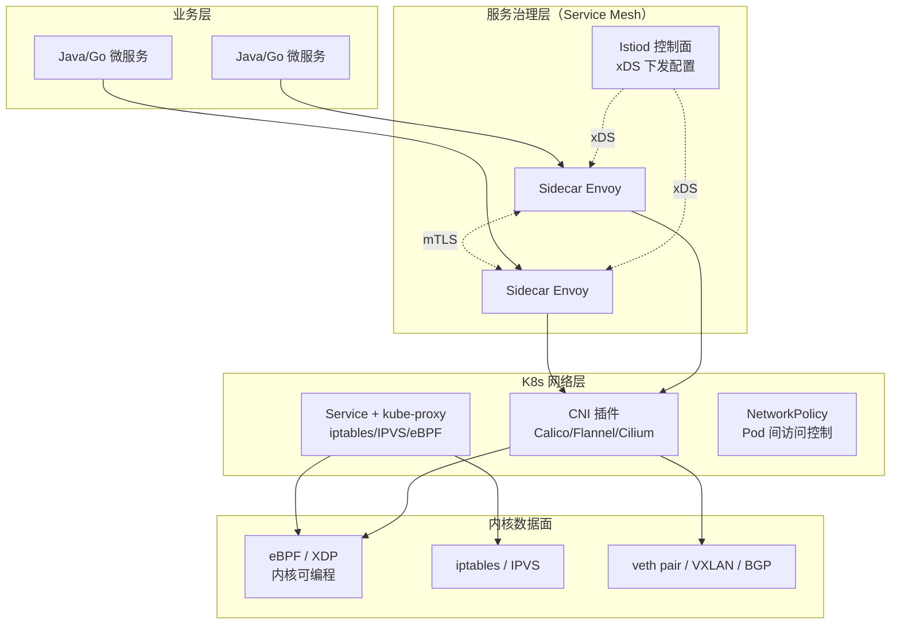
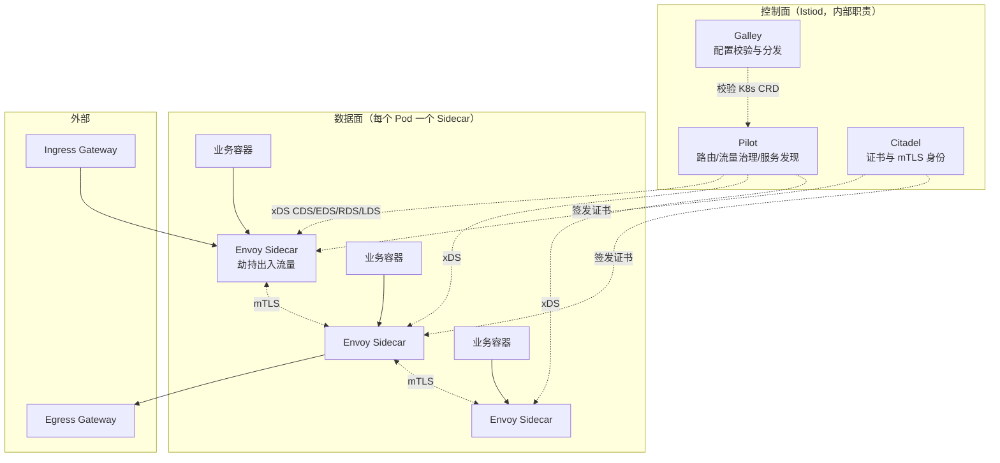
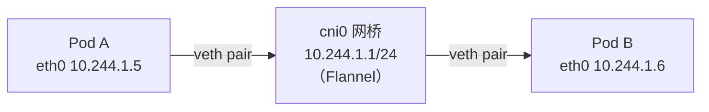
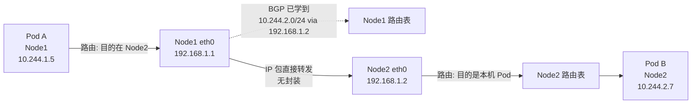
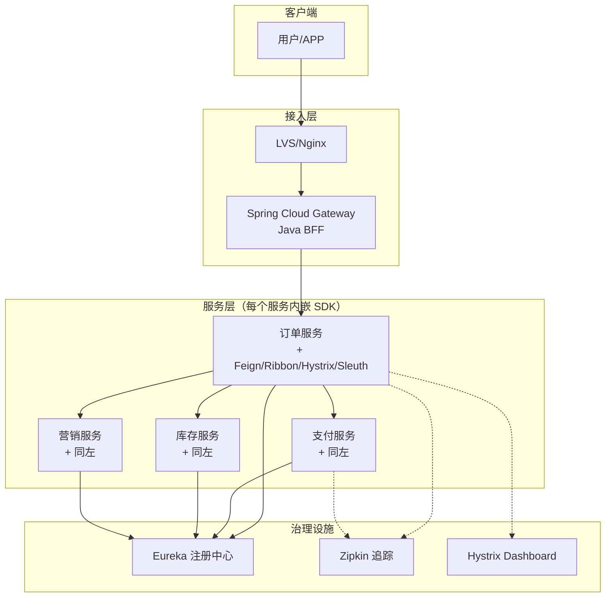
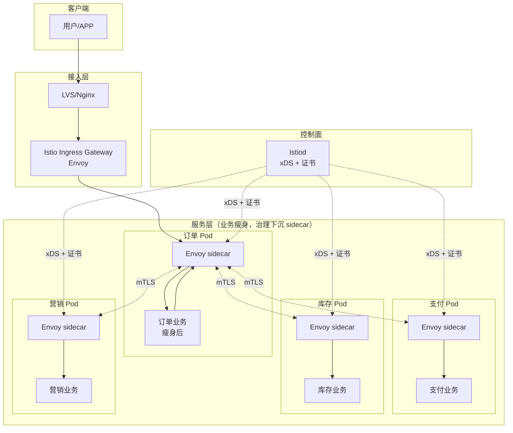

# 云原生网络

> **一句话定位**：Service Mesh/K8s 网络是中高级后端 + 云原生方向的加分项。
> **面试热度**：⭐⭐⭐⭐
> **返回**：[网络知识图谱](../README.md)

---

## 一、概念定义

云原生网络不是某一条协议，而是**容器编排（K8s）+ 服务治理（Service Mesh）+ 内核数据面（eBPF/CNI）** 三者叠加而成的网络体系。它要解决的核心问题是：当应用被拆成几百个微服务、打散到几千个 Pod、混部在多租户集群里之后，**这些 Pod 之间如何寻址、如何通信、如何加密、如何治理、如何观测**。

### 1.1 微服务通信模式：同步 RPC vs 异步 MQ

微服务拆分后，服务间通信（Service-to-Service）成为主要流量来源，按**是否有请求-应答的同步依赖**分为两类：

| 维度 | 同步 RPC（HTTP/gRPC/Dubbo） | 异步 MQ（Kafka/RocketMQ/Pulsar） |
|------|-------------------------------|-----------------------------------|
| 通信模型 | 请求-应答，调用方阻塞等待 | 生产-消费，发送方不等待 |
| 耦合度 | 强耦合（需知道对方地址、接口） | 弱耦合（只认 Topic/Queue） |
| 延迟 | 低（毫秒级，链路短） | 较高（经 Broker 中转） |
| 可靠性 | 需调用方自己重试/熔断 | Broker 持久化 + ACK 重投 |
| 削峰 | 难（后端被打爆） | 天然削峰（消费者按节奏拉） |
| 典型场景 | 读类、需即时返回结果 | 通知、日志、订单异步、跨系统解耦 |
| 失败处理 | 重试/降级/熔断 | 死信队列 + 重试次数 |

**工程决策原则**：

1. **能异步就异步**：通知、审计、日志、跨团队解耦优先用 MQ，避免长链路同步调用放大故障。
2. **强一致/即时返回用 RPC**：如下单扣库存、查询用户信息，必须同步返回结果。
3. **混合最常见**：一个"下单"动作往往 = 同步调用库存服务 + 异步发 MQ 触发风控/积分/通知。

> **与 [TCP 连接](../02-transport/tcp-connection.md) 的关联**：RPC 无论 HTTP 还是 gRPC，底层都是 TCP 长连接 + 多路复用。Dubbo/gRPC 默认复用连接以规避三次握手开销。MQ 则多为 Pull 长轮询（Kafka）或 Push 长连接（RocketMQ），均建立在 TCP 之上。

### 1.2 Service Mesh 定义

**Service Mesh（服务网格）** 是一个**基础设施层**，专门负责服务间通信的流量治理（路由、负载均衡、熔断、重试、加密、可观测性），**与应用业务代码解耦**——通过在每个 Pod 里注入一个 sidecar 代理（Istio 默认用 Envoy）来劫持进出 Pod 的所有流量，业务进程感知不到 sidecar 的存在。

```
传统微服务（SDK 模式）：
  业务代码 ──→ 注册中心 SDK ──→ 熔断 SDK ──→ 追踪 SDK ──→ 网络
  （治理逻辑和业务代码耦合在同一进程，升级需改业务）

Service Mesh 模式：
  业务代码 ──→ sidecar 代理（Envoy） ──→ 网络
                 ↑
            控制面下发配置
  （治理逻辑下沉到 sidecar，业务无感知，升级只动 sidecar）
```

**核心价值**：

- **语言无关**：Java/Go/Python/Node 微服务共享同一套治理能力，不再各自实现 SDK。
- **业务解耦**：熔断/限流/重试/mTLS 不再侵入业务代码，升级治理能力只重启 sidecar。
- **统一可观测性**：所有流量经过 sidecar，自动生成指标、链路追踪、访问日志。
- **流量治理精细化**：灰度、金丝雀、A/B 测试、流量镜像在数据面统一实现。

**代价**：每个 Pod 多一个 sidecar（内存 50-100MB、CPU 开销），链路多一跳（应用→sidecar→网络），延迟增加 1-3ms。详见 Q2。

### 1.3 K8s 网络模型

K8s 对网络有一条**扁平、直连、全 Pod 可达**的硬性要求：

> **K8s 网络模型三原则**：
> 1. 每个 Pod 拥有独立的 IP，Pod 间**直接路由可达**（不经 NAT）。
> 2. 节点上的 Pod 可以访问本节点及其他节点上 Pod 的 IP，**无需 NAT**。
> 3. Pod 看到的自身 IP 与其他 Pod 看到它的 IP **一致**（无 SNAT 伪装）。

这条要求看似简单，落地却很难：跨节点两个 Pod 要直接通，要么二层打通（同 VLAN），要么用 Overlay 隧道（VXLAN），要么用三层路由（BGP）。这就是 **CNI（Container Network Interface）** 规范要解决的问题——见 §2.3。

K8s 网络还涉及三类对象：

| 对象 | 职责 | 类比 |
|------|------|------|
| **Pod** | 最小调度单元，一个或多个共享网络命名空间的容器 | 一个虚拟机 |
| **Service** | 一组 Pod 的稳定访问入口（ClusterIP/VIP） | 负载均衡 VIP |
| **Endpoint / EndpointSlice** | Service 背后 Pod IP 的动态列表 | 服务发现返回的实例列表 |

> **关键澄清**：Pod IP 不稳定（Pod 重启 IP 变），Service 提供**稳定 VIP**，访问 VIP 经 `kube-proxy` 转发到真实 Pod IP。详见 §2.4。

### 1.4 云原生网络全景



---

## 二、原理与流程

### 2.1 微服务通信核心组件

#### 2.1.1 序列化

微服务通信的第一步是把对象转成字节流，序列化方式决定**性能、跨语言、可读性**：

| 协议 | 格式 | 体积 | 跨语言 | 可读 | 典型用途 |
|------|------|------|--------|------|---------|
| JSON | 文本 | 大 | 全语言 | 是 | HTTP REST、调试、前端 |
| Protobuf | 二进制 | 小 | 全（需 IDL） | 否 | gRPC、Istio xDS |
| Thrift | 二进制 | 小 | 全（需 IDL） | 否 | Apache Thrift RPC |
| Hessian | 二进制 | 中 | Java 为主 | 否 | Dubbo 2.x 默认 |
| Avro | 二进制 | 小 | 全 | 否 | Kafka Schema Registry |

**工程决策**：

- 内部高性能 RPC 优先 **Protobuf + gRPC**：体积小（比 JSON 小 30-50%）、强类型、双向流。
- 对外开放 API 用 **JSON**：人类可读、生态成熟、前端友好。
- 跨语言团队避免 Hessian（Java 强绑定）。

> **与 [framework/jackson](../../framework/jackson) 关联**：Jackson 是 Java 生态最常用的 JSON 序列化器，可自定义 `JsonSerializer` 控制字段输出。Dubbo 3.x 默认序列化已切到 Protobuf，与 Triple 协议（gRPC over HTTP/2）对齐。

#### 2.1.2 服务发现

服务发现解决"调用方怎么知道目标服务有哪些实例"的问题，分两种模式：

| 模式 | 代表 | 流程 | 优缺点 |
|------|------|------|--------|
| **客户端发现** | Eureka、Dubbo 注册中心 | 调用方从注册中心拉实例列表，自己负载均衡 | 灵活，但每语言都要实现客户端 |
| **服务端发现** | K8s Service、Istio | 调用方访问一个稳定地址（VIP/Sidecar），由服务端转发 | 客户端无感知，但多一跳 |

K8s 原生服务发现：

1. **DNS**：每个 Service 自动有 `svc.ns.svc.cluster.local` 的 DNS 记录，CoreDNS 解析为 ClusterIP。
2. **环境变量**：Pod 启动时注入同 Namespace 下所有 Service 的 `SERVICE_NAME_SERVICE_HOST/PORT`（已不推荐，顺序依赖）。
3. **API + Endpoints**：直接查 Endpoints API 拿 Pod IP（客户端发现模式）。

> **关键澄清**：K8s Service 是"服务端发现"——Pod 不需要自己拉实例列表，访问 ClusterIP 即可，由 `kube-proxy` 做 DNAT 转发到真实 Pod。Istio 则是更高级的"服务端发现"——Sidecar 代替业务进程做服务发现与负载均衡，业务只连本机 sidecar。

#### 2.1.3 负载均衡

| 层级 | 代表 | 工作方式 |
|------|------|---------|
| 客户端 LB | Ribbon、Dubbo LB | 调用方持有实例列表，按策略选一个 |
| 服务端 LB | K8s Service（kube-proxy） | 访问 VIP，内核 iptables/IPVS 转发 |
| Sidecar LB | Envoy、Istio | Sidecar 持有实例列表，按策略选后端 |

常见策略：轮询、加权轮询、最少连接、一致性哈希、随机、P2C（Power of Two Choices，gRPC 默认）。

> **K8s Service 默认是随机 + 轮询**，无最少连接感知。Istio Envoy 默认 LEAST_REQUEST，更适合长慢请求场景。

#### 2.1.4 熔断限流

| 能力 | SDK 模式（Spring Cloud） | Service Mesh（Istio） |
|------|--------------------------|------------------------|
| 熔断 | Hystrix / Resilience4j 注解 | DestinationRule + OutlierDetection |
| 限流 | Sentinel 流控规则 | Envoy 本地限流 / 全局限流（Redis） |
| 重试 | RestTemplate / Feign 配置 | VirtualService retries |
| 超时 | @HystrixProperty | VirtualService timeout |
| 降级 | fallback 方法 | 故障注入 + 备用路由 |

**Istio 熔断示例**（DestinationRule）：

```yaml
apiVersion: networking.istio.io/v1beta1
kind: DestinationRule
metadata:
  name: order-service-cb
spec:
  host: order-service
  trafficPolicy:
    outlierDetection:
      consecutive5xxErrors: 5        # 连续 5 个 5xx 触发熔断
      interval: 30s                  # 检测窗口
      baseEjectionTime: 30s           # 基础踢出时长
      maxEjectionPercent: 50          # 最多踢出 50% 实例
    connectionPool:
      tcp:
        maxConnections: 100           # 连接池上限
      http:
        http1MaxPendingRequests: 50  # 等待队列上限
```

### 2.2 Service Mesh 与 Istio 架构

Istio 是目前最主流的 Service Mesh 实现，采用经典的**控制面 + 数据面**分离架构：

#### 2.2.1 整体架构

> **说明**：1.5 之后 Pilot、Citadel、Galley 已合并为单一组件 **Istiod**，下图中三者仅为 Istiod 内部职责划分，不再是独立部署的进程。



#### 2.2.2 控制面 Istiod

Istiod（1.5 后合并的单一组件）整合了三个原本分离的组件：

| 组件 | 职责 | 关键产出 |
|------|------|---------|
| **Pilot** | 服务发现 + 流量治理 | 通过 xDS（CDS/EDS/RDS/LDS）下发集群、端点、路由、监听器配置给 Envoy |
| **Citadel** | 安全 + 身份 | 为每个 ServiceAccount 签发 mTLS 证书（SPIFFE 格式），定期轮转 |
| **Galley** | 配置校验 | 校验用户提交的 VirtualService / DestinationRule 等 CRD，非法拒绝 |

> **xDS 协议**：Envoy 与控制面之间的标准 API，CDS（Cluster）、EDS（Endpoint）、RDS（Route）、LDS（Listener）、SDS（Secret）。Istiod 把 K8s 的 Service/Endpoint/CRD 翻译成 xDS 推给 Envoy，业务无感。

#### 2.2.3 数据面 Envoy Sidecar

每个 Pod 通过 **mutating webhook** 自动注入一个 Envoy sidecar，并配置 iptables 把 Pod 的出入流量**全部重定向**给 Envoy：

```
Pod 内部流量流向：
  入站：外部请求 → iptables REDIRECT → Envoy 15006 → 业务容器 8080
  出站：业务容器 → iptables REDIRECT → Envoy 15001 → 目标 sidecar

流量劫持靠 iptables NAT 链：
  ISTIO_INBOUND:  劫持入站到 15006
  ISTIO_OUTPUT:   劫持出站到 15001
  ISTIO_REDIRECT: 重定向到 Envoy 端口
```

Envoy 完成的治理动作（业务无感）：mTLS 终结/发起、负载均衡、熔断（连接池+异常点检测）、重试、超时、按权重路由、流量镜像、故障注入。

#### 2.2.4 mTLS 全链路加密

Istio 默认开启 **PERMISSIVE** 模式（接受加密和明文），生产建议切 **STRICT**：

| 模式 | 行为 | 适用 |
|------|------|------|
| DISABLE | 不加密 | 调试 |
| PERMISSIVE | 接受 mTLS 和明文（过渡） | 灰度切换 |
| STRICT | 只接受 mTLS | 生产 |

**身份模型（SPIFFE）**：每个 Pod 的 ServiceAccount 对应一个 SPIFFE ID：`spiffe://cluster.local/ns/<ns>/sa/<sa>`。Envoy 用此 ID 作证书 CN，对方 sidecar 验证证书中的 SPIFFE ID 决定是否放行。

> **与 [HTTPS/TLS](../01-application/https-tls.md) 关联**：mTLS 即双向 TLS，原理同 TLS 1.2/1.3 握手，但**双方都验证对方证书**（而非仅客户端验证服务端）。Istio 用 SPIFFE 把"身份"绑到证书上，实现"服务级身份"而非"域名级身份"。

### 2.3 K8s 网络与 CNI

#### 2.3.1 CNI 规范

**CNI（Container Network Interface）** 是 CNCF 制定的容器网络插件标准，K8s kubelet 在创建 Pod 时调用 CNI 插件完成网络配置：

```
kubelet 创建 Pod 流程（网络部分）：
  1. 调用容器运行时创建 Pod 的 network namespace
  2. 调用 CNI 插件（按 /etc/cni/net.d/*.conf 顺序）
  3. CNI 插件为 Pod 分配 IP、配置网卡、写入路由
  4. Pod 网络就绪，业务容器启动
```

CNI 只定义接口，实现由插件完成。主流插件：

| 插件 | 模式 | 特点 |
|------|------|------|
| **Flannel** | VXLAN / Host-GW | 简单稳定，能力有限 |
| **Calico** | BGP / VXLAN / eBPF | 高性能、支持 NetworkPolicy、BGP 路由 |
| **Cilium** | eBPF | 性能最高、可观测性强、可替代 kube-proxy |
| **Weave** | VXLAN | 简单但已边缘化 |
| **Antrea** | OVS | VMware 主推，基于 Open vSwitch |

#### 2.3.2 Calico BGP vs Flannel VXLAN

这是面试高频对比，也是落地选型的核心决策：

| 维度 | Calico BGP | Calico VXLAN | Flannel VXLAN |
|------|------------|--------------|---------------|
| 转发模式 | 三层路由（无封装） | Overlay 封装 | Overlay 封装 |
| 跨节点 | 节点间跑 BGP 交换路由 | VXLAN 隧道封装 | VXLAN 隧道封装 |
| 性能 | 最优（无解封装开销） | 中（封装/解封装） | 中（同上） |
| 网络要求 | 节点二层互通或 IPIP | 仅三层可达 | 仅三层可达 |
| 适用规模 | 中小（BGP 路由表有上限） | 大规模 | 中小 |
| NetworkPolicy | 原生支持 | 原生支持 | 需 Calico 等补充 |

**决策**：

- **裸机/自建机房、节点少（<1000）** → Calico BGP：性能最优，无封装开销，Pod IP 全集群可路由。
- **公有云 VPC 或大规模（节点 >1000）** → Calico VXLAN 或 Flannel VXLAN：不依赖二层，跨子网可用；Calico VXLAN 还保留 NetworkPolicy 能力。
- **追求极致性能与可观测性** → Cilium（eBPF）：见 §2.6。

> **与 [IP](../03-network/ip.md) / [路由](../03-network/routing.md) 关联**：BGP（边界网关协议）是 AS 间路由协议，详见路由文档 §2。Calico BGP 把每个 K8s 节点视作一个"微型 AS"，用 BGP 通告自己上面的 Pod 网段给其他节点，让集群所有节点都学到 Pod IP 的下一跳。VXLAN 则是 MAC-in-UDP 封装，详见 [以太网/ARP](../04-link/ethernet.md) §5.3。

#### 2.3.3 Pod 间通信流程

**同节点两个 Pod 通信**（同 host，不同 network namespace，以 Flannel VXLAN/IPAM 为例）：



Pod A 的 eth0 是一对 veth 的一端，另一端在主机的 cni0 网桥上；Pod B 同理。A 发给 B 的帧经 veth 进入 cni0，网桥按目的 MAC 转发给 B 的 veth，B 在自己的 netns 收到。

**跨节点两个 Pod 通信**（以 Calico BGP 为例）：



1. Pod A 发包给 Pod B（目的 IP 10.244.2.7）。
2. Pod A 的路由表默认走 eth0（veth pair 出口）到 Node1 主机。
3. Node1 查路由表：`10.244.2.0/24 via 192.168.1.2 dev eth0`（BGP 通告而来）。
4. Node1 直接转发 IP 包到 Node2 的 eth0，**无封装**（BGP 模式）。
5. Node2 收到包，查路由表：`10.244.2.7 is in Pod CIDR`，路由到 Pod B 的 veth。
6. Pod B 在自己的 netns 收到包。

**VXLAN 模式差异**：步骤 4 会封装成 VXLAN 报文（外层 UDP+Node IP，内层原 IP+Pod IP），Node2 解封装后路由给 Pod。多了解封装开销，但跨子网可用。

### 2.4 Service、Endpoint 与 kube-proxy

Pod IP 易变，Service 提供**稳定 VIP**，背后由 Endpoint/EndpointSlice 动态维护 Pod IP 列表，`kube-proxy` 在每个节点写转发规则把访问 VIP 的流量 DNAT 到真实 Pod IP。

#### 2.4.1 Service 类型

| 类型 | 访问方式 | 用途 |
|------|---------|------|
| **ClusterIP** | 集群内 VIP | 内部服务互调 |
| **NodePort** | 节点 IP:30000-32767 | 暴露给集群外（测试/简单场景） |
| **LoadBalancer** | 云厂商 LB + NodePort | 生产对外暴露 |
| **ExternalName** | CNAME 到外部域名 | 代理集群外服务 |
| **Headless**（ClusterIP=None） | DNS 直接返回 Pod IP | StatefulSet、客户端 LB |

#### 2.4.2 kube-proxy：iptables vs IPVS

kube-proxy 有三种模式（按演进排序）：

| 模式 | 实现 | 性能 | 规模瓶颈 |
|------|------|------|---------|
| **userspace**（已淘汰） | 用户态代理 | 差 | 早已不用 |
| **iptables**（默认） | 内核 iptables NAT | 中 | 大规模规则爆炸 |
| **IPVS** | 内核 IPVS（LVS 内核模块） | 高 | 支持十万级 Service |
| **eBPF**（Cilium） | 内核 eBPF 程序 | 最高 | 绕过 iptables/netfilter |

**iptables 模式的瓶颈**：iptables 是**线性规则链**，每个 Service 要写若干条规则，集群 N 个 Service → O(N) 条规则。匹配时**从头遍历**到命中，规则越多单次查找越慢。万级 Service 时 `kube-proxy` 重写规则需几秒到几十秒，新增 Service 延迟感知。

**IPVS 模式的优势**：IPVS 基于**哈希表**查找后端，O(1) 复杂度，与 Service 数量无关；原生支持轮询/最少连接/一致性哈希等算法；专为大流量 L4 负载设计。详见 Q4。

**iptables 模式流量路径**（以 ClusterIP Service 为例）：

```
客户端 Pod → 访问 10.96.0.5:8080
  → 内核 PREROUTING 链
  → 命中 KUBE-SERVICES 链中 10.96.0.5 对应的 KUBE-SVC-XXX 链
  → 按概率 DNAT 到某个 Pod IP:Port（KUBE-SEP-XXX 链）
  → 路由到目标 Pod（可能跨节点，经 CNI 转发）
```

### 2.5 东西向 vs 南北向流量、零信任网络

#### 2.5.1 东西向 vs 南北向

| 维度 | 南北向流量（North-South） | 东西向流量（East-West） |
|------|--------------------------|------------------------|
| 方向 | 客户端 ↔ 集群 | 集群内服务 ↔ 服务 |
| 起点终点 | 外部用户/外部 API → 集群入口 | Pod → Pod |
| 典型组件 | Ingress/Gateway LB、WAF、CDN | Service Mesh、Service、kube-proxy |
| 治理重点 | 鉴权、限流、防刷、SSL 卸载 | mTLS、熔断、灰度、可观测 |
| 带宽 | 入口带宽受限 | 内部带宽充裕（万兆） |
| 失败半径 | 影响全部用户 | 影响某条调用链 |

**治理策略**：

- **南北向**：用 Ingress/Gateway API（Istio Ingress Gateway、Nginx Ingress、APISIX）做 L7 治理——路由、TLS 卸载、JWT 鉴权、限流、WAF。
- **东西向**：用 Service Mesh 做 L7 治理——mTLS、精细路由、重试、熔断、链路追踪。

> **趋势**：云原生架构下，**东西向流量远超南北向**（微服务拆分后内部调用爆炸式增长）。传统安全只防边界（南北向），内部全通（东西向零信任），一旦突破边界横向移动畅通。这就是**零信任**要解决的问题。

#### 2.5.2 零信任网络

零信任的核心原则：**永不信任，持续验证**（Never trust, always verify）。落地三要素：

1. **身份认证（Identity）**：每个服务都有强身份（Istio 用 SPIFFE 证书），调用必须双向认证。不再"进了内网就放心"。
2. **最小权限（Least Privilege）**：用 NetworkPolicy + Istio AuthorizationPolicy 精确控制"谁可以访问谁什么接口"，默认拒绝。
3. **持续校验（Continuous Verification）**：每次调用都验证书有效性、设备状态、行为基线，不只登录时验一次。

**Istio 零信任落地**：

| 能力 | Istio 资源 | 示例 |
|------|-----------|------|
| 服务身份 | ServiceAccount + SPIFFE 证书 | 每个 Pod 自动有证书 |
| 传输加密 | PeerAuthentication STRICT | 全集群 mTLS |
| 授权 | AuthorizationPolicy | 仅 order-sa 可调 pay-sa 的 /pay |
| 入口控制 | Gateway + RequestAuthentication | JWT 鉴权 + 路由 |

**AuthorizationPolicy 示例**（仅订单服务可调用支付服务的 /pay）：

```yaml
apiVersion: security.istio.io/v1beta1
kind: AuthorizationPolicy
metadata:
  name: pay-service-allow-order
  namespace: payment
spec:
  selector:
    matchLabels:
      app: pay-service
  action: ALLOW
  rules:
  - from:
    - source:
        principals: ["cluster.local/ns/default/sa/order-sa"]
    to:
    - operation:
        methods: ["POST"]
        paths: ["/pay/*"]
```

### 2.6 eBPF 在网络中的应用

#### 2.6.1 eBPF 是什么

**eBPF（extended Berkeley Packet Filter）** 是 Linux 内核的**可编程沙箱**，允许在不修改内核源码、不加载内核模块的前提下，在内核态运行沙箱程序。它把"内核网络栈"变成"可编程网络栈"。

**核心能力**：

- **XDP（eXpress Data Path）**：网卡驱动层钩子，包还没进协议栈就能处理，**线速**丢弃/转发/重定向。
- **TC（Traffic Control）**：流量控制层钩子，可修改包、限速、整形。
- **socket filter / cgroup**：按 socket 或 cgroup 维度过滤流量。
- **kprobe / tracepoint**：内核函数与跟踪点埋点，用于可观测性。

#### 2.6.2 XDP 加速

XDP 是 eBPF 在网络数据面最锋利的武器：

```
传统路径：网卡 → 网卡驱动 → 内核 netfilter → 协议栈 → socket → 应用
XDP 路径：网卡 → XDP 程序（驱动层，纳秒级）→ 直接丢弃/转发/重定向
```

| 场景 | 传统方案 | XDP 方案 | 收益 |
|------|---------|---------|------|
| DDoS 防护 | iptables drop | XDP_DROP | 单核 24M pps vs 2M pps |
| 负载均衡 | IPVS / LVS | XDP redirect | 比内核态 IPVS 快 2-3 倍 |
| 防火墙 | iptables | Cilium eBPF | 规则数无影响 |
| 流量抽样 | tcpdump | eBPF 采样 | 不进协议栈，零开销 |

#### 2.6.3 Cilium：eBPF 替代 kube-proxy

Cilium 是基于 eBPF 的 K8s 网络与安全方案，核心定位是**用 eBPF 替代 iptables/IPVS 和部分 kube-proxy 功能**：

| 能力 | 传统 kube-proxy | Cilium eBPF |
|------|----------------|-------------|
| Service 转发 | iptables DNAT / IPVS | eBPF socket 级 redirect |
| 网络策略 | NetworkPolicy → iptables | CiliumNetworkPolicy → eBPF |
| 可观测性 | sidecar（Istio） | Hubble（基于 eBPF，无需 sidecar） |
| 性能 | 规则越多越慢 | 与规则数无关 |
| L7 治理 | 需 sidecar | eBPF 可解析 HTTP/gRPC/DNS |

**Cilium 替代 kube-proxy 的原理**：传统 kube-proxy 在 netfilter 层做 DNAT，每个包都要走完整协议栈；Cilium 在 **socket 层**（`connect()` 系统调用）就把目标 Service IP 替换为某个 Pod IP，包从一开始就直奔 Pod，跳过 netfilter。这就是"数据面加速"的本质。

> **与 [经典案例](./classic-cases.md) §6 负载均衡 关联**：LVS 工作在内核态四层转发，Cilium eBPF 同样在内核态但更早（socket 层/驱动层），比 LVS 更靠前。Cilium 还能做 L7 治理（解析 HTTP/gRPC），这是 LVS 做不到的。

---

## 三、高频追问与面试题

### Q1：Service Mesh 和 K8s Service 有什么区别？

**参考答案**：两者都解决"服务发现 + 负载均衡"，但层次和能力差异巨大：

| 维度 | K8s Service | Service Mesh（Istio） |
|------|------------|----------------------|
| 工作层 | L4（ClusterIP+DNAT） | L7（HTTP/gRPC/TCP 全栈治理） |
| 转发实现 | kube-proxy iptables/IPVS | Envoy sidecar |
| 负载均衡 | 随机/轮询，无感知 | 最少连接、P2C、按权重、一致性哈希 |
| 熔断限流 | 无（需业务 SDK） | DestinationRule 原生支持 |
| 重试/超时 | 无 | VirtualService 原生支持 |
| 加密 | 无 | mTLS 全链路 |
| 可观测 | 无 | 自动指标、追踪、日志 |
| 流量治理 | 无 | 灰度/金丝雀/流量镜像/故障注入 |
| 性能开销 | 极小（内核转发） | 每跳 +1-3ms（sidecar） |

**一句话总结**：K8s Service 解决"能不能通"，Service Mesh 解决"通得好不好、治理得了、看得见"。

**追问**：那有了 Service Mesh 还要 K8s Service 吗？

> 要。Service Mesh 不替代 K8s Service，而是**架在它之上**。Istio 仍依赖 K8s Service 的 Endpoints 列表作为实例来源（通过 xDS 把 Endpoints 推给 Envoy），只是把转发从 kube-proxy 转移到 Envoy。Envoy 直接连 Pod IP，不再走 ClusterIP+iptables。某些场景（如 Cilium + eBPF）可以去掉 kube-proxy，但 Service 对象仍用于服务发现。

### Q2：sidecar 模式有什么代价？

**参考答案**：sidecar 带来解耦与统一治理，但代价不小：

1. **资源开销**：每个 Pod 多一个 Envoy，内存 50-100MB、CPU 0.1-0.5 核。1000 个 Pod 多耗 50-100GB 内存 + 上百核 CPU。
2. **延迟增加**：链路多一跳（业务 → sidecar → 网络 → 对端 sidecar → 业务），每次进出 sidecar 增加约 1-3ms，长链路调用放大。
3. **运维复杂度**：sidecar 版本升级需重启 Pod 或做热重启（Envoy 热重启支持但复杂），全集群升级要分批灰度。
4. **故障面扩大**：sidecar 本身可能 OOM、配置错误、证书过期，故障从"业务"扩到"基础设施"。
5. **小集群不划算**：10 个微服务的团队，用 Spring Cloud SDK 几行注解搞定，上 Istio 反而增加运维负担。

**追问**：有没有不用 sidecar 的 Service Mesh？

> 有，叫 **Sidecarless Mesh** 或 **Node-level Mesh**。代表是 Cilium + Envoy DaemonSet：每个节点只跑一个 Envoy（DaemonSet），所有 Pod 共享，省内存。代价是 Pod 间隔离弱（共享 sidecar），故障影响范围大。另一个方向是 **eBPF-only Mesh**（Cilium Service Mesh）：完全不用 Envoy，靠 eBPF 做 L4 治理 + 部分 L7（解析 HTTP/gRPC），延迟最低但 L7 能力弱于 Envoy。

### Q3：Calico 和 Flannel 区别？分别用什么场景？

**参考答案**：核心区别在转发模型与能力广度：

| 维度 | Flannel | Calico |
|------|---------|--------|
| 默认模式 | VXLAN | BGP（也支持 VXLAN） |
| 转发方式 | Overlay 封装 | 三层路由（无封装） |
| 性能 | 中（封装开销） | 最优（无封装） |
| NetworkPolicy | 不支持（需 Calico 补充） | 原生支持 |
| 网络要求 | 三层可达即可 | BGP 模式需二层互通或 IPIP |
| 路由协议 | 无（静态隧道） | BGP（可跨 AS） |
| 跨子网 | 支持 | BGP 需 IPIP，VXLAN 原生支持 |
| 规模 | 中小 | 中大（BGP 路由表有上限） |

**场景**：

- **Flannel**：中小集群、简单 Overlay、不关心 NetworkPolicy、快速上手。适合开发/测试环境、教学场景。
- **Calico BGP**：裸机/自建机房、节点少（<1000）、二层互通、追求最高性能、需要 NetworkPolicy。生产自建首选。
- **Calico VXLAN**：公有云、跨子网、大规模、需要 NetworkPolicy。生产云上首选。
- **Cilium**：追求极致性能、可观测性、想用 eBPF 替代 kube-proxy。云原生前沿团队。

**追问**：为什么 Calico BGP 性能最好但大规模集群反而用 VXLAN？

> BGP 模式下每个节点都把本机 Pod 网段通告给所有其他节点，集群 N 个节点 → 每个节点维护 N 条路由，路由表膨胀。大规模（节点 >1000）BGP 路由表维护与收敛都成负担，且 BGP 模式要求节点二层互通（裸机机房容易，公有云跨子网不行）。VXLAN 用隧道封装绕过二层限制，路由表只记本地 Pod，扩展性更好。故大规模反而选 VXLAN 或 Cilium。

### Q4：kube-proxy iptables 模式为什么在大规模集群性能差？IPVS 好在哪？

**参考答案**：

**iptables 模式瓶颈**：

1. **线性匹配**：iptables 规则链从头遍历到命中，N 条规则平均 O(N/2) 次比较。万级 Service → 数十万条规则 → 每包匹配几十微秒，CPU 占用飙升。
2. **规则更新慢**：增删 Service 时 kube-proxy 要**全量重写** iptables（不是增量），万级 Service 重写需几秒到几十秒，期间新增 Service 无法访问。
3. **无算法选择**：iptables 用概率随机（`-m statistic --mode random --probability`）模拟轮询，无法做真正最少连接、一致性哈希。
4. **规则冗余**：每个 Service 要写 KUBE-SERVICES → KUBE-SVC-XXX → KUBE-SEP-XXX 三层链，规则数是 Service 数 ×（1+后端数）。

**IPVS 模式优势**：

1. **哈希查找 O(1)**：IPVS 用哈希表存 Service，查找与 Service 数量无关，万级 Service 仍 O(1)。
2. **增量更新**：`ipvsadm -a` 增量加，无需重写全部规则，新 Service 毫秒级生效。
3. **原生算法**：内置轮询、最少连接、加权、一致性哈希、最短期望延迟等成熟算法。
4. **基于 LVS 内核模块**：LVS 在生产用二十年，稳定可靠，详见 [经典案例](./classic-cases.md) §6.3。

**IPVS 局限**：仍走 netfilter 钩子，包仍要进协议栈；NodePort 外部流量仍需 iptables 配合。极致性能要上 eBPF（Cilium）。

**追问**：那为什么不直接默认 IPVS，还要 iptables？

> 历史原因：iptables 出现早，K8s 早期默认就是 iptables，迁移有兼容成本。IPVS 模式仍依赖部分 iptables 规则（如 masquerade、NodePort 的外部流量），不是完全替代。新集群建议 `--proxy-mode=ipvs` 起步；存量集群迁移需测试。云原生前沿团队直接上 Cilium eBPF，绕过 iptables/IPVS。

### Q5：东西向和南北向流量是什么？分别怎么治理？

**参考答案**：

- **南北向**：外部（用户/外部系统）与集群之间的流量，进出的"南北"方向。代表：用户访问 API 网关、第三方回调、对外暴露的服务。
- **东西向**：集群内部服务之间的流量，横向的"东西"方向。代表：订单服务调用库存服务、网关调用业务服务、业务调用数据库。

**治理重点不同**：

| 维度 | 南北向 | 东西向 |
|------|--------|--------|
| 主要威胁 | DDoS、刷量、注入、未授权访问 | 横向移动、内部滥用、链路放大故障 |
| 核心能力 | 鉴权、限流、WAF、TLS 卸载 | mTLS、熔断、灰度、链路追踪 |
| 组件 | Ingress Gateway、API 网关 | Service Mesh、NetworkPolicy |
| 监控 | 入口 QPS、错误率、带宽 | 调用链、依赖拓扑、慢调用 |

**治理实践**：

- 南北向：用 Ingress/Gateway 做 L7 治理——TLS 卸载、JWT 鉴权、按域名/路径路由、令牌桶限流、WAF 规则。
- 东西向：用 Service Mesh 做 L7 治理——mTLS 全链路加密、AuthorizationPolicy 最小权限、DestinationRule 熔断、VirtualService 灰度与流量镜像、全链路追踪。
- 零信任：东西向不再"默认信任"，每个服务都需身份认证与授权，详见 §2.5.2。

**追问**：为什么传统架构东西向流量少，云原生东西向爆炸式增长？

> 传统单体应用内部调用是**进程内方法调用**，不产生网络流量；微服务拆分后，原来的一次方法调用变成一次网络 RPC，东西向流量爆炸。叠加 K8s 弹性伸缩（Pod 频繁增减）、Sidecar 多跳（业务→sidecar→sidecar→业务），东西向流量规模可达南北向的 10-100 倍。这也是 Service Mesh 与零信任成为云原生必修课的根因。

### Q6：eBPF 怎么加速网络？Cilium 为什么能替代 kube-proxy？

**参考答案**：

**eBPF 加速原理**：传统网络处理（iptables/netfilter）在协议栈深处，每个包要经过多次内核态-用户态切换、多链规则匹配。eBPF 在**更早的钩子点**（XDP 在驱动层、socket 在系统调用层）执行沙箱程序，**包根本不进协议栈就被处理**，纳秒级完成丢弃/转发/重定向。

**关键钩子**：

| 钩子 | 位置 | 用途 |
|------|------|------|
| XDP | 网卡驱动层 | DDoS 防护、L4 LB、包过滤 |
| TC | 流量控制层 | 限速、整形、改包 |
| socket / cgroup | 系统调用层 | Service 重定向（Cilium 用） |
| kprobe | 内核函数 | 可观测性、内核追踪 |

**Cilium 替代 kube-proxy 的机制**：

1. 传统 kube-proxy 在 netfilter 的 PREROUTING/OUTPUT 链做 DNAT，把 Service IP 改成 Pod IP，包要走完整协议栈。
2. Cilium 在 **socket 层**挂 eBPF 程序，应用 `connect()` 时 eBPF 直接把目标 Service IP 替换为某个 Pod IP，包从一开始就直奔 Pod，**跳过 netfilter 与 iptables 全链路**。
3. 同时在 XDP/TC 层做 L4 转发与策略，性能远超 iptables/IPVS。
4. 附带收益：Hubble（基于 eBPF）提供无 sidecar 的可观测性，直接看到每个连接、每次调用的元数据。

**性能数据**（Cilium 官方）：相比 kube-proxy iptables，Cilium eBPF 在万级 Service 下转发延迟降低 80%、CPU 占用降低 50%、规则更新从秒级到毫秒级。

**追问**：既然 eBPF 这么强，为什么 Istio 不用 eBPF 替代 Envoy？

> 因为 eBPF 擅长 **L4 与简单 L7**（解析 HTTP 头、DNS），但**复杂 L7 治理**（重试、熔断、流量镜像、按权重灰度、协议转换）Envoy 仍是工业界最成熟的实现。eBPF 程序受内核验证器限制（指令数上限、不能无限循环、栈有限），复杂逻辑写不下也跑不稳。当前格局：**eBPF 做 L4 数据面加速 + Envoy 做 L7 治理** 是最优组合（Cilium Service Mesh + Istio 可以共存）。未来 eBPF 能力扩展后可能替代部分 Envoy，但短期不会完全替代。

---

## 四、实战与 Java 生态关联

### 4.1 Istio 安装与流量治理实战

#### 4.1.1 安装与注入

```bash
# 1. 下载 istioctl
curl -L https://istio.io/downloadIstio | sh -
cd istio-1.20.0
export PATH=$PWD/bin:$PATH

# 2. 安装（demo 配置集，轻量，适合学习）
istioctl install --set profile=demo -y

# 3. 给 namespace 打标签，自动注入 sidecar
kubectl label namespace default istio-injection=enabled

# 4. 部署应用（自动注入 sidecar）
kubectl apply -f samples/bookinfo/platform/kube/bookinfo.yaml

# 5. 验证 sidecar（应看到 2/2 容器：业务 + istio-proxy）
kubectl get pods
# NAME                              READY   STATUS    RESTARTS   AGE
# productpage-xxx                   2/2     Running   0          1m
```

#### 4.1.2 VirtualService：路由与流量治理

VirtualService 定义"如何路由到某服务"，是 Istio 流量治理的核心 CRD：

```yaml
apiVersion: networking.istio.io/v1beta1
kind: VirtualService
metadata:
  name: reviews
spec:
  hosts: ["reviews"]
  http:
  # 灰度：10% 流量到 v3（金丝雀发布）
  - route:
    - destination:
        host: reviews
        subset: v1
      weight: 90
    - destination:
        host: reviews
        subset: v3
      weight: 10
    # 重试与超时
    retries:
      attempts: 3
      perTryTimeout: 2s
      retryOn: 5xx,reset,connect-refused
    timeout: 10s
    # 故障注入（测试容灾，注入 500ms 延迟，10% 失败率）
    fault:
      delay:
        percentage:
          value: 10.0
        fixedDelay: 500ms
```

#### 4.1.3 DestinationRule：后端策略与熔断

DestinationRule 定义"目标服务的实例分组与连接策略"：

```yaml
apiVersion: networking.istio.io/v1beta1
kind: DestinationRule
metadata:
  name: reviews
spec:
  host: reviews
  # 子集定义（按 Pod label 分组）
  subsets:
  - name: v1
    labels: {version: v1}
  - name: v3
    labels: {version: v3}
  # 连接池与熔断
  trafficPolicy:
    connectionPool:
      tcp: {maxConnections: 100}
      http: {http1MaxPendingRequests: 50, maxRequestsPerConnection: 10}
    outlierDetection:
      consecutive5xxErrors: 5
      interval: 30s
      baseEjectionTime: 30s
      maxEjectionPercent: 50
```

**VirtualService 与 DestinationRule 的分工**：

| CRD | 回答的问题 | 关键字段 |
|-----|-----------|---------|
| VirtualService | 这条流量去哪、怎么走、怎么重试 | route/weight/retries/timeout/fault |
| DestinationRule | 目标服务有哪些子集、连接策略、熔断 | subsets/trafficPolicy/outlierDetection |

### 4.2 Cilium：eBPF 替代 kube-proxy 实战

```bash
# 1. 安装 Cilium（要求内核 ≥ 5.4，建议 5.10+）
#    注：cilium CLI 安装方式适用于快速体验；生产环境推荐 Helm values 安装，
#    便于版本管理与参数复用：helm install cilium cilium/cilium -f values.yaml
cilium install --version 1.15.0

# 2. 启用 kube-proxy 替代（关键配置）
cilium config set kube-proxy-replacement strict
cilium config set bpf-lb-sock-hostns-only false

# 3. 验证 kube-proxy 是否可下线
kubectl -n kube-system delete ds kube-proxy
# Cilium 接管 Service 转发

# 4. Hubble 可观测性
cilium hubble enable
hubble observe --pod-namespace=default  # 实时看 Pod 间流量
```

**CiliumNetworkPolicy**（比 K8s 原生 NetworkPolicy 更强，支持 L7）：

```yaml
apiVersion: cilium.io/v2
kind: CiliumNetworkPolicy
metadata:
  name: order-to-pay
spec:
  endpointSelector:
    matchLabels: {app: pay-service}
  ingress:
  - fromEndpoints:
    - matchLabels: {app: order-service}
    toPorts:
    - ports: [{port: "8080", protocol: TCP}]
      rules:
        http:
        - method: POST
          path: /pay/.*  # L7 精确到接口
```

### 4.3 Java 微服务在 Mesh 下的变化

Java 微服务接入 Service Mesh 后，原本散在各 SDK 里的治理逻辑**逐步迁出业务进程**到 sidecar：

| 能力 | 传统（Spring Cloud SDK） | Mesh 下 | 变化 |
|------|--------------------------|---------|------|
| 服务发现 | Eureka/Nacos Client | Envoy（xDS 推送） | 业务不再持有实例列表 |
| 负载均衡 | Ribbon/LoadBalancer | Envoy LEAST_REQUEST | 客户端 LB 退役 |
| 熔断 | Hystrix/Resilience4j 注解 | DestinationRule | 注解移除 |
| 重试/超时 | RestTemplate 配置 | VirtualService | 配置外移到 CRD |
| 加密 | HTTPS（手动配证书） | mTLS（自动） | 业务无感加密 |
| 链路追踪 | Sleuth + Zipkin | Envoy 自动埋点 | SDK 可移除 |
| 流量治理 | 手动灰度代码 | VirtualService weight | 一行配置灰度 |

**Dubbo 3.x 与 Mesh 的融合**：Dubbo 3.0 提供 **Mesh 模式**，应用进程不再依赖 Nacos 客户端，而是把服务注册与发现交给 xDS（对接 Istio）。Dubbo Triple 协议（gRPC over HTTP/2）天然与 Envoy 兼容，sidecar 可直接劫持 Triple 流量做治理。

> **与 [framework/spring-framework](../../framework/spring-framework) 关联**：Spring Cloud 2020+ 开始弱化 Ribbon/Hystrix，转向 **Spring Cloud Kubernetes**（直连 K8s Service）与 **Spring Cloud OpenFeign + Resilience4j**。Mesh 接入后，Spring Cloud 的服务治理能力逐步"瘦身"为业务侧薄壳，治理下沉到基础设施。

---

## 五、系统设计案例：大型电商从 Spring Cloud 迁移到 Service Mesh

### 5.1 背景与需求

**业务背景**：某大型电商集团，日均订单 500 万、峰值 QPS 20 万，微服务 300+ 个，团队 8 个 BU 各自迭代。原架构基于 **Spring Cloud Netflix**（Eureka + Ribbon + Hystrix + Feign + Zipkin），痛点如下：

1. **SDK 升级地狱**：Hystrix 停更、Ribbon 升级缓慢，8 个 BU 各自维护不同版本，治理能力碎片化。
2. **多语言困境**：Python 数据团队、Go 网关、Node BFF 无法复用 Java SDK 的熔断/追踪能力。
3. **灰度发布难**：需对每个服务改造 Feign 客户端做版本路由，灰度规则散落各处。
4. **安全审计难**：东西向流量明文，合规审计要求全链路加密但逐服务改 HTTPS 工作量巨大。
5. **链路追踪补全**：8 个 BU 的 Sleuth 版本不一，跨 BU 调用链断裂。

**迁移目标**：3 个月内将核心链路（交易、支付、库存、营销）从 Spring Cloud SDK 治理迁移到 Istio Service Mesh，实现治理能力统一、全链路 mTLS、灰度发布标准化、多语言治理对齐。

### 5.2 整体架构演进

#### 5.2.1 迁移前：Spring Cloud SDK 模式



痛点：每个服务都是一个"胖 SDK"，治理逻辑与业务代码紧耦合，升级 SDK 需重启服务，多语言团队各自实现。

#### 5.2.2 迁移后：Service Mesh 模式



变化：① 接入层从 Spring Cloud Gateway 改为 Istio Ingress Gateway；② 每个服务多一个 Envoy sidecar，业务代码剥离 Feign/Hystrix/Sleuth；③ 治理能力由 Istiod 统一下发，多语言一致；④ 服务间全链路 mTLS。

### 5.3 迁移分阶段实施

#### 阶段 1：基础设施就绪（第 1-4 周）

- 集群升级到 K8s 1.26+，内核升级到 5.10+（为后续 Cilium 预留）。
- 安装 Istio 1.20，启用 `istio-injection=enabled` 标签的 namespace。
- CNI 从 Flannel VXLAN 切到 **Calico BGP**（裸机机房，追求性能）。
- 部署 Hubble（Cilium 可观测性，未来阶段用）。

#### 阶段 2：治理能力对照迁移（第 5-8 周）

逐服务剥离 SDK 治理逻辑，对应到 Istio CRD：

| 原 Spring Cloud 能力 | 对应 Istio 资源 | 迁移动作 |
|----------------------|---------------|---------|
| Eureka 注册 | K8s Service + Endpoints + Istio xDS | 移除 Eureka Client，依赖 K8s Service |
| Ribbon LB | Envoy + DestinationRule | 移除 @LoadBalanced，Envoy 接管 |
| Hystrix 熔断 | DestinationRule outlierDetection | 移除 @HystrixCommand，sidecar 熔断 |
| Feign 重试/超时 | VirtualService retries/timeout | 配置外移到 CRD |
| Sleuth 追踪 | Envoy 自动埋点 + Jaeger | 移除 Sleuth 依赖 |
| 灰度代码 | VirtualService weight | 灰度规则统一到 CRD |

#### 阶段 3：mTLS 全链路灰度（第 9-10 周）

Istio mTLS 切换走 PERMISSIVE → STRICT 灰度：

1. 全集群 PERMISSIVE 模式（接受加密与明文），业务流量仍明文。
2. 按服务逐步切 STRICT：先边缘服务（营销），再核心服务（订单、支付），最后全集群 STRICT。
3. 用 AuthorizationPolicy 收敛权限：默认拒绝，按 SA 白名单逐步放行。

#### 阶段 4：灰度发布标准化（第 11-12 周）

建立 VirtualService 灰度模板：

```yaml
# 标准金丝雀：新版本先 5% 流量，逐步放量
apiVersion: networking.istio.io/v1beta1
kind: VirtualService
metadata:
  name: order-service-canary
spec:
  hosts: [order-service]
  http:
  - route:
    - destination: {host: order-service, subset: stable}
      weight: 95
    - destination: {host: order-service, subset: canary}
      weight: 5
```

配合 Argo Rollups 或 Flux 做自动化灰度，观测错误率与延迟自动放量或回滚。

### 5.4 关键决策与性能权衡

#### 5.4.1 通信模式变化

| 维度 | 迁移前 | 迁移后 |
|------|--------|--------|
| 服务发现 | Eureka Client（Java 强绑定） | K8s Service + Istio xDS（多语言统一） |
| 负载均衡 | Ribbon（客户端） | Envoy LEAST_REQUEST（sidecar） |
| 熔断/重试/超时 | Hystrix 注解 | VirtualService/DestinationRule CRD |
| 追踪 | Sleuth（侵入业务） | Envoy 自动埋点（业务无感） |
| 加密 | 手动 HTTPS（少量入口） | mTLS 全链路（自动） |
| 灰度 | 散落 Feign 代码 | 统一 VirtualService weight |

**多语言收益**：Python 数据服务、Go 网关、Node BFF 接入后共享同一套治理能力，不再各自实现 SDK，跨团队治理对齐。

#### 5.4.2 mTLS 全链路落地

| 维度 | 传统 HTTPS（手动） | Istio mTLS（自动） |
|------|-------------------|--------------------|
| 证书申请 | 走运维流程，几小时到几天 | Istiod 自动签发，分钟级轮转 |
| 证书部署 | 手动配 Nginx/应用 | Envoy 自动加载，业务无感 |
| 身份粒度 | 域名级（CN=域名） | 服务级（SPIFFE ID = SA） |
| 失败半径 | 单服务证书过期影响该服务 | 集群级证书轮转需灰度 |

#### 5.4.3 性能权衡与调优

迁移后性能变化（参考估算，非真实基准；典型场景的合理量级，用于体现权衡方向）：

| 指标 | 迁移前（SDK） | 迁移后（Mesh） | 差异 |
|------|--------------|----------------|------|
| 单跳延迟 | 8ms | 11ms | +3ms（sidecar 两跳） |
| P99 延迟 | 25ms | 30ms | +5ms |
| 吞吐 | 8w QPS | 7.5w QPS | -6% |
| Pod 内存 | 1.2GB | 1.35GB | +150MB（sidecar） |
| CPU | 2 核 | 2.2 核 | +10% |

> **说明**：以上为典型场景的估算示意值，非真实基准测试结果。实际损耗取决于 sidecar 资源配额、连接池配置、链路长度，面试作答应以自测数据为准。

**调优手段**：

1. **连接池预热**：DestinationRule 设 `maxConnections: 100`，避免冷启动建连。
2. **sidecar 资源限制**：`istio-proxy` container 设 requests/limits，避免抢业务 CPU。
3. **减少 sidecar 接管范围**：`proxy.istio.io/config` 设 `holdApplicationUntilProxyStarts: true`，避免业务先于 sidecar 起来导致首次请求失败。
4. **关键链路 sidecarless**：对延迟极敏感的核心交易链路，评估 Cilium eBPF Mesh（无 sidecar，延迟 <1ms 增加），用 eBPF 做 L4 治理 + mTLS。
5. **本地缓存**：Envoy 集群级 connect 超时调到 50ms，避免后端慢拖垮调用方。

#### 5.4.4 灰度发布标准化收益

迁移前灰度：每个服务改 Feign 客户端代码加版本路由逻辑，灰度规则散落 8 个 BU 的代码仓库，新员工上手需 2 周。

迁移后灰度：VirtualService 统一 CRD，一个 YAML 描述全集群灰度规则，配合 Argo Rollups 自动化，新员工 1 天上手，灰度错误率从 5% 降到 0.5%。

### 5.5 迁移风险与回滚

| 风险 | 表现 | 缓解 |
|------|------|------|
| sidecar 注入失败 | Pod 起不来或流量不通 | 先在测试 namespace 验证，分批注入 |
| mTLS 灰度中断业务 | 老服务不支持 mTLS 被拒连 | PERMISSIVE 模式过渡，按服务切 STRICT |
| 性能回退 | P99 飙升触发告警 | 关键链路评估 eBPF Mesh，sidecar 资源调优 |
| 治理规则翻译错误 | Hystrix 参数到 CRD 对应错 | 对照表逐字段验证，灰度期双跑 |
| 回滚 | 需快速切回 SDK 模式 | 保留 SDK 依赖与注册中心，分服务回滚 |

**回滚预案**：每个服务保留 Spring Cloud SDK 依赖与 Eureka 注册，Mesh 故障时可切回 SDK 模式（业务流量不经 sidecar，直连 Eureka）。分服务回滚，避免全集群回退。

---

## 六、参考与延伸

### 延伸阅读（仓库内）

- [HTTP](../01-application/http.md) §5.1 短链服务 HTTP 接口设计 —— 与 Mesh 路由对照
- [HTTPS/TLS](../01-application/https-tls.md) —— mTLS 的握手与证书原理基础
- [TCP 连接](../02-transport/tcp-connection.md) —— sidecar 多跳延迟与连接复用
- [IP](../03-network/ip.md) —— Pod IP、CIDR 与 CNI 网段规划
- [路由](../03-network/routing.md) §2 —— BGP 路由协议，Calico BGP 模式基础
- [以太网/ARP](../04-link/ethernet.md) §5.3 —— VXLAN Overlay 封装原理
- [经典案例](./classic-cases.md) §6 —— LVS 与 Cilium eBPF 的四层转发对照

### 仓库内 Java 模块关联

- `framework/spring-framework` —— Spring Cloud 注解驱动配置、REST、WebSocket
- `framework/jackson` —— HTTP/RPC 报文 JSON 序列化
- `java-core/rmi` —— Java 原生 RPC 的 Socket 与序列化，对照 Dubbo Triple
- `java-core/service-provider-framework` —— SPI 与服务发现机制
- `java-core/annotation`、`java-core/apt` —— 注解 + APT 在限流与治理组件的应用
- `java-core/jvm` —— 高并发网络服务的 JVM 调优（sidecar 与业务混部）
- `java-core/proxy` —— 动态代理与 RPC 框架

### 工业界参考

- Istio 官方文档：https://istio.io/ —— VirtualService/DestinationRule/AuthorizationPolicy 完整 CRD
- Cilium 官方文档：https://docs.cilium.io/ —— eBPF 数据面、kube-proxy 替代、Hubble
- Calico 官方文档：https://docs.tigera.io/ —— BGP/VXLAN 模式与 NetworkPolicy
- Envoy 官方文档：https://www.envoyproxy.io/ —— xDS 协议、过滤器链、连接池
- SPIFFE 规范：https://spiffe.io/ —— 服务身份与 SVID 证书格式
- eBPF 官方文档：https://ebpf.io/ —— XDP、TC、kprobe 钩子
- Dubbo 3.x Mesh 模式文档：https://dubbo.apache.org/ —— Triple 协议与 xDS 对接

> **返回**：[网络知识图谱](../README.md)
