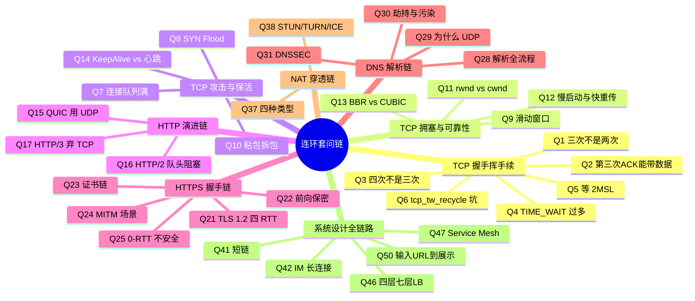

# 跨主题高频面试 Q&A

> **一句话定位**：面试前冲刺用，50+ 题速答串联各主题，附连环套问思维导图。
> **面试热度**：⭐⭐⭐⭐⭐
> **返回**：[网络知识图谱](../README.md)

---

## 使用说明

- 全部 52 题按主题分类，每题 3-5 句要点速答，末尾 **关联** 链接指向对应主题文档的详细推导。
- 连环追问题在题号后标注 🔗，配合文末「连环套问思维导图」把握面试官的追问路径。
- 建议先盖住答案自答，再对照要点查漏，最后跳转关联文档补全原理。

---

## 一、TCP 篇（15 题）

### Q1: 三次握手为什么不是两次？🔗

**答**：核心是防止历史重复连接浪费资源。若两次握手，旧 SYN 延迟到达服务端会直接建立无效连接，直到超时才释放。第三次 ACK 让服务端确认客户端「确实活着且想要这条连接」，同时同步双方的初始序列号。两次握手无法阻止旧连接劫持资源，也无法让服务端可靠确认客户端的接收能力。

**关联**：→ [TCP 连接管理 · 三次握手详图](./02-transport/tcp-connection.md#21-三次握手详图)

### Q2: 三次握手能不能携带数据？

**答**：前两次握手（SYN、SYN-ACK）原则上不携带数据，因为连接尚未建立，携带数据会放大 SYN Flood 攻击面。第三次 ACK 可以携带数据（RFC 793 允许），但实际工程中很少用，因为此时拥塞窗口 cwnd 仍是初始值，带不了多少数据。TLS 1.3 的 0-RTT 思路就是把应用数据「捎带」在握手报文里，本质是利用了第三次 ACK 可携数据的特性。

**关联**：→ [TCP 连接管理 · 三次握手详图](./02-transport/tcp-connection.md#21-三次握手详图)

### Q3: 四次挥手为什么是四次不是三次？🔗

**答**：TCP 是全双工的，关闭方向对方发 FIN 只表示「我不再发数据」，对方仍可继续发，因此需要反向再发一次 FIN，合计四次。当被动关闭方没有待发数据时，ACK 和 FIN 可以合并成三次（延迟 ACK 机制），所以工程上「四次挥手」也可能表现为三次。理解全双工独立关闭两个方向是回答此题的关键。

**关联**：→ [TCP 连接管理 · 四次挥手详图](./02-transport/tcp-connection.md#22-四次挥手详图)

### Q4: TIME_WAIT 过多是谁的锅？怎么解决？🔗

**答**：TIME_WAIT 出现在主动关闭连接的一方，所以「过多」通常说明本端频繁主动断开短连接（如 HTTP/1.1 短连接、RPC 重连）。解决方向：优先用长连接 + 连接池减少主动关闭；其次调大端口范围 `ip_local_port_range`；最后才考虑 `tcp_tw_reuse`（开启复用），切勿开 `tcp_tw_recycle`（已在 4.12 移除，且 NAT 环境会踩时间戳坑）。

**关联**：→ [TCP 高频追问 · TIME_WAIT 过多怎么办](./02-transport/tcp-high-frequency.md)

### Q5: 为什么 TIME_WAIT 要等 2MSL？🔗

**答**：两个原因：一是让本端发出的最后一个 ACK 有足够时间到达对端（若丢失，对端会重发 FIN，本端需能重发 ACK，一来一回最坏 2MSL）；二是让本次连接的旧报文在网络中自然消亡，防止复用同四元组时旧报文干扰新连接。MSL 是报文最大生存时间，2MSL 覆盖「最后 ACK 丢失 + 对端 FIN 重发」的最坏往返。

**关联**：→ [TCP 高频追问 · 2MSL 的来由](./02-transport/tcp-high-frequency.md#22-2msl-的来由)

### Q6: `tcp_tw_recycle` 为什么是坑？🔗

**答**：它开启后会基于 TCP 时间戳「复用」TIME_WAIT 连接，并启用 per-host 的 PAWS 检查：对同一对端 IP，若新连接的时间戳小于已记录值就丢弃。在 NAT 环境下，多个内网主机共享同一公网出口 IP，时间戳稍乱就会导致后建立的连接被静默丢弃，表现为「偶发连不上」。Linux 4.12 已彻底移除该选项，生产严禁使用。

**关联**：→ [TCP 高频追问 · TIME_WAIT 过多怎么办](./02-transport/tcp-high-frequency.md)

### Q7: 半连接队列和全连接队列满了会怎样？🔗

**答**：半连接队列（SYN Queue）满时，新的 SYN 会被丢弃，服务端不回 SYN-ACK，客户端重传；若开了 SYN Cookies 则绕过队列直接计算 Cookie 应答。全连接队列（Accept Queue）满时，新到的三次握手 ACK 会被丢弃（`tcp_abort_on_overflow=0`）或回 RST（`=1`），客户端表现为连接被拒或超时。排查用 `ss -lnt` 看 Recv-Q 与 Send-Q，用 `netstat -s` 看溢出统计。

**关联**：→ [TCP 连接管理 · 半连接队列与全连接队列](./02-transport/tcp-connection.md#25-半连接队列与全连接队列)

### Q8: SYN Flood 攻击怎么防？🔗

**答**：SYN Flood 利用半连接队列耗尽服务端资源。防御三件套：开启 SYN Cookies（队列满时用密码学 Cookie 直接验证，不存半连接）；调大 `tcp_max_syn_backlog` 与 `somaxconn`；配合防火墙做 SYN 代理或限速。根本上 SYN Cookies 让服务端不再为未完成握手的连接分配资源，是性价比最高的防线。

**关联**：→ [TCP 高频追问 · SYN Flood 与 SYN Cookies](./02-transport/tcp-high-frequency.md#26-syn-flood-与-syn-cookies半连接队列保护)

### Q9: TCP 为什么要用滑动窗口？

**答**：滑动窗口让发送方在未收到确认前连续发送多个报文，把「停等式」的逐包确认改为批量流水线发送，成倍提升吞吐。窗口左沿是已确认边界，右沿是可发送上限，右沿随 ACK 左移、随 rwnd 动态伸缩。窗口机制是 TCP 兼顾可靠性与高吞吐的核心：既保证字节按序确认，又允许网络管道被填满。

**关联**：→ [TCP 可靠性 · 滑动窗口](./02-transport/tcp-reliability.md#22-滑动窗口)

### Q10: 粘包拆包怎么产生？怎么解决？🔗

**答**：TCP 是字节流而非消息边界协议，应用层消息可能被合并发送（粘包）或拆成多段（拆包），这是正常现象而非 TCP 的 bug。解决靠应用层自定义边界：定长协议、特殊分隔符（如 `\n`）、长度前缀（最常用，TLV 头里写明后续 N 字节为一条消息）。Java 侧常用 Netty 的 `LengthFieldBasedFrameDecoder` 自动拆包。

**关联**：→ [TCP 可靠性 · 粘包拆包](./02-transport/tcp-reliability.md#24-粘包拆包)

### Q11: 滑动窗口和拥塞窗口有什么区别？

**答**：滑动窗口（rwnd）由接收方通过 ACK 通告，目的是流量控制——防止发太快把接收方缓冲区撑爆。拥塞窗口（cwnd）由发送方根据网络拥塞程度自维护，目的是拥塞控制——防止发太快把网络中间设备打拥塞。实际发送窗口 = min(rwnd, cwnd)，由两者中较小者决定，互为约束。

**关联**：→ [TCP 拥塞控制 · 拥塞控制 vs 流量控制](./02-transport/tcp-congestion.md#11-拥塞控制-vs-流量控制)

### Q12: 慢启动为什么叫"慢"？快重传为什么是 3 次重复 ACK？

**答**：慢启动「慢」是指起点小（cwnd 从 1 MSS 起步），而非增长慢——它实际是指数增长（每 RTT 翻倍），到 ssthresh 后转线性增长。快重传用「3 次重复 ACK」作为丢包信号，是因为 1-2 次重复 ACK 可能只是乱序，3 次大概率意味着真丢包；触发后不等超时直接重传，并把 cwnd 降为原来一半进入快恢复，避免重新慢启动。

**关联**：→ [TCP 拥塞控制 · 慢启动 / 快重传与快恢复](./02-transport/tcp-congestion.md#22-慢启动slow-start)

### Q13: BBR 和 CUBIC 本质区别？🔗

**答**：CUBIC 基于丢包做拥塞判断，靠不断探测丢包点来调整窗口，结果是把缓冲队列填满引发缓冲膨胀。BBR 不看丢包，而是测量瓶颈带宽 Bw 与最小 RTT，把 BDP（带宽×RTT）作为发送窗口，主动控制 inflight 不超过 BDP，从而既不排队也不浪费带宽。BBR 适合长肥管道与弱网，CUBIC 适合稳定有线网络。

**关联**：→ [TCP 拥塞控制 · BBR 算法](./02-transport/tcp-congestion.md#27-bbr-算法)

### Q14: TCP KeepAlive 和应用层心跳有什么区别？🔗

**答**：TCP KeepAlive 由内核实现，默认 `tcp_keepalive_time=7200s` 才发探测，且只检测连接是否存活，无法感知应用层是否僵死（如死锁、GC 暂停）。生产推荐应用层心跳（如 Netty IdleStateHandler）：间隔短（60s）、可区分读写空闲、可触发业务重连。两者不互斥，但应用层心跳才是存活检测的可靠手段。

**关联**：→ [TCP 高频追问 · KeepAlive 机制](./02-transport/tcp-high-frequency.md#24-keepalive-机制与为何应用层心跳更可靠)

### Q15: 为什么 DNS 用 UDP 而 QUIC 用 UDP？

**答**：DNS 用 UDP 是因为查询小、要求低延迟、一问一答适合无连接；只有响应超过 512 字节或区域传送才回退 TCP。QUIC 选 UDP 而非新 IP 协议号，是因为 UDP 在内核已广泛支持且不改动网络层，把可靠性、拥塞控制、多路复用、0-RTT 全放用户态实现，既能绕过 TCP 内核僵化（队头阻塞、握手慢），又能快速迭代部署。

**关联**：→ [UDP/QUIC 与 KCP · QUIC 详解](./02-transport/udp-quic.md#22-quic-详解)

---

## 二、HTTP/HTTPS 篇（12 题）

### Q16: HTTP/2 解决了 HTTP/1.1 的队头阻塞吗？彻底吗？🔗

**答**：HTTP/2 用二进制分帧 + 多路复用解决了应用层的队头阻塞——一个连接上多个流可并发，某流丢包不阻塞其他流。但 HTTP/2 跑在 TCP 上，TCP 层是严格有序的，一个包丢失会阻塞整个连接的所有流，这是「TCP 层队头阻塞」，HTTP/2 无法解决。HTTP/3 改用 QUIC（基于 UDP），每流独立重传，才彻底消除队头阻塞。

**关联**：→ [HTTP 协议全解 · HTTP/2 详解](./01-application/http.md#22-http2-详解)

### Q17: HTTP/3 为什么弃用 TCP 改用 UDP？🔗

**答**：TCP 的可靠性、握手、拥塞控制都锁死在内核且全局一份，难以演进；且 TCP 队头阻塞在多路复用场景下是硬伤。HTTP/3 改用 QUIC（UDP 之上）：0-RTT 握手、每流独立重传消除队头阻塞、连接迁移（用 Connection ID 而非四元组标识连接，切 WiFi 不断流）。代价是 UDP 在部分网络被限速，需做 UDP fallback 到 TCP。

**关联**：→ [HTTP 协议全解 · HTTP/3 详解](./01-application/http.md#23-http3-详解)

### Q18: 强缓存和协商缓存的优先级？304 怎么触发？

**答**：强缓存优先（`Cache-Control: max-age` / `Expires`），命中时浏览器直接用本地副本，不发请求、状态码 200（from disk/memory cache）。强缓存过期才走协商缓存：带 `If-Modified-Since` / `If-None-Match` 去问服务端，未变则回 `304 Not Modified`，浏览器继续用本地副本；变了回 `200` + 新内容与新缓存标识。

**关联**：→ [HTTP 协议全解 · 缓存机制](./01-application/http.md#26-缓存机制)

### Q19: GET 和 POST 的本质区别？POST 一定不幂等吗？

**答**：本质区别在语义：GET 用于「获取」幂等且安全（不应有副作用），POST 用于「提交」非幂等且可改变服务端状态。但幂等是语义约定非协议强制——POST 也可以设计成幂等（如用业务幂等键去重），GET 也可能被误用成有副作用。面试要点：遵守语义与幂等设计，GET 参数放 URL 有长度/安全限制，POST 放 body 更灵活。

**关联**：→ [HTTP 协议全解 · 方法语义](./01-application/http.md#12-方法语义)

### Q20: Cookie/Session/Token/JWT 四者区别？🔗

**答**：Cookie 是浏览器存储机制（键值对，随请求自动带，有域/路径/Secure 等属性）；Session 是服务端状态，用 Cookie 里的 SessionID 关联；Token 是无状态凭证（服务端不存，靠签名验证），适合分布式；JWT 是 Token 的标准格式（Header.Payload.Signature），可自包含用户信息但体积大且无法主动失效。选型：单体用 Session，分布式/移动端用 Token，跨域用 JWT。

**关联**：→ [HTTP 协议全解 · Cookie/Session/Token/JWT 对比](./01-application/http.md)

### Q21: TLS 1.2 为什么 4 个 RTT？TLS 1.3 怎么优化到 1-RTT？🔗

**答**：TLS 1.2 全握手 = TCP 1 RTT + TLS 2 RTT（ServerHello/Cert/ServerHelloDone + ClientKeyExchange/Finished）共 3 RTT 才能发数据；含 TCP 握手时首数据要 3 RTT（常被说成 4 RTT 含其它开销）。TLS 1.3 砍掉 RSA 密钥交换、合并握手消息，1 RTT 完成握手，配合 PSK 可 0-RTT 立刻发数据。核心是只保留前向保密的 ephemeral 密钥交换。

**关联**：→ [HTTPS 与 TLS · TLS 1.2 全握手流程](./01-application/https-tls.md#21-tls-12-全握手流程)

### Q22: 前向保密是什么？没有它会有什么后果？

**答**：前向保密指「即使长期私钥泄露，历史会话密钥也不被破解」——因为每个会话用一次性 ephemeral 密钥对协商，会话结束即丢弃。没有前向保密（如 TLS 1.2 的 RSA 交换）：私钥一旦泄露，攻击者可解密此前录制的全部流量。TLS 1.3 强制只用 ECDHE/DHE 实现前向保密，移除静态 RSA 密钥交换。

**关联**：→ [HTTPS 与 TLS · 密钥交换算法](./01-application/https-tls.md#26-密钥交换算法)

### Q23: 证书链怎么验证？根 CA 从哪来？

**答**：服务端发证书链（叶子证书 → 中间 CA → 可能多级），客户端用上一级证书的公钥验下一级的签名，逐级验到根。根 CA 是自签名且预置在操作系统/浏览器信任库（由厂商维护），不在传输中下发。验证内容含：签名链、有效期、域名匹配（SAN/CN）、用途扩展、吊销状态（CRL/OCSP）。

**关联**：→ [HTTPS 与 TLS · 证书链验证](./01-application/https-tls.md#24-证书链验证)

### Q24: HTTPS 会被中间人攻击吗？什么情况下会？

**答**：正常 HTTPS 因证书链 + 域名匹配，中间人无法伪造合法证书，无法解密。能被 MITM 的场景：客户端信任了非法根证书（如抓包工具 Charles 的根证书）、证书被恶意签发（CA 被攻破或域验证被劫持）、用户忽略证书告警、私钥泄露。企业内网常靠自部署根证书做流量解密（SSL 拦截），本质就是受控的 MITM。

**关联**：→ [HTTPS 与 TLS · 常见攻击与防御](./01-application/https-tls.md#28-常见攻击与防御)

### Q25: 0-RTT 为什么不安全？生产能用吗？

**答**：0-RTT 靠 PSK（前次会话的预共享密钥）让客户端在第一个报文就携带应用数据，省一个 RTT。风险在于 0-RTT 数据是可重放的——攻击者录下后重放，会触发服务端重复执行（如重复扣款）。因此生产可用但仅限幂等操作（GET/查询），且服务端需做 anti-replay（单次令牌/时间窗去重）；非幂等写操作禁用 0-RTT。

**关联**：→ [HTTPS 与 TLS · TLS 1.3 简化握手](./01-application/https-tls.md#22-tls-13-简化握手)

### Q26: CORS 预检请求什么时候触发？怎么减少？

**答**：非简单请求（方法非 GET/POST/HEAD，或含自定义头、`Content-Type` 非表单三件套）会先发 OPTIONS 预检。预检结果可被 `Access-Control-Max-Age` 缓存（默认数分钟到几小时），同源后续请求不再预检。减少预检：尽量用简单请求、避免自定义头、把跨域写操作改成同域 + 反代、合理设置 Max-Age。

**关联**：→ [HTTP 协议全解 · 方法语义](./01-application/http.md#12-方法语义)

### Q27: WebSocket 和 HTTP/2 Server Push 有什么区别？

**答**：WebSocket 是全双工长连接，客户端和服务端可随时互发，适合实时推送（IM/弹幕）。HTTP/2 Server Push 是服务端在客户端请求 A 时主动推送相关资源 B（如请求 HTML 时推 CSS），但仍是请求-响应模型，且 Push 的资源仍受 HTTP/2 流约束，无法做任意时刻服务端主动通知。二者目标不同：Push 优化资源加载，WebSocket 做双向实时通信。

**关联**：→ [其他应用层协议 · WebSocket 握手升级](./01-application/application-protocols.md#21-websocket-握手升级)

---

## 三、DNS 篇（5 题）

### Q28: 浏览器输入 URL 到页面显示，DNS 经历了哪些步骤？🔗

**答**：浏览器 DNS 缓存 → OS 缓存（hosts 文件）→ 本地配置的递归解析器（运营商/公共 DNS）。递归解析器依次问根（返回 TLD 服务器）→ TLD（如 .com，返回权威服务器）→ 权威服务器（返回最终 A 记录），逐级缓存。拿到 IP 后浏览器建 TCP 连接进入 HTTP 流程。整条链路靠多层缓存与 TTL 控制延迟与一致性。

**关联**：→ [DNS 域名解析 · 解析全流程](./01-application/dns.md#21-解析全流程)

### Q29: 为什么 DNS 用 UDP？什么时候用 TCP？🔗

**答**：DNS 查询小（通常 < 512 字节）、一问一答、要求低延迟，UDP 最合适。回退 TCP 的场景：响应超过 512 字节（DNSSEC 引入 RRSIG 后常见）走 TCP 重新查；区域传送（主从同步）数据量大用 TCP；DoH/DoT 本质上也是 TCP（HTTPS/TLS 之上）。所以「DNS 用 UDP」是指常规查询，大响应与同步走 TCP。

**关联**：→ [DNS 域名解析 · 解析全流程](./01-application/dns.md#21-解析全流程)

### Q30: DNS 劫持和污染的区别？HTTPDNS 怎么解决？🔗

**答**：DNS 劫持是解析器（运营商/路由器）返回伪造 IP，发生在「递归解析」环节；DNS 污染（投毒）是中间设备在权威响应到达前抢先注入伪造应答，发生在「传输途中」。两者都把用户引到假 IP。HTTPDNS 绕过 53 端口的 UDP DNS，改为直接向可信服务发 HTTPS 请求获取解析结果，加密 + 直连消除劫持与污染，移动端 SDK 常用。

**关联**：→ [DNS 域名解析 · DNS 劫持与污染](./01-application/dns.md#25-dns-劫持与污染)

### Q31: DNSSEC 的原理？为什么普及率不高？

**答**：DNSSEC 对每条资源记录用私钥签名（RRSIG），解析器用权威公钥逐级验签，保证「数据来源真实且未被篡改」，但它不加密内容。普及低的原因：部署复杂（需全链路各级域名都签名）、只解决真实性不解决机密性（仍可被监听域名）、密钥轮转运维成本高。配合 DoH/DoT 才能既保真又保密。

**关联**：→ [DNS 域名解析 · DNSSEC](./01-application/dns.md#24-dnssec)

### Q32: CNAME 和 A 记录的区别？为什么根域不能设 CNAME？

**答**：A 记录直接把域名映射到 IPv4 地址（根域也可设 A）；CNAME 把一个域名别名指向另一个域名（常用于指向 CDN/WAF）。根域不能设 CNAME，是因为 RFC 规定根域必须同时承载 SOA 与 NS 记录，而 CNAME 要求记录名独占，二者冲突会破坏解析。RFC 1034 的「CNAME 与其它记录类型互斥」规则使裸域只能用 A 或 ALIAS/ANAME 等扩展方案。

**关联**：→ [DNS 域名解析 · 资源记录类型](./01-application/dns.md#14-资源记录类型)

---

## 四、IP/NAT 篇（8 题）

### Q33: `192.168.1.0/24` 能容纳多少主机？怎么算？

**答**：/24 表示前 24 位为网络位，后 8 位为主机位。主机位 8 位有 2^8=256 个地址，减去全 0（网络号）和全 1（广播地址）两个不可分配，可用主机数 = 256 − 2 = 254 个。通用公式：可用主机数 = 2^(32−前缀) − 2。所以 /30 有 2 个可用（点对点链路常用），/16 有 65534 个。

**关联**：→ [IP 协议 · 子网掩码与 CIDR](./03-network/ip.md#21-子网掩码与-cidr)

### Q34: 为什么需要 IPv6？IPv4 耗尽后怎么过渡？🔗

**答**：IPv4 地址约 43 亿早已耗尽，IPv4 头部定长、无安全选项也限制演进。IPv6 地址 128 位（几乎取之不尽）、首部简化、内置 IPSec、无广播改用组播、自动配置（SLAAC）。过渡靠双栈（同时跑 v4/v6）、隧道（6to4/6rd 在 v4 网络上跑 v6）、翻译（NAT64/DNS64 让 v6 主机访问 v4 服务）。生产以双栈 + NAT64 为主。

**关联**：→ [IP 协议 · IPv6](./03-network/ip.md#22-ipv6)

### Q35: IP 分片在什么情况下发生？为什么有风险？

**答**：当 IP 报文长度超过下一跳链路的 MTU（以太网通常 1500）且 DF 标志未置位时，路由器会分片，目的端重组。风险：分片任一片丢失则整个报文重传（应用层看不到分片）；分片可被用于绕过防火墙/IDS（重叠分片攻击）；首片才带传输层端口，后续分片易被错误放行。现代靠 PMTUD 与 DF 置位 + MSS 协商避免分片。

**关联**：→ [IP 协议 · 分片与重组](./03-network/ip.md#23-分片与重组)

### Q36: TTL 怎么防止路由环路？

**答**：IP 头部的 TTL 字段每经过一台路由器减 1，减到 0 时丢弃并回 ICMP Time Exceeded。这保证即使路由表环路导致报文无限绕圈，也会因 TTL 耗尽被丢弃，不会永久占用带宽。Traceroute 正是利用 TTL 递增触发沿途路由器回 ICMP 超时报文来绘制路径。

**关联**：→ [路由与 ICMP · Traceroute 原理](./03-network/routing.md)

### Q37: NAT 四种类型的区别？哪种最难穿透？🔗

**答**：按 RFC 3489 分四类：Full Cone（最宽松，同一映射任意外部可入）、Restricted Cone（仅限联系过的源 IP）、Port Restricted Cone（再限源端口）、Symmetric（每个目标分配不同端口，最严格）。Symmetric NAT 因为端口随目标变，打洞时对端拿到的映射端口不可预测，几乎无法 P2P 穿透，只能回退 TURN 中继。

**关联**：→ [NAT 与内网穿透 · NAT 四种类型](./03-network/nat.md#21-nat-四种类型rfc-3489-经典分类)

### Q38: STUN 和 TURN 的区别？ICE 是什么？

**答**：STUN 是让内网主机通过公网 STUN 服务器发现自己的 NAT 映射公网地址（打洞前提）。TURN 是中继：当打洞失败（Symmetric NAT）时由 TURN 服务器转发流量，代价是带宽与延迟。ICE 是一套组合框架：先试直连，再用 STUN 探测打洞，最后才退到 TURN 中继，自动选择最优路径。WebRTC 的连通性就是靠 ICE。

**关联**：→ [NAT 与内网穿透 · 内网穿透方案](./03-network/nat.md#23-内网穿透方案)

### Q39: Traceroute 怎么工作？为什么用 UDP/ICMP？

**答**：发送 TTL=1,2,3… 递增的探测包，沿途第 N 跳路由器因 TTL 减到 0 回 ICMP Time Exceeded，由此逐跳记录路径，直到目标回端口不可达/回显应答。默认用 UDP 高端口（Linux）或 ICMP（Windows ping 模式），UDP 模式可区分中间设备与目标；TCP 模式（`-T`）可绕过 ICMP 被限速的防火墙。多协议是为了适应不同网络策略。

**关联**：→ [路由与 ICMP · Traceroute 原理](./03-network/routing.md)

### Q40: OSPF 和 BGP 区别？分别用在什么场景？

**答**：OSPF 是链路状态协议，区域内泛洪 LSA 算最短路，收敛快，适合企业/机房内部（IGP）。BGP 是路径矢量协议，AS 间交换路由，策略优先于最短路径、收敛慢但可控，是互联网骨干互联（EGP）。一句话：OSPF 管「一个组织内怎么走最快」，BGP 管「自治系统之间按策略怎么走」。

**关联**：→ [路由与 ICMP · OSPF / BGP](./03-network/routing.md#21-ospf链路状态协议)

---

## 五、系统设计篇（10 题）

### Q41: 设计短链系统怎么选发号策略？🔗

**答**：短链把长 URL 映射成 6-7 位短码，发号策略有：自增 ID + Base62 编码（短、有序、可推测，需分布式 ID 如 Snowflake）、MD5/SHA 取后 6 位（无序不可推测但可能冲突需兜底）。容量估算：6 位 Base62 = 62^6 ≈ 568 亿，足够。存储用 KV（Redis 缓存 + MySQL 持久化），跳转用 301（可缓存）或 302（可统计）。

**关联**：→ [经典网络架构案例 · 短链系统](./05-system-design/classic-cases.md#案例-1短链系统)

### Q42: IM 消息推送为什么用长连接？怎么做消息可靠投递？🔗

**答**：IM 用 TCP/WebSocket 长连接避免 HTTP 反复建连开销，且支持服务端实时主动推送。可靠投递三要素：客户端消息 ID 去重防重复、服务端落库后回 ACK 才算成功、未 ACK 触发重传；离线消息存消息队列/DB，上线后按时间戳或序号拉取补齐。百万连接靠 Netty + epoll + 调小 buffer + 心跳保活撑住单机连接数。

**关联**：→ [经典网络架构案例 · IM 消息推送系统](./05-system-design/classic-cases.md#案例-2im-消息推送系统)

### Q43: 弹幕系统为什么适合用 WebSocket？

**答**：弹幕是高频、单向（服务端→客户端）、低延迟推送，WebSocket 全双工长连接让服务端主动推，避免轮询浪费。海量并发靠消息广播扇出优化：按房间分片、用 Redis Pub/Sub 或 Kafka 做消息总线，网关只做转发不落库。峰值削峰用 MQ 削峰 + 客户端限速渲染，保证体验不卡顿。

**关联**：→ [经典网络架构案例 · 弹幕系统](./05-system-design/classic-cases.md#案例-3弹幕系统)

### Q44: 大文件分片上传怎么实现断点续传？

**答**：客户端把文件按固定大小（如 5MB）切片，每片独立上传并带分片序号与文件唯一标识（如 MD5）。服务端按序号暂存分片，记录已传分片集合；中断后续传时客户端先查询已传分片清单，只补传缺失片。全部传完触发合并，合并后校验整体 MD5 一致才算成功。秒传是优化：整体 MD5 命中已存在文件直接返回地址。

**关联**：→ [经典网络架构案例 · 大文件分片上传](./05-system-design/classic-cases.md#案例-4大文件分片上传断点续传)

### Q45: 接口限流有哪些算法？怎么选？

**答**：计数器（固定窗口，简单但有临界突刺）、滑动窗口（解决临界突刺）、漏桶（匀速出水，平滑但无法应对突发）、令牌桶（按速率发牌，允许一定突发，最常用）。分布式场景用 Redis + Lua 保证原子性，或 Sentinel/Hystrix 做单机 + 集群双层限流。选型要点：是否允许突发、精度要求、是否需分布式一致。

**关联**：→ [经典网络架构案例 · 接口限流](./05-system-design/classic-cases.md#案例-5接口限流)

### Q46: 负载均衡四层和七层有什么区别？🔗

**答**：四层（L4）按 IP+端口转发，代表 LVS/硬件，性能高、不解析报文，适合网关入口大流量。七层（L7）解析 HTTP 头/URL/Cookie 按内容路由，代表 Nginx/网关，能做按域名分流、灰度、改写，更灵活但开销大。生产典型组合：LVS（四层）→ Nginx（七层）→ 应用，四层扛量、七层做策略。

**关联**：→ [经典网络架构案例 · 负载均衡](./05-system-design/classic-cases.md#案例-6负载均衡)

### Q47: Service Mesh 和 K8s Service 有什么区别？🔗

**答**：K8s Service 是基础设施级服务发现 + 四层负载（kube-proxy iptables/IPVS），基于 DNS + ClusterIP，不感知应用协议。Service Mesh（Istio）在 Pod 旁挂 sidecar 代理，做七层流量治理：熔断、重试、超时、金丝雀、mTLS、可观测，业务无感。二者互补：K8s Service 解决「找到服务」，Mesh 解决「如何治理流量」。

**关联**：→ [云原生网络 · Service Mesh 与 Istio 架构](./05-system-design/cloud-native.md#22-service-mesh-与-istio-架构)

### Q48: kube-proxy iptables 模式为什么在大规模性能差？IPVS 好在哪？

**答**：iptables 模式为每个 Service 生成随机匹配规则，匹配复杂度 O(n)，规则数随 Service 线性增长，万级 Service 时内核转发延迟显著。IPVS 基于哈希表，查找 O(1)，支持更多负载算法（rr/wlc/sh），大规模集群下性能与可扩展性远优于 iptables。所以大集群必换 `mode: ipvs`。

**关联**：→ [云原生网络 · kube-proxy](./05-system-design/cloud-native.md#24-serviceendpoint-与-kube-proxy)

### Q49: eBPF 怎么加速网络？Cilium 为什么能替代 kube-proxy？

**答**：eBPF 在内核可编程运行字节码，把 kube-proxy 的 iptables 规则替换为内核态哈希查表 + 直接转发，跳过 iptables 那套规则遍历，延迟低且不随规则数增长。Cilium 用 eBPF 实现 Service 负载均衡、NetworkPolicy、可观测，全部在内核数据包路径上完成，无需 sidecar，是 kube-proxy 的高性能替代。

**关联**：→ [云原生网络 · eBPF 在网络中的应用](./05-system-design/cloud-native.md#26-ebpf-在网络中的应用)

### Q50: 从浏览器输入 URL 到页面展示，全链路经历了什么？（汇总题）🔗

**答**：DNS 解析（缓存→递归→权威）拿到 IP → TCP 三次握手建连 → TLS 握手（HTTPS）→ HTTP 请求/响应（可能经 CDN、LB、网关）→ 服务端处理返回 HTML → 浏览器解析 DOM/CSS、按需请求静态资源（强缓存/协商缓存）→ 渲染树绘制。每一步都可能成为性能瓶颈，系统设计的全局视角即贯穿此链路。

**关联**：→ [HTTP 协议全解 · HTTP 报文结构](./01-application/http.md#11-http-报文结构)

---

## 六、跨层补遗（2 题）

> 以下两题横跨链路层与应用层，虽不在五大主篇，但属高频追问，故单列补遗。

### Q51: ARP 怎么工作？能不能跨网段？

**答**：ARP 在同网段内广播「谁的 IP 是 X？请把 MAC 告诉我」，目标单播回 MAC，建立 IP→MAC 映射缓存。ARP 不能跨网段，因为广播包被路由器隔离；跨网段通信时，主机查路由表把包发给「网关」，ARP 解析的是网关的 MAC 而非最终目标。这也是 ARP 欺骗只能在同网段生效的原因。

**关联**：→ [以太网与 ARP · ARP 工作原理](./04-link/ethernet.md#21-arp-工作原理)

### Q52: CDN 回源策略有哪些？动态加速怎么做？

**答**：CDN 边缘节点缓存未命中时回源站取内容，回源策略含：过期回源（TTL 到期）、强制回源（`Cache-Control: no-cache`）、对比回源（带 If-Modified-Since 协商）。静态内容靠就近缓存 + 预热；动态内容（API/动态页面）靠「动态加速」——选最优回源路径、TCP 连接复用、边缘到源站走专线/anycast，减少 RTT 与握手开销。

**关联**：→ [其他应用层协议 · CDN 原理](./01-application/application-protocols.md#24-cdn-原理)

---

## 七、连环套问思维导图

下图标注了哪些题目构成面试官的「连环追问链」——答完一题后大概率被顺着追问下一环。带 🔗 标记的题即处于某条追问链中。

---

## 八、自测清单

阅读完本文后，尝试不查文档回答以下「一锤定音」要点，答不上则跳转关联文档补课：

- [ ] 三次握手防止的是哪种连接？为什么两次不行？
- [ ] TIME_WAIT 出现在哪一端？等 2MSL 的两个原因？
- [ ] `tcp_tw_recycle` 在 NAT 下为什么坑？哪个版本被移除？
- [ ] 滑动窗口与拥塞窗口的区别？发送窗口由谁决定？
- [ ] HTTP/2 解决了哪种队头阻塞？没解决哪种？HTTP/3 怎么解？
- [ ] 前向保密丢了什么密钥也不怕？TLS 1.3 为什么移除 RSA 交换？
- [ ] DNS 用 UDP、区域传送用什么？HTTPDNS 解决的是劫持还是污染？
- [ ] Symmetric NAT 为什么打不了洞？回退方案是哪个？
- [ ] L4 与 L7 负载均衡区别？生产为什么 L4→L7 组合？
- [ ] kube-proxy 为什么换 IPVS？Cilium 凭什么替代 kube-proxy？

> **返回**：[网络知识图谱](../README.md)
