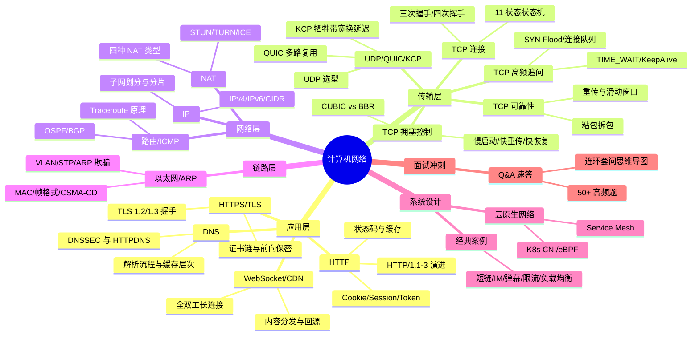

# network — 计算机网络面试知识体系

## 一、模块简介

本模块按 OSI / TCP-IP 分层组织 **17 份**计算机网络面试知识文档，覆盖从链路层到应用层、再到系统设计与面试冲刺的完整知识图谱。

- **适用对象**：Java 后端面试（初中级到高级），兼顾云原生与服务端架构方向
- **组织方式**：5 个分层目录 + 1 个跨主题 Q&A 文件，每份主题文档遵循「概念定义 → 原理与流程 → 高频追问 → 实战关联 → 系统设计案例」五段式结构
- **导航约定**：每份文档顶部含 `> 返回 [网络知识图谱](../README.md)` 链接，本文档为统一入口

---

## 二、知识图谱



---

## 三、导航表

| 分层 | 文档 | 核心考点 |
|------|------|---------|
| 应用层 | [HTTP](./01-application/http.md) | HTTP/1.1-3 演进、状态码、缓存、Cookie/Session/Token |
| 应用层 | [HTTPS/TLS](./01-application/https-tls.md) | TLS 1.2/1.3 握手、证书链、前向保密 |
| 应用层 | [DNS](./01-application/dns.md) | 解析流程、缓存层次、DNSSEC、HTTPDNS |
| 应用层 | [其他协议](./01-application/application-protocols.md) | WebSocket、CDN、FTP/SMTP |
| 传输层 | [TCP 连接](./02-transport/tcp-connection.md) | 三次握手/四次挥手/状态机 |
| 传输层 | [TCP 可靠性](./02-transport/tcp-reliability.md) | 重传、滑动窗口、粘包拆包 |
| 传输层 | [TCP 拥塞控制](./02-transport/tcp-congestion.md) | 慢启动/快重传/CUBIC/BBR |
| 传输层 | [TCP 高频追问](./02-transport/tcp-high-frequency.md) | TIME_WAIT/KeepAlive/SYN Flood |
| 传输层 | [UDP/QUIC](./02-transport/udp-quic.md) | UDP、QUIC、KCP、选型决策 |
| 网络层 | [IP](./03-network/ip.md) | IPv4/IPv6、CIDR、子网、DHCP |
| 网络层 | [NAT](./03-network/nat.md) | NAT 类型、NAPT、穿透方案 |
| 网络层 | [路由/ICMP](./03-network/routing.md) | OSPF、BGP、ICMP、Traceroute |
| 链路层 | [以太网/ARP](./04-link/ethernet.md) | ARP、VLAN、STP |
| 系统设计 | [经典案例](./05-system-design/classic-cases.md) | 短链/IM/弹幕/限流/负载均衡 |
| 系统设计 | [云原生](./05-system-design/cloud-native.md) | Service Mesh、K8s CNI、eBPF |
| 面试冲刺 | [Q&A 速答](./06-interview-qa.md) | 50+ 高频题速答 |

> 共 **17 份**文档：入口 README（本文档）+ 上表 16 份主题/汇总文档。

---

## 四、推荐学习路径

### 路线一：自顶向下（系统学习，适合有 1-2 周准备期）

按 TCP-IP 分层从应用层向下深入，先建立全貌再下沉到细节：

```
HTTP → HTTPS/TLS → DNS → 其他应用层协议
   → TCP 连接 → TCP 可靠性 → TCP 拥塞控制 → TCP 高频追问 → UDP/QUIC
   → IP → NAT → 路由/ICMP
   → 以太网/ARP
   → 经典案例 → 云原生网络
   → Q&A 速答（查漏补缺）
```

**特点**：先见森林后见树木，符合协议栈真实调用顺序，适合建立完整体系。

### 路线二：面试冲刺（高频优先，适合 3-5 天突击）

按面试热度排序，先啃必考点，再补体系：

1. **必考三件套**：[TCP 连接](./02-transport/tcp-connection.md) → [TCP 可靠性](./02-transport/tcp-reliability.md) → [HTTP](./01-application/http.md)
2. **高频追问**：[TCP 高频追问](./02-transport/tcp-high-frequency.md) → [HTTPS/TLS](./01-application/https-tls.md) → [TCP 拥塞控制](./02-transport/tcp-congestion.md)
3. **基础与选型**：[DNS](./01-application/dns.md) → [UDP/QUIC](./02-transport/udp-quic.md) → [IP](./03-network/ip.md) → [NAT](./03-network/nat.md)
4. **系统设计**：[经典案例](./05-system-design/classic-cases.md) → [云原生](./05-system-design/cloud-native.md)
5. **考前速过**：[Q&A 速答](./06-interview-qa.md)（50+ 题，含连环套问思维导图）

**特点**：投入产出比最高，覆盖 80% 高频考点。

> 两套路线殊途同归，最终都应回到 [Q&A 速答](./06-interview-qa.md) 做闭环检验。

---

## 五、与 java-core / framework 模块的关联

本模块虽为运维文档，但与仓库内 Java 模块存在直接关联，便于在面试中结合源码与实战作答：

| 本模块知识点 | 关联 Java 模块 | 关联要点 |
|-------------|---------------|---------|
| TCP 连接 / 粘包拆包 / NIO | `java-core/proxy`、`java-core/reflect` | 动态代理与反射常配合 Socket 做 RPC |
| TCP / UDP 实战 | `java-core/rmi`（api/provider/consumer） | RMI 基于 TCP 长连接，可对照序列化与 Stub |
| Socket / 服务发现 | `java-core/service-provider-framework` | SPI 与服务发现机制是微服务通信基础 |
| Netty / 自定义协议 | `java-core/lambda`、`java-core/stream` | Netty Pipeline 用函数式编排 Handler |
| 序列化 / 缓存 / REST | `framework/jackson`、`framework/spring-framework` | Jackson 自定义序列化、Spring 注解驱动 REST |
| 参数校验 / 幂等 | `framework/valid` | Hibernate Validator 自定义校验器配合 API 网关 |
| 注解驱动 / AOP | `java-core/annotation`、`java-core/apt` | 注解 + APT 在 RPC 框架与限流组件的应用 |
| JVM 调优 / 性能 | `java-core/jvm` | 高并发网络服务的 JVM 层调优（GC 与直接内存） |
| Fork/Join / 并行 | `java-core/forkjoin` | 大规模网络 IO 与计算混合场景 |

**延伸阅读**：

- `java-core/rmi` —— 对照理解 Java 原生 RPC 的 Socket 与序列化实现
- `framework/spring-framework` —— REST 接口、WebSocket、注解驱动配置
- `framework/jackson` —— HTTP/HTTPS 报文体的 JSON 序列化
- `framework/valid` —— API 参数校验与幂等设计

> 建议在阅读传输层与系统设计文档时，对照 `java-core`/`framework` 模块的源码实例，加深「面试八股 → 工程实战」的双向映射。
